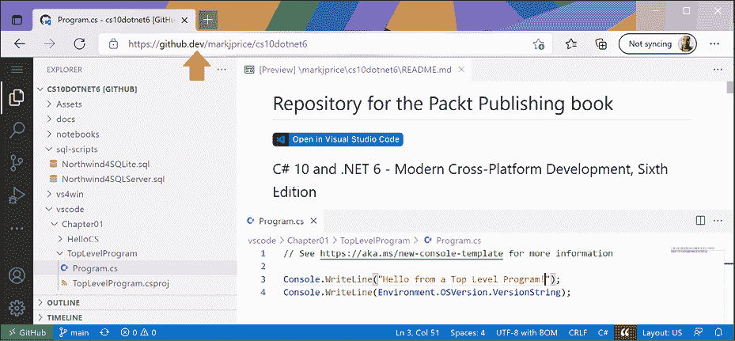
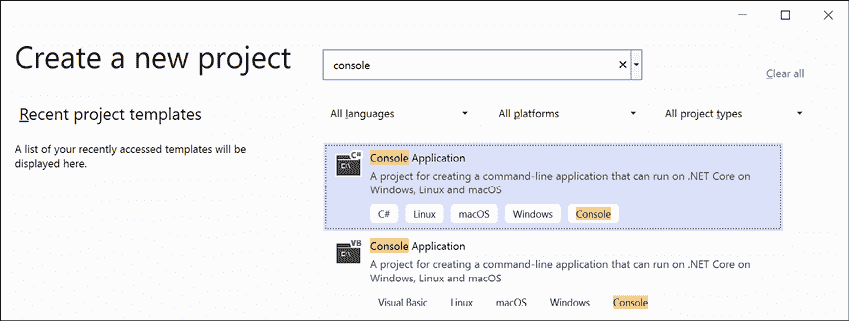
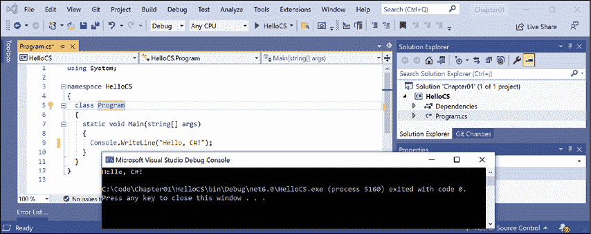
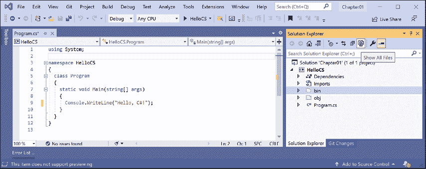
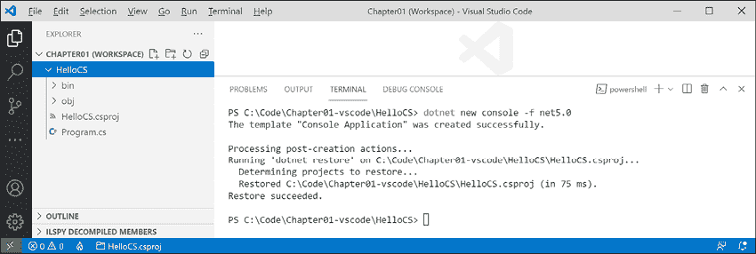
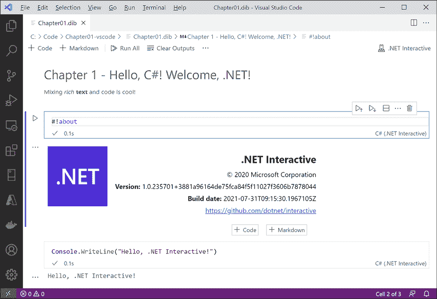
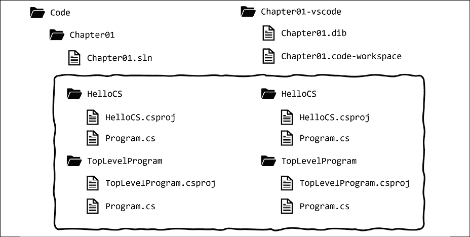

# 第一章：你好，C#！欢迎，.NET！

在本章中，目标包括设置开发环境，理解现代.NET、.NET Core、.NET Framework、Mono、Xamarin 和.NET Standard 之间的异同，使用 C# 10 和.NET 6 以及各种代码编辑器创建最简单的应用程序，然后找到寻求帮助的好地方。

本书的 GitHub 仓库提供了所有代码任务的完整应用程序项目解决方案，并在可能的情况下提供笔记本：

[`github.com/markjprice/cs10dotnet6`](https://github.com/markjprice/cs10dotnet6)

只需按下.（点）键或在上述链接中将`.com`更改为`.dev`，即可将 GitHub 仓库转换为使用 Visual Studio Code for the Web 的实时编辑器，如*图 1.1*所示：



*图 1.1：* Visual Studio Code for the Web 正在实时编辑本书的 GitHub 仓库

这非常适合在你阅读本书并完成编程任务时与你的首选代码编辑器并行使用。你可以将自己的代码与解决方案代码进行比较，并在需要时轻松复制和粘贴部分代码。

本书中，我使用术语**现代.NET**来指代.NET 6 及其前身，如.NET 5 等源自.NET Core 的版本。而术语**传统.NET**则用来指代.NET Framework、Mono、Xamarin 和.NET Standard。现代.NET 是对这些传统平台和标准的统一。

本章之后，本书可分为三个部分：首先是 C#语言的语法和词汇；其次是.NET 中用于构建应用特性的类型；最后是使用 C#和.NET 构建的常见跨平台应用示例。

大多数人通过模仿和重复来最好地学习复杂主题，而不是通过阅读详细的理论解释；因此，本书不会用每一步的详细解释来让你负担过重。目的是让你动手编写代码并看到运行结果。

你不需要立即了解所有细节。随着你构建自己的应用程序并超越任何书籍所能教授的内容，这些知识将会逐渐积累。

正如 1755 年编写英语词典的塞缪尔·约翰逊所言，我已犯下“一些野蛮的错误和可笑的荒谬，任何如此繁多的作品都无法免俗。”我对此负全责，并希望你能欣赏我试图通过撰写关于 C#和.NET 等快速发展的技术以及使用它们构建的应用程序的书籍来挑战风车的尝试。

本章涵盖以下主题：

+   设置开发环境

+   理解.NET

+   使用 Visual Studio 2022 构建控制台应用程序

+   使用 Visual Studio Code 构建控制台应用程序

+   使用.NET 交互式笔记本探索代码

+   审查项目文件夹和文件

+   充分利用本书的 GitHub 仓库

+   寻求帮助

# 设置你的开发环境

在你开始编程之前，你需要一个 C#代码编辑器。微软有一系列代码编辑器和**集成开发环境**（**IDEs**），其中包括：

+   Visual Studio 2022 for Windows

+   Visual Studio 2022 for Mac

+   Visual Studio Code for Windows, Mac, or Linux

+   GitHub Codespaces

第三方已经创建了自己的 C#代码编辑器，例如，JetBrains Rider。

## 选择适合学习的工具和应用程序类型

学习 C#和.NET 的最佳工具和应用程序类型是什么？

在学习时，最好的工具是帮助你编写代码和配置但不隐藏实际发生的事情的工具。IDE 提供了友好的图形用户界面，但它们在背后为你做了什么？一个更基础的代码编辑器，在提供帮助编写代码的同时更接近操作，在你学习时更为合适。

话虽如此，你可以认为最好的工具是你已经熟悉的工具，或者是你或你的团队将作为日常开发工具使用的工具。因此，我希望你能够自由选择任何 C#代码编辑器或 IDE 来完成本书中的编码任务，包括 Visual Studio Code、Windows 的 Visual Studio、Mac 的 Visual Studio，甚至是 JetBrains Rider。

在本书第三版中，我为所有编码任务提供了针对 Windows 的 Visual Studio 和适用于所有平台的 Visual Studio Code 的详细分步指导。不幸的是，这很快就变得杂乱无章。在第六版中，我仅在*第一章*中提供了关于如何在 Windows 的 Visual Studio 2022 和 Visual Studio Code 中创建多个项目的详细分步指导。之后，我会给出项目名称和适用于所有工具的一般指导，以便你可以使用你偏好的任何工具。

学习 C#语言结构和许多.NET 库的最佳应用程序类型是不被不必要的应用程序代码分散注意力的类型。例如，没有必要为了学习如何编写一个`switch`语句而创建一个完整的 Windows 桌面应用程序或网站。

因此，我相信学习*第一章*到*第十二章*中 C#和.NET 主题的最佳方法是构建控制台应用程序。然后，从*第十三章*到*第十九章*开始，你将构建网站、服务以及图形桌面和移动应用。

### .NET Interactive Notebooks 扩展的优缺点

Visual Studio Code 的另一个好处是.NET Interactive Notebooks 扩展。这个扩展提供了一个简单且安全的地方来编写简单的代码片段。它允许你创建一个单一的笔记本文件，其中混合了 Markdown（格式丰富的文本）和使用 C#及其他相关语言（如 PowerShell、F#和 SQL（用于数据库））的代码“单元格”。

然而，.NET Interactive Notebooks 确实有一些限制：

+   它们无法从用户那里读取输入，例如，你不能使用`ReadLine`或`ReadKey`。

+   它们不能接受参数传递。

+   它们不允许你定义自己的命名空间。

+   它们没有任何调试工具（但未来将会提供）。

### 使用 Visual Studio Code 进行跨平台开发

最现代且轻量级的代码编辑器选择，也是微软唯一一款跨平台的编辑器，是 Microsoft Visual Studio Code。它可以在所有常见的操作系统上运行，包括 Windows、macOS 以及多种 Linux 发行版，如 Red Hat Enterprise Linux（RHEL）和 Ubuntu。

Visual Studio Code 是现代跨平台开发的不错选择，因为它拥有一个庞大且不断增长的扩展集合，支持多种语言，而不仅仅是 C#。

由于其跨平台和轻量级的特性，它可以安装在所有你的应用将要部署到的平台上，以便快速修复错误等。选择 Visual Studio Code 意味着开发者可以使用一个跨平台的代码编辑器来开发跨平台的应用。

Visual Studio Code 对 Web 开发有强大的支持，尽管目前对移动和桌面开发的支持较弱。

Visual Studio Code 支持 ARM 处理器，因此你可以在 Apple Silicon 计算机和 Raspberry Pi 上进行开发。

Visual Studio Code 是目前最受欢迎的集成开发环境，根据 Stack Overflow 2021 调查，超过 70%的专业开发者选择了它。

### 使用 GitHub Codespaces 进行云端开发

GitHub Codespaces 是一个基于 Visual Studio Code 的完全配置的开发环境，可以在云端托管的环境中启动，并通过任何网络浏览器访问。它支持 Git 仓库、扩展和内置的命令行界面，因此你可以从任何设备进行编辑、运行和测试。

### 使用 Visual Studio for Mac 进行常规开发

Microsoft Visual Studio 2022 for Mac 可以创建大多数类型的应用程序，包括控制台应用、网站、Web 服务、桌面和移动应用。

要为苹果操作系统如 iOS 编译应用，使其能在 iPhone 和 iPad 等设备上运行，你必须拥有 Xcode，而它仅能在 macOS 上运行。

### 使用 Visual Studio for Windows 进行常规开发

Microsoft Visual Studio 2022 for Windows 可以创建大多数类型的应用程序，包括控制台应用、网站、Web 服务、桌面和移动应用。尽管你可以使用 Visual Studio 2022 for Windows 配合其 Xamarin 扩展来编写跨平台移动应用，但你仍然需要 macOS 和 Xcode 来编译它。

它仅能在 Windows 上运行，版本需为 7 SP1 或更高。你必须在 Windows 10 或 Windows 11 上运行它，以创建**通用 Windows 平台**（**UWP**）应用，这些应用通过 Microsoft Store 安装，并在沙盒环境中运行以保护你的计算机。

### 我所使用的

为了编写和测试本书的代码，我使用了以下硬件：

+   HP Spectre（Intel）笔记本电脑

+   Apple Silicon Mac mini（M1）台式机

+   Raspberry Pi 400（ARM v8）台式机

我还使用了以下软件：

+   Visual Studio Code 运行于：

    +   在搭载 Apple Silicon M1 芯片的 Mac mini 台式机上运行的 macOS

    +   Windows 10 系统下的 HP Spectre（Intel）笔记本电脑

    +   Raspberry Pi 400 上的 Ubuntu 64

+   Visual Studio 2022 for Windows 适用于：

    +   HP Spectre（Intel）笔记本电脑上的 Windows 10

+   Visual Studio 2022 for Mac 适用于：

    +   Apple Silicon Mac mini（M1）桌面上的 macOS

我希望您也能接触到各种硬件和软件，因为观察不同平台之间的差异能加深您对开发挑战的理解，尽管上述任何一种组合都足以学习 C#和.NET 的基础知识，以及如何构建实用的应用程序和网站。

**更多信息**：您可以通过阅读我撰写的一篇额外文章，了解如何使用 Raspberry Pi 400 和 Ubuntu Desktop 64 位编写 C#和.NET 代码，链接如下：[`github.com/markjprice/cs9dotnet5-extras/blob/main/raspberry-pi-ubuntu64/README.md`](https://github.com/markjprice/cs9dotnet5-extras/blob/main/raspberry-pi-ubuntu64/README.md).

## 跨平台部署

您选择的代码编辑器和操作系统不会限制代码的部署位置。

.NET 6 支持以下平台进行部署：

+   **Windows**: Windows 7 SP1 或更高版本。Windows 10 版本 1607 或更高版本，包括 Windows 11。Windows Server 2012 R2 SP1 或更高版本。Nano Server 版本 1809 或更高版本。

+   **Mac**: macOS Mojave（版本 10.14）或更高版本。

+   **Linux**: Alpine Linux 3.13 或更高版本。CentOS 7 或更高版本。Debian 10 或更高版本。Fedora 32 或更高版本。openSUSE 15 或更高版本。Red Hat Enterprise Linux（RHEL）7 或更高版本。SUSE Enterprise Linux 12 SP2 或更高版本。Ubuntu 16.04、18.04、20.04 或更高版本。

+   **Android**: API 21 或更高版本。

+   **iOS**: 10 或更高版本。

.NET 5 及更高版本中的 Windows ARM64 支持意味着您可以在 Windows ARM 设备（如 Microsoft Surface Pro X）上进行开发和部署。但在 Apple M1 Mac 上使用 Parallels 和 Windows 10 ARM 虚拟机进行开发显然速度快两倍！

## 下载并安装 Windows 版 Visual Studio 2022

许多专业的微软开发人员在其日常开发工作中使用 Windows 版 Visual Studio 2022。即使您选择使用 Visual Studio Code 完成本书中的编码任务，您也可能希望熟悉 Windows 版 Visual Studio 2022。

如果您没有 Windows 计算机，则可以跳过此部分，继续到下一部分，在那里您将下载并安装 macOS 或 Linux 上的 Visual Studio Code。

自 2014 年 10 月以来，微软为学生、开源贡献者和个人免费提供了一款专业质量的 Windows 版 Visual Studio。它被称为社区版。本书中任何版本都适用。如果您尚未安装，现在就让我们安装它：

1.  从以下链接下载适用于 Windows 的 Microsoft Visual Studio 2022 版本 17.0 或更高版本：[`visualstudio.microsoft.com/downloads/`](https://visualstudio.microsoft.com/downloads/).

1.  启动安装程序。

1.  在**工作负载**选项卡上，选择以下内容：

    +   **ASP.NET 和 Web 开发**

    +   **Azure 开发**

    +   **.NET 桌面开发**

    +   **使用 C++进行桌面开发**

    +   **通用 Windows 平台开发**

    +   **使用.NET 进行移动开发**

1.  在**单个组件**标签页的**代码工具**部分，选择以下内容：

    +   **类设计器**

    +   **Git for Windows**

    +   **PreEmptive Protection - Dotfuscator**

1.  点击**安装**，等待安装程序获取所选软件并完成安装。

1.  安装完成后，点击**启动**。

1.  首次运行 Visual Studio 时，系统会提示您登录。如果您已有 Microsoft 账户，可直接使用该账户登录。若没有，请通过以下链接注册新账户：[`signup.live.com/`](https://signup.live.com/)。

1.  首次运行 Visual Studio 时，系统会提示您配置环境。对于**开发设置**，选择**Visual C#**。至于颜色主题，我选择了**蓝色**，但您可以根据个人喜好选择。

1.  如需自定义键盘快捷键，请导航至**工具** | **选项…**，然后选择**键盘**部分。

### Microsoft Visual Studio for Windows 键盘快捷键

本书中，我将避免展示键盘快捷键，因为它们常被定制。在跨代码编辑器且常用的情况下，我会尽量展示。如需识别和定制您的键盘快捷键，可参考以下链接：[`docs.microsoft.com/en-us/visualstudio/ide/identifying-and-customizing-keyboard-shortcuts-in-visual-studio`](https://docs.microsoft.com/en-us/visualstudio/ide/identifying-and-customizing-keyboard-shortcuts-in-visual-studio)。

## 下载并安装 Visual Studio Code

Visual Studio Code 在过去几年中迅速改进，其受欢迎程度令微软感到惊喜。如果您勇于尝试且喜欢前沿体验，那么 Insiders 版（即下一版本的每日构建版）将是您的选择。

即使您计划仅使用 Visual Studio 2022 for Windows 进行开发，我也建议您下载并安装 Visual Studio Code，尝试本章中的编码任务，然后决定是否仅使用 Visual Studio 2022 完成本书剩余内容。

现在，让我们下载并安装 Visual Studio Code、.NET SDK 以及 C#和.NET Interactive Notebooks 扩展：

1.  从以下链接下载并安装 Visual Studio Code 的稳定版或 Insiders 版：[`code.visualstudio.com/`](https://code.visualstudio.com/)。

    **更多信息**：如需更多帮助以安装 Visual Studio Code，可阅读官方安装指南，链接如下：[`code.visualstudio.com/docs/setup/setup-overview`](https://code.visualstudio.com/docs/setup/setup-overview)。

1.  从以下链接下载并安装.NET SDK 的 3.1、5.0 和 6.0 版本：[`www.microsoft.com/net/download`](https://www.microsoft.com/net/download)。

    要全面学习如何控制.NET SDK，我们需要安装多个版本。.NET Core 3.1、.NET 5.0 和.NET 6.0 是目前支持的三个版本。您可以安全地并行安装多个版本。您将在本书中学习如何针对所需版本进行操作。

1.  要安装 C#扩展，您必须首先启动 Visual Studio Code 应用程序。

1.  在 Visual Studio Code 中，点击**扩展**图标或导航至**视图** | **扩展**。

1.  C#是最受欢迎的扩展之一，因此您应该在列表顶部看到它，或者您可以在搜索框中输入`C#`。

1.  点击**安装**并等待支持包下载和安装。

1.  在搜索框中输入`.NET Interactive`以查找**.NET 交互式笔记本**扩展。

1.  点击**安装**并等待其安装。

### 安装其他扩展

在本书的后续章节中，您将使用更多扩展。如果您想现在安装它们，我们将使用的所有扩展如下表所示：

| 扩展名称及标识符 | 描述 |
| --- | --- |
| 适用于 Visual Studio Code 的 C#（由 OmniSharp 提供支持）`ms-dotnettools.csharp` | C#编辑支持，包括语法高亮、IntelliSense、转到定义、查找所有引用、.NET 调试支持以及 Windows、macOS 和 Linux 上的`csproj`项目支持。 |
| .NET 交互式笔记本`ms-dotnettools.dotnet-interactive-vscode` | 此扩展为在 Visual Studio Code 笔记本中使用.NET 交互式提供支持。它依赖于 Jupyter 扩展(`ms-toolsai.jupyter`)。 |
| MSBuild 项目工具`tinytoy.msbuild-project-tools` | 为 MSBuild 项目文件提供 IntelliSense，包括`<PackageReference>`元素的自动完成。 |
| REST 客户端`humao.rest-client` | 在 Visual Studio Code 中直接发送 HTTP 请求并查看响应。 |
| ILSpy .NET 反编译器`icsharpcode.ilspy-vscode` | 反编译 MSIL 程序集——支持现代.NET、.NET 框架、.NET Core 和.NET 标准。 |
| Azure Functions for Visual Studio Code`ms-azuretools.vscode-azurefunctions` | 直接从 VS Code 创建、调试、管理和部署无服务器应用。它依赖于 Azure 账户(`ms-vscode.azure-account`)和 Azure 资源(`ms-azuretools.vscode-azureresourcegroups`)扩展。 |
| GitHub 仓库`github.remotehub` | 直接在 Visual Studio Code 中浏览、搜索、编辑和提交到任何远程 GitHub 仓库。 |
| 适用于 Visual Studio Code 的 SQL Server (mssql) `ms-mssql.mssql` | 为 Microsoft SQL Server、Azure SQL 数据库和 SQL 数据仓库的开发提供丰富的功能集，随时随地可用。 |
| Protobuf 3 支持 Visual Studio Code`zxh404.vscode-proto3` | 语法高亮、语法验证、代码片段、代码补全、代码格式化、括号匹配和行与块注释。 |

### 了解 Microsoft Visual Studio Code 版本

微软几乎每月都会发布一个新的 Visual Studio Code 功能版本，错误修复版本则更频繁。例如：

+   版本 1.59，2021 年 8 月功能发布

+   版本 1.59.1，2021 年 8 月错误修复版本

本书使用的版本是 1.59，但微软 Visual Studio Code 的版本不如您安装的 C# for Visual Studio Code 扩展的版本重要。

虽然 C#扩展不是必需的，但它提供了您输入时的 IntelliSense、代码导航和调试功能，因此安装并保持更新以支持最新的 C#语言特性是非常方便的。

### 微软 Visual Studio Code 键盘快捷键

本书中，我将避免展示用于创建新文件等任务的键盘快捷键，因为它们在不同操作系统上往往不同。我展示键盘快捷键的情况是，当您需要重复按下某个键时，例如在调试过程中。这些快捷键也更有可能在不同操作系统间保持一致。

如果您想为 Visual Studio Code 自定义键盘快捷键，那么您可以按照以下链接所示进行操作：[`code.visualstudio.com/docs/getstarted/keybindings`](https://code.visualstudio.com/docs/getstarted/keybindings)。

我建议您从以下列表中下载适用于您操作系统的键盘快捷键 PDF：

+   **Windows**: [`code.visualstudio.com/shortcuts/keyboard-shortcuts-windows.pdf`](https://code.visualstudio.com/shortcuts/keyboard-shortcuts-windows.pdf)

+   **macOS**: [`code.visualstudio.com/shortcuts/keyboard-shortcuts-macos.pdf`](https://code.visualstudio.com/shortcuts/keyboard-shortcuts-macos.pdf)

+   **Linux**: [`code.visualstudio.com/shortcuts/keyboard-shortcuts-linux.pdf`](https://code.visualstudio.com/shortcuts/keyboard-shortcuts-linux.pdf)

# 理解.NET

.NET 6、.NET Core、.NET Framework 和 Xamarin 是开发者用于构建应用程序和服务的相关且重叠的平台。在本节中，我将向您介绍这些.NET 概念。

## 理解.NET Framework

.NET Framework 是一个开发平台，包括**公共语言运行时**（**CLR**），负责代码的执行管理，以及**基础类库**（**BCL**），提供丰富的类库以构建应用程序。

微软最初设计.NET Framework 时考虑到了跨平台的可能性，但微软将其实施努力集中在使其在 Windows 上运行最佳。

自.NET Framework 4.5.2 起，它已成为 Windows 操作系统的官方组件。组件与其父产品享有相同的支持，因此 4.5.2 及更高版本遵循其安装的 Windows OS 的生命周期政策。.NET Framework 已安装在超过十亿台计算机上，因此它必须尽可能少地更改。即使是错误修复也可能导致问题，因此它更新不频繁。

对于 .NET Framework 4.0 或更高版本，计算机上为 .NET Framework 编写的所有应用共享同一版本的 CLR 和库，这些库存储在 **全局程序集缓存** (**GAC**) 中，如果某些应用需要特定版本以确保兼容性，这可能会导致问题。

**良好实践**：实际上，.NET Framework 是仅限 Windows 的遗留平台。不要使用它创建新应用。

## 理解 Mono、Xamarin 和 Unity 项目

第三方开发了一个名为 **Mono** 项目的 .NET Framework 实现。Mono 是跨平台的，但它远远落后于官方的 .NET Framework 实现。

Mono 已找到自己的定位，作为 **Xamarin** 移动平台以及 **Unity** 等跨平台游戏开发平台的基础。

微软于 2016 年收购了 Xamarin，现在将曾经昂贵的 Xamarin 扩展免费提供给 Visual Studio。微软将仅能创建移动应用的 Xamarin Studio 开发工具更名为 Visual Studio for Mac，并赋予其创建控制台应用和 Web 服务等其他类型项目的能力。随着 Visual Studio 2022 for Mac 的推出，微软用 Visual Studio 2022 for Windows 的部分组件替换了 Xamarin Studio 编辑器中的部分，以提供更接近的体验和性能对等。Visual Studio 2022 for Mac 也进行了重写，使其成为真正的 macOS 原生 UI 应用，以提高可靠性并兼容 macOS 内置的辅助技术。

## 理解 .NET Core

如今，我们生活在一个真正的跨平台世界中，现代移动和云开发使得 Windows 作为操作系统的重要性大大降低。因此，微软一直在努力将 .NET 与其紧密的 Windows 联系解耦。在将 .NET Framework 重写为真正跨平台的过程中，他们抓住机会重构并移除了不再被视为核心的重大部分。

这一新产品被命名为 .NET Core，包括一个名为 CoreCLR 的跨平台 CLR 实现和一个名为 CoreFX 的精简 BCL。

微软 .NET 合作伙伴项目经理 Scott Hunter 表示：“我们 40% 的 .NET Core 客户是平台的新开发者，这正是我们希望看到的。我们希望吸引新的人才。”

.NET Core 发展迅速，由于它可以与应用并行部署，因此可以频繁更改，知道这些更改不会影响同一机器上的其他 .NET Core 应用。微软对 .NET Core 和现代 .NET 的大多数改进无法轻松添加到 .NET Framework 中。

## 理解通往统一 .NET 的旅程

2020 年 5 月的微软 Build 开发者大会上，.NET 团队宣布其.NET 统一计划的实施有所延迟。他们表示，.NET 5 将于 2020 年 11 月 10 日发布，该版本将统一除移动平台外的所有.NET 平台。直到 2021 年 11 月的.NET 6，统一.NET 平台才会支持移动设备。

.NET Core 已更名为.NET，主要版本号跳过了数字四，以避免与.NET Framework 4.x 混淆。微软计划每年 11 月发布主要版本，类似于苹果每年 9 月发布 iOS 的主要版本号。

下表显示了现代.NET 的关键版本何时发布，未来版本的计划时间，以及本书各版本使用的版本：

| 版本 | 发布日期 | 版本 | 发布日期 |
| --- | --- | --- | --- |
| .NET Core RC1 | 2015 年 11 月 | 第一版 | 2016 年 3 月 |
| .NET Core 1.0 | 2016 年 6 月 |  |  |
| .NET Core 1.1 | 2016 年 11 月 |  |  |
| .NET Core 1.0.4 和 .NET Core 1.1.1 | 2017 年 3 月 | 第二版 | 2017 年 3 月 |
| .NET Core 2.0 | 2017 年 8 月 |  |  |
| .NET Core for UWP in Windows 10 Fall Creators Update | 2017 年 10 月 | 第三版 | 2017 年 11 月 |
| .NET Core 2.1 (LTS) | 2018 年 5 月 |  |  |
| .NET Core 2.2 (当前) | 2018 年 12 月 |  |  |
| .NET Core 3.0 (当前) | 2019 年 9 月 | 第四版 | 2019 年 10 月 |
| .NET Core 3.1 (LTS) | 2019 年 12 月 |  |  |
| Blazor WebAssembly 3.2 (当前) | 2020 年 5 月 |  |  |
| .NET 5.0 (当前) | 2020 年 11 月 | 第五版 | 2020 年 11 月 |
| .NET 6.0 (LTS) | 2021 年 11 月 | 第六版 | 2021 年 11 月 |
| .NET 7.0 (当前) | 2022 年 11 月 | 第七版 | 2022 年 11 月 |
| .NET 8.0 (LTS) | 2023 年 11 月 | 第八版 | 2023 年 11 月 |

.NET Core 3.1 包含了用于构建 Web 组件的 Blazor Server。微软原本计划在该版本中包含 Blazor WebAssembly，但该计划被推迟了。Blazor WebAssembly 后来作为.NET Core 3.1 的可选附加组件发布。我将其列入上表，因为它被版本化为 3.2，以将其排除在.NET Core 3.1 的 LTS 之外。

## 理解.NET 支持

.NET 版本要么是**长期支持**（**LTS**），要么是**当前**，如下表所述：

+   **LTS**版本稳定，在其生命周期内需要的更新较少。这些版本非常适合您不打算频繁更新的应用程序。LTS 版本将在普遍可用性后支持 3 年，或者在下一个 LTS 版本发布后支持 1 年，以较长者为准。

+   **当前**版本包含的功能可能会根据反馈进行更改。这些版本非常适合您正在积极开发的应用程序，因为它们提供了最新的改进。在 6 个月的维护期后，或者在普遍可用性后的 18 个月后，之前的次要版本将不再受支持。

两者在其生命周期内都会收到安全性和可靠性的关键修复。您必须保持最新补丁以获得支持。例如，如果系统运行的是 1.0，而 1.0.1 已发布，则需要安装 1.0.1 以获得支持。

为了更好地理解当前版本和 LTS 版本的选择，通过可视化方式查看是有帮助的，LTS 版本用 3 年长的黑色条表示，当前版本用长度可变的灰色条表示，并在新的大版本或小版本发布后的 6 个月内保留支持，如*图 1.2*所示：


图 1.2：对各种版本的支持

例如，如果您使用.NET Core 3.0 创建了一个项目，那么当 Microsoft 在 2019 年 12 月发布.NET Core 3.1 时，您必须在 2020 年 3 月之前将您的项目升级到.NET Core 3.1。（在.NET 5 之前，当前版本的维护期仅为三个月。）

如果您需要来自 Microsoft 的长期支持，那么今天选择.NET 6.0 并坚持使用它直到.NET 8.0，即使 Microsoft 发布了.NET 7.0。这是因为.NET 7.0 将是当前版本，因此它将在.NET 6.0 之前失去支持。请记住，即使是 LTS 版本，您也必须升级到错误修复版本，如 6.0.1。

除了以下列表中所示的版本外，所有.NET Core 和现代.NET 版本均已达到其生命周期结束：

+   .NET 5.0 将于 2022 年 5 月达到生命周期结束。

+   .NET Core 3.1 将于 2022 年 12 月 3 日达到生命周期结束。

+   .NET 6.0 将于 2024 年 11 月达到生命周期结束。

### 理解.NET 运行时和.NET SDK 版本

.NET 运行时版本遵循语义版本控制，即，主版本增量表示重大更改，次版本增量表示新功能，补丁增量表示错误修复。

.NET SDK 版本号并不遵循语义版本控制。主版本号和次版本号与对应的运行时版本绑定。补丁号遵循一个约定，指示 SDK 的主版本和次版本。

您可以在以下表格中看到一个示例：

| 变更 | 运行时 | SDK |
| --- | --- | --- |
| 初始发布 | 6.0.0 | 6.0.100 |
| SDK 错误修复 | 6.0.0 | 6.0.101 |
| 运行时和 SDK 错误修复 | 6.0.1 | 6.0.102 |
| SDK 新特性 | 6.0.1 | 6.0.200 |

### 移除旧版本的.NET

.NET 运行时更新与主版本（如 6.x）兼容，.NET SDK 的更新版本保持了构建针对先前运行时版本的应用程序的能力，这使得可以安全地移除旧版本。

您可以使用以下命令查看当前安装的 SDK 和运行时：

+   `dotnet --list-sdks`

+   `dotnet --list-runtimes`

在 Windows 上，使用**应用和功能**部分来移除.NET SDK。在 macOS 或 Windows 上，使用`dotnet-core-uninstall`工具。此工具默认不安装。

例如，在编写第四版时，我每月都会使用以下命令：

```cs
dotnet-core-uninstall remove --all-previews-but-latest --sdk 
```

## 现代 .NET 有何不同？

与遗留的 .NET Framework 相比，现代 .NET 是模块化的。它是开源的，微软在公开场合做出改进和变更的决定。微软特别注重提升现代 .NET 的性能。

由于移除了遗留和非跨平台技术，它比上一个版本的 .NET Framework 更小。例如，Windows Forms 和 **Windows Presentation Foundation** (**WPF**) 可用于构建 **图形用户界面** (**GUI**) 应用，但它们与 Windows 生态紧密绑定，因此不包含在 macOS 和 Linux 上的 .NET 中。

### 窗口开发

现代 .NET 的特性之一是支持运行旧的 Windows Forms 和 WPF 应用，这得益于包含在 .NET Core 3.1 或更高版本的 Windows 版中的 Windows Desktop Pack，这也是它比 macOS 和 Linux 的 SDK 大的原因。如有必要，你可以对你的遗留 Windows 应用进行一些小改动，然后将其重新构建为 .NET 6，以利用新特性和性能提升。

### 网页开发

ASP.NET Web Forms 和 Windows Communication Foundation (WCF) 是旧的网页应用和服务技术，如今较少开发者选择用于新开发项目，因此它们也已从现代 .NET 中移除。取而代之，开发者更倾向于使用 ASP.NET MVC、ASP.NET Web API、SignalR 和 gRPC。这些技术经过重构并整合成一个运行在现代 .NET 上的平台，名为 ASP.NET Core。你将在*第十四章*、*使用 ASP.NET Core Razor Pages 构建网站*、*第十五章*、*使用模型-视图-控制器模式构建网站*、*第十六章*、*构建和消费网络服务*以及*第十八章*、*构建和消费专用服务*中了解这些技术。

**更多信息**：一些 .NET Framework 开发者对 ASP.NET Web Forms、WCF 和 Windows Workflow (WF) 在现代 .NET 中的缺失感到不满，并希望微软改变主意。有开源项目旨在使 WCF 和 WF 迁移到现代 .NET。你可以在以下链接了解更多信息：[`devblogs.microsoft.com/dotnet/supporting-the-community-with-wf-and-wcf-oss-projects/`](https://devblogs.microsoft.com/dotnet/supporting-the-community-with-wf-and-wcf-oss-projects/)。有一个关于 Blazor Web Forms 组件的开源项目，链接如下：[`github.com/FritzAndFriends/BlazorWebFormsComponents`](https://github.com/FritzAndFriends/BlazorWebFormsComponents)。

### 数据库开发

**Entity Framework**（**EF**）6 是一种对象关系映射技术，设计用于处理存储在 Oracle 和 Microsoft SQL Server 等关系数据库中的数据。多年来，它积累了许多功能，因此跨平台 API 已经精简，增加了对 Microsoft Azure Cosmos DB 等非关系数据库的支持，并更名为 Entity Framework Core。你将在*第十章*，*使用 Entity Framework Core 处理数据*中学习到它。

如果你现有的应用使用旧的 EF，那么 6.3 版本在.NET Core 3.0 或更高版本上得到支持。

## 现代.NET 的主题

微软创建了一个使用 Blazor 的网站，展示了现代.NET 的主要主题：[`themesof.net/`](https://themesof.net/)。

## 理解.NET Standard

2019 年.NET 的情况是，有三个由微软控制的.NET 平台分支，如下列所示：

+   **.NET Core**：适用于跨平台和新应用

+   **.NET Framework**：适用于遗留应用

+   **Xamarin**：适用于移动应用

每种平台都有其优缺点，因为它们都是为不同场景设计的。这导致了一个问题，开发者必须学习三种平台，每种都有令人烦恼的特性和限制。

因此，微软定义了.NET Standard——一套所有.NET 平台都可以实现的 API 规范，以表明它们具有何种程度的兼容性。例如，基本支持通过平台符合.NET Standard 1.4 来表示。

通过.NET Standard 2.0 及更高版本，微软使所有三种平台都向现代最低标准靠拢，这使得开发者更容易在任何类型的.NET 之间共享代码。

对于.NET Core 2.0 及更高版本，这一更新添加了开发者将旧代码从.NET Framework 移植到跨平台的.NET Core 所需的大部分缺失 API。然而，某些 API 虽已实现，但会抛出异常以提示开发者不应实际使用它们！这通常是由于运行.NET 的操作系统之间的差异所致。你将在*第二章*，*C#语言*中学习如何处理这些异常。

重要的是要理解，.NET Standard 只是一个标准。你不能像安装 HTML5 那样安装.NET Standard。要使用 HTML5，你必须安装一个实现 HTML5 标准的网络浏览器。

要使用.NET Standard，你必须安装一个实现.NET Standard 规范的.NET 平台。最后一个.NET Standard 版本 2.1 由.NET Core 3.0、Mono 和 Xamarin 实现。C# 8.0 的一些特性需要.NET Standard 2.1。.NET Standard 2.1 未被.NET Framework 4.8 实现，因此我们应该将.NET Framework 视为遗留技术。

随着 2021 年 11 月.NET 6 的发布，对.NET Standard 的需求大幅减少，因为现在有了一个适用于所有平台的单一.NET，包括移动平台。.NET 6 拥有一个统一的 BCL 和两个 CLR：CoreCLR 针对服务器或桌面场景（如网站和 Windows 桌面应用）进行了优化，而 Mono 运行时则针对资源有限的移动和 Web 浏览器应用进行了优化。

即使在现在，为.NET Framework 创建的应用和网站仍需得到支持，因此理解您可以创建向后兼容旧.NET 平台的.NET Standard 2.0 类库这一点很重要。

## .NET 平台和工具在本书各版中的使用情况

对于本书的第一版，写于 2016 年 3 月，我专注于.NET Core 功能，但在.NET Core 尚未实现重要或有用特性时使用.NET Framework，因为那时.NET Core 1.0 的最终版本还未发布。大多数示例使用 Visual Studio 2015，而 Visual Studio Code 仅简短展示。

第二版几乎完全清除了所有.NET Framework 代码示例，以便读者能够专注于真正跨平台的.NET Core 示例。

第三版完成了转换。它被重写，使得所有代码都是纯.NET Core。但为所有任务同时提供 Visual Studio Code 和 Visual Studio 2017 的逐步指导增加了复杂性。

第四版延续了这一趋势，除了最后两章外，所有代码示例都仅使用 Visual Studio Code 展示。在*第二十章*，*构建 Windows 桌面应用*中，使用了运行在 Windows 10 上的 Visual Studio，而在*第二十一章*，*构建跨平台移动应用*中，使用了 Mac 版的 Visual Studio。

在第五版中，*第二十章*，*构建 Windows 桌面应用*，被移至*附录 B*，以便为新的*第二十章*，*使用 Blazor 构建 Web 用户界面*腾出空间。Blazor 项目可以使用 Visual Studio Code 创建。

在本第六版中，*第十九章*，*使用.NET MAUI 构建移动和桌面应用*，更新了内容，展示了如何使用 Visual Studio 2022 和**.NET MAUI**（**多平台应用 UI**）创建移动和桌面跨平台应用。

到了第七版及.NET 7 发布时，Visual Studio Code 将有一个扩展来支持.NET MAUI。届时，读者将能够使用 Visual Studio Code 来运行本书中的所有示例。

## 理解中间语言

C#编译器（名为**Roslyn**），由`dotnet` CLI 工具使用，将您的 C#源代码转换成**中间语言**（**IL**）代码，并将 IL 存储在**程序集**（DLL 或 EXE 文件）中。IL 代码语句类似于汇编语言指令，由.NET 的虚拟机 CoreCLR 执行。

在运行时，CoreCLR 从程序集中加载 IL 代码，**即时**（**JIT**）编译器将其编译成原生 CPU 指令，然后由您机器上的 CPU 执行。

这种两步编译过程的好处是微软可以为 Linux 和 macOS 以及 Windows 创建 CLR。由于第二步编译，相同的 IL 代码在所有地方运行，该步骤为本地操作系统和 CPU 指令集生成代码。

无论源代码是用哪种语言编写的，例如 C#、Visual Basic 或 F#，所有.NET 应用程序都使用 IL 代码作为其指令存储在程序集中。微软和其他公司提供了反编译工具，可以打开程序集并显示此 IL 代码，例如 ILSpy .NET 反编译器扩展。

## 比较.NET 技术

我们可以总结并比较当今的.NET 技术，如下表所示：

| 技术 | 描述 | 宿主操作系统 |
| --- | --- | --- |
| 现代.NET | 现代功能集，完全支持 C# 8、9 和 10，用于移植现有应用或创建新的桌面、移动和 Web 应用及服务 | Windows、macOS、Linux、Android、iOS |
| .NET Framework | 遗留功能集，有限的 C# 8 支持，不支持 C# 9 或 10，仅用于维护现有应用 | 仅限 Windows |
| Xamarin | 仅限移动和桌面应用 | Android、iOS、macOS |

# 使用 Visual Studio 2022 构建控制台应用

本节的目标是展示如何使用 Visual Studio 2022 为 Windows 构建控制台应用。

如果你没有 Windows 电脑或者你想使用 Visual Studio Code，那么你可以跳过这一节，因为代码将保持不变，只是工具体验不同。

## 使用 Visual Studio 2022 管理多个项目

Visual Studio 2022 有一个名为**解决方案**的概念，允许你同时打开和管理多个项目。我们将使用一个解决方案来管理你将在本章中创建的两个项目。

## 使用 Visual Studio 2022 编写代码

让我们开始编写代码吧！

1.  启动 Visual Studio 2022。

1.  在启动窗口中，点击**创建新项目**。

1.  在**创建新项目**对话框中，在**搜索模板**框中输入`console`，并选择**控制台应用程序**，确保你选择了 C#项目模板而不是其他语言，如 F#或 Visual Basic，如*图 1.3*所示：

    *图 1.3*：选择控制台应用程序项目模板

1.  点击**下一步**。

1.  在**配置新项目**对话框中，为项目名称输入`HelloCS`，为位置输入`C:\Code`，为解决方案名称输入`Chapter01`，如*图 1.4*所示：

    *图 1.4*：为你的新项目配置名称和位置

1.  点击**下一步**。

    我们故意使用.NET 5.0 的旧项目模板来查看完整的控制台应用程序是什么样的。在下一节中，你将使用.NET 6.0 创建一个控制台应用程序，并查看有哪些变化。

1.  在**附加信息**对话框中，在**目标框架**下拉列表中，注意当前和长期支持版本的.NET 的选项，然后选择**.NET 5.0（当前）**并点击**创建**。

1.  在**解决方案资源管理器**中，双击打开名为`Program.cs`的文件，并注意**解决方案资源管理器**显示了**HelloCS**项目，如图*1.5*所示：

    图 1.5：在 Visual Studio 2022 中编辑 Program.cs

1.  在`Program.cs`中，修改第 9 行，使得写入控制台的文本显示为`Hello, C#!`

## 使用 Visual Studio 编译和运行代码

接下来的任务是编译和运行代码。

1.  在 Visual Studio 中，导航到**调试** | **开始不调试**。

1.  控制台窗口的输出将显示应用程序运行的结果，如图*1.6*所示：

    图 1.6：在 Windows 上运行控制台应用程序

1.  按任意键关闭控制台窗口并返回 Visual Studio。

1.  选择**HelloCS**项目，然后在**解决方案资源管理器**工具栏上，切换**显示所有文件**按钮，并注意编译器生成的`bin`和`obj`文件夹可见，如图*1.7*所示：

    图 1.7：显示编译器生成的文件夹和文件

### 理解编译器生成的文件夹和文件

编译器生成了两个文件夹，名为`obj`和`bin`。您无需查看这些文件夹或理解其中的文件。只需知道编译器需要创建临时文件夹和文件来完成其工作。您可以删除这些文件夹及其文件，它们稍后可以重新创建。开发者经常这样做来“清理”项目。Visual Studio 甚至在**构建**菜单上有一个名为**清理解决方案**的命令，用于删除其中一些临时文件。Visual Studio Code 中的等效命令是`dotnet clean`。

+   `obj`文件夹包含每个源代码文件的一个编译*对象*文件。这些对象尚未链接成最终的可执行文件。

+   `bin`文件夹包含应用程序或类库的*二进制*可执行文件。我们将在*第七章*，*打包和分发.NET 类型*中更详细地探讨这一点。

## 编写顶级程序

您可能会认为，仅仅为了输出`Hello, C#!`就写了这么多代码。

虽然样板代码由项目模板为您编写，但有没有更简单的方法呢？

嗯，在 C# 9 或更高版本中，确实有，它被称为**顶级程序**。

让我们比较一下项目模板创建的控制台应用程序，如下所示：

```cs
using System;
namespace HelloCS
{
  class Program
  {
    static void Main(string[] args)
    {
      Console.WriteLine("Hello World!");
    }
  }
} 
```

对于新的顶级程序最小控制台应用程序，如下所示：

```cs
using System;
Console.WriteLine("Hello World!"); 
```

这简单多了，对吧？如果您必须从一个空白文件开始并自己编写所有语句，这是更好的。但它是如何工作的呢？

在编译期间，所有定义命名空间、`Program`类及其`Main`方法的样板代码都会生成并围绕你编写的语句进行包装。

关于顶层程序的关键点包括以下列表：

+   任何`using`语句仍必须位于文件顶部。

+   一个项目中只能有一个这样的文件。

`using System;`语句位于文件顶部，导入了`System`命名空间。这使得`Console.WriteLine`语句能够工作。你将在下一章了解更多关于命名空间的内容。

## 使用 Visual Studio 2022 添加第二个项目

让我们向解决方案中添加第二个项目以探索顶层程序：

1.  在 Visual Studio 中，导航至**文件** | **添加** | **新项目**。

1.  在**添加新项目**对话框中，在**最近的项目模板**里，选择**控制台应用程序[C#]**，然后点击**下一步**。

1.  在**配置新项目**对话框中，对于**项目名称**，输入`TopLevelProgram`，保持位置为`C:\Code\Chapter01`，然后点击**下一步**。

1.  在**附加信息**对话框中，选择**.NET 6.0（长期支持）**，然后点击**创建**。

1.  在**解决方案资源管理器**中，在`TopLevelProgram`项目里，双击`Program.cs`以打开它。

1.  在`Program.cs`中，注意代码仅由一个注释和一个语句组成，因为它使用了 C# 9 引入的顶层程序特性，如下所示：

    ```cs
    // See https://aka.ms/new-console-template for more information
    Console.WriteLine("Hello, World!"); 
    ```

但当我之前介绍顶层程序概念时，我们需要一个`using System;`语句。为什么这里不需要呢？

### 隐式导入的命名空间

诀窍在于我们仍然需要导入`System`命名空间，但现在它通过 C# 10 引入的特性为我们完成了。让我们看看是如何实现的：

1.  在**解决方案资源管理器**中，选择`TopLevelProgram`项目并启用**显示所有文件**按钮，注意编译器生成的`bin`和`obj`文件夹可见。

1.  展开`obj`文件夹，再展开`Debug`文件夹，接着展开`net6.0`文件夹，并打开名为`TopLevelProgram.GlobalUsings.g.cs`的文件。

1.  请注意，此文件是由针对.NET 6 的项目编译器自动创建的，并且它使用了 C# 10 引入的**全局导入**特性，该特性导入了一些常用命名空间，如`System`，以便在所有代码文件中使用，如下所示：

    ```cs
    // <autogenerated />
    global using global::System;
    global using global::System.Collections.Generic;
    global using global::System.IO;
    global using global::System.Linq;
    global using global::System.Net.Http;
    global using global::System.Threading;
    global using global::System.Threading.Tasks; 
    ```

    我将在下一章详细解释这一特性。目前，只需注意.NET 5 和.NET 6 之间的一个显著变化是，许多项目模板，如控制台应用程序的模板，使用新的语言特性来隐藏实际发生的事情。

1.  在`TopLevelProgram`项目中，在`Program.cs`里，修改语句以输出不同的消息和操作系统版本，如下所示：

    ```cs
    Console.WriteLine("Hello from a Top Level Program!");
    Console.WriteLine(Environment.OSVersion.VersionString); 
    ```

1.  在**解决方案资源管理器**中，右键点击**Chapter01**解决方案，选择**设置启动项目…**，设置**当前选择**，然后点击**确定**。

1.  在**解决方案资源管理器**中，点击**TopLevelProgram**项目（或其中的任何文件或文件夹），并注意 Visual Studio 通过将项目名称加粗来指示**TopLevelProgram**现在是启动项目。

1.  导航至**调试** | **启动但不调试**以运行**TopLevelProgram**项目，并注意结果，如图*1.8*所示：

    图 1.8：在 Windows 上的 Visual Studio 解决方案中运行顶级程序，该解决方案包含两个项目

# 使用 Visual Studio Code 构建控制台应用

本节的目标是展示如何使用 Visual Studio Code 构建控制台应用。

如果你不想尝试 Visual Studio Code 或.NET Interactive Notebooks，那么请随意跳过本节和下一节，然后继续阅读*审查项目文件夹和文件*部分。

本节中的说明和截图适用于 Windows，但相同的操作在 macOS 和 Linux 上的 Visual Studio Code 中同样适用。

主要区别在于原生命令行操作，例如删除文件：命令和路径在 Windows、macOS 和 Linux 上可能不同。幸运的是，`dotnet`命令行工具在所有平台上都是相同的。

## 使用 Visual Studio Code 管理多个项目

Visual Studio Code 有一个名为**工作区**的概念，允许你同时打开和管理多个项目。我们将使用工作区来管理本章中你将创建的两个项目。

## 使用 Visual Studio Code 编写代码

让我们开始编写代码吧！

1.  启动 Visual Studio Code。

1.  确保没有打开任何文件、文件夹或工作区。

1.  导航至**文件** | **将工作区另存为…**。

1.  在对话框中，导航至 macOS 上的用户文件夹（我的名为`markjprice`），Windows 上的`文档`文件夹，或你希望保存项目的任何目录或驱动器。

1.  点击**新建文件夹**按钮并命名文件夹为`Code`。（如果你完成了 Visual Studio 2022 部分，则此文件夹已存在。）

1.  在`Code`文件夹中，创建一个名为`Chapter01-vscode`的新文件夹。

1.  在`Chapter01-vscode`文件夹中，将工作区保存为`Chapter01.code-workspace`。

1.  导航至**文件** | **向工作区添加文件夹…**或点击**添加文件夹**按钮。

1.  在`Chapter01-vscode`文件夹中，创建一个名为`HelloCS`的新文件夹。

1.  选择`HelloCS`文件夹并点击**添加**按钮。

1.  导航至**视图** | **终端**。

    我们特意使用较旧的.NET 5.0 项目模板来查看完整的控制台应用程序是什么样的。在下一节中，你将使用.NET 6.0 创建控制台应用程序，并查看发生了哪些变化。

1.  在**终端**中，确保你位于`HelloCS`文件夹中，然后使用`dotnet`命令行工具创建一个新的面向.NET 5.0 的控制台应用，如以下命令所示：

    ```cs
    dotnet new console -f net5.0 
    ```

1.  你将看到`dotnet`命令行工具在当前文件夹中为你创建一个新的**控制台应用程序**项目，并且**资源管理器**窗口显示创建的两个文件`HelloCS.csproj`和`Program.cs`，以及`obj`文件夹，如图 1.9 所示：

    图 1.9：资源管理器窗口将显示已创建两个文件和一个文件夹

1.  在**资源管理器**中，点击名为`Program.cs`的文件以在编辑器窗口中打开它。首次执行此操作时，如果 Visual Studio Code 未在安装 C#扩展时下载并安装 C#依赖项（如 OmniSharp、.NET Core 调试器和 Razor 语言服务器），或者它们需要更新，则可能需要下载并安装。Visual Studio Code 将在**输出**窗口中显示进度，并最终显示消息`完成`，如下所示：

    ```cs
    Installing C# dependencies...
    Platform: win32, x86_64
    Downloading package 'OmniSharp for Windows (.NET 4.6 / x64)' (36150 KB).................... Done!
    Validating download...
    Integrity Check succeeded.
    Installing package 'OmniSharp for Windows (.NET 4.6 / x64)'
    Downloading package '.NET Core Debugger (Windows / x64)' (45048 KB).................... Done!
    Validating download...
    Integrity Check succeeded.
    Installing package '.NET Core Debugger (Windows / x64)'
    Downloading package 'Razor Language Server (Windows / x64)' (52344 KB).................... Done!
    Installing package 'Razor Language Server (Windows / x64)'
    Finished 
    ```

    上述输出来自 Windows 上的 Visual Studio Code。在 macOS 或 Linux 上运行时，输出会略有不同，但会为你的操作系统下载并安装相应的组件。

1.  名为`obj`和`bin`的文件夹将被创建，当你看到提示说缺少必需的资源时，请点击**是**，如图 1.10 所示：

    图 1.10：添加所需构建和调试资产的警告信息

1.  如果通知在你能与之交互之前消失，则可以点击状态栏最右侧的铃铛图标再次显示它。

1.  几秒钟后，将创建另一个名为`.vscode`的文件夹，其中包含一些文件，这些文件由 Visual Studio Code 用于在调试期间提供功能，如 IntelliSense，你将在*第四章*，*编写、调试和测试函数*中了解更多信息。

1.  在`Program.cs`中，修改第 9 行，使得写入控制台的文本为`Hello, C#!`

    **最佳实践**：导航至**文件** | **自动保存**。此切换将省去每次重建应用程序前记得保存的烦恼。

## 使用 dotnet CLI 编译和运行代码

接下来的任务是编译和运行代码：

1.  导航至**视图** | **终端**并输入以下命令：

    ```cs
    dotnet run 
    ```

1.  在**终端**窗口中的输出将显示运行你的应用程序的结果，如图 1.11 所示：

图 1.11：运行你的第一个控制台应用程序的输出

## 使用 Visual Studio Code 添加第二个项目

让我们向工作区添加第二个项目以探索顶级程序：

1.  在 Visual Studio Code 中，导航至**文件** | **将文件夹添加到工作区…**。

1.  在`Chapter01-vscode`文件夹中，使用**新建文件夹**按钮创建一个名为`TopLevelProgram`的新文件夹，选中它，然后点击**添加**。

1.  导航至 **Terminal** | **New Terminal**，并在出现的下拉列表中选择 **TopLevelProgram**。或者，在 **EXPLORER** 中，右键点击 `TopLevelProgram` 文件夹，然后选择 **Open in Integrated Terminal**。

1.  在 **TERMINAL** 中，确认你位于 `TopLevelProgram` 文件夹中，然后输入创建新控制台应用程序的命令，如下所示：

    ```cs
    dotnet new console 
    ```

    **最佳实践**：在使用工作区时，在 **TERMINAL** 中输入命令时要小心。确保你位于正确的文件夹中，再输入可能具有破坏性的命令！这就是为什么我在发出创建新控制台应用的命令之前，让你为 `TopLevelProgram` 创建一个新终端的原因。

1.  导航至 **View** | **Command Palette**。

1.  输入 `omni`，然后在出现的下拉列表中选择 **OmniSharp: Select Project**。

1.  在两个项目的下拉列表中，选择 **TopLevelProgram** 项目，并在提示时点击 **Yes** 以添加调试所需的资产。

    **最佳实践**：为了启用调试和其他有用的功能，如代码格式化和“转到定义”，你必须告诉 OmniSharp 你在 Visual Studio Code 中正在积极处理哪个项目。你可以通过点击状态栏左侧火焰图标右侧的项目/文件夹快速切换活动项目。

1.  在 **EXPLORER** 中，在 `TopLevelProgram` 文件夹中，选择 `Program.cs`，然后将现有语句更改为输出不同的消息并输出操作系统版本字符串，如下所示：

    ```cs
    Console.WriteLine("Hello from a Top Level Program!");
    Console.WriteLine(Environment.OSVersion.VersionString); 
    ```

1.  在 **TERMINAL** 中，输入运行程序的命令，如下所示：

    ```cs
    dotnet run 
    ```

1.  注意 **TERMINAL** 窗口中的输出，如图 *1.12* 所示：

    图 1.12：在 Windows 上的 Visual Studio Code 工作区中运行顶级程序，该工作区包含两个项目

如果你要在 macOS Big Sur 上运行该程序，环境操作系统将有所不同，如下所示：

```cs
Hello from a Top Level Program!
Unix 11.2.3 
```

## 使用 Visual Studio Code 管理多个文件

如果你有多个文件需要同时处理，那么你可以将它们并排编辑：

1.  在 **EXPLORER** 中展开两个项目。

1.  打开两个项目中的 `Program.cs` 文件。

1.  点击、按住并拖动其中一个打开文件的编辑窗口标签，以便你可以同时看到两个文件。

# 使用 .NET Interactive Notebooks 探索代码

.NET Interactive Notebooks 使得编写代码比顶级程序更加简便。它需要 Visual Studio Code，因此如果你之前未安装，请现在安装。

## 创建笔记本

首先，我们需要创建一个笔记本：

1.  在 Visual Studio Code 中，关闭任何已打开的工作区或文件夹。

1.  导航至 **View** | **Command Palette**。

1.  输入 `.net inter`，然后选择 **.NET Interactive: Create new blank notebook**，如图 *1.13* 所示：

    图 1.13：创建一个新的空白 .NET 笔记本

1.  当提示选择文件扩展名时，选择 **创建为 '.dib'**。

    `.dib` 是微软定义的一种实验性文件格式，旨在避免与 Python 交互式笔记本使用的 `.ipynb` 格式产生混淆和兼容性问题。文件扩展名历史上仅用于可以包含数据、Python 代码（PY）和输出混合的 Jupyter 笔记本文件（NB）。随着 .NET 交互式笔记本的出现，这一概念已扩展到允许混合使用 C#、F#、SQL、HTML、JavaScript、Markdown 和其他语言。`.dib` 是多语言兼容的，意味着它支持混合语言。支持 `.dib` 和 `.ipynb` 文件格式之间的转换。

1.  为笔记本中的代码单元格选择默认语言**C#**。

1.  如果可用的 .NET 交互式版本更新，您可能需要等待它卸载旧版本并安装新版本。导航至**视图** | **输出**，并在下拉列表中选择 **.NET 交互式 : 诊断**。请耐心等待。笔记本可能需要几分钟才能出现，因为它必须启动一个托管 .NET 的环境。如果几分钟后没有任何反应，请关闭 Visual Studio Code 并重新启动它。

1.  一旦 .NET 交互式笔记本扩展下载并安装完成，**输出**窗口的诊断将显示内核进程已启动（您的进程和端口号将与下面的输出不同），如下面的输出所示，已编辑以节省空间：

    ```cs
    Extension started for VS Code Stable.
    ...
    Kernel process 12516 Port 59565 is using tunnel uri http://localhost:59565/ 
    ```

## 在笔记本中编写和运行代码

接下来，我们可以在笔记本单元格中编写代码：

1.  第一个单元格应已设置为 **C# (.NET 交互式)**，但如果设置为其他任何内容，请点击代码单元格右下角的语言选择器，然后选择 **C# (.NET 交互式)** 作为该单元格的语言模式，并注意代码单元格的其他语言选择，如图 *1.14* 所示：

    图 1.14：在 .NET 交互式笔记本中更改代码单元格的语言

1.  在 **C# (.NET 交互式)** 代码单元格中，输入一条输出消息到控制台的语句，并注意您不需要像在完整应用程序中那样在语句末尾加上分号，如下面的代码所示：

    ```cs
    Console.WriteLine("Hello, .NET Interactive!") 
    ```

1.  点击代码单元格左侧的 **执行单元格** 按钮，并注意代码单元格下方灰色框中出现的输出，如图 *1.15* 所示：

    图 1.15：在笔记本中运行代码并在下方看到输出

## 保存笔记本

与其他文件一样，我们应该在继续之前保存笔记本：

1.  导航至**文件** | **另存为…**。

1.  切换到 `Chapter01-vscode` 文件夹，并将笔记本保存为 `Chapter01.dib`。

1.  关闭 `Chapter01.dib` 编辑器标签页。

## 向笔记本添加 Markdown 和特殊命令

我们可以混合使用包含 Markdown 和代码的单元格，并使用特殊命令：

1.  导航至**文件** | **打开文件…**，并选择 `Chapter01.dib` 文件。

1.  如果提示`您信任这些文件的作者吗？`，点击**打开**。

1.  将鼠标悬停在代码块上方并点击**+标记**以添加 Markdown 单元格。

1.  输入一级标题，如下所示的 Markdown：

    ```cs
    # Chapter 1 - Hello, C#! Welcome, .NET!
    Mixing *rich* **text** and code is cool! 
    ```

1.  点击单元格右上角的勾选标记以停止编辑单元格并查看处理后的 Markdown。

    如果单元格顺序错误，可以拖放以重新排列。

1.  在 Markdown 单元格和代码单元格之间悬停并点击**+代码**。

1.  输入特殊命令以输出.NET Interactive 的版本信息，如下所示：

    ```cs
    #!about 
    ```

1.  点击**执行单元格**按钮并注意输出，如*图 1.16*所示：

    *图 1.16*：在.NET Interactive 笔记本中混合 Markdown、代码和特殊命令

## 在多个单元格中执行代码

当笔记本中有多个代码单元格时，必须在后续代码单元格的上下文可用之前执行前面的代码单元格：

1.  在笔记本底部，添加一个新的代码单元格，然后输入一个语句以声明变量并赋值整数值，如下所示：

    ```cs
    int number = 8; 
    ```

1.  在笔记本底部，添加一个新的代码单元格，然后输入一个语句以输出`number`变量，如下所示：

    ```cs
    Console.WriteLine(number); 
    ```

1.  注意第二个代码单元格不知道`number`变量，因为它是在另一个代码单元格（即上下文）中定义和赋值的，如*图 1.17*所示：

    *图 1.17*：当前单元格或上下文中不存在`number`变量

1.  在第一个单元格中，点击**执行单元格**按钮声明并赋值给变量，然后在第二个单元格中，点击**执行单元格**按钮输出`number`变量，并注意这有效。（或者，在第一个单元格中，你可以点击**执行当前及以下单元格**按钮。）

    **最佳实践**：如果相关代码分布在两个单元格中，请记住在执行后续单元格之前执行前面的单元格。在笔记本顶部，有以下按钮 – **清除输出**和**全部运行**。这些非常方便，因为你可以点击一个，然后另一个，以确保所有代码单元格都按正确顺序执行。

## 本书代码使用.NET Interactive Notebooks

在其余章节中，我将不会给出使用笔记本的具体说明，但本书的 GitHub 仓库在适当时候提供了解决方案笔记本。我预计许多读者会希望运行我预先创建的笔记本，以查看*第二章*至*第十二章*中涵盖的语言和库特性，并学习它们，而无需编写完整的应用程序，即使只是一个控制台应用：

[`github.com/markjprice/cs10dotnet6/tree/main/notebooks`](https://github.com/markjprice/cs10dotnet6/tree/main/notebooks)

# 查看项目文件夹和文件

本章中，你创建了两个名为`HelloCS`和`TopLevelProgram`的项目。

Visual Studio Code 使用工作区文件管理多个项目。Visual Studio 2022 使用解决方案文件管理多个项目。你还创建了一个.NET Interactive 笔记本。

结果是一个文件夹结构和文件，将在后续章节中重复出现，尽管不仅仅是两个项目，如图*1.18*所示：



图 1.18：本章中两个项目的文件夹结构和文件

## 理解常见文件夹和文件

尽管`.code-workspace`和`.sln`文件不同，但项目文件夹和文件（如`HelloCS`和`TopLevelProgram`）对于 Visual Studio 2022 和 Visual Studio Code 是相同的。这意味着你可以根据喜好在这两个代码编辑器之间混合搭配：

+   在 Visual Studio 2022 中，打开解决方案后，导航至**文件** | **添加现有项目…**，以添加由另一工具创建的项目文件。

+   在 Visual Studio Code 中，打开工作区后，导航至**文件** | **向工作区添加文件夹…**，以添加由另一工具创建的项目文件夹。

    **最佳实践**：尽管源代码，如`.csproj`和`.cs`文件，是相同的，但由编译器自动生成的`bin`和`obj`文件夹可能存在版本不匹配，导致错误。如果你想在 Visual Studio 2022 和 Visual Studio Code 中打开同一项目，请在另一个代码编辑器中打开项目之前删除临时的`bin`和`obj`文件夹。这就是为什么本章要求你为 Visual Studio Code 解决方案创建一个不同文件夹的原因。

## 理解 GitHub 上的解决方案代码

本书 GitHub 仓库中的解决方案代码包括为 Visual Studio Code、Visual Studio 2022 和.NET Interactive 笔记本文件设置的独立文件夹，如下所示：

+   Visual Studio 2022 解决方案：[`github.com/markjprice/cs10dotnet6/tree/main/vs4win`](https://github.com/markjprice/cs10dotnet6/tree/main/vs4win)

+   Visual Studio Code 解决方案：[`github.com/markjprice/cs10dotnet6/tree/main/vscode`](https://github.com/markjprice/cs10dotnet6/tree/main/vscode)

+   .NET Interactive 笔记本解决方案：[`github.com/markjprice/cs10dotnet6/tree/main/notebooks`](https://github.com/markjprice/cs10dotnet6/tree/main/notebooks)

    **最佳实践**：如有需要，请返回本章以提醒自己如何在所选代码编辑器中创建和管理多个项目。GitHub 仓库提供了四个代码编辑器（Windows 版 Visual Studio 2022、Visual Studio Code、Mac 版 Visual Studio 2022 和 JetBrains Rider）的详细步骤说明，以及额外的截图：[`github.com/markjprice/cs10dotnet6/blob/main/docs/code-editors/`](https://github.com/markjprice/cs10dotnet6/blob/main/docs/code-editors/)。

# 充分利用本书的 GitHub 仓库

Git 是一个常用的源代码管理系统。GitHub 是一家公司、网站和桌面应用程序，使其更易于管理 Git。微软于 2018 年收购了 GitHub，因此它将继续与微软工具实现更紧密的集成。

我为此书创建了一个 GitHub 仓库，用于以下目的：

+   存储本书的解决方案代码，以便在印刷出版日期之后进行维护。

+   提供扩展书籍的额外材料，如勘误修正、小改进、有用链接列表以及无法放入印刷书籍的长篇文章。

+   为读者提供一个与我联系的地方，如果他们在阅读本书时遇到问题。

## 提出关于本书的问题

如果您在遵循本书中的任何指令时遇到困难，或者您在文本或解决方案代码中发现错误，请在 GitHub 仓库中提出问题：

1.  使用您喜欢的浏览器导航至以下链接：[`github.com/markjprice/cs10dotnet6/issues`](https://github.com/markjprice/cs10dotnet6/issues)。

1.  点击**新建问题**。

1.  尽可能详细地提供有助于我诊断问题的信息。例如：

    1.  您的操作系统，例如，Windows 11 64 位，或 macOS Big Sur 版本 11.2.3。

    1.  您的硬件配置，例如，Intel、Apple Silicon 或 ARM CPU。

    1.  您的代码编辑器，例如，Visual Studio 2022、Visual Studio Code 或其他，包括版本号。

    1.  您认为相关且必要的尽可能多的代码和配置。

    1.  描述预期的行为和实际体验到的行为。

    1.  截图（如有可能）。

撰写这本书对我来说是一项副业。我有一份全职工作，所以主要在周末编写这本书。这意味着我不能总是立即回复问题。但我希望所有读者都能通过我的书取得成功，所以如果我能不太麻烦地帮助您（和其他人），我会很乐意这么做。

## 给我反馈

如果您想就本书提供更一般的反馈，GitHub 仓库的`README.md`页面有一些调查链接。您可以匿名提供反馈，或者如果您希望得到我的回复，可以提供电子邮件地址。我将仅使用此电子邮件地址来回复您的反馈。

我喜欢听到读者对我书籍的喜爱之处，以及改进建议和他们如何使用 C#和.NET，所以请不要害羞。请与我联系！

提前感谢您深思熟虑且建设性的反馈。

## 从 GitHub 仓库下载解决方案代码

我使用 GitHub 存储所有章节中涉及的动手实践编码示例的解决方案，以及每章末尾的实际练习。您可以在以下链接找到仓库：[`github.com/markjprice/cs10dotnet6`](https://github.com/markjprice/cs10dotnet6)。

如果你只想下载所有解决方案文件而不使用 Git，点击绿色的**代码**按钮，然后选择**下载 ZIP**，如*图 1.19*所示：


图 1.19：将仓库下载为 ZIP 文件

我建议你将上述链接添加到你的收藏夹书签中，因为我也会使用本书的 GitHub 仓库发布勘误（更正）和其他有用链接。

## 使用 Git 与 Visual Studio Code 和命令行

Visual Studio Code 支持 Git，但它将使用你的操作系统上的 Git 安装，因此你必须先安装 Git 2.0 或更高版本才能使用这些功能。

你可以从以下链接安装 Git：[`git-scm.com/download`](https://git-scm.com/download)。

如果你喜欢使用图形界面，可以从以下链接下载 GitHub Desktop：[`desktop.github.com`](https://desktop.github.com)。

### 克隆本书解决方案代码仓库

让我们克隆本书解决方案代码仓库。在接下来的步骤中，你将使用 Visual Studio Code 终端，但你也可以在任何命令提示符或终端窗口中输入这些命令：

1.  在你的用户目录或`文档`目录下，或者你想存放 Git 仓库的任何地方，创建一个名为`Repos-vscode`的文件夹。

1.  在 Visual Studio Code 中，打开`Repos-vscode`文件夹。

1.  导航至**视图** | **终端**，并输入以下命令：

    ```cs
    git clone https://github.com/markjprice/cs10dotnet6.git 
    ```

1.  请注意，克隆所有章节的解决方案文件需要大约一分钟，如*图 1.20*所示：

    图 1.20：使用 Visual Studio Code 克隆本书解决方案代码

# 寻求帮助

本节将介绍如何在网络上找到关于编程的高质量信息。

## 阅读微软文档

获取微软开发者工具和平台帮助的权威资源是微软文档，你可以在以下链接找到它：[`docs.microsoft.com/`](https://docs.microsoft.com/)。

## 获取 dotnet 工具的帮助

在命令行中，你可以向`dotnet`工具请求其命令的帮助：

1.  要在浏览器窗口中打开`dotnet new`命令的官方文档，在命令行或 Visual Studio Code 终端中输入以下内容：

    ```cs
    dotnet help new 
    ```

1.  要在命令行获取帮助输出，使用`-h`或`--help`标志，如下所示：

    ```cs
    dotnet new console -h 
    ```

1.  你将看到以下部分输出：

    ```cs
    Console Application (C#)
    Author: Microsoft
    Description: A project for creating a command-line application that can run on .NET Core on Windows, Linux and macOS
    Options:
      -f|--framework. The target framework for the project.
                          net6.0           - Target net6.0
                          net5.0           - Target net5.0
                          netcoreapp3.1\.   - Target netcoreapp3.1
                          netcoreapp3.0\.   - Target netcoreapp3.0
                      Default: net6.0
    --langVersion    Sets langVersion in the created project file text – Optional 
    ```

## 获取类型及其成员的定义

代码编辑器最有用的功能之一是**转到定义**。它在 Visual Studio Code 和 Visual Studio 2022 中都可用。它将通过读取编译程序集中的元数据来显示类型或成员的公共定义。

一些工具，如 ILSpy .NET 反编译器，甚至能从元数据和 IL 代码反向工程回 C#代码。

让我们看看如何使用**转到定义**功能：

1.  在 Visual Studio 2022 或 Visual Studio Code 中，打开名为`Chapter01`的解决方案/工作区。

1.  在`HelloCS`项目中，在`Program.cs`中，在`Main`中，输入以下语句以声明名为`z`的整数变量：

    ```cs
    int z; 
    ```

1.  点击`int`内部，然后右键单击并选择**转到定义**。

1.  在出现的代码窗口中，你可以看到`int`数据类型是如何定义的，如图*1.21*所示：

    图 1.21：int 数据类型元数据

    你可以看到`int`：

    +   使用`struct`关键字定义

    +   位于`System.Runtime`程序集中

    +   位于`System`命名空间中

    +   名为`Int32`

    +   因此是`System.Int32`类型的别名

    +   实现接口，如`IComparable`

    +   具有其最大和最小值的常量值

    +   具有诸如`Parse`等方法

    **良好实践**：当你尝试在 Visual Studio Code 中使用**转到定义**功能时，有时会看到错误提示**未找到定义**。这是因为 C#扩展不了解当前项目。要解决此问题，请导航至**视图** | **命令面板**，输入`omni`，选择**OmniSharp: 选择项目**，然后选择你想要工作的项目。

    目前，**转到定义**功能对你来说并不那么有用，因为你还不完全了解这些信息意味着什么。

    在本书的第一部分结束时，即*第二章*至*第六章*，教你关于 C#的内容，你将对此功能变得非常熟悉。

1.  在代码编辑器窗口中，向下滚动找到第 106 行带有单个`string`参数的`Parse`方法，以及第 86 至 105 行记录它的注释，如图*1.22*所示：

    图 1.22：带有字符串参数的 Parse 方法的注释

在注释中，你会看到微软已经记录了以下内容：

+   描述该方法的摘要。

+   可以传递给该方法的参数，如`string`值。

+   方法的返回值，包括其数据类型。

+   如果你调用此方法，可能会发生的三种异常，包括`ArgumentNullException`、`FormatException`和`OverflowException`。现在我们知道，我们可以选择在`try`语句中包装对此方法的调用，并知道要捕获哪些异常。

希望你已经迫不及待想要了解这一切意味着什么！

再耐心等待一会儿。你即将完成本章，下一章你将深入探讨 C#语言的细节。但首先，让我们看看还可以在哪里寻求帮助。

## 在 Stack Overflow 上寻找答案

Stack Overflow 是最受欢迎的第三方网站，用于获取编程难题的答案。它如此受欢迎，以至于搜索引擎如 DuckDuckGo 有一种特殊方式来编写查询以搜索该站点：

1.  打开你最喜欢的网页浏览器。

1.  导航至[DuckDuckGo.com](https://duckduckgo.com/)，输入以下查询，并注意搜索结果，这些结果也显示在*图 1.23*中：

    ```cs
     !so securestring 
    ```

    

    图 1.23：Stack Overflow 关于 securestring 的搜索结果

## 使用 Google 搜索答案

你可以使用 Google 的高级搜索选项来增加找到所需内容的可能性：

1.  导航至 Google。

1.  使用简单的 Google 查询搜索有关`垃圾收集`的信息，并注意你可能会在看到计算机科学中垃圾收集的维基百科定义之前，看到许多本地垃圾收集服务的广告。

1.  通过限制搜索到有用的网站，如 Stack Overflow，并移除我们可能不关心的语言，如 C++、Rust 和 Python，或明确添加 C#和.NET，如下面的搜索查询所示，来改进搜索：

    ```cs
    garbage collection site:stackoverflow.com +C# -Java 
    ```

## 订阅官方.NET 博客

为了跟上.NET 的最新动态，订阅官方.NET 博客是一个很好的选择，该博客由.NET 工程团队撰写，你可以在以下链接找到它：[`devblogs.microsoft.com/dotnet/`](https://devblogs.microsoft.com/dotnet/)。

## 观看 Scott Hanselman 的视频

Microsoft 的 Scott Hanselman 有一个关于计算机知识的优秀 YouTube 频道，这些知识他们没有教过你：[`computerstufftheydidntteachyou.com/`](http://computerstufftheydidntteachyou.com/)。

我向所有从事计算机工作的人推荐它。

# 实践和探索

现在让我们通过尝试回答一些问题，进行一些实践练习，并深入探讨本章涵盖的主题，来测试你的知识和理解。

## 练习 1.1 – 测试你的知识

尝试回答以下问题，记住虽然大多数答案可以在本章找到，但你应该进行一些在线研究或编写代码来回答其他问题：

1.  Visual Studio 2022 是否优于 Visual Studio Code？

1.  .NET 6 是否优于.NET Framework？

1.  什么是.NET 标准，为什么它仍然重要？

1.  为什么程序员可以使用不同的语言，例如 C#和 F#，来编写运行在.NET 上的应用程序？

1.  什么是.NET 控制台应用程序的入口点方法的名称，以及它应该如何声明？

1.  什么是顶级程序，以及如何访问命令行参数？

1.  在提示符下输入什么来构建并执行 C#源代码？

1.  使用.NET Interactive Notebooks 编写 C#代码有哪些好处？

1.  你会在哪里寻求 C#关键字的帮助？

1.  你会在哪里寻找常见编程问题的解决方案？

    *附录*，*测试你的知识问题的答案*，可从 GitHub 仓库的 README 中的链接下载：[`github.com/markjprice/cs10dotnet6`](https://github.com/markjprice/cs10dotnet6)。

## 练习 1.2 – 随处练习 C#

你不需要 Visual Studio Code，甚至不需要 Windows 或 Mac 版的 Visual Studio 2022 来编写 C#。你可以访问.NET Fiddle – [`dotnetfiddle.net/`](https://dotnetfiddle.net/) – 并开始在线编码。

## 练习 1.3 – 探索主题

书籍是一种精心策划的体验。我试图找到在印刷书籍中包含的主题的正确平衡。我在 GitHub 仓库中为本书所写的其他内容也可以找到。

我相信这本书涵盖了 C#和.NET 开发者应该具备或了解的所有基础知识和技能。一些较长的示例最好作为链接包含到微软文档或第三方文章作者的内容中。

使用以下页面上的链接，以了解更多关于本章涵盖的主题的详细信息：

[第一章 - 你好 C#，欢迎来到.NET](https://github.com/markjprice/cs10dotnet6/blob/main/book-links.md#chapter-1---hello-c-welcome-net)

# 总结

在本章中，我们：

+   设置你的开发环境。

+   讨论了现代.NET、.NET Core、.NET Framework、Xamarin 和.NET Standard 之间的相似之处和差异。

+   使用 Visual Studio Code 与.NET SDK 和 Windows 版的 Visual Studio 2022 创建了一些简单的控制台应用程序。

+   使用.NET Interactive Notebooks 执行代码片段以供学习。

+   学习了如何从 GitHub 仓库下载本书的解决方案代码。

+   而且，最重要的是，学会了如何寻求帮助。

在下一章中，你将学习如何“说”C#。
