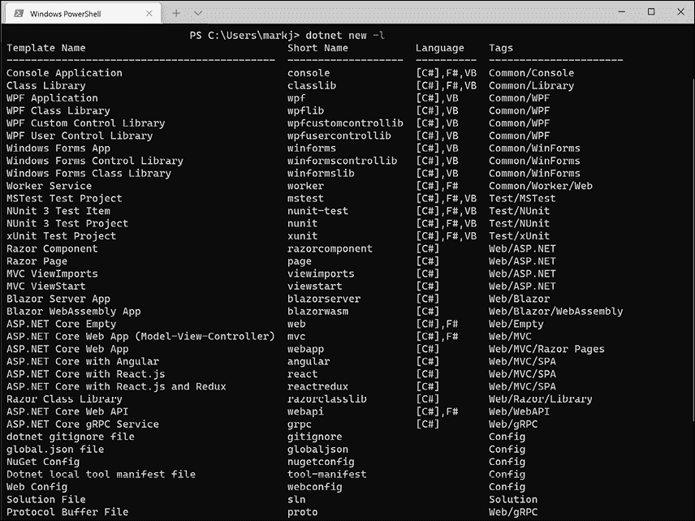
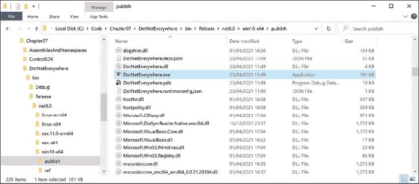
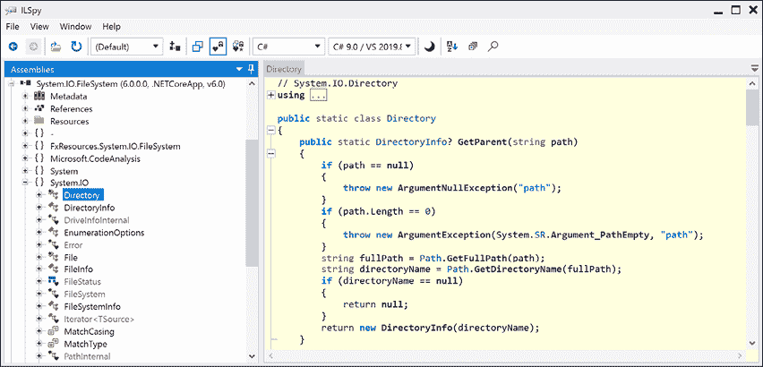
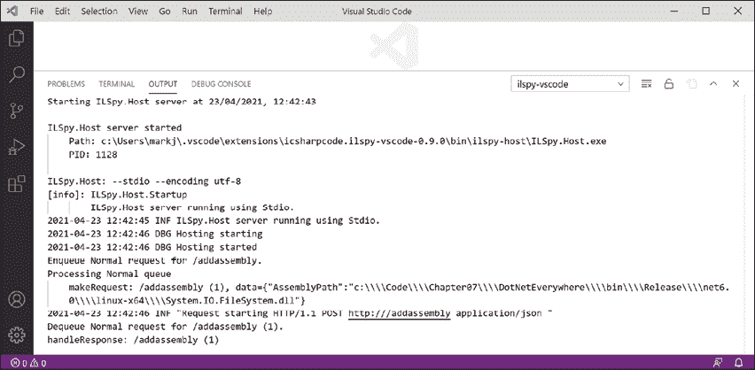
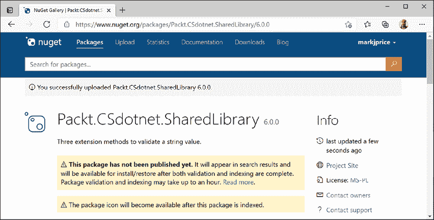

# 第七章：打包和分发 .NET 类型

本章探讨 C# 关键字与 .NET 类型之间的关系，以及命名空间与程序集之间的关系。你还将熟悉如何打包和发布你的 .NET 应用和库以供跨平台使用，如何在 .NET 库中使用遗留的 .NET Framework 库，以及将遗留的 .NET Framework 代码库移植到现代 .NET 的可能性。

本章涵盖以下主题：

+   通往 .NET 6 之路

+   理解 .NET 组件

+   发布应用程序以供部署

+   反编译 .NET 程序集

+   为 NuGet 分发打包你的库

+   从 .NET Framework 迁移到现代 .NET

+   使用预览功能

# 通往 .NET 6 之路

本书的这一部分关于 **基类库** (**BCL**) API 提供的功能，以及如何使用 .NET Standard 在所有不同的 .NET 平台上重用功能。

首先，我们将回顾到达此点的路径，并理解过去为何重要。

.NET Core 2.0 及更高版本对 .NET Standard 2.0 的最小支持至关重要，因为它提供了 .NET Core 初版中缺失的许多 API。.NET Framework 开发者过去 15 年可用的、与现代开发相关的库和应用程序现已迁移至 .NET，并能在 macOS、Linux 变种以及 Windows 上跨平台运行。

.NET Standard 2.1 新增约 3,000 个新 API。其中一些 API 需要运行时变更，这会破坏向后兼容性，因此 .NET Framework 4.8 仅实现 .NET Standard 2.0。.NET Core 3.0、Xamarin、Mono 和 Unity 实现 .NET Standard 2.1。

.NET 6 消除了对 .NET Standard 的需求，前提是所有项目都能使用 .NET 6。由于你可能仍需为遗留的 .NET Framework 项目或遗留的 Xamarin 移动应用创建类库，因此仍需创建 .NET Standard 2.0 和 2.1 类库。2021 年 3 月，我调查了专业开发者，其中一半仍需创建符合 .NET Standard 2.0 的类库。

随着 .NET 6 的发布，预览支持使用 .NET MAUI 构建的移动和桌面应用，对 .NET Standard 的需求进一步减少。

为了总结 .NET 在过去五年中的进展，我已将主要的 .NET Core 和现代 .NET 版本与相应的 .NET Framework 版本进行了比较，如下所示：

+   **.NET Core 1.x**：相较于 2016 年 3 月当时的当前版本 .NET Framework 4.6.1，API 规模小得多。

+   **.NET Core 2.x**：与 .NET Framework 4.7.1 实现了现代 API 的 API 对等，因为它们都实现了 .NET Standard 2.0。

+   **.NET Core 3.x**：相较于 .NET Framework，提供了更大的现代 API 集合，因为 .NET Framework 4.8 不实现 .NET Standard 2.1。

+   **.NET 5**：相较于 .NET Framework 4.8，提供了更大的现代 API 集合，性能显著提升。

+   **.NET 6**：最终统一，支持.NET MAUI 中的移动应用，预计于 2022 年 5 月实现。

## .NET Core 1.0

.NET Core 1.0 于 2016 年 6 月发布，重点在于实现适合构建现代跨平台应用的 API，包括为 Linux 使用 ASP.NET Core 构建的 Web 和云应用及服务。

## .NET Core 1.1

.NET Core 1.1 于 2016 年 11 月发布，主要关注于修复错误、增加支持的 Linux 发行版数量、支持.NET Standard 1.6，以及提升性能，特别是在使用 ASP.NET Core 构建的 Web 应用和服务方面。

## .NET Core 2.0

.NET Core 2.0 于 2017 年 8 月发布，重点在于实现.NET Standard 2.0，能够引用.NET Framework 库，以及更多的性能改进。

（本书）第三版于 2017 年 11 月出版，涵盖至.NET Core 2.0 及用于**通用 Windows 平台** (**UWP**) 应用的.NET Core。

## .NET Core 2.1

.NET Core 2.1 于 2018 年 5 月发布，重点在于可扩展的工具系统，新增类型如`Span<T>`，加密和压缩的新 API，包含额外 20,000 个 API 的 Windows 兼容包以帮助移植旧 Windows 应用，Entity Framework Core 值转换，LINQ `GroupBy` 转换，数据播种，查询类型，以及更多的性能改进，包括下表中列出的主题：

| 特性 | 章节 | 主题 |
| --- | --- | --- |
| 跨度 | 8 | 处理跨度、索引和范围 |
| Brotli 压缩 | 9 | 使用 Brotli 算法进行压缩 |
| 加密学 | 20 | 加密学有哪些新内容？ |
| EF Core 延迟加载 | 10 | 启用延迟加载 |
| EF Core 数据播种 | 10 | 理解数据播种 |

## .NET Core 2.2

.NET Core 2.2 于 2018 年 12 月发布，重点在于运行时诊断改进、可选的分层编译，以及为 ASP.NET Core 和 Entity Framework Core 添加新功能，如使用**NetTopologySuite** (**NTS**) 库类型的空间数据支持、查询标签和拥有的实体集合。

## .NET Core 3.0

.NET Core 3.0 于 2019 年 9 月发布，重点在于增加对使用 Windows Forms (2001)、**Windows Presentation Foundation** (**WPF**; 2006) 和 Entity Framework 6.3 构建 Windows 桌面应用的支持，支持并行和应用本地部署，快速的 JSON 阅读器，串口访问和其他引脚访问，用于**物联网** (**IoT**) 解决方案，以及默认的分层编译，包括下表中列出的主题：

| 特性 | 章节 | 主题 |
| --- | --- | --- |
| 应用内嵌.NET | 7 | 发布您的应用程序以供部署 |
| `Index` 和 `Range` | 8 | 处理跨度、索引和范围 |
| `System.Text.Json` | 9 | 高性能 JSON 处理 |
| 异步流 | 12 | 处理异步流 |

（本书）第四版于 2019 年 10 月出版，因此涵盖了后续版本中添加的一些新 API，直至.NET Core 3.0。

## .NET Core 3.1

.NET Core 3.1 于 2019 年 12 月发布，专注于 bug 修复和优化，以便成为 **长期支持** (**LTS**) 版本，直至 2022 年 12 月才停止支持。

## .NET 5.0

.NET 5.0 于 2020 年 11 月发布，专注于统一除移动平台外的各种 .NET 平台，优化平台，并提升性能，包括下表所列主题：

| 特性 | 章节 | 主题 |
| --- | --- | --- |
| `Half` 类型 | 8 | 数值操作 |
| 正则表达式性能提升 | 8 | 正则表达式性能提升 |
| `System.Text.Json` 性能改进 | 9 | 高效处理 JSON |
| EF Core 生成的 SQL | 10 | 获取生成的 SQL |
| EF Core 筛选包含 | 10 | 筛选包含的实体 |
| EF Core Scaffold-DbContext 现使用 Humanizer 进行单数化 | 10 | 基于现有数据库生成模型 |

## .NET 6.0

.NET 6.0 于 2021 年 11 月发布，重点在于与移动平台统一，为 EF Core 的数据管理添加更多功能，并提升性能，包括下表所列主题：

| 特性 | 章节 | 主题 |
| --- | --- | --- |
| 检查 .NET SDK 状态 | 7 | 检查 .NET SDK 更新 |
| 对 Apple Silicon 的支持 | 7 | 创建控制台应用程序发布 |
| 默认链接修剪模式 | 7 | 使用应用修剪减小应用大小 |
| `DateOnly` 和 `TimeOnly` | 8 | 指定日期和时间值 |
| `List<T>` 的 `EnsureCapacity` | 8 | 通过确保集合容量提升性能 |
| EF Core 配置约定 | 10 | 配置预约定模型 |
| 新增 LINQ 方法 | 11 | 使用 Enumerable 类构建 LINQ 表达式 |

## 从 .NET Core 2.0 到 .NET 5 的性能提升

微软在过去几年中对性能进行了重大改进。您可以在以下链接阅读详细博客文章：[`devblogs.microsoft.com/dotnet/performance-improvements-in-net-5/`](https://devblogs.microsoft.com/dotnet/performance-improvements-in-net-5/)。

## 检查 .NET SDK 更新

使用 .NET 6，微软添加了一个命令来检查已安装的 .NET SDK 和运行时版本，并在需要更新时发出警告。例如，您输入以下命令：

```cs
dotnet sdk check 
```

随后，您将看到包括可用更新状态在内的结果，如下所示的部分输出：

```cs
.NET SDKs:
Version                         Status
-----------------------------------------------------------------------------
3.1.412                         Up to date.
5.0.202                         Patch 5.0.206 is available.
... 
```

# 理解 .NET 组件

.NET 由多个部分组成，如下所示：

+   **语言编译器**：这些编译器将使用 C#、F# 和 Visual Basic 等语言编写的源代码转换为 **中间语言** (**IL**) 代码，存储在程序集中。使用 C# 6.0 及更高版本，微软转向了名为 Roslyn 的开源重写编译器，该编译器也用于 Visual Basic。

+   **公共语言运行时（CoreCLR）**：此运行时加载程序集，将存储在其中的 IL 代码编译为计算机 CPU 的本地代码指令，并在管理线程和内存等资源的环境中执行代码。

+   **基类库（BCL 或 CoreFX）**：这些是预构建的类型集合，通过 NuGet 打包和分发，用于在构建应用程序时执行常见任务。你可以使用它们快速构建任何你想要的东西，就像组合乐高™积木一样。.NET Core 2.0 实现了.NET 标准 2.0，它是所有先前版本的.NET 标准的超集，并将.NET Core 提升到与.NET Framework 和 Xamarin 平齐。.NET Core 3.0 实现了.NET 标准 2.1，增加了新的功能，并实现了在.NET Framework 中不可用的性能改进。.NET 6 在所有类型的应用程序中实现了一个统一的 BCL，包括移动应用。

## 理解程序集、NuGet 包和命名空间

**程序集**是类型在文件系统中存储的位置。程序集是一种部署代码的机制。例如，`System.Data.dll`程序集包含管理数据的类型。要使用其他程序集中的类型，必须引用它们。程序集可以是静态的（预先创建的）或动态的（在运行时生成的）。动态程序集是一个高级特性，本书中不会涉及。程序集可以编译成单个文件，作为 DLL（类库）或 EXE（控制台应用）。

程序集作为**NuGet 包**分发，这些是可以从公共在线源下载的文件，可以包含多个程序集和其他资源。你还会听到关于**项目 SDK**、**工作负载**和**平台**的说法，这些都是 NuGet 包的组合。

Microsoft 的 NuGet 源在这里：[`www.nuget.org/`](https://www.nuget.org/)。

### 什么是命名空间？

命名空间是类型的地址。命名空间是一种机制，通过要求完整的地址而不是简短的名称来唯一标识类型。在现实世界中，*34 号梧桐街的鲍勃*与*12 号柳树道的鲍勃*是不同的。

在.NET 中，`System.Web.Mvc`命名空间中的`IActionFilter`接口与`System.Web.Http.Filters`命名空间中的`IActionFilter`接口不同。

### 理解依赖的程序集

如果一个程序集被编译为类库并提供类型供其他程序集使用，那么它具有文件扩展名`.dll`（**动态链接库**），并且不能独立执行。

同样，如果一个程序集被编译为应用程序，那么它具有文件扩展名`.exe`（**可执行文件**），并且可以独立执行。在.NET Core 3.0 之前，控制台应用被编译为`.dll`文件，必须通过`dotnet run`命令或宿主可执行文件来执行。

任何程序集都可以引用一个或多个类库程序集作为依赖项，但不能有循环引用。因此，如果程序集*A*已经引用程序集*B*，则程序集*B*不能引用程序集*A*。如果您尝试添加会导致循环引用的依赖项引用，编译器会警告您。循环引用通常是代码设计不良的警告信号。如果您确定需要循环引用，则使用接口来解决它。

## 理解 Microsoft .NET 项目 SDKs

默认情况下，控制台应用程序对 Microsoft .NET 项目 SDK 有依赖引用。该平台包含数千种类型，几乎所有应用程序都需要这些类型，例如`System.Int32`和`System.String`类型。

在使用.NET 时，您在项目文件中引用应用程序所需的依赖程序集、NuGet 包和平台。

让我们探讨程序集和命名空间之间的关系：

1.  使用您偏好的代码编辑器创建一个名为`Chapter07`的新解决方案/工作区。

1.  添加一个控制台应用项目，如下表所定义：

    1.  项目模板：**控制台应用程序** / `console`

    1.  工作区/解决方案文件和文件夹：`Chapter07`

    1.  项目文件和文件夹：`AssembliesAndNamespaces`

1.  打开`AssembliesAndNamespaces.csproj`并注意，它是一个典型的.NET 6 应用程序项目文件，如下所示：

    ```cs
    <Project Sdk="Microsoft.NET.Sdk">
      <PropertyGroup>
        <OutputType>Exe</OutputType>
        <TargetFramework>net6.0</TargetFramework>
        <Nullable>enable</Nullable>
        <ImplicitUsings>enable</ImplicitUsings>
      </PropertyGroup>
    </Project> 
    ```

## 理解程序集中的命名空间和类型

许多常见的.NET 类型位于`System.Runtime.dll`程序集中。程序集和命名空间之间并不总是存在一对一的映射。单个程序集可以包含多个命名空间，一个命名空间也可以在多个程序集中定义。您可以查看一些程序集与其提供的类型的命名空间之间的关系，如下表所示：

| 程序集 | 示例命名空间 | 示例类型 |
| --- | --- | --- |
| `System.Runtime.dll` | `System`, `System.Collections`, `System.Collections.Generic` | `Int32`, `String`, `IEnumerable<T>` |
| `System.Console.dll` | `System` | `Console` |
| `System.Threading.dll` | `System.Threading` | `Interlocked`, `Monitor`, `Mutex` |
| `System.Xml.XDocument.dll` | `System.Xml.Linq` | `XDocument`, `XElement`, `XNode` |

## 理解 NuGet 包

.NET 被拆分为一组包，使用名为 NuGet 的微软支持的包管理技术进行分发。这些包中的每一个都代表一个同名的单一程序集。例如，`System.Collections`包包含`System.Collections.dll`程序集。

以下是包的好处：

+   包可以轻松地在公共源中分发。

+   包可以重复使用。

+   包可以按照自己的时间表发货。

+   包可以独立于其他包进行测试。

+   通过包含为不同操作系统和 CPU 构建的同一程序集的多个版本，包可以支持不同的操作系统（OSes）和 CPU。

+   包可以有仅针对一个库的特定依赖项。

+   应用体积更小，因为未引用的包不包含在分发中。下表列出了一些较重要的包及其重要类型：

| 包 | 重要类型 |
| --- | --- |
| `System.Runtime` | `Object`，`String`，`Int32`，`Array` |
| `System.Collections` | `List<T>`，`Dictionary<TKey, TValue>` |
| `System.Net.Http` | `HttpClient`，`HttpResponseMessage` |
| `System.IO.FileSystem` | `File`，`Directory` |
| `System.Reflection` | `Assembly`，`TypeInfo`，`MethodInfo` |

## 理解框架

框架与包之间存在双向关系。包定义 API，而框架则整合包。一个没有任何包的框架不会定义任何 API。

.NET 包各自支持一组框架。例如，`System.IO.FileSystem`包版本 4.3.0 支持以下框架：

+   .NET Standard，版本 1.3 或更高。

+   .NET Framework，版本 4.6 或更高。

+   六个 Mono 和 Xamarin 平台（例如，Xamarin.iOS 1.0）。

    **更多信息**：你可以在以下链接阅读详细信息：[`www.nuget.org/packages/System.IO.FileSystem/`](https://www.nuget.org/packages/System.IO.FileSystem/)。

## 导入命名空间以使用类型

让我们探讨命名空间与程序集和类型之间的关系：

1.  在`AssembliesAndNamespaces`项目中，在`Program.cs`文件里，输入以下代码：

    ```cs
    XDocument doc = new(); 
    ```

1.  构建项目并注意编译器错误信息，如下所示：

    ```cs
    The type or namespace name 'XDocument' could not be found (are you missing a using directive or an assembly reference?) 
    ```

    `XDocument`类型未被识别，因为我们没有告诉编译器该类型的命名空间是什么。尽管此项目已有一个指向包含该类型的程序集的引用，我们还需通过在其类型名前加上命名空间或导入命名空间来解决。

1.  点击`XDocument`类名内部。你的代码编辑器会显示一个灯泡图标，表明它识别了该类型，并能自动为你修复问题。

1.  点击灯泡图标，并从菜单中选择`using System.Xml.Linq;`。

这将*通过在文件顶部添加`using`语句来导入命名空间*。一旦在代码文件顶部导入了命名空间，那么该命名空间内的所有类型在该代码文件中只需输入其名称即可使用，无需通过在其名称前加上命名空间来完全限定类型名。

有时我喜欢在导入命名空间后添加一个带有类型名的注释，以提醒我为何需要导入该命名空间，如下所示：

```cs
using System.Xml.Linq; // XDocument 
```

## 将 C#关键字关联到.NET 类型

我常从初学 C#的程序员那里得到的一个常见问题是：“`string`（小写 s）和`String`（大写 S）之间有什么区别？”

简短的答案是：没有区别。详细的答案是，所有 C#类型关键字，如`string`或`int`，都是.NET 类库程序集中某个类型的别名。

当你使用`string`关键字时，编译器将其识别为`System.String`类型。当你使用`int`类型时，编译器将其识别为`System.Int32`类型。

让我们通过一些代码来实际看看：

1.  在`Program.cs`中，声明两个变量以保存`string`值，一个使用小写的`string`，另一个使用大写的`String`，如下列代码所示：

    ```cs
    string s1 = "Hello"; 
    String s2 = "World";
    WriteLine($"{s1} {s2}"); 
    ```

1.  运行代码，并注意目前它们两者工作效果相同，实际上意味着相同的事情。

1.  在`AssembliesAndNamespaces.csproj`中，添加条目以防止全局导入`System`命名空间，如下列标记所示：

    ```cs
    <ItemGroup>
      <Using Remove="System" />
    </ItemGroup> 
    ```

1.  在`Program.cs`中注意编译器错误消息，如下列输出所示：

    ```cs
    The type or namespace name 'String' could not be found (are you missing a using directive or an assembly reference?) 
    ```

1.  在`Program.cs`顶部，使用`using`语句导入`System`命名空间以修复错误，如下列代码所示：

    ```cs
    using System; // String 
    ```

**最佳实践**：当有选择时，使用 C# 关键字而非实际类型，因为关键字不需要导入命名空间。

### C# 别名映射到 .NET 类型

下表显示了 18 个 C# 类型关键字及其对应的实际 .NET 类型：

| 关键字 | .NET 类型 | 关键字 | .NET 类型 |
| --- | --- | --- | --- |
| `string` | `System.String` | `char` | `System.Char` |
| `sbyte` | `System.SByte` | `byte` | `System.Byte` |
| `short` | `System.Int16` | `ushort` | `System.UInt16` |
| `int` | `System.Int32` | `uint` | `System.UInt32` |
| `long` | `System.Int64` | `ulong` | `System.UInt64` |
| `nint` | `System.IntPtr` | `nuint` | `System.UIntPtr` |
| `float` | `System.Single` | `double` | `System.Double` |
| `decimal` | `System.Decimal` | `bool` | `System.Boolean` |
| `object` | `System.Object` | `dynamic` | `System.Dynamic.DynamicObject` |

其他 .NET 编程语言编译器也能做到同样的事情。例如，Visual Basic .NET 语言有一个名为`Integer`的类型，它是`System.Int32`的别名。

#### 理解原生大小整数

C# 9 引入了`nint`和`nuint`关键字别名，用于**原生大小整数**，意味着整数值的存储大小是平台特定的。它们在 32 位进程中存储 32 位整数，`sizeof()`返回 4 字节；在 64 位进程中存储 64 位整数，`sizeof()`返回 8 字节。这些别名代表内存中整数值的指针，这就是为什么它们的 .NET 名称是`IntPtr`和`UIntPtr`。实际存储类型将根据进程是`System.Int32`还是`System.Int64`。

在 64 位进程中，下列代码：

```cs
WriteLine($"int.MaxValue = {int.MaxValue:N0}");
WriteLine($"nint.MaxValue = {nint.MaxValue:N0}"); 
```

产生此输出：

```cs
int.MaxValue = 2,147,483,647
nint.MaxValue = 9,223,372,036,854,775,807 
```

### 揭示类型的位置

代码编辑器为 .NET 类型提供内置文档。我们来探索一下：

1.  在`XDocument`内部右键单击并选择**转到定义**。

1.  导航到代码文件顶部，并注意程序集文件名为`System.Xml.XDocument.dll`，但类位于`System.Xml.Linq`命名空间中，如*图 7.1*所示：

    图 7.1：包含 XDocument 类型的程序集和命名空间

1.  关闭**XDocument [来自元数据]**选项卡。

1.  在`string`或`String`内部右键单击并选择**转到定义**。

1.  导航至代码文件顶部，注意程序集文件名为`System.Runtime.dll`，但类位于`System`命名空间中。

实际上，你的代码编辑器在技术上对你撒了谎。如果你还记得我们在*第二章*，*讲 C#*中编写代码时，当我们揭示 C#词汇的范围时，我们发现`System.Runtime.dll`程序集中不包含任何类型。

它包含的是类型转发器。这些特殊类型看似存在于一个程序集中，但实际上在别处实现。在这种情况下，它们在.NET 运行时内部深处使用高度优化的代码实现。

## 使用.NET Standard 与遗留平台共享代码

.NET Standard 出现之前，有**便携式类库**（**PCLs**）。使用 PCLs，你可以创建一个代码库，并明确指定希望该库支持的平台，如 Xamarin、Silverlight 和 Windows 8。你的库随后可以使用这些指定平台所支持的 API 交集。

微软意识到这是不可持续的，因此他们创建了.NET Standard——一个所有未来.NET 平台都将支持的单一 API。有较早版本的.NET Standard，但.NET Standard 2.0 试图统一所有重要的近期.NET 平台。.NET Standard 2.1 于 2019 年底发布，但只有.NET Core 3.0 和当年版本的 Xamarin 支持其新特性。在本书的其余部分，我将使用.NET Standard 来指代.NET Standard 2.0。

.NET Standard 类似于 HTML5，它们都是平台应支持的标准。正如谷歌的 Chrome 浏览器和微软的 Edge 浏览器实现 HTML5 标准一样，.NET Core、.NET Framework 和 Xamarin 都实现.NET Standard。如果你想创建一个能在遗留.NET 各变体间工作的类型库，最简便的方法就是使用.NET Standard。

**最佳实践**：由于.NET Standard 2.1 中的许多 API 新增内容需要运行时变更，而.NET Framework 作为微软的遗留平台，需要尽可能保持不变，因此.NET Framework 4.8 仍停留在.NET Standard 2.0，并未实现.NET Standard 2.1。若需支持.NET Framework 用户，则应基于.NET Standard 2.0 创建类库，尽管它不是最新版本，也不支持所有近期的语言和 BCL 新特性。

选择针对哪个.NET Standard 版本，取决于在最大化平台支持和可用功能之间的权衡。较低版本支持更多平台，但 API 集较小；较高版本支持的平台较少，但 API 集更大。通常，应选择支持所需所有 API 的最低版本。

## 理解不同 SDK 下类库的默认设置

当使用`dotnet` SDK 工具创建类库时，了解默认使用的目标框架可能会有所帮助，如下表所示：

| SDK | 新类库的默认目标框架 |
| --- | --- |
| .NET Core 3.1 | `netstandard2.0` |
| .NET 5 | `net5.0` |
| .NET 6 | `net6.0` |

当然，仅仅因为类库默认面向特定版本的 .NET，并不意味着在创建使用默认模板的类库项目后不能更改它。

您可以手动将目标框架设置为支持需要引用该库的项目的值，如下表所示：

| 类库目标框架 | 可用于面向以下版本的项目 |
| --- | --- |
| `netstandard2.0` | .NET Framework 4.6.1 或更高版本，.NET Core 2.0 或更高版本，.NET 5.0 或更高版本，Mono 5.4 或更高版本，Xamarin.Android 8.0 或更高版本，Xamarin.iOS 10.14 或更高版本 |
| `netstandard2.1` | .NET Core 3.0 或更高版本，.NET 5.0 或更高版本，Mono 6.4 或更高版本，Xamarin.Android 10.0 或更高版本，Xamarin.iOS 12.16 或更高版本 |
| `net5.0` | .NET 5.0 或更高版本 |
| `net6.0` | .NET 6.0 或更高版本 |

**最佳实践**：始终检查类库的目标框架，并在必要时手动将其更改为更合适的选项。要有意识地决定它应该是什么，而不是接受默认值。

## 创建 .NET Standard 2.0 类库

我们将创建一个使用 .NET Standard 2.0 的类库，以便它可以在所有重要的 .NET 遗留平台上以及在 Windows、macOS 和 Linux 操作系统上跨平台使用，同时还可以访问广泛的 .NET API 集：

1.  使用您喜欢的代码编辑器向 `Chapter07` 解决方案/工作区添加一个名为 `SharedLibrary` 的新类库。

1.  如果您使用的是 Visual Studio 2022，当提示选择**目标框架**时，请选择 **.NET Standard 2.0**，然后将解决方案的启动项目设置为当前选择。

1.  如果您使用的是 Visual Studio Code，请包含一个目标为 .NET Standard 2.0 的开关，如下面的命令所示：

    ```cs
    dotnet new classlib -f netstandard2.0 
    ```

1.  如果您使用的是 Visual Studio Code，请选择 `SharedLibrary` 作为活动的 OmniSharp 项目。

**最佳实践**：如果您需要创建使用 .NET 6.0 新功能的类型，以及仅使用 .NET Standard 2.0 功能的类型，那么您可以创建两个单独的类库：一个面向 .NET Standard 2.0，另一个面向 .NET 6.0。您将在*第十章*，*使用 Entity Framework Core 处理数据*中看到这一操作。

手动创建两个类库的替代方法是创建一个支持多目标的类库。如果您希望我在下一版中添加关于多目标的章节，请告诉我。您可以在这里阅读关于多目标的信息：[`docs.microsoft.com/en-us/dotnet/standard/library-guidance/cross-platform-targeting#multi-targeting`](https://docs.microsoft.com/en-us/dotnet/standard/library-guidance/cross-platform-targeting#multi-targeting)。

## 控制 .NET SDK

默认情况下，执行 `dotnet` 命令使用最新安装的 .NET SDK。有时您可能希望控制使用哪个 SDK。

例如，第四版的某位读者希望其体验与书中使用.NET Core 3.1 SDK 的步骤相匹配。但他们也安装了.NET 5.0 SDK，并且默认使用的是这个版本。如前一节所述，创建新类库时的行为已更改为针对.NET 5.0 而非.NET Standard 2.0，这让读者感到困惑。

通过使用`global.json`文件，你可以控制默认使用的.NET SDK。`dotnet`命令会在当前文件夹及其祖先文件夹中搜索`global.json`文件。

1.  在`Chapter07`文件夹中创建一个名为`ControlSDK`的子目录/文件夹。

1.  在 Windows 上，启动**命令提示符**或**Windows 终端**。在 macOS 上，启动**终端**。如果你使用的是 Visual Studio Code，则可以使用集成终端。

1.  在`ControlSDK`文件夹中，在命令提示符或终端下，输入创建强制使用最新.NET Core 3.1 SDK 的`global.json`文件的命令，如下所示：

    ```cs
    dotnet new globaljson --sdk-version 3.1.412 
    ```

1.  打开`global.json`文件并审查其内容，如下所示：

    ```cs
    {
      "sdk": {
        "version": "3.1.412"
      }
    } 
    ```

    你可以在以下链接的表格中找到最新.NET SDK 的版本号：[`dotnet.microsoft.com/download/visual-studio-sdks`](https://dotnet.microsoft.com/download/visual-studio-sdks)

1.  在`ControlSDK`文件夹中，在命令提示符或终端下，输入创建类库项目的命令，如下所示：

    ```cs
    dotnet new classlib 
    ```

1.  如果你未安装.NET Core 3.1 SDK，则会看到如下所示的错误：

    ```cs
    Could not execute because the application was not found or a compatible .NET SDK is not installed. 
    ```

1.  如果你已安装.NET Core 3.1 SDK，则默认将创建一个针对.NET Standard 2.0 的类库项目。

你无需完成上述步骤，但如果你想尝试且尚未安装.NET Core 3.1 SDK，则可以从以下链接安装：

[`dotnet.microsoft.com/download/dotnet/3.1`](https://dotnet.microsoft.com/download/dotnet/3.1)

# 发布你的代码以供部署

如果你写了一部小说并希望其他人阅读，你必须将其出版。

大多数开发者编写代码供其他开发者在他们的代码中使用，或者供用户作为应用程序运行。为此，你必须将你的代码发布为打包的类库或可执行应用程序。

发布和部署.NET 应用程序有三种方式，它们是：

1.  **依赖框架的部署**（**FDD**）。

1.  **依赖框架的可执行文件**（**FDEs**）。

1.  自包含。

如果你选择部署应用程序及其包依赖项，但不包括.NET 本身，那么你依赖于目标计算机上已有的.NET。这对于部署到服务器的 Web 应用程序非常有效，因为.NET 和其他许多 Web 应用程序可能已经在服务器上。

**框架依赖部署**（**FDD**）意味着您部署的是必须由`dotnet`命令行工具执行的 DLL。**框架依赖可执行文件**（**FDE**）意味着您部署的是可以直接从命令行运行的 EXE。两者都要求系统上已安装.NET。

有时，您希望能够在 USB 闪存驱动器上提供您的应用程序，并确保它能在他人的计算机上执行。您希望进行自包含部署。虽然部署文件的大小会更大，但您可以确信它将能够运行。

## 创建一个控制台应用程序以发布

让我们探索如何发布一个控制台应用程序：

1.  使用您偏好的代码编辑器，在`Chapter07`解决方案/工作区中添加一个名为`DotNetEverywhere`的新控制台应用。

1.  在 Visual Studio Code 中，选择`DotNetEverywhere`作为活动的 OmniSharp 项目。当看到弹出警告消息提示缺少必需资产时，点击**是**以添加它们。

1.  在`Program.cs`中，删除注释并静态导入`Console`类。

1.  在`Program.cs`中，添加一条语句，输出一条消息，表明控制台应用可在任何地方运行，并提供一些关于操作系统的信息，如下所示：

    ```cs
    WriteLine("I can run everywhere!");
    WriteLine($"OS Version is {Environment.OSVersion}.");
    if (OperatingSystem.IsMacOS())
    {
      WriteLine("I am macOS.");
    }
    else if (OperatingSystem.IsWindowsVersionAtLeast(major: 10))
    {
      WriteLine("I am Windows 10 or 11.");
    }
    else
    {
      WriteLine("I am some other mysterious OS.");
    }
    WriteLine("Press ENTER to stop me.");
    ReadLine(); 
    ```

1.  打开`DotNetEverywhere.csproj`文件，并在`<PropertyGroup>`元素内添加运行时标识符，以针对三个操作系统进行目标设定，如下所示的高亮标记：

    ```cs
    <Project Sdk="Microsoft.NET.Sdk">
      <PropertyGroup>
        <OutputType>Exe</OutputType>
        <TargetFramework>net6.0</TargetFramework>
        <Nullable>enable</Nullable>
        <ImplicitUsings>enable</ImplicitUsings>
     **<RuntimeIdentifiers>**
     **win10-x64;osx-x64;osx****.11.0****-arm64;linux-x64;linux-arm64**
     **</RuntimeIdentifiers>**
      </PropertyGroup>
    </Project> 
    ```

    +   `win10-x64` RID 值表示 Windows 10 或 Windows Server 2016 的 64 位版本。您也可以使用`win10-arm64` RID 值来部署到 Microsoft Surface Pro X。

    +   `osx-x64` RID 值表示 macOS Sierra 10.12 或更高版本。您也可以指定特定版本的 RID 值，如`osx.10.15-x64`（Catalina）、`osx.11.0-x64`（Intel 上的 Big Sur）或`osx.11.0-arm64`（Apple Silicon 上的 Big Sur）。

    +   `linux-x64` RID 值适用于大多数桌面 Linux 发行版，如 Ubuntu、CentOS、Debian 或 Fedora。使用`linux-arm`适用于 Raspbian 或 Raspberry Pi OS 的 32 位版本。使用`linux-arm64`适用于运行 Ubuntu 64 位的 Raspberry Pi。

## 理解 dotnet 命令

安装.NET SDK 时，它会包含一个名为`dotnet`的**命令行界面(CLI)**。

### 创建新项目

.NET CLI 拥有在当前文件夹上工作的命令，用于使用模板创建新项目：

1.  在 Windows 上，启动**命令提示符**或**Windows 终端**。在 macOS 上，启动**终端**。如果您使用的是 Visual Studio Code，则可以使用集成终端。

1.  输入`dotnet new --list`或`dotnet new -l`命令，列出您当前安装的模板，如*图 7.2*所示：

*图 7.2：已安装的 dotnet new 项目模板列表*

大多数`dotnet`命令行开关都有长版和短版。例如，`--list`或`-l`。短版输入更快，但更容易被您或其他人类误解。有时，多输入一些字符会更清晰。

## 获取有关.NET 及其环境的信息

查看当前安装的 .NET SDK 和运行时以及操作系统信息非常有用，如下所示：

```cs
dotnet --info 
```

注意结果，如下所示：

```cs
.NET SDK (reflecting any global.json):
 Version:   6.0.100
 Commit:    22d70b47bc
Runtime Environment:
 OS Name:     Windows
 OS Version:  10.0.19043
 OS Platform: Windows
 RID:         win10-x64
 Base Path:   C:\Program Files\dotnet\sdk\6.0.100\
Host (useful for support):
  Version: 6.0.0
  Commit:  91ba01788d
.NET SDKs installed:
  3.1.412 [C:\Program Files\dotnet\sdk]
  5.0.400 [C:\Program Files\dotnet\sdk]
  6.0.100 [C:\Program Files\dotnet\sdk]
.NET runtimes installed:
  Microsoft.AspNetCore.All 2.1.29 [...\dotnet\shared\Microsoft.AspNetCore.All]
... 
```

## 项目管理

.NET CLI 提供了以下命令，用于管理当前文件夹中的项目：

+   `dotnet restore`: 此命令下载项目的依赖项。

+   `dotnet build`: 此命令构建（即编译）项目。

+   `dotnet test`: 此命令构建项目并随后运行单元测试。

+   `dotnet run`: 此命令构建项目并随后运行。

+   `dotnet pack`: 此命令为项目创建 NuGet 包。

+   `dotnet publish`: 此命令构建并发布项目，无论是包含依赖项还是作为自包含应用程序。

+   `dotnet add`: 此命令向项目添加对包或类库的引用。

+   `dotnet remove`: 此命令从项目中移除对包或类库的引用。

+   `dotnet list`: 此命令列出项目对包或类库的引用。

## 发布自包含应用

既然你已经看到了一些 `dotnet` 工具命令的示例，我们可以发布我们的跨平台控制台应用：

1.  在命令行中，确保你位于 `DotNetEverywhere` 文件夹中。

1.  输入以下命令以构建并发布适用于 Windows 10 的控制台应用程序的发布版本：

    ```cs
    dotnet publish -c Release -r win10-x64 
    ```

1.  注意，构建引擎会恢复任何需要的包，将项目源代码编译成程序集 DLL，并创建一个 `publish` 文件夹，如下所示：

    ```cs
    Microsoft (R) Build Engine version 17.0.0+073022eb4 for .NET
    Copyright (C) Microsoft Corporation. All rights reserved.
      Determining projects to restore...
      Restored C:\Code\Chapter07\DotNetEverywhere\DotNetEverywhere.csproj (in 46.89 sec).
      DotNetEverywhere -> C:\Code\Chapter07\DotNetEverywhere\bin\Release\net6.0\win10-x64\DotNetEverywhere.dll
      DotNetEverywhere -> C:\Code\Chapter07\DotNetEverywhere\bin\Release\net6.0\win10-x64\publish\ 
    ```

1.  输入以下命令以构建并发布适用于 macOS 和 Linux 变体的发布版本：

    ```cs
    dotnet publish -c Release -r osx-x64
    dotnet publish -c Release -r osx.11.0-arm64
    dotnet publish -c Release -r linux-x64
    dotnet publish -c Release -r linux-arm64 
    ```

    **最佳实践**：你可以使用 PowerShell 等脚本语言自动化这些命令，并通过跨平台的 PowerShell Core 在任何操作系统上执行。只需创建一个扩展名为 `.ps1` 的文件，其中包含这五个命令。然后执行该文件。更多关于 PowerShell 的信息，请访问以下链接：[`github.com/markjprice/cs10dotnet6/tree/main/docs/powershell`](https://github.com/markjprice/cs10dotnet6/tree/main/docs/powershell)

1.  打开 macOS **Finder** 窗口或 Windows **文件资源管理器**，导航至 `DotNetEverywhere\bin\Release\net6.0`，并注意针对不同操作系统的输出文件夹。

1.  在 `win10-x64` 文件夹中，选择 `publish` 文件夹，注意所有支持程序集，如 `Microsoft.CSharp.dll`。

1.  选择 `DotNetEverywhere` 可执行文件，并注意其大小为 161 KB，如图 *7.3* 所示：

    图 7.3：适用于 Windows 10 64 位的 DotNetEverywhere 可执行文件

1.  如果你使用的是 Windows，则双击执行程序并注意结果，如下所示：

    ```cs
    I can run everywhere!
    OS Version is Microsoft Windows NT 10.0.19042.0.
    I am Windows 10.
    Press ENTER to stop me. 
    ```

1.  注意，`publish` 文件夹及其所有文件的总大小为 64.8 MB。

1.  在`osx.11.0-arm64`文件夹中，选择`publish`文件夹，注意所有支持的程序集，然后选择`DotNetEverywhere`可执行文件，并注意可执行文件为 126 KB，而`publish`文件夹为 71.8 MB。

如果你将任何`publish`文件夹复制到相应的操作系统，控制台应用程序将运行；这是因为它是自包含的可部署.NET 应用程序。例如，在配备 Intel 芯片的 macOS 上，如下所示：

```cs
I can run everywhere!
OS Version is Unix 11.2.3
I am macOS.
Press ENTER to stop me. 
```

本例使用的是控制台应用程序，但你同样可以轻松创建一个 ASP.NET Core 网站或 Web 服务，或是 Windows Forms 或 WPF 应用程序。当然，你只能将 Windows 桌面应用程序部署到 Windows 计算机上，不能部署到 Linux 或 macOS。

## 发布单文件应用程序

要发布为“单个”文件，你可以在发布时指定标志。在.NET 5 中，单文件应用程序主要关注 Linux，因为 Windows 和 macOS 都存在限制，这意味着真正的单文件发布在技术上是不可能的。在.NET 6 中，你现在可以在 Windows 上创建真正的单文件应用程序。

如果你能假设目标计算机上已安装.NET 6，那么在发布应用程序时，你可以使用额外的标志来表明它不需要自包含，并且你希望将其发布为单个文件（如果可能），如下所示（该命令必须在一行内输入）：

```cs
dotnet publish -r win10-x64 -c Release --self-contained=false
/p:PublishSingleFile=true 
```

这将生成两个文件：`DotNetEverywhere.exe`和`DotNetEverywhere.pdb`。`.exe`是可执行文件，而`.pdb`文件是**程序调试数据库**文件，存储调试信息。

macOS 上发布的应用程序没有`.exe`文件扩展名，因此如果你在上面的命令中使用`osx-x64`，文件名将不会有扩展名。

如果你希望将`.pdb`文件嵌入到`.exe`文件中，那么请在你的`.csproj`文件中的`<PropertyGroup>`元素内添加一个`<DebugType>`元素，并将其设置为`embedded`，如下所示：

```cs
<PropertyGroup>
  <OutputType>Exe</OutputType>
  <TargetFramework>net6.0</TargetFramework>
  <Nullable>enable</Nullable>
  <ImplicitUsings>enable</ImplicitUsings>
  <RuntimeIdentifiers>
    win10-x64;osx-x64;osx.11.0-arm64;linux-x64;linux-arm64
  </RuntimeIdentifiers>
 **<DebugType>embedded</DebugType>**
</PropertyGroup> 
```

如果你不能假设目标计算机上已安装.NET 6，那么在 Linux 上虽然也只生成两个文件，但 Windows 上还需额外生成以下文件：`coreclr.dll`、`clrjit.dll`、`clrcompression.dll`和`mscordaccore.dll`。

让我们看一个 Windows 的示例：

1.  在命令行中，输入构建 Windows 10 控制台应用程序的发布版本的命令，如下所示：

    ```cs
    dotnet publish -c Release -r win10-x64 /p:PublishSingleFile=true 
    ```

1.  导航到`DotNetEverywhere\bin\Release\net6.0\win10-x64\publish`文件夹，选择`DotNetEverywhere`可执行文件，并注意可执行文件现在为 58.3 MB，还有一个 10 KB 的`.pdb`文件。你系统上的大小可能会有所不同。

## 通过应用程序修剪减小应用程序大小

将.NET 应用程序部署为自包含应用程序的一个问题是.NET 库占用了大量空间。其中，对减小体积需求最大的就是 Blazor WebAssembly 组件，因为所有.NET 库都需要下载到浏览器中。

幸运的是，您可以通过不在部署中打包未使用的程序集来减少此大小。随着.NET Core 3.0 的引入，应用修剪系统可以识别您的代码所需的程序集并移除不需要的那些。

随着.NET 5，修剪更进一步，通过移除单个类型，甚至是程序集内未使用的方法等成员。例如，使用 Hello World 控制台应用，`System.Console.dll`程序集从 61.5 KB 修剪到 31.5 KB。对于.NET 5，这是一个实验性功能，因此默认情况下是禁用的。

随着.NET 6，微软在其库中添加了注解，以指示它们如何可以安全地修剪，因此类型和成员的修剪被设为默认。这被称为**链接修剪模式**。

关键在于修剪如何准确识别未使用的程序集、类型和成员。如果您的代码是动态的，可能使用反射，那么它可能无法正常工作，因此微软也允许手动控制。

### 启用程序集级别修剪

有两种方法可以启用程序集级别修剪。

第一种方法是在项目文件中添加一个元素，如下面的标记所示：

```cs
<PublishTrimmed>true</PublishTrimmed> 
```

第二种方法是在发布时添加一个标志，如下面的命令中突出显示的那样：

```cs
dotnet publish ... **-p:PublishTrimmed=True** 
```

### 启用类型级别和成员级别修剪

有两种方法可以启用类型级别和成员级别修剪。

第一种方法是在项目文件中添加两个元素，如下面的标记所示：

```cs
<PublishTrimmed>true</PublishTrimmed>
<TrimMode>Link</TrimMode> 
```

第二种方法是在发布时添加两个标志，如下面的命令中突出显示的那样：

```cs
dotnet publish ... **-p:PublishTrimmed=True -p:TrimMode=Link** 
```

对于.NET 6，链接修剪模式是默认的，因此您只需在想要设置如`copyused`等替代修剪模式时指定开关，这意味着程序集级别修剪。

# 反编译.NET 程序集

学习如何为.NET 编码的最佳方法之一是观察专业人士如何操作。

**良好实践**：您可以出于非学习目的反编译他人的程序集，例如复制他们的代码以用于您自己的生产库或应用程序，但请记住您正在查看他们的知识产权，因此请予以尊重。

## 使用 Visual Studio 2022 的 ILSpy 扩展进行反编译

出于学习目的，您可以使用 ILSpy 等工具反编译任何.NET 程序集。

1.  在 Windows 上的 Visual Studio 2022 中，导航至**扩展** | **管理扩展**。

1.  在搜索框中输入`ilspy`。

1.  对于**ILSpy**扩展，点击**下载**。

1.  点击**关闭**。

1.  关闭 Visual Studio 以允许扩展安装。

1.  重启 Visual Studio 并重新打开`Chapter07`解决方案。

1.  在**解决方案资源管理器**中，右键点击**DotNetEverywhere**项目并选择**在 ILSpy 中打开输出**。

1.  导航至**文件** | **打开…**。

1.  导航至以下文件夹：

    ```cs
    Code/Chapter07/DotNetEverywhere/bin/Release/net6.0/linux-x64 
    ```

1.  选择`System.IO.FileSystem.dll`程序集并点击**打开**。

1.  在**程序集**树中，展开**System.IO.FileSystem**程序集，展开**System.IO**命名空间，选择**Directory**类，并等待其反编译。

1.  在 `Directory` 类中，点击 **[+]** 展开 `GetParent` 方法，如图 *7.4* 所示：

    图 7.4：Windows 上 Directory 类的反编译 GetParent 方法

1.  注意检查 `path` 参数的良好实践，如果为 `null` 则抛出 `ArgumentNullException`，如果长度为零则抛出 `ArgumentException`。

1.  关闭 ILSpy。

## 使用 ILSpy 扩展进行反编译

类似的功能作为 Visual Studio Code 的扩展在跨平台上可用。

1.  如果您尚未安装 **ILSpy .NET Decompiler** 扩展，请搜索并安装它。

1.  在 macOS 或 Linux 上，该扩展依赖于 Mono，因此您还需要从以下链接安装 Mono：[`www.mono-project.com/download/stable/`](https://www.mono-project.com/download/stable/)。

1.  在 Visual Studio Code 中，导航到 **View** | **Command Palette…**。

1.  输入 `ilspy` 然后选择 **ILSpy: Decompile IL Assembly (pick file)**。

1.  导航到以下文件夹：

    ```cs
    Code/Chapter07/DotNetEverywhere/bin/Release/net6.0/linux-x64 
    ```

1.  选择 `System.IO.FileSystem.dll` 程序集并点击 **Select assembly**。看似无事发生，但您可以通过查看 **Output** 窗口，在下拉列表中选择 **ilspy-vscode**，并查看处理过程来确认 ILSpy 是否在工作，如图 *7.5* 所示：

    图 7.5：选择要反编译的程序集时 ILSpy 扩展的输出

1.  在 **EXPLORER** 中，展开 **ILSPY DECOMPILED MEMBERS**，选择程序集，关闭 **Output** 窗口，并注意打开的两个编辑窗口，它们显示使用 C# 代码的程序集属性和使用 IL 代码的外部 DLL 和程序集引用，如图 *7.6* 所示：

    图 7.6：展开 ILSPY DECOMPILED MEMBERS

1.  在右侧的 IL 代码中，注意对 `System.Runtime` 程序集的引用，包括版本号，如下所示：

    ```cs
    .module extern libSystem.Native
    .assembly extern System.Runtime
    {
      .publickeytoken = (
        b0 3f 5f 7f 11 d5 0a 3a
      )
      .ver 6:0:0:0
    } 
    ```

    `.module extern libSystem.Native` 表示此程序集像预期那样调用了 Linux 系统 API，这些代码与文件系统交互。如果我们反编译此程序集的 Windows 版本，它将使用 `.module extern kernel32.dll` 代替，这是一个 Win32 API。

1.  在 **EXPLORER** 中，在 **ILSPY DECOMPILED MEMBERS** 中，展开程序集，展开 **System.IO** 命名空间，选择 **Directory**，并注意打开的两个编辑窗口，它们显示使用 C# 代码的反编译 `Directory` 类在左侧，IL 代码在右侧，如图 *7.7* 所示：

    图 7.7：C# 和 IL 代码中的反编译 Directory 类

1.  比较以下代码中 `GetParent` 方法的 C# 源代码：

    ```cs
    public static DirectoryInfo? GetParent(string path)
    {
      if (path == null)
      {
        throw new ArgumentNullException("path");
      }
      if (path.Length == 0)
      {
        throw new ArgumentException(SR.Argument_PathEmpty, "path");
      }
      string fullPath = Path.GetFullPath(path);
      string directoryName = Path.GetDirectoryName(fullPath);
      if (directoryName == null)
      {
        return null;
      }
      return new DirectoryInfo(directoryName);
    } 
    ```

1.  使用 `GetParent` 方法的等效 IL 源代码，如下所示：

    ```cs
    .method /* 06000067 */ public hidebysig static 
      class System.IO.DirectoryInfo GetParent (
        string path
      ) cil managed
    {
      .param [0]
        .custom instance void System.Runtime.CompilerServices
        .NullableAttribute::.ctor(uint8) = ( 
          01 00 02 00 00
        )
      // Method begins at RVA 0x62d4
      // Code size 64 (0x40)
      .maxstack 2
      .locals /* 1100000E */ (
        [0] string,
        [1] string
      )
      IL_0000: ldarg.0
      IL_0001: brtrue.s IL_000e
      IL_0003: ldstr "path" /* 700005CB */
      IL_0008: newobj instance void [System.Runtime]
        System.ArgumentNullException::.ctor(string) /* 0A000035 */
      IL_000d: throw
      IL_000e: ldarg.0
      IL_000f: callvirt instance int32 [System.Runtime]
        System.String::get_Length() /* 0A000022 */
      IL_0014: brtrue.s IL_0026
      IL_0016: call string System.SR::get_Argument_PathEmpty() /* 0600004C */
      IL_001b: ldstr "path" /* 700005CB */
      IL_0020: newobj instance void [System.Runtime]
        System.ArgumentException::.ctor(string, string) /* 0A000036 */
      IL_0025: throw IL_0026: ldarg.0
      IL_0027: call string [System.Runtime.Extensions]
        System.IO.Path::GetFullPath(string) /* 0A000037 */
      IL_002c: stloc.0 IL_002d: ldloc.0
      IL_002e: call string [System.Runtime.Extensions]
        System.IO.Path::GetDirectoryName(string) /* 0A000038 */
      IL_0033: stloc.1
      IL_0034: ldloc.1
      IL_0035: brtrue.s IL_0039 IL_0037: ldnull
      IL_0038: ret IL_0039: ldloc.1
      IL_003a: newobj instance void 
        System.IO.DirectoryInfo::.ctor(string) /* 06000097 */
      IL_003f: ret
    } // end of method Directory::GetParent 
    ```

    **最佳实践**：IL 代码编辑窗口在深入了解 C# 和 .NET 开发之前并不是特别有用，此时了解 C# 编译器如何将源代码转换为 IL 代码非常重要。更有用的编辑窗口包含由微软专家编写的等效 C# 源代码。通过观察专业人士如何实现类型，你可以学到很多好的做法。例如，`GetParent` 方法展示了如何检查参数是否为 `null` 及其他参数异常。

1.  关闭编辑窗口而不保存更改。

1.  在**资源管理器**中，在**ILSPY 反编译成员**中，右键单击程序集并选择**卸载程序集**。

## **不**，从技术上讲，你无法阻止反编译。

有时会有人问我是否有办法保护编译后的代码以防止反编译。简短的回答是**没有**，如果你仔细想想，就会明白为什么必须如此。你可以使用**Dotfuscator**等混淆工具使其变得更难，但最终你无法完全阻止反编译。

所有编译后的应用程序都包含针对运行平台的指令、操作系统和硬件。这些指令必须与原始源代码功能相同，只是对人类来说更难阅读。这些指令必须可读才能执行你的代码；因此，它们必须可读才能被反编译。如果你使用某种自定义技术保护代码免受反编译，那么你也会阻止代码运行！

虚拟机模拟硬件，因此可以捕获运行应用程序与它认为正在运行的软件和硬件之间的所有交互。

如果你能保护你的代码，那么你也会阻止使用调试器附加到它并逐步执行。如果编译后的应用程序有 `pdb` 文件，那么你可以附加一个调试器并逐行执行语句。即使没有 `pdb` 文件，你仍然可以附加一个调试器并大致了解代码的工作原理。

这对所有编程语言都是如此。不仅仅是 .NET 语言，如 C#、Visual Basic 和 F#，还有 C、C++、Delphi、汇编语言：所有这些都可以附加到调试器中，或者被反汇编或反编译。以下表格展示了一些专业人士使用的工具：

| 类型 | 产品 | 描述 |
| --- | --- | --- |
| 虚拟机 | VMware | 专业人士如恶意软件分析师总是在虚拟机中运行软件。 |
| 调试器 | SoftICE | 通常在虚拟机中运行于操作系统之下。 |
| 调试器 | WinDbg | 由于它比其他调试器更了解 Windows 数据结构，因此对于理解 Windows 内部机制非常有用。 |
| 反汇编器 | IDA Pro | 专业恶意软件分析师使用。 |
| 反编译器 | HexRays | 反编译 C 应用程序。IDA Pro 的插件。 |
| 反编译器 | DeDe | 反编译 Delphi 应用程序。 |
| 反编译器 | dotPeek | JetBrains 出品的 .NET 反编译器。 |

**最佳实践**：调试、反汇编和反编译他人软件很可能违反其许可协议，并且在许多司法管辖区是非法的。与其试图通过技术手段保护你的知识产权，法律有时是你唯一的救济途径。

# 为 NuGet 分发打包你的库

在我们学习如何创建和打包自己的库之前，我们将回顾一个项目如何使用现有包。

## 引用 NuGet 包

假设你想添加一个由第三方开发者创建的包，例如，`Newtonsoft.Json`，这是一个流行的用于处理 JavaScript 对象表示法（JSON）序列化格式的包：

1.  在`AssembliesAndNamespaces`项目中，添加对`Newtonsoft.Json`NuGet 包的引用，可以使用 Visual Studio 2022 的 GUI 或 Visual Studio Code 的`dotnet add package`命令。

1.  打开`AssembliesAndNamespaces.csproj`文件，并注意到已添加了一个包引用，如下面的标记所示：

    ```cs
    <ItemGroup>
      <PackageReference Include="newtonsoft.json" Version="13.0.1" />
    </ItemGroup> 
    ```

如果你有更新的`newtonsoft.json`包版本，那么自本章编写以来它已被更新。

### 修复依赖关系

为了始终恢复包并编写可靠的代码，重要的是你**修复依赖关系**。修复依赖关系意味着你正在使用为.NET 的特定版本发布的同一套包，例如，SQLite for .NET 6.0，如下面的标记中突出显示所示：

```cs
<Project Sdk="Microsoft.NET.Sdk">
  <PropertyGroup>
    <OutputType>Exe</OutputType>
    <TargetFramework>net6.0</TargetFramework>
  </PropertyGroup>
  <ItemGroup>
 **<PackageReference**
 **Include=****"Microsoft.EntityFrameworkCore.Sqlite"**
 **Version=****"6.0.0"** **/>**
  </ItemGroup>
</Project> 
```

为了修复依赖关系，每个包应该只有一个版本，没有额外的限定词。额外的限定词包括测试版（`beta1`）、发布候选版（`rc4`）和通配符（`*`）。

通配符允许自动引用和使用未来版本，因为它们始终代表最新发布。但通配符因此具有危险性，因为它们可能导致使用未来不兼容的包，从而破坏你的代码。

在编写书籍时，这可能值得冒险，因为每月都会发布新的预览版本，你不想不断更新包引用，正如我在 2021 年所做的，如下面的标记所示：

```cs
<PackageReference
  Include="Microsoft.EntityFrameworkCore.Sqlite" 
  Version="6.0.0-preview.*" /> 
```

如果你使用`dotnet add package`命令，或者 Visual Studio 的**管理 NuGet 包**，那么它将默认使用包的最新特定版本。但如果你从博客文章复制粘贴配置或手动添加引用，你可能会包含通配符限定词。

以下依赖关系是 NuGet 包引用的示例，它们*未*固定，因此除非你知道其含义，否则应避免使用：

```cs
<PackageReference Include="System.Net.Http" Version="4.1.0-*" />
<PackageReference Include="Newtonsoft.Json" Version="12.0.3-beta1" /> 
```

**最佳实践**：微软保证，如果你将依赖关系固定到.NET 的特定版本随附的内容，例如 6.0.0，那么这些包都将协同工作。几乎总是固定你的依赖关系。

## 为 NuGet 打包一个库

现在，让我们打包你之前创建的`SharedLibrary`项目：

1.  在`SharedLibrary`项目中，将`Class1.cs`文件重命名为`StringExtensions.cs`。

1.  修改其内容，以提供一些使用正则表达式验证各种文本值的有用扩展方法，如下列代码所示：

    ```cs
    using System.Text.RegularExpressions;
    namespace Packt.Shared
    {
      public static class StringExtensions
      {
        public static bool IsValidXmlTag(this string input)
        {
          return Regex.IsMatch(input,
            @"^<([a-z]+)([^<]+)*(?:>(.*)<\/\1>|\s+\/>)$");
        }
        public static bool IsValidPassword(this string input)
        {
          // minimum of eight valid characters
          return Regex.IsMatch(input, "^[a-zA-Z0-9_-]{8,}$");
        }
        public static bool IsValidHex(this string input)
        {
          // three or six valid hex number characters
          return Regex.IsMatch(input,
            "^#?([a-fA-F0-9]{3}|[a-fA-F0-9]{6})$");
        }
      }
    } 
    ```

    您将在*第八章*，*使用常见的.NET 类型*中学习如何编写正则表达式。

1.  在`SharedLibrary.csproj`中，修改其内容，如下列标记中突出显示所示，并注意以下事项：

    +   `PackageId`必须全局唯一，因此如果您希望将此 NuGet 包发布到[`www.nuget.org/`](https://www.nuget.org/)公共源供他人引用和下载，则必须使用不同的值。

    +   `PackageLicenseExpression`必须是从以下链接获取的值：[`spdx.org/licenses/`](https://spdx.org/licenses/)，或者您可以指定一个自定义许可证。

    +   其他元素不言自明：

    ```cs
    <Project Sdk="Microsoft.NET.Sdk">
      <PropertyGroup>
        <TargetFramework>netstandard2.0</TargetFramework>
     **<GeneratePackageOnBuild>****true****</GeneratePackageOnBuild>**
     **<PackageId>Packt.CSdotnet.SharedLibrary</PackageId>**
     **<PackageVersion>****6.0.0.0****</PackageVersion>**
     **<Title>C****# 10 and .NET 6 Shared Library</Title>**
     **<Authors>Mark J Price</Authors>**
     **<PackageLicenseExpression>**
     **MS-PL**
     **</PackageLicenseExpression>**
     **<PackageProjectUrl>**
     **https:****//github.com/markjprice/cs10dotnet6**
     **</PackageProjectUrl>**
     **<PackageIcon>packt-csdotnet-sharedlibrary.png</PackageIcon>**
     **<PackageRequireLicenseAcceptance>****true****</PackageRequireLicenseAcceptance>**
     **<PackageReleaseNotes>**
     **Example shared library packaged** **for** **NuGet.**
     **</PackageReleaseNotes>**
     **<Description>**
     **Three extension methods to validate a** **string****value****.**
     **</Description>**
     **<Copyright>**
     **Copyright ©** **2016-2021** **Packt Publishing Limited**
     **</Copyright>**
     **<PackageTags>****string** **extensions packt csharp dotnet</PackageTags>**
      </PropertyGroup>
     **<ItemGroup>**
     **<None Include=****"packt-csdotnet-sharedlibrary.png"****>**
     **<Pack>True</Pack>**
     **<PackagePath></PackagePath>**
     **</None>**
     **</ItemGroup>**
    </Project> 
    ```

    **最佳实践**：配置属性值如果是`true`或`false`值，则不能包含任何空格，因此`<PackageRequireLicenseAcceptance>`条目不能像前面标记中那样包含回车和缩进。

1.  从以下链接下载图标文件并保存到`SharedLibrary`文件夹：[`github.com/markjprice/cs10dotnet6/blob/main/vs4win/Chapter07/SharedLibrary/packt-csdotnet-sharedlibrary.png`](https://github.com/markjprice/cs10dotnet6/blob/main/vs4win/Chapter07/SharedLibrary/packt-csdotnet-sharedlibrary.png)。

1.  构建发布程序集：

    1.  在 Visual Studio 中，从工具栏选择**发布**，然后导航至**构建** | **构建 SharedLibrary**。

    1.  在 Visual Studio Code 中，在**终端**中输入`dotnet build -c Release`

1.  如果我们未在项目文件中将`<GeneratePackageOnBuild>`设置为`true`，则需要按照以下额外步骤手动创建 NuGet 包：

    1.  在 Visual Studio 中，导航至**构建** | **打包 SharedLibrary**。

    1.  在 Visual Studio Code 中，在**终端**中输入`dotnet pack -c Release`。

### 将包发布到公共 NuGet 源

如果您希望所有人都能下载并使用您的 NuGet 包，则必须将其上传到公共 NuGet 源，例如 Microsoft 的：

1.  打开您喜欢的浏览器并导航至以下链接：[`www.nuget.org/packages/manage/upload`](https://www.nuget.org/packages/manage/upload)。

1.  如果您希望上传 NuGet 包供其他开发者作为依赖包引用，则需要在[`www.nuget.org/`](https://www.nuget.org/)使用 Microsoft 账户登录。

1.  点击**浏览...**并选择由生成 NuGet 包创建的`.nupkg`文件。文件夹路径应为`Code\Chapter07\SharedLibrary\bin\Release`，文件名为`Packt.CSdotnet.SharedLibrary.6.0.0.nupkg`。

1.  确认您在`SharedLibrary.csproj`文件中输入的信息已正确填写，然后点击**提交**。

1.  稍等片刻，您将看到一条成功消息，显示您的包已上传，如*图 7.8*所示：

*图 7.8*：NuGet 包上传消息

**最佳实践**：如果遇到错误，请检查项目文件中的错误，或阅读有关`PackageReference`格式的更多信息，网址为[`docs.microsoft.com/en-us/nuget/reference/msbuild-targets`](https://docs.microsoft.com/en-us/nuget/reference/msbuild-targets)。

### 将包发布到私有 NuGet 源

组织可以托管自己的私有 NuGet 源。这对许多开发团队来说是一种便捷的共享工作方式。你可以在以下链接了解更多信息：

[`docs.microsoft.com/en-us/nuget/hosting-packages/overview`](https://docs.microsoft.com/en-us/nuget/hosting-packages/overview)

## 使用工具探索 NuGet 包

一个名为**NuGet Package Explorer**的便捷工具，由 Uno Platform 创建，用于打开并查看 NuGet 包的更多详细信息。它不仅是一个网站，还可以作为跨平台应用安装。让我们看看它能做什么：

1.  打开你最喜欢的浏览器并导航至以下链接：[`nuget.info`](https://nuget.info)。

1.  在搜索框中输入`Packt.CSdotnet.SharedLibrary`。

1.  选择由**Mark J Price**发布的**v6.0.0**包，然后点击**打开**按钮。

1.  在**目录**部分，展开**lib**文件夹和**netstandard2.0**文件夹。

1.  选择**SharedLibrary.dll**，并注意详细信息，如*图 7.9*所示：

    *图 7.9*：使用 Uno Platform 的 NuGet Package Explorer 探索我的包

1.  如果你想将来在本地使用此工具，请在你的浏览器中点击安装按钮。

1.  关闭浏览器。

并非所有浏览器都支持安装此类网络应用。我推荐使用 Chrome 进行测试和开发。

## 测试你的类库包

现在你将通过在`AssembliesAndNamespaces`项目中引用它来测试你上传的包：

1.  在`AssembliesAndNamespaces`项目中，添加对你（或我）的包的引用，如下所示高亮显示：

    ```cs
    <ItemGroup>
      <PackageReference Include="newtonsoft.json" Version="13.0.1" />
     **<PackageReference Include=****"packt.csdotnet.sharedlibrary"**
     **Version=****"6.0.0"** **/>**
    </ItemGroup> 
    ```

1.  构建控制台应用。

1.  在`Program.cs`中，导入`Packt.Shared`命名空间。

1.  在`Program.cs`中，提示用户输入一些`string`值，然后使用包中的扩展方法进行验证，如下所示：

    ```cs
    Write("Enter a color value in hex: "); 
    string? hex = ReadLine(); // or "00ffc8"
    WriteLine("Is {0} a valid color value? {1}",
      arg0: hex, arg1: hex.IsValidHex());
    Write("Enter a XML element: "); 
    string? xmlTag = ReadLine(); // or "<h1 class=\"<\" />"
    WriteLine("Is {0} a valid XML element? {1}", 
      arg0: xmlTag, arg1: xmlTag.IsValidXmlTag());
    Write("Enter a password: "); 
    string? password = ReadLine(); // or "secretsauce"
    WriteLine("Is {0} a valid password? {1}",
      arg0: password, arg1: password.IsValidPassword()); 
    ```

1.  运行代码，按提示输入一些值，并查看结果，如下所示：

    ```cs
    Enter a color value in hex: 00ffc8 
    Is 00ffc8 a valid color value? True
    Enter an XML element: <h1 class="<" />
    Is <h1 class="<" /> a valid XML element? False 
    Enter a password: secretsauce
    Is secretsauce a valid password? True 
    ```

# 从.NET Framework 迁移到现代.NET

如果你是现有的.NET Framework 开发者，那么你可能拥有一些你认为应该迁移到现代.NET 的应用程序。但你应该仔细考虑迁移是否是你的代码的正确选择，因为有时候，最好的选择是不迁移。

例如，您可能有一个复杂的网站项目，运行在 .NET Framework 4.8 上，但只有少数用户访问。如果它运行良好，并且能够在最少的硬件上处理访问者流量，那么可能花费数月时间将其移植到 .NET 6 可能是浪费时间。但如果该网站目前需要许多昂贵的 Windows 服务器，那么移植的成本最终可能会得到回报，如果您能迁移到更少、成本更低的 Linux 服务器。

## 您能移植吗？

现代 .NET 对 Windows、macOS 和 Linux 上的以下类型的应用程序有很好的支持，因此它们是很好的移植候选：

+   **ASP.NET Core MVC** 网站。

+   **ASP.NET Core Web API** 网络服务（REST/HTTP）。

+   **ASP.NET Core SignalR** 服务。

+   **控制台应用程序** 命令行界面。

现代 .NET 对 Windows 上的以下类型的应用程序有不错的支持，因此它们是潜在的移植候选：

+   **Windows Forms** 应用程序。

+   **Windows Presentation Foundation** (**WPF**) 应用程序。

现代 .NET 对跨平台桌面和移动设备上的以下类型的应用程序有良好的支持：

+   **Xamarin** 移动 iOS 和 Android 应用。

+   **.NET MAUI** 用于桌面 Windows 和 macOS，或移动 iOS 和 Android。

现代 .NET 不支持以下类型的遗留 Microsoft 项目：

+   **ASP.NET Web Forms** 网站。这些可能最好使用 **ASP.NET Core Razor Pages** 或 **Blazor** 重新实现。

+   **Windows Communication Foundation** (**WCF**) 服务（但有一个名为 **CoreWCF** 的开源项目，您可能可以根据需求使用）。WCF 服务可能最好使用 **ASP.NET Core gRPC** 服务重新实现。

+   **Silverlight** 应用程序。这些可能最好使用 **.NET MAUI** 重新实现。

Silverlight 和 ASP.NET Web Forms 应用程序将永远无法移植到现代 .NET，但现有的 Windows Forms 和 WPF 应用程序可以移植到 Windows 上的 .NET，以便利用新的 API 和更快的性能。

遗留的 ASP.NET MVC 网络应用程序和当前在 .NET Framework 上的 ASP.NET Web API 网络服务可以移植到现代 .NET，然后托管在 Windows、Linux 或 macOS 上。

## 您应该移植吗？

即使您 *能* 移植，您 *应该* 移植吗？您能获得什么好处？一些常见的好处包括以下几点：

+   **部署到 Linux、Docker 或 Kubernetes 的网站和网络服务**：这些操作系统作为网站和网络服务平台轻量且成本效益高，尤其是与更昂贵的 Windows Server 相比。

+   **移除对 IIS 和 System.Web.dll 的依赖**：即使您继续部署到 Windows Server，ASP.NET Core 也可以托管在轻量级、高性能的 Kestrel（或其他）Web 服务器上。

+   **命令行工具**：开发人员和管理员用于自动化任务的工具通常构建为控制台应用程序。能够在跨平台上运行单个工具非常有用。

## .NET Framework 与现代 .NET 之间的差异

有三个关键差异，如下表所示：

| 现代 .NET | .NET Framework |
| --- | --- |
| 作为 NuGet 包分发，因此每个应用程序都可以部署其所需的 .NET 版本的本地副本。 | 作为系统范围的共享程序集集（实际上，在全局程序集缓存 (GAC) 中）分发。 |
| 拆分为小的、分层的组件，以便可以执行最小部署。 | 单一的、整体的部署。 |
| 移除旧技术，如 ASP.NET Web Forms，以及非跨平台特性，如 AppDomains、.NET Remoting 和二进制序列化。 | 以及一些与现代 .NET 中类似的技术，如 ASP.NET Core MVC，它还保留了一些旧技术，如 ASP.NET Web Forms。 |

## 理解 .NET Portability Analyzer

Microsoft 有一个有用的工具，你可以针对现有应用程序运行它来生成移植报告。你可以在以下链接观看该工具的演示：[`channel9.msdn.com/Blogs/Seth-Juarez/A-Brief-Look-at-the-NET-Portability-Analyzer`](https://channel9.msdn.com/Blogs/Seth-Juarez/A-Brief-Look-at-the-NET-Portability-Analyzer)。

## 理解 .NET Upgrade Assistant

Microsoft 最新推出的用于将遗留项目升级到现代 .NET 的工具是 .NET Upgrade Assistant。

在我的日常工作中，我为一家名为 Optimizely 的公司工作。我们有一个基于 .NET Framework 的企业级数字体验平台 (DXP)，包括内容管理系统 (CMS) 和构建数字商务网站。Microsoft 需要一个具有挑战性的迁移项目来设计和测试 .NET Upgrade Assistant，因此我们与他们合作构建了一个出色的工具。

目前，它支持以下 .NET Framework 项目类型，未来还将添加更多：

+   ASP.NET MVC

+   Windows Forms

+   WPF

+   Console Application

+   Class Library

它作为全局 `dotnet` 工具安装，如下面的命令所示：

```cs
dotnet tool install -g upgrade-assistant 
```

你可以在以下链接中了解更多关于此工具及其使用方法的信息：

[`docs.microsoft.com/en-us/dotnet/core/porting/upgrade-assistant-overview`](https://docs.microsoft.com/en-us/dotnet/core/porting/upgrade-assistant-overview)

## 使用非 .NET Standard 库

大多数现有的 NuGet 包都可以与现代 .NET 配合使用，即使它们不是为 .NET Standard 或类似 .NET 6 这样的现代版本编译的。如果你发现一个包在其 [nuget.org](https://www.nuget.org/) 网页上并未正式支持 .NET Standard，你不必放弃。你应该尝试一下，看看它是否能正常工作。

例如，Dialect Software LLC 创建了一个处理矩阵的自定义集合包，其文档链接如下：

[`www.nuget.org/packages/DialectSoftware.Collections.Matrix/`](https://www.nuget.org/packages/DialectSoftware.Collections.Matrix/)

这个包最后一次更新是在 2013 年，远在.NET Core 或.NET 6 出现之前，所以这个包是为.NET Framework 构建的。只要像这样的程序集包仅使用.NET Standard 中可用的 API，它就可以用于现代.NET 项目。

我们来尝试使用它，看看是否有效：

1.  在`AssembliesAndNamespaces`项目中，添加对 Dialect Software 包的包引用，如下所示：

    ```cs
    <PackageReference
      Include="dialectsoftware.collections.matrix"
      Version="1.0.0" /> 
    ```

1.  构建`AssembliesAndNamespaces`项目以恢复包。

1.  在`Program.cs`中，添加语句以导入`DialectSoftware.Collections`和`DialectSoftware.Collections.Generics`命名空间。

1.  添加语句以创建`Axis`和`Matrix<T>`的实例，填充它们并输出它们，如下所示：

    ```cs
    Axis x = new("x", 0, 10, 1);
    Axis y = new("y", 0, 4, 1);
    Matrix<long> matrix = new(new[] { x, y });
    for (int i = 0; i < matrix.Axes[0].Points.Length; i++)
    {
      matrix.Axes[0].Points[i].Label = "x" + i.ToString();
    }
    for (int i = 0; i < matrix.Axes[1].Points.Length; i++)
    {
      matrix.Axes[1].Points[i].Label = "y" + i.ToString();
    }
    foreach (long[] c in matrix)
    {
      matrix[c] = c[0] + c[1];
    }
    foreach (long[] c in matrix)
    {
      WriteLine("{0},{1} ({2},{3}) = {4}",
        matrix.Axes[0].Points[c[0]].Label,
        matrix.Axes[1].Points[c[1]].Label,
        c[0], c[1], matrix[c]);
    } 
    ```

1.  运行代码，注意警告信息和结果，如下所示：

    ```cs
    warning NU1701: Package 'DialectSoftware.Collections.Matrix
    1.0.0' was restored using '.NETFramework,Version=v4.6.1,
    .NETFramework,Version=v4.6.2, .NETFramework,Version=v4.7,
    .NETFramework,Version=v4.7.1, .NETFramework,Version=v4.7.2,
    .NETFramework,Version=v4.8' instead of the project target framework 'net6.0'. This package may not be fully compatible with your project.
    x0,y0 (0,0) = 0
    x0,y1 (0,1) = 1
    x0,y2 (0,2) = 2
    x0,y3 (0,3) = 3
    ... 
    ```

尽管这个包是在.NET 6 出现之前创建的，编译器和运行时无法知道它是否会工作，因此显示警告，但由于它恰好只调用与.NET Standard 兼容的 API，它能够工作。

# 使用预览功能

对于微软来说，提供一些具有跨领域影响的全新功能是一项挑战，这些功能涉及.NET 的许多部分，如运行时、语言编译器和 API 库。这是一个经典的先有鸡还是先有蛋的问题。你首先应该做什么？

从实际角度来看，这意味着尽管微软可能已经完成了大部分所需工作，但整个功能可能要到.NET 年度发布周期的后期才能准备就绪，那时已太晚，无法在“野外”进行适当的测试。

因此，从.NET 6 开始，微软将在**正式发布**（**GA**）版本中包含预览功能。开发者可以选择加入这些预览功能并向微软提供反馈。在后续的 GA 版本中，这些功能可以为所有人启用。

**最佳实践**：预览功能不支持在生产代码中使用。预览功能在最终发布前可能会发生重大变更。启用预览功能需自行承担风险。

## 需要预览功能

`[RequiresPreviewFeatures]`属性用于标识使用预览功能并因此需要关于预览功能的警告的程序集、类型或成员。代码分析器随后扫描此程序集，并在必要时生成警告。如果您的代码未使用任何预览功能，您将不会看到任何警告。如果您使用了任何预览功能，那么您的代码应该警告使用您代码的消费者，您使用了预览功能。

## 启用预览功能

让我们来看一个.NET 6 中可用的预览功能示例，即定义一个带有静态抽象方法的接口的能力：

1.  使用您偏好的代码编辑器，在`Chapter07`解决方案/工作区中添加一个名为`UsingPreviewFeatures`的新控制台应用程序。

1.  在 Visual Studio Code 中，选择`UsingPreviewFeatures`作为活动的 OmniSharp 项目。当看到弹出警告消息提示缺少必需资产时，点击**是**以添加它们。

1.  在项目文件中，添加一个元素以启用预览功能，并添加一个元素以启用预览语言功能，如以下标记中突出显示的那样：

    ```cs
    <Project Sdk="Microsoft.NET.Sdk">
      <PropertyGroup>
        <OutputType>Exe</OutputType>
        <TargetFramework>net6.0</TargetFramework>
        <Nullable>enable</Nullable>
        <ImplicitUsings>enable</ImplicitUsings>
     **<EnablePreviewFeatures>****true****</EnablePreviewFeatures>**
     **<LangVersion>preview</LangVersion>**
      </PropertyGroup>
    </Project> 
    ```

1.  在`Program.cs`中，删除注释并静态导入`Console`类。

1.  添加语句以定义具有静态抽象方法的接口、实现该接口的类，然后在顶层程序中调用该方法，如下面的代码所示：

    ```cs
    using static System.Console;
    Doer.DoSomething();
    public interface IWithStaticAbstract
    {
      static abstract void DoSomething();
    }
    public class Doer : IWithStaticAbstract
    {
      public static void DoSomething()
      {
        WriteLine("I am an implementation of a static abstract method.");
      }
    } 
    ```

1.  运行控制台应用并注意其输出是否正确。

## 泛型数学

为什么微软增加了定义静态抽象方法的能力？它们有何用途？

长期以来，开发者一直要求微软提供在泛型类型上使用*等运算符的能力。这将使开发者能够定义数学方法，对任何泛型类型执行加法、平均值等操作，而不必为所有想要支持的数值类型创建数十个重载方法。接口中对静态抽象方法的支持是一个基础特性，它将使泛型数学成为可能。

如果你对此感兴趣，可以在以下链接中阅读更多信息：

[`devblogs.microsoft.com/dotnet/preview-features-in-net-6-generic-math/`](https://devblogs.microsoft.com/dotnet/preview-features-in-net-6-generic-math/)

# 实践与探索

通过回答一些问题、获得一些实践经验以及深入研究本章主题，测试你的知识和理解。

## 练习 7.1 – 测试你的知识

回答以下问题：

1.  命名空间与程序集之间有何区别？

1.  如何在`.csproj`文件中引用另一个项目？

1.  像 ILSpy 这样的工具有什么好处？

1.  C#中的`float`别名代表哪种.NET 类型？

1.  在将应用程序从.NET Framework 迁移到.NET 6 之前，应该运行什么工具，以及可以使用什么工具来执行大部分迁移工作？

1.  .NET 应用程序的框架依赖部署和自包含部署之间有何区别？

1.  什么是 RID？

1.  `dotnet pack`和`dotnet publish`命令之间有何区别？

1.  哪些类型的.NET Framework 应用程序可以迁移到现代.NET？

1.  能否使用为.NET Framework 编写的包与现代.NET 兼容？

## 练习 7.2 – 探索主题

使用以下页面上的链接，深入了解本章涵盖的主题：

[`github.com/markjprice/cs10dotnet6/blob/main/book-links.md#chapter-7---understanding-and-packaging-net-types`](https://github.com/markjprice/cs10dotnet6/blob/main/book-links.md#chapter-7---understanding-and-packaging-net-types)

## 练习 7.3 – 探索 PowerShell

PowerShell 是微软为在每个操作系统上自动化任务而设计的脚本语言。微软推荐使用带有 PowerShell 扩展的 Visual Studio Code 来编写 PowerShell 脚本。

由于 PowerShell 是一种广泛的语言，本书中没有足够的篇幅来涵盖它。因此，我在书籍的 GitHub 仓库中创建了一些补充页面，向您介绍一些关键概念并展示一些示例：

[`github.com/markjprice/cs10dotnet6/tree/main/docs/powershell`](https://github.com/markjprice/cs10dotnet6/tree/main/docs/powershell)

# 总结

本章中，我们回顾了通往.NET 6 的旅程，探讨了程序集与命名空间之间的关系，了解了将应用程序发布到多个操作系统的选项，打包并分发了一个类库，并讨论了移植现有.NET Framework 代码库的选项。

在下一章中，您将学习到现代.NET 中包含的一些常见基类库类型。
