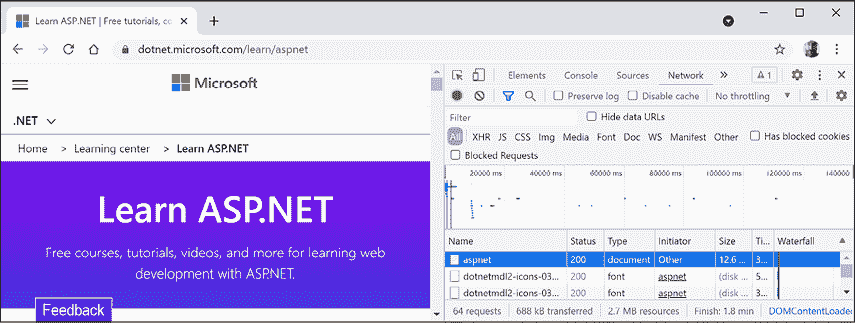
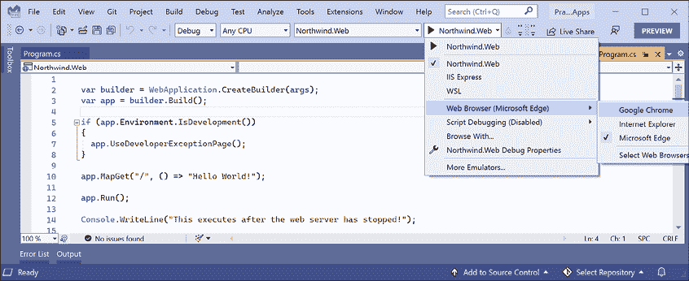
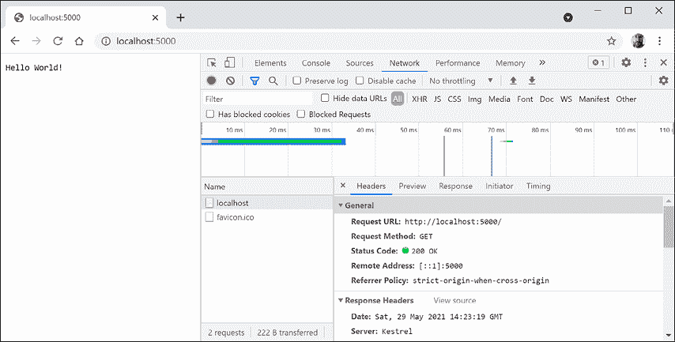
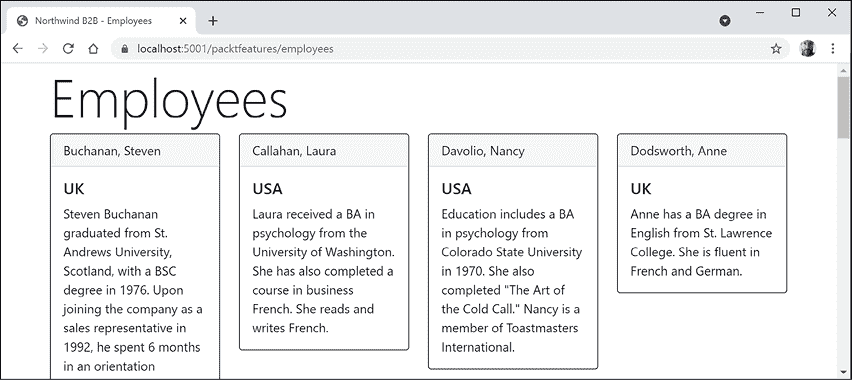

# 第十四章：使用 ASP.NET Core Razor Pages 构建网站

本章是关于使用 Microsoft ASP.NET Core 在服务器端构建具有现代 HTTP 架构的网站。您将学习使用 ASP.NET Core 2.0 引入的 ASP.NET Core Razor Pages 功能以及 ASP.NET Core 2.1 引入的 Razor 类库功能构建简单的网站。

本章将涵盖以下主题：

+   理解 Web 开发

+   理解 ASP.NET Core

+   探索 ASP.NET Core Razor Pages

+   使用 Entity Framework Core 与 ASP.NET Core

+   使用 Razor 类库

+   配置服务和 HTTP 请求管道

# 理解 Web 开发

开发 Web 意味着使用**超文本传输协议**（**HTTP**）进行开发，因此我们将从回顾这一重要的基础技术开始。

## 理解 HTTP

为了与 Web 服务器通信，客户端，也称为**用户代理**，使用 HTTP 通过网络进行调用。因此，HTTP 是 Web 的技术基础。所以，当我们谈论网站和 Web 服务时，我们的意思是它们使用 HTTP 在客户端（通常是 Web 浏览器）和服务器之间进行通信。

客户端对资源（如页面）发出 HTTP 请求，该资源由**统一资源定位符**（**URL**）唯一标识，服务器发送回 HTTP 响应，如*图 14.1*所示：


图 14.1：HTTP 请求和响应

您可以使用 Google Chrome 和其他浏览器记录请求和响应。

**最佳实践**：Google Chrome 在比任何其他浏览器更多的操作系统上可用，并且它具有强大的内置开发工具，因此它是测试网站的首选浏览器。始终使用 Chrome 以及至少另外两种浏览器（例如，macOS 和 iPhone 上的 Firefox 和 Safari）测试您的 Web 应用程序。Microsoft Edge 在 2019 年从使用 Microsoft 自己的渲染引擎切换到使用 Chromium，因此测试它的重要性较低。如果使用 Microsoft 的 Internet Explorer，则通常主要用于组织内部网。

### 理解 URL 的组成部分

URL 由几个部分组成：

+   **方案**：`http`（明文）或`https`（加密）。

+   **域**：对于生产网站或服务，**顶级域**（**TLD**）可能是`example.com`。您可能有子域，例如`www`、`jobs`或`extranet`。在开发过程中，您通常为所有网站和服务使用`localhost`。

+   **端口号**：对于生产网站或服务，`http`为`80`，`https`为`443`。这些端口号通常从方案中推断出来。在开发过程中，通常使用其他端口号，例如`5000`、`5001`等，以区分使用共享域`localhost`的所有网站和服务。

+   **路径**：到资源的相对路径，例如，`/customers/germany`。

+   **查询字符串**：传递参数值的一种方式，例如，`?country=Germany&searchtext=shoes`。

+   **片段**：通过其`id`引用网页上的元素，例如，`#toc`。

### 为本书中的项目分配端口号

本书中，我们将为所有网站和服务使用域名`localhost`，因此当多个项目需要同时执行时，我们将使用端口号来区分项目，如下表所示：

| 项目 | 描述 | 端口号 |
| --- | --- | --- |
| `Northwind.Web` | ASP.NET Core Razor Pages 网站 | `5000 HTTP`, `5001 HTTPS` |
| `Northwind.Mvc` | ASP.NET Core MVC 网站 | `5000 HTTP`, `5001 HTTPS` |
| `Northwind.WebApi` | ASP.NET Core Web API 服务 | `5002 HTTPS`, `5008 HTTP` |
| `Minimal.WebApi` | ASP.NET Core Web API（最小化） | `5003 HTTPS` |
| `Northwind.OData` | ASP.NET Core OData 服务 | `5004 HTTPS` |
| `Northwind.GraphQL` | ASP.NET Core GraphQL 服务 | `5005 HTTPS` |
| `Northwind.gRPC` | ASP.NET Core gRPC 服务 | `5006 HTTPS` |
| `Northwind.AzureFuncs` | Azure Functions 纳米服务 | `7071 HTTP` |

## 使用 Google Chrome 发起 HTTP 请求

让我们探索如何使用 Google Chrome 发起 HTTP 请求：

1.  启动 Google Chrome。

1.  导航至**更多工具** | **开发者工具**。

1.  点击**网络**标签，Chrome 应立即开始记录浏览器与任何 Web 服务器之间的网络流量（注意红色圆圈），如图 *14.2* 所示：

    图 14.2：Chrome 开发者工具记录网络流量

1.  在 Chrome 地址栏中，输入微软学习 ASP.NET 的网站地址，如下所示：

    [`dotnet.microsoft.com/learn/aspnet`](https://dotnet.microsoft.com/learn/aspnet)

1.  在开发者工具中，在记录的请求列表中滚动到顶部，点击第一个条目，即**类型**为**文档**的行，如图 *14.3* 所示：

    图 14.3：开发者工具中记录的请求

1.  在右侧，点击**头部**标签，您将看到有关**请求头部**和**响应头部**的详细信息，如图 *14.4* 所示：

    图 14.4：请求和响应头部

    注意以下方面：

    +   **请求方法**为`GET`。其他可能在此处看到的 HTTP 方法包括`POST`、`PUT`、`DELETE`、`HEAD`和`PATCH`。

    +   **状态码**为`200 OK`。这意味着服务器找到了浏览器请求的资源，并将其作为响应的主体返回。其他可能看到的`GET`请求响应状态码包括`301 永久移动`、`400 错误请求`、`401 未授权`和`404 未找到`。

    +   **请求头部**由浏览器发送给 Web 服务器，包括：

        +   **accept**，列出了浏览器接受的格式。在这种情况下，浏览器表示它理解 HTML、XHTML、XML 和一些图像格式，但它将接受所有其他文件（`*/*`）。默认权重，也称为质量值，是`1.0`。XML 的质量值指定为`0.9`，因此其优先级低于 HTML 或 XHTML。所有其他文件类型的质量值为`0.8`，因此优先级最低。

        +   **accept-encoding**，列出了浏览器理解的压缩算法，在这种情况下，包括 GZIP、DEFLATE 和 Brotli。

        +   **accept-language**，列出了浏览器希望内容使用的语言。在这种情况下，首先是美国英语，其默认质量值为`1.0`，其次是任何具有明确指定质量值`0.9`的英语方言，然后是任何具有明确指定质量值`0.8`的瑞典语方言。

    +   **响应头**，`content-encoding`告诉我服务器已使用 GZIP 算法压缩 HTML 网页响应，因为它知道客户端可以解压缩该格式。（这在*图 14.4*中不可见，因为没有足够的空间展开**响应头**部分。）

1.  关闭 Chrome。

## 理解客户端网页开发技术

在构建网站时，开发者需要了解的不仅仅是 C#和.NET。在客户端（即在网页浏览器中），您将使用以下技术的组合：

+   **HTML5**：用于网页的内容和结构。

+   **CSS3**：用于网页上元素的样式。

+   **JavaScript**：用于编写网页所需的任何业务逻辑，例如验证表单输入或调用网页服务以获取网页所需的其他数据。

尽管 HTML5、CSS3 和 JavaScript 是前端网页开发的基本组成部分，但还有许多其他技术可以使前端网页开发更高效，包括全球最受欢迎的前端开源工具包 Bootstrap，以及用于样式的 CSS 预处理器如 SASS 和 LESS，用于编写更健壮代码的 Microsoft TypeScript 语言，以及 JavaScript 库如 jQuery、Angular、React 和 Vue。所有这些更高级别的技术最终都会翻译或编译到基础的三个核心技术，因此它们在所有现代浏览器中都能工作。

作为构建和部署过程的一部分，您可能会使用诸如 Node.js；客户端包管理器 npm 和 Yarn；以及 webpack，这是一个流行的模块捆绑器，用于编译、转换和捆绑网站源文件的工具。

# 理解 ASP.NET Core

Microsoft ASP.NET Core 是微软多年来用于构建网站和服务的一系列技术的一部分：

+   **Active Server Pages**（**ASP**）于 1996 年发布，是微软首次尝试为动态服务器端执行网站代码提供的平台。ASP 文件包含 HTML 和服务器端执行的 VBScript 代码的混合体。

+   **ASP.NET Web Forms** 于 2002 年随.NET Framework 一同发布，旨在让非 Web 开发者（如熟悉 Visual Basic 的开发者）通过拖放可视组件和编写 Visual Basic 或 C#的事件驱动代码快速创建网站。对于新的.NET Framework Web 项目，应避免使用 Web Forms，转而采用 ASP.NET MVC。

+   **Windows Communication Foundation**（**WCF**）于 2006 年发布，使开发者能够构建 SOAP 和 REST 服务。SOAP 功能强大但复杂，除非需要高级特性（如分布式事务和复杂的消息拓扑），否则应避免使用。

+   **ASP.NET MVC** 于 2009 年发布，旨在清晰地将 Web 开发者的关注点分离为**模型**（临时存储数据）、**视图**（以各种格式在 UI 中呈现数据）和**控制器**（获取模型并将其传递给视图）。这种分离提高了代码复用性和单元测试能力。

+   **ASP.NET Web API** 于 2012 年发布，使开发者能够创建比 SOAP 服务更简单、更可扩展的 HTTP 服务（即 REST 服务）。

+   **ASP.NET SignalR** 于 2013 年发布，通过抽象底层技术（如 WebSockets 和长轮询）实现网站的实时通信。这使得网站能够提供如实时聊天或对时间敏感数据（如股票价格）的更新等功能，即使在不支持 WebSockets 等底层技术的多种浏览器上也能运行。

+   **ASP.NET Core** 于 2016 年发布，它将.NET Framework 的现代实现（如 MVC、Web API 和 SignalR）与新技术（如 Razor Pages、gRPC 和 Blazor）相结合，全部运行在现代.NET 上，因此支持跨平台执行。ASP.NET Core 提供了多种项目模板，帮助你快速上手其支持的技术。

**最佳实践**：选择 ASP.NET Core 开发网站和服务，因为它包含了现代且跨平台的 Web 相关技术。

ASP.NET Core 2.0 至 2.2 版本既可运行于.NET Framework 4.6.1 及以上版本（仅限 Windows），也可运行于.NET Core 2.0 及以上版本（跨平台）。ASP.NET Core 3.0 仅支持.NET Core 3.0。ASP.NET Core 6.0 仅支持.NET 6.0。

## 经典 ASP.NET 与现代 ASP.NET Core 的对比

迄今为止，ASP.NET 一直构建在.NET Framework 中的一个大型程序集`System.Web.dll`之上，并与微软的 Windows 专用 Web 服务器**Internet Information Services**（**IIS**）紧密耦合。多年来，该程序集积累了许多功能，其中许多功能不适用于现代的跨平台开发。

ASP.NET Core 是对 ASP.NET 的重大重新设计。它去除了对`System.Web.dll`程序集和 IIS 的依赖，并由模块化轻量级包组成，就像现代.NET 的其他部分一样。虽然 ASP.NET Core 仍然支持使用 IIS 作为 Web 服务器，但还有更好的选择。

你可以在 Windows、macOS 和 Linux 上跨平台开发和运行 ASP.NET Core 应用程序。微软甚至创建了一个跨平台的、高性能的 Web 服务器，名为**Kestrel**，整个技术栈都是开源的。

ASP.NET Core 2.2 及以上版本的项目默认采用新的进程内托管模型。这使得在 Microsoft IIS 中托管时性能提升了 400%，但微软仍建议使用 Kestrel 以获得更佳性能。

## 创建一个空的 ASP.NET Core 项目

我们将创建一个 ASP.NET Core 项目，该项目将显示 Northwind 数据库中的供应商列表。

`dotnet`工具提供了许多项目模板，这些模板为你做了很多工作，但很难知道在特定情况下哪个最适合，因此我们将从空网站项目模板开始，然后逐步添加功能，以便你可以理解所有组件：

1.  使用你偏好的代码编辑器添加一个新项目，如下表所定义：

    1.  项目模板：**ASP.NET Core Empty** / `web`

    1.  语言：C#

    1.  工作区/解决方案文件和文件夹：`PracticalApps`

    1.  项目文件和文件夹：`Northwind.Web`

    1.  对于 Visual Studio 2022，保持所有其他选项为其默认设置，例如，选中**为 HTTPS 配置**，未选中**启用 Docker**。

1.  在 Visual Studio Code 中，选择`Northwind.Web`作为活动的 OmniSharp 项目。

1.  构建`Northwind.Web`项目。

1.  打开`Northwind.Web.csproj`文件，并注意到该项目类似于类库，只是其 SDK 为`Microsoft.NET.Sdk.Web`，如下所示高亮显示：

    ```cs
    <Project Sdk="**Microsoft.NET.Sdk.Web**">
      <PropertyGroup>
        <TargetFramework>net6.0</TargetFramework>
        <Nullable>enable</Nullable>
        <ImplicitUsings>enable</ImplicitUsings>
      </PropertyGroup>
    </Project> 
    ```

1.  如果你使用的是 Visual Studio 2022，在**解决方案资源管理器**中，切换**显示所有文件**。

1.  展开`obj`文件夹，展开`Debug`文件夹，展开`net6.0`文件夹，选择`Northwind.Web.GlobalUsings.g.cs`文件，并注意到隐式导入的命名空间包括所有控制台应用或类库的命名空间，以及一些 ASP.NET Core 的命名空间，如`Microsoft.AspNetCore.Builder`，如下所示：

    ```cs
    // <autogenerated />
    global using global::Microsoft.AspNetCore.Builder;
    global using global::Microsoft.AspNetCore.Hosting;
    global using global::Microsoft.AspNetCore.Http;
    global using global::Microsoft.AspNetCore.Routing;
    global using global::Microsoft.Extensions.Configuration;
    global using global::Microsoft.Extensions.DependencyInjection;
    global using global::Microsoft.Extensions.Hosting;
    global using global::Microsoft.Extensions.Logging;
    global using global::System;
    global using global::System.Collections.Generic;
    global using global::System.IO;
    global using global::System.Linq;
    global using global::System.Net.Http;
    global using global::System.Net.Http.Json;
    global using global::System.Threading;
    global using global::System.Threading.Tasks; 
    ```

1.  折叠`obj`文件夹。

1.  打开`Program.cs`，并注意以下内容：

    +   ASP.NET Core 项目类似于顶级控制台应用程序，其入口点是一个隐藏的`Main`方法，该方法通过名为`args`的参数传递。

    +   它调用`WebApplication.CreateBuilder`，该方法使用 Web 主机的默认设置创建一个网站主机，然后构建该主机。

    +   该网站将对所有 HTTP `GET`请求做出响应，返回纯文本：`Hello World!`。

    +   调用`Run`方法是一个阻塞调用，因此隐藏的`Main`方法直到 Web 服务器停止运行才返回，如下所示：

    ```cs
    var builder = WebApplication.CreateBuilder(args);
    var app = builder.Build();
    app.MapGet("/", () => "Hello World!");
    app.Run(); 
    ```

1.  在文件底部，添加一条语句，在调用 `Run` 方法后（即 Web 服务器停止后）向控制台写入一条消息，如下所示高亮显示：

    ```cs
    app.Run();
    **Console.WriteLine(****"This executes after the web server has stopped!"****);** 
    ```

## 测试和保护网站

现在我们将测试 ASP.NET Core 空网站项目的功能，并通过从 HTTP 切换到 HTTPS 来启用浏览器和 Web 服务器之间所有流量的加密，以保护隐私。HTTPS 是 HTTP 的安全加密版本。

1.  对于 Visual Studio：

    1.  在工具栏中，确保选中**Northwind.Web** 而不是 **IIS Express** 或 **WSL**，并将**Web 浏览器（Microsoft Edge）**切换到**Google Chrome**，如*图 14.5* 所示：

        图 14.5：在 Visual Studio 中选择带有 Kestrel Web 服务器的 Northwind.Web 配置文件

    1.  导航至**调试** | **开始执行(不调试)…**。

    1.  首次启动安全网站时，系统会提示你的项目已配置为使用 SSL，为了避免浏览器警告，你可以选择信任 ASP.NET Core 生成的自签名证书。点击**是**。

    1.  当看到**安全警告**对话框时，再次点击**是**。

1.  对于 Visual Studio Code，在**终端**中输入 `dotnet run` 命令。

1.  在 Visual Studio 的命令提示窗口或 Visual Studio Code 的终端中，注意 Kestrel Web 服务器已开始在随机端口上监听 HTTP 和 HTTPS，你可以按 Ctrl + C 关闭 Kestrel Web 服务器，并且托管环境为 `Development`，如下所示：

    ```cs
    info: Microsoft.Hosting.Lifetime[14]
      Now listening on: https://localhost:5001 
    info: Microsoft.Hosting.Lifetime[14]
      Now listening on: http://localhost:5000 
    info: Microsoft.Hosting.Lifetime[0]
      Application started. Press Ctrl+C to shut down. 
    info: Microsoft.Hosting.Lifetime[0]
      Hosting environment: Development 
    info: Microsoft.Hosting.Lifetime[0]
      Content root path: C:\Code\PracticalApps\Northwind.Web 
    ```

    Visual Studio 还会自动启动你选择的浏览器。如果你使用的是 Visual Studio Code，则需要手动启动 Chrome。

1.  保持 Web 服务器运行。

1.  在 Chrome 中，打开**开发者工具**，然后点击**网络**标签。

1.  输入地址 `http://localhost:5000/`，或分配给 HTTP 的任何端口号，并注意响应是来自跨平台 Kestrel Web 服务器的 `Hello World!` 纯文本，如*图 14.6* 所示：

    图 14.6：来自 http://localhost:5000/ 的纯文本响应

    Chrome 也会自动请求一个 `favicon.ico` 文件以显示在浏览器标签页中，但该文件缺失，因此显示为 `404 Not Found` 错误。

1.  输入地址 `https://localhost:5001/`，或分配给 HTTPS 的任何端口号，并注意如果你没有使用 Visual Studio 或在被提示信任 SSL 证书时点击了**否**，则响应将是一个隐私错误，如*图 14.7* 所示：

    图 14.7：显示 SSL 加密未使用证书启用的隐私错误

    如果你未配置浏览器可信任的证书来加密和解密 HTTPS 流量，则会看到此错误（如果你未看到此错误，则是因为你已经配置了证书）。

    在生产环境中，你可能会希望向 Verisign 等公司支付费用以获取 SSL 证书，因为他们提供责任保护和技术支持。

    **Linux 开发者注意**：如果你使用的 Linux 发行版无法创建自签名证书，或者你不介意每 90 天重新申请新证书，那么你可以通过以下链接获取免费证书：[`letsencrypt.org`](https://letsencrypt.org)

    在开发过程中，你可以指示操作系统信任 ASP.NET Core 提供的临时开发证书。

1.  在命令行或**终端**中，按 Ctrl + C 关闭 Web 服务器，并注意写入的消息，如下所示突出显示：

    ```cs
    info: Microsoft.Hosting.Lifetime[0]
          Application is shutting down...
    **This executes after the web server has stopped!**
    C:\Code\PracticalApps\Northwind.Web\bin\Debug\net6.0\Northwind.Web.exe (process 19888) exited with code 0. 
    ```

1.  如果你需要信任本地自签名 SSL 证书，那么在命令行或**终端**中输入`dotnet dev-certs https --trust`命令，并注意消息提示，**请求信任 HTTPS 开发证书**。你可能需要输入密码，并且可能已经存在有效的 HTTPS 证书。

### 加强安全并自动重定向至安全连接

启用更严格的安全措施并自动将 HTTP 请求重定向到 HTTPS 是一种良好实践。

**良好实践**：**HTTP 严格传输安全**（**HSTS**）是一种应始终启用的可选安全增强措施。如果网站指定它且浏览器支持它，那么它将强制所有通信通过 HTTPS 进行，并阻止访问者使用不受信任或无效的证书。

现在让我们进行操作：

1.  在`Program.cs`中，添加一个`if`语句，在非开发环境下启用 HSTS，如下代码所示：

    ```cs
    if (!app.Environment.IsDevelopment())
    {
      app.UseHsts();
    } 
    ```

1.  在调用`app.MapGet`之前添加一条语句，将 HTTP 请求重定向到 HTTPS，如下代码所示：

    ```cs
    app.UseHttpsRedirection(); 
    ```

1.  启动**Northwind.Web**网站项目。

1.  如果 Chrome 仍在运行，请关闭并重新启动它。

1.  在 Chrome 中，显示**开发者工具**，并点击**网络**标签。

1.  输入地址`http://localhost:5000/`，或分配给 HTTP 的任何端口号，并注意服务器如何响应`307 临时重定向`到端口`5001`，以及证书现在如何有效且受信任，如图*14.8*所示：

    图 14.8：现在连接已通过有效证书和 307 重定向得到安全保障

1.  关闭 Chrome。

1.  关闭 Web 服务器。

**良好实践**：记得在完成网站测试后关闭 Kestrel Web 服务器。

## 控制托管环境

在 ASP.NET Core 早期版本中，项目模板设定了一项规则，即在开发模式下，任何未处理的异常都会在浏览器窗口中显示，以便开发者查看异常详情，如下代码所示：

```cs
if (app.Environment.IsDevelopment())
{
  app.UseDeveloperExceptionPage();
} 
```

ASP.NET Core 6 及更高版本中，此代码默认会自动执行，因此不会包含在项目模板中。

ASP.NET Core 如何知道我们何时处于开发模式，使得`IsDevelopment`方法返回`true`？让我们来探究一下。

ASP.NET Core 可以从环境变量中读取以确定使用哪个托管环境，例如`DOTNET_ENVIRONMENT`或`ASPNETCORE_ENVIRONMENT`。

您可以在本地开发期间覆盖这些设置：

1.  在`Northwind.Web`文件夹中，展开名为`Properties`的文件夹，打开名为`launchSettings.json`的文件，并注意名为`Northwind.Web`的配置文件，该配置文件将托管环境设置为`Development`，如下所示：

    ```cs
    {
      "iisSettings": {
        "windowsAuthentication": false,
        "anonymousAuthentication": true,
        "iisExpress": {
          "applicationUrl": "http://localhost:56111",
          "sslPort": 44329
        }
      },
      "profiles": {
    **"Northwind.Web"****: {**
    **"commandName"****:** **"Project"****,**
    **"dotnetRunMessages"****:** **"true"****,**
    **"launchBrowser"****:** **true****,**
    **"applicationUrl"****:** **"https://localhost:5001;http://localhost:5000"****,** 
    **"environmentVariables"****: {**
    **"ASPNETCORE_ENVIRONMENT"****:** **"Development"**
     **}**
     **},**
        "IIS Express": {
          "commandName": "IISExpress",
          "launchBrowser": true, 
          "environmentVariables": {
            "ASPNETCORE_ENVIRONMENT": "Development"
          }
        }
      }
    } 
    ```

1.  将随机分配的 HTTP 端口号更改为`5000`，HTTPS 端口号更改为`5001`。

1.  将环境更改为`Production`。可选地，将`launchBrowser`更改为`false`以防止 Visual Studio 自动启动浏览器。

1.  启动网站并注意托管环境为`Production`，如下所示：

    ```cs
    info: Microsoft.Hosting.Lifetime[0] 
      Hosting environment: Production 
    ```

1.  关闭 Web 服务器。

1.  在`launchSettings.json`中，将环境更改回`Development`。

`launchSettings.json`文件还具有使用随机端口号使用 IIS 作为 Web 服务器的配置。在本书中，我们将仅使用 Kestrel 作为 Web 服务器，因为它跨平台。

## 服务和管道配置的分离

将所有代码初始化一个简单的 Web 项目放在`Program.cs`中可能是一个好主意，特别是对于 Web 服务，因此我们将在*第十六章*，*构建和消费 Web 服务*中再次看到这种风格。

然而，对于任何比最基本的 Web 项目更复杂的情况，您可能更愿意将配置分离到一个单独的`Startup`类中，该类包含两个方法：

+   `ConfigureServices(IServiceCollection services)`：向依赖注入容器添加依赖服务，例如 Razor Pages 支持、**跨源资源共享**（**CORS**）支持，或用于处理 Northwind 数据库的数据库上下文。

+   `Configure(IApplicationBuilder app, IWebHostEnvironment env)`：通过调用`app`参数上的各种`Use`方法来设置 HTTP 管道，请求和响应通过该管道流动。按照应处理功能的顺序构建管道！[](img/B17442_15_09.png)

图 14.9：Startup 类 ConfigureServices 和 Configure 方法图

这两个方法将由运行时自动调用。

现在让我们创建一个`Startup`类：

1.  向`Northwind.Web`项目添加一个名为`Startup.cs`的新类文件。

1.  修改`Startup.cs`，如下所示：

    ```cs
    namespace Northwind.Web;
    public class Startup
    {
      public void ConfigureServices(IServiceCollection services)
      {
      }
      public void Configure(
        IApplicationBuilder app, IWebHostEnvironment env)
      {
        if (!env.IsDevelopment())
        {
          app.UseHsts();
        }
        app.UseRouting(); // start endpoint routing
        app.UseHttpsRedirection();
        app.UseEndpoints(endpoints =>
        {
          endpoints.MapGet("/", () => "Hello World!");
        });
      }
    } 
    ```

    请注意以下代码内容：

    +   `ConfigureServices`方法目前为空，因为我们尚未需要添加任何依赖服务。

    +   通过`Configure`方法设置 HTTP 请求管道并启用端点路由功能。它配置了一个路由端点，该端点等待根路径`/`的每个 HTTP `GET`请求，并通过返回纯文本`"Hello World!"`来响应这些请求。我们将在本章末尾学习路由端点及其好处。

    现在我们必须指定在应用程序入口点使用`Startup`类。

1.  修改`Program.cs`，如下所示：

    ```cs
    using Northwind.Web; // Startup
    Host.CreateDefaultBuilder(args)
      .ConfigureWebHostDefaults(webBuilder =>
      {
        webBuilder.UseStartup<Startup>();
      }).Build().Run();
    Console.WriteLine("This executes after the web server has stopped!"); 
    ```

1.  启动网站并注意其行为与之前相同。

1.  关闭 Web 服务器。

在本书中创建的所有其他网站和服务项目中，我们将使用.NET 6 项目模板创建的单个`Program.cs`文件。如果你喜欢使用`Startup.cs`的方式，那么你将在本章中看到如何使用它。

## 使网站能够提供静态内容

一个仅返回单一纯文本消息的网站并不十分有用！

至少，它应该返回静态 HTML 页面、网页将用于样式的 CSS 以及任何其他静态资源，如图像和视频。

按照惯例，这些文件应存储在名为`wwwroot`的目录中，以将它们与网站项目中动态执行的部分分开。

### 创建静态文件文件夹和网页

你现在将为静态网站资源创建一个文件夹，并创建一个使用 Bootstrap 进行样式设置的基本索引页面：

1.  在`Northwind.Web`项目/文件夹中，创建一个名为`wwwroot`的文件夹。

1.  向`wwwroot`文件夹添加一个新的 HTML 页面文件，命名为`index.html`。

1.  修改其内容，链接到 CDN 托管的 Bootstrap 以进行样式设置，并采用现代良好实践，例如设置视口，如下所示标记：

    ```cs
    <!doctype html>
    <html lang="en">
    <head>
      <!-- Required meta tags -->
      <meta charset="utf-8" />
      <meta name="viewport" content=
        "width=device-width, initial-scale=1 " />
      <!-- Bootstrap CSS -->
      <link href=
    "https://cdn.jsdelivr.net/npm/bootstrap@5.1.0/dist/css/bootstrap.min.css" rel="stylesheet" integrity="sha384-KyZXEAg3QhqLMpG8r+8fhAXLRk2vvoC2f3B09zVXn8CA5QIVfZOJ3BCsw2P0p/We" crossorigin="anonymous">
      <title>Welcome ASP.NET Core!</title>
    </head>
    <body>
      <div class="container">
        <div class="jumbotron">
          <h1 class="display-3">Welcome to Northwind B2B</h1>
          <p class="lead">We supply products to our customers.</p>
          <hr />
          <h2>This is a static HTML page.</h2>
          <p>Our customers include restaurants, hotels, and cruise lines.</p>
          <p>
            <a class="btn btn-primary" 
              href="https://www.asp.net/">Learn more</a>
          </p>
        </div>
      </div>
    </body>
    </html> 
    ```

**良好实践**：为了获取最新的`<link>`元素用于 Bootstrap，请从以下链接的文档中复制并粘贴它：[`getbootstrap.com/docs/5.0/getting-started/introduction/#starter-template`](https://getbootstrap.com/docs/5.0/getting-started/introduction/#starter-template)。

### 启用静态和默认文件

如果你现在启动网站并在地址栏中输入`http://localhost:5000/index.html`，网站将返回一个`404 Not Found`错误，表示未找到网页。为了使网站能够返回诸如`index.html`之类的静态文件，我们必须明确配置该功能。

即使我们启用了静态文件，如果你启动网站并在地址栏中输入`http://localhost:5000/`，网站将返回一个`404 Not Found`错误，因为 Web 服务器不知道如果没有请求特定文件，默认应该返回什么。

你现在将启用静态文件，明确配置默认文件，并更改注册的 URL 路径，该路径返回纯文本`Hello World!`响应：

1.  在`Startup.cs`中，在`Configure`方法中，在启用 HTTPS 重定向后添加语句以启用静态文件和默认文件，并修改将`GET`请求映射到返回`Hello World!`纯文本响应的语句，使其仅响应 URL 路径`/hello`，如下所示突出显示的代码：

    ```cs
    app.UseHttpsRedirection();
    **app.UseDefaultFiles();** **// index.html, default.html, and so on**
    **app.UseStaticFiles();**
    app.UseEndpoints(endpoints =>
    {
      endpoints.MapGet(**"/hello"**, () => "Hello World!");
    }); 
    ```

    调用`UseDefaultFiles`必须在调用`UseStaticFiles`之前，否则它不会工作！你将在本章末了解更多关于中间件和端点路由的顺序。

1.  启动网站。

1.  启动**Chrome**并显示**开发者工具**。

1.  在 Chrome 中，输入`http://localhost:5000/`，并注意您被重定向到端口`5001`上的 HTTPS 地址，并且`index.html`文件现在通过该安全连接返回，因为它是该网站可能的默认文件之一。

1.  在**开发者工具**中，注意对 Bootstrap 样式表的请求。

1.  在 Chrome 中，输入`http://localhost:5000/hello`，并注意它返回与之前一样的纯文本`Hello World!`。

1.  关闭 Chrome 并关闭 Web 服务器。

如果所有网页都是静态的，即它们仅由网页编辑器手动更改，那么我们的网站编程工作就完成了。但几乎所有网站都需要动态内容，这意味着在运行时通过执行代码生成的网页。

最简单的方法是使用 ASP.NET Core 的一个名为**Razor 页面**的功能。

# 探索 ASP.NET Core Razor Pages

ASP.NET Core Razor Pages 允许开发人员轻松地将 C#代码语句与 HTML 标记混合，以使生成的网页动态化。这就是为什么它们使用`.cshtml`文件扩展名。

按照惯例，ASP.NET Core 会在名为`Pages`的文件夹中查找 Razor 页面。

## 启用 Razor 页面

现在，您将把静态 HTML 页面转换为动态 Razor 页面，并添加并启用 Razor 页面服务：

1.  在`Northwind.Web`项目文件夹中，创建一个名为`Pages`的文件夹。

1.  将`index.html`文件复制到`Pages`文件夹中。

1.  对于`Pages`文件夹中的文件，将文件扩展名从`.html`更改为`.cshtml`。

1.  删除表示这是静态 HTML 页面的`<h2>`元素。

1.  在`Startup.cs`中的`ConfigureServices`方法中，添加一个语句以将 ASP.NET Core Razor Pages 及其相关服务（如模型绑定、授权、防伪、视图和标签助手）添加到构建器中，如下所示：

    ```cs
    services.AddRazorPages(); 
    ```

1.  在`Startup.cs`中的`Configure`方法中，在配置使用端点的部分，添加一个语句以调用`MapRazorPages`方法，如下所示：

    ```cs
    app.UseEndpoints(endpoints =>
    {
     **endpoints.MapRazorPages();**
      endpoints.MapGet("/hello",  () => "Hello World!");
    }); 
    ```

## 向 Razor 页面添加代码

在网页的 HTML 标记中，Razor 语法由`@`符号表示。Razor 页面可以描述如下：

+   它们需要在文件顶部使用`@page`指令。

+   它们可以有可选的`@functions`部分，定义以下任何内容：

    +   用于存储数据值的属性，类似于类定义。该类的实例会自动实例化名为`Model`，其属性可以在特殊方法中设置，并且可以在 HTML 中获取属性值。

    +   当进行 HTTP 请求（如`GET`、`POST`和`DELETE`）时，执行名为`OnGet`、`OnPost`、`OnDelete`等方法。

现在让我们将静态 HTML 页面转换为 Razor 页面：

1.  在`Pages`文件夹中，打开`index.cshtml`。

1.  在文件顶部添加`@page`语句。

1.  在`@page`语句之后，添加一个`@functions`语句块。

1.  定义一个属性以存储当前日期的名称作为`string`值。

1.  定义一个设置`DayName`的方法，该方法在对该页面进行 HTTP `GET`请求时执行，如下面的代码所示：

    ```cs
    @page
    @functions
    {
      public string? DayName { get; set; }
      public void OnGet()
      {
        Model.DayName = DateTime.Now.ToString("dddd");
      }
    } 
    ```

1.  在第二个 HTML 段落中输出日期名称，如下面的标记中突出显示的那样：

    ```cs
    <p>**It's @Model.DayName!** Our customers include restaurants, hotels, and cruise lines.</p> 
    ```

1.  启动网站。

1.  在 Chrome 中输入`https://localhost:5001/`，并注意当前日期名称输出在页面上，如*图 14.10*所示：

    *图 14.10*：欢迎来到 Northwind 页面显示当前日期

1.  在 Chrome 中输入`https://localhost:5001/index.html`，它与静态文件名完全匹配，并注意它像以前一样返回静态 HTML 页面。

1.  在 Chrome 中输入`https://localhost:5001/hello`，它与返回纯文本的端点路由完全匹配，并注意它像以前一样返回`Hello World!`。

1.  关闭 Chrome 并停止 Web 服务器。

## 使用 Razor Pages 的共享布局

大多数网站都有多个页面。如果每个页面都必须包含当前`index.cshtml`中的所有样板标记，那将变得难以管理。因此，ASP.NET Core 提供了一个名为**布局**的功能。

要使用布局，我们必须创建一个 Razor 文件来定义所有 Razor Pages（和所有 MVC 视图）的默认布局，并将其存储在`Shared`文件夹中，以便通过约定轻松找到。此文件的名称可以是任何名称，因为我们将会指定它，但`_Layout.cshtml`是良好的实践。

我们还必须创建一个特殊命名的文件来设置所有 Razor Pages（和所有 MVC 视图）的默认布局文件。此文件必须命名为`_ViewStart.cshtml`。

让我们看看布局的实际应用：

1.  在`Pages`文件夹中，添加一个名为`_ViewStart.cshtml`的文件。（Visual Studio 项模板名为**Razor 视图开始**。）

1.  修改其内容，如下面的标记所示：

    ```cs
    @{
      Layout = "_Layout";
    } 
    ```

1.  在`Pages`文件夹中，创建一个名为`Shared`的文件夹。

1.  在`Shared`文件夹中，创建一个名为`_Layout.cshtml`的文件。（Visual Studio 项模板名为**Razor 布局**。）

1.  修改`_Layout.cshtml`的内容（它与`index.cshtml`类似，因此你可以从那里复制粘贴 HTML 标记），如下面的标记所示：

    ```cs
    <!doctype html>
    <html lang="en">
    <head>
      <!-- Required meta tags -->
      <meta charset="utf-8" />
      <meta name="viewport" content=
        "width=device-width, initial-scale=1, shrink-to-fit=no" />
      <!-- Bootstrap CSS -->
      <link href=
    "https://cdn.jsdelivr.net/npm/bootstrap@5.1.0/dist/css/bootstrap.min.css" rel="stylesheet" integrity="sha384-KyZXEAg3QhqLMpG8r+8fhAXLRk2vvoC2f3B09zVXn8CA5QIVfZOJ3BCsw2P0p/We" crossorigin="anonymous">
      <title>@ViewData["Title"]</title>
    </head>
    <body>
      <div class="container">
        @RenderBody()
        <hr />
        <footer>
          <p>Copyright &copy; 2021 - @ViewData["Title"]</p>
        </footer>
      </div>
      <!-- JavaScript to enable features like carousel -->
      <script src="img/bootstrap.bundle.min.js" integrity="sha384-U1DAWAznBHeqEIlVSCgzq+c9gqGAJn5c/t99JyeKa9xxaYpSvHU5awsuZVVFIhvj" crossorigin="anonymous"></script>
      @RenderSection("Scripts", required: false)
    </body>
    </html> 
    ```

    在审查前面的标记时，请注意以下几点：

    +   `<title>`通过从名为`ViewData`的字典中使用服务器端代码动态设置。这是一种在 ASP.NET Core 网站的不同部分之间传递数据的简单方法。在这种情况下，数据将在 Razor 页面类文件中设置，然后在共享布局中输出。

    +   `@RenderBody()`标记了请求视图的插入点。

    +   每个页面底部都会出现一条水平线和页脚。

    +   布局底部有一个脚本，用于实现 Bootstrap 的一些酷炫功能，我们稍后可以使用，例如图像轮播。

    +   在 Bootstrap 的`<script>`元素之后，我们定义了一个名为`Scripts`的部分，以便 Razor 页面可以有选择地注入它所需的额外脚本。

1.  修改 `index.cshtml` 以删除所有 HTML 标记，除了 `<div class="jumbotron">` 及其内容，并保留你之前添加的 `@functions` 块中的 C# 代码。

1.  向 `OnGet` 方法添加一条语句，将页面标题存储在 `ViewData` 字典中，并修改按钮以导航到供应商页面（我们将在下一节创建），如下所示的高亮标记：

    ```cs
    @page 
    @functions
    {
      public string? DayName { get; set; }
      public void OnGet()
      {
     **ViewData[****"Title"****] =** **"Northwind B2B"****;**
        Model.DayName = DateTime.Now.ToString("dddd");
      }
    }
    <div class="jumbotron">
      <h1 class="display-3">Welcome to Northwind B2B</h1>
      <p class="lead">We supply products to our customers.</p>
      <hr />
      <p>It's @Model.DayName! Our customers include restaurants, hotels, and cruise lines.</p>
      <p>
    **<****a****class****=****"btn btn-primary"****href****=****"suppliers"****>**
     **Learn more about our suppliers****</****a****>**
      </p>
    </div> 
    ```

1.  启动网站，在 Chrome 中访问它，并注意到它与之前有相似的行为，尽管点击供应商按钮会给出 `404 未找到` 错误，因为我们尚未创建该页面。

## 使用 Razor Pages 的代码后置文件

有时，将 HTML 标记与数据和可执行代码分离会更好，因此 Razor Pages 允许你通过将 C# 代码放入 **代码后置** 类文件中来实现这一点。它们与 `.cshtml` 文件同名，但以 `.cshtml.cs` 结尾。

你现在将创建一个显示供应商列表的页面。在本例中，我们专注于学习代码后置文件。在下一个主题中，我们将从数据库加载供应商列表，但现在，我们将使用硬编码的字符串数组来模拟这一过程：

1.  在 `Pages` 文件夹中，添加两个名为 `Suppliers.cshtml` 和 `Suppliers.cshtml.cs` 的新文件。（Visual Studio 项模板名为 **Razor 页面 - 空**，它会创建这两个文件。）

1.  向名为 `Suppliers.cshtml.cs` 的代码后置文件添加如下所示的语句：

    ```cs
    using Microsoft.AspNetCore.Mvc.RazorPages; // PageModel
    namespace Northwind.Web.Pages;
    public class SuppliersModel : PageModel
    {
      public IEnumerable<string>? Suppliers { get; set; }
      public void OnGet()
      {
        ViewData["Title"] = "Northwind B2B - Suppliers";
        Suppliers = new[]
        {
          "Alpha Co", "Beta Limited", "Gamma Corp"
        };
      }
    } 
    ```

    在审查前面的标记时，请注意以下几点：

    +   `SuppliersModel` 继承自 `PageModel`，因此它拥有诸如 `ViewData` 字典等成员，用于共享数据。你可以右键点击 `PageModel` 并选择 **转到定义** 来查看它还有许多其他有用的特性，例如当前请求的整个 `HttpContext`。

    +   `SuppliersModel` 定义了一个用于存储名为 `Suppliers` 的 `string` 值集合的属性。

    +   当对该 Razor 页面发起 HTTP `GET` 请求时，`Suppliers` 属性会用来自字符串数组的一些示例供应商名称进行填充。稍后，我们将从 Northwind 数据库填充此属性。

1.  修改 `Suppliers.cshtml` 的内容，如下所示的标记：

    ```cs
    @page
    @model Northwind.Web.Pages.SuppliersModel
    <div class="row">
      <h1 class="display-2">Suppliers</h1>
      <table class="table">
        <thead class="thead-inverse">
          <tr><th>Company Name</th></tr>
        </thead>
        <tbody>
        @if (Model.Suppliers is not null)
        {
          @foreach(string name in Model.Suppliers)
          {
            <tr><td>@name</td></tr>
          }
        }
        </tbody>
      </table>
    </div> 
    ```

    在审查前面的标记时，请注意以下几点：

    +   此 Razor 页面的模型类型设置为 `SuppliersModel`。

    +   该页面输出一个带有 Bootstrap 样式的 HTML 表格。

    +   如果 `Model` 的 `Suppliers` 属性不为 `null`，则表格中的数据行是通过循环遍历该属性生成的。

1.  启动网站并在 Chrome 中访问它。

1.  点击按钮以了解更多关于供应商的信息，并注意供应商表格，如图 *14.11* 所示：

    图 14.11：从字符串数组加载的供应商表格

# 使用 ASP.NET Core 的 Entity Framework Core

Entity Framework Core 是一种自然而然的方式，将真实数据引入网站。在*第十三章*，*C# 和 .NET 的实际应用介绍*中，你创建了两对类库：一对用于实体模型，另一对用于 Northwind 数据库上下文，适用于 SQL Server 或 SQLite，或两者兼有。现在你将在网站项目中使用它们。

## 将 Entity Framework Core 配置为服务

诸如 Entity Framework Core 数据库上下文之类的功能，对于 ASP.NET Core 是必需的，必须在网站启动时注册为服务。GitHub 仓库解决方案和下面的代码使用 SQLite，但如果你更喜欢，也可以轻松使用 SQL Server。

让我们看看如何操作：

1.  在 `Northwind.Web` 项目中，添加一个项目引用到 `Northwind.Common.DataContext` 项目，适用于 SQLite 或 SQL Server，如下列标记所示：

    ```cs
    <!-- change Sqlite to SqlServer if you prefer -->
    <ItemGroup>
      <ProjectReference Include="..\Northwind.Common.DataContext.Sqlite\
    Northwind.Common.DataContext.Sqlite.csproj" />
    </ItemGroup> 
    ```

    项目引用必须全部在一行上，不能有换行。

1.  构建 `Northwind.Web` 项目。

1.  在 `Startup.cs` 中，导入命名空间以处理你的实体模型类型，如下列代码所示：

    ```cs
    using Packt.Shared; // AddNorthwindContext extension method 
    ```

1.  向 `ConfigureServices` 方法中添加一条语句，以注册 `Northwind` 数据库上下文类，如下列代码所示：

    ```cs
    services.AddNorthwindContext(); 
    ```

1.  在 `Northwind.Web` 项目中，在 `Pages` 文件夹下，打开 `Suppliers.cshtml.cs`，并导入我们的数据库上下文命名空间，如下列代码所示：

    ```cs
    using Packt.Shared; // NorthwindContext 
    ```

1.  在 `SuppliersModel` 类中，添加一个私有字段来存储 `Northwind` 数据库上下文，以及一个构造函数来设置它，如下列代码所示：

    ```cs
    private NorthwindContext db;
    public SuppliersModel(NorthwindContext injectedContext)
    {
      db = injectedContext;
    } 
    ```

1.  将 `Suppliers` 属性更改为包含 `Supplier` 对象而不是 `string` 值。

1.  在 `OnGet` 方法中，修改语句以根据数据库上下文的 `Suppliers` 属性设置 `Suppliers` 属性，按国家和公司名称排序，如下列突出显示的代码所示：

    ```cs
    public void OnGet()
    {
      ViewData["Title"] = "Northwind B2B - Suppliers";
      Suppliers = **db.Suppliers**
     **.OrderBy(c => c.Country).ThenBy(c => c.CompanyName)**;
    } 
    ```

1.  修改 `Suppliers.cshtml` 的内容，以导入 `Packt.Shared` 命名空间，并为每个供应商渲染多个列，如下列突出显示的标记所示：

    ```cs
    @page
    **@using Packt.Shared**
    @model Northwind.Web.Pages.SuppliersModel
    <div class="row">
      <h1 class="display-2">Suppliers</h1>
      <table class="table">
        <thead class="thead-inverse">
          <tr>
            <th>Company Name</th>
    **<****th****>****Country****</****th****>**
    **<****th****>****Phone****</****th****>**
          </tr>
        </thead>
        <tbody>
        @if (Model.Suppliers is not null)
        {
     **@foreach(Supplier s in Model.Suppliers)**
          {
            <tr>
    **<****td****>****@s.CompanyName****</****td****>**
    **<****td****>****@s.Country****</****td****>**
    **<****td****>****@s.Phone****</****td****>**
            </tr>
          }
        }
        </tbody>
      </table>
    </div> 
    ```

1.  启动网站。

1.  在 Chrome 中，输入 `https://localhost:5001/`。

1.  点击 **了解更多关于我们的供应商**，并注意供应商表现在从数据库加载，如*图 14.12* 所示：

图 14.12：从 Northwind 数据库加载的供应商表

## 使用 Razor Pages 操作数据

现在你将添加功能以插入新供应商。

### 启用模型以插入实体

首先，你将修改供应商模型，使其在访问者提交表单以插入新供应商时响应 HTTP `POST` 请求：

1.  在 `Northwind.Web` 项目中，在 `Pages` 文件夹下，打开 `Suppliers.cshtml.cs` 并导入以下命名空间：

    ```cs
    using Microsoft.AspNetCore.Mvc; // [BindProperty], IActionResult 
    ```

1.  在 `SuppliersModel` 类中，添加一个属性来存储单个供应商，以及一个名为 `OnPost` 的方法，如果模型有效，该方法会将供应商添加到 Northwind 数据库的 `Suppliers` 表中，如下列代码所示：

    ```cs
    [BindProperty]
    public Supplier? Supplier { get; set; }
    public IActionResult OnPost()
    {
      if ((Supplier is not null) && ModelState.IsValid)
      {
        db.Suppliers.Add(Supplier);
        db.SaveChanges();
        return RedirectToPage("/suppliers");
      }
      else
      {
        return Page(); // return to original page
      }
    } 
    ```

在回顾前面的代码时，请注意以下几点：

+   我们添加了一个名为`Supplier`的属性，该属性装饰有`[BindProperty]`特性，以便我们可以轻松地将网页上的 HTML 元素连接到`Supplier`类中的属性。

+   我们添加了一个响应 HTTP `POST`请求的方法。它检查所有属性值是否符合`Supplier`类实体模型上的验证规则（如`[Required]`和`[StringLength]`），然后将供应商添加到现有表中，并保存对数据库上下文的更改。这将生成一个 SQL 语句以执行数据库中的插入操作。然后它重定向到`Suppliers`页面，以便访客看到新添加的供应商。

### 定义一个用于插入新供应商的表单

接下来，你将修改 Razor 页面以定义一个表单，访客可以填写并提交以插入新供应商：

1.  在`Suppliers.cshtml`中，在`@model`声明后添加标签助手，以便我们可以在该 Razor 页面上使用诸如`asp-for`之类的标签助手，如下面的标记所示：

    ```cs
    @addTagHelper *, Microsoft.AspNetCore.Mvc.TagHelpers 
    ```

1.  在文件底部，添加一个用于插入新供应商的表单，并使用`asp-for`标签助手将`Supplier`类的`CompanyName`、`Country`和`Phone`属性绑定到输入框，如下面的标记所示：

    ```cs
    <div class="row">
      <p>Enter details for a new supplier:</p>
      <form method="POST">
        <div><input asp-for="Supplier.CompanyName" 
                    placeholder="Company Name" /></div>
        <div><input asp-for="Supplier.Country" 
                    placeholder="Country" /></div>
        <div><input asp-for="Supplier.Phone" 
                    placeholder="Phone" /></div>
        <input type="submit" />
      </form>
    </div> 
    ```

    在审查前面的标记时，请注意以下几点：

    +   带有`POST`方法的`<form>`元素是常规 HTML，因此其中的`<input type="submit" />`元素将使用该表单内其他元素的值向当前页面发出 HTTP `POST`请求。

    +   带有名为`asp-for`的标签助手的`<input>`元素能够将数据绑定到 Razor 页面背后的模型。

1.  启动网站。

1.  点击**了解更多关于我们的供应商**，滚动到页面底部，输入`Bob's Burgers`、`USA`和`(603) 555-4567`，然后点击**提交**。

1.  注意，你会看到一个更新的供应商表，其中新增了供应商。

1.  关闭 Chrome 并关闭 Web 服务器。

## 向 Razor 页面注入依赖服务

如果你有一个没有代码后置文件的`.cshtml` Razor 页面，那么你可以使用`@inject`指令而不是构造函数参数注入来注入依赖服务，然后直接在标记中间使用 Razor 语法引用注入的数据库上下文。

让我们创建一个简单的示例：

1.  在`Pages`文件夹中，添加一个名为`Orders.cshtml`的新文件。（Visual Studio 的项目模板名为**Razor Page - Empty**，它会创建两个文件。删除`.cs`文件。）

1.  在`Orders.cshtml`中，编写代码以输出 Northwind 数据库中的订单数量，如下面的标记所示：

    ```cs
    @page
    @using Packt.Shared
    @inject NorthwindContext db
    @{
      string title = "Orders";
      ViewData["Title"] = $"Northwind B2B - {title}";
    }
    <div class="row">
      <h1 class="display-2">@title</h1>
      <p>
        There are @db.Orders.Count() orders in the Northwind database.
      </p>
    </div> 
    ```

1.  启动网站。

1.  导航到`/orders`并注意你看到 Northwind 数据库中有 830 个订单。

1.  关闭 Chrome 并关闭 Web 服务器。

# 使用 Razor 类库

与 Razor 页面相关的所有内容都可以编译成类库，以便在多个项目中更容易重用。使用 ASP.NET Core 3.0 及更高版本，这可以包括静态文件，如 HTML、CSS、JavaScript 库和媒体资产，如图像文件。网站可以使用类库中定义的 Razor 页面的视图，也可以覆盖它。

## 创建 Razor 类库

让我们创建一个新的 Razor 类库：

使用你喜欢的代码编辑器添加新项目，如下表所示：

1.  项目模板：**Razor 类库** / `razorclasslib`

1.  复选框/开关：**支持页面和视图** / `-s`

1.  工作区/解决方案文件和文件夹：`PracticalApps`

1.  项目文件和文件夹：`Northwind.Razor.Employees`

`-s`是`--support-pages-and-views`开关的简写，该开关使类库能够使用 Razor 页面和`.cshtml`文件视图。

## 为 Visual Studio Code 禁用紧凑文件夹

在我们实现 Razor 类库之前，我想解释一下 Visual Studio Code 的一个功能，该功能在出版后添加，曾让一些读者感到困惑。

紧凑文件夹功能意味着，如果层次结构中的中间文件夹不包含文件，则类似`/Areas/MyFeature/Pages/`的嵌套文件夹会以紧凑形式显示，如图*14.13*所示：


图 14.13：启用或禁用紧凑文件夹

如果你想禁用 Visual Studio Code 的紧凑文件夹功能，请完成以下步骤：

1.  在 Windows 上，导航至**文件** | **首选项** | **设置**。在 macOS 上，导航至**代码** | **首选项** | **设置**。

1.  在**搜索**设置框中，输入`compact`。

1.  清除**资源管理器：紧凑文件夹**复选框，如图*14.14*所示：

    图 14.14：为 Visual Studio Code 禁用紧凑文件夹

1.  关闭**设置**标签页。

## 使用 EF Core 实现员工功能

现在我们可以添加对实体模型的引用，以便在 Razor 类库中显示员工信息：

1.  在`Northwind.Razor.Employees`项目中，添加对`Northwind.Common.DataContext`项目的项目引用，选择 SQLite 或 SQL Server，并注意 SDK 为`Microsoft.NET.Sdk.Razor`，如下所示高亮显示：

    ```cs
    <Project Sdk="**Microsoft.NET.Sdk.Razor**">
      <PropertyGroup>
        <TargetFramework>net6.0</TargetFramework>
        <Nullable>enable</Nullable>
        <ImplicitUsings>enable</ImplicitUsings>
        <AddRazorSupportForMvc>true</AddRazorSupportForMvc>
      </PropertyGroup>
      <ItemGroup>
        <FrameworkReference Include="Microsoft.AspNetCore.App" />
      </ItemGroup>
     **<!-- change Sqlite to SqlServer** **if** **you prefer -->**
     **<ItemGroup>**
     **<ProjectReference Include=****"..\Northwind.Common.DataContext.Sqlite**
    **\Northwind.Common.DataContext.Sqlite.csproj"** **/>**
     **</ItemGroup>**
    </Project> 
    ```

    项目引用必须全部在一行上，不能有换行。此外，不要混合使用我们的 SQLite 和 SQL Server 项目，否则你会看到编译器错误。如果你在`Northwind.Web`项目中使用了 SQL Server，那么在`Northwind.Razor.Employees`项目中也必须使用 SQL Server。

1.  构建`Northwind.Razor.Employees`项目。

1.  在`Areas`文件夹中，右键点击`MyFeature`文件夹，选择**重命名**，输入新名称`PacktFeatures`，然后按 Enter 键。

1.  在`PacktFeatures`文件夹中，在`Pages`子文件夹中，添加一个名为`_ViewStart.cshtml`的新文件。（Visual Studio 项模板名为**Razor 视图开始**。或者直接从`Northwind.Web`项目复制。）

1.  修改其内容，通知此类库任何 Razor 页面应查找与`Northwind.Web`项目中使用的名称相同的布局，如下所示：

    ```cs
    @{
      Layout = "_Layout";
    } 
    ```

    我们无需在此项目中创建`_Layout.cshtml`文件。它将使用其宿主项目中的那个，例如`Northwind.Web`项目中的那个。

1.  在`Pages`子文件夹中，将`Page1.cshtml`重命名为`Employees.cshtml`，并将`Page1.cshtml.cs`重命名为`Employees.cshtml.cs`。

1.  修改`Employees.cshtml.cs`以定义一个页面模型，该模型包含从 Northwind 数据库加载的`Employee`实体实例数组，如下所示：

    ```cs
    using Microsoft.AspNetCore.Mvc.RazorPages; // PageModel
    using Packt.Shared; // Employee, NorthwindContext
    namespace PacktFeatures.Pages;
    public class EmployeesPageModel : PageModel
    {
      private NorthwindContext db;
      public EmployeesPageModel(NorthwindContext injectedContext)
      {
        db = injectedContext;
      }
      public Employee[] Employees { get; set; } = null!;
      public void OnGet()
      {
        ViewData["Title"] = "Northwind B2B - Employees";
        Employees = db.Employees.OrderBy(e => e.LastName)
          .ThenBy(e => e.FirstName).ToArray();
      }
    } 
    ```

1.  修改`Employees.cshtml`，如下所示：

    ```cs
    @page
    @using Packt.Shared
    @addTagHelper *, Microsoft.AspNetCore.Mvc.TagHelpers 
    @model PacktFeatures.Pages.EmployeesPageModel
    <div class="row">
      <h1 class="display-2">Employees</h1>
    </div>
    <div class="row">
    @foreach(Employee employee in Model.Employees)
    {
      <div class="col-sm-3">
        <partial name="_Employee" model="employee" />
      </div>
    }
    </div> 
    ```

在审查前面的标记时，请注意以下几点：

+   我们导入`Packt.Shared`命名空间，以便可以使用其中的类，例如`Employee`。

+   我们添加对标签助手的支持，以便可以使用`<partial>`元素。

+   我们声明此 Razor 页面的`@model`类型，以使用你刚定义的页面模型类。

+   我们遍历模型中的`Employees`，使用部分视图输出每个员工。

## 实现一个部分视图以显示单个员工

`<partial>`标签助手是在 ASP.NET Core 2.1 中引入的。部分视图类似于 Razor 页面的一个片段。接下来几步中，你将创建一个以渲染单个员工：

1.  在`Northwind.Razor.Employees`项目中，在`Pages`文件夹中创建一个`Shared`文件夹。

1.  在`Shared`文件夹中，创建一个名为`_Employee.cshtml`的文件。（Visual Studio 项模板名为**Razor 视图 - 空**。）

1.  修改`_Employee.cshtml`，如下所示：

    ```cs
    @model Packt.Shared.Employee
    <div class="card border-dark mb-3" style="max-width: 18rem;">
      <div class="card-header">@Model?.LastName, @Model?.FirstName</div>
      <div class="card-body text-dark">
        <h5 class="card-title">@Model?.Country</h5>
        <p class="card-text">@Model?.Notes</p>
      </div>
    </div> 
    ```

在审查前面的标记时，请注意以下几点：

+   按照惯例，部分视图的名称以一个下划线开头。

+   如果你将部分视图放在`Shared`文件夹中，那么它可以被自动找到。

+   此部分视图的模型类型是单个`Employee`实体。

+   我们使用 Bootstrap 卡片样式输出每个员工的信息。

## 使用和测试 Razor 类库

你现在将在网站项目中引用并使用 Razor 类库：

1.  在`Northwind.Web`项目中，添加对`Northwind.Razor.Employees`项目的一个项目引用，如下所示：

    ```cs
    <ProjectReference Include=
      "..\Northwind.Razor.Employees\Northwind.Razor.Employees.csproj" /> 
    ```

1.  修改`Pages\index.cshtml`，在供应商页面链接后添加一个段落，其中包含指向 Packt 功能员工页面的链接，如下所示：

    ```cs
    <p>
      <a class="btn btn-primary" href="packtfeatures/employees">
        Contact our employees
      </a>
    </p> 
    ```

1.  启动网站，使用 Chrome 访问网站，并点击**联系我们的员工**按钮以查看员工卡片，如图 14.15 所示：

    图 14.15：来自 Razor 类库功能的员工列表

# 配置服务和 HTTP 请求管道

既然我们已经构建了一个网站，我们可以回到 `Startup` 配置，并更详细地审查服务和 HTTP 请求管道是如何工作的。

## 理解 Endpoint routing

在早期版本的 ASP.NET Core 中，路由系统和可扩展的中间件系统并不总是能轻松协同工作；例如，如果你想在中间件和 MVC 中实现 CORS 等策略。微软投资改进路由，引入了名为 **Endpoint routing** 的系统，该系统随 ASP.NET Core 2.2 一起推出。

**最佳实践**：Endpoint routing 取代了 ASP.NET Core 2.1 及更早版本中使用的基于 `IRouter` 的路由。微软建议尽可能将所有旧的 ASP.NET Core 项目迁移到 Endpoint routing。

Endpoint routing 旨在实现需要路由的框架（如 Razor Pages、MVC 或 Web API）与需要了解路由如何影响它们的中间件（如本地化、授权、CORS 等）之间的更好互操作性。

Endpoint routing 之所以得名，是因为它将路由表表示为可由路由系统高效遍历的编译端点树。其中最大的改进之一是路由和动作方法选择的性能。

如果兼容性设置为 2.2 或更高版本，则默认情况下，ASP.NET Core 2.2 或更高版本会启用 Endpoint routing。使用 `MapRoute` 方法或属性注册的传统路由会映射到新系统。

新的路由系统包括一个链接生成服务，该服务作为依赖服务注册，不需要 `HttpContext`。

### 配置 Endpoint routing

Endpoint routing 需要一对调用 `UseRouting` 和 `UseEndpoints` 方法：

+   `UseRouting` 标记了做出路由决策的管道位置。

+   `UseEndpoints` 标记了选定端点执行的管道位置。

在这些方法之间运行的中间件（如本地化）可以看到选定的端点，并在必要时切换到不同的端点。

Endpoint routing 使用自 2010 年以来在 ASP.NET MVC 中使用的相同路由模板语法，以及 2013 年随 ASP.NET MVC 5 引入的 `[Route]` 属性。迁移通常只需要更改 `Startup` 配置。

MVC 控制器、Razor Pages 和 SignalR 等框架过去通过调用 `UseMvc` 或类似方法启用，但现在它们都在 `UseEndpoints` 方法调用内部添加，因为它们都集成到了同一个路由系统中，与中间件一起。

## 在我们的项目中审查 Endpoint routing 配置

查看 `Startup.cs` 类文件，如下所示：

```cs
using Packt.Shared; // AddNorthwindContext extension method
namespace Northwind.Web;
public class Startup
{
  public void ConfigureServices(IServiceCollection services)
  {
    services.AddRazorPages();
    services.AddNorthwindContext();
  }
  public void Configure(
    IApplicationBuilder app, IWebHostEnvironment env)
  {
    if (!env.IsDevelopment())
    {
      app.UseHsts();
    }
    app.UseRouting();
    app.UseHttpsRedirection();
    app.UseDefaultFiles(); // index.html, default.html, and so on
    app.UseStaticFiles();
    app.UseEndpoints(endpoints =>
    {
      endpoints.MapRazorPages();
      endpoints.MapGet("/hello", () => "Hello World!");
    });
  }
} 
```

`Startup` 类有两个方法，主机自动调用这两个方法来配置网站。

`ConfigureServices` 方法注册了可以在需要它们提供的功能时使用依赖注入检索的服务。我们的代码注册了两个服务：Razor Pages 和 EF Core 数据库上下文。

### 在 ConfigureServices 方法中注册服务

注册依赖服务的常用方法，包括结合其他注册服务方法调用的服务，如下表所示：

| 方法 | 注册的服务 |
| --- | --- |
| `AddMvcCore` | 路由请求和调用控制器所需的最小服务集。大多数网站需要比这更多的配置。 |
| `AddAuthorization` | 认证和授权服务。 |
| `AddDataAnnotations` | MVC 数据注解服务。 |
| `AddCacheTagHelper` | MVC 缓存标签助手服务。 |
| `AddRazorPages` | 包含 Razor 视图引擎的 Razor Pages 服务。常用于简单网站项目。它调用以下附加方法：`AddMvcCore``AddAuthorization``AddDataAnnotations``AddCacheTagHelper` |
| `AddApiExplorer` | Web API 探索服务。 |
| `AddCors` | 增强安全性的 CORS 支持。 |
| `AddFormatterMappings` | URL 格式与其对应的媒体类型之间的映射。 |
| `AddControllers` | 控制器服务，但不包括视图或页面服务。常用于 ASP.NET Core Web API 项目。它调用以下附加方法：`AddMvcCore``AddAuthorization``AddDataAnnotations``AddCacheTagHelper``AddApiExplorer``AddCors``AddFormatterMappings` |
| `AddViews` | 支持 `.cshtml` 视图，包括默认约定。 |
| `AddRazorViewEngine` | 支持 Razor 视图引擎，包括处理 `@` 符号。 |
| `AddControllersWithViews` | 控制器、视图和页面服务。常用于 ASP.NET Core MVC 网站项目。它调用以下附加方法：`AddMvcCore``AddAuthorization``AddDataAnnotations``AddCacheTagHelper``AddApiExplorer``AddCors``AddFormatterMappings``AddViews``AddRazorViewEngine` |
| `AddMvc` | 类似于 `AddControllersWithViews`，但仅应为向后兼容而使用。 |
| `AddDbContext<T>` | 您的 `DbContext` 类型及其可选的 `DbContextOptions<TContext>`。 |
| `AddNorthwindContext` | 我们创建的一个自定义扩展方法，以便更容易地根据项目引用注册 `NorthwindContext` 类，无论是 SQLite 还是 SQL Server。 |

在接下来的几章中，当与 MVC 和 Web API 服务一起工作时，您将看到更多使用这些扩展方法注册服务的示例。

### 在 Configure 方法中设置 HTTP 请求管道

`Configure` 方法配置 HTTP 请求管道，该管道由一系列连接的委托组成，这些委托可以执行处理，然后决定是自行返回响应，还是将处理传递给管道中的下一个委托。返回的响应也可以被操纵。

请记住，委托定义了一个方法签名，委托实现可以插入其中。HTTP 请求管道的委托很简单，如下所示：

```cs
public delegate Task RequestDelegate(HttpContext context); 
```

您可以看到输入参数是一个`HttpContext`。这提供了访问处理传入 HTTP 请求所需的一切，包括 URL 路径、查询字符串参数、Cookie 和用户代理。

这些委托通常被称为中间件，因为它们位于浏览器客户端和网站或服务之间。

中间件委托通过以下方法之一或调用它们本身的自定义方法进行配置：

+   `Run`：添加一个中间件委托，该委托通过立即返回响应而不是调用下一个中间件委托来终止管道。

+   `Map`：添加一个中间件委托，当存在匹配的请求时，通常基于 URL 路径（如`/hello`）在管道中创建分支。

+   `Use`：添加一个中间件委托，该委托构成管道的一部分，因此它可以决定是否要将请求传递给管道中的下一个委托，并且可以在下一个委托之前和之后修改请求和响应。

为了方便，有许多扩展方法使得构建管道更加容易，例如`UseMiddleware<T>`，其中`T`是一个具有以下特性的类：

1.  一个带有`RequestDelegate`参数的构造函数，该参数将传递给下一个管道组件

1.  一个带有`HttpContext`参数并返回`Task`的`Invoke`方法

## 总结关键中间件扩展方法

我们的代码中使用的关键中间件扩展方法包括以下内容：

+   `UseDeveloperExceptionPage`：捕获管道中的同步和异步`System.Exception`实例，并生成 HTML 错误响应。

+   `UseHsts`：添加使用 HSTS 的中间件，该中间件添加了`Strict-Transport-Security`头。

+   `UseRouting`：添加中间件，该中间件定义管道中的一个点，在此点进行路由决策，并且必须与调用`UseEndpoints`结合使用，在此处执行处理。这意味着对于我们的代码，任何匹配`/`或`/index`或`/suppliers`的 URL 路径都将映射到 Razor 页面，而匹配`/hello`的 URL 路径将映射到匿名委托。任何其他 URL 路径都将传递给下一个委托进行匹配，例如静态文件。这就是为什么，尽管看起来 Razor 页面和`/hello`的映射发生在静态文件之后，但实际上它们具有优先权，因为调用`UseRouting`发生在`UseStaticFiles`之前。

+   `UseHttpsRedirection`：添加中间件，用于将 HTTP 请求重定向到 HTTPS，因此在我们的代码中，对`http://localhost:5000`的请求将被修改为`https://localhost:5001`。

+   `UseDefaultFiles`：添加中间件，该中间件在当前路径上启用默认文件映射，因此在我们的代码中，它会识别诸如`index.html`之类的文件。

+   `UseStaticFiles`：添加中间件，该中间件在`wwwroot`中查找静态文件以返回 HTTP 响应。

+   `UseEndpoints`：添加中间件以执行，根据管道中早先做出的决策生成响应。如以下子列表所示，添加了两个端点：

    +   `MapRazorPages`：添加中间件，将 URL 路径（如`/suppliers`）映射到`/Pages`文件夹中的 Razor Page 文件`suppliers.cshtml`，并将结果作为 HTTP 响应返回。

    +   `MapGet`：添加中间件，将 URL 路径（如`/hello`）映射到内联委托，该委托直接将纯文本写入 HTTP 响应。

## 可视化 HTTP 管道

HTTP 请求和响应管道可以被可视化为一系列请求委托的序列，一个接一个地调用，如下面的简化图所示，其中省略了一些中间件委托，如`UseHsts`：


图 14.16：HTTP 请求和响应管道

如前所述，`UseRouting`和`UseEndpoints`方法必须一起使用。虽然定义映射路由（如`/hello`）的代码写在`UseEndpoints`中，但决定传入的 HTTP 请求 URL 路径是否匹配以及因此执行哪个端点的决策是在管道中的`UseRouting`点做出的。

## 实现匿名内联委托作为中间件

委托可以指定为内联匿名方法。我们将注册一个在端点路由决策之后插入到管道中的委托。

它将输出选择了哪个端点，以及处理特定路由`/bonjour`。如果匹配到该路由，它将以纯文本形式响应，不会进一步调用管道中的任何内容：

1.  在`Startup.cs`中静态导入`Console`，如下所示：

    ```cs
    using static System.Console; 
    ```

1.  在调用`UseRouting`之后和调用`UseHttpsRedirection`之前添加语句，使用匿名方法作为中间件委托，如下所示：

    ```cs
    app.Use(async (HttpContext context, Func<Task> next) =>
    {
      RouteEndpoint? rep = context.GetEndpoint() as RouteEndpoint;
      if (rep is not null)
      {
        WriteLine($"Endpoint name: {rep.DisplayName}");
        WriteLine($"Endpoint route pattern: {rep.RoutePattern.RawText}");
      }
      if (context.Request.Path == "/bonjour")
      {
        // in the case of a match on URL path, this becomes a terminating
        // delegate that returns so does not call the next delegate
        await context.Response.WriteAsync("Bonjour Monde!");
        return;
      }
      // we could modify the request before calling the next delegate
      await next();
      // we could modify the response after calling the next delegate
    }); 
    ```

1.  启动网站。

1.  在 Chrome 中访问`https://localhost:5001/`，查看控制台输出，注意到匹配到了一个端点路由`/`，它被处理为`/index`，并且执行了`Index.cshtml` Razor Page 来返回响应，如下所示：

    ```cs
    Endpoint name: /index 
    Endpoint route pattern: 
    ```

1.  访问`https://localhost:5001/suppliers`，注意到匹配到了一个端点路由`/Suppliers`，并且执行了`Suppliers.cshtml` Razor Page 来返回响应，如下所示：

    ```cs
    Endpoint name: /Suppliers 
    Endpoint route pattern: Suppliers 
    ```

1.  访问`https://localhost:5001/index`，注意到匹配到了一个端点路由`/index`，并且执行了`Index.cshtml` Razor Page 来返回响应，如下所示：

    ```cs
    Endpoint name: /index 
    Endpoint route pattern: index 
    ```

1.  访问`https://localhost:5001/index.html`，注意到控制台没有输出，因为没有匹配到端点路由，但匹配到了一个静态文件，因此作为响应返回。

1.  访问`https://localhost:5001/bonjour`，注意到控制台没有输出，因为没有匹配到端点路由。相反，我们的委托匹配到了`/bonjour`，直接写入响应流，并返回，没有进一步处理。

1.  关闭 Chrome 并关闭 Web 服务器。

# 实践与探索

通过回答一些问题来测试你的知识和理解，进行一些实践练习，并通过深入研究来探索本章的主题。

## 练习 14.1 – 测试你的知识

回答以下问题：

1.  列出六个可以在 HTTP 请求中指定的方法名称。

1.  列出六个状态码及其描述，这些状态码可以在 HTTP 响应中返回。

1.  ASP.NET Core 中，`Startup`类的作用是什么？

1.  缩写 HSTS 代表什么，它有什么作用？

1.  如何为网站启用静态 HTML 页面？

1.  如何在 HTML 中间混合 C#代码以创建动态页面？

1.  如何定义 Razor Pages 的共享布局？

1.  如何在 Razor Page 中分离标记与代码背后的代码？

1.  如何配置 Entity Framework Core 数据上下文以用于 ASP.NET Core 网站？

1.  如何在 ASP.NET Core 2.2 或更高版本中重用 Razor Pages？

## 练习 14.2 – 实践构建数据驱动的网页

向`Northwind.Web`网站添加一个 Razor Page，使用户能够查看按国家分组的客户列表。当用户点击客户记录时，他们将看到一个显示该客户完整联系信息以及其订单列表的页面。

## 练习 14.3 – 实践为控制台应用构建网页

将前几章的一些控制台应用重新实现为 Razor Pages，例如，从*第四章*，*编写、调试和测试函数*，提供一个 Web 用户界面来输出乘法表、计算税款、生成阶乘和斐波那契序列。

## 练习 14.4 – 探索主题

使用以下页面上的链接，深入了解本章涵盖的主题：

[`github.com/markjprice/cs10dotnet6/blob/main/book-links.md#chapter-14---building-websites-using-aspnet-core-razor-pages`](https://github.com/markjprice/cs10dotnet6/blob/main/book-links.md#chapter-14---building-websites-using-aspnet-core-razor-pages)

# 总结

本章中，你学习了使用 HTTP 进行 Web 开发的基础知识，如何构建一个返回静态文件的简单网站，以及如何使用 ASP.NET Core Razor Pages 结合 Entity Framework Core 来创建从数据库信息动态生成的网页。

我们回顾了 HTTP 请求和响应管道，辅助扩展方法的作用，以及如何添加自己的中间件，影响处理过程。

下一章，你将学习如何使用 ASP.NET Core MVC 构建更复杂的网站，该框架将构建网站的技术关注点分离为模型、视图和控制器，使其更易于管理。
