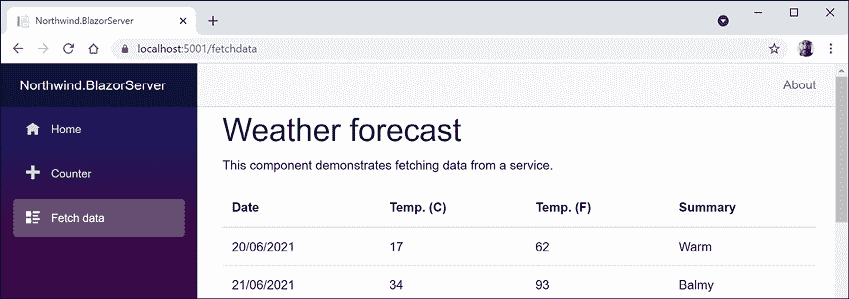
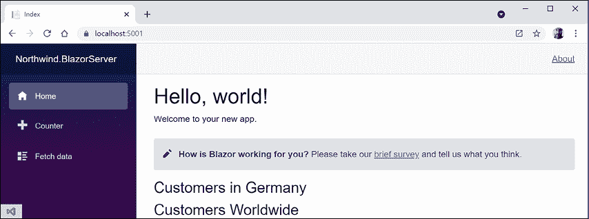
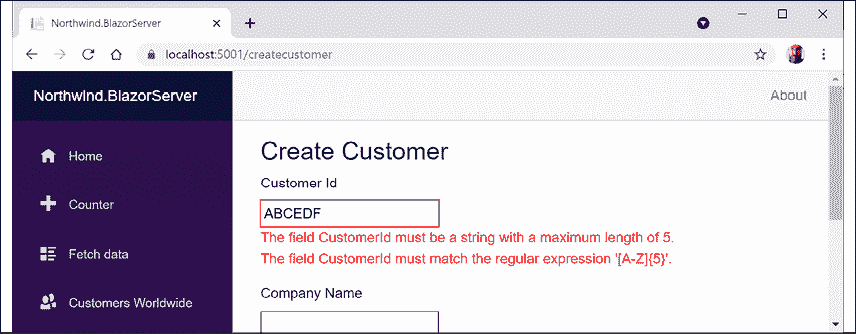
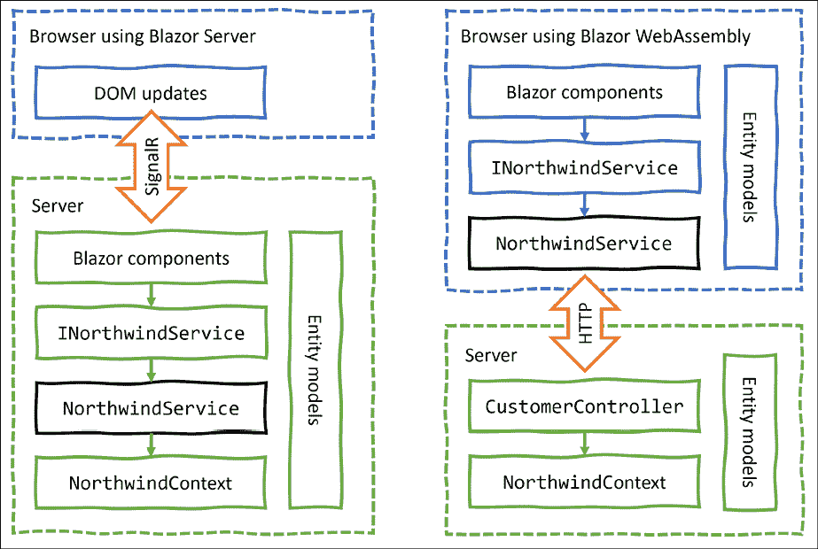
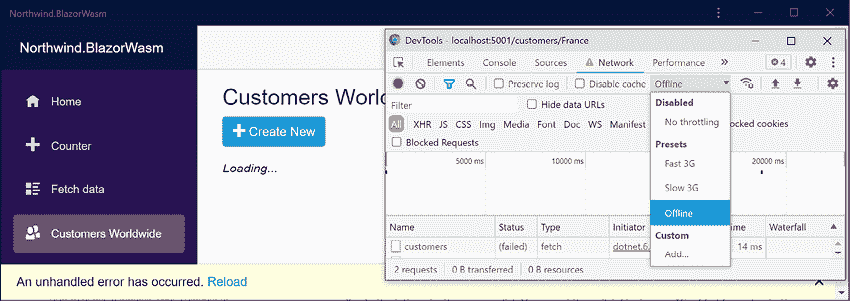

# 第十七章：使用 Blazor 构建用户界面

本章是关于使用 Blazor 构建用户界面的。我将描述 Blazor 的不同变体及其优缺点。

你将学会如何构建能在 Web 服务器或 Web 浏览器中执行代码的 Blazor 组件。当与 Blazor Server 托管时，它使用 SignalR 向浏览器中的用户界面发送必要的更新。当与 Blazor WebAssembly 托管时，组件在客户端执行其代码，并必须通过 HTTP 调用与服务器交互。

本章我们将探讨以下主题：

+   理解 Blazor

+   比较 Blazor 项目模板

+   使用 Blazor Server 构建组件

+   为 Blazor 组件抽象服务

+   使用 Blazor WebAssembly 构建组件

+   改进 Blazor WebAssembly 应用

# 理解 Blazor

Blazor 允许你使用 C#而非 JavaScript 构建共享组件和交互式 Web 用户界面。2019 年 4 月，微软宣布 Blazor“不再是实验性的，我们将承诺将其作为支持的 Web UI 框架发布，包括在浏览器中基于 WebAssembly 运行客户端的支持。”Blazor 支持所有现代浏览器。

## JavaScript 及其伙伴们

传统上，任何需要在 Web 浏览器中执行的代码都是使用 JavaScript 编程语言或**转译**（转换或编译）成 JavaScript 的高级技术编写的。这是因为所有浏览器都支持 JavaScript 已有大约二十年，因此它已成为客户端实现业务逻辑的最低共同标准。

JavaScript 确实存在一些问题。尽管它与 C#和 Java 等 C 风格语言有表面上的相似性，但一旦深入挖掘，你会发现它实际上非常不同。它是一种动态类型的伪函数式语言，使用原型而非类继承来实现对象重用。它可能看起来像人类，但当它揭示出实际上是 Skrull 时，你会感到惊讶。

如果能在 Web 浏览器中使用与服务器端相同的语言和库，那该多好？

## Silverlight – 使用插件的 C#和.NET

Microsoft 曾尝试通过一种名为 Silverlight 的技术实现此目标。2008 年发布的 Silverlight 2.0 允许 C#和.NET 开发者运用其技能构建在 Web 浏览器中通过 Silverlight 插件执行的库和可视组件。

到了 2011 年，随着 Silverlight 5.0 的推出，苹果公司在 iPhone 上的成功以及史蒂夫·乔布斯对 Flash 等浏览器插件的厌恶，最终导致微软放弃 Silverlight。因为与 Flash 类似，Silverlight 在 iPhone 和 iPad 上被禁用。

## WebAssembly – Blazor 的目标

浏览器的一项最新发展为微软提供了再次尝试的机会。2017 年，**WebAssembly 共识**完成，所有主流浏览器现在都支持它：Chromium（Chrome、Edge、Opera、Brave）、Firefox 和 WebKit（Safari）。Blazor 不支持微软的 Internet Explorer，因为它是一个遗留的 Web 浏览器。

**WebAssembly**（**Wasm**）是一种为虚拟机设计的二进制指令格式，它提供了一种在网页上以接近原生速度运行多种语言编写的代码的方法。Wasm 被设计为 C#等高级语言编译的便携目标。

## 理解 Blazor 托管模型

Blazor 是一个具有多种托管模型的单一编程或应用模型：

+   **Blazor Server** 运行于服务器端，因此你编写的 C#代码可以完全访问业务逻辑可能需要的所有资源，无需进行认证。然后，它使用 SignalR 将用户界面更新传达给客户端。

+   服务器必须保持与每个客户端的实时 SignalR 连接，并跟踪每个客户端的当前状态，因此如果需要支持大量客户端，Blazor Server 的扩展性不佳。它于 2019 年 9 月作为 ASP.NET Core 3.0 的一部分首次发布，并包含在.NET 5.0 及更高版本中。

+   **Blazor WebAssembly** 运行于客户端，因此你编写的 C#代码仅能访问浏览器内的资源，并且必须在访问服务器资源前进行 HTTP 调用（可能需要认证）。它于 2020 年 5 月作为 ASP.NET Core 3.1 的扩展首次发布，版本号为 3.2，因为它是一个当前版本，因此不受 ASP.NET Core 3.1 长期支持的覆盖。Blazor WebAssembly 3.2 版本使用了 Mono 运行时和 Mono 库；.NET 5 及更高版本则使用 Mono 运行时和.NET 5 库。“*Blazor WebAssembly 运行在.NET IL 解释器上，没有 JIT，因此它不会在速度竞赛中获胜。不过，我们在.NET 5 中实现了一些显著的速度改进，并预计在.NET 6 中进一步改善。*”—Daniel Roth

+   **.NET MAUI Blazor App**，又称**Blazor 混合模式**，运行在.NET 进程中，使用本地互操作通道将 Web UI 渲染到 WebView 控件，并托管在.NET MAUI 应用中。其概念类似于使用 Node.js 的 Electron 应用。我们将在在线章节《第十九章：使用.NET MAUI 构建移动和桌面应用》中看到这种托管模型。

这种多宿主模型意味着，通过精心规划，开发者可以编写一次 Blazor 组件，然后既可以在 Web 服务器端、Web 客户端运行，也可以在桌面应用中运行。

尽管 Blazor Server 支持 Internet Explorer 11，但 Blazor WebAssembly 不支持。

Blazor WebAssembly 对**渐进式 Web 应用**（**PWAs**）提供可选支持，这意味着网站访问者可以通过浏览器菜单将应用添加到桌面，并在离线状态下运行该应用。

## 理解 Blazor 组件

重要的是要理解 Blazor 用于创建**用户界面组件**。组件定义了如何渲染用户界面，响应用户事件，并且可以组合和嵌套，编译成 NuGet Razor 类库进行打包和分发。

例如，您可以创建一个名为`Rating.razor`的组件，如下面的标记所示：

```cs
<div>
@for (int i = 0; i < Maximum; i++)
{
  if (i < Value)
  {
    <span class="oi oi-star-filled" />
  }
  else
  {
    <span class="oi oi-star-empty" />
  }
}
</div>
@code {
  [Parameter]
  public byte Maximum { get; set; }
  [Parameter]
  public byte Value { get; set; }
} 
```

代码可以存储在一个名为`Rating.razor.cs`的单独代码隐藏文件中，而不是单个文件中既有标记又有`@code`块。该文件中的类必须是`partial`，并且与组件同名。

然后，您可以在网页上使用该组件，如下面的标记所示：

```cs
<h1>Review</h1>
<Rating id="rating" Maximum="5" Value="3" />
<textarea id="comment" /> 
```

有许多内置的 Blazor 组件，包括设置网页`<head>`部分中`<title>`等元素的组件，以及许多第三方供应商，他们会向您出售常见用途的组件。

未来，Blazor 可能不仅限于使用 Web 技术创建用户界面组件。微软有一个名为**Blazor Mobile Bindings**的实验性技术，允许开发者使用 Blazor 构建移动用户界面组件。它不是使用 HTML 和 CSS 构建 Web 用户界面，而是使用 XAML 和.NET MAUI 构建跨平台的图形用户界面。

## Blazor 和 Razor 之间有什么区别？

您可能会好奇为什么 Blazor 组件使用`.razor`作为它们的文件扩展名。Razor 是一种模板标记语法，允许混合 HTML 和 C#。支持 Razor 语法的旧技术使用`.cshtml`文件扩展名来表示 C#和 HTML 的混合。

Razor 语法用于：

+   ASP.NET Core MVC **视图**和**部分视图**使用`.cshtml`文件扩展名。业务逻辑被分离到一个控制器类中，该类将视图视为模板，推送视图模型，然后将其输出到网页。

+   **Razor Pages**使用`.cshtml`文件扩展名。业务逻辑可以嵌入或分离到一个使用`.cshtml.cs`文件扩展名的文件中。输出是一个网页。

+   **Blazor 组件**使用`.razor`文件扩展名。输出不是一个网页，尽管可以使用布局将组件包装起来，使其输出为网页，并且可以使用`@page`指令分配一个定义 URL 路径以检索组件作为页面的路由。

# 比较 Blazor 项目模板

理解 Blazor Server 和 Blazor WebAssembly 托管模型之间选择的一种方法是审查它们默认项目模板之间的差异。

## 审查 Blazor Server 项目模板

让我们看看 Blazor Server 项目的默认模板。您会发现它大多与 ASP.NET Core Razor Pages 模板相同，有几个关键的添加：

1.  使用您喜欢的代码编辑器添加一个新项目，如下表所定义：

    1.  项目模板：**Blazor Server App** / `blazorserver`

    1.  工作区/解决方案文件和文件夹：`PracticalApps`

    1.  项目文件和文件夹：`Northwind.BlazorServer`

    1.  其他 Visual Studio 选项：**身份验证类型**：**无**；**为 HTTPS 配置**：已选中；**启用 Docker**：已清除

1.  在 Visual Studio Code 中，选择`Northwind.BlazorServer`作为活动的 OmniSharp 项目。

1.  构建`Northwind.BlazorServer`项目。

1.  在`Northwind.BlazorServer`项目/文件夹中，打开`Northwind.BlazorServer.csproj`，注意它与使用 Web SDK 并针对.NET 6.0 的 ASP.NET Core 项目完全相同。

1.  打开`Program.cs`，注意它几乎与 ASP.NET Core 项目相同。不同之处包括配置服务的部分，其中调用了`AddServerSideBlazor`方法，如下面的代码中突出显示的那样：

    ```cs
     builder.Services.AddRazorPages();
      **builder.Services.AddServerSideBlazor();**
      builder.Services.AddSingleton<WeatherForecastService>(); 
    ```

1.  还要注意配置 HTTP 管道的部分，它添加了对`MapBlazorHub`和`MapFallbackToPage`方法的调用，这些方法配置 ASP.NET Core 应用程序以接受 Blazor 组件的传入 SignalR 连接，而其他请求则回退到名为`_Host.cshtml`的 Razor 页面，如下面的代码中突出显示的那样：

    ```cs
    app.UseRouting();
    **app.MapBlazorHub();**
    **app.MapFallbackToPage(****"/_Host"****);**
    app.Run(); 
    ```

1.  在`Pages`文件夹中，打开`_Host.cshtml`，注意它设置了一个名为`_Layout`的共享布局，并在服务器上预渲染了一个类型为`App`的 Blazor 组件，如下面的标记所示：

    ```cs
    @page "/"
    @namespace  Northwind.BlazorServer.Pages 
    @addTagHelper *, Microsoft.AspNetCore.Mvc.TagHelpers 
    @{
      Layout = "_Layout";
    }
    <component type="typeof(App)" render-mode="ServerPrerendered" /> 
    ```

1.  在`Pages`文件夹中，打开名为`_Layout.cshtml`的共享布局文件，如下面的标记所示：

    ```cs
    @using Microsoft.AspNetCore.Components.Web
    @namespace Northwind.BlazorServer.Pages
    @addTagHelper *, Microsoft.AspNetCore.Mvc.TagHelpers
    <!DOCTYPE html>
    <html lang="en">
    <head>
      <meta charset="utf-8" />
      <meta name="viewport"
            content="width=device-width, initial-scale=1.0" />
      <base href="~/" />
      <link rel="stylesheet" href="css/bootstrap/bootstrap.min.css" />
      <link href="css/site.css" rel="stylesheet" />
      <link href="Northwind.BlazorServer.styles.css" rel="stylesheet" />
      <component type="typeof(HeadOutlet)" render-mode="ServerPrerendered" />
    </head>
    <body>
      @RenderBody()
      <div id="blazor-error-ui">
        <environment include="Staging,Production">
          An error has occurred. This application may no longer respond until reloaded.
        </environment>
        <environment include="Development">
          An unhandled exception has occurred. See browser dev tools for details.
        </environment>
        <a href="" class="reload">Reload</a>
        <a class="dismiss"></a>
      </div>
      <script src="img/blazor.server.js"></script>
    </body>
    </html> 
    ```

    在审查前面的标记时，请注意以下几点：

    +   `<div id="blazor-error-ui">`用于显示 Blazor 错误，当发生错误时，它会在网页底部显示为黄色条。

    +   `blazor.server.js`的脚本块管理返回到服务器的 SignalR 连接。

1.  在`Northwind.BlazorServer`文件夹中，打开`App.razor`，注意它为当前程序集中找到的所有组件定义了一个`Router`，如下面的代码所示：

    ```cs
    <Router AppAssembly="@typeof(App).Assembly">
      <Found Context="routeData">
        <RouteView RouteData="@routeData"
                   DefaultLayout="@typeof(MainLayout)" />
        <FocusOnNavigate RouteData="@routeData" Selector="h1" />
      </Found>
      <NotFound>
        <PageTitle>Not found</PageTitle>
        <LayoutView Layout="@typeof(MainLayout)">
          <p>Sorry, there's nothing at this address.</p>
        </LayoutView>
      </NotFound>
    </Router> 
    ```

    在审查前面的标记时，请注意以下几点：

    +   如果找到匹配的路由，则执行`RouteView`，它将组件的默认布局设置为`MainLayout`，并将任何路由数据参数传递给组件。

    +   如果没有找到匹配的路由，则执行`LayoutView`，它会在`MainLayout`内部渲染内部标记（在这种情况下，是一个带有消息的简单段落元素，告诉访问者此处没有任何内容）。

1.  在`Shared`文件夹中，打开`MainLayout.razor`，注意它定义了一个侧边栏的`<div>`，其中包含由本项目中的`NavMenu.razor`组件文件实现的导航菜单，以及用于内容的 HTML5 元素，如`<main>`和`<article>`，如下面的代码所示：

    ```cs
    @inherits LayoutComponentBase
    <PageTitle>Northwind.BlazorServer</PageTitle>
    <div class="page">
      <div class="sidebar">
        <NavMenu />
      </div>
      <main>
        <div class="top-row px-4">
          <a href="https://docs.microsoft.com/aspnet/" 
             target="_blank">About</a>
        </div>
        <article class="content px-4">
          @Body
        </article>
      </main>
    </div> 
    ```

1.  在`Shared`文件夹中，打开`MainLayout.razor.css`，注意它包含组件的隔离 CSS 样式。

1.  在`Shared`文件夹中，打开`NavMenu.razor`，注意它有三个菜单项：**首页**、**计数器**和**获取数据**。这些是通过使用微软提供的名为`NavLink`的 Blazor 组件创建的，如下面的标记所示：

    ```cs
    <div class="top-row ps-3 navbar navbar-dark">
      <div class="container-fluid">
        <a class="navbar-brand" href="">Northwind.BlazorServer</a>
        <button title="Navigation menu" class="navbar-toggler" 
                @onclick="ToggleNavMenu">
          <span class="navbar-toggler-icon"></span>
        </button>
      </div>
    </div>
    <div class="@NavMenuCssClass" @onclick="ToggleNavMenu">
      <nav class="flex-column">
        <div class="nav-item px-3">
          <NavLink class="nav-link" href="" Match="NavLinkMatch.All">
            <span class="oi oi-home" aria-hidden="true"></span> Home
          </NavLink>
        </div>
        <div class="nav-item px-3">
          <NavLink class="nav-link" href="counter">
            <span class="oi oi-plus" aria-hidden="true"></span> Counter
          </NavLink>
        </div>
        <div class="nav-item px-3">
          <NavLink class="nav-link" href="fetchdata">
            <span class="oi oi-list-rich" aria-hidden="true"></span> Fetch data
          </NavLink>
        </div>
      </nav>
    </div>
    @code {
      private bool collapseNavMenu = true;
      private string? NavMenuCssClass => collapseNavMenu ? "collapse" : null;
      private void ToggleNavMenu()
      {
        collapseNavMenu = !collapseNavMenu;
      }
    } 
    ```

1.  在 `Pages` 文件夹中，打开 `FetchData.razor` 并注意它定义了一个组件，该组件从注入的依赖天气服务获取天气预报，然后将其呈现在表格中，如下所示：

    ```cs
    @page "/fetchdata"
    <PageTitle>Weather forecast</PageTitle>
    @using Northwind.BlazorServer.Data
    @inject WeatherForecastService ForecastService
    <h1>Weather forecast</h1>
    <p>This component demonstrates fetching data from a service.</p> 
    @if (forecasts == null)
    {
      <p><em>Loading...</em></p>
    }
    else
    {
      <table class="table">
        <thead>
          <tr>
            <th>Date</th>
            <th>Temp. (C)</th>
            <th>Temp. (F)</th>
            <th>Summary</th>
          </tr>
        </thead>
        <tbody>
        @foreach (var forecast in forecasts)
        {
          <tr>
            <td>@forecast.Date.ToShortDateString()</td>
            <td>@forecast.TemperatureC</td>
            <td>@forecast.TemperatureF</td>
            <td>@forecast.Summary</td>
           </tr>
        }
        </tbody>
      </table>
    }
    @code {
      private WeatherForecast[]? forecasts;
      protected override async Task OnInitializedAsync()
      {
        forecasts = await ForecastService.GetForecastAsync(DateTime.Now);
      }
    } 
    ```

1.  在 `Data` 文件夹中，打开 `WeatherForecastService.cs` 并注意它*不是*一个 Web API 控制器类；它只是一个返回随机天气数据的普通类，如下所示：

    ```cs
    namespace Northwind.BlazorServer.Data
    {
      public class WeatherForecastService
      {
        private static readonly string[] Summaries = new[]
        {
          "Freezing", "Bracing", "Chilly", "Cool", "Mild", "Warm",
          "Balmy", "Hot", "Sweltering", "Scorching"
        };
        public Task<WeatherForecast[]> GetForecastAsync(DateTime startDate)
        {
          return Task.FromResult(Enumerable.Range(1, 5)
            .Select(index => new WeatherForecast
              {
                Date = startDate.AddDays(index),
                TemperatureC = Random.Shared.Next(-20, 55),
                Summary = Summaries[Random.Shared.Next(Summaries.Length)]
              }).ToArray());
        }
      }
    } 
    ```

### 理解 CSS 和 JavaScript 隔离

Blazor 组件通常需要提供自己的 CSS 来应用样式或 JavaScript 来执行不能纯粹在 C# 中完成的操作，例如访问浏览器 API。为了确保这不会与站点级别的 CSS 和 JavaScript 冲突，Blazor 支持 CSS 和 JavaScript 隔离。如果您有一个名为 `Index.razor` 的组件，只需创建一个名为 `Index.razor.css` 的 CSS 文件。该文件中定义的样式将覆盖项目中的任何其他样式。

## 理解 Blazor 路由到页面组件

我们在 `App.razor` 文件中看到的 `Router` 组件启用了组件的路由。创建组件实例的标记看起来像一个 HTML 标签，其中标签的名称是组件类型。组件可以使用元素嵌入到网页中，例如 `<Rating Stars="5" />`，或者可以像 Razor 页面或 MVC 控制器一样路由。

### 如何定义可路由的页面组件

要创建可路由的页面组件，请在组件的 `.razor` 文件顶部添加 `@page` 指令，如下所示：

```cs
@page "customers" 
```

上述代码相当于一个装饰有 `[Route]` 属性的 MVC 控制器，如下所示：

```cs
[Route("customers")]
public class CustomersController
{ 
```

`Router` 组件在其 `AppAssembly` 参数中专门扫描组件，这些组件装饰有 `[Route]` 属性，并注册它们的 URL 路径。

任何单页组件都可以有多个 `@page` 指令来注册多个路由。

在运行时，页面组件将与您指定的任何特定布局合并，就像 MVC 视图或 Razor 页面一样。默认情况下，Blazor Server 项目模板将 `MainLayout.razor` 定义为页面组件的布局。

**最佳实践**：按照惯例，将可路由的页面组件放在 `Pages` 文件夹中。

### 如何导航 Blazor 路由

Microsoft 提供了一个名为 `NavigationManager` 的依赖服务，该服务理解 Blazor 路由和 `NavLink` 组件。

`NavigateTo` 方法用于转到指定的 URL。

### 如何传递路由参数

Blazor 路由可以包含大小写不敏感的命名参数，并且您的代码可以通过将参数绑定到代码块中的属性来最轻松地访问传递的值，使用 `[Parameter]` 属性，如下所示：

```cs
@page "/customers/{country}"
<div>Country parameter as the value: @Country</div>
@code {
  [Parameter]
  public string Country { get; set; }
} 
```

推荐的处理应具有默认值的参数的方法是，当参数缺失时，在参数后缀加上 `?` 并在 `OnParametersSet` 方法中使用空合并运算符，如下所示：

```cs
@page "/customers/{country?}"
<div>Country parameter as the value: @Country</div>
@code {
  [Parameter]
  public string Country { get; set; }
  protected override void OnParametersSet()
  {
    // if the automatically set property is null
    // set its value to USA
    Country = Country ?? "USA";
  }
} 
```

### 理解基础组件类

`OnParametersSet`方法由组件默认继承的基类`ComponentBase`定义，如下面的代码所示：

```cs
using Microsoft.AspNetCore.Components;
public abstract class ComponentBase : IComponent, IHandleAfterRender, IHandleEvent
{
  // members not shown
} 
```

`ComponentBase`有一些有用的方法，您可以调用和重写，如下表所示：

| 方法 | 描述 |
| --- | --- |
| `InvokeAsync` | 调用此方法以在关联渲染器的同步上下文中执行函数。 |
| `OnAfterRender`, `OnAfterRenderAsync` | 重写这些方法以在每次组件渲染后调用代码。 |
| `OnInitialized`, `OnInitializedAsync` | 重写这些方法以在组件从渲染树中的父级接收到初始参数后调用代码。 |
| `OnParametersSet`, `OnParametersSetAsync` | 重写这些方法以在组件接收到参数且值已分配给属性后调用代码。 |
| `ShouldRender` | 重写此方法以指示组件是否应进行渲染。 |
| `StateHasChanged` | 调用此方法以使组件重新渲染。 |

Blazor 组件可以以类似于 MVC 视图和 Razor 页面的方式拥有共享布局。

创建一个`.razor`组件文件，但需明确继承自`LayoutComponentBase`，如下面的标记所示：

```cs
@inherits LayoutComponentBase
<div>
  ...
  @Body
  ...
</div> 
```

基类有一个名为`Body`的属性，您可以在布局中的正确位置在标记中渲染它。

在`App.razor`文件及其`Router`组件中为组件设置默认布局。要明确为组件设置布局，请使用`@layout`指令，如下面的标记所示：

```cs
@page "/customers"
@layout AlternativeLayout
<div>
  ...
</div> 
```

### 如何使用导航链接组件与路由

在 HTML 中，您使用`<a>`元素来定义导航链接，如下面的标记所示：

```cs
<a href="/customers">Customers</a> 
```

在 Blazor 中，使用`<NavLink>`组件，如下面的标记所示：

```cs
<NavLink href="/customers">Customers</NavLink> 
```

`NavLink`组件优于锚元素，因为它会自动将其类设置为`active`，如果其`href`与当前位置 URL 匹配。如果您的 CSS 使用不同的类名，则可以在`NavLink.ActiveClass`属性中设置类名。

默认情况下，在匹配算法中，`href`是一个路径*前缀*，因此如果`NavLink`具有`/customers`的`href`，如前述代码示例所示，则它将匹配以下所有路径并将它们都设置为具有`active`类样式：

```cs
/customers
/customers/USA
/customers/Germany/Berlin 
```

为确保匹配算法仅对*所有*路径执行匹配，将`Match`参数设置为`NavLinkMatch.All`，如下面的代码所示：

```cs
<NavLink href="/customers" Match="NavLinkMatch.All">Customers</NavLink> 
```

如果您设置其他属性，如`target`，它们将传递给生成的底层`<a>`元素。

## 运行 Blazor Server 项目模板

现在我们已经回顾了项目模板以及 Blazor Server 特有的重要部分，我们可以启动网站并审查其行为：

1.  在`Properties`文件夹中，打开`launchSettings.json`。

1.  修改 `applicationUrl` 以使用端口 `5000` 进行 `HTTP` 和端口 `5001` 进行 `HTTPS`，如图中突出显示的标记所示：

    ```cs
    "profiles": {
      "Northwind.BlazorServer": {
        "commandName": "Project",
        "dotnetRunMessages": true,
        "launchBrowser": true,
    **"applicationUrl"****:** **"https://localhost:5001;http://localhost:5000"****,**
        "environmentVariables": {
          "ASPNETCORE_ENVIRONMENT": "Development"
        }
      }, 
    ```

1.  启动网站。

1.  启动 Chrome。

1.  导航至 `https://localhost:5001/`。

1.  在左侧导航菜单中，点击 **获取数据**，如图 *17.1* 所示:

    图 17.1: 在 Blazor Server 应用中获取天气数据

1.  在浏览器地址栏中，将路由更改为 `/apples` 并注意缺失的消息，如图 *17.2* 所示:

    图 17.2: 缺失组件消息

1.  关闭 Chrome 并关闭 Web 服务器。

## 审查 Blazor WebAssembly 项目模板

现在我们将创建一个 Blazor WebAssembly 项目。如果代码与 Blazor Server 项目中的代码相同，我将不在书中展示代码：

1.  使用您喜欢的代码编辑器向 `PracticalApps` 解决方案或工作区添加一个新项目，如以下列表所定义：

    1.  项目模板: **Blazor WebAssembly 应用** / `blazorwasm`

    1.  开关: `--pwa --hosted`

    1.  工作区/解决方案文件和文件夹: `PracticalApps`

    1.  项目文件和文件夹: `Northwind.BlazorWasm`

    1.  **认证类型**: **无**

    1.  **配置 HTTPS**: 已勾选

    1.  **ASP.NET Core 托管**: 已勾选

    1.  **渐进式 Web 应用**: 已勾选

    在审查生成的文件夹和文件时，请注意生成了三个项目，如下列列表所述：

    +   `Northwind.BlazorWasm.Client` 是位于 `Northwind.BlazorWasm\Client` 文件夹中的 Blazor WebAssembly 项目。

    +   `Northwind.BlazorWasm.Server` 是位于 `Northwind.BlazorWasm\Server` 文件夹中的一个 ASP.NET Core 项目网站，用于托管天气服务，该服务与之前一样返回随机天气预报，但实现为适当的 Web API 控制器类。项目文件具有对 `Shared` 和 `Client` 的项目引用，以及支持服务器端 Blazor WebAssembly 的包引用。

    +   `Northwind.BlazorWasm.Shared` 是位于 `Northwind.BlazorWasm\Shared` 文件夹中的类库，包含天气服务的模型。

    文件夹结构已简化，如图 *17.3* 所示：

    

    图 17.3: Blazor WebAssembly 项目模板的文件夹结构

    部署 Blazor WebAssembly 应用有两种方式。您可以通过将其发布的文件放置在任何静态托管 Web 服务器中来仅部署 `Client` 项目。它可以配置为调用您在 *第十六章*，*构建和消费 Web 服务* 中创建的天气服务，或者您可以部署 `Server` 项目，该项目引用 `Client` 应用并托管天气服务和 Blazor WebAssembly 应用。应用放置在服务器网站 `wwwroot` 文件夹中，以及任何其他静态资产。您可以在以下链接中阅读有关这些选择的更多信息：[`docs.microsoft.com/en-us/aspnet/core/blazor/host-and-deploy/webassembly`](https://docs.microsoft.com/en-us/aspnet/core/blazor/host-and-deploy/webassembly)

1.  在 `Client` 文件夹中，打开 `Northwind.BlazorWasm.Client.csproj` 并注意，它使用了 Blazor WebAssembly SDK，并引用了两个 WebAssembly 包和 `Shared` 项目，以及支持 PWA 所需的服务工作者，如下所示：

    ```cs
    <Project Sdk="Microsoft.NET.Sdk.BlazorWebAssembly">
      <PropertyGroup>
        <TargetFramework>net6.0</TargetFramework>
        <Nullable>enable</Nullable>
        <ImplicitUsings>enable</ImplicitUsings>
        <ServiceWorkerAssetsManifest>service-worker-assets.js
          </ServiceWorkerAssetsManifest>
      </PropertyGroup>
      <ItemGroup>
        <PackageReference Include=
          "Microsoft.AspNetCore.Components.WebAssembly" 
          Version="6.0.0" />
        <PackageReference Include=
          "Microsoft.AspNetCore.Components.WebAssembly.DevServer" 
          Version="6.0.0" PrivateAssets="all" />
      </ItemGroup>
      <ItemGroup>
        <ProjectReference Include=
          "..\Shared\Northwind.BlazorWasm.Shared.csproj" />
      </ItemGroup>
      <ItemGroup>
        <ServiceWorker Include="wwwroot\service-worker.js" 
          PublishedContent="wwwroot\service-worker.published.js" />
      </ItemGroup>
    </Project> 
    ```

1.  在 `Client` 文件夹中，打开 `Program.cs` 并注意，主机构建器现在是为 `WebAssembly` 而不是服务器端 ASP.NET Core 配置的，并且它注册了一个用于进行 HTTP 请求的依赖服务，这是 Blazor WebAssembly 应用中极为常见的需求，如下所示：

    ```cs
    using Microsoft.AspNetCore.Components.Web;
    using Microsoft.AspNetCore.Components.WebAssembly.Hosting;
    using Northwind.BlazorWasm.Client;
    var builder = WebAssemblyHostBuilder.CreateDefault(args); 
    builder.RootComponents.Add<App>("#app");
    builder.RootComponents.Add<HeadOutlet>("head::after");
    builder.Services.AddScoped(sp => new HttpClient
      { BaseAddress = new Uri(builder.HostEnvironment.BaseAddress) });
    await builder.Build().RunAsync(); 
    ```

1.  在 `wwwroot` 文件夹中，打开 `index.html` 并注意支持离线工作的 `manifest.json` 和 `service-worker.js` 文件，以及下载 Blazor WebAssembly 所有 NuGet 包的 `blazor.webassembly.js` 脚本，如下所示：

    ```cs
    <!DOCTYPE html>
    <html>
    <head>
      <meta charset="utf-8" />
      <meta name="viewport" content="width=device-width, initial-scale=1.0, maximum-scale=1.0, user-scalable=no" />
      <title>Northwind.BlazorWasm</title>
      <base href="/" />
      <link href="css/bootstrap/bootstrap.min.css" rel="stylesheet" />
      <link href="css/app.css" rel="stylesheet" />
      <link href="Northwind.BlazorWasm.Client.styles.css" rel="stylesheet" />
      <link href="manifest.json" rel="manifest" />
      <link rel="apple-touch-icon" sizes="512x512" href="icon-512.png" />
      <link rel="apple-touch-icon" sizes="192x192" href="icon-192.png" />
    </head>
    <body>
      <div id="app">Loading...</div>
      <div id="blazor-error-ui">
        An unhandled error has occurred.
        <a href="" class="reload">Reload</a>
        <a class="dismiss"></a>
      </div>
      <script src="img/blazor.webassembly.js"></script>
      <script>navigator.serviceWorker.register('service-worker.js');</script>
    </body>
    </html> 
    ```

1.  请注意，以下 `.razor` 文件与 Blazor Server 项目中的文件相同：

    +   `App.razor`

    +   `Shared\MainLayout.razor`

    +   `Shared\NavMenu.razor`

    +   `Shared\SurveyPrompt.razor`

    +   `Pages\Counter.razor`

    +   `Pages\Index.razor`

1.  在 `Pages` 文件夹中，打开 `FetchData.razor` 并注意，除了注入用于进行 HTTP 请求的依赖服务外，标记与 Blazor Server 相同，如下所示：

    ```cs
    @page "/fetchdata"
    @using Northwind.BlazorWasm.Shared
    **@inject HttpClient Http**
    <h1>Weather forecast</h1>
    ...
    @code {
      private WeatherForecast[]? forecasts;
      protected override async Task OnInitializedAsync()
      {
     **forecasts =** **await**
     **Http.GetFromJsonAsync<WeatherForecast[]>(****"WeatherForecast"****);**
      }
    } 
    ```

1.  启动 `Northwind.BlazorWasm.Server` 项目。

1.  请注意，该应用的功能与之前相同。Blazor 组件代码现在在浏览器内部执行，而不是在服务器上。天气服务运行在 Web 服务器上。

1.  关闭 Chrome 并关闭 Web 服务器。

# 使用 Blazor Server 构建组件

在本节中，我们将构建一个组件，用于在 Northwind 数据库中列出、创建和编辑客户。我们将首先为 Blazor Server 简单地构建它，然后重构它以同时支持 Blazor Server 和 Blazor WebAssembly。

## 定义和测试一个简单组件

我们将向现有的 Blazor Server 项目添加新组件：

1.  在 `Northwind.BlazorServer` 项目（不是 `Northwind.BlazorWasm.Server` 项目）中，在 `Pages` 文件夹中，添加一个名为 `Customers.razor` 的新文件。在 Visual Studio 中，项目项名为 **Razor 组件**。

    **最佳实践**：组件文件名必须以大写字母开头，否则会出现编译错误！

1.  添加语句以输出 `Customers` 组件的标题，并定义一个代码块，该代码块定义了一个用于存储国家名称的属性，如下所示：

    ```cs
    <h3>Customers@(string.IsNullOrWhiteSpace(Country) ? " Worldwide" : " in " + Country)</h3>
    @code {
      [Parameter]
      public string? Country { get; set; }
    } 
    ```

1.  在 `Pages` 文件夹中，在 `Index.razor` 组件中，向文件底部添加语句，实例化 `Customers` 组件两次，一次传递 `Germany` 作为国家参数，一次不设置国家，如下所示：

    ```cs
    <Customers Country="Germany" />
    <Customers /> 
    ```

1.  启动 `Northwind.BlazorServer` 网站项目。

1.  启动 Chrome。

1.  导航至 `https://localhost:5001/` 并注意 `Customers` 组件，如图 *17.4* 所示：

    图 17.4：设置国家参数为 Germany 的 Customers 组件和不设置国家参数的情况

1.  关闭 Chrome 并停止网络服务器。

## 将组件制作成可路由的页面组件

将此组件转换为带有国家路由参数的可路由页面组件非常简单：

1.  在 `Pages` 文件夹中，在 `Customers.razor` 组件中，在文件顶部添加一条语句，将 `/customers` 注册为其路由，并带有可选的国家路由参数，如下列标记所示：

    ```cs
    @page "/customers/{country?}" 
    ```

1.  在 `Shared` 文件夹中，打开 `NavMenu.razor` 并添加两个列表项元素，用于我们的可路由页面组件，以显示全球和德国的客户，均使用人群图标，如下列标记所示：

    ```cs
    <div class="nav-item px-3">
      <NavLink class="nav-link" href="customers" Match="NavLinkMatch.All">
        <span class="oi oi-people" aria-hidden="true"></span>
        Customers Worldwide
      </NavLink>
    </div>
    <div class="nav-item px-3">
      <NavLink class="nav-link" href="customers/Germany">
        <span class="oi oi-people" aria-hidden="true"></span>
        Customers in Germany
      </NavLink>
    </div> 
    ```

    我们在客户菜单项中使用了人群图标。您可以在以下链接查看其他可用图标：[`iconify.design/icon-sets/oi/`](https://iconify.design/icon-sets/oi/)

1.  启动网站项目。

1.  启动 Chrome。

1.  访问 `https://localhost:5001/`。

1.  在左侧导航菜单中，点击 **德国客户**，并注意国家名称正确传递给了页面组件，且该组件使用了与其他页面组件相同的共享布局，如 `Index.razor`。

1.  关闭 Chrome 并停止网络服务器。

## 将实体引入组件

既然您已经看到了组件的最小实现，我们可以为其添加一些有用的功能。在这种情况下，我们将使用 Northwind 数据库上下文从数据库中获取客户：

1.  在 `Northwind.BlazorServer.csproj` 中，添加对 Northwind 数据库上下文项目的引用，支持 SQL Server 或 SQLite，如以下标记所示：

    ```cs
    <ItemGroup>
      <!-- change Sqlite to SqlServer if you prefer -->
      <ProjectReference Include="..\Northwind.Common.DataContext.Sqlite
    \Northwind.Common.DataContext.Sqlite.csproj" />
    </ItemGroup> 
    ```

1.  构建 `Northwind.BlazorServer` 项目。

1.  在 `Program.cs` 中，导入用于处理 Northwind 数据库上下文的命名空间，如下列代码所示：

    ```cs
    using Packt.Shared; // AddNorthwindContext extension method 
    ```

1.  在配置服务的部分，添加一条语句以在依赖服务集合中注册 Northwind 数据库上下文，如下列代码所示：

    ```cs
    builder.Services.AddNorthwindContext(); 
    ```

1.  打开 `_Imports.razor` 并导入用于处理 Northwind 实体的命名空间，以便我们构建的 Blazor 组件无需单独导入这些命名空间，如下列标记所示：

    ```cs
    @using Packt.Shared  @* Northwind entities *@ 
    ```

    `_Imports.razor` 文件仅适用于 `.razor` 文件。如果您使用代码后置 `.cs` 文件来实现组件代码，则它们必须单独导入命名空间或使用全局 using 隐式导入命名空间。

1.  在 `Pages` 文件夹中，在 `Customers.razor` 中，添加语句以注入 Northwind 数据库上下文，然后使用它输出所有客户的表格，如下列代码所示：

    ```cs
    @using Microsoft.EntityFrameworkCore  @* ToListAsync extension method *@
    @page "/customers/{country?}" 
    @inject NorthwindContext db
    <h3>Customers @(string.IsNullOrWhiteSpace(Country) 
          ? "Worldwide" : "in " + Country)</h3>
    @if (customers == null)
    {
    <p><em>Loading...</em></p>
    }
    else
    {
    <table class="table">
      <thead>
        <tr>
          <th>Id</th>
          <th>Company Name</th>
          <th>Address</th>
          <th>Phone</th>
          <th></th>
        </tr>
      </thead>
      <tbody>
      @foreach (Customer c in customers)
      {
        <tr>
          <td>@c.CustomerId</td>
          <td>@c.CompanyName</td>
          <td>
            @c.Address<br/>
            @c.City<br/>
            @c.PostalCode<br/>
            @c.Country
          </td>
          <td>@c.Phone</td>
          <td>
            <a class="btn btn-info" href="editcustomer/@c.CustomerId">
              <i class="oi oi-pencil"></i></a>
            <a class="btn btn-danger" 
               href="deletecustomer/@c.CustomerId">
              <i class="oi oi-trash"></i></a>
          </td>
        </tr>
      }
      </tbody>
    </table>
    }
    @code {
      [Parameter]
      public string? Country { get; set; }
      private IEnumerable<Customer>? customers;
      protected override async Task OnParametersSetAsync()
      {
        if (string.IsNullOrWhiteSpace(Country))
        {
          customers = await db.Customers.ToListAsync();
        }
        else
        {
          customers = await db.Customers
            .Where(c => c.Country == Country).ToListAsync();
        }
      }
    } 
    ```

1.  启动 `Northwind.BlazorServer` 项目网站。

1.  启动 Chrome。

1.  访问 `https://localhost:5001/`。

1.  在左侧导航菜单中，点击 **全球客户**，并注意客户表格从数据库加载并在网页中渲染，如图 *17.5* 所示：

    图 17.5：全球客户列表

1.  在左侧导航菜单中，点击**德国客户**，注意客户表此时仅显示德国客户。

1.  在浏览器地址栏中，将`Germany`更改为`UK`，注意客户表此时仅显示英国客户。

1.  在左侧导航菜单中，点击**首页**，注意客户组件作为嵌入页面的一部分时也能正确工作。

1.  点击任意编辑或删除按钮，注意它们会返回一条消息，内容为`对不起，此地址下没有任何内容`，因为我们尚未实现该功能。

1.  关闭浏览器。

1.  关闭 Web 服务器。

# 为 Blazor 组件抽象服务

目前，Blazor 组件直接调用 Northwind 数据库上下文来获取客户信息。这在 Blazor 服务器上运行良好，因为组件在服务器上执行。但当该组件托管在 Blazor WebAssembly 上时，将无法工作。

我们将创建一个本地依赖服务，以实现组件的更好复用：

1.  在`Northwind.BlazorServer`项目中，在`Data`文件夹中，添加一个名为`INorthwindService.cs`的新文件。（Visual Studio 项目项模板名为**接口**。）

1.  修改其内容以定义一个本地服务的契约，该服务抽象了 CRUD 操作，如下所示：

    ```cs
    namespace Packt.Shared;
    public interface INorthwindService
    {
      Task<List<Customer>> GetCustomersAsync();
      Task<List<Customer>> GetCustomersAsync(string country);
      Task<Customer?> GetCustomerAsync(string id);
      Task<Customer> CreateCustomerAsync(Customer c);
      Task<Customer> UpdateCustomerAsync(Customer c);
      Task DeleteCustomerAsync(string id);
    } 
    ```

1.  在`Data`文件夹中，添加一个名为`NorthwindService.cs`的新文件，并修改其内容以使用 Northwind 数据库上下文实现`INorthwindService`接口，如下所示：

    ```cs
    using Microsoft.EntityFrameworkCore; 
    namespace Packt.Shared;
    public class NorthwindService : INorthwindService
    {
      private readonly NorthwindContext db;
      public NorthwindService(NorthwindContext db)
      {
        this.db = db;
      }
      public Task<List<Customer>> GetCustomersAsync()
      {
        return db.Customers.ToListAsync();
      }
      public Task<List<Customer>> GetCustomersAsync(string country)
      {
        return db.Customers.Where(c => c.Country == country).ToListAsync();
      }
      public Task<Customer?> GetCustomerAsync(string id)
      {
        return db.Customers.FirstOrDefaultAsync
          (c => c.CustomerId == id);
      }
      public Task<Customer> CreateCustomerAsync(Customer c)
      {
        db.Customers.Add(c); 
        db.SaveChangesAsync();
        return Task.FromResult(c);
      }
      public Task<Customer> UpdateCustomerAsync(Customer c)
      {
        db.Entry(c).State = EntityState.Modified;
        db.SaveChangesAsync();
        return Task.FromResult(c);
      }
      public Task DeleteCustomerAsync(string id)
      {
        Customer? customer = db.Customers.FirstOrDefaultAsync
          (c => c.CustomerId == id).Result;
        if (customer == null)
        {
          return Task.CompletedTask;
        }
        else
        {
          db.Customers.Remove(customer); 
          return db.SaveChangesAsync();
        }
      }
    } 
    ```

1.  在`Program.cs`中，在配置服务的部分，添加一条语句，将`NorthwindService`注册为实现`INorthwindService`接口的瞬态服务，如下所示：

    ```cs
    builder.Services.AddTransient<INorthwindService, NorthwindService>(); 
    ```

1.  在`Pages`文件夹中，打开`Customers.razor`文件，将注入 Northwind 数据库上下文的指令替换为注入已注册的 Northwind 服务的指令，如下所示：

    ```cs
    @inject INorthwindService service 
    ```

1.  修改`OnParametersSetAsync`方法以调用服务，如下所示：

    ```cs
    protected override async Task OnParametersSetAsync()
    {
      if (string.IsNullOrWhiteSpace(Country))
      {
     **customers =** **await** **service.GetCustomersAsync();**
      }
      else
      {
     **customers =** **await** **service.GetCustomersAsync(Country);**
      }
    } 
    ```

1.  启动`Northwind.BlazorServer`网站项目，并确认它保留了与之前相同的功能。

## 使用 EditForm 组件定义表单

Microsoft 提供了现成的组件用于构建表单。我们将使用它们来提供、创建和编辑客户的功能。

Microsoft 提供了`EditForm`组件及`InputText`等若干表单元素，以便于在 Blazor 中更轻松地使用表单。

`EditForm`可以设置一个模型，将其绑定到具有属性和自定义验证事件处理程序的对象，并识别模型类上的标准 Microsoft 验证属性，如下所示：

```cs
<EditForm Model="@customer" OnSubmit="ExtraValidation">
  <DataAnnotationsValidator />
  <ValidationSummary />
  <InputText id="name" @bind-Value="customer.CompanyName" />
  <button type="submit">Submit</button>
</EditForm>
@code {
  private Customer customer = new();
  private void ExtraValidation()
  {
    // perform any extra validation
  }
} 
```

作为`ValidationSummary`组件的替代，您可以使用`ValidationMessage`组件在单个表单元素旁边显示消息。

## 构建并使用客户表单组件

现在我们可以创建一个共享组件来创建或编辑客户：

1.  在`Shared`文件夹中，创建一个名为`CustomerDetail.razor`的新文件。（Visual Studio 项目项模板名为**Razor 组件**。）此组件将在多个页面组件中重用。

1.  修改其内容以定义一个表单来编辑客户属性，如下列代码所示：

    ```cs
    <EditForm Model="@Customer" OnValidSubmit="@OnValidSubmit">
      <DataAnnotationsValidator />
      <div class="form-group">
        <div>
          <label>Customer Id</label>
          <div>
            <InputText @bind-Value="@Customer.CustomerId" />
            <ValidationMessage For="@(() => Customer.CustomerId)" />
          </div>
        </div>
      </div>
      <div class="form-group ">
        <div>
          <label>Company Name</label>
          <div>
            <InputText @bind-Value="@Customer.CompanyName" />
            <ValidationMessage For="@(() => Customer.CompanyName)" />
          </div>
        </div>
      </div>
      <div class="form-group ">
        <div>
          <label>Address</label>
          <div>
            <InputText @bind-Value="@Customer.Address" />
            <ValidationMessage For="@(() => Customer.Address)" />
          </div>
        </div>
      </div>
      <div class="form-group ">
        <div>
          <label>Country</label>
          <div>
            <InputText @bind-Value="@Customer.Country" />
            <ValidationMessage For="@(() => Customer.Country)" />
          </div>
        </div>
      </div>
      <button type="submit" class="btn btn-@ButtonStyle">
        @ButtonText
      </button>
    </EditForm>
    @code { 
      [Parameter]
      public Customer Customer { get; set; } = null!;
      [Parameter]
      public string ButtonText { get; set; } = "Save Changes";
      [Parameter]
      public string ButtonStyle { get; set; } = "info";
      [Parameter]
      public EventCallback OnValidSubmit { get; set; }
    } 
    ```

1.  在`Pages`文件夹中，创建一个名为`CreateCustomer.razor`的新文件。这将是一个可路由的页面组件。

1.  修改其内容以使用客户详情组件来创建新客户，如下列代码所示：

    ```cs
    @page "/createcustomer"
    @inject INorthwindService service 
    @inject NavigationManager navigation
    <h3>Create Customer</h3>
    <CustomerDetail ButtonText="Create Customer"
                    Customer="@customer" 
                    OnValidSubmit="@Create" />
    @code {
      private Customer customer = new();
      private async Task Create()
      {
        await service.CreateCustomerAsync(customer);
        navigation.NavigateTo("customers");
      }
    } 
    ```

1.  在`Pages`文件夹中，打开名为`Customers.razor`的文件，并在`<h3>`元素后添加一个带有按钮的`<div>`元素，以导航到`createcustomer`页面组件，如下列标记所示：

    ```cs
    <div class="form-group">
      <a class="btn btn-info" href="createcustomer">
      <i class="oi oi-plus"></i> Create New</a>
    </div> 
    ```

1.  在`Pages`文件夹中，创建一个名为`EditCustomer.razor`的新文件，并修改其内容以使用客户详情组件来编辑和保存对现有客户的更改，如下列代码所示：

    ```cs
    @page "/editcustomer/{customerid}" 
    @inject INorthwindService service 
    @inject NavigationManager navigation
    <h3>Edit Customer</h3>
    <CustomerDetail ButtonText="Update"
                    Customer="@customer" 
                    OnValidSubmit="@Update" />
    @code { 
      [Parameter]
      public string CustomerId { get; set; } 
      private Customer? customer = new();
      protected async override Task OnParametersSetAsync()
      {
        customer = await service.GetCustomerAsync(CustomerId);
      }
      private async Task Update()
      {
        if (customer is not null)
        {
          await service.UpdateCustomerAsync(customer);
        }
        navigation.NavigateTo("customers");
      }
    } 
    ```

1.  在`Pages`文件夹中，创建一个名为`DeleteCustomer.razor`的新文件，并修改其内容以使用客户详情组件来显示即将被删除的客户，如下列代码所示：

    ```cs
    @page "/deletecustomer/{customerid}" 
    @inject INorthwindService service 
    @inject NavigationManager navigation
    <h3>Delete Customer</h3>
    <div class="alert alert-danger">
      Warning! This action cannot be undone!
    </div>
    <CustomerDetail ButtonText="Delete Customer"
                    ButtonStyle="danger" 
                    Customer="@customer" 
                    OnValidSubmit="@Delete" />
    @code { 
      [Parameter]
      public string CustomerId { get; set; } 
      private Customer? customer = new();
      protected async override Task OnParametersSetAsync()
      {
        customer = await service.GetCustomerAsync(CustomerId);
      }
      private async Task Delete()
      {
        if (customer is not null)
        {
          await service.DeleteCustomerAsync(CustomerId);
        }
        navigation.NavigateTo("customers");
      }
    } 
    ```

## 测试客户表单组件

现在我们可以测试客户表单组件以及如何使用它来创建、编辑和删除客户：

1.  启动`Northwind.BlazorServer`网站项目。

1.  启动 Chrome。

1.  导航至`https://localhost:5001/`。

1.  导航至**全球客户**并点击**+ 创建新**按钮。

1.  输入一个无效的**客户 ID**，如`ABCDEF`，离开文本框，并注意验证消息，如图*17.6*所示：

    图 17.6：创建新客户并输入无效的客户 ID

1.  将**客户 ID**更改为`ABCDE`，为其他文本框输入值，并点击**创建客户**按钮。

1.  当客户列表出现时，滚动到页面底部以查看新客户。

1.  在**ABCDE**客户行上，点击**编辑**图标按钮，更改地址，点击**更新**按钮，并注意客户记录已被更新。

1.  在**ABCDE**客户行上，点击**删除**图标按钮，注意警告，点击**删除客户**按钮，并注意客户记录已被删除。

1.  关闭 Chrome 并关闭 Web 服务器。

# 使用 Blazor WebAssembly 构建组件

现在我们将在 Blazor WebAssembly 项目中重用相同的功能，以便您可以清楚地看到关键差异。

由于我们在`INorthwindService`接口中抽象了本地依赖服务，我们将能够重用所有组件以及该接口和实体模型类。唯一需要重写的是`NorthwindService`类的实现。它不再直接调用`NorthwindContext`类，而是调用服务器端的一个自定义 Web API 控制器，如图*17.7*所示：



图 17.7：比较使用 Blazor Server 和 Blazor WebAssembly 的实现

## 配置 Blazor WebAssembly 服务器

首先，我们需要一个客户端应用可以调用的 Web 服务来获取和管理客户。如果你完成了*第十六章*，*构建和消费 Web 服务*，那么你已经在`Northwind.WebApi`服务项目中拥有了一个客户服务，你可以使用它。然而，为了让本章更加自包含，让我们在`Northwind.BlazorWasm.Server`项目中构建一个客户 Web API 控制器：

**警告！** 与之前的项目不同，共享项目（如实体模型和数据库）的相对路径引用是两级向上，例如，`"..\.."`。

1.  在`Server`项目/文件夹中，打开`Northwind.BlazorWasm.Server.csproj`并添加语句以引用适用于 SQL Server 或 SQLite 的 Northwind 数据库上下文项目，如下列标记所示：

    ```cs
    <ItemGroup>
      <!-- change Sqlite to SqlServer if you prefer -->
      <ProjectReference Include="..\..\Northwind.Common.DataContext.Sqlite
    \Northwind.Common.DataContext.Sqlite.csproj" />
    </ItemGroup> 
    ```

1.  构建`Northwind.BlazorWasm.Server`项目。

1.  在`Server`项目/文件夹中，打开`Program.cs`并添加一条语句以导入用于处理 Northwind 数据库上下文的命名空间，如下列代码所示：

    ```cs
    using Packt.Shared; 
    ```

1.  在配置服务的部分，添加一条语句以注册 Northwind 数据库上下文，适用于 SQL Server 或 SQLite，如下列代码所示：

    ```cs
    // if using SQL Server
    builder.Services.AddNorthwindContext();
    // if using SQLite
    builder.Services.AddNorthwindContext(
      relativePath: Path.Combine("..", "..")); 
    ```

1.  在`Server`项目中，在`Controllers`文件夹中，创建一个名为`CustomersController.cs`的文件，并添加语句以定义一个具有与之前类似的 CRUD 方法的 Web API 控制器类，如下列代码所示：

    ```cs
    using Microsoft.AspNetCore.Mvc; // [ApiController], [Route]
    using Microsoft.EntityFrameworkCore; // ToListAsync, FirstOrDefaultAsync
    using Packt.Shared; // NorthwindContext, Customer
    namespace Northwind.BlazorWasm.Server.Controllers;
    [ApiController]
    [Route("api/[controller]")]
    public class CustomersController : ControllerBase
    {
      private readonly NorthwindContext db;
      public CustomersController(NorthwindContext db)
      {
        this.db = db;
      }
      [HttpGet]
      public async Task<List<Customer>> GetCustomersAsync()
      {
        return await db.Customers.ToListAsync(); 
      }
      [HttpGet("in/{country}")] // different path to disambiguate
      public async Task<List<Customer>> GetCustomersAsync(string country)
      {
        return await db.Customers
          .Where(c => c.Country == country).ToListAsync();
      }
      [HttpGet("{id}")]
      public async Task<Customer?> GetCustomerAsync(string id)
      {
        return await db.Customers
          .FirstOrDefaultAsync(c => c.CustomerId == id);
      }
      [HttpPost]
      public async Task<Customer?> CreateCustomerAsync
        (Customer customerToAdd)
      {
        Customer? existing = await db.Customers.FirstOrDefaultAsync
          (c => c.CustomerId == customerToAdd.CustomerId);
        if (existing == null)
        {
          db.Customers.Add(customerToAdd);
          int affected = await db.SaveChangesAsync();
          if (affected == 1)
          {
            return customerToAdd;
          }
        }
        return existing;
      }
      [HttpPut]
      public async Task<Customer?> UpdateCustomerAsync(Customer c)
      {
        db.Entry(c).State = EntityState.Modified;
        int affected = await db.SaveChangesAsync();
        if (affected == 1)
        {
          return c;
        }
        return null;
      }
      [HttpDelete("{id}")]
      public async Task<int> DeleteCustomerAsync(string id)
      {
        Customer? c = await db.Customers.FirstOrDefaultAsync
          (c => c.CustomerId == id);
        if (c != null)
        {
          db.Customers.Remove(c);
          int affected = await db.SaveChangesAsync();
          return affected;
        }
        return 0;
      }
    } 
    ```

## 配置 Blazor WebAssembly 客户端

其次，我们可以重用 Blazor Server 项目中的组件。由于组件将保持一致，我们可以复制它们，并且只需对抽象的 Northwind 服务的本地实现进行更改：

1.  在`Client`项目中，打开`Northwind.BlazorWasm.Client.csproj`并添加语句以引用适用于 SQL Server 或 SQLite 的 Northwind 实体模型库项目（非数据库上下文项目），如下列标记所示：

    ```cs
    <ItemGroup>
      <!-- change Sqlite to SqlServer if you prefer -->
      <ProjectReference Include="..\..\Northwind.Common.EntityModels.Sqlite\
    Northwind.Common.EntityModels.Sqlite.csproj" />
    </ItemGroup> 
    ```

1.  构建`Northwind.BlazorWasm.Client`项目。

1.  在`Client`项目中，打开`_Imports.razor`并导入`Packt.Shared`命名空间，以便在所有 Blazor 组件中提供 Northwind 实体模型类型，如下列代码所示：

    ```cs
    @using Packt.Shared 
    ```

1.  在`Client`项目中，在`Shared`文件夹中，打开`NavMenu.razor`并添加一个用于全球和法国客户的`NavLink`元素，如下列标记所示：

    ```cs
    <div class="nav-item px-3">
      <NavLink class="nav-link" href="customers" Match="NavLinkMatch.All">
        <span class="oi oi-people" aria-hidden="true"></span>
        Customers Worldwide
      </NavLink>
    </div>
    <div class="nav-item px-3">
      <NavLink class="nav-link" href="customers/France">
        <span class="oi oi-people" aria-hidden="true"></span>
        Customers in France
      </NavLink>
    </div> 
    ```

1.  从`Northwind.BlazorServer`项目的`Shared`文件夹复制`CustomerDetail.razor`组件到`Northwind.BlazorWasm` `Client`项目的`Shared`文件夹。

1.  从`Northwind.BlazorServer`项目的`Pages`文件夹复制以下可路由页面组件到`Northwind.BlazorWasm` `Client`项目的`Pages`文件夹：

    +   `CreateCustomer.razor`

    +   `Customers.razor`

    +   `DeleteCustomer.razor`

    +   `EditCustomer.razor`

1.  在`Client`项目中，创建一个`Data`文件夹。

1.  将`Northwind.BlazorServer`项目`Data`文件夹中的`INorthwindService.cs`文件复制到`Client`项目`Data`文件夹中。

1.  在`Data`文件夹中，添加一个名为`NorthwindService.cs`的新文件。

1.  修改其内容以实现`INorthwindService`接口，使用`HttpClient`调用客户 Web API 服务，如下列代码所示：

    ```cs
    using System.Net.Http.Json; // GetFromJsonAsync, ReadFromJsonAsync
    using Packt.Shared; // Customer
    namespace Northwind.BlazorWasm.Client.Data
    {
      public class NorthwindService : INorthwindService
      {
        private readonly HttpClient http;
        public NorthwindService(HttpClient http)
        {
          this.http = http;
        }
        public Task<List<Customer>> GetCustomersAsync()
        {
          return http.GetFromJsonAsync
            <List<Customer>>("api/customers");
        }
        public Task<List<Customer>> GetCustomersAsync(string country)
        {
          return http.GetFromJsonAsync
            <List<Customer>>($"api/customers/in/{country}");
        }
        public Task<Customer> GetCustomerAsync(string id)
        {
          return http.GetFromJsonAsync
            <Customer>($"api/customers/{id}");
        }
        public async Task<Customer>
          CreateCustomerAsync (Customer c)
        {
          HttpResponseMessage response = await 
            http.PostAsJsonAsync("api/customers", c);
          return await response.Content
            .ReadFromJsonAsync<Customer>();
        }
        public async Task<Customer> UpdateCustomerAsync(Customer c)
        {
          HttpResponseMessage response = await 
            http.PutAsJsonAsync("api/customers", c);
          return await response.Content
            .ReadFromJsonAsync<Customer>();
        }
        public async Task DeleteCustomerAsync(string id)
        {
          HttpResponseMessage response = await     
            http.DeleteAsync($"api/customers/{id}");
        }
      }
    } 
    ```

1.  在`Program.cs`中，导入`Packt.Shared`和`Northwind.BlazorWasm.Client.Data`命名空间。

1.  在配置服务部分，添加一条语句以注册 Northwind 依赖服务，如下列代码所示：

    ```cs
    builder.Services.AddTransient<INorthwindService, NorthwindService>(); 
    ```

## 测试 Blazor WebAssembly 组件和服务

现在我们可以启动 Blazor WebAssembly 服务器托管项目，测试组件是否能与调用客户 Web API 服务的抽象 Northwind 服务协同工作：

1.  在`Server`项目/文件夹中，启动`Northwind.BlazorWasm.Server`网站项目。

1.  启动 Chrome，显示**开发者工具**，并选择**网络**标签页。

1.  导航至`https://localhost:5001/`。由于端口号是随机分配的，您的端口号将有所不同。查看控制台输出以确定其具体值。

1.  选择**控制台**标签页，注意 Blazor WebAssembly 已将.NET 程序集加载到浏览器缓存中，占用约 10MB 空间，如图*17.8*所示:

    图 17.8: Blazor WebAssembly 将.NET 程序集加载到浏览器缓存中

1.  选择**网络**标签页。

1.  在左侧导航菜单中，点击**全球客户**并注意包含所有客户的 JSON 响应的 HTTP `GET`请求，如图*17.9*所示:

    图 17.9: 包含所有客户的 JSON 响应的 HTTP GET 请求

1.  点击**+ 创建新**按钮，按照之前的方式填写表格以添加新客户，并注意所发起的 HTTP `POST`请求，如图*17.10*所示:

    图 17.10: 创建新客户的 HTTP POST 请求

1.  重复之前的步骤，编辑并删除新创建的客户。

1.  关闭 Chrome 并停止 Web 服务器。

# 提升 Blazor WebAssembly 应用性能

提升 Blazor WebAssembly 应用性能的常见方法有多种。现在我们将探讨其中最受欢迎的几种。

## 启用 Blazor WebAssembly AOT 编译

默认情况下，Blazor WebAssembly 使用的.NET 运行时通过 WebAssembly 编写的解释器进行 IL 解释。与其他.NET 应用不同，它不使用即时(JIT)编译器，因此对于 CPU 密集型工作负载的性能低于预期。

.NET 6 中，微软新增了对**预先**(**AOT**)编译的支持，但你必须明确选择加入，因为尽管它能显著提升运行时性能，AOT 编译在小项目上可能需要几分钟，对于更大的项目则可能更久。编译后的应用大小也比非 AOT 编译的要大——通常是两倍。因此，是否使用 AOT 取决于编译和浏览器下载时间的增加与潜在更快的运行时之间的平衡。

AOT 是微软调查中需求最高的功能，缺乏 AOT 被认为是一些开发者尚未采用.NET 开发**单页应用**(**SPA**)的主要原因。

让我们安装名为**.NET WebAssembly 构建工具**的 Blazor AOT 所需额外工作负载，并为我们的 Blazor WebAssembly 项目启用 AOT：

1.  在具有管理员权限的命令提示符或终端中，安装 Blazor AOT 工作负载，如下所示：

    ```cs
    dotnet workload install wasm-tools 
    ```

1.  注意以下部分输出中的消息：

    ```cs
    ...
    Installing pack Microsoft.NET.Runtime.MonoAOTCompiler.Task version 6.0.0...
    Installing pack Microsoft.NETCore.App.Runtime.AOT.Cross.browser-wasm version 6.0.0...
    Successfully installed workload(s) wasm-tools. 
    ```

1.  修改`Northwind.BlazorWasm.Client`项目文件以启用 AOT，如下所示突出显示：

    ```cs
    <PropertyGroup>
      <TargetFramework>net6.0</TargetFramework>
      <Nullable>enable</Nullable>
      <ImplicitUsings>enable</ImplicitUsings>
      <ServiceWorkerAssetsManifest>service-worker-assets.js
        </ServiceWorkerAssetsManifest>
     **<RunAOTCompilation>****true****</RunAOTCompilation>**
    </PropertyGroup> 
    ```

1.  发布`Northwind.BlazorWasm.Client`项目，如下所示：

    ```cs
    dotnet publish -c Release 
    ```

1.  注意，有 75 个程序集应用了 AOT，如下所示的部分输出：

    ```cs
     Northwind.BlazorWasm.Client -> C:\Code\PracticalApps\Northwind.BlazorWasm\Client\bin\Release\net6.0\Northwind.BlazorWasm.Client.dll
      Northwind.BlazorWasm.Client (Blazor output) -> C:\Code\PracticalApps\Northwind.BlazorWasm\Client\bin\Release\net6.0\wwwroot
      Optimizing assemblies for size, which may change the behavior of the app. Be sure to test after publishing. See: https://aka.ms/dotnet-illink
      AOT'ing 75 assemblies
      [1/75] Microsoft.Extensions.Caching.Abstractions.dll -> Microsoft.Extensions.Caching.Abstractions.dll.bc
      ...
      [75/75] Microsoft.EntityFrameworkCore.Sqlite.dll -> Microsoft.EntityFrameworkCore.Sqlite.dll.bc
      Compiling native assets with emcc. This may take a while ...
      ...
      Linking with emcc. This may take a while ...
      ...
      Optimizing dotnet.wasm ...
      Compressing Blazor WebAssembly publish artifacts. This may take a while... 
    ```

1.  等待进程完成。即使在现代多核 CPU 上，此过程也可能需要大约 20 分钟。

1.  导航至`Northwind.BlazorWasm\Client\bin\release\net6.0\publish`文件夹，并注意下载大小从 10 MB 增加到了 112 MB。

没有 AOT，下载的 Blazor WebAssembly 应用大约占用 10 MB 空间。使用 AOT 后，占用空间约为 112 MB。这种大小的增加会影响网站访问者的体验。

AOT 的使用是在初始下载较慢和潜在执行更快之间的一种平衡。根据你的应用的具体情况，AOT 可能并不值得。

## 探索渐进式 Web 应用支持

Blazor WebAssembly 项目中的**渐进式 Web 应用**(**PWA**)支持意味着 Web 应用获得以下好处：

+   它作为普通网页运行，直到访问者明确决定升级到完整的应用体验。

+   应用安装后，可从操作系统的开始菜单或桌面启动。

+   它在独立的应用窗口中显示，而不是浏览器标签页。

+   它支持离线工作。

+   它自动更新。

让我们看看 PWA 支持的实际效果：

1.  启动`Northwind.BlazorWasm.Server`Web 主机项目。

1.  导航至`https://localhost:5001/`或你的端口号。

1.  在 Chrome 中，在地址栏右侧，点击带有提示**安装 Northwind.BlazorWasm**的图标，如*图 17.11*所示：

    图 17.11：将 Northwind.BlazorWasm 安装为应用

1.  点击**安装**按钮。

1.  关闭 Chrome。如果应用自动运行，你可能还需要关闭应用。

1.  从 Windows 开始菜单或 macOS Launchpad 启动**Northwind.BlazorWasm**应用，并注意它具有完整的应用体验。

1.  在标题栏右侧，点击三个点菜单，并注意您可以卸载应用，但暂时不要这样做。

1.  导航到**开发者工具**。在 Windows 上，按 F12 或 Ctrl + Shift + I。在 macOS 上，按 Cmd + Shift + I。

1.  选择**网络**选项卡，然后在**节流**下拉菜单中选择**离线**预设。

1.  在左侧导航菜单中，点击**主页**，然后点击**全球客户**，并注意无法加载任何客户以及应用窗口底部的错误消息，如图*17.12*所示：

    图 17.12：当网络离线时无法加载任何客户

1.  在**开发者工具**中，将**节流**设置回**已禁用：无节流**。

1.  点击应用底部黄色错误栏中的**重新加载**链接，并注意功能恢复。

1.  您现在可以卸载 PWA 应用或只是关闭它。

### 为 PWA 实现离线支持

我们可以通过本地缓存 Web API 服务的 HTTP `GET`响应，本地存储新、修改或删除的客户，然后在网络连接恢复后通过发出存储的 HTTP 请求与服务器同步来改善体验。但这需要大量努力才能实现良好，因此超出了本书的范围。

## 理解 Blazor WebAssembly 的浏览器兼容性分析器

使用.NET 6，微软已经统一了所有工作负载的.NET 库。然而，虽然在理论上这意味着 Blazor WebAssembly 应用可以完全访问所有.NET API，但实际上它在浏览器沙箱中运行，因此存在限制。如果您调用一个不支持的 API，这将抛出一个`PlatformNotSupportedException`。

为了预先警告不支持的 API，您可以添加一个平台兼容性分析器，当您的代码使用浏览器不支持的 API 时，它会警告您。

**Blazor WebAssembly 应用**和**Razor 类库**项目模板会自动启用浏览器兼容性检查。

要在**类库**项目中手动激活浏览器兼容性检查，例如，向项目文件添加一个条目，如下面的标记所示：

```cs
<ItemGroup>
  <SupportedPlatform Include="browser" />
</ItemGroup> 
```

微软装饰不支持的 API，如下列代码所示：

```cs
[UnsupportedOSPlatform("browser")]
public void DoSomethingOutsideTheBrowserSandbox()
{
  ...
} 
```

**良好实践**：如果您创建的库不应在 Blazor WebAssembly 应用中使用，那么您应该以相同方式装饰您的 API。

## 在类库中共享 Blazor 组件

我们目前在一个 Blazor 服务器项目和一个 Blazor WebAssembly 项目中重复了组件。最好在类库项目中定义它们一次，并从另外两个 Blazor 项目引用它们。

让我们创建一个新的 Razor 类库：

1.  使用您喜欢的代码编辑器添加一个新项目，如下列清单所定义：

    1.  项目模板：**Razor 类库** / `razorclasslib`

    1.  工作区/解决方案文件和文件夹：`PracticalApps`

    1.  项目文件和文件夹：`Northwind.Blazor.Customers`

    1.  支持页面和视图：已勾选

1.  在`Northwind.Blazor.Customers`项目中，添加对`Northwind.Common.EntityModels.Sqlite`或`SqlServer`项目的项目引用。

1.  在`Northwind.Blazor.Customers`项目中，添加一个条目以检查浏览器兼容性，如下所示突出显示：

    ```cs
    <Project Sdk="Microsoft.NET.Sdk.Razor">
      <PropertyGroup>
        <TargetFramework>net6.0</TargetFramework>
        <Nullable>enable</Nullable>
        <ImplicitUsings>enable</ImplicitUsings>
        <AddRazorSupportForMvc>true</AddRazorSupportForMvc>
      </PropertyGroup>
      <ItemGroup>
        <FrameworkReference Include="Microsoft.AspNetCore.App" />
      </ItemGroup>
      <ItemGroup>
        <ProjectReference Include="..\Northwind.Common.EntityModels.Sqlite
    \Northwind.Common.EntityModels.Sqlite.csproj" />
      </ItemGroup>
     **<ItemGroup>**
     **<SupportedPlatform Include=****"browser"** **/>**
     **</ItemGroup>**
    </Project> 
    ```

1.  在`Northwind.BlazorServer`项目中，添加对`Northwind.Blazor.Customers`项目的项目引用。

1.  构建`Northwind.BlazorServer`项目。

1.  在`Northwind.Blazor.Customers`项目中，删除`Areas`文件夹及其所有内容。

1.  将`Northwind.BlazorServer`项目根目录下的`_Imports.razor`文件复制到`Northwind.Blazor.Customers`项目根目录下。

1.  在`_Imports.razor`文件中，删除对`Northwind.BlazorServer`命名空间的两个导入，并添加一条语句以导入将包含我们共享 Blazor 组件的命名空间，如下所示：

    ```cs
    @using Northwind.Blazor.Customers.Shared 
    ```

1.  创建三个名为`Data`、`Pages`和`Shared`的文件夹。

1.  将`INorthwindService.cs`从`Northwind.BlazorServer`项目的`Data`文件夹移动到`Northwind.Blazor.Customers`项目的`Data`文件夹。

1.  将`Northwind.BlazorServer`项目`Shared`文件夹中的所有组件移动到`Northwind.Blazor.Customers`项目`Shared`文件夹中。

1.  将`CreateCustomer.razor`、`Customers.razor`、`EditCustomer.razor`和`DeleteCustomer.razor`组件从`Northwind.BlazorServer`项目的`Pages`文件夹移动到`Northwind.Blazor.Customers`项目的`Pages`文件夹。

    我们将保留其他页面组件，因为它们依赖于尚未正确重构的天气服务。

1.  在`Northwind.BlazorServer`项目中，在`_Imports.razor`文件中，移除对`Northwind.BlazorServer.Shared`的`using`语句，并添加语句以导入类库中的页面和共享组件，如下所示：

    ```cs
    @using Northwind.Blazor.Customers.Pages
    @using Northwind.Blazor.Customers.Shared 
    ```

1.  在`Northwind.BlazorServer`项目中，在`App.razor`中，添加一个参数以告诉`Router`组件扫描额外的程序集，为类库中的页面组件设置路由，如下所示突出显示：

    ```cs
    <Router AppAssembly="@typeof(App).Assembly"
            **AdditionalAssemblies=****"new[] { typeof(Customers).Assembly }"**> 
    ```

    **良好实践**：指定哪个类并不重要，只要它在外部程序集中即可。我选择了`Customers`，因为它是其中最重要且明显的组件类。

1.  启动`Northwind.BlazorServer`项目，并注意其行为与之前相同。

    **良好实践**：你现在可以在其他 Blazor Server 项目中重用这些 Blazor 组件。但是，你不能在 Blazor WebAssembly 项目中使用该类库，因为它依赖于完整的 ASP.NET Core 工作负载。创建适用于两种托管模型的 Blazor 组件库超出了本书的范围。

## 与 JavaScript 互操作

默认情况下，Blazor 组件无法访问浏览器功能，如本地存储、地理位置和媒体捕获，也无法访问任何 JavaScript 库，如 React 或 Vue。如果需要与它们交互，可以使用 JavaScript 互操作。

让我们看一个使用浏览器窗口的警告框和本地存储的示例，该存储可以无限期地为每位访客持久保存最多 5MB 的数据：

1.  在`Northwind.BlazorServer`项目中，在`wwwroot`文件夹下，添加一个名为`scripts`的文件夹。

1.  在`scripts`文件夹中，添加一个名为`interop.js`的文件。

1.  修改其内容，如下代码所示：

    ```cs
    function messageBox(message) {
      window.alert(message);
    }
    function setColorInStorage() {
      if (typeof (Storage) !== "undefined") {
        localStorage.setItem("color", 
          document.getElementById("colorBox").value);
      }
    }
    function getColorFromStorage() {
      if (typeof (Storage) !== "undefined") {
        document.getElementById("colorBox").value = 
          localStorage.getItem("color");
      }
    } 
    ```

1.  在`Pages`文件夹中的`_Layout.cshtml`文件里，在添加了 Blazor Server 支持的`script`元素之后，添加一个引用你刚创建的 JavaScript 文件的`script`元素，如下代码所示：

    ```cs
    <script src="img/interop.js"></script> 
    ```

1.  在`Pages`文件夹中的`Index.razor`文件里，删除两个`Customers`组件实例，然后添加一个按钮和一个代码块，该代码块使用 Blazor JavaScript 运行时依赖服务来调用一个 JavaScript 函数，如下代码所示：

    ```cs
    <button type="button" class="btn btn-info" @onclick="AlertBrowser">
      Poke the browser</button>
    <hr />
    <input id="colorBox" />
    <button type="button" class="btn btn-info" @onclick="SetColor">
      Set Color</button>
    <button type="button" class="btn btn-info" @onclick="GetColor">
      Get Color</button>
    @code {
      [Inject]
      public IJSRuntime JSRuntime { get; set; } = null!;
      public async Task AlertBrowser()
      {
        await JSRuntime.InvokeVoidAsync(
          "messageBox", "Blazor poking the browser");
      }
    public async Task SetColor()
      {
        await JSRuntime.InvokeVoidAsync("setColorInStorage");
      }
      public async Task GetColor()
      {
        await JSRuntime.InvokeVoidAsync("getColorFromStorage");
      }
    } 
    ```

1.  启动`Northwind.BlazorServer`项目。

1.  启动 Chrome 并导航至`https://localhost:5001/`。

1.  在首页的文本框中输入`红色`，然后点击**设置颜色**按钮。

1.  显示**开发者工具**，选择**应用程序**标签，展开**本地存储**，选择`https://localhost:5001`，并注意键值对`color-red`，如图*17.13*所示：

    图 17.13：使用 JavaScript 互操作在浏览器本地存储中存储颜色

1.  关闭 Chrome 并停止 Web 服务器。

1.  启动`Northwind.BlazorServer`项目。

1.  启动 Chrome 并导航至`https://localhost:5001/`。

1.  在首页上，点击**获取颜色**按钮，并注意文本框中显示的值`红色`，这是从访客会话间的本地存储中检索得到的。

1.  关闭 Chrome 并停止 Web 服务器。

## Blazor 组件库

Blazor 组件库众多，付费组件库来自 Telerik、DevExpress 和 Syncfusion 等公司。开源 Blazor 组件库包括以下内容：

+   Radzen Blazor 组件：[`blazor.radzen.com/`](https://blazor.radzen.com/)

+   令人惊叹的开源 Blazor 项目：[`awesomeopensource.com/projects/blazor`](https://awesomeopensource.com/projects/blazor)

# 实践与探索

通过回答一些问题来测试你的知识和理解，进行一些实践练习，并深入研究本章的主题。

## 练习 17.1 – 测试你的知识

回答以下问题：

1.  Blazor 的两种主要托管模型是什么，它们有何不同？

1.  在 Blazor Server 网站项目中，与 ASP.NET Core MVC 网站项目相比，Startup 类中需要额外配置什么？

1.  Blazor 的一大优势是能够使用 C#和.NET 而非 JavaScript 来实现客户端组件。Blazor 组件是否需要任何 JavaScript？

1.  在 Blazor 项目中，`App.razor`文件的作用是什么？

1.  使用`<NavLink>`组件的好处是什么？

1.  如何将值传递给组件？

1.  使用`<EditForm>`组件的好处是什么？

1.  如何在参数设置时执行某些语句？

1.  如何在组件出现时执行某些语句？

1.  Blazor Server 和 Blazor WebAssembly 项目中`Program`类的两个关键区别是什么？

## 练习 17.2 – 通过创建乘法表组件来实践

创建一个根据名为`Number`的参数渲染乘法表的组件，然后通过两种方式测试你的组件。

首先，通过在`Index.razor`文件中添加你的组件实例，如下所示标记：

```cs
<timestable Number="6" /> 
```

其次，通过在浏览器地址栏中输入路径，如下所示链接：

`https://localhost:5001/timestable/6`

## 练习 17.3 – 通过创建国家导航项来实践

向`CustomersController`类添加一个动作方法，以返回国家名称列表。

在共享的`NavMenu`组件中，调用客户的 web 服务以获取国家名称列表，并遍历它们，为每个国家创建一个菜单项。

## 练习 17.4 – 探索主题

使用以下页面上的链接来了解本章涵盖的主题的更多细节：

[第十七章 - 使用 Blazor 构建用户界面](https://github.com/markjprice/cs10dotnet6/blob/main/book-links.md#chapter-17---building-user-interfaces-using-blazor)

# 总结

在本章中，你学习了如何构建托管在 Server 和 WebAssembly 上的 Blazor 组件。你看到了两种托管模型之间的一些关键差异，例如如何使用依赖服务管理数据。
