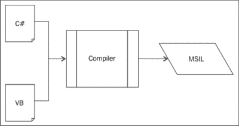
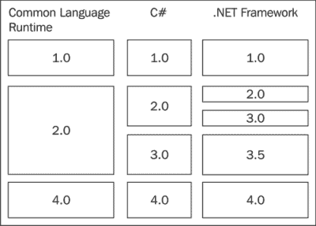

# 第二章：C#的演变

在这一章中，我们回顾了整个 C#的历史，直到最新版本。我们可能无法涵盖所有内容，但我们将涉及主要特性，特别是那些在历史上具有重要意义的特性。每个版本都带来了独特的功能，这些功能将成为未来版本创新的基石。

# C# 1.0 - 起初

当引入 C#时，微软希望借鉴许多其他语言和运行时的最佳特性。它是一种面向对象的语言，具有主动管理内存的运行时。这种语言（和框架）的一些特性包括：

+   面向对象

+   托管内存

+   丰富的基类库

+   公共语言运行时

+   类型安全

无论您的技术背景如何，C#中都有一些您可以相关的东西。

## 运行时

谈论 C#时不可能不先谈论运行时，称为**公共语言运行时**（**CLR**）。CLR 的一个主要基础是能够与多种语言进行互操作，这意味着您可以使用多种不同的语言编写程序，并且它将在相同的运行时上运行。这种互操作性是通过同意一组共同的数据类型来实现的，称为**公共类型系统**。

在.NET Framework 之前，不同语言之间没有清晰的机制进行交流。一个环境中的字符串可能与另一种语言中的字符串概念不匹配，它们是否以空字符结尾？它们是否以 ASCII 编码？数字如何表示？没有办法知道，因为每种语言都有自己的特点。当然，人们试图想出解决这个问题的办法。

在 Windows 世界中，最著名的解决方案是使用**组件对象模型**（**COM**），它使用类型库来描述其中包含的类型。通过导出此类型库，程序可以与可能使用另一种技术编写的其他进程进行通信，因为您共享了如何通信的细节。然而，这并不是没有复杂性的，因为任何使用 Visual Basic 6 编写 COM 库的人都可以告诉您。不仅是因为工具抽象了底层技术，过程通常相当不透明，而且部署是一场噩梦。甚至有一个为处理它而知名的短语，DLL 地狱。

.NET Framework 在某种程度上是对这个问题的回应。它引入了公共类型系统的概念，这些规则是 CLR 上运行的每种语言都需要遵守的规则，包括常见的数据类型，如字符串和数字类型，对象继承的方式以及类型可见性。

为了最大的灵活性，不直接编译成本机二进制代码，而是使用程序代码的中间表示作为实际的二进制映像，该映像被分发和执行，称为**MSIL**。然后第一次运行程序时编译此 MSIL，以便为正在运行的特定处理器架构放置优化（**即时**（**JIT**）编译器）。这意味着在服务器和桌面上运行的程序可能具有不同的性能特征，这取决于硬件。在过去，您将不得不编译两个不同的版本。



固有的多语言支持的另一个好处是它作为迁移策略。与 C#同时推出了许多不同的语言。拥有现有代码库的公司可以轻松地将其程序转换为与.NET 兼容的版本，该版本与 CLR 兼容，并随后可以从其他.NET 语言（如 C#）中使用。其中一些语言包括以下内容：

+   **VB.NET**：这是流行的 Visual Basic 6 的自然继承者。

+   **J#**：这是用于.NET 的 Java 语言的一个版本。

+   **C++的托管扩展**：通过一个标志，以及一些新的关键字和语法，你可以将现有的 C++应用程序编译成与 CLR 兼容的版本。

虽然许多这些语言都已经发布，并且被宣传为得到充分支持，但如今真正留存下来的只有 VB.Net 和 C#，而 C++/CLI 则略有些。许多新的语言，如 F#、IronPython 和 IronRuby，多年来都在 CLR 上涌现，并且它们仍然在开发中，拥有活跃的社区。

## 内存管理

公共语言运行时提供了**垃圾收集器**，这意味着当一个对象不再被其他对象引用时，内存将被自动回收。当然，这并不是一个新概念；许多语言，如 JavaScript 和 Visual Basic 都支持垃圾收集。另一方面，非托管语言允许你手动在堆上分配内存。虽然这种能力在实现低级解决方案时给了你更多的权力，但也给了你更多犯错误的机会。

以下是 CLR 允许的两种数据类型：

+   **值类型**：这些数据类型是使用`struct`关键字创建的

+   **引用类型**：这些数据类型是使用`class`关键字创建的

C#中的每种原始数据类型，如`int`和`float`，都是`struct`，而每个类都是引用类型。关于这些类型在内部分配的语义学有一些细微差别（栈与堆），但在日常使用中，这些差异通常并不重要。

当然你也可以创建自己的自定义类型。例如，以下是一个简单的值类型：

```cs
public struct Person
{
    public int Age;
    public string Name;
}
```

通过更改一个关键字，你可以将这个对象更改为引用类型，如下所示：

```cs
public class Person
{
    public int Age;
    public string Name;
}
```

`struct`实例和`class`实例之间有两个主要区别。首先，`struct`实例不能继承，也不能被继承。而`class`实例则是创建面向对象层次结构的主要工具。

其次，`class`实例参与垃圾回收过程，而`struct`实例则不参与，至少不是直接参与。互联网上的许多讨论往往将值类型的内存分配策略概括为在栈上分配，而引用类型在堆上分配（见下图），但这并不是全部故事：


通常这种说法总是有一些道理的，因为当你在一个方法中实例化`class`时，它总是会在堆上，而创建一个值类型，比如`int`实例会在栈上。但是如果值类型被包装在引用类型中，例如，当值类型是`class`实例中的一个字段时，它将与类数据的其余部分一起分配在堆上。

## 语法特性

C#这个名字是对 C 语言的一个俏皮的引用，就像 C++是 C（加上一些东西），C#在语法上也与 C 和 C++大致相似，尽管有一些明显的变化。与 C 不同，C#是一种面向对象的语言，但它有一些有趣的特性，使得它比其他面向对象的语言更容易和更高效。

其中一个例子是属性的 getter 和 setter。在其他语言中，如果你想控制如何公开对`class`实例的数据的访问和修改，你必须将字段设置为私有，这样外部人员就不能直接更改它。然后你会创建两个方法，一个以`get`为前缀来检索值，另一个以`set`为前缀来设置值。在 C#中，编译器会为你生成这些方法对。看下面的代码：

```cs
private int _value;

public int Value
{
    get { return _value; }
    set { _value = value; }
}
```

另一个有趣的创新是 C#如何提供一流的事件支持。在其他语言中，比如 Java，他们通过，例如，有一个名为`setOnClickListener(OnClickListener listener)`的方法来近似事件。要使用它，你必须定义一个实现`OnClickListener`接口的新类并将其传递进去。这种技术确实有效，但可能有点冗长。在 C#中，你可以定义所谓的**delegate**来表示一个方法作为一个适当的、独立的对象，如下所示：

```cs
public delegate void MyClickDelegate(string value);
```

然后，这个`delegate`可以作为类的事件使用，如下所示：

```cs
public class MyClass
{
    public event MyClickDelegate OnClick;
}
```

要注册在事件被触发时收到通知，你只需创建委托并使用`+=`语法将其添加到委托列表中，如下所示：

```cs
public void Initialize()
{
    MyClass obj = new MyClass();
    obj.OnClick += new MyClickDelegate(obj_OnClick);
}

void obj_OnClick(string value)
{
    // react to the event
}
```

语言将自动将委托添加到委托列表中，每当事件被触发时，委托列表都会收到通知。在 Java 中，这种行为必须手动实现。

当 C#推出时，还有许多其他有趣的语法特性，比如异常的工作方式、使用语句等。但为了简洁起见，让我们继续。

## 基类库

默认情况下，C#带有一个称为**基类库**（**BCL**）的丰富而广泛的框架。BCL 提供了各种功能，如下图所示：


该图显示了包含在基类库中的一些命名空间（重点是一些）。虽然还有许多其他命名空间，但这些是一些最重要的命名空间之一，为许多由微软和第三方发布的功能和库提供了基础设施。

在学习编程时，你会发现处理信息集合的数据结构类型之一。通常，你会学会使用数组来编写大多数程序和算法。不过，使用数组时，你必须提前知道集合的大小。`System.Collections`命名空间提供了一组处理未知数量数据的数据结构集合，使其易于处理。

在我写的第一个程序中（在上一章中简要描述），我使用了一个预先分配的数组。为了保持简单，数组是用任意大的元素数量分配的，这样我就不会在数组中用完空间。当然，在专业编写的非平凡程序中，这是行不通的，因为如果遇到比预期更大的数据集，你要么会用完空间，要么会浪费内存。在这里，我们可以使用最基本的集合类型之一，`ArrayList`集合，来解决这个问题，如下所示：

```cs
// first, collect the paycheck amount
Console.WriteLine("How much were you paid? ");
string input = Console.ReadLine();
float paycheckAmount = float.Parse(input);

// now, collect all of the bills
Console.WriteLine("What bills do you have to pay? ");
ArrayList bills = new ArrayList();
input = Console.ReadLine();
while (input != "")
{
    float billAmount = float.Parse(input);
    bills.Add(billAmount);
    input = Console.ReadLine();
}

// finally, summ the bills and do the final output
float totalBillAmount = 0;
for (int i = 0; i < bills.Count; i++)
{
    float billAmount = (float)bills[i];
    totalBillAmount += billAmount;
}

if (paycheckAmount > totalBillAmount)
{
    Console.WriteLine("You will have {0:c} left over after paying bills", paycheckAmount - totalBillAmount);
}
else if (paycheckAmount < totalBillAmount)
{
    Console.WriteLine("Not enough money, you need to find an extra {0:c}", totalBillAmount - paycheckAmount);
}
else
{
    Console.WriteLine("Just enough to cover bills");
}
```

如你所见，创建了一个`ArrayList`集合的实例，但没有指定大小。这是因为集合类型在内部管理它们的大小。这种抽象解除了你对大小的责任，所以你可以担心更重要的事情。

其他可用的一些集合类型如下：

+   `HashTable`：这种类型允许你提供查找键和值。它通常用于创建非常简单的内存数据库。

+   `Stack`：这是一种后进先出的数据结构。

+   `Queue`：这是一种先进先出的数据结构。

查看具体的集合类并不能完全说明问题。如果你跟踪继承链，你会注意到每个集合都实现了一个名为`IEnumerable`的接口。这将成为整个语言中最重要的接口之一，所以早期熟悉它是很重要的。

`IEnumerable`和它的姊妹类`IEnumerator`抽象了对项目集合的枚举概念。你总是会看到这些接口一起使用，它们非常简单。你可以看到这一点，如下所示：

```cs
namespace System.Collections
{
    public interface IEnumerable
    {
        IEnumerator GetEnumerator();
    }

    public interface IEnumerator
    {
        object Current { get; }
        bool MoveNext();
        void Reset();
    }
}
```

乍一看，你可能会想为什么集合实现`IEnumerable`，它有一个返回`IEnumerator`的方法，而不直接实现`IEnumerator`。枚举器负责枚举集合。但这样做是有原因的。如果集合本身是枚举器，那么你就无法同时迭代同一个集合。因此，每次调用`GetEnumerator()`通常会返回一个单独的枚举器，尽管这并不是必须的。

尽管接口非常简单，但事实证明，拥有这种抽象是非常强大的。C#实现了一个很好的简写语法，可以在不使用索引变量的情况下迭代集合。这在下面的代码中有解释：

```cs
int[] numbers = new int[3];
numbers[0] = 1;
numbers[1] = 2;
numbers[2] = 3;

foreach (int number in numbers)
{
    Console.WriteLine(number);
}
```

`foreach`语法之所以有效，是因为它是编译器实际生成的代码的简写。它将生成与枚举器的交互的代码。因此，前面示例中的循环将看起来像编译后的 MSIL，如下所示：

```cs
IEnumerator enumerator = numbers.GetEnumerator();

while (enumerator.MoveNext())
{
    int number = (int)enumerator.Current;
    Console.WriteLine(number);
}
```

再次，我们有一个例子，C#编译器生成的代码与你实际编写的代码不同。这将是 C#演变的关键，使你更容易表达你编写的常见代码模式，从而让你更高效、更有生产力。

对于一些开发人员来说，C#在刚开始时是 Java 的廉价模仿。但对于像我这样的开发人员来说，它是一股清新的空气，提供了比 VBScript 等解释性语言更好的性能改进，比 C++等语言更多的安全性和简单性，以及比 JavaScript 等语言更多的低级功能。

# C# 2.0

C#语言、Runtime 和.NET Framework 的第一个重大更新是一个大事件。这个版本的重点是使语言更简洁、更容易编写。

## 语法更新

第一个更新为属性语法添加了一个小功能。在 1.0 中，如果你想要一个只读属性，你的唯一选择就是排除 setter，如下所示：

```cs
private int _value;

public int Value
{
    get { return _value; }
}
```

所有内部逻辑都必须直接与`_value`成员交互。在许多情况下这是可以的，除了需要有一些逻辑来控制何时以及如何允许更改该值的情况。或者类似地，如果需要触发事件，你必须创建一个私有方法，如下所示：

```cs
private void SetValue(int value)
{
    if (_value < 5)
        _value = value;
}
```

在 C# 2.0 中不再需要这样做，因为现在可以创建一个私有的 setter，如下所示：

```cs
private int _value;

public int Value
{
    get { return _value; }
    private set
    {
        if (_value < 5)
            _value = value;
    }
}
```

一个小功能，但它增加了一致性，因为分开的 getter 和 setter 方法是 C#试图摆脱的第一个版本的东西之一。

另一个有趣的补充是**可空**类型。对于值类型，编译器不允许你将它们设置为 null 值，然而，现在你有一个新的关键字符，可以用来表示可空值类型，如下所示：

```cs
int? number = null;
if (number.HasValue)
{
    int actualValue = number.Value;
    Console.WriteLine(actualValue);
}
```

只需添加问号，值类型就被标记为可空，你可以使用`.HasValue`和`.Value`属性来决定在空值的情况下该做什么。

## 匿名方法

委托是 C#相对于其他语言的一个很好的补充。它们是事件系统的构建块。然而，C# 1.0 中实现的一个缺点是，它们使得阅读代码变得更加困难，因为当事件被触发时执行的代码实际上是在其他地方编写的。继续简化代码的趋势，**匿名方法**让你可以内联编写代码。例如，给定以下委托定义：

```cs
public delegate void ProcessNameDelegate(string name);
```

你可以使用匿名方法创建委托的实例，如下所示：

```cs
ProcessNameDelegate myDelegate = delegate(string name)
{
    Console.WriteLine("Processing Name = " + name);
};

myDelegate("Joel");
```

这段代码是内联的，简短且易于理解。它还允许您像 JavaScript 等其他语言中的一等函数一样使用委托。但它不仅仅是更容易阅读。如果您想要向不接受参数的委托传递参数，您必须创建一个自定义类来包装方法实现和存储的值。这样，当调用委托（从而执行目标方法）时，它就可以访问该值。任何早期的多线程代码都充满了以下代码：

```cs
public class CustomThreadStarter
{
    private int value;
    public CustomThreadStarter(int val)
    {
        this.value = val;
    }

    public void Execute()
    {
        // do something with 'value'
    }
}
```

这个类在构造函数中接受一个值并将其存储在一个私有成员中。然后稍后当调用委托时，该值可以被使用，就像在这种情况下使用它来启动一个新线程。这在以下代码中显示：

```cs
CustomThreadStarter starter = new CustomThreadStarter(55);
ThreadStart start = new ThreadStart(starter.Execute);
Thread thread = new Thread(start);
thread.Start();
```

使用匿名委托，编译器可以介入并大大简化先前提到的使用模式：

```cs
int value = 55;
Thread thread = new Thread(delegate()
    {
        // do something with 'value'
        Console.WriteLine(value);
    });
thread.Start();
```

这看起来可能很简单，但这里有一些严重的编译器魔法。编译器分析了代码，意识到匿名方法在方法体中需要`value`变量，并自动生成了一个类，类似于我们在 C# 1.0 中必须创建的`CustomThreadStarter`。结果是您可以轻松阅读的代码，因为它就在那里，与其余部分上下文相关。

## 部分类

在 C# 1.0 中，使用代码生成器来自动化诸如自定义集合之类的事情是常见的做法。当您想要向生成的代码添加自己的方法和属性时，通常需要从该类继承，或者在某些情况下，直接编辑生成的文件。这意味着您必须非常小心，以避免重新生成代码，否则会有覆盖自定义逻辑的风险。您会在许多第一代工具中找到类似以下评论的注释：

```cs
// <auto-generated>
//     This code was generated by a tool.
//     Runtime Version:2.0.50727.3053
//
//     Changes to this file may cause incorrect behavior and will be lost if
//     the code is regenerated.
// </auto-generated>
```

C# 2.0 在您的工具库中添加了一个额外的关键字`partial`。使用**partial**类，您可以将类分解成多个文件。要查看这个过程，请创建以下类：

```cs
// A.generated.cs
public partial class A
{
    public string Name;
}
```

这代表了自动生成的代码。请注意，文件名中包含`.generated`；这是一种采用的约定，尽管这对于工作来说并非必需，只是这两个文件都是同一个项目的一部分。然后在另一个文件中，您可以包含其余的实现，如下所示：

```cs
// A.cs
public partial class A
{
    public int Age;
}
```

然后所有成员将在运行时对生成的类型可用，因为编译器会负责将类拼接在一起。您可以自由地随意重新生成第一个文件，而不必担心覆盖您的更改。

## 泛型

C# 2.0 的主要特性增加是**泛型**，它允许您创建可以重复使用多种类型对象的类。过去，这种编程只能以两种方式实现。您可以使用参数的公共基类，以便从该类继承的任何对象都可以传递，而不管具体的实现方式如何。这种方法有点有效，但当您想要创建一个非常通用的数据结构时，它会变得非常有限。另一种方法实际上只是第一种方法的派生。而不是使用自己定义的基类，而是沿着继承树一直使用`object`作为类型参数。

这是因为.NET 中的所有类型都派生自`object`，因此您可以传入任何东西。这是原始集合类使用的方法。但即使这样也存在问题，特别是在传递值类型时，由于装箱的影响。您还必须每次都从对象中转换类型。

幸运的是，所有这些问题都可以通过使用泛型来缓解：

```cs
public class Message<T>
{
    public T Value;
}
```

在此示例中，我们定义了一个名为`T`的**泛型类型参数**。泛型类型参数的实际名称可以是任何名称，`T`只是一个约定的用法。当您实例化`Message`类时，可以使用以下语法指定要存储在`Value`属性中的对象的类型，如下所示：

```cs
Message<int> message = new Message<int>();
message.Value = 3;
int variable = message.Value;
```

因此，您可以将整数分配给字段，而不必担心性能，因为该值不会被装箱。当您想要使用它时，您也不必进行转换，就像使用对象一样。

泛型非常强大，但并非无所不能。为了突出一个关键的不足，我们将讨论几乎每个 C#开发人员在 2.0 首次发布时尝试的第一件事情之一——泛型数学。数学密集型应用程序的开发人员可能会使用领域的数学库。例如，游戏开发人员（或者实际上是做任何涉及 2D 或 3D 空间计算的人）将始终需要一个良好的`Vector`结构，如下所示：

```cs
public struct Vector
{
    public float X;
    public float Y;

    public void Add(Vector other)
    {
        this.X += other.X;
        this.Y += other.Y;
    }
}
```

但问题是它使用`float`数据类型进行计算。如果您想要将其泛化并支持其他数值类型，比如`int`、`double`或`decimal`，您该怎么办？乍一看，您可能会认为可以使用泛型来支持这种情况，如下所示：

```cs
public struct Vector<T>
{
    public T X;
    public T Y;

    public void Add(Vector<T> other)
    {
        this.X += other.X;
        this.Y += other.Y;
    }
}
```

编译将导致错误，**运算符'+='无法应用于类型'T'和'T'的操作数**。这是因为，默认情况下，由于编译器无法知道在使用的类型上定义了哪些方法（以及由此推断出的操作），因此仅`object`数据类型的成员可用于泛型参数。

幸运的是，微软在某种程度上预料到了这一点，并添加了一种称为**泛型类型约束**的东西。这些约束让您向编译器提示调用者将被允许使用的类型的种类，这反过来意味着您可以使用您约束的特性。例如，看看以下代码：

```cs
public void WriteIt<T>(T list) where T : IEnumerable
{
    foreach (object item in list)
    {
        Console.WriteLine(item);
    }
}
```

在这里，我们添加了一个约束，即类型参数`T`必须是`IEnumerable`。因此，您可以编写代码，并确保任何调用此方法的调用者只会使用实现`IEnumerable`接口作为类型参数的类型。您可以使用的其他参数约束如下：

+   `class`：这表示类型参数必须是引用类型。

+   `struct`：这意味着只允许值类型。

+   `new()`：此类型必须有一个无参数的公共构造函数。它将允许您使用类似`T value = new T()`的语法来创建类型参数的新实例。否则，您唯一能做的就是像`T value = default(T)`这样的事情，对于引用类型，它将返回 null，对于数值原语，它将返回零。

+   `<接口名称>`：这限制了类型参数使用此处提到的接口，如前面提到的`IEnumerable`。

+   `<类的名称>`：使用此约束的任何类型必须是此类型，或者在继承链中的某个时候继承自此类型。

很不幸，因为数值数据结构是值类型，它们无法继承，因此没有通用类型可用于类型约束，以便为您提供执行数学运算所需的数学运算符。

一般来说，泛型在“框架”样式的代码中最有用，也就是说，对于应用程序的一般基础设施，或者诸如集合之类的数据结构。实际上，在 C# 2.0 中提供了一些很棒的新集合类型。

## 泛型集合

泛型非常适合集合，因为集合本身实际上不必与其包含的对象进行交互；它只需要一个放置它们的地方。因此，在集合中，对类型参数没有约束。所有新的泛型集合都可以在以下命名空间中找到：

```cs
using System.Collections.Generic;
```

正如我们之前讨论的那样，C# 1.0 中最基本的集合类型是`ArrayList`集合，当时它的工作效果非常好。然而，由于它使用`object`作为其有效载荷类型，值类型将被装箱，并且每次想要取出一个值时，您都必须将对象转换为目标对象类型。有了泛型，我们现在有了`List<T>`如下：

```cs
List<int> list = new List<int>();
list.Add(1);
list.Add(2);
list.Add(3);

int value = list[1]; // returns 2;
```

使用方式与`ArrayList`集合几乎相同，但具有泛型的性能优势。一些其他可用的泛型类类型如下：

+   `Queue<T>`：这与非泛型的`Queue`相同，**先进先出**（**FIFO**）。

+   `Stack<T>`：与非泛型版本的`Stack`没有区别，**后进先出**（**LIFO**）。

+   `Dictionary<T, K>`：这取代了 C# 1.0 中的`Hashtable`集合。它使用两个泛型参数来表示每个字典项的键和值。这意味着您可以使用除字符串以外的键。

## 迭代器方法

也许在 C# 2.0 中出现的更独特的特性之一是**迭代器**方法。它们是一种让编译器自动生成对序列的自定义迭代的方法。这个描述有点抽象，不可否认，因此最容易解释的方法是通过一些代码，如下所示：

```cs
private static IEnumerable<string> GetStates()
{
    yield return "Orlando";
    yield return "New York";
    yield return "Atlanta";
    yield return "Los Angeles";
}
```

在以前的方法中，您会看到一个返回`IEnumerable<string>`的方法。然而，在方法体中，只有四行连续的代码使用了`yield`关键字。这告诉编译器生成一个自定义的枚举器，将方法分解为每个`yield`之间的单个部分，以便在调用者枚举返回的值时执行。这在以下代码中显示：

```cs
foreach (string state in GetStates())
{
    Console.WriteLine(state);
}
// outputs Orlando, New York, Atlanta, and Los Angeles
```

有许多不同的方法来处理和使用迭代器，但这里的重点是 C#编译器在此版本中变得更加智能。它能够接受您的代码并扩展它。这使您能够以更高的抽象级别编写代码，这是 C#演变中的一个持续主题。

# C# 3.0

如果您认为 C# 2.0 是一个重大更新，那么 3.0 版本的发布就更大了！在一个单独的章节（更不用说章节的一部分）中很难充分展现它。因此，我们将重点关注主要特性，特别是它与 C#的演变相关的部分。

不过，首先我们应该谈谈 C#、CLR 和.NET Framework 之间的区别。直到现在，它们大多数版本都是相同的（即 C# 2.0、CLR 2.0 和.NET Framework 2.0），然而，他们发布了一个没有语言或 CLR 更改的.NET Framework（3.0）的更新。然后在.NET 3.5 中，他们发布了 C# 3.0。以下图表解释了这些差异：


令人困惑，我知道。尽管 C#语言和.NET Framework 都进行了升级，但 CLR 保持不变。尤其是考虑到所有新特性，这很难相信，但这表明了 CLR 的开发人员的前瞻性思维，以及 C#语言/编译器的良好工程化和可扩展性，他们能够在没有新运行时支持的情况下添加新特性。

## 语法更新

像往常一样，我们将开始审查此版本语言的语法更改。首先是属性，您会记得它们已经是对旧式的 getter 和 setter 方法的改进。在 C# 3.0 中，编译器可以自动生成简单 getter 和 setter 的后备字段，如下所示：

```cs
public string Name { get; set; }
```

这个特性单独就可以减少许多具有许多属性的类的代码行数。另一个引入的不错的特性是**对象初始化器**。看下面这个简单的类：

```cs
public class Person
{
    public string Name { get; set; }
    public int Age { get; set; }
}
```

如果您想创建一个实例并对其进行初始化，通常需要编写以下代码：

```cs
Person person = new Person();
person.Name = "Layla";
person.Age = 11;
```

但使用对象初始化器，您可以在对象实例化的同时进行如下操作：

```cs
Person person = new Person { Name = "Layla", Age = 11 };
```

编译器实际上会生成几乎与以前相同的代码，因此没有语义上的区别。但是你可以以更简洁和易读的方式编写你的代码。集合也得到了类似的处理，现在你可以使用以下语法初始化数组：

```cs
int[] numbers = { 1, 2, 3, 4, 5 };
```

而且，以前初始化时非常冗长的字典现在可以非常容易地创建如下：

```cs
Dictionary<string, int> states = new Dictionary<string,int>
{
    { "NY", 1 },
    { "FL", 2 },
    { "NJ", 3 }
};
```

这些改进使得编写代码的过程更加简单和快速。但是，C#语言设计者似乎并不满足于此。每次你实例化一个新变量时，都需要写出整个类型名称，当你开始使用复杂的泛型类型时，这可能会给你的程序增加很多额外的字符。不用担心！在 C# 3.0 中甚至不需要这样做！看看下面的代码：

```cs
var num = 8;
var name = "Ashton";
var map = new Dictionary<string, int>();
```

只要右侧的赋值清楚地指明了类型，编译器就可以负责确定左侧的类型。敏锐的读者无疑会认出`var`关键字来自 JavaScript。虽然看起来相似，但实际上并不一样。C#仍然是静态类型的，这意味着每个变量必须在编译时知道。以下代码将无法编译：

```cs
var num = 8;
num = "Tabbitha";
```

因此，实际上这只是一个快捷方式，帮助你输入更少的字符，编译器非常擅长推断这些东西。事实上，它可以推断的不仅仅是这些。如果有足够的上下文，它还可以推断泛型类型参数。例如，考虑以下简单的泛型方法：

```cs
public string ConvertToString<T>(T value)
{
    return value.ToString();
}
```

当你调用它时，而不是在调用中声明类型，编译器可以查看被传递的类的类型，并简单地假定这是应该用于类型参数的类型，如下所示：

```cs
string s = ConvertToString(234);
```

在这一点上，我想象 C#语言团队中的某个人说：“当我们让现有的语法变成可选时，为什么不完全摒弃对类定义的需求呢！”似乎他们确实这样做了。如果你需要一个数据类型来保存一些字段，你可以内联声明如下：

```cs
var me = new { Name = "Joel", Age = 31 };
```

编译器将自动创建一个与你刚刚创建的类型匹配的类。这个特性有一些限制：你必须使用`var`关键字，并且不能从方法中返回匿名类型。当你编写算法并且需要一个快速但复杂的数据类型时非常有用。

所有这些小的语法改变都使得 C#语言写起来更加愉快。它们也为我们接下来要讨论的下一个重要特性铺平了道路。

## LINQ

**语言集成查询**（**LINQ**）是 C# 3.0 的旗舰特性。它承认了现代程序的很大一部分围绕着以某种方式查询数据。LINQ 是一组多样化的特性，为语言提供了对从多种来源查询数据的一流支持。它通过在查询概念周围提供强大的抽象，然后添加语言支持来实现这一点。

C#语言团队从这样一个前提开始，即 SQL 已经是一个很好的用于处理基于集合的数据的语法。但不幸的是，它并不是语言的一部分；它需要不同的运行时，比如 SQL Server，并且只能在那个上下文中工作。LINQ 不需要这样的上下文切换，因此你可以简单地获取到你的数据源的引用，然后进行查询。

在概念上，你可以对集合进行以下高级别的操作：

+   **过滤**：这是根据某些条件从集合中排除项目的操作

+   **聚合**：这涉及到常见的聚合操作，比如分组和求和

+   **投影**：这是从集合中提取或转换项目

以下是一个简单的 LINQ 查询的样子：

```cs
int[] numbers = { 1, 2, 3, 4, 5, 6 };

IEnumerable<int> query = from num in numbers
                            where num > 3
                            select num;

foreach (var num in query)
{
    Console.WriteLine(num);
}
// outputs 4, 5, and 6
```

它看起来像 SQL，有点像。多年来一直有很多关于为什么语法不像 SQL 中的 select 语句一样开始的问题，但原因归结为工具。当您开始输入时，他们希望您能够在输入查询的每个部分时获得智能感知。通过从'from'开始，您基本上告诉编译器在查询的其余部分中将使用什么类型，这意味着它可以在编译时提供类型支持。

LINQ 的一个有趣之处在于它适用于任何`IEnumerable`。想一想，你的程序中的每个集合现在都很容易搜索。而且不仅如此，您还可以聚合和整理输出。例如，假设您想要按州获取每个州的城市数量，如下所示：

```cs
var cities = new[]
{
    new { City="Orlando", State="FL" },
    new { City="Miami", State="FL" },
    new { City="New York", State="NY" },
    new { City="Allendale", State="NJ" }
};

var query = from city in cities
            group city by city.State into state
            select new { Name = state.Key, Cities = state };

foreach (var state in query)
{
    Console.WriteLine("{0} has {1} cities in this collection", state.Name, state.Cities.Count());
}
```

此查询使用 group by 子句按公共键（在本例中为州）对值进行分组。最终输出还是一个新的匿名类型，其中包含两个属性，名称和该州的城市集合。运行此程序将为佛罗里达州输出**FL has 2 cities in this collection**。

到目前为止，在这些示例中，我们一直在使用所谓的**查询语法**。这很好，因为对于了解 SQL 的人来说非常熟悉。然而，就像 SQL 一样，更复杂的查询有时可能会变得相当冗长和复杂。有另一种编写 LINQ 查询的方法，对于一些人来说可能更容易阅读，甚至可能更灵活，称为**LINQ 方法语法**，它建立在语言的另一个新功能之上。

## 扩展方法

通常，扩展类型功能的唯一方法是从类继承并将功能添加到子类型中。所有用户都必须使用新类型才能获得该新类型的好处。然而，这并不总是一个选择，例如，如果您正在使用具有值类型的第三方库（因为您无法从值类型继承）。假设我们在第三方库中有以下`struct`，我们无法访问修改源代码：

```cs
public struct Point
{
    public float X;
    public float Y;
}
```

使用扩展方法，您可以按以下方式向此类型添加新方法：

```cs
public static class PointExtensions
{
    public static void Add(this Point value, Point other)
    {
        value.X += other.X;
        value.Y += other.Y;
    }
}
```

扩展方法必须放在公共静态类中。方法本身将是静态的，并且将在第一个参数上使用`this`关键字来表示要附加到的类型。使用前面的方法看起来就像该方法一直是类型的一部分一样：

```cs
var point = new Point { X = 28.5381f, Y = 81.3794f };
var other = new Point { X = -2.6809f, Y = -1.1011f };

point.Add(other);
Console.WriteLine("{0}, {1}", point.X, point.Y);
// outputs "25.8572, 80.2783"
```

您可以将扩展方法添加到任何类型，无论是值类型还是引用类型。接口和密封类也可以扩展。如果您查看 C# 3.0 中的所有更改，您会注意到您现在编写的代码更少，因为编译器正在为您在幕后生成越来越多的代码。结果是代码看起来类似于其他一些动态语言，如 JavaScript。

# C# 4.0

随着语言的第四次迭代，微软试图通过将每个组件的版本号递增到 4.0 来简化之前几个版本所造成的版本混乱。



C# 4.0 将更多的动态功能引入语言，并继续努力使 C#成为一个非常强大但灵活的语言。添加的一些功能主要是为了使与本地平台代码的交互更加容易。例如，协变、逆变和可选参数等功能简化了与 Microsoft Word 交互的 Interop 程序集的调用过程。总的来说，这些并不是非常惊人的东西，至少对于普通的开发人员来说不是。

然而，通过添加一个新关键字`dynamic`，C#更接近成为一种非常动态的语言；或者至少继承了许多动态语言的特性。还记得当引入泛型时，如果有一个裸类型参数（即没有类型约束），它被视为对象。编译器在运行时对类型有关的方法和属性没有额外的信息，因此您只能将其视为对象进行交互。

在 C# 4.0 中，现在您可以编写可以在运行时绑定到正确属性和方法的代码。以下是一个简单的例子：

```cs
dynamic o = GetAString() ;

string s = o.Substring(2, 3);
```

### 提示

如果您正在从较早版本的框架迁移项目，请确保在使用动态编程时添加对`Microsoft.CSharp.dll`的引用。如果没有这个引用，您将收到编译错误。

在这个假设的场景中，您有一个返回`string`的方法。接收`GetAString()`方法返回值的变量标记有`dynamic`关键字。这意味着您在该对象上调用的每个属性和方法都将在运行时动态评估。这使得 C#可以轻松地与动态语言（如 IronPython 和 IronRuby）以及您自己的自定义动态类型进行交互。

这是否意味着 C#不再是静态类型的？不，恰恰相反；C#仍然是静态类型的，只是在这种情况下，您已经告诉编译器以不同的方式处理这段代码。它通过重写您的动态代码来使用**动态语言运行时**（**DLR**）来实现这一点，实际上编译出您的代码的表达式树，在运行时进行评估。

您可以通过继承内置类`DynamicObject`轻松创建自己的动态对象，如下所示：

```cs
public class Bag : DynamicObject
{
    private Dictionary<string, object> members = new Dictionary<string, object>();

    public override IEnumerable<string> GetDynamicMemberNames()
    {
        return members.Keys;
    }

    public override bool TryGetMember(GetMemberBinder binder, out object result)
    {
        return members.TryGetValue(binder.Name, out result);
    }

    public override bool TrySetMember(SetMemberBinder binder, object value)
    {
        members[binder.Name] = value;
        return true;
    }
}
```

在这个简单的例子中，我们继承自`DynamicObject`并重写了一些方法来获取和设置成员值。这些值在内部存储在字典中，这样当 DLR 请求时，您可以取出正确的值。使用这个类非常像 JavaScript 中的灵活对象。看下面的代码：

```cs
dynamic bag = new Bag();

bag.Name = "Joel";
bag.Age = 31;
bag.CalcDoubleAge = new Func<int>(() => bag.Age * 2);

Console.WriteLine(bag.CalcDoubleAge());
```

如果需要存储新值，只需设置属性。如果要定义新方法，可以使用委托作为成员的值。当然，您必须意识到这不会像拥有常规静态类型的类那样快，每个值必须在运行时查找，并且因为值在内部存储为对象，任何值类型都将被装箱。但有时这些缺点是完全可以接受的，特别是当它可以简化您的代码时。

# 总结

对我来说，观察 C#从第一个版本发展到今天是一段令人惊奇的旅程。每个后续版本都比上一个版本更强大，而且在整个过程中都有一个非常坚实的代码简化主题。编译器本身在为您生成代码方面变得越来越好，这样您就可以在程序中实现非常强大的功能，而不必承担冗长实现基础设施（泛型、迭代器、LINQ 和 DLR）的认知负担。

在本章中，我们看了一些 C#每个版本引入的主要特性。

+   **C# 1.0**：内存管理，基类库和语法特性，如属性和事件。

+   **C# 2.0**：泛型，迭代器方法，部分类，匿名方法和语法更新，如属性上的可见性修饰符和可空类型。

+   **C# 3.0**：**语言集成查询**（**LINQ**），扩展方法，自动属性，对象初始化程序，类型推断（`var`）和匿名类型。

+   **C# 4.0**：**动态语言运行时**（**DLR**），协变和逆变

现在，我们转向最新版本，C# 5.0。Iliquamet quae volor aut ium ea dolore doleseq uibusam, quiasped utem atet etur sus。
