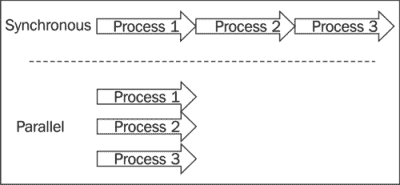
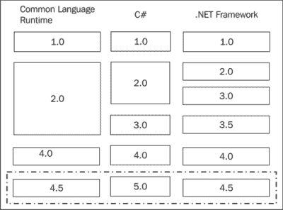
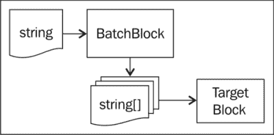
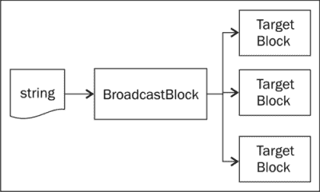

# 第三章：行动中的异步性

我们将探讨 C# 5.0 版本中的新功能。值得注意的是，其中大部分与语言中新增的内置异步功能相关，这些功能允许您轻松地充分利用运行软件的硬件。我们还将讨论**任务并行库**（**TPL**），它引入了用于异步编程的原语，C# 5.0 语言支持简单的异步性，TPL DataFlow，基于代理的异步编程的更高级抽象，以及利用新的异步性功能的框架改进，例如对 I/O API 的改进。

总的来说，.NET Framework 的最新版本是庞大的，本章介绍的概念将作为本书其余部分涵盖材料的参考。

# 异步性

当我们谈论 C# 5.0 时，主要谈论的是新的异步编程功能。**异步性**是什么意思？嗯，它可能意味着一些不同的事情，但在我们的上下文中，它只是同步的相反。当您将程序的执行分解为异步块时，您可以并行执行它们。

> 成功的陷阱：与峰会、高峰或穿越沙漠寻找胜利的旅程形成鲜明对比，我们希望我们的客户通过使用我们的平台和框架简单地获得胜利的实践。在我们让人陷入麻烦的程度上，我们失败了。-Rico Mariani

不幸的是，构建异步软件并不总是容易的，但是通过 C# 5.0，您将看到它可以有多容易。正如您在下图中所看到的，同时执行多个操作可以为您的程序带来各种积极的特性：



并行执行可以为程序的执行带来性能改进。最好的方法是通过一个例子来将其置于上下文中，这个例子在桌面软件的世界中经常遇到。

假设您正在开发一个应用程序，并且该软件应满足以下要求：

1.  当用户单击按钮时，启动对 Web 服务的调用。

1.  完成 Web 服务调用后，将结果存储到数据库中。

1.  最后，绑定结果并将其显示给用户。

实现这个解决方案的天真方式存在许多问题。首先，许多开发人员以一种使用户界面在等待接收这些 Web 服务调用的结果时完全无响应的方式编写代码。然后，一旦结果最终到达，我们继续让用户等待，而我们将结果存储在数据库中，这是用户在这种情况下不关心的操作。

过去缓解这类问题的主要手段一直是编写多线程代码。这当然并不新鲜，因为多线程硬件已经存在多年，以及利用这些硬件的软件功能。大多数编程语言没有为这些硬件提供很好的抽象层，通常让（或要求）您直接针对硬件线程进行编程。

幸运的是，微软引入了一个新的库，以简化编写高度并发程序的任务，这将在下一节中解释。

## 任务并行库

**任务并行库**（**TPL**）是在.NET 4.0 中引入的（以及 C# 4.0）。我们在第二章*C#的演变*中没有涉及它，原因有几个。首先，这是一个庞大的主题，在如此狭小的空间内无法得到适当的审查。其次，它与 C# 5.0 中的新异步特性高度相关，以至于它们是新特性的字面基础。因此，在本节中，我们将介绍 TPL 的基础知识，以及它如何以及为什么起作用的一些背景信息。

TPL 引入了一个新类型，即`Task`类型，它将*必须完成的任务*的概念抽象成一个对象。乍一看，您可能会认为这种抽象已经存在于`Thread`类中。虽然`Task`和`Thread`之间有一些相似之处，但实现有着相当不同的含义。

使用`Thread`类，您可以直接针对操作系统支持的最低级别的并行性进行编程，如下面的代码所示：

```cs
Thread thread = new Thread(new ThreadStart(() =>
{
Thread.Sleep(1000);
Console.WriteLine("Hello, from the Thread");
    }));
thread.Start();

Console.WriteLine("Hello, from the main thread");
thread.Join();
```

在前面的示例中，我们创建了一个新的`Thread`类，当启动时，它将休眠一秒钟，然后输出文本**Hello, from the Thread**。在调用`thread.Start()`之后，主线程上的代码立即继续执行，并输出**Hello, from the main thread**。一秒钟后，我们看到后台线程的文本被打印到屏幕上。

在某种意义上，使用`Thread`类的这个示例展示了如何轻松地将执行分支到后台线程，同时允许主线程的执行继续进行，不受阻碍。然而，使用`Thread`类作为您的“并发原语”的问题在于，该类本身就是实现的指示，也就是说，将创建一个操作系统线程。就抽象而言，它实际上并不是一个抽象；您的代码必须同时管理线程的生命周期，同时处理线程正在执行的任务。

如果您有多个任务要执行，生成多个线程可能是灾难性的，因为操作系统只能生成有限数量的线程。对于性能密集型应用程序，线程应被视为一种重量级资源，这意味着您应该避免使用过多的线程，并尽可能地保持它们活动。正如您可能想象的那样，.NET Framework 的设计者并没有简单地让您在没有任何帮助的情况下编写程序。框架的早期版本有一种机制来处理这个问题，即`ThreadPool`，它允许您排队一个工作单元，并让线程池管理一组线程的生命周期。当一个线程变得可用时，您的工作项就会被执行。以下是使用线程池的一个简单示例：

```cs
int[] numbers = { 1, 2, 3, 4 };

foreach (var number in numbers)
{
ThreadPool.QueueUserWorkItem(new WaitCallback(o =>
        {
Thread.Sleep(500);
            string tabs = new String('\t', (int)o);
Console.WriteLine("{0}processing #{1}", tabs, o);
        }), number);
}
```

这个示例模拟了多个任务，应该并行执行。我们从一个数字数组开始，对于每个数字，我们都想排队一个工作项，它将休眠半秒钟，然后写入控制台。这比自己尝试管理多个线程要好得多，因为线程池会在有更多工作时负责生成更多线程。当达到并发线程的配置限制时，它将保持工作项，直到有线程可用来处理它。这是您自己使用线程时会做的所有工作。

然而，线程池并不是没有问题的。首先，它没有提供在工作项完成时同步的方法。如果您想在作业完成时收到通知，您必须自己编写通知，无论是通过引发事件，还是使用线程同步原语，比如`ManualResetEvent`。您还必须小心不要排队太多的工作项，否则可能会遇到线程池大小的系统限制。

使用 TPL，我们现在有一个称为`Task`的并发原语。考虑以下代码：

```cs
Task task = Task.Factory.StartNew(() =>
    {
Thread.Sleep(1000);
Console.WriteLine("Hello, from the Task");
    });

Console.WriteLine("Hello, from the main thread");

task.Wait();
```

乍一看，代码看起来与使用`Thread`的示例非常相似，但它们是非常不同的。一个很大的区别是，使用`Task`时，您并没有承诺实现。TPL 在幕后使用一些非常有趣的算法来管理工作负载和系统资源，并且实际上允许您通过使用自定义调度程序和同步上下文来自定义这些算法。这使您能够以高度控制并行执行程序。

处理多个任务，就像我们在线程池中所做的那样，也更容易，因为每个任务都内置了同步功能。为了演示如何快速并行化任意数量的任务是多么简单，我们从与前一个线程池示例中相同的整数数组开始：

```cs
int[] numbers = { 1, 2, 3, 4 };
```

因为`Task`可以被视为表示异步任务的原始类型，我们可以将其视为数据。这意味着我们可以使用诸如 Linq 之类的东西将数字数组投影到任务列表中，如下所示：

```cs
var tasks = numbers.Select(number =>
Task.Factory.StartNew(() =>
    {
Thread.Sleep(500);
        string tabs = new String('\t', number);
Console.WriteLine("{0}processing #{1}", tabs, number);
    }));
```

最后，如果我们想要等到所有任务都完成后再继续，我们可以通过调用以下方法轻松实现：

```cs
Task.WaitAll(tasks.ToArray());
```

一旦代码到达这个方法，它将等待数组中的每个任务完成后才继续。这种控制水平非常方便，特别是当您考虑到过去，您必须依赖许多不同的同步技术来实现与 TPL 代码中仅用几行代码实现的完全相同的结果时。

到目前为止，我们讨论的使用模式仍然存在一个很大的断裂，即生成任务的过程和子进程之间的断裂。将值传递到后台任务中非常容易，但当您想要检索一个值然后对其进行操作时，情况就会变得棘手。考虑以下要求：

1.  进行网络调用以检索一些数据。

1.  查询数据库以获取一些配置数据。

1.  处理网络数据的结果，以及配置数据。

以下图表显示了逻辑：


网络调用和对数据库的查询可以并行进行。根据我们迄今为止对任务的了解，这不是问题。然而，对这些任务的结果进行操作将会稍微复杂一些，如果不是因为 TPL 恰好提供了对这种情况的支持。

还有一种特殊的`Task`，在这种情况下特别有用，称为`Task<T>`。这个任务的泛型版本期望运行的任务最终返回一个值。任务的客户端可以通过任务的`.Result`属性访问该值。当您调用该属性时，如果任务已完成并且结果可用，它将立即返回。但是，如果任务尚未完成，它将阻塞当前线程的执行，直到完成。

使用这种承诺给您结果的任务，您可以编写程序，以便计划并启动所需的并行性，并以非常逻辑的方式处理响应。看看以下代码：

```cs
varwebTask = Task.Factory.StartNew(() =>
    {
WebClient client = new WebClient();
        return client.DownloadString("http://bing.com");
    });

vardbTask = Task.Factory.StartNew(() =>
    {
        // do a lengthy database query
        return new
        {
WriteToConsole=true
        };
    });

if (dbTask.Result.WriteToConsole)
{
Console.WriteLine(webTask.Result);
}
else
{
ProcessWebResult(webTask.Result);
}
```

在前面的示例中，我们有两个任务，`webTask`和`dbTask`，它们将同时执行。`webTask`只是从[`bing.com`](http://bing.com)下载 HTML。由于访问互联网的动态特性，访问互联网上的内容可能会非常不稳定，因此您永远不知道需要多长时间。对于`dbTask`任务，我们模拟访问数据库以返回一些存储的设置。尽管在这个简单的示例中，我们只是返回一个静态的匿名类型，但数据库访问通常会访问网络上的不同服务器；同样，这是一个像从互联网上下载东西一样的 I/O 绑定任务。

与我们使用`Task.WaitAll`等待它们都执行不同，我们可以简单地访问任务的`.Result`属性。如果任务已经完成，结果将被返回，执行可以继续，如果没有，程序将简单地等待直到完成。

能够在不必手动处理任务同步的情况下编写代码是很棒的，因为程序员需要记住的概念越少，他/她就可以将更多的资源投入到程序中。

### 提示

如果你对返回值的任务的概念感到好奇，你可以搜索有关"Futures"和"Promises"的资源：

[`en.wikipedia.org/wiki/Promise_%28programming%29`](http://en.wikipedia.org/wiki/Promise_%28programming%29)

在最简单的层面上，这是一个承诺在“未来”给你一个结果的构造，这正是`Task<T>`所做的。

### 任务的可组合性

拥有一个适当的异步任务抽象使得协调多个异步活动变得更容易。一旦第一个任务被启动，TPL 允许你使用所谓的**continuations**将多个任务组合成一个统一的整体。看看下面的代码：

```cs
Task<string> task = Task.Factory.StartNew(() =>
{
WebClient client = new WebClient();
    return client.DownloadString("http://bing.com");
});

task.ContinueWith(webTask =>
    {
Console.WriteLine(webTask.Result);
    });
```

每个任务对象都有`.ContinueWith`方法，它让你将另一个任务链接到它上面。这个继续任务将在第一个任务完成后开始执行。与之前的示例不同，我们依赖`.Result`方法来等待任务完成，从而可能阻塞主线程，而继续任务将以异步方式运行。这是一个更好的组合任务的方法，因为你可以编写不会阻塞 UI 线程的任务，这会导致非常响应迅速的应用程序。

任务的可组合性并不仅限于提供 continuations，TPL 还提供了考虑情况的能力，其中一个任务必须启动多个子任务。你可以控制这些子任务的完成方式如何影响父任务。在下面的示例中，我们将启动一个任务，该任务将依次启动多个子任务：

```cs
int[] numbers = { 1, 2, 3, 4, 5, 6 };

varmainTask = Task.Factory.StartNew(() =>
    {
        // create a new child task
foreach (intnum in numbers)
        {
int n = num;
Task.Factory.StartNew(() =>
                {
Thread.SpinWait(1000);
int multiplied = n * 2;
Console.WriteLine("Child Task #{0}, result {1}", n, multiplied);
                });
        }
    });
mainTask.Wait();
Console.WriteLine("done");
```

每个子任务都会写入控制台，这样你就可以看到子任务和父任务的行为。当你执行前面的程序时，会得到以下输出：

```cs
Child Task #1, result 2
Child Task #2, result 4
done
Child Task #3, result 6
Child Task #6, result 12
Child Task #5, result 10
Child Task #4, result 8

```

请注意，即使在写入**done**之前调用了外部任务的`.Wait()`方法，子任务的执行在任务结束后仍会继续一段时间。这是因为，默认情况下，子任务是分离的，这意味着它们的执行与启动它的任务没有关联。

### 提示

在前面的示例代码中，一个无关但重要的部分是，你会注意到在使用任务之前，我们将循环变量赋值给一个中间变量。

```cs
int n = num;
Task.Factory.StartNew(() =>
    {	
int multiplied = n * 2;
```

如果你记得我们在第二章中对 continuations 的讨论，*C#的演变*，你的直觉会告诉你应该能够直接在 lambda 表达式中使用`num`。这实际上与闭包的工作方式有关，在尝试在循环中“传递”值时，这是一个常见的误解。因为闭包实际上创建了对值的引用，而不是复制值，使用循环值将导致在循环迭代时每次都会改变，你将得不到你期望的行为。

正如你所看到的，缓解这个问题的一个简单方法是在将其传递到 lambda 表达式之前将值设置为一个本地变量。这样，它将不会是一个在使用之前改变的整数的引用。

然而，你可以选择将子任务标记为`Attached`，如下所示：

```cs
Task.Factory.StartNew(
    () =>DoSomething(),
TaskCreationOptions.AttachedToParent);
```

`TaskCreationOptions`枚举有许多不同的选项。特别是在这种情况下，将任务附加到其父任务的能力意味着父任务将在所有子任务完成之前不会完成。

`TaskCreationOptions`中的其他选项让你向任务调度程序提供提示和指令。从文档中，以下是所有这些选项的描述：

+   `None`: 这指定应该使用默认行为。

+   `PreferFairness`: 这是对`TaskScheduler`类的一个提示，尽可能公平地安排任务，这意味着更早安排的任务更有可能更早运行，而更晚安排的任务更有可能更晚运行。

+   `LongRunning`: 这指定任务将是一个长时间运行的、粗粒度的操作。它向`TaskScheduler`类提供了一个提示，表明可能需要过度订阅。

+   `AttachedToParent`: 这指定任务附加到任务层次结构中的父任务。

+   `DenyChildAttach`: 这指定如果尝试将子任务附加到创建的任务，则会抛出`InvalidOperationException`类型的异常。

+   `HideScheduler`: 这样可以防止在创建的任务中看到环境调度程序作为当前调度程序。这意味着在创建的任务中执行的`StartNew`或`ContinueWith`等操作将把`Default`作为当前调度程序。

这些选项以及 TPL 的工作方式最好的部分是，它们大多数只是提示。因此，你可以建议你启动的任务是长时间运行的，或者你更希望较早安排的任务先运行，但这并不保证一定会这样。框架将负责以最有效的方式完成任务，因此如果你更喜欢公平性，但一个任务花费太长时间，它将开始执行其他任务，以确保它继续最优地使用可用资源。

### 任务的错误处理

在任务世界中的错误处理需要特别考虑。总之，当抛出异常时，CLR 将展开堆栈帧，寻找一个适当的 try/catch 处理程序来处理错误。如果异常达到堆栈的顶部，应用程序就会崩溃。

然而，在异步程序中，并不是有一个单一的线性执行堆栈。所以当你的代码启动一个任务时，不会立即清楚在任务内部抛出的异常会发生什么。例如，看看下面的代码：

```cs
Task t = Task.Factory.StartNew(() =>
{
    throw new Exception("fail");
});
```

这个异常不会作为未处理的异常冒泡上来，如果你在代码中不处理它，你的应用程序不会崩溃。实际上它已经被处理了，但是由任务机制处理。然而，如果你调用`.Wait()`方法，异常将在那一点上冒泡到调用线程。这在下面的例子中显示：

```cs
try
{
t.Wait();
}
catch (Exception ex)
{
Console.WriteLine(ex.Message);
}
```

当你执行时，它将打印出一条不太有用的消息**发生了一个或多个错误**，而不是实际包含在异常中的**失败**消息。这是因为在任务中发生的未处理异常将被包装在一个`AggregateException`异常中，当处理任务异常时，你可以专门处理它。看看下面的代码：

```cs
catch (AggregateException ex)
{
foreach (var inner in ex.InnerExceptions)
    {
Console.WriteLine(inner.Message);
    }
}
```

如果你仔细想想，这是有道理的，因为任务与继续和子任务是可组合的，这是表示此任务引发的*所有*错误的好方法。如果你更愿意在更细粒度的级别上处理异常，你也可以传递一个特殊的`TaskContinuationOptions`参数，如下所示：

```cs
Task.Factory.StartNew(() =>
    {
        throw new Exception("Fail");
    }).ContinueWith(t =>
        {
            // log the exception
Console.WriteLine(t.Exception.ToString());
        }, TaskContinuationOptions.OnlyOnFaulted);
```

这个继续任务只有在附加的任务出现故障时才会运行（例如，如果有未处理的异常）。错误处理当然是开发人员编写代码时经常忽视的事情，因此熟悉在异步世界中处理异常的各种方法是很重要的。

## async 和 await

现在异步的基础已经建立，我们准备最终开始讨论 C# 5.0。我们将讨论的第一个功能可能是对我们开发应用程序方式影响最大的功能——使用引入`async`和`await`关键字的新语言特性进行异步编程。

在我们深入讨论之前，让我们快速回顾一下版本情况。尽管当 CLR、C#和.NET Framework 都增加到 4.0 时，似乎情况会有所改善，但它已经退化为令人困惑的领域。以下图表显示了版本之间的比较：



C# 5.0 随附于.NET 4.5，其中还包括一个新版本的公共语言运行时。因此，当您开发 C# 5.0 应用程序时，通常会针对 Framework 的 4.5 版本。

### 提示

如果您绝对需要针对 Framework 的 4.0 版本，您可以下载*Visual Studio 2012 的 Async Targeting Pack*，这将使您能够将 C# 5.0 应用程序编译和部署到.NET 4.0。但是，请记住，这仅适用于 C# 5.0 语言功能，如 async/await。.NET 4.5 中的其他 Framework 更新将不可用。

您可能会问自己，考虑到任务并行库是在之前的 Framework 版本中引入的，那么到底有什么新东西呢？不同之处在于，语言本身现在积极参与程序的异步操作。让我们从一个简单的示例开始，展示这个功能的运作方式：

```cs
public async void DoSomethingAsync()
{
Console.WriteLine("Async: method starting");

awaitTask.Delay(1000);

Console.WriteLine("Async: method completed");
}
```

从程序员的逻辑角度来看，这是一个非常简单的方法。它写入控制台以表明**Async: method starting**，然后等待一秒，最后写入**Async: method completed**。请特别注意该方法中的两个关键字：`async`和`await`。

在程序的另一部分中，我们在调用该方法之前和之后将其写入控制台，如下所示：

```cs
Console.WriteLine("Parent: Starting async method");

DoSomethingAsync();

Console.WriteLine("Parent: Finished calling async method");
```

除了两个新关键字之外，这段代码看起来完全是顺序的。如果不知道`async`的工作原理，您可能会假设写入控制台的消息会按照这种模式出现：`parent`，`async`，`async`，`parent`。尽管这是语句编写的顺序，但这不是它们执行的顺序。您可以看到以下示例：

```cs
Parent: Starting async method
Child: Async method starting
Parent: Finished calling async method
Child: Async method completed
```

语句的顺序是错乱的，因为该方法或其中的一部分是异步执行的。这里发生的情况是，编译器正在分析该方法，并以一种方式将其分解，以便在`await`关键字之后发生的一切都是异步执行的。调用线程的执行立即返回并继续，`await`调用之后的一切都是在继续执行。

大多数开发人员第一次遇到这种情况时的第一反应是：“什么！？”

虽然一开始可能很难理解，但一旦了解编译器如何处理这一点，您就可以开始建立一个有助于您的心智模型。如果我们使用 TPL 编写相同的异步方法，它看起来会像以下内容：

```cs
public void DoSomethingAsyncWithTasks()
{
Console.WriteLine("Child: Async method starting");

var context = TaskScheduler.FromCurrentSynchronizationContext();

Task.Delay(1000)
        .ContinueWith(t =>
            {
Console.WriteLine("Child: Async method completed");
            }, context);
}
```

在这个方法中，我们突出显示了原始方法中的代码行。调用返回`Task`的`Task.Delay`方法用于启动任务（在这个示例中，只是等待一秒）。然后，下一行代码被放入一个继续执行的部分，这部分将在调用任务完成后立即执行。

这段重写的代码的另一个有趣且可能更重要的特性是，继续执行将在与异步任务之前的代码相同的同步上下文中运行。因此，它实际上将在`await`关键字之前的代码所在的同一线程上运行。当处理 UI 代码时，这一点变得特别重要，因为您不能在主 UI 线程之外的线程上设置属性值或调用 UI 控件方法，否则会引发异常。

### 提示

要清楚的是，这并不完全是编译器生成的代码。在幕后，它将创建一个代表重写代码执行每个阶段的状态机。当您开始使用循环调用和等待异步方法时，这可能会变得非常复杂。

尽管如此，从逻辑上讲，前面的例子与编译器在这种情况下生成的代码是相同的。因此，与其花费大量时间试图解释编译器正在做什么，不如创建一个您可以使用的行为的逻辑心智模型。

到目前为止，您会注意到我们给出的每个例子都是在一个方法中完成异步工作，然后由另一个方法调用并等待其值。方法或函数是异步拼图的核心部分。就像您可以使用任务一样，您可以从异步方法中返回值。

在这个例子中，我们有一个异步方法，返回类型设置为`Task<string>`：

```cs
public asyncTask<string>GetStringAsynchronously()
{
    await Task.Delay(1000);

return "This string was delayed";
}
```

因为该方法被标记为`async`关键字，您可以返回一个实际的字符串，而不必将其包装在任务中。当调用者等待结果时，它将是一个字符串，因此您可以将其视为简单的返回类型，如下所示：

```cs
public async void CallAsynchronousStringMethod ()
{
string value = await GetStringAsynchronously();

Console.WriteLine(value);
}
```

再次看到，您可以处理异步操作，而不必担心执行它们的基础设施。正如我们之前展示的，当我们重写以前的方法以使用任务时，编译器如何处理返回值就变得明显了。看看以下代码：

```cs
var context = TaskScheduler.FromCurrentSynchronizationContext();

GetStringAsynchronously()
    .ContinueWith(task =>
        {
string value = task.Result;
Console.WriteLine(value);
        }, context);
```

### 组合异步调用

另一个有助于思考编译器如何使用任务和延续重写异步方法的方式的原因是，它使得 TPL 的使用方式始终保持在前沿。这意味着您可以将新关键字与任务的所有现有特性结合使用，以使您的应用程序并行化以满足您的需求。这一点很重要，因为如果您每次都使用`await`关键字，您可能会错过并行性的机会。

在下面的例子中，我们两次调用一个异步方法。该方法返回`Task<string>`，所以我们不是使用`await`来调用，因为这样会（逻辑上）在第一个任务完成之前阻止第二个任务的执行，而是将返回值放入变量中，并使用`Task.WhenAll`方法等待它们都完成，如下所示：

```cs
private async void Sample_04()
{
    Task<string>firstTask = GetAsyncString("first task");
    Task<string>secondTask = GetAsyncString("second task");

    await Task.WhenAll(firstTask, secondTask);

Console.WriteLine("done with both tasks");
}

public async Task<string>GetAsyncString(string value)
{
Console.WriteLine("Starting task for '{0}'", value);

    await Task.Delay(1000);

    return value;
}
```

这允许两个任务同时执行，并且仍然可以使用`await`关键字来组合您的程序。

### 使用异步方法处理错误

使用异步方法处理错误非常简单。因为 C#编译器已经完全重写了方法以等待手头任务的完成，所以它让您可以使用与自 C# 1.0 以来一直在使用的基于异常的错误处理方法相同的方法。

以下是一个从`Task`中抛出异常的异步方法的示例：

```cs
private async Task ThisWillThrowAnException()
{
Console.WriteLine("About to start an async task that throws an exception");

    await Task.Factory.StartNew(() =>
    {
        throw new Exception("fail");
    });
}
```

正如我们在*使用任务处理错误*部分中讨论的那样，如果您将此方法的返回值视为常规任务进行交互，那么异常不会直接在调用代码的相同上下文中引发。它要么在调用任务的`.Wait`方法时引发，要么您可以在特殊的延续中处理它。但是如果您使用`await`与该方法，那么您可以将代码包装在`try`/`catch`块中，如下所示：

```cs
try
{
    await ThisWillThrowAnException();
}
catch (Exception ex)
{
Console.WriteLine(ex.ToString());
}
```

当从`async`方法中引发未处理的异常时，此代码的执行将无缝地转移到`catch`块。这意味着您实际上不必考虑如何处理从异步上下文中抛出的异常，您只需像处理常规同步代码一样`catch`它们。

### 异步的影响

到目前为止，我们只讨论了在.Net 4.0 和 C# 5.0 中发布的异步编程功能的机制。然而，使并行软件应用易于编程的重要性值得再次强调。有几个因素突出了这些新发展的重要性。

第一个是摩尔定律，它著名地指出 CPU 中的晶体管数量可能每年翻一番。虽然这个定律多年来一直成立，但在过去的十年里，成本和热量方面已经达到了一些实际限制，使得在单个 CPU 上商业上可能的事情。因此，制造商开始制造带有多个 CPU 的计算机。这些新设计仍然能够跟上摩尔定律的预测，但程序必须专门编写以利用硬件。

`async`影响的另一个重要因素是分布式计算的兴起。如今，将程序构建为在多台计算机上运行的个体程序变得越来越流行。这些点对点或客户端-服务器架构很少受 CPU 限制，因为在网络（或互联网）上的一台计算机与另一台计算机之间通信的延迟。面对这种架构，非常重要的是能够并行化计算，以便用户界面不必等待网络调用完成。

未来，利用并行性的机会的软件应用程序将是性能和可用性上更优越的应用程序。许多最大的互联网公司，如谷歌，已经开始利用大规模并行化，以解决在单台计算机上根本无法计算的非常大的问题。`async`关键字使得你几乎不必考虑如何以及何时利用它（几乎）。

## .NET 4.5 框架的改进

除了所有 C# 5.0 语言的改进之外，.NET Framework 4.5 还带来了一些改进。当然，这些改进对所有.NET 语言（即 VB.NET）都是可用的，但随着 C# 5.0 一起提供，它们值得一提。

### TPL DataFlow

框架中一个有趣的新成员是**TPL DataFlow**库，旨在改进应用程序的架构。该库的 NuGet 描述如下：

> TPL Dataflow 是一个用于构建并发应用程序的.NET 框架库。它通过进程内消息传递、数据流和流水线原语来促进 actor/agent 导向的设计。TDF 建立在任务并行库（TPL）提供的 API 和调度基础设施之上，并与 C#提供的异步支持集成。

可以通过 NuGet 搜索 TPL DataFlow 或访问 NuGet 网站[`nuget.org/packages/Microsoft.Tpl.Dataflow`](https://nuget.org/packages/Microsoft.Tpl.Dataflow)来安装它。

如描述所述，数据流建立在任务并行库的基础上，这是一个趋势，我相信你已经在这个版本中开始看到了，其中 TPL，以及 C# 5 的`async`/`await`，帮助你并行化你的程序；它这样做，而不会对如何构造应用程序进行任何规定。相反，TPL DataFlow 库提供了用于在应用程序的不同部分之间进行通信的各种构建块。

TPL DataFlow 引入了两个接口，就像`IEnumerable`一样，它们既简单又深刻地影响着。以下图表显示了这些接口：


我们从`ITargetBlock<T>`开始，这是一段将处理多个发布消息的代码块。您主要通过调用`.Post`方法向块发布消息来与其交互。方程的另一边是`ISourceBlock<T>`，它充当数据源。这些接口以及 TPL DataFlow 库提供的具体实现一起，帮助您创建结构化为离散生产者和消费者的应用程序。

### ActionBlock<T>

`ActionBlock<T>`块是`ITargetBlock<T>`的最简单实现。它在构造函数中接受一个委托，该委托定义了在向其发布消息时将采取的操作。以下是如何定义一个简单的块，它接受一个字符串并将其写入控制台：

```cs
var block = new ActionBlock<string>(s =>
{
Console.WriteLine(s);
});
```

一旦您定义了块，就可以开始向其发布消息。操作块是异步执行的，这不是必需的，只是为了展示此实现如何处理消息的发布。请查看以下代码：

```cs
for (inti = 0; i< 30; i++)
{
block.Post("Processing #" + i.ToString());
}
```

在这里，我们看到一个非常简单的循环，它迭代 30 次并向目标操作发布一个字符串。一旦您定义了目标块，您可以使用 TPL DataFlow 库提供的多种不同的源块实现来创建非常有趣的路由场景。

### TransformBlock<T>

您将发现一种非常有用的`ISourceBlock<T>`是`TransformBlock<T, K>`块。顾名思义，转换块允许您接收一种数据，并可能将其转换为另一种数据。在以下示例中，我们将创建两个块；`TransformBlock`将接收一个整数并将其转换为字符串。然后生成的输出将被路由到接受字符串进行处理的`ActionBlock`。请查看以下示例代码：

```cs
TransformBlock<int, string> transform = new TransformBlock<int, string>(i =>
    {
        // take the integer input, and convert to a string
        return string.Format("squared = {0}", i * i);
    });

ActionBlock<string> target = new ActionBlock<string>(value =>
    {
        // now use the string generated by the transform block
Console.WriteLine(value);
    });

transform.LinkTo(target);

```

转换块的输入和输出类型以通用参数的形式指定。您可以使用`.LinkTo`方法将操作块添加到数据流链的末尾，该方法将源块的所有输出定向到目标块。以下是代码解释：

```cs
for (inti = 0; i< 30; i++) transform.Post(i);
```

当您向转换块发布整数时，您会看到消息首先流经转换块，然后路由到操作块。

### BatchBlock

以下图表显示了另一种源块，它可以帮助您处理信息流，即**批处理块**：



通常，如果每条消息的处理都有一定的成本，例如对数据库的信息查找，这种批处理处理可能很有用。在这种情况下，您可以批量处理查询值，并一次性对多条消息进行单个数据库查找，并随着批处理大小的增加摊销查找成本。请查看以下示例：

```cs
var batch = new BatchBlock<string>(5);

var processor = new ActionBlock<string[]>(values =>
    {
Console.WriteLine("Processing {0} items:", values.Length);
foreach (var item in values)
      {
Console.WriteLine("\titem: {0}", item);
      }
    });

batch.LinkTo(processor);

for (inti = 0; i< 32; i++)
{
batch.Post(i.ToString());
}
```

您可以将批处理块视为特定类型的转换块，该转换块在前端接收单个消息实例，等待到达指定数量的这些消息，然后将该组作为数组传递到目标块。当您的系统必须为接收到的每条消息查找参考数据等设置时，这可能很有用。如果您可以一次处理多条消息，则初始化成本可以随时间摊销。您处理的消息越多，成本越低。以下示例显示了如何实现这一点：

```cs
// manually trigger
batch.TriggerBatch();
```

如果您知道尚未达到阈值消息数量，还可以手动触发批处理。通过这种方式，如果您的系统必须在一定时间内处理消息，您可以处理较小大小的批处理。

### BroadcastBlock

以下图表显示的广播块是一个有趣的源块：



它的工作方式是，您可以将多个目标块链接到广播器。当消息发布到广播器时，它将被传递到每个目标。这个块的一个明显的应用是编写一个必须同时为多个客户端提供服务的服务器应用程序。然后，每个客户端由一个目标块表示，该目标块链接到广播器。每当您需要通知每个客户端时，您只需将消息发布到广播器。看下面的例子：

```cs
var broadcast = new BroadcastBlock<string>(value =>
{
    return value;
});

broadcast.LinkTo(new ActionBlock<string>(value =>Console.WriteLine("receiver #1: {0}", value)));
broadcast.LinkTo(new ActionBlock<string>(value =>Console.WriteLine("receiver #2: {0}", value)));
broadcast.LinkTo(new ActionBlock<string>(value =>Console.WriteLine("receiver #3: {0}", value)));
broadcast.LinkTo(new ActionBlock<string>(value =>Console.WriteLine("receiver #4: {0}", value)));

broadcast.Post("value posted");
```

在这个例子中，我们链接了四个单独的动作块。当我们发布**value posted**时，我们将在控制台输出中看到四个单独的接收验证。在某种程度上，这与 C#语言中现有的事件系统非常相似。

### 异步 I/O

为了充分利用新的`async`/`await`功能，.NET Framework 的一些核心功能已经发展。即，包括流、网络和文件操作在内的 I/O 功能。这是巨大的，因为如前所述，I/O 绑定操作正在主导现代应用程序的执行时间。因此，API 中对这些操作的任何改进都可以视为一个好迹象。

在最低级别上是对`Stream` API 的添加。自.NET 1.0 以来，这一直是我最喜欢的抽象之一，因为它可以以多种不同的方式使用。读写文件、网络套接字或数据库，都使用流 API 来表示未知大小的一系列字节。当然，这里的限制因素是，根据您使用的流实现，性能和延迟可能会有很大的变化。因此，您不应该像编写写入内存流的代码那样编写网络流的代码，因为性能会有很大的不同。

然而，通过`async`，这种情况发生了变化，因为`Stream`类已经收到了该类所有方法的新的可等待版本。在下面的例子中，我们编写了一个异步方法，该方法接受一组数字，并将它们写入字符串，如下所示：

```cs
private static async void WriteNumbersToStream(Stream stream, IEnumerable<int> numbers)
{   
StreamWriter writer = new StreamWriter(stream);

foreach (intnum in numbers)
    {
        await writer.WriteLineAsync(num.ToString());   
    }
}
```

尽管在以前可能以类似的方式编写这样的代码，但是像`.WriteLineAsync`这样的方法的添加使您可以编写简单的代码，而无需担心流阻塞调用线程的执行。

由于流 API 的基础改进，其他领域，如读写文件，也有所改进。看下面的代码：

```cs
private static async void WriteContentstoConsoleAsync(string filename)
{
FileStream file = File.OpenRead(filename);

StreamReader reader = new StreamReader(file);
    while (!reader.EndOfStream)
    {
        string line = await reader.ReadLineAsync();
Console.WriteLine(line);
    }
}
```

老实说，多年来我看到了这种方法的变体，当然，是以非异步方式编写的。没有异步性，如果您尝试读取一个非常大的文件，这种方法绝对会崩溃。一个很好的例子是随每个 Windows 版本一起提供的记事本应用程序。如果您尝试打开一个非常大的文件，准备等待，因为界面将在文件从磁盘流出时被冻结。

但是在这里的异步版本中，接口不会被拖慢，无论文件的大小如何。这就是`async`的伟大特性，它接受开发人员可能编写的代码，并使得常见的性能问题，如缓冲，不会对应用程序的性能产生太大影响。这是“成功之坑”的完美例子。

## 调用者属性

唯一与异步无关的改进之一是**调用者属性**。在 Java 中，有一个非常常见的约定，即您必须指定一个名为`TAG`的类级静态变量，该变量将包含该类的一些有用的字符串标识符，如下所示：

```cs
private static final String TAG = "NameOfThisClass";
```

每当您想要将信息写入系统日志（`logcat`）时，您只需使用`TAG`变量，以便您可以轻松地在日志输出中识别信息，如下所示：

```cs
Log.e(TAG, "some log message");
```

所以任何时候你需要记录一些东西，调用者负责自行报告关于何时何地以及为什么记录这些日志的元数据。当然，对于日志记录这样的元数据的需求跨越了语言，因此 C#语言设计者最终添加了一个很好的小功能来帮助你。

C#一直拥有非常强大的反射系统，因此一直可以查看日志方法中的堆栈信息。这简化了日志调用，因为调用者不必做任何特殊处理。然而，当应用程序在发布模式下编译时，这种方法容易返回意外结果，因为编译器进行了优化。此外，一些相关的类已经在可移植库中被排除。

你现在可以在 C# 5 中的日志方法中添加一些经过编译器优化的参数。当你调用该方法时，编译器将插入适当的元数据，以便在运行时返回正确的值，如下所示：

```cs
public void Log([CallerMemberName]string name = null)
{
Console.WriteLine("The caller is named {0}", name);
}
```

以下是另外两个你可以使用的属性：

+   `[CallerFilePath]`：这给出了调用者所在文件的路径

+   `[CallerLineNumber]`：这是方法被调用的确切行号

# 总结

在本章中，我们探索了 C# 5 中的异步编程世界，并学到了以下内容：

+   软件中的异步性，以及由此延伸的并发性，是实现最佳性能的关键。

+   任务并行库是所有新的异步编程特性的基本构建块。深入理解 TPL 将非常有用。

+   C# 5.0 语言支持简单的异步，这很容易成为该语言最重要的升级之一。它建立在 TPL 的基础上，使构建响应迅速且性能良好的应用程序变得简单。

+   TPL DataFlow 为基于代理的异步编程提供了更高级别的抽象，可以帮助你创建易于维护的程序。

+   利用新的异步特性的框架改进，比如改进的 I/O API，可以帮助你充分利用分布式计算的世界。

展望未来，我相信这些特性将使使用 C#编写快速、无 bug 且易于维护的程序变得非常容易。这里涵盖的概念可以作为本书其余材料的参考。
