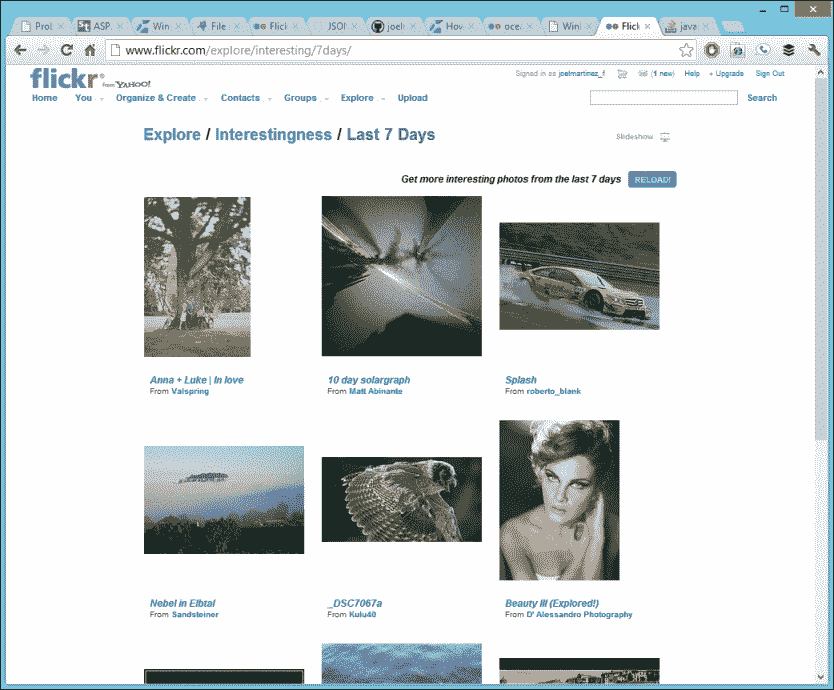
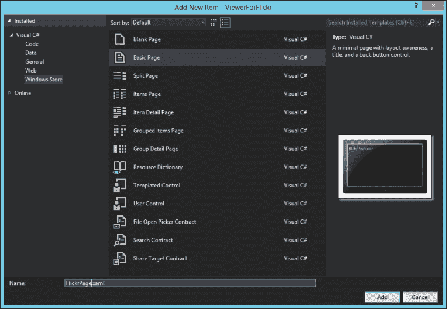

# 第四章：创建 Windows Store 应用程序

在本书的前半部分，我们看了如何设置开发环境以利用 C# 5.0，回顾了 C#的历史和演变，并审查了最新版本中可用的新功能。在本章（以及本书的其余部分），我们将看一些实际应用，您可以在这些功能中使用这些功能。

本章将指导您创建一个 Windows Store 应用程序。该应用程序将在新的 Windows Runtime 环境中运行，可以针对 x86 和 ARM 架构。在本章中，我们将创建一个 Windows Store 应用程序，连接到互联网上的基于 HTTP 的 Web 服务并解析 JSON，并在 XAML 页面中显示结果。

完成本章后，您将拥有一个完全可用的项目，可以将其用作您自己应用程序的基础。然后，您可以将此应用程序上传到 Windows Store，并有可能从销售中赚钱。

# 制作 Flickr 浏览器

我们要创建的项目是一个浏览图像的应用程序。作为来源，我们将使用流行的图片网站[`flickr.com`](http://flickr.com)。



选择这个作为我们项目的几个原因。首先，Flickr 提供了一个广泛的 Web API 来浏览他们网站的各个部分，因此这是一种访问数据存储库的简单方式。其次，很多时候您会发现自己通过互联网访问外部数据，因此这是如何在本机应用程序中处理这种访问的一个很好的例子。最后，图片是很好的视觉享受，因此应用程序最终会成为您可以展示的东西。

## 启动项目

如果您使用的是 Visual Studio Express，您必须使用名为 VS Express for Windows 8 的版本。我们通过在以下截图中显示的**新建项目**对话框中创建一个新的 Windows Store 应用程序来开始这个过程：


选择**空白应用程序（XAML）**项目模板，该模板提供了创建应用程序所需的最低限度。当然，您应该鼓励使用其他模板创建项目，以了解如何创建一些常见的 UI 范例，例如网格应用程序。但是现在，空白应用程序模板保持简单。

## 连接到 Flickr

现在我们有了项目结构，我们可以通过首先连接到 Flickr API 来开始项目。一旦您在 Flickr 上创建了用户帐户，您就可以在[`www.flickr.com/services/api/`](http://www.flickr.com/services/api/)上访问 API 文档。

一定要浏览文档，了解可能的操作。一旦您准备好继续，获得访问其数据的一个关键因素将是提供 API 密钥，申请一个非常容易——只需访问[`www.flickr.com/services/apps/create/apply/`](http://www.flickr.com/services/apps/create/apply/)上的申请表格。

申请非商业密钥，然后提供有关您将要构建的应用程序的信息（名称、描述等）。

完成应用程序后，您将获得两个数据：API 密钥和 API 密钥。.NET Framework 的 Windows RT 版本包含许多差异。对于习惯于使用桌面版本框架的开发人员，其中一个差异是配置系统的缺失。因此，尽管 C#开发人员习惯于将静态配置值（例如 API 密钥）输入到`app.config`文件中，但我们在这里无法这样做，因为这些 API 在 WinRT 应用程序中根本不可用。为了简化配置系统，我们可以创建一个静态类来包含常量并使其易于访问。

我们首先在`DataModel`命名空间中添加一个新类。如果项目中还没有它，只需添加一个名为`DataModel`的文件夹，然后添加一个包含以下内容的新类：

```cs
namespace ViewerForFlickr.DataModel
{
    public static class Constants
    {
        public static readonly string ApiKey = "<The API Key>";
        public static readonly string ApiSecret = "<The API Secret>";
    }
}
```

当然，在其中写`<The API Key>`和`<The API Secret>`的地方，您应该用分配给您自己帐户的密钥和秘密替换它。

接下来，我们需要一种实际访问互联网上的 API 的方法。由于 C# 5.0 中的新的`async`特性，这非常简单。添加另一个名为`WebHelper`的类到`DataModel`文件夹中，如下所示：

```cs
internal static class WebHelper
{
    public static async Task<T> Get<T>(string url)
    {
        HttpClient client = new HttpClient();
        Stream stream = await client.GetStreamAsync(url);

        Var  serializer = new DataContractJsonSerializer(typeof(T));
        return (T)serializer.ReadObject(stream);
    }
}
```

尽管代码行数很少，但实际上这段代码中发生了很多事情。使用`HttpClient`类，只需调用一个方法来异步下载数据。返回的数据将以**JavaScript 对象表示法**（**JSON**）格式返回。然后，我们使用`DataContractJsonSerializer`将结果直接反序列化为我们使用方法的泛型参数定义的强类型类。这就是 C# 5.0 的伟大之处之一；在框架的先前版本中，这个方法有更多的代码行。

有了定义的`WebHelper`类，我们可以开始从远程 API 中收集实际数据。Flickr 提供的一个有趣的 API 端点是有趣列表，它返回最近发布到其服务的照片列表。这很棒，因为您保证始终有一组精彩的图片可供显示。您可以通过阅读[`www.flickr.com/services/api/flickr.interestingness.getList.html`](http://www.flickr.com/services/api/flickr.interestingness.getList.html)上的 API 文档来熟悉该方法。

当配置为使用 JSON 格式时，服务返回的数据如下所示：

```cs
{
    "photos": {
        "page": 1,
        "pages": 5,
        "perpage": 100,
        "total": "500",
        "photo": [
            {
                "id": "7991307958",
                "owner": "8310501@N07",
                "secret": "921afedb45",
                "server": "8295",
                "farm": 9,
                "title": "Spreading one's wings [explored]",
                "ispublic": 1,
                "isfriend": 0,
                "isfamily": 0
            }
        ]
    },
    "stat": "ok"
}
```

作为 JSON 返回的对象包含分页信息，例如当前所在的页面，以及照片信息数组。由于我们将使用内置的`DataContractJsonSerializer`类来解析 JSON 结果，因此需要创建所谓的**数据契约**。这些是与 JSON 字符串表示的对象结构匹配的类；序列化程序将从 JSON 字符串中获取数据并填充数据契约的属性，因此您可以以强类型方式访问它。

### 提示

在 C#中有许多其他解决方案可用于处理 JSON。可以说，其中一个更受欢迎的解决方案是 James Newton-King 的 Json.NET，您可以在[`json.net`](http://json.net)找到。

这是一个非常灵活的库，可以在解析和创建 JSON 字符串时比其他库更快。许多开源项目都依赖于此库。我们之所以不在这里使用它，只是为了简单起见，因为`DataContractJsonSerializer`随框架提供。

我们开始创建数据契约，通过查看 JSON 结构的最深层级，该层级表示有关单个照片的信息。数据契约只是一个类，其中每个字段在 JSON 对象中都有一个属性，并且已经用一些属性进行了装饰。在类定义的顶部，添加`[DataContract]`属性，这只是告诉序列化程序可以使用这个类，然后为每个属性添加一个`[DataMember(Name=`"<field name>"`)]`属性，这有助于序列化程序知道哪些成员映射到哪些 JSON 属性。

将以下示例代码中的类与 JSON 字符串进行比较：

```cs
[DataContract]
public class ApiPhoto
{
    [DataMember(Name="id")]
    public string Id { get; set; }
    [DataMember(Name="owner")]
    public string Owner { get; set; }
    [DataMember(Name="secret")]
    public string Secret { get; set; }
    [DataMember(Name="server")]
    public string Server { get; set; }
    [DataMember(Name="farm")]
    public string Farm { get; set; }
    [DataMember(Name="title")]
    public string Title { get; set; }

    public string CreateUrl()
    {
        string formatString = "http://farm{0}.staticflickr.com/{1}/{2}_{3}_{4}.jpg";

        string size = "m";

        return string.Format(formatString,
            this.Farm,
            this.Server,
            this.Id,
            this.Secret,
            size);
    }
}
```

在这里传递给数据成员属性的`Name`参数是因为属性的大小写与 JSON 对象中返回的不匹配。当然，您也可以将属性命名为与 JSON 对象完全相同，但那样它就不符合常规的.NET 命名约定了。

您应该注意的一件事是，照片对象本身没有指向图像的 URL。Flickr 为您提供了如何构建图像 URL 的指导。在前面的示例中，类中包含的`.CreateUrl`方法将使用类的属性信息构建图像的 URL。您可以在[`www.flickr.com/services/api/misc.urls.html`](http://www.flickr.com/services/api/misc.urls.html)获取有关构建 Flickr URL 的不同选项的更多信息。

接下来是对象链，我们有一个包含一些关于结果的元数据的对象，比如页面、页面数和每页的项目数。您可以使用这些信息允许用户浏览结果。该对象还包含一个`ApiPhoto`对象的数组，如下所示：

```cs
[DataContract]
public class ApiPhotos
{
    [DataMember(Name="page")]
    public int Page { get; set; }
    [DataMember(Name="pages")]
    public int Pages { get; set; }
    [DataMember(Name="perpage")]
    public int PerPage { get; set; }
    [DataMember(Name="total")]
    public int Total { get; set; }
    [DataMember(Name="photo")]
    public ApiPhoto[] Photo { get; set; }
}
```

最后，我们创建一个对象来表示外层对象，它只有一个属性，如下所示：

```cs
[DataContract]
public class ApiResult
{
    [DataMember(Name="photos")]
    public ApiPhotos Photos { get; set; }
}
```

现在我们已经创建了所有的数据契约，我们准备把一切都放在一起。请记住，这段代码将通过互联网获取数据，这使得它成为使用`async`/`await`的绝佳选择。因此，当我们规划界面时，我们希望确保它是可等待的。在`Models`文件夹中创建一个名为`Flickr.cs`的新类。

```cs
public static class Flickr
{
    private static async Task<ApiPhotos> LoadInteresting()
    {
        string url = "http://api.flickr.com/services/rest/?method=flickr.interestingness.getList&api_key={0}&format=json&nojsoncallback=1";
        url = string.Format(url, Constants.ApiKey);

        ApiResult result = await WebHelper.Get<ApiResult>(url);

        return result.Photos;
    }
}
```

在这个课程中，我们创建了一个名为`.LoadInteresting()`的方法，它使用我们在本章前面提供的 API 密钥构建了一个指向有趣的终点的 URL。接下来，它使用`WebHelper`类进行 HTTP 调用，并传入`ApiResult`类，因为它是表示 JSON 结果格式的对象。一旦网络调用返回一个值，它将被反序列化，然后我们返回照片信息。

## 创建 UI

现在我们已经有了一个易于访问的方法来获取数据，并准备开始创建用户界面。当您使用 C#为 Windows Store（以前称为**Metro**）创建应用程序时，您将使用 XAML，您将使用的一个非常常见的模式是**Model-View-ViewModel**（**MVVM**）。这种架构模型类似于**Model-View-Controller**（**MVC**），在这种模式中，两端分别有一个模型和视图，中间有一个组件来“粘合”这些部分。它与 MVC 的不同之处在于，“控制器”的角色由 XAML 提供的绑定系统承担，它负责在数据更改时更新视图。因此，您只需提供一个轻量级的包装器来使 ViewModel 中的某些绑定场景变得更容易，如下图所示：


在这个应用程序中，您的**Model**组件代表了问题域的核心逻辑。`ApiPhotos`和`.LoadInteresting`方法代表了这个相对简单程序中的模型。**View**块由我们将要创建的 XAML 代码表示。因此，我们需要**ViewModel**块来将**Model**块与**View**块连接起来。

在创建项目时，有几段代码是自动包含的。其中一个有用的代码可以在`Common/StandardStyles.xaml`文件中找到。这个文件包含了许多有用的样式和模板，您可以在应用程序中使用。我们将使用其中一个模板来显示我们的图片。名为`Standard250x250ItemTemplate`的模板定义如下：

```cs
<DataTemplate x:Key="Standard250x250ItemTemplate">
    <Grid HorizontalAlignment="Left" Width="250" Height="250">
        <Border Background="{StaticResource ListViewItemPlaceholderBackgroundThemeBrush}">
            <Image Source="{Binding Image}" Stretch="UniformToFill" AutomationProperties.Name="{Binding Title}"/>
        </Border>
        <StackPanel VerticalAlignment="Bottom" Background="{StaticResource ListViewItemOverlayBackgroundThemeBrush}">
            <TextBlock Text="{Binding Title}" Foreground="{StaticResource ListViewItemOverlayForegroundThemeBrush}" Style="{StaticResource TitleTextStyle}" Height="60" Margin="15,0,15,0"/>
            <TextBlock Text="{Binding Subtitle}" Foreground="{StaticResource ListViewItemOverlaySecondaryForegroundThemeBrush}" Style="{StaticResource CaptionTextStyle}" TextWrapping="NoWrap" Margin="15,0,15,10"/>
        </StackPanel>
    </Grid>
</DataTemplate>
```

请注意数据绑定到模板控件的各个属性的方式。这种绑定格式自动完成了通常在 MVC 模式的“控制器”组件中完成的大部分工作。因此，您可能需要更改某些模型中数据的表示方式，以便轻松绑定，这就是我们使用 ViewModel 的原因。

此模板中绑定的属性与`ApiPhoto`类中可用的属性不同。我们将使用 ViewModel 将模型转换为可以轻松绑定的内容。继续创建一个名为`FlickrImage`的新类，其中包含模板期望的属性，如下所示：

```cs
public class FlickrImage
{
    public Uri Image { get; set; }
    public string Title { get; set; }
}
```

向`Flickr`类添加以下字段和方法：

```cs
public static readonly ObservableCollection<FlickrImage> Images = new ObservableCollection<FlickrImage>();

public static async void Load()
{
    var result = await LoadInteresting();

    var images = from photo in result.Photo
                    select new FlickrImage
                    {
                        Image = new Uri(photo.CreateUrl()),
                        Title = photo.Title
                    };

    Images.Clear();
    foreach (var image in images)
    {
        Images.Add(image);
    }
}
```

`Load()`方法首先调用`LoadInteresting()`方法，该方法通过互联网访问 Flickr API 并检索有趣的照片（当然是异步的）。然后使用 LINQ 将结果转换为 ViewModels 的列表，并更新静态的`Images`属性。请注意，它不会重新实例化实际的集合，而是`Images`属性是`ObservableCollection`集合，这是 ViewModel 中首选使用的集合类型。您可以在初始化页面时绑定到 XAML UI，然后随时重新加载数据，集合会负责通知 UI，绑定框架会负责更新屏幕。

定义了 ViewModel 后，我们准备创建实际的用户界面。首先从**Visual C# | Windows Store**菜单中的**添加新项**对话框中添加一个**基本页面**项目。将文件命名为`FlickrPage.xaml`，如下截图所示：



这将创建一个非常基本的页面，其中包含一些简单的东西，如返回按钮。您可以通过打开`App.xaml.cs`文件并将`OnLaunched`方法更改为启动`FlickrPage`而不是默认的`MainPage`来更改应用程序启动时打开的页面。当然，我们可以在此示例中使用`MainPage`，但是您将使用的大多数页面都需要返回按钮，因此您应该熟悉使用**基本页面**模板。

我们的界面将是最小化的，实际上，它只包含一个控件，我们将其放在`FlickrPage.xaml`文件中，放在包含返回按钮的部分下方，如下所示：

```cs
<GridView
    Grid.Row="2"
    ItemsSource="{Binding Images}"
    ItemTemplate="{StaticResource Standard250x250ItemTemplate}"/>
```

`GridView`将负责以网格布局显示我们绑定到它的项目，非常适合显示一堆图片。我们将`ItemsSource`属性绑定到我们的图像，`ItemTemplate`用于格式化每个单独的项目，绑定到标准模板。

现在 XAML 已经设置好，我们所要做的就是实际加载数据并为页面设置`DataContext`！打开名为`FlickrPage.xaml.cs`的文件，并将以下两行代码添加到`LoadState`方法中：

```cs
Flickr.Load();
this.DataContext = new { Images = Flickr.Images };
```

我们首先启动加载过程。请记住，这是一个异步方法，因此它将开始从互联网请求数据的过程。然后，我们设置数据上下文，这是 XAML 绑定用来获取数据的。请参阅以下截图：


# 总结

本章带您了解了构建 Windows Store 应用程序的过程，该应用程序使用第三方 API 访问互联网上的信息。语言的异步编程特性使得实现这些功能非常容易。

以下是一些关于如何进一步完善您在此构建的应用程序的想法：

+   当您点击缩略图时，使应用程序导航到图像的较大版本（**提示**：查看`ApiPhoto`中的`CreateUrl`方法）

+   找出应用程序无法访问互联网时会发生什么（**提示**：查看第三章中的*使用异步方法处理错误*部分，*动态行为*）

+   添加查看不同类型图像的功能（**提示**：尝试使用`Grid App`项目模板，并查看不同的 Flickr API 方法，如`flickr.photos.search`）

+   思考将分页添加到照片列表中（**提示**：查看`ApiPhotos`中的数据和`ISupportIncrementalLoading`接口）

创建在本地计算机上运行的本地应用程序，让您可以针对每个技术周期硬件性能不断提升进行优化。使用 C# 5 中可用的新的异步编程功能，将确保您能充分利用这些硬件。在下一章中，我们将转向云端，并使用 ASP.NET MVC 构建一个 Web 应用程序。
