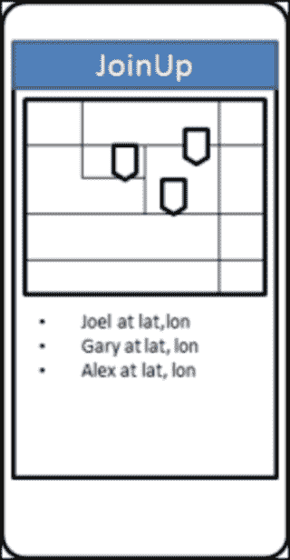
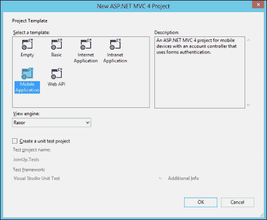
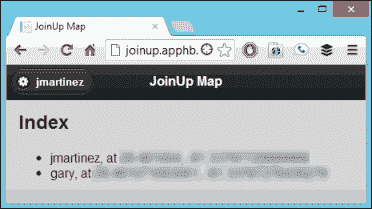
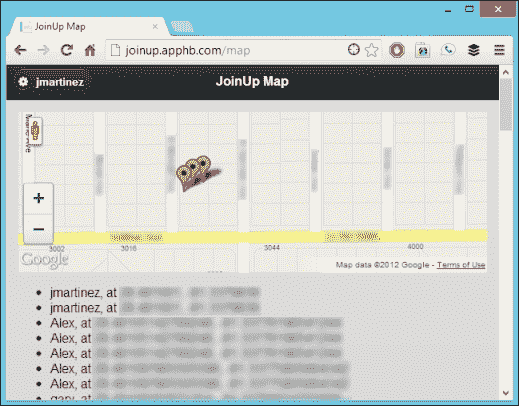

# 第五章。移动 Web 应用

在上一章中，我们看到了一个用于在 Windows 商店分发的本机桌面应用程序的创建。在本章中，我们将创建一个 Web 应用程序，让用户登录，并在地图上看到与自己在同一物理区域的其他用户。我们将使用以下技术：

+   **ASP.NET MVC 4**：这让你可以使用模型-视图-控制器设计模式和异步编程构建 Web 应用程序

+   **SignalR**：这是一个异步的双向通信框架

+   **HTML5 GeoLocation**：为应用程序提供真实世界的位置

+   **使用 Google 进行客户端地图映射**：这是为了可视化地理空间信息

这些技术共同让你创建非常强大的 Web 应用程序，并且借助与 C# 5 一同发布的 ASP.NET MVC 4，现在更容易创建可以轻松访问互联网的移动应用程序。在本章结束时，我们将拥有一个 Web 应用程序，它使用现代浏览器功能，如 WebSockets，让你与其他在你附近的 Web 用户连接。所有这些都使选择 C#技术栈成为创建 Web 应用程序的一个非常引人注目的选择。

# 使用 ASP.NET MVC 的移动 Web

ASP.NET 已经发展成为支持多种不同产品的服务器平台。在 Web 端，我们有 Web Forms 和 MVC。在服务端，我们有 ASMX Web 服务、**Windows 通信框架**（**WCF**）和 Web 服务，甚至一些开源技术，如 ServiceStack 也已经出现。

Web 开发可以被总结为技术的大熔炉。成功的 Web 开发人员应该精通 HTML、CSS、JavaScript 和 HTTP 协议。在这个意义上，Web 开发可以帮助你成为一名多语言程序员，可以在多种编程语言中工作。我们将在这个项目中使用 ASP.NET MVC，因为它在 Web 开发的背景下应用了模型-视图-控制器设计模式，同时允许每个贡献的技术有机会发挥其所长。它在下图中显示：


你的**模型**块将包含所有包含业务逻辑的代码，以及连接到远程服务和数据库的代码。**控制器**块将从**模型**层检索信息，并在用户与**视图**块交互时将信息传递给它。

关于使用 JavaScript 进行客户端开发的有趣观察是，许多应用程序的架构选择与开发任何其他本机应用程序时非常相似。从在内存中维护应用程序状态的方式到访问和缓存远程信息的方式，有许多相似之处。

## 构建一个 MeatSpace 跟踪器

接下来是我们要构建的应用程序！

正如术语**CyberSpace**指的是数字领域一样，术语**MeatSpace**在口语中用来指代在现实世界中发生的事物或互动。我们将在本章中创建的项目是一个移动应用程序，可以帮助你与 Web 应用程序的其他用户在你附近的物理位置进行连接。构建一个在真实世界中知道你位置的移动网站的对比非常吸引人，因为就在短短几年前，这类应用程序在 Web 上是不可能的。



这个应用程序将使用 HTML 5 地理位置 API 来让你在地图上看到应用程序的其他用户。当用户连接时，它将使用 SignalR 与服务器建立持久连接，这是一个由几名微软员工发起的开源项目。

### 迭代零

在我们开始编写代码之前，我们必须启动项目，**迭代零**。我们首先创建一个新的 ASP.NET MVC 4 项目，如下截图所示。在这个例子中，我正在使用 Visual Studio 2012 Express for Web，当然，完整版本的 Visual Studio 2012 也可以使用。



一旦选择了 MVC 4 项目，就会出现一个对话框，其中包含几种不同类型的项目模板。由于我们希望我们的 Web 应用程序可以从手机访问，所以我们选择 Visual Studio 2012 中包含的新项目模板之一，**Mobile Application**。该模板预装了一些有用的 JavaScript 库，列举如下：

+   **jQuery**和**jQuery.UI**：这是一个非常流行的库，用于简化对 HTML DOM 的访问。该库的 UI 部分提供了一个漂亮的小部件工具包，可在各种浏览器上使用，包括日期选择器等控件。

+   **jQuery.Mobile**：这提供了一个框架，用于创建移动友好的 Web 应用程序。

+   **KnockoutJS**：这是一个 JavaScript 绑定框架，可以让您实现 Model-View-ViewModel 模式。

+   **Modernizr**：这允许您进行丰富的功能检测，而不是查看浏览器的用户代理字符串来确定您可以依赖的功能。

我们将不会使用所有这些库，当然，您也可以选择不同的 JavaScript 库。但这些提供了一个方便的起点。您应该花一些时间熟悉项目模板创建的文件。

您应该首先查看主`HomeController`类，因为这是（默认情况下）应用程序的入口点。默认情况下包含一些占位文本；您可以轻松更改此文本以适应您正在构建的应用程序。对于我们的目的，我们只需更改一些文本，以充当简单的信息，并鼓励用户注册。

修改`Views/Home/Index.cshtml`文件如下：

```cs
<h2>@ViewBag.Message</h2>
<p>
    Find like-minded individuals with JoinUp
</p>
```

注意`@ViewBag.Message`标题，您可以按照以下方式更改`HomeController`类的`Index`操作方法中的特定值：

```cs
public ActionResult Index()
{
    ViewBag.Message = "MeetUp. TalkUp. JoinUp";

    return View();
}
```

还有其他视图，您可以更改以添加自己的信息，例如关于和联系页面，但对于这个特定的演示目的来说，它们并不是关键的。

### 进行异步操作

ASP.NET MVC 的最新版本中最强大的新增功能之一是能够使用 C# 5 中的新`async`和`await`关键字编写异步操作方法。要清楚，自 ASP.NET MVC 2 以来，您就已经有了创建异步操作方法的能力，但它们相当笨拙且难以使用。

您必须手动跟踪正在进行的异步操作的数量，然后让异步控制器知道它们何时完成，以便它可以完成响应。在 ASP.NET MVC 4 中，这不再是必要的。

例如，我们可以重写我们在上一节中讨论的`Index`方法，使其成为异步的。假设我们希望在登陆页面的标题中打印的消息来自数据库。因为这可能需要与另一台机器上的数据库服务器通信，所以这是一个完美的异步方法候选者。

首先，创建一个可等待的方法，用作从数据库中检索消息的占位符，如下所示：

```cs
private async Task<string> GetSiteMessage()
{
    await Task.Delay(1);
    return "MeetUp. TalkUp. JoinUp";
}
```

当然，在您的实际代码中，这将连接到数据库，例如，它只是在返回字符串之前引入了一个非常小的延迟。现在，您可以按照以下方式重写`Index`方法：

```cs
public async Task<ActionResult> Index()
{
    ViewBag.Message = await GetSiteMessage();

    return View();
}
```

您可以看到在先前代码中突出显示的方法的更改，您只需向方法添加`async`关键字，将返回值设置为`Task<ActionResult>`类，然后在方法体中使用`await`。就是这样！现在，您的方法将允许 ASP.NET 运行时通过处理其他请求来最大程度地优化其资源，同时等待您的方法完成处理。

## 获取用户位置

一旦我们定义了初始着陆页面，我们就可以开始查看已登录的界面。请记住，我们应用程序的明确目标是帮助您在现实世界中与其他用户建立联系。为此，我们将使用包括移动浏览器在内的许多现代浏览器中包含的一个功能，以检索用户的位置。为了将所有人连接在一起，我们还将使用一个名为**SignalR**的库，它可以让您与用户的浏览器建立双向通信渠道。

该项目的网站简单地描述如下：

> .NET 的异步库，用于帮助构建实时的、多用户交互式的 Web 应用程序。

使用 SignalR，您可以编写一个应用程序，让您可以双向与用户的浏览器进行通信。因此，您不必等待浏览器与服务器发起通信，实际上您可以从服务器调用并向浏览器发送信息。有趣的是，SignalR 是开源的，因此您可以深入了解其实现。但是对于我们的目的，我们将首先向我们的 Web 应用程序添加一个引用。您可以通过 Nuget 轻松实现这一点，只需在包管理控制台中运行以下命令：

```cs
install-package signalr

```

或者，如果您更喜欢使用 GUI 工具，可以右键单击项目的引用节点，然后选择**管理 NuGet 包**。从那里，您可以搜索 SignalR 包并单击**安装**按钮。

安装了该依赖项后，我们可以开始勾画用户在登录时将看到的界面，并为我们提供应用程序的主要功能。我们通过使用`Empty MVC Controller`模板向`Controllers`文件夹添加一个新的控制器来开始添加新屏幕的过程。将类命名为`MapController`，如下所示：

```cs
public class MapController : Controller
{
    public ActionResult Index()
    {
        return View();
    }
}
```

默认情况下，您创建的文件将与先前代码中的文件相似；请注意控制器前缀（`Map`）和操作方法名称（`Index`）。创建控制器后，您可以添加视图，根据约定，使用控制器名称和操作方法名称。

首先，在`Views`文件夹中添加一个名为`Map`的文件夹，所有此控制器的视图都将放在这里。在该文件夹中，添加一个名为`Index.cshtml`的视图。确保选择`Razor`视图引擎，如果尚未选择。生成的 razor 文件非常简单，它只是设置页面的标题（使用 razor 代码块），然后输出一个带有操作名称的标题，如下所示：

```cs
@{
    ViewBag.Title = "JoinUp Map";
}

<h2>Index</h2>
```

现在我们可以开始修改此视图并添加地理位置功能。将以下代码块添加到`Views/map/Index.cshtml`的底部：

```cs
@section scripts {
    @Scripts.Render("~/Scripts/map.js")
}
```

此脚本部分在站点范围模板中定义，并确保以正确的顺序呈现脚本引用，以便所有其他主要依赖项（例如 jQuery）已被引用。

接下来，我们创建了在先前代码中引用的`map.js`文件，其中将保存我们所有的 JavaScript 代码。在我们的应用程序中，首先要做的是让我们的地理位置工作起来。将以下代码添加到`map.js`中，以了解如何获取用户的位置：

```cs
$(function () {
    var geo = navigator.geolocation;

    if (geo) {
        geo.getCurrentPosition(userAccepted, userDenied);
    } else {
        userDenied({message:'not supported'}); 
    }
});
```

这从一个传递给 jQuery 的函数定义开始，当 DOM 加载完成时将执行该函数。在该方法中，我们获取对`navigator.geolocation`属性的引用。如果该对象存在（例如，浏览器实现了地理位置），那么我们调用`.getCurrentPosition`方法并传入两个我们定义的回调函数，如下所示：

```cs
function userAccepted(pos) {
    alert("lat: " +
        pos.coords.latitude +
        ", lon: " +
        pos.coords.longitude);
}

function userDenied(msg) {
    alert(msg.message);
}
```

保存了带有上述代码的`map.js`后，您可以运行 Web 应用程序（*F5*）以查看其行为。如下截图所示，用户将被提示是否要允许 Web 应用程序跟踪他们的位置。如果他们点击**允许**，将执行`userAccepted`方法。如果他们点击**拒绝**，将执行`userDenied`消息。当未提供位置时，您可以使用此方法来相应地调整应用程序。


### 使用 SignalR 进行广播

用户的位置确定后，接下来的过程将涉及使用 SignalR 将每个连接的用户的位置广播给其他每个用户。

我们可以做的第一件事是通过在`Views/Map/Index.cshtml`的脚本引用中添加以下两行来为 SignalR 添加脚本引用：

```cs
<ul id="messages"></ul>

@section scripts {
    @Scripts.Render("~/Scripts/jquery.signalR-0.5.3.min.js")
    @Scripts.Render("~/signalr/hubs")
    @Scripts.Render("~/Scripts/map.js")
}
```

这将初始化 SignalR 基础设施，并允许我们在实现服务器之前构建应用程序的客户端部分。

### 提示

在撰写本文时，`jQuery.signalR`库的版本 0.5.3 是最新版本。根据您阅读本书的时间，这个版本很可能已经改变。只需在通过 Nuget 添加 SignalR 依赖项后查看`Scripts`目录，以查看您应该在此处使用哪个版本。

接下来，删除`map.js`类的所有先前内容。为了保持组织，我们首先声明一个 JavaScript 类，其中包含一些方法，如下所示：

```cs
var app = {
    geoAccepted: function(pos) {
        var coord = JSON.stringify(pos.coords);
        app.server.notifyNewPosition(coord);
    },

    initializeLocation: function() {
        var geo = navigator.geolocation;

        if (geo) {
            geo.getCurrentPosition(this.geoAccepted);
        } else {
            error('not supported');
        }
    },

    onNewPosition: function(name, coord) {
        var pos = JSON.parse(coord);
        $('#messages').append('<li>' + name + ', at '+ pos.latitude +', '+ pos.longitude +'</li>');
    }
};
```

您将认出`initializeLocation`方法，它与我们先前在其中初始化地理位置 API 的代码相同。在此版本中，初始化函数传递了另一个函数`geoAccepted`，作为用户接受位置提示时执行的回调。最终函数`onNewPosition`旨在在有人通知服务器有新位置时执行。SignalR 将广播位置并执行此函数，以让此脚本知道用户的名称和他们的新坐标。

页面加载时，我们希望初始化与 SignalR 的连接，并在此过程中使用我们刚刚在名为`app`的变量中创建的对象，可以按如下方式完成：

```cs
$(function () {
    var server = $.connection.serverHub;

    server.onNewPosition = app.onNewPosition;

    app.server = server;

    $.connection.hub.start()
        .done(function () {
            app.initializeLocation();
        });
});
```

**Hubs**，在 SignalR 中，是一种非常简单的方式，可以轻松地由客户端的 JavaScript 代码调用方法。在`Models`文件夹中添加一个名为`ServerHub`的新类，如下所示：

```cs
public class ServerHub : Hub
{
    public void notifyNewPosition(string coord)
    {
        string name = HttpContext.Current.User.Identity.Name;

        Clients.onNewPosition(name, coord);
    }
}
```

在此 hub 中定义了一个方法`notifyNewPosition`，它接受一个字符串。当我们从用户那里获得坐标时，此方法将将其广播给所有其他连接的用户。为此，代码首先获取用户的名称，然后调用`.onNewPosition`方法将名称和坐标与所有连接的用户一起广播。

有趣的是，`Clients`属性是一个动态类型，因此`onNewPosition`实际上并不存在于该属性的方法中。该方法的名称用于自动生成从 JavaScript 代码调用的客户端方法。

为了确保用户在访问页面时已登录，我们只需在`MapController`类的顶部添加`[Authorize]`属性，如下所示：

```cs
[Authorize]
public class MapController : Controller
```

按下*F5*运行您的应用程序，看看我们的进展如何。如果一切正常，您将看到如下截图所示的屏幕：



当人们加入网站时，他们的位置被获取并推送给其他人。同时，在客户端，当收到新的位置时，我们会添加一个新的列表项元素，详细说明刚刚收到的名称和坐标。

我们正在逐步逐一地构建我们的功能，一旦我们验证了这一点，我们就可以开始完善下一个部分。

### 映射用户

随着位置信息被推送给每个人，我们可以开始在地图上显示他们的位置。对于这个示例，我们将使用 Google Maps，但您也可以轻松地使用 Bing、Nokia 或 OpenStreet 地图。但是，这个想法是为您提供一个空间参考，以查看谁还在查看相同的网页，以及他们相对于您在世界上的位置。

首先，在`Views/Map/Index.cshtml`中添加一个 HTML 元素来保存地图，如下所示：

```cs
<div 
    id="map"
    style="width:100%; height: 200px;">
</div>
```

这个`<div>`将作为实际地图的容器，并将由 Google Maps API 管理。接下来在`map.js`引用上面的脚本部分添加 JavaScript，如下所示：

```cs
@section scripts {
    @Scripts.Render("~/Scripts/jquery.signalR-0.5.3.min.js")
    @Scripts.Render("~/signalr/hubs")
    @Scripts.Render("http://maps.google.com/maps/api/js?sensor=false");
    @Scripts.Render("~/Scripts/map.js")
}
```

与 SignalR 脚本一样，我们只需要确保它在我们自己的脚本(`map.js`)之前被引用，以便在我们的源中可用。接下来，我们添加代码来初始化地图，如下所示：

```cs
function initMap(coord) {
    var googleCoord = new google.maps.LatLng(coord.latitude, coord.longitude);

    if (!app.map) {
        var mapElement = document.getElementById("map");
        var map = new google.maps.Map(mapElement, {
            zoom: 15,
            center: googleCoord,
            mapTypeControl: false,
            navigationControlOptions: { style: google.maps.NavigationControlStyle.SMALL },
            mapTypeId: google.maps.MapTypeId.ROADMAP
        });
        app.map = map;
    }
    else {
        app.map.setCenter(googleCoord);
    }
}
```

当获取位置时，将调用此函数。它通过获取用户最初报告的位置，并将对`map` ID 的`<div>` HTML 元素的引用传递给`google.maps.Map`对象的新实例，将地图的中心设置为用户报告的位置。如果再次调用该函数，它将简单地将地图的中心设置为用户的坐标。

为了显示所有位置，我们将使用 Google Maps 的一个功能来在地图上放置一个标记。将以下函数添加到`map.js`中：

```cs
function addMarker(name, coord) {
    var googleCoord = new google.maps.LatLng(coord.latitude, coord.longitude);

    if (!app.markers) app.markers = {};

    if (!app.markers[name]) {
        var marker = new google.maps.Marker({
            position: googleCoord,
            map: app.map,
            title: name
        });
        app.markers[name] = marker;
    }
    else {
        app.markers[name].setPosition(googleCoord);
    }
}
```

这个方法通过使用一个关联的 JavaScript 数组来跟踪已添加的标记，类似于 C#中的`Dictionary<string, object>`集合。当用户报告新位置时，它将获取现有的标记并将其移动到新位置。这意味着，对于每个登录的唯一用户，地图将显示一个标记，然后每次报告新位置时都会移动它。

最后，我们对应用对象中的现有函数进行了三个小的更改，以便与地图进行交互。首先在`initializeLocation`中，我们从`getCurrentPosition`更改为使用`watchPosition`方法，如下所示：

```cs
initializeLocation: function() {
    var geo = navigator.geolocation;

    if (geo) {
        geo.watchPosition(this.geoAccepted);
    } else {
        error('not supported');
    }
},
```

`watchPosition`方法将在用户位置发生变化时更新用户的位置，这应该导致所有位置的实时视图，因为它们将其报告给服务器。

接下来，我们更新`geoAccepted`方法，该方法在用户获得新坐标时运行。我们可以利用这个事件在通知服务器新位置之前初始化地图，如下所示：

```cs
geoAccepted: function (pos) {
    var coord = JSON.stringify(pos.coords);

    initMap(pos.coords);

    app.server.notifyNewPosition(coord);
},
```

最后，在通知我们的页面每当用户报告新位置时的方法中，我们添加一个调用`addMarker`函数，如下所示：

```cs
onNewPosition: function(name, coord) {
    var pos = JSON.parse(coord);

    addMarker(name, pos);

    $('#messages').append('<li>' + name + ', at '+ pos.latitude +', '+ pos.longitude +'</li>');
}
```

## 测试应用

当测试应用程序时，您可以在自己的计算机上进行一些初步测试。但这意味着您将始终只有一个标记位于地图的中心（即您）。为了进行更深入的测试，您需要将您的 Web 应用程序部署到可以从互联网访问的服务器上。

有许多可用的选项，从免费（用于测试）到需要付费的解决方案。当然，您也可以自己设置一个带有 IIS 的服务器并以这种方式进行管理。在 ASP.NET 网站的 URL [`www.asp.net/hosting`](http://www.asp.net/hosting)上可以找到一个寻找主机的好资源。

一旦应用程序上传到服务器，尝试从不同的设备和不同的地方访问它。接下来的三个屏幕截图证明了应用程序在桌面上的工作：



在 iPad 上，您将看到以下屏幕：


在 iPhone 上，您将看到以下屏幕：


# 总结

就是这样……一个 Web 应用程序，可以根据您的实际位置，实时连接您与该应用程序的其他用户。为此，我们探索了各种技术，任何现代 Web 开发人员，特别是 ASP.NET 开发人员都应该熟悉：ASP.NET MVC，SignalR，HTML5 GeoLocation 以及使用 Google Maps 进行客户端地图绘制。

以下是一些您可以用来扩展此示例的想法：

+   考虑将用户的最后已知位置持久化存储在诸如 SQL Server 或 MongoDB 之类的数据库中

+   考虑如何扩展这种应用程序以支持更多用户（查看`SignalR.Scaleout`库）

+   将通知的用户限制为仅在一定距离内的用户（学习如何使用 haversine 公式计算地球上两点之间的距离）

+   展示用户附近的兴趣点，可以使用 Web 上可用的各种位置数据库，如 FourSquare Venus API 或 FaceBook Places API。
