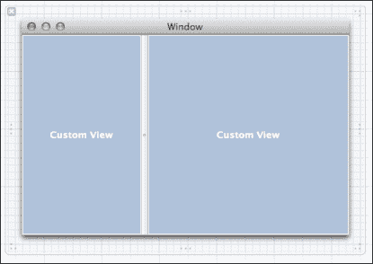
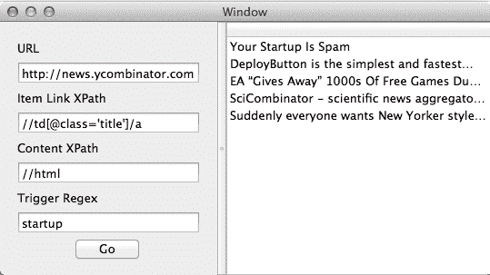

# 第六章。跨平台开发

微软平台并不是唯一可以执行 C#代码的平台。使用 Mono 框架，您可以针对其他平台进行开发，如 Linux、Mac OS、iOS 和 Android。在本章中，我们将探讨构建 Mac 应用程序所需的工具和框架。我们将在这里看到一些工具，例如：

+   **MonoDevelop**：这是一个 C# IDE，可以让您在其他非 Windows 平台上编写 C#

+   **MonoMac**：这提供了对 Mac 库的绑定，因此您可以从 C#使用本机 API

+   **Cocoa**：这是用于创建 Mac 应用程序的框架

我们将在本章中构建的应用程序是一个实用程序，您可以使用它来查找网站上的文本。给定一个 URL，应用程序将查找链接，并跟随它们查找特定的触发文本。我们将使用 Mac OS 的 UI SDK，AppKit 来显示结果。

# 构建网络爬虫

如果您有 C#经验并且需要构建应用程序或实用程序，Mono 可以让您快速创建它，利用现有的技能。假设您需要监视一个网站，以便在包含给定文本的新帖子出现时采取行动。与其整天手动刷新页面，不如构建一个自动化系统来完成这项任务。如果网站没有提供 RSS 订阅或其他 API 来提供程序化访问，您总是可以退而求其次，使用一种可靠的方法来获取远程数据——编写一个 HTTP 爬虫。

这听起来比实际复杂，这个实用程序将允许您输入一个 URL 和一些参数，以便应用程序知道要搜索什么。然后，它将负责访问网站，请求所有相关页面，并搜索您的目标文本。

从创建项目开始。打开 MonoDevelop 并从**文件** | **新建** | **解决方案**菜单项创建一个新项目，这将打开**新解决方案**对话框。在该对话框中，从左侧面板的**C#** | **MonoMac**列表中选择**MonoMac 项目**。创建解决方案时，项目模板将初始化为 Mac 应用程序的基础，如下面的屏幕截图所示：


与我们在上一章中构建的 Web 应用程序一样，Mac 应用程序使用模型-视图-控制器模式来组织自己。项目模板已经创建了控制器（`MainWindowControl`）和视图（`MainWindow.xib`）；创建模型由您来完成。

# 构建模型

使用类似 MonoMac 这样的工具的主要好处之一是能够在不同平台之间共享代码，特别是如果您已经熟悉 C#。因为我们正在编写 C#，所以任何通用逻辑和数据结构都可以在需要为不同平台构建相同应用程序的情况下得到重用。例如，一个名为 iCircuit 的流行应用程序（[`icircuitapp.com`](http://icircuitapp.com)），它是使用 Mono 框架编写的，已经发布了 iOS、Android、Mac 和 Windows Phone 版本。iCircuit 应用程序在某些平台上实现了近 90%的代码重用。

这个数字之所以不是 100%是因为 Mono 框架最近一直专注于使用本机框架和接口构建应用程序的指导原则之一。过去跨平台工具包的主要争议点之一是它们从来没有特别本地化，因为它们被迫妥协以保持兼容性的最低公分母。使用 Mono，您被鼓励通过 C#使用平台的本机 API，以便您可以利用该平台的所有优势。

模型是您可以找到最多重用的地方，只要您尽量将所有特定于平台的依赖项排除在模型之外。为了保持组织，创建一个名为`models`的文件夹，用于存储所有模型类。

## 访问网络

与我们在第四章中构建的 Windows 8 应用程序一样，*创建 Windows Store 应用程序*，我们想要做的第一件事是提供连接到 URL 并从远程服务器下载数据的能力。不过，在这种情况下，我们只想要访问 HTML 文本，以便我们可以解析它并查找各种属性。在`/Models`目录中添加一个名为`WebHelper`的类，如下所示：

```cs
using System;
using System.IO;
using System.Net;
using System.Threading.Tasks;

namespace SiteWatcher
{
  internal static class WebHelper
  {
    public static async Task<string> Get(string url)
    {
      var tcs = new TaskCompletionSource<string>();
      var request = WebRequest.Create(url);

      request.BeginGetResponse(o =>  
      {
        var response = request.EndGetResponse(o);
        using (var reader = new StreamReader(response.GetResponseStream()))
        {
          var result = reader.ReadToEnd();
          tcs.SetResult(result);
        }
      }, null);

      return await tcs.Task;
    }
  }
}
```

这与我们在第四章中构建的`WebRequest`类非常相似，*创建 Windows Store 应用程序*，只是它只返回我们要解析的 HTML 字符串，而不是反序列化 JSON 对象；并且因为`Get`方法将执行远程 I/O，我们使用`async`关键字。作为一个经验法则，任何可能需要超过 50 毫秒才能完成的 I/O 绑定方法都应该是异步的。微软在决定哪些 OS 级 API 将是异步的时，使用了 50 毫秒的阈值。

现在，我们将为用户在用户界面中输入的数据构建后备存储模型。我们希望为用户做的一件事是保存他们的输入，这样他们下次启动应用程序时就不必重新输入。幸运的是，我们可以利用 Mac OS 上的一个内置类和 C# 5 的动态对象特性来轻松实现这一点。

`NSUserDefaults`类是一个简单的键/值存储 API，它会在应用程序会话之间保留您放入其中的设置。但是，尽管针对“属性包”进行编程可以为您提供一个非常灵活的 API，但它可能会很冗长，并且难以一眼理解。为了减轻这一点，我们将在`NSUserDefaults`周围构建一个很好的动态包装器，以便我们的代码至少看起来是强类型的。

首先，确保您的项目引用了`Microsoft.CSharp.dll`程序集；如果没有，请添加。然后，在`Models`文件夹中添加一个名为`UserSettings.cs`的新类文件，并从`DynamicObject`类继承。请注意，此类中使用了`MonoMac.Foundation`命名空间，这是 Mono 绑定到 Mac 的 Core Foundation API 的位置。

```cs
using System;
using System.Dynamic;
using MonoMac.Foundation;

namespace SiteWatcher
{
  public class UserSettings : DynamicObject
  {
    NSUserDefaults defaults = NSUserDefaults.StandardUserDefaults;

    public override bool TryGetMember(GetMemberBinder binder, out object result)
    {
      result = defaults.ValueForKey(new NSString(binder.Name));
      if (result == null) result = string.Empty;
      return result != null;
    }

    public override bool TrySetMember(SetMemberBinder binder, object value)
    {
      defaults.SetValueForKey(NSObject.FromObject(value), new NSString(binder.Name));
      return true;
    }
  }
}
```

我们只需要重写两个方法，`TryGetMember`和`TrySetMember`。在这些方法中，我们将使用`NSUserDefaults`类，这是一个本地的 Mac API，来获取和设置给定的值。这是一个很好的例子，说明了我们如何在运行的本地平台上搭建桥梁，同时仍然具有一个 C#友好的 API 表面来进行编程。

当然，敏锐的读者会记得，在本章的开头，我说我们应该尽可能将特定于平台的代码从模型中分离出来。这通常是一个指导方针。如果我们想要将这个程序移植到另一个平台，我们只需将这个类的内部实现替换为适合该平台的内容，比如在 Android 上使用`SharedSettings`，或者在 Windows RT 上使用`ApplicationDataContainer`。

## 创建一个数据源

接下来，我们将构建一个类，该类将封装大部分我们的主要业务逻辑。当我们谈论跨平台开发时，这将是一个主要的候选代码，可以在所有平台上共享；并且您能够将代码抽象成这样的自包含类，它将更有可能被重复使用。

在`Models`文件夹中创建一个名为`WebDataSource.cs`的新文件。这个类将负责通过网络获取并解析结果。创建完类后，向类中添加以下两个成员：

```cs
private List<string> results = new List<string>();

public IEnumerable<string> Results
{
  get { return this.results; }
}
```

这个字符串列表将在我们在网站源中找到匹配项时驱动用户界面。为了解析 HTML 以获得这些结果，我们可以利用一个名为**HTML Agility Pack**的优秀开源库，您可以在 CodePlex 网站上找到它（[`htmlagilitypack.codeplex.com/`](http://htmlagilitypack.codeplex.com/)）。

当您下载并解压缩包后，请在`Net45`文件夹中查找名为`HtmlAgilityPack.dll`的文件。这个程序集将在所有 CLR 平台上工作，因此您可以将其复制到您的项目中。通过右键单击解决方案资源管理器中的`References`节点，并选择**编辑引用** | **.NET 程序集**，将程序集添加为引用。从.NET 程序集表中浏览到`HtmlAgilityPack.dll`程序集，然后单击**确定**。

现在我们已经添加了这个依赖项，我们可以开始编写应用程序的主要逻辑。记住，我们的目标是创建一个允许我们搜索网站特定文本的界面。将以下方法添加到`WebDataSource`类中：

```cs
public async Task Retrieve()
{      
  dynamic settings = new UserSettings();

  var htmlString = await WebHelper.Get(settings.Url);

  HtmlDocument html = new HtmlDocument();
  html.LoadHtml(htmlString);

  foreach(var link in html.DocumentNode.SelectNodes(settings.LinkXPath))
  {
    string linkUrl = link.Attributes["href"].Value;
    if (!linkUrl.StartsWith("http")) {
      linkUrl = settings.Url + linkUrl;
    }

    // get this URL
    string post = await WebHelper.Get (linkUrl);

    ProcessPost(settings, link, post);
  }
}
```

`Retrieve`方法使用`async`关键字启用您等待异步操作，首先实例化`UserSettings`类作为动态对象，以便我们可以从 UI 中提取值。接下来，我们检索初始 URL 并将结果加载到`HtmlDocument`类中，这样我们就可以解析出我们正在寻找的所有链接。在这里变得有趣，对于每个链接，我们异步检索该 URL 的内容并进行处理。

### 提示

您可能会认为，因为您在循环中等待（使用`await`关键字），循环的每次迭代都会并发执行。但请记住，异步不一定意味着并发。在这种情况下，编译器将重写代码，以便主线程在等待 HTTP 调用完成时不被阻塞，但循环在等待时也不会继续迭代，因此循环的每次迭代将按正确的顺序完成。

最后，我们实现了`ProcessPost`方法，该方法接收单个 URL 的内容，并使用用户提供的正则表达式进行搜索。

```cs
private void ProcessPost(dynamic settings, HtmlNode link, string postHtml)
{        
  // parse the doc to get the content area: settings.ContentXPath
  HtmlDocument postDoc = new HtmlDocument();
  postDoc.LoadHtml(postHtml);
  var contentNode = postDoc.DocumentNode.SelectSingleNode(settings.ContentXPath);
  if (contentNode == null) return;

  // apply settings.TriggerRegex
  string contentText = contentNode.InnerText;
  if (string.IsNullOrWhiteSpace(contentText)) return;

  Regex regex = new Regex(settings.TriggerRegex);
  var match = regex.Match(contentText);

  // if found, add to results
  if (match.Success)
  {
    results.Add(link.InnerText);
  }
}
```

完成`WebDataSource`类后，我们拥有了开始工作于用户界面的一切所需。这表明了一些良好的抽象（`WebHelper`和`UserSettings`）以及`async`和`await`等新功能可以结合起来产生相对复杂的功能，同时保持良好的性能。

# 构建视图

接下来，我们将构建 MVC 三角形的第二和第三条腿，即视图和控制器。从视图开始是下一个逻辑步骤。在开发 Mac 应用程序时，构建 UI 的最简单方法是使用 Xcode 的界面构建器，您可以从 Mac App Store 安装该构建器。Mac 上的 MonoDevelop 专门与 Xcode 进行交互以构建 UI。

首先通过在 MonoDevelop 中双击`MainWindow.xib`来打开它。它将自动在界面构建器编辑器中打开 XCode。表单最初只是一个空白窗口，但我们将开始添加视图。最初，对于任何使用过 Visual Studio 的 WinForms 或 XAML 的 WYSIWYG 编辑器的人来说，体验将非常熟悉，但这些相似之处很快就会分歧。

如果尚未显示，请通过单击屏幕右侧的按钮来显示**实用程序**面板，如下截图所示，您可以在 Xcode 的右上角找到该按钮。


找到对象库并浏览可用的用户界面元素列表。现在，从对象库中查找垂直分割视图，并将其拖到编辑器表面，确保将其拉伸到整个窗口，如下截图所示。



这样我们就可以构建一个简单的用户界面，让用户调整各种元素的大小，以适应他/她的需求。接下来，我们将把用户提供的选项作为文本字段元素添加到左侧面板，并附带标签。

+   **URL**：这是您想要抓取的网站的 URL。

+   **Item Link XPath**：这是在使用 URL 检索的页面上。这个 XPath 查询应该返回您感兴趣的扫描链接的列表。

+   **内容 XPath**：对于每个项目，我们将根据从**Item Link XPath**检索到的 URL 检索 HTML 内容。在新的 HTML 文档中，我们想要选择一个我们将查看的内容元素。

+   **触发正则表达式**：这是我们将用来指示匹配的正则表达式。

我们还希望有一种方法来显示任何匹配的结果。为此，从对象库中添加一个表视图到右侧第二个面板。这个表视图，类似于常规.NET/Windows 世界中的网格控件，将为我们提供一个以列表格式显示结果的地方。还添加一个推按钮，我们将用它来启动我们的网络调用。

完成后，您的界面应该看起来像下面的截图：


界面定义好后，我们开始查看控制器。如果您以前从未使用过 Xcode，将单独的视图元素暴露给控制器是独特的。其他平台的其他工具 tend to automatically generate code references to textboxes and buttons，但在 Xcode 中，您必须手动将它们链接到控制器中的属性。您将会接触到一些 Objective-C 代码，但只是很简短的，除了以下步骤外，您实际上不需要做任何事情。

1.  显示助理编辑器，并确保`MainWindowController.h`显示在编辑器中。这是我们程序中将与视图交互的控制器的头文件。

1.  您必须向控制器添加所谓的**outlets**并将它们与 UI 元素连接起来，这样您就可以从代码中获取对它们的引用。这是通过按住键盘上的*Ctrl*键，然后从控件文本框拖动到头文件中完成的。

在生成代码之前，将显示一个小对话框，如下截图所示，它让您在生成代码之前更改一些选项：


1.  对于所有文本视图都这样做，并为它们赋予适当的名称，如`urlTextView`、`linkXPathTextView`、`contentXPathTextView`、`regexTextView`和`resultsTableView`。

当您添加按钮时，您会注意到您有一个选项可以将连接类型更改为**Action**连接，而不是**Outlet**连接。这是您可以连接按钮的单击事件的方法。完成后，头文件应该定义以下元素：

```cs
@property (assign) IBOutlet NSTextField *urlTextView;
@property (assign) IBOutlet NSTextField *linkXPathTextView;
@property (assign) IBOutlet NSTextField *contentXPathTextView;
@property (assign) IBOutlet NSTextField *regexTextView;
@property (assign) IBOutlet NSTableView *resultsTableView;

- (IBAction)buttonClicked:(NSButton *)sender;
```

1.  关闭 Xcode，返回到 MonoDevelop，并查看`MainWindow.designer.cs`文件。

您会注意到您添加的所有 outlets 和 actions 都将在 C#代码中表示。MonoDevelop 会监视文件系统上的文件，当 Xcode 对其进行更改时，它会相应地重新生成此代码。

请记住，我们希望用户的设置在会话之间保持。因此，当窗口加载时，我们希望用先前输入的任何值初始化文本框。我们将使用我们在本章前面创建的`UserSettings`类来提供这些值。覆盖`WindowDidLoad`方法（如下面的代码所示），该方法在程序首次运行时执行，并将用户设置的值设置为文本视图。

```cs
public override void WindowDidLoad ()
{
  base.WindowDidLoad ();
  dynamic settings = new UserSettings();
  urlTextView.StringValue = settings.Url;
  linkXPathTextView.StringValue = settings.LinkXPath;
  contentXPathTextView.StringValue = settings.ContentXPath;
  regexTextView.StringValue = settings.TriggerRegex;
}
```

1.  现在，我们将注意力转向数据的显示。我们应用程序中的主要输出是`NSTableView`，我们将使用它来显示目标 URL 中的任何匹配链接。为了将数据绑定到表格，我们创建一个从`NSTableViewSource`继承的自定义类。

```cs
private class TableViewSource : NSTableViewSource
{
  private string[] data;

  public TableViewSource(string[] list) 
  { 
    data = list; 
  }

  public override int GetRowCount (NSTableView tableView)
  {
    return data.Length;
  }

  public override NSObject GetObjectValue (NSTableView tableView, NSTableColumn tableColumn, int row)
  {
    return new NSString(data[row]);
  }
}
```

每当表视图需要渲染给定的表格单元时，表视图将在`GetObjectValue`方法中请求行数据。因此，当请求时，它只需获取一个字符串数组，并从数组中返回适当的索引。

1.  现在我们定义了一个方法，它几乎可以将所有东西都整合在一起。

```cs
private async void GetData()
{
  // retrieve data from UI
  dynamic settings = new UserSettings();
  settings.Url = urlTextView.StringValue;
  settings.LinkXPath = linkXPathTextView.StringValue;
  settings.ContentXPath = contentXPathTextView.StringValue;
  settings.TriggerRegex = regexTextView.StringValue;

  // initiate data retrieval
  WebDataSource datasource = new WebDataSource();
  await datasource.Retrieve();

  // display data
  TableViewSource source = new TableViewSource(datasource.Results.ToArray());
  resultsTableView.Source = source;
}
```

在`GetData`方法中，我们首先要做的是从文本框中获取值，并将其存储在`UserSettings`对象中。接下来，我们异步地从`WebDataSource`中检索数据。现在，将结果传递给`TableViewSource`以便显示。

1.  最后，实现在 Xcode 中连接的`buttonClicked`操作。

```cs
partial void buttonClicked (MonoMac.AppKit.NSButton sender)
{
  GetData ();
}
```

现在运行程序，并输入一些要搜索的网页的值。您应该会看到类似于以下截图中显示的结果，您也可以尝试使用相同的值，但请注意，如果 Hacker News 已更新其 HTML 结构，则不起作用。



# 摘要

在本章中，我们使用 MonoMac 和 MonoDevelop 为 Mac OS 创建了一个小型实用程序应用程序。以下是一些可以用来扩展或改进此应用程序的想法：

+   跨应用程序会话保留结果（查看 Core Data）

+   通过在处理过程中向用户提供反馈来改善用户体验（查看`NSProgressIndicator`）

+   通过并行化 URL 请求来提高应用程序的性能（查看`Parallel.ForEach`）

+   尝试将应用程序移植到不同的平台。对于 iOS，查看 MonoTouch（[`ios.xamarin.com`](http://ios.xamarin.com)），对于 Android，查看 Mono for Android（[`android.xamarin.com`](http://android.xamarin.com)）

C#是一种非常表达力和强大的语言。能够针对每个主流计算平台，作为开发人员，您有着令人难以置信的机会，同时可以使用一种一致的编程语言，在不同平台上轻松重用代码。
