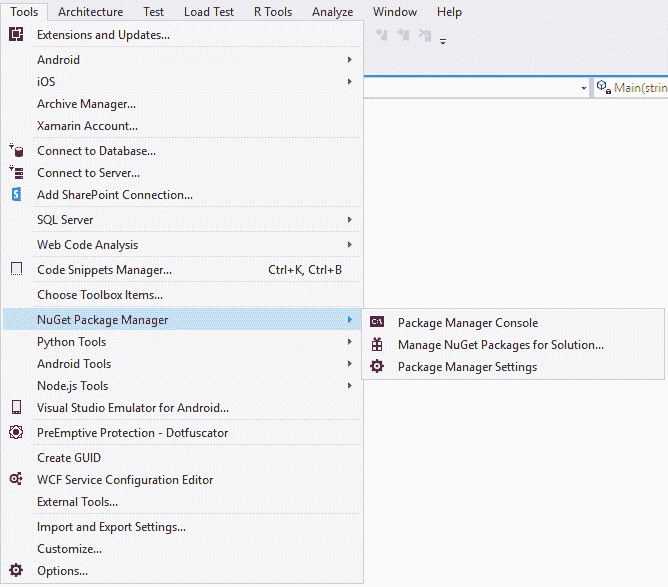
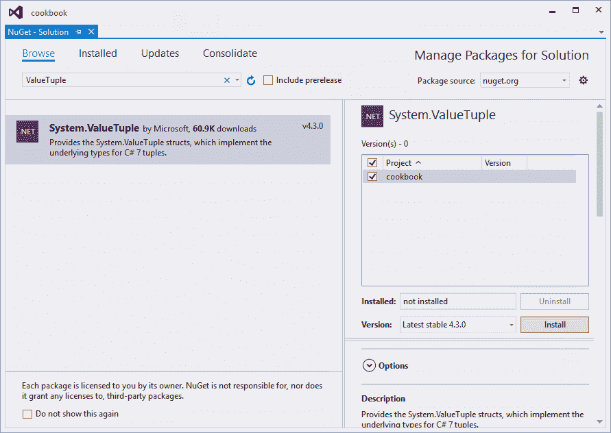
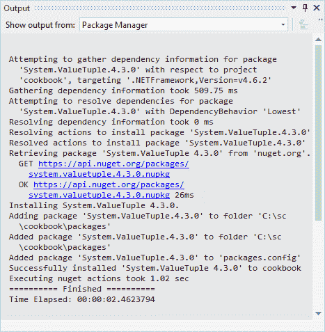
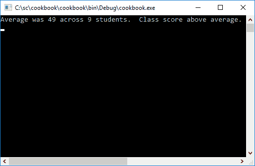
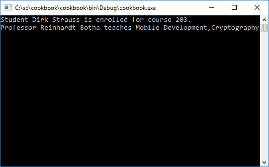
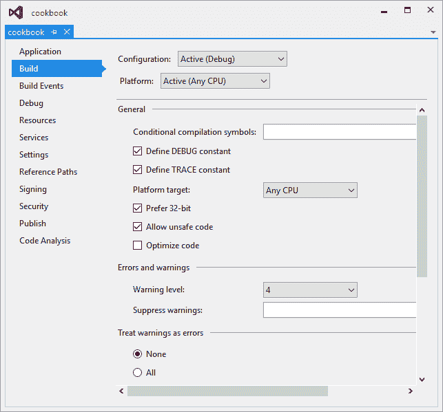

# 第一章：C# 7.0 中的新功能

在本章中，我们将通过以下配方来查看 C# 7.0 的功能：

+   使用元组-入门

+   使用元组-深入了解

+   模式匹配

+   输出变量

+   解构

+   本地函数

+   文字的改进

+   引用返回和本地变量

+   通用异步返回类型

+   访问器、构造函数和终结器的表达式主体

+   抛出表达式

# 介绍

C# 7.0 为 C#语言带来了许多新功能。如果在 C# 6.0 发布后仍感到不满意，那么 C# 7.0 绝对不会让您失望。它专注于消耗数据，简化代码和提高性能。C#程序经理 Mads Torgersen 指出，C# 7.0 最大的功能是**元组**。另一个是**模式匹配**。这两个功能（以及其他功能）受到了全球 C#开发人员的热情欢迎。因此，毫无疑问，开发人员将立即开始实施 C# 7.0 引入的这些新功能。因此，尽快了解 C# 7.0 提供的内容并在开发项目中实施新的语言功能将非常有益。

在本书中，我将使用 Visual Studio 2017 的发行候选版。在撰写和最终发布 Visual Studio 2017 之间，某些功能和方法可能会发生变化。

# 使用元组-入门

我遇到了许多情况，我想从一个方法中返回多个值。正如 Mads Torgersen 指出的，开发人员现有的选项并不理想。因此，C# 7.0 引入了**元组类型**和**元组文字**，以便让开发人员轻松地从方法中返回多个值。开发人员在创建元组时也可以放心。元组是结构体，是值类型。这意味着它们是在本地创建的，并且通过复制内容传递。元组也是可变的，元组元素是公共可变字段。我个人对使用元组感到非常兴奋。让我们在下一个配方中更详细地探讨元组。

# 做好准备

首先，在 Visual Studio 2017 中创建一个常规控制台应用程序。只需将您创建的项目命名为烹饪书。在我开始使用 C# 7.0 中的元组之前，我需要添加一个 NuGet 包。请记住，我正在使用 Visual Studio 的发行候选版。这个过程可能会在产品最终发布之前发生变化。

1.  要做到这一点，请转到工具，NuGet 包管理器，然后单击“解决方案的 NuGet 包管理器...”。



1.  选择浏览选项卡，然后在搜索框中键入 ValueTuple。应显示 Microsoft NuGet 包中的 System.ValueTuple。在“解决方案的管理包”下选择烹饪书项目，然后单击“安装”按钮。

请注意，我在撰写本书的部分内容时使用的是 Visual Studio 2017 RC。在最终版本发布后，您可能不需要从 NuGet 添加`System.ValueTuple`。然而，从 NuGet 添加`System.ValueTuple`可能仍然是一个要求。只有时间会告诉我们。



1.  Visual Studio 现在会显示一个提示，让您审查即将对项目进行的更改。只需单击“确定”按钮。最后，您需要提供 Microsoft 要求的许可协议。只需单击“我接受”按钮。Visual Studio 现在将开始安装 NuGet 包。它将在输出窗口中显示其进度。



完成所有这些后，我的 Visual Studio 解决方案如下：


现在，您将准备好创建与元组一起使用的第一个方法。让我们看看如何做到这一点。

# 如何做...

1.  首先，在 Visual Studio 控制台应用程序的`Program.cs`文件中创建一个新类。你可以随意命名你的类，但出于本书的目的，我将简单地称我的类为`Chapter1`。你的代码现在应该如下所示：

```cs
        namespace cookbook
        {
          class Program
          {
            static void Main(string[] args)
            {

            }
          }

          public class Chapter1
          {

          }
        }

```

1.  这是我们将在本章中使用的格式。假设我们想要编写一个方法，需要计算变量数量的学生的平均分数。每个班级的学生人数都不相同。因此，我们希望我们的方法返回用于计算平均分数的班级学生人数。更改`static void main`方法以包含分数列表。我们还创建了`Chapter1`类的新实例，并调用`GetAverageAndCount()`方法，该方法将用于返回我们需要的两个值。

我将为了说明目的而硬编码这些值；但实际上，这些分数可以是任意数量的学生。确保按照我在代码清单中的方式添加值，因为我将在本教程的最后说明一个问题。

```cs
        static void Main(string[] args)
        {
          int[] scores = { 17, 46, 39, 62, 81, 79, 52, 24 };
          Chapter1 ch1 = new Chapter1();
          var s = ch1.GetAverageAndCount(scores);
        }

```

1.  在这里，我们可以利用元组的强大功能来声明`Chapter1`类中的`GetAverageAndCount()`方法。它接受一个整数分数数组，并如下所示：

```cs
        public (int, int) GetAverageAndCount(int[] scores)
        {

        }

```

1.  注意返回的元组类型`(int, int)`。我们只从`GetAverageAndCount()`方法返回两个值，但实际上，如果需要，可以返回多个值。为了运行代码示例，我们将创建此方法的虚拟实现。只需包含一个返回两个零的元组文字即可。

```cs
        public (int, int) GetAverageAndCount(int[] scores)
        {
          var returnTuple = (0, 0);
          return returnTuple;
        }

```

1.  回到调用元组返回方法的`static void Main`方法，并编写代码来使用返回值。你创建的每个元组都将公开名为`Item1`、`Item2`、`Item3`等的成员。这些用于获取从元组返回方法返回的值。

```cs
        static void Main(string[] args)
        {
          int[] scores = { 17, 46, 39, 62, 81, 79, 52, 24 };
          Chapter1 ch1 = new Chapter1();
          var s = ch1.GetAverageAndCount(scores);
          WriteLine($"Average was {s.Item1} across {s.Item2} students");
          ReadLine();
        }

```

1.  在命名空间之前添加以下`using`指令。

```cs
        using static System.Console;

```

1.  你会注意到我们使用`s.Item1`和`s.Item2`来引用从`GetAverageAndCount()`方法返回的返回值。虽然这是完全合法的，但它并不是很描述性，使得难以推断变量的使用方式。这基本上意味着你必须记住`Item1`是平均值，`Item2`是计数值。也许，情况正好相反？`Item1`是计数，`Item2`是平均值？这实际上取决于你在`GetAverageAndCount()`方法中所做的事情（这可能随时间而改变）。因此，我们的元组返回方法可以进行如下增强：

```cs
        public (int average, int studentCount) 
          GetAverageAndCount(int[] scores)
        {
          var returnTuple = (0, 0);
          return returnTuple;
        }

```

1.  现在，元组返回类型可以为其元素声明变量名。这使得调用`GetAverageAndCount()`方法的调用者可以轻松知道哪个值是哪个。你仍然可以继续使用`s.Item1`和`s.Item2`，但现在更容易相应地更改`static void Main`方法中的调用代码：

```cs
        static void Main(string[] args)
        {
          int[] scores = { 17, 46, 39, 62, 81, 79, 52, 24 };
          Chapter1 ch1 = new Chapter1();
          var s = ch1.GetAverageAndCount(scores);
          WriteLine($"Average was {s.average} across {
            s.studentCount} students");
          ReadLine();
        }

```

1.  更改`WriteLine`中的插值字符串，我们可以看到元组返回的值的使用方式更加清晰。现在你知道第一个值是平均值，第二个值是用于计算平均值的学生数量。然而，元组允许开发人员更灵活地操作。记得`GetAverageAndCount()`方法中的元组文字吗？我们只需在虚拟实现中添加如下内容：

```cs
        var returnTuple = (0, 0);

```

1.  C# 7.0 还允许开发人员向元组文字添加名称。在`GetAverageAndCount()`方法中，将元组文字更改如下：

```cs
        var returnTuple = (ave:0, sCount:0);

```

1.  我刚刚给第一个值命名为`ave`（表示平均值），第二个值命名为`sCount`（表示学生人数）。这真是令人兴奋的事情！在修改了元组文字之后，`GetAverageAndCount()`方法的虚拟实现应如下所示：

```cs
        public (int average, int studentCount) 
          GetAverageAndCount(int[] scores)
        {
          var returnTuple = (ave:0, sCount:0);
          return returnTuple;
        }

```

元组之间的配合非常好。只要元组类型匹配，你就不必担心元组文字中的`ave`和`sCount`名称与返回类型的`average`和`studentCount`名称不匹配。

# 工作原理...

到目前为止，在本示例中，我们已经看到元组在需要从方法返回多个值时为开发人员提供了很大的灵活性。虽然`GetAverageAndCount()`的虚拟实现只是返回了值为零的元组文字，但它让您对元组是如何*连接*有了一些想法。这个示例是下一个示例的基础。我鼓励您彻底阅读这两个示例，以充分理解元组及其用法。

# 使用元组-深入研究

现在我将开始为我们在上一个示例中创建的`GetAverageAndCount()`方法的虚拟实现添加更多内容。如果您对元组不熟悉，并且还没有完成上一个示例，请先完成上一个示例，然后再开始本示例的工作。

# 准备工作

您需要完成上一个示例*使用元组-入门*中的代码步骤，才能继续进行本示例的工作。确保您已添加了上一个示例中指定的所需 NuGet 软件包。

# 如何做...

1.  让我们再次看一下调用代码。通过摆脱`var s`，我们可以进一步简化`static void Main`方法中的代码。当我们调用`GetAverageAndCount()`方法时，我们将元组返回到`var s`中。

```cs
        var s = ch1.GetAverageAndCount(scores);

```

1.  我们不必这样做。C# 7.0 允许我们立即将元组分割为其各自的部分，如下所示：

```cs
        var (average, studentCount) = ch1.GetAverageAndCount(scores);

```

1.  现在我们可以直接使用元组返回的值：

```cs
        WriteLine($"Average was {average} across {studentCount} students");

```

1.  在实现`GetAverageAndCount()`方法之前，请确保您的`static void Main`方法如下所示：

```cs
        static void Main(string[] args)
        {
          int[] scores = { 17, 46, 39, 62, 81, 79, 52, 24 };
          Chapter1 ch1 = new Chapter1();
          var (average, studentCount) = ch1.GetAverageAndCount(scores);
          WriteLine($"Average was {average} across {
            studentCount} students");
          ReadLine();
        }

```

1.  其次，确保`GetAverageAndCount()`方法的虚拟实现如下所示：

```cs
        public (int average, int studentCount) 
          GetAverageAndCount(int[] scores)
        {
          var returnTuple = (ave:0, sCount:0);
          return returnTuple;
        }

```

1.  继续运行控制台应用程序。您将看到`average`和`studentCount`两个值从我们的`GetAverageAndCount()`虚拟实现中返回。


1.  数值显然仍然为零，因为我们还没有在方法内定义任何逻辑。我们接下来会这样做。在编写实现之前，请确保已添加以下`using`语句：

```cs
        using System.Linq;

```

1.  因为我们在变量`scores`上使用了整数数组，所以我们可以轻松地返回所需的结果。通过编写`scores.Sum()`，LINQ 允许我们获得`scores`数组中包含的学生成绩的总和。我们还可以通过编写`scores.Count()`轻松地获得`scores`数组中学生成绩的计数。因此，平均值逻辑上应该是分数之和除以学生成绩的计数`(scores.Sum()/scores.Count())`。然后，我们将值放入我们的`returnTuple`文字中，如下所示：

```cs
        public (int average, int studentCount) 
          GetAverageAndCount(int[] scores)
        {
          var returnTuple = (ave:0, sCount:0);
          returnTuple = (returnTuple.ave = scores.Sum()/scores.Count(),
                         returnTuple.sCount = scores.Count());
          return returnTuple;
        }

```

1.  运行控制台应用程序以查看以下显示的结果：


1.  我们可以看到班级平均分并不太好，但这对我们的代码来说并不重要。另一行代码也不太好的是这一行：

```cs
        returnTuple = (returnTuple.ave = scores.Sum()/scores.Count(), 
                       returnTuple.sCount = scores.Count());

```

1.  这有点笨拙，读起来不太顺畅。让我们简化一下。记住我之前提到过，只要它们的类型匹配，元组就可以很好地配合使用？这意味着我们可以这样做：

```cs
        public (int average, int studentCount)
          GetAverageAndCount(int[] scores)
        {
          var returnTuple = (ave:0, sCount:0);
          returnTuple = (scores.Sum()/scores.Count(), scores.Count());
          return returnTuple;
        }

```

1.  再次运行控制台应用程序，注意结果保持不变：


1.  那么为什么一开始要给元组文字名称呢？好吧，这样可以让您在`GetAverageAndCount()`方法中轻松引用它们。在方法中使用`foreach`循环时，这也非常有用。考虑以下情况。除了返回学生成绩的计数和平均值之外，我们还需要在班级平均分低于某个阈值时返回一个额外的布尔值。在本示例中，我们将使用一个名为`CheckIfBelowAverage()`的扩展方法，并将一个整数参数作为`threshold`值。首先创建一个名为`ExtensionMethods`的新静态类。

```cs
        public static class ExtensionMethods
        {

        }

```

1.  在`static`类中，创建一个名为`CheckIfBelowAverage()`的新方法，并传递一个名为`threshold`的整数值。这个扩展方法的实现非常简单，所以我不会在这里详细介绍。

```cs
        public static bool CheckIfBelowAverage(
          this int classAverage, int threshold)
        {
          if (classAverage < threshold)
          {
            // Notify head of department
            return true;
          }
          else
            return false;
        }

```

1.  在`Chapter1`类中，通过更改其签名并传递需要应用的阈值的值，重载`GetAverageAndCount()`方法。您会记得我提到过元组返回类型的方法可以返回多个值，不仅仅是两个。在这个例子中，我们返回了一个名为`belowAverage`的第三个值，它将指示计算出的班级平均值是否低于我们传递给它的阈值值。

```cs
        public (int average, int studentCount, bool belowAverage) 
          GetAverageAndCount(int[] scores, int threshold)
        {

        }

```

1.  修改元组文字，将其添加到`subAve`，并将其默认为`true`，因为零的班级平均值在逻辑上低于我们传递给它的任何阈值值。

```cs
        var returnTuple = (ave: 0, sCount: 0, subAve: true);

```

1.  现在我们可以在我们的元组文字值上调用扩展方法`CheckIfBelowAverage()`，并通过`threshold`变量传递它。当我们用它来调用扩展方法时，给元组文字起逻辑名称变得非常有用。

```cs
        returnTuple = (scores.Sum() / scores.Count(), scores.Count(), 
                       returnTuple.ave.CheckIfBelowAverage(threshold));

```

1.  您的完成的`GetAverageAndCount()`方法现在应该如下所示：

```cs
        public (int average, int studentCount, bool belowAverage) 
          GetAverageAndCount(int[] scores, int threshold)
        {
          var returnTuple = (ave: 0, sCount: 0, subAve: true);
          returnTuple = (scores.Sum() / scores.Count(), scores.Count(), 
          returnTuple.ave.CheckIfBelowAverage(threshold)); 
          return returnTuple;
        }

```

1.  修改您的调用代码，以使用重载的`GetAverageAndCount()`方法如下所示：

```cs
        int threshold = 51;
        var (average, studentCount, belowAverage) = ch1.GetAverageAndCount(
                                                   scores, threshold);

```

1.  最后，修改插值字符串如下所示：

```cs
        WriteLine($"Average was {average} across {studentCount}
                  students. {(average < threshold ? 
                  " Class score below average." : 
                  " Class score above average.")}");

```

1.  您的`static void Main`方法中的完成代码现在应该如下所示：

```cs
        static void Main(string[] args)
        {
          int[] scores = { 17, 46, 39, 62, 81, 79, 52, 24 };
          Chapter1 ch1 = new Chapter1();
          int threshold = 51;
          var (average, studentCount, belowAverage) = 
               ch1.GetAverageAndCount(scores, threshold);
          WriteLine($"Average was {average} across {studentCount} 
                    students. {(average < threshold ? 
                    " Class score below average." : 
                    " Class score above average.")}");
          ReadLine();
        }

```

1.  运行您的控制台应用程序以查看结果。


1.  测试三元运算符`?`在插值字符串中是否正确工作，将您的阈值值修改为低于返回的平均值。

```cs
        int threshold = 40;

```

1.  再次运行您的控制台应用程序将得到一个通过的平均班级分数。


1.  最后，我需要强调这个食谱中存在一个明显的问题。我相信你已经注意到了。如果没有，不要担心。这有点狡猾。这是我在这个食谱开始时提到的陷阱，我故意想要包括它来说明代码中的错误。我们的学生成绩数组定义如下：

```cs
        int[] scores = { 17, 46, 39, 62, 81, 79, 52, 24 };

```

1.  这些总和等于 400，因为只有 8 个分数，所以值将正确计算，因为它分成一个整数 *(400 / 8 = 50)*。但是如果我们在其中加入另一个学生的分数会发生什么呢？让我们来看看。修改您的分数数组如下：

```cs
        int[] scores = { 17, 46, 39, 62, 81, 79, 52, 24, 49 };

```

1.  再次运行您的控制台应用程序并查看结果。



1.  问题在于平均值是不正确的。它应该是 49.89。我们知道我们想要一个 double（除非您的应用程序意图返回一个整数）。因此，我们需要注意在返回类型和元组文字中正确地转换值。我们还需要在扩展方法`CheckIfBelowAverage()`中处理这个问题。首先，通过以下方式更改扩展方法签名以作用于 double。

```cs
        public static bool CheckIfBelowAverage(
          this double classAverage, int threshold)
        {

        }

```

1.  然后，我们需要将元组方法返回类型中的`average`变量的数据类型更改为如下：

```cs
        public (double average, int studentCount, bool belowAverage) 
               GetAverageAndCount(int[] scores, int threshold)
        {

        }

```

1.  然后，通过使用`ave: 0D`，修改元组文字，使`ave`成为一个 double。

```cs
        var returnTuple = (ave: 0D, sCount: 0, subAve: true);

```

1.  将平均值计算转换为`double`。

```cs
        returnTuple = ((double)scores.Sum() / scores.Count(),
          scores.Count(), 
        returnTuple.ave.CheckIfBelowAverage(threshold));

```

1.  向您的应用程序添加以下`using`语句：

```cs
        using static System.Math;

```

1.  最后，在插值字符串中使用`Round`方法将`average`变量格式化为两位小数。

```cs
        WriteLine($"Average was {Round(average,2)} across {studentCount}
                  students. {(average < threshold ? 
                             " Class score below average." : 
                             " Class score above average.")}");

```

1.  如果一切都做得正确，您的`GetAverageAndCount()`方法应该如下所示：

```cs
        public (double average, int studentCount, bool belowAverage) 
               GetAverageAndCount(int[] scores, int threshold)
        {
          var returnTuple = (ave: 0D, sCount: 0, subAve: true);
          returnTuple = ((double)scores.Sum() / scores.Count(), 
                          scores.Count(),   
                          returnTuple.ave.CheckIfBelowAverage(
                          threshold));
          return returnTuple;
        }

```

1.  您的调用代码也应该如下所示：

```cs
        static void Main(string[] args)
        {
          int[] scores = { 17, 46, 39, 62, 81, 79, 52, 24, 49 }; 
          Chapter1 ch1 = new Chapter1();
          int threshold = 40;
          var (average, studentCount, belowAverage) = 
               ch1.GetAverageAndCount(scores, threshold);
          WriteLine($"Average was {Round(average,2)} across 
                    {studentCount} students. {(average < threshold ? 
                    " Class score below average." : 
                    " Class score above average.")}");
          ReadLine();
        }

```

1.  运行控制台应用程序，以查看学生成绩的正确平均值。


# 它是如何工作的...

元组是结构体，因此是在本地创建的值类型。因此，您不必担心在使用和分配元组时产生大量分配。它们的内容在传递时仅仅是复制。元组是可变的，元素是公开范围的可变字段。使用本配方中的代码示例，因此我可以做以下事情：

```cs
returnTuple = (returnTuple.ave + 15, returnTuple.sCount - 1);

```

C# 7.0 允许我首先更新平均值（将平均值上移），然后递减计数字段。元组是 C# 7.0 的一个非常强大的特性，当正确实现时，对许多开发人员将大有裨益。

# 模式匹配

C# 7.0 引入了一种与函数式编程语言常见的方面相同的模式匹配。这种新类型的结构可以以不同的方式测试值。为了实现这一点，C# 7.0 中的两种语言构造已经得到增强，以利用模式。这些如下：

+   `is`表达式

+   `switch`语句中的`case`子句

关于`is`表达式，开发人员现在可以在右侧使用模式，而不仅仅是类型。在`switch`语句中，`case`子句现在可以匹配模式。`switch`语句不再局限于原始类型，可以在任何东西上进行切换。让我们首先看一下`is`表达式。

# 准备工作

为了说明模式匹配的概念，假设以下情景。我们有两种对象类型，称为`Student`和`Professor`。我们想要最小化代码，所以我们想要创建一个单一的方法来输出传递给它的对象的数据。这个对象可以是`Student`或`Professor`对象。该方法需要弄清楚它正在处理哪个对象，并相应地采取行动。但首先，我们需要在控制台应用程序中做一些事情来设置好一切：

1.  确保已添加以下`using`语句。

```cs
        using System.Collections.Generic;

```

1.  现在，您需要创建两个名为`Student`和`Professor`的新类。`Student`类的代码需要如下所示：

```cs
        public class Student
        {
          public string Name { get; set; }
          public string LastName { get; set; } 
          public List<int> CourseCodes { get; set; }
        }

```

1.  接下来，`Professor`类的代码需要如下所示：

```cs
        public class Professor
        {
          public string Name { get; set; }
          public string LastName { get; set; }
          public List<string> TeachesSubjects { get; set; }
        }

```

要理解我们使用模式匹配的目的，我们首先需要了解我们来自何处。我将在下一节开始时向您展示开发人员在 C# 7.0 之前可能如何编写此代码。

# 如何做...

1.  在`Chapter1`类中，创建一个名为`OutputInformation()`的新方法，该方法以一个人对象作为参数。

```cs
        public void OutputInformation(object person)
        {

        }

```

1.  在这个方法中，我们需要检查传递给它的对象的类型。传统上，我们需要做以下事情：

```cs
        if (person is Student)
        {
          Student student = (Student)person;
          WriteLine($"Student {student.Name} {student.LastName}
                    is enrolled for courses {String.Join<int>(
                    ", ", student.CourseCodes)}");
        }

        if (person is Professor)
        {
          Professor prof = (Professor)person;
          WriteLine($"Professor {prof.Name} {prof.LastName} 
                    teaches {String.Join<string>(",", prof.TeachesSubjects)}");
        }

```

1.  我们有两个`if`语句。我们期望的是`Student`对象或`Professor`对象。完整的`OutputInformation()`方法应如下所示：

```cs
        public void OutputInformation(object person)
        {
          if (person is Student)
          {
            Student student = (Student)person;
            WriteLine($"Student {student.Name} {student.LastName}
                      is enrolled for courses {String.Join<int>
                      (", ", student.CourseCodes)}");
          }
          if (person is Professor)
          {
            Professor prof = (Professor)person;
            WriteLine($"Professor {prof.Name} {prof.LastName}
                      teaches {String.Join<string>
                      (",", prof.TeachesSubjects)}");
            }
          }

```

1.  从`static void Main`中调用这个方法非常容易。这两个对象是相似的，但它们包含的列表不同。`Student`对象公开了一个课程代码列表，而`Professor`公开了一个教给学生的科目列表。

```cs
        static void Main(string[] args)
        {
          Chapter1 ch1 = new Chapter1();

          Student student = new Student();
          student.Name = "Dirk";
          student.LastName = "Strauss";
          student.CourseCodes = new List<int> { 203, 202, 101 };

          ch1.OutputInformation(student);

          Professor prof = new Professor();
          prof.Name = "Reinhardt";
          prof.LastName = "Botha";
          prof.TeachesSubjects = new List<string> {
               "Mobile Development", "Cryptography" };

          ch1.OutputInformation(prof);
        }

```

1.  运行控制台应用程序，看看`OutputInformation()`方法的运行情况。


1.  虽然我们在控制台应用程序中看到的信息是我们所期望的，但我们可以通过模式匹配更简化`OutputInformation()`方法中的代码。为此，请修改代码如下：

```cs
        if (person is Student student)
        {

        }
        if (person is Professor prof)
        {

        }

```

1.  第一个`if`表达式检查对象`person`是否是`Student`类型。如果是，它将该值存储在`student`变量中。对于第二个`if`表达式也是如此。如果为真，则将`person`的值存储在`prof`变量中。为了使代码执行到每个`if`表达式的大括号之间的代码，条件必须评估为真。因此，我们可以省去将`person`对象转换为`Student`或`Professor`类型的转换，直接使用`student`或`prof`变量，如下所示：

```cs
        if (person is Student student)
        {
          WriteLine($"Student {student.Name} {student.LastName}
                    is enrolled for courses {String.Join<int>
                    (", ", student.CourseCodes)}");
        }
        if (person is Professor prof)
        {
          WriteLine($"Professor {prof.Name} {prof.LastName}
                    teaches {String.Join<string>
                    (",", prof.TeachesSubjects)}");
        }

```

1.  再次运行控制台应用程序，您将看到输出与以前完全相同。但是，我们编写了更好的代码，使用类型模式匹配来确定要显示的正确输出。


1.  然而，模式并不止于此。您还可以在常量模式中使用它们，这是最简单的模式类型。让我们看看对常量`null`的检查。通过模式匹配，我们可以改进我们的`OutputInformation()`方法如下：

```cs
        public void OutputInformation(object person)
        {
          if (person is null)
          {
            WriteLine($"Object {nameof(person)} is null");
          }
        }

```

1.  更改调用`OutputInformation()`方法的代码并将其设置为`null`。

```cs
        Student student = null;

```

1.  运行您的控制台应用程序并查看显示的消息。


在这里使用`nameof`关键字是一个好习惯。如果变量名`person`需要更改，相应的输出也将被更改。

1.  最后，C# 7.0 中的`switch`语句已经改进，以利用模式匹配。C# 7.0 允许我们切换到任何内容，而不仅仅是基本类型和字符串。`case`子句现在使用模式，这真的很令人兴奋。让我们看看如何在以下代码示例中实现这一点。我们将继续使用`Student`和`Professor`类型来说明`switch`语句中模式匹配的概念。修改`OutputInformation()`方法并包括如下的样板`switch`语句。`switch`语句仍然具有默认值，但现在可以做更多事情。

```cs
        public void OutputInformation(object person)
        {
          switch (person)
          {
            default:
              WriteLine("Unknown object detected");
            break;
          }
        }

```

1.  我们可以扩展`case`语句以检查`Professor`类型。如果它将对象匹配到`Professor`类型，它可以在`case`语句的主体中对该对象进行操作并将其用作`Professor`类型。这意味着我们可以调用`Professor`特定的`TeachesSubjects`属性。我们可以这样做：

```cs
        switch (person)
        {
          case Professor prof:
            WriteLine($"Professor {prof.Name} {prof.LastName}
                      teaches {String.Join<string>
                      (",", prof.TeachesSubjects)}");
          break;
          default:
            WriteLine("Unknown object detected");
          break;
        }

```

1.  我们也可以对`Student`类型执行相同的操作。更改`switch`的代码如下：

```cs
        switch (person)
        {
          case Student student:
            WriteLine($"Student {student.Name} {student.LastName}
                      is enrolled for courses {String.Join<int>
                      (", ", student.CourseCodes)}");
          break;
          case Professor prof:
            WriteLine($"Professor {prof.Name} {prof.LastName}
                      teaches {String.Join<string>
                      (",", prof.TeachesSubjects)}");
          break;
          default:
            WriteLine("Unknown object detected");
          break;
        }

```

1.  `case`语句的最后一个（也是很棒的）特性尚待说明。我们还可以实现一个`when`条件，类似于我们在 C# 6.0 中看到的异常过滤器。`when`条件只是评估为布尔值，并进一步过滤它触发的输入。要看到这一点的效果，请相应地更改`switch`：

```cs
        switch (person)
        {
          case Student student when (student.CourseCodes.Contains(203)):
          WriteLine($"Student {student.Name} {student.LastName}
                    is enrolled for course 203.");
          break;
          case Student student:
          WriteLine($"Student {student.Name} {student.LastName}
                    is enrolled for courses {String.Join<int>
                    (", ", student.CourseCodes)}");
          break;
          case Professor prof:
          WriteLine($"Professor {prof.Name} {prof.LastName}
                    teaches {String.Join<string>(",",
                    prof.TeachesSubjects)}");
          break;
          default:
            WriteLine("Unknown object detected");
          break;
        }

```

1.  最后，为了全面检查空值，我们可以修改我们的`switch`语句以适应这些情况。因此，完成的`switch`语句如下所示：

```cs
        switch (person)
       {
          case Student student when (student.CourseCodes.Contains(203)):
            WriteLine($"Student {student.Name} {student.LastName} 
                      is enrolled for course 203.");
          break;
          case Student student:
          WriteLine($"Student {student.Name} {student.LastName} 
                    is enrolled for courses {String.Join<int>
                    (", ", student.CourseCodes)}");
          break;
          case Professor prof:
          WriteLine($"Professor {prof.Name} {prof.LastName}
                    teaches {String.Join<string>
                    (",", prof.TeachesSubjects)}");
          break;
          case null:
            WriteLine($"Object {nameof(person)} is null");
          break;
          default:
            WriteLine("Unknown object detected");
          break;
        }

```

1.  再次运行控制台应用程序，您将看到第一个包含`when`条件的`case`语句对`Student`类型触发。



# 它是如何工作的...

通过模式匹配，我们看到模式用于测试值是否属于某种类型。

您还会听到一些开发人员说他们测试值是否具有特定的*形状*。

当我们找到匹配时，我们可以获取特定于该类型（或形状）的信息。我们在访问特定于`Student`类型的`CourseCodes`属性的代码中看到了这一点，以及特定于`Professor`类型的`TeachesSubjects`属性。

最后，您现在需要仔细注意您的`case`语句的顺序，这很重要。使用`when`子句的`case`语句比仅检查`Student`类型的语句更具体。这意味着`when`情况需要在`Student`情况之前发生，因为这两种情况都是`Student`类型。如果`Student`情况发生在`when`子句之前，它将永远不会触发具有课程代码 203 的`Students`的`switch`。

另一个重要的事情要记住的是，`default`子句将始终最后进行评估，无论它出现在`switch`语句的何处。因此，在`switch`语句中将其写为最后一个子句是一个很好的做法。

# 输出变量

C# 7.0 对`out`变量进行了重新审视。这是一个小改变，但确实改善了代码的可读性和流畅性。以前，我们首先必须声明一个变量作为方法中的 out 参数。在 C# 7.0 中，我们不再需要这样做。

# 准备工作

我们将使用一个经常使用的方法来测试值是否为特定类型。是的，你猜对了，我们将使用`TryParse`。我已经能听到一些人抱怨了（还是只有我？）。对我来说，使用`TryParse`是一件苦乐参半的事情。能够尝试解析一些东西以测试其是否有效是很好的，但是`out`变量的使用从来没有像我想象的那样整洁。如果您不熟悉`TryParse`方法，它是一个测试值是否解析为特定类型的方法。如果是，`TryParse`将返回一个布尔值`true`；否则，它将返回`false`。

# 如何做...

1.  以下代码示例将说明我们以前如何使用`TryParse`来检查字符串值是否为有效整数。您会注意到，我们不得不声明整数变量`intVal`，它被用作`out`变量。`intVal`变量通常悬空在那里，通常没有初始化，等待在`TryParse`中使用。

```cs
        string sValue = "500";

        int intVal;
        if (int.TryParse(sValue, out intVal))
        {
          WriteLine($"{intVal} is a valid integer");
          // Do something with intVal
        }

```

1.  在 C# 7.0 中，这已经简化了，如下面的代码示例所示。我们现在可以在将其作为 out 参数传递的地方声明`out`变量，就像这样：

```cs
        if (int.TryParse(sValue, out int intVal))
        {
          WriteLine($"{intVal} is a valid integer");
          // Do something with intVal
        }

```

1.  这是一个小改变，但非常好。运行控制台应用程序并检查显示的输出。


1.  当我们将`out`变量声明为`out`参数的参数时，编译器将能够推断出类型应该是什么。这意味着我们也可以使用`var`关键字，就像这样：

```cs
        if (int.TryParse(sValue, out var intVal))
        {
          WriteLine($"{intVal} is a valid integer");
          // Do something with intVal
        }

```

# 它是如何工作的...

C# 7.0 对`out`变量所做的更改并不重大。然而，对于经常使用它的开发人员来说，这是一个很大的便利。到目前为止，在本章中，我们已经看到了元组的使用，模式匹配和`out`变量。我们可以轻松地将我们学到的一些内容结合起来，创造出一些真正独特的东西。考虑使用扩展方法，元组和`out`变量。我们可以轻松地创建一个名为`ToInt()`的扩展方法，其实现如下：

```cs
public static (string originalValue, int integerValue, bool isInteger) ToInt(this string stringValue)
{
  var t = (original: stringValue, toIntegerValue: 0, isInt: false);
  if (int.TryParse(stringValue, out var iValue)) 
  {
    t.toIntegerValue = iValue; t.isInt = true;
  }
  return t;
}

```

我们创建了一个 Tuple 文字，如果`TryParse`返回 false，它将被返回。如果`TryParse`为`true`，我设置了`t.toIntegerValue`和`t.isInt`值。调用扩展方法的代码如下：

```cs
var (original, intVal, isInteger) = sValue.ToInt();
if (isInteger)
{
  WriteLine($"{original} is a valid integer");
  // Do something with intVal
}

```

当您运行控制台应用程序时，您会发现输出与以前完全相同。这只是说明了 C# 7.0 中新功能与彼此结合的强大力量。再加上一些模式匹配，我们将拥有一个非常有效的扩展方法。我会让你们继续玩耍。有很多东西等待你们去发现。

# 解构

元组可以使用解构声明进行消耗。这只是将元组拆分为其各个部分，并将这些部分分配给新变量。这称为**解构**，不仅适用于元组。

# 准备工作

还记得我们在本章开头使用元组吗？嗯，我们使用类似以下代码来获取元组文字返回的值。

```cs
var (average, studentCount) = ch1.GetAverageAndCount(scores);

```

这是将元组的部分解构为新变量`average`和`studentCount`。然而，我不想再看一下元组。我想做的是展示如何在任何类型上实现解构声明。为此，我们需要确保该类型具有解构方法。我们将修改现有的`Student`类以添加解构方法。

# 如何做...

1.  如果您之前创建了`Student`类，您的代码中应该有类似于以下内容：

```cs
        public class Student
        {
          public string Name { get; set; }
          public string LastName { get; set; }
          public List<int> CourseCodes { get; set; }
        }

```

1.  要创建一个析构函数，需要在`Student`类中添加一个`Deconstruct`方法。您会注意到这是一个`void`方法，它带有两个`out`参数（在这种情况下）。然后我们只需将`Name`和`LastName`的值分配给`out`参数。

如果我们想在`Student`类中解构更多的值，我们将传入更多的`out`参数，每个值都要解构一个参数。

```cs
        public void Deconstruct(out string name, out string lastName)
        {
          name = Name;
          lastName = LastName;
        }

```

1.  您修改后的`Student`类现在应该如下所示：

```cs
        public class Student
        {
          public string Name { get; set; }
          public string LastName { get; set; }
          public List<int> CourseCodes { get; set; }

          public void Deconstruct(out string name, out string lastName)
          {
            name = Name;
            lastName = LastName;
          }
        }

```

1.  现在可以像使用元组一样使用我们的`Student`类了：

```cs
        Student student = new Student();
        student.Name = "Dirk";
        student.LastName = "Strauss";

        var (FirstName, Surname) = student;
        WriteLine($"The student name is {FirstName} {Surname}");

```

1.  运行控制台应用程序将显示从`Student`类返回的解构值。


1.  析构函数同样可以轻松地用于扩展方法中。这是扩展现有类型以包括析构声明的一种不错的方式。要实现这一点，我们需要从`Student`类中删除析构函数。您现在可以将其注释掉，但本质上这就是我们要做的：

```cs
        public class Student
        {
          public string Name { get; set; }
          public string LastName { get; set; }
          public List<int> CourseCodes { get; set; }
        }

```

1.  `Student`类现在不包含析构函数。转到扩展方法类并添加以下扩展方法：

```cs
        public static void Deconstruct(this Student student, 
                 out string firstItem, out string secondItem)
        {
          firstItem = student.Name;
          secondItem = student.LastName;
        }

```

1.  扩展方法仅对`Student`类型起作用。它遵循了先前在`Student`类本身中创建的析构函数的基本实现。再次运行控制台应用程序，您将看到与以前相同的结果。唯一的区别是现在代码使用扩展方法来解构`Student`类中的值。


# 工作原理...

在代码示例中，我们将学生名和姓氏设置为特定值。这只是为了说明解构的使用。更可能的情况是将学生编号传递给`Student`类（可能是在构造函数中），如下所示：

```cs
Student student = new Student(studentNumber);

```

`Student`类中的实现将使用通过构造函数传递的学生编号进行数据库查找。然后将返回学生详细信息。`Student`类的更可能的实现可能如下所示：

```cs
public class Student
{
  public Student(string studentNumber)
  {
    (Name, LastName) = GetStudentDetails(studentNumber);
  }
  public string Name { get; private set; }
  public string LastName { get; private set; }
  public List<int> CourseCodes { get; private set; }

  public void Deconstruct(out string name, out string lastName)
  {
    name = Name;
    lastName = LastName;
  }

  private (string name, string surname) GetStudentDetails(string studentNumber)
  {
    var detail = (n: "Dirk", s: "Strauss");
    // Do something with student number to return the student details
    return detail;
  }
}

```

您会注意到`GetStudentDetails()`方法只是一个虚拟实现。这是数据库查找将开始并且值将从这里返回的地方。现在调用`Student`类的代码更有意义。我们调用`Student`类，传递给它一个学生编号，并对其进行解构以找到学生的名字和姓氏。

```cs
Student student = new Student("S20323742");
var (FirstName, Surname) = student;
WriteLine($"The student name is {FirstName} {Surname}");

```

# 本地函数

一开始使用本地函数可能会有点奇怪。实际上，在大多数函数式语言中经常使用它们。C# 7.0 现在允许我们做同样的事情。那么什么是本地函数呢？嗯，把它想象成一个特定方法的辅助方法。这个辅助方法只有在从特定方法中使用时才真正有意义，并且对于应用程序中的其他方法来说并不有用。因此，在现有方法*内部*使用它是有意义的。有些人可能认为扩展方法可能同样适用，但扩展方法实际上应该用于扩展许多其他方法的功能。本地函数的用处将在以下代码示例中变得明显。

# 准备工作

您不需要特别准备或预先设置任何内容来使用本地函数。为了说明本地函数的使用，我将创建一个方法，该方法在从总楼层面积中减去公共区域空间后计算建筑的楼层面积。

# 如何操作...

1.  创建一个名为`GetShopfloorSpace()`的方法，它接受三个参数：公共区域空间，建筑宽度和建筑长度。

```cs
        public Building GetShopfloorSpace(int floorCommonArea,
                         int buildingWidth, int buildingLength)
        {

        }

```

1.  我们正在返回一个`Building`类型，因此创建一个名为`Building`的类，它有一个名为`TotalShopFloorSpace`的属性。

```cs
        public class Building
        { 
          public int TotalShopFloorSpace { get; set; } 
        }

```

1.  我们的本地函数将简单地获取建筑物的`宽度`和`长度`来计算总楼层面积，然后从中减去`公共`区域，以获得商店可用的楼层空间。本地函数将如下所示：

```cs
        int CalculateShopFloorSpace(int common, int width, int length)
        {
          return (width * length) - common;
        }

```

1.  这就是有趣的地方。在`GetShopfloorSpace()`方法内添加本地函数，并在以下代码示例中添加其余代码：

```cs
        public Building GetShopfloorSpace(int floorCommonArea,
                         int buildingWidth, int buildingLength)
        {
          Building building = new Building();

          building.TotalShopFloorSpace = CalculateShopFloorSpace(
                   floorCommonArea, buildingWidth, buildingLength);

          int CalculateShopFloorSpace(int common, int width, int length)
          {
            return (width * length) - common;
          }

          return building;
        }

```

1.  在调用代码中，在`static void Main`方法内，调用方法如下：

```cs
        Chapter1 ch1 = new Chapter1();
        Building bldng = ch1.GetShopfloorSpace(200, 35, 100);
        WriteLine($"The total space for shops is 
                  {bldng.TotalShopFloorSpace} square meters");

```

1.  运行控制台应用程序并查看输出如下显示： 


# 它是如何工作的...

本地函数的美妙之处在于您可以从方法的任何地方调用它们。为了说明这一点，在`GetShopfloorSpace()`方法的`return`语句之前添加以下代码行。这实质上覆盖了我们最初传递给方法的任何内容。

```cs
building.TotalShopFloorSpace = CalculateShopFloorSpace(10, 9, 17);

```

修改后的方法现在看起来是这样的：

```cs
public Building GetShopfloorSpace(int floorCommonArea, int buildingWidth, int buildingLength)
{
  Building building = new Building();

  building.TotalShopFloorSpace = CalculateShopFloorSpace(
           floorCommonArea, buildingWidth, buildingLength);

  int CalculateShopFloorSpace(int common, int width, int length)
  {
    return (width * length) - common;
  }

  building.TotalShopFloorSpace = CalculateShopFloorSpace(10, 9, 17);

  return building;
}

```

再次运行控制台应用程序。这次您将看到值完全不同。对本地函数的第二次调用覆盖了第一次调用，并说明本地函数可以在包含它的方法中随时调用。


我可以想到一些以前可能可以使用这个的情况。我不认为我会经常使用它。但是这确实是 C#语言的一个非常好的补充，并且对开发人员可用。

# 文字的改进

这是 C#语言的另一个小改进，但我相信开发人员经常会使用它。我年轻时的第一份工作是在一家物流公司工作。这些人过去常常向大众供应零部件，而最关键的零部件是通过空运从德国或其他地方运来的。我永远不会忘记物流人员在随意交谈中提到的 9 位和 12 位的运输编号。我想知道他们是如何在一年中记住成百上千个不同的运输编号的。听了一会儿后，我注意到他们在每三个数字后稍作停顿。即使只是看着 12 位数 395024102833 也是一种视觉负担。想象一天要做这样几次，包括记住下一批货物的快速移动者（我甚至不想谈论印刷的货物清单，那简直是一场噩梦）。因此，更容易将数字视为 395-024-102-833，这样更容易发现模式。这基本上正是 C# 7.0 现在允许开发人员使用文字的方式。

# 准备工作

数字文字有时可能很难阅读。这就是为什么 C# 7.0 引入了下划线（`_`）作为数字文字中的数字分隔符。C# 7.0 还引入了二进制文字，允许您直接指定位模式，而无需知道十六进制。

# 如何做...

1.  将以下代码添加到您的项目中。很明显，`newNum`文字更容易阅读，特别是如果您以三个一组阅读它。

```cs
        var oldNum = 342057239127493;
        var newNum = 342_057_239_127_493;
        WriteLine($"oldNum = {oldNum} and newNum = {newNum}");

```

1.  如果运行控制台应用程序，您将看到两个数字文字的值完全相同：


1.  对于二进制文字也是如此。您现在可以将它们表示如下：

```cs
        var binLit = 0b1010_1100_0011_0010_0001_0000;

```

# 它是如何工作的...

这只是文字的语法糖。我相信背后还有更多的东西，但是在您的代码中实现这一点确实非常简单。

# 引用返回和本地变量

在 C#中通过引用传递对象并不新鲜。这是使用`ref`关键字完成的。然而，在 C# 7.0 中，您现在可以通过引用返回对象，并将这些对象存储在本地变量中。

# 准备工作

重要的是要理解`ref`关键字的概念。当你传递一个`ref`参数时，你是在处理变量本身，而不仅仅是变量的值。这意味着，如果值被改变，原始的内存位置会被更新，而不仅仅是参数的副本。这在下面的例子中变得更清楚。

# 如何做...

1.  在`Chapter1`类中，创建一个名为`GetLargest()`的新方法。该方法并不特别。它只是获取两个值中的最大值并将其返回给调用代码。

```cs
        public int GetLargest(int valueA, int valueB)
        {
          if (valueA > valueB)
            return valueA;
          else
            return valueB;
        }

```

1.  创建一个同名的第二个方法。只是这一次，添加`ref`关键字。

```cs
        public ref int GetLargest(ref int valueA, ref int valueB)
        {
          if (valueA > valueB)
            return ref valueA;
          else
            return ref valueB;
        }

```

1.  在`static void Main`方法中，创建一个`Chapter1`类的实例并调用`GetLargest()`方法。增加变量`val`并将变量值写入控制台窗口。

```cs
        int a = 10;
        int b = 20;
        Chapter1 ch1 = new Chapter1();
        int val = ch1.GetLargest(a, b);
        val += 25;

        WriteLine($"val = {val} a = {a} b = {b} ");

```

1.  然后，在前面的调用代码之后写入以下代码，但调用`ref ch1.GetLargest()`方法。增加`refVal`变量并将变量值写入控制台窗口。

```cs
        ref int refVal = ref ch1.GetLargest(ref a, ref b);
        refVal += 25;

        WriteLine($"refVal = {refVal} a = {a} b = {b} ");

```

1.  运行控制台应用程序并考虑显示的输出。


# 工作原理...

在控制台窗口中，你会看到两个非常不同的结果。简单地说，在第一行中，变量`a`是变量`a`，变量`b`是变量`b`，变量`val`是变量`val`。

在第二行中，变量`a`是变量`a`，变量`b`是变量`b`，变量`refVal`是变量`b`。这就是`ref`关键字的全部关键所在。在第一个`GetLargest()`方法中，我们将最大值返回到变量`val`中。这个值是 20。变量`val`和变量`b`之间没有关系，因为它们在内存中分配了不同的空间。

在第二个`GetLargest()`方法中，我们将最大的变量本身（即`b`）返回到变量`refVal`中。因此，变量`refVal`成为变量`b`的别名，因为它们都指向内存中分配的相同空间。为了更清楚地说明这一点，让我们看一下变量的内存地址。

从项目菜单中，转到当前项目的属性。在生成选项卡中，选中允许不安全代码的选项并保存属性。



将以下代码添加到你的控制台应用程序中：

```cs
unsafe
{
  IntPtr a_var_memoryAddress = (IntPtr)(&a);
  IntPtr b_var_memoryAddress = (IntPtr)(&b);
  IntPtr val_var_memoryAddress = (IntPtr)(&val);

  fixed (int* refVal_var = &refVal)
  {
    IntPtr refVal_var_memoryAddress = (IntPtr)(refVal_var);
    WriteLine($"The memory address of a is {a_var_memoryAddress}");
    WriteLine($"The memory address of b is {b_var_memoryAddress}");
    WriteLine($"The memory address of val is {val_var_memoryAddress}");
    WriteLine($"The memory address of refVal is
              {refVal_var_memoryAddress}");
  }
}

```

这段代码与`ref`返回和本地变量的配方没有真正关系，所以我甚至不会详细介绍它。如果你想了解更多关于 C#中指针的知识，请从 MSDN 上的*指针类型（C#编程指南）*文章开始：[`msdn.microsoft.com/en-us/library/y31yhkeb.aspx`](https://msdn.microsoft.com/en-us/library/y31yhkeb.aspx)。

运行控制台应用程序并查看列出的内存地址：


你会立刻注意到变量`b`和变量`refVal`具有相同的内存地址`11531252`，而变量`b`和变量`val`具有不同的内存地址。

那么现在是百万美元的问题：C# 7.0 中的这个特性有什么用？简单地说，它可以提高性能。许多开发人员提到，对于游戏程序员来说，这将非常有用，他们现在可以传递这些别名来引用大型数据结构。这意味着他们不必复制大型数组（例如）以便处理它。使用`ref`，他们可以创建一个指向数组原始内存位置的别名，并直接读取或修改它。以这种方式思考，突然之间这个 C# 7.0 特性的用处就显而易见了。

我会经常使用它吗？我真的不知道。也许不经常，但是，就像本地函数一样，C# 7.0 的这个特性确实是开发人员工具包的一个很好的补充。当你想要摆脱在代码中传递大型结构时，它解决了一些非常棘手的问题。

# 广义异步返回类型

如果您使用 async/await（如果没有，请查看一下），那么 C# 7.0 的以下特性将非常方便。以前唯一支持的返回类型是`Task<T>`、`Task`和`void`。即使是`void`也只用于事件处理程序，比如按钮点击。然而，挑战在于，在等待时分配了`Task<T>`，而`async`操作的结果在等待时是可用的。但是，这到底意味着什么呢？考虑一个返回`Task<T>`的`async`方法：该值的生存时间为*n*秒。如果在生存时间内调用`async`方法，为什么要费力分配另一个`Task<T>`对象呢？这就是`ValueTask<T>`发挥作用的地方；它将允许定义其他类型，以便您可以从`async`方法中返回它们。因此，这减少了`Task<T>`的分配，从而带来了性能上的提升。

# 准备就绪

首先创建一个新的 WinForms 应用程序，并执行以下步骤：

1.  在 Windows 表单中添加一个按钮、标签、定时器和文本框。


1.  我们需要从 NuGet 添加`System.Threading.Tasks.Extensions`包以实现`ValueTask<T>`结构。如果您完成了元组的使用，这个过程对您来说应该很熟悉。选择 winform 项目，然后点击安装按钮。

请注意，我在撰写本书时使用的是 Visual Studio 2017 RC。在最终版本中，您可能不需要从 NuGet 添加`System.Threading.Tasks.Extensions`。


1.  将显示确认屏幕以允许您审查即将进行的更改。只需点击确定。接受许可协议。还要确保已将此`using`语句添加到您的项目中。

```cs
        using System.Threading.Tasks;

```

现在我们准备好编写我们的代码了。Windows 应用程序将在生存时间到期后调用一个`async` `Task<T>`方法。一旦这样做，该方法将读取一个值并将其缓存。这个缓存值将在 10 秒内有效（即生存时间）。如果在生存时间内运行该方法，则将使用并返回缓存值到表单。如果生存时间已过，则重复该过程并调用`Task<T>`方法。当您审查以下代码示例时，实现将变得更加清晰。

# 如何做...

1.  首先在您的表单中添加以下变量。

```cs
        double timerTtl = 10.0D;
        private DateTime timeToLive;
        private int cacheValue;

```

1.  在窗体加载事件中，使用计时器文本设置标签。

严格来说，这只是一些花里胡哨的东西。当涉及到说明一般化的异步返回类型时，这并不是真正必要的，但它有助于我们理解和理解这个概念。

```cs
        private void Form1_Load(object sender, EventArgs e)
        {
          lblTimer.Text = $"Timer TTL {timerTtl} sec (Stopped)"; 
        }

```

1.  在设计器上将定时器间隔设置为 1000 毫秒，并将以下代码添加到`timer1_Tick`事件中。

```cs
        private void timer1_Tick(object sender, EventArgs e)
        {
          if (timerTtl == 0)
          {
            timerTtl = 5;
          }
          else
          {
            timerTtl -= 1; 
          }
          lblTimer.Text = $"Timer TTL {timerTtl} sec (Running)";
        }

```

1.  现在创建一个模拟某种较长运行任务的方法。延迟一秒钟。使用`Random`关键字生成一个随机数，并将其赋值给`cacheValue`变量。设置生存时间，启动定时器，并将缓存值返回给调用代码。

```cs
        public async Task<int> GetValue()
        {
          await Task.Delay(1000);

          Random r = new Random();
          cacheValue = r.Next();
          timeToLive = DateTime.Now.AddSeconds(timerTtl);
          timer1.Start();
          return cacheValue;
        }

```

1.  在调用代码中，检查当前缓存值的生存时间是否仍然有效。如果生存时间已过期，则运行分配并返回`Task<T>`以获取和设置缓存值的代码。如果生存时间仍然有效，则只返回缓存的整数值。

您会注意到我传递了一个布尔`out`变量，以指示已读取或设置了缓存值。

```cs
        public ValueTask<int> LoadReadCache(out bool blnCached)
        {
          if (timeToLive < DateTime.Now)
          {
            blnCached = false;
            return new ValueTask<int>(GetValue());
          }
          else
          {
            blnCached = true;
            return new ValueTask<int>(cacheValue);
          } 
        }

```

1.  按钮点击的代码使用`out`变量`isCachedValue`，并相应地设置文本框中的文本。

```cs
        private async void btnTestAsync_Click(object sender, EventArgs e)
        {
          int iVal = await LoadReadCache(out bool isCachedValue);
          if (isCachedValue)
            txtOutput.Text = $"Cached value {iVal} read";
          else
            txtOutput.Text = $"New value {iVal} read";
        }

```

1.  当您完成添加所有代码后，运行您的应用程序并点击测试异步按钮。这将从`GetValue()`方法中读取一个新值，将其缓存，并开始生存时间倒计时。


1.  如果在生存时间到期之前再次点击按钮，则返回缓存值。


1.  当生存时间到期时，单击“测试异步”按钮将再次调用`GetValue()`方法，进程重复。


# 它是如何工作的...

`ValueTask<T>`是 C# 7.0 的一个非常好的补充。然而，微软建议在对方法进行额外优化时对`Task<T>`与`ValueTask<T>`的性能进行基准测试。然而，一个简单的优化就是简单地用`ValueTask<T>`替换`Task<T>`的实例。

# 访问器、构造函数和终结器的表达式主体

表达式主体成员在 C#开发者社区中非常受欢迎，以至于微软已经扩展了可以实现为表达式的允许成员。您现在可以在以下情况下使用此功能：

+   构造函数

+   终结器（在需要释放非托管代码时使用）

+   属性和索引器上的`get`和`set`访问器

# 准备工作

使用这个配方不需要特别准备什么。以下代码将使用旧与新的方法来演示每个方法的差异和实现。

# 如何做...

1.  考虑类`SomeClass`。它包含一个构造函数，终结器和一个属性。

```cs
        public class SomeClass
        {
          private int _initialValue;

          // Property
          public int InitialValue
          {
            get
            {
              return _initialValue;
            }

            set
            {
              _initialValue = value;
            }
          }

          // Constructor
          public SomeClass(int initialValue)
          {
            InitialValue = initialValue;
          }

          // Finalizer
          ~SomeClass()
          {
            WriteLine("Release unmanaged code");
          }
        }

```

1.  使用表达式主体成员，类`SomeClass`可以简化，并且代码行数减少。

```cs
        public class SomeClass
        {
          private int _initialValue;

          public int InitialValue
          {
            get => _initialValue;
            set => _initialValue = value;
          }

          public SomeClass(int initialValue) => 
                 InitialValue = initialValue;

          ~SomeClass() => WriteLine("Release unmanaged code");
        }

```

# 它是如何工作的...

如果您之前在 C# 6.0 中使用过表达式主体成员，您肯定会很高兴使用扩展功能。就我个人而言，我真的很高兴构造函数现在可以实现为一个表达式。

# 抛出异常

传统上，`throw`在 C#中一直是一个语句。正如我们所知，因为它是一个语句而不是一个表达式，我们不能在某些地方使用它。由于表达式主体成员，C# 7.0 引入了`throw`表达式。抛出异常的方式没有任何区别，只是可以从哪里抛出它们。

# 准备工作

抛出异常并不是什么新鲜事。自从写代码以来，您一直在这样做。我承认`throw`表达式是 C#中一个非常受欢迎的补充，这都归功于表达式主体成员。

# 如何做...

1.  为了说明`throw`表达式的使用，创建一个名为`GetNameLength()`的方法在`Chapter1`类中。它只是检查名称的长度是否不为零。如果是，那么该方法将在表达式中立即抛出异常。

```cs
        public int GetNameLength(string firstName, string lastName)
        {
          return (firstName.Length + lastName.Length) > 0 ? 
            firstName.Length + lastName.Length : throw new 
            Exception("First name and last name is empty");
        }

```

1.  要看到`throw`表达式的实际效果，请创建`Chapter1`类的实例并调用`GetNameLength()`方法。将两个空字符串作为参数传递。

```cs
        try
        {
          Chapter1 ch1 = new Chapter1();
          int nameLength = ch1.GetNameLength("", "");
        }
        catch (Exception ex)
        {
          WriteLine(ex.Message);
        }

```

1.  运行控制台应用程序将返回异常消息作为输出。


# 它是如何工作的...

能够使用`throw`表达式使您的代码更容易编写和阅读。C# 7.0 中的新功能建立在 C# 6.0 奠定的出色基础之上。
