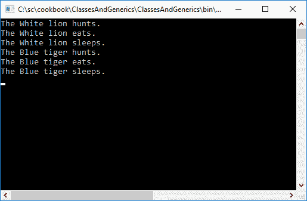
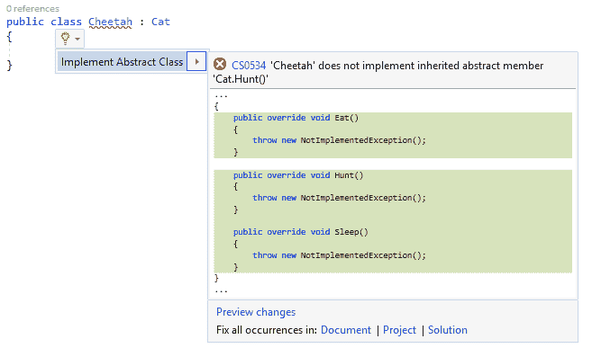
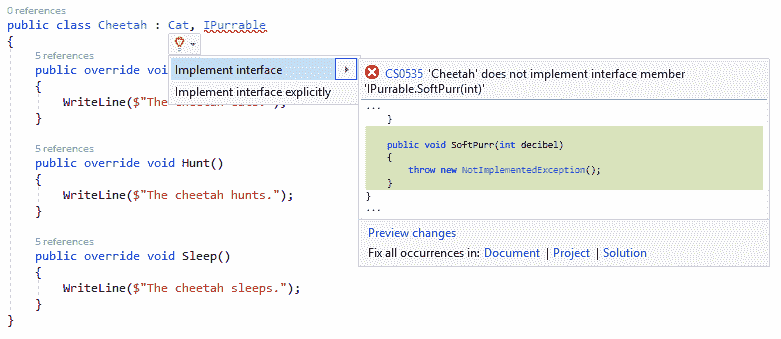
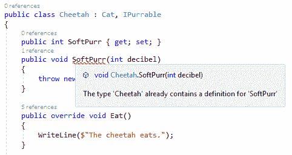
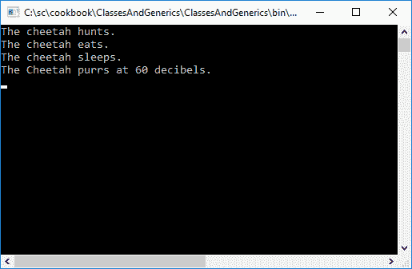
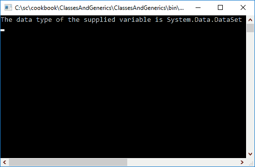
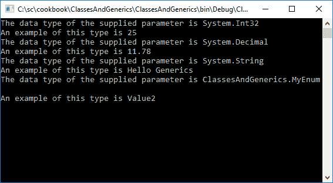
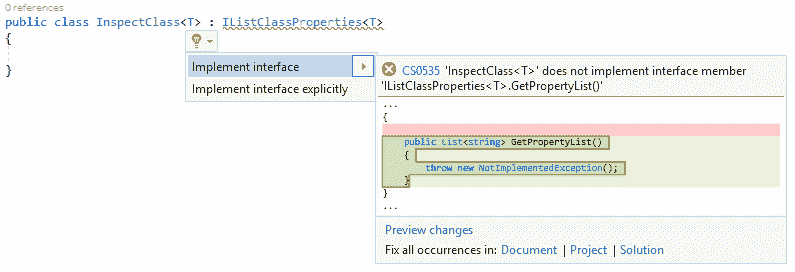

# 第二章：类和泛型

类是软件开发的构建模块，对于构建良好的代码至关重要。在本章中，我们将看看类和泛型，以及为什么我们需要使用它们。我们将涵盖的内容如下：

+   创建和实现抽象类

+   创建和实现接口

+   创建和使用泛型类或方法

+   创建和使用泛型接口

# 介绍

如你所知，类只是相关方法和属性的容器，用于描述软件中的对象。对象是特定类的实例，并且有时模拟现实世界的事物。当想到汽车时，你可能会创建一个包含所有车辆共有属性（属性）的车辆类，比如自动或手动变速器，轮子数量（并非所有车辆都只有四个轮子），或燃料类型。

当我们创建一个车辆类的实例时，我们可以创建一个汽车对象、一个 SUV 对象等等。这就是类的力量所在，它可以描述我们周围的世界，并将其转化为编译器可以理解的编程语言。

# 创建和实现抽象类

许多开发人员听说过抽象类，但它们的实现是一个谜。作为开发人员，你如何识别抽象类并决定何时使用它？实际上，定义是非常简单的。一旦你理解了抽象类的基本定义，何时以及为什么使用它就变得显而易见。

想象一下，你正在开发一个管理猫收容所动物的应用程序。猫收容所康复狮子、老虎、美洲豹、豹子、猎豹、美洲狮，甚至家猫。描述所有这些动物的共同名词是“猫”。因此，你可以安全地假设所有这些动物的抽象是一只猫，因此，这个词标识了我们的抽象类。然后你会创建一个名为`Cat`的抽象类。

然而，你需要记住，你永远不会创建抽象类`Cat`的实例。所有继承自抽象类的类也共享一些功能。这意味着你将创建一个继承自抽象类`Cat`的`Lion`类和`Tiger`类。换句话说，继承的类是一种猫。这两个类共享`Sleep()`、`Eat()`、`Hunt()`和其他各种方法的功能。通过这种方式，我们可以确保继承的类都包含这些共同的功能。

# 准备工作

让我们继续创建我们的猫的抽象类。然后我们将使用它来继承并创建其他对象来定义不同类型的猫。

# 操作步骤

1.  在 Visual Studio 中创建一个新的控制台应用程序，并将其命名为`ClassesAndGenerics`。

1.  添加一个名为`Cat`的抽象类。为此，在类中添加`abstract`关键字。我们现在准备描述`Cat`抽象类：

```cs
        public abstract class Cat
        {

        }

```

`abstract`关键字告诉我们，它所应用的对象没有实现。当用于类声明时，它基本上告诉编译器该类将被用作基类。这意味着不能创建该类的实例。抽象类的实现方式是由继承自基类的派生类实现的。

1.  你的控制台应用程序代码现在应该如下所示：

```cs
        class Program
        {
          static void Main(string[] args)
          {
          }
        }

        public abstract class Cat
        {

        }

```

1.  在抽象类中添加三个方法，分别为`Eat()`、`Hunt()`和`Sleep()`。您会注意到这些方法没有包含具体的实现（花括号）。这是因为它们被定义为抽象方法。与抽象类一样，抽象类中包含的抽象方法没有具体的实现。这三个方法基本上描述了所有猫共有的功能。所有的猫都必须吃饭、狩猎和睡觉。因此，为了确保所有继承自`Cat`抽象类的类都包含这些功能，它被添加到了抽象类中。这些方法然后在派生类中实现，我们将在接下来的步骤中看到：

```cs
        public abstract class Cat 
        { 
          public abstract void Eat(); 
          public abstract void Hunt(); 
          public abstract void Sleep(); 
        }

```

1.  我们想要定义两种类型的猫。我们想要定义的第一种猫是狮子。为此，我们创建一个`Lion`类：

```cs
        public class Lion 
        { 

        }

```

1.  此时，`Lion`类只是一个普通类，不包含在`Cat`抽象类中定义的任何共有功能。要继承自`Cat`抽象类，我们需要在`Lion`类名后面添加`: Cat`。冒号表示`Lion`类继承自`Cat`抽象类。因此，`Lion`类是`Cat`抽象类的派生类：

```cs
        public class Lion : Cat 
        { 

        }

```

一旦指定`Lion`类继承自`Cat`类，Visual Studio 将显示错误。这是预期的，因为我们已经告诉编译器，`Lion`类需要继承`Cat`抽象类的所有特性，但我们实际上并没有将这些特性添加到`Lion`类中。派生类被认为是重写了抽象类中的方法，并且需要使用`override`关键字来明确地编写。

1.  如果您将鼠标悬停在`Lion`类下面的红色波浪线上，Visual Studio 将通过灯泡功能提供错误的解释。正如您所看到的，Visual Studio 告诉您，虽然您已经定义了该类继承自抽象类，但您并没有实现`Cat`类的任何抽象成员：


因此，您可以看到使用抽象类是在系统中强制执行特定功能的一种绝妙方式。如果您在抽象类中定义了抽象成员，那么继承自该抽象类的派生类必须实现这些成员；否则，您的代码将无法编译。这可以用来强制执行公司采用的标准和实践，或者简单地允许其他开发人员在使用您的基类为其派生类实现某些最佳实践。随着 Visual Studio 2015 中代码分析器的出现，强制执行某些最佳代码实践的做法变得更加容易。

1.  1.  要实现 Visual Studio 警告我们的这些成员，将鼠标光标放在`Lion`类名上，然后按下*Ctrl* + *.*（句号）。您也可以点击灯泡弹出窗口中的显示潜在修复链接。Visual Studio 会给出一个小提示，显示它将对您的代码进行的更改。您可以通过点击预览更改链接来预览这些更改，也可以通过点击文档、项目或解决方案中的适当链接来修复所有出现的情况：

在 Visual Studio 添加了建议窗口中显示的更改之后，您的`Lion`类将是正确的，并且看起来像以下步骤中的代码清单。

1.  您会注意到 Visual Studio 自动在每个重写的方法中添加了`NotImplementedException`异常的代码行 `throw new NotImplementedException();`：

```cs
        public class Lion : Cat 
        { 
          public override void Eat() 
          { 
            throw new NotImplementedException(); 
          } 

          public override void Hunt() 
          { 
            throw new NotImplementedException(); 
          } 

          public override void Sleep() 
          { 
            throw new NotImplementedException(); 
          } 
        }

```

这是在覆盖基类中的方法时 Visual Studio 的默认行为。基本上，如果您必须在覆盖的方法中实例化`Lion`类而不写任何实现，将生成运行时异常。从我们的抽象类继承的想法是扩展它并实现共同功能。这就是我们需要实现该功能的地方，也是抽象类中没有实现的原因。抽象类只告诉我们需要实现以下方法。派生类执行实际的实现。

1.  继续为`Lion`类的覆盖方法添加一些实现。首先，在您的类文件顶部添加`using static`语句以使用`Console.WriteLine`方法：

```cs
        using static System.Console;

```

1.  然后，按照以下方式添加方法的实现：

```cs
        public override void Eat() 
        { 
          WriteLine($"The {LionColor} lion eats."); 
        } 

        public override void Hunt() 
        { 
          WriteLine($"The {LionColor} lion hunts."); 
        } 

        public override void Sleep() 
        { 
          WriteLine($"The {LionColor} lion sleeps."); 
        }

```

1.  接下来，我们将创建另一个名为`Tiger`的类，它也派生自抽象类`Cat`。按照步骤 7 到步骤 10 创建`Tiger`类并继承`Cat`抽象类：

```cs
        public class Tiger : Cat 
        { 
          public override void Eat() 
          { 
            throw new NotImplementedException(); 
          } 

          public override void Hunt() 
          { 
            throw new NotImplementedException(); 
          } 

          public override void Sleep() 
          { 
            throw new NotImplementedException(); 
          } 
        }

```

1.  为我们的`Tiger`类添加相同的实现如下：

```cs
        public override void Eat() 
        { 
          WriteLine($"The {TigerColor} tiger eats."); 
        } 

        public override void Hunt() 
        { 
          WriteLine($"The {TigerColor} tiger hunts."); 
        } 

        public override void Sleep() 
        { 
          WriteLine($"The {TigerColor} tiger sleeps."); 
        }

```

1.  对于我们的`Lion`类，添加一个名为`ColorSpectrum`的枚举器和一个名为`LionColor`的属性。在这里，`Lion`和`Tiger`类的实现将有所不同。虽然它们都必须实现抽象类中指定的共同功能，即`Eat()`、`Hunt()`和`Sleep()`，但只有狮子可以在其可用颜色范围内拥有棕色或白色的颜色：

```cs
        public enum ColorSpectrum { Brown, White } 
        public string LionColor { get; set; }

```

1.  接下来，在我们的`Lion`类中添加`Lion()`构造函数。这将允许我们为猫保护区的狮子指定颜色。构造函数还以`ColorSpectrum`枚举器类型的变量作为参数：

```cs
        public Lion(ColorSpectrum color) 
        { 
          LionColor = color.ToString(); 
        }

```

1.  与此类似，但颜色相当不同，`Tiger`类只能有一个`ColorSpectrum`枚举，定义老虎为橙色、白色、金色、蓝色（是的，您实际上可以得到一只蓝色老虎）或黑色。在`Tiger`类中添加`ColorSpectrum`枚举器以及一个名为`TigerColor`的属性：

```cs
       public enum ColorSpectrum { Orange, White, Gold, Blue,  Black } 
       public string TigerColor { get; set; }

```

1.  最后，我们将为我们的`Tiger`类创建一个`Tiger()`构造函数，以将猫保护区中老虎的颜色设置为老虎所在的有效颜色。通过这样做，我们将特定于老虎和狮子的某些功能分离到各自的类中，而所有共同功能都包含在抽象类`Cat`中：

```cs
        public Tiger(ColorSpectrum color) 
        { 
          TigerColor = color.ToString(); 
        }

```

1.  现在，我们需要从控制台应用程序实例化`Lion`和`Tiger`类。您将看到我们从构造函数中设置了相应猫的颜色：

```cs
        Lion lion = new Lion(Lion.ColorSpectrum.White); 
        lion.Hunt(); 
        lion.Eat(); 
        lion.Sleep(); 

        Tiger tiger = new Tiger(Tiger.ColorSpectrum.Blue); 
        tiger.Hunt(); 
        tiger.Eat(); 
        tiger.Sleep(); 

        ReadLine();

```

1.  当您运行控制台应用程序时，您会看到方法按顺序调用：

# 它是如何工作的...

虽然前面举的例子相当简单，但理论是正确的。抽象类跨所有猫和组的集体功能，以便它可以在每个派生类内共享。抽象类中不存在实现；它只定义了需要发生的事情。将抽象类视为从抽象类继承的类的一种蓝图。

虽然实现的内容由您决定，但抽象类要求您添加它定义的抽象方法。从现在开始，您可以为应用程序中类似的类创建一个坚实的基础，这些类应该共享功能。这就是继承的目的。让我们回顾一下抽象类的特点：

+   您不能使用`new`关键字实例化抽象类。

+   您只能向抽象类添加抽象方法和访问器。

+   您永远不能将抽象类修改为`sealed`。`sealed`修饰符阻止继承，而抽象类要求继承。

+   从您的抽象类派生的任何类都必须包括从抽象类继承的抽象方法的实现。

+   因为抽象类中的抽象方法没有实现，它们也没有主体。

# 创建和实现接口

对于许多开发人员来说，接口同样令人困惑，它们的目的并不清楚。一旦你理解了定义接口的概念，接口实际上是非常容易掌握的。

接口就像动词一样。例如，如果我们必须创建两个分别从抽象类`Cat`派生的类`Lion`和`Tiger`，接口将描述某种动作。狮子和老虎可以咆哮（但不能发出喉音）。然后我们可以创建一个名为`IRoarable`的接口。如果我们必须从抽象类`Cat`派生一个名为`Cheetah`的类，我们将无法使用`IRoarable`接口，因为猎豹会发出喉音。我们需要创建一个`IPurrable`接口。

# 准备工作

创建一个接口与创建一个抽象类非常相似。不同之处在于接口描述了类可以做什么，在`Cheetah`类的情况下，通过实现`IPurrable`。

# 如何做...

1.  如果你之前还没有这样做，在上一个步骤中创建一个名为`Cat`的抽象类：

```cs
        public abstract class Cat 
        { 
          public abstract void Eat(); 
          public abstract void Hunt(); 
          public abstract void Sleep(); 
        }

```

1.  接下来，添加一个名为`Cheetah`的类，它继承自抽象类`Cat`：

```cs
        public class Cheetah : Cat 
        { 

        }

```

1.  一旦你从抽象类`Cat`继承，Visual Studio 将通过灯泡功能显示警告。由于你从抽象类`Cat`继承，你必须在派生类`Cheetah`中实现抽象类中的抽象成员：

1.  这很容易通过在文档中键入*Ctrl* +*.*（句号）并修复所有出现的情况来解决。你也可以为项目或解决方案这样做。对于我们的目的，我们只选择灯泡建议底部的文档链接。Visual Studio 将自动在`Cheetah`类中添加在抽象类中定义的抽象方法的实现：

1.  你会注意到 Visual Studio 只会添加你需要重写的方法，但如果你尝试使用这个类，它会抛出`NotImplementedException`。使用抽象类的原因是在派生类`Cheetah`中实现抽象类`Cat`中定义的功能。不这样做违反了使用抽象类的规则：

```cs
        public class Cheetah : Cat 
        { 
          public override void Eat() 
          { 
            throw new NotImplementedException(); 
          } 

          public override void Hunt() 
          { 
            throw new NotImplementedException(); 
          } 

          public override void Sleep() 
          { 
            throw new NotImplementedException(); 
          } 
        }

```

1.  为了添加一些实现，修改你的`Cheetah`类如下。重写方法中的实现很简单，但这样验证了在重写方法中写一些实现的规则：

```cs
        public class Cheetah : Cat 
        { 
          public override void Eat() 
          { 
            WriteLine($"The cheetah eats."); 
          } 

          public override void Hunt() 
          { 
            WriteLine($"The cheetah hunts."); 
          } 

          public override void Sleep() 
          { 
            WriteLine($"The cheetah sleeps."); 
          } 
        }

```

你会注意到`WriteLine`方法是在不使用`Console`类的情况下使用的。这是因为我们使用了 C# 6.0 中引入的一个新特性，允许开发人员通过在类文件顶部添加`using static System.Console;`语句将静态类引入作用域。

1.  创建一个名为`IPurrable`的接口，它将在`Cheetah`类中实现。接口的一个常见命名约定规定接口名应以大写`I`为前缀：

```cs
        interface IPurrable 
        { 

        }

```

1.  接下来，我们将在接口中添加一个任何实现接口的类都必须实现的方法。你会注意到接口的`SoftPurr`方法根本没有实现。但它指定了我们需要为`Cheetah`类发出的喉音传递一个整数值：

```cs
        interface IPurrable 
        { 
          void SoftPurr(int decibel); 
        }

```

1.  下一步是在`Cheetah`类中实现`IPurrable`接口。为此，我们需要在`Cat`抽象类名后添加`IPurrable`接口名。如果`Cheetah`类没有继承自抽象类，那么接口名将直接跟在冒号后面：

```cs
        public class Cheetah : Cat, IPurrable 
        { 
          public override void Eat() 
          { 
            WriteLine($"The cheetah eats."); 
          } 

          public override void Hunt() 
          { 
            WriteLine($"The cheetah hunts."); 
          } 

          public override void Sleep() 
          { 
            WriteLine($"The cheetah sleeps."); 
          } 
        }

```

1.  在指定`Cheetah`类实现`IPurrable`接口之后，Visual Studio 再次通过灯泡功能显示警告。它警告我们`Cheetah`类没有实现接口`IPurrable`中定义的`SoftPurr`方法：

1.  与之前一样，我们可以让 Visual Studio 建议可能的修复方法，通过输入*Ctrl* + *.* (句号)。Visual Studio 建议接口可以被隐式或显式地实现:

1.  知道何时使用隐式或显式实现也很容易。我们首先需要知道在何种情况下使用其中一种会更好。让我们首先通过选择灯泡建议中的第一个选项来隐式实现`SoftPurr`方法。您会看到这使用了在`IPurrable`接口中定义的`SoftPurr`方法，就好像它是`Cheetah`类的一部分一样:

```cs
        public class Cheetah : Cat, IPurrable 
        { 
          public void SoftPurr(int decibel) 
          { 
            throw new NotImplementedException(); 
          } 

          public override void Eat() 
          { 
            WriteLine($"The cheetah eats."); 
          } 

          public override void Hunt() 
          { 
            WriteLine($"The cheetah hunts."); 
          } 

          public override void Sleep() 
          { 
            WriteLine($"The cheetah sleeps."); 
          } 
        }

```

1.  如果我们看`SoftPurr`方法，它看起来像是`Cheetah`类中的一个普通方法。这没问题，除非我们的`Cheetah`类已经包含了一个名为`SoftPurr`的属性。继续为您的`Cheetah`类添加一个名为`SoftPurr`的属性:

```cs
        public class Cheetah : Cat, IPurrable 
        { 
          public int SoftPurr { get; set; } 

          public void SoftPurr(int decibel) 
          { 
            throw new NotImplementedException(); 
          } 

          public override void Eat() 
          { 
            WriteLine($"The cheetah eats."); 
          } 

          public override void Hunt() 
          { 
            WriteLine($"The cheetah hunts."); 
          } 

          public override void Sleep() 
          { 
            WriteLine($"The cheetah sleeps."); 
          }         
        }

```

1.  Visual Studio 立即通过告诉我们`Cheetah`类已经包含了`SoftPurr`的定义来显示警告:

1.  在这里，显式实现的使用变得明显。这指定了`SoftPurr`方法是在`IPurrable`接口中定义的实现的成员:

1.  因此，选择第二个选项来显式实现接口将会将`SoftPurr`方法添加到您的`Cheetah`类中，如下所示:

```cs
        public class Cheetah : Cat, IPurrable 
        { 
          public int SoftPurr { get; set; } 

          void IPurrable.SoftPurr(int decibel) 
          { 
            throw new NotImplementedException(); 
          } 

          public override void Eat() 
          { 
            WriteLine($"The cheetah eats."); 
          } 

          public override void Hunt() 
          { 
            WriteLine($"The cheetah hunts."); 
          } 

          public override void Sleep() 
          { 
            WriteLine($"The cheetah sleeps."); 
          }         
        }

```

编译器现在知道这是正在实现的接口，因此这是有效的代码。

1.  为了本书的目的，让我们只使用隐式实现。让我们为`SoftPurr`方法编写一些实现，并使用新的`nameof`关键字(在 C# 6.0 中引入)以及插值字符串进行输出。同时，移除之前添加的`SoftPurr`属性:

```cs
        public void SoftPurr(int decibel) 
        { 
          WriteLine($"The {nameof(Cheetah)} purrs at {decibel} decibels."); 
        }

```

1.  前往我们的控制台应用程序，我们可以调用我们的`Cheetah`类如下:

```cs
        Cheetah cheetah = new Cheetah(); 
        cheetah.Hunt(); 
        cheetah.Eat(); 
        cheetah.Sleep(); 
        cheetah.SoftPurr(60); 
        ReadLine();

```

1.  运行应用程序将产生以下输出:

# 工作原理...

因此，您可能想知道抽象类和接口之间的区别是什么。基本上取决于您想要放置实现的位置。如果您需要在派生类之间共享功能，则抽象类是最适合您需求的选择。换句话说，我们有一些特定于所有猫(狮子、老虎和猎豹)的共同事物，例如狩猎、进食和睡觉。这时最好使用抽象类。

如果您的实现特定于一个类或多个类(但不是所有类)，那么您最好的选择是使用接口。在这种情况下，`IPurrable`接口可以应用于多个类(例如，猎豹和家猫)，但不能应用于所有猫(例如，狮子和老虎)，因为并非所有猫都能发出咕噜声。

了解这种差异以及您需要放置实现的位置将有助于您决定是否需要使用抽象类还是接口。

# 创建和使用泛型类或方法

泛型是编写代码的一种非常有趣的方式。在设计时，您可以延迟指定代码中元素的数据类型，直到它们在代码中使用。这基本上意味着您的类或方法可以与任何数据类型一起使用。

# 准备工作

我们将首先编写一个泛型类，该类可以在其构造函数中接受任何数据类型作为参数并对其进行操作。

# 操作步骤...

1.  声明一个泛型类实际上非常简单。我们所需要做的就是创建带有泛型类型参数`<T>`的类:

```cs
        public class PerformAction<T> 
        { 

        }

```

泛型类型参数基本上是特定类型的占位符，当实例化变量的类时需要定义该类型。这意味着泛型类`PerformAction<T>`永远不能在实例化类时不在尖括号内指定类型参数而直接使用。

1.  接下来，创建一个泛型类型参数`T`的`private`变量。这将保存我们传递给泛型类的值：

```cs
        public class PerformAction<T> 
        { 
          private T _value; 
        }

```

1.  现在我们需要为泛型类添加一个构造函数。构造函数将以`T`类型的值作为参数。私有变量`_value`将设置为传递给构造函数的参数：

```cs
        public class PerformAction<T> 
        { 
          private T _value; 

          public PerformAction(T value) 
          { 
            _value = value; 
          } 
        }

```

1.  最后，为了完成我们的泛型类，创建一个名为`IdentifyDataType()`的 void 返回方法。这将告诉我们我们传递给泛型类的数据类型。我们可以使用`GetType()`找到变量的类型：

```cs
        public class PerformAction<T> 
        { 
          private T _value; 

          public PerformAction(T value) 
          { 
            _value = value; 
          } 

          public void IdentifyDataType() 
          { 
            WriteLine($"The data type of the supplied variable
                      is {_value.GetType()}"); 
          } 
        }

```

1.  为了看到我们的泛型类真正的优势，实例化控制台应用程序中的泛型类，并在每个新实例化的尖括号内指定不同的数据类型参数：

```cs
        PerformAction<int> iAction = new PerformAction<int>(21); 
        iAction.IdentifyDataType(); 

        PerformAction<decimal> dAction = new 
                                 PerformAction<decimal>(21.55m); 
        dAction.IdentifyDataType(); 

        PerformAction<string> sAction = new 
                         PerformAction<string>("Hello Generics"); 
        sAction.IdentifyDataType();                         

        ReadLine();

```

1.  运行控制台应用程序将输出您每次实例化泛型类时使用的给定数据类型：

我们使用完全相同的类，但让它使用三种非常不同的数据类型。这种灵活性是您代码中非常强大的一个特性。

C#的另一个特性是您可以约束实现的泛型类型：

1.  我们可以通过告诉编译器只有实现了`IDisposable`接口的类型才能与泛型类一起使用来实现这一点。通过向其添加`where T : IDisposable`，更改您的泛型类。您的泛型类现在应该是这样的：

```cs
        public class PerformAction<T> where T : IDisposable 
        { 
          private T _value; 

          public PerformAction(T value) 
          { 
            _value = value; 
          } 

          public void IdentifyDataType() 
          { 
            WriteLine($"The data type of the supplied variable
                      is {_value.GetType()}"); 
          } 
        }

```

1.  回到控制台应用程序，看一下泛型类的先前实例化：

Visual Studio 会告诉您，红色波浪线下划线的类型没有实现`IDisposable`，因此无法提供给`PerformAction`泛型类。

1.  注释掉这些代码行，并将以下实例化添加到您的控制台应用程序中：

```cs
        DataSet dsData = new DataSet(); 
        PerformAction<DataSet> oAction = new 
                               PerformAction<DataSet>(dsData); 
        oAction.IdentifyDataType();

```

请注意，为了使其工作，您可能需要在代码文件中添加`using System.Data;`。这是必需的，这样您就可以声明一个`DataSet`。

1.  您可能知道，`DataSet`类型实现了`IDisposable`，因此它是可以传递给我们的泛型类的有效类型。继续运行控制台应用程序：

`DataSet`类型是有效的，泛型类按预期运行，识别传递给构造函数的参数的类型。

但是泛型方法呢？就像泛型类一样，泛型方法在设计时也不指定其类型。只有在调用方法时才知道。让我们来看看泛型方法的以下实现：

1.  让我们继续创建一个名为`MyHelperClass`的新辅助类：

```cs
        public class MyHelperClass 
        { 
        }

```

1.  在这个辅助类中，我们将创建一个名为`InspectType`的泛型方法。这个泛型方法有趣的地方在于它可以返回多种类型，因为返回类型也标记了泛型类型参数。您的泛型方法不一定要返回任何东西。它也可以声明为`void`：

```cs
        public class MyHelperClass 
        { 
          public T InspectType<T>(T value)  
          { 

          } 
        }

```

1.  为了说明这个泛型方法可以返回多种类型，我们将把传递给泛型方法的类型输出到控制台窗口，然后返回该类型并在控制台应用程序中显示它。您会注意到在返回时需要将返回类型强制转换为`(T)`：

```cs
        public class MyHelperClass 
        { 
          public T InspectType<T>(T value)  
          { 
            WriteLine($"The data type of the supplied parameter
                      is {value.GetType()}"); 

            return (T)value; 
          } 
        }

```

1.  在控制台应用程序中，继续创建一个名为`MyEnum`的枚举器。泛型方法也可以接受枚举器：

```cs
        public enum MyEnum { Value1, Value2, Value3 }

```

1.  创建枚举器后，将以下代码添加到控制台应用程序。我们正在实例化和调用`oHelper`类，并向其传递不同的值：

```cs
        MyHelperClass oHelper = new MyHelperClass(); 
        var intExample = oHelper.InspectType(25); 
        WriteLine($"An example of this type is  {intExample}"); 

        var decExample = oHelper.InspectType(11.78m); 
        WriteLine($"An example of this type is  {decExample}"); 

        var strExample = oHelper.InspectType("Hello Generics"); 
        WriteLine($"An example of this type is  {strExample}"); 

        var enmExample = oHelper.InspectType(MyEnum.Value2); 
        WriteLine($"An example of this type is  {enmExample}"); 

        ReadLine();

```

1.  如果运行控制台应用程序，您将看到泛型方法正确地识别了传递给它的参数的类型，然后将该类型返回给控制台应用程序中的调用代码：

泛型方法可以在多种情况下使用。然而，这只是对泛型类和方法的介绍。建议您进行进一步的研究，以了解如何适当地在代码中实现泛型。

# 它是如何工作的...

泛型的核心是能够重用单个类或方法。它允许开发人员在整个代码库中基本上不重复相似的代码。这与**不要重复自己**（**DRY**）原则非常符合。这个设计原则规定特定的逻辑应该在代码中只表示一次。

例如，使用泛型类还允许开发人员在编译时创建类型安全的类。类型安全基本上意味着开发人员可以确保对象的类型，并且可以以特定的方式使用类，而不会遇到任何意外的行为。因此，编译器承担了类型安全的负担。

泛型还允许开发人员编写更少的代码，因为代码可以被重用，而且更少的代码也能更好地执行。

# 创建和使用通用接口

泛型接口的工作方式与泛型中的先前示例非常相似。假设我们想要在我们的代码中找到某些类的属性，但我们不能确定我们需要检查多少个类。泛型接口在这里会非常方便。

# 准备工作

我们需要检查几个类的属性。为了做到这一点，我们将创建一个通用接口，它将返回一个类的所有属性作为字符串列表。

# 如何做...

让我们看一下以下通用接口的实现：

1.  继续创建一个名为`IListClassProperties<T>`的通用接口。该接口将定义一个需要使用的方法`GetPropertyList()`，它简单地使用 LINQ 查询返回一个`List<string>`对象：

```cs
        interface IListClassProperties<T> 
        { 
          List<string> GetPropertyList(); 
        }

```

1.  接下来，创建一个名为`InspectClass<T>`的通用类。让这个通用类实现上一步创建的`IListClassProperties<T>`接口：

```cs
        public class InspectClass<T> : IListClassProperties<T> 
        { 

        }

```

1.  通常情况下，Visual Studio 会突出显示`InspectClass<T>`通用类中未实现`GetPropertyList()`接口成员的情况：

1.  为了显示任何潜在的修复，键入*Ctrl* + *.*（句号）并隐式实现接口：

1.  这将在你的`InspectClass<T>`类中创建一个没有任何实现的`GetPropertyList()`方法。你将在稍后添加实现。如果你尝试在`GetpropertyList()`方法中没有添加任何实现的情况下运行你的代码，编译器将抛出`NotImplementedException`：

```cs
        public class InspectClass<T> : IListClassProperties<T> 
        { 
          public List<string> GetPropertyList() 
          { 
            throw new NotImplementedException(); 
          } 
        }

```

1.  接下来，在你的`InspectClass<T>`类中添加一个构造函数，它接受一个泛型类型参数，并将其设置为一个私有变量`_classToInspect`，你也需要创建这个变量。这是为了设置我们将用来实例化类的代码。我们将通过构造函数传递我们需要从中获取属性列表的对象，并且构造函数将设置私有变量`_classToInspect`，以便我们可以在我们的`GetPropertyList()`方法实现中使用它：

```cs
        public class InspectClass<T> : IListClassProperties<T> 
        { 
          T _classToInspect; 
          public InspectClass(T classToInspect) 
          { 
            _classToInspect = classToInspect; 
          } 

          public List<string> GetPropertyList() 
          { 
            throw new NotImplementedException(); 
          } 
        }

```

1.  为了完成我们的类，我们需要向`GetPropertyList()`方法添加一些实现。在这里，LINQ 查询将被用来返回一个包含在构造函数中提供的类中的所有属性的`List<string>`对象：

```cs
        public List<string> GetPropertyList() 
        { 
          return _classToInspect.GetType()
                 .GetProperties().Select(p =>  p.Name).ToList(); 
        }

```

1.  转到我们的控制台应用程序，继续创建一个名为`Invoice`的简单类。这是系统中可以使用的几个类之一，而`Invoice`类是较小的类之一。它通常只保存与你连接的数据存储的发票记录中特定记录相关的发票数据。我们需要找到这个类中的属性列表：

```cs
        public class Invoice 
        { 
          public int ID { get; set; } 
          public decimal TotalValue { get; set; } 
          public int LineNumber { get; set; } 
          public string StockItem { get; set; } 
          public decimal ItemPrice { get; set; } 
          public int Qty { get; set; } 
        }

```

1.  现在我们可以使用实现`IListClassProperties<T>`泛型接口的`InspectClass<T>`泛型类。为此，我们将创建`Invoice`类的新实例。然后实例化`InspectClass<T>`类，将类型传递到尖括号中，并将`oInvoice`对象传递给构造函数。现在我们准备调用`GetPropertyList()`方法。结果返回到名为`lstProps`的`List<string>`对象。然后我们可以在列表上运行`foreach`，将每个`property`变量的值写入控制台窗口：

```cs
        Invoice oInvoice = new Invoice(); 
        InspectClass<Invoice> oClassInspector = new  
                          InspectClass<Invoice>(oInvoice); 
        List<string> lstProps = oClassInspector.GetPropertyList(); 

        foreach(string property in lstProps) 
        { 
          WriteLine(property); 
        } 
        ReadLine();

```

1.  继续运行代码，查看检查`Invoice`类属性生成的输出！[](img/B06434_02_21.png)

如您所见，属性按照它们在`Invoice`类中的存在顺序列出。`IListClassProperties<T>`泛型接口和`InspectClass<T>`类不关心它们需要检查的类的类型。它们将接受任何类并运行代码，并产生结果。

然而，上述实现仍然存在轻微问题。让我们看看这个问题的一个变化：

1.  考虑在控制台应用程序中的以下代码：

```cs
        InspectClass<int> oClassInspector = new InspectClass<int>(10); 
        List<string> lstProps = oClassInspector.GetPropertyList(); 
        foreach (string property in lstProps) 
        { 
          WriteLine(property); 
        } 
        ReadLine();

```

您可以看到，我们很容易地将整数值和类型传递给`InspectClass<T>`类，代码根本没有显示任何警告。实际上，如果您运行此代码，将不会返回任何内容，也不会输出到控制台窗口。我们需要在我们的泛型类和接口上实现约束。

1.  在类的接口实现结束后，添加`where T : class`子句。现在代码需要看起来像这样：

```cs
        public class InspectClass<T> : IListClassProperties<T>
                                       where T : class 
        { 
          T _classToInspect; 
          public InspectClass(T classToInspect) 
          { 
            _classToInspect = classToInspect; 
          } 

          public List<string> GetPropertyList() 
          { 
            return _classToInspect.GetType().GetProperties()
                               .Select(p => p.Name).ToList(); 
          } 
        }

```

1.  如果我们返回到我们的控制台应用程序代码，您会看到 Visual Studio 已经在传递给`InspectClass<T>`类的`int`类型下划线标记了：

这是因为我们对我们的泛型类和接口定义了一个约束。我们告诉编译器我们只接受引用类型。因此，这适用于任何类、接口数组、类型或委托。因此，我们的`Invoice`类将是一个有效的类型，约束不会适用于它。

我们还可以在类型参数约束中更加具体。这是因为我们可能不希望将参数限制为引用类型。例如，如果我们只想将泛型类和接口限制为只接受在我们当前系统中创建的类，我们可以实现`T`的参数需要从特定对象派生的约束。在这里，我们可以再次使用抽象类：

1.  创建一个名为`AcmeObject`的抽象类，并指定从`AcmeObject`继承的所有类都实现一个名为`ID`的属性：

```cs
        public abstract class AcmeObject 
        { 
          public abstract int ID { get; set; } 
        }

```

1.  现在我们可以确保我们在代码中创建的需要从中读取属性的对象是从`AcmeObject`派生的。要应用约束，修改泛型类，并在接口实现后放置`where T : AcmeObject`约束。您的代码现在应该看起来像这样：

```cs
        public class InspectClass<T> : IListClassProperties<T>
                                       where T : AcmeObject 
        { 
          T _classToInspect; 
          public InspectClass(T classToInspect) 
          { 
            _classToInspect = classToInspect; 
          } 

          public List<string> GetPropertyList() 
          { 
            return _classToInspect.GetType().GetProperties()
                             .Select(p =>  p.Name).ToList(); 
          } 
        }

```

1.  在控制台应用程序中，修改`Invoice`类，使其继承自`AcmeObject`抽象类。根据抽象类中定义的实现`ID`属性：

```cs
        public class Invoice : AcmeObject 
        { 
          public override int ID { get; set; } 
          public decimal TotalValue { get; set; } 
          public int LineNumber { get; set; } 
          public string StockItem { get; set; } 
          public decimal ItemPrice { get; set; } 
          public int Qty { get; set; }             
        }

```

1.  创建两个名为`SalesOrder`和`CreditNote`的类。但这次，只让`SalesOrder`类继承自`AcmeObject`。保持`CreditNote`对象不变。这样我们可以清楚地看到约束如何应用：

```cs
        public class SalesOrder : AcmeObject 
        { 
          public override int ID { get; set; } 
          public decimal TotalValue { get; set; } 
          public int LineNumber { get; set; } 
          public string StockItem { get; set; } 
          public decimal ItemPrice { get; set; } 
          public int Qty { get; set; } 
        } 

        public class CreditNote 
        { 
          public int ID { get; set; } 
          public decimal TotalValue { get; set; } 
          public int LineNumber { get; set; } 
          public string StockItem { get; set; } 
          public decimal ItemPrice { get; set; } 
          public int Qty { get; set; } 
        }

```

1.  创建获取`Invoice`和`SalesOrder`类的属性列表所需的代码。代码很简单，我们可以看到 Visual Studio 对这两个类都没有抱怨：

```cs
        Invoice oInvoice = new Invoice(); 
        InspectClass<Invoice> oInvClassInspector = new 
                              InspectClass<Invoice>(oInvoice); 
        List<string> invProps = oInvClassInspector.GetPropertyList(); 

        foreach (string property in invProps) 
        { 
          WriteLine(property); 
        } 
        ReadLine(); 
        SalesOrder oSalesOrder = new SalesOrder(); 
        InspectClass<SalesOrder> oSoClassInspector = new 
                     InspectClass<SalesOrder>(oSalesOrder); 
        List<string> soProps = oSoClassInspector.GetPropertyList(); 

        foreach (string property in soProps) 
        { 
          WriteLine(property); 
        } 
        ReadLine();

```

1.  然而，如果我们试图对我们的`CreditNote`类做同样的事情，我们会发现 Visual Studio 会警告我们不能将`CreditNote`类传递给`InspectClass<T>`类，因为我们实现的约束只接受从我们的`AcmeObject`抽象类派生的对象。通过这样做，我们有效地控制了允许传递给我们的泛型类和接口的内容，通过约束的方式！

# 它是如何工作的...

说到泛型接口，我们已经看到我们可以通过实现泛型接口在泛型类上实现行为。使用泛型类和泛型接口的强大之处在前面已经很好地说明了。

话虽如此，我们确实认为知道何时使用约束也很重要，这样您就可以关闭泛型类，只接受您想要的特定类型。这确保了当有人意外地将整数传递给您的泛型类时，您不会受到任何意外。

最后，您可以使用的约束如下：

+   `where T: struct`: 类型参数必须是任何值类型

+   `where T: class`: 类型参数必须是任何引用类型

+   `where T: new()`: 类型参数需要有一个无参数的构造函数

+   `where T: <base class name>`: 类型参数必须从给定的基类派生

+   `where T: <T must derive from object>`: `T`类型参数必须从冒号后的对象派生

+   `where T: <interface>`: 类型参数必须实现指定的接口
