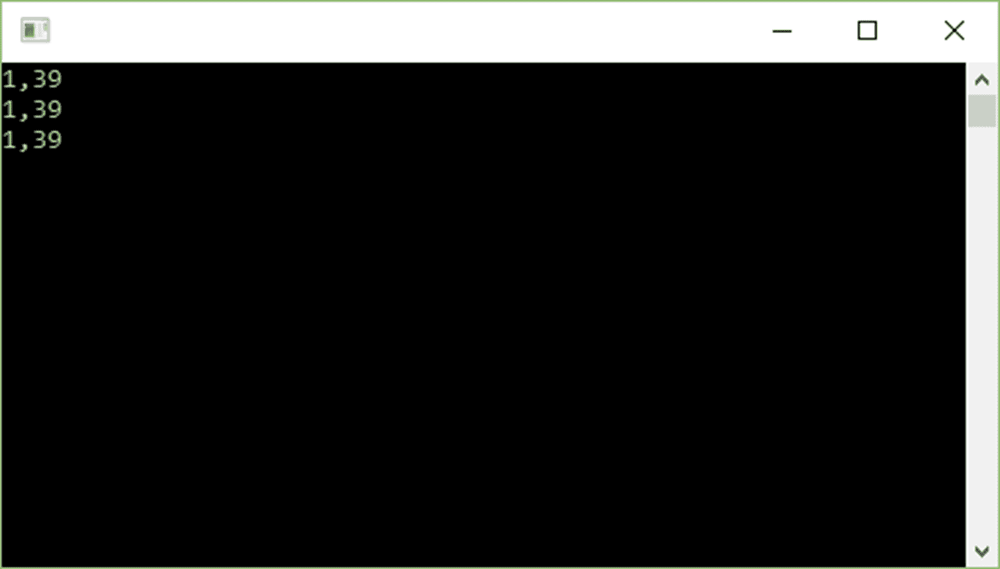
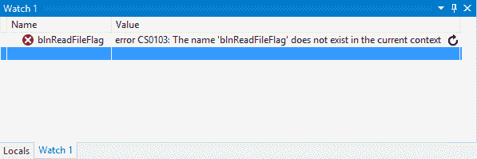

# 第三章：C#中的面向对象编程

本章将向您介绍 C#和面向对象编程（OOP）的基础。在本章中，您将学习以下内容：

+   在 C#中使用继承

+   使用抽象

+   利用封装

+   实现多态

+   单一职责原则

+   开闭原则

+   异常处理

# 介绍

在您作为软件创建者的职业生涯中，您会多次听到 OOP 这个术语。这种设计理念允许对象独立存在，并可以被代码的不同部分重复使用。这一切都是由我们所说的 OOP 的四大支柱所实现的：继承、封装、抽象和多态。

为了理解这一点，您需要开始思考执行特定任务的对象（基本上是实例化的类）。类需要遵循 SOLID 设计原则。这个原则在这里解释：

+   单一职责原则（SRP）

+   开闭原则

+   里斯科夫替换原则（LSP）

+   接口隔离原则

+   依赖反转原则

让我们从解释 OOP 的四大支柱开始，然后我们将更详细地看一下 SOLID 原则。

# 在 C#中使用继承

在今天的世界中，继承通常与事物的结束联系在一起。然而，在 OOP 中，它与新事物的开始和改进联系在一起。当我们创建一个新类时，我们可以取一个已经存在的类，并在我们的新类上继承它。这意味着我们的新对象将具有继承类的所有特性，以及添加到新类的附加特性。这就是继承的根本。我们称从另一个类继承的类为派生类。

# 做好准备

为了说明继承的概念，我们将创建一些从另一个类继承的类，以形成新的、更具特色的对象。

# 如何做到...

1.  创建一个新的控制台应用程序，并在其中添加一个名为`SpaceShip`的类。

```cs
        public class SpaceShip 
        { 

        }

```

1.  我们的`SpaceShip`类将包含一些描述飞船基本情况的方法。继续将这些方法添加到您的`SpaceShip`类中：

```cs
        public class SpaceShip 
        { 
          public void ControlBridge() 
          { 

          } 
          public void MedicalBay(int patientCapacity) 
          { 

          } 
          public void EngineRoom(int warpDrives) 
          { 

          } 
          public void CrewQuarters(int crewCapacity) 
          { 

          } 
          public void TeleportationRoom() 
          { 

          } 
        }

```

因为`SpaceShip`类是所有其他星际飞船的一部分，它成为了每艘其他飞船的蓝图。

1.  接下来，我们想创建一个`Destroyer`类。为了实现这一点，我们将创建一个`Destroyer`类，并在类名后使用冒号表示我们想要从另一个类（`SpaceShip`类）继承。因此，在创建`Destroyer`类时需要添加以下内容：

```cs
        public class Destroyer : SpaceShip 
        { 

        }

```

我们还可以说`Destroyer`类是从`SpaceShip`类派生的。因此，`SpaceShip`类是所有其他星际飞船的基类。

1.  接下来，向`Destroyer`类添加一些仅适用于驱逐舰的方法。这些方法仅属于`Destroyer`类，而不属于`SpaceShip`类：

```cs
        public class Destroyer : SpaceShip 
        { 
          public void WarRoom() 
          { 

          } 
          public void Armory(int payloadCapacity) 
          { 

          } 

          public void WarSpecialists(int activeBattalions) 
          { 

          } 
        }

```

1.  最后，创建一个名为`Annihilator`的第三个类。这是最强大的星际飞船，用于对抗行星。通过创建该类并标记为从`Destroyer`类派生的类，让`Annihilator`类继承`Destroyer`类：

```cs
        public class Annihilator : Destroyer 
        { 

        }

```

1.  最后，向`Annihilator`类添加一些仅属于这种`SpaceShip`类的方法：

```cs
        public class Annihilator : Destroyer 
        { 
          public void TractorBeam() 
          { 

          } 

          public void PlanetDestructionCapability() 
          { 

          } 
        }

```

1.  现在我们看到，当我们在控制台应用程序中创建`SpaceShip`类的新实例时，我们只能使用该类中定义的方法。这是因为`SpaceShip`类没有继承自其他类：


1.  继续在控制台应用程序中创建`SpaceShip`类及其方法：

```cs
        SpaceShip transporter = new SpaceShip(); 
        transporter.ControlBridge(); 
        transporter.CrewQuarters(1500); 
        transporter.EngineRoom(2); 
        transporter.MedicalBay(350); 
        transporter.TeleportationRoom();

```

当我们实例化这个类的新实例时，您会看到这些是我们唯一可用的方法。

1.  接下来，在`Destroyer`类中创建一个新实例。您会注意到`Destroyer`类包含的方法比我们在创建类时定义的要多。这是因为`Destroyer`类继承了`SpaceShip`类，因此继承了`SpaceShip`类的方法：


1.  在控制台应用程序中创建`Destroyer`类及其所有方法：

```cs
        Destroyer warShip = new Destroyer(); 
        warShip.Armory(6); 
        warShip.ControlBridge(); 
        warShip.CrewQuarters(2200); 
        warShip.EngineRoom(4); 
        warShip.MedicalBay(800); 
        warShip.TeleportationRoom(); 
        warShip.WarRoom(); 
        warShip.WarSpecialists(1);

```

1.  最后，创建`Annihilator`类的新实例。这个类包含了`Destroyer`类的所有方法，以及`SpaceShip`类的方法。这是因为`Annihilator`继承自`Destroyer`，而`Destroyer`又继承自`SpaceShip`：


1.  在控制台应用程序中创建`Annihilator`类及其所有方法：

```cs
        Annihilator planetClassDestroyer = new Annihilator(); 
        planetClassDestroyer.Armory(12); 
        planetClassDestroyer.ControlBridge(); 
        planetClassDestroyer.CrewQuarters(4500); 
        planetClassDestroyer.EngineRoom(7); 
        planetClassDestroyer.MedicalBay(3500); 
        planetClassDestroyer.PlanetDestructionCapability(); 
        planetClassDestroyer.TeleportationRoom(); 
        planetClassDestroyer.TractorBeam(); 
        planetClassDestroyer.WarRoom(); 
        planetClassDestroyer.WarSpecialists(3);

```

# 工作原理...

我们可以看到继承允许我们通过重用先前创建的另一个类中已经存在的功能来轻松扩展我们的类。但是需要注意的是，对`SpaceShip`类的任何更改都将被继承，一直到最顶层的派生类。

继承是 C#的一个非常强大的特性，它允许开发人员编写更少的代码，并重用工作和经过测试的方法。

# 使用抽象

通过抽象，我们从我们想要创建的对象中提取出所有派生对象必须具有的基本功能。简单来说，我们将共同功能抽象出来，放入一个单独的类中，用于为所有继承自它的类提供这些共享功能。

# 准备工作

为了解释抽象，我们将使用抽象类。想象一下，你正在处理需要通过训练逐渐晋升的实习太空宇航员。事实上，一旦你作为实习生学会了一项新技能，那项技能就会被学会，并且会一直保留在你身上，即使你学会了更高级的做事方式。你还必须在你创建的新对象中实现所有之前学到的技能。抽象类非常好地展示了这个概念。

# 如何做...

1.  创建一个名为`SpaceCadet`的抽象类。这是在开始训练时可以获得的第一种宇航员类型。使用`abstract`关键字定义抽象类及其成员。需要注意的是，抽象类不能被实例化。成员代表`SpaceCadet`将拥有的技能，比如谈判和基本武器训练。

```cs
        public abstract class SpaceCadet 
        { 
          public abstract void ChartingStarMaps(); 
          public abstract void BasicCommunicationSkill(); 
          public abstract void BasicWeaponsTraining(); 
          public abstract void Negotiation(); 
        }

```

1.  接下来，创建另一个名为`SpacePrivate`的抽象类。这个抽象类继承自`SpaceCadet`抽象类。基本上，我们要表达的是，当一个太空学员被训练成为太空士兵时，他们仍然会拥有作为太空学员学到的所有技能：

```cs
        public abstract class SpacePrivate : SpaceCadet 
        { 
          public abstract void AdvancedCommunicationSkill(); 
          public abstract void AdvancedWeaponsTraining(); 
          public abstract void Persuader(); 
        }

```

1.  为了演示这一点，创建一个名为`LabResearcher`的类，并继承`SpaceCadet`抽象类。通过在新创建的类名后定义冒号和抽象类名，来继承抽象类。这告诉编译器`LabResearcher`类继承自`SpaceCadet`类：

```cs
        public class LabResearcher : SpaceCadet 
        { 

        }

```

因为我们继承了一个抽象类，编译器会在`LabResearcher`类名下划线，警告我们派生类没有实现`SpaceCadet`抽象类中的任何方法。

1.  如果你将鼠标悬停在波浪线上，你会发现灯泡提示会告诉我们发现的问题：


1.  Visual Studio 在发现的问题上提供了一个很好的解决方案。通过输入*Ctrl* + *.* (控制键和句点)，你可以让 Visual Studio 显示一些潜在的修复方法（在这种情况下，只有一个修复方法）：


1.  在 Visual Studio 添加了所需的方法之后，您会发现这些方法与`SpaceCadet`抽象类中定义的方法相同。因此，抽象类要求从抽象类继承的类实现抽象类中定义的方法。您还会注意到添加到`LabResearcher`类中的方法不包含任何实现，如果按原样使用，将会抛出异常：

```cs
        public class LabResearcher : SpaceCadet 
        { 
          public override void BasicCommunicationSkill() 
          { 
            thrownewNotImplementedException(); 
          } 

          publicoverridevoid BasicWeaponsTraining() 
          { 
            thrownewNotImplementedException(); 
          } 

          publicoverridevoid ChartingStarMaps() 
          { 
            thrownewNotImplementedException(); 
          } 

          publicoverridevoid Negotiation() 
          { 
            thrownewNotImplementedException(); 
          } 
        }

```

1.  接下来，创建一个名为`PlanetExplorer`的类，并使该类继承自`SpacePrivate`抽象类。您会记得`SpacePrivate`抽象类继承自`SpaceCadet`抽象类：

```cs
        public class PlanetExplorer : SpacePrivate 
        { 

        }

```

1.  Visual Studio 将再次警告您，您的新类没有实现继承的抽象类的方法。然而，在这里，您会注意到灯泡提示通知您，您没有实现`SpacePrivate`和`SpaceCadet`抽象类中的任何方法。这是因为`SpacePrivate`抽象类继承自`SpaceCadet`抽象类：


1.  与以前一样，要解决识别出的问题，输入*Ctrl* + *.*（控制键和句点），让 Visual Studio 显示一些潜在的修复方法（在这种情况下，只有一个修复方法）。

1.  在代码中添加修复后，您会发现`PlanetExplorer`类包含`SpacePrivate`和`SpaceCadet`抽象类中的所有方法：

```cs
        public class PlanetExplorer : SpacePrivate 
        { 
          public override void AdvancedCommunicationSkill() 
          { 
            throw new NotImplementedException(); 
          } 

          public override void AdvancedWeaponsTraining() 
          { 
            throw new NotImplementedException(); 
          } 

          public override void BasicCommunicationSkill() 
          { 
            throw new NotImplementedException(); 
          } 

          public override void BasicWeaponsTraining() 
          { 
            throw new NotImplementedException(); 
          } 

          public override void ChartingStarMaps() 
          { 
            throw new NotImplementedException(); 
          } 

          public override void Negotiation() 
          { 
            throw new NotImplementedException(); 
          } 

          public override void Persuader() 
          { 
            throw new NotImplementedException(); 
          } 
        }

```

# 工作原理...

抽象化使我们能够定义一组共享的功能，这些功能将在所有从抽象类派生的类之间共享。从抽象类继承和从普通类继承的区别在于，使用抽象类，您必须实现该抽象类中定义的所有方法。

这使得类易于版本控制和更改。如果需要添加新功能，可以通过将该功能添加到抽象类中而不破坏任何现有代码来实现。Visual Studio 将要求所有继承类实现抽象类中定义的新方法。

因此，您可以放心，应用的更改将在您代码中从抽象类派生的所有类中实现。

# 利用封装

封装是什么？简单来说，它是隐藏类的内部工作，这些内部工作对于该类的实现并不必要。将封装视为以下内容：拥有汽车的大多数人知道汽车是用汽油驱动的-他们不需要知道内燃机的内部工作就能使用汽车。他们只需要知道当汽车快没油时需要加油，以及需要检查机油和轮胎气压。即使这样，通常也不是由汽车所有者来做。这对于类和封装来说也是如此。

类的所有者是使用它的人。该类的内部工作不需要暴露给使用该类的开发人员。因此，该类就像一个黑匣子。只要输入正确，开发人员就知道该类的功能是一致的。开发人员并不关心类如何得到输出，只要输入正确即可。

# 准备工作

为了说明封装的概念，我们将创建一个在内部工作上有些复杂的类。我们需要计算太空飞船的**推重比**（**TWR**），以确定它是否能够垂直起飞。它需要施加比自身重量更大的推力来抵消重力并进入稳定轨道。这也取决于太空飞船从哪个行星起飞，因为不同的行星对其表面上的物体施加不同的重力。简单来说，推重比必须大于一。

# 如何做...

1.  创建一个名为`LaunchSuttle`的新类。然后，向该类添加以下私有变量，用于引擎推力、航天飞机的质量、当地的重力加速度、地球、月球和火星的重力常数（这些是常数，因为它们永远不会改变）、宇宙引力常数，以及用于处理的行星的枚举器：

```cs
        public class LaunchShuttle 
        { 
          private double _EngineThrust; 
          private double _TotalShuttleMass; 
          private double _LocalGravitationalAcceleration; 

          private const double EarthGravity = 9.81; 
          private const double MoonGravity = 1.63; 
          private const double MarsGravity = 3.75; 
          private double UniversalGravitationalConstant; 

          public enum Planet { Earth, Moon, Mars } 
        }

```

1.  对于我们的类，我们将添加三个重载的构造函数，这些函数对于根据实例化时的已知事实进行 TWR 计算至关重要（我们假设我们将始终知道发动机推力能力和航天飞机的质量）。我们将为第一个构造函数传递重力加速度。如果我们事先知道该值，这将非常有用。例如，地球的重力加速度为 9.81 m/s²。

第二个构造函数将使用`Planet`枚举器来计算使用常量变量值的 TWR。

第三个构造函数将使用行星的半径和质量来计算重力加速度，当这些值已知时，以返回 TWR：

```cs
        public LaunchShuttle(double engineThrust, 
          double totalShuttleMass, double gravitationalAcceleration) 
        { 
          _EngineThrust = engineThrust; 
          _TotalShuttleMass = totalShuttleMass; 
          _LocalGravitationalAcceleration =  gravitationalAcceleration; 

        } 

        public LaunchShuttle(double engineThrust, 
          double totalShuttleMass, Planet planet) 
        { 
          _EngineThrust = engineThrust; 
          _TotalShuttleMass = totalShuttleMass; 
          SetGraviationalAcceleration(planet); 

        } 

        public LaunchShuttle(double engineThrust, double 
          totalShuttleMass, double planetMass, double planetRadius) 
        { 
          _EngineThrust = engineThrust; 
          _TotalShuttleMass = totalShuttleMass; 
          SetUniversalGravitationalConstant(); 
          _LocalGravitationalAcceleration =  Math.Round(
            CalculateGravitationalAcceleration (
              planetRadius, planetMass), 2); 
        }

```

1.  为了使用第二个重载的构造函数，将`Planet`枚举器作为参数传递给类，我们需要创建另一个方法，将其范围设置为`private`，以计算重力加速度。我们还需要将`_LocalGravitationalAcceleration`变量设置为与枚举器值匹配的特定常数。这个方法是类的用户不需要看到的，以便使用类。因此，它被设置为`private`，以隐藏用户的功能：

```cs
        private void SetGraviationalAcceleration(Planet planet) 
        { 
          switch (planet) 
          { 
            case Planet.Earth: 
              _LocalGravitationalAcceleration = EarthGravity; 
            break; 
            case Planet.Moon: 
              _LocalGravitationalAcceleration = MoonGravity; 
            break; 
            case Planet.Mars: 
              _LocalGravitationalAcceleration = MarsGravity; 
            break; 
            default: 
            break; 
          } 
        }

```

1.  在以下方法中，只有一个被定义为公共的，因此对类的用户可见。创建私有方法来设置通用引力常数，并计算 TWR 和重力加速度。这些都被设置为私有，因为开发人员不需要知道这些方法的功能就能使用类：

```cs
        private void SetUniversalGravitationalConstant() 
        { 
          UniversalGravitationalConstant = 6.6726 * Math.Pow(10,  -11); 
        } 

        private double CalculateThrustToWeightRatio() 
        { 
          // TWR = Ft/m.g > 1 
          return _EngineThrust / (_TotalShuttleMass * 
                      _LocalGravitationalAcceleration); 
        } 

        private double CalculateGravitationalAcceleration(
                       double  radius, double mass) 
        { 
          return (UniversalGravitationalConstant * mass) / 
                                        Math.Pow(radius, 2); 
        } 

        public double TWR() 
       { 
         return Math.Round(CalculateThrustToWeightRatio(), 2); 
       }

```

1.  最后，在您的控制台应用程序中，创建以下变量及其已知的值：

```cs
        double thrust = 220; // kN 
        double shuttleMass = 16.12; // t 
        double gravitationalAccelerationEarth = 9.81; 
        double earthMass = 5.9742 * Math.Pow(10, 24); 
        double earthRadius = 6378100; 
        double thrustToWeightRatio = 0;

```

1.  创建`LaunchShuttle`类的新实例，并传递需要计算 TWR 的值：

```cs
        LaunchShuttle NasaShuttle1 = new LaunchShuttle(thrust, 
                   shuttleMass, gravitationalAccelerationEarth); 
        thrustToWeightRatio = NasaShuttle1.TWR(); 
        Console.WriteLine(thrustToWeightRatio);

```

1.  当您在`NasaShuttle1`变量上使用点运算符时，您会注意到 IntelliSense 只显示`TWR`方法。该类不会暴露出如何计算得到 TWR 值的内部工作方式。开发人员唯一知道的是，`LaunchShuttle`类将始终返回正确的 TWR 值，给定相同的输入参数：


1.  为了测试这一点，创建`LaunchShuttle`类的另外两个实例，并每次调用不同的构造函数：

```cs
        LaunchShuttle NasaShuttle2 = new LaunchShuttle(thrust, 
                       shuttleMass, LaunchShuttle.Planet.Earth); 
        thrustToWeightRatio = NasaShuttle2.TWR(); 
        Console.WriteLine(thrustToWeightRatio); 

        LaunchShuttle NasaShuttle3 = new LaunchShuttle(
           thrust,  shuttleMass, earthMass, earthRadius); 
        thrustToWeightRatio = NasaShuttle3.TWR(); 
        Console.WriteLine(thrustToWeightRatio); 

        Console.Read();

```

1.  如果运行您的控制台应用程序，您会看到 TWR 返回相同的值。该值表明，一个重 16.12 吨的航天飞机，配备产生 220 千牛的推力的火箭，将能够从地球表面起飞（即使只是刚刚）：



# 工作原理... 

该类使用作用域规则，将类内部的某些功能隐藏在开发人员使用类时。如前所述，开发人员不需要知道如何进行计算以返回 TWR 值。所有这些都有助于使类更有用且易于实现。以下是 C#中可用的各种作用域及其用途的列表：

+   `Public`：这用于变量、属性、类型和方法，可在任何地方可见。

+   `Private`：这用于变量、属性、类型和方法，仅在定义它们的块中可见。

+   `Protected`：这用于变量、属性和方法。不要将其视为公共或私有。受保护的范围仅在使用它的类内部可见，以及在任何继承的类中可见。

+   `Friend`：这用于变量、属性和方法，只能被同一项目或程序集中的代码使用。

+   `ProtectedFriend`：这用于变量、属性和方法，是受保护和友元范围的组合（正如名称所示）。

# 实现多态性

多态性是一个概念，一旦您查看并理解了面向对象编程的其他支柱，就会很容易理解。多态性字面上意味着某物可以有多种形式。这意味着从单个接口，您可以创建多个实现。

这有两个小节，即静态和动态多态性。通过**静态多态性**，您正在处理方法和函数的重载。您可以使用相同的方法，但执行许多不同的任务。

通过**动态多态性**，您正在处理抽象类的创建和实现。这些抽象类充当了告诉您派生类应该实现什么的蓝图。接下来的部分将同时查看这两者。

# 准备工作

我们将首先说明抽象类的用法，这是动态多态性的一个例子。然后，我们将创建重载构造函数作为静态多态性的一个例子。

# 如何做…

1.  创建一个名为`Shuttle`的抽象类，并给它一个名为`TWR`的成员，这是对航天飞机的推重比进行计算：

```cs
        public abstract class Shuttle 
        { 
          public abstract double TWR(); 
        }

```

1.  接下来，创建一个名为`NasaShuttle`的类，并让它继承自抽象类`Shuttle`，方法是在`NasaShuttle`类声明的末尾冒号后放置抽象类名称：

```cs
        public class NasaShuttle : Shuttle 
        { 

        }

```

1.  Visual Studio 会下划线标记`NasaShuttle`类，因为您已经告诉编译器该类继承自抽象类，但尚未实现该抽象类的成员：


1.  要解决识别出的问题，请键入*Ctrl* + *.*（控制键和句点），让 Visual Studio 为您显示一些潜在的修复方法（在这种情况下，只有一个修复方法）：


1.  然后，Visual Studio 会向`NasaShuttle`类添加缺少的实现。默认情况下，它将添加为未实现，因为您需要为抽象类中覆盖的抽象成员提供实现：

```cs
        public class NasaShuttle : Shuttle 
        { 
          public override double TWR() 
          { 
            throw new NotImplementedException(); 
          } 
        }

```

1.  创建另一个名为`RoscosmosShuttle`的类，并从相同的`Shuttle`抽象类继承：

```cs
        public class RoscosmosShuttle : Shuttle 
        { 

        }

```

1.  与以前一样，Visual Studio 会下划线标记`RoscosmosShuttle`类，因为您已经告诉编译器该类继承自抽象类，但尚未实现该抽象类的成员。

1.  要解决识别出的问题，请键入*Ctrl* + *.*（控制键和句点），让 Visual Studio 为您显示一些潜在的修复方法（在这种情况下，只有一个修复方法）。

1.  然后，重写的方法将作为未实现添加到`RoscosmosShuttle`类中。您刚刚看到了动态多态性的一个示例：

```cs
        public class RoscosmosShuttle : Shuttle 
        { 
          public override double TWR() 
          { 
            throw new NotImplementedException(); 
          } 
        }

```

1.  要查看静态多态性的示例，请为`NasaShuttle`创建以下重载构造函数。构造函数名称保持不变，但构造函数的签名发生变化，这使其成为重载：

```cs
        public NasaShuttle(double engineThrust, 
          double  totalShuttleMass, double gravitationalAcceleration) 
        { 

        } 

        public NasaShuttle(double engineThrust, 
          double  totalShuttleMass, double planetMass, 
          double planetRadius) 
        { 

        }

```

# 工作原理…

多态性是您通过将良好的面向对象原则应用于类的设计而已经在使用的东西。通过抽象的`Shuttle`类，我们看到该类在用于从其抽象中派生这些新类时，采用了`NasaShuttle`类和`RoscosmosShuttle`类的形式。然后，`NasaShuttle`类的构造函数被覆盖，以提供相同的方法名称，但使用不同的签名进行实现。

这就是多态性的核心。很可能，您一直在使用它，却不知道它。

# 单一职责原则

在谈论 SOLID 原则时，我们将从**单一职责原则**（**SRP**）开始。在这里，我们实际上是在说一个类有一个特定的任务需要完成，不应该做其他任何事情。

# 准备工作

当向星际飞船添加更多的部队时引发异常，导致其超载时，您将创建一个新的类并编写代码将错误记录到数据库中。对于此示例，请确保已将`using System.Data;`和`using System.Data.SqlClient;`命名空间添加到您的应用程序中。

# 如何做...

1.  创建一个名为`StarShip`的新类：

```cs
        public class Starship 
        { 

        }

```

1.  向您的类中添加一个新方法，该方法将设置`StarShip`类的最大部队容量：

```cs
        public void SetMaximumTroopCapacity(int capacity) 
        {             

        }

```

1.  在这个方法中，添加一个`trycatch`子句，将尝试设置最大的部队容量，但由于某种原因，它将失败。失败时，它将错误写入数据库内的日志表：

```cs
        try 
        { 
          // Read current capacity and try to add more 
        } 
        catch (Exception ex) 
        { 
          string connectionString = "connection string goes  here";
          string sql = $"INSERT INTO tblLog (error, date) VALUES
            ({ex.Message}, GetDate())";
          using (SqlConnection con = new 
                 SqlConnection(connectionString)) 
          { 
            SqlCommand cmd = new SqlCommand(sql); 
            cmd.CommandType = CommandType.Text; 
            cmd.Connection = con; 
            con.Open(); 
            cmd.ExecuteNonQuery(); 
          } 
          throw ex; 
        }

```

# 它是如何工作的...

如果您的代码看起来像前面的代码，那么您就违反了 SRP。`StarShip`类不再仅负责自身和与星际飞船有关的事物。它现在还必须履行将错误记录到数据库的角色。您在这里看到的问题是数据库记录代码不属于`SetMaximumTroopCapacity`方法的`catch`子句。更好的方法是创建一个单独的`DatabaseLogging`类，其中包含创建连接和将异常写入适当日志表的方法。您还会发现您将不得不在多个地方编写该记录代码（在每个`catch`子句中）。如果您发现自己重复编写代码（通过从其他地方复制和粘贴），那么您可能需要将该代码放入一个公共类中，并且您可能已经违反了 SRP 规则。

# 开闭原则

在创建类时，我们需要确保该类通过需要更改内部代码来禁止任何破坏性修改。我们说这样的类是封闭的。如果我们需要以某种方式更改它，我们可以通过扩展类来实现。这种可扩展性是我们说类是开放的扩展。

# 准备工作

您将创建一个类，通过查看 trooper 的类来确定 trooper 的技能。我们将向您展示许多开发人员创建这样一个类的方式，以及如何使用开闭原则创建它。

# 如何做...

1.  创建一个名为`StarTrooper`的类：

```cs
        public class StarTrooper 
        { 

        }

```

1.  在这个类中，添加一个名为`TrooperClass`的枚举器，以标识我们想要返回技能的 trooper 类型。还要创建一个`List<string>`变量，以包含特定 trooper 类的技能。最后，创建一个名为`GetSkills`的方法，返回给定 trooper 类的特定技能集。

这个类非常简单，但代码的实现是我们经常看到的。有时，您会看到一大堆`if...else`语句，而不是`switch`语句。虽然代码的功能很明确，但很难在不更改代码的情况下向`StarTrooper`类添加另一个 trooper 类。假设您现在必须向`StarTrooper`类添加一个额外的`Engineer`类。您将不得不修改`TrooperClass`枚举和`switch`语句中的代码。

代码的更改可能会导致您在先前正常工作的代码中引入错误。我们现在看到`StarTrooper`类没有关闭，无法轻松地扩展以适应其他`TrooperClass`对象：

```cs
        public enum TrooperClass { Soldier, Medic, Scientist } 
        List<string> TroopSkill; 

        public List<string> GetSkills(TrooperClass troopClass) 
        { 
          switch (troopClass) 
          { 
            case TrooperClass.Soldier: 
              return TroopSkill = new List<string>(new string[] {
                "Weaponry", "TacticalCombat",  "HandToHandCombat" }); 

            case TrooperClass.Medic: 
              return TroopSkill = new List<string>(new string[] {
                "CPR", "AdvancedLifeSupport" }); 

            case TrooperClass.Scientist: 
              return TroopSkill = new List<string>(new string[] {
                "Chemistry",  "MollecularDeconstruction", 
                "QuarkTheory" }); 

            default: 
              return TroopSkill = new List<string>(new string[]  {
                "none" }); 
          } 
        }

```

1.  这个问题的解决方案是继承。我们不需要更改代码，而是扩展它。首先，重新编写前面的`StarTrooper`类并创建一个`Trooper`类。`GetSkills`方法声明为`virtual`：

```cs
        public class Trooper 
        { 
          public virtual List<string> GetSkills() 
          { 
            return new List<string>(new string[] { "none" }); 
          } 
        }

```

1.  现在，我们可以轻松地为可用的`Soldier`、`Medic`和`Scientist`trooper 类创建派生类。创建以下继承自`Trooper`类的派生类。您可以看到在创建`GetSkills`方法时使用了`override`关键字：

```cs
        public class Soldier : Trooper 
        { 
          public override List<string> GetSkills() 
          { 
            return new List<string>(new string[] { "Weaponry", 
                         "TacticalCombat", "HandToHandCombat" }); 
          } 
        } 

        public class Medic : Trooper 
        { 
          public override List<string> GetSkills() 
          { 
            return new List<string>(new string[] { 
                   "CPR",  "AdvancedLifeSupport" }); 
          } 
        } 

        public class Scientist : Trooper 
        { 
          public override List<string> GetSkills() 
          { 
            return new List<string>(new string[] { "Chemistry",
              "MollecularDeconstruction", "QuarkTheory" }); 
          } 
        }

```

1.  当扩展类以添加`Trooper`的附加类时，代码变得非常容易实现。如果现在我们想要添加`Engineer`类，我们只需在从之前创建的`Trooper`类继承后重写`GetSkills`方法：

```cs
        public class Engineer : Trooper 
        { 
          public override List<string> GetSkills() 
          { 
            return new List<string>(new string[] {  
              "Construction", "Demolition" }); 
          } 
        }

```

# 它是如何工作的...

从`Trooper`类派生的类是`Trooper`类的扩展。我们可以说每个类都是封闭的，因为修改它不需要改变原始代码。`Trooper`类也是可扩展的，因为我们已经能够通过创建从中派生的类轻松扩展该类。

这种设计的另一个副产品是更小、更易管理的代码，更容易阅读和理解。

# 异常处理

异常处理是您作为开发人员需要了解的内容，您还必须非常擅长辨别要向最终用户显示什么信息以及要记录什么信息。信不信由你，编写良好的错误消息比看起来更难。向用户显示太多信息可能会在软件中灌输一种不信任感。为了调试目的记录的信息太少对于需要修复错误的可怜人来说也毫无用处。这就是为什么您需要有一个**异常处理策略**。

一个很好的经验法则是向用户显示一条消息，说明出了问题，但已向支持人员发送了通知。想想谷歌、Dropbox、Twitter（还记得蓝鲸吗？）和其他大公司。有趣的错误页面，上面有一个手臂掉了的小机器人，或者向用户显示一个流行的表情图，远比一个充满堆栈跟踪和红色文本的威胁性错误页面要好得多。这是一种暂时让用户从令人沮丧的情况中抽离的方式。最重要的是，它让您保持面子。

让我们首先看一下异常过滤器。这已经存在一段时间了。Visual Basic.NET（VB.NET）和 F#开发人员已经拥有了这个功能一段时间。它在 C# 6.0 中引入，并且功能远不止看上去的那么简单。乍一看，异常过滤器似乎只是指定需要捕获异常的条件。毕竟，这就是*异常过滤器*这个名字所暗示的。然而，仔细观察后，我们发现异常过滤器的作用远不止是一种语法糖。 

# 准备工作

我们将创建一个名为`Chapter3`的新类，并调用一个方法来读取 XML 文件。文件读取逻辑由设置为`true`的布尔标志确定。想象一下，还有一些其他数据库标志，当设置时，也会将我们的布尔标志设置为`true`，因此，我们的应用程序知道要读取给定的 XML 文件。

首先确保已添加以下`using`语句：

```cs
using System.IO;

```

# 如何做...

1.  创建一个名为`Chapter3`的类（如果还没有），其中包含两个方法。一个方法读取 XML 文件，第二个方法记录任何异常错误：

```cs
        public void ReadXMLFile(string fileName)
        {
          try
          {
            bool blnReadFileFlag = true;
            if (blnReadFileFlag)
            {
              File.ReadAllLines(fileName);
            }
          }
          catch (Exception ex)
          {
            Log(ex);
            throw;
          }
        }

        private void Log(Exception e)
        {
          /* Log the error */
        }

```

1.  在控制台应用程序中，添加以下代码来调用`ReadXMLFile`方法，并将文件名传递给它以进行读取：

```cs
Chapter3 ch3 = new Chapter3();
string File = @"c:tempXmlFile.xml";
ch3.ReadXMLFile(File);

```

1.  运行应用程序将生成一个错误（假设您的`temp`文件夹中实际上没有名为`XMLFile.xml`的文件）。Visual Studio 将在`throw`语句上中断：


1.  `Log(ex)`方法已记录了异常，但是看看 Watch1 窗口。我们不知道`blnReadFileFlag`的值是多少。当捕获异常时，堆栈被展开（为您的代码增加了开销）到实际的 catch 块。因此，异常发生之前的堆栈状态丢失了。



1.  修改您的`ReadXMLFile`和`Log`方法如下以包括异常过滤器：

```cs
        public void ReadXMLFile(string fileName)
        {
          try
          {
            bool blnReadFileFlag = true;
            if (blnReadFileFlag)
            {
              File.ReadAllLines(fileName);
            }
          }
          catch (Exception ex) when (Log(ex))
          {
          }
        }
        private bool Log(Exception e)
        {
          /* Log the error */
          return false;
        }

```

1.  再次运行控制台应用程序，Visual Studio 将在导致异常的实际代码行上中断：


1.  更重要的是，`blnReadFileFlag`的值仍然在作用域内。这是因为异常过滤器可以看到异常发生的地点的堆栈状态，而不是异常处理的地点。在 Visual Studio 的本地窗口中查看，您会发现变量在异常发生的地点仍然在作用域内。


# 它是如何工作的...

想象一下能够在日志文件中查看异常信息，并且所有局部变量值都可用。另一个有趣的地方要注意的是`Log(ex)`方法中的返回`false`语句。使用这种方法记录错误并返回`false`将允许应用程序继续并在其他地方处理异常。如您所知，捕获`Exception ex`将捕获一切。通过返回`false`，异常过滤器不会进入`catch`语句，并且可以使用更具体的`catch`异常（例如，在`catch (Exception ex)`语句之后的`catch (FileNotFoundException ex)`）来处理特定错误。通常，在捕获异常时，`FileNotFoundException`不会在以下代码示例中被捕获：

```cs
catch (Exception ex)
{ 
}
catch (FileNotFoundException ex)
{ 
}

```

这是因为捕获异常的顺序是错误的。传统上，开发人员必须按照特异性的顺序捕获异常，这意味着`FileNotFoundException`比`Exception`更具体，因此必须在`catch (Exception ex)`之前放置。通过调用返回`false`的方法的异常过滤器，我们可以准确检查和记录异常：

```cs
catch (Exception ex) when (Log(ex))
{ 
}
catch (FileNotFoundException ex)
{ 
}

```

前面的代码将捕获所有异常，并在这样做时准确记录异常，但不会进入异常处理程序，因为`Log(ex)`方法返回`false`。异常过滤的另一个实现是，它们可以允许开发人员在发生故障时重试代码。您可能不希望特别捕获第一个异常，而是在方法中实现一种超时元素。当错误计数器达到最大迭代次数时，您可以捕获并处理异常。您可以在这里看到基于`try`子句计数捕获异常的示例：

```cs
public void TryReadXMLFile(string fileName)
{
  bool blnFileRead = false;
  do
  {
    int iTryCount = 0;
    try
    {
      bool blnReadFileFlag = true;
      if (blnReadFileFlag)
      File.ReadAllLines(fileName);
    }
    catch (Exception ex) when (RetryRead(ex, iTryCount++) == true)
    {
    }
  } while (!blnFileRead);
}

private bool RetryRead(Exception e, int tryCount)
{
  bool blnThrowEx = tryCount <= 10 ? blnThrowEx = 
       false : blnThrowEx = true;
  /* Log the error if blnThrowEx = false */
  return blnThrowEx;
}

```

异常过滤是处理代码中异常的一种非常有用且非常强大的方式。异常过滤的幕后工作并不像人们想象的那样立即显而易见，但这就是异常过滤的实际力量所在。
