# 第四章：Visual Studio 中的代码分析器

在本章中，我们将看一下代码分析器以及它们如何帮助开发人员编写更好的代码。我们将涵盖以下主题：

+   查找并安装分析器

+   创建代码分析器

+   创建自定义代码分析器

+   仅在您的组织内部部署您的代码分析器

# 介绍

从 Visual Studio 2015 开始，开发人员可以创建特定于其项目或开发团队的自定义代码分析器。一些开发团队有一套需要遵守的标准。也许您是独立开发人员，希望使您的代码符合某些最佳实践。无论您的原因是什么，代码分析器都为开发人员打开了大门。

您可以确保您或您的团队发布的代码符合特定的代码质量标准。可以从 GitHub 下载几个代码分析器。我们将看一下其中一个名为 CodeCracker for C#的代码分析器。

# 查找并安装分析器

GitHub 上有很多代码分析器。快速搜索返回了 72 个存储库结果中的 28 个可能的 C#代码分析器。其中一些似乎是学生项目。也检查一下这些；其中一些代码非常聪明。至于这个示例，我们将使用 CodeCracker for C#来演示如何从 NuGet 包中安装分析器。

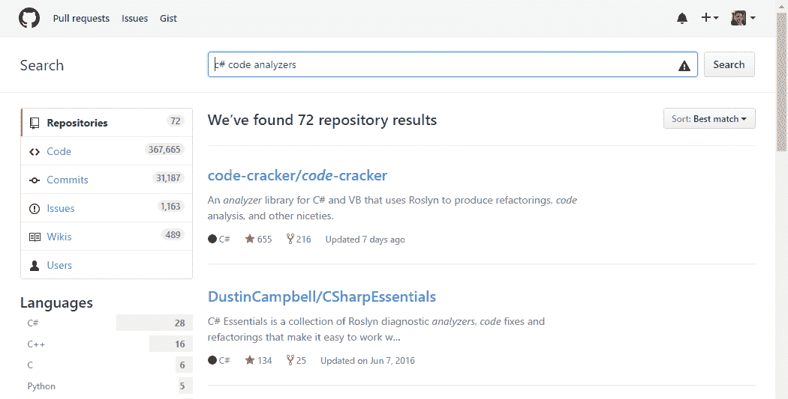

# 准备工作

您要做的就是为项目下载一个 NuGet 包。除此之外，您无需做任何特别的准备。

# 如何做...

1.  首先创建一个新的控制台应用程序。您可以随意命名。在我的示例中，我只是称它为`DiagAnalyzerDemo`。

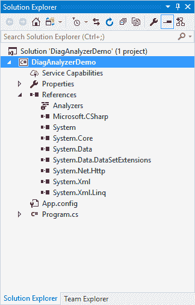

1.  从“工具”菜单中，选择 NuGet 包管理器，然后选择“解决方案的 NuGet 包管理器”。

1.  在“浏览”选项卡中，搜索`Code-Cracker`。结果应返回 codecracker.CSharp NuGet 包。选择要应用 NuGet 包的项目，然后单击“安装”按钮。


1.  Visual Studio 将允许您查看即将进行的更改。单击“确定”按钮继续。

1.  在显示许可条款时，单击“接受”。

1.  安装 NuGet 包后，结果将显示在“输出”窗口中。

1.  查看您的项目，您会注意到 CodeCracker.CSharp 分析器已添加到解决方案资源管理器中的“分析器”节点下。

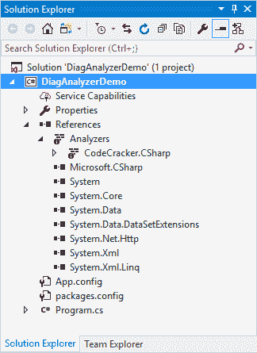

1.  如果展开 CodeCracker.CSharp 分析器，您将看到 NuGet 包中包含的所有单独的分析器。


1.  然而，有一个更好的地方可以查看这些分析器。从“项目”菜单中，转到“[项目名称]”属性菜单项。在我的情况下，这是 DiagAnalyzerDemo 属性....

1.  单击“打开”按钮打开规则集。

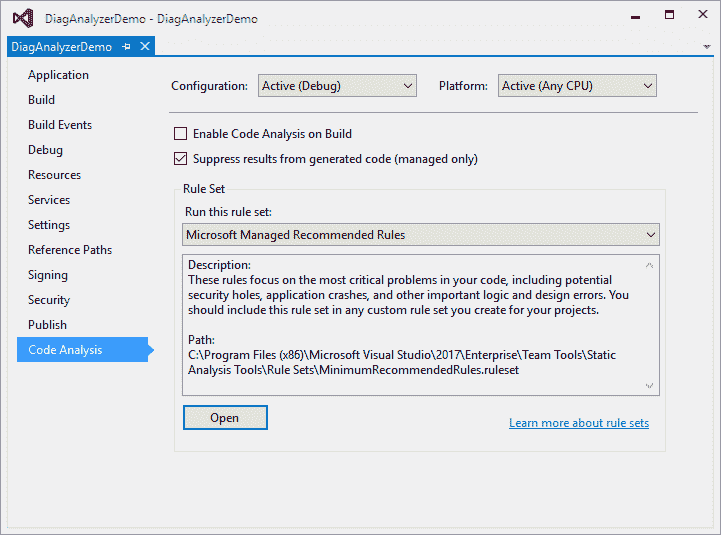

1.  在这里，您将看到所有可用的分析器集合；从此屏幕，您可以修改特定分析器的操作。


1.  在您的代码中，添加以下类。您可以随意命名，但为简单起见，请使用以下示例。您将看到我有一个构造函数，设置了一个名为`DimensionWHL`的属性。此属性只返回一个包含“宽度”、“高度”和“长度”值的数组。确实不是很好的代码。

```cs
        public class ShippingContainer
        {
          public int Width { get; set; }
          public int Height { get; set; }
          public int Length { get; set; }
          public int[] DimensionsWHL { get; set; }
          public ShippingContainer(int width, int height, int length)
          {
            Width = width;
            Height = height;
            Length = length;

            DimensionsWHL = new int[] { width, height, length };
          }
        }

```

1.  返回到分析器屏幕并搜索单词“属性”。您将看到一个名为 CA1819 的分析器，指定属性永远不应返回数组。操作更改为警告，但如果愿意，可以通过单击“操作”列下的“警告”单词并选择“错误”来更改为错误。

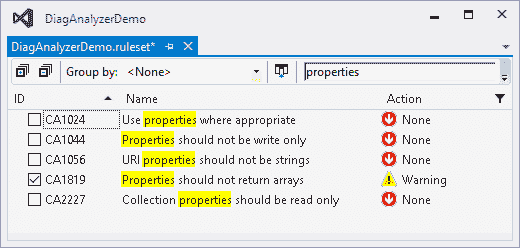

1.  保存更改并构建您的控制台应用程序。您将看到代码分析器 CA1819 的警告显示在错误列表中。如果将操作更改为错误，构建将会因为该错误而中断。

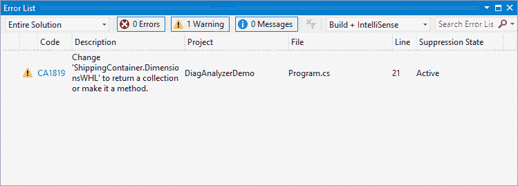

# 工作原理...

代码分析器可以为您提供许多功能，并帮助开发人员避免常见的不良编码实践，并强制执行特定的团队准则。每个代码分析器可以设置为不同的严重程度，最严重的实际上会导致构建失败。将代码分析器保留在项目的引用中允许您将其检入源代码控制；这在构建项目时进行评估。但是，您也可以将分析器存储在每台计算机上。这些分析器将用于个人代码改进、提示和个人使用。

代码分析器非常适合现代开发人员，因为它们在开发人员的控制下，并且可以轻松集成到 Visual Studio 中。

# 创建代码分析器

有些人可能已经看到了创建自己的代码分析器的好处。能够控制特定设计实现和团队特定的编码标准对您的团队来说是非常宝贵的。这对于加入您的团队的新开发人员尤其重要。我记得几年前开始为一家公司工作时，开发经理给了我一份需要遵守的代码标准文件。当时这很棒。它向我表明他们关心代码标准。当时，开发人员当然没有代码分析器。然而，跟踪我需要实施的所有标准是相当具有挑战性的。特别是对于公司实施的特定代码标准来说，情况尤其如此。

# 准备工作

在您创建自己的代码分析器之前，您需要确保已安装.NET 编译器平台 SDK。要做到这一点，请执行以下步骤：

1.  向您的解决方案添加一个新项目，然后单击可扩展性。选择下载.NET 编译器平台 SDK，然后单击确定。

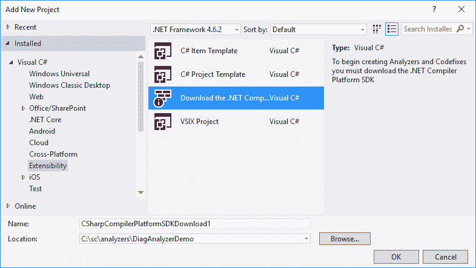

1.  这实际上将创建一个带有索引文件的项目。打开的页面将提供下载.NET 编译器平台 SDK 的链接。单击该链接开始下载。

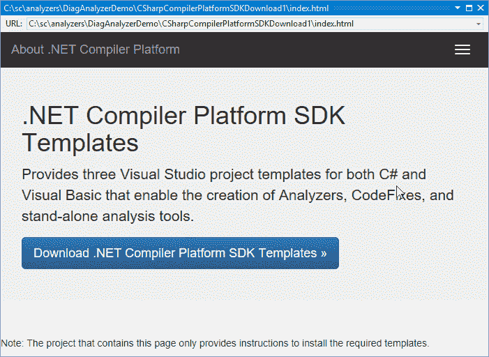

1.  只需将下载的文件保存到硬盘上的一个目录中。然后在单击 VSIX 文件之前关闭 Visual Studio。


1.  .NET 编译器平台 SDK 安装程序现在将启动，并允许您选择要安装到的 Visual Studio 实例。

安装完成后，再次重新启动 Visual Studio。


# 如何做...

1.  向您的 Visual Studio 解决方案添加一个新项目，然后单击可扩展性，选择带有代码修复的分析器（NuGet + VSIX）模板。给它一个合适的名称，然后单击确定以创建分析器项目。

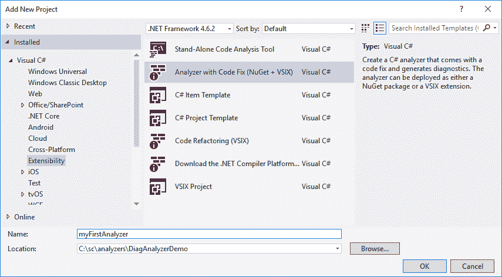

1.  您会发现 Visual Studio 已为您创建了三个项目：`Portable`，`.Test`和`.Vsix`。确保`.Vsix`项目设置为默认启动项目。


1.  在`Portable`类中，查看`DiagnosticAnalyzer.cs`文件。您将看到一个名为`AnalyzeSymbol()`的方法。这个代码分析器所做的一切就是简单地检查`namedTypeSymbol`变量上是否存在小写字母。

```cs
        private static void AnalyzeSymbol(
          SymbolAnalysisContext context)
        {
          // TODO: Replace the following code with your own 
             analysis, generating Diagnostic objects for any 
             issues you find
          var namedTypeSymbol = (INamedTypeSymbol)context.Symbol;

          // Find just those named type symbols with names 
             containing lowercase letters.
          if (namedTypeSymbol.Name.ToCharArray().Any(char.IsLower))
          {
            // For all such symbols, produce a diagnostic.
            var diagnostic = Diagnostic.Create(Rule, 
              namedTypeSymbol.Locations[0], namedTypeSymbol.Name);

            context.ReportDiagnostic(diagnostic);
          }
        }

```

1.  构建您的项目并单击*F5*开始调试。这将启动一个新的 Visual Studio 实例，具有自己的设置。这意味着您在这个实验性的 Visual Studio 实例中所做的任何更改都不会影响您当前的 Visual Studio 安装。您可以打开现有项目或创建新项目。我只是创建了一个控制台应用程序。从一开始，您会看到`Program`类名被下划线标记。将光标悬停在此处将显示 Visual Studio 的灯泡，并告诉您类型名称包含小写字母。

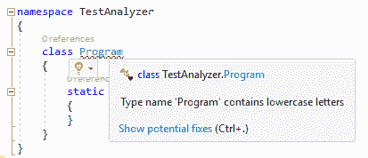

1.  单击*Ctrl* + *.*或在工具提示中单击“显示潜在修复”链接，将显示您可以应用以纠正错误的修复程序。

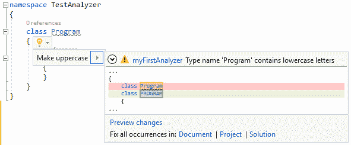

# 工作原理...

代码分析器将检查托管程序集并报告任何相关信息。这可以是违反.NET *Framework Design Guidelines*中的编程和设计规则的任何代码。代码分析器将显示其执行的检查作为警告消息，并在可能的情况下建议修复，就像我们在前面的示例中看到的那样。为此，代码分析器使用由 Microsoft 创建的规则集或您定义的自定义规则集来满足特定需求。

# 创建自定义代码分析器

当您创建一个适合特定需求的代码分析器时，代码分析器的真正魔力就会显现出来。什么样的需求会被视为特定需求呢？嗯，任何特定于您自己业务需求的东西，而这些在现有的分析器中没有涵盖。不要误会我；对开发人员可用的现有分析器确实涵盖了许多良好的编程实践。只需在 GitHub 上搜索 C#代码分析器，就可以看到。

然而，有时您可能会遇到更适合您的工作流程或公司业务方式的情况。

例如，可以确保所有公共方法的注释包含的信息不仅仅是标准的`<summary></summary>`和参数信息（如果有）。您可能希望包含一个附加的标签，例如内部任务 ID（考虑 Jira）。另一个例子是确保创建的类符合特定的 XML 结构。您是否正在开发将仓库库存信息写入数据库的软件？您是否使用非库存零件？您如何在代码中验证非库存和库存零件？代码分析器可以在这里提供解决方案。

前面的示例可能是相当独特的，可能与您或您的需求无关，但这就是代码分析器的美妙之处。您可以创建它们以满足您的需求。让我们看一个非常简单的例子。假设您组织中的开发人员需要使用特定的代码库。这个代码库是一组经常使用的代码，而且维护得很好。它包含在开发人员创建新项目时使用的 Visual Studio 模板中。我们需要确保，如果开发人员创建特定类（用于采购订单或销售订单），它实现了特定接口。这些接口存在于模板中，但类不存在。这是因为应用程序并不总是使用销售或采购订单。该接口是为了使销售和采购订单能够接收，称为 IReceivable。

# 准备工作

执行以下步骤：

1.  创建一个新的 Visual Studio 项目，命名为`PurchaseOrderAnalyzer`。


1.  确保默认情况下创建以下项目。

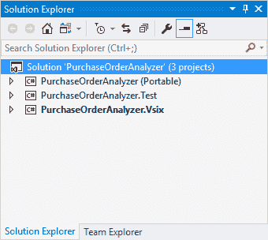

# 如何做...

1.  展开`PurchaseOrderAnalyzer (Portable)`项目并打开`DiagnosticAnalyzer.cs`文件。

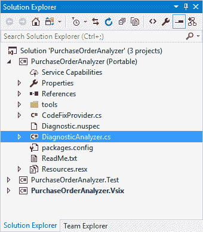

1.  如前所述，您将看到您的诊断分析器类。它应该读取`public class PurchaseOrderAnalyzerAnalyzer : DiagnosticAnalyzer`。将以下代码添加到此类的顶部，替换`DiagnosticId`、`Title`、`MessageFormat`、`Description`、`Category`和`Rule`变量的代码。请注意，我在类中添加了两个名为`ClassTypesToCheck`和`MandatoryInterfaces`的枚举器。我只希望此分析器在类名为`PurchaseOrder`或`SalesOrder`时才起作用。我还希望`IReceiptable`接口在`ClassTypesToCheck`枚举中定义的类中是强制性的。

```cs
        public const string DiagnosticId = "PurchaseOrderAnalyzer";

        public enum ClassTypesToCheck { PurchaseOrder, SalesOrder }
        public enum MandatoryInterfaces { IReceiptable }

        private static readonly LocalizableString Title = 
          "Interface Implementation Available"; 
        private static readonly LocalizableString 
          MessageFormat = "IReceiptable Interface not Implemented"; 
        private static readonly LocalizableString Description = 
          "You need to implement the IReceiptable interface"; 
        private const string Category = "Naming";

        private static DiagnosticDescriptor Rule = new 
          DiagnosticDescriptor(DiagnosticId, Title, MessageFormat, 
          Category, DiagnosticSeverity.Warning, 
          isEnabledByDefault: true, description: Description);

```

1.  确保`Initialize`方法包含以下代码：

```cs
        public override void Initialize(AnalysisContext context)
        {
          context.RegisterSymbolAction(AnalyzeSymbol, 
            SymbolKind.NamedType);
        }

```

1.  创建`AnalyzeSymbol`方法。您可以将此方法命名为任何您喜欢的名称。只需确保无论您如何命名此方法，它都与`Initialize`中的`RegisterSymbolAction()`方法中的方法名称匹配。

```cs
        private static void AnalyzeSymbol(SymbolAnalysisContext context)
        {

        }

```

1.  再添加一个名为`blnInterfaceImplemented`的布尔值，它将存储接口是否已实现的`true`或`false`。我们接下来要做的检查是忽略抽象类。实际上，您可能也想检查抽象类，但我想排除它以展示代码分析器的灵活性。

```cs
        bool blnInterfaceImplemented = false;
        if (!context.Symbol.IsAbstract)
        {

        }

```

1.  现在，您需要获取您正在检查的符号的名称。为此，请创建一个名为`namedTypeSymbol`的对象，您可以在该对象上调用`Name`方法来返回符号名称。在名为`PurchaseOrder`的类上，这应该返回`PurchaseOrder`作为名称。将`ClassTypesToCheck`枚举作为名为`classesToCheck`的`List<string>`对象返回。然后，对类名进行检查，看它是否包含在`classesToCheck`列表中。通过在`Equals`检查中添加`StringComparison.OrdinalIgnoreCase`来忽略大小写是很重要的。这将确保分析器将分析名为`purchaseorder`、`PURCHASEORDER`、`PurchaseOrder`、`Purchaseorder`或`purchaseOrder`的类。将代码添加到`if`条件中，不包括抽象类。

```cs
        var namedTypeSymbol = (INamedTypeSymbol)context.Symbol;
        List<string> classesToCheck = Enum.GetNames(
          typeof(ClassTypesToCheck)).ToList();

        if (classesToCheck.Any(s => s.Equals(
          namedTypeSymbol.Name, StringComparison.OrdinalIgnoreCase)))
        {

        }

```

类名的推荐大写风格是 PascalCase。PascalCase 包括大写标识符的第一个字母和每个后续连接的单词。如果标识符有三个或更多字符，则应用此规则。这意味着在类名中使用连接的单词 purchase 和 order 时必须使用 PascalCase。这将导致**P**urchase**O**rder。请参阅 MSDN 中的 Capitalization Styles 文章。

1.  在`if`条件中，要检查类名是否为`PurchaseOrder`或`SalesOrder`，请添加以下代码。在这里，我们将检查匹配的`PurchaseOrder`或`SalesOrder`类上定义的接口。我们通过调用`AllInterfaces()`方法来实现这一点，并检查它是否与`IReceiptable`枚举的`nameof`匹配。实际上，我们可能希望检查多个接口，但出于我们的目的，我们只检查`IReceiptable`接口的实现。如果我们发现接口在之前检查中匹配了类名上的实现，我们将设置`blnInterfaceImplemented = true;`（它当前初始化为`false`）。这意味着，如果接口没有匹配，那么我们将为省略`IReceiptable`接口产生诊断。这是通过创建和报告包含先前定义的`Rule`和类名位置的诊断来完成的。

```cs
        string interfaceName = nameof(
          MandatoryInterfaces.IReceiptable);

        if (namedTypeSymbol.AllInterfaces.Any(s => s.Name.Equals(
          interfaceName, StringComparison.OrdinalIgnoreCase)))
        {
          blnInterfaceImplemented = true;
        }

        if (!blnInterfaceImplemented)
        {
          // Produce a diagnostic.
          var diagnostic = Diagnostic.Create(Rule, 
            namedTypeSymbol.Locations[0], namedTypeSymbol.Name);
          context.ReportDiagnostic(diagnostic);
        }

```

1.  如果所有代码都添加到`AnalyzeSymbol()`方法中，该方法应如下所示：

```cs
        private static void AnalyzeSymbol(SymbolAnalysisContext context)
        {
          bool blnInterfaceImplemented = false;
          if (!context.Symbol.IsAbstract)
          {
            var namedTypeSymbol = (INamedTypeSymbol)context.Symbol;
            List<string> classesToCheck = Enum.GetNames(
              typeof(ClassTypesToCheck)).ToList();

            if (classesToCheck.Any(s => s.Equals(namedTypeSymbol.Name, 
              StringComparison.OrdinalIgnoreCase)))
            {
              string interfaceName = nameof(
                MandatoryInterfaces.IReceiptable);

              if (namedTypeSymbol.AllInterfaces.Any(s => s.Name.Equals(
                interfaceName, StringComparison.OrdinalIgnoreCase)))
              {
                blnInterfaceImplemented = true;
              }

              if (!blnInterfaceImplemented)
              {
                // Produce a diagnostic.
                var diagnostic = Diagnostic.Create(Rule, 
                  namedTypeSymbol.Locations[0], namedTypeSymbol.Name);
                context.ReportDiagnostic(diagnostic);
              }
            }
          }
        }

```

1.  现在，我们需要为代码分析器创建一个修复程序。如果我们发现类没有实现我们的接口，我们希望为开发人员提供一个快速修复的灯泡功能。打开名为`CodeFixProvider.cs`的文件。您会看到其中包含一个名为`public class PurchaseOrderAnalyzerCodeFixProvider : CodeFixProvider`的类。首先要做的是找到`title`字符串常量，并将其更改为更合适的标题。这是在 Visual Studio 中单击灯泡时显示的菜单弹出窗口。

```cs
        private const string title = "Implement IReceiptable";

```

1.  我已经将大部分代码修复代码保持不变，除了执行实际修复的代码。找到名为`RegisterCodeFixesAsync()`的方法。我将该方法重命名为`ImplementRequiredInterfaceAsync()`，以在`RegisterCodeFix()`方法中调用。代码应如下所示：

```cs
        public sealed override async Task RegisterCodeFixesAsync(
          CodeFixContext context)
        {
          var root = await context.Document.GetSyntaxRootAsync(
            context.CancellationToken).ConfigureAwait(false);

          var diagnostic = context.Diagnostics.First();
          var diagnosticSpan = diagnostic.Location.SourceSpan;

          // Find the type declaration identified by the diagnostic.
          var declaration = root.FindToken(diagnosticSpan.Start)
            .Parent.AncestorsAndSelf().OfType
            <TypeDeclarationSyntax>().First();

          // Register a code action that will invoke the fix.
          context.RegisterCodeFix(
            CodeAction.Create(
              title: title,
              createChangedSolution: c => 
              ImplementRequiredInterfaceAsync(context.Document, 
                declaration, c),
            equivalenceKey: title),
          diagnostic);
        }

```

1.  您会注意到，我已经重新使用了用于将符号大写的修复程序来实现接口。其余的代码保持不变。实际上，您很可能希望检查类上是否实现了其他接口，并保持这些实现。在这个演示中，我们只是假设正在创建一个名为`PurchaseOrder`或`SalesOrder`的新类，而没有现有的接口。

```cs
        private async Task<Solution> ImplementRequiredInterfaceAsync(
          Document document, TypeDeclarationSyntax typeDecl, 
          CancellationToken cancellationToken)
        {
          // Get the text of the PurchaseOrder class and return one 
             implementing the IPurchaseOrder interface
          var identifierToken = typeDecl.Identifier;

          var newName = $"{identifierToken.Text} : IReceiptable";

          // Get the symbol representing the type to be renamed.
          var semanticModel = await document.GetSemanticModelAsync(
            cancellationToken);
          var typeSymbol = semanticModel.GetDeclaredSymbol(
            typeDecl, cancellationToken);

          // Produce a new solution that has all references to 
             that type renamed, including the declaration.
          var originalSolution = document.Project.Solution;
          var optionSet = originalSolution.Workspace.Options;
          var newSolution = await Renamer.RenameSymbolAsync(
            document.Project.Solution, typeSymbol, newName, 
            optionSet, cancellationToken).ConfigureAwait(false);

          return newSolution;
        }

```

1.  确保`PurchaseOrderAnalyzer.Vsix`项目设置为启动项目，然后单击“调试”。将启动 Visual Studio 的新实例。在这个 Visual Studio 实例中创建一个新的控制台应用程序，并将其命名为`PurchaseOrderConsole`。向该项目添加一个名为`IReceiptable`的新接口，并添加以下代码。

```cs
        interface IReceiptable
        {
          void MarkAsReceipted(int orderNumber);
        }

```

1.  现在，向项目添加一个名为`PurchaseOrder`的新类，其中包含以下代码。

```cs
        public class PurchaseOrder 
        {

        }

```

1.  完成此操作后，如果为`IReceiptable`和`PurchaseOrder`添加了单独的文件，您的项目可能如下所示。

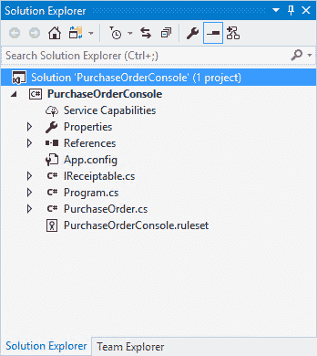

1.  查看`PurchaseOrder`类时，您会注意到类名`PurchaseOrder`下有一个波浪线。

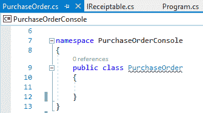

1.  将鼠标悬停在波浪线上，您将看到灯泡显示通知您`IReceiptable`接口未实现。

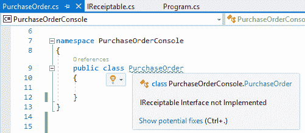

1.  当您查看潜在的修复时，您将看到我们在`CodeFixProvider.cs`文件中更改的`title`在飞出菜单文本中显示为`private const string title = "Implement IReceiptable";`。然后建议的代码显示为实现正确的接口`IReceiptable`。

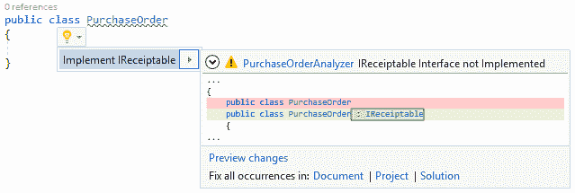

1.  单击此按钮会修改我们的`PurchaseOrder`类，生成以下代码：

```cs
        public class PurchaseOrder : IReceiptable 
        {

        }

```

1.  应用代码修复后，您会看到类名下的波浪线已经消失。正如预期的那样，Visual Studio 现在告诉我们需要通过在`IReceiptable`接口名称下划线标记`IReceiptable.MarkAsReceipted(int)`来实现接口成员。

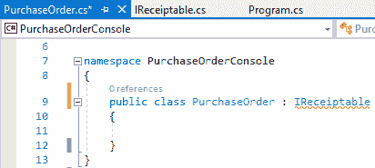

1.  将鼠标悬停在`IReceiptable`接口名称上，您将看到代码修复的灯泡。这是标准的 Visual Studio 分析器在这里起作用。

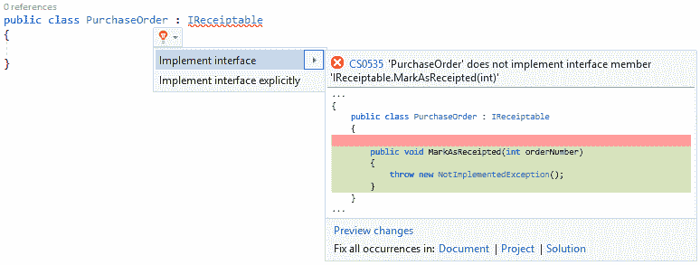

1.  单击要应用的修复程序，实现`IReceiptable`成员和`PurchaseOrder`类在代码中正确定义。

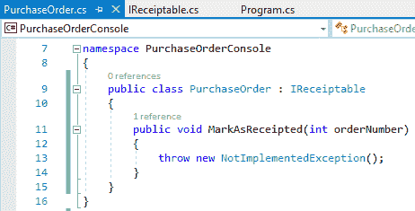

# 它的工作原理...

本示例中的示例甚至没有开始涉及代码分析器的可能性。了解可能性的一个很好方法是查看 GitHub 上的一些代码分析器。查看代码并开始编写自己的代码分析器。与编程中的大多数概念一样，学习的唯一方法就是编写代码。互联网上有大量的信息可供使用。不过，建议在开始编写自己的代码分析器之前，先看看是否已经有一个分析器可以满足您的需求（或者接近满足您的需求）。

例如，如果您需要确保方法注释包含附加信息，请尝试查找一个已经执行类似操作的分析器。例如，如果您找到一个检查公共方法是否有注释的分析器，您可以轻松地修改此分析器以满足自己的需求。学习的最佳方法是实践，但每个人都需要一个起点。站在他人的肩膀上是学习新编程概念的一部分。

# 仅在组织内部部署您的代码分析器

代码分析器是一种检查和自动纠正代码的绝妙方法。然而，您创建的分析器有时可能不适合公开使用，因为它们可能包含专有信息。通过 NuGet，您可以创建私有存储库并与同事共享。例如，您可以使用公司服务器上的共享位置，并轻松管理 NuGet 包。

# 准备工作

确保您的组织中的所有开发人员都可以访问共享位置。这可以是您的网络管理员提供的任何共享文件访问位置。您可能希望将这些包的访问权限限制为开发人员。一个不错的解决方案是在 Azure 上创建一个存储账户来共享 NuGet 包。这是我在这里使用的方法，我使用了一个名为 Acme Corporation 的虚构公司。

我不会详细介绍如何在 Azure 上设置存储账户，但我会谈谈如何从本地机器访问它。

我鼓励你和你的组织考虑使用 Azure。我不会过多扩展使用 Azure 的好处，只是说它可以节省大量时间。如果我想测试特定应用程序的特定功能在特定操作系统上，几分钟内我就能启动一个虚拟机并通过远程桌面连接到它。它立即可以使用。

在 Azure 上创建存储账户后，你会在“访问密钥”选项卡上找到访问密钥。

1.  记下密钥和存储账户名称。


1.  我还创建了一个名为`packages`的文件服务。要到达这里，点击“概述”。然后，在“服务”标题下，点击“文件”。在文件服务窗口上，选择`packages`并查看文件共享的属性信息。

你的存储账户可能与本书中的示例不同，这取决于你的命名。

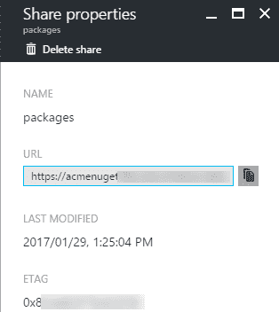

1.  记下属性中指定的 URL。使用该 URL，通过将路径中的`https://`部分更改为`\\`，并将任何后续的`/`更改为`\`，映射一个网络驱动器。

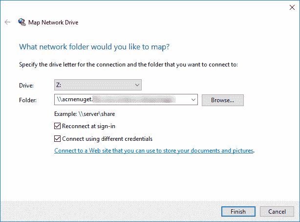

1.  将此路径添加到文件夹文本框，并确保已选中使用不同凭据进行连接。

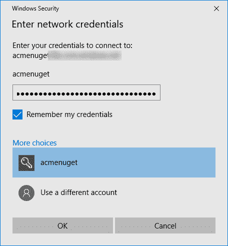

使用存储账户名称作为用户名，使用其中一个密钥作为密码。现在你已经将一个网络驱动器映射到了你的 Azure 存储账户。

# 如何做...

1.  看一下我们创建的`PurchaseOrderAnalyzer`项目。你会看到有一个包含两个名为`install.ps1`和`uninstall.ps1`的 PowerShell 脚本的`tools`文件夹。在这里，你可以指定任何特定于安装的资源或卸载软件包时要执行的操作。


1.  打开`Diagnostic.nuspec`文件，你会注意到其中包含了关于你即将部署的 NuGet 程序包的信息。务必修改此文件，因为它包含了对开发人员使用你的 NuGet 程序包很重要的信息。

```cs
        <?xml version="1.0"?>
        <package >
          <metadata>
            <id>PurchaseOrderAnalyzer</id>
            <version>1.1.1.1</version>
            <title>Purchase Order Analyzer</title>
            <authors>Dirk Strauss</authors>
            <owners>Acme Corporation</owners>
            <licenseUrl>http://www.acmecorporation.com/poanalyzer/
             license</licenseUrl>
            <projectUrl>http://www.acmecorporation.com/poanalyzer
             </projectUrl>
            <requireLicenseAcceptance>true</requireLicenseAcceptance>
            <description>Validate the creation of Purchase Order Objects 
             withing Acme Corporation's development projects
            </description>
            <releaseNotes>Initial release of the Purchase Order 
             Analyzer.</releaseNotes>
            <copyright>Copyright</copyright>
            <tags>PurchaseOrderAnalyzer, analyzers</tags>
            <frameworkAssemblies>
              <frameworkAssembly assemblyName="System" 
               targetFramework="" />
            </frameworkAssemblies>
          </metadata>
          <!-- The convention for analyzers is to put language 
           agnostic dlls in analyzersportable50 and language 
           specific analyzers in either analyzersportable50cs or 
           analyzersportable50vb -->
          <files>
            <file src="img/*.dll" target="analyzersdotnetcs" 
             exclude="**Microsoft.CodeAnalysis.*;
             **System.Collections.Immutable.*;
             **System.Reflection.Metadata.*;
             **System.Composition.*" />
            <file src="img/tools*.ps1" target="tools" />
          </files>
        </package>

```

1.  继续构建你的代码分析器。你会看到在项目的`bin`文件夹中创建了一个名为`PurchaseOrderAnalyzer.1.1.1.1.nupkg`的文件。将该文件复制到你之前在 Azure 存储账户中创建的映射驱动器。

1.  在 Visual Studio 中，添加一个新的 WinForms 应用程序。你可以随意命名。现在可以将存储账户添加为 NuGet 位置。转到工具，NuGet 程序包管理器，然后单击“解决方案的 NuGet 程序包管理器...”。你会注意到，在当前设置为 nuget.org 的包源旁边，有一个小齿轮图标。点击它。

我为这个示例在一个单独的机器上创建了 Visual Studio WinForms 应用程序，但如果你没有单独的机器，可以尝试使用虚拟机进行测试。如果你无法访问 Azure，也可以使用 VirtualBox。


1.  在“选项”屏幕上，通过单击“可用包源”下方的绿色加号图标，可以添加一个额外的 NuGet 程序包源。

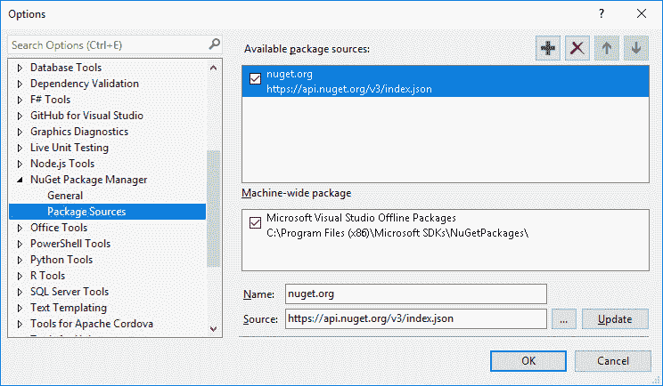

1.  在“选项”窗口底部，输入一个适当的位置名称，并输入 Azure 存储账户的路径。这是你在映射网络驱动器时输入的相同路径。在点击“确定”之前，点击“更新”按钮。然后点击“确定”按钮。

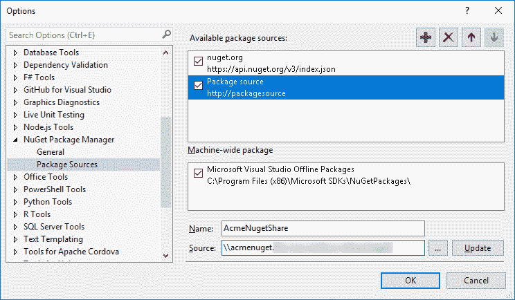

1.  现在可以将包源更改为设置为你映射到的 Azure 存储账户位置。这样做并单击 NuGet 程序包管理器的“浏览”选项卡将显示此文件共享上的所有程序包。右侧“选项”部分中的信息是你在`Diagnostic.nuspec`文件中定义的信息。

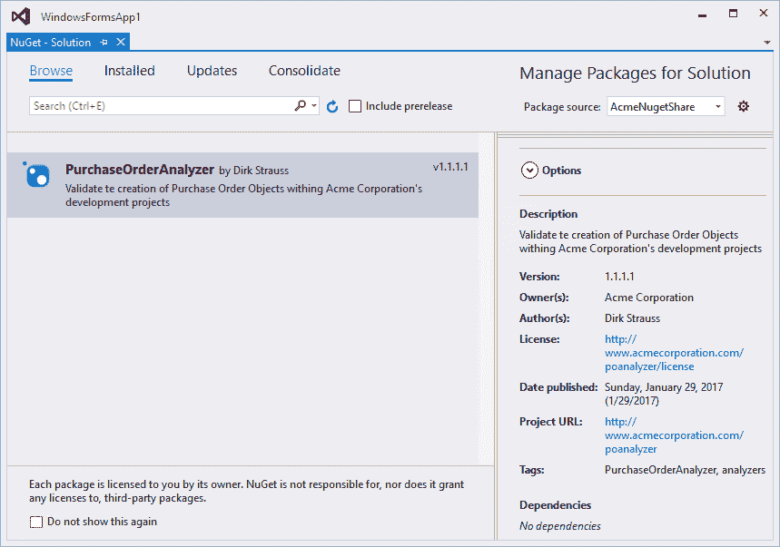

1.  现在可以继续安装代码分析器 NuGet 包。安装完成后，代码分析器将在项目的`References`下的`Analyzers`节点下可见。

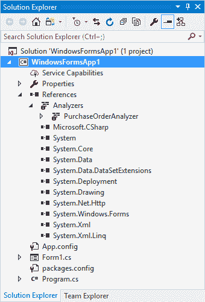

1.  代码分析器也完全按预期工作。创建一个名为`PurchaseOrder`的类，看看分析器是如何运作的。

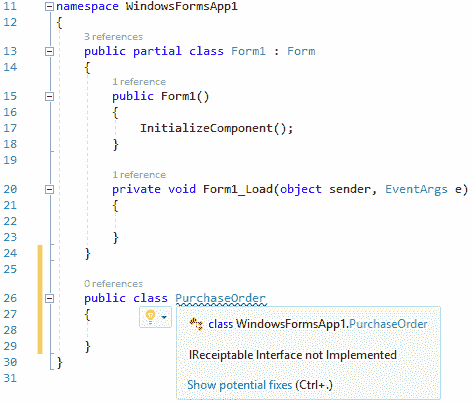

# 它是如何工作的...

NuGet 包是将代码部署到大众或少数开发人员的最简单方式。它可以轻松实现代码和模板的共享，因此使用 NuGet 来部署代码分析器是非常合理的。使用 NuGet 设置一个私有存储库来在组织内共享代码非常简单。
