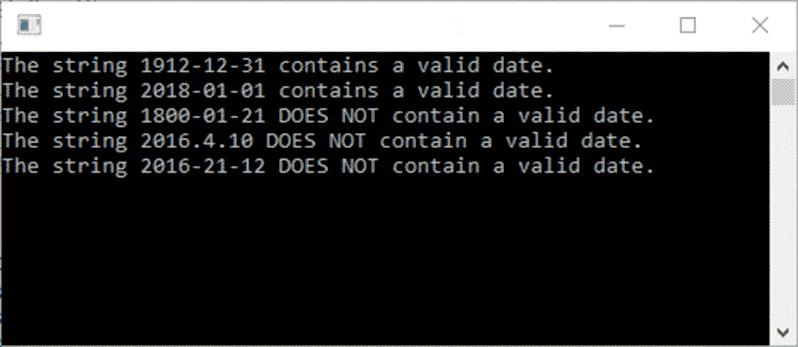
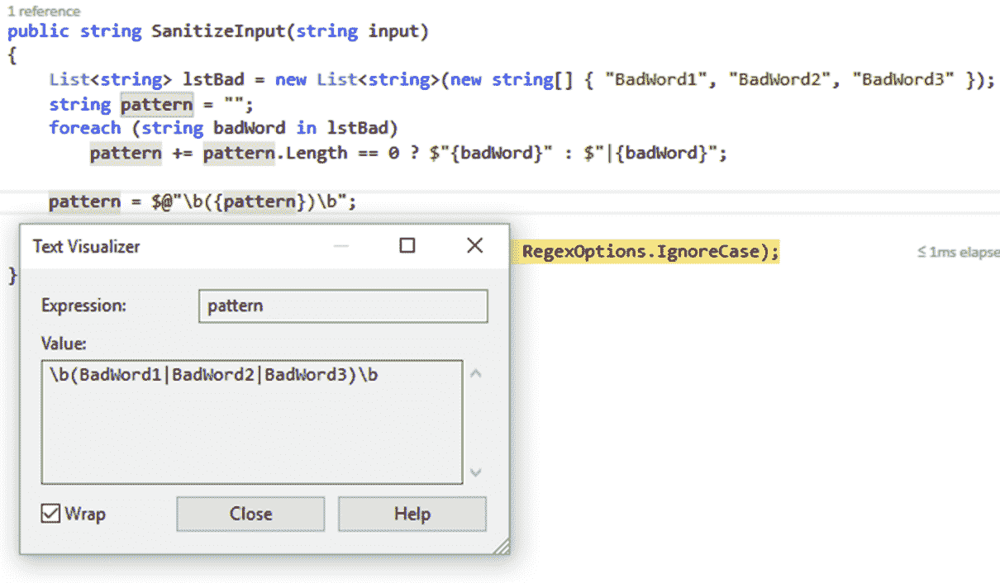
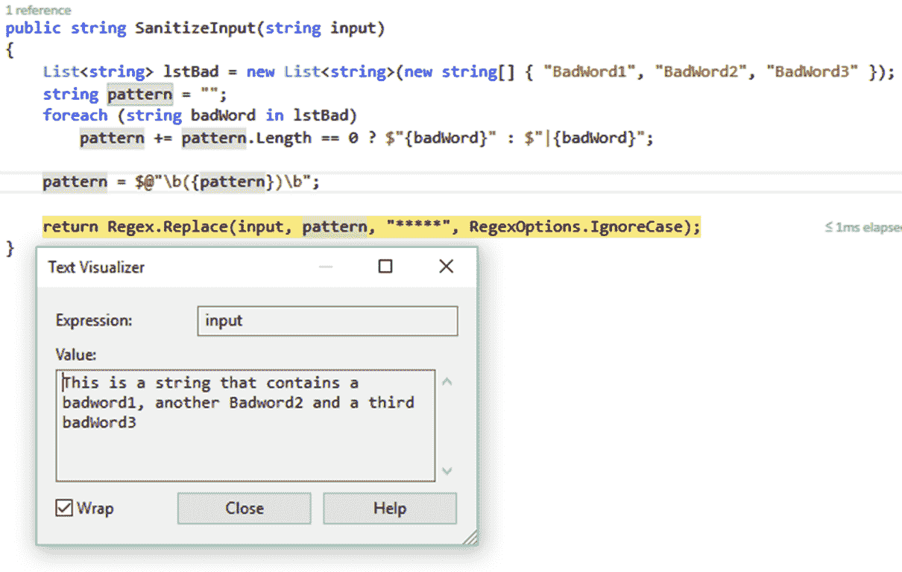
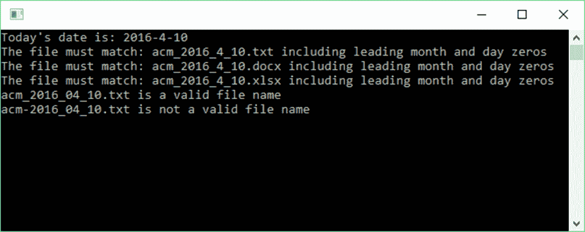

# 第五章：正则表达式

**正则表达式**（**regex**）对许多开发人员来说是一种神秘。我们承认，我们经常使用它们，以至于需要更深入地了解它们的工作原理。另一方面，互联网上有许多经过验证的正则表达式模式，只需重复使用已经存在的模式比尝试自己创建一个更容易。正则表达式的主题远远超出了本书中的单一章节所能解释的范围。

因此，在本章中，我们只是介绍了一些正则表达式的概念。要更深入地了解正则表达式，需要进一步学习。然而，为了本书的目的，我们将更仔细地看看如何创建正则表达式以及如何将其应用于一些常见的编程问题。在本章中，我们将涵盖以下内容：

+   开始使用正则表达式-匹配有效日期

+   清理输入

+   动态正则表达式匹配

# 介绍

正则表达式是通过使用特殊字符描述字符串的模式，这些特殊字符表示需要匹配的特定文本。正则表达式的使用在编程中并不是一个新概念。为了使正则表达式工作，它需要使用一个执行所有繁重工作的正则表达式引擎。

在.NET Framework 中，微软提供了正则表达式的使用。要使用正则表达式，您需要将`System.Text.RegularExpressions`程序集导入到您的项目中。这将允许编译器使用您的正则表达式模式并将其应用于您需要匹配的特定文本。

其次，正则表达式有一组特殊含义的元字符，这些字符是`[ ]`, `{ }`, `( )`, `*`, `+`, , `?`, `|`, `$`, `.`, 和 `^`。

例如，使用花括号`{ }`使开发人员能够指定特定字符集需要出现的次数。另一方面，使用方括号则确切地定义了需要匹配的内容。

例如，如果我们指定了`[abc]`，那么模式将寻找小写的 A、B 和 C。因此，正则表达式还允许您定义一个范围，例如`[a-c]`，这与`[abc]`模式的解释方式完全相同。

正则表达式还允许您使用`^`字符定义要排除的字符。因此，键入`[^a-c]`将找到小写的 D 到 Z，因为模式告诉正则表达式引擎排除小写的 A、B 和 C。

正则表达式还定义了`d`和`D`作为`[0-9]`和`[⁰-9]`的一种快捷方式。因此，`d`匹配所有数字值，而`D`匹配所有非数字值。另一个快捷方式是`w`和`W`，它们匹配从小写 A 到 Z 的任何字符，不考虑大小写，从 0 到 9 的所有数字值，以及下划线字符。因此，`w`是`[a-zA-Z0-9_]`，而`W`是`[^a-zA-Z0-9_]`。

正则表达式的基础相当容易理解，但您还可以做很多其他事情。

# 开始使用正则表达式-匹配有效日期

如果您还没有这样做，请创建一个新的控制台应用程序，并在项目中添加一个名为`RegExDemo`的类。此时您的代码应该看起来像这样：

```cs
class Program
{
   static void Main(string[] args)
   {
   }
}

public class RegExDemo
{

}

```

# 准备工作

为了本书的目的，我们使用控制台应用程序来说明正则表达式的使用。实际上，您可能不会将这种逻辑混在生产代码之间，因为这将导致代码被重写。添加类似正则表达式的最佳位置是在扩展方法中的帮助类中。

# 如何做...

1.  在控制台应用程序中，添加以下`using`语句，以便我们可以在.NET 中使用正则表达式程序集：

```cs
        using System.Text.RegularExpressions;

```

1.  我们将创建一个正则表达式来验证 yyyy-mm-dd、yyyy/mm/dd 或 yyyy.mm.dd 的日期模式。一开始，正则表达式看起来可能令人生畏，但请耐心等待。当您完成代码并运行应用程序时，我们将解析这个正则表达式。希望表达式逻辑会变得清晰。

1.  在`RegExDemo`类中，创建一个名为`ValidDate()`的新方法，该方法以字符串作为参数。这个字符串将是我们想要验证的日期模式：

```cs
        public void ValidDate(string stringToMatch) 
        { 

        }

```

1.  将以下正则表达式模式添加到方法中的变量中：

```cs
        string pattern = $@"^(19|20)dd-./
                         -./$";

```

1.  最后，添加正则表达式以匹配提供的字符串参数：

```cs
        if (Regex.IsMatch(stringToMatch, pattern)) 
            Console.WriteLine($"The string {stringToMatch} 
                              contains a valid date."); 
        else 
            Console.WriteLine($"The string {stringToMatch} DOES 
                              NOT contain a valid date.");

```

1.  当您完成这些操作后，您的方法应该如下所示：

```cs
        public void ValidDate(string stringToMatch) 
        { 
          string pattern = $@"^(19|20)dd-./
                           -./$"; 

          if (Regex.IsMatch(stringToMatch, pattern)) 
              Console.WriteLine($"The string {stringToMatch} contains
                                a valid date."); 
          else 
              Console.WriteLine($"The string {stringToMatch} DOES 
              NOT contain a valid date.");             
        }

```

1.  回到您的控制台应用程序，添加以下代码并通过单击“开始”调试您的应用程序：

```cs
        RegExDemo oRecipe = new RegExDemo(); 
        oRecipe.ValidDate("1912-12-31"); 
        oRecipe.ValidDate("2018-01-01"); 
        oRecipe.ValidDate("1800-01-21"); 
        oRecipe.ValidDate($"{DateTime.Now.Year}
                          .{DateTime.Now.Month}.{DateTime.Now.Day}"); 
        oRecipe.ValidDate("2016-21-12");  
        Console.Read();

```

您会注意到，如果您添加了`using static System.Console;`命名空间，那么您只需要调用`Read()`而不是`Console.Read()`。这种新功能，您可以导入静态命名空间，是在 C# 6.0 中添加的。

1.  日期字符串被传递给正则表达式，并且模式与参数中的日期字符串匹配。输出显示在控制台应用程序中：



1.  仔细观察输出，您会注意到有一个错误。我们正在验证格式为 yyyy-mm-dd、yyyy/mm/dd 和 yyyy.mm.dd 的日期字符串。如果我们使用这个逻辑，我们的正则表达式错误地将一个有效的日期标记为无效。这是日期`2016.4.10`，它是 2016 年 4 月 10 日，实际上是有效的。

我们很快会解释日期`1800-01-21`为什么无效。

1.  返回到您的`ValidDate()`方法，并将正则表达式更改为如下所示：

```cs
        string pattern = $@"^(19|20)dd-./
                         -./$";

```

1.  再次运行控制台应用程序并查看输出：


这次正则表达式对所有给定的日期字符串都起作用了。但我们到底做了什么？它是如何工作的。

# 它是如何工作的...

让我们仔细看看前面代码示例中使用的两个表达式。将它们与彼此进行比较，您可以看到我们在黄色中所做的更改：


在我们了解这个变化意味着什么之前，让我们分解表达式并查看各个组件。我们的正则表达式基本上是在说，我们必须匹配所有以 19 或 20 开头并具有以下分隔符的字符串日期：

+   破折号（-）

+   小数点（.）

+   斜杠（/）

为了更好地理解表达式，我们需要了解表达式<有效年份><有效分隔符><有效月份><有效分隔符><有效日期>的以下格式。

我们还需要能够告诉正则表达式引擎考虑一个*或*另一个模式。单词*或*由`|`元字符表示。为了使正则表达式引擎在不分割整个表达式的情况下考虑*或*这个词，我们将其包装在括号`()`中。

以下是正则表达式中使用的符号：

| 条件性或描述 |
| --- |
| | 这表示*或*元字符。 |
| 年份部分描述 |
| (19 | 20)只允许 19 或 20 |
| dd 匹配 0 到 9 之间的两个个位数。要匹配 0 到 9 之间的一个数字，您将使用 d。 |
| 有效分隔符字符集描述 |
| [-./]匹配字符集中的任何一个字符。这些是我们的有效分隔符。要匹配空格日期分隔符，您可以将其更改为[- ./]，在字符集中的任何位置添加一个空格。我们在破折号和小数点之间添加了空格。 |
| 月份和日期的有效数字描述 |
| 0[1-9]匹配以零开头，后跟 1 到 9 之间的任意数字。这将匹配 01、02、03、04、05、06、07、08 和 09。 |
| 1[0-2]匹配以 1 开头，后跟 0 到 2 之间的任意数字。这将匹配 10、11 或 12。 |
| [1-9]匹配 1 到 9 之间的任意数字。 |
| [12][0-9]匹配以 1 或 2 开头，后跟 0 到 9 之间的任意数字。这将匹配所有 10 到 29 之间的数字字符串。 |
| 3[01]匹配以 3 开头，后跟 0 或 1。这将匹配 30 或 31。 |
| 字符串的开始和结束描述 |
| ^告诉正则表达式引擎从给定字符串的开头开始匹配。 |
| `$` | 告诉正则表达式引擎停止匹配给定字符串的末尾。 |

我们创建的第一个正则表达式解释如下：

+   `^`: 从字符串开头开始匹配

+   `(19|20)`: 检查字符串是否以 19 或 20 开头

+   `dd`: 检查后，跟着两个 0 到 9 之间的单个数字

+   `[-./]`: 年份部分结束，后跟日期分隔符

+   `(0[1-9]|1[0-2])`: 通过查找以 0 开头的数字，后跟 1 到 9 之间的数字，*或*以 1 开头的数字，后跟 0 到 2 之间的任意数字

+   `[-./]`: 月份逻辑结束，后跟日期分隔符

+   `(0[1-9]|[12][0-9]|3[01])`: 然后，通过查找以 0 开头的数字，后跟 1 到 9 之间的数字，或者以 1 或 2 开头的数字，后跟 0 到 9 之间的任意数字，或者匹配 3 的数字，后跟 0 到 1 之间的任意数字，找到日期逻辑

+   `$`: 这样做直到字符串的末尾

我们的第一个正则表达式是不正确的，因为我们的月份逻辑是错误的。我们的月份逻辑规定，通过查找以 0 开头的数字，后跟 1 到 9 之间的任意数字，或者以 1 开头的数字，后跟 0 到 2 之间的任意数字`(0[1-9]|1[0-2])`。

然后会找到 01、02、03、04、05、06、07、08、09 或 10、11、12。它没有匹配的日期是`2016.4.10`（日期分隔符在这里没有区别）。这是因为我们的月份是单个数字，而我们正在寻找以零开头的月份。为了解决这个问题，我们必须修改月份逻辑的表达式，以包括只有 1 到 9 之间的单个数字。我们通过在表达式末尾添加`[1-9]`来实现这一点。

修改后的正则表达式如下：

+   `^`: 从字符串开头开始匹配

+   `(19|20)`: 检查字符串是否以 19 或 20 开头

+   `dd`: 检查后，跟着两个 0 到 9 之间的单个数字

+   `[-./]`: 年份部分结束，后跟日期分隔符

+   `(0[1-9]|1[0-2])`: 通过查找以 0 开头的数字，后跟 1 到 9 之间的任意数字，或者以 1 开头的数字，后跟 0 到 2 之间的任意数字或 1 到 9 之间的任意单个数字，找到月份逻辑

+   `[-./]`: 月份逻辑结束，后跟日期分隔符

+   `(0[1-9]|[12][0-9]|3[01])`: 然后，通过查找以 0 开头的数字，后跟 1 到 9 之间的数字，或者以 1 或 2 开头的数字，后跟 0 到 9 之间的任意数字，或者匹配 3 的数字，后跟 0 到 1 之间的任意数字，找到日期逻辑

+   `$`: 这样做直到字符串的末尾

这是一个基本的正则表达式，我们说基本是因为我们可以做很多事情来使表达式更好。我们可以包含逻辑来考虑替代日期格式，如 mm-dd-yyyy 或 dd-mm-yyyy。我们可以添加逻辑来检查二月，并验证它是否只包含 28 天，除非是闰年，那么我们需要允许二月的第二十九天。此外，我们还可以扩展正则表达式，以检查一月、三月、五月、七月、八月、十月和十二月是否有 31 天，而四月、六月、九月和十一月只有 30 天。

# 清理输入

有时，您需要清理输入。这可能是为了防止 SQL 注入或确保输入的 URL 有效。在本教程中，我们将查看如何用星号替换字符串中的不良词汇。我们确信有更优雅和代码高效的方法来使用正则表达式编写清理逻辑（特别是当我们有一个大量的黑名单词汇集合时），但我们想在这里阐明一个概念。

# 准备工作

确保您已将正确的程序集添加到您的类中。在您的代码文件顶部，如果尚未这样做，请添加以下行代码：

```cs
using System.Text.RegularExpressions;

```

# 如何做...

1.  在您的`RegExDemo`类中创建一个名为`SanitizeInput()`的新方法，并让它接受一个字符串参数：

```cs
        public string SanitizeInput(string input) 
        { 

        }

```

1.  在方法中添加一个`List<string>`类型的列表，其中包含我们要从输入中删除的不良词汇：

```cs
        List<string> lstBad = new List<string>(new string[]
        {  "BadWord1", "BadWord2", "BadWord3" });

```

实际上，您可能会利用数据库调用从数据库表中读取黑名单单词。您通常不会像这样硬编码它们在一个列表中。

1.  开始构造我们将用来查找黑名单单词的正则表达式。您使用`|`（OR）元字符将单词连接起来，以便正则表达式将匹配任何一个单词。当列表完成后，您可以在正则表达式的两侧附加`b`表达式。这表示一个词边界，因此只匹配整个单词：

```cs
        string pattern = ""; 
        foreach (string badWord in lstBad) 
        pattern += pattern.Length == 0 ? $"{badWord}" 
          :  $"|{badWord}"; 

        pattern = $@"b({pattern})b";

```

1.  最后，我们将添加`Regex.Replace()`方法，该方法接受输入并查找模式中定义的单词的出现，同时忽略大小写，并用`*****`替换不良单词：

```cs
        return Regex.Replace(input, pattern, "*****", 
                             RegexOptions.IgnoreCase);

```

1.  完成后，您的`SanitizeInput()`方法将如下所示：

```cs
        public string SanitizeInput(string input) 
        { 
          List<string> lstBad = new List<string>(new string[]
          { "BadWord1", "BadWord2", "BadWord3" }); 
          string pattern = ""; 
          foreach (string badWord in lstBad) 
          pattern += pattern.Length == 0 ? $"{badWord}" : $"|{badWord}"; 

          pattern = $@"b({pattern})b"; 

          return Regex.Replace(input, pattern, "*****", 
                               RegexOptions.IgnoreCase);             
        }

```

1.  在控制台应用程序中，添加以下代码调用`SanitizeInput()`方法并运行您的应用程序（如果您已经在上一个示例中实例化了`RegExDemo`的实例，则不需要再次实例化）：

```cs
        string textToSanitize = "This is a string that contains a  
          badword1, another Badword2 and a third badWord3"; 
        RegExDemo oRecipe = new RegExDemo(); 
        textToSanitize = oRecipe.SanitizeInput(textToSanitize); 
        WriteLine(textToSanitize); 
        Read();

```

1.  运行应用程序时，您将在控制台窗口中看到以下内容：


让我们更仔细地看一下生成的正则表达式。

# 工作原理...

让我们逐步了解代码的执行过程。我们需要得到一个看起来像这样的正则表达式：`b(wordToMatch1|wordToMatch2|wordToMatch3)b`。

这基本上是说“找到任何单词，只有被`b`标记的整个单词”。当我们查看我们创建的列表时，我们会看到我们想要从输入字符串中删除的单词：


然后我们创建了一个简单的循环，使用 OR 元字符创建要匹配的单词列表。在`foreach`循环完成后，我们得到了一个`BadWord1|BadWord2|BadWord3`模式。然而，这仍然不是一个有效的正则表达式：


为了完成生成有效的正则表达式的模式，我们需要在模式的两侧添加`b`表达式，告诉正则表达式引擎只匹配整个单词。正如您所看到的，我们正在使用字符串插值。

然而，这里我们需要非常小心。首先编写代码，完成模式而不使用`@`符号，如下所示：

```cs
pattern = $"b({pattern})b";

```

如果运行控制台应用程序，您会看到不良单词没有被匹配和过滤掉。这是因为我们没有转义`b`之前的字符。因此，编译器解释这行代码：


生成的表达式`[](BadWord1| BadWord2| BadWord3)[]`不是一个有效的表达式，因此不会对输入字符串进行消毒。

要纠正这个问题，我们需要在字符串前面添加`@`符号，告诉编译器将字符串视为文字。这意味着任何转义序列都将被忽略。正确格式化的代码行如下：

```cs
pattern = $@"b({pattern})b";

```

一旦您这样做，模式的字符串将被编译器直接解释，正确的正则表达式模式将被生成：



有了我们正确的正则表达式模式，我们调用了`Regex.Replace()`方法。它接受要检查的输入，要匹配的正则表达式，要替换匹配单词的文本，并且可选地允许忽略大小写。



当字符串返回到控制台应用程序中的调用代码时，字符串将被正确消毒：


正则表达式可能会变得非常复杂，并且可以用于执行多种任务，以格式化和验证输入和其他文本。

# 动态正则表达式匹配

动态正则表达式匹配到底是什么意思？嗯，这不是一个官方术语，但这是一个我们用来解释在运行时使用变量生成特定表达式的正则表达式的术语。假设您正在开发一个需要为 ACME 公司实现文档版本管理的文档管理系统。为了做到这一点，系统验证文档是否具有有效的文件名。

一个业务规则规定，上传在特定日期的任何文件的文件名必须以`acm`（ACME）和今天的日期以 yyyy-mm-dd 格式为前缀。它们只能是文本文件、Word 文档（仅限`.docx`）和 Excel 文档（仅限`.xlsx`）。任何不符合此文件格式的文档都将由另一种方法处理，该方法负责存档和无效文档的处理。

您的方法需要执行的唯一任务是将新文档处理为版本一文档。

在生产系统中，可能需要进一步的逻辑来确定是否在同一天之前已经上传了相同的文档。然而，这超出了本章的范围。我们只是试图搭建场景。

# 准备工作

确保您已将正确的程序集添加到您的类中。如果还没有这样做，请在代码文件的顶部添加以下代码行：

```cs
using System.Text.RegularExpressions;

```

# 如何做...

1.  一个非常好的方法是使用扩展方法。这样，您可以直接在文件名变量上调用扩展方法并进行验证。在控制台应用程序中，首先添加一个名为`CustomRegexHelper`的新类，带有`public static`修饰符：

```cs
        public static class CustomRegexHelper 
        { 

        }

```

1.  将通常的扩展方法代码添加到`CustomRegexHelper`类中，并调用`ValidAcmeCompanyFilename`方法：

```cs
        public static bool ValidAcmeCompanyFilename(this string  value) 
        { 

        }

```

1.  在您的`ValidAcmeCompanyFilename`方法中，添加以下正则表达式。我们将在本食谱的*工作原理...*部分解释这个正则表达式的构成：

```cs
        return Regex.IsMatch(value,  $@"^acm[_]{DateTime.Now.Year}[_]
          ({DateTime.Now.Month}|0[{DateTime.Now.Month}])[_]
          ({DateTime.Now.Day}|0[{DateTime.Now.Day}])(.txt|.docx|.xlsx)$");

```

1.  完成后，您的扩展方法应该如下所示：

```cs
        public static class CustomRegexHelper 
        { 
          public static bool ValidAcmeCompanyFilename(this String value) 
          { 
            return Regex.IsMatch(value, $@"^acm[_]{DateTime.Now.Year}[_]
              ({DateTime.Now.Month}|0[{DateTime.Now.Month}])[_]
              ({DateTime.Now.Day}|0[{DateTime.Now.Day}])(.txt|.docx|.xlsx)$"); 
          } 
        }

```

1.  回到控制台应用程序，在`void`返回类型的方法中创建名为`DemoExtensionMethod()`的方法：

```cs
        public static void DemoExtensionMethod() 
        { 

        }

```

1.  添加一些输出文本，显示当前日期和有效的文件名类型：

```cs
        Console.WriteLine($"Today's date is: {DateTime.Now.Year}-
                          {DateTime.Now.Month}-{DateTime.Now.Day}");
        Console.WriteLine($"The file must match:  acm_{DateTime.Now.Year}
          _{DateTime.Now.Month}_{DateTime.Now.  Day}.txt including 
          leading month and day zeros");
        Console.WriteLine($"The file must match:  acm_{DateTime.Now.Year}
          _{DateTime.Now.Month}_{DateTime.Now.  Day}.docx including 
          leading month and day zeros");
        Console.WriteLine($"The file must match:  acm_{DateTime.Now.Year}
          _{DateTime.Now.Month}_{DateTime.Now.  Day}.xlsx including 
          leading month and day zeros");

```

1.  然后，添加文件名检查代码：

```cs
        string filename = "acm_2016_04_10.txt"; 
        if (filename.ValidAcmeCompanyFilename()) 
          Console.WriteLine($"{filename} is a valid file name"); 
        else 
          Console.WriteLine($"{filename} is not a valid file name"); 

        filename = "acm-2016_04_10.txt"; 
        if (filename.ValidAcmeCompanyFilename()) 
          Console.WriteLine($"{filename} is a valid file name"); 
        else 
          Console.WriteLine($"{filename} is not a valid file name");

```

1.  您会注意到`if`语句包含对包含文件名的变量的扩展方法的调用：

```cs
        filename.ValidAcmeCompanyFilename()

```

1.  如果您已完成此操作，您的方法应该如下所示：

```cs
        public static void DemoExtensionMethod() 
        { 
          Console.WriteLine($"Today's date is: {DateTime.Now.Year}-
          {DateTime.Now.Month}-{DateTime.Now.Day}");    
          Console.WriteLine($"The file must match: acm_{DateTime.Now.Year}
            _{DateTime.Now.Month}_{DateTime.Now.Day}.txt including leading 
            month and day zeros");    
          Console.WriteLine($"The file must match: acm_{DateTime.Now.Year}
            _{DateTime.Now.Month}_{DateTime.Now.Day}.docx including leading
            month and day zeros");    
          Console.WriteLine($"The file must match: acm_{DateTime.Now.Year}
            _{DateTime.Now.Month}_{DateTime.Now.Day}.xlsx including leading
            month and day zeros"); 

          string filename = "acm_2016_04_10.txt"; 
          if (filename.ValidAcmeCompanyFilename()) 
            Console.WriteLine($"{filename} is a valid file name"); 
          else 
            Console.WriteLine($"{filename} is not a valid file name"); 

          filename = "acm-2016_04_10.txt"; 
          if (filename.ValidAcmeCompanyFilename()) 
            Console.WriteLine($"{filename} is a valid file name"); 
          else 
            Console.WriteLine($"{filename} is not a valid file name"); 
        }

```

1.  返回到控制台应用程序，添加以下代码，简单地调用`void`方法。这只是为了模拟之前讨论的版本方法：

```cs
        DemoExtensionMethod();

```

1.  完成后，运行您的控制台应用程序：



# 工作原理...

让我们更仔细地看一下生成的正则表达式。我们正在看的代码行是扩展方法中的`return`语句：

```cs
return Regex.IsMatch(value,  $@"^acm[_]{DateTime.Now.Year}__(.txt|.docx|.xlsx)$");

```

为了理解发生了什么，我们需要将这个表达式分解成不同的组件：

| **条件 OR** | **描述** |
| --- | --- |
| `&#124;` | 这表示*OR*元字符。 |
| **文件前缀和分隔符** | **描述** |
| `acm` | 文件名必须以文本`acm`开头。 |
| `[_]` | 文件名中日期组件和前缀之间唯一有效的分隔符是下划线。 |
| **日期部分** | **描述** |
| `{DateTime.Now.Year}` | 文件名的日期部分的插值年份。 |
| `{DateTime.Now.Month}` | 文件名的日期部分的插值月份。 |
| `0[{DateTime.Now.Month}]` | 文件名的日期部分的插值月份，带有前导零。 |
| `{DateTime.Now.Day}` | 文件名的日期部分的插值天数。 |
| `0[{DateTime.Now.Day}]` | 文件名的日期部分的插值天数，带有前导零。 |
| **有效文件格式** | **描述** |
| `(.txt&#124;.docx&#124;.xlsx)` | 匹配这些文件扩展名中的任何一个，用于文本文档、Word 文档或 Excel 文档。 |
| **字符串的开始和结束** | **描述** |
| `^` | 告诉正则表达式引擎从给定字符串的开头开始匹配 |
| `$` | 告诉正则表达式引擎停在给定字符串的末尾进行匹配 |

以这种方式创建正则表达式允许我们始终使其保持最新。由于我们必须始终将当前日期与正在验证的文件进行匹配，这就产生了一个独特的挑战，可以很容易地通过使用字符串插值、`DateTime`和正则表达式的*OR*语句来克服。

浏览一些更有用的正则表达式，你会发现这一章甚至还没有开始探讨可以实现的内容。还有很多东西可以探索和学习。互联网上有许多资源，还有一些免费（一些在线）和商业工具可以帮助你创建正则表达式。
