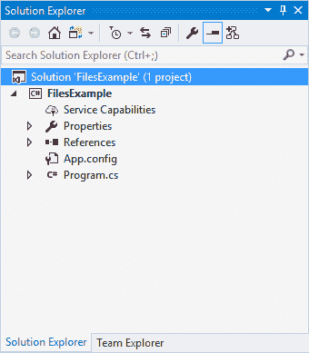
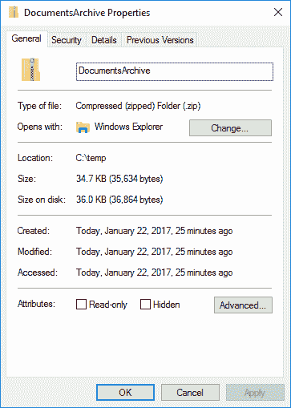
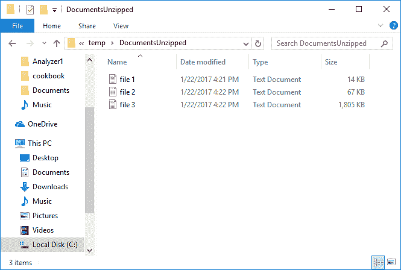
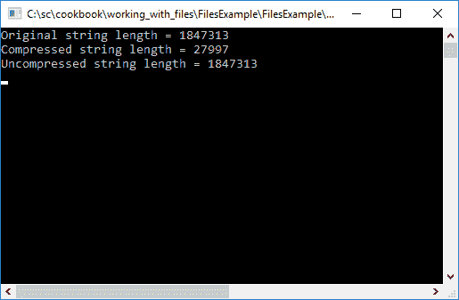
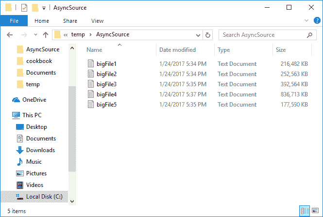
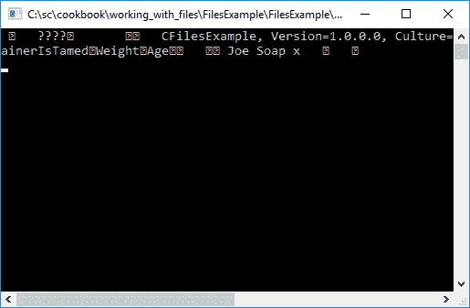
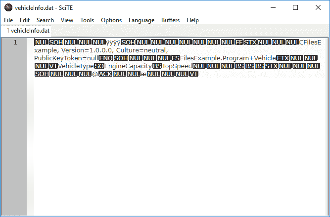

# 第六章：处理文件、流和序列化

处理文件、流和序列化是作为开发人员您将多次进行的工作。创建导入文件，将数据导出到文件，保存应用程序状态，使用文件定义构建文件以及许多其他场景在您的职业生涯中的某个时刻都会出现。在本章中，我们将看到以下内容：

+   创建和提取 ZIP 存档

+   内存流压缩和解压缩

+   异步和等待文件处理

+   如何使自定义类型可序列化

+   使用 ISerializable 进行自定义序列化到 FileStream

+   使用 XmlSerializer

+   JSON 序列化器

# 介绍

能够处理文件肯定会让您作为开发人员具有优势。如今，开发人员可以使用许多用于处理文件的框架，以至于人们往往会忘记一些您想要的功能已经包含在.NET Framework 中。让我们看看我们可以用文件做些什么。

如果您发现自己需要在 ASP.NET 应用程序中创建 Excel 文件，请查看 CodePlex 上提供的出色 EPPlus .NET 库。在撰写本文时，URL 为：[`epplus.codeplex.com/`](https://epplus.codeplex.com/)，并且根据 GNU **图书馆通用公共许可证**（**LGPL**）许可。还考虑捐赠给 EPPlus。这些人编写了一个非常易于使用和文档完善的令人难以置信的库。

2017 年 3 月 31 日宣布，CodePlex 将在 2017 年 12 月 15 日完全关闭。根据 EPPlus CodePlex 页面上的 DISCUSSIONS 标签（[`epplus.codeplex.com/discussions/662424`](https://epplus.codeplex.com/discussions/662424)），源代码将在 CodePlex 在 2017 年 10 月进入只读模式之前移至 GitHub。

# 创建和提取 ZIP 存档

你可以做的最基本的事情之一是处理 ZIP 文件。 .NET Framework 在提供这个功能方面做得非常好。您可能需要在需要上传多个文件到网络共享的应用程序中提供 ZIP 功能。能够将多个文件压缩成一个 ZIP 文件并上传，比起上传多个较小的文件更有意义。

# 准备工作

执行以下步骤：

1.  创建一个控制台应用程序，将其命名为`FilesExample`：



1.  右键单击“引用”节点，从上下文菜单中选择“添加引用…”：


1.  在“引用管理器”中，搜索`compression`一词。将 System.IO.Compression 和 System.IO.Compression.FileSystem 引用添加到您的项目中，然后单击“确定”按钮。

在撰写本文时，引用管理器中有 System.IO.Compression 版本 4.1.0.0 和 System.IO.Compression 版本 4.0.0.0 可用。我创建的示例只使用了版本 4.1.0.0。


1.  在添加了引用之后，您的解决方案应如下所示：


1.  在您的`temp`文件夹中创建一个名为`Documents`的文件夹：


1.  在这个文件夹里，创建几个不同大小的文件：


您现在可以开始编写一些代码了。

# 如何做…

1.  将以下`using`语句添加到您的`Program.cs`文件的顶部：

```cs
        using System.IO;
        using System.IO.Compression;

```

1.  创建一个名为`ZipIt()`的方法，并将代码添加到其中以压缩`Documents`目录。代码非常简单易懂。然而，我想强调一下`CreateFromDirectory()`方法的使用。请注意，我们已将压缩级别设置为`CompressionLevel.Optimal`，并将`includeBaseDirectory`参数设置为`false`：

```cs
        private static void ZipIt(string path)
        {
          string sourceDirectory = $"{path}Documents";

          if (Directory.Exists(sourceDirectory))
          {
            string archiveName = $"{path}DocumentsArchive.zip";
            ZipFile.CreateFromDirectory(sourceDirectory, archiveName, 
                                        CompressionLevel.Optimal, false);
          } 
        }

```

1.  运行控制台应用程序，再次查看`temp`文件夹。您将看到创建了以下 ZIP 文件：


1.  查看 ZIP 文件的内容将显示`Documents`文件夹中包含的文件：


1.  查看 ZIP 文件的属性，您将看到它已经压缩到 36 KB：



1.  解压 ZIP 文件同样很容易。创建一个名为`UnZipIt()`的方法，并将路径传递给`temp`文件夹。然后，指定要解压缩文件的目录，并设置名为`destinationDirectory`的变量。调用`ExtractToDirectory()`方法，并将`archiveName`和`destinationDirectory`变量作为参数传递：

```cs
        private static void UnZipIt(string path)
        {
          string destinationDirectory = $"{path}DocumentsUnzipped";

          if (Directory.Exists(path))
          {
            string archiveName = $"{path}DocumentsArchive.zip";
            ZipFile.ExtractToDirectory(archiveName, destinationDirectory);
          }
        }

```

1.  运行您的控制台应用程序并查看输出文件夹：


1.  在`DocumentsUnzipped`文件夹中查看提取的文件，您将看到我们开始时的原始文件：



# 工作原理...

在.NET 中使用 ZIP 文件真的非常简单。.NET Framework 为诸如创建存档等繁琐任务做了很多重活。它还允许开发人员在不必“自己动手”创建存档方法的情况下保持一定的代码标准。

# 内存流压缩和解压

有时，您需要对大量文本进行内存压缩。您可能希望将其写入文件或数据库。也许您需要将文本作为附件发送电子邮件，另一个系统将接收并解压缩。无论原因如何，内存压缩和解压缩都是非常有用的功能。最好的方法是使用扩展方法。如果您现在还没有想明白，我非常喜欢使用扩展方法。

# 准备工作

代码非常简单。您不需要太多准备工作。只需确保在您的项目中包含以下`using`语句，并且在以下路径`C:\temp\Documents\file 3.txt`有一个名为`file 3.txt`的包含文本的文件。您可以继续使用前面一篇文章中创建的控制台应用程序。

```cs
using System.IO.Compression;
using System.Text;
using static System.Console;

```

# 如何做...

1.  创建一个名为`ExtensionMethods`的类，其中包含两个扩展方法，名为`CompressStream()`和`DecompressStream()`。这两个扩展方法都将作用于字节数组并返回一个字节数组：

```cs
        public static class ExtensionMethods
        {
          public static byte[] CompressStream(this byte[] originalSource)
          {

          }

          public static byte[] DecompressStream(this byte[] originalSource)
          {

          }
        }

```

1.  查看`CompressStream()`扩展方法，您需要创建一个新的`MemoryStream`以返回给调用代码。利用`using`语句，以便在对象移出范围时正确处理对象的释放。接下来，添加一个`new GZipStream`对象，它将压缩我们提供的内容到`outStream`对象中。您会注意到，`CompressionMode.Compress`作为参数传递给`GZipStream`对象。最后，将`originalSource`写入`GZipStream`对象，对其进行压缩并返回给调用方法：

```cs
        public static byte[] CompressStream(this byte[] originalSource)
        {
          using (var outStream = new MemoryStream())
          {
            using (var gzip = new GZipStream(outStream, 
                   CompressionMode.Compress))
            {
              gzip.Write(originalSource, 0, originalSource.Length);
            }

            return outStream.ToArray();
          } 
        }

```

1.  接下来，将注意力转向`DecompressStream()`扩展方法。这个过程实际上非常简单。从`originalSource`创建一个新的`MemoryStream`，并将其命名为`sourceStream`。创建另一个名为`outStream`的`MemoryStream`以返回给调用代码。接下来，创建一个新的`GZipStream`对象，并将其传递给`sourceStream`，同时设置`CompressionMode.Decompress`值。将解压缩的流复制到`outStream`并返回给调用代码：

```cs
        public static byte[] DecompressStream(this byte[] originalSource)
        {
          using (var sourceStream = new MemoryStream(originalSource))
          {
            using (var outStream = new MemoryStream())
            {
              using (var gzip = new GZipStream(sourceStream, 
                     CompressionMode.Decompress))
             {
               gzip.CopyTo(outStream); 
             }
             return outStream.ToArray();
           }
         }
       }

```

1.  我创建了一个名为`InMemCompressDecompress()`的方法，以说明内存压缩和解压的用法。我正在读取`C:tempDocumentsfile 3.txt`文件的内容到一个名为`inputString`的变量中。然后，我使用默认编码来获取字节，原始长度，压缩长度和解压长度。如果您想要恢复原始文本，请确保在您的代码中包含`newString = Encoding.Default.GetString(newFromCompressed);`这一行，并将其输出到控制台窗口。不过，需要警告一下：如果您读取了大量文本，将其显示在控制台窗口可能没有太多意义。最好将其写入文件，以检查文本是否与压缩前的文本相同：

```cs
        private static void InMemCompressDecompress()
        {
          string largeFile = @"C:\temp\Documents\file 3.txt";

          string inputString = File.ReadAllText(largeFile);
          var bytes = Encoding.Default.GetBytes(inputString);

          var originalLength = bytes.Length;
          var compressed = bytes.CompressStream();
          var compressedLength = compressed.Length;

          var newFromCompressed = compressed.DecompressStream();
          var newFromCompressedLength = newFromCompressed.Length;

          WriteLine($"Original string length = {originalLength}");
          WriteLine($"Compressed string length = {compressedLength}");
          WriteLine($"Uncompressed string length = 
                    {newFromCompressedLength}");

          // To get the original Test back, call this
          //var newString = Encoding.Default.GetString(newFromCompressed);
        }

```

1.  确保在正确的目录中有一个名为`File 3.txt`的文件。还要确保文件包含一些文本。您可以看到，我要在内存中压缩的文件大小约为 1.8 MB：


1.  运行控制台应用程序将显示文件的原始长度，压缩长度，然后解压长度。预期的是，解压长度与原始字符串长度相同：



# 工作原理...

内存压缩和解压允许开发人员在处理包含大量数据的对象时使用即时压缩和解压。例如，当您需要将日志信息读取和写入数据库时，这可能非常有用。这是.NET Framework 如何为开发人员提供了构建世界一流解决方案的完美平台的另一个例子。

# 异步和等待文件处理

使用异步和等待，开发人员可以在执行诸如文件处理之类的密集任务时保持其应用程序完全响应。这使得使用异步代码成为一个完美的选择。如果您有几个需要复制的大文件，异步和等待方法将是保持表单响应的完美解决方案。

# 准备工作

确保已将以下`using`语句添加到代码文件的顶部：

```cs
using System.IO;
using System.Threading;

```

为了使异步代码工作，我们需要包含线程命名空间。

# 操作步骤...

1.  创建名为`AsyncDestination`和`AsyncSource`的两个文件夹：


1.  在`AsyncSource`文件夹中，添加一些要处理的大文件：



1.  创建一个新的 WinForms 应用程序，并向表单添加一个表单时间控件，一个按钮和一个名为`lblTimer`的标签。将计时器命名为 asyncTimer，并将其间隔设置为`1000`毫秒（1 秒）：


1.  在构造函数上面的代码中，将`CancellationTokenSource`对象和`elapsedTime`变量添加到`Form1`类中：

```cs
        CancellationTokenSource cts;
        int elapsedTime = 0;

```

1.  在构造函数中，设置计时器标签文本：

```cs
        public Form1()
        {
          InitializeComponent();

          lblTimer.Text = "Timer Stopped";
        }

```

1.  在按钮点击事件处理程序中，添加两个 if 条件。第一个条件将在首次点击按钮时运行。第二个条件将在再次点击按钮以取消进程时运行。请注意，这是`btnCopyFileAsync`的`async`事件处理程序：

```cs
        private async void btnCopyFilesAsync_Click(
          object sender, EventArgs e)
        {
          if (btnCopyFilesAsync.Text.Equals("Copy Files Async"))
          {

          }

          if (btnCopyFilesAsync.Text.Equals("Cancel Async Copy"))
          {

          }
        }

```

1.  为计时器添加一个`Tick`事件，并更新计时器标签文本：

```cs
        private void asyncTimer_Tick(object sender, EventArgs e)
        {
          lblTimer.Text = $"Duration = {elapsedTime += 1} seconds";
        }

```

1.  在按钮点击事件中查看第二个`if`条件。将按钮文本设置回原来的内容，然后调用`CancellationTokenSource`对象的`Cancel()`方法：

```cs
        if (btnCopyFilesAsync.Text.Equals("Cancel Async Copy"))
        {
          btnCopyFilesAsync.Text = "Copy Files Async";
          cts.Cancel();

```

1.  在第一个`if`语句中，设置源和目标目录。还要更新按钮文本，以便再次点击时运行取消逻辑。实例化`CancellationTokenSource`，将`elapsedTime`变量设置为`0`，然后启动计时器。现在我们可以开始枚举源文件夹中的文件，并将结果存储在`fileEntries`变量中：

```cs
        if (btnCopyFilesAsync.Text.Equals("Copy Files Async"))
        {
          string sourceDirectory = @"C:\temp\AsyncSource\";
          string destinationDirectory = @"C:\temp\AsyncDestination\";
          btnCopyFilesAsync.Text = "Cancel Async Copy";
          cts = new CancellationTokenSource();
          elapsedTime = 0;
          asyncTimer.Start();

          IEnumerable<string> fileEntries = Directory
            .EnumerateFiles(sourceDirectory);
        }

```

1.  首先迭代源文件夹中的文件，并异步将文件从源文件夹复制到目标文件夹。这可以在代码行`await sfs.CopyToAsync(dfs, 81920, cts.Token);`中看到。值`81920`只是缓冲区大小，取消令牌`cts.Token`被传递给异步方法：

```cs
        foreach (string sourceFile in fileEntries)
        {
          using (FileStream sfs = File.Open(sourceFile, FileMode.Open))
          {
            string destinationFilePath = $"{destinationDirectory}{
              Path.GetFileName(sourceFile)}";
            using (FileStream dfs = File.Create(destinationFilePath))
            {
              try
              {
                await sfs.CopyToAsync(dfs, 81920, cts.Token);
              }
              catch (OperationCanceledException ex)
              {
                asyncTimer.Stop();
                lblTimer.Text = $"Cancelled after {elapsedTime} seconds";
              }
            }
          }
        }

```

1.  最后，如果令牌未被取消，停止计时器并更新计时器标签：

```cs
        if (!cts.IsCancellationRequested)
        {
          asyncTimer.Stop();
          lblTimer.Text = $"Completed in {elapsedTime} seconds";
        }

```

1.  将所有代码放在一起，您将看到这些如何完美地配合在一起：

```cs
        private async void btnCopyFilesAsync_Click(object sender, 
          EventArgs e)
        {
          if (btnCopyFilesAsync.Text.Equals("Copy Files Async"))
          {
            string sourceDirectory = @"C:\temp\AsyncSource\";
            string destinationDirectory = @"C:\temp\AsyncDestination\";
            btnCopyFilesAsync.Text = "Cancel Async Copy";
            cts = new CancellationTokenSource();
            elapsedTime = 0;
            asyncTimer.Start();

            IEnumerable<string> fileEntries = Directory
              .EnumerateFiles(sourceDirectory);

            //foreach (string sourceFile in Directory
                       .EnumerateFiles(sourceDirectory))
            foreach (string sourceFile in fileEntries)
            {
              using (FileStream sfs = File.Open(sourceFile, FileMode.Open))
              {
                string destinationFilePath = $"{destinationDirectory}
                {Path.GetFileName(sourceFile)}";
                using (FileStream dfs = File.Create(destinationFilePath))
                {
                  try
                  {
                    await sfs.CopyToAsync(dfs, 81920, cts.Token);
                  }
                  catch (OperationCanceledException ex)
                  {
                    asyncTimer.Stop();
                    lblTimer.Text = $"Cancelled after {elapsedTime}
                      seconds";
                  }
                }
              }
            }

            if (!cts.IsCancellationRequested)
            {
              asyncTimer.Stop();
              lblTimer.Text = $"Completed in {elapsedTime} seconds";
            }
          }
          if (btnCopyFilesAsync.Text.Equals("Cancel Async Copy"))
          {
            btnCopyFilesAsync.Text = "Copy Files Async";
            cts.Cancel();
          }
        }

```

# 工作原理...

当 Windows 窗体首次打开时，您会看到计时器标签默认为 Timer Stopped。单击“复制文件异步”按钮以开始复制过程：


当应用程序完成处理时，您会看到大文件已被复制到目标文件夹：


在复制过程运行时，您的 Windows 窗体保持活动和响应。计时器标签也继续计数。通常，对于这样的过程，窗体将无响应：


当文件复制完成时，计时器标签将显示异步复制过程的持续时间。一个有趣的实验是玩弄这段代码，看看你能够优化它以提高复制速度：


Windows 窗体不仅保持响应，而且还允许您在任何时候取消进程。当单击“复制文件异步”按钮时，文本将更改为“取消异步复制”：


单击取消按钮或将`CancellationTokenSource`对象设置为取消状态，这将停止异步文件复制过程。

# 如何使自定义类型可序列化？

序列化是将对象的状态转换为一组字节的过程（根据使用的序列化类型，可以是 XML、二进制、JSON），然后可以将其保存在流中（考虑`MemoryStream`或`FileStream`）或通过 WCF 或 Web API 进行传输。使自定义类型可序列化意味着您可以通过添加`System.SerializableAttribute`将序列化应用于自定义类型。以下是自定义类型的示例：

+   类和泛型类

+   结构体

+   枚举

序列化的一个现实世界的例子可能是为特定对象创建一个恢复机制。想象一个工作流场景。在某个时间点，工作流的状态需要被持久化。您可以序列化该对象的状态并将其存储在数据库中。当工作流需要在将来的某个时间点继续时，您可以从数据库中读取对象并将其反序列化为与其在被持久化到数据库之前完全相同的状态。

尝试序列化一个不可序列化的类型将导致您的代码抛出`SerializationException`。

# 准备就绪

如果您从控制台应用程序运行此示例，请确保控制台应用程序通过在`Program.cs`文件顶部添加`using System`来导入`System`命名空间。还要确保添加`using System.Runtime.Serialization.Formatters.Binary`。

# 如何做...

1.  首先添加一个名为`Cat`的抽象类。这个类简单地定义了`Weight`和`Age`的字段。请注意，为了使您的类可序列化，您需要向其添加`[Serializable]`属性。

```cs
        [Serializable]
        public abstract class Cat
        {
          // fields
          public int Weight;
          public int Age; 
        }

```

1.  接下来，创建一个名为`Tiger`的类，它是从`Cat`类派生的。请注意，`Tiger`类也必须添加`[Serializable]`属性。这是因为序列化不是从基类继承的。每个派生类必须自己实现序列化：

```cs
        [Serializable]
        public class Tiger : Cat
        {
          public string Trainer;
          public bool IsTamed;
        }

```

1.  接下来，我们需要创建一个序列化`Tiger`类的方法。创建一个`Tiger`类型的新对象并为其设置一些值。然后，我们使用`BinaryFormatter`将`Tiger`类序列化为`stream`并将其返回给调用代码：

```cs
        private static Stream SerializeTiger()
        {
          Tiger tiger = new Tiger();
          tiger.Age = 12;
          tiger.IsTamed = false;
          tiger.Trainer = "Joe Soap";
          tiger.Weight = 120;

          MemoryStream stream = new MemoryStream();
          BinaryFormatter fmt = new BinaryFormatter();
          fmt.Serialize(stream, tiger);
          stream.Position = 0;
          return stream;
        }

```

1.  反序列化更容易。我们创建一个`DeserializeTiger`方法并将`stream`传递给它。然后我们再次使用`BinaryFormatter`将`stream`反序列化为`Tiger`类型的对象：

```cs
        private static void DeserializeTiger(Stream stream)
        {
          stream.Position = 0;
          BinaryFormatter fmt = new BinaryFormatter();
          Tiger tiger = (Tiger)fmt.Deserialize(stream);
        }

```

1.  要查看序列化和反序列化的结果，请从`SerializeTiger()`方法中读取结果到一个新的`Stream`并在控制台窗口中显示它。然后，调用`DeserializeTiger()`方法：

```cs
        Stream str = SerializeTiger();
        WriteLine(new StreamReader(str).ReadToEnd());
        DeserializeTiger(str);

```

# 它是如何工作的...

当序列化的数据写入控制台窗口时，您将看到一些标识信息。但大部分看起来会混乱。这是因为显示的是二进制序列化数据。



当这些序列化的数据被反序列化时，它被转换回`Tiger`类型的对象。您可以清楚地看到序列化对象中原始字段的值是可见的。


# 使用 ISerializable 进行自定义序列化到 FileStream

如果您想更好地控制序列化的内容，应该在对象上实现`ISerializable`。这使开发人员完全控制序列化的内容。请注意，您仍然需要在对象上添加`[ISerializable]`属性。最后，开发人员还需要实现一个反序列化构造函数。但是，使用`ISerializable`确实有一个注意事项。根据 MSDN 的说法，您的对象与.NET Framework 的新版本和序列化框架的任何改进的向前兼容性可能不适用于您的对象。您还需要在对象的所有派生类型上实现`ISerializable`。

# 准备工作

我们将创建一个新的类，希望使用`ISerializable`来控制自己的序列化。确保您的应用程序已经在`using`语句中添加了`using System.Runtime.Serialization;`。

# 如何做...

1.  创建一个名为`Vehicle`的类。您会注意到这个类实现了`ISerializable`，同时还有`[Serializable]`属性。您必须这样做，以便公共语言运行时可以识别这个类是可序列化的：

```cs
        [Serializable]
        public class Vehicle : ISerializable
        {

        }

```

1.  对于这个类，添加以下字段和构造函数：

```cs
        // Primitive fields
        public int VehicleType;
        public int EngineCapacity;
        public int TopSpeed;

        public Vehicle()
        {

        }

```

1.  当您在`Vehicle`类上实现`ISerilizable`时，Visual Studio 会提醒您在类内部未实现`ISerializable`接口。通过点击接口名称旁边的灯泡并接受更正来添加实现。Visual Studio 现在将在您的类内部添加`GetObjectData()`方法。请注意，如果您不在方法中添加一些代码，该方法将添加一个`NotImplementedException`。在这里添加非常基本的代码，只需将字段的值添加到`SerializationInfo`对象中：

```cs
        public void GetObjectData(SerializationInfo info, 
          StreamingContext context)
        {
          info.AddValue("VehicleType", VehicleType);
          info.AddValue("EngineCapacity", EngineCapacity);
          info.AddValue("TopSpeed", TopSpeed);
        }

```

1.  如前所述，我们需要添加反序列化构造函数，用于反序列化字段。这部分需要手动添加：

```cs
        // Deserialization constructor
        protected Vehicle(SerializationInfo info, StreamingContext context)
        {
          VehicleType = info.GetInt32("VehicleType");
          EngineCapacity = info.GetInt32("EngineCapacity");
          TopSpeed = info.GetInt32("TopSpeed");
        }

```

1.  在添加所有代码后，您的类应该如下所示：

```cs
        [Serializable]
        public class Vehicle : ISerializable
        {
          // Primitive fields
          public int VehicleType;
          public int EngineCapacity;
          public int TopSpeed;

          public Vehicle()
          {

          }
          public void GetObjectData(SerializationInfo info, 
            StreamingContext context)
          {
            info.AddValue("VehicleType", VehicleType);
            info.AddValue("EngineCapacity", EngineCapacity);
            info.AddValue("TopSpeed", TopSpeed);
          }

          // Deserialization constructor
          protected Vehicle(SerializationInfo info, 
            StreamingContext context)
          {
            VehicleType = info.GetInt32("VehicleType");
            EngineCapacity = info.GetInt32("EngineCapacity");
            TopSpeed = info.GetInt32("TopSpeed");
          }
        }

```

1.  我们只需将序列化的类写入文件中。在本示例中，只需为文件硬编码一个输出路径。接下来，创建`Vehicle`类的一个新实例，并为字段设置一些值：

```cs
        string serializationPath = @"C:\temp\vehicleInfo.dat";
        Vehicle vehicle = new Vehicle();
        vehicle.VehicleType = (int)VehicleTypes.Car;
        vehicle.EngineCapacity = 1600;
        vehicle.TopSpeed = 230;

        if (File.Exists(serializationPath))
          File.Delete(serializationPath);

```

1.  还要确保在类的顶部添加`VehicleTypes`枚举器：

```cs
        public enum VehicleTypes
        {
          Car = 1,
          SUV = 2,
          Utility = 3
        }

```

1.  然后添加代码，将类序列化到硬编码路径中的文件中。为此，我们添加一个`FileStream`和一个`BinaryFormatter`对象，将`vehicle`序列化到文件中：

```cs
        using (FileStream stream = new FileStream(serializationPath, 
          FileMode.Create))
        {
          BinaryFormatter fmter = new BinaryFormatter();
          fmter.Serialize(stream, vehicle);
        }

```

1.  最后，我们添加代码来读取包含序列化数据的文件，并创建包含`Vehicle`状态的`Vehicle`对象。虽然反序列化代码立即在序列化代码之后运行，但请注意，这只是为了演示目的。`Vehicle`的反序列化可以在将来的任何时间点通过从文件中读取来进行：

```cs
        using (FileStream stream = new FileStream(serializationPath, 
          FileMode.Open))
        {
          BinaryFormatter fmter = new BinaryFormatter();
          Vehicle deserializedVehicle = (Vehicle)fmter.Deserialize(stream);
        }

```

# 工作原理...

在运行代码后，您会发现`vehicleInfo.dat`文件已经在您指定的路径创建了：


在文本编辑器中打开文件将显示序列化信息。正如您可能注意到的那样，一些类信息仍然可见：



如果我们在反序列化代码中添加断点并检查创建的`deserializedVehicle`对象，您会看到`Vehicle`状态已经*重新生成*到序列化之前的状态：


# 使用 XmlSerializer

从名称上您可能猜到，`XmlSerializer`将数据序列化为 XML。它可以更好地控制序列化数据的 XML 结构。使用此序列化程序的典型实际示例是与 XML Web 服务保持兼容性。它也是在使用某种消息队列（如 MSMQ 或 RabbitMQ）传输数据时使用的一种简单介质。

`XmlSerializer`的默认行为是序列化公共字段和属性。使用`System.Xml.Serialization`命名空间中的属性，您可以控制 XML 的结构。

# 准备工作

由于我们将在此示例中使用`List<>`，请确保已添加`using System.Collections.Generic;`命名空间。我们还希望更多地控制 XML 的结构，因此还包括`using System.Xml.Serialization;`命名空间，以便我们可以使用适当的属性。最后，对于 LINQ 查询，您需要添加`using System.Linq;`命名空间。

# 如何做...

1.  首先创建一个`Student`类。

```cs
        public class Student
        {
          public string StudentName;
          public double SubjectMark;
        }

```

1.  接下来，创建一个名为`FundamentalProgramming`的主题类。已经对此类的字段应用了几个属性：

+   `XmlRoot`

+   `XmlElement`

+   `XmlIgnore`

+   `XmlAttribute`

+   `XmlArray`

我们可以看到`XmlRoot`属性指定了`ElementName`称为`FundamentalsOfProgramming`。因此，此属性定义了生成的 XML 的根。`XmlElement`指定了一个名为`LecturerFullName`的元素，而不是`Lecturer`。`XmlIgnore`属性将导致`XmlSerializer`在序列化期间忽略此字段，而`XmlAttribute`将在生成的 XML 的根元素上创建一个属性。最后，我们使用`XmlArray`属性序列化`List<Student>`集合：

```cs
        [XmlRoot(ElementName = "FundamentalsOfProgramming", 
          Namespace = "http://serialization")]
        public class FundamentalProgramming
        {
          [XmlElement(ElementName = "LecturerFullName", 
            DataType = "string")]
          public string Lecturer;

          [XmlIgnore]
          public double ClassAverage;

          [XmlAttribute]
          public string RoomNumber;

          [XmlArray(ElementName = "StudentsInClass", 
            Namespace = "http://serialization")]
          public List<Student> Students; 
        }

```

1.  在调用代码中，设置`Student`对象并将它们添加到`List<Student>`对象`students`中：

```cs
        string serializationPath = @"C:tempclassInfo.xml";
        Student studentA = new Student()
        {
          StudentName = "John Smith"
          , SubjectMark = 86.4
        };
        Student studentB = new Student()
        {
          StudentName = "Jane Smith"
          , SubjectMark = 67.3
        };
        List<Student> students = new List<Student>();
        students.Add(studentA);
        students.Add(studentB);

```

1.  现在我们创建`FundementalProgramming`类并填充字段。`ClassAverage`被忽略的原因是因为我们将始终计算此字段的值：

```cs
        FundamentalProgramming subject = new FundamentalProgramming();
        subject.Lecturer = "Prof. Johan van Niekerk";
        subject.RoomNumber = "Lecture Auditorium A121";
        subject.Students = students;
        subject.ClassAverage = (students.Sum(mark => mark.SubjectMark) / 
          students.Count());

```

1.  添加以下代码以序列化`subject`对象，注意将对象类型传递给`XmlSerializer`作为`typeof(FundamentalProgramming)`：

```cs
        using (FileStream stream = new FileStream(serializationPath, 
          FileMode.Create))
        {
          XmlSerializer xmlSer = new XmlSerializer(typeof(
            FundamentalProgramming));
          xmlSer.Serialize(stream, subject);
        }

```

1.  最后，添加代码将 XML 反序列化回`FundamentalProgramming`对象：

```cs
        using (FileStream stream = new FileStream(serializationPath, 
          FileMode.Open))
        {
          XmlSerializer xmlSer = new XmlSerializer(typeof(
            FundamentalProgramming));
          FundamentalProgramming fndProg = (FundamentalProgramming)
            xmlSer.Deserialize(stream);
        }

```

# 它是如何工作的...

当您运行控制台应用程序时，您会发现它在代码中指定的路径创建了一个 XML 文档。查看此 XML 文档，您会发现 XML 元素的定义与我们在类中使用属性指定的完全相同。请注意，`FundamentalsOfProgramming`根元素将`RoomNumber`字段作为属性。字段`ClassAverage`已被忽略，并且不在 XML 中。最后，您可以看到`List<Student>`对象已经很好地序列化到 XML 文件中。


在对 XML 进行反序列化时，您会注意到序列化的值被显示。但是`ClassAverage`没有值，因为它从未被序列化。


# JSON 序列化器

与`BinaryFormatter`不同，JSON 序列化以人类可读的格式序列化数据。使用`XmlSerializer`也会产生人类可读的 XML，但是 JSON 序列化产生的数据大小比`XmlSerializer`小。JSON 主要用于交换数据，并且可以与许多不同的编程语言一起使用（就像 XML 一样）。

# 准备工作

从工具菜单中，转到 NuGet 包管理器，单击“解决方案的 NuGet 包管理器...”菜单。在“浏览”选项卡中，搜索 Newtonsoft.Json 并安装 NuGet 包。Newtonsoft.Json 是.NET 的高性能 JSON 框架。安装后，您将看到已将 Newtonsoft.Json 引用添加到您的项目中。

在类的`using`语句中，添加以下命名空间`using Newtonsoft.Json;`和`using Newtonsoft.Json.Linq;`到您的代码中。

# 如何做...

1.  首先创建我们之前用于`XmlSerializer`的`FundamentalProgramming`和`Student`类。这次，删除所有属性以生成以下代码：

```cs
        public class FundamentalProgramming
        {
          public string Lecturer;
          public double ClassAverage;
          public string RoomNumber;
          public List<Student> Students;
        }

        public class Student
        {
          public string StudentName;
          public double SubjectMark;
        }

```

1.  在调用代码中，设置`Student`对象，如以前所述，并将它们添加到`List<Student>`中：

```cs
        string serializationPath = @"C:\temp\classInfo.txt";
        Student studentA = new Student()
        {
          StudentName = "John Smith"
          , SubjectMark = 86.4
        };
        Student studentB = new Student()
        {
          StudentName = "Jane Smith"
          , SubjectMark = 67.3
        };
        List<Student> students = new List<Student>();
        students.Add(studentA);
        students.Add(studentB);

```

1.  创建类型为`FundamentalProgramming`的`subject`对象，并为字段分配值：

```cs
        FundamentalProgramming subject = new FundamentalProgramming();
        subject.Lecturer = "Prof. Johan van Niekerk";
        subject.RoomNumber = "Lecture Auditorium A121";
        subject.Students = students;
        subject.ClassAverage = (students.Sum(mark => mark.SubjectMark) / 
          students.Count());
        WriteLine($"Calculated class average = {subject.ClassAverage}");

```

1.  向您的代码添加一个`JsonSerializer`对象，并将格式设置为缩进。使用`JsonWriter`，将`subject`序列化到`serializationPath`文件`classInfo.txt`中：

```cs
        JsonSerializer json = new JsonSerializer();
        json.Formatting = Formatting.Indented;
        using (StreamWriter sw = new StreamWriter(serializationPath))
        {
          using (JsonWriter wr = new JsonTextWriter(sw))
          {
            json.Serialize(wr, subject);
          }
        }
        WriteLine("Serialized to file using JSON Serializer");

```

1.  代码的下一部分将从之前创建的`classInfo.txt`文件中读取文本，并创建一个名为`jobj`的`JObject`，该对象使用`Newtonsoft.Json.Linq`命名空间来查询 JSON 对象。使用`JObject`来解析从文件返回的字符串。这就是使用`Newtonsoft.Json.Linq`命名空间的强大之处。我可以使用 LINQ 查询`jobj`对象来返回学生的分数并计算平均值：

```cs
        using (StreamReader sr = new StreamReader(serializationPath))
        {
          string jsonString = sr.ReadToEnd();
          WriteLine("JSON String Read from file");
          JObject jobj = JObject.Parse(jsonString);
          IList<double> subjectMarks = jobj["Students"].Select(
            m => (double)m["SubjectMark"]).ToList();
          var ave = subjectMarks.Sum() / subjectMarks.Count();
          WriteLine($"Calculated class average using JObject = {ave}");
        }

```

1.  如果需要对 JSON 对象进行反序列化，反序列化逻辑非常容易实现。我们使用`JsonReader`从文件中获取文本并进行反序列化：

```cs
        using (StreamReader sr = new StreamReader(serializationPath))
        {
          using (JsonReader jr = new JsonTextReader(sr))
          {
            FundamentalProgramming funProg = json.Deserialize
              <FundamentalProgramming>(jr);
          }
        }

```

# 它是如何工作的...

运行控制台应用程序后，您可以查看 JSON 序列化器创建的文件。


班级平均值计算的结果和对 JSON 对象的 LINQ 查询结果完全相同。


最后，可以在代码中添加断点并检查`funProg`对象，从文件中的 JSON 文本中反序列化的对象可以看到。如您所见，对象状态与序列化到文件之前的状态相同。


你还记得在本教程开始时我提到过 JSON 产生的数据比 XML 少得多吗？我创建了包含 10,000 名学生的`Student`类，使用 XML 和 JSON 进行了序列化。两个文件大小的比较非常惊人。显然，JSON 产生了一个更小的文件。


