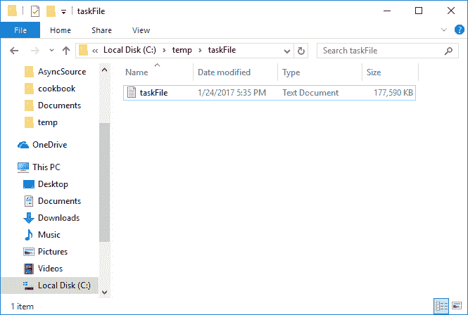

# 第七章：使用异步编程使应用程序响应

本章将向您介绍异步编程。它将涵盖以下内容：

+   异步函数的返回类型

+   在异步编程中处理任务

+   异步编程中的异常处理

# 介绍

异步编程是 C#中的一个令人兴奋的特性。它允许您在主线程上继续程序执行，同时长时间运行的任务完成其执行。当这个长时间运行的任务完成时，来自线程池的一个线程将返回到包含该任务的方法，以便长时间运行的任务可以继续执行。学习和理解异步编程的最佳方法是亲身体验。以下示例将向您说明一些基础知识。

# 异步函数的返回类型

在异步编程中，`async`方法可以具有三种可能的返回类型。它们如下：

+   `void`

+   `Task`

+   `Task<TResult>`

我们将在下一个示例中查看每种返回类型。 

# 准备工作

异步方法中`void`返回类型的用途是什么？通常，`void`与事件处理程序一起使用。只要记住`void`不返回任何内容，因此您无法等待它。因此，如果调用`void`返回类型的异步方法，您的调用代码应能够继续执行代码，而无需等待异步方法完成。

使用返回类型为`Task`的异步方法，您可以利用`await`运算符暂停当前线程的执行，直到调用的异步方法完成。请记住，返回类型为`Task`的异步方法基本上不返回操作数。因此，如果它被编写为同步方法，它将是一个`void`返回类型的方法。这个说法可能令人困惑，但在接下来的示例中将会变得清晰。

最后，具有`return`语句的异步方法具有`TResult`的返回类型。换句话说，如果异步方法返回布尔值，您将创建一个返回类型为`Task<bool>`的异步方法。

让我们从`void`返回类型的异步方法开始。

# 如何做...

1.  在 Visual Studio 中创建一个名为`winformAsync`的新 Windows 表单项目。我们将创建一个新的 Windows 表单应用程序，以便我们可以创建一个按钮点击事件。

1.  在 winformAsync Forms Designer 上，打开工具箱并选择按钮控件，该控件位于所有 Windows Forms 节点下：


1.  将按钮控件拖放到 Form1 设计器上。

1.  选择按钮控件后，双击控件以在代码后台创建点击事件。Visual Studio 将为您插入事件代码：

```cs
      namespace winformAsync 
      { 
          public partial class Form1 : Form 
          { 
              public Form1() 
              { 
                  InitializeComponent(); 
              } 

              private void button1_Click(object sender, EventArgs e) 
              { 

              } 
          } 
      }

```

1.  更改`button1_Click`事件并在点击事件中添加`async`关键字。这是一个`void`返回异步方法的示例：

```cs
      private async void button1_Click(object sender, EventArgs e) 
      { 
      }

```

1.  接下来，创建一个名为`AsyncDemo`的新类：

```cs
      public class AsyncDemo 
      { 
      }

```

1.  要添加到`AsyncDemo`类的下一个方法是异步方法，该方法返回`TResult`（在本例中为布尔值）。此方法只是检查当前年份是否为闰年。然后将布尔值返回给调用代码：

```cs
      async Task<bool> TaskOfTResultReturning_AsyncMethod() 
      { 
          return await Task.FromResult<bool>
          (DateTime.IsLeapYear(DateTime.Now.Year)); 
      }

```

1.  要添加的下一个方法是返回`void`的方法，该方法返回`Task`类型，以便您可以`await`该方法。该方法本身不返回任何结果，使其成为`void`返回方法。但是，为了使用`await`关键字，您需要从这个异步方法返回`Task`类型：

```cs
      async Task TaskReturning_AsyncMethod() 
      { 
          await Task.Delay(5000); 
          Console.WriteLine("5 second delay");     
      }

```

1.  最后，添加一个方法，该方法将调用之前的异步方法并显示闰年检查的结果。您会注意到我们在两个方法调用中都使用了`await`关键字：

```cs
      public async Task LongTask() 
      { 
         bool isLeapYear = await TaskOfTResultReturning_AsyncMethod();    
         Console.WriteLine($"{DateTime.Now.Year} {(isLeapYear ? " is " : 
                           "  is not  ")} a leap year"); 
         await TaskReturning_AsyncMethod(); 
      }

```

1.  在按钮点击事件中，添加以下代码，以异步方式调用长时间运行的任务：

```cs
      private async void button1_Click(object sender, EventArgs e) 
      { 
          Console.WriteLine("Button Clicked"); 
          AsyncDemo oAsync = new AsyncDemo(); 
          await oAsync.LongTask(); 
          Console.WriteLine("Button Click Ended"); 
      }

```

1.  运行应用程序将显示 Windows 表单应用程序：


1.  在单击 button1 按钮之前，请确保输出窗口可见。要执行此操作，请单击“查看”，然后单击“输出”。您也可以按住*Ctrl* + *W* + *O*。


1.  显示输出窗口将允许我们看到我们在`AsyncDemo`类和 Windows 应用程序中添加的`Console.Writeline()`输出。

1.  单击 button1 按钮将在输出窗口中显示输出。在代码执行期间，窗体保持响应：


1.  最后，您还可以在单独的调用中使用`await`运算符。修改`LongTask()`方法中的代码如下：

```cs
      public async Task LongTask() 
      { 
          Task<bool> blnIsLeapYear = TaskOfTResultReturning_AsyncMethod(); 

          for (int i = 0; i <= 10000; i++) 
          { 
              // Do other work that does not rely on 
              // blnIsLeapYear before awaiting 
          } 

          bool isLeapYear = await TaskOfTResultReturning_AsyncMethod();    
          Console.WriteLine($"{DateTime.Now.Year} {(isLeapYear ?      
                            " is " : "  is not  ")} a leap year"); 

          Task taskReturnMethhod = TaskReturning_AsyncMethod(); 

          for (int i = 0; i <= 10000; i++) 
          { 
              // Do other work that does not rely on 
              // taskReturnMethhod before awaiting 
          } 

          await taskReturnMethhod; 
      }

```

# 工作原理...

在前面的代码中，我们看到了`void`返回类型的异步方法，该方法在`button1_Click`事件中使用。我们还创建了一个返回`Task`的方法，该方法不返回任何内容（如果在同步编程中使用，将是`void`），但返回`Task`类型允许我们`await`该方法。最后，我们创建了一个返回`Task<TResult>`的方法，该方法执行任务并将结果返回给调用代码。

# 在异步编程中处理任务

**基于任务的异步模式**（**TAP**）现在是创建异步代码的推荐方法。它在线程池中异步执行，并不在应用程序的主线程上同步执行。它允许我们通过调用`Status`属性来检查任务的状态。

# 准备工作

我们将创建一个任务来读取一个非常大的文本文件。这将通过使用异步`Task`来完成。确保您已将`using System.IO;`命名空间添加到您的 Windows 窗体应用程序中。

# 操作步骤...

1.  创建一个大型文本文件（我们称之为`taskFile.txt`）并将其放在名为`C:\temp\taskFile\`的文件夹中：



1.  在`AsyncDemo`类中，创建一个名为`ReadBigFile()`的方法，该方法返回一个`Task<TResult>`类型，该类型将用于返回从我们的大型文本文件中读取的字节数的整数：

```cs
      public Task<int> ReadBigFile() 
      {     
      }

```

1.  将以下代码添加到打开和读取文件字节的代码中。您将看到我们正在使用`ReadAsync()`方法，该方法异步从流中读取一系列字节，并通过从该流中读取的字节数推进该流的位置。您还会注意到我们正在使用缓冲区来读取这些字节：

```cs
      public Task<int> ReadBigFile() 
      { 
          var bigFile = File.OpenRead(@"C:\temp\taskFile\taskFile.txt"); 
          var bigFileBuffer = new byte[bigFile.Length]; 
          var readBytes = bigFile.ReadAsync(bigFileBuffer, 0,
          (int)bigFile.Length); 

          return readBytes; 
      }

```

您可以期望从`ReadAsync()`方法处理的异常包括`ArgumentNullException`、`ArgumentOutOfRangeException`、`ArgumentException`、`NotSupportedException`、`ObjectDisposedException`和`InvalidOperatorException`。

1.  最后，在`var readBytes = bigFile.ReadAsync(bigFileBuffer, 0, (int)bigFile.Length);`行之后添加最终的代码部分，该行使用 lambda 表达式指定任务需要执行的工作。在这种情况下，它是读取文件中的字节：

```cs
      public Task<int> ReadBigFile() 
      { 
          var bigFile = File.OpenRead(@"C:temptaskFile.txt"); 
          var bigFileBuffer = new byte[bigFile.Length]; 
          var readBytes = bigFile.ReadAsync(bigFileBuffer, 0, 
          (int)bigFile.Length); 
          readBytes.ContinueWith(task => 
          { 
              if (task.Status == TaskStatus.Running) 
                  Console.WriteLine("Running"); 
              else if (task.Status == TaskStatus.RanToCompletion) 
                  Console.WriteLine("RanToCompletion"); 
              else if (task.Status == TaskStatus.Faulted) 
                  Console.WriteLine("Faulted"); 

              bigFile.Dispose(); 
          }); 
          return readBytes; 
      }

```

1.  如果您之前没有这样做，请在 Windows 窗体应用程序的 Forms Designer 中添加一个按钮。在 winformAsync Forms Designer 中，打开工具箱并选择 Button 控件，该控件位于所有 Windows 窗体节点下：


1.  将 Button 控件拖放到 Form1 设计器上：

1.  选择 Button 控件，双击控件以在代码后台创建单击事件。Visual Studio 将为您插入事件代码：

```cs
      namespace winformAsync 
      { 
          public partial class Form1 : Form 
          { 
              public Form1() 
              { 
                  InitializeComponent(); 
              } 

              private void button1_Click(object sender, EventArgs e) 
              { 

              } 
          } 
      }

```

1.  更改`button1_Click`事件并在单击事件中添加`async`关键字。这是一个`void`返回的异步方法的示例：

```cs
      private async void button1_Click(object sender, EventArgs e) 
      { 

      }

```

1.  现在，请确保您添加代码以异步调用`AsyncDemo`类的`ReadBigFile()`方法。记得将方法的结果（即读取的字节数）读入整数变量中：

```cs
      private async void button1_Click(object sender, EventArgs e) 
      { 
          Console.WriteLine("Start file read"); 
          AsyncDemo oAsync = new AsyncDemo(); 
          int readResult = await oAsync.ReadBigFile(); 
          Console.WriteLine("Bytes read = " + readResult); 
      }

```

1.  运行您的应用程序将显示 Windows 窗体应用程序：


1.  在单击 button1 按钮之前，请确保输出窗口可见：


1.  从“视图”菜单中，单击“输出”菜单项，或键入*Ctrl* + *W* + *O*以显示“输出”窗口。这将允许我们查看我们在`AsyncDemo`类和 Windows 应用程序中添加的`Console.Writeline()`输出的内容。

1.  单击 button1 按钮将在输出窗口中显示输出。在代码执行期间，窗体保持响应：


请注意，输出窗口中显示的信息将与屏幕截图不同。这是因为您使用的文件与我的不同。

# 工作原理... 

任务在来自线程池的单独线程上执行。这允许应用程序在处理大文件时保持响应。任务可以以多种方式使用以改进代码。这个示例只是其中之一。

# 异步编程中的异常处理

异步编程中的异常处理一直是一个挑战。特别是在 catch 块中。以下功能（在 C# 6.0 中引入）允许您在异常处理程序的`catch`和`finally`块中编写异步代码。

# 准备工作

应用程序将模拟读取日志文件的操作。假设第三方系统总是在在另一个应用程序中处理日志文件之前备份日志文件。在进行此处理时，日志文件将被删除并重新创建。但是，我们的应用程序需要定期读取此日志文件。因此，我们需要为文件不存在于我们期望的位置的情况做好准备。因此，我们将故意省略主日志文件，以便我们可以强制出现错误。

# 操作步骤...

1.  创建一个文本文件和两个文件夹来包含日志文件。但是，我们只会在`BackupLog`文件夹中创建一个单独的日志文件。将您的文本文件命名为`taskFile.txt`并将其复制到`BackupLog`文件夹中。`MainLog`文件夹将保持空白：


1.  在我们的`AsyncDemo`类中，编写一个方法来读取由`enum`值指定的文件夹中的日志文件：

```cs
      private async Task<int> ReadLog(LogType logType)
      {
         string logFilePath = String.Empty;
         if (logType == LogType.Main)
            logFilePath = @"C:\temp\Log\MainLog\taskFile.txt";
         else if (logType == LogType.Backup)
            logFilePath = @"C:\temp\Log\BackupLog\taskFile.txt";

         string enumName = Enum.GetName(typeof(LogType), (int)logType);

         var bigFile = File.OpenRead(logFilePath);
         var bigFileBuffer = new byte[bigFile.Length];
         var readBytes = bigFile.ReadAsync(bigFileBuffer, 0, 
         (int)bigFile.Length);
         await readBytes.ContinueWith(task =>
         {
            if (task.Status == TaskStatus.RanToCompletion)
               Console.WriteLine($"{enumName} Log RanToCompletion");
            else if (task.Status == TaskStatus.Faulted)
               Console.WriteLine($"{enumName} Log Faulted");

            bigFile.Dispose();
         });
         return await readBytes;
      }

```

1.  创建如下所示的`enum`值：

```cs
      public enum LogType { Main = 0, Backup = 1 }

```

1.  然后，我们将创建一个主`ReadLogFile()`方法，尝试读取主日志文件。由于我们尚未在`MainLog`文件夹中创建日志文件，因此代码将抛出`FileNotFoundException`。然后在`ReadLogFile()`方法的`catch`块中运行异步方法并`await`它（这在以前的 C#版本中是不可能的），将读取的字节返回给调用代码：

```cs
      public async Task<int> ReadLogFile()
      {
         int returnBytes = -1;
         try
         {
            returnBytes = await ReadLog(LogType.Main);
         }
         catch (Exception ex)
         {
            try
            {
               returnBytes = await ReadLog(LogType.Backup);
            }
            catch (Exception)
            {
               throw;
            }
         }
         return returnBytes;
      }

```

1.  如果您之前没有这样做，请在 Windows 窗体应用程序的 Forms Designer 中添加一个按钮。在 winformAsync Forms Designer 中，打开工具箱并选择 Button 控件，该控件位于所有 Windows 窗体节点下：


1.  将 Button 控件拖放到 Form1 设计器上：

1.  选择 Button 控件后，双击控件以在代码后台创建单击事件。Visual Studio 将为您插入事件代码：

```cs
      namespace winformAsync 
      { 
          public partial class Form1 : Form 
          { 
              public Form1() 
              { 
                  InitializeComponent(); 
              } 

              private void button1_Click(object sender, EventArgs e) 
              { 

              } 
          } 
      }

```

1.  更改`button1_Click`事件并在单击事件中添加`async`关键字。这是一个`void`返回异步方法的示例：

```cs
      private async void button1_Click(object sender, EventArgs e) 
      { 

      }

```

1.  接下来，我们将编写代码来创建`AsyncDemo`类的新实例，并尝试读取主日志文件。在实际示例中，此时代码并不知道主日志文件不存在：

```cs
      private async void button1_Click(object sender, EventArgs  e) 
      { 
          Console.WriteLine("Read backup file");
          AsyncDemo oAsync = new AsyncDemo();
          int readResult = await oAsync.ReadLogFile();
          Console.WriteLine("Bytes read = " + readResult);
      }

```

1.  运行应用程序将显示 Windows 窗体应用程序：


1.  在单击 button1 按钮之前，请确保输出窗口可见：


1.  从“视图”菜单中，单击“输出”菜单项，或键入*Ctrl* + *W* + *O*以显示“输出”窗口。这将允许我们查看我们在`AsyncDemo`类和 Windows 应用程序中添加的`Console.Writeline()`输出的内容。

1.  为了模拟文件未找到异常，我们从`MainLog`文件夹中删除了文件。您会看到异常被抛出，`catch`块运行代码来读取备份日志文件：


# 工作原理...

我们可以在`catch`和`finally`块中等待的事实使开发人员拥有更大的灵活性，因为异步结果可以在整个应用程序中一致地等待。正如您从我们编写的代码中可以看到的，一旦异常被抛出，我们就会异步地读取备份文件的读取方法。
