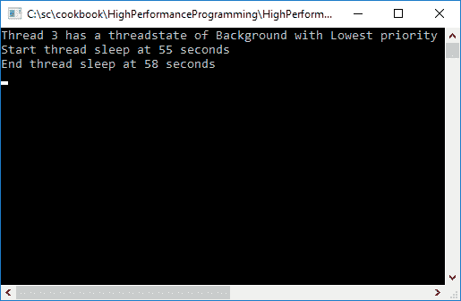
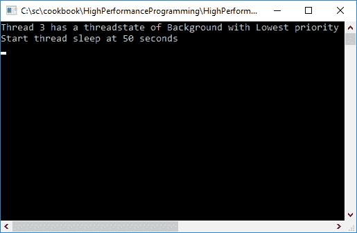
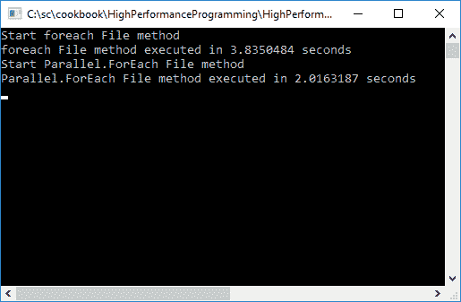
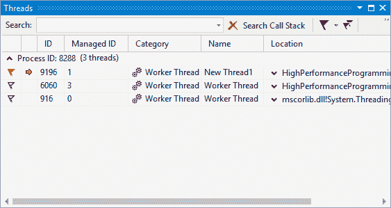
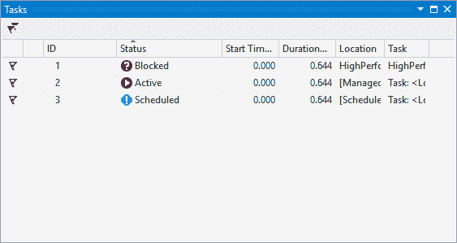

# 第八章：使用并行和多线程进行高性能编程

本章将介绍如何使用多线程和并行编程来提高代码的性能。在本章中，我们将介绍以下内容：

+   创建和中止低优先级后台线程

+   增加最大线程池大小

+   创建多个线程

+   锁定一个线程，直到争用的资源可用

+   使用 Parallel.Invoke 调用方法的并行调用

+   使用并行 foreach 循环

+   取消并行 foreach 循环

+   在并行 foreach 循环中捕获错误

+   调试多个线程

# 介绍

如果您今天在一台计算机上找到了单核 CPU，那可能意味着您站在一个博物馆里。今天的每台新计算机都利用了多核的优势。程序员可以在自己的应用程序中利用这种额外的处理能力。随着应用程序的规模和复杂性不断增长，在许多情况下，它们实际上需要利用多线程。

虽然并非每种情况都适合实现多线程代码逻辑，但了解如何使用多线程来提高应用程序性能是很有益的。本章将带您了解 C#编程中这一激动人心的技术的基础知识。

# 创建和中止低优先级后台线程

我们之所以要专门研究后台线程，是因为默认情况下，由主应用程序线程或`Thread`类构造函数创建的所有线程都是前台线程。那么，前台线程和后台线程有什么区别呢？嗯，后台线程与前台线程相同，唯一的区别是如果所有前台线程终止，后台线程也会停止。如果您的应用程序中有一个进程不能阻止应用程序终止，这是很有用的。换句话说，在应用程序运行时，后台线程必须继续运行。

# 做好准备

我们将创建一个简单的应用程序，将创建的线程定义为后台线程。然后暂停、恢复和中止线程。

# 如何做...

1.  在 Visual Studio 中创建一个新的控制台应用程序。

1.  接下来，在您的控制台应用程序中添加一个名为`Demo`的类。

1.  在`Demo`类中，添加一个名为`DoBackgroundTask()`的方法，使用`public void`修饰符，并将以下控制台输出添加到其中：

```cs
        public void DoBackgroundTask()
        {
          WriteLine($"Thread {Thread.CurrentThread.ManagedThreadId} has
          a threadstate of {Thread.CurrentThread.ThreadState} with
          {Thread.CurrentThread.Priority} priority");
          WriteLine($"Start thread sleep at {DateTime.Now.Second}
                    seconds");
          Thread.Sleep(3000);
          WriteLine($"End thread sleep at {DateTime.Now.Second} seconds");
        }

```

确保您已经在`using`语句中添加了`System.Threading`和`static System.Console`的`using`语句。

1.  在您的控制台应用程序的`void Main`方法中，创建一个`Demo`类的新实例，并将其添加到名为`backgroundThread`的新线程中。将这个新创建的线程定义为后台线程，然后启动它。最后，将线程休眠 5 秒。我们需要这样做是因为我们创建了一个后台线程，它被设置为休眠 3 秒。后台线程不会阻止前台线程终止。因此，如果主应用程序线程（默认情况下是前台线程）在后台线程完成之前终止，应用程序将终止并终止后台线程：

```cs
        static void Main(string[] args)
        {
          Demo oRecipe = new Demo();
          var backgroundThread = new Thread(oRecipe.DoBackgroundTask);
          backgroundThread.IsBackground = true;
          backgroundThread.Start();
          Thread.Sleep(5000);
        }

```

1.  按下*F5*运行您的控制台应用程序。您将看到我们已经创建了一个具有普通优先级的后台线程：


1.  让我们修改我们的线程，并将其优先级降低到低。将以下代码添加到您的控制台应用程序中：

```cs
        backgroundThread.Priority = ThreadPriority.Lowest;

```

这行代码会降低线程优先级：

```cs
        Demo oRecipe = new Demo();
        var backgroundThread = new Thread(oRecipe.DoBackgroundTask);
        backgroundThread.IsBackground = true;
        backgroundThread.Priority = ThreadPriority.Lowest;
        backgroundThread.Start();
        Thread.Sleep(5000);

```

1.  再次运行您的控制台应用程序。这次，您将看到线程优先级已经设置为最低优先级：



1.  返回到您的`DoBackgroundTask()`方法，并在调用`Thread.Sleep(3000);`之前添加`Thread.CurrentThread.Abort();`。这行代码将过早终止后台线程。您的代码应该如下所示：

```cs
        public void DoBackgroundTask()
        {
          WriteLine($"Thread {Thread.CurrentThread.ManagedThreadId} has a
          threadstate of {Thread.CurrentThread.ThreadState} with
          {Thread.CurrentThread.Priority} priority");   
          WriteLine($"Start thread sleep at {DateTime.Now.Second} 
                    seconds");
          Thread.CurrentThread.Abort();
          Thread.Sleep(3000);
          WriteLine($"End thread sleep at {DateTime.Now.Second} seconds");
        }

```

1.  当您运行控制台应用程序时，您会发现在调用`Thread.Sleep`方法之前线程被中止。然而，通常不建议以这种方式中止线程：



# 它是如何工作的...

能够创建后台线程是在与主线程不干扰主应用程序线程的情况下在不同线程上工作的好方法。另一个附加的好处是，后台线程在主应用程序线程完成后立即终止。这个过程确保您的应用程序将正常终止。

# 增加最大线程池大小

.NET 中的线程池位于`System.Threading.ThreadPool`类中。通常，人们对创建自己的线程和使用线程池进行了很多讨论。流行的观点规定，线程池应该用于短暂的工作。这是因为线程池的大小是有限的。系统中有许多其他进程将使用线程池。因此，您不希望您的应用程序占用线程池中的所有线程。

规则是您不能将最大工作线程或完成线程的数量设置为少于计算机上的处理器数量。您也不允许将最大工作线程或完成线程的数量设置为小于最小线程池大小。

# 准备就绪

我们将读取当前计算机上的处理器数量。然后，我们将获取线程池大小的最小和最大允许值，生成在最小和最大线程池大小之间的随机数，并设置线程池中的最大线程数。

# 如何做...

1.  在`Demo`类中创建一个名为`IncreaseThreadPoolSize()`的新方法。

1.  首先，添加代码以使用`Environment.ProcessorCount`读取当前计算机上的处理器数量：

```cs
        public class Demo
        {
          public void IncreaseThreadPoolSize()
          {
             int numberOfProcessors = Environment.ProcessorCount;
             WriteLine($"Processor Count = {numberOfProcessors}");
          }
        }

```

1.  接下来，我们检索线程池中可用的最大和最小线程：

```cs
        int maxworkerThreads; 
        int maxconcurrentActiveRequests; 
        int minworkerThreads; 
        int minconcurrentActiveRequests; 
        ThreadPool.GetMinThreads(out minworkerThreads, 
          out  minconcurrentActiveRequests);
        WriteLine($"ThreadPool minimum Worker = {minworkerThreads} 
          and minimum Requests = {minconcurrentActiveRequests}");
        ThreadPool.GetMaxThreads(out maxworkerThreads, 
          out  maxconcurrentActiveRequests);
        WriteLine($"ThreadPool maximum Worker = {maxworkerThreads} 
          and maximum Requests = {maxconcurrentActiveRequests}");

```

1.  然后，我们生成在线程池中最大和最小线程数之间的随机数：

```cs
        Random rndWorkers = new Random(); 
        int newMaxWorker = rndWorkers.Next(minworkerThreads, 
          maxworkerThreads);
        WriteLine($"New Max Worker Thread generated = {newMaxWorker}"); 

        Random rndConRequests = new Random(); 
        int newMaxRequests = rndConRequests.Next(
        minconcurrentActiveRequests, maxconcurrentActiveRequests);
        WriteLine($"New Max Active Requests generated = {newMaxRequests}");

```

1.  现在，我们需要尝试通过调用`SetMaxThreads`方法设置线程池中的最大线程数，并将其设置为我们新的随机最大值，以及工作线程和完成端口线程的最大值。超过此最大数量的任何请求都将排队，直到线程池线程再次变为活动状态。如果`SetMaxThreads`方法成功，该方法将返回 true；否则，它将返回`false`。确保`SetMaxThreads`方法成功是一个好主意：

```cs
        bool changeSucceeded = ThreadPool.SetMaxThreads(
          newMaxWorker, newMaxRequests); 
        if (changeSucceeded) 
        { 
           WriteLine("SetMaxThreads completed"); 
           int maxworkerThreadCount; 
           int maxconcurrentActiveRequestCount; 
           ThreadPool.GetMaxThreads(out maxworkerThreadCount, 
           out maxconcurrentActiveRequestCount); 
           WriteLine($"ThreadPool Max Worker = {maxworkerThreadCount} 
           and Max Requests = {maxconcurrentActiveRequestCount}"); 
        } 
        else 
           WriteLine("SetMaxThreads failed");

```

工作线程是线程池中的工作线程的最大数量，而完成端口线程是线程池中异步 I/O 线程的最大数量。

1.  当您按照列出的步骤添加了所有代码后，您的`IncreaseThreadPoolSize()`方法应该如下所示：

```cs
        public class Demo
        { 
          public void IncreaseThreadPoolSize() 
          { 
            int numberOfProcessors = Environment.ProcessorCount; 
            WriteLine($"Processor Count = {numberOfProcessors}"); 

            int maxworkerThreads; 
            int maxconcurrentActiveRequests; 
            int minworkerThreads; 
            int minconcurrentActiveRequests; 
            ThreadPool.GetMinThreads(out minworkerThreads, 
              out minconcurrentActiveRequests);  
            WriteLine($"ThreadPool minimum Worker = {minworkerThreads}
              and minimum Requests = {minconcurrentActiveRequests}"); 
            ThreadPool.GetMaxThreads(out maxworkerThreads, 
              out maxconcurrentActiveRequests);
            WriteLine($"ThreadPool maximum Worker = {maxworkerThreads} 
              and maximum Requests = {maxconcurrentActiveRequests}"); 

            Random rndWorkers = new Random(); 
            int newMaxWorker = rndWorkers.Next(minworkerThreads, 
              maxworkerThreads);
            WriteLine($"New Max Worker Thread generated = {newMaxWorker}"); 

            Random rndConRequests = new Random(); 
            int newMaxRequests = rndConRequests.Next(
              minconcurrentActiveRequests, 
              maxconcurrentActiveRequests);        
            WriteLine($"New Max Active Requests generated = 
                      {newMaxRequests}");

            bool changeSucceeded = ThreadPool.SetMaxThreads(
              newMaxWorker, newMaxRequests); 
            if (changeSucceeded) 
            { 
              WriteLine("SetMaxThreads completed"); 
              int maxworkerThreadCount; 
              int maxconcurrentActiveRequestCount; 
              ThreadPool.GetMaxThreads(out maxworkerThreadCount, 
                out maxconcurrentActiveRequestCount);             
              WriteLine($"ThreadPool Max Worker = {maxworkerThreadCount} 
              and Max Requests = {maxconcurrentActiveRequestCount}"); 
            } 
            else 
              WriteLine("SetMaxThreads failed"); 

          } 
        }

```

1.  前往您的控制台应用程序，创建`Demo`类的新实例，并调用`IncreaseThreadPoolSize()`方法：

```cs
        Demo oRecipe = new Demo(); 
        oRecipe.IncreaseThreadPoolSize(); 
        Console.ReadLine();

```

1.  最后，运行您的控制台应用程序并注意输出：


# 它是如何工作的...

从控制台应用程序中，我们可以看到处理器数量为`2`。因此，线程池线程的最小数量也等于`2`。然后，我们读取最大线程池大小，并生成一个在最小和最大数字之间的随机数。最后，我们将最大线程池大小设置为我们随机生成的最小和最大值。

虽然这只是一个概念验证，而不是在生产应用程序中会做的事情（将线程池设置为随机数），但它清楚地说明了开发人员设置线程池为指定值的能力。

此示例中的代码是为 32 位编译的。尝试将应用程序更改为 64 位应用程序，然后再次运行代码。看看 64 位的差异。

# 创建多个线程

有时，我们需要创建多个线程。然而，在我们继续之前，我们需要等待这些线程完成它们需要做的事情。对于这一点，使用任务是最合适的。

# 准备工作

确保在`Recipes`类的顶部添加`using System.Threading.Tasks;`语句。

# 如何做...

1.  在您的`Demo`类中创建一个名为`MultipleThreadWait()`的新方法。然后，创建一个名为`RunThread()`的第二个方法，使用`private`修饰符，它以秒为参数使线程睡眠。这将模拟以可变时间做一些工作的过程：

```cs
        public class Demo 
        { 
          public void MultipleThreadWait() 
          {         

          } 

          private void RunThread(int sleepSeconds) 
          {         

          } 
        }

```

实际上，您可能不会调用相同的方法。您可以出于所有目的和目的，调用三个单独的方法。然而，在这里，为了简单起见，我们将调用相同的方法，但睡眠持续时间不同。

1.  在您的`MultipleThreadWait()`方法中添加以下代码。您会注意到我们创建了三个任务，然后创建了三个线程。然后我们启动这三个线程，并让它们分别睡眠`3`、`5`和`2`秒。最后，我们调用`Task.WaitAll`方法等待后续执行应用程序：

```cs
        Task thread1 = Task.Factory.StartNew(() => RunThread(3)); 
        Task thread2 = Task.Factory.StartNew(() => RunThread(5)); 
        Task thread3 = Task.Factory.StartNew(() => RunThread(2)); 

        Task.WaitAll(thread1, thread2, thread3); 
        WriteLine("All tasks completed");

```

1.  然后，在`RunThread()`方法中，我们读取当前线程 ID，然后使线程睡眠所提供的毫秒数。这只是秒数乘以`1000`的整数值：

```cs
        int thread
        ID = Thread.CurrentThread.ManagedThreadId; 

        WriteLine($"Sleep thread {threadID} for {sleepSeconds} 
          seconds at {DateTime.Now.Second} seconds"); 
        Thread.Sleep(sleepSeconds * 1000); 
        WriteLine($"Wake thread {threadID} at {DateTime.Now.Second} 
                  seconds");

```

1.  当您完成代码后，您的`Demo`类应该如下所示：

```cs
        public class Demo 
        { 
          public void MultipleThreadWait() 
          { 
            Task thread1 = Task.Factory.StartNew(() => RunThread(3)); 
            Task thread2 = Task.Factory.StartNew(() => RunThread(5)); 
            Task thread3 = Task.Factory.StartNew(() => RunThread(2)); 

            Task.WaitAll(thread1, thread2, thread3); 
            WriteLine("All tasks completed"); 
          } 

          private void RunThread(int sleepSeconds) 
          { 
            int threadID = Thread.CurrentThread.ManagedThreadId; 
            WriteLine($"Sleep thread {threadID} for {sleepSeconds} 
              seconds at {DateTime.Now.Second}          seconds"); 
            Thread.Sleep(sleepSeconds * 1000); 
            WriteLine($"Wake thread {threadID} at {DateTime.Now.Second} 
                      seconds"); 
          } 
        }

```

1.  最后，在您的控制台应用程序中添加一个`Demo`类的新实例并调用`MultipleThreadWait()`方法：

```cs
        Demo oRecipe = new Demo(); 
        oRecipe.MultipleThreadWait(); 
        Console.ReadLine();

```

1.  运行您的控制台应用程序并查看生成的输出：


# 它是如何工作的...

您会注意到创建了三个线程（`thread 3`，`thread 4`和`thread 5`）。然后通过让它们睡眠不同的时间来暂停它们。每个线程唤醒后，代码会等待所有三个线程完成后才继续执行应用程序代码。

# 将一个线程锁定，直到有争用的资源可用

有时我们希望将特定线程的进程独占访问。我们可以使用`lock`关键字来实现这一点。因此，这将以线程安全的方式执行此进程。因此，当一个线程运行进程时，它将在锁定范围内获得对进程的独占访问。如果另一个线程尝试在锁定的代码内部访问进程，它将被阻塞并必须等待其轮到释放锁定。

# 准备工作

对于此示例，我们将使用任务。确保在您的`Demo`类的顶部添加`using System.Threading.Tasks;`语句。

# 如何做...

1.  在`Demo`类中，添加一个名为`threadLock`的对象，并使用`private`修饰符。然后，添加两个名为`LockThreadExample()`和`ContendedResource()`的方法，它们以秒为参数来睡眠：

```cs
        public class Demo 
        { 
          private object threadLock = new object(); 
          public void LockThreadExample() 
          {         

          } 

          private void ContendedResource(int sleepSeconds) 
          {         

          } 
        }

```

将要锁定的对象定义为私有是最佳实践。

1.  在`LockThreadExample()`方法中添加三个任务。它们将创建尝试同时访问相同代码部分的线程。此代码将等待所有线程完成后才终止应用程序：

```cs
        Task thread1 = Task.Factory.StartNew(() => ContendedResource(3));
        Task thread2 = Task.Factory.StartNew(() => ContendedResource(5));
        Task thread3 = Task.Factory.StartNew(() => ContendedResource(2)); 

        Task.WaitAll(thread1, thread2, thread3); 
        WriteLine("All tasks completed");

```

1.  在`ContendedResource()`方法中，使用`private threadLock`对象创建一个锁，然后使线程睡眠传递给方法的秒数：

```cs
        int threadID = Thread.CurrentThread.ManagedThreadId; 
        lock (threadLock) 
        { 
          WriteLine($"Locked for thread {threadID}"); 
          Thread.Sleep(sleepSeconds * 1000); 
        } 
        WriteLine($"Lock released for thread {threadID}");

```

1.  回到控制台应用程序，添加以下代码来实例化一个新的`Demo`类并调用`LockThreadExample()`方法：

```cs
        Demo oRecipe = new Demo(); 
        oRecipe.LockThreadExample(); 
        Console.ReadLine();

```

1.  运行控制台应用程序并查看控制台窗口中的输出信息：


# 它是如何工作的...

我们可以看到`线程 4`获得了对争用资源的独占访问。与此同时，`线程 3`和`线程 5`试图访问被`线程 4`锁定的争用资源。这导致另外两个线程等待，直到`线程 4`完成并释放锁。其结果是代码按顺序执行，可以在控制台窗口输出中看到。每个线程都等待轮到自己访问资源并锁定其线程。

# 调用 Parallel.Invoke 并行调用方法

`Parallel.Invoke`允许我们并行执行任务。有时，您需要同时执行操作，并通过这样做加快处理速度。因此，您可以期望处理任务所需的总时间等于运行时间最长的进程。使用`Parallel.Invoke`非常容易。

# 准备工作

确保您已经在`Demo`类的顶部添加了`using System.Threading.Tasks;`语句。

# 如何做到...

1.  首先在`Demo`类中创建两个方法，分别称为`ParallelInvoke()`和`PerformSomeTask()`，并将秒数作为参数传递：

```cs
        public class Demo 
        { 
          public void ParallelInvoke() 
          {         

          } 

          private void PerformSomeTask(int sleepSeconds) 
          {         

          } 
        }

```

1.  将以下代码添加到`ParallelInvoke()`方法中。这段代码将调用`Paralell.Invoke`来运行`PerformSomeTask()`方法：

```cs
        WriteLine($"Parallel.Invoke started at 
          {DateTime.Now.Second} seconds"); 
        Parallel.Invoke( 
          () => PerformSomeTask(3), 
          () => PerformSomeTask(5), 
          () => PerformSomeTask(2) 
        ); 

        WriteLine($"Parallel.Invoke completed at 
          {DateTime.Now.Second} seconds");

```

1.  在`PerformSomeTask()`方法中，使线程睡眠传递给方法的秒数（通过将其乘以`1000`将秒转换为毫秒）：

```cs
        int threadID = Thread.CurrentThread.ManagedThreadId; 
        WriteLine($"Sleep thread {threadID} for 
          {sleepSeconds}  seconds"); 
        Thread.Sleep(sleepSeconds * 1000); 
        WriteLine($"Thread {threadID} resumed");

```

1.  当你添加了所有的代码后，你的`Demo`类应该是这样的：

```cs
        public class Demo 
        { 
          public void ParallelInvoke() 
          { 
            WriteLine($"Parallel.Invoke started at 
                      {DateTime.Now.Second} seconds"); 
            Parallel.Invoke( 
              () => PerformSomeTask(3), 
              () => PerformSomeTask(5), 
              () => PerformSomeTask(2) 
            ); 

            WriteLine($"Parallel.Invoke completed at {DateTime.Now.Second} 
                      seconds");            
          } 

          private void PerformSomeTask(int sleepSeconds) 
          {         
            int threadID = Thread.CurrentThread.ManagedThreadId; 
            WriteLine($"Sleep thread {threadID} for {sleepSeconds} 
                      seconds"); 
            Thread.Sleep(sleepSeconds * 1000); 
            WriteLine($"Thread {threadID} resumed"); 
          } 
        }

```

1.  在控制台应用程序中，实例化`Demo`类的一个新实例，并调用`ParallelInvoke()`方法：

```cs
        Demo oRecipe = new Demo(); 
        oRecipe.ParallelInvoke(); 
        Console.ReadLine();

```

1.  运行控制台应用程序，并查看控制台窗口中产生的输出：


# 它是如何工作的...

因为我们在并行运行所有这些线程，我们可以假设最长的进程将表示所有任务的总持续时间。这意味着进程的总持续时间将是 5 秒，因为最长的任务将花费 5 秒完成（我们将`线程 3`设置为最多睡眠 5 秒）。

正如我们所看到的，`Parallel.Invoke`的开始和结束之间的时间差确实是 5 秒。

# 使用并行 foreach 循环

不久前，在一次工作撤退期间（是的，我工作的公司真的很酷），我的同事之一格雷厄姆·鲁克向我展示了一个并行`foreach`循环。它确实大大加快了处理速度。但问题是，如果你处理的数据量很小或者任务很少，使用并行`foreach`循环就没有意义。并行`foreach`循环在需要进行大量处理或处理大量数据时表现出色。

# 准备工作

我们将首先看看并行`foreach`循环在哪些情况下不比标准的`foreach`循环表现更好。为此，我们将创建一个包含 500 个项目的小列表，只需迭代列表，将项目写入控制台窗口。

对于第二个例子，它展示了并行`foreach`循环的强大之处，我们将使用相同的列表，并为列表中的每个项目创建一个文件。并行`foreach`循环的强大和好处将在第二个例子中显而易见。您需要添加`using System.Diagnostics;`和`using System.IO;`命名空间来运行这个示例。

# 如何做到...

1.  首先在`Demo`类中创建两个方法。一个方法称为`ReadCollectionForEach()`，并传递一个`List<string>`参数。创建第二个方法称为`ReadCollectionParallelForEach()`，它也接受一个`List<string>`参数：

```cs
        public class Demo 
        { 
          public double ReadCollectionForEach(List<string> intCollection) 
          {         

          } 

          public double ReadCollectionParallelForEach(List<string> 
            intCollection) 
          {         

          } 
        }

```

1.  在`ReadCollectionForEach()`方法中，添加一个标准的`foreach`循环，它将迭代传递给它的字符串集合，并将它找到的值写入控制台窗口。然后清除控制台窗口。使用计时器来跟踪`foreach`循环期间经过的总秒数：

```cs
        var timer = Stopwatch.StartNew(); 
        foreach (string integer in intCollection) 
        { 
          WriteLine(integer); 
          Clear(); 
        } 
        return timer.Elapsed.TotalSeconds;

```

1.  在第二个名为`ReadCollectionParallelForEach()`的方法中也是如此。但是，不要使用标准的`foreach`循环，而是添加一个`Parallel.ForEach`循环。您会注意到`Parallel.ForEach`循环看起来略有不同。`Parallel.ForEach`的签名要求您传递一个可枚举的数据源（`List<string> intCollection`）并定义一个操作，这是为每次迭代调用的委托（`integer`）：

```cs
        var timer = Stopwatch.StartNew(); 
        Parallel.ForEach(intCollection, integer => 
        { 
          WriteLine(integer); 
          Clear(); 
        }); 
        return timer.Elapsed.TotalSeconds;

```

1.  当您添加了所有必需的代码后，您的`Demo`类应该如下所示：

```cs
        public class Demo 
        { 
          public double ReadCollectionForEach(List<string> intCollection) 
          {         
            var timer = Stopwatch.StartNew(); 
            foreach (string integer in intCollection) 
            { 
              WriteLine(integer); 
              Clear(); 
            } 
            return timer.Elapsed.TotalSeconds; 
          } 

          public double ReadCollectionParallelForEach(List<string> 
            intCollection) 
          {         
            var timer = Stopwatch.StartNew(); 
            Parallel.ForEach(intCollection, integer => 
            { 
              WriteLine(integer); 
              Clear(); 
            }); 
            return timer.Elapsed.TotalSeconds; 
          } 
        }

```

1.  在控制台应用程序中，创建`List<string>`集合并将其传递给`Demo`类中创建的两个方法。您会注意到我们只创建了一个包含 500 个项目的集合。代码完成后，返回经过的时间（以秒为单位）并将其输出到控制台窗口：

```cs
        List<string> integerList = new List<string>(); 
        for (int i = 0; i <= 500; i++) 
        { 
          integerList.Add(i.ToString()); 
        } 
        Demo oRecipe = new Demo(); 
        double timeElapsed1 = oRecipe.ReadCollectionForEach(integerList); 
        double timeElapsed2 = oRecipe.ReadCollectionParallelForEach(
          integerList); 
        WriteLine($"foreach executed in {timeElapsed1}"); 
        WriteLine($"Parallel.ForEach executed in {timeElapsed2}");

```

1.  运行您的应用程序。从显示的输出中，您将看到性能上的差异。`Parallel.ForEach`循环实际上花费的时间比`foreach`循环长：


1.  现在让我们使用一个不同的例子。我们将创建一个处理密集型任务，并测量`Parallel.ForEach`循环将为我们带来的性能增益。创建两个名为`CreateWriteFilesForEach()`和`CreateWriteFilesParallelForEach()`的方法，两者都以`List<string>`集合作为参数：

```cs
        public class Demo 
        { 
          public void CreateWriteFilesForEach(List<string> intCollection) 
          {         

          } 

          public void CreateWriteFilesParallelForEach(List<string> 
            intCollection) 
          {         

          } 
        }

```

1.  将以下代码添加到`CreateWriteFilesForEach()`方法中。此代码启动计时器并在`List<string>`对象上执行标准的`foreach`循环。然后将经过的时间写入控制台窗口：

```cs
        WriteLine($"Start foreach File method"); 
        var timer = Stopwatch.StartNew(); 
        foreach (string integer in intCollection) 
        {     

        } 
        WriteLine($"foreach File method executed in           {timer.Elapsed.TotalSeconds} seconds");

```

1.  在`foreach`循环内，添加代码来检查是否存在具有将`integer`值附加到`filePath`变量的文件名部分创建的特定名称的文件。创建文件（确保使用`Dispose`方法以避免在尝试写入文件时锁定文件）并向新创建的文件写入一些文本：

```cs
        string filePath =  $"C:\temp\output\ForEach_Log{integer}.txt"; 
        if (!File.Exists(filePath)) 
        { 
          File.Create(filePath).Dispose(); 
          using (StreamWriter sw = new StreamWriter(filePath, false)) 
          { 
            sw.WriteLine($"{integer}. Log file start:               {DateTime.Now.ToUniversalTime().ToString()}"); 
          } 
        }

```

1.  接下来，将这段代码添加到`CreateWriteFilesParallelForEach()`方法中，该方法基本上执行与`CreateWriteFilesForEach()`方法相同的功能，但使用`Parallel.ForEach`循环来创建和写入文件：

```cs
        WriteLine($"Start Parallel.ForEach File method"); 
        var timer = Stopwatch.StartNew(); 
        Parallel.ForEach(intCollection, integer => 
        { 

        }); 
        WriteLine($"Parallel.ForEach File method executed in          {timer.Elapsed.TotalSeconds} seconds");

```

1.  在`Parallel.ForEach`循环内添加稍作修改的文件创建代码：

```cs
        string filePath = $"C:\temp\output\ParallelForEach_Log{
          integer}.txt"; 
        if (!File.Exists(filePath)) 
        { 
          File.Create(filePath).Dispose(); 
          using (StreamWriter sw = new StreamWriter(filePath, false)) 
          { 
            sw.WriteLine($"{integer}. Log file start:               {DateTime.Now.ToUniversalTime().ToString()}"); 
          } 
        }

```

1.  完成后，您的代码应该如下所示：

```cs
        public class Demo 
        { 
          public void CreateWriteFilesForEach(List<string> intCollection) 
          {         
            WriteLine($"Start foreach File method"); 
            var timer = Stopwatch.StartNew(); 
            foreach (string integer in intCollection) 
            { 
              string filePath = $"C:\temp\output\ForEach_Log{integer}.txt"; 
              if (!File.Exists(filePath)) 
              { 
                File.Create(filePath).Dispose(); 
                using (StreamWriter sw = new StreamWriter(filePath, false)) 
                { 
                    sw.WriteLine($"{integer}. Log file start:                     {DateTime.Now.ToUniversalTime().ToString()}"); 
                } 
              } 
            } 
            WriteLine($"foreach File method executed in {
                      timer.Elapsed.TotalSeconds} seconds"); 
          } 

          public void CreateWriteFilesParallelForEach(List<string> 
            intCollection) 
          {         
            WriteLine($"Start Parallel.ForEach File method"); 
            var timer = Stopwatch.StartNew(); 
            Parallel.ForEach(intCollection, integer => 
            { 
              string filePath = $"C:\temp\output\ParallelForEach_Log 
                {integer}.txt"; 
              if (!File.Exists(filePath)) 
              { 
                File.Create(filePath).Dispose(); 
                using (StreamWriter sw = new StreamWriter(filePath, false)) 
                { 
                  sw.WriteLine($"{integer}. Log file start:                     {DateTime.Now.ToUniversalTime().ToString()}"); 
                } 
              }                 
            }); 
            WriteLine($"Parallel.ForEach File method executed in             {timer.Elapsed.TotalSeconds} seconds"); 
          } 
        }

```

1.  转到控制台应用程序，稍微修改`List<string>`对象，并将计数从`500`增加到`1000`。然后，调用在`Demo`类中创建的文件方法：

```cs
        List<string> integerList = new List<string>(); 
        for (int i = 0; i <= 1000; i++) 
        { 
          integerList.Add(i.ToString()); 
        } 

        Demo oRecipe = new Demo(); 
        oRecipe.CreateWriteFilesForEach(integerList); 
        oRecipe.CreateWriteFilesParallelForEach(integerList); 
        ReadLine();

```

1.  最后，当您准备好时，请确保您有`C:tempoutput`目录，并且该目录中没有其他文件。运行您的应用程序并查看控制台窗口中的输出。这一次，我们可以看到`Parallel.ForEach`循环产生了巨大的差异。性能增益是巨大的，并且比标准的`foreach`循环提高了 47.42％的性能：



# 它是如何工作的...

从本教程中使用的示例中，很明显使用并行`foreach`循环应该仔细考虑。如果您处理的数据量相对较小或者事务不是处理密集型的，那么并行`foreach`循环不会对应用程序的性能产生太大的好处。在某些情况下，标准的`foreach`循环可能比并行`foreach`循环快得多。但是，如果您发现您的应用程序在处理大量数据或运行处理器密集型任务时遇到性能问题，请尝试使用并行`foreach`循环。它可能会让您感到惊讶。

# 取消并行 foreach 循环

在处理并行`foreach`循环时，一个明显的问题是如何根据某些条件（例如超时）提前终止循环。事实证明，并行`foreach`循环相当容易提前终止。

# 准备工作

我们将创建一个方法，该方法接受一个项目集合，并在并行`foreach`循环中循环遍历该集合。它还将意识到超时值，如果超过了，将终止循环并退出方法。

# 如何做...

1.  首先，在`Demo`类中创建一个名为`CancelParallelForEach()`的新方法，它接受两个参数。一个是`List<string>`的集合，另一个是指定超时值的整数。当超过超时值时，`Parallel.ForEach`循环必须终止：

```cs
        public class Demo 
        { 
          public void CancelParallelForEach(List<string> intCollection, 
            int timeOut) 
          {         

          }     
        }

```

1.  在`CancelParallelForEach()`方法内，添加一个计时器来跟踪经过的时间。这将向循环发出信号，超过了超时阈值，循环需要退出。创建一个定义状态的`Parallel.ForEach`方法。在每次迭代中，检查经过的时间是否超过了超时时间，如果超过了，就跳出循环：

```cs
        var timer = Stopwatch.StartNew(); 
        Parallel.ForEach(intCollection, (integer, state) => 
        { 
          Thread.Sleep(1000); 
          if (timer.Elapsed.Seconds > timeOut) 
          { 
            WriteLine($"Terminate thread {Thread.CurrentThread
              .ManagedThreadId}. Elapsed time {
              timer.Elapsed.Seconds} seconds"); 
            state.Break(); 
          } 
          WriteLine($"Processing item {integer} on thread           {Thread.CurrentThread.ManagedThreadId}"); 
        });

```

1.  在控制台应用程序中，创建`List<string>`对象，并向其中添加`1000`个项目。使用超时值为`5`秒调用`CancelParallelForEach()`方法：

```cs
        List<string> integerList = new List<string>(); 
        for (int i = 0; i <= 1000; i++) 
        { 
          integerList.Add(i.ToString()); 
        } 

        Demo oRecipe = new Demo(); 
        oRecipe.CancelParallelForEach(integerList, 5); 
        WriteLine($"Parallel.ForEach loop terminated"); 
        ReadLine();

```

1.  运行您的控制台应用程序并查看输出结果：


# 工作原理...

您可以从控制台窗口输出中看到，一旦经过的时间超过了超时值，就会通知并行循环在系统尽快的时机停止执行当前迭代之后的迭代。对`Parallel.ForEach`循环有这种控制，使开发人员能够避免无限循环，并允许用户通过单击按钮或在超时值达到时自动终止应用程序来取消循环操作。

# 捕获并行 foreach 循环中的错误

使用并行`foreach`循环时，开发人员可以将循环包装在`try...catch`语句中。但是需要注意，因为`Parallel.ForEach`会抛出`AggregatedException`，其中包含它在多个线程上遇到的异常。

# 准备工作

我们将创建一个包含一组机器 IP 地址的`List<string>`对象。`Parallel.ForEach`循环将检查 IP 地址，看看给定 IP 的另一端的机器是否在线。它通过对 IP 地址进行 ping 来实现这一点。执行`Parallel.ForEach`循环的方法还将获得所需最小在线机器数量作为整数值。如果未达到所需的最小在线机器数量，就会抛出异常。

# 如何做...

1.  在`Demo`类中，添加一个名为`CheckClientMachinesOnline()`的方法，它以`List<string>` IP 地址集合和指定要在线的最小机器数量的整数作为参数。添加第二个名为`MachineReturnedPing()`的方法，它将接收一个要 ping 的 IP 地址。对于我们的目的，我们将返回`false`来模拟一个死机器（对 IP 地址的 ping 超时）：

```cs
        public class Recipes 
        { 
          public void CheckClientMachinesOnline(List<string> ipAddresses, 
            int minimumLive) 
          {         

          }    

          private bool MachineReturnedPing(string ip)   
          {             
            return false; 
          }  
        }

```

1.  在`CheckClientMachinesOnline()`方法内部，添加`Parallel.ForEach`循环，并创建指定并行度的`ParallelOptions`变量。将所有这些代码包装在`try...catch`语句中，并捕获`AggregateException`：

```cs
        try 
        { 
          int machineCount = ipAddresses.Count();                 
          var options = new ParallelOptions(); 
          options.MaxDegreeOfParallelism = machineCount; 
          int deadMachines = 0; 

          Parallel.ForEach(ipAddresses, options, ip => 
          { 

          }); 
        } 
        catch (AggregateException aex) 
        { 
          WriteLine("An AggregateException has occurred"); 
          throw; 
        }

```

1.  在`Parallel.ForEach`循环内，编写代码来检查机器是否在线，调用`MachineReturnedPing()`方法。在我们的示例中，这个方法总是返回`false`。您会注意到，我们通过`Interlocked.Increment`方法跟踪离线机器的数量。这只是一种在`Parallel.ForEach`循环的线程之间递增变量的方法：

```cs
        if (MachineReturnedPing(ip)) 
        { 

        } 
        else 
        {                         
          if (machineCount - Interlocked.Increment(ref deadMachines) 
              < minimumLive) 
          { 
            WriteLine($"Machines to check = {machineCount}"); 
            WriteLine($"Dead machines = {deadMachines}"); 
            WriteLine($"Minimum machines required = {minimumLive}"); 
            WriteLine($"Live Machines = {machineCount - deadMachines}"); 
            throw new Exception($"Minimum machines requirement of 
              {minimumLive} not met"); 
          } 
        }

```

1.  如果你已经正确添加了所有的代码，你的`Demo`类将如下所示：

```cs
        public class Demo 
        { 
          public void CheckClientMachinesOnline(List<string> ipAddresses, 
            int minimumLive) 
          {         
            try 
            { 
              int machineCount = ipAddresses.Count();                 
              var options = new ParallelOptions(); 
              options.MaxDegreeOfParallelism = machineCount; 
              int deadMachines = 0; 

              Parallel.ForEach(ipAddresses, options, ip => 
              { 
                if (MachineReturnedPing(ip)) 
                { 

                } 
                else 
                {                         
                  if (machineCount - Interlocked.Increment(
                      ref deadMachines) < minimumLive) 
                  { 
                    WriteLine($"Machines to check = {machineCount}");                            
                    WriteLine($"Dead machines = {deadMachines}"); 
                    WriteLine($"Minimum machines required = 
                              {minimumLive}"); 
                    WriteLine($"Live Machines = {machineCount - 
                              deadMachines}"); 
                    throw new Exception($"Minimum machines requirement 
                                        of {minimumLive} not met"); 
                  } 
                } 
              }); 
            } 
            catch (AggregateException aex) 
            { 
              WriteLine("An AggregateException has occurred"); 
              throw; 
            } 
          }    

          private bool MachineReturnedPing(string ip) 
          {             
            return false; 
          }  
        }

```

1.  在控制台应用程序中，创建`List<string>`对象来存储一组虚拟 IP 地址。实例化您的`Demo`类，并调用`CheckClientMachinesOnline()`方法，将 IP 地址集合和所需在线机器的最小数量传递给它：

```cs
        List<string> ipList = new List<string>(); 
        for (int i = 0; i <= 10; i++) 
        { 
          ipList.Add($"10.0.0.{i.ToString()}"); 
        } 

        try 
        { 
          Demo oRecipe = new Demo(); 
          oRecipe.CheckClientMachinesOnline(ipList, 2); 
        } 
        catch (Exception ex) 
        { 
          WriteLine(ex.InnerException.Message); 
        } 
        ReadLine();

```

1.  运行应用程序并在控制台窗口中查看输出：


只需注意一点。如果启用了 Just My Code，在某些情况下，Visual Studio 会在引发异常的行上中断。它还可能会说异常未被用户代码处理。您只需按下*F5*继续。要防止这种情况发生，请取消选中 Tools，Options，Debugging 和 General 下的 Enable Just My Code。

# 工作原理...

从控制台窗口输出可以看到，未达到所需在线机器的最小数量。应用程序随后抛出了一个异常，并从`Parallel.ForEach`循环中捕获了它。能够处理这种并行循环中的异常对于通过处理异常来维持应用程序的稳定性至关重要。

我鼓励您尝试一下`Parallel.ForEach`循环，并深入研究`AggregareException`类的一些内部方法，以更好地理解它。

# 调试多个线程

在 Visual Studio 中调试多个线程是棘手的，特别是因为这些线程都在同时运行。幸运的是，作为开发人员，我们有一些可用的工具可以帮助我们更好地了解多线程应用程序中发生的情况。

# 做好准备

在调试多线程应用程序时，您可以通过转到 Visual Studio 中的 Debug | Windows 来访问各种窗口。

# 如何做...

1.  在代码中的某个地方添加断点后，开始调试您的多线程应用程序。您可以通过转到 Visual Studio 中的 Debug | Windows 来访问各种调试窗口：


1.  您可以访问的第一个窗口是线程窗口。通过转到 Visual Studio 中的 Debug | Windows 或键入*Ctrl* + *D*，*T*来访问。在这里，您可以右键单击线程以进行监视和标记。如果您已经为线程命名，您将在名称列中看到这些名称。要为线程命名，请修改之前创建的`LockThreadExample()`方法。

```cs
        public void LockThreadExample()
        {
          Task thread1 = Task.Factory.StartNew(() => ContendedResource(3));
          Task thread2 = Task.Factory.StartNew(() => ContendedResource(5));
          Task thread3 = Task.Factory.StartNew(() => ContendedResource(2)); 

          int threadID = Thread.CurrentThread.ManagedThreadId; 
          Thread.CurrentThread.Name = $"New Thread{threadID}";

          Task.WaitAll(thread1, thread2, thread3); 
          WriteLine("All tasks completed");
        }

```

您还将能够在调试器中看到当前活动的线程。它将用黄色箭头标记。然后是托管 ID，这是您之前用来创建唯一线程名称的相同 ID。

位置列显示线程当前所在的方法。通过双击位置字段，线程窗口允许您查看线程的堆栈。您还可以冻结和解冻线程。冻结会停止线程执行，而解冻允许冻结的线程继续正常运行。



1.  通过转到 Debug | Windows 或按住*Ctrl* + *Shift* + *D*，*K*来访问 Tasks 窗口。要查看它的运行情况，请在您的`LockThreadExample()`方法中的一行上放置一个断点，该行读取`Task.WaitAll(thread1, thread2, thread3);`。再次调试应用程序，并查看每个线程创建的状态列。任务的状态显示了那一刻的状态，我们可以看到三个线程是 Active、Blocked 和 Scheduled：



1.  通过转到 Visual Studio 中的 Debug | Windows 或按住*Ctrl* + *D* + *S*键来访问并行堆栈窗口。在这里，您可以看到任务和线程的图形视图。您可以通过在并行堆栈窗口左上角的下拉列表中进行选择来在线程和任务视图之间切换：


1.  将选择更改为 Tasks 将显示调试会话中的当前任务：


1.  下一个窗口，毫无疑问是我最喜欢的，就是并行监视窗口。实际上，它与 Visual Studio 中的标准监视窗口完全相同，但它可以监视应用程序中所有线程的值。您可以在并行监视中输入任何有效的 C#表达式，并在调试会话中查看那一刻的值。通过添加几个断点并在并行监视中添加表达式来尝试一下。

# 它是如何工作的...

能够有效地在 Visual Studio 中使用多线程应用程序的调试工具，可以更轻松地理解应用程序的结构，并帮助您识别可能的错误、瓶颈和关注的领域。

我鼓励你更多地了解可用于调试的各种窗口。
