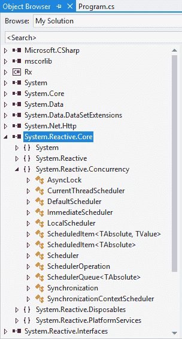
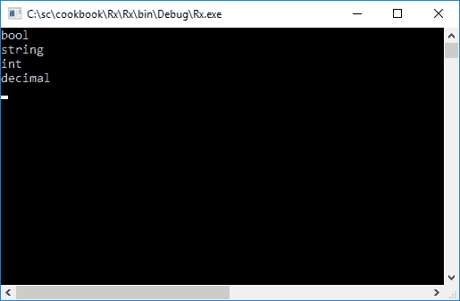
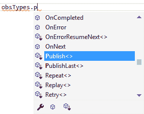
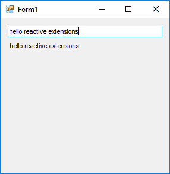
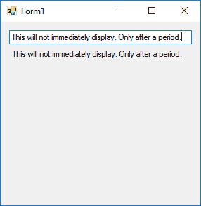
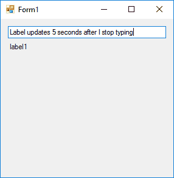
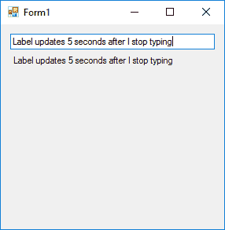
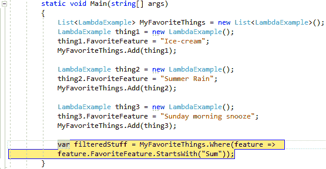
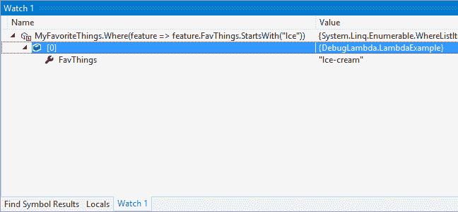

# 第九章：使用反应式扩展来组合基于事件的程序

本章涉及**反应式扩展**（**Rx**）。为了理解 Rx，我们将涵盖以下内容：

+   安装 Rx

+   事件与可观察对象

+   使用 LINQ 执行查询

+   在 Rx 中使用调度程序

+   调试 lambda 表达式

# 介绍

在日常处理 C# 应用程序开发中，您经常需要使用异步编程。您可能还需要处理许多数据源。想象一下返回当前汇率的 Web 服务，返回相关数据流的 Twitter 搜索，甚至多台计算机生成的不同事件。Rx 通过 `IObserver<T>` 接口提供了一个优雅的解决方案。

您使用 `IObserver<T>` 接口订阅事件。然后，维护 `IObserver<T>` 接口列表的 `IObservable<T>` 接口将通知它们状态的变化。实质上，Rx 将多个数据源（社交媒体、RSS 订阅、UI 事件等）粘合在一起生成数据。因此，Rx 将这些数据源汇集在一个接口中。事实上，Rx 可以被认为由三个部分组成：

+   **可观察对象**：将所有这些数据流汇集并表示的接口

+   **语言集成查询**（**LINQ**）：使用 LINQ 查询这些多个数据流的能力

+   **调度程序**：使用调度程序参数化并发

许多人心中的疑问可能是为什么开发人员应该使用（或找到使用）Rx。以下是一些 Rx 真正有用的例子。

+   创建具有自动完成功能的搜索。您不希望代码对搜索区域中输入的每个值执行搜索。Rx 允许您对搜索进行节流。

+   使应用程序的用户界面更具响应性。

+   在数据发生变化时得到通知，而不是必须轮询数据以查看变化。想象实时股票价格。

要了解 Rx 的最新信息，您可以查看 [`github.com/Reactive-Extensions/Rx.NET`](https://github.com/Reactive-Extensions/Rx.NET)  GitHub 页面[.](https://github.com/Reactive-Extensions/Rx.NET)

# 安装 Rx

在我们开始探索 Rx 之前，我们需要安装它。最简单的方法是使用 NuGet。

# 准备工作

在 Rx 的这一章中，我们不会创建一个单独的类。所有的代码都将在控制台应用程序中编写。

# 如何做...

1.  创建一个控制台应用程序，然后右键单击解决方案，从上下文菜单中选择“管理解决方案的 NuGet 包...”。

1.  在随后显示的窗口中，在搜索文本框中键入 `System.Reactive` 并搜索 NuGet 安装程序：


1.  在撰写本书时，最新的稳定版本是 3.1.1。如果您有多个项目，请选择要在其上安装 Rx 的项目。鉴于我们只有一个单独的控制台应用程序，只需选择为整个项目安装 Rx。

1.  接下来显示的屏幕是一个确认对话框，询问您确认对项目的更改。它将显示对每个项目将要进行的更改的预览。如果您对更改满意，请单击“确定”按钮。

1.  在最后的对话框屏幕上可能会向您呈现许可协议，您需要接受。要继续，请单击“我接受”按钮。

1.  安装完成后，您将在项目的引用节点下看到 Rx 添加的引用。具体如下：

+   `System.Reactive.Core`

+   `System.Reactive.Interfaces`

+   `System.Reactive.Linq`

+   `System.Reactive.PlatformServices`

# 它是如何工作的...

NuGet 绝对是向项目添加附加组件的最简单方式。从添加的引用中可以看出，`System.Reactive`是主要程序集。要更好地了解`System.Reactive`，请查看对象浏览器中的程序集。要做到这一点，请双击项目的引用选项中的任何程序集。这将显示对象浏览器：



`System.Reactive.Linq`包含 Rx 中的所有查询功能。您还会注意到`System.Reactive.Concurrency`包含所有调度程序。

# 事件与可观察对象

作为开发人员，我们应该都对事件非常熟悉。自从我们开始编写代码以来，大多数开发人员一直在创建事件。事实上，如果您在窗体上放置了一个按钮控件并双击按钮以创建处理按钮点击的方法，那么您已经创建了一个事件。在.NET 中，我们可以使用`event`关键字声明事件，通过调用它来发布事件，并通过向事件添加处理程序来订阅该事件。因此，我们有以下操作：

+   声明

+   发布

+   订阅

使用 Rx，我们有一个类似的结构，我们声明一个数据流，将数据发布到该流中，并订阅它。

# 准备就绪

首先，我们将看看 C#中事件的工作原理。然后，我们将看到使用 Rx 的事件的工作方式，并在此过程中突出显示差异。

# 如何做...

1.  在您的控制台应用程序中，添加一个名为`DotNet`的新类。在这个类中，添加一个名为`AvailableDatatype`的属性：

```cs
        public class DotNet 
        { 
          public string  AvailableDatatype { get; set; } 
        }

```

1.  在主程序类中，添加一个名为`types`的新静态动作事件。基本上，这只是一个委托，将接收一些值；在我们的情况下，是可用的.NET 数据类型：

```cs
        class Program 
        { 
          // Static action event 
          static event Action<string> types; 

          static void Main(string[] args) 
          { 

          } 
        }

```

1.  在`void Main`内，创建一个名为`lstTypes`的`List<DotNet>`类。在这个列表中，添加几个`DotNet`类的值。在这里，我们将只添加一些.NET 中的数据类型的硬编码数据：

```cs
        List<DotNet> lstTypes = new List<DotNet>(); 
        DotNet blnTypes = new DotNet(); 
        blnTypes.AvailableDatatype = "bool"; 
        lstTypes.Add(blnTypes); 

        DotNet strTypes = new DotNet(); 
        strTypes.AvailableDatatype = "string"; 
        lstTypes.Add(strTypes); 

        DotNet intTypes = new DotNet(); 
        intTypes.AvailableDatatype = "int"; 
        lstTypes.Add(intTypes); 

        DotNet decTypes = new DotNet(); 
        decTypes.AvailableDatatype = "decimal"; 
        lstTypes.Add(decTypes);

```

1.  我们的下一个任务是订阅此事件，使用一个简单地将*x*的值输出到控制台窗口的事件处理程序。然后，每次我们通过`lstTypes`列表循环时，通过添加`types(lstTypes[i].AvailableDatatype);`来触发事件：

```cs
        types += x => 
        { 
          Console.WriteLine(x); 
        }; 

        for (int i = 0; i <= lstTypes.Count - 1; i++) 
        { 
          types(lstTypes[i].AvailableDatatype); 
        } 

        Console.ReadLine();

```

实际上，在触发事件之前，我们应该始终检查事件是否为 null。只有在此检查之后，我们才应该触发事件。为简洁起见，我们在触发事件之前没有添加此检查。

1.  当您将步骤 1 到步骤 4 的所有代码添加到控制台应用程序中时，它应该看起来像这样：

```cs
        class Program 
        { 
          // Static action event 
          static event Action<string> types; 

          static void Main(string[] args) 
          { 
            List<DotNet> lstTypes = new List<DotNet>(); 
            DotNet blnTypes = new DotNet(); 
            blnTypes.AvailableDatatype = "bool"; 
            lstTypes.Add(blnTypes); 

            DotNet strTypes = new DotNet(); 
            strTypes.AvailableDatatype = "string"; 
            lstTypes.Add(strTypes); 

            DotNet intTypes = new DotNet(); 
            intTypes.AvailableDatatype = "int"; 
            lstTypes.Add(intTypes); 

          DotNet decTypes = new DotNet(); 
            decTypes.AvailableDatatype = "decimal"; 
            lstTypes.Add(decTypes); 

            types += x => 
            { 
              Console.WriteLine(x); 
            }; 

            for (int i = 0; i <= lstTypes.Count - 1; i++) 
            { 
              types(lstTypes[i].AvailableDatatype); 
            } 

            Console.ReadLine(); 
          } 
        }

```

1.  运行应用程序将使用值设置我们的列表，然后触发创建的事件以将列表的值输出到控制台窗口：



1.  让我们看看使用 Rx 的事件的工作方式。添加一个静态的`string`的`Subject`。您可能还需要将`System.Reactive.Subjects`命名空间添加到您的项目中，因为`Subjects`位于这个单独的命名空间中：

```cs
        class Program 
        { 

            static Subject<string> obsTypes = new Subject<string>(); 

         static void Main(string[] args) 
          { 

          } 
        }

```

1.  在创建`DotNet`列表的代码之后，我们使用`+=`来连接事件处理程序。这一次，我们将使用`Subscribe`。这是代码的`IObservable`部分。添加完这个之后，使用`OnNext`关键字触发事件。这是代码的`IObserver`部分。因此，当我们循环遍历我们的列表时，我们将调用`OnNext`来将值输出到订阅的`IObservable`接口：

```cs
        // IObservable 
        obsTypes.Subscribe(x => 
        { 
          Console.WriteLine(x); 
        }); 

        // IObserver 
        for (int i = 0; i <= lstTypes.Count - 1; i++) 
        { 
          obsTypes.OnNext(lstTypes[i].AvailableDatatype); 
        } 

        Console.ReadLine();

```

1.  当您完成添加所有代码后，您的应用程序应该看起来像这样：

```cs
        class Program 
        {      
          static Subject<string> obsTypes = new Subject<string>(); 

          static void Main(string[] args) 
          { 
            List<DotNet> lstTypes = new List<DotNet>(); 
            DotNet blnTypes = new DotNet(); 
            blnTypes.AvailableDatatype = "bool"; 
            lstTypes.Add(blnTypes); 

            DotNet strTypes = new DotNet(); 
            strTypes.AvailableDatatype = "string"; 
            lstTypes.Add(strTypes); 

            DotNet intTypes = new DotNet(); 
            intTypes.AvailableDatatype = "int"; 
            lstTypes.Add(intTypes); 

            DotNet decTypes = new DotNet(); 
            decTypes.AvailableDatatype = "decimal"; 
            lstTypes.Add(decTypes); 

            // IObservable 
            obsTypes.Subscribe(x => 
            { 
              Console.WriteLine(x); 
            }); 

            // IObserver 
            for (int i = 0; i <= lstTypes.Count - 1; i++) 
            { 
              obsTypes.OnNext(lstTypes[i].AvailableDatatype); 
            } 

            Console.ReadLine(); 
          } 
        }

```

1.  运行应用程序时，您将看到与之前相同的项目输出到控制台窗口。

# 它是如何工作的...

在 Rx 中，我们可以使用`Subject`关键字声明事件流。因此，我们有一个事件源，我们可以使用`OnNext`发布到该事件源。为了在控制台窗口中看到这些值，我们使用`Subscribe`订阅了事件流。

Rx 允许您拥有仅为发布者或仅为订阅者的对象。这是因为`IObservable`和`IObserver`接口实际上是分开的。另外，请注意，在 Rx 中，observables 可以作为参数传递，作为结果返回，并存储在变量中，这使它们成为一流。


Rx 还允许您指定事件流已完成或发生错误。这确实使 Rx 与.NET 中的事件有所不同。另外，重要的是要注意，在项目中包括`System.Reactive.Linq`命名空间允许开发人员对`Subject`类型编写查询，因为`Subject`是`IObservable`接口：



这是 Rx 与.NET 中的事件有所不同的另一个功能。

# 使用 LINQ 执行查询

Rx 允许开发人员使用`IObservable`接口，该接口表示同步数据流，以使用 LINQ 编写查询。简而言之，Rx 可以被认为由三个部分组成：

+   **Observables**：将所有这些数据流汇集并表示的接口

+   **语言集成查询**（**LINQ**）：使用 LINQ 查询这些多个数据流的能力

+   **调度程序**：使用调度程序参数化并发

在本示例中，我们将更详细地查看 Rx 的 LINQ 功能。

# 准备就绪

由于 observables 只是数据流，我们可以使用 LINQ 对它们进行查询。在以下示例中，我们将根据 LINQ 查询将文本输出到屏幕上。

# 如何做...

1.  首先向解决方案添加一个新的 Windows 表单项目。

1.  将项目命名为`winformRx`，然后单击“确定”按钮：

1.  在工具箱中，搜索 TextBox 控件并将其添加到您的表单中。

1.  最后，在表单中添加一个标签控件：


1.  右键单击`winformRx`项目，然后从上下文菜单中选择“管理 NuGet 包...”。

1.  在搜索文本框中，输入`System.Reactive`以搜索 NuGet 包，然后单击“安装”按钮。

1.  Visual Studio 将要求您审查即将对项目进行的更改。单击“确定”按钮。

1.  在安装开始之前，您可能需要点击“我接受”按钮接受许可协议。

1.  安装完成后，如果展开项目的引用，您应该会看到新添加的引用`winformRx`项目：

1.  最后，右键单击项目，并通过单击上下文菜单中的“设置为启动项目”将`winformRx`设置为启动项目。

1.  通过双击 Windows 表单上的任何位置创建表单加载事件处理程序。向此表单添加`Observable`关键字。您会注意到该关键字立即被下划线标记。这是因为您缺少对`System.Reactive`的 LINQ 程序集的引用。

1.  要添加此功能，请按*Ctrl* + *.*（句号）以显示可能的建议以解决问题。选择将`using System.Reactive.Linq`命名空间添加到您的项目。

1.  继续将以下代码添加到您的表单加载事件中。基本上，您正在使用 LINQ 并告诉编译器您要从称为`textBox1`的表单上的文本更改事件匹配的事件模式中选择文本。完成后，添加一个订阅变量并告诉它将在表单上的标签`label1`中输出找到的任何文本：

```cs
        private void Form1_Load(object sender, EventArgs e) 
        { 
          var searchTerm = Observable.FromEventPattern<EventArgs>(
            textBox1, "TextChanged").Select(x => ((TextBox)x.Sender).Text); 

          searchTerm.Subscribe(trm => label1.Text = trm); 
        }

```

当我们向表单添加文本框和标签时，我们将控件名称保留为默认值。但是，如果您更改了默认名称，则需要指定表单上控件的名称而不是`textBox1`和`label1`。

1.  单击运行按钮以运行应用程序。Windows 表单将显示文本框和标签。

1.  注意，当您输入时，文本将输出到表单上的标签上：



1.  让我们通过在 LINQ 语句中添加`Where`条件来增加一些乐趣。我们将指定`text`字符串只有在以句号结尾时才能选择文本。这意味着文本只会在每个完整句子之后显示在标签上。正如您所看到的，我们在这里并没有做任何特别的事情。我们只是使用标准的 LINQ 来查询我们的数据流，并将结果返回给我们的`searchTerm`变量：

```cs
        private void Form1_Load(object sender, EventArgs e) 
        { 
          var searchTerm = Observable.FromEventPattern<EventArgs>(
            textBox1, "TextChanged").Select(x => ((TextBox)x.Sender)
            .Text).Where(text => text.EndsWith(".")); 

          searchTerm.Subscribe(trm => label1.Text = trm); 
        }

```

1.  运行您的应用程序并开始输入一行文本。您会发现在您输入时标签控件没有输出任何内容，就像在我们添加`Where`条件之前的上一个示例中一样：


1.  在文本后加上一个句号并开始添加第二行文本：


1.  您会发现只有在每个句号之后，输入的文本才会添加到标签上。因此，我们的`Where`条件完美地发挥作用：



# 它是如何工作的...

Rx 的 LINQ 方面允许开发人员构建可观察序列。以下是一些示例：

+   `Observable.Empty<>`: 这将返回一个空的可观察序列

+   `Observable.Return<>`: 这将返回一个包含单个元素的可观察序列

+   `Observable.Throw<>`: 这将返回一个以异常终止的可观察序列

+   `Observable.Never<>`: 这将返回一个持续时间无限的非终止可观察序列

在 Rx 中使用 LINQ 允许开发人员操纵和过滤数据流，以返回他们需要的内容。

# 在 Rx 中使用调度程序

有时，我们需要在特定时间运行`IObservable`订阅。想象一下需要在不同地理区域和时区的服务器之间同步事件。您可能还需要从队列中读取数据，同时保留事件发生顺序。另一个例子是执行可能需要一些时间才能完成的某种 I/O 任务。在这些情况下，调度程序非常有用。

# 准备工作

此外，您可以考虑在 MSDN 上阅读更多关于使用调度程序的内容。请查看[`msdn.microsoft.com/en-us/library/hh242963(v=vs.103).aspx.`](https://msdn.microsoft.com/en-us/library/hh242963(v=vs.103).aspx)

# 如何做...

1.  如果您还没有这样做，请创建一个新的 Windows 表单应用程序并将其命名为`winformRx`。打开表单设计器，在工具箱中搜索 TextBox 控件并将其添加到您的表单中。

1.  接下来，在您的表单中添加一个标签控件。

1.  双击您的 Windows 表单设计器以创建 onload 事件处理程序。在此处理程序中，添加一些代码来读取输入到文本框中的文本，并在用户停止输入 5 秒后仅显示该文本。这是使用`Throttle`关键字实现的。向`searchTerm`变量添加一个订阅，将文本输入的结果写入标签控件的文本属性：

```cs
        private void Form1_Load(object sender, EventArgs e) 
        { 
          var searchTerm = Observable.FromEventPattern<EventArgs>(
            textBox1, "TextChanged").Select(x => ((TextBox)x.Sender)
            .Text).Throttle(TimeSpan.FromMilliseconds(5000)); 

          searchTerm.Subscribe(trm => label1.Text = trm); 
        }

```

请注意，您可能需要在您的`using`语句中添加`System.Reactive.Linq`。

1.  运行您的应用程序并开始在文本框中输入一些文本。立即，我们将收到一个异常。这是一个跨线程违规。当尝试从后台线程更新 UI 时会发生这种情况。`Observable`接口正在从`System.Threading`运行一个计时器，这与 UI 不在同一线程上。幸运的是，有一种简单的方法可以克服这个问题。事实证明，UI 线程能力位于不同的程序集中，我们最容易通过包管理器控制台获取：


1.  导航到视图 | 其他窗口 | 包管理器控制台以访问包管理器控制台。

1.  输入以下命令：

```cs
      PM> Install-Package System.Reactive.Windows.Forms

```

这将向您的`winformRx`项目添加 System.Reactive.Windows.Forms.3.1.1。因此，您应该在输出中看到以下内容：成功安装'System.Reactive.Windows.Forms 3.1.1'到 winformRx

请注意，您需要确保在包管理器控制台中将默认项目选择设置为`winformRx`。如果您没有看到此选项，请调整包管理器控制台屏幕的宽度，直到显示该选项。这样您就可以确保该包已添加到正确的项目中。

1.  安装完成后，在`onload`事件处理程序中修改您的代码，并将执行订阅的`searchTerm.Subscribe(trm => label1.Text = trm);`更改为以下内容：

```cs
        searchTerm.ObserveOn(new ControlScheduler(this)).Subscribe(trm => label1.Text = trm);

```

您会注意到我们在这里使用了`ObserveOn`方法。这基本上告诉编译器的是`new ControlScheduler(this)`中的`this`关键字实际上是指我们的 Windows 表单。因此，`ControlScheduler`将使用 Windows 表单计时器来创建更新我们的 UI 的间隔。消息发生在正确的线程上，我们不再有跨线程违规。

1.  如果您还没有将`System.Reactive.Concurrency`命名空间添加到您的项目中，Visual Studio 将用波浪线下划线标出代码中的`ControlScheduler`行。按下*Ctrl* + *.*（句号）将允许您添加缺少的命名空间。

1.  这意味着`System.Reactive.Concurrency`包含一个可以与 Windows 表单控件通信的调度程序，以便进行调度。再次运行应用程序，并开始在文本框中输入一些文本：



1.  在我们停止输入大约 5 秒钟后，节流条件得到满足，文本被输出到我们的标签上：



# 工作原理... 

我们需要记住的是，从我们创建的代码中，有`ObserveOn`和`Subscribe`。您不应该混淆这两者。在大多数情况下，处理调度程序时，您将使用`ObserveOn`。`ObserveOn`方法允许您参数化`OnNext`、`OnCompleted`和`OnError`消息的运行位置。而`Subscribe`，我们参数化实际的订阅和取消订阅代码的运行位置。

我们还需要记住，Rx 默认使用线程计时器（`System.Threading.Timer`），这就是为什么我们之前遇到跨线程违规的原因。不过，正如您所看到的，我们使用调度程序来参数化使用哪个计时器。调度程序执行此操作的方式是通过公开三个组件。它们如下：

+   调度程序执行某些操作的能力

+   执行操作或工作的顺序

+   允许调度程序具有时间概念的时钟

使用时钟的重要性在于它允许开发人员在远程计算机上使用定时器；例如（在您和他们之间可能存在时间差的地方），告诉他们在特定时间执行某个操作。

# 调试 lambda 表达式

自 Visual Studio 2015 以来，调试 lambda 表达式的能力一直存在。这是我们最喜欢的 IDE 功能的一个很棒的补充。它允许我们实时检查 lambda 表达式的结果并修改表达式以测试不同的场景。

# 准备就绪

我们将创建一个非常基本的 lambda 表达式，并在监视窗口中更改它以产生不同的值。

# 如何做...

1.  创建一个控制台应用程序，并在控制台应用程序中添加一个名为`LambdaExample`的类。在这个类中添加一个名为`FavThings`的属性：

```cs
        public class LambdaExample
        {
          public string FavThings { get; set; }
        }

```

1.  在控制台应用程序中，创建一个`List<LambdaExample>`对象，并将一些您喜欢的事物添加到此列表中：

```cs
        List<LambdaExample> MyFavoriteThings = new List<LambdaExample>();
        LambdaExample thing1 = new LambdaExample();
        thing1.FavThings = "Ice-cream";
        MyFavoriteThings.Add(thing1);

        LambdaExample thing2 = new LambdaExample();
        thing2.FavThings = "Summer Rain";
        MyFavoriteThings.Add(thing2);

        LambdaExample thing3 = new LambdaExample();
        thing3.FavThings = "Sunday morning snooze";
        MyFavoriteThings.Add(thing3);

```

1.  然后，创建一个表达式，仅返回以字符串`"Sum"`开头的事物。在这里，我们显然希望看到`Summer Rain`作为结果：

```cs
        var filteredStuff = MyFavoriteThings.Where(feature =>         feature.FavThings.StartsWith("Sum"));

```

1.  在表达式上设置断点并运行应用程序。当代码在断点处停止时，您可以复制 lambda 表达式：



1.  将 lambda 表达式`MyFavoriteThings.Where(feature => feature.FavThings.StartsWith("Sum"))`粘贴到监视窗口中，并将`StartsWith`方法中的字符串从`Sum`更改为`Ice`。您会看到结果已经改变，现在显示一个`Ice-cream`字符串：



请注意，如果您正在使用 Visual Studio 2017 RC，调试 lambda 表达式可能不起作用。您可能会收到从表达式评估器中的内部错误到包含 lambda 表达式的消息的任何内容。

# 工作原理是这样的…

通过这种方式，我们能够轻松地更改和调试 lambda 表达式。这在 Visual Studio 2015 之前的旧版本中是不可能的。显然，在处理这些表达式时，了解这个技巧非常重要。

另一个要注意的重点是，您可以在 Visual Studio 2017 的 Immediate 窗口中执行相同的操作，以及从 lambda 表达式中固定变量。
