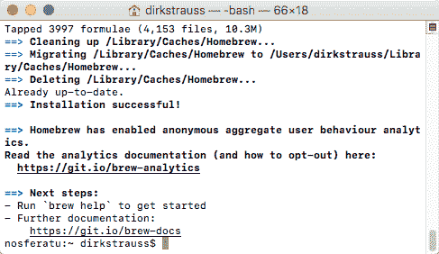
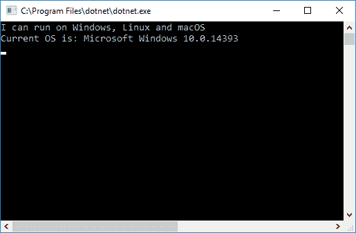
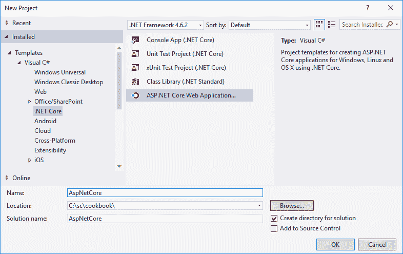
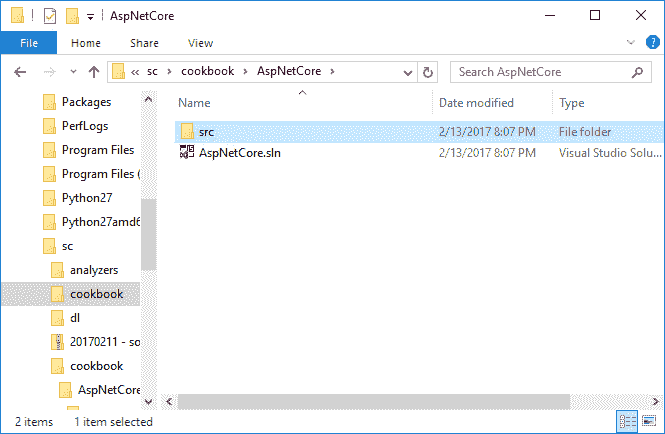
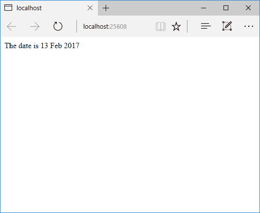
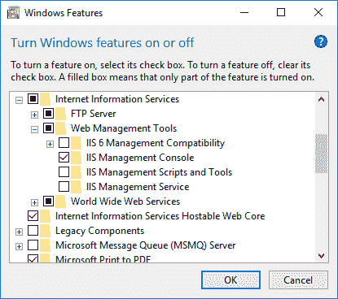
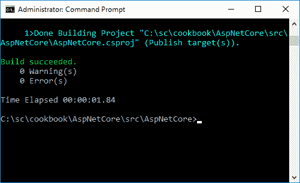
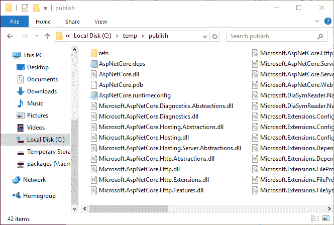
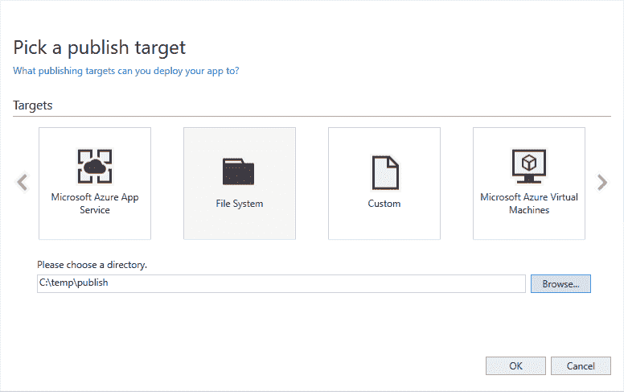

# 第十章：探索.NET Core 1.1

本章将探讨.NET Core 1.1。我们将看看.NET Core 是什么，以及您可以用它做什么。我们将重点关注：

+   在 Mac 上创建一个简单的.NET Core 应用程序并运行它

+   创建您的第一个 ASP.NET Core 应用程序

+   发布您的 ASP.NET Core 应用程序

# 介绍

最近.NET Core 引起了很多关注。有很多文章解释了.NET Core 是什么以及它的作用。简而言之，.NET Core 允许您创建在 Windows、Linux 和 macOS 上运行的跨平台应用程序。它通过利用一个.NET 标准库来实现，该库以完全相同的代码针对所有这些平台。因此，您可以使用您熟悉的语言和工具来创建应用程序。它支持 C#、VB 和 F#，甚至允许使用泛型、异步支持和 LINQ 等构造。有关.NET Core 的更多信息和文档，请访问[`www.microsoft.com/net/core`](https://www.microsoft.com/net/core)。

# 在 Mac 上创建一个简单的.NET Core 应用程序并运行它

我们将看看如何在 Windows 上使用 Visual Studio 2017 创建一个应用程序，然后在 Mac 上运行该应用程序。以前这种应用程序开发是不可能的，因为您无法在 Mac 上运行为 Windows 编译的代码。.NET Core 改变了这一切。

# 准备工作

您需要访问 Mac 才能运行您创建的应用程序。我使用的是 Mac mini（2012 年底）配备 2.5 GHz Intel Core i5 CPU，运行 macOS Sierra，内存为 4GB。

为了在 Mac 上使用您的.NET Core 应用程序，您需要做一些准备工作：

1.  我们需要安装 Homebrew，用于获取最新版本的 OpenSSL。通过在 Spotlight 搜索中键入`Terminal`来打开 Mac 上的终端：


也可以通过转到[`www.microsoft.com/net/core#macos`](https://www.microsoft.com/net/core#macos) 在 Mac 上执行以下步骤。

1.  将以下内容粘贴到终端提示符处，然后按*Enter*：

```cs
        /usr/bin/ruby -e "$(curl -fsSL         https://raw.githubusercontent.com/Homebrew/install/master/install)"

```

1.  如果终端要求您输入密码，请输入密码并按*Enter*。您在输入时将看不到任何内容。这是正常的。只需输入密码并按*Enter*继续。

安装 Homebrew 的要求是 Intel CPU、OS X 10.10 或更高版本、Xcode 的**命令行工具**（**CLT**）以及用于安装的 Bourne 兼容 shell，如 bash 或 zsh。因此终端非常适合。

根据您的互联网连接速度以及是否已安装 Xcode 的 CLT，安装 Homebrew 的过程可能需要一些时间才能完成。完成后，终端应如下所示：



输入`brew help`将显示一些有用的命令：


在终端中依次运行以下命令：

+   `brew update`

+   `brew install openssl`

+   `mkdir -p /usr/local/lib`

+   `ln -s /usr/local/opt/openssl/lib/libcrypto.1.0.0.dylib /usr/local/lib/`

+   `ln -s /usr/local/opt/openssl/lib/libssl.1.0.0.dylib /usr/local/lib/`

然后我们需要安装.NET Code SDK。从 URL [`www.microsoft.com/net/core#macos`](https://www.microsoft.com/net/core#macos) 点击下载.NET Core SDK 按钮。下载完成后，点击下载的`.pkg`文件。点击继续按钮安装.NET Core 1.1.0 SDK：


# 如何做...

1.  我们将在 Visual Studio 2017 中创建一个.NET Core 控制台应用程序。在 Visual C#模板下，选择.NET Core 和一个 Console App (.NET Core)项目：


1.  创建控制台应用程序时，代码如下：

```cs
        using System;

        class Program
        {
          static void Main(string[] args)
          {
            Console.WriteLine("Hello World!");
          }
        }

```

1.  修改代码如下：

```cs
        static void Main(string[] args)
        {
          Console.WriteLine("I can run on Windows, Linux and macOS");
          GetSystemInfo();
          Console.ReadLine();
        }

        private static void GetSystemInfo()
        {
          var osInfo = System.Runtime.InteropServices.RuntimeInformation.OSDescription;
          Console.WriteLine($"Current OS is: {osInfo}");
        }

```

1.  方法`GetSystemInfo()`只是返回当前操作系统，控制台应用程序当前运行的操作系统。我的应用程序的`csproj`文件如下：

```cs
        <Project ToolsVersion="15.0"           >
          <Import Project="$(MSBuildExtensionsPath)$(MSBuildToolsVersion)
            Microsoft.Common.props" />
            <PropertyGroup>
              <OutputType>Exe</OutputType>
              <TargetFramework>netcoreapp1.1</TargetFramework>
            </PropertyGroup>
            <ItemGroup>
              <Compile Include="***.cs" />
              <EmbeddedResource Include="***.resx" />
            </ItemGroup>
            <ItemGroup>
              <PackageReference Include="Microsoft.NETCore.App">
                <Version>1.1.0</Version>
              </PackageReference>
              <PackageReference Include="Microsoft.NET.Sdk">
                <Version>1.0.0-alpha-20161104-2</Version>
                <PrivateAssets>All</PrivateAssets>
              </PackageReference>
            </ItemGroup>
          <Import Project="$(MSBuildToolsPath)Microsoft.CSharp.targets" />
        </Project>

```

`<version>`被定义为`1.1.0`。

如果你仍在运行 Visual Studio 2017 RC，最好检查你安装的 NuGet 包，看看是否有.NET Core 版本从.NET Core 1.0 到.NET Core 1.1 的更新。

# 它是如何工作的...

按下*F5*来运行你的控制台应用程序。你会看到操作系统显示在输出中：



转到你的控制台应用程序的`bin`文件夹，并将文件复制到 Mac 桌面上的一个文件夹中。将该文件夹命名为`consoleApp`。在终端中，导航到复制文件的文件夹。你可以通过输入命令`cd ./Desktop`来做到这一点，然后输入`ls`来列出你的桌面的内容。检查你创建的文件夹是否被列出，如果是的话，在终端中输入`cd ./consoleApp`。再次通过输入`ls`来列出`consoleApp`文件夹的内容。在我的情况下，DLL 被称为`NetCoreConsole.dll`。要运行你之前编写的代码，输入`dotnet NetCoreConsole.dll`并按*Enter*：


你可以看到代码正在运行，并在终端中输出文本。

如果你在安装了.NET Core SDK 后尝试运行`dotnet`命令时出现`command not found`的错误，请尝试以下操作。在终端中输入以下内容并按 Enter 键：`ln -s /usr/local/share/dotnet/dotnet /usr/local/bin/`，这将添加一个符号链接。这之后运行`dotnet`命令应该可以正常工作。

# 创建你的第一个 ASP.NET Core 应用程序

让我们来看看如何构建你的第一个 ASP.NET Core 应用程序。在这个教程中，我们将只创建一个非常基本的 ASP.NET Core 应用程序，并简要讨论`Startup`类。关于这个主题的进一步阅读是必要的，不包括在这个对 ASP.NET Core 的简要介绍中。

# 准备工作

首先在 Visual Studio 2017 中创建一个新项目。在 Visual C#下，选择.NET Core 节点，然后点击 ASP.NET Core Web Application.... 点击 OK：



然后你将看到项目模板选择。你可以选择创建一个空应用程序，一个 Web API（允许你创建基于 HTTP 的 API），或者一个完整的 Web 应用程序。选择空模板，确保在云中主机未被选中，然后点击 OK：


注意模板窗口允许你启用 Docker 支持。Docker 允许你在包含完整文件系统和运行应用程序所需的其他所有内容的容器中开发应用程序。这意味着你的软件无论在什么环境中都会始终以相同的方式运行。有关 Docker 的更多信息，请访问[www.docker.com](https://www.docker.com/)。

当你创建了 ASP.NET Core 应用程序后，你的解决方案资源管理器将如下所示：


如果你正在运行 Visual Studio 2017 RC，你需要点击工具，NuGet 包管理器，管理解决方案的 NuGet 包...，看看是否有.NET Core 的更新。如果你使用的是.NET Core 1.01，那么应该可以通过 NuGet 获得.NET Core 1.1 的更新。让 NuGet 为你更新项目的依赖关系。在这样做之后，你必须浏览[`www.microsoft.com/net/download/core#/current`](https://www.microsoft.com/net/download/core#/current)，确保你已经在所有下载选项下选择了当前选项。下载当前的.NET Core SDK 安装程序并安装它。

此时，你可以按下*Ctrl* + *F5*来启动而不是调试，并启动你的 ASP.NET Core 应用程序。这将启动 IIS Express，这是 ASP.NET Core 应用程序的默认主机。它现在所做的唯一的事情就是显示文本 Hello World!。你已经成功创建并运行了一个 ASP.NET Core 应用程序。不要关闭你的浏览器。保持它打开：


请注意浏览器 URL 中的端口号 25608 是一个随机选择的端口。你看到的端口号很可能与书中的不同。

# 如何做...

1.  在您的解决方案资源管理器中右键单击解决方案，然后单击在文件资源管理器中打开文件夹。您会注意到有一个名为`src`的文件夹。点击进入这个文件夹，然后点击其中的`AspNetCore`子文件夹：



1.  比较 Visual Studio 中`AspNetCore`文件夹和解决方案资源管理器中的内容将向您展示它们几乎相同。这是因为在 ASP.NET Core 中，Windows 文件系统确定了 Visual Studio 中的解决方案：


1.  在 Windows 文件资源管理器中，右键单击`Startup.cs`文件并在记事本中编辑。您将在记事本中看到以下代码：

```cs
        using System;
        using System.Collections.Generic;
        using System.Linq;
        using System.Threading.Tasks;
        using Microsoft.AspNetCore.Builder;
        using Microsoft.AspNetCore.Hosting;
        using Microsoft.AspNetCore.Http;
        using Microsoft.Extensions.DependencyInjection;
        using Microsoft.Extensions.Logging;

        namespace AspNetCore
        {
          public class Startup
          {
            // This method gets called by the runtime. Use this method 
               to add services to the container.
            // For more information on how to configure your application, 
               visit https://go.microsoft.com/fwlink/?LinkID=398940
            public void ConfigureServices(IServiceCollection services)
            {
            }

            // This method gets called by the runtime. Use this method 
               to configure the HTTP request pipeline.
            public void Configure(IApplicationBuilder app, 
              IHostingEnvironment env, ILoggerFactory loggerFactory)
            {
              loggerFactory.AddConsole();

              if (env.IsDevelopment())
              {
                app.UseDeveloperExceptionPage();
              }

              app.Run(async (context) =>
              {
                await context.Response.WriteAsync("Hello World!");
              });
            }
          }
        }

```

1.  仍然在记事本中，编辑读取`await context.Response.WriteAsync("Hello World!");`的行，并将其更改为`await context.Response.WriteAsync($"The date is {DateTime.Now.ToString("dd MMM yyyy")}");`。在记事本中保存文件，然后转到浏览器并刷新。您会看到更改已在浏览器中显示，而无需我在 Visual Studio 中进行任何编辑。这是因为（如前所述）Visual Studio 使用文件系统来确定项目结构，ASP.NET Core 检测到对`Startup.cs`文件的更改，并自动在运行时重新编译它：



1.  更详细地查看解决方案资源管理器，我想要强调项目中的一些文件。`wwwroot`文件夹将代表托管时网站的根目录。您将在这里放置静态文件，如图像、JavaScript 和 CSS 样式表文件。另一个感兴趣的文件是`Startup.cs`文件，它基本上取代了`Global.asax`文件。在`Startup.cs`文件中，您可以编写在 ASP.NET Core 应用程序启动时执行的代码：


# 工作原理

`Startup.cs`文件包含`Startup`类。ASP.NET Core 需要一个`Startup`类，并且默认情况下将查找此类。按照惯例，`Startup`类称为`Startup`，但如果您愿意，也可以将其命名为其他名称。如果需要重命名它，则还需要确保修改`Program.cs`文件，以便`WebHostBuilder()`指定正确的类名用于`.UseStartup`。

```cs
public static void Main(string[] args)
{
   var host = new WebHostBuilder()
       .UseKestrel()
       .UseContentRoot(Directory.GetCurrentDirectory())
       .UseIISIntegration()
       .UseStartup<Startup>()
       .Build();

   host.Run();
}

```

回到`Startup.cs`文件中的`Startup`类，当您查看此类时，您将看到两种方法。这些方法是`Configure()`和`ConfigureServices()`。从`Configure()`方法的注释中可以看出，它用于*配置 HTTP 请求管道*。基本上，应用程序在此处处理传入的请求，而我们的应用程序目前所做的就是为每个传入的请求显示当前日期。`ConfigureServices()`方法在`Configure()`之前调用，是可选的。它的显式目的是添加应用程序所需的任何服务。ASP.NET Core 原生支持依赖注入。这意味着我可以通过将服务注入到`Startup`类中的方法中来利用服务。有关 DI 的更多信息，请确保阅读[`docs.microsoft.com/en-us/aspnet/core/fundamentals/dependency-injection`](https://docs.microsoft.com/en-us/aspnet/core/fundamentals/dependency-injection)。

# 发布您的 ASP.NET Core 应用程序

发布 ASP.NET Core 应用程序非常简单。我们将通过命令提示符（以管理员身份运行）发布应用程序，然后将 ASP.NET Core 应用程序发布到 Windows 服务器上的 IIS。

# 做好准备

您需要设置 IIS 才能执行此操作。启动“程序和功能”，然后单击“程序和功能”表单左侧的“打开或关闭 Windows 功能”。确保选择了 Internet 信息服务。选择 IIS 后，单击“确定”以打开该功能：



您还需要确保已安装了.NET Core Windows 服务器托管包，它将在 IIS 和 Kestrel 服务器之间创建反向代理。

在撰写本文时，.NET Core Windows Server Hosting 包可在以下链接找到：

[`docs.microsoft.com/en-us/aspnet/core/publishing/iis#install-the-net-core-windows-server-hosting-bundle`](https://docs.microsoft.com/en-us/aspnet/core/publishing/iis#install-the-net-core-windows-server-hosting-bundle)


安装.NET Core Windows Server Hosting 包后，您需要重新启动 IIS：


以管理员身份打开命令提示符，输入`iisreset`，然后按*Enter*。这将停止然后启动 IIS：


# 如何操作...

1.  通过以管理员身份运行命令提示符来打开命令提示符。在命令提示符中，转到项目的`src\AspNetCore`目录。确保您的计算机`C:\`驱动器的`temp`文件夹中有一个名为`publish`的文件夹，然后输入以下命令，按*Enter*。这将构建和发布您的项目：

```cs
        dotnet publish --output "c:temppublish" --configuration release

```



根据您的 ASP.NET Core 应用程序的名称，您的`src`文件夹下的文件夹名称将与我的不同。

1.  应用程序发布后，您将在输出文件夹中看到发布文件以及它们的所有依赖项：



1.  回到命令提示符，输入`dotnet AspNetCore.dll`来运行应用程序。请注意，如果您的 ASP.NET Core 应用程序名称不同，您将运行的 DLL 将与书中的示例不同。


现在，您可以打开浏览器，输入`http://localhost:5000`。这将为您显示 ASP.NET Core 应用程序：


1.  您可以通过将发布文件复制到文件夹并在终端中输入`dotnet AspNetCore.dll`来在 macOS 上执行相同的操作：


然后在 Mac 上的 Safari 中，输入`http://localhost:5000`，然后按*Enter*。这将在 Safari 中加载站点：


虽然我刚刚展示了在 macOS 上运行 Safari 作为替代方案，但 ASP.NET Core 应用程序也可以在 Linux 上运行。

1.  将应用程序发布到 IIS 也很容易。在 Visual Studio 中，右键单击解决方案资源管理器中的项目，然后从上下文菜单中单击“发布...”：


1.  然后，您需要选择一个发布目标。有几个选项可供选择，但在本示例中，您需要选择“文件系统”选项，然后单击“确定”：



1.  在发布屏幕中，您可以通过单击“目标位置”路径旁边的“设置...”来修改其他设置。在这里，您需要选择以发布模式进行发布。最后，单击“发布”按钮。


1.  应用程序发布后，Visual Studio 将在输出窗口中显示结果以及您选择的发布位置：


1.  在浏览器中，如果输入`http://localhost`，您将看到 IIS 的默认页面。这意味着 IIS 已经设置好了：


1.  在 Windows 资源管理器中，浏览到`C:\inetpub\wwwroot`，并创建一个名为`netcore`的新文件夹。将 ASP.NET Core 应用程序的发布文件复制到您创建的新文件夹中。在 IIS 中，通过右键单击`Sites`文件夹并选择添加网站来添加一个新网站。为网站命名，并选择在物理路径设置中复制发布文件的路径。最后，将端口更改为`86`，因为端口`80`被默认网站使用，然后单击“确定”：


1.  您将在 IIS 的 Sites 文件夹中看到已添加您的网站。在 IIS 管理器右侧面板的“浏览网站”标题下，单击“浏览*.86 (http)”：


1.  这将在您的默认浏览器中启动 ASP.NET Core 应用程序：


# 操作原理...

在 Windows 上创建一个 ASP.NET Core 应用程序可以让我们在 Windows、macOS 和 Linux 上运行该应用程序。在 Windows 命令提示符或 macOS 终端中，可以轻松地通过`dotnet`命令独立运行它。这就是.NET Core 对应用程序开发未来如此强大的原因。您可以使用您习惯的 IDE 来开发跨平台的应用程序。关于.NET Core 还有很多需要了解的内容，您真的需要深入了解概念并了解它的能力。
