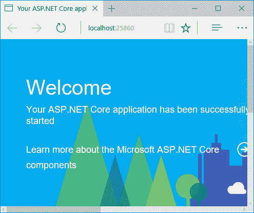
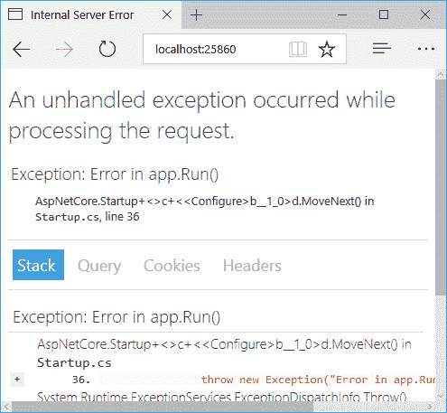
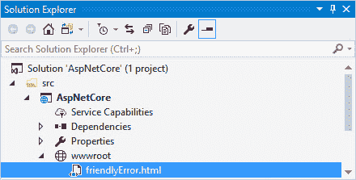
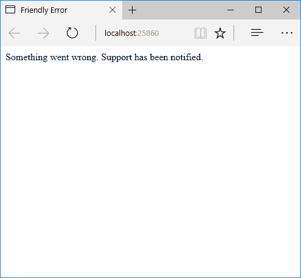
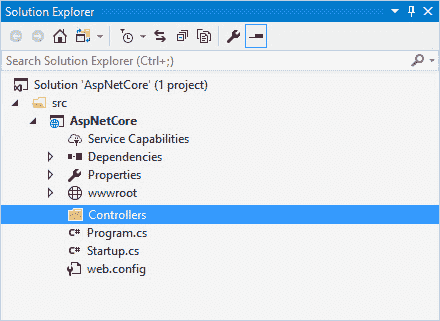
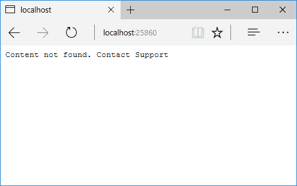

# 第十一章：ASP.NET Core 上的 MVC 框架

本章将探讨使用 MVC 框架创建 ASP.NET Core 应用程序。上一章向您介绍了 ASP.NET Core，并且我们从本章所需的基础知识开始。如果您对 ASP.NET Core 不熟悉，请看看第十章，*探索.NET Core 1.1*提供了什么。我们将会看到：

+   包括中间件及其有用之处

+   创建控制器并使用路由

+   呈现视图

# 介绍

MVC 框架的命名是根据其遵循的 MVC 设计模式而来的。MVC 代表**M**odel-**V**iew-**C**ontroller。HTTP 请求被发送到一个控制器，然后映射到*Controller*类中的一个方法。在该方法内，控制器决定如何处理 HTTP 请求。然后构造一个对控制器和请求不可知的*模型*。模型将包含控制器需要的所有信息的逻辑。然后使用*视图*来显示模型中包含的信息，以构建一个 HTML 页面，该页面将在 HTTP 响应中发送回请求的客户端。

MVC 框架允许我们通过让框架的每个组件专注于一个特定的事物来分离逻辑：

+   控制器接收 HTTP 请求并构建模型

+   模型包含我们请求的数据并将其发送到视图

+   视图然后从模型中包含的数据创建 HTML 页面

# 包括中间件及其有用之处

这个教程将向您展示如何在 ASP.NET Core 应用程序中设置中间件。ASP.NET 中间件定义了我们的应用程序如何响应接收到的任何 HTTP 请求。它还有助于控制我们的应用程序如何响应用户身份验证或错误。它还可以执行有关传入请求的日志操作。

# 准备工作

我们需要修改`Startup`类的`Configure()`方法中包含的代码。在 ASP.NET Core 应用程序中设置中间件就是在这里。在第十章，*探索.NET Core 1.1*中，我们看到我们的`Configure()`方法已经包含了两个中间件。第一个是一个中间件，当捕获到未处理的异常时，将显示开发人员异常页面。代码如下所示：

```cs
if (env.IsDevelopment())
{
   app.UseDeveloperExceptionPage();
}

```

这将显示任何错误消息，对于调试应用程序很有用。通常，此页面将包含诸如堆栈跟踪之类的信息。仅在应用程序处于开发模式时才安装。当您首次创建 ASP.NET Core 应用程序时，它处于开发模式。

第二个中间件是`app.Run()`，并且将始终存在于您的应用程序中。在第十章，*探索.NET Core 1.1*中，它将始终响应当前日期。将中间件视为门卫。所有进入应用程序的 HTTP 请求都必须通过您的中间件。

还要知道，您添加中间件的顺序很重要。在`app.Run()`中间件中，我们执行了`context.Response.WriteAsync()`。之后添加的任何中间件都不会被执行，因为处理管道在`app.Run()`中终止。随着我们的学习，这一点将变得更加清晰。

# 如何做...

1.  您当前的 ASP.NET Core 应用程序应包含一个如下所示的`Configure()`方法：

```cs
        public void Configure(IApplicationBuilder app, 
          IHostingEnvironment env, 
          ILoggerFactory loggerFactory)
        {
          loggerFactory.AddConsole();

          if (env.IsDevelopment())
          {
            app.UseDeveloperExceptionPage();
          }

         app.Run(async (context) =>
         {
           await context.Response.WriteAsync($"The date is 
             {DateTime.Now.ToString("dd MMM yyyy")}");
         });
       }

```

1.  从调试菜单中，单击“开始调试”或按*Ctrl* + *F5*。您将看到日期显示如下：


1.  返回您的代码，并告诉您的应用程序显示欢迎页面中间件。您可以通过在`app.Run()`之前添加`app.UseWelcomePage();`来实现这一点。您的代码需要如下所示：

```cs
        if (env.IsDevelopment())
        {
          app.UseDeveloperExceptionPage();
        }

        app.UseWelcomePage();

        app.Run(async (context) =>
        {
          await context.Response.WriteAsync($"The date is 
            {DateTime.Now.ToString("dd MMM yyyy")}"); 
        });

```

1.  保存您的`Startup.cs`文件并刷新您的浏览器。



1.  现在你再也看不到屏幕上显示的日期了。这是因为欢迎页面是终止中间件，任何 HTTP 请求都不会通过它。继续修改欢迎页面中间件如下：

```cs
        app.UseWelcomePage("/hello");

```

1.  如果你保存文件并刷新浏览器，你会再次在浏览器中看到日期显示。发生了什么？嗯，你刚刚告诉欢迎页面中间件只响应`/hello`页面的请求。

1.  在浏览器中更改 URL 如下`http://localhost:25860/hello`，然后按*Enter*。欢迎页面再次显示。

1.  让我们来看看`UseDeveloperExceptionPage()`中间件。修改`app.Run()`如下：

```cs
        app.Run(async (context) =>
        {
          throw new Exception("Error in app.Run()");
          await context.Response.WriteAsync($"The date is 
            {DateTime.Now.ToString("dd MMM yyyy")}"); 
        });

```

1.  保存你的更改并刷新浏览器。你会看到浏览器现在显示了一个开发人员会发现非常有用的页面。它显示了堆栈信息、传入的查询、任何 cookie 以及头信息。它甚至告诉我们异常发生的行数（在`Startup.cs`文件的第 36 行）。`UseDeveloperExceptionPage()`中间件允许请求通过它传递到较低的中间件。如果发生异常，这将允许`UseDeveloperExceptionPage()`中间件执行其工作。正如前面提到的，中间件的放置很重要。如果我们将`UseDeveloperExceptionPage()`中间件放在页面的末尾，它将无法捕获任何未处理的异常。因此，在你的`Configure()`方法的顶部放置这个中间件是一个好主意：



1.  让我们进一步探讨这个概念。当我们处于生产环境时，通常不希望用户看到异常页面。假设他们需要被引导到一个友好的错误页面。首先在你的应用程序的 wwwroot 中添加一个静态 HTML 页面。右键单击 wwwroot，然后从上下文菜单中选择添加、新项目：


wwwroot 是你可以提供静态页面的地方，比如 JavaScript 文件、CSS 文件、图片或静态 HTML 页面。

1.  选择一个 HTML 页面，命名为`friendlyError.html`，然后点击添加。



1.  修改`friendlyError.html`的 HTML 如下：

```cs
        <!DOCTYPE html>
        <html>
          <head>
            <meta charset="utf-8" />
            <title>Friendly Error</title>
          </head>
          <body>
            Something went wrong. Support has been notified.
          </body>
        </html>

```

1.  接下来我们需要向我们的应用程序添加一个 NuGet 包，以便我们可以提供静态文件。在**NuGet 包管理器**中，搜索 Microsoft.AspNetCore.StaticFiles 并将其添加到应用程序中。

1.  现在，我们需要稍微修改代码，模拟它在生产环境中运行。我们通过设置`IHostingEnvironment`接口的`EnvironmaneName`属性来实现这一点：`env.EnvironmentName = EnvironmentName.Production;`。

1.  然后我们需要在`if (env.IsDevelopment())`条件下添加一个`else`语句，并编写调用我们自定义静态错误页面的代码。在这里，我们将`friendlyError.html`文件添加到我们的`DefaultFileNames()`集合中，并告诉我们的应用程序我们希望在生产环境中的任何异常中使用此错误文件。最后，我们需要调用`UseStaticFiles()`方法告诉我们的应用程序使用静态文件。完成后，你的代码应该如下所示：

```cs
        env.EnvironmentName = EnvironmentName.Production;
        if (env.IsDevelopment())
        {
          app.UseDeveloperExceptionPage();
        }
        else
        {
          DefaultFilesOptions options = new DefaultFilesOptions();
          options.DefaultFileNames.Add("friendlyError.html");
          app.UseDefaultFiles(options);

          app.UseExceptionHandler("/friendlyError"); 
        }

        app.UseStaticFiles();

```

# 它是如何工作的...

再次按*Ctrl* + *F5*重新启动 IIS Express 并启动我们的应用程序。你会看到我们的自定义错误页面已经显示在浏览器中：



实际上，我们可能会使用控制器来做这种事情。我想在这里说明的是添加自定义默认页面的用法，并在生产环境中发生异常时显示该页面。

正如你所看到的，ASP.NET Core 中的中间件非常有用。关于这个主题有很多文档，我鼓励你在这个主题上进行进一步阅读。从微软文档开始[`docs.microsoft.com/en-us/aspnet/core/fundamentals/middleware`](https://docs.microsoft.com/en-us/aspnet/core/fundamentals/middleware)。

# 创建控制器并使用路由

在 MVC 框架内，控制器、模型和视图需要共同工作，形成 HTTP 请求和响应循环。然而，基本的起点是根据接收到的 HTTP 请求调用正确的控制器。如果没有这样做，我们建立在 MVC 框架上的应用程序将无法工作。在 MVC 框架中，调用正确的控制器以处理 HTTP 请求的过程称为路由。

# 准备工作

我们可以通过查看应用程序中间件中包含的路由信息来将 HTTP 请求路由到正确的控制器。然后，中间件使用这些路由信息来查看 HTTP 请求是否需要发送到控制器。中间件将查看传入的 URL，并将其与我们提供的配置信息进行匹配。我们可以在`Startup`类中使用两种路由方法之一来定义这些路由信息，即：

+   基于约定的路由

+   基于属性的路由

本教程将探讨这些路由方法。在我们开始之前，我们需要将 ASP.NET MVC NuGet 包添加到我们的应用程序中。您现在应该对向应用程序添加 NuGet 包相当熟悉。在 NuGet 包管理器中，浏览并安装`Microsoft.AspNetCore.Mvc`NuGet 包。这将为我们的应用程序提供新的中间件，其中之一是`app.UseMvc();`。这用于将 HTTP 请求映射到我们的控制器中的一个方法。修改您的`Configure()`方法中的代码如下：

```cs
loggerFactory.AddConsole();

if (env.IsDevelopment())
{
   app.UseDeveloperExceptionPage();
}
else
{
   DefaultFilesOptions options = new DefaultFilesOptions();
   options.DefaultFileNames.Add("friendlyError.html");
   app.UseDefaultFiles(options);

   app.UseExceptionHandler("/friendlyError"); 
}

app.UseStaticFiles();
app.UseMvc();

```

接下来，我们需要注册 MVC 框架所需的 MVC 服务。在`ConfigureServices()`中添加以下内容：

```cs
public void ConfigureServices(IServiceCollection services)
{
   services.AddMvc();
}

```

完成后，我们已经设置了 MVC 的基本功能。

# 如何做...

1.  在应用程序中添加一个名为`Controllers`的新文件夹：



1.  在`Controllers`文件夹中，添加一个名为`StudentController`的新类。在`StudentController`中，添加一个名为`Find()`的方法。完成后，您的类将如下所示：

```cs
        public class StudentController
        {
          public string Find()
          {
            return "Found students";
          }
        }

```

1.  回到`Startup`类，在其中添加一个名为`FindController()`的`private void`方法，该方法接受一个`IRouteBuilder`类型的参数。确保还将`using Microsoft.AspNetCore.Routing;`命名空间添加到您的类中。您的方法应如下所示：

```cs
        private void FindController(IRouteBuilder route)
        {

        }

```

1.  在`Configure()`方法中，将`app.UseMvc();`更改为`app.UseMvc(FindController);`。

1.  现在，我们需要告诉我们的应用程序如何查看 URL 以确定要调用哪个控制器。我们将在这里使用基于约定的路由，它使用我们定义的模板来确定要调用哪个控制器。考虑以下模板`{controller}/{action}`。然后，我们的应用程序将使用此模板来拆分 URL，并确定 URL 的哪一部分是控制器部分，URL 的哪一部分是操作部分。使用我们的`StudentController`类，方法`Find()`是模板所指的操作。因此，当应用程序接收到一个带有 URL`/Student/Find`的传入 HTTP 请求时，它将知道要查找`StudentController`类，并转到该控制器中的`Find()`方法。

我们不需要将 URL 明确命名为`/StudentController/Find`，因为 MVC 框架会根据约定，自动将模板中的`{controller}`部分中的单词`Student`应用`Controller`，以识别要查找的控制器的名称。

1.  将路由映射添加到`FindController()`方法中。这告诉应用程序模板名称为默认，并且模板需要在 URL 中查找`{controller}/{action}`模板。您的代码现在应如下所示：

```cs
        private void FindController(IRouteBuilder route)
        {
          route.MapRoute("Default", "{controller}/{action}");
        }

```

1.  将所有内容放在一起，您的`Startup`类将如下所示：

```cs
        public void ConfigureServices(IServiceCollection services)
        {
          services.AddMvc();
        }

        public void Configure(IApplicationBuilder app, 
          IHostingEnvironment env, ILoggerFactory loggerFactory)
        {
          loggerFactory.AddConsole();

          if (env.IsDevelopment())
         {
           app.UseDeveloperExceptionPage();
         }
         else
         {
           DefaultFilesOptions options = new DefaultFilesOptions();
           options.DefaultFileNames.Add("friendlyError.html");
           app.UseDefaultFiles(options);

           app.UseExceptionHandler("/friendlyError"); 
         }

         app.UseStaticFiles();
         app.UseMvc(FindController);
       }

       private void FindController(IRouteBuilder route)
       {
         route.MapRoute("Default", "{controller}/{action}");
       }

```

1.  保存您的代码并在浏览器中的 URL 末尾输入以下内容：`/student/find`。我的 URL 如下，但您的可能会有所不同，因为端口号很可能与我的不同：`http://localhost:25860/student/find`。在浏览器中输入这个将把传入的 HTTP 请求路由到正确的控制器。


1.  然而，如果 URL 格式不正确或找不到控制器，我们应该怎么办呢？这就是我们可以向我们的模板添加默认值的地方。删除 URL 中的`/student/find`部分并输入。现在您应该在浏览器中看到错误 404。这是因为应用程序无法根据我们的 URL 找到控制器。在我们的`Controllers`文件夹中添加另一个类。将此类命名为`ErrorController`。然后，在此控制器内创建一个名为`Support()`的方法。您的代码应如下所示：

```cs
        public class ErrorController
        {
          public string Support()
          {
            return "Content not found. Contact Support";
          }
        }

```

1.  回到`Startup`类，在`FindController()`方法中修改模板。它应如下所示：

```cs
        route.MapRoute("Default", "{controller=Error}/{action=Support}");

```

1.  这样做的作用是告诉我们的应用程序，如果找不到控制器，它应默认到`ErrorController`类并执行该类中的`Support()`方法。保存您的代码并刷新浏览器，以查看应用程序默认到`ErrorController`。



1.  正如您所看到的，ASP.NET MVC 中的路由非常灵活。前面列出的步骤讨论了我们所谓的基于约定的路由。还有另一种称为基于属性的路由的路由方法，它在我们的控制器上使用属性。转到`ErrorController`类并向类添加`using Microsoft.AspNetCore.Mvc;`命名空间。然后，在类名上添加属性`[Route("Error")]`，在方法上添加属性`[Route("Support")]`。您的代码应如下所示：

```cs
        [Route("Error")]
        public class ErrorController
        {
          [Route("Support")]
          public string Support()
          {
            return "Content not found. Contact Support";
          }
        }

```

1.  在`Startup`类中的`FindController()`方法中，注释掉`route.MapRoute("Default", "{controller=Error}/{action=Support}");`这一行。在浏览器中，在 URL 末尾添加文本`/Error/Support`并输入。您会看到应用程序根据`ErrorController`类中定义的属性正确匹配`ErrorController`。

# 工作原理...

MVC 框架内的路由是一种非常灵活的方法，可以根据 HTTP 请求访问特定的控制器。如果您需要对访问的控制器有更多控制权，则基于属性的路由可能比基于约定的路由更合适。也就是说，在使用基于属性的路由时，您可以做一些额外的事情。看看在使用基于属性的路由时作为开发人员可用的内容。

# 渲染视图

到目前为止，我们一直在使用普通的 C#类作为控制器，但更常见的是让您的控制器从 MVC 框架提供的`Controller`基类继承。这使开发人员能够从他们的控制器中返回复杂的对象，例如我们的学生。这些复杂的返回类型以实现`IActionResult`接口的结果返回。因此，我们可以返回 JSON、XML，甚至 HTML 以返回给客户端。接下来，我们将看一下这个用法以及创建视图。

# 准备工作

打开`StudentController`类并修改它以包含基于属性的路由。确保在`StudentController`类中添加`using Microsoft.AspNetCore.Mvc;`命名空间。还要从`Controller`基类继承。

```cs
[Route("Student")]
public class StudentController : Controller
{
   [Route("Find")]
   public string Find()
   {
      return "Found students";
   }
}

```

然后，在您的项目中添加一个名为`Models`的文件夹。在`Models`文件夹中，添加一个名为`Student`的类，因为我们的应用程序将返回学生信息。这将是一个简单的类，其中包含学生编号、名和姓的属性。您的`Student`类应如下所示：

```cs
public class Student
{
   public int StudentNumber { get; set; }
   public string FirstName { get; set; }
   public string LastName { get; set; }
}

```

回到`StudentController`，我们想要实例化我们的`Student`模型并给它一些数据。然后，将`Find()`方法的返回类型从`string`更改为`IActionResult`。同时，将`using AspNetCore.Models;`命名空间添加到你的`StudentController`类中。

注意，如果你的项目不叫`AspNetCore`，你的命名空间会相应地改变：

`using [projectname].Models;`

你的代码现在应该如下所示：

```cs
[Route("Find")]
public IActionResult Find()
{
   var studentModel = new Student
   {
      StudentNumber = 123
      , FirstName = "Dirk"
      , LastName = 'Strauss"
   };
   return View(studentModel);
}

```

最终，我们希望从我们的`StudentController`返回一个视图结果。我们现在已经准备好进行下一步了。

# 操作步骤...

1.  在你的项目中添加一个名为`Views`的新文件夹。在该文件夹内，再添加一个名为`Student`的文件夹。在`Student`文件夹内，通过右键单击`Student`文件夹并从上下文菜单中选择“新建项...”来添加一个新项。在“添加新项”对话框中搜索 MVC 视图页面模板，并将其命名为`Find.cshtml`。


1.  你应该开始注意到`Views`文件夹、子文件夹和视图遵循非常特定的命名约定。这是因为 MVC 框架遵循非常特定的约定，当你查看`StudentController`时，这个约定就会变得清晰。`Views`文件夹包括`Views`、`Student`、`Find`，而`StudentController`包含类名中的`Student`和一个名为`Find()`的方法。

你也可以在`Views`文件夹中创建一个`Shared`文件夹。这是你放置所有控制器共享的视图的地方，控制器会默认在`Shared`文件夹中查找。

1.  回到`Find.cshtml` Razor 视图，删除当前存在的代码，并用以下代码替换：

```cs
        <html >
          <head>
            <title></title>
          </head>
          <body>
          </body>
        </html>

```

你也可以使用 HTML 代码片段。输入`html`并按两次*Tab*键，将 HTML 代码的样板插入到 Find 视图中。

1.  使用 Razor 视图的关键在于你可以直接在`Find.cshtml`文件中编写 C#表达式。然而，在这之前，我们需要设置我们将要引入视图的模型类型。我们使用以下指令来实现：`@model AspNetCore.Models.Student`。现在我们可以在 Razor 视图中直接引用我们的`Student`模型，并且拥有完整的智能感知支持。这是通过使用大写的`M`来实现的`@Model`。看一下 Razor 视图的变化：

```cs
        @model AspNetCore.Models.Student
        <html >
          <head>
            <title>Student</title>
          </head>
          <body>
            <div>
              <h1>Student Information</h1>
              <strong>Student number:</strong>@Model.StudentNumber<br />
              <strong>First name: </strong>@Model.FirstName<br />
              <strong>First name: </strong>@Model.LastName<br />
            </div>
          </body>
        </html>

```

# 工作原理...

保存你的代码并刷新你的浏览器。你的 URL 应该是`http://localhost:[your port number]/student/find`，这样才能正常工作。


HTTP 请求被路由到`StudentController`，然后填充并返回包含我们需要的数据的`Student`模型，并将其发送到 Find Razor 视图。这就是 MVC 框架的本质。当涉及到 MVC 框架和 ASP.NET Core 时，还有很多内容需要涵盖，但本章只涉及这些主题的基本介绍。

作为开发人员，我们不断面临着跟上最新技术的挑战。我们渴望学习更多，变得更加优秀。你正在阅读这本书本身就是对这一点的证明。然而，就本章而言，.NET Core 和 MVC 框架是绝对需要更多学习的领域。在一章中不可能涵盖所有内容。开发人员可以找到各种在线资源。我发现微软虚拟学院[`mva.microsoft.com`](https://mva.microsoft.com)是学习新技术的最佳（免费）资源之一。微软专家提供免费的微软培训。

希望这足以引起你的兴趣，并鼓励你进一步研究这些主题。
