# 第十二章：选择和使用源代码控制策略

源代码控制是每个开发人员工具包的重要组成部分。无论您是业余爱好者还是专业程序员，当您离开办公桌回家时，您最好确保您的代码是安全的。在本章中，我们将讨论选择和使用源代码控制策略。我们将讨论一些主题，比如：

+   设置 Visual Studio 帐户管理并确定哪种源代码控制解决方案最适合您

+   设置 Visual Studio GitHub 集成，首次检入代码，以及检入更改

+   使用 GitHub 作为团队合作，处理和解决代码冲突

# 介绍

在我的职业生涯中，我使用过 Visual SourceSafe、SVN、VSTS、Bitbucket 和 GitHub。重要的不是你如何对待它，而是你保持你的源代码安全和版本化。当我开始使用源代码控制时，我所在的公司使用了 Visual SourceSafe。如果您对这个软件不熟悉，可以搜索一下。你会看到一些包含“讨厌”、“不愉快”、“糟糕”和“微软的源代码破坏系统”的结果。你懂的。

我们有一个员工离开了他独占的文件，之后他辞职并移民到另一个国家。我开始怀疑公司强制使用 SourceSafe 的政策是否是他移民的原因。但开玩笑的，这给我们带来了无尽的问题。在一个大型项目上使用 SourceSafe，可能会导致灾难。然而，如今，开发人员有很好的选择。

显而易见的两个是 Microsoft Team Services 和 GitHub。它们都有免费的层级，但使用其中一个而不是另一个的决定完全取决于您的独特情况。

# 设置 Visual Studio 帐户管理并确定哪种源代码控制解决方案最适合您

Visual Studio 允许开发人员创建帐户并登录。如果您经常在不同的机器上工作（比如工作和家用 PC），那么这将特别有益，因为 Visual Studio 将自动在您登录的机器之间同步您的设置。

# 准备工作

本教程将假设您刚刚在您的计算机上安装了 Visual Studio 2017。无论您安装的是试用版还是授权版的 Visual Studio 2017 都无所谓。

# 如何做...

1.  安装完成后，打开 Visual Studio。

1.  在 Visual Studio 的右上方，您会看到一个“登录”链接：

1.  单击“登录”链接，您将被允许在此输入您的电子邮件地址。我发现直接使用我的 Outlook 电子邮件地址很有用。在我看来，这是最好的网络电子邮件之一。

请注意，我之所以推荐 Outlook 并不是因为其他原因，而是因为我真的认为它是一个很棒的产品。我还有一个 Gmail 帐户和一个 iCloud 电子邮件帐户。

1.  添加完您的电子邮件帐户后，Visual Studio 将重定向您到登录页面。

1.  因为我已经有一个 Outlook 帐户，所以 Visual Studio 只允许我使用它登录。但是，如果您需要创建一个帐户，可以在“登录到 Visual Studio”表单上的注册链接上这样做：

1.  Visual Studio 现在将重定向您到一个注册页面，您可以在那里创建一个帐户：

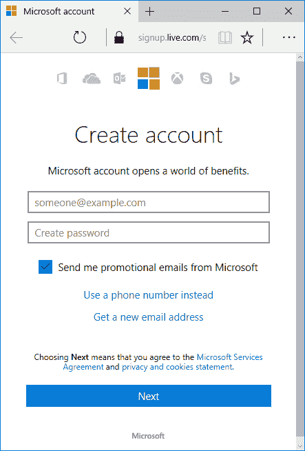

1.  创建完您的帐户后，您将被提示返回 Visual Studio 进行登录。登录后，Visual Studio 将在 IDE 的右上角显示您的详细信息：

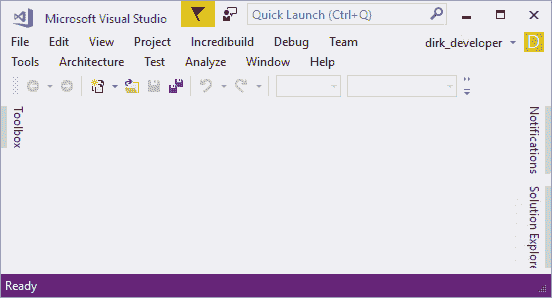

1.  单击您的帐户名称旁边的向下箭头，您可以查看您的帐户设置....

1.  这将向您显示您的帐户摘要，您可以在其中进一步个性化您的帐户：

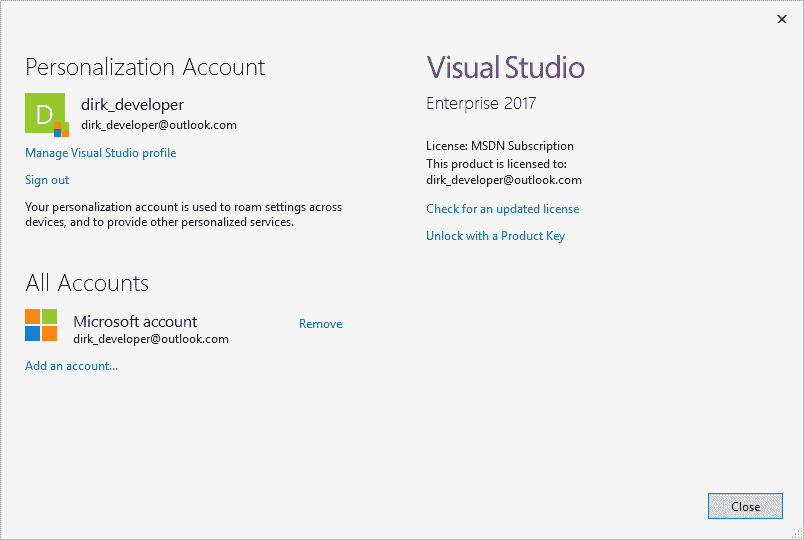

# 它是如何工作的...

源代码控制的选择是每个开发人员都有强烈意见的话题。不幸的是，如果您为老板工作，这个决定可能甚至不取决于您。许多公司已经按照他们喜欢的方式设置了他们的源代码控制系统，您需要遵守公司的程序。这就是现实。然而，作为独立开发人员，了解可用的选项是很好的。

所有优秀的开发人员也应该在自己的时间里编写代码。您不仅在工作时才是开发人员。我们吃饭、呼吸、睡觉，生活中都离不开代码。这是我们是谁以及我们是什么的一部分。我会说，为了成为更好的开发人员，您必须在自己的时间里玩弄代码。开始一个小项目，召集一些朋友，决定一起编写一些软件。这不仅会让您们都变得更好，而且您们会互相学到很多东西。

如果您是一名远程开发人员，不需要每天通勤到办公室工作，您仍然可以与开发人员社区联系。开发人员有很多资源可用，开发人员社区也乐意围绕新手提供帮助。如果您不致力于保护您的代码，开始一个独立或小项目是没有意义的。而要做到这一点，您也不必花一分钱。**Visual Studio Online**（现在称为**团队服务**）和 GitHub 为开发人员提供了一个绝佳的平台来保护您的代码。

让我们首先看看团队服务。可以通过将浏览器指向[`www.visualstudio.com/team-services/`](https://www.visualstudio.com/team-services/)来找到该网站。

在这里，您将看到微软为开发人员提供了使用团队服务的绝佳机会。最多可免费使用五个用户。这意味着您和您的伙伴可以共同致力于下一个大项目，同时确保您的代码保持安全。注册非常简单，只需点击“免费开始”链接：

有关定价信息，请访问以下链接：

[`www.visualstudio.com/team-services/pricing/`](https://www.visualstudio.com/team-services/pricing/)

第二个优秀的选择是 GitHub。它在免费提供方面略有不同，要求开发人员在免费账户上使用公共存储库。如果您不介意您的代码基本上是开源的，那么 GitHub 是一个很好的选择。不过，使用 GitHub，您可以拥有无限的合作者和公共存储库：

有关定价信息，请访问以下链接：

[`github.com/pricing`](https://github.com/pricing)

源代码控制的选择基本上取决于您的代码的开放性。如果您可以让其他开发人员看到并下载您的代码，那么 GitHub 是一个很好的选择。如果您需要您的代码保持私密，并且只在特定人员之间共享，那么付费的 GitHub 账户会更适合您。如果您还不想花钱，那么团队服务将是您最好的选择。

# 设置 Visual Studio GitHub 集成，首次提交代码，以及提交更改

多年来，GitHub 一直是一股强大的力量。有开发人员对它赞不绝口。事实上，使用 Apple 的 Xcode IDE 时，它是默认选项。无论出于何种原因，您决定使用 GitHub，可以放心，您和您的代码都在安全的手中。

# 做好准备

以下步骤将假定您已经注册了 GitHub 账户，并且已启用了双因素身份验证。如果您还没有注册 GitHub 账户，可以访问[`github.com/`](https://github.com/)注册一个新账户。要在 GitHub 账户上启用双因素身份验证（我个人强烈建议这样做），请执行以下操作：

1.  点击个人资料图片旁边的向下箭头，然后选择设置：

1.  从下一个网页左侧出现的个人设置菜单中，选择安全性：

1.  安全页面的第一部分将是您的双因素身份验证状态。要开始设置它，请单击“设置双因素身份验证”按钮。

1.  然后，您将看到什么是双因素身份验证的简要概述，并可以选择使用应用程序进行设置（我推荐的）或使用短信进行设置。使用应用程序是最简单的方法，如果您有智能手机或平板电脑，可以从适用的应用商店下载身份验证器应用程序。然后，按照 GitHub 给出的提示完成双因素身份验证设置。

1.  完成设置后，您的双因素身份验证将被打开。

# 如何做到的...

1.  将 GitHub 扩展添加到 Visual Studio 很容易，只需从以下链接下载 visx 并安装：[`visualstudio.github.com/downloads/GitHub.VisualStudio.vsix`](https://visualstudio.github.com/downloads/GitHub.VisualStudio.vsix)。

1.  假设您有要添加到 GitHub 的现有应用程序，那么将其添加到新存储库的过程非常简单。我只是创建了一个仅包含模板代码的控制台应用程序，但您可以将任何项目类型和大小添加到 GitHub。

1.  在 Visual Studio 2017 的“视图”菜单中，选择“Team Explorer”选项。

1.  在托管服务提供程序部分，您将看到两个选项。现在，我们将选择 GitHub，并且，因为我们已经有一个帐户，我们将单击“连接”...

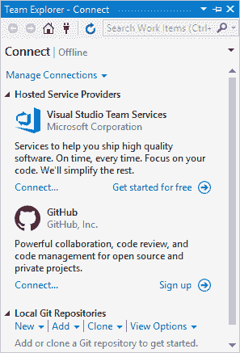

1.  现在，您将看到 GitHub 登录页面。如果您没有现有的 GitHub 帐户，您也可以从这里注册：

1.  因为我在 GitHub 帐户上设置了双因素身份验证，所以我被提示使用我的身份验证器应用程序输入生成的身份验证代码并进行身份验证：

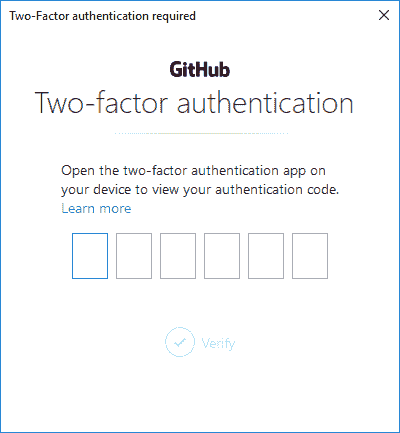

1.  认证后，您将返回到“管理连接”屏幕。如果您的项目未显示在本地 Git 存储库下，可以添加它：

1.  接下来，您将要单击主页图标，即 Team Explorer 窗口顶部的小房子图标。从主屏幕，单击“同步”按钮：

1.  这将向您显示发布窗口。在 GitHub 下，单击“发布到 GitHub”按钮。这将把您的项目发布到 GitHub 的新存储库中。

请记住，如果您使用的是免费的 GitHub，那么您的所有存储库都是公开的。如果您正在编写不能公开的代码（不是开源的），那么请注册一个包括私人存储库的付费 GitHub 帐户。

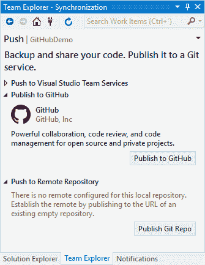

1.  GitHub 随后会提示您添加此发布的详细信息。因为您之前连接到了 GitHub，所以您的用户名将已在下拉菜单中选择。准备好后，单击“发布”：

1.  项目发布到 GitHub 后，您将自动返回到主屏幕：

1.  查看您的 GitHub 帐户在线，您将看到项目已添加：

1.  接下来，让我们去对`GitHubDemo`应用程序进行一些更改。只需添加一个新类到您的项目中。我称我的为`NewClass.cs`，但您可以随意命名。

1.  您会注意到，一旦对项目进行更改，解决方案将用红色勾标记更改的项目。您的类将用绿色加号标记：

1.  要将更改添加到 GitHub 存储库，您可以选择两种方法。第一种选择是转到 Team Explorer - 主页窗口，然后单击“更改”按钮。

1.  第二种（我认为更方便的）选择是在“解决方案资源管理器”中右键单击解决方案，然后从上下文菜单中单击“提交...”菜单项。

1.  第一次执行提交时，GitHub 可能会要求您提供用户信息。

1.  在允许提交更改之前，您必须填写所需的提交消息。在真实的团队项目中，在提交消息中尽可能详细地描述。考虑使用任务项代码（或积压代码）来唯一标识所添加的代码。这将在未来的某个时候为您（或其他开发人员）节省时间，我保证：

1.  需要注意的一件重要事情是，如果单击“提交所有”按钮旁边的向下箭头，您将有三个提交选项可供选择。提交所有按钮将仅记录您在本地机器上进行的更改。换句话说，更改不会反映在远程存储库中。提交所有并推送按钮将记录本地机器上的更改，并将这些更改推送到您的远程 GitHub 存储库。提交所有并同步按钮将记录本地机器上的更改，然后将从远程存储库中拉取任何更改，最后进行推送。如果您正在团队中工作，您将希望这样做。但是，对于本教程，我将只进行提交所有并推送，因为我是唯一在这个存储库上工作的开发人员：

1.  当提交完成后，团队资源管理器 - 同步窗口将通知您提交成功：

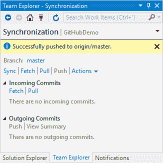

1.  转到 GitHub 在线，您将看到新推送的更改反映在您的 GitHub 存储库中，以及提交消息：

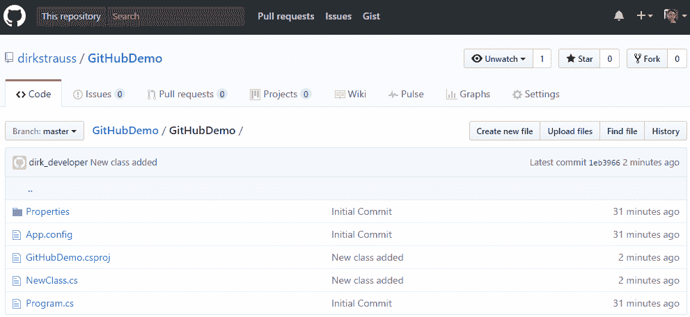

1.  GitHub 是任何开发人员的绝佳源代码控制解决方案。考虑创建一个开源项目。它比您想象的更有益。

如今，越来越多的潜在雇主在考虑开发人员职位申请者时会审查他们的 GitHub 存储库。请记住这一点，因为 GitHub 存储库本身就是一份简历。

# 它是如何工作的...

免费的 GitHub 帐户允许您创建公共存储库。这意味着任何人都可以从 GitHub 搜索、查看和克隆您的项目到他们自己的桌面。这是 GitHub 的核心理念。这显然是独立开发人员和不想花钱的公司的关键因素。公司可以承受比独立开发人员更多的费用，但我认为一些公司更喜欢自己动手，而不是使用云中托管的服务提供商。这意味着他们更喜欢通过在自己的公司服务器上设置源代码控制系统来保持对源代码控制的控制。对于独立开发人员来说，GitHub 作为一个选择是一个很棒的解决方案。对于那些需要私有存储库的人来说，费用也不是一个障碍。

# 使用 GitHub 作为团队合作，处理和解决代码冲突

在团队中工作时，GitHub 和 Team Services 真的发挥了作用。协作努力的效果非常强大。不过，有时可能会有些挑战。让我们看看如何使用 GitHub 在团队设置中工作。

# 准备工作

我们将使用已经检入 GitHub 的现有`GitHubDemo`应用程序。假设一个新的开发人员（我们称之为约翰）加入了团队。在您允许他将代码推送到您的分支之前，您需要将他添加为合作者。要做到这一点，请登录 GitHub，然后单击`GitHubDemo`存储库中的设置选项卡。单击左侧菜单中的合作者。

然后，您可以通过输入他们的 GitHub 用户名、全名或电子邮件地址来搜索要添加的合作者：

完成后，单击“添加合作者”按钮将约翰添加为项目的合作者：

约翰将收到一封电子邮件，并首先需要回复您的合作邀请。

# 如何做...

1.  约翰开始设置他的 Visual Studio 环境，包括通过单击菜单中的团队并单击管理连接来连接到 GitHub....

1.  他用电子邮件地址和密码登录 GitHub。

请注意，如果您刚刚注册 GitHub，您需要单击发送到注册时指定的电子邮件地址的验证电子邮件。如果未验证您的电子邮件地址，您将无法从 Visual Studio 登录。

1.  连接后，约翰看到他的 GitHub 详细信息已加载：

1.  他现在想要在 GitHub 上工作`GitHubDemo`应用程序，并通过名称搜索在 GitHub 上找到它：

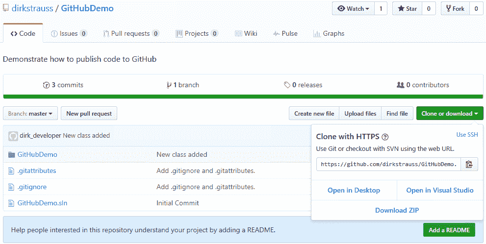

1.  他现在从克隆或下载按钮的“使用 HTTPS”文本框中复制 URL：

1.  回到 Visual Studio，约翰展开本地 Git 存储库并单击克隆。他将复制的 URL 粘贴到 Git 存储库路径，并指定代码应克隆到他的硬盘上的位置。然后单击克隆：

1.  当代码被克隆时，它将在约翰之前指定的文件夹路径中。

1.  是时候对代码进行一些更改了。他像往常一样在 Visual Studio 中打开项目。约翰决定在`NewClass`类上工作，并添加一个返回倒计时整数的新函数：

1.  代码更改完成后，约翰准备提交他刚刚添加到`GitHubDemo`项目的代码。

1.  添加提交消息后，然后单击“提交所有”和“同步”。

一个重要的事情要注意的是，如果您单击“提交所有”按钮旁边的向下箭头，您将有三个提交选项可供选择。此按钮将仅记录您在本地计算机上进行的更改。换句话说，更改不会反映在远程存储库中。 “提交所有并推送”按钮将记录本地计算机上的更改，并将这些更改推送到远程 GitHub 存储库。 “提交所有并同步”按钮将记录本地计算机上的更改，然后将从远程存储库中拉取任何更改，最后将进行推送。

1.  约翰的更改已提交到 GitHub 存储库：

1.  在办公室的另一边，我正在处理相同的一小部分代码。唯一的问题是我已经添加了相同的方法，并使用了自己的`CountDown`逻辑实现：

1.  我准备好并提交我的更改到 GitHub：

1.  GitHub 立即阻止我这样做。这是因为如果我的代码被推送，John 之前的提交将会丢失。GitHub 在 GitHub 帮助中有关于这个主题的很好的帮助文件[`help.github.com/articles/dealing-with-non-fast-forward-errors/`](https://help.github.com/articles/dealing-with-non-fast-forward-errors/)。

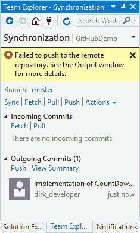

输出窗口包含更详细的错误消息：

<q>推送到远程存储库时遇到错误：被拒绝的更新，因为远程包含您本地没有的工作。这通常是由另一个存储库推送到相同的引用引起的。您可能需要在再次推送之前先集成远程更改。</q>

1.  要解决此问题，请单击“拉取”以获取约翰最新的提交。然后您的代码将处于冲突状态。听起来很糟糕，但实际上并不是。这让您控制决定使用哪些代码。您可以看到拉取显示有冲突的文件，还有约翰添加的传入提交消息：

1.  要查看冲突，请点击消息弹出窗口中的解决冲突链接：

1.  然后您将看到解决冲突屏幕，列出了冲突的文件。单击文件将其展开为简短摘要和操作选项屏幕。始终明智地单击“比较文件”链接以查看冲突文件之间的差异：

1.  代码上的差异立即显而易见。从这里开始，你们团队的工作流程取决于你们如何合作。通常，冲突可能会非常复杂，因此与相关开发人员讨论未来的方向总是一个好主意：

1.  在这种情况下，约翰和我决定他的代码更好、更简洁。因此，决定只需点击“接受远程”并使用约翰的代码。当你点击链接后，需要点击“提交合并”：

1.  添加提交消息后，你可以将代码推送到仓库。在这种情况下，我只是用约翰的代码替换了我的所有代码，但可能会出现一些情况，你需要使用一些你的代码和另一位开发者的代码。GitHub 允许我们轻松处理这些冲突。

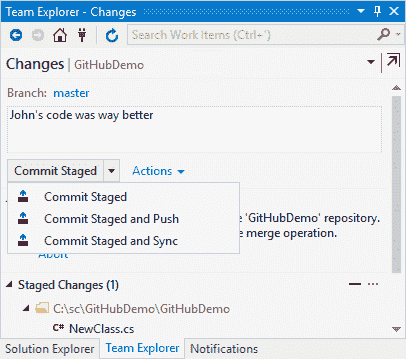

1.  将代码推送到远程后，GitHub 会通知你代码已成功同步：

# 它是如何工作的...

GitHub 简化了提交、解决冲突和合并代码的痛苦。毫无疑问，它是任何开发者工具包中的必备工具，也是开发团队的必备工具。即使你不是专业使用它，为自己创建一个仓库也是一个好主意。开始使用它来检查你在下班后工作的宠物项目。将你的知识扩展到日常工作之外，这将使你成为一个更好的开发者。
