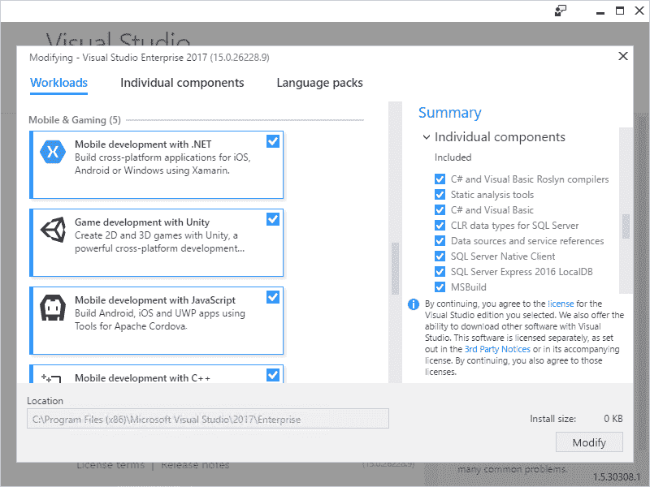
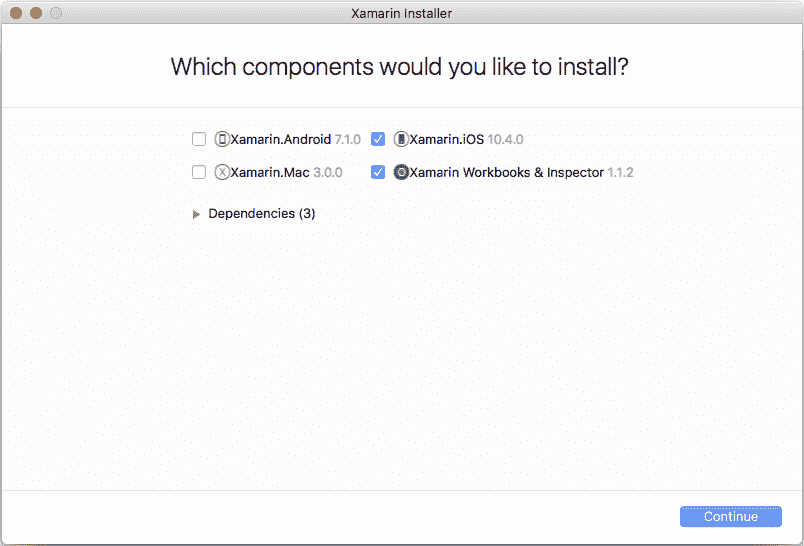
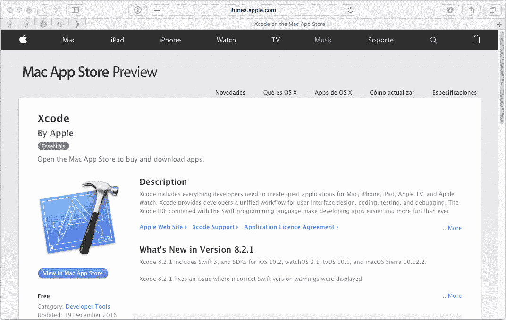
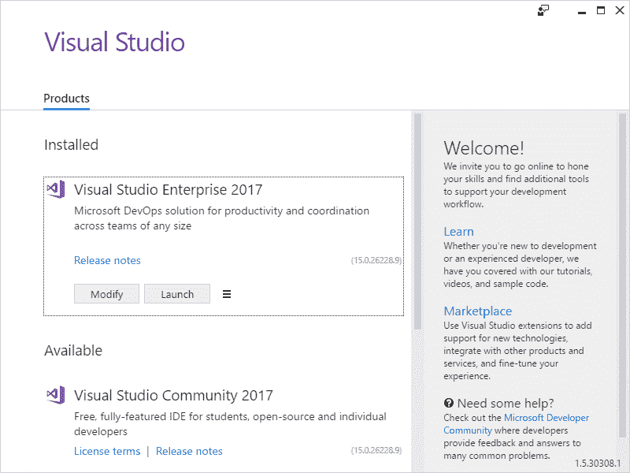
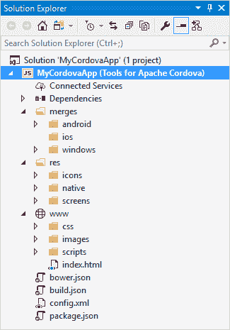
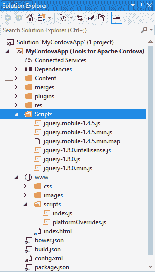
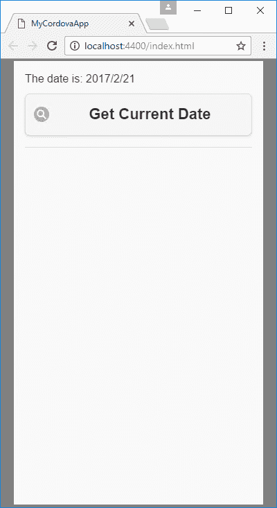
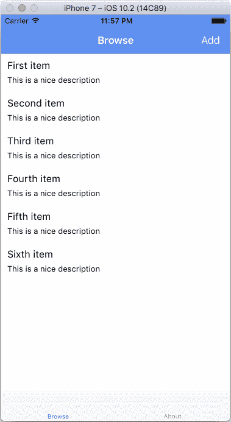

# 第十三章：在 Visual Studio 中创建移动应用程序

Visual Studio 是**集成开发环境**（**IDEs**）的**强大工具**。毫无疑问。作为开发人员，您可以通过为各种平台创建应用程序来尽情发挥您的多才多艺。其中之一就是移动开发。开发人员开始创建移动应用程序，但不想使用不同的 IDE。使用 Visual Studio，您不必这样做。它将允许您创建 Android 和（现在还有**Xamarin**）iOS 和 Mac 应用程序。

因此，本章将讨论以下概念：

+   在您的 Windows PC 和 Mac 上安装 Xamarin 和其他所需组件

+   在 Visual Studio 中使用 Apache Cordova 创建移动应用程序

+   使用 Xamarin.Forms 和 Visual Studio for Mac 创建 iOS 应用程序

# 介绍

如果您还没有听说过 Xamarin，我们鼓励您搜索一下这个工具。传统上，开发人员需要使用**Xcode**或**NetBeans**来创建 iOS 和 Android 应用程序。对开发人员来说，挑战在于这意味着需要学习一种新的编程语言。例如，如果您创建了一个要部署到 iOS、Android 和 Windows 的应用程序，您需要了解 Objective-C 或 Swift、Java 和.NET 语言。

这也为开发带来了额外的挑战，因为这意味着必须维护多个代码库。如果在应用程序的 Windows 版本中进行更改，还必须对 iOS 和 Android 代码库进行更改。有时公司会为每个平台管理不同的开发团队。您可以想象在多个团队和多个平台上管理变更所涉及的复杂性。如果您正在处理一个庞大的代码库，这一点尤为真实。

Xamarin 通过允许.NET 开发人员使用标准.NET 库在 Visual Studio 中创建 iOS 和 Android 应用程序来解决了这个问题。作为.NET 开发人员，您现在可以使用您已经拥有的技能来完成这个任务。简而言之，您将为您的应用程序创建一个共享库，然后为不同的平台创建不同的外观。第二个选择是使用 Xamarin.Forms 创建一个 Visual Studio 项目并针对所有三个平台。这使得开发人员很容易地针对多个平台进行开发。

# 在您的 Windows PC 和 Mac 上安装 Xamarin 和其他所需组件

Xamarin 到底是如何工作的？看起来确实像魔术，对吧？我的意思是，在 Visual Studio 中编写 C#并在另一端编译成本地的 iOS、Mac 或 Android 应用程序确实看起来像魔术。许多技术已经投入到让开发人员有能力做到这一点。对于 iOS 和 Mac 应用程序，这个过程有点复杂。如果您想要针对 iOS 或 Mac，需要使用 Mac 来构建您的 iOS 应用程序。有一些服务可以让 Mac 远程测试和编译（例如 MacinCloud，[`www.macincloud.com/`](http://www.macincloud.com/)）。然而，这些服务会产生月费。当 Xamarin 编译您的 C#代码时，它会针对 Mono 框架的一个特殊子集进行编译。

Mono 由微软赞助，是.NET Framework 的开源实现。这是基于**C#**和**公共语言运行时**的 ECMA 标准。有关 Mono 框架的更多信息，请查看[`www.mono-project.com/`](http://www.mono-project.com/)。

特别是针对 iOS，这个特殊子集包括允许访问 iOS 平台特定功能的库。Xamarin.iOS 编译器将接受您的 C#代码并将其编译成一种称为 ECMA CIL 的中间语言。然后，这个**通用中间语言**（**CIL**）会再次编译成 iPhone 或 iPad 可以运行的本地 iOS 代码。然后您还可以将其部署到模拟器进行测试。

现在，您可能会想为什么需要 Mac 来编译您的应用程序？为什么不能在 Visual Studio 内部完成所有操作？嗯，这是由于苹果对 iOS 内核生成代码的能力施加了（相当巧妙的）限制。它根本不允许这种情况发生。正如您所知道的（这是极其简化的解释），当您的 C#源代码编译进行测试时，它被编译成中间语言。**即时**（**JIT**）编译器然后将中间语言编译成适合您所针对的架构的汇编代码。由于 iOS 内核不允许 JIT 编译器进行按需编译，代码是使用**提前编译**（**AOT**）编译进行静态编译的。

要查看 Xamarin.iOS 的限制，请参阅以下链接：

[`developer.xamarin.com/guides/ios/advanced_topics/limitations/`](https://developer.xamarin.com/guides/ios/advanced_topics/limitations/) 查看 Xamarin.iOS、Xamarin.Mac 和 Xamarin.Android 中可用程序集的列表，请参阅以下支持文档：

[`developer.xamarin.com/guides/cross-platform/advanced/available-assemblies/.`](https://developer.xamarin.com/guides/cross-platform/advanced/available-assemblies/)

这背后的技术非常令人印象深刻。难怪微软收购了 Xamarin 并将其作为 Visual Studio 的一部分。为跨平台开发提供开发者这样一系列选择正是微软的目标：赋予开发者创造世界一流应用程序的能力。

# 准备工作

在本教程中，我们将介绍如何在运行 Visual Studio 2017 的 Windows PC 上安装 Xamarin。Xamarin 可以作为工作负载的一部分在安装 Visual Studio 2017 时安装。现在，让我们假设 Xamarin 尚未安装，并且您需要在安装 Visual Studio 后立即进行安装。转到 Visual Studio 网站[`www.visualstudio.com/`](https://www.visualstudio.com/)，并下载您安装的 Visual Studio 版本的安装程序。

您还可以在 Visual Studio 2017 的“新建项目”对话框屏幕上运行安装程序。如果您折叠已安装的模板，您将看到一个允许您打开 Visual Studio 安装程序的部分。

您还需要安装 Xcode，这是苹果的开发环境。您可以从 Mac App Store 免费下载。

请注意，您需要有 iTunes 登录才能下载 Xcode 并完成 Mac 的设置。如果您有 Mac，那么您很可能也有 iTunes 登录。

# 如何操作...

1.  双击从 Visual Studio 网站下载的安装程序。您将看到显示您的 Visual Studio 2017 版本，并且会出现一个“修改”按钮。点击“修改”按钮：


1.  这将显示可用的工作负载。在“移动和游戏”部分下，确保选择“使用.NET 进行移动开发”。然后，点击右下角的“修改”按钮：



1.  如果我们想要使用 Xamarin 来针对 iOS 应用程序，还有第二步需要采取。我们必须在 Mac 上安装所需的软件。在 Mac 上访问 Xamarin 的网站。网址是[`www.xamarin.com/`](https://www.xamarin.com/)。点击“产品”下拉菜单，从列表中选择 Xamarin 平台：


1.  您还可以通过访问[`www.xamarin.com/platform`](https://www.xamarin.com/platform)来访问所需的页面。单击“立即免费下载”按钮将在您的 Mac 上安装一个名为**Xamarin Studio Community**的东西。您需要知道的是，当在 Mac 上安装时，Xamarin Studio 无法创建 Windows 应用程序。它只允许您在 Mac 上创建 iOS 和 Android 应用程序。除了 Xamarin Studio，您还将获得 Xamarin Mac 代理（以前称为 Xamarin 构建主机）。这是一个必需的组件，以便您可以将您的 PC 链接到 Mac，以构建您的 iOS 应用程序。最后，PC 和 Mac 还必须能够通过网络相互连接（稍后会详细介绍）。

1.  在 Mac 上下载安装程序后，安装过程很简单。您会注意到在安装屏幕上有一些选项可供选择：Xamarin.Android、Xamarin.iOS、Xamarin.Mac 和 Xamarin Workbooks & Inspector。如果您想要以 Android 作为平台，您将安装 Xamarin.Android。要针对 iOS（iPhone 或 iPad），您需要选择 Xamarin.iOS。要创建完全本机的 Mac 应用程序，您必须选择 Xamarin.Mac。最后，Xamarin Workbooks & Inspector 为开发人员提供了一个与应用程序调试集成的交互式 C#控制台，以帮助开发人员检查运行中的应用程序。目前，我们只对 Xamarin.iOS 感兴趣。只需按照屏幕提示完成安装。根据您的选择，安装程序将下载所需的依赖项并将其安装在您的 Mac 上。根据您的互联网连接，您可能想去喝杯咖啡：



1.  最后，如果您尚未从 Mac App Store 安装 Xcode，请在继续之前立即这样做：



# 它是如何工作的...

我们之前安装 Xamarin 时所采取的步骤将使我们能够在开发跨平台时针对 Mac、iOS 和 Android（如果我们选择了 Xamarin.Android）平台进行开发。以前（在 Visual Studio 2015 之前），开发人员必须学习一个新的集成开发环境，以便提升自己的技能，以创建其他平台的应用程序。就我个人而言，我发现 Xcode（用于创建本机 iOS 和 Mac 应用程序的苹果开发人员集成开发环境）有点学习曲线。这不是因为它太复杂，而是因为它显然与我在 Visual Studio 中习惯的方式不同。如果您真的想学习另一种编程语言，并且想要选择 Xcode 的路线，请看看 Swift。这是一种出色的语言，我发现它比 Objective-C 更容易与 C#相关联。

然而，如果您宁愿坚持您所知道并且熟悉的内容，那么 Xamarin 是您开发跨平台应用程序的最佳选择。您也不必去购买 MacBook 来编译您的应用程序。当您想要开始为 iOS 和 Mac 开发时，Mac mini 已经足够了。这是对您的开发工具集的一种投资，将使您受益匪浅。作为开发人员，您还可以选择云选项（例如 MacinCloud）。使用 Xamarin，您可以坚持使用 C#并在您熟悉的环境中开发。

开发人员还有第三种最终选择，这是我们将在本章的最后一个配方中进行讨论的。本配方中的步骤是用于在 Windows PC 上创建应用程序并在 Mac 或 MacinCloud 解决方案上编译它们的情况。

# 使用 Apache Cordova 创建移动应用程序

使用 Apache Cordova 创建移动应用程序一点也不复杂。如果您熟悉 Web 开发，那么这对您来说会感觉非常自然。对于那些以前没有开发过 Web 应用程序的人来说，这将帮助您熟悉这个过程。这是因为 Cordova 的本质是一个 Web 应用程序。您引用诸如 JS 文件和 CSS 文件之类的文件，并且您可以在浏览器中调试`index.html`文件。

Cordova 应用程序为您提供了针对 iOS、Android 或 Windows 应用程序的灵活性。这个教程将演示一个简单的应用程序，当用户在应用程序中点击按钮时，它会显示当前日期。

# 准备工作

您需要在 Visual Studio 2017 安装过程中安装 JavaScript 工作负载。现在，让我们假设您在安装 Visual Studio 2017 时没有安装它，现在需要再次运行安装程序。

您还可以在 Visual Studio 2017 的新项目对话框屏幕中运行安装程序。如果折叠已安装的模板，您将看到一个允许您打开 Visual Studio 安装程序的部分。

转到 Visual Studio 网站[`www.visualstudio.com/`](https://www.visualstudio.com/)，并下载您安装的 Visual Studio 版本的安装程序。还要注意，您需要在计算机上安装 Google Chrome，以便启动 Cordova 应用程序模拟器。

# 如何做到这一点...

1.  双击从 Visual Studio 网站下载的安装程序。这将启动安装程序，并列出安装在您的计算机上的 Visual Studio 2017 版本，并显示一个修改按钮。点击修改按钮：



1.  从“移动和游戏”组中，选择 JavaScript 工作负载的移动开发。然后，点击修改按钮。根据您的具体要求，可能会安装其他组件，例如**Android SDK**和**Google Android 模拟器**的支持：


1.  Apache Cordova 使用诸如 HTML、CSS 和 JavaScript 之类的 Web 技术来构建可在 Android、iOS 和 Windows 设备上运行的移动应用程序。从 Visual Studio 创建一个新应用程序，并从其他语言模板中选择 JavaScript。然后选择空白应用程序（Apache Cordova）模板。这只是一个使用 Apache Cordova 构建 Android、iOS 和**通用 Windows 平台**（**UWP**）的空白项目。我只是把我的应用叫做 MyCordovaApp。

1.  一旦 Visual Studio 创建了您的应用程序，您会注意到它有一个非常特定的文件夹结构：

+   `merges`：展开`merges`文件夹，您会注意到有三个名为`android`、`ios`和`windows`的子文件夹。开发人员可以使用这些文件夹根据他们正在针对的移动平台提供不同的内容。

+   `www`：这是您的大部分开发将发生的地方。`index.html`文件将成为 Cordova 应用程序的主要入口点。当启动您的移动应用程序时，Cordova 将查找这个索引文件并首先加载它。您还会注意到`www`文件夹下面有子文件夹。把它们想象成一个常规的 Web 应用程序文件夹结构，因为它们确实就是。`css`子文件夹将包含您需要使用的任何样式表。

您需要在移动应用程序中使用的任何图像都将存储在`images`子文件夹中。最后，您将在`scripts`子文件夹中添加任何移动（Web）应用程序使用的 JavaScript 文件。如果展开`scripts`子文件夹，您会注意到一个名为`platformOverrides.js`的 JavaScript 文件。这与`merges`文件夹一起使用，根据您正在针对的移动平台提供特定的 JavaScript 代码。

+   `res`：`res`文件夹将用于存储可能被不同原生移动应用程序使用的非 Web 应用程序资源。这些资源可以是启动画面、图片、图标、签名证书等等：



您还会注意到几个配置文件。这些是`bower.json`、`build.json`、`config.xml`和`package.json`。虽然我不会详细介绍这些配置文件中的每一个，但我想简要提一下`config.xml`和`package.json`文件。在撰写本书时，`package.json`文件目前未被 Cordova 使用。它旨在最终取代`config.xml`文件。目前，`config.xml`文件包含特定于您的移动应用程序的设置。双击此文件以查看 Cordova 应用程序的自定义编辑器。自定义编辑器通过提供一个标准的 Windows 表单，避免了直接编辑 XML 文件的复杂性，您可以在其中输入特定于应用程序的设置。作为开发人员，您可以使用的设置包括应用程序名称、作者名称、应用程序描述、设备方向、插件配置等等。

非常重要的是，不要删除`config.xml`文件。这样做将破坏您的解决方案，Cordova SDK 将无法构建和部署您的移动应用程序。

1.  此时，您可以从调试下拉菜单中选择一个设备并运行您的移动应用程序。如果您必须选择在浏览器中模拟 - Nexus 7（平板电脑），Visual Studio 将启动 Google Chrome 并显示默认的 Cordova 应用程序。这是每个 Cordova 应用程序的默认设置，实际上并不包含任何功能。它只是让您知道您的 Cordova 应用程序已经正确启动。不过有趣的是，您会看到一个新的选项卡在 Visual Studio 中打开，同时您的模拟器被启动。它被称为 Cordova 插件模拟，并默认为地理位置插件。这允许开发人员与插件进行交互，并在应用程序在模拟器中运行时触发特定事件。向您的 Cordova 应用程序添加新插件将在 Cordova 插件模拟中公开额外的窗格：


1.  接下来，将 jQuery.mobile NuGet 包添加到您的解决方案中。NuGet 将会向您的解决方案安装 jQuery.1.8.0 和 jquery.mobile.1.4.5。在撰写本书时，建议不将 jQuery.1.8.0 升级到最新版本，因为存在兼容性原因：


1.  在您的解决方案中，NuGet 将向您的项目的`Scripts`文件夹添加几个 JS 文件。将所有这些 JS 文件拖到您的`www/scripts`文件夹中。对于项目的`Content`文件夹也是一样。将所有 CSS 文件和`images`子文件夹拖到`www/css`文件夹中：



1.  返回并打开您的`index.html`文件。您将在`<body></body>`标签之间看到以下内容：

```cs
        <div class="app">
          <h1>Apache Cordova</h1>
          <div id="deviceready" class="blink">
            <p class="event listening">Connecting to Device</p>
            <p class="event received">Device is Ready</p>
          </div>
        </div>

```

这是模板添加的默认样板代码，我们将不使用它。将其替换为以下代码，并在其他脚本引用的底部部分添加`<script src="img/jquery-1.8.0.min.js"></script>`和`<script src="img/jquery.mobile-1.4.5.min.js"></script>`。

请注意，您的 JS 文件版本可能与之前引用的版本不同。

完成后，您的`<body></body>`部分应如下所示：

```cs
        <body>
          <div role="main" class="ui-content">
            <form>
              <label id="current-date">The date is:</label>
              <button id="get-date-btn" data-role="button" 
                data-icon="search">
                Get Current Date</button>
            </form>
          </div>
          <script src="img/jquery-1.8.0.min.js"></script>
          <script src="img/jquery.mobile-1.4.5.min.js"></script>
          <script src="img/cordova.js"></script>
          <script type="text/javascript" src="img/cordova.js"></script>
          <script type="text/javascript" src=
            "scripts/platformOverrides.js"></script>
          <script type="text/javascript" src="img/index.js"></script>
        </body>

```

1.  然后，在`<head></head>`标签之间，添加上述`<link rel="stylesheet" href="css/jquery.mobile-1.4.5.min.css" />`样式引用，放在现有的`<link rel="stylesheet" type="text/css" href="css/index.css">`引用之上。

请注意，您的 CSS 文件版本可能与之前引用的版本不同。

完成后，您的代码应该类似于以下内容：

```cs
        <head>
          <!--
            Meta references omitted for brevity
          -->
          <link href="css/jquery.mobile-1.4.5.min.css" rel="stylesheet" />
          <link rel="stylesheet" type="text/css" href="css/index.css">
          <title>MyCordovaApp</title>
        </head>

```

1.  您的应用程序现在包括所需的 jQuery 库，这将使您的移动应用程序移动和触摸优化。您的移动应用程序现在也对其将显示在的设备具有响应性。现在我们需要为应用程序添加一些基本样式。打开`index.html`文件中`<head></head>`部分引用的`index.css`文件。这应该在`www/css/index.css`中。用以下代码替换内容。`#get-date-btn`只是引用我们表单上的按钮，并将字体大小设置为 22 像素。`form`被设计为在底部包含 1 像素宽的实线边框：

```cs
        form {
          border-bottom: 1px solid #ddd;
          padding-bottom: 5px;
        }

        #get-date-btn {
          font-size: 22px;
        }

```

1.  现在我们需要为用户点击“获取当前日期”按钮时添加一个点击事件。为此，打开位于`www/scripts/index.js`的`index.js`文件。找到`onDeviceReady()`方法，并修改代码如下：

```cs
        function onDeviceReady() {
          // Handle the Cordova pause and resume events
          document.addEventListener( 'pause', onPause.bind(
            this ), false );
          document.addEventListener( 'resume', onResume.bind(
            this ), false );

          $('#get-date-btn').click(getCurrentDate);
        };

```

1.  将此代码视为`get-date-btn`按钮的事件处理程序。实际上，它正在向按钮添加一个点击监听器，每当用户点击按钮时，它将调用`getCurrentDate`函数。现在可能是时候提到包含`onDeviceReady()`函数的`(function () { ... })();`函数了。这被称为**匿名自调用函数**，实际上只是您可以将其视为表单加载事件。您会注意到它为`onDeviceReady()`方法添加了一个事件处理程序。

1.  最后，将`getCurrentDate()`函数添加到`index.js`文件中。

为了本教程的目的，我将保持简单，并将`getCurrentDate()`函数添加到`index.js`文件中，因为代码并不是非常复杂。对于更复杂的代码，最好创建一个单独的 JS 文件，并在`index.html`页面中引用该 JS 文件（在`<body></body>`部分的底部）以及其他 JS 文件引用。

`getCurrentDate()`函数并不特别。它只是获取日期并将其格式化为`yyyy/MM/dd`格式，并在`index.html`页面的标签中显示它。您的函数应该如下所示：

```cs
        function getCurrentDate()
        {
          var d = new Date();
          var day = d.getDate();
          var month = d.getMonth();
          var year = d.getFullYear();
          $('#current-date').text("The date is: " + year + "/"
            + month + "/" + day);
        }

```

# 它是如何工作的...

您现在可以开始调试您的应用程序。让我们在 Visual Studio 中选择不同的模拟器。选择在浏览器中模拟 - LG G5 并按*F5*：


Chrome 将启动并显示您的 Cordova 应用程序：


单击“获取当前日期”按钮，当前日期将显示在您刚刚单击的按钮上方：



当您的模拟器打开时，打开您添加了`getCurrentDate()`函数的`index.js`文件，并在读取`$('#current-date').text("The date is: " + year + "/" + month + "/" + day);`的行上设置断点。然后再次单击“获取当前日期”按钮：


您会注意到您的断点被触发，现在您可以逐步检查变量并调试您的应用程序，就像您习惯做的那样。您甚至可以设置条件断点。这简直太棒了。

使用 Cordova 开发应用程序还有很多要学习的。Web 开发人员会发现这个过程很熟悉，并且应该很容易掌握。现在您可以将此应用程序在任何平台上运行，因为它完全跨平台。接下来，您可以尝试使用其中一个可用的 Android 模拟器来运行您的 Cordova 应用程序。尝试一下这个示例，并添加一些更多的功能代码。尝试访问 Web 服务以检索值，或者尝试玩一下样式。

能够使用 Visual Studio 从单个解决方案针对不同的移动设备，使开发人员有自由进行实验，并找到最适合他们和他们开发风格的解决方案。Cordova 站出来为那些不使用 Xamarin 等解决方案的开发人员提供了一个奇妙的解决方案。

# 使用 Xamarin.Forms 和 Visual Studio for Mac 创建 iOS 应用程序

许多开发人员想要尝试编写 iOS 应用程序。一直以来的一个大缺点是需要学习一种新的编程语言和一个新的集成开发环境。对于一些人来说，这可能不是问题，因为他们想要学习新的东西。但对于许多.NET 开发人员来说，能够坚持使用他们熟悉的集成开发环境和编程语言是非常有力量的。这正是 Xamarin.Forms 和 Visual Studio 所实现的。

请注意，我在这里没有考虑 Xamarin.Android。我纯粹专注于编写原生的 iOS 和 Mac 应用程序。

Xamarin 为.NET 开发人员提供了使用 Visual Studio 编写跨平台应用程序的能力，而无需为每个平台单独创建代码库。因此，您可以为应用程序拥有一个单一的代码库，该代码库将在 Windows、iOS/macOS 和 Android 上运行。如果您想要开始开发原生的 iOS/macOS 应用程序，您基本上有四个可行的选择（在我看来）。它们如下：

+   购买一台 Mac 并自学 Xcode、Swift 和/或 Objective-C。

+   购买一台 Mac 并安装 Parallels，在其中您可以安装 Windows、Visual Studio 和其他基于 Windows 的软件（Mac 不仅仅用于开发）。您可以在我几年前创建的**Developer Community** YouTube 频道上观看一个视频（[`www.youtube.com/developercommunity`](https://www.youtube.com/developercommunity)）。在那个视频中，我向您展示了如何使用 Parallels 在 Mac 上安装 Visual Studio 2013。

+   购买一台 Mac 并下载**Visual Studio for Mac**（目前仍处于预览阶段），然后在 Mac 上安装该软件（Mac 专门用于开发 Android 和 iOS/macOS 应用程序）。

+   购买一台 Mac 并使用它来编译在运行 Visual Studio 的 Windows PC 上开发的 iOS/macOS 应用程序。如果您需要创建仍然可以针对基于 Windows 的平台以及 Android 和 iOS/macOS 的应用程序，那么可以这样做。

如果您要使用**Visual Studio for Mac**和 Xamarin.Forms，那么您将无法在 macOS 上创建 Xamarin.Forms 项目，因为这些项目无法在 macOS 上构建。还要注意的是，我没有在这里考虑 MacinCloud，因为在开发过程中的某个阶段，我认为拥有一台实体的苹果 Mac 设备是非常有益的。

从前面列出的要点可以清楚地看出，您需要一台 Mac。虽然在 Windows PC 上安装 Visual Studio 并在本地网络上连接到 Xamarin Mac 代理是完全可能的，但当您需要尝试远程访问 Mac 时（例如从您的工作办公室），这可能会有些不便。理论上，这应该是可能的，但您需要做一些工作才能使这一切正常运行。首先，您可能需要在路由器上添加某种端口转发，以允许远程连接到您的 Mac。您还需要为您的 Mac 分配一个静态 IP 地址（甚至为您的路由器购买一个静态 IP 地址），这样，如果在您远程工作时发生断电重启，您仍然能够访问您的 Mac 进行 Visual Studio 构建。

在 Mac 上安装 Parallels 非常方便，当您需要使用其他基于 Windows 的软件时，它将非常有用。如果您（像我一样）将 Mac 专门用于开发目的，那么 Parallels 可能不是一个可行的解决方案。这就留下了**Visual Studio for Mac**，如果您只计划开发 iOS/macOS 和 Android 应用程序，那么这是一个很好的选择。

要下载 Visual Studio for Mac，请前往[`developer.xamarin.com/visual-studio-mac/`](https://developer.xamarin.com/visual-studio-mac/)并单击下载链接。安装过程与本章第一个配方中的安装过程有些类似。不同之处在于实际的 Visual Studio 应用程序将安装在 Mac 上，而不是在同一网络上的 Windows PC 上。

# 准备工作

下载 Visual Studio for Mac 后，开始安装过程。这与第一个配方中概述的过程非常相似。完成可能需要一些时间，所以再次，去喝杯咖啡。使用 Visual Studio for Mac 创建应用程序对于从 Visual Studio for Windows 转到.NET 开发人员来说是一种熟悉的体验。

Visual Studio for Mac 的核心是用于重构和智能感知的 Roslyn 编译器。构建引擎是 MSBuild，调试器引擎与 Xamarin 和.NET Core 应用程序相同。Xamarin 开发和 Visual Studio for Mac 的软件要求如下：

+   您需要运行 OS X El Capitan（10.11）或 macOS Sierra 的 Mac。

+   需要 iOS 10 SDK，该 SDK 随 Xcode 8 一起提供。只要您拥有有效的 iTunes 帐户，就可以免费下载 Xcode。

+   Visual Studio for Mac 需要.NET Core，可以按照[`www.microsoft.com/net/core#macos`](https://www.microsoft.com/net/core#macos)中概述的步骤进行下载。您必须完成列出的所有步骤，以确保.NET Core 正确安装。当您在那里时，请注意观看 Kendra Havens 的一些 Channel 9 视频，了解如何开始使用.NET Core，网址是[`channel9.msdn.com/`](https://channel9.msdn.com/)。顺便说一句，还可以看看 Channel 9 上其他精彩的内容。

+   如果您计划将应用程序提交到 Apple 应用商店，则需要购买开发者许可证，目前价格为每年 99 美元。但是，您可以在不购买开发者许可证的情况下开发您的应用程序。

请注意，如果您计划在 Xamarin Studio 旁边安装 Visual Studio for Mac，则需要知道 Visual Studio for Mac 需要 Mono 4.8。安装 Xamarin Studio 将会将 Mono 降级到旧版本。为了解决这个问题，您需要在 Xamarin Studio 更新屏幕上选择退出 Mono 4.6 的选择。

有了这个相当详细的要求清单，让我们准备好创建一个 iOS 应用程序。

# 如何做...

1.  启动 Visual Studio for Mac，并使用您的 Microsoft 帐户详细信息登录。您会注意到“入门”部分，其中列出了许多有用的文章，帮助开发人员开始使用 Visual Studio for Mac：


1.  接下来，点击“新建项目...”，并在多平台应用程序模板中的 Xamarin.Forms 组中选择 Forms App 项目。然后，点击“下一步”：


1.  然后，我们需要为我们的应用程序命名和添加组织标识符。我只是将我的应用程序命名为`HelloWorld`，然后在“目标平台”下只选择了 iOS。点击“下一步”继续：


1.  最后，决定是否要配置项目以使用 Git 进行版本控制和 Xamarin Test Cloud。当您配置好所需的内容后，点击“创建”：


1.  创建项目后，您会注意到可以通过单击“调试”按钮旁边的向下箭头来选择要模拟的设备：


1.  这将列出不同的模拟器可供您使用，以及连接到您的 Mac 的任何设备（在本例中是我的 iPhone）：


1.  点击“运行”按钮将启动所选设备的模拟器，并显示创建 Xamarin.Forms iOS 应用程序时为您创建的默认应用程序：



1.  模拟器中的应用程序是完全可用的，您可以与其交互以了解模拟器的工作原理。如前所述，如果您的 Mac 上连接了 iOS 设备，甚至可以在设备上启动应用程序进行测试。例如，点击“关于”选项卡将显示“关于”页面：


1.  在 Visual Studio for Mac 中点击停止按钮，返回到您的解决方案。展开`ViewModels`和`Views`文件夹。您会看到一个非常熟悉的结构：


1.  在`ViewModels`文件夹中，打开`AboutViewModel.cs`文件。在构造函数`AboutViewModel()`中，您将看到以下代码：

```cs
        public AboutViewModel()
        {
          Title = "About";
          OpenWebCommand = new Command(() => Device.OpenUri(new 
            Uri("https://xamarin.com/platform")));
        }

```

1.  现在，为了说明 C#的使用，将此处的代码更改为以下代码清单的样子。您注意到了第一行代码吗？`var titleText =`后面的部分是一个插值字符串`$"Hello World - The date is {DateTime.Now.ToString("MMMM dd yyyy")}";`。插值字符串是在 C# 6.0 中引入的。点击播放按钮在模拟器中启动应用程序：

```cs
        public AboutViewModel()
        {
          var titleText = $"Hello World - The date is {
            DateTime.Now.ToString("MMMM dd yyyy")}";
          Title = titleText;
          OpenWebCommand = new Command(() => Device.OpenUri(new 
            Uri("https://xamarin.com/platform")));
        }

```

1.  现在，再次点击“关于”选项卡，查看标题。标题已更改为显示“Hello World”和当前日期：


# 工作原理...

好吧，我将首先承认，我们编写的代码并没有什么了不起的。实际上，我们基本上是在现有的应用程序上进行了一些修改，只是修改了一点代码来显示“Hello World”和当前日期。然而，需要记住的一件事是，我们编写了 C#代码并将其编译为本机 iOS 应用程序。

还有很多东西要学习。我们甚至还没有涉及使用 Visual Studio for Mac、Xamarin.Forms 和跨平台 C#应用程序现在提供的所有内容。Xamarin 有非常好的文档，将在您使用 Xamarin 开发应用程序的新途径时为您提供帮助。一个很好的案例研究是 Tasky 案例研究，可以在[`developer.xamarin.com/guides/cross-platform/application_fundamentals/building_cross_platform_applications/case_study-tasky/`](https://developer.xamarin.com/guides/cross-platform/application_fundamentals/building_cross_platform_applications/case_study-tasky/)找到。这将让您对使用 Xamarin 开发跨平台应用程序涉及的内容有一个很好的了解。

为什么不试着再玩一下我们刚刚创建的应用程序呢？看看有什么可能性，以及在处理数据库逻辑和读取用户输入方面有什么不同。Visual Studio for Mac 为开发人员打开了一个新世界，使得开发本机 iOS 应用程序比以往任何时候都更容易。
