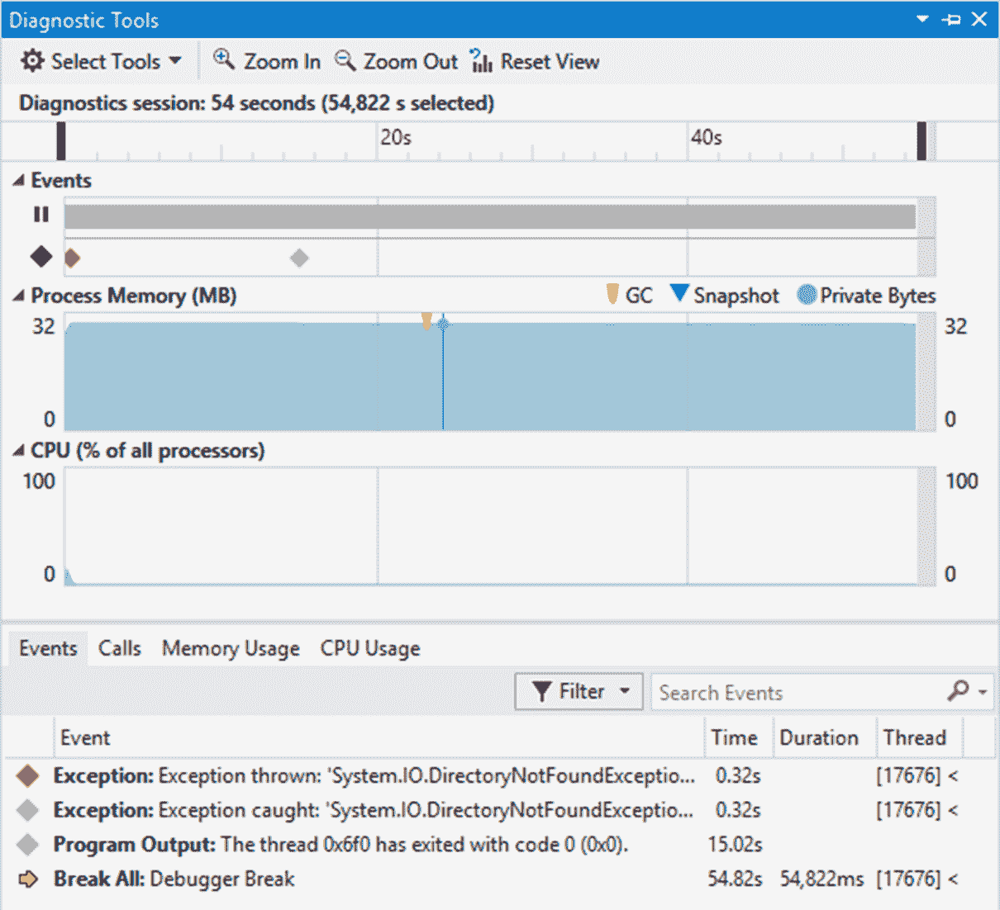
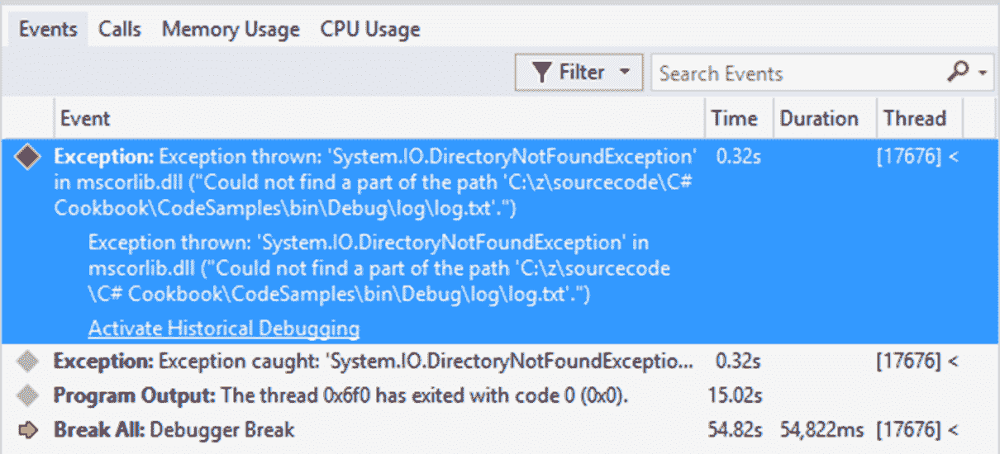
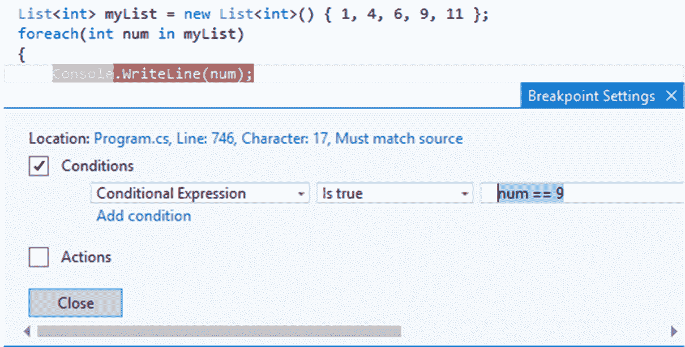
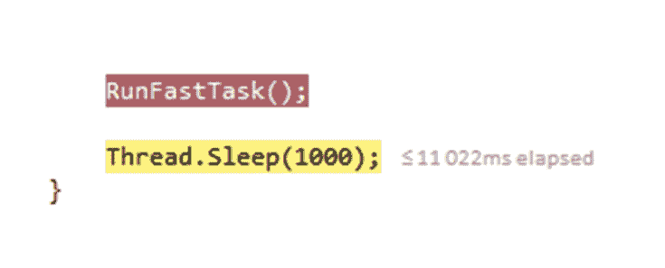

# 第十四章：在 Visual Studio 中编写安全代码和调试

在本章中，我们将看一些例子，作为开发人员在调试代码时更高效的方式。我们还将看看如何编写安全的代码。编写安全的代码可能是一个挑战，但请考虑以下内容：如果您的代码安全的一部分涉及确保密码安全存储，为什么要在项目之间一遍又一遍地编写代码？只需编写一次代码，然后在创建的每个新项目中实施它。我们将要看的概念如下：

+   正确加密和存储密码

+   在代码中使用 SecureString

+   保护 App.config/web.config 的敏感部分

+   防止 SQL 注入攻击

+   使用 IntelliTrace、诊断工具和历史调试

+   设置条件断点

+   使用 PerfTips 识别代码中的瓶颈

# 介绍

许多开发人员经常忽视的一点是编写安全的代码。开发期限和其他与项目相关的压力会导致开发人员将交付代码置于正确方式之上。你们中的许多人可能不同意我，但相信我，我已经听到“我们没有预算”这样的借口太多次了。这通常是在开发预算已由其他利益相关者确定且未经开发人员咨询时发生的。

考虑这样一种情况，顾问告诉开发人员他们已经向客户出售了一个系统。现在需要开发该系统。此外，开发人员被告知他们有*x*小时来完成开发。给开发人员提供了一份概述需求的文件，并允许开发人员开始，并在规定的时间内完成开发。

这种情况是许多开发人员面临的现实。你可能认为这种情况不可能存在，或者你正在阅读这篇文章，并将这种情况视为你公司目前的工作流程。无论情况如何，这是今天软件开发中发生的事情。

那么，开发人员如何应对项目自杀（我将这些项目称为这样，因为像这样处理的项目很少成功）？首先要创建可重用的代码。考虑一下你经常重复的流程是否值得编写可重用的 DLL。你知道你可以创建 Visual Studio 模板吗？如果你有一个标准的项目结构，可以从中创建一个模板，并在每个新项目中重用它，从而加快交付速度并减少错误。

项目模板的一些考虑因素是数据库层、安全层、常见验证代码（此数据表是否包含任何数据？）、常见扩展方法等等。

# 正确加密和存储密码

我经常看到的一件事是密码存储不当。仅仅因为密码存储在服务器上的数据库中，并不意味着它是安全的。那么，密码存储不当是什么样子呢？


存储不当的安全密码不再安全。上一张截图中的密码是实际用户密码。在登录屏幕上输入第一个密码`^tj_Y4$g1!8LkD`将使用户访问系统。密码应该安全地存储在数据库中。实际上，您需要使用盐加密密码。您应该能够加密用户的密码，但永远不要解密它。

那么，你如何解密密码以匹配用户在登录屏幕上输入的密码？嗯，你不会。你总是对用户在登录屏幕上输入的密码进行哈希处理。如果它与存储在数据库中的他们真实密码的哈希匹配，你就允许他们访问系统。

# 做好准备

本食谱中的 SQL 表仅用于说明，不是由食谱中的代码编写的。可以在伴随本书源代码的“_ 数据库脚本”文件夹中找到数据库。

# 如何做…

1.  最简单的方法是创建一个控制台应用程序，然后通过右键单击解决方案，选择“添加”，然后从上下文菜单中选择“新建项目”来添加一个新的类库。

1.  从“添加新项目”对话框屏幕中，从已安装的模板中选择“类库”，并将您的类命名为`Chapter15`。

1.  您的新类库将添加到解决方案中，并具有默认名称`Class1.cs`，我们将其重命名为`Recipes.cs`以正确区分代码。但是，如果您觉得更合理，可以将类重命名为任何您喜欢的名称。

1.  要重命名您的类，只需在“解决方案资源管理器”中单击类名，然后从上下文菜单中选择“重命名”。

1.  Visual Studio 将要求您确认对项目中代码元素 Class1 的所有引用的重命名。只需单击“是”。

1.  以下类将添加到您的`Chapter15`库项目中：

```cs
        namespace Chapter15 
        { 
          public static class Recipes 
          { 

          } 
        }

```

1.  在您的类中添加以下`using`语句：

```cs
        using System.Security.Cryptography;

```

1.  接下来，您需要向类中添加两个属性。这些属性将存储盐和哈希值。通常，您将这些值与用户名一起写入数据库，但是，为了本示例的目的，我们将它们简单地添加到静态属性中。还要向类中添加两个方法，分别称为`RegisterUser()`和`ValidateLogin()`。这两个方法都以`username`和`password`变量作为参数：

```cs
        public static class Recipes 
        { 
          public static string saltValue { get; set; } 
          public static string hashValue { get; set; } 

          public static void RegisterUser(string password, string 
            username) 
          { 

          } 

          public static void ValidateLogin(string password, 
            string username) 
          {                   

          } 
        }

```

1.  从`RegisterUser()`方法开始，我们做了一些事情。列出方法中的步骤：

1\. 我们使用`RNGCryptoServiceProvider`生成一个真正随机的、密码学强的盐值。

2\. 将盐添加到密码中，并使用`SHA256`对加盐的密码进行哈希。

在密码之前或之后添加盐都无所谓。只需记住每次都要保持一致。

3\. 将盐值和哈希值与用户名一起存储在数据库中。

为了减少代码量，我实际上没有添加代码将哈希和盐值写入数据库。我只是将它们添加到之前创建的属性中。在实际情况下，您应该始终将这些值写入数据库。

这是在应用程序中处理用户密码的一种非常安全的方式：

```cs
        public static void RegisterUser(string password, string  username) 
        { 
          // Create a truly random salt using RNGCryptoServiceProvider. 
          RNGCryptoServiceProvider csprng = new RNGCryptoServiceProvider(); 
          byte[] salt = new byte[32]; 
          csprng.GetBytes(salt); 

          // Get the salt value 
          saltValue = Convert.ToBase64String(salt); 
          // Salt the password 
          byte[] saltedPassword = Encoding.UTF8.GetBytes(
            saltValue + password); 

          // Hash the salted password using SHA256 
          SHA256Managed hashstring = new SHA256Managed(); 
          byte[] hash = hashstring.ComputeHash(saltedPassword); 

          // Save both the salt and the hash in the user's database record. 
          saltValue = Convert.ToBase64String(salt); 
          hashValue = Convert.ToBase64String(hash);             
        }

```

1.  我们需要创建的下一个方法是`ValidateLogin()`方法。在这里，我们首先获取用户名并验证。如果用户输入的用户名不正确，请不要告诉他们。这会提醒试图破坏系统的人，他们输入了错误的用户名，并且一旦他们收到错误的密码通知，他们就知道用户名是正确的。此方法中的步骤如下：

1.  从数据库中获取输入的用户名的盐和哈希值。

1.  使用从数据库中读取的盐对用户在登录屏幕上输入的密码进行加盐。

1.  使用用户注册时相同的哈希算法对加盐的密码进行哈希。

1.  将从数据库中读取的哈希值与方法中生成的哈希值进行比较。如果两个哈希值匹配，则密码被正确输入并且用户被验证。

请注意，我们从未从数据库中解密密码。如果您的代码解密用户密码并匹配输入的密码，您需要重新考虑并重写密码逻辑。系统永远不应该能够解密用户密码。

```cs
        public static void ValidateLogin(string password, string username) 
        {             
          // Read the user's salt value from the database 
          string saltValueFromDB = saltValue; 

          // Read the user's hash value from the database 
          string hashValueFromDB = hashValue; 

          byte[] saltedPassword = Encoding.UTF8.GetBytes(
            saltValueFromDB + password); 

          // Hash the salted password using SHA256 
          SHA256Managed hashstring = new SHA256Managed(); 
          byte[] hash = hashstring.ComputeHash(saltedPassword); 

          string hashToCompare = Convert.ToBase64String(hash); 

          if (hashValueFromDB.Equals(hashToCompare)) 
            Console.WriteLine("User Validated.");             
          else 
            Console.WriteLine("Login credentials incorrect. User not 
              validated.");             
        }

```

1.  要测试代码，请在`CodeSamples`项目中添加对`Chapter15`类的引用。

1.  因为我们创建了一个静态类，您可以将新的`using static`添加到您的`Program.cs`文件中：

```cs
        using static Chapter15.Recipes;

```

1.  通过调用`RegisterUser()`方法并传递`username`和`password`变量来测试代码。之后，调用`ValidateLogin()`方法并查看密码是否与哈希值匹配。这在真实的生产系统中显然不会同时发生：

```cs
        string username = "dirk.strauss"; 
        string password = "^tj_Y4$g1!8LkD"; 
        RegisterUser(password, username); 

        ValidateLogin(password, username); 
        Console.ReadLine();

```

1.  当您调试代码时，您将看到用户已被验证：


1.  最后，稍微修改代码，并将`password`变量设置为其他内容。这将模仿用户输入错误的密码：

```cs
        string username = "dirk.strauss"; 
        string password = "^tj_Y4$g1!8LkD"; 
        RegisterUser(password, username); 

        password = "WrongPassword"; 
        ValidateLogin(password, username); 
        Console.ReadLine();

```

1.  当您调试应用程序时，您会发现用户未经过验证：


# 它是如何工作的...

在代码中我们从未解密密码。事实上，密码从未存储在任何地方。我们总是使用密码的哈希值。以下是从这个示例中得出的重要要点：

+   永远不要使用`Random`类来生成您的盐。始终使用`RNGCryptoServiceProvider`类。

+   永远不要在代码中重复使用相同的盐。因此，不要创建一个包含您的盐的常量，并将其用于为系统中的所有密码加盐。

+   如果密码不匹配，永远不要告诉用户密码不正确。同样，永远不要告诉用户他们输入了错误的用户名。这可以防止发现其中一个登录凭据正确后，有人试图破坏系统。相反，如果用户名或密码输入不正确，请通知用户他们的登录凭据不正确。这可能意味着用户名或密码（或两者）输入不正确。

+   您无法从数据库中存储的哈希或盐中获取密码。因此，如果数据库遭到破坏，其中存储的密码数据不会受到威胁。用户密码的加密是一个单向操作，意味着它永远无法被解密。同样重要的是，即使源代码被人恶意窃取，您也无法使用该代码来解密数据库中的加密数据。

+   将上述方法与强密码策略结合起来（因为即使在 2016 年，仍然有用户认为使用`'l3tm31n'`作为密码就足够了），您将得到一个非常好的密码加密例程。

当我们查看用户访问表时，存储用户凭据的正确方式应该是这样的：


盐和哈希存储在用户名旁边，并且是安全的，因为它们无法被解密以暴露实际密码。

如果您在互联网上注册服务，并且他们通过电子邮件或短信向您发送确认并以纯文本显示您的密码，那么您应该认真考虑关闭您的帐户。如果系统可以读取您的密码并以纯文本形式发送给您，其他人也可以。永远不要在所有登录中使用相同的密码。

# 在代码中使用 SecureString

保护应用程序免受恶意攻击并不是一件容易的事。这是在编写安全代码和最小化错误（黑客通常利用的）之间不断斗争，以及黑客编写越来越复杂的方法来破坏系统和网络。我个人认为高等学府需要教授 IT 学生两件事：

+   如何使用和集成流行的 ERP 系统

+   适当的软件安全原则

事实上，我认为安全编程 101 不应该只是给定 IT 课程中的一个模块或主题，而应该是一个完整的课程。它需要以应有的严肃和尊重对待，并且最好由一个真正可以黑客系统或网络的人来教授。

白帽黑客教授学生如何破坏系统，利用易受攻击的代码，并渗透网络，将对未来软件开发人员的编程方式产生重大影响。开发人员需要知道在进行防御性编程时不应该做什么。有可能其中一些学生最终会成为黑帽黑客，但无论他们是否参加了关于黑客安全编程的课程，他们都会这样做。

# 准备就绪

代码可能在某些地方看起来有点奇怪。这是因为`SecureString`正在使用非托管内存存储敏感信息。请放心，`SecureString`在.NET Framework 中得到了很好的支持和使用，可以从创建连接到数据库时使用的`SqlCredential`对象的实例化中看出：


# 如何做...

1.  首先，向解决方案添加一个新的 Windows 表单项目。

1.  将项目命名为`winformSecure`并点击“确定”按钮。

1.  在工具箱中，搜索文本框控件并将其添加到您的表单中。

1.  最后，向您的表单添加一个按钮控件。您可以调整此表单的大小，使其看起来更像登录表单：


1.  选择 Windows 表单上的文本框控件，在属性面板中打开并点击事件按钮（看起来像闪电）。在键组中，双击 KeyPress 事件以在代码后台创建处理程序：


为您创建的代码是文本框控件的 KeyPress 事件处理程序。每当用户在键盘上按键时，这将触发。

```cs
        private void textBox1_KeyPress(object sender,  KeyPressEventArgs e) 
        { 

        }

```

1.  回到属性面板，展开行为组，并将 UseSystemPasswordChar 的值更改为`True`：


1.  在代码后台，添加以下`using`语句：

```cs
        using System.Runtime.InteropServices;

```

1.  将`SecureString`变量作为全局变量添加到您的 Windows 表单中：

```cs
        SecureString secure = new SecureString();

```

1.  然后，在`KeyPress`事件中，每次用户按键时将`KeyChar`值附加到`SecureString`变量中。您可能希望添加代码来忽略某些按键，但这超出了本教程的范围：

```cs
        private void textBox1_KeyPress(object sender,  KeyPressEventArgs e) 
        { 
          secure.AppendChar(e.KeyChar); 
        }

```

1.  然后，在登录按钮的事件处理程序中，添加以下代码以从`SecureString`对象中读取值。在这里，我们正在处理非托管内存和非托管代码：

```cs
        private void btnLogin_Click(object sender, EventArgs e) 
        { 
          IntPtr unmanagedPtr = IntPtr.Zero; 

          try 
          { 
            if (secure == null) 
            throw new ArgumentNullException("Password not defined");        
            unmanagedPtr = Marshal.SecureStringToGlobalAllocUnicode(
              secure);
            MessageBox.Show($"SecureString password to validate is 
                            {Marshal.PtrToStringUni(unmanagedPtr)}"); 
          } 
          catch(Exception ex) 
          { 
            MessageBox.Show(ex.Message); 
          } 
          finally 
          { 
            Marshal.ZeroFreeGlobalAllocUnicode(unmanagedPtr); 
            secure.Dispose(); 
          } 
        }

```

1.  运行您的 Windows 表单应用程序并输入密码：


1.  然后点击登录按钮。然后您将看到您输入的密码显示在消息框中：


# 它是如何工作的...

对许多开发人员来说，使用`System.String`存储密码等敏感信息几乎成了一种习惯。这种方法的问题在于`System.String`是不可变的。这意味着`System.String`在内存中创建的对象无法更改。如果修改变量，内存中将创建一个新对象。您也无法确定`System.String`创建的对象在垃圾回收期间何时从内存中删除。相反，使用`SecureString`对象，您将加密敏感信息，并在不再需要该对象时将其从内存中删除。`SecureString`在非托管内存中加密和解密您的敏感数据。

现在，我需要明确一件事。`SecureString`绝不是绝对安全的。如果您的系统中存在一个旨在破坏`SecureString`操作的病毒，使用它并没有太大帮助（无论如何，请务必使用适当的防病毒软件）。在代码执行过程中，您的密码（或敏感信息）的字符串表示可能是可见的。其次，如果黑客以某种方式找到了检查您的堆或记录您的按键的方法，密码可能是可见的。然而，使用`SecureString`可以使黑客的这个窗口机会变得更小。机会窗口变小是因为攻击向量（黑客的入口点）减少了，从而减少了攻击面（黑客的所有攻击点的总和）。

底线是：`SecureString`是有其存在的理由的。作为一个关心安全的软件开发人员，您应该使用`SecureString`。

# 保护 App.config/web.config 的敏感部分

作为开发人员，你无疑会处理诸如密码之类的敏感信息。在开发过程中如何处理这些信息非常重要。在过去，我曾收到客户的实时数据库副本用于测试。这确实对你的客户构成了非常真实的安全风险。

通常，我们会将设置保存在`web.config`文件中（在使用 Web 应用程序时）。但是，在这个例子中，我将演示一个使用`App.config`文件的控制台应用程序。相同的逻辑也可以应用于`web.config`文件。

# 准备工作

创建控制台应用程序是演示这个方法的最快方式。然而，如果你想使用 Web 应用程序（并保护`web.config`文件）进行跟随，你也可以这样做。

# 如何做...

1.  在控制台应用程序中，找到`App.config`文件。这个文件包含了敏感数据。

1.  如果你打开`App.config`文件，你会看到，在`appSettings`标签中，添加了一个名为`Secret`的键。这些信息可能本来就不应该在`App.config`中。问题在于它可能被提交到你的源代码控制中。想象一下在 GitHub 上？

```cs
        <?xml version="1.0" encoding="utf-8"?> 
        <configuration> 
          <startup>  
            <supportedRuntime version="v4.0" sku=".NETFramework,
             Version=v4.6.1"/> 
          </startup> 
          <appSettings> 
            <add key="name" value="Dirk"/> 
            <add key="lastname" value="Strauss"/>  
            <add key="Secret" value="letMeIn"/> 
          </appSettings> 
        </configuration>

```

1.  为了克服这个漏洞，我们需要将敏感数据从`App.config`文件中移出到另一个文件中。为此，我们指定一个包含我们想要从`App.config`文件中移除的敏感数据的文件路径。

```cs
        <appSettings file="C:\temp\secret\secret.config">:

```

你可能会想为什么不简单地加密这些信息。嗯，这是肯定的。这个值以明文形式存在的原因只是为了演示一个概念。在现实世界的情况下，你可能会加密这个值。然而，你不希望这些敏感信息以任何形式存在于服务器的代码库中，即使它被加密了。要保险起见，将其移出你的解决方案。

1.  当你添加了安全文件的路径后，删除包含敏感信息的键：


1.  导航到你在`App.config`文件属性中指定的路径。创建你的`secret.config`文件并打开它进行编辑：


1.  在这个文件中，重复`appSettings`部分并添加`Secret`键。现在发生的是，当你的控制台应用程序运行时，它会读取你解决方案中的`appSettings`部分，并找到对秘密文件的引用。然后它会寻找秘密文件，并将其与你解决方案中的`App.config`合并：


1.  为了看到这个合并是如何工作的，添加一个引用到你的控制台应用程序。

1.  搜索并添加`System.Configuration`到你的引用中：


1.  当你添加了引用后，你的解决方案引用将列出 System.Configuration。

1.  在你的`Program.cs`文件顶部，添加以下`using`语句：

```cs
        using System.Configuration;

```

1.  添加以下代码来从你的`App.config`文件中读取`Secret`键设置。只是这一次，它将读取合并后的文件，由你的`App.config`和`secret.config`文件组成：

```cs
        string sSecret =  ConfigurationManager.AppSettings["Secret"]; 
        Console.WriteLine(sSecret); 
        Console.ReadLine();

```

1.  运行你的控制台应用程序，你会看到敏感数据已经从`secret.config`文件中读取，并在运行时与`App.config`文件合并：


# 它是如何工作的...

我需要在这里指出的是，这种技术也适用于`web.config`文件。如果你需要从配置文件中删除敏感信息，将其移动到另一个文件中，这样就不会被包含在你的源代码控制检入或部署中。

# 防止 SQL 注入攻击

SQL 注入攻击是一个非常真实的问题。有太多的应用程序仍然使自己容易受到这种攻击。如果你开发 Web 应用程序或网站，你应该对不良的数据库操作保持警惕。易受攻击的内联 SQL 会使数据库容易受到 SQL 注入攻击。SQL 注入攻击是指攻击者通过 Web 表单输入框修改 SQL 语句，以产生与最初意图不同的结果。这通常是在 Web 应用程序应该访问数据库以验证用户登录的表单上尝试的。通过不对用户输入进行消毒，你会使你的数据容易受到这种攻击的利用。

减轻 SQL 注入攻击的可接受解决方案是创建一个带参数的存储过程，并从代码中调用它。

# 准备工作

在继续本示例之前，你需要在你的 SQL Server 中创建`CookbookDB`数据库。你可以在附带源代码的`_database scripts`文件夹中找到脚本。

# 如何做...

1.  在这个示例中，我使用的是 SQL Server 2012。如果你使用的是较旧版本的 SQL Server，概念是一样的。在创建了`CookbookDB`数据库之后，你会看到`Tables`文件夹下有一个名为`UserDisplayData`的表：


1.  `UserDisplayData`表只是用来说明使用带参数的存储过程进行查询的概念。在生产数据库中，它不会有任何真正的好处，因为它只返回一个屏幕名称：


1.  我们需要创建一个存储过程来选择这个表中特定 ID（用户 ID）的数据。点击`Programmability`节点以展开它：


1.  接下来，右键单击`Stored Procedures`节点，从上下文菜单中选择`New Stored Procedure...`：


1.  SQL Server 会为你创建以下存储过程模板。这个模板包括一个你可以对特定存储过程进行注释的部分，以及一个你可能需要添加参数的部分，显然还有一个你需要添加实际 SQL 语句的部分：

```cs
        SET ANSI_NULLS ON 
        GO 
        SET QUOTED_IDENTIFIER ON 
        GO 
        -- ============================================= 
        -- Author:          <Author,,Name> 
        -- Create date:      <Create Date,,> 
        -- Description:      <Description,,> 
        -- ============================================= 
        CREATE PROCEDURE <Procedure_Name, sysname, ProcedureName>  
            -- Add the parameters for the stored procedure here 
            <@Param1, sysname, @p1> <Datatype_For_Param1, , int> =                  <Default_Value_For_Param1, , 0>,  
            <@Param2, sysname, @p2> <Datatype_For_Param2, , int> =              <Default_Value_For_Param2, , 0> 
        AS 
        BEGIN 
        -- SET NOCOUNT ON added to prevent extra result sets      from 
        -- interfering with SELECT statements. 
        SET NOCOUNT ON; 

        -- Insert statements for procedure here 
        SELECT <@Param1, sysname, @p1>, <@Param2, sysname, @p2> 
        END 
        GO

```

1.  给存储过程取一个合适的名字，描述存储过程的动作或意图：

```cs
        CREATE PROCEDURE cb_ReadCurrentUserDisplayData

```

有很多人在他们的存储过程中加入前缀，我就是其中之一。我喜欢把我的存储过程分组。因此，我以*[prefix]_[tablename_or_module]_[stored_procedure_action]*的格式命名我的存储过程。话虽如此，我通常避免使用`sp_`作为存储过程的前缀。关于为什么这样做是一个坏主意，互联网上有很多不同的观点。一般认为，在性能方面，使用`sp_`作为存储过程前缀会有影响，因为它被用作主数据库中的存储过程前缀。对于这个示例，我只是简单地给存储过程取了一个简单的名字。

1.  为这个存储过程定义一个参数。通过这样做，你告诉数据库，当调用这个存储过程时，它将传递一个整数类型的值，存储在一个名为`@userID`的参数中：

```cs
        @userID INT

```

1.  现在定义要由该存储过程使用的 SQL 语句。我们将只执行一个简单的`SELECT`语句：

```cs
        SELECT 
          Firstname, Lastname, Displayname 
        FROM 
          dbo.UserDisplayData 
        WHERE 
          ID = @userID

```

您会注意到我的`SELECT`语句包含特定的列名，而不是`SELECT * FROM`。使用`SELECT *`被认为是不良实践。通常情况下，您不希望从表中返回所有列值。如果您需要所有列值，最好明确列出列名，而不是获取所有列。使用`SELECT *`会返回不必要的列，并增加服务器的开销。这在更大的事情中确实会有所不同，特别是当数据库开始有很多流量时。不得不为大表的列名输入而感到期待是绝对不会发生的事情。但是，您可以使用以下技巧来使您轻松地将列名添加到您的 SQL `SELECT`语句中。您可以右键单击数据库表，然后选择`Script Table As`来创建多个 SQL 语句之一。其次，您可以展开`Table`节点并展开要为其编写语句的表。然后，您将看到一个名为`Columns`的节点。将`Columns`节点拖放到查询编辑器中。这将为您在查询编辑器中插入所有列名。

1.  当您完成向存储过程添加代码后，它将如下所示：


1.  要创建存储过程，您需要单击“执行”按钮。确保在单击“执行”按钮时选择了正确的数据库：


1.  然后存储过程将在 SQL Server 的`Stored Procedures`节点下创建：


1.  我们现在已经完成了这项任务的一半。是时候构建我们将在应用程序中使用来查询数据库的代码了。我们将直接将此代码添加到控制台应用程序的`Program.cs`文件中。虽然这段代码不被认为是最佳实践（硬编码服务器凭据），但它仅仅用来说明从 C#调用参数化存储过程的概念。

1.  首先，在您的控制台应用程序顶部添加以下`using`语句：

```cs
        using System.Data.SqlClient;

```

1.  然后添加变量以包含我们登录服务器所需的凭据：

```cs
        int intUserID = 1; 
        int cmdTimeout = 15; 
        string server = "DIRK"; 
        string db = "CookbookDB"; 
        string uid = "dirk"; 
        string password = "uR^GP2ABG19@!R";

```

1.  我们现在使用`SecureString`来存储密码，并将其添加到`SqlCredential`对象中：

```cs
        SecureString secpw = new SecureString(); 
        if (password.Length > 0) 
        { 
          foreach (var c in password.ToCharArray()) secpw.AppendChar(c); 
        } 
        secpw.MakeReadOnly(); 

        string dbConn = $"Data Source={server};Initial Catalog={db};"; 
        SqlCredential cred = new SqlCredential(uid, secpw);

```

有关`SecureString`的更多信息，请参阅本章的*在代码中使用 SecureString*配方。

1.  我们现在在`using`语句中创建一个`SqlConnection`对象。这确保了当`using`语句移出范围时，SQL 连接将被关闭：

```cs
        using (SqlConnection conn = new SqlConnection(dbConn,  cred)) 
        {                 
          try 
          { 

          } 
          catch (Exception ex) 
          { 
            Console.WriteLine(ex.Message); 
          } 
        } 
        Console.ReadLine();

```

1.  在`try`内，添加以下代码以打开连接字符串并创建一个`SqlCommand`对象，该对象将打开的连接和存储过程的名称作为参数。您可以使用创建实际 SQL 参数的快捷方法来传递给存储过程：

```cs
        cmd.Parameters.Add("userID", SqlDbType.Int).Value = intUserID;

```

因为我只是向存储过程传递了一个整数类型的参数，所以我没有为这个参数定义长度：


然而，如果您需要定义`VarChar(MAX)`类型的参数，您需要通过添加`-1`来定义参数类型的大小。例如，假设您需要在数据库中存储学生的文章；则代码将如下所示：

```cs
        cmd.Parameters.Add("essay", SqlDbType.VarChar, -1).Value = 
          essayValue;

```

1.  在将参数及其值添加到`SqlCommand`对象后，我们指定超时值，执行`SqlDataReader`并将其加载到`DataTable`中。然后将该值输出到控制台应用程序：

```cs
        conn.Open(); 
        SqlCommand cmd = new SqlCommand("cb_ReadCurrentUserDisplayData", 
          conn); 
        cmd.CommandType = CommandType.StoredProcedure; 
        cmd.Parameters.Add("userID", SqlDbType.Int).Value = intUserID; 
        cmd.CommandTimeout = cmdTimeout; 
        var returnData = cmd.ExecuteReader(); 
        var dtData = new DataTable(); 
        dtData.Load(returnData); 

        if (dtData.Rows.Count != 0) 
          Console.WriteLine(dtData.Rows[0]["Displayname"]);

```

1.  在将所有代码添加到控制台应用程序后，正确的完成代码将如下所示：

```cs
        int intUserID = 1; 
        int cmdTimeout = 15; 
        string server = "DIRK"; 
        string db = "CookbookDB"; 
        string uid = "dirk"; 
        string password = "uR^GP2ABG19@!R"; 
        SecureString secpw = new SecureString(); 
        if (password.Length > 0) 
        { 
          foreach (var c in password.ToCharArray())
            secpw.AppendChar(c); 
        } 
        secpw.MakeReadOnly(); 

        string dbConn = $"Data Source={server};Initial Catalog={db};"; 

        SqlCredential cred = new SqlCredential(uid, secpw); 
        using (SqlConnection conn = new SqlConnection(dbConn, cred)) 
        {                 
          try 
          { 
            conn.Open(); 
            SqlCommand cmd = new SqlCommand(
              "cb_ReadCurrentUserDisplayData", conn); 
            cmd.CommandType = CommandType.StoredProcedure; 
            cmd.Parameters.Add("userID", SqlDbType.Int).Value = intUserID; 
            cmd.CommandTimeout = cmdTimeout; 
            var returnData = cmd.ExecuteReader(); 
            var dtData = new DataTable(); 
            dtData.Load(returnData); 
            if (dtData.Rows.Count != 0) 
              Console.WriteLine(dtData.Rows[0]["Displayname"]);  
          } 
          catch (Exception ex) 
          { 
            Console.WriteLine(ex.Message); 
          } 
        } 
        Console.ReadLine();

```

1.  运行您的控制台应用程序，您将看到显示名称输出到屏幕上：


# 它是如何工作的...

通过创建参数化的 SQL 查询，编译器在运行 SQL 语句之前正确地替换参数。这将防止恶意数据改变您的 SQL 语句以获得恶意结果。这是因为`SqlCommand`对象不会直接将参数值插入语句中。

总之，使用参数化存储过程意味着不再有“小鲍比表”。

# 使用 IntelliTrace、诊断工具和历史调试

老式的臭虫已经成为软件开发人员和工程师 140 多年来的祸根。是的，你没看错。事实上，正是托马斯·爱迪生在 19 世纪 70 年代末创造了“臭虫”这个词。它出现在他的许多笔记中，例如他描述白炽灯仍然有许多“臭虫”的笔记中。

他为调试自己的发明所付出的努力是相当传奇的。考虑到一个已经年过六旬的人每周工作 112 小时的真正勇气和决心。他和他的七人团队（人们普遍错误地认为只有六个人，因为第七个成员没有出现在团队照片中）在为期 5 周的工作中几乎没有睡眠，因此被称为失眠小队。

如今，由于技术的进步，软件开发人员在使用调试工具（包括 Visual Studio 内外）时有着广泛的选择。那么，调试真的很重要吗？当然很重要。这是我们作为软件开发人员所做的一部分。如果我们不调试，嗯，这里有一些例子：

+   2004 年，英国的**电子数据系统**（**EDS**）子支持系统向近 200 万人过度支付，同时向近 100 万人支付不足，并导致数十亿美元的未收取子支持费。EDS 与其依赖的另一个系统之间的不兼容性导致纳税人损失，并对许多单身父母的生活产生负面影响。

+   2012 年发布的苹果地图就足够说明问题了。虽然对许多人来说令人困惑，但当我在陌生的城市或地区时，我仍然发现自己使用谷歌地图进行导航。

+   Therac-25 放射治疗机使用电子来瞄准患者的肿瘤。不幸的是，软件中的竞争条件导致该机器向几名患者输送致命的过量辐射。

在互联网上可以找到许多影响数百万人生活的软件错误的例子。我们不仅仅谈论一般的错误。有时，我们面临看似不可逾越的问题。知道如何使用一些可用的工具是稳定应用程序和完全无法使用的应用程序之间的区别。

# 准备工作

请注意，IntelliTrace 仅在 Visual Studio 的企业版中可用。请参阅[`www.visualstudio.com/vs/compare/`](https://www.visualstudio.com/vs/compare/)链接，了解 Visual Studio 各个版本之间的比较。IntelliTrace 并不是 Visual Studio 中的新功能。它已经随着时间的推移（自 Visual Studio 2010 以来）发展成为我们今天所拥有的功能。

# 如何做到...

1.  首先，转到“工具”，“选项”。

1.  展开 IntelliTrace 节点，单击“常规”。确保已选中“启用 IntelliTrace”。还要确保选择了 IntelliTrace 事件和调用信息选项。单击“确定”：


1.  在`Recipes.cs`文件中，您可能需要添加以下`using`语句：

```cs
        using System.Diagnostics; 
        using System.Reflection; 
        using System.IO;

```

1.  在`Recipes`类中添加一个名为`ErrorInception()`的方法。还要添加代码来读取基本路径，并假设有一个名为`log`的文件夹。不要在硬盘上创建这个文件夹。我们希望抛出一个异常。最后，添加另一个名为`LogException()`的方法，什么也不做：

```cs
        public static void ErrorInception() 
        { 
          string basepath = Path.GetDirectoryName(
            Assembly.GetEntryAssembly().Location); 
          var full = Path.Combine(basepath, "log"); 
        } 

        private static void LogException(string message) 
        { 

        }

```

1.  在确定完整路径后，将以下代码添加到您的`ErrorInception()`方法中。在这里，我们尝试打开日志文件。这就是异常将发生的地方：

```cs
        try 
        { 
          for (int i = 0; i <= 3; i++) 
          { 
            // do work 
            File.Open($"{full}log.txt", FileMode.Append); 
          } 
        } 
        catch (Exception ex) 
        { 
          StackTrace st = new StackTrace(); 
          StackFrame sf = st.GetFrame(0); 
          MethodBase currentMethodName = sf.GetMethod(); 
          ex.Data.Add("Date", DateTime.Now); 
          LogException(ex.Message); 
        }

```

1.  当您添加了所有代码后，您的代码应该看起来像这样：

```cs
        public static void ErrorInception() 
        { 
          string basepath = Path.GetDirectoryName(
            Assembly.GetEntryAssembly().Location); 
          var full = Path.Combine(basepath, "log"); 

          try 
          { 
            for (int i = 0; i <= 3; i++) 
            { 
              // do work 
              File.Open($"{full}log.txt", FileMode.Append); 
            } 
          } 
          catch (Exception ex) 
          { 
            StackTrace st = new StackTrace(); 
            StackFrame sf = st.GetFrame(0); 
            MethodBase currentMethodName = sf.GetMethod(); 
            ex.Data.Add("Date", DateTime.Now); 
            LogException(ex.Message); 
          } 
        } 

        private static void LogException(string message) 
        { 

        }

```

1.  在`Program.cs`文件中，调用`ErrorInception()`方法。在那之后，进行`Console.ReadLine()`，这样我们的控制台应用程序将在那里暂停。不要在代码的任何地方添加断点：

```cs
        ErrorInception(); 
        Console.ReadLine();

```

1.  开始调试您的应用程序。异常被抛出，应用程序继续运行，这在更复杂的应用程序中经常发生。在这一点上，您期望日志文件被附加上应用程序的虚构数据，但什么也没有发生。就在这时，您停止应用程序，并开始在代码中随意添加断点。我说随意，因为您可能不知道错误的确切位置。如果您的代码文件包含几千行代码，这一点尤其正确。现在有了 IntelliTrace 和历史调试，您只需点击“全部中断”按钮：


1.  您的应用程序现在基本上暂停了。如果您没有看到诊断工具窗口，请按住*Ctrl* + *Alt* + *F2*。

1.  Visual Studio 现在显示诊断工具窗口。立即，您可以看到在事件部分的红色菱形图标指示了问题。在底部的事件选项卡中，您可以点击异常：



1.  这样做会扩展异常详细信息，您可以看到日志文件未找到。然而，Visual Studio 通过历史调试更进一步：



1.  您将在异常详细信息底部看到一个名为“激活历史调试”的链接。点击此链接。这允许您在代码编辑器中看到导致此异常的实际代码行。它还允许您查看本地窗口、调用堆栈和其他窗口中应用程序状态的历史记录。现在您可以在代码编辑器中看到导致异常的具体代码行。在本地窗口中，您还可以看到应用程序用于查找日志文件的路径。这种调试体验非常强大，可以让开发人员直接找到错误的源头。这将提高生产力并改善代码：


# 它是如何工作的...

那么这里的要点是什么？如果您只记住一件事，请记住这一点。一旦您的系统的用户因为错误而失去了对该系统能力和潜力的信心，那种信心几乎不可能重新获得。即使您从错误和其他问题中复活了您的系统，制作出了一个无瑕疵的产品，您的用户也不会轻易改变主意。这是因为在他们的心目中，系统是有错误的。

我曾经接手过一部分由一位即将离开公司的资深开发人员开发的系统。她有一个出色的规格说明和一个向客户展示的精美原型。唯一的问题是，她在系统的第一阶段实施后不久就离开了公司。当出现错误时，客户自然会要求她的帮助。

告诉客户，负责与客户建立关系的开发人员已经离开公司，并不能增强信心。在这个特定项目中，只有一个开发人员参与是第一个错误。

其次，第二阶段即将由我来开发，我也是唯一被分配给这个客户的开发人员。这必须在修复第一阶段的错误的同时完成。所以，我在开发系统的新功能的同时修复错误。幸运的是，这一次我有一个名叫罗里·谢尔顿的出色项目经理作为我的搭档。我们一起被抛入深渊，罗里在管理客户期望方面做得非常出色，同时对客户完全透明地表明我们面临的挑战。

不幸的是，用户已经对提供的系统感到幻灭，并不信任这个软件。这种信任从未完全恢复。如果我们在 2007 年就有 IntelliTrace 和历史调试，我肯定能够追踪到对我来说陌生的代码库中的问题。

始终调试你的软件。当你找不到更多的错误时，再次调试。然后把系统交给我妈妈（爱你妈妈）。作为系统的开发者，你知道应该点击哪些按钮，输入哪些数据，以及事情需要以什么顺序发生。我妈妈不知道，我可以向你保证，一个对系统不熟悉的用户比你煮一杯新鲜咖啡还要快地破坏它。

Visual Studio 为开发人员提供了非常强大和功能丰富的调试工具。好好利用它们。

# 设置条件断点

条件断点是调试时的另一个隐藏宝石。这允许你指定一个或多个条件。当满足其中一个条件时，代码将在断点处停止。使用条件断点非常简单。

# 准备工作

你不需要特别准备任何东西来使用这个方法。

# 如何做...

1.  在你的`Program.cs`文件中添加以下代码。我们只是创建了一个整数列表并循环遍历该列表：

```cs
        List<int> myList = new List<int>() { 1, 4, 6, 9, 11 }; 
        foreach(int num in myList) 
        { 
          Console.WriteLine(num); 
        } 
        Console.ReadLine();

```

1.  接下来，在循环内的`Console.WriteLine(num)`代码上设置一个断点：


1.  右键单击断点，然后从上下文菜单中选择条件...：


1.  现在你会看到 Visual Studio 打开了一个断点设置窗口。在这里，我们指定断点只有在`num`的值为`9`时才会被触发。你可以添加多个条件并指定不同的条件。条件逻辑非常灵活：



1.  调试你的控制台应用程序。你会看到当断点被触发时，`num`的值是`9`：


# 它的工作原理...

条件在每次循环中都会被评估。当条件为真时，断点将被触发。在这个示例中，条件断点的真正好处有点失去了，因为这是一个非常小的列表。不过请考虑一下。你正在绑定一个数据网格。网格上的项目根据项目的状态给定特定的图标。你的网格包含数百个项目，因为这是一个分层网格。你确定了绑定到网格的项目的主要 ID。然后将此主要 ID 传递给其他代码逻辑来确定状态，从而确定显示的图标。

通过数百个循环按下*F10*进行调试并不高效。使用条件断点，你可以指定主要 ID 的值，并且只有在循环达到该值时才会中断。然后你可以直接找到显示不正确的项目。

# 使用 PerfTips 来识别代码中的瓶颈

PerfTips 绝对是我最喜欢的 Visual Studio 功能之一。解释它们的作用并不能充分展现它们的价值。你必须亲眼看到它们的效果。

# 准备工作

不要将 PerfTips 与 CodeLens 混淆。它是 Visual Studio 中与 CodeLens 分开的一个选项。

# 如何做...

1.  PerfTips 默认是启用的。但是以防你没有看到任何 PerfTips，转到工具 | 选项，并展开调试节点。在常规下，到设置页面的底部，你会看到一个名为在调试时显示经过时间 PerfTip 的选项。确保选中此选项：


1.  我们将创建一些模拟长时间运行任务的简单方法。为此，我们将让线程休眠几秒钟。在`Recipes.cs`文件中添加以下代码：

```cs
        public static void RunFastTask() 
        { 
          RunLongerTask(); 
        } 

        private static void RunLongerTask() 
        { 
          Thread.Sleep(3000); 
          BottleNeck(); 
        } 

        private static void BottleNeck() 
        { 
          Thread.Sleep(8000); 
        }

```

1.  在你的控制台应用程序中，调用静态方法`RunFastTask()`并在这行代码上设置一个断点：

```cs
        RunFastTask(); 
        Thread.Sleep(1000);

```

1.  开始调试你的控制台应用程序。你的断点将停在`RunFastTask()`方法上。按*F10*跳过这个方法：


1.  您会注意到 11 秒后，下一行将被突出显示，并显示 PerfTip。PerfTip 显示了上一行代码执行所花费的时间。因此，现在位于`Thread.Sleep`上的调试器显示`RunFastTask()`方法花费了 11 秒才完成。该任务显然并不是很快：



1.  进入`RunFastTask()`方法后，您可以设置更多断点，并逐个跳过它们，以找到导致最长延迟的方法。正如您所看到的，PerfTips 可以让开发人员快速轻松地识别代码中的瓶颈。


# 工作原理...

市场上有许多工具可以做到这一点，甚至更多，允许开发人员查看各种代码指标。然而，PerfTips 可以让您在正常调试任务中逐步查看代码时即时查看问题。在我看来，这是一个必不可少的调试工具。
