# 第十五章：在 Azure Service Fabric 上创建微服务

本章涉及微服务和**Azure Service Fabric**的激动人心的世界。在本章中，我们将介绍以下内容：

+   下载和安装 Service Fabric

+   使用无状态 actor 服务创建 Service Fabric 应用程序

+   使用 Service Fabric Explorer

# 介绍

传统上，开发人员以单片方式编写应用程序。这意味着一个单一的可执行文件通过类等组件进行分解。单片应用程序需要大量的测试，由于单片应用程序的庞大，部署是繁琐的。即使您可能有多个开发团队，他们都需要对整个应用程序有扎实的了解。

微服务是一种旨在解决单片应用程序和传统应用程序开发方式所带来问题的技术。使用微服务，您可以将应用程序分解为可以独立运行的较小部分（服务），而不依赖于任何其他服务。这些较小的服务可以是无状态或有状态的，并且在功能规模上也更小，使它们更容易开发、测试和部署。您还可以独立对每个微服务进行版本控制。如果一个微服务的负载比其他微服务更大，您可以仅扩展该服务以满足其所承受的需求。对于单片应用程序，您必须尝试扩展整个应用程序以满足应用程序中的单个组件的需求。

例如，考虑一个流行的在线网络商店的运作方式。它可能包括购物车、购物者个人资料、订单管理、后端登录、库存管理、结算、退货等等。传统上，创建一个单一的 Web 应用程序来提供所有这些服务。使用微服务，您可以将每个服务隔离为独立的、自包含的功能和代码库。您还可以专门组建一个开发团队来处理网络商店的某一部分。如果这个团队负责库存管理微服务，他们将处理它的各个方面。例如，这意味着从编写代码和增强功能到测试和部署的所有工作。

微服务的另一个优点是，它可以轻松隔离您可能遇到的任何故障。最后，您还可以使用任何您想要的技术（C＃，Java 和 VB.NET）创建微服务，因为它们是与语言无关的。

Azure Service Fabric 允许您轻松扩展微服务，并增加应用程序的可用性，因为它实现了故障转移。当微服务与 Service Fabric 一起使用时，微服务变得非常强大。将 Azure Service Fabric 视为您的微服务所在的**平台即服务**（**PaaS**）解决方案。我们将微服务所在的集合称为 Service Fabric 集群。每个微服务都位于一个虚拟机上，这在 Service Fabric 集群中被称为节点。此 Service Fabric 集群可以存在于云中或本地机器上。如果由于任何原因节点不可用，Service Fabric 集群将自动将微服务重新分配到其他节点，以确保应用程序保持可用。

最后，关于有状态和无状态微服务之间的区别。您可以将微服务创建为无状态或有状态。当微服务依赖外部数据存储来持久化数据时，它具有无状态性质。这意味着微服务不会在内部维护其状态。另一方面，有状态微服务通过在其所在的服务器上本地存储来维护自己的状态。可以想象，有状态微服务非常适合金融交易。如果某个节点因某种原因关闭，当故障转移发生时，该交易的状态将被持久化，并在新节点上继续进行。

# 下载和安装 Service Fabric

在创建和测试 Service Fabric 应用程序之前，您需要在 PC 上安装和设置本地 Service Fabric 集群。本地 Service Fabric 集群是一个完全功能的集群，就像在实际环境中一样。

# 准备就绪

我们将从 Azure 网站下载并安装**Microsoft Azure Service Fabric SDK**。这将允许您在本地开发机器上创建本地 Service Fabric 集群。有关更多信息，请参阅[`docs.microsoft.com/en-us/azure/service-fabric/service-fabric-get-started`](https://docs.microsoft.com/en-us/azure/service-fabric/service-fabric-get-started)。

Service Fabric 工具现在是 Visual Studio 2017 中 Azure 开发和管理工作负载的一部分。在安装 Visual Studio 2017 时启用此工作负载。您还需要启用 ASP.NET 和 Web 开发工作负载：

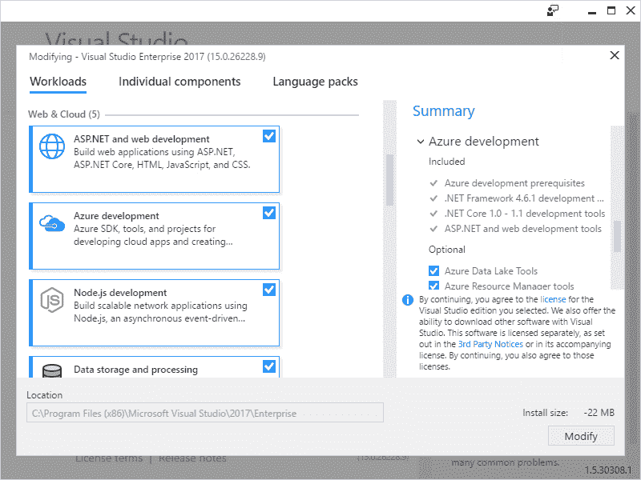

请注意，如果您不再拥有 Visual Studio 的原始安装程序，并且在安装过程中没有启用 Azure 开发和管理工作负载，您仍然可以启用它。下载您拥有的 Visual Studio 2017 版本的 Web 平台安装程序并单击它。这将启动安装程序，但将允许您修改现有的 Visual Studio 2017 安装。您还可以从 Visual Studio 2017 的“新项目”对话框屏幕中运行安装程序。如果您折叠已安装的模板，您将看到一个允许您打开 Visual Studio 安装程序的部分。

除此之外，您还可以使用上述链接中的 Web 平台安装程序安装 Microsoft Azure Service Fabric SDK。它将读取安装 Microsoft Azure Service Fabric SDK。为了获得最佳的安装体验，建议使用 Internet Explorer 或 Edge 浏览器启动 Web 平台安装程序。

# 如何操作...

1.  从 Microsoft Azure 网站下载 Microsoft Azure Service Fabric SDK，并通过 Service Fabric 学习路径访问其他资源，例如文档，从[`azure.microsoft.com/en-us/documentation/learning-paths/service-fabric/`](https://azure.microsoft.com/en-us/documentation/learning-paths/service-fabric/)。单击 WPI 启动程序后，您应该看到以下屏幕：

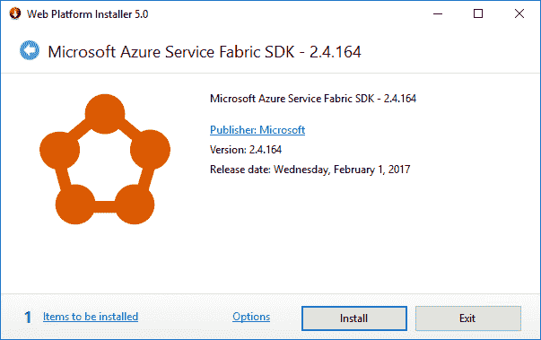

1.  在安装开始之前，您需要接受许可条款。

1.  然后，Web 平台安装程序开始下载 Microsoft Azure Service Fabric Runtime。允许此过程完成。

1.  下载完成后，安装过程将开始：

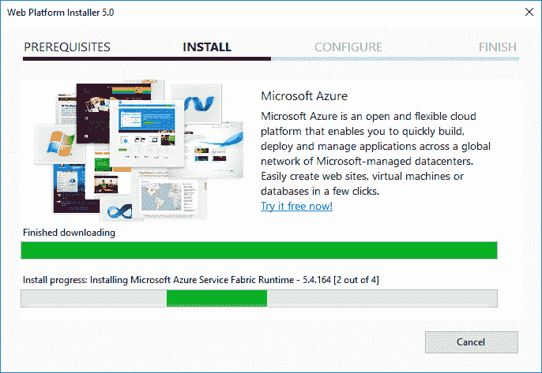

1.  安装完成后，将安装以下产品，这也可以从以下屏幕截图中看出：

+   Microsoft Visual C++ 2012 SP1 可再发行包

+   Microsoft Azure Service Fabric Runtime

+   Microsoft Azure Service Fabric SDK


您的安装可能与屏幕截图不同，具体取决于您特定的预安装组件。

1.  下一个任务是以管理员身份打开 PowerShell。在 Windows 10 开始菜单中，键入单词 `PowerShell`，搜索将立即返回桌面应用程序作为结果。右键单击桌面应用程序，然后从上下文菜单中选择以管理员身份运行：

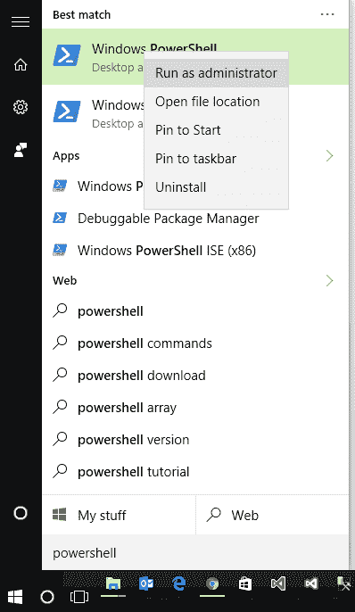

1.  一旦 Windows PowerShell 打开，运行 `Set-ExecutionPolicy -ExecutionPolicy Unrestricted -Force -Scope CurrentUser` 命令。原因是 Service Fabric 使用 PowerShell 脚本来创建本地开发集群。它也用于部署 Visual Studio 开发的应用程序。运行此命令可以防止 Windows 阻止这些脚本：

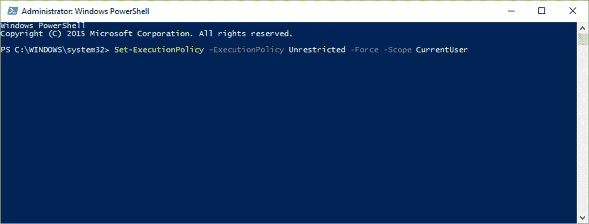

1.  接下来，创建本地 Service Fabric 集群。输入 `& "$ENV:ProgramFiles\Microsoft SDKs\Service Fabric\ClusterSetup\DevClusterSetup.ps1"` 命令。

这将创建所需的本地集群来托管 Service Fabric 应用程序：


B06434_17_07

1.  集群创建后，PowerShell 将启动服务：

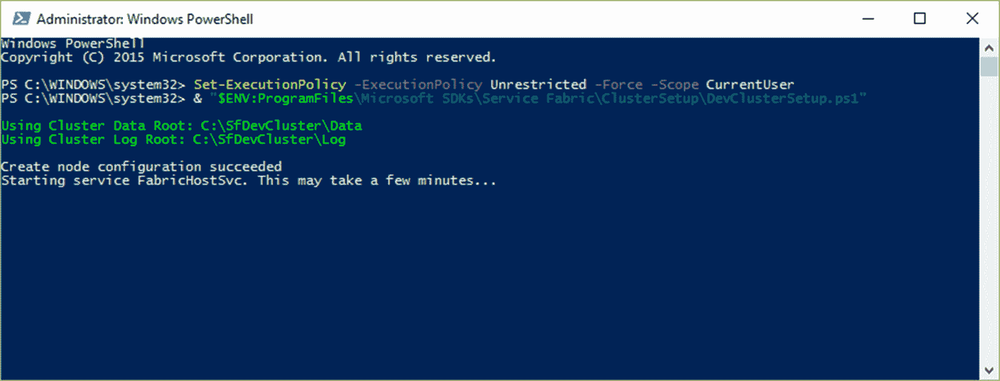

1.  该过程可能需要几分钟。请确保让它完成：


1.  一旦命名服务准备就绪，您可以关闭 PowerShell：

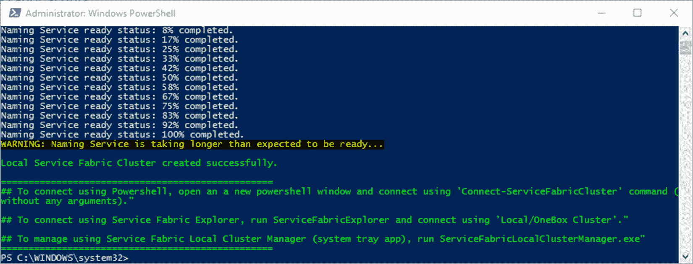

1.  要查看创建的集群，可以在本地机器上导航到 `http://localhost:19080/Explorer`。

这将为您提供集群的健康和状态的快照。它还将显示集群中运行的任何应用程序：

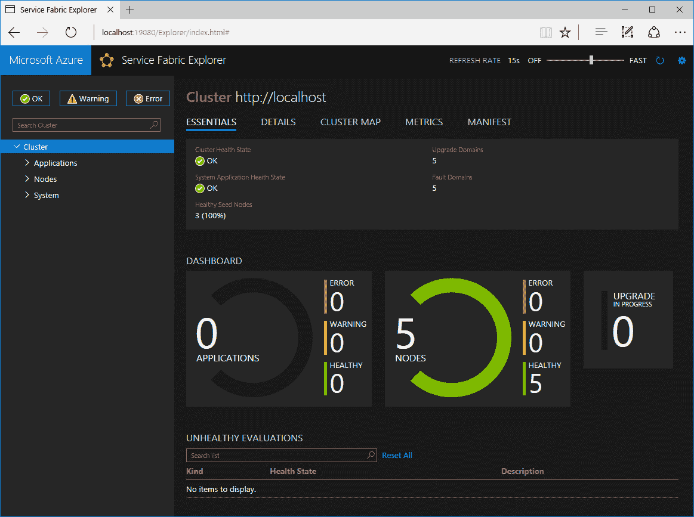

# 工作原理...

正如您所看到的，Service Fabric 集群对于在 Visual Studio 中创建和运行应用程序至关重要。这将允许我们在将应用程序发布到云之前直接在本地机器上测试应用程序。正如前面提到的，这不是 Service Fabric 集群的简化版本。它与您在其中安装 Service Fabric 应用程序的任何一台机器上安装的版本完全相同。

# 使用无状态 Actor 服务创建 Service Fabric 应用程序

作为本章介绍的一部分，我们看了有状态和无状态微服务之间的区别。然后，可用的 Service Fabric 应用程序模板进一步分为**可靠服务**（有状态/无状态）和**可靠 Actor**。何时使用哪一个将取决于您的应用程序的具体业务需求。

简单来说，如果您想创建一个应该向您的应用程序的许多用户公开的服务，可靠的服务可能是一个很好的选择。想象一下，一个服务公开了最新的汇率，可以被许多用户或应用程序同时使用。

再次回顾本章的介绍，我们使用了在线网店和购物车的例子。对于每个购买商品的客户，可靠 Actor 可能是一个很好的选择，因此您可以有一个购物车 Actor。Service Fabric 框架中的可靠 Actor 基于虚拟 Actor 模式。请查看 [`research.microsoft.com/en-us/projects/orleans/`](http://research.microsoft.com/en-us/projects/orleans/) 上关于虚拟 Actor 模式的文章。

为了向您展示使用无状态 Actor 服务创建微服务有多容易，我们将使用 Visual Studio 将服务发布到 Service Fabric 集群，并从控制台（客户端）应用程序调用该服务作为示例。

# 做好准备

要完成此步骤，您必须确保已在本地机器上安装了 Service Fabric 集群。您还需要确保已安装了 Visual Studio 2017 中的 Azure 开发和管理工作负载。在安装 Visual Studio 2017 时启用此工作负载。如果您没有在 Visual Studio 2017 的安装中安装该工作负载，可以通过单击 Visual Studio 2017 的 Web 平台安装程序并维护安装来执行此操作。

# 如何做...

1.  在 Visual Studio 中，通过转到“文件”|“新建”|“项目”来创建一个新项目。

1.  从 Visual C#节点展开节点，直到看到 Cloud 节点。当您点击它时，您会看到 Visual Studio 现在列出了一个新的 Service Fabric 应用程序模板。选择 Service Fabric 应用程序模板，将其命名为`sfApp`，然后单击“确定”：

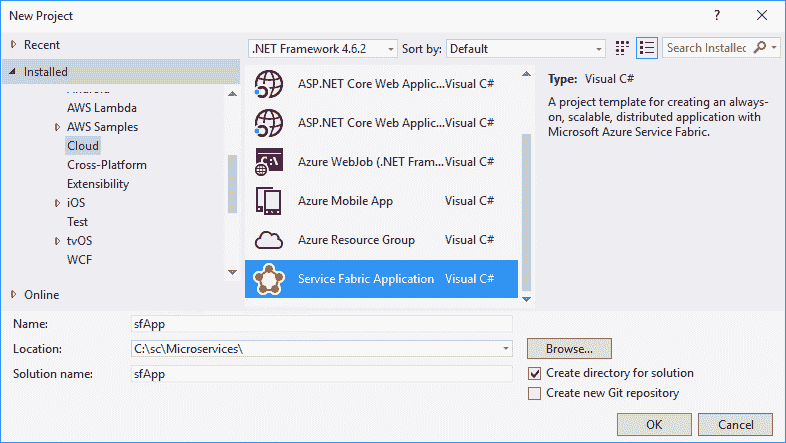

1.  接下来，从弹出的服务模板窗口中选择 Actor Service。我们只是称之为`UtilitiesActor`：

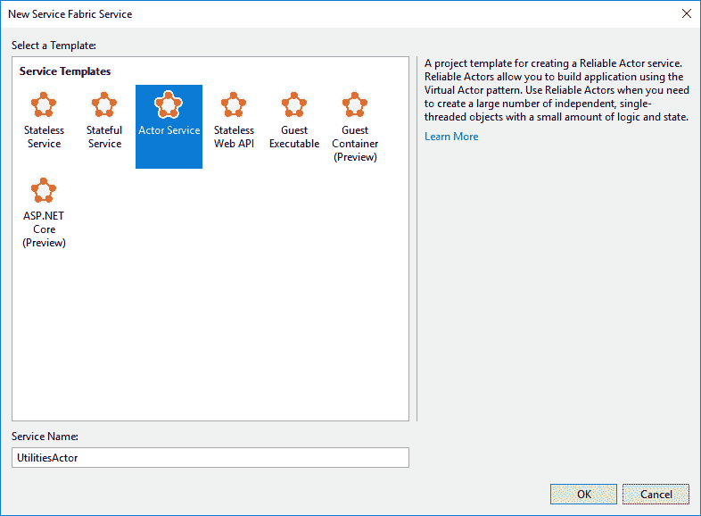

1.  创建解决方案后，您会注意到它由三个项目组成：

+   `sfApp`

+   `UtilitiesActor`

+   `UtilitiesActor.Interfaces`

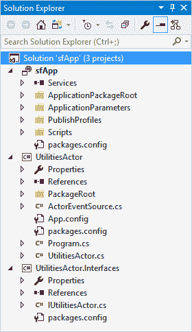

1.  我们将首先修改`UtilitiesActor.Interfaces`项目中的`IUtilitiesActor`接口。该接口将简单要求`UtilitiesActor`实现一个名为`ValidateEmailAsync`的方法，该方法以电子邮件地址作为参数，并返回一个布尔值，指示它是否是有效的电子邮件地址：

```cs
        namespace UtilitiesActor.Interfaces 
        { 
          public interface IUtilitiesActor : IActor 
          { 
            Task<bool> ValidateEmailAsync(string emailToValidate); 
          } 
        }

```

1.  接下来，打开您的`UtilitiesActor`项目，并查看`UtilitiesActor.cs`类。查找大约在第 22 行左右的内部类定义`internal class UtilitiesActor：Actor，IUtilitiesActor`。`IUtilitiesActor`接口名称将被下划线标记，因为它没有实现接口成员`ValidateEmailAsync()`。

1.  使用*Ctrl* + *.*（句号），实现接口。删除所有其他不必要的默认代码（如果有）。

1.  为您插入的实现接口代码应如下所示。目前，它只包含`NotImplementedException`。我们将在这里实现验证电子邮件地址的代码：

```cs
        namespace UtilitiesActor 
        { 
          internal class UtilitiesActor : StatelessActor, IUtilitiesActor 
          { 
            public UtilitiesActor(ActorService actorService, 
              ActorId actorId) : base(actorService, actorId)
            {
            }
            public async Task<bool> ValidateEmailAsync(string 
              emailToValidate) 
            { 
              throw new NotImplementedException(); 
            }         
          } 
        }

```

1.  我们将使用正则表达式来验证通过参数传递给此方法的电子邮件地址。正则表达式非常强大。然而，在我多年的编程生涯中，我从未编写过自己的表达式。这些可以在互联网上轻松找到，并且您可以为自己的项目创建一个实用程序类（或扩展方法类）以重用。您可以利用经常使用的正则表达式和其他代码。

最后，您会注意到`ActorEventSource`代码。这只是为了创建**Windows 事件跟踪**（**ETW**）事件，以帮助您从 Visual Studio 的诊断事件窗口中查看应用程序中发生的情况。要打开诊断事件窗口，请转到“视图”，选择“其他窗口”，然后单击“诊断事件”：

```cs
        public async Task<bool> ValidateEmailAsync(string emailToValidate)
        {
          ActorEventSource.Current.ActorMessage(this, "Email Validation");
          return await Task.FromResult(Regex.IsMatch(emailToValidate, 
          @"A(?:[a-z0-9!#$%&'*+/=?^_&grave;{|}~-]+(?:.[
          a-z0-9!#$%&'*+/=?^_&grave;{|}~-]+) *@(?:a-z0-9?.)+a-z0-9?)
          Z", RegexOptions.IgnoreCase));
        }

```

1.  确保添加对`System.Text.RegularExpressions`命名空间的引用。如果没有引用，您将无法使用正则表达式。如果在代码中添加了正则表达式而没有添加引用，Visual Studio 将在`Regex`方法下显示红色波浪线。

1.  使用*Ctrl* + *.*（句号），将`using`语句添加到您的项目。这将使正则表达式命名空间生效。

1.  现在我们已经创建了接口，并添加了该接口的实现，现在是时候添加一个客户端应用程序进行测试了。右键单击解决方案，然后添加一个新项目。

1.  最简单的方法是添加一个简单的控制台应用程序。将您的客户端应用程序命名为`sfApp.Client`，然后单击“确定”按钮。

1.  将控制台应用程序添加到解决方案后，您的解决方案应如下所示：

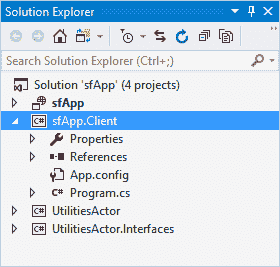

1.  现在，您需要向客户端应用程序添加引用。右键单击`sfApp.Client`项目中的`References`节点，然后从上下文菜单中选择添加引用。

1.  首先要做的是向`UtilitiesActor.Interfaces`项目添加引用。

1.  您还需要添加对几个 Service Fabric **动态链接库**（**DLLs**）的引用。当您创建 Service Fabric 应用程序时，它应该已经在项目文件夹结构中添加了一个名为`packages`的文件夹。浏览到此文件夹，并从中添加所需的 Service Fabric DLL。添加所需的 DLL 后，您的项目应如下所示：


1.  在您的控制台应用程序的`Program.cs`文件中，您需要将以下代码添加到`Main`方法中：

```cs
        namespace sfApp.Client 
        { 
          class Program 
          { 
            static void Main(string[] args)
            {
              var actProxy = ActorProxy.Create<IUtilitiesActor>
                (ActorId.CreateRandom(), "fabric:/sfApp");
              WriteLine("Utilities Actor {0} - Valid Email?:{1}", 
              actProxy.GetActorId(), actProxy.ValidateEmailAsync(
              "validemail@gmail.com").Result);
              WriteLine("Utilities Actor {0} - Valid Email?:{1}", 
              actProxy.GetActorId(), actProxy.ValidateEmailAsync(
              "invalid@email@gmail.com").Result);
              ReadLine();
            } 
          }   
        }

```

确保将以下`using`语句添加到您的控制台应用程序中：

```cs
        using Microsoft.ServiceFabric.Actors;
        using Microsoft.ServiceFabric.Actors.Client;
        using UtilitiesActor.Interfaces;
        using static System.Console;

```

我们所做的就是为我们的 actor 创建一个代理，并将电子邮件验证的输出写入控制台窗口。您的客户端应用程序现在已经准备就绪。

# 它是如何工作的...

然而，在运行客户端应用程序之前，我们需要先发布我们的服务。在解决方案资源管理器中，右键单击`sfApp`服务，然后从上下文菜单中单击“发布...”：


现在将显示发布 Service Fabric 应用程序窗口。单击连接端点文本框旁边的“选择...”按钮。选择本地集群作为您的连接端点，然后单击“确定”。将目标配置文件和应用程序参数文件更改为`Local.1Node.xml`。完成后，单击“发布”按钮：


如果您导航到`http://localhost:19080/Explorer`，您会注意到您创建的服务已发布到本地的 Service Fabric 集群：


现在您已经准备好运行您的客户端应用程序。右键单击`sfApp.Client`项目，然后从上下文菜单中选择“调试”和“启动新实例”。控制台应用程序调用`validate`方法来检查电子邮件地址，并将结果显示在控制台窗口中。结果如预期的那样：


如果在尝试运行控制台应用程序时收到`System.BadImageFormatException`，请检查控制台应用程序的目标平台。您可能已经将控制台应用程序编译为 Any CPU，而解决方案中的其他项目则以 x64 为目标。从配置管理器中修改这一点，并使控制台应用程序也以 x64 为目标。

但是，在创建 actor ID 时，我们可以更具体。在先前的代码清单中，我们使用`CreateRandom()`方法生成了一个`ActorId`。现在我们可以给它一个特定的名称。修改您的代理代码，创建一个新的`ActorId`实例，并给它任何字符串值。在下面的代码清单中，我只是称呼我的为`Utilities`：

```cs
var actProxy = ActorProxy.Create<IUtilitiesActor>(new ActorId("Utilities"), "fabric:/sfApp");

```

`ActorId`方法可以接受`Guid`、`long`或`string`类型的参数。

当您再次调试您的客户端应用程序时，您会注意到`Utilities Actor`现在有一个逻辑名称（与创建新的`ActorId`实例时传递的字符串值相同的名称）：

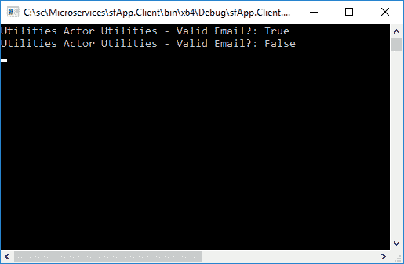

在将您的 Service Fabric 应用程序本地发布之前，这是测试应用程序的完美解决方案。创建小型、独立的微服务允许开发人员在测试、调试和部署高效和健壮的代码方面获得许多好处，您的应用程序可以利用这些好处来确保最大的可用性。

# 使用 Service Fabric Explorer

还有另一个工具可以用来可视化 Service Fabric 集群。这是一个独立的工具，您可以通过导航到本地安装路径`%Program Files%\Microsoft SDKs\Service Fabric\Tools\ServiceFabricExplorer`并单击`ServiceFabricExplorer.exe`来找到。运行应用程序时，它将自动连接到您的本地 Service Fabric 集群。它可以显示有关集群上的应用程序、集群节点、应用程序和节点的健康状态以及集群中应用程序的任何负载的丰富信息。

# 准备工作

您必须已经在本地计算机上完成了 Service Fabric 的安装，才能使 Service Fabric Explorer 正常工作。如果尚未完成，请按照本章中的*下载和安装 Service Fabric*配方进行操作。

# 如何做...

1.  当您启动 Service Fabric Explorer 时，将出现以下窗口：

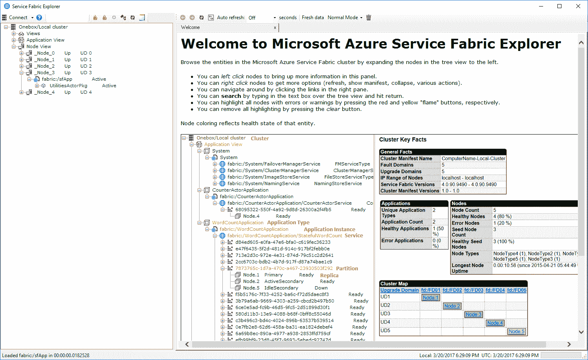

1.  请注意，左侧的树形视图显示了应用程序视图和节点视图：

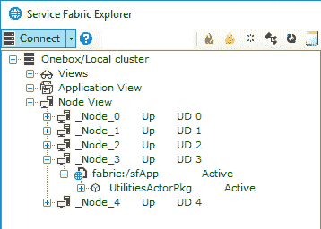

1.  右侧窗格将显示有关本地集群的信息。这使您可以轻松地查看本地服务集群的整体健康状况：

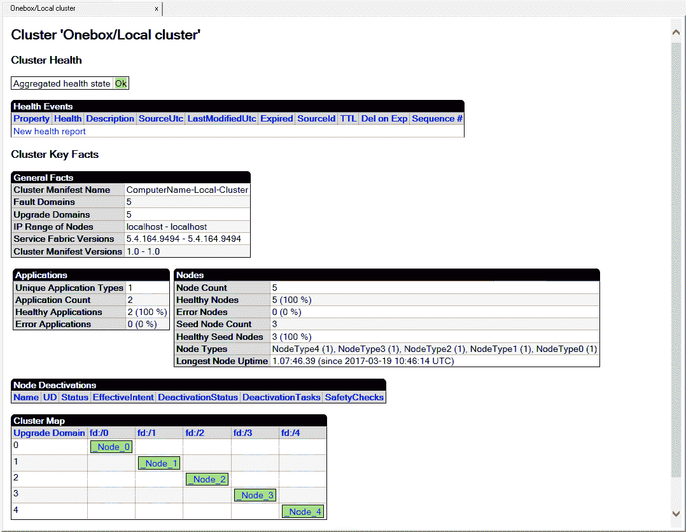

1.  当您扩展应用程序视图时，您会注意到我们的`sfApp`服务已经发布。进一步扩展它，您会看到`sfApp`服务已经发布在 Node_3 上。扩展节点视图和 Node_3，以查看该节点上的服务活动：

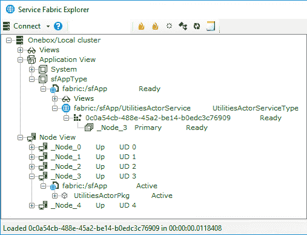

1.  为了说明微服务的可扩展性，右键单击 Node_3，并从上下文菜单中选择在节点上激活/停用和停用（删除数据）。然后，单击窗口顶部的刷新按钮以刷新节点和应用程序。

1.  如果您现在继续扩展应用程序视图并再次查看服务，您会注意到 Service Fabric 集群注意到 Node_3 已被禁用。然后自动将服务推送到一个新的健康节点（在本例中为 Node_2）：

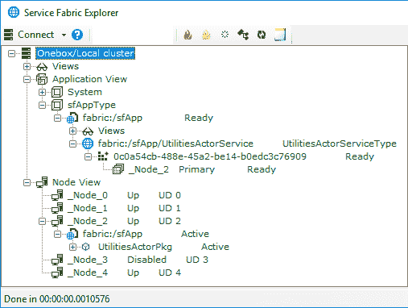

1.  Service Fabric Explorer 右侧面板中的本地集群节点视图还报告 Node_3 已禁用。单击节点视图以查看此信息：


# 工作原理...

Service Fabric Explorer 将允许您查看所选节点的信息，并且您将能够深入了解有关 Service Fabric 集群应用程序的丰富信息。这只是管理员除了浏览器中可用的 Service Fabric Explorer 之外可以使用的另一个实用程序。

有一些激烈的辩论关于开发人员应该如何处理微服务架构。有人认为，当开发人员的目标是应用程序的微服务架构时，需要从单体优先的角度来处理。也就是说，首先编写大型单体应用程序，因为这个过程是熟悉的开发方法。在完成后，计划并将单体应用程序划分为更小的微服务。这里的论点是，创建单体应用程序时，上市时间更快。更快的上市时间意味着更快的投资回报。

另一方面的论点是，从单体开始恰恰是错误的方法。在设计阶段开始考虑如何将应用程序划分为部分才是正确的时间。然而，必须承认，开发团队可能需要了解他们需要构建的系统。另一个让步是，也许最好在创建现有单体的第二个版本时采用微服务方法。单体应用程序根据定义，所有部分都紧密耦合在一起。将这些部分分解为更小的微服务需要多少时间？

无论您决定采取哪种方法，都必须在仔细考虑涉及所有利益相关者的所有事实之后做出决定。不幸的是，没有公式或硬性规则可以帮助您做出决定。关于应用程序架构（单体与微服务）的决定将因项目而异。
