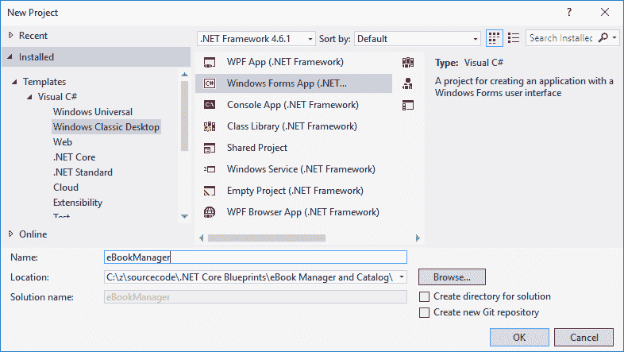
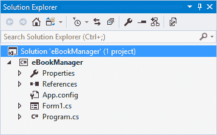
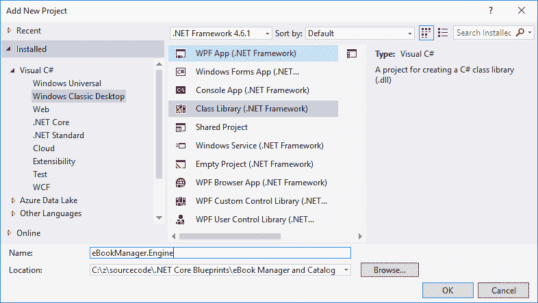
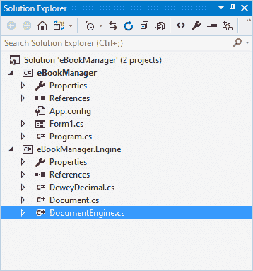
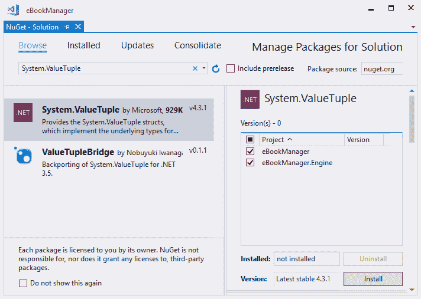
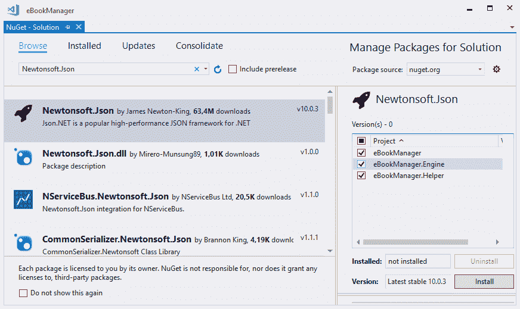
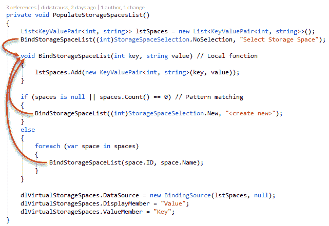
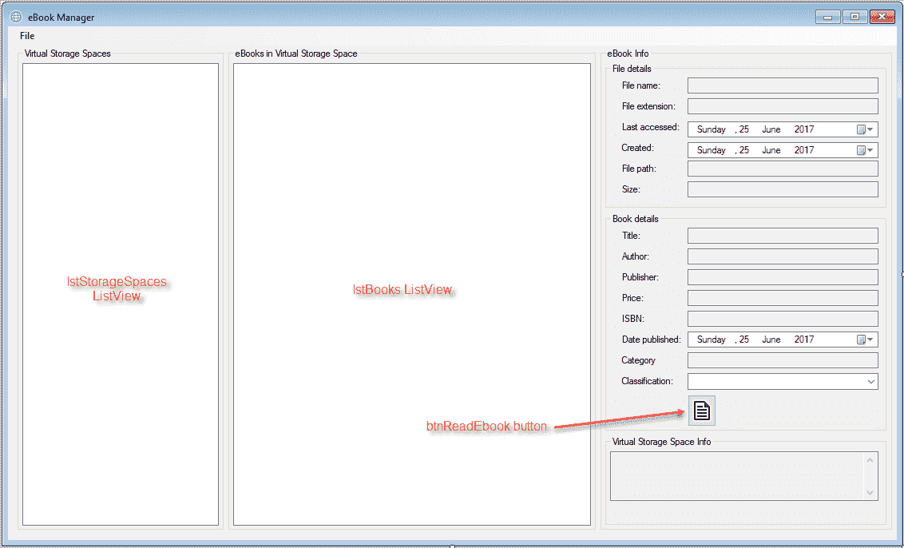
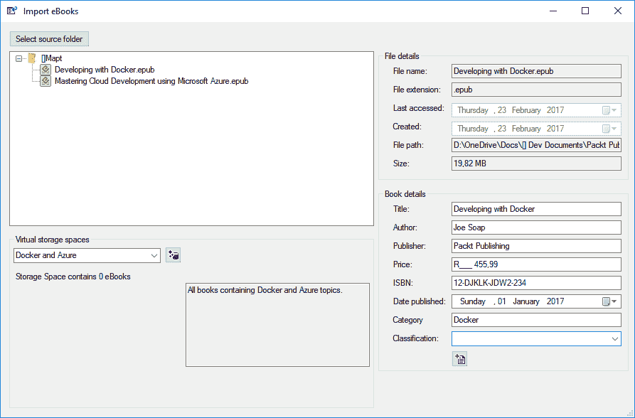
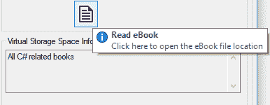

# 第一章：电子书管理器和目录应用程序

C# 7 是一个很棒的版本，可在 Visual Studio 2017 中使用。它向开发人员介绍了许多强大的功能，其中一些以前只在其他语言中可用。C# 7 引入的新功能使开发人员能够编写更少的代码，提高生产力。

可用的功能有：

+   元组

+   模式匹配

+   `Out`变量

+   解构

+   本地函数

+   文字改进

+   引用返回和本地变量

+   泛化的异步和返回类型

+   访问器、构造函数和终结器的表达式体

+   抛出表达式

本章将介绍其中一些功能，而本书的其余部分将在学习过程中介绍其他功能。在本章中，我们将创建一个`eBookManager`应用程序。如果您和我一样，在硬盘和一些外部驱动器上散落着电子书，那么这个应用程序将提供一种机制，将所有这些不同的位置汇集到一个虚拟存储空间中。该应用程序是功能性的，但可以进一步增强以满足您的需求。这样的应用程序范围是广阔的。您可以从 GitHub（[`github.com/PacktPublishing/CSharp7-and-.NET-Core-2.0-Blueprints`](https://github.com/PacktPublishing/CSharp7-and-.NET-Core-2.0-Blueprints)）下载源代码，并跟随它，看看 C# 7 的一些新功能是如何运作的。

让我们开始吧！

# 设置项目

使用 Visual Studio 2017，我们将创建一个简单的 Windows 窗体应用程序模板项目。您可以随意命名应用程序，但我将其命名为`eBookManager`：



项目将被创建，并将如下所示：



我们的解决方案需要一个类库项目来包含驱动`eBookManager`应用程序的类。在解决方案中添加一个新的类库项目，并将其命名为`eBookManager.Engine`：



将解决方案添加到类库项目中，默认类名更改为`Document`：


`Document`类将代表一本电子书。想到一本书，我们可以有多个属性来代表一本书，但又代表所有书籍。一个例子是作者。所有书籍都必须有作者，否则它就不存在。

我知道有些人可能会认为机器也可以生成文档，但它生成的信息可能最初是由人写的。以代码注释为例。开发人员在代码中编写注释，工具从中生成文档。开发人员仍然是作者。

我添加到类中的属性仅仅是我认为可能代表一本书的解释。请随意添加其他代码，使其成为您自己的。

打开`Document.cs`文件，并将以下代码添加到类中：

```cs
namespace eBookManager.Engine 
{ 
    public class Document 
    { 
        public string Title { get; set; } 
        public string FileName { get; set; } 
        public string Extension { get; set; } 
        public DateTime LastAccessed { get; set; } 
        public DateTime Created { get; set; } 
        public string FilePath { get; set; } 
        public string FileSize { get; set; } 
        public string ISBN { get; set; } 
        public string Price { get; set; } 
        public string Publisher { get; set; } 
        public string Author { get; set; } 
        public DateTime PublishDate { get; set; } 
        public DeweyDecimal Classification { get; set; } 
        public string Category { get; set; } 
    } 
} 
```

您会注意到我包括了一个名为`Classification`的属性，类型为`DeweyDecimal`。我们还没有添加这个类，接下来会添加。

在`eBookManager.Engine`项目中，添加一个名为`DeweyDecimal`的类。如果您不想为您的电子书进行这种分类，可以不添加这个类。我包括它是为了完整起见。


您的`DeweyDecimal`类必须与之前添加的`Document`类在同一个项目中：


“杜威十进制”系统非常庞大。因此，我没有考虑到每种书籍分类。我也只假设您想要处理编程电子书。然而，实际上，您可能想要添加其他分类，如文学、科学、艺术等。这取决于您。

所以让我们创建一个代表杜威十进制系统的类：

1.  打开`DeweyDecimal`类并将以下代码添加到类中：

```cs
namespace eBookManager.Engine 
{ 
    public class DeweyDecimal 
    { 
        public string ComputerScience { get; set; } = "000"; 
        public string DataProcessing { get; set; } = "004"; 
        public string ComputerProgramming { get; set; } = "005"; 
    } 
}
```

字母狂人可能会不同意我的观点，但我想提醒他们，我是一个代码狂人。这里表示的分类只是为了让我能够编目与编程和计算机科学相关的电子书。如前所述，您可以根据自己的需要进行更改。

1.  我们现在需要在`eBookManager.Engine`解决方案的核心中添加。这是一个名为`DocumentEngine`的类，它将是一个包含您需要处理文档的方法的类：


您的`eBookManager.Engine`解决方案现在将包含以下类：

+   +   `DeweyDecimal`

+   `Document`

+   `DocumentEngine`



1.  我们现在需要从`eBookManager`项目中添加对`eBookManager.Engine`的引用。我相信你们都知道如何做到这一点：


`eBookManager.Engine`项目将在引用管理器屏幕的项目部分中可用：


1.  添加了引用后，我们需要一个负责导入新书籍的 Windows 表单。在`eBookManager`解决方案中添加一个名为`ImportBooks`的新表单：


1.  在我们忘记之前，向`ImportBooks`表单添加一个`ImageList`控件，并将其命名为`tvImages`。这将包含我们想要编目的不同类型文档的图像。

`ImageList`是您从工具箱添加到`ImportBooks`表单上的控件。您可以从`ImageList`属性访问图像集合编辑器。

图标可以在 GitHub 上可下载的源代码的`img`文件夹中找到，网址为[`github.com/PacktPublishing/CSharp7-and-.NET-Core-2.0-Blueprints`](https://github.com/PacktPublishing/CSharp7-and-.NET-Core-2.0-Blueprints)。

这里的图标适用于 PDF、MS Word 和 ePub 文件类型。它还包含文件夹图像：


1.  现在，要在 C# 7 中使用元组，您需要添加`System.ValueTuple` NuGet 包。右键单击解决方案，然后选择管理解决方案的 NuGet 包...

请注意，如果您正在运行.NET Framework 4.7，则`System.ValueTuple`已包含在该框架版本中。因此，您将不需要从 NuGet 获取它。


1.  搜索`System.ValueTuple`并将其添加到您的解决方案项目中。然后单击安装，让进程完成（您将在 Visual Studio 的输出窗口中看到进度）：



我喜欢在我的项目中使用扩展方法。我通常为此目的添加一个单独的项目和/或类。在这个应用程序中，我添加了一个`eBookManager.Helper`类库项目：


1.  这个帮助类也必须作为引用添加到`eBookManager`解决方案中：


最后，我将使用 JSON 作为我的电子书目录的简单文件存储。JSON 非常灵活，可以被各种编程语言消耗。JSON 之所以如此好用，是因为它相对轻量级，生成的输出是人类可读的：



1.  转到解决方案的 NuGet 包管理器并搜索`Newtonsoft.Json`。然后将其添加到解决方案中的项目并单击安装按钮。

您现在已经设置了`eBookManager`应用程序所需的基本内容。接下来，我们将通过编写一些代码进一步深入应用程序的核心。

# 虚拟存储空间和扩展方法

让我们首先讨论虚拟存储空间背后的逻辑。这是硬盘（或硬盘）上几个物理空间的单一虚拟表示。存储空间将被视为一个特定的电子书组*存储*的单一区域。我使用术语*存储*是因为存储空间并不存在。它更多地代表了一种分组，而不是硬盘上的物理空间：

1.  要开始创建虚拟存储空间，将一个名为`StorageSpace`的新类添加到`eBookManager.Engine`项目中。打开`StorageSpace.cs`文件，并向其中添加以下代码：

```cs
using System; 
using System.Collections.Generic; 

namespace eBookManager.Engine 
{ 
    [Serializable] 
    public class StorageSpace 
    { 
        public int ID { get; set; } 
        public string Name { get; set; } 
        public string Description { get; set; } 
        public List<Document> BookList { get; set; } 
    } 
} 
```

请注意，您需要在这里包含`System.Collections.Generic`命名空间，因为`StorageSpace`类包含一个名为`BookList`的属性，类型为`List<Document>`，它将包含该特定存储空间中的所有书籍。

现在我们需要把注意力集中在`eBookManager.Helper`项目中的`ExtensionMethods`类上。这将是一个静态类，因为扩展方法需要以静态的方式来作用于扩展方法定义的各种对象。

1.  在`eBookManager.Helper`项目中添加一个新类，并修改`ExtensionMethods`类如下：

```cs
public static class ExtensionMethods 
{ 

} 
```

让我们将第一个扩展方法添加到名为`ToInt()`的类中。这个扩展方法的作用是获取一个`string`值并尝试将其解析为一个`integer`值。每当我需要将`string`转换为`integer`时，我都懒得输入`Convert.ToInt32(stringVariable)`。正因为如此，我使用了一个扩展方法。

1.  在`ExtensionMethods`类中添加以下静态方法：

```cs
public static int ToInt(this string value, int defaultInteger = 0) 
{ 
    try 
    { 
        if (int.TryParse(value, out int validInteger)) 
          // Out variables 
         return validInteger; 
        else 
         return defaultInteger; 
    } 
    catch  
    { 
        return defaultInteger; 
    } 
} 
```

`ToInt()`扩展方法仅对`string`起作用。这是由方法签名中的`this string value`代码定义的，其中`value`是将包含您要转换为`integer`的`string`的变量名称。它还有一个名为`defaultInteger`的默认参数，设置为`0`。除非调用扩展方法的开发人员想要返回默认的整数值`0`，否则他们可以将不同的整数传递给这个扩展方法（例如`-1`）。

这也是我们发现 C# 7 的第一个特性的地方。改进了`out`变量。在以前的 C#版本中，我们必须对`out`变量执行以下操作：

```cs
int validInteger; 
if (int.TryParse(value, out validInteger)) 
{ 

} 
```

有一个预声明的整数变量挂在那里，如果`string`值解析为`integer`，它就会得到它的值。C# 7 简化了代码：

```cs
if (int.TryParse(value, out int validInteger)) 
```

C# 7 允许开发人员在作为`out`参数传递的地方声明一个`out`变量。继续讨论`ExtensionMethods`类的其他方法，这些方法用于提供以下逻辑：

+   `读取`和`写入`到数据源

+   检查存储空间是否存在

+   将字节转换为兆字节

+   将`string`转换为`integer`（如前所述）

`ToMegabytes`方法非常简单。在各个地方都不必写这个计算，将其定义在一个扩展方法中是有意义的：

```cs
public static double ToMegabytes(this long bytes) 
{ 
    return (bytes > 0) ? (bytes / 1024f) / 1024f : bytes; 
} 
```

我们还需要一种方法来检查特定的存储空间是否已经存在。

确保从`eBookManager.Helper`项目中向`eBookManager.Engine`添加项目引用。

这个扩展方法的作用也是返回下一个存储空间 ID 给调用代码。如果存储空间不存在，返回的 ID 将是在创建新存储空间时可以使用的下一个 ID：

```cs
public static bool StorageSpaceExists(this List<StorageSpace> space, string nameValueToCheck, out int storageSpaceId) 
{ 
    bool exists = false; 
    storageSpaceId = 0; 

    if (space.Count() != 0) 
    { 
       int count = (from r in space 
                 where r.Name.Equals(nameValueToCheck) 
                 select r).Count(); 

        if (count > 0) 
            exists = true; 

        storageSpaceId = (from r in space 
                          select r.ID).Max() + 1;                                 
    } 
    return exists; 
} 
```

我们还需要创建一个方法，将我们的数据转换为 JSON 后写入文件：

```cs
public static void WriteToDataStore(this List<StorageSpace> value, string storagePath, bool appendToExistingFile = false) 
{ 
    JsonSerializer json = new JsonSerializer(); 
    json.Formatting = Formatting.Indented; 
    using (StreamWriter sw = new StreamWriter(storagePath,  
     appendToExistingFile)) 
    { 
        using (JsonWriter writer = new JsonTextWriter(sw)) 
        { 
            json.Serialize(writer, value); 
        } 
    } 
} 
```

这个方法相当不言自明。它作用于一个`List<StorageSpace>`对象，并将创建 JSON 数据，覆盖在`storagePath`变量中定义的文件中。

最后，我们需要能够再次将数据读取到`List<StorageSpace>`对象中，并将其返回给调用代码：

```cs
public static List<StorageSpace> ReadFromDataStore(this List<StorageSpace> value, string storagePath) 
{ 
    JsonSerializer json = new JsonSerializer(); 
    if (!File.Exists(storagePath)) 
    { 
        var newFile = File.Create(storagePath); 
        newFile.Close(); 
    } 
    using (StreamReader sr = new StreamReader(storagePath)) 
    { 
        using (JsonReader reader = new JsonTextReader(sr)) 
        { 
            var retVal = 
             json.Deserialize<List<StorageSpace>>(reader); 
            if (retVal is null) 
                retVal = new List<StorageSpace>(); 

            return retVal; 
        } 
    } 
} 
```

该方法将返回一个空的`List<StorageSpace>`对象，并且文件中不包含任何内容。`ExtensionMethods`类可以包含许多您经常使用的扩展方法。这是一个很好的分离经常使用的代码的方法。

# DocumentEngine 类

这个类的目的仅仅是为文档提供支持代码。在`eBookManager`应用程序中，我将使用一个名为`GetFileProperties()`的单一方法，它将（你猜对了）返回所选文件的属性。这个类也只包含这一个方法。当应用程序根据您的特定目的进行修改时，您可以修改这个类并添加特定于文档的其他方法。

`DocumentEngine`类向我们介绍了 C# 7 的下一个特性，称为“元组”。元组到底是做什么的？开发人员经常需要从方法中返回多个值。除了其他解决方案外，当然可以使用`out`参数，但这在`async`方法中不起作用。元组提供了更好的方法来做到这一点。

在`DocumentEngine`类中添加以下代码：

```cs
public (DateTime dateCreated, DateTime dateLastAccessed, string fileName, string fileExtension, long fileLength, bool error) GetFileProperties(string filePath) 
{ 
    var returnTuple = (created: DateTime.MinValue,
    lastDateAccessed: DateTime.MinValue, name: "", ext: "",
    fileSize: 0L, error: false); 

    try 
    { 
        FileInfo fi = new FileInfo(filePath); 
        fi.Refresh(); 
        returnTuple = (fi.CreationTime, fi.LastAccessTime, fi.Name, 
        fi.Extension, fi.Length, false); 
    } 
    catch 
    { 
        returnTuple.error = true; 
    } 
    return returnTuple; 
} 
```

`GetFileProperties()`方法返回一个元组，格式为`(DateTime dateCreated, DateTime dateLastAccessed, string fileName, string fileExtension, long fileLength, bool error)`，并且允许我们轻松地检查从调用代码返回的值。

在尝试获取特定文件的属性之前，我通过以下方式初始化“元组”：

```cs
var returnTuple = (created: DateTime.MinValue, lastDateAccessed: DateTime.MinValue, name: "", ext: "", fileSize: 0L, error: false); 
```

如果出现异常，我可以返回默认值。使用`FileInfo`类读取文件属性非常简单。然后我可以通过以下方式将文件属性分配给“元组”：

```cs
returnTuple = (fi.CreationTime, fi.LastAccessTime, fi.Name, fi.Extension, fi.Length, false); 
```

然后将“元组”返回给调用代码，在那里将根据需要使用。接下来我们将看一下调用代码。

# 导入书籍表单

`ImportBooks`表单正如其名称所示。它允许我们创建虚拟存储空间并将书籍导入到这些空间中。表单设计如下：

！[](img/971b4446-fbf5-449f-94d0-7682e834a5ea.png)

`TreeView`控件以`tv`为前缀，按钮以`btn`为前缀，组合框以`dl`为前缀，文本框以`txt`为前缀，日期时间选择器以`dt`为前缀。当这个表单加载时，如果已经定义了任何存储空间，那么这些存储空间将列在`dlVirtualStorageSpaces`组合框中。单击“选择源文件夹”按钮将允许我们选择源文件夹以查找电子书。

如果存储空间不存在，我们可以通过单击`btnAddNewStorageSpace`按钮添加新的虚拟存储空间。这将允许我们为新的存储空间添加名称和描述，并单击`btnSaveNewStorageSpace`按钮。

从`tvFoundBooks` TreeView 中选择电子书将填充表单右侧的“文件详细信息”组控件。然后您可以添加额外的书籍详细信息，并单击`btnAddeBookToStorageSpace`按钮将书籍添加到我们的空间中：

1.  您需要确保以下命名空间添加到您的`ImportBooks`类中：

```cs
using eBookManager.Engine; 
using System; 
using System.Collections.Generic; 
using System.IO; 
using System.Linq; 
using System.Windows.Forms; 
using static eBookManager.Helper.ExtensionMethods; 
using static System.Math; 
```

1.  接下来，让我们从最合乎逻辑的地方开始，即构造函数`ImportBooks()`和表单变量。在构造函数上方添加以下代码：

```cs
private string _jsonPath; 
private List<StorageSpace> spaces; 
private enum StorageSpaceSelection { New = -9999, NoSelection = -1 } 
```

枚举器的用处将在以后的代码中变得明显。"_jsonPath"变量将包含用于存储我们的电子书信息的文件的路径。

1.  按照以下方式修改构造函数：

```cs
public ImportBooks() 
{ 
    InitializeComponent(); 
    _jsonPath = Path.Combine(Application.StartupPath, 
    "bookData.txt"); 
    spaces = spaces.ReadFromDataStore(_jsonPath); 
} 
```

`_jsonPath`初始化为应用程序的执行文件夹，并且文件硬编码为`bookData.txt`。如果您想要配置这些设置，可以提供一个设置屏幕，但我决定让应用程序使用硬编码设置。

1.  接下来，我们需要添加另一个枚举器，定义我们将能够在应用程序中保存的文件扩展名。在这里，我们将看到 C# 7 的另一个特性，称为“表达式体”属性。

# 表达式体访问器、构造函数和终结器

如果以下表达式看起来令人生畏，那是因为它使用了 C# 6 中引入并在 C# 7 中扩展的一个特性：

```cs
private HashSet<string> AllowedExtensions => new HashSet<string>(StringComparer.InvariantCultureIgnoreCase) { ".doc",".docx",".pdf", ".epub" }; 
private enum Extention { doc = 0, docx = 1, pdf = 2, epub = 3 } 
```

前面的例子返回了我们应用程序允许的文件扩展名的`HashSet`。这些自 C# 6 以来就存在，但在 C# 7 中已经扩展到包括*访问器*、*构造函数*和*终结器*。让我们简化一下这些例子。

假设我们需要修改`Document`类以在类内部设置字段`_defaultDate`；传统上，我们需要这样做：

```cs
private DateTime _defaultDate; 

public Document() 
{ 
    _defaultDate = DateTime.Now; 
} 
```

在 C# 7 中，我们可以通过简单地执行以下操作大大简化这段代码：

```cs
private DateTime _defaultDate; 
public Document() => _defaultDate = DateTime.Now; 
```

这是完全合法的，可以正确编译。同样，终结器（或解构器）也可以这样做。`AllowedExtensions`属性也是`表达式体`属性的一个很好的实现。`表达式体`属性实际上自 C# 6 以来就一直存在，但谁在计数呢？

假设我们只想返回 PDF 的`Extension`枚举的`string`值，我们可以这样做：

```cs
public string PDFExtension 
{ 
    get 
    { 
        return nameof(Extention.pdf); 
    } 
} 
```

该属性只有一个获取器，永远不会返回除`Extension.pdf`之外的任何内容。通过更改代码来简化：

```cs
public string PDFExtension => nameof(Extention.pdf); 
```

就是这样。一行代码完全可以做到与以前的七行代码相同的事情。同样，*表达式体*属性访问器也被简化了。考虑以下 11 行代码：

```cs
public string DefaultSavePath 
{ 
    get 
    { 
        return _jsonPath; 
    } 
    set 
    { 
        _jsonPath = value; 
    } 
} 
```

有了 C# 7，我们可以简化为以下内容：

```cs
public string DefaultSavePath 
{ 
    get => _jsonPath; 
    set => _jsonPath = value; 
} 
```

这使我们的代码更易读，更快速编写。回到我们的`AllowedExtensions`属性；传统上，它将被写成如下形式：

```cs
private HashSet<string> AllowedExtensions 
{ 
    get 
    { 
        return new HashSet<string> 
        (StringComparer.InvariantCultureIgnoreCase) { ".doc", 
        ".docx", ".pdf", ".epub" }; 
    } 
} 
```

自 C# 6 以来，我们已经能够简化这个过程，就像我们之前看到的那样。这为开发人员提供了一个减少不必要代码的好方法。

# 填充 TreeView 控件

当我们查看`PopulateBookList()`方法时，我们可以看到`AllowedExtensions`属性的实现。这个方法的作用只是用选定的源位置找到的文件和文件夹填充`TreeView`控件。考虑以下代码：

```cs
public void PopulateBookList(string paramDir, TreeNode paramNode) 
{ 
    DirectoryInfo dir = new DirectoryInfo(paramDir); 
    foreach (DirectoryInfo dirInfo in dir.GetDirectories()) 
    { 
        TreeNode node = new TreeNode(dirInfo.Name); 
        node.ImageIndex = 4; 
        node.SelectedImageIndex = 5; 

        if (paramNode != null) 
            paramNode.Nodes.Add(node); 
        else 
            tvFoundBooks.Nodes.Add(node); 
        PopulateBookList(dirInfo.FullName, node); 
    } 
    foreach (FileInfo fleInfo in dir.GetFiles().Where
    (x => AllowedExtensions.Contains(x.Extension)).ToList()) 
    { 
        TreeNode node = new TreeNode(fleInfo.Name); 
        node.Tag = fleInfo.FullName; 
        int iconIndex = Enum.Parse(typeof(Extention), 
         fleInfo.Extension.TrimStart('.'), true).GetHashCode(); 

        node.ImageIndex = iconIndex; 
        node.SelectedImageIndex = iconIndex; 
        if (paramNode != null) 
            paramNode.Nodes.Add(node); 
        else 
            tvFoundBooks.Nodes.Add(node); 
    } 
} 
```

我们需要调用这个方法的第一个地方显然是在方法内部，因为这是一个递归方法。我们需要调用它的第二个地方是在`btnSelectSourceFolder`按钮的单击事件中：

```cs
private void btnSelectSourceFolder_Click(object sender, EventArgs e) 
{ 
    try 
    { 
        FolderBrowserDialog fbd = new FolderBrowserDialog(); 
        fbd.Description = "Select the location of your eBooks and 
        documents"; 

        DialogResult dlgResult = fbd.ShowDialog(); 
        if (dlgResult == DialogResult.OK) 
        { 
            tvFoundBooks.Nodes.Clear(); 
            tvFoundBooks.ImageList = tvImages; 

            string path = fbd.SelectedPath; 
            DirectoryInfo di = new DirectoryInfo(path); 
            TreeNode root = new TreeNode(di.Name); 
            root.ImageIndex = 4; 
            root.SelectedImageIndex = 5; 
            tvFoundBooks.Nodes.Add(root); 
            PopulateBookList(di.FullName, root); 
            tvFoundBooks.Sort(); 

            root.Expand(); 
        } 
    } 
    catch (Exception ex) 
    { 
        MessageBox.Show(ex.Message); 
    } 
} 
```

这都是非常简单直接的代码。选择要递归的文件夹，并使用我们的`AllowedExtensions`属性中包含的文件扩展名匹配找到的所有文件，然后填充`TreeView`控件。

当有人在`tvFoundBooks` `TreeView`控件中选择一本书时，我们还需要查看代码。当选择一本书时，我们需要读取所选文件的属性，并将这些属性返回到文件详细信息部分：

```cs
private void tvFoundBooks_AfterSelect(object sender, TreeViewEventArgs e) 
{ 
    DocumentEngine engine = new DocumentEngine(); 
    string path = e.Node.Tag?.ToString() ?? ""; 

    if (File.Exists(path)) 
    { 
        var (dateCreated, dateLastAccessed, fileName, 
        fileExtention, fileLength, hasError) = 
        engine.GetFileProperties(e.Node.Tag.ToString()); 

        if (!hasError) 
        { 
            txtFileName.Text = fileName; 
            txtExtension.Text = fileExtention; 
            dtCreated.Value = dateCreated; 
            dtLastAccessed.Value = dateLastAccessed; 
            txtFilePath.Text = e.Node.Tag.ToString(); 
            txtFileSize.Text = $"{Round(fileLength.ToMegabytes(),
            2).ToString()} MB"; 
        } 
    } 
} 
```

您会注意到这里我们在`DocumentEngine`类上调用`GetFileProperties()`方法，该方法返回元组。

# 本地函数

这是 C# 7 中的一个功能，我真的很惊讶我会在哪里找到它的用途。事实证明，本地函数确实非常有用。有些人称之为*嵌套函数*，这些函数嵌套在另一个父函数中。显然，它只在父函数内部范围内有效，并提供了一种有用的方式来调用代码，否则在父函数外部没有任何真正的用途。考虑`PopulateStorageSpacesList()`方法：

```cs
private void PopulateStorageSpacesList() 
{ 
    List<KeyValuePair<int, string>> lstSpaces = 
    new List<KeyValuePair<int, string>>(); 
    BindStorageSpaceList((int)StorageSpaceSelection.NoSelection, 
    "Select Storage Space"); 

    void BindStorageSpaceList(int key, string value)
    // Local function 
    { 
        lstSpaces.Add(new KeyValuePair<int, string>(key, value)); 
    } 

    if (spaces is null || spaces.Count() == 0) // Pattern matching 
    { 
        BindStorageSpaceList((int)StorageSpaceSelection.New, "
        <create new>"); 
    } 
    else 
    { 
        foreach (var space in spaces) 
        { 
            BindStorageSpaceList(space.ID, space.Name); 
        } 
    } 

    dlVirtualStorageSpaces.DataSource = new 
    BindingSource(lstSpaces, null); 
    dlVirtualStorageSpaces.DisplayMember = "Value"; 
    dlVirtualStorageSpaces.ValueMember = "Key"; 
} 
```

要查看`PopulateStorageSpacesList()`如何调用本地函数`BindStorageSpaceList()`，请查看以下屏幕截图：



您会注意到本地函数可以在父函数内的任何地方调用。在这种情况下，`BindStorageSpaceList()`本地函数不返回任何内容，但您可以从本地函数返回任何您喜欢的内容。您也可以这样做：

```cs
private void SomeMethod() 
{ 
    int currentYear = GetCurrentYear(); 

    int GetCurrentYear(int iAddYears = 0) 
    { 
        return DateTime.Now.Year + iAddYears; 
    } 

    int nextYear = GetCurrentYear(1); 
} 
```

本地函数可以从父函数的任何地方访问。

# 模式匹配

继续使用`PopulateStorageSpacesList()`方法，我们可以看到另一个 C# 7 功能的使用，称为**模式匹配**。`spaces is null`代码行可能是最简单的模式匹配形式。实际上，模式匹配支持多种模式。

考虑一个`switch`语句：

```cs
switch (objObject) 
{ 
    case null: 
        WriteLine("null"); // Constant pattern 
        break; 

    case Document doc when doc.Author.Equals("Stephen King"): 
        WriteLine("Stephen King is the author"); 
        break; 

    case Document doc when doc.Author.StartsWith("Stephen"): 
        WriteLine("Stephen is the author"); 
        break; 

    default: 
        break; 
} 
```

模式匹配允许开发人员使用`is`表达式来查看某物是否与特定模式匹配。请记住，模式需要检查最具体到最一般的模式。如果您只是以`case Document doc:`开始，那么传递给`switch`语句的类型为`Document`的所有对象都会匹配。您永远不会找到作者是`Stephen King`或以`Stephen`开头的特定文档。

对于从 C 语言继承的构造，自 70 年代以来它并没有改变太多。C# 7 通过模式匹配改变了这一切。

# 完成 ImportBooks 代码

让我们来看看`ImportBooks`表单中的其余代码。如果之前已保存了任何现有存储空间，表单加载将只填充存储空间列表：

```cs
private void ImportBooks_Load(object sender, EventArgs e) 
{ 
    PopulateStorageSpacesList(); 

    if (dlVirtualStorageSpaces.Items.Count == 0) 
    { 
        dlVirtualStorageSpaces.Items.Add("<create new storage 
        space>"); 
    } 

    lblEbookCount.Text = ""; 
} 
```

现在我们需要添加更改所选存储空间的逻辑。`dlVirtualStorageSpaces`控件的`SelectedIndexChanged()`事件修改如下：

```cs
private void dlVirtualStorageSpaces_SelectedIndexChanged(object sender, EventArgs e) 
{ 
    int selectedValue = 
    dlVirtualStorageSpaces.SelectedValue.ToString().ToInt(); 

    if (selectedValue == (int)StorageSpaceSelection.New) // -9999 
    { 
        txtNewStorageSpaceName.Visible = true; 
        lblStorageSpaceDescription.Visible = true; 
        txtStorageSpaceDescription.ReadOnly = false; 
        btnSaveNewStorageSpace.Visible = true; 
        btnCancelNewStorageSpaceSave.Visible = true; 
        dlVirtualStorageSpaces.Enabled = false; 
        btnAddNewStorageSpace.Enabled = false; 
        lblEbookCount.Text = ""; 
    } 
    else if (selectedValue != 
    (int)StorageSpaceSelection.NoSelection) 
    { 
        // Find the contents of the selected storage space 
        int contentCount = (from c in spaces 
                            where c.ID == selectedValue 
                            select c).Count(); 
        if (contentCount > 0) 
        { 
            StorageSpace selectedSpace = (from c in spaces 
                                          where c.ID == 
                                          selectedValue 
                                          select c).First(); 

            txtStorageSpaceDescription.Text = 
            selectedSpace.Description; 

            List<Document> eBooks = (selectedSpace.BookList == 
            null) 
             ? new List<Document> { } : selectedSpace.BookList; 
            lblEbookCount.Text = $"Storage Space contains 
             {eBooks.Count()} {(eBooks.Count() == 1 ? "eBook" :
             "eBooks")}"; 
        } 
    } 
    else 
    { 
        lblEbookCount.Text = ""; 
    } 
} 
```

我不会在这里对代码进行任何详细的解释，因为它相对明显它在做什么。

# 抛出表达式

我们还需要添加保存新存储空间的代码。将以下代码添加到`btnSaveNewStorageSpace`按钮的`Click`事件中：

```cs
private void btnSaveNewStorageSpace_Click(object sender,
  EventArgs e) 
  { 
    try 
    { 
        if (txtNewStorageSpaceName.Text.Length != 0) 
        { 
            string newName = txtNewStorageSpaceName.Text; 

            // throw expressions: bool spaceExists = 
           (space exists = false) ? return false : throw exception                     
            // Out variables 
            bool spaceExists = (!spaces.StorageSpaceExists
            (newName, out int nextID)) ? false : throw new 
            Exception("The storage space you are 
             trying to add already exists."); 

            if (!spaceExists) 
            { 
                StorageSpace newSpace = new StorageSpace(); 
                newSpace.Name = newName; 
                newSpace.ID = nextID; 
                newSpace.Description = 
                txtStorageSpaceDescription.Text; 
                spaces.Add(newSpace); 
                PopulateStorageSpacesList(); 
                // Save new Storage Space Name 
                txtNewStorageSpaceName.Clear(); 
                txtNewStorageSpaceName.Visible = false; 
                lblStorageSpaceDescription.Visible = false; 
                txtStorageSpaceDescription.ReadOnly = true; 
                txtStorageSpaceDescription.Clear(); 
                btnSaveNewStorageSpace.Visible = false; 
                btnCancelNewStorageSpaceSave.Visible = false; 
                dlVirtualStorageSpaces.Enabled = true; 
                btnAddNewStorageSpace.Enabled = true; 
            } 
        } 
    } 
    catch (Exception ex) 
    { 
        txtNewStorageSpaceName.SelectAll(); 
        MessageBox.Show(ex.Message); 
    } 
} 
```

在这里，我们可以看到 C# 7 语言中的另一个新功能，称为**throw 表达式**。这使开发人员能够从表达式中抛出异常。相关代码如下：

```cs
bool spaceExists = (!spaces.StorageSpaceExists(newName, out int nextID)) ? false : throw new Exception("The storage space you are trying to add already exists."); 
```

我总是喜欢记住代码的结构如下：


最后几个方法处理将电子书保存在所选虚拟存储空间中。修改`btnAddBookToStorageSpace`按钮的`Click`事件。此代码还包含一个 throw 表达式。如果您没有从组合框中选择存储空间，则会抛出新异常：

```cs
private void btnAddeBookToStorageSpace_Click(object sender, EventArgs e) 
{ 
    try 
    { 
        int selectedStorageSpaceID = 
         dlVirtualStorageSpaces.SelectedValue.ToString().ToInt(); 
        if ((selectedStorageSpaceID !=   
         (int)StorageSpaceSelection.NoSelection) 
        && (selectedStorageSpaceID !=
          (int)StorageSpaceSelection.New)) 
        { 
            UpdateStorageSpaceBooks(selectedStorageSpaceID); 
        } 
        else throw new Exception("Please select a Storage 
       Space to add your eBook to"); // throw expressions 
    } 
    catch (Exception ex) 
    { 
        MessageBox.Show(ex.Message); 
    } 
} 
```

开发人员现在可以立即在代码中抛出异常。这相当不错，使代码更清晰。

# 将所选书籍保存到存储空间

以下代码基本上更新了所选存储空间中的书籍列表（在与用户确认后）如果它已经包含特定书籍。否则，它将将书籍添加到书籍列表作为新书：

```cs
private void UpdateStorageSpaceBooks(int storageSpaceId) 
{ 
    try 
    { 
        int iCount = (from s in spaces 
                      where s.ID == storageSpaceId 
                      select s).Count(); 
        if (iCount > 0) // The space will always exist 
        { 
            // Update 
            StorageSpace existingSpace = (from s in spaces 
              where s.ID == storageSpaceId select s).First(); 

            List<Document> ebooks = existingSpace.BookList; 

            int iBooksExist = (ebooks != null) ? (from b in ebooks 
              where $"{b.FileName}".Equals($"
               {txtFileName.Text.Trim()}") 
                 select b).Count() : 0; 

            if (iBooksExist > 0) 
            { 
                // Update existing book 
                DialogResult dlgResult = MessageBox.Show($"A book 
                with the same name has been found in Storage Space 
                {existingSpace.Name}. 
                Do you want to replace the existing book
                entry with this one?", 
                "Duplicate Title", MessageBoxButtons.YesNo,
                 MessageBoxIcon.Warning,
                 MessageBoxDefaultButton.Button2); 
                if (dlgResult == DialogResult.Yes) 
                { 
                    Document existingBook = (from b in ebooks 
                      where $"
                      {b.FileName}".Equals($"
                      {txtFileName.Text.Trim()}") 
                       select b).First(); 

                    existingBook.FileName = txtFileName.Text; 
                    existingBook.Extension = txtExtension.Text; 
                    existingBook.LastAccessed = 
                    dtLastAccessed.Value; 
                    existingBook.Created = dtCreated.Value; 
                    existingBook.FilePath = txtFilePath.Text; 
                    existingBook.FileSize = txtFileSize.Text; 
                    existingBook.Title = txtTitle.Text; 
                    existingBook.Author = txtAuthor.Text; 
                    existingBook.Publisher = txtPublisher.Text; 
                    existingBook.Price = txtPrice.Text; 
                    existingBook.ISBN = txtISBN.Text; 
                    existingBook.PublishDate = 
                    dtDatePublished.Value; 
                    existingBook.Category = txtCategory.Text; 
               } 
            } 
            else 
            { 
                // Insert new book 
                Document newBook = new Document(); 
                newBook.FileName = txtFileName.Text; 
                newBook.Extension = txtExtension.Text; 
                newBook.LastAccessed = dtLastAccessed.Value; 
                newBook.Created = dtCreated.Value; 
                newBook.FilePath = txtFilePath.Text; 
                newBook.FileSize = txtFileSize.Text; 
                newBook.Title = txtTitle.Text; 
                newBook.Author = txtAuthor.Text; 
                newBook.Publisher = txtPublisher.Text; 
                newBook.Price = txtPrice.Text; 
                newBook.ISBN = txtISBN.Text; 
                newBook.PublishDate = dtDatePublished.Value; 
                newBook.Category = txtCategory.Text; 

                if (ebooks == null) 
                    ebooks = new List<Document>(); 
                ebooks.Add(newBook); 
                existingSpace.BookList = ebooks; 
            } 
        } 
        spaces.WriteToDataStore(_jsonPath); 
        PopulateStorageSpacesList(); 
        MessageBox.Show("Book added"); 
    } 
    catch (Exception ex) 
    { 
        MessageBox.Show(ex.Message); 
    } 
} 
```

最后，作为一种整理的方式，`ImportBooks`表单包含以下代码，用于根据`btnCancelNewStorageSpace`和`btnAddNewStorageSpace`按钮的单击事件显示和启用控件：

```cs
private void btnCancelNewStorageSpaceSave_Click(object sender, EventArgs e) 
{ 
    txtNewStorageSpaceName.Clear(); 
    txtNewStorageSpaceName.Visible = false; 
    lblStorageSpaceDescription.Visible = false; 
    txtStorageSpaceDescription.ReadOnly = true; 
    txtStorageSpaceDescription.Clear(); 
    btnSaveNewStorageSpace.Visible = false; 
    btnCancelNewStorageSpaceSave.Visible = false; 
    dlVirtualStorageSpaces.Enabled = true; 
    btnAddNewStorageSpace.Enabled = true; 
} 

private void btnAddNewStorageSpace_Click(object sender, EventArgs e) 
{ 
    txtNewStorageSpaceName.Visible = true; 
    lblStorageSpaceDescription.Visible = true; 
    txtStorageSpaceDescription.ReadOnly = false; 
    btnSaveNewStorageSpace.Visible = true; 
    btnCancelNewStorageSpaceSave.Visible = true; 
    dlVirtualStorageSpaces.Enabled = false; 
    btnAddNewStorageSpace.Enabled = false; 
} 
```

现在我们只需要完成`Form1.cs`表单中的代码，这是启动表单。

# 主 eBookManager 表单

首先将`Form1.cs`重命名为`eBookManager.cs`。这是应用程序的启动表单，它将列出之前保存的所有现有存储空间：


设计您的`eBookManager`表单如下：

+   用于现有存储空间的`ListView`控件

+   用于所选存储空间中包含的电子书的`ListView`

+   打开电子书文件位置的按钮

+   菜单控件以导航到`ImportBooks.cs`表单

+   各种只读字段用于显示所选电子书信息

当您添加了控件后，您的 eBook Manager 表单将如下所示：



查看我们之前使用的代码，您需要确保导入以下`using`语句：

```cs
using eBookManager.Engine; 
using eBookManager.Helper; 
using System; 
using System.Collections.Generic; 
using System.IO; 
using System.Windows.Forms; 
using System.Linq; 
using System.Diagnostics; 
```

构造函数与`ImportBooks.cs`表单的构造函数非常相似。它读取任何可用的存储空间，并使用先前保存的存储空间填充存储空间列表视图控件：

```cs
private string _jsonPath; 
private List<StorageSpace> spaces; 

public eBookManager() 
{ 
    InitializeComponent(); 
    _jsonPath = Path.Combine(Application.StartupPath, 
    "bookData.txt"); 
    spaces = spaces.ReadFromDataStore(_jsonPath); 
} 

private void Form1_Load(object sender, EventArgs e) 
{             
    PopulateStorageSpaceList(); 
} 

private void PopulateStorageSpaceList() 
{ 
    lstStorageSpaces.Clear(); 
    if (!(spaces == null)) 
    { 
        foreach (StorageSpace space in spaces) 
        { 
            ListViewItem lvItem = new ListViewItem(space.Name, 0); 
            lvItem.Tag = space.BookList; 
            lvItem.Name = space.ID.ToString(); 
            lstStorageSpaces.Items.Add(lvItem); 
        } 
    } 
} 
```

如果用户点击了一个存储空间，我们需要能够读取该选定空间中包含的书籍：

```cs
private void lstStorageSpaces_MouseClick(object sender, MouseEventArgs e) 
{ 
    ListViewItem selectedStorageSpace = 
    lstStorageSpaces.SelectedItems[0]; 
    int spaceID = selectedStorageSpace.Name.ToInt(); 

    txtStorageSpaceDescription.Text = (from d in spaces 
                                       where d.ID == spaceID 
                                       select 
                                       d.Description).First(); 

    List<Document> ebookList = 
     (List<Document>)selectedStorageSpace.Tag; 
     PopulateContainedEbooks(ebookList); 
}
```

现在我们需要创建一个方法，该方法将使用所选存储空间中包含的书籍填充`lstBooks`列表视图：

```cs
private void PopulateContainedEbooks(List<Document> ebookList) 
{ 
    lstBooks.Clear(); 
    ClearSelectedBook(); 

    if (ebookList != null) 
    { 
        foreach (Document eBook in ebookList) 
        { 
            ListViewItem book = new ListViewItem(eBook.Title, 1); 
            book.Tag = eBook; 
            lstBooks.Items.Add(book); 
        } 
    } 
    else 
    { 
        ListViewItem book = new ListViewItem("This storage space 
        contains no eBooks", 2); 
        book.Tag = ""; 
        lstBooks.Items.Add(book); 
    } 
} 
```

你会注意到每个`ListViewItem`都填充了电子书的标题和我添加到表单的`ImageList`控件中的图像的索引。要在 GitHub 存储库中找到这些图像，请浏览以下路径：

[`github.com/PacktPublishing/CSharp7-and-.NET-Core-2.0-Blueprints/tree/master/eBookManager/eBookManager/img`](https://github.com/PacktPublishing/CSharp7-and-.NET-Core-2.0-Blueprints/tree/master/eBookManager/eBookManager/img)

查看图像集编辑器，你会看到我已经添加了它们如下：


当所选存储空间更改时，我们还需要清除所选书籍的详细信息。我在文件和书籍详细信息周围创建了两个组控件。这段代码只是循环遍历所有子控件，如果子控件是文本框，则清除它。

```cs
private void ClearSelectedBook() 
{ 
    foreach (Control ctrl in gbBookDetails.Controls) 
    { 
        if (ctrl is TextBox) 
            ctrl.Text = ""; 
    } 

    foreach (Control ctrl in gbFileDetails.Controls) 
    { 
        if (ctrl is TextBox) 
            ctrl.Text = ""; 
    } 

    dtLastAccessed.Value = DateTime.Now; 
    dtCreated.Value = DateTime.Now; 
    dtDatePublished.Value = DateTime.Now; 
} 
```

添加到表单的 MenuStrip 上有一个点击事件，点击`ImportEBooks`菜单项。它只是打开`ImportBooks`表单：

```cs
private void mnuImportEbooks_Click(object sender, EventArgs e) 
{ 
    ImportBooks import = new ImportBooks(); 
    import.ShowDialog(); 
    spaces = spaces.ReadFromDataStore(_jsonPath); 
    PopulateStorageSpaceList(); 
} 
```

以下方法总结了选择特定电子书并在`eBookManager`表单上填充文件和电子书详细信息的逻辑：

```cs
private void lstBooks_MouseClick(object sender, MouseEventArgs e) 
{ 
    ListViewItem selectedBook = lstBooks.SelectedItems[0]; 
    if (!String.IsNullOrEmpty(selectedBook.Tag.ToString())) 
    { 
        Document ebook = (Document)selectedBook.Tag; 
        txtFileName.Text = ebook.FileName; 
        txtExtension.Text = ebook.Extension; 
        dtLastAccessed.Value = ebook.LastAccessed; 
        dtCreated.Value = ebook.Created; 
        txtFilePath.Text = ebook.FilePath; 
        txtFileSize.Text = ebook.FileSize; 
        txtTitle.Text = ebook.Title; 
        txtAuthor.Text = ebook.Author; 
        txtPublisher.Text = ebook.Publisher; 
        txtPrice.Text = ebook.Price; 
        txtISBN.Text = ebook.ISBN; 
        dtDatePublished.Value = ebook.PublishDate; 
        txtCategory.Text = ebook.Category; 
    } 
} 
```

最后，当所选的书是您想要阅读的书时，请点击“阅读电子书”按钮以打开所选电子书的文件位置：

```cs
private void btnReadEbook_Click(object sender, EventArgs e) 
{ 
    string filePath = txtFilePath.Text; 
    FileInfo fi = new FileInfo(filePath); 
    if (fi.Exists) 
    { 
        Process.Start(Path.GetDirectoryName(filePath)); 
    } 
} 
```

这完成了`eBookManager`应用程序中包含的代码逻辑。

您可以进一步修改代码，以打开所选电子书所需的应用程序，而不仅仅是文件位置。换句话说，如果您点击 PDF 文档，应用程序可以启动加载了文档的 PDF 阅读器。最后，请注意，此版本的应用程序中尚未实现分类。

是时候启动应用程序并测试一下了。

# 运行 eBookManager 应用程序

当应用程序第一次启动时，将没有可用的虚拟存储空间。要创建一个，我们需要导入一些书籍。点击“导入电子书”菜单项：


打开导入电子书屏幕，您可以添加新的存储空间并选择电子书的源文件夹：


一旦你选择了一本电子书，添加有关该书的适用信息并将其保存到存储空间：



添加了所有存储空间和电子书后，您将看到列出的虚拟存储空间。当您点击一个存储空间时，它包含的书籍将被列出：


选择一本电子书并点击“阅读电子书”按钮将打开包含所选电子书的文件位置：



最后，让我们看一下为`eBook Manager`应用程序生成的**JSON**文件：


正如你所看到的，JSON 文件排列得很好，很容易阅读。

# 摘要

C# 7 是语言的一个很棒的版本。在本章中，我们看了`out`变量。您会记得，使用 C# 7，我们现在可以在作为 out 参数传递的地方声明变量。然后，我们看了元组，它提供了一种优雅的方式从方法中返回多个值。

接下来，我们看了“表达式体”属性，这是一种更简洁的编写代码的方式。然后，我们讨论了本地函数（我最喜欢的功能之一）及其在另一个函数中创建辅助函数的能力。如果使用本地函数的函数是唯一使用它的代码，这是有道理的。

接下来是模式匹配，它是一种语法元素，用于查看特定值是否具有特定的“形状”。这使得使用`switch`语句（例如）更加方便。最后，我们看了抛出表达式。这使得我们可以将异常抛出到我们的`expression-bodied`成员、条件和空值合并表达式中。

随着您继续使用 C# 7，您将发现更多使用这些新功能的机会。起初（至少对我来说），我不得不刻意训练自己使用新功能来编写代码（out 变量就是一个完美的例子）。

过了一会儿，这样做的便利性就变得很自然。您很快就会开始自动使用可用的新功能来编写代码。
