# 第二章：板球比分计算器和跟踪器

**面向对象编程**（**OOP**）是编写.NET 应用程序的关键要素。正确的面向对象编程确保开发人员可以在项目之间轻松共享代码。你不必重写已经编写过的代码。这就是**继承**。

多年来关于面向对象编程的话题已经写了很多。事实上，在互联网上搜索面向对象编程的好处将返回无数的结果。然而，面向对象编程的基本好处是编写代码的模块化方法，代码共享的便利性以及扩展共享代码的功能。

这些小构建块（或类）是自包含的代码单元，每个都执行一个功能。开发人员在使用它时不需要知道类内部发生了什么。他们可以假设类将自行运行并始终工作。如果他们实现的类没有提供特定功能，开发人员可以自由扩展类的功能。

我们将看一下定义面向对象编程的特性，它们是：

+   继承

+   抽象

+   封装

+   多态

我们还将看一下：

+   单一职责

+   开闭原则

在本章中，我们将玩得开心。我们将创建一个 ASP.NET Bootstrap Web 应用程序，用于跟踪你两个最喜欢的球队的板球比分。正是通过这个应用程序，面向对象编程的原则将变得明显。

*板球比分跟踪器*应用程序可以在 GitHub 上找到，我鼓励你下载源代码并将其作为你自己的应用程序。GitHub 存储库的 URL 是-[`github.com/PacktPublishing/CSharp7-and-.NET-Core-2.0-Blueprints/tree/master/cricketScoreTrack`](https://github.com/PacktPublishing/CSharp7-and-.NET-Core-2.0-Blueprints/tree/master/cricketScoreTrack)。

在这样的应用程序中，一个人可以构建很多功能，但是关于面向对象编程的话题在本书中只有一个章节来传达这个话题。因此，重点是面向对象编程（而不是板球的硬性规则），并且对某些功能进行了一些自由处理。

让游戏开始！

# 设置项目

使用 Visual Studio 2017，我们将创建一个 ASP.NET Web 应用程序项目。你可以给应用程序起任何你喜欢的名字，但我把我的叫做`cricketScoreTrack`。当你点击新的 ASP.NET Web 应用程序模板时，你将看到一些 ASP.NET 模板。

ASP.NET 模板有：

+   空

+   Web Forms

+   MVC

+   Web API

+   单页应用程序

+   Azure API 应用

+   Azure 移动应用程序

我们只会选择 Web Forms 模板。对于这个应用程序，我们不需要身份验证，所以不要更改这个设置：

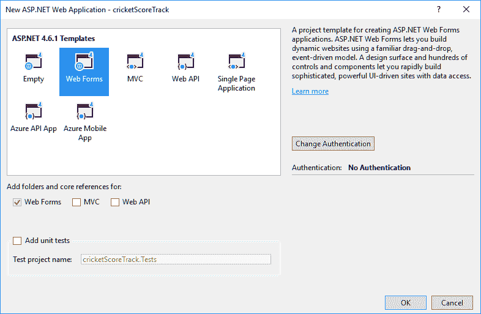

我假设你也已经从 GitHub 下载了本章的应用程序，因为在讨论架构时你会需要它。URL 是-[`github.com/PacktPublishing/CSharp7-and-.NET-Core-2.0-Blueprints/tree/master/cricketScoreTrack`](https://github.com/PacktPublishing/CSharp7-and-.NET-Core-2.0-Blueprints/tree/master/cricketScoreTrack)。

点击确定创建 Web 应用程序。项目将被创建，并将如下所示：

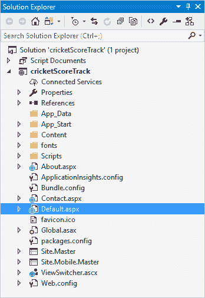

为了让你了解我们正在构建的东西，UI 将如下所示：

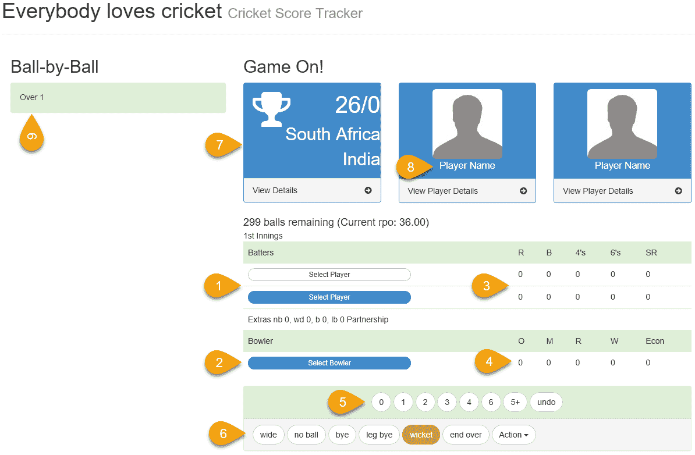

各个部分如下：

+   击球手选择（**1**在上面的截图中）

+   投手选择（**2**在上面的截图中）

+   击球手比赛统计-得分、球数、4 分、6 分、打击率（**3**在上面的截图中）

+   投手比赛统计-投掷数、无得分局数、得分、击球、经济（**4**在上面的截图中）

+   击球手得分（**5**在上面的截图中）

+   游戏动作（**6**在上面的截图中）

+   比赛得分和球队（**7**在上面的截图中）

+   当前击球手详情（**8**在上面的截图中）

+   每球和每局的得分（**9**在上面的截图中）

正如你所看到的，这里有很多事情。显然还有很多地方可以继续扩展。另一个有趣的想法是添加一个游戏统计面板，甚至是 Duckworth-Lewis 计算，如果你有时间去尝试实现的话。我说尝试，因为实际的计算算法是一个秘密。

然而，在网上有很多实现，我特别感兴趣的是 Sarvashrestha Paliwal 的文章，他是*微软印度的 Azure 业务负责人*。他们使用机器学习来分析历史板球比赛，从而提供不断改进的 Duckworth-Lewis 计算。

你可以在以下链接阅读他的文章-[`azure.microsoft.com/en-us/blog/improving-the-d-l-method-using-machine-learning/`](https://azure.microsoft.com/en-us/blog/improving-the-d-l-method-using-machine-learning/)。

让我们更仔细地看一下应用程序结构。展开`Scripts`文件夹，你会注意到应用程序使用了 jQuery 和 Bootstrap：

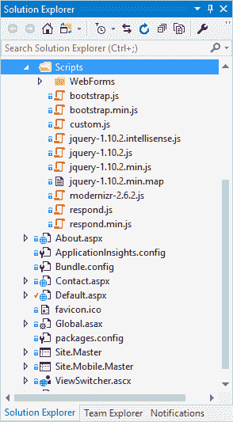

展开`Content`文件夹，你会看到正在使用的 CSS 文件：

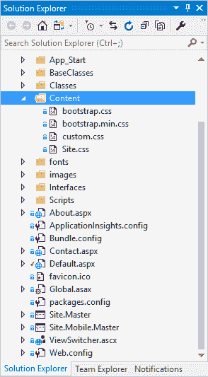

请注意，这个文件夹中有一个我添加的`custom.css`文件：

```cs
.score { 
    font-size: 40px; 
} 
.team { 
    font-size: 30px; 
} 
.player { 
    font-size: 16.5px; 
} 
.info { 
    font-size: 18px; 
} 
.btn-round-xs { 
    border-radius: 11px; 
    padding-left: 10px; 
    padding-right: 10px; 
    width: 100%; 
} 
.btn-round { 
    border-radius: 17px; 
} 
.navbar-top-links { 
    margin-right: 0; 
} 
.nav { 
    padding-left: 0; 
    margin-bottom: 0; 
    list-style: none; 
} 
```

这个 CSS 文件基本上是为表单上的按钮和一些其他文本字体设置样式。这个 CSS 并不复杂。Bootstrap、jQuery、JavaScript 和 CSS 文件的原因是为了在网页上启用 Bootstrap 功能。

为了看到 Bootstrap 的效果，我们将使用 Chrome 来运行 Web 应用程序。

本书使用的 Chrome 版本是 Version 60.0.3112.90 (Official Build) (64-bit)。

通过在菜单上点击 Debug 并点击 Start Without Debugging 或按*Ctrl* + *F5*来运行板球比分跟踪器 Bootstrap Web 应用程序。当 Web 应用程序在 Chrome 中加载后，按*Ctrl* + *Shift* + *I*打开开发者工具：


在屏幕左上角，点击切换设备工具栏按钮或按*Ctrl* + *Shift* + *M*。

Chrome 然后会将应用程序呈现为在移动设备上看到的样子。从工具栏到顶部，你会看到应用程序已经呈现为在 iPhone 6 Plus 上的样子：

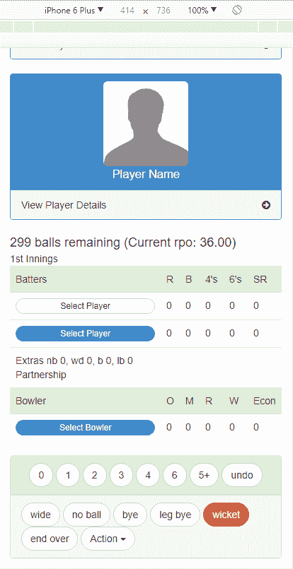

点击设备类型，你可以改变你想要呈现页面的设备。将其改为 iPad Pro 会相应地呈现页面。你也可以模拟设备的旋转：

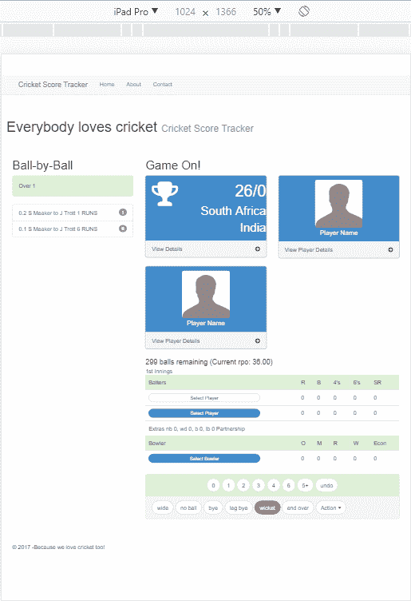

这个功能非常强大，允许现代 Web 开发人员测试他们的 Web 应用程序的响应性。如果在为特定设备呈现应用程序后，发现有些地方看起来不太对劲，你需要去调查你哪里出错了。

在撰写本文时，支持的设备有：

+   BlackBerry Z30 和 PlayBook

+   Galaxy Note 3，Note II，S3 和 S5

+   Kindle Fire HDX

+   LG Optimus L70

+   带有 HiDPI 屏幕和 MDPI 屏幕的笔记本电脑

+   带触摸的笔记本电脑

+   Microsoft Lumina 550 和 950

+   Nexus 7, 6, 5, 4, 10, 5X 和 6P

+   Nokia Lumina 520

+   Nokia N9

+   iPad Mini

+   iPhone 4, 5, 6 和 6 Plus

+   iPad 和 iPad Pro

要添加设备，转到设备菜单底部。在分隔符之后，有一个 Edit...菜单项。点击它将带你到模拟设备屏幕。

查看模拟设备屏幕，你会注意到表单右侧有额外的设置：

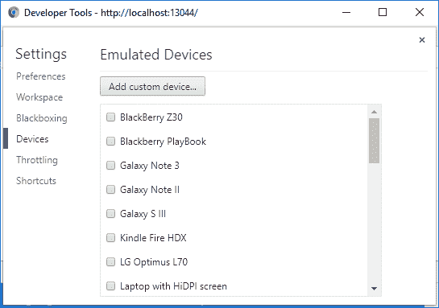

对于开发人员来说，一个突出的设置应该是 Throttling 设置：

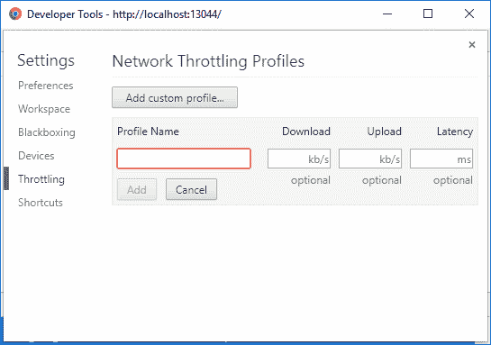

正如名字所示，Throttling 允许你测试你的应用程序，就好像它在一个较慢的连接上运行一样。然后你可以测试功能，并确保你的 Web 应用程序尽可能地优化，以确保它在较慢的连接上能够良好运行。

回到 Visual Studio 2017 中的解决方案资源管理器，看看名为`BaseClasses`、`Classes`和`Interfaces`的文件夹：

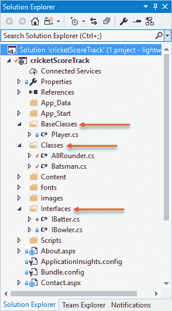

这些文件夹包含了整个章节的精髓。在这里，我们将看到面向对象编程的本质以及面向对象编程如何提供更好的方法来在代码中建模现实世界的场景（板球比赛）。

# 面向对象编程

正如前面简要提到的，面向对象编程提供了一种模块化的方法来编写自包含的代码单元。面向对象编程的概念围绕着我们所说的**面向对象编程的四大支柱**。

它们如下：

+   抽象

+   多态性

+   继承

+   封装

顺序并不重要，但我总是按照这个顺序写四大支柱，因为我使用**A PIE**这个记忆法来记住每一个。让我们更详细地讨论每个概念。

# 抽象

抽象描述了某件事应该做什么，而不实际展示如何做。根据微软文档：

“抽象是描述合同但不提供合同完整实现的类型。”

作为抽象的示例包括**抽象类**和**接口**。.NET Framework 中的抽象示例包括`Stream`、`IEnumerable<T>`和`Object`。如果抽象主题现在看起来有点模糊，不要担心。我将在封装和封装与抽象之间的区别部分中更详细地讨论。

# 多态性

你可能听说过多态性被称为面向对象编程的第三支柱。但如果我按照上面的顺序写，我的记忆法就不再起作用了！

多态性是一个希腊词，指的是具有许多形状或形式的东西。我们将在稍后的*板球比分跟踪*应用中看到这一点的例子。只需记住它有两个明显的方面：

+   在运行时，从基类派生的类可以被视为继承的类的对象。这在参数、集合和数组中都可以看到。

+   基类可以定义派生类将覆盖的**虚拟方法**。派生类然后提供它们自己对被覆盖方法的实现。

多态性是面向对象编程中非常强大的特性。

# 编译时多态性与运行时多态性

在我们继续之前，让我停顿一分钟，解释一下前面两个关于多态性的要点。

当我们说**编译时多态**时，我们是说我们将声明具有相同名称但不同签名的方法。因此，相同的方法可以根据接收到的签名（参数）执行不同的功能。这也被称为早期绑定、重载或静态绑定。

当我们说**运行时多态**时，我们是说我们将声明具有相同名称和相同签名的方法。例如，在基类中，该方法被派生类中的方法覆盖。这是通过我们所谓的继承和使用`virtual`或`override`关键字实现的。运行时多态也被称为*延迟绑定*、*覆盖*或*动态绑定*。

# 继承

能够创建自己的类，重用、扩展和修改基类定义的行为的能力被称为**继承**。另一个重要的方面是理解派生类只能直接继承单个基类。

这是否意味着你只能继承单个基类中定义的行为？是的，也不是。继承是具有传递性的。

为了解释这一点，想象一下你有三个类：

+   `Person`

+   `Pedestrian`

+   `Driver`

`Person`类是基类。`Pedestrian`继承自`Person`类，因此`Pedestrian`继承了`Person`类中声明的成员。`Driver`类继承自`Pedestrian`类，因此`Driver`继承了`Pedestrian`和`Person`中声明的成员：


这就是我们所说的继承是传递的意思。您只能从一个类继承，但您会得到从您继承的类本身继承的所有成员。 换句话说，`Driver`类只能从一个基类继承（在前面的图像中，`Pedestrian`类）。这意味着因为`Pedestrian`类继承自`Person`类，而`Driver`类继承自`Pedestrian`类，所以`Driver`类也继承了`Person`类中的成员。

# 封装

简而言之，这意味着类的内部工作（实现细节）不一定与外部代码共享。请记住，我们之前提到过类是您只想要使用并期望它能够工作的东西。类向调用代码公开它需要的内容，但它对实现的内部工作保持严格控制。

因此，您可以通过将变量、属性和方法作用域设置为`private`来隐藏它们。这样，您可以保护类内部包含的数据免受意外损坏。

# 封装与抽象

让我们再次停下来看看这个概念，因为它会让开发人员感到困惑（而且有点令人困惑，所以例子会帮助很多）。问题的一部分源于定义：

+   **抽象**：只显示必要的内容

+   **封装**：隐藏复杂性

如果我们必须考虑一个基本的类来加密一些文本，我们需要花一点时间来决定这个类必须做什么。我想象这个类需要：

+   为文本获取一个字符串值

+   有一种方法可以加密文本

因此，让我们编写代码：

```cs
public class EncryptionHelper
{
  public string TextToEncrypt = "";
  public void Encrypt()
  {
  }
}
```

我也知道，如果我想要加密一些文本，我需要一个随机生成的字节数组来给要加密的文本加盐。让我们添加这个方法：

```cs
public class EncryptionHelper
{
  public string TextToEncrypt = "";
  public void Encrypt()
  {
  }
  public string GenerateSalt()
  {
    Return "";
  }
}
```

现在再看一下类，我意识到加密文本需要保存在数据库中。所以，我添加了一个方法来做到这一点：

```cs
public class EncryptionHelper
{
  public string TextToEncrypt = "";
  public void Encrypt()
  {
  }
  public string GenerateSalt()
  {
    return "";
  }
  public void SaveToDatabase()
  {
  }
}
```

如果我们必须实现这个类，它会看起来像这样：

```cs
EncryptionHelper encr = new EncryptionHelper();
encr.TextToEncrypt = "Secret Text";
string salt = encr.GenerateSalt();
encr.Encrypt();
encr.SaveToDatabase();
```

好吧，但现在我们看到有一个问题。`salt`需要被加密方法使用，所以自然我们会想要在`Encrypt()`方法中添加一个参数来接受`salt`。因此，我们会这样做：

```cs
public void Encrypt(string salt)
{
}
```

在这里，代码开始变得有点模糊。我们在类上调用一个方法来生成一个`salt`。然后我们将从类中生成的`salt`传回类。想象一个有许多方法的类。哪些方法需要在何时调用，以及以什么顺序？

所以，让我们退一步思考。我们到底想要做什么？我们想要加密一些文本。因此，我们只想要以下内容：

```cs
public class EncryptionHelper
{
  public string TextToEncrypt = "";
  public void Encrypt()
  {
  }
}
```

这就是我们所说的**抽象**。回顾抽象的定义，我们在代码中所做的与定义相符，因为我们只显示必要的内容。

那么类中的其他方法呢？很简单地说...将它们设为`private`。实现您的类的开发人员不需要知道如何加密文本字符串。实现您的类的开发人员只想要加密字符串并将其保存。代码可以这样**封装**：

```cs
public class EncryptionHelper
{
  public string TextToEncrypt = "";
  public void Encrypt()
  {
    string salt = GenerateSalt();
    // Encrypt the text in the TextToEncrypt variable
    SaveToDatabase();
  }
  private string GenerateSalt()
  {
    return "";
  }
  private void SaveToDatabase()
  {
  }
}
```

调用加密类的代码现在也简单得多。它看起来像这样：

```cs
EncryptionHelper encr = new EncryptionHelper();
encr.TextToEncrypt = "Secret Text";
encr.Encrypt();
```

再次，这符合**封装**的定义，即隐藏复杂性。

请注意，前面加密示例中的代码没有任何实现。我只是在这里阐述一个概念。如果您愿意，您可以自由添加自己的实现。

最后，不要将抽象与抽象类混淆。这些是不同的东西。抽象是一种思维方式。我们将在下一节中看看抽象类。

因此，请休息 5 分钟，呼吸新鲜空气或喝杯咖啡，然后回来，做好准备！事情即将变得有趣。

# 板球比分跟踪器中的类

根据我们已经学到的面向对象编程的四大支柱，我们将看看我们的应用程序中使用这些概念提供*板球比分跟踪器*的构建模块的领域。

# 抽象类

打开`BaseClasses`文件夹，双击`Player.cs`文件。您将看到以下代码：

```cs
namespace cricketScoreTrack.BaseClasses 
{ 
    public abstract class Player 
    { 
        public abstract string FirstName { get; set; } 
        public abstract string LastName { get; set; } 
        public abstract int Age { get; set; } 
        public abstract string Bio { get; set; } 
    } 
} 
```

这是我们的**抽象类**。类声明中的`abstract`修饰符和属性告诉我们，我们将要修改的东西具有缺失或不完整的实现。因此，它只用作基类。任何标记为抽象的成员必须由派生自我们的`Player`抽象类的类实现。

抽象修饰符与以下内容一起使用：

+   类

+   方法

+   属性

+   索引器

+   事件

如果我们在抽象的`Player`类中包含一个名为`CalculatePlayerRank()`的方法，那么我们需要在任何从`Player`派生的类中提供该方法的实现。

因此，在`Player`抽象类中，该方法将被定义如下：

```cs
abstract public int CalculatePlayerRank(); 
```

在任何派生类中，Visual Studio 2017 将运行代码分析器，以确定抽象类的所有成员是否已被派生类实现。当您让 Visual Studio 2017 在派生类中实现抽象类时，方法主体默认为`NotImplementedException()`：

```cs
public override int CalculatePlayerRank() 
{ 
  throw new NotImplementedException(); 
} 
```

这是因为您尚未为`CalculatePlayerRank()`方法提供任何实现。要做到这一点，您需要用实际的工作代码替换`throw new NotImplementedException();`来计算当前球员的排名。

有趣的是，虽然`NotImplementedException()`在`CalculatePlayerRank()`方法的主体内部，但它并没有警告您该方法没有返回 int 值。

抽象类可以被视为需要完成的蓝图。如何完成由开发人员决定。

# 接口

打开`Interfaces`文件夹，查看`IBatter.cs`和`IBowler.cs`文件。`IBatter`接口如下所示：

```cs
namespace cricketScoreTrack.Interfaces 
{ 
    interface IBatter 
    { 
        int BatsmanRuns { get; set; }         
        int BatsmanBallsFaced { get; set; }         
        int BatsmanMatch4s { get; set; }         
        int BatsmanMatch6s { get; set; }         
        double BatsmanBattingStrikeRate { get; }             
    } 
} 
```

查看`IBowler`接口，您将看到以下内容：

```cs
namespace cricketScoreTrack.Interfaces 
{ 
    interface IBowler 
    { 
        double BowlerSpeed { get; set; } 
        string BowlerType { get; set; }  
        int BowlerBallsBowled { get; set; } 
        int BowlerMaidens { get; set; }         
        int BowlerWickets { get; set; }         
        double BowlerStrikeRate { get; }         
        double BowlerEconomy { get; }  
        int BowlerRunsConceded { get; set; } 
        int BowlerOversBowled { get; set; } 
    } 
} 
```

接口将仅包含方法、属性、事件或索引器的签名。如果我们需要向接口添加一个计算球旋转的方法，它将如下所示：

```cs
void CalculateBallSpin(); 
```

在实现上，我们会看到以下代码实现：

```cs
void CalculateBallSpin()
{
}
```

下一个合乎逻辑的问题可能是**抽象类**和**接口**之间的区别是什么。让我们转向微软的优秀文档网站—[`docs.microsoft.com/en-us/`](https://docs.microsoft.com/en-us/)。

打开微软文档后，尝试使用深色主题。主题切换在页面右侧，评论、编辑和分享链接的下方。对于夜猫子来说，这真的很棒。

微软用以下语句简洁地总结了接口：

接口就像抽象基类。实现接口的任何类或结构都必须实现其所有成员。

将接口视为动词；也就是说，接口描述某种动作。板球运动员所做的事情。在这种情况下，动作是击球和投球。因此，在*板球比分跟踪器*中，接口分别是`IBatter`和`IBowler`。请注意，约定规定接口以字母`I`开头。

另一方面，抽象类充当告诉您某物是什么的名词。我们有击球手和全能选手。我们可以说这两位板球运动员都是球员。这是描述板球比赛中板球运动员的普通名词。因此，在这里使用`Player`抽象类是有意义的。

# 类

*Cricket Score Tracker*应用程序中使用的类都在`Classes`文件夹中创建。在这里，你会看到一个`Batsman`类和一个`AllRounder`类。为了简单起见，我只创建了这两个类。在板球中，所有投手都必须击球，但并非所有击球手都必须投球。然后你会得到能够击球和投球同样出色的投手，他们被定义为全能手。这就是我在这里建模的内容。

首先让我们看一下`Batsman`类。我们希望击球手具有球员的抽象属性，但他也必须是击球手。因此，我们的类继承了`Player`基类（记住，我们只能继承自一个类），并实现了`IBatter`接口的属性：

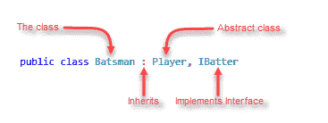

因此，类定义读作`Batsman`公共类，继承自`Player`，并实现`IBatter`接口。因此，`Batsman`类如下所示：

```cs
using cricketScoreTrack.BaseClasses; 
using cricketScoreTrack.Interfaces; 

namespace cricketScoreTrack.Classes 
{ 
    public class Batsman : Player, IBatter 
    { 
        #region Player 
        public override string FirstName { get; set; } 
        public override string LastName { get; set; } 
        public override int Age { get; set; } 
        public override string Bio { get; set; } 
        #endregion 

        #region IBatsman 
        public int BatsmanRuns { get; set; } 
        public int BatsmanBallsFaced { get; set; } 
        public int BatsmanMatch4s { get; set; } 
        public int BatsmanMatch6s { get; set; } 

        public double BatsmanBattingStrikeRate => (BatsmanRuns * 100) 
         / BatsmanBallsFaced;  

        public override int CalculatePlayerRank() 
        { 
            return 0; 
        } 
        #endregion 
    } 
} 
```

请注意，`Batsman`类实现了抽象类和接口的属性。同时，请注意，此时我不想为`CalculatePlayerRank()`方法添加实现。

现在让我们看一下`AllRounder`类。我们希望全能手也具有球员的抽象属性，但他们也必须是击球手和投球手。因此，我们的类继承了`Player`基类，但现在实现了`IBatter`和`IBowler`接口的属性：


因此，类定义读作`AllRounder`公共类，继承自`Player`，并实现`IBatter`和`IBowler`接口。因此，`AllRounder`类如下所示：

```cs
using cricketScoreTrack.BaseClasses; 
using cricketScoreTrack.Interfaces; 
using System; 

namespace cricketScoreTrack.Classes 
{ 
    public class AllRounder : Player, IBatter, IBowler         
    { 
        #region enums 
        public enum StrikeRate { Bowling = 0, Batting = 1 } 
        #endregion 

        #region Player 
        public override string FirstName { get; set; } 
        public override string LastName { get; set; } 
        public override int Age { get; set; } 
        public override string Bio { get; set; } 
        #endregion 

        #region IBatsman 
        public int BatsmanRuns { get; set; } 
        public int BatsmanBallsFaced { get; set; } 
        public int BatsmanMatch4s { get; set; } 
        public int BatsmanMatch6s { get; set; } 
        public double BatsmanBattingStrikeRate => 
         CalculateStrikeRate(StrikeRate.Batting);  
        #endregion 

        #region IBowler 
        public double BowlerSpeed { get; set; } 
        public string BowlerType { get; set; }  
        public int BowlerBallsBowled { get; set; } 
        public int BowlerMaidens { get; set; } 
        public int BowlerWickets { get; set; } 
        public double BowlerStrikeRate => 
         CalculateStrikeRate(StrikeRate.Bowling);  
        public double BowlerEconomy => BowlerRunsConceded / 
         BowlerOversBowled;  
        public int BowlerRunsConceded  { get; set; } 
        public int BowlerOversBowled { get; set; } 
        #endregion 

        private double CalculateStrikeRate(StrikeRate strikeRateType) 
        { 
            switch (strikeRateType) 
            { 
                case StrikeRate.Bowling: 
                    return (BowlerBallsBowled / BowlerWickets); 
                case StrikeRate.Batting: 
                    return (BatsmanRuns * 100) / BatsmanBallsFaced; 
                default: 
                    throw new Exception("Invalid enum"); 
            } 
        } 

        public override int CalculatePlayerRank() 
        { 
            return 0; 
        } 
    } 
} 
```

你会再次注意到，我没有为`CalculatePlayerRank()`方法添加任何实现。因为抽象类定义了这个方法，所有继承自抽象类的类都必须实现这个方法。

现在你也看到`AllRounder`类必须实现`IBowler`和`IBatter`的属性。

# 把所有东西放在一起

现在，让我们看一下如何使用这些类来创建*Cricket Score Tracker*应用程序。在击球手部分和投球手部分下面的按钮用于选择特定局的击球手和投球手。

虽然每个按钮都由自己的点击事件处理，但它们都调用完全相同的方法。我们稍后将看一下是如何实现的：

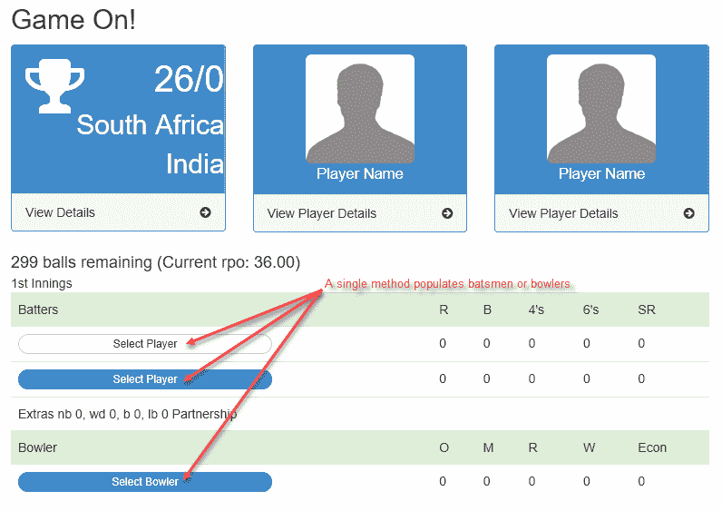

点击 Batsmen 部分下的任一按钮将显示一个带有填充有该队伍中击球手的下拉列表的模态对话框：

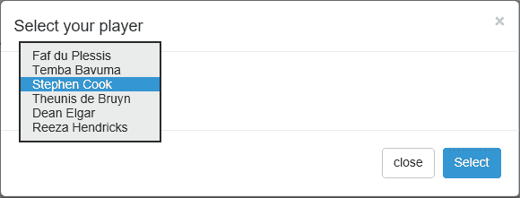

同样，当我们点击选择投球手按钮时，我们将看到完全相同的模态对话框屏幕显示。不过这次，它将显示可供选择的投球手列表：

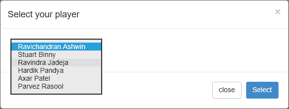

从下拉列表中选择球员将填充按钮点击时显示的文本为该球员的名字。然后设置当前局的参与球员。

请注意，我们在这里谈论的是类。我们有球员，但他们可以是击球手或全能手（投球手）。

每个球员都是击球手或投球手（`AllRounder`类）：

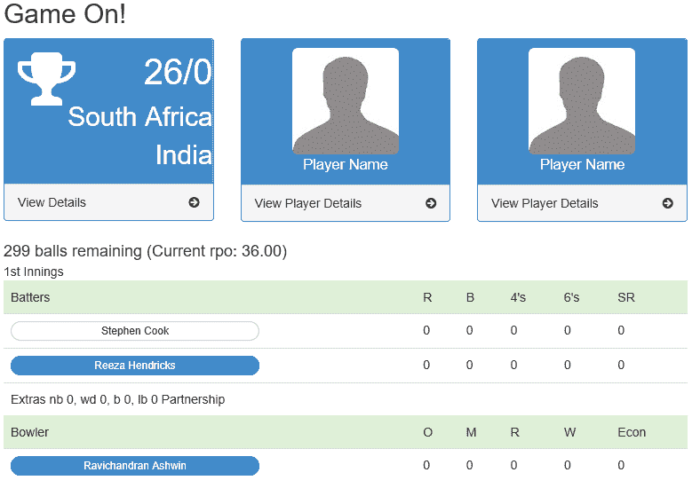

那么我们是如何让一个方法返回两个不同的球员的呢？我使用了一个叫做`GeneratePlayerList()`的方法。这个方法负责在弹出的模态对话框中创建球员列表。这就是这个方法的全部责任。换句话说，它除了生成球员列表之外不执行任何其他功能。

让我们来看一下`Default.aspx.cs`文件是如何创建的。为了简单起见，我只为每个队伍创建了两个列表。我还创建了一个用于选择球员的`enum`。代码如下：

```cs
public enum SelectedPlayer { Batsman1 = 1, Batsman2 = 2, Bowler = 3 } 
List<Player> southAfrica; 
List<Player> india; 
```

然而，实际上，你可能会将列表名称命名为`team1`和`team2`，并允许用户从设置屏幕上选择这场比赛的队伍。我没有添加这个功能，因为我只是想在这里说明面向对象编程的概念。

在`Page_Load`中，我用以下方法填充列表：

```cs
protected void Page_Load(object sender, EventArgs e) 
{ 
    southAfrica = Get_SA_Players(); 
    india = Get_India_Players(); 
} 
```

再次为了简单起见，我已经将球员的名字硬编码并手动添加到列表中。

`Get_India_Players()`方法与`Get_SA_Players()`方法是相同的。然后你可以复制这个方法，将名字改成你最喜欢的板球运动员或最喜欢的板球队。

实际上，你可能会从一个团队和球员的数据库中读取这些信息。所以，你不会有`Get_SA_Players()`和`Get_India_Players()`，而是会有一个单一的`Get_Players()`方法，负责将球员读入列表中。

现在，看看`Get_SA_Players()`方法，我们只是做以下操作：

```cs
private List<Player> Get_SA_Players() 
{ 
    List<Player> players = new List<Player>(); 

    #region Batsmen 
    Batsman b1 = new Batsman(); 
    b1.FirstName = "Faf"; 
    b1.LastName = "du Plessis"; 
    b1.Age = 33; 
    players.Add(b1); 
    // Rest omitted for brevity 
    #endregion 

    #region All Rounders 
    AllRounder ar1 = new AllRounder(); 
    ar1.FirstName = "Farhaan"; 
    ar1.LastName = "Behardien"; 
    ar1.Age = 33; 
    players.Add(ar1); 
    // Rest omitted for brevity 
    #endregion 

    return players; 
} 
```

现在注意到`players`列表的类型是`List<Player>`，我们正在向其中添加`Batsman`和`AllRounder`类型。这就是**多态性**的含义。记住我们之前提到的多态性的一个方面是：

在运行时，从基类派生的类可以被视为它继承的类的对象。这在参数、集合或数组中可以看到。

因此，因为`Batsman`和`AllRounder`都继承自`Player`抽象类，它们被视为`List<Player>`的对象。

如果你回到本章前面关于多态性的部分，你会发现这是运行时多态性的一个例子。

回到选择击球手或投球手的逻辑，我们寻找一个生成球员列表的方法，称为`GeneratePlayerList()`：

```cs
private void GeneratePlayerList(List<Player> team, Type type) 
{ 
    List<string> players = new List<string>(); 

    if (type == typeof(Batsman)) 
        players = (from r in team.OfType<Batsman>() 
                   select $"{r.FirstName} {r.LastName}").ToList(); 

    if (type == typeof(AllRounder)) 
        players = (from r in team.OfType<AllRounder>() 
                   select $"{r.FirstName} {r.LastName}").ToList(); 

    int liVal = 0; 
    if (ddlPlayersSelect.Items.Count > 0) 
        ddlPlayersSelect.Items.Clear(); 

    foreach (string player in players) 
    { 
        ListItem li = new ListItem(); 
        li.Text = player.ToString(); 
        li.Value = liVal.ToString(); 
        ddlPlayersSelect.Items.Add(li); 

        liVal += 1; 
    } 
} 
```

你会注意到这个方法接受一个`List<Player>`参数和一个`Type`。该方法检查`type`是`Batsman`还是`AllRounder`，并基于此读取列表中球员的名字。

我相信这种方法甚至可以进一步简化，但我想说明多态性的概念。

实际目标是尽量用最少的代码实现最大的效果。作为一个经验法则，一些开发人员认为，如果一个方法的长度超过了你在 IDE 中看到的代码页，你需要进行一些重构。

更少的代码和更小的方法使得代码更易于阅读和理解。它还使得代码更易于维护，因为更小的代码段更容易调试。事实上，你可能会遇到更少的 bug，因为你正在编写更小、更易管理的代码片段。

许多年前，我曾是开普敦一家大公司项目团队的一员。他们有一个名叫*乌斯曼·亨德里克斯*的系统架构师。我永远不会忘记这个家伙。他是我见过的最谦逊的家伙。他为我们所做系统的文档简直令人难以置信。几乎所有的思考工作都已经包含在我们需要编写的代码中。开发人员根本不需要决定如何设计项目。

这个项目实现了 SOLID 原则，理解代码真的很容易。我现在还有那份文档的副本。我时不时地会参考它。不幸的是，并不是所有的开发人员都有幸在他们所工作的项目中有一个专门的系统架构师。然而，开发人员了解 SOLID 设计原则是很有好处的。

# SOLID 设计原则

这引出了面向对象编程中另一个有趣的概念，叫做**SOLID**设计原则。这些设计原则适用于任何面向对象的设计，旨在使软件更易于理解、更灵活和更易于维护。

SOLID 是一个记忆术，代表：

+   单一职责原则

+   开放/封闭原则

+   里氏替换原则

+   接口隔离原则

+   依赖反转原则

在本章中，我们只会看一下前两个原则——**单一责任原则**和**开闭原则**。让我们接下来看一下单一责任原则。

# 单一责任原则

简而言之，一个模块或类应该只具有以下特征：

+   它应该只做一件事情，并且只有一个改变的原因

+   它应该很好地完成它的单一任务

+   提供的功能需要完全由该类或模块封装

说一个模块必须负责一件事情是什么意思？谷歌对模块的定义是：

“一组标准化的部分或独立单元，可以用来构建更复杂的结构，比如家具或建筑物。”

由此，我们可以理解模块是一个简单的构建块。当与其他模块一起使用时，它可以被使用或重复使用来创建更大更复杂的东西。因此，在 C#中，模块确实与类非常相似，但我会说模块也可以扩展为一个方法。

类或模块执行的功能只能是一件事情。也就是说，它有一个**狭窄的责任**。它只关心它被设计来做的那一件事情，而不关心其他任何事情。

如果我们必须将单一责任原则应用于一个人，那么这个人只能是一个软件开发人员，例如。但如果一个软件开发人员也是医生、机械师和学校老师呢？那这个人在任何一个角色中都会有效吗？这将违反单一责任原则。对于代码也是如此。

看一下我们的`AllRounder`和`Batsman`类，你会注意到在`AllRounder`中，我们有以下代码：

```cs
private double CalculateStrikeRate(StrikeRate strikeRateType) 
{ 
    switch (strikeRateType) 
    { 
        case StrikeRate.Bowling: 
            return (BowlerBallsBowled / BowlerWickets); 
        case StrikeRate.Batting: 
            return (BatsmanRuns * 100) / BatsmanBallsFaced; 
        default: 
            throw new Exception("Invalid enum"); 
    } 
} 

public override int CalculatePlayerRank() 
{ 
    return 0; 
} 

```

在`Batsman`中，我们有以下代码：

```cs
public double BatsmanBattingStrikeRate => (BatsmanRuns * 100) / BatsmanBallsFaced;  

public override int CalculatePlayerRank() 
{ 
    return 0; 
} 
```

利用我们对单一责任原则的了解，我们注意到这里存在一个问题。为了说明问题，让我们将代码并排比较：


在`Batsman`和`AllRounder`类中，我们实际上在重复代码。这对于单一责任来说并不是一个好兆头，对吧？我的意思是，一个类只能有一个功能。目前，`Batsman`和`AllRounder`类都负责计算击球率。它们也都负责计算球员排名。它们甚至都有完全相同的代码来计算击球手的击球率！

问题出现在击球率计算发生变化时（虽然不太容易发生，但让我们假设它发生了）。我们现在知道我们必须在两个地方改变计算。一旦开发人员只改变了一个计算而没有改变另一个，就会在我们的应用程序中引入一个 bug。

让我们简化我们的类。在`BaseClasses`文件夹中，创建一个名为`Statistics`的新的抽象类。代码应该如下所示：

```cs
namespace cricketScoreTrack.BaseClasses 
{ 
    public abstract class Statistics 
    { 
        public abstract double CalculateStrikeRate(Player player); 
        public abstract int CalculatePlayerRank(Player player); 
    } 
} 
```

在`Classes`文件夹中，创建一个名为`PlayerStatistics`的新派生类（也就是它继承自`Statistics`抽象类）。代码应该如下所示：

```cs
using cricketScoreTrack.BaseClasses; 
using System; 

namespace cricketScoreTrack.Classes 
{ 
    public class PlayerStatistics : Statistics 
    { 
        public override int CalculatePlayerRank(Player player) 
        { 
            return 1; 
        } 

        public override double CalculateStrikeRate(Player player) 
        {             
            switch (player) 
            { 
                case AllRounder allrounder: 
                    return (allrounder.BowlerBallsBowled / 
                     allrounder.BowlerWickets); 

                case Batsman batsman: 
                    return (batsman.BatsmanRuns * 100) / 
                     batsman.BatsmanBallsFaced; 

                default: 
                    throw new ArgumentException("Incorrect argument 
                     supplied"); 
            } 
        } 
    } 
} 
```

你会看到`PlayerStatistics`类现在完全负责计算球员的排名和击球率的统计数据。

你会看到我没有包括计算球员排名的实现。我在 GitHub 上简要评论了这个方法，说明了球员排名是如何确定的。这是一个相当复杂的计算，对于击球手和投球手是不同的。因此，我在这一章关于面向对象编程的目的上省略了它。

你的解决方案现在应该如下所示：

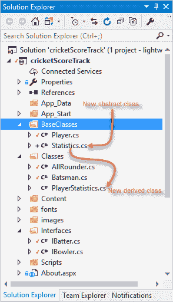

回到你的`Player`抽象类，从类中移除`abstract public int CalculatePlayerRank();`。在`IBowler`接口中，移除`double BowlerStrikeRate { get; }`属性。在`IBatter`接口中，移除`double BatsmanBattingStrikeRate { get; }`属性。

在`Batsman`类中，从类中移除`public double BatsmanBattingStrikeRate`和`public override int CalculatePlayerRank()`。现在`Batsman`类的代码如下：

```cs
using cricketScoreTrack.BaseClasses; 
using cricketScoreTrack.Interfaces; 

namespace cricketScoreTrack.Classes 
{ 
    public class Batsman : Player, IBatter 
    { 

        #region Player 
        public override string FirstName { get; set; } 
        public override string LastName { get; set; } 
        public override int Age { get; set; } 
        public override string Bio { get; set; } 
        #endregion 

        #region IBatsman 
        public int BatsmanRuns { get; set; } 
        public int BatsmanBallsFaced { get; set; } 
        public int BatsmanMatch4s { get; set; } 
        public int BatsmanMatch6s { get; set; } 
        #endregion 
    } 
} 
```

看看`AllRounder`类，移除`public enum StrikeRate { Bowling = 0, Batting = 1 }`枚举，以及`public double BatsmanBattingStrikeRate`和`public double BowlerStrikeRate`属性。

最后，移除`private double CalculateStrikeRate(StrikeRate strikeRateType)`和`public override int CalculatePlayerRank()`方法。现在`AllRounder`类的代码如下：

```cs
using cricketScoreTrack.BaseClasses; 
using cricketScoreTrack.Interfaces; 
using System; 

namespace cricketScoreTrack.Classes 
{ 
    public class AllRounder : Player, IBatter, IBowler 
    { 
        #region Player 
        public override string FirstName { get; set; } 
        public override string LastName { get; set; } 
        public override int Age { get; set; } 
        public override string Bio { get; set; } 
        #endregion 

        #region IBatsman 
        public int BatsmanRuns { get; set; } 
        public int BatsmanBallsFaced { get; set; } 
        public int BatsmanMatch4s { get; set; } 
        public int BatsmanMatch6s { get; set; } 
        #endregion 

        #region IBowler 
        public double BowlerSpeed { get; set; } 
        public string BowlerType { get; set; }  
        public int BowlerBallsBowled { get; set; } 
        public int BowlerMaidens { get; set; } 
        public int BowlerWickets { get; set; } 
        public double BowlerEconomy => BowlerRunsConceded / 
         BowlerOversBowled;  
        public int BowlerRunsConceded  { get; set; } 
        public int BowlerOversBowled { get; set; } 
        #endregion         
    } 
} 
```

回顾一下我们的`AllRounder`和`Batsman`类，代码显然更简化了。它肯定更灵活，开始看起来像一组构建良好的类。重新构建你的解决方案，确保一切正常运行。

# 开闭原则

之前，我们已经看过**单一职责原则**。与此相辅相成的是**开闭原则**。

Bertrand Meyer 说过，软件实体（类、模块、函数等）：

+   应该对扩展开放

+   应该对修改关闭

这到底意味着什么？让我们以`PlayerStatistics`类为例。在这个类中，你知道我们有一个方法来计算特定球员的击球率。这是因为它继承自`Statistics`抽象类。这是正确的，但`CalculateStrikeRate(Player player)`方法为两种球员类型（全能选手和击球手）提供服务，这已经是一个问题的暗示。

假设我们引入了新的球员类型——不同的投球手类型（例如快速投球手和旋转投球手）。为了适应新的球员类型，我们必须改变`CalculateStrikeRate()`方法中的代码。

如果我们想要传递一组击球手来计算他们之间的平均击球率，我们需要再次修改`CalculateStrikeRate()`方法来适应这一点。随着时间的推移和复杂性的增加，为不同需要击球率计算的球员类型提供服务将变得非常困难。这意味着我们的`CalculateStrikeRate()`方法是**对修改开放**但**对扩展关闭**。这违反了之前列出的原则。

那么，我们该怎么做才能解决这个问题呢？事实上，我们已经走了一半的路。首先，在`Classes`文件夹中创建一个新的`Bowler`类：

```cs
using cricketScoreTrack.BaseClasses; 
using cricketScoreTrack.Interfaces; 

namespace cricketScoreTrack.Classes 
{ 
    public class Bowler : Player, IBowler 
    { 
        #region Player 
        public override string FirstName { get; set; } 
        public override string LastName { get; set; } 
        public override int Age { get; set; } 
        public override string Bio { get; set; } 
        #endregion 

        #region IBowler 
        public double BowlerSpeed { get; set; } 
        public string BowlerType { get; set; }  
        public int BowlerBallsBowled { get; set; } 
        public int BowlerMaidens { get; set; } 
        public int BowlerWickets { get; set; } 
        public double BowlerEconomy => BowlerRunsConceded / 
         BowlerOversBowled;  
        public int BowlerRunsConceded { get; set; } 
        public int BowlerOversBowled { get; set; } 
        #endregion 
    } 
} 
```

你可以看到构建新的球员类型有多么容易——我们只需要告诉类它需要继承`Player`抽象类并实现`IBowler`接口。

接下来，我们需要创建新的球员统计类，即`BatsmanStatistics`、`BowlerStatistics`和`AllRounderStatistics`。`BatsmanStatistics`类的代码如下：

```cs
using cricketScoreTrack.BaseClasses; 
using System; 

namespace cricketScoreTrack.Classes 
{ 
    public class BatsmanStatistics : Statistics 
    { 
        public override int CalculatePlayerRank(Player player) 
        { 
            return 1; 
        } 

        public override double CalculateStrikeRate(Player player) 
        { 
            if (player is Batsman batsman) 
            { 
                return (batsman.BatsmanRuns * 100) / 
                 batsman.BatsmanBallsFaced; 
            } 
            else 
                throw new ArgumentException("Incorrect argument 
                 supplied"); 
        } 
    } 
} 

```

接下来，我们添加`AllRounderStatistics`类：

```cs
using cricketScoreTrack.BaseClasses; 
using System; 

namespace cricketScoreTrack.Classes 
{ 
    public class AllRounderStatistics : Statistics 
    { 
        public override int CalculatePlayerRank(Player player) 
        { 
            return 1; 
        } 

        public override double CalculateStrikeRate(Player player) 
        { 
            if (player is AllRounder allrounder) 
            { 
                return (allrounder.BowlerBallsBowled / 
                 allrounder.BowlerWickets); 
            } 
            else 
                throw new ArgumentException("Incorrect argument 
                 supplied");             
        } 
    } 
} 
```

最后，我们添加了名为`BowlerStatistics`的新球员类型统计类：

```cs
using cricketScoreTrack.BaseClasses; 
using System; 

namespace cricketScoreTrack.Classes 
{ 
    public class BowlerStatistics : Statistics 
    { 
        public override int CalculatePlayerRank(Player player) 
        { 
            return 1; 
        } 

        public override double CalculateStrikeRate(Player player) 
        { 
            if (player is Bowler bowler) 
            { 
                return (bowler.BowlerBallsBowled / 
                 bowler.BowlerWickets); 
            } 
            else 
                throw new ArgumentException("Incorrect argument 
                 supplied"); 
        } 
    } 
} 
```

将计算所有球员击球率的责任从`PlayerStatistics`类中移开，使我们的代码更清晰、更健壮。事实上，`PlayerStatistics`类已经几乎过时了。

通过添加另一种球员类型，我们能够通过实现正确的接口轻松定义这个新球员的逻辑。我们的代码更小，更容易维护。通过比较我们之前编写的`CalculateStrikeRate()`的代码和新代码，我们可以看到这一点。

为了更清楚地说明，看一下下面的代码：

```cs
public override double CalculateStrikeRate(Player player) 
{             
    switch (player) 
    { 
        case AllRounder allrounder: 
            return (allrounder.BowlerBallsBowled / 
             allrounder.BowlerWickets); 

        case Batsman batsman: 
            return (batsman.BatsmanRuns * 100) / 
             batsman.BatsmanBallsFaced; 

        case Bowler bowler: 
            return (bowler.BowlerBallsBowled / bowler.BowlerWickets); 

        default: 
            throw new ArgumentException("Incorrect argument 
             supplied"); 
    } 
} 

```

前面的代码比下面的代码复杂得多，难以维护：

```cs
public override double CalculateStrikeRate(Player player) 
{ 
    if (player is Bowler bowler) 
    { 
        return (bowler.BowlerBallsBowled / bowler.BowlerWickets); 
    } 
    else 
        throw new ArgumentException("Incorrect argument supplied"); 
} 
```

例如，创建一个`BowlerStatistics`类的好处是，你知道在整个类中我们只处理球员，没有别的东西……一个单一的责任，可以在不修改代码的情况下进行扩展。

# 总结

虽然 SOLID 编程原则是很好的指导方针，但你遇到的很少有系统会在整个应用程序中实际实现它们。特别是如果你继承了一个已经投入生产多年的系统。

我必须承认，我遇到过一些以 SOLID 为设计理念的应用程序。这些应用程序非常容易操作，对团队中的其他开发人员设定了很高的代码质量标准。

同行代码审查和团队中每个开发人员对 SOLID 原则的深入理解，确保了保持相同水平的代码质量。

这一章内容非常丰富。除了为一个非常好的*板球比分跟踪*应用程序奠定基础外，我们还深入了解了面向对象编程的真正含义。

我们研究了抽象和封装之间的区别。我们讨论了多态性，并了解了运行时多态性与编译时多态性的区别。我们还研究了继承，即通过继承基类来创建派生类。

然后我们讨论了类、抽象类（不要与抽象混淆）和接口。希望清楚地解释了抽象类和接口之间的区别。记住，接口充当动词或行为，而抽象类充当名词，说明某物是什么。

在最后一节中，我们简要讨论了 SOLID 设计原则，并强调了单一责任和开闭原则。

在下一章中，我们将深入探讨使用.NET Core 进行跨平台开发。你会发现.NET Core 是一个非常重要的技能，它将伴随我们很长一段时间。随着.NET Core 和.NET 标准的发展，开发人员将有能力创造——好吧，我会留给你来想象。天空是极限。
