# 第三章：跨平台.NET Core 系统信息管理器

在本章中，我们将创建一个简单的*信息仪表板*应用程序，显示我们正在运行的计算机的信息，以及该计算机位置的天气情况。这是使用 IP 地址完成的，虽然可能不是 100%准确（因为给我的位置是一个镇或者离这里有一段距离），但我想要证明的概念不是位置准确性。

关于我们正在创建的应用程序，我们将做以下事情：

+   在 Windows 上设置应用程序

+   查看`Startup.cs`文件并添加控制器和视图

+   在 Windows 上运行应用程序

+   在 macOS 上运行应用程序

+   在 Linux 上设置和运行应用程序

本章主要介绍 ASP.NET Core 是什么。对于那些不知道的人，.NET Core 允许我们创建可以在 Windows、macOS 和 Linux 上运行的应用程序。

.NET Core 包括 ASP.NET Core 和 EF Core。

Microsoft 将 ASP.NET Core 定义如下：

"ASP.NET Core 是一个跨平台、高性能、开源框架，用于构建现代、基于云的、互联网连接的应用程序。"

是的，.NET Core 是开源的。您可以在 GitHub 上找到它 - [`github.com/dotnet/core`](https://github.com/dotnet/core)。使用.NET Core 的好处列在文档网站上 - [`docs.microsoft.com/en-us/aspnet/core/`](https://docs.microsoft.com/en-us/aspnet/core/)。这些好处如下：

+   构建 Web UI 和 Web API 的统一故事

+   集成现代客户端框架和开发工作流

+   云就绪，基于环境的配置系统

+   内置依赖注入

+   轻量级、高性能和模块化的 HTTP 请求管道

+   能够在**IIS**（**Internet Information Services**）上托管或在自己的进程中进行自托管

+   可以在.NET Core 上运行，支持真正的并行应用程序版本

+   简化现代 Web 开发的工具

+   能够在 Windows、macOS 和 Linux 上构建和运行

+   开源和社区关注

我鼓励您查看 Microsoft 文档网站上关于这个主题的内容 - [`docs.microsoft.com/en-us/aspnet/core/`](https://docs.microsoft.com/en-us/aspnet/core/)。

实际上，ASP.NET Core 只包括适用于您的项目的 NuGet 包。这意味着应用程序更小、性能更好。在本章中，将会看到 NuGet 的用法。

所以，让我们开始吧。接下来，让我们创建我们的第一个跨平台 ASP.NET Core MVC 应用程序。

# 在 Windows 上设置项目

我们需要做的第一件事是在开发机器上设置.NET Core 2.0。出于本书的目的，我使用 Windows PC 来说明这一步骤，但实际上，您可以在 macOS 或 Linux 上设置.NET Core 应用程序。

我将在本章后面说明如何在 Linux 上设置.NET Core。对于 macOS，这个过程类似，但我发现在 Linux 上有点棘手。因此，我选择逐步为 Linux 展示这一步骤。

对于 macOS，我将向您展示如何在 Windows PC 上创建的应用程序上运行。这就是.NET Core 的真正之美。它是一种真正的跨平台技术，能够在任何三个平台（Windows、macOS 和 Linux）上完美运行：

1.  将浏览器指向[`www.microsoft.com/net/core`](https://www.microsoft.com/net/core)并下载.NET Core SDK：


安装也非常简单。如果您看一下这个屏幕，您会注意到这与 Linux 安装之间的相似之处。两者都有一个通知，告诉您在安装过程中运行一个命令来提高项目恢复速度：

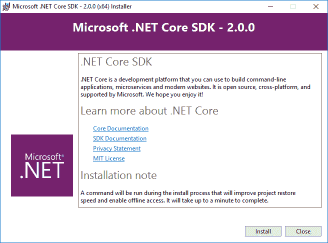

安装完成后，您会找到一些资源、文档、教程和发布说明的链接：


1.  启动 Visual Studio 并创建一个新的 ASP.NET Core Web 应用程序。同时，选择.NET Framework 4.6.2：


1.  在下一个屏幕上，从模板中选择 Web 应用程序（模型-视图-控制器**）**，并确保您已选择了 ASP.NET Core 2.0。准备好后，单击“确定”按钮创建 ASP.NET Core 项目：

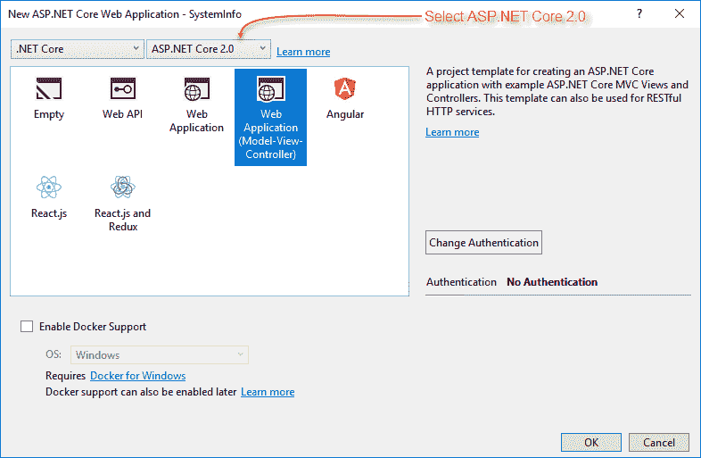

创建项目后，您将在解决方案资源管理器中看到熟悉的 MVC 结构。模型-视图-控制器架构模式需要一点时间来适应，特别是如果您是从传统的 ASP.NET Web Forms 方法转变而来的 Web 开发人员。

我向您保证，使用 MVC 工作一段时间后，您将不想回到 ASP.NET Web Forms。使用 MVC 非常有趣，而且在许多方面更有益，特别是如果这对您来说仍然是全新的：


1.  现在，您可以通过按住*Ctrl* + *F5*或在 Visual Studio 中点击调试按钮来运行应用程序。应用程序启动后，浏览器将显示 MVC 应用程序的标准视图：


1.  停止调试会话，右键单击解决方案资源管理器中的项目。从弹出的上下文菜单中，单击 ManageNuGetPackages**...**，这将打开 NuGet 表单。

我们要添加的第一个 NuGet 包是`Newtonsoft.Json`。这是为了使我们能够在应用程序中使用 JSON。

1.  单击安装按钮以将最新版本添加到您的应用程序中：

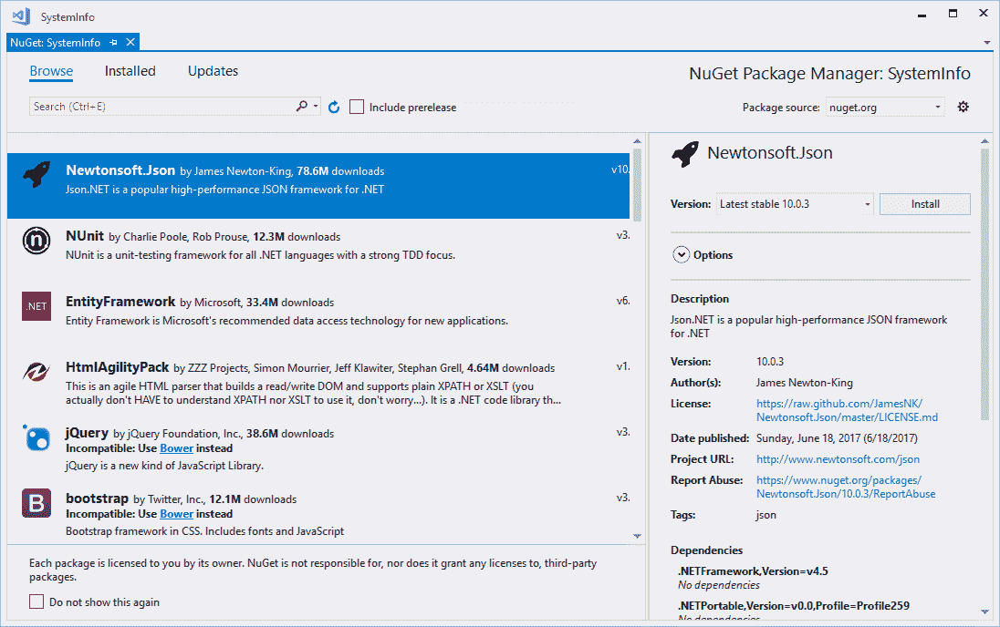

我们要添加的下一个 NuGet 包叫做`DarkSkyCore`。这是一个用于使用 Dark Sky API 的.NET Standard 库。

我已经看到有人对.NET Standard 库的说法产生了疑问。我们在这里处理的是.NET Core，对吧？那么，.NET Standard 是什么呢？

以下网站（.NET Core 教程）对此有很好的解释（[`dotnetcoretutorials.com/2017/01/13/net-standard-vs-net-core-whats-difference/`](https://dotnetcoretutorials.com/2017/01/13/net-standard-vs-net-core-whats-difference/)）：

"如果您编写一个希望在.net Core、UWP、Windows Phone 和.net Framework 上运行的库，您只需要使用所有这些平台上都可用的类。您如何知道哪些类在所有平台上都可用？.net Standard！"

.NET Standard 就是这样一个标准。如果您想要针对更多平台进行目标化，您需要针对较低版本的标准。如果您想要更多的 API 可用，您需要针对较高版本的标准。有一个 GitHub 存储库，[`github.com/dotnet/standard`](https://github.com/dotnet/standard)，您可以查看，并且有一个方便的图表显示每个平台版本实现了标准的哪个版本，可以转到[`github.com/dotnet/standard/blob/master/docs/versions.md`](https://github.com/dotnet/standard/blob/master/docs/versions.md)查看。

1.  返回到`DarkSkyCore`。单击安装按钮以获取最新版本：

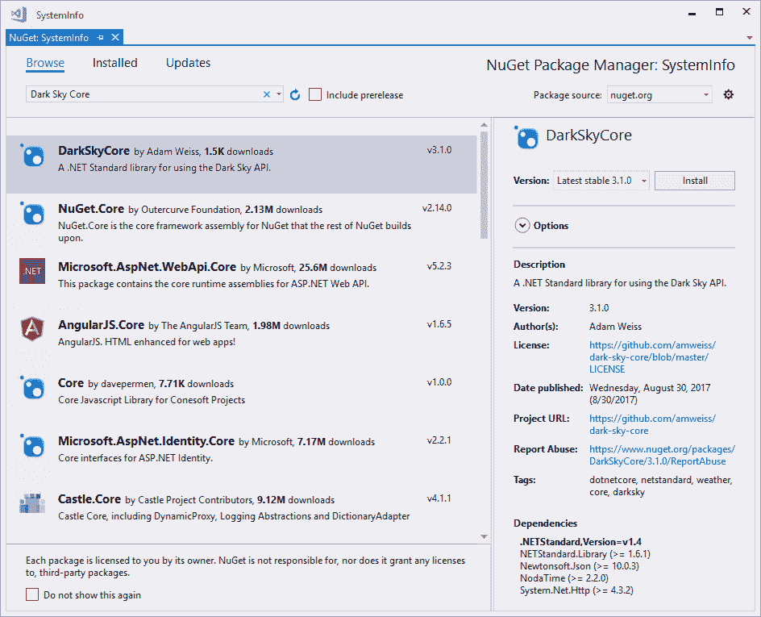

现在我们已经安装了 NuGet 包，让我们更详细地查看项目。

# 项目详细信息

在我添加了所有必需的资源、控制器、视图和模型之后查看项目，您会注意到我添加了一些额外的文件夹。

我的解决方案将如下所示：

+   `_docs`（在下面的截图中标记为**1**）：我个人的偏好是保留一个文件夹，我可以在其中做笔记并保存我发现对项目有用的相关链接

+   `climacons`(**2**): 这是包含将用作天气图标的 SVG 文件的文件夹

+   `InformationController`(**3**): 这是项目的控制器

+   `InformationModel`(**4**): 这是项目的模型

+   `GetInfo`(**5**): 这是与我的控制器上的`GetInfo()`方法对应的视图

除了`Models`，`Views`和`Controllers`文件夹，您可以根据需要放置其他文件夹。只需记住保持与解决方案相关的引用即可：

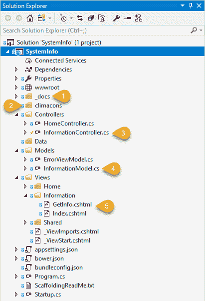

# Climacons

Adam Whitcroft 为 Web 应用程序和 UI 设计师创建了 75 个气候分类的象形文字。我们需要下载它们以在我们的应用程序中使用：

1.  前往[`adamwhitcroft.com/climacons/`](http://adamwhitcroft.com/climacons/)并下载该集合以将其包含在您的项目中。

始终记得要对你应用程序中使用的资源的创建者进行归因。

1.  要将文件夹包含在项目中，只需将 SVG 文件放在项目中的一个文件夹中：


# Startup.cs 文件

深入代码，让我们从`Startup.cs`文件开始。它应该已经默认创建了，但为了完整起见，我也在这里包含了它。

作为标准命名约定，名称`Startup`用于此文件。但实际上，您可以随意命名它。只需确保在`Program.cs`文件中也将其重命名。

`Startup.cs`文件中应包括以下`using`语句：

```cs
using Microsoft.AspNetCore.Builder; 
using Microsoft.AspNetCore.Hosting; 
using Microsoft.Extensions.Configuration; 
using Microsoft.Extensions.DependencyInjection; 
```

`Startup`文件中包含的代码对您来说将是相同的，并且在创建应用程序时默认生成。在本章中，我们不会修改此文件，但是通常情况下，如果您想要添加任何中间件，您会来到`Configure()`方法：

```cs
public class Startup 
{ 
    public Startup(IConfiguration configuration) 
    { 
        Configuration = configuration; 
    } 

    public IConfiguration Configuration { get; } 

    // This method gets called by the runtime. Use this method to add 
      services to the container. 
    public void ConfigureServices(IServiceCollection services) 
    { 
        services.AddMvc(); 
    } 

    // This method gets called by the runtime. Use this method
     to configure the HTTP request pipeline. 
    public void Configure(IApplicationBuilder app, IHostingEnvironment 
    env) 
    { 
        if (env.IsDevelopment()) 
        { 
            app.UseDeveloperExceptionPage(); 
            app.UseBrowserLink(); 
        } 
        else 
        { 
            app.UseExceptionHandler("/Home/Error"); 
        } 

        app.UseStaticFiles(); 

        app.UseMvc(routes => 
        { 
            routes.MapRoute( 
                name: "default", 
                template: "{controller=Home}/{action=Index}/{id?}"); 
        }); 
    } 
} 
```

# InformationModel 类

该应用程序的模型非常简单。它将仅公开在我们的控制器中获取的值，并提供视图访问这些值的权限。要添加模型，请右键单击`Models`文件夹，然后添加一个名为`InformationModel`的新类：

```cs
public class InformationModel 
{         
    public string OperatingSystem { get; set; } 
    public string InfoTitle { get; set; } 
    public string FrameworkDescription { get; set; } 
    public string OSArchitecture { get; set; } 
    public string ProcessArchitecture { get; set; } 
    public string Memory { get; set; } 
    public string IPAddressString { get; set; } 
    public string WeatherBy { get; set; } 
    public string CurrentTemperature { get; set; } 
    public string CurrentIcon { get; set; } 
    public string DailySummary { get; set; } 
    public string CurrentCity { get; set; } 
    public string UnitOfMeasure { get; set; } 
} 
```

然后，按照前面的代码清单所示，添加属性。

# InformationController 类

我们需要采取的下一步是为我们的应用程序添加控制器：

1.  右键单击`Controllers`文件夹，选择“添加”，然后在上下文菜单中单击“Controller”：


1.  通过从添加脚手架屏幕中选择 MVC Controller - Empty 来添加一个名为`InformationController`的新控制器。需要将以下`using`语句添加到控制器中：

```cs
using DarkSky.Models; 
using DarkSky.Services; 
using Microsoft.AspNetCore.Hosting; 
using Microsoft.AspNetCore.Mvc; 
using Newtonsoft.Json; 
using System.Globalization; 
using System.IO; 
using System.Net.Http; 
using System.Runtime.InteropServices; 
using System.Threading.Tasks; 
using static System.Math; 
```

微软文档中提到：

IHostingEnvironment 服务提供了与环境交互的核心抽象。这项服务由 ASP.NET 托管层提供，并可以通过依赖注入注入到启动逻辑中。

要了解更多信息，请浏览[`docs.microsoft.com/en-us/aspnet/core/fundamentals/environments`](https://docs.microsoft.com/en-us/aspnet/core/fundamentals/environments)并查看文档。

1.  在我们的控制器的前面构造函数中添加以下属性。您会注意到我们已经将`IHostingEnvironment`接口添加到了类中：

```cs
public string PublicIP { get; set; } = "IP Lookup Failed"; 
public double Long { get; set; } 
public double Latt { get; set; } 
public string City { get; set; } 
public string CurrentWeatherIcon { get; set; } 
public string WeatherAttribution { get; set; } 
public string CurrentTemp { get; set; } = "undetermined"; 
public string DayWeatherSummary { get; set; } 
public string TempUnitOfMeasure { get; set; } 
private readonly IHostingEnvironment _hostEnv; 

public InformationController(IHostingEnvironment hostingEnvironment) 
{ 
    _hostEnv = hostingEnvironment; 
} 
```

1.  创建一个名为`GetInfo()`的空方法。控制器（以及其中包含的方法）、视图和模型的命名是非常有意义的。如果遵循 MVC 设计模式的一组约定，将所有这些绑定在一起就会变得非常容易：

```cs
public IActionResult GetInfo() 
{ 

}
```

1.  如果您还记得，`Startup`类在`Configure()`方法中定义了一个`MapRoute`调用：


代码的这一部分`{controller=Home}/{action=Index}/{id?}`被称为**路由模板**。MVC 应用程序使用标记化来提取路由值。

这意味着以下内容：

+   +   `{controller=Home}`定义了默认为`Home`的控制器的名称

+   `{action=Index}`定义了默认为`Index`的控制器的方法

+   最后，`{id?}`被定义为可选的，通过`?`，可以用来传递参数

这意味着如果我不给应用程序指定路由（或 URL），它将使用在`MapRoute`调用中设置的默认值。

但是，如果我给应用程序一个`http://localhost:50239/Information/GetInfo`的路由，它将重定向到`InformationController`上的`GetInfo()`方法。

有关路由的更多信息，请访问[`docs.microsoft.com/en-us/aspnet/core/mvc/controllers/routing`](https://docs.microsoft.com/en-us/aspnet/core/mvc/controllers/routing)并阅读文档。

1.  在我们的`Controllers`文件夹中，添加一个名为`LocationInfo`的类。我们将在调用位置信息 API 后使用它将 JSON 字符串绑定到它：

```cs
public class LocationInfo 
{ 
    public string ip { get; set; }  
    public string city { get; set; }  
    public string region { get; set; }  
    public string region_code { get; set; } 
    public string country { get; set; } 
    public string country_name { get; set; } 
    public string postal { get; set; } 
    public double latitude { get; set; } 
    public double longitude { get; set; }  
    public string timezone { get; set; }  
    public string asn { get; set; }  
    public string org { get; set; }          
} 
```

要获取位置信息，您可以使用许多位置 API 之一。我在[`ipapi.co`](https://ipapi.co)上使用了一个 API 来为我提供位置信息。`GetLocationInfo()`方法只是调用 API 并将返回的 JSON 反序列化为刚刚创建的`LocationInfo`类。

就我个人而言，我认为`ipapi`这个名字真的很聪明。这是一个人不容易忘记的东西。他们还在他们的定价中提供了一个免费层，每天可以进行 1,000 次请求。这非常适合个人使用：

```cs
private async Task GetLocationInfo() 
{ 
    var httpClient = new HttpClient(); 
    string json = await 
     httpClient.GetStringAsync("https://ipapi.co/json"); 
    LocationInfo info = JsonConvert.DeserializeObject<LocationInfo>
    (json); 

    PublicIP = info.ip; 
    Long = info.longitude; 
    Latt = info.latitude; 
    City = info.city; 
}
```

1.  我们将使用的下一个 API 是**Dark Sky**。您需要在[`darksky.net/dev`](https://darksky.net/dev)注册帐户以获取您的 API 密钥：


我喜欢 Dark Sky 的一点是，他们的 API 还允许您每天进行 1,000 次免费 API 调用：


这使它非常适合个人使用。如果您有大量用户，即使选择按使用付费的选项也不贵。

请注意，如果您将 Dark Sky API 用于商业应用程序，您不能要求您应用程序的每个用户注册 Dark Sky API 密钥。您 Dark Sky 应用程序的所有用户必须使用您通过在线门户生成的特定 API 密钥。

对于那些感兴趣的人，常见问题解答提供了对此和许多其他重要问题的澄清：

“...您的最终用户不应该注册 Dark Sky API 密钥：API 密钥应与您的应用程序或服务关联，而不是与您的用户关联。

每天 1,000 次免费调用旨在促进个人使用和应用程序开发，而不是为您的应用程序提供免费天气数据。我们花费了大量资金来开发和维护支持 Dark Sky API 的基础设施。如果您的应用程序因受欢迎而增长，我们将不得不支付用于处理增加的流量所需资源的费用（这将使您的服务和用户受益），而没有财务手段来支持它。因此，我们的服务条款禁止要求用户注册 API 密钥的应用程序。”

跟踪 API 调用也非常容易，可以通过在线门户查看：


有了 Dark Sky API 注册，我们想要看看应用程序是否在使用公制系统或英制系统来测量单位的地区运行。

1.  创建一个名为`GetUnitOfMeasure()`的方法，该方法返回一个`DarkSkyService.OptionalParameters`对象。这本质上只是使用`RegionInfo`类来检查当前地区是否为公制。

然后设置`optParms`变量并将其返回给调用类。我还趁机加入了`TempUnitOfMeasure`属性的摄氏度或华氏度符号：

```cs
private DarkSkyService.OptionalParameters GetUnitOfMeasure() 
{ 
    bool blnMetric = RegionInfo.CurrentRegion.IsMetric; 
    DarkSkyService.OptionalParameters optParms = new 
     DarkSkyService.OptionalParameters(); 
    if (blnMetric) 
    { 
        optParms.MeasurementUnits = "si"; 
        TempUnitOfMeasure = "C"; 
    } 
    else 
    { 
        optParms.MeasurementUnits = "us"; 
        TempUnitOfMeasure = "F"; 
    } 
    return optParms; 
} 
```

1.  要添加的下一种方法称为`GetCurrentWeatherIcon()`，它将用于确定要在我们的网页上显示的 Dark Sky 图标。还有许多选择，但出于简洁起见，我选择只包括这几个图标名称。这些图标名称对应于我们解决方案中`climacons`文件夹中的 SVG 文件名的完整列表：

```cs
private string GetCurrentWeatherIcon(Icon ic) 
{ 
    string iconFilename = string.Empty; 

    switch (ic) 
    { 
        case Icon.ClearDay: 
            iconFilename = "Sun.svg"; 
            break; 

        case Icon.ClearNight: 
            iconFilename = "Moon.svg"; 
            break; 

        case Icon.Cloudy: 
            iconFilename = "Cloud.svg"; 
            break; 

        case Icon.Fog: 
            iconFilename = "Cloud-Fog.svg"; 
            break; 

        case Icon.PartlyCloudyDay: 
            iconFilename = "Cloud-Sun.svg"; 
            break; 

        case Icon.PartlyCloudyNight: 
            iconFilename = "Cloud-Moon.svg"; 
            break; 

        case Icon.Rain: 
            iconFilename = "Cloud-Rain.svg"; 
            break; 

        case Icon.Snow: 
            iconFilename = "Snowflake.svg"; 
            break; 

         case Icon.Wind: 
            iconFilename = "Wind.svg"; 
            break; 
         default: 
            iconFilename = "Thermometer.svg"; 
            break; 
    } 
    return iconFilename; 
} 
```

1.  创建的下一个方法是`GetWeatherInfo()`方法。这只是调用`DarkSkyService`类并将之前在 Dark Sky 门户中生成的 API 密钥传递给它。您会注意到，代码实际上并不是什么高深莫测的东西。

该类中的步骤如下：

1.  1.  定义 Dark Sky 的 API 密钥。

1.  使用 API 密钥实例化一个新的`DarkSkyService`对象。

1.  获取确定度量单位的`OptionalParameters`对象。

1.  然后，我们使用纬度和经度以及`optParms`来获取预报。

1.  根据预报，我找到了适当的天气图标。

1.  我使用`Path.Combine`来获取 SVG 文件的正确路径。

1.  我读取了 SVG 文件中包含的所有文本。

1.  最后，我设置了一些属性，用于将归因于 Dark Sky 的天气摘要和温度值四舍五入，使用静态`Math`类中的`Round`函数。在代码中，我不需要完全限定这一点，因为我之前已经导入了静态`Math`类。

因此，您的代码需要如下所示：

```cs
private async Task GetWeatherInfo() 
{ 
    string apiKey = "YOUR_API_KEY_HERE"; 
    DarkSkyService weather = new DarkSkyService(apiKey);             
    DarkSkyService.OptionalParameters optParms =
     GetUnitOfMeasure(); 
    var foreCast = await weather.GetForecast(Latt, Long, optParms); 

    string iconFilename = 
     GetCurrentWeatherIcon(foreCast.Response.Currently.Icon); 
    string svgFile = Path.Combine(_hostEnv.ContentRootPath, 
     "climacons", iconFilename); 
    CurrentWeatherIcon = System.IO.File.ReadAllText($"{svgFile}"); 

    WeatherAttribution = foreCast.AttributionLine; 
    DayWeatherSummary = foreCast.Response.Daily.Summary; 
    if (foreCast.Response.Currently.Temperature.HasValue) 
        CurrentTemp = 
     Round(foreCast.Response.Currently.Temperature.Value, 
      0).ToString(); 
} 
```

1.  最后但同样重要的是，我们需要向`GetInfo()`方法添加适当的代码。该方法的第一部分涉及查找应用程序正在运行的计算机的系统信息。这显然会根据我们在其上运行.NET Core 应用程序的操作系统而改变：

```cs
public IActionResult GetInfo() 
{ 
    Models.InformationModel model = new Models.InformationModel(); 
    model.OperatingSystem = RuntimeInformation.OSDescription; 
    model.FrameworkDescription = 
     RuntimeInformation.FrameworkDescription; 
    model.OSArchitecture = 
     RuntimeInformation.OSArchitecture.ToString(); 
    model.ProcessArchitecture = 
     RuntimeInformation.ProcessArchitecture.ToString(); 

    string title = string.Empty; 
    string OSArchitecture = string.Empty; 

    if (model.OSArchitecture.ToUpper().Equals("X64")) { 
     OSArchitecture = "64-bit"; } else { OSArchitecture = 
     "32-bit"; } 

    if (RuntimeInformation.IsOSPlatform(OSPlatform.Windows)) {
     title 
     = $"Windows {OSArchitecture}"; } 
    else if (RuntimeInformation.IsOSPlatform(OSPlatform.OSX)) { 
     title = $"OSX {OSArchitecture}"; } 
    else if (RuntimeInformation.IsOSPlatform(OSPlatform.Linux)) { 
     title = $"Linux {OSArchitecture}"; } 

    GetLocationInfo().Wait(); 
    model.IPAddressString = PublicIP; 

    GetWeatherInfo().Wait(); 
    model.CurrentIcon = CurrentWeatherIcon; 
    model.WeatherBy = WeatherAttribution; 
    model.CurrentTemperature = CurrentTemp; 
    model.DailySummary = DayWeatherSummary; 
    model.CurrentCity = City; 
    model.UnitOfMeasure = TempUnitOfMeasure; 

    model.InfoTitle = title; 
    return View(model); 
}
```

`GetInfo()`方法的最后一部分涉及确定我们在前面步骤中制作的天气信息。

接下来的工作部分将涉及创建我们的视图。一旦我们完成了这一点，真正的乐趣就开始了。

# GetInfo 视图

将视图放在一起非常简单。除了天气图标之外，我选择了非常简约的方式，但您可以在这里尽情发挥创意：

1.  右键单击`Views`文件夹，然后添加一个名为`Information`的新文件夹。在`Information`文件夹中，通过右键单击文件夹并从上下文菜单中选择添加，然后单击 View...来添加一个名为`GetInfo`的新视图：


视图的命名也遵循了 MVC 中使用的命名约定。

请参阅本章前面的*详细项目*部分，以查看显示`Views`文件夹布局的 Visual Studio 解决方案的图像。

已创建的视图使用了 Razor 语法。Razor 是开发人员直接在网页内添加 C#代码（服务器代码）的一种方式。`GetInfo.cshtml`页面内的代码如下：

```cs
@model SystemInfo.Models.InformationModel 

@{ 
    ViewData["Title"] = "GetInfo"; 
} 

<h2> 
    System Information for: @Html.DisplayFor(model => model.InfoTitle)          
</h2> 

<div> 

    <hr /> 
    <dl class="dl-horizontal"> 
        <dt> 
            Operating System 
        </dt>         
        <dd> 
            @Html.DisplayFor(model => model.OperatingSystem)             
        </dd> 
        <dt> 
            Framework Description 
        </dt> 
        <dd> 
            @Html.DisplayFor(model => model.FrameworkDescription) 
        </dd> 
        <dt> 
            Process Architecture 
        </dt> 
        <dd> 
            @Html.DisplayFor(model => model.ProcessArchitecture) 
        </dd>         
        <dt> 
            Public IP 
        </dt> 
        <dd> 
            @Html.DisplayFor(model => model.IPAddressString) 
        </dd>        

    </dl> 
</div> 

<h2> 
    Current Location: @Html.DisplayFor(model => model.CurrentCity) 
</h2> 
<div> 
    <div style="float:left">@Html.Raw(Model.CurrentIcon)</div><div><h3>@Model.CurrentTemperature&deg;@Model.UnitOfMeasure</h3></div> 
</div> 

<div> 
    <h4>@Html.DisplayFor(model => model.DailySummary)</h4> 
</div> 
<div> 
    Weather Info: @Html.DisplayFor(model => model.WeatherBy) 
</div> 
```

正如您所看到的，MVC 将`@model`关键字添加到 Razor 的术语中。通过这样做，您允许视图指定视图的`Model`属性的类型。语法是`@model class`，包含在第一行中，`@model` `SystemInfo.Models.InformationModel`，将视图强类型化为`InformationModel`类。

有了这种灵活性，您可以直接将 C#表达式添加到客户端代码中。

1.  您需要添加的最后一部分代码是在`Views/Shared`文件夹中的`_Layout.cshtml`文件中：


我们只是在这里的菜单中添加一个链接，以便导航到我们的`InformationController`类。您会注意到，代码遵循控制器和操作的约定，其中`asp-controller`指定`InformationController`类，`asp-action`指定该控制器内的`GetInfo`方法。

1.  在这个阶段，应用程序应该已经准备好运行。构建它并确保您获得了一个干净的构建。运行应用程序，然后单击信息仪表板菜单项。

信息仪表板将显示它正在运行的计算机信息，以及当前位置的天气信息（或附近位置）：


在本章的 Windows 部分，我使用了 Azure，因此服务器位于美国。这就是为什么显示的信息是基于美国的。

1.  最后，让我们来看一下从我们的 Razor 视图生成的 HTML 代码。如果您使用内置的开发者工具（我使用的是 Chrome）并查看页面源代码，您会发现从 Razor 视图创建的 HTML 相当普通：

```cs
<h2> 
    System Information for: Windows 64-bit          
</h2> 

<div> 

    <hr /> 
    <dl class="dl-horizontal"> 
        <dt> 
            Operating System 
        </dt>         
        <dd> 
            Microsoft Windows 10.0.14393              
        </dd> 
        <dt> 
            Framework Description 
        </dt> 
        <dd> 
            .NET Core 4.6.00001.0 
        </dd> 
        <dt> 
            Process Architecture 
        </dt> 
        <dd> 
            X64 
        </dd>         
        <dt> 
            Public IP 
        </dt> 
        <dd> 
            13.90.213.135 
        </dd>        

    </dl> 
</div> 
```

归根结底，这只是 HTML。然而，值得注意的是，我们使用 Razor 来访问我们模型上的属性，并将它们直接放在我们视图的 HTML 中。

# 在 macOS 上运行应用程序

在本章的这一部分，我将假设您正在使用已安装.NET Core 1.1 的 Mac。如果您的 Mac 上没有安装.NET Core，请前往[`www.microsoft.com/net/core#macos`](https://www.microsoft.com/net/core#macos)并按照安装步骤进行安装（或跟随）：

1.  简而言之，从 Windows 的.NET Core 解决方案中，只需发布.NET Core 应用程序。然后，将发布的文件复制到您的 Mac 上。我只是把我的发布文件放在一个名为`netCoreInfoDash`的桌面文件夹中：


1.  在您的 Mac 上打开终端，并将工作目录更改为`netCoreInfoDash`文件夹。输入命令`dotnet SystemInfo.dll`并按*Enter*：


因为该项目是为.NET Core 2.0 创建的，而我们的 Mac 只有.NET Core 1.1，所以我们将在终端中看到以下错误消息：


1.  我们需要将 Mac 上的.NET Core 版本更新到 2.0 版。要做到这一点，前往[`www.microsoft.com/net/core#macos`](https://www.microsoft.com/net/core#macos)并安装.NET Core 2.0。

安装.NET Core SDK 非常简单：


在很短的时间内，.NET Core 2.0 就安装在您的 Mac 上了：


1.  回到终端，输入`dotnet SystemInfo.dll`并按*Enter*。这次，您将在终端窗口中看到以下信息输出。您将看到指定了地址`http://localhost:5000`。列出的端口可能会改变，但`5000`通常是给定的端口：


1.  在您的 Mac 上打开浏览器（可以是 Safari，但我使用 Chrome），并导航到—`http://localhost:5000`。您将看到熟悉的应用程序起始页显示出来。如果您点击“信息仪表板”菜单项，您将看到我们创建的页面与在 Windows 机器上显示的完全相同：

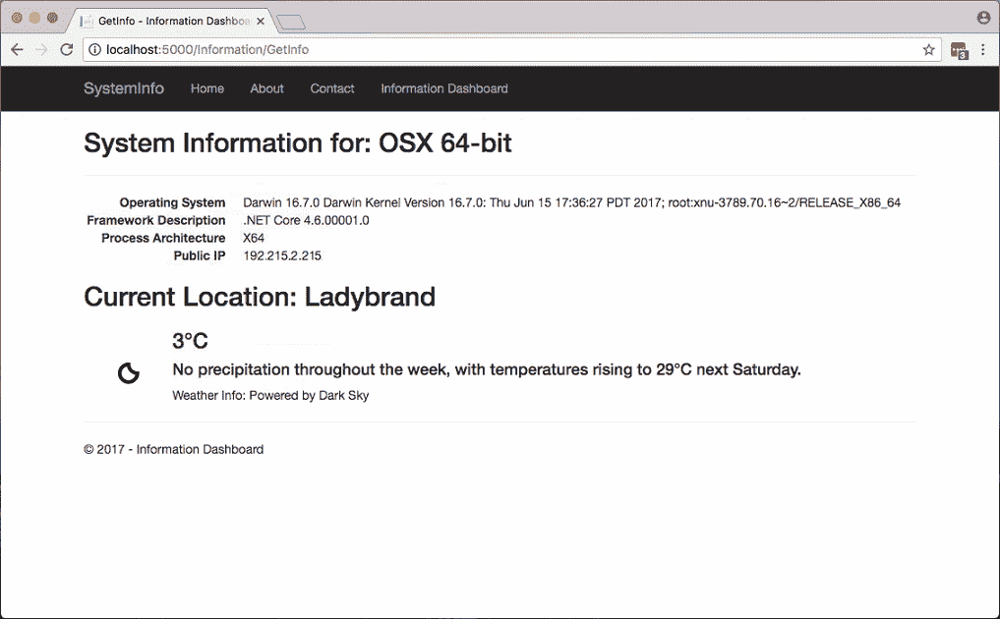

唯一的区别是 Mac 不在 Azure 上，实际上在南非的我的办公室。温度信息已更改为摄氏度，并且显示的机器信息是我的 Mac 的信息。南非这里是一个美好的春天傍晚。

# 在 Linux 上设置应用程序

每个人都在谈论.NET Core 跨平台运行的能力，甚至在 Linux 上也可以。因此，我决定试一试。我知道 Linux 可能不会吸引你们许多人，但能够使用强大的操作系统 Linux 确实有一种明显的满足感。

如果您正在开发.NET Core 应用程序，我建议您为测试目的设置一个 Linux 框。有许多方法可以做到这一点。如果您可以访问 Azure，可以在 Azure 上设置一个 Linux 虚拟机。

您还可以使用虚拟化软件在本地机器上提供一个完全功能的虚拟机。我选择的选项是使用**VirtualBox**，并测试了**Parallels**上的过程。这两种方法都非常简单，但 VirtualBox 是免费使用的，所以这将是一个不错的选择。您可以免费从[`www.virtualbox.org/wiki/Downloads`](https://www.virtualbox.org/wiki/Downloads)下载最新版本的 VirtualBox。

你也可以通过从各种在线网站下载现成的 VirtualBox 镜像来节省设置时间。只要确保它们是值得信赖的网站，比如**OS Boxes**在[`www.osboxes.org/virtualbox-images/`](http://www.osboxes.org/virtualbox-images/)。

无论你选择哪种方式，本章的其余部分将假设你已经设置好了你的 Linux 环境，并且准备好设置你的.NET Core 应用程序。

所以让我们看看如何在 Linux 上安装.NET Core：

1.  从[`www.microsoft.com/net/download/linux`](https://www.microsoft.com/net/download/linux)找到安装.NET Core 2.0 的特定 Linux 版本的说明：

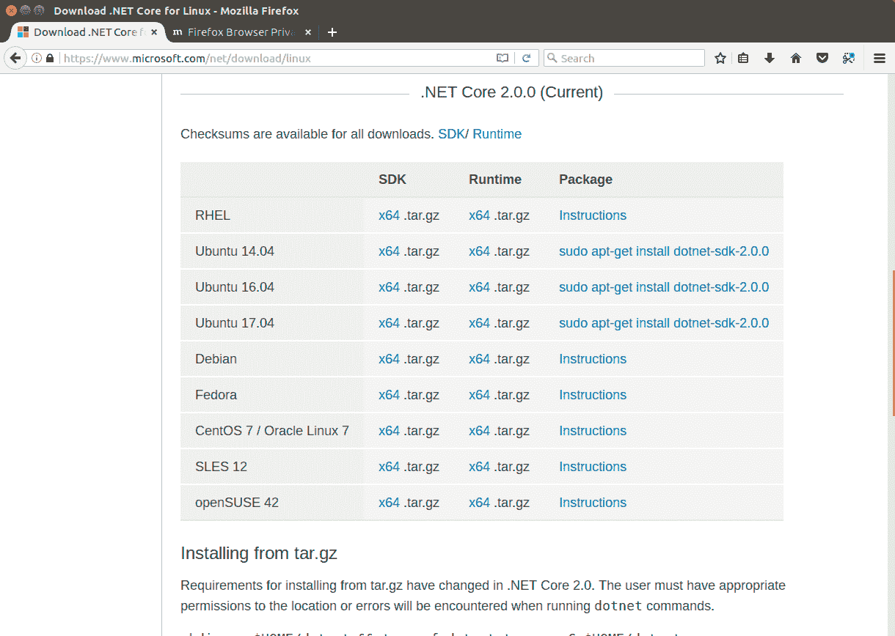

1.  我正在使用**Ubuntu 16.04**，点击`sudo apt-get install dotnet-sdk-2.0.0`链接将带我到安装步骤。

1.  通过输入*Ctrl* + *Alt* + *T*在 Linux Ubuntu（或 Linux Mint）上打开终端窗口。

由于我正在运行全新的 Linux，我需要先安装**cURL**。这个工具允许我在服务器和本地机器之间传输数据。

1.  运行以下命令获取 cURL：

```cs
sudo apt-get install curl
```

1.  终端会要求输入密码。在屏幕上输入密码不会有任何显示，但继续输入并按*Enter*：

当你在 Linux 上工作时，屏幕上不显示你输入的密码是有意设计的。这是一个特性。

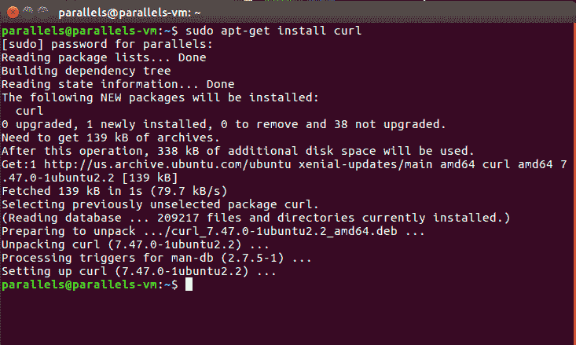

1.  现在，我们需要注册受信任的 Microsoft 签名密钥。输入以下内容：

```cs
curl https://packages.microsoft.com/keys/microsoft.asc | gpg --dearmor > microsoft.gpg
```


1.  当这个完成时，输入以下内容：

```cs
    sudo mv microsoft.gpg /etc/apt/trusted.gpg.d/microsoft.gpg
```

1.  现在，我们需要为 Ubuntu 16.04 注册 Microsoft 产品源。要做到这一点，请输入以下内容：

```cs
sudo sh -c 'echo "deb [arch=amd64] https://packages.microsoft.com/repos/microsoft-ubuntu-xenial-prod xenial main" > /etc/apt/sources.list.d/dotnetdev.list'
```

1.  然后，在那之后，输入以下内容：

```cs
    sudo apt-get update
```

1.  现在，我们可以通过输入以下内容来安装.NET Core 2.0 SDK：

```cs
    sudo apt-get install dotnet-sdk-2.0.0
```

1.  终端问我们是否要继续，我们要。所以，输入`Y`并按*Enter*：


当这个过程完成时，你会看到光标准备好在`~$`旁边输入：


1.  要检查安装了哪个版本的.NET Core，请输入以下命令：

```cs
    dotnet --version  
```

1.  这应该显示 2.0.0。我们现在在我们的 Linux 机器上安装了.NET Core 2.0。作为一个快速开始，创建一个名为`testapp`的新目录，并通过输入以下内容将你的工作目录更改为`testapp`目录：

```cs
    mkdir testapp
    cd testapp  
```

考虑以下的屏幕截图：


1.  我们只是想看看.NET Core 是否在我们的 Linux 机器上工作，所以当你在`testapp`目录中时，输入以下内容：

```cs
    dotnet new razor
```

是的，就是这么简单。这刚刚在 Linux 上为我们创建了一个新的 MVC Web 项目：

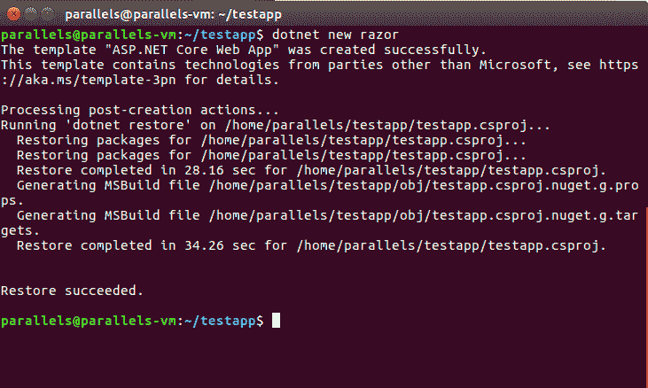

1.  就像我们在 Mac 上做的那样，输入以下命令：

```cs
    dotnet run  
```

看一下以下的屏幕截图：


1.  在终端的输出中，你会注意到本地主机显示了相同的端口号。与 macOS 不同，在 Ubuntu 上我可以在终端窗口中点击`http://localhost:5000`。这将打开我们刚刚创建的应用程序：


现在我们知道.NET Core 2.0 在 Linux 上正常运行了，让我们把项目文件复制到我们的 Linux 机器上：

1.  在桌面上创建一个文件夹；你可以随意命名。将.NET Core 应用程序的项目文件复制到该文件夹中（不要将发布的文件复制到此文件夹中）：

你会记得在 macOS 上，我们只复制了发布的文件。但在 Linux 上是不同的。在这里，你需要复制所有的项目文件。


1.  右键单击文件夹，选择在终端中打开。

现在我们在包含我们解决方案文件的文件夹中，输入以下内容：

```cs
    dotnet restore  
```

这个命令恢复了我们项目的依赖和工具：

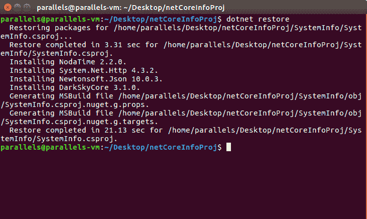

1.  因为我们正在处理解决方案文件，所以我需要向下导航一个文件夹并输入以下内容：

```cs
dotnet run
```

看一下以下的截图：

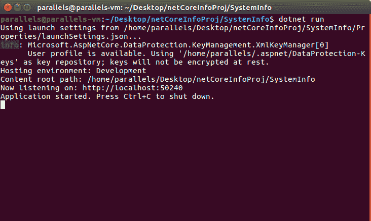

1.  导航到`http://localhost:50240`在终端窗口中显示，将我带到我的应用程序的起始页面：

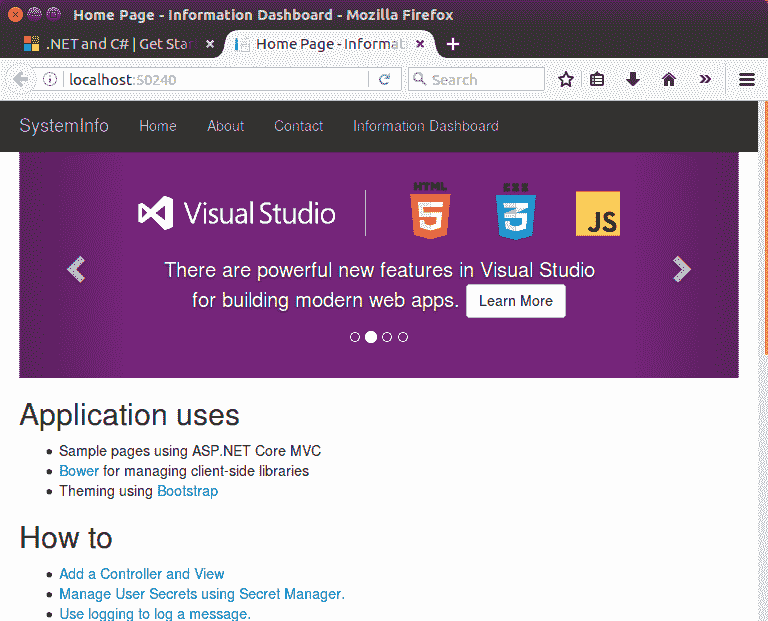

1.  点击信息仪表板菜单项将带我们到我们创建的页面：


这就是全部。我们在 Windows PC 上使用 Visual Studio 2017 Enterprise 创建了一个 ASP.NET Core MVC 应用程序，该应用程序正在 Linux 机器上运行。最好的是，我们没有改变一行代码就让我们的应用程序在不同的平台上运行。

# 总结

回顾本章，我们看了一下在 Windows 上设置 ASP.NET Core 应用程序。我们看了添加视图和控制器，如果你熟悉 ASP.NET MVC，那么你会感到非常亲切。如果不熟悉，ASP.NET MVC 真的很容易。

最后，我们看了一下.NET Core 的强大之处，通过在 Windows、macOS 和 Linux 上运行相同的应用程序。

现在你应该明白.NET Core 的强大之处了。它允许开发人员使用.NET 编写真正的跨平台应用程序。这项技术是一个改变游戏规则的东西，每个开发人员都必须掌握。

接下来，你可能会想知道当我们想要将数据库连接到.NET Core 应用程序时，我们需要做什么。在下一章中，我们将看看如何在 ASP.NET Core MVC 应用程序上使用 MongoDB。

你可能会想为什么我们要使用 MongoDB？嗯，MongoDB 是免费的、开源的和灵活的。再说，我们为什么不想使用 MongoDB 呢？下一章见！
