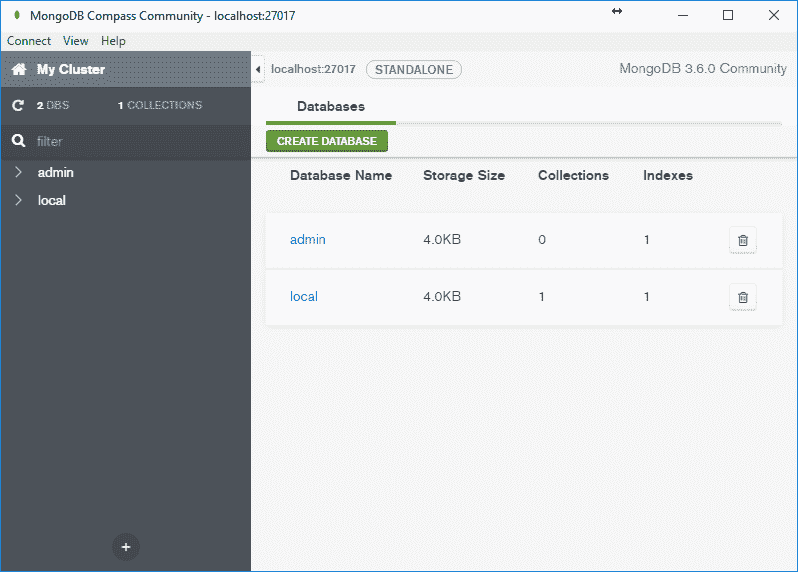
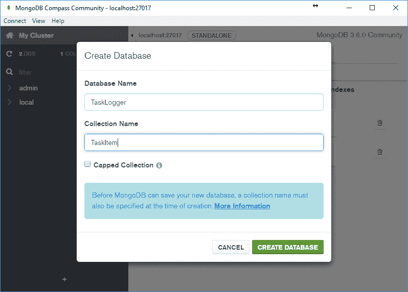
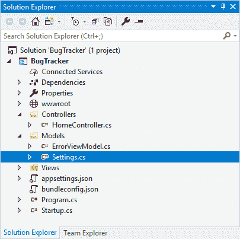
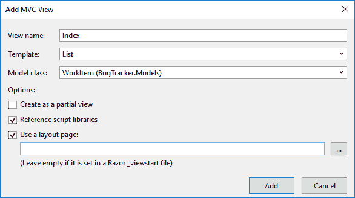
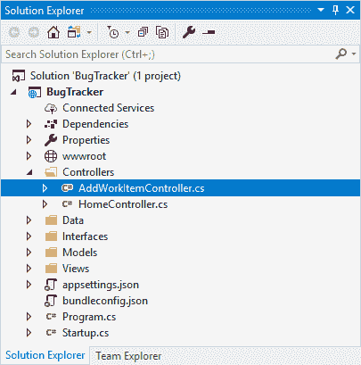
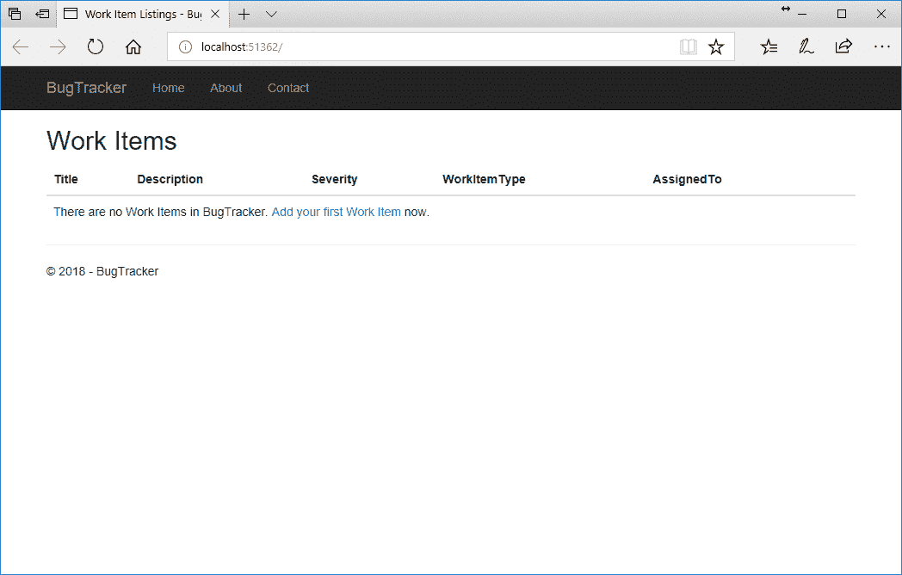

# 第四章：任务错误日志 ASP .NET Core MVC 应用程序

在这一章中，我们将通过创建一个任务/错误日志应用程序来看看如何在 ASP.NET Core MVC 中使用 MongoDB。个人任务管理器很有用，当你无法立即处理错误时，记录错误尤其方便。

在本章中，我们将涵盖以下主题：

+   在本地机器上设置 MongoDB

+   首次使用 MongoDB Compass

+   创建一个 ASP.NET Core MVC 应用程序并集成 MongoDB

你可能会想知道为什么我们会选择 MongoDB。你需要问的问题是，你想要花多少精力来创建一个简单的应用程序？

# 使用 MongoDB 的好处是什么？

为了回答这个问题，让我们来看看使用 MongoDB 的好处。

# 使用 MongoDB 可以加快开发速度

这可能在你的开发过程中变得更清晰，但让我们说一下，我不喜欢开发过程中的一部分是不得不为各种表单和字段创建数据表。你有没有不得不创建一个表来存储地址字段信息？没错，你需要添加类似以下的内容：

+   地址 1

+   地址 2

+   地址 3

+   地址 4

+   城市

+   状态

+   邮编

+   国家

这个表显然可以变得非常庞大。这取决于你需要存储什么。使用 MongoDB，你只需要传递地址数组。MongoDB 会处理剩下的事情。不再需要费力地创建表语句。

# 提升职业技能

越来越多的职业网站将 MongoDB 列为一个受欢迎的技能。它在公司中被更频繁地使用，新开发人员被期望具有一些 MongoDB 的经验。在 LinkedIn 的职位门户上快速搜索 MongoDB 关键词，仅在美国就返回了 7800 个工作。拥有 MongoDB 经验是一个很好的职业助推器，特别是如果你习惯使用 SQL Server。

# MongoDB 在行业中排名很高

为了进一步证明我的观点，MongoDB 在 DB-Engines 网站上排名第五（[`db-engines.com/en/ranking`](https://db-engines.com/en/ranking)），在文档存储类别下排名第一（[`db-engines.com/en/ranking/document+store`](https://db-engines.com/en/ranking/document+store)）。

这些统计数据在撰写时是正确的。事实上，MongoDB 的排名一直在稳步增长。

很明显，MongoDB 会一直存在，更重要的是，社区喜爱 MongoDB。这非常重要，因为它创造了一个健康的开发者社区，分享关于 MongoDB 的知识和文章。MongoDB 的广泛采用推动了技术的发展。

# 在本地机器上设置 MongoDB

前往[`www.mongodb.com/download-center#community`](https://www.mongodb.com/download-center#community)并下载 Windows 的最新版本的 MongoDB Community Server。安装程序然后给你安装 MongoDB Compass 的选项。

你也可以从上述链接或直接导航到[`www.mongodb.com/download-center?jmp=nav#compass`](https://www.mongodb.com/download-center?jmp=nav#compass)下载 Compass 作为单独的安装程序。

[`www.mongodb.com/download-center?jmp=nav#compass`](https://www.mongodb.com/download-center?jmp=nav#compass)。


查看 MongoDB Compass 的网页，[`docs.mongodb.com/compass/master/`](https://docs.mongodb.com/compass/master/)，MongoDB Compass 的描述非常清晰：

"MongoDB Compass 旨在允许用户轻松分析和理解 MongoDB 中数据集合的内容，并执行查询，而无需了解 MongoDB 查询语法。

MongoDB Compass 通过随机抽样数据集合中的一部分文档，为用户提供了 MongoDB 模式的图形视图。抽样文档可以最小化对数据库的性能影响，并可以快速产生结果。"

如果这是你第一次使用 MongoDB，我建议你安装 MongoDB Compass 并试着玩一下。

安装 MongoDB 后，您将在`C:\ProgramFiles\MongoDB`下找到它。我现在想做的是将完整的安装路径保存在一个环境变量中。这样可以更容易地从 PowerShell 或命令提示符中访问。`bin`文件夹的完整安装路径是`C:\Program\FilesMongoDBServer3.6bin`。

为了设置它，我们执行以下步骤：

1.  打开系统属性屏幕，然后单击“环境变量”按钮。

1.  在“系统变量”组下，选择“Path”变量，然后单击“编辑”按钮。将完整的安装路径添加到“Path”系统变量中。

1.  现在，我们需要去创建一个文件夹来存储 MongoDB 数据库。您可以在任何地方创建此文件夹，但无论您在哪里创建它，都需要在下一步中使用它。我在以下路径创建了我的 MongoDB 数据库文件夹：`D:\MongoTask`。

1.  要使用 MongoDB，您必须首先启动 MongoDB 服务器。无论这是在远程机器上还是在本地机器上都无所谓。打开 PowerShell 并运行以下命令：

```cs
     mongod -dbpath D:MongoTask
```

1.  运行上述命令后，按 Enter 键。您现在已经启动了 MongoDB 服务器。接下来，启动 MongoDB Compass。

1.  您会发现您还没有任何数据库。单击“创建数据库”按钮，如下图所示：



1.  打开“创建数据库”窗口，在“数据库名称”下指定数据库名称，在“集合名称”下指定集合名称。

1.  最后，单击屏幕底部的“创建数据库”按钮，如下图所示：



1.  您会看到一个名为`TaskLogger`的新数据库已经创建，如果展开`TaskLogger`数据库节点，您将看到列出的 TaskItem 文档，如下图所示：


在本章中，我们不会过多关注 MongoDB Compass。目前，我想向您展示使用 MongoDB Compass 可以以可视化的方式管理 MongoDB 数据库。您可以继续并删除刚刚创建的 TaskItem 文档。稍后，您将看到，当您第一次向 MongoDB 数据库中插入数据时，应用程序会自动为您创建一个文档。

# 将您的 ASP.NET Core MVC 应用程序连接到 MongoDB

谈到在应用程序中使用 MongoDB 时，人们想知道将这个功能添加到新的 ASP.NET Core MVC 应用程序有多容易。这个过程真的很简单。首先，创建一个新的 ASP.NET Core Web 应用程序，并将其命名为`BugTracker`：

1.  在“新 ASP.NET Core Web 应用程序-BugTracker”屏幕上，确保您已从下拉列表中选择了 ASP.NET Core 2.0。

1.  选择 Web 应用程序（模型-视图-控制器）。

1.  取消选中启用 Docker 支持选项。最后，单击“确定”按钮。

1.  您的新 ASP.NET Core MVC 应用程序将以基本形式创建，如下图所示：


1.  在创建时可以轻松地为应用程序启用 Docker 支持。您还可以为现有应用程序启用 Docker 支持。

我将在后面的章节中介绍 Docker 以及如何使您的应用程序与 Docker 配合使用。目前，我们的应用程序不需要 Docker 支持。将其取消选中，并按照通常的方式创建您的应用程序。

# 添加 NuGet 包

由于本章主要讨论 MongoDB，我们需要将其添加到我们的项目中。最佳方法是通过添加 NuGet 包来实现。我们可以按照以下步骤进行：

1.  右键单击您的项目，然后从上下文菜单中选择“管理 NuGet 包...”，如下图所示：


1.  在 NuGet 屏幕上，您将选择“浏览”选项卡，并输入`Mongodb.Driver`作为搜索词。

1.  选择 MongoDB.Driver by MongoDB 选项。

1.  单击“安装”按钮将最新的稳定包添加到您的项目中。如下面的屏幕截图所示：


1.  您可以在 Visual Studio 的输出窗口中查看进度。

1.  在将 MongoDB 添加到项目后，您将看到 MongoDB.Driver（2.5.0）添加到项目的 NuGet 依赖项下，如下面的屏幕截图所示：


1.  展开`Controllers`文件夹。您会看到，默认情况下，Visual Studio 已经创建了一个`HomeController.cs`文件。该文件中的代码应该类似于以下内容：

```cs
public class HomeController : Controller 
{ 
    public IActionResult Index() 
    { 
        return View(); 
    } 

    public IActionResult About() 
    { 
        ViewData["Message"] = "Your application description   
        page."; 

        return View(); 
    } 

    public IActionResult Contact() 
    { 
        ViewData["Message"] = "Your contact page."; 

        return View(); 
    } 

    public IActionResult Error() 
    { 
        return View(new ErrorViewModel { RequestId = 
         Activity.Current?.Id ?? HttpContext.TraceIdentifier }); 
    } 
} 
```

我们希望能够从这里连接到 MongoDB，因此让我们创建一些代码来连接到 Mongo 客户端。

您需要向您的类添加一个`using`语句，如下所示：

`using MongoDB.Driver;`

连接到 MongoDB 的步骤如下：

1.  通过键入片段短代码`ctor`并按两次制表键，或者通过明确键入代码来创建构造函数。您的构造函数需要创建`MongoClient`的新实例。完成后，您的代码应如下所示：

```cs
public HomeController() 
{ 
    var mclient = new MongoClient(); 
} 
```

1.  为了使`MongoClient`工作，我们需要为其提供一个连接字符串，以连接到我们创建的 MongoDB 实例。在“Bug Tracker”窗格的解决方案中打开`appsettings.json`文件，如下面的屏幕截图所示：


1.  打开您的`appsettings.json`文件，它应该如下所示：

```cs
{ 
  "Logging": { 
    "IncludeScopes": false, 
    "LogLevel": { 
      "Default": "Warning" 
    } 
  } 
} 
```

1.  修改文件并添加 MongoDB 连接详细信息，如下所示：

```cs
{ 
  "MongoConnection": { 
    "ConnectionString": "mongodb://localhost:27017", 
    "Database": "TaskLogger" 
  }, 
  "Logging": { 
    "IncludeScopes": false, 
    "LogLevel": { 
      "Default": "Warning" 
    } 
  } 
}
```

1.  现在我们要在`Models`文件夹中创建一个`Settings.cs`文件，如下面的屏幕截图所示：



1.  打开`Settings.cs`文件并将以下代码添加到其中：

```cs
public class Settings 
{ 
    public string ConnectionString { get; set; } 
    public string Database { get; set; } 
} 
```

1.  现在我们需要打开`Startup.cs`文件并修改`ConfigureServices`方法，如下所示以注册服务：

```cs
public void ConfigureServices(IServiceCollection services) 
{ 
    services.AddMvc(); 

    services.Configure<Settings>(Options => 
    { 
        Options.ConnectionString = Configuration.GetSection
          ("MongoConnection:ConnectionString").Value; 
        Options.Database = Configuration.GetSection
         ("MongoConnection:Database").Value; 
    }); 

} 
```

1.  返回`HomeController.cs`文件并修改构造函数以将连接字符串传递给`MongoClient`：

```cs
public HomeController(IOptions<Settings> settings) 
{             
    var mclient = new 
     MongoClient(settings.Value.ConnectionString);     
} 
```

1.  此时，我想测试我的代码，以确保它实际访问我的 MongoDB 实例。为此，修改您的代码以返回集群描述：

```cs
IMongoDatabase _database; 

public HomeController(IOptions<Settings> settings) 
{             
    var mclient = new 
     MongoClient(settings.Value.ConnectionString);             
      _database = mclient.GetDatabase(settings.Value.Database); 
} 

public IActionResult Index() 
{ 
    return Json(_database.Client.Cluster.Description); 
}
```

1.  运行您的 ASP.NET Core MVC 应用程序，并在浏览器中查看输出的信息，如下面的屏幕截图所示：


这一切都很好，但让我们看看如何将添加数据库连接的逻辑分离到自己的类中。

# 创建 MongoDbRepository 类

要创建`MongoDbRepository`类，我们需要执行以下步骤：

1.  在您的解决方案中创建一个名为`Data`的新文件夹。在该文件夹中，创建一个名为`MongoDBRepository`的新类：


1.  在这个类中，添加以下代码：

```cs
public class MongoDBRepository 
{ 
    public readonly IMongoDatabase Database; 

    public MongoDBRepository(IOptions<Settings> settings) 
    { 
        try 
        { 
            var mclient = new 
             MongoClient(settings.Value.ConnectionString); 
            Database = 
             mclient.GetDatabase(settings.Value.Database); 
        } 
        catch (Exception ex) 
        { 
            throw new Exception("There was a problem connecting 
             to the MongoDB database", ex); 
        } 
    } 
} 
```

如果代码看起来很熟悉，那是因为它与我们在`HomeController.cs`类中编写的相同代码，只是这次有一些错误处理，并且它在自己的类中。这意味着我们还需要修改`HomeController`类。

1.  更改`HomeController`的构造函数中的代码以及`Index`操作。您的代码需要如下所示：

```cs
public MongoDBRepository mongoDb; 

public HomeController(IOptions<Settings> settings) 
{             
    mongoDb =  new MongoDBRepository(settings); 
} 
public IActionResult Index() 
{ 
    return Json(mongoDb.Database.Client.Cluster.Description); 
} 
```

1.  再次运行您的应用程序，您将在浏览器中看到先前显示的相同信息，因此再次输出到浏览器窗口。

唯一的区别是现在代码已经适当分离并且易于重用。因此，如果以后发生任何更改，只需在此处更新即可。

# 读取和写入数据到 MongoDB

在本节中，我们将看一下如何从 MongoDB 数据库中读取工作项列表，以及如何将新的工作项插入到数据库中。我称它们为工作项，因为工作项可以是任务或错误。可以通过执行以下步骤来完成：

1.  在 Models 文件夹中，创建一个名为`WorkItem`的新类，如下面的屏幕截图所示：


1.  将以下代码添加到`WorkItem`类中。您会注意到`Id`的类型是`ObjectId`。这代表了在 MondoDB 文档中创建的唯一标识符。

您需要确保将以下`using`语句添加到您的`WorkItem`类`using MongoDB.Bson;`。

查看以下代码：

```cs
public class WorkItem 
{ 
    public ObjectId Id { get; set; } 
    public string Title { get; set; } 
    public string Description { get; set; } 
    public int Severity { get; set; } 
    public string WorkItemType { get; set; } 
    public string AssignedTo { get; set; } 
}
```

1.  接下来，打开`MongoDBRepository`类并将以下属性添加到类中：

```cs
public IMongoCollection<WorkItem> WorkItems 
{ 
    get 
    { 
        return Database.GetCollection<WorkItem>("workitem"); 
    } 
} 
```

1.  由于我们至少使用 C# 6，我们可以通过将`WorkItem`属性更改为**表达式主体属性**来进一步简化代码。为此，将代码更改为如下所示：

```cs
public IMongoCollection<WorkItem> WorkItems => Database.GetCollection<WorkItem>("workitem"); 
```

1.  如果这看起来有点混乱，请查看以下屏幕截图：


花括号、`get`和`return`语句被`=>`lambda 运算符替换。被返回的对象（在这种情况下是`WorkItem`对象的集合）放在 lambda 运算符之后。这导致了**表达式主体属性**。

# 创建接口和 Work ItemService

接下来，我们需要创建一个接口。为此，我们需要执行以下步骤：

1.  在解决方案中创建一个名为 Interfaces 的新文件夹，并在 Interfaces 文件夹中添加一个名为`IWorkItemService`的接口，如下面的屏幕截图所示：


1.  将以下代码添加到`IWorkItemService`接口中：

```cs
public interface IWorkItemService 
{ 
    IEnumerable<WorkItem> GetAllWorkItems(); 
}
```

1.  在您的`Data`文件夹中，添加另一个名为`WorkItemService`的类，并使其实现`IWorkItemService`接口。

确保添加`using`语句以引用您的接口。在我的示例中，这是`using BugTracker.Interfaces;`语句。

1.  您会注意到 Visual Studio 提示您实现接口。要做到这一点，单击灯泡提示，然后单击上下文菜单中的 Implement interface，如下面的屏幕截图所示：


1.  完成此操作后，您的`WorkItemService`类将如下所示：

```cs
public class WorkItemService : IWorkItemService 
{ 
    public IEnumerable<WorkItem> GetAllWorkItems() 
    { 
        throw new System.NotImplementedException(); 
    } 
}
```

1.  接下来，添加一个构造函数并完成`GetAllWorkItems`方法，使您的类如下所示：

```cs
public class WorkItemService : IWorkItemService 
{ 
    private readonly MongoDBRepository repository; 

    public WorkItemService(IOptions<Settings> settings) 
    { 
        repository = new MongoDBRepository(settings); 
    } 

    public IEnumerable<WorkItem> GetAllWorkItems() 
    { 
        return repository.WorkItems.Find(x => true).ToList(); 
    } 
} 
```

1.  现在，您需要打开`Startup.cs`文件并编辑`ConfigureServices`方法以添加以下代码行：

```cs
services.AddScoped<IWorkItemService, WorkItemService>(); 
```

1.  您的`ConfigureServices`方法现在将如下所示：

```cs
public void ConfigureServices(IServiceCollection services) 
{ 
    services.AddMvc(); 

    services.Configure<Settings>(Options => 
    { 
        Options.ConnectionString = Configuration.GetSection("MongoConnection:ConnectionString").Value; 
        Options.Database = Configuration.GetSection("MongoConnection:Database").Value; 
    }); 

    services.AddScoped<IWorkItemService, WorkItemService>(); 
} 
```

您所做的是将`IWorkItemService`接口注册到依赖注入框架中。有关依赖注入的更多信息，请参阅以下文章：

[`docs.microsoft.com/en-us/aspnet/core/fundamentals/dependency-injection`](https://docs.microsoft.com/en-us/aspnet/core/fundamentals/dependency-injection)。

# 创建视图

当我们启动应用程序时，我们希望看到一个工作项列表。因此，我们需要为`HomeController`创建一个视图，以执行以下步骤显示工作项列表：

1.  在 Views 文件夹中，展开 Home 子文件夹，如果有`Index.cshtml`文件，则删除它。

1.  然后，右键单击 Home 文件夹，导航到上下文菜单中的 Add | View。将显示 Add MVC View 窗口。

1.  将视图命名为`Index`，并选择 List 作为模板。从 Model 类的下拉列表中，选择 WorkItem（BugTracker.Models）。

1.  将其余设置保持不变，然后单击添加按钮：



添加视图后，您的 Solution Explorer 将如下所示：


1.  仔细观察视图，您会注意到它使用`IEnumerable<BugTracker.Models.WorkItem>`作为模型：

```cs
@model IEnumerable<BugTracker.Models.WorkItem> 

@{ 
    ViewData["Title"] = "Work Item Listings"; 
} 
```

这允许我们迭代返回的`WorkItem`对象集合并在列表中输出它们。还请注意，`ViewData["Title"]`已从`Index`更新为`Work Item Listings`。

# 修改 HomeController

在我们运行应用程序之前，我们需要做的最后一件事是修改`HomeController`类以与`IWorkItemService`一起使用：

1.  修改构造函数和`Index`操作如下：

```cs
private readonly IWorkItemService _workItemService; 

public HomeController(IWorkItemService workItemService) 
{ 
    _workItemService = workItemService; 

} 

public IActionResult Index() 
{ 
    var workItems = _workItemService.GetAllWorkItems(); 
    return View(workItems); 
} 
```

1.  我们正在从 MongoDB 数据库中获取所有工作项，并将它们传递给视图以供模型使用。

确保您已经通过`mongod -dbpath <path>`命令格式启动了 MongoDB 服务器，就像本章前面解释的那样。

1.  完成后，运行您的应用程序，如下面的屏幕截图所示：


1.  此时，数据库中没有工作项，所以我们在浏览器中看到了这个空列表。接下来，我们将添加代码将工作项插入到我们的 MongoDB 数据库中。

# 添加工作项

让我们通过以下步骤添加工作项：

1.  要添加工作项，让我们首先在我们的 Models 文件夹中添加一个名为`AddWorkItem`的类，如下面的屏幕截图所示：


1.  修改类中的代码，使其基本上看起来像`WorkItem`类：

```cs
public class AddWorkItem 
{ 
    public string Title { get; set; } 
    public string Description { get; set; } 
    public int Severity { get; set; } 
    public string WorkItemType { get; set; } 
    public string AssignedTo { get; set; } 
}
```

1.  接下来，在 Views 文件夹下创建一个名为`AddWorkItem`的新文件夹。右键单击`AddWorkItem`文件夹，然后选择添加，然后在上下文菜单中单击“View”。

1.  将显示“添加 MVC 视图”窗口。将视图命名为`AddItem`，并选择“模板”中的“创建”。

1.  从 Model 类的下拉菜单中，选择 AddWorkItem（BugTracker.Models）。

1.  将其余设置保持不变，然后点击“添加”按钮，如下面的屏幕截图所示：


1.  打开`AddItem.cshtml`文件，查看表单操作。确保它设置为`CreateWorkItem`。以下代码片段显示了代码应该是什么样子的：

```cs
<div class="row"> 
  <div class="col-md-4"> 
     <form asp-action="CreateWorkItem"> 
         <div asp-validation-summary="ModelOnly" class="text-danger"></div> @*Rest of code omitted for brevity*@ 
```

您的`Views`文件夹现在应如下所示：


1.  现在，我们需要对我们的`IWorkItemService`接口进行一些小修改。修改接口中的代码如下所示：

```cs
public interface IWorkItemService 
{ 
    IEnumerable<WorkItem> GetAllWorkItems(); 
    void InsertWorkItem(WorkItem workItem); 
} 
```

我们刚刚指定实现`IWorkItemService`接口的类必须具有一个名为`InsertWorkItem`的方法，该方法接受`WorkItem`类型的参数。这意味着我们需要转到`WorkItemService`并添加一个名为`InsertWorkItem`的方法。我们的`WorkItemService`接口中的代码将如下所示：

```cs
private readonly MongoDBRepository repository; 

public WorkItemService(IOptions<Settings> settings) 
{ 
    repository = new MongoDBRepository(settings); 
} 

public IEnumerable<WorkItem> GetAllWorkItems() 
{ 
    return repository.WorkItems.Find(x => true).ToList(); 
} 

public void InsertWorkItem(WorkItem workItem) 
{ 
    throw new System.NotImplementedException(); 
} 
```

1.  更改`InsertWorkItem`方法以将`WorkItem`类型的单个对象添加到我们的 MongoDB 数据库中。更改代码如下所示：

```cs
public void InsertWorkItem(WorkItem workItem) 
{ 

} 
```

1.  现在，我们需要稍微修改我们的`WorkItem`类。向类中添加两个构造函数，一个带有`AddWorkItem`对象作为参数，另一个不带任何参数：

```cs
public class WorkItem 
{ 
    public ObjectId Id { get; set; } 
    public string Title { get; set; } 
    public string Description { get; set; } 
    public int Severity { get; set; } 
    public string WorkItemType { get; set; } 
    public string AssignedTo { get; set; } 

    public WorkItem() 
    { 

    } 

    public WorkItem(AddWorkItem addWorkItem) 
    { 
        Title = addWorkItem.Title; 
        Description = addWorkItem.Description; 
        Severity = addWorkItem.Severity; 
        WorkItemType = addWorkItem.WorkItemType; 
        AssignedTo = addWorkItem.AssignedTo; 
    } 
} 
```

我们添加第二个不带参数的构造函数的原因是为了让 MongoDB 反序列化`WorkItem`。

如果您想进一步了解为什么为反序列化添加一个无参数构造函数，请查看以下网址：[`stackoverflow.com/questions/267724/why-xml-serializable-class-need-a-parameterless-constructor`](https://stackoverflow.com/questions/267724/why-xml-serializable-class-need-a-parameterless-constructor)。

1.  现在我们需要向我们的项目添加另一个控制器。右键单击 Controllers 文件夹，然后添加一个名为`AddWorkItemController`的新控制器。随意将其添加为空控制器。我们将在下面自己添加代码：



1.  在 AddWorkItemController 控制器中，添加以下代码：

```cs
private readonly IWorkItemService _workItemService; 

public AddWorkItemController(IWorkItemService workItemService) 
{ 
    _workItemService = workItemService; 
} 

public ActionResult AddItem() 
{ 
    return View(); 
} 

[HttpPost] 
public ActionResult CreateWorkItem(AddWorkItem addWorkItem) 
{ 
    var workItem = new WorkItem(addWorkItem); 
    _workItemService.InsertWorkItem(workItem); 
    return RedirectToAction("Index", "Home"); 
} 
```

您会注意到`HttpPost`操作被称为`CreateWorkItem`。这就是`AddItem.cshtml`文件中的表单操作称为`CreateWorkItem`的原因。它告诉视图在单击创建按钮时要调用控制器上的哪个操作。

# 重定向到工作项列表

另一个有趣的事情要注意的是，在我们调用`WorkItemService`上的`InsertWorkItem`方法之后，我们将视图重定向到`HomeController`上的`Index`操作。正如我们已经知道的，这将带我们到工作项列表：

1.  说到`HomeController`，修改那里的代码以添加另一个名为`AddWorkItem`的操作，该操作调用`AddWorkItemController`类上的`AddItem`操作：

```cs

public ActionResult AddWorkItem() 
{ 
    return RedirectToAction("AddItem", "AddWorkItem"); 
} 
Your HomeController code will now look as follows: 
private readonly IWorkItemService _workItemService; 

public HomeController(IWorkItemService workItemService) 
{ 
    _workItemService = workItemService;             
} 

public IActionResult Index() 
{ 
    var workItems = _workItemService.GetAllWorkItems(); 
    return View(workItems); 
} 

public ActionResult AddWorkItem() 
{ 
    return RedirectToAction("AddItem", "AddWorkItem"); 
} 
```

1.  现在，让我们稍微修改`Index.cshtml`视图。为了使“Index”视图上的列表更直观，修改`Index.cshtml`文件。

1.  添加一个`if`语句，以允许在列表为空时添加新的工作项。

1.  添加一个`ActionLink`，在单击时调用`HomeController`上的`AddWorkItem`操作：

```cs
@if (Model.Count() == 0)
@if (Model.Count() == 0)
{
    <tr>
        <td colspan="6">There are no Work Items in BugTracker. @Html.ActionLink("Add your first Work Item", "AddWorkItem") now.</td>
    </tr>
}
else
{

    @foreach (var item in Model)
    {
        <tr>
            <td>
                @Html.DisplayFor(modelItem => item.Title)
            </td>
            <td>
                @Html.DisplayFor(modelItem => item.Description)
            </td>
            <td>
                @Html.DisplayFor(modelItem => item.Severity)
            </td>
            <td>
                @Html.DisplayFor(modelItem => item.WorkItemType)
            </td>
            <td>
                @Html.DisplayFor(modelItem => item.AssignedTo)
            </td>
            <td>
            @Html.ActionLink("Edit", "Edit", new { /* 
             id=item.PrimaryKey */ }) |
            @Html.ActionLink("Details", "Details", new { /* 
             id=item.PrimaryKey */ }) |
            @Html.ActionLink("Delete", "Delete", new { /* 
             id=item.PrimaryKey */ })
            </td>
        </tr>
   }
}

```

1.  现在，将“Create New `asp-action`”包装在以下`if`语句中：

```cs
@if (Model.Count() > 0) 
{ 
<p> 
    <a asp-action="Create">Create New</a> 
</p> 
} 
```

我们稍后会看到这个。

在这一点上，我们将看到应用程序的逻辑，`HomeController``Index`操作列出了工作项。当我们单击“添加您的第一个工作项”链接时，我们调用了`HomeController`上的`AddWorkItem`操作。

`HomeController`上的`AddWorkItem`操作反过来调用`AddWorkItemController`上的`AddItem`操作。这只是返回`AddItem`视图，我们在其中输入工作项详细信息，然后单击“创建”按钮。

“创建”按钮反过来执行`HttpPost`，因为`AddItem`视图上的表单操作指向`AddWorkItemController`类上的`CreateWorkItem`操作，我们将工作项插入到我们的 MongoDB 数据库中，并通过执行`RedirectToAction`调用到`HomeController`上的`Index`操作重定向到工作项列表。

现在，在这一点上，如果您认为这是一个冗长的方式，将重定向回`HomeController`，然后重定向到`AddWorkItemController`上的`AddItem`操作，那么您是 100%正确的。我将向您展示一种快速的方法，当用户单击链接创建新工作项时，直接重定向到`AddWorkItemController`上的`AddItem`操作。现在，只需跟着我。我试图向您展示如何与控制器和操作进行交互。

现在，再次运行您的应用程序。



您将看到列表中的一个链接允许您添加您的第一个工作项。

这是将重定向回`HomeController`上的`AddWorkItem`操作的链接。要运行它，请执行以下操作：

1.  单击链接，您将看到输出，如下截图所示：


1.  这将带您到添加新工作项的视图。在字段中输入一些信息，然后单击“创建”按钮。


1.  “创建”按钮调用`AddWorkItemController`上的`CreateWorkItem`操作，并在`HomeController`的`Index`操作上重定向回工作项列表。


1.  您可以看到“创建新”链接现在显示在列表顶部。让我们修改“Index.cshtml”视图，使该链接直接重定向到`AddWorkItemController`类上的`AddItem`操作。更改 Razor 如下：

```cs
@if (Model.Count() > 0) 
{ 
<p> 
    @Html.ActionLink("Create New", "AddWorkItem/AddItem") 
</p> 
} 
```

您可以看到我们可以指定应用程序必须采取的路由以到达正确的操作。在这种情况下，我们说当单击“创建新”链接时，我们必须调用`AddWorkItemController`类上的`AddItem`操作。

再次运行您的应用程序，然后单击“创建新链接”。您会看到被重定向到我们之前添加工作项的输入表单。

视图的默认样式看起来不错，但肯定不是最美丽的设计。至少，这使您作为开发人员有能力返回并使用 CSS 样式屏幕，根据您的需求“美化”它们。目前，这些沉闷的屏幕完全功能，并且足够满足我们的需求。

打开 MongoDB Compass，您会看到那里有一个工作项文档。查看该文档，您将看到我们刚刚从 ASP.NET Core MVC 应用程序中添加的信息。


# 总结

在本章中，我们看了一下：

+   在本地机器上设置 MongoDB

+   使用 MongoDB Compass

+   创建连接到 MongoDB 的 ASP.NET Core MVC 应用程序

我们看到 MongoDB Compass 为开发人员提供了 MongoDB 数据的良好图形视图。因此，开发人员不需要了解任何 MongoDB 查询语法。但是，如果你想查看查询语法，请访问`https://docs.mongodb.com/manual/tutorial/query-documents/`。

在涉及 MongoDB 和 ASP.NET Core MVC 时，仍然有很多东西可以学习。单独一章几乎不足以涵盖所有内容。但可以肯定的是，MongoDB 非常强大，同时在应用程序中使用起来非常简单。MongoDB 有很好的文档，并且有一个蓬勃发展的社区可以在你的学习过程中提供帮助和指导。

在下一章中，我们将看一下 SignalR 以及如何创建实时聊天应用程序。
