# 第五章：ASP.NET SignalR 聊天应用程序

想象一下，您有能力让服务器端代码实时推送数据到您的网页，而无需用户刷新页面。他们说，有很多种方法可以解决问题，但 ASP.NET SignalR 库为开发人员提供了一种简化的方法，可以向应用程序添加实时网络功能。

为了展示 SignalR 的功能，我们将构建一个简单的 ASP.NET Core SignalR 聊天应用程序。这将包括使用 NuGet 和**Node Package Manager**（**npm**）将所需的包文件添加到项目中。

在这一章中，我们将研究以下内容：

+   整体项目布局

+   设置项目

+   添加 SignalR 库

+   构建服务器

+   创建客户端

+   解决方案概述

+   运行应用程序

让我们开始吧。

# 项目布局

对于这个项目，我们需要以下元素：

+   **聊天服务器**：这将是我们的服务器端 C#代码，用于处理和指导从客户端发送的消息

+   **聊天客户端**：客户端将包括用于向服务器发送消息和接收消息的 JavaScript 函数，以及用于显示的 HTML 元素

我们将从服务器端代码开始，然后转移到客户端，构建一个简单的引导布局，并从那里调用一些 JavaScript 函数。

作为奖励，我们将包括一种方法来将我们的对话历史存档到文本文件中。

# 设置项目

让我们设置这个项目：

1.  使用 Visual Studio 2017，我们将创建一个 ASP.NET Core Web 应用程序。您可以随意命名应用程序，但我将其命名为`Chapter5`：

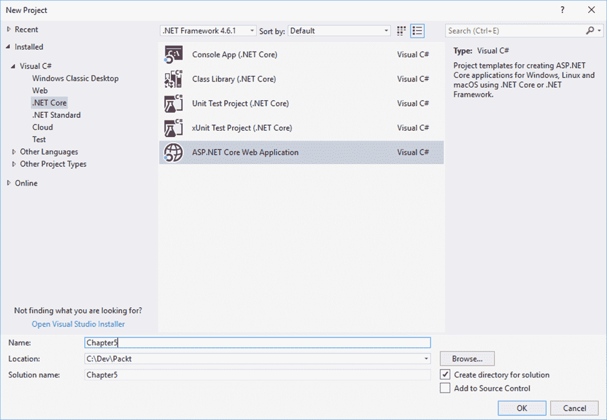

1.  我们将使用一个空项目模板。确保从下拉菜单中选择 ASP.NET Core 2.0：


项目将被创建，并将如下所示：

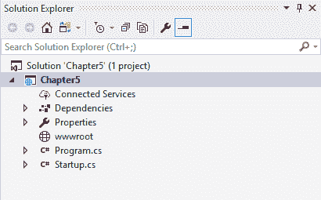

# 添加 SignalR 库

接下来，我们需要将 SignalR 包文件添加到我们的项目中。

在撰写本文时，通过 NuGet 包管理器浏览时找不到 ASP.NET Core SignalR 的包，因此我们将使用包管理器控制台添加所需的包。

1.  转到工具 | NuGet 包管理器 | 包管理器控制台：

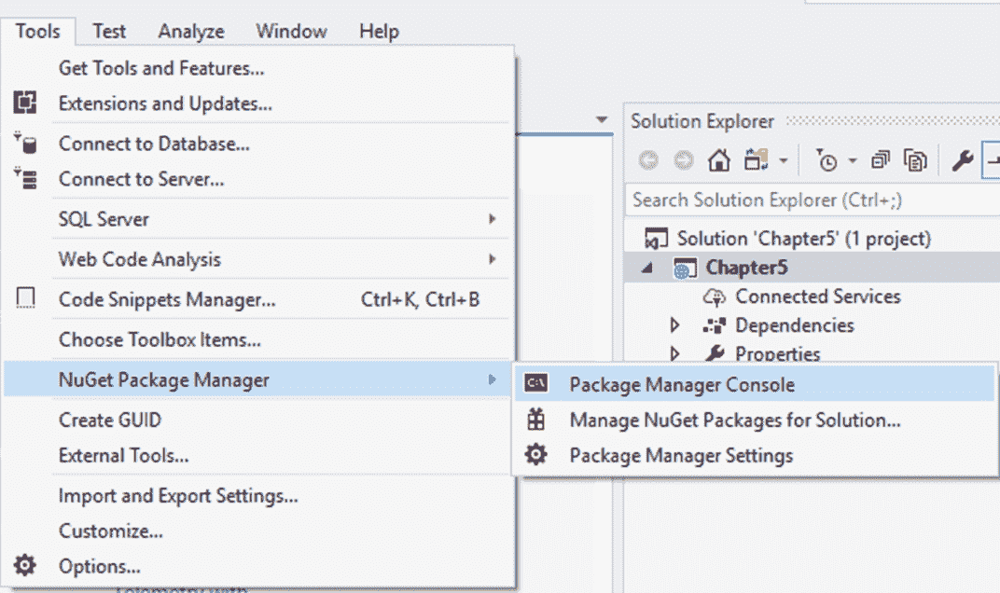

1.  在控制台窗口中输入以下命令并按回车键：

```cs
Install-Package Microsoft.AspnetCore.SignalR -Version 1.0.0-alpha2-final
```

您应该看到一些响应行，显示成功安装的项目。

我们还需要 SignalR 客户端 JavaScript 库。为此，我们将使用一个`npm`命令。

npm 是一个包管理器，类似于 NuGet，但用于 JavaScript。欢迎访问[`www.npmjs.com`](https://www.npmjs.com)查看。

1.  在控制台窗口中输入以下命令并按*回车*键：

```cs
npm install @aspnet/signalr-client
```

这将下载一堆 js 文件到项目根目录下的`node_modules`文件夹中。输出可能会显示一些警告，但不用担心。如果`node_modules`目录存在，您可以确认下载成功。

有了我们的包，我们可以（终于）开始编写一些代码了。

# 构建服务器

我们需要为我们的聊天程序构建一个服务器，其中包含我们想要从连接的客户端调用的方法。我们将使用 SignalR Hubs API，该 API 提供了连接的客户端与我们的聊天服务器通信所需的方法。

# SignalR Hub 子类

现在我们需要创建 SignalR Hub。为此，请执行以下步骤：

1.  在项目中添加一个类来处理聊天的服务器端。我们将其称为`Chat`：

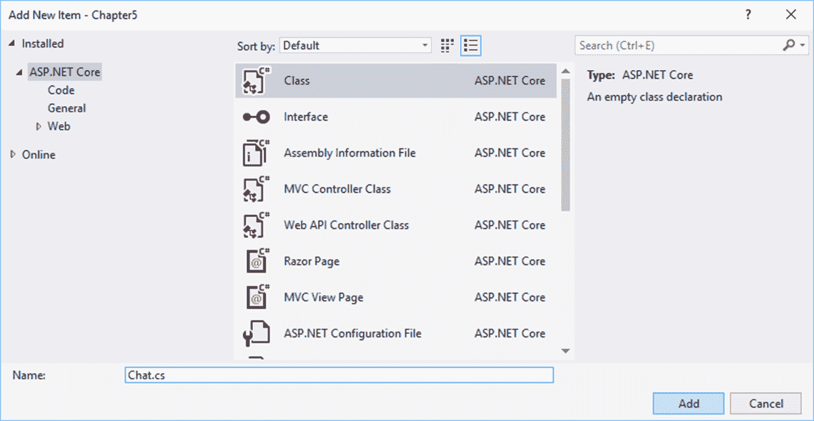

这将需要是 SignalR `Hub`类的子类。确保添加`Micosoft.AspNetCore.SignalR`的使用指令。Visual Studio 的*快速操作*对此效果很好：

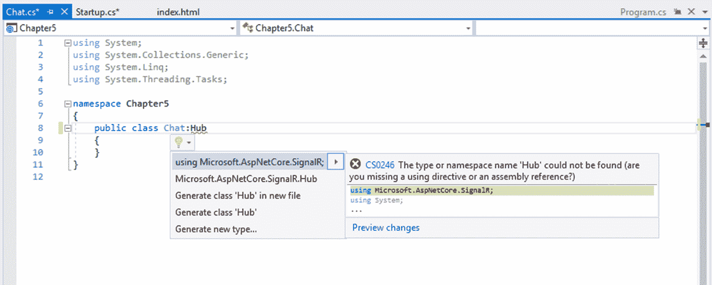

1.  现在向类添加一个`Task`方法来处理消息的发送：

```cs
        public Task Send(string sender, string message) 
        { 
            return Clients.All.InvokeAsync("UpdateChat", sender, 
            message); 
        } 
```

这个方法将通过任何连接的客户端调用，并调用所有连接的客户端的`Send`函数，传递发送者和消息参数。

1.  现在添加一个`Task`方法来处理存档功能：

```cs
        public Task ArchiveChat(string archivedBy, string path, 
         string messages) 
        { 
            string fileName = "ChatArchive" + 
             DateTime.Now.ToString("yyyy_MM_dd_HH_mm") + ".txt"; 
            System.IO.File.WriteAllText(path + "\" + fileName, 
             messages); 
            return Clients.All.InvokeAsync("Archived", "Chat 
             archived by "+ archivedBy); 
        } 
```

正如您所看到的，这个方法只是简单地获取消息字符串参数的值，将其写入一个名为`ChatArchive_[date].txt`的新文本文件中，保存到给定路径，并调用客户端的`Archived`函数。

为了使这两个任务真正起作用，我们需要做一些更多的脚手架工作。

# 配置更改

在`Startup.cs`文件中，我们需要将 SignalR 服务添加到容器中，并配置 HTTP 请求管道。

1.  在`ConfigureServices`方法中，添加以下代码：

```cs
services.AddSignalR();
```

1.  在`Configure`方法中，添加以下代码：

```cs
app.UseSignalR(routes => 
      { 
          routes.MapHub<Chat>("chat"); 
      });
```

您的代码窗口现在如下所示：

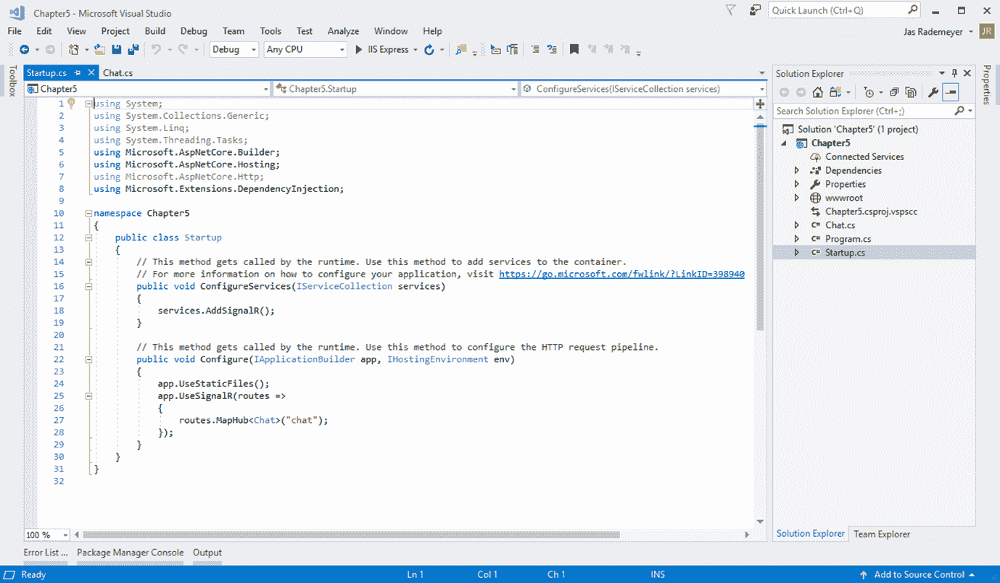

这就是我们的服务器完成了。

您会注意到我已经在`Configure`方法中添加了以下代码行，`app.UseStaticFiles()`。静态文件是 ASP.NET Core 应用程序直接提供给客户端的资产。静态文件的示例包括 HTML、CSS、JavaScript 和图像。

我们可以（也将）稍后扩展我们服务器的功能，但是现在，让我们前往我们的客户端。

# 创建客户端

如我们的项目布局中所述，客户端将包括用于向服务器发送消息和接收消息的 JavaScript 函数，以及用于显示的 HTML 元素。

1.  在您的项目中，在`wwwroot`下添加一个新的文件夹，名为`scripts`：


还记得之前由我们的`npm`命令创建的`node_modules`目录吗？

1.  转到`node_modules`目录中的以下路径：

`\@aspnet\signalr-client\dist\browser`

查看以下截图：


1.  将`signalr-client-1.0.0-alpha2-final.min.js`文件复制到我们项目中刚创建的`scripts`文件夹中。我们将在我们的 HTML 文件中引用这个库，现在我们将创建这个文件。

1.  在`wwwroot`文件夹中添加一个 HTML 页面。我把我的命名为`index.html`。我建议您也这样命名。稍后我会解释：


我们将保持客户端页面非常简单。我使用`div`标签作为面板，在页面上显示和隐藏不同的部分。我还使用 bootstrap 使其看起来漂亮，但您可以按自己的喜好设计它。我也不会让您对基础知识感到厌烦，比如在哪里指定页面标题。我们将坚持相关的元素。

让我展示整个 HTML 布局代码以及 JavaScript，然后我们将从那里开始分解：

```cs
<!DOCTYPE html> 
<html> 
<head> 
    <title>Chapter 5- Signal R</title> 
    <link rel="stylesheet" href="https://maxcdn.bootstrapcdn.com/bootstrap/3.3.7/css/bootstrap.min.css"> 
    <script src="img/jquery.min.js"></script> 
    <script src="img/bootstrap.min.js"></script> 
    <script src="img/signalr-client-1.0.0-alpha2-final.min.js"></script> 

    <script type="text/javascript"> 
        let connection = new signalR.HubConnection('/chat'); 
        connection.start(); 

        connection.on('UpdateChat', (user, message) => { 
            updateChat(user, message); 
        }); 
        connection.on('Archived', (message) => { 
            updateChat('system', message); 
        }); 

        function enterChat() { 
            $('#user').text($('#username').val()); 
            sendWelcomeMessage($('#username').val()); 
            $('#namePanel').hide(); 
            $('#chatPanel').show(); 
        }; 

        function sendMessage() { 
            let message = $('#message').val(); 
            let user = $('#user').text(); 
            $('#message').val(''); 
            connection.invoke('Send', user, message); 
        }; 

        function sendWelcomeMessage(user) { 
            connection.invoke('Send','system',user+' joined the 
            chat'); 
        }; 

        function updateChat(user, message) { 
            let chat = '<b>' + user + ':</b> ' + message + 
            '<br/>' 
            $('#chat').append(chat); 
            if ($('#chat')["0"].innerText.length > 0) { 
                $('#historyPanel').show(); 
                $('#archivePanel').show(); 
            } 
        }; 

        function archiveChat() { 
            let message = $('#chat')["0"].innerText; 
            let archivePath = $('#archivePath').val(); 
            let archivedBy = $('#username').val(); 
            connection.invoke('ArchiveChat', archivedBy, 
             archivePath, message); 
        }; 
    </script> 

</head> 
<body> 
    <div class="container col-md-10"> 
        <h1>Welcome to Signal R <label id="user"></label></h1> 
    </div> 
    <hr /> 
    <div id="namePanel" class="container"> 
        <div class="row"> 
            <div class="col-md-2"> 
                <label for="username" class="form-
                  label">Username:</label> 
            </div> 
            <div class="col-md-4"> 
                <input id="username" type="text" class="form-
                 control" /> 
            </div> 
            <div class="col-md-6"> 
                <button class="btn btn-default" 
                  onclick="enterChat()">Enter</button> 
            </div> 
        </div> 
    </div> 
    <div id="chatPanel" class="container" style="display: none"> 
        <div class="row"> 
            <div class="col-md-2"> 
                <label for="message" class="form-label">Message: 
                </label> 
            </div> 
            <div class="col-md-4"> 
                <input id="message" type="text" class="form-
                 control" /> 
            </div> 
            <div class="col-md-6"> 
                <button class="btn btn-info" 
                 onclick="sendMessage()">Send</button> 
            </div> 
        </div> 
        <div id="historyPanel" style="display:none;"> 
            <h3>Chat History</h3> 
            <div class="row"> 
                <div class="col-md-12"> 
                    <div id="chat" class="well well-lg"></div> 
                </div> 
            </div> 
        </div> 
    </div> 
    <div id="archivePanel" class="container" style="display:none;"> 
        <div class="row"> 
            <div class="col-md-2"> 
                <label for="archivePath" class="form-
                 label">Archive Path:</label> 
            </div> 
            <div class="col-md-4"> 
                <input id="archivePath" type="text" class="form-
                 control" /> 
            </div> 
            <div class="col-md-6"> 
                <button class="btn btn-success" 
                 onclick="archiveChat()">Archive Chat</button> 
            </div> 
        </div> 
    </div> 
</body></html> 
```

# 包括的库

添加`link`和`script`标签以包含所需的库：

```cs
<link rel="stylesheet" href="https://maxcdn.bootstrapcdn.com/bootstrap/3.3.7/css/
bootstrap.min.css">
<script src="img/jquery.min.js">
</script>
<script src="img/bootstrap.min.js">
</script>
<script src="img/signalr-client-1.0.0-alpha2-final.min.js"> </script>
```

如果您不想使用 bootstrap 来进行外观和感觉，您就不需要 bootstrap JavaScript 库或 CSS，但请注意我们将在我们的脚本中使用 jQuery，所以请留下它。

# 命名部分

我们需要知道谁是我们的聊天室参与者。添加一个输入元素来捕获用户名，以及一个按钮来调用`enterChat`函数：

+   `<input id="username" type="text" class="form-control" />`

+   `<button class="btn btn-default" onclick="enterChat()">Enter</button>`

# 聊天输入

添加所需的元素，使我们的用户能够输入消息（输入）并将其发送到服务器（`sendMessage`的事件按钮）：

+   `<input id="message" type="text" class="form-control" />`

+   `<button class="btn btn-info" onclick="sendMessage()">Send</button>`

# 对话面板

添加一个带有 ID`"chat"`的`div`标签。我们将使用这个作为我们对话的容器（聊天历史）：

+   `<div id="chat" class="well well-lg"></div>`

# 存档功能

添加所需的元素，使我们的用户能够指定存档文件需要保存的路径（输入），并将消息发送到服务器（`archiveChat`的事件按钮）：

+   `<input id="archivePath" type="text" class="form-control" />`

+   `<button class="btn btn-info" onclick="archiveChat()">Archive Chat</button>`

# JavaScript 函数

我们的客户端需要一些代码来向服务器发送和接收消息。我尽量保持 JavaScript 尽可能简单，选择了 jQuery 代码以提高可读性：

1.  为我们的 SignalR Hub 服务器创建一个变量（我命名为`connection`）并调用其 start 函数：

```cs
let connection = new signalR.HubConnection('/chat');
connection.start();
```

`'/chat'`参数用于`signalR.HubConnection`，指的是我们的`Chat.cs`类，它继承了 SignalR 的 Hub 接口。

1.  添加`UpdateChat`和`Archived`方法，这些方法将由服务器调用：

```cs
connection.on('UpdateChat', (user, message) => {
updateChat(user, message);
});
connection.on('Archived', (message) => {
updateChat('system', message);
});
```

我们只是将从服务器获取的参数传递给我们的`updateChat`方法。我们稍后会定义这个方法。

1.  定义`enterChat`函数：

```cs
function enterChat() {
$('#user').text($('#username').val());
sendWelcomeMessage($('#username').val());
$('#namePanel').hide();
$('#chatPanel').show();
};
```

我们从用户名输入元素的值中设置`user`标签的文本，将其传递给我们的`sendWelcomeMessage`方法（我们稍后会定义），并切换相关面板的显示。

1.  定义`sendMessage`方法：

```cs
function sendMessage() {
let message = $('#message').val();
$('#message').val('');
let user = $('#user').text();
connection.invoke('Send', user, message);
};
```

我们从消息输入元素中设置`message`变量，然后清除它以便下一条消息使用，并从用户标签中设置`user`变量。然后我们使用`connection.invoke`方法调用服务器上的`Send`方法，并将我们的变量作为参数传递。

1.  定义`sendWelcomeMessage`函数：

```cs
function sendWelcomeMessage(user) {
connection.invoke('Send','system',user+' joined the chat');
};
```

就像步骤 4 中描述的`sendMessage`函数一样，我们将使用`connection.invoke`函数调用服务器上的`Send`方法。不过这次我们将字符串`'system'`作为用户参数传递，以及有关刚刚加入的用户的一些信息性消息。

1.  定义`updateChat`方法：

```cs
function updateChat(user, message) {
let chat = '<b>' + user + ':</b> ' + message + '<br/>'
$('#chat').append(chat);
if ($('#chat')["0"].innerText.length > 0) {
$('#historyPanel').show();
$('#archivePanel').show();
}
};
```

`updateChat`只是我们用来更新聊天历史面板的自定义函数。我们本可以在两个`connection.on`函数中内联执行这个操作，但这样就意味着我们会重复自己。在任何编码中，通常的规则是尽量避免重复代码。

在这个函数中，我们将`chat`变量设置为我们希望每条聊天历史记录的样式。在这种情况下，我们只是将我们的用户（带有冒号）加粗显示，然后消息不加样式，最后换行。几行聊天看起来会像这样：

+   **John**: 大家好

+   **Sarah**: 你好 John

+   **server**: Peter 加入了聊天

+   **John**: 你好 Sarah，你好 Peter

+   **Peter**: 大家好

我还检查了聊天 div 的`innerText`属性，以确定聊天历史和存档面板是否可见。

定义`archiveChat`函数：

```cs
function archiveChat() {
let message = $('#chat')["0"].innerText;
let archivePath = $('#archivePath').val();
connection.invoke('ArchiveChat', archivePath, message);
};
```

和其他一切一样，我尽量保持简单。我们获取聊天面板（div）的`innerText`和`archivePath`输入中指定的路径，然后将它们传递给服务器的`ArchiveChat`方法。

当然，这里我们有一个小错误的窗口：如果用户没有输入有效的文件保存路径，代码将抛出异常。我会留给你自己的创造力来解决这个问题。我只是在这里为了 SignalR 功能。

# 解决方案概述

现在你应该有一个完整的、可构建的解决方案。让我们快速查看一下解决方案资源管理器中的解决方案：

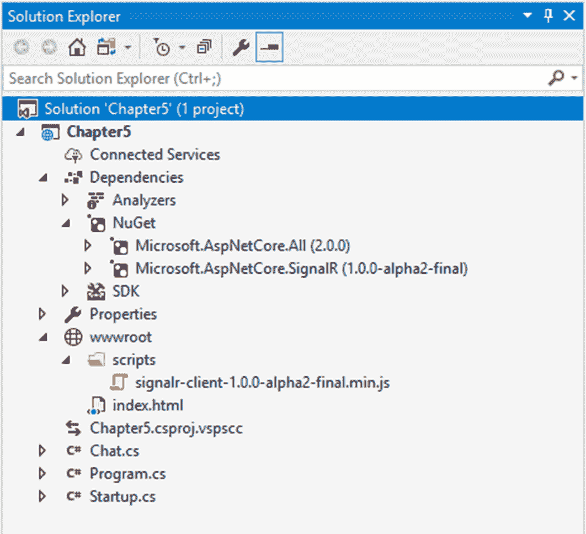

从头开始，让我列出我们对`Chapter5`项目所做的更改：

1.  以下是我们通过 NuGet 添加的 SignalR Asp.NET Core 库：

`Dependencies/NuGet/Microsoft.AspNetCore.SignalR (1.0.0-alpha2-final)`

1.  我们手动从`node_modules`文件夹中复制了这个 JavaScript 库，之后使用`npm`下载了它：

`wwwroot/scripts/signalr-client-1.0.0-alpha2-final.min.js`

1.  我们的客户端页面包含了 HTML 标记、样式和 JavaScript：`one.wwwroot/index.html`

如果你要将这个应用程序作为基础并进行扩展，我建议将 JavaScript 代码移到一个单独的`.js`文件中。这样更容易管理，也是另一个良好的编码标准。

1.  `Chat.cs`：这是我们的聊天服务器代码，或者说是我们声明的任何自定义任务方法

1.  `Startup.cs`：这个文件在 Asp.NET Code web 应用程序中是标准的，但我们改变了配置以确保 SignalR 被添加为服务

1.  让我们构建我们的项目。在 Visual Studio 的顶部菜单中，单击“构建”菜单按钮：


您可以选择构建整个解决方案，也可以选择单独的项目。鉴于我们的解决方案中只有一个项目，我们可以选择任何一个。您还可以使用键盘快捷键*Ctrl* + *Shift* + *B*。

您应该在输出窗口中看到一些（希望成功的）构建消息：


如果您遇到任何错误，请再次查看本章，看看您是否漏掉了什么。一个小刺可以引起很多不适。

# 展示和告知

是时候了。您已经创建了项目，添加了库，并编写了代码。现在让我们看看这个东西的表现。

# 运行应用程序

要运行应用程序，请按*F5*（或*Ctrl* + *F5*以无调试模式启动）。应用程序将在默认浏览器中打开，您应该看到这个：

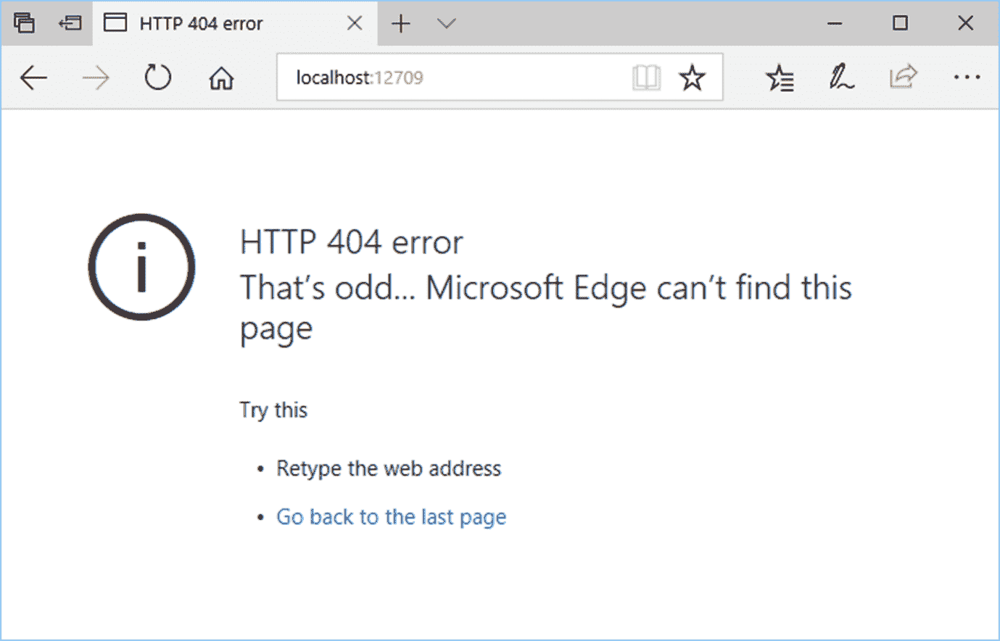

等等。什么？我们一定是漏掉了什么。

现在我们只需通过将我们的 URL 更改为`localhost:12709/index.html`（只需检查您的端口号），我们就可以导航到 index.html 页面了。

相反，让我们将我们的`index.html`页面指定为默认启动页面。

在`Startup.cs`类的`Configure`方法中，在顶部添加这一行：

`app.UseDefaultFiles();`

有了这个小宝石，对`wwwroot`文件夹的任何请求（随时导航到您的网站）都将搜索以下之一：

+   `default.htm`

+   `default.html`

+   `index.htm`

+   `index.html`

找到的第一个文件将作为您的默认页面提供。太棒了！

现在让我们再次运行我们的应用程序：


即使我们的 URL 仍然不显示`/index.html`部分，我们的 Web 应用程序现在知道要提供哪个页面。现在我们可以开始聊天了。输入用户名并按*Enter*： 

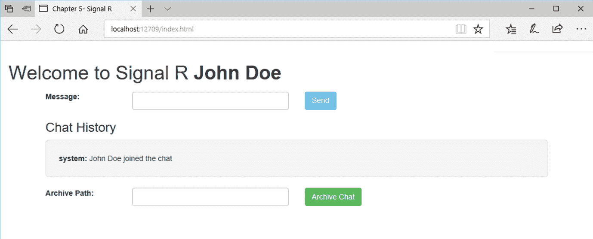

如您所见，我们的名称面板现在被隐藏，我们的聊天和存档面板正在显示。

我们的服务器还友好地通知我们加入了聊天，感谢我们的`sendWelcomeMessage(user)`函数。

每次我们发送消息，我们的聊天历史都会更新：

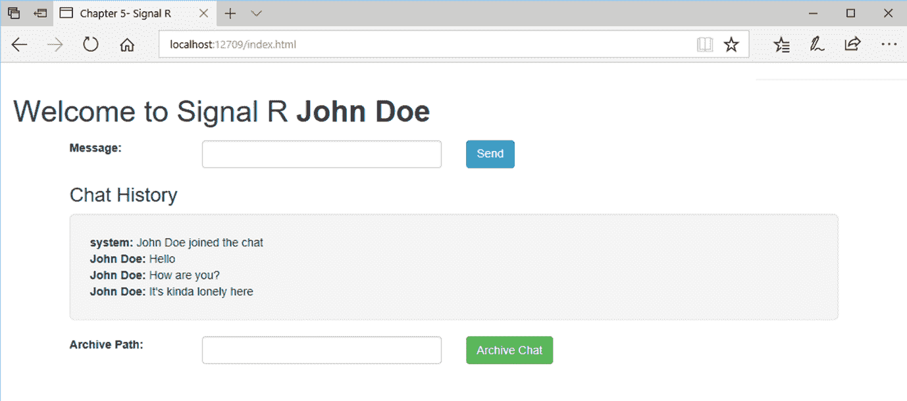

# 开始派对

只有多方参与，对话才是对话。所以让我们开始一个派对。

如果您在网络上发布应用程序，可以使用实际的网络客户端进行聊天，但我不在网络上（不是那个意思），所以我们使用另一个技巧。我们可以使用各种浏览器来代表我们不同的派对客人（网络客户端）。

复制您的应用程序 URL（再次检查端口号）并粘贴到其他几个浏览器中。


对于每个新客人（浏览器），您需要指定一个用户名。为了更容易跟踪，我将称我的其他客人为不同的浏览器名称。

当他们每个人进入聊天并开始发送消息时，您将看到我们的聊天历史增长：

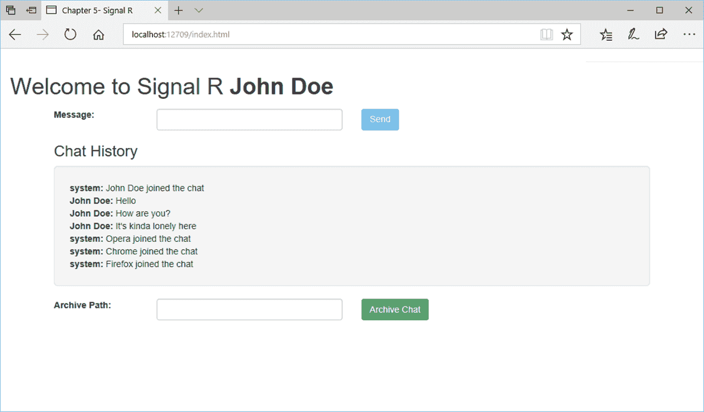

您可以将浏览器平铺（或将它们移动到其他显示器，如果您有额外的显示器）以查看由一个人发送的消息立即传递给所有人的数量，这正是 SignalR 的全部意义所在。

我们从 Microsoft Edge 中的 John Doe 开始，所以我们将在那里继续：

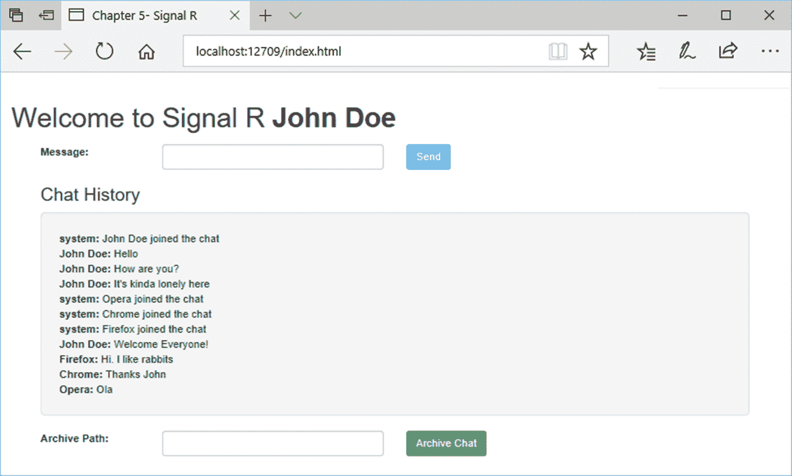

Opera 是第一个加入派对的：

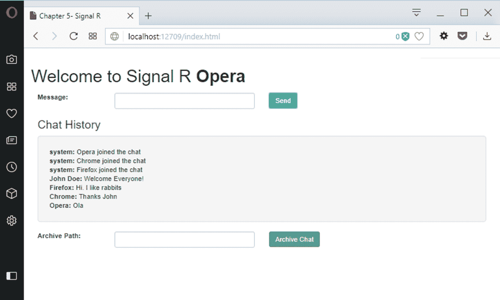

然后 Chrome 到达：

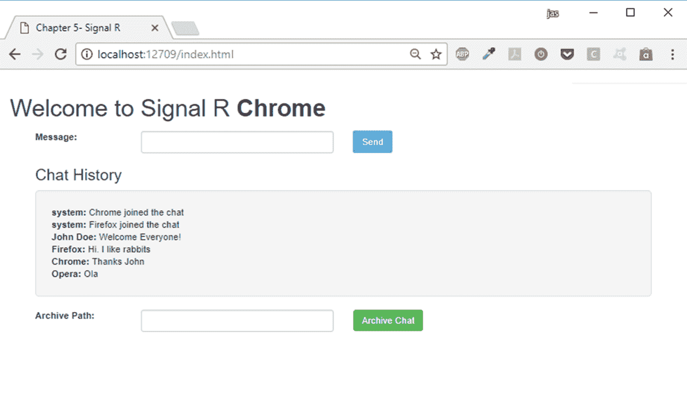

最后，Firefox 也加入了：

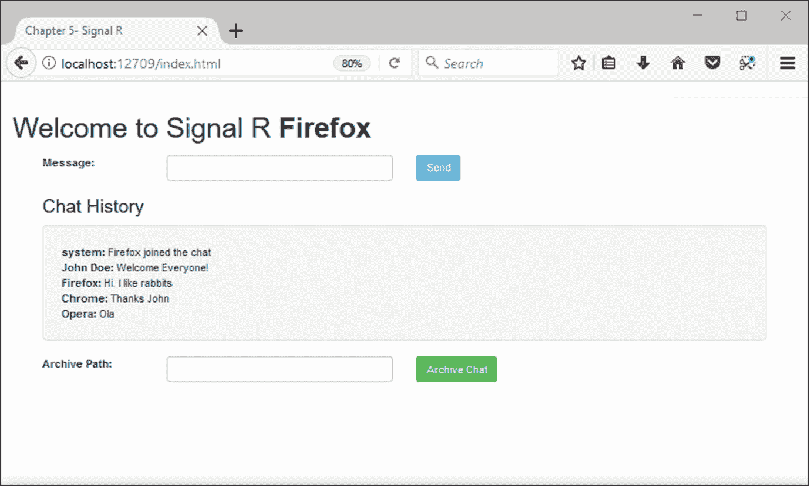

您还会注意到每个客人的聊天历史只有在他们加入聊天时才开始。这是有意设计的。我们不会在客户端加入时发送历史聊天记录。

# 存档聊天

要将聊天记录保存到文本文件中，请在`archivePath`输入元素中输入有效的本地文件夹路径，然后点击“存档聊天”按钮：


如前所述，我们尚未为我们的路径构建适当的验证，因此请确保使用有效路径进行测试。如果成功，您应该在聊天窗口中看到这样的消息：

```cs
system: Chat archived by John Doe
```

您还将在指定路径中找到新创建的文本文件，文件名采用`ChatArchive_[date].txt`的命名约定。

# 总结

正如本章所示，SignalR 非常容易实现。我们创建了一个聊天应用程序，但有许多应用程序可以从实时体验中受益。这些包括股票交易、社交媒体、多人游戏、拍卖、电子商务、财务报告和天气通知。

列表可以继续。即使实时数据的需求不是必需的，SignalR 仍然可以使任何应用程序受益，使节点之间的通信变得无缝。

浏览 Asp.NET SignalR 的 GitHub 页面（[`github.com/aspnet/SignalR`](https://github.com/aspnet/SignalR)），显然该库正在不断地进行改进和完善，这是个好消息。

随着对快速、相关和准确信息的需求变得更加关键，SignalR 是您团队中的重要成员。
