# 第六章：使用 Entity Framework Core 的 Web 研究工具

“我对自己说的最大谎言是我不需要把它写下来，我会记住的。”

- 未知

所以，你有几分钟时间来赶上你的动态。当你浏览时，你看到有人分享了一篇关于记住吉他和弦的新方法的文章。你真的想读它，但现在没有足够的时间。"*我以后再读"，*你告诉自己，以后变成了永远。主要是因为你没有把它写下来。

现在有各种应用程序可以满足您保存链接以供以后使用的需求。但我们是开发人员。让我们写一些有趣的东西。

在本章中，我们将看到以下内容：

+   **Entity Framework**（**EF**）Core 历史

+   代码优先与模型优先与数据库优先方法

+   开发数据库设计

+   设置项目

+   安装 EF Core

+   创建模型

+   配置服务

+   创建数据库

+   使用测试数据填充数据库

+   创建控制器

+   运行应用程序

+   部署应用程序

这是相当多的内容，但不要担心，我们会一步一步来。让我们散步一下。

# Entity Framework（EF）Core 历史

开发应用程序时最令人沮丧的部分之一是尝试建立代码和数据库之间的通信层。

至少曾经是这样。

# 进入 Entity Framework

Entity Framework 是一个**对象关系映射器**（**ORM**）。它将您的.NET 代码对象映射到关系数据库实体。就是这么简单。现在，您不必担心为了处理普通的 CRUD 操作而搭建所需的数据访问代码。

当 Entity Framework 的第一个版本于 2008 年 8 月发布时，随着.NET 3.5 SP1 的发布，最初的反应并不是很好，以至于一群开发人员签署了一份关于该框架的*不信任投票*。幸运的是，大部分提出的问题得到了解决，随着 Entity Framework 4.0 的发布，以及.NET 4.0，许多关于框架稳定性的批评得到了解决。

微软随后决定使用.NET Core 使.NET 跨平台，这意味着 Entity Framework Core 进行了完全重写。显然，这有其利弊，因为 EF Core 和 EF6 之间的比较表明，虽然 EF Core 引入了新功能和改进，但它仍然是一个新的代码库，因此还没有 EF6 中的所有功能。

# 代码优先与模型优先与数据库优先方法

使用 Entity Framework，您可以选择三种实现方法，总是很好能够有选择。让我们快速看看它们之间的区别。

# 代码优先方法

对于硬核程序员来说，这是首选的方法，这种方法让您完全控制数据库，从代码开始。数据库被视为简单的存储位置，很可能不包含任何逻辑或业务规则。一切都由代码驱动，因此任何所需的更改也需要在代码中完成：


# 模型优先方法

如果您更喜欢绘画而不是诗歌，那么您可能更喜欢模型优先方法。在这种方法中，您创建或绘制您的模型，工作流将生成一个数据库脚本。如果有必要添加特定逻辑或业务规则，您还可以使用部分类扩展模型，但这可能会变得复杂，如果有太多具体内容，最好考虑代码优先方法：


# 数据库优先方法

数据库优先方法适用于需要从事设计和维护数据库的专职 DBA 的大型项目。Entity Framework 将根据数据库设计为您创建实体，并且您可以在数据库更改时运行模型更新：


# 开发数据库设计

在我们开始创建具有数据库、模型和控制器的解决方案之前，我们需要首先弄清楚我们想要如何设计数据库。

根据微软的 TechNet，有五个基本步骤可以遵循来规划数据库：

1.  收集信息

1.  识别对象

1.  对对象建模

1.  确定每个对象的信息类型

1.  确定对象之间的关系

我们的要求非常简单。我们只需要保存一个网站链接以便以后导航，因此我们不会有多个对象之间的关系。

然而，我们需要澄清我们想要为对象（网站链接）保存的信息类型。显然，我们需要 URL，但我们还需要什么？确保您了解解决方案所需的信息以及如何使用它。

以日常术语来考虑——如果您为朋友的房子写地址，您可能希望除了街道之外还有一些东西，可能是您朋友的名字或某种备注。

在我们的解决方案中，我们想知道 URL 是什么，但我们还想知道我们何时保存它，并且有一个地方可以记录笔记，以便我们可以为条目添加更多个人细节。因此，我们的模型将包含以下内容：

+   `URL`

+   `DateSaved`

+   `Notes`

我们将在开始创建模型时详细介绍，但让我们不要急于行动。我们仍然需要创建我们的项目。

# 设置项目

使用 Visual Studio 2017，创建一个 ASP.NET Core Web 应用程序。请注意，我们将采用代码优先方法来进行此项目。

1.  让我们将应用程序称为`WebResearch`。如下截图所示：

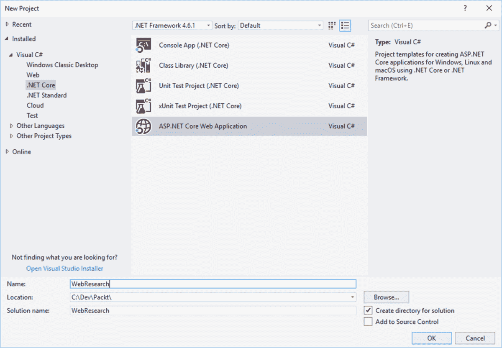

1.  在下一个屏幕上，选择 Web 应用程序（模型-视图-控制器）作为项目模板。为了保持简单，将身份验证保持为无身份验证。参考以下截图：


1.  创建的项目将如下所示：


# 安装所需的包

我们需要将三个 NuGet 包安装到我们的解决方案中，这将帮助我们完成我们的任务。这是通过包管理器控制台完成的。

转到工具 | NuGet 包管理器 | 包管理器控制台：

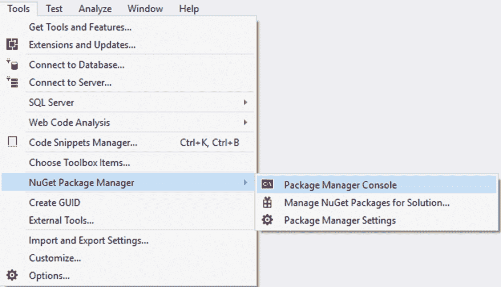

# 实体框架核心 SQL Server

EF Core 提供了各种数据库提供程序，包括 Microsoft SQL Server、PostgreSQL、SQLite 和 MySQL。我们将使用 SQL Server 作为数据库提供程序。

有关数据库提供程序的完整列表，请参阅官方微软文档：[`docs.microsoft.com/en-us/ef/core/providers/index`](https://docs.microsoft.com/en-us/ef/core/providers/index)。

在控制台窗口中，输入以下命令并按*Enter*：

```cs
    Install-Package Microsoft.EntityFrameworkCore.SqlServer  
```

您应该看到几行响应显示成功安装的项目。

# 实体框架核心工具

接下来，我们将安装一些实体框架核心工具，这些工具将帮助我们根据我们的模型创建数据库。

在控制台窗口中，输入以下命令并按*Enter*：

```cs
    Install-Package Microsoft.EntityFrameworkCore.Tools  
```

再次，您应该看到几行响应显示成功安装的项目。

# 代码生成设计

我们可以使用一些 ASP.Net Core 代码生成工具来帮助我们进行脚手架搭建，而不是自己编写所有代码。

接下来在控制台窗口中，输入以下命令并按*Enter*：

```cs
    Install-Package Microsoft.VisualStudio.Web.CodeGeneration.Design
```

像往常一样，检查一下是否获得了“成功安装”的项目。

如果安装任何 NuGet 包时出现问题，可能是访问控制问题。一般来说，我会将我的 Visual Studio 设置为以管理员身份运行，这样就可以解决大部分问题。

安装完成后，我们的解决方案将在“依赖项”部分反映出添加的 NuGet 包，如下所示：


# 创建模型

右键单击项目中的 Models 文件夹，添加一个名为`ResearchModel.cs`的类：


实际上，我们需要两个类——一个是`Research`类，它是我们`entity`对象的表示，另一个是`ResearchContext`，它是`DbContext`的子类。为了简化，我们可以将这两个类都放在我们的`ResearchModel`文件中。

这是代码：

```cs
using Microsoft.EntityFrameworkCore; 
using System; 

namespace WebResearch.Models 
{ 
    public class Research 
    { 
        public int Id { get; set; } 
        public string Url { get; set; } 
        public DateTime DateSaved { get; set; } 
        public string Note { get; set; } 
    } 

    public class ResearchContext : DbContext 
    { 
        public ResearchContext(DbContextOptions<ResearchContext> 
        options) : base(options) 
        { 
        } 

        public DbSet<Research> ResearchLinks { get; set; } 
    } 
} 
```

让我们分解如下：

首先，我们有我们的`Research`类，这是我们的`entity`对象表示。如前面的*开发数据库设计*部分所述，对于每个链接，我们将保存 URL、日期和备注。ID 字段是保存信息的数据库表的标准做法。

我们的第二个类`ResearchContext`是`DbContext`的子类。这个类将有一个以`DbContextOptions`为参数的空构造函数和一个用于我们数据集合的`DbSet<TEntity>`属性。

我可以在这里给您一个关于`DbSet<Entity>`的简要概述，但我宁愿让 Visual Studio 来帮助我们。如果您将鼠标悬停在`DbSet`上，您将得到一个信息弹出窗口，其中包含您需要了解的一切：


# 配置服务

在`Startup.cs`类中，在`ConfigureServices`方法中，添加以下代码的`DbContext`服务：

```cs
string connection = Configuration.GetConnectionString("LocalDBConnection"); 
services.AddDbContext<ResearchContext>(options => options.UseSqlServer(connection)); 
```

如您所见，我们从配置中设置了一个连接字符串变量，然后将其作为`DbContext`的`SqlServer`选项参数传递。

但是等等。`LocalDBConnection`是从哪里来的？我们还没有在配置中设置任何东西。现在还没有。让我们现在就搞定。

打开项目根目录中的`appsettings.json`文件：


默认情况下，您应该看到一个日志记录条目。在`Logging`部分之后添加您的`ConnectionStrings`部分，其中包含`LocalDBConnection`属性。

完整文件应该看起来像这样：

```cs
{ 
  "Logging": { 
    "IncludeScopes": false, 
    "LogLevel": { 
      "Default": "Warning" 
    } 
  }, 

  "ConnectionStrings": { 
    "LocalDBConnection": "Server=(localdb)\mssqllocaldb; 
     Database=WebResearch;  
     Trusted_Connection=True" 
  } 
} 
```

稍后，我们将看看如何连接到现有数据库，但现在我们只是连接到本地的`db`文件。

# 创建数据库

在任何应用程序的开发阶段，您的数据模型很有可能会发生变化。当这种情况发生时，您的 EF Core 模型与数据库架构不同，您必须删除过时的数据库，并根据更新后的模型创建一个新的数据库。

这都是一件有趣的事情，直到您完成了第一个实时实现，并且您的应用程序在生产环境中运行。那时，您不能去删除数据库来更改一些列。您必须确保在进行任何更改时，实时数据保持不变。

Entity Framework Core Migrations 是一个很棒的功能，它使我们能够对数据库架构进行更改，而不是重新创建数据库并丢失生产数据。`Migrations`具有很多功能和灵活性，这是一个值得花时间的话题，但现在我们只涵盖一些基础知识。

我们可以在`Package Manager Console`中使用 EF Core Migration 命令来设置、创建，并在需要时更新我们的数据库。

在`Package Manager Console`中，我们将执行以下两个命令：

1.  `Add-Migration InitialCreate`

1.  `Update-Database`

第一条命令将在项目的`Migrations`文件夹中生成用于创建数据库的代码。这些文件的命名约定是`<timestamp>_InitialCreate.cs`。

第二条命令将创建数据库并运行`Migrations`：


在`InitialCreate`类中有`Note`的两种方法，`Up`和`Down`。简单地说，`Up`方法代码在升级应用程序时执行，`Down`方法代码在降级应用程序时运行。

假设我们想要向我们的`Research`模型添加一个名为`Read`的布尔属性。为了持久化该值，我们显然需要将该列添加到我们的表中，但我们不希望删除表来添加字段。使用`Migrations`，我们可以更新表而不是重新创建它。

我们将从修改我们的模型开始。在`Research`类中，添加`Read`属性。我们的类将如下所示：

```cs
public class Research 
{ 
    public int Id { get; set; } 
    public string Url { get; set; } 
    public DateTime DateSaved { get; set; } 
    public string Note { get; set; } 
    public bool Read { get; set; } 
} 
```

接下来，我们将添加一个`Migration`。我们将使用`Migration`名称来指示我们正在做什么。在`Package Manager Console`中执行以下命令：

```cs
    Add-Migration AddReseachRead
```

您会注意到我们的`Migrations`文件夹中有一个新的类：

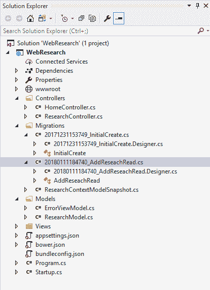

让我们来看看底层。您会看到我们的`Up`和`Down`方法并不像`InitialCreate`类中那样为空：


如前所述，`Up`方法在升级期间执行，`Down`方法在降级期间执行。现在我们可以看到代码，这个概念更清晰了。在`Up`方法中，我们正在添加`Read`列，在`Down`方法中，我们正在删除该列。

如果需要，我们可以对这段代码进行更改。例如，我们可以更改`Read`列的`nullable`属性，但更新代码如下所示：

```cs
protected override void Up(MigrationBuilder migrationBuilder) 
{ 
    migrationBuilder.AddColumn<bool>( 
        name: "Read", 
        table: "ResearchLinks", 
        nullable: true, 
        defaultValue: false); 
} 
```

我们还可以添加一个自定义的 SQL 查询，将所有现有条目更新为`Read`：

```cs
migrationBuilder.Sql( 
    @" 
        UPDATE Research 
        SET Read = 'true'; 
    "); 
```

我知道这不是一个很好的例子，因为你不希望每次更新数据库时都将所有的`Research`条目标记为`Read`，但希望你能理解这个概念。

但是，这段代码尚未执行。因此，当前时刻，我们的模型和数据库架构仍然不同步。

再次执行以下命令，我们就更新完毕了：

```cs
    Update-Database
```

# 用测试数据填充数据库

现在我们有一个空数据库，让我们用一些测试数据填充它。为此，我们需要创建一个在数据库创建后调用的方法：

1.  在项目中创建一个名为`Data`的文件夹。在文件夹中，添加一个名为`DbInitializer.cs`的类：


该类有一个`Initialize`方法，该方法以我们的`ResearchContext`作为参数：

```cs
public static void Initialize(ResearchContext context) 
```

1.  在`Initialize`方法中，我们首先调用`Database.EnsureCreated`方法，确保数据库存在并在不存在时创建它：

```cs
context.Database.EnsureCreated(); 
```

1.  接下来，我们进行一个快速的`Linq`查询，检查`ResearchLinks`表是否有任何记录。论点是，如果表为空，我们希望添加一些测试数据：

```cs
if (!context.ResearchLinks.Any()) 
```

1.  然后，我们创建一个`Research`模型的数组，并添加一些测试条目。URL 可以是任何你喜欢的东西。我只是选择了一些最常见的网站：

```cs
var researchLinks = new Research[] 
{ 
 new Research{Url="www.google.com", DateSaved=DateTime.Now, 
  Note="Generated Data", Read=false}, 
       new Research{Url="www.twitter.com", DateSaved=DateTime.Now,  
  Note="Generated Data", Read=false}, 
       new Research{Url="www.facebook.com", DateSaved=DateTime.Now, 
  Note="Generated Data", Read=false}, 
       new Research{Url="www.packtpub.com", DateSaved=DateTime.Now, 
  Note="Generated Data", Read=false}, 
       new Research{Url="www.linkedin.com", DateSaved=DateTime.Now,  
  Note="Generated Data", Read=false}, 
}; 
```

1.  填充了我们的数组后，我们循环遍历它，并将条目添加到我们的上下文中，最后调用`SaveChanges`方法将数据持久化到数据库中：

```cs
foreach (Research research in researchLinks) 
{ 
 context.ResearchLinks.Add(research); 
} 
 context.SaveChanges();
```

1.  将所有内容放在一起如下所示：

```cs
using System; 
using System.Linq; 
using WebResearch.Models; 

namespace WebResearch.Data 
{ 
    public static class DbInitializer 
    { 
        public static void Initialize(ResearchContext context) 
        { 
            context.Database.EnsureCreated(); 

            if (!context.ResearchLinks.Any()) 
            { 
                var researchLinks = new Research[] 
                { 
                    new Research{Url="www.google.com", 
                     DateSaved=DateTime.Now, Note="Generated Data", 
                      Read=false}, 
                    new Research{Url="www.twitter.com", 
                      DateSaved=DateTime.Now, Note="Generated
                      Data", 
                       Read=false}, 
                    new Research{Url="www.facebook.com", 
                     DateSaved=DateTime.Now, Note="Generated Data", 
                      Read=false}, 
                    new Research{Url="www.packtpub.com", 
                     DateSaved=DateTime.Now, Note="Generated Data", 
                      Read=false}, 
                    new Research{Url="www.linkedin.com", 
                     DateSaved=DateTime.Now, Note="Generated Data", 
                      Read=false}, 
                }; 
                foreach (Research research in researchLinks) 
                { 
                    context.ResearchLinks.Add(research); 
                } 
                context.SaveChanges(); 
            } 
        } 
    } 
} 
```

# 创建控制器

控制器是 ASP.NET Core MVC 应用程序构建的基本构件。控制器内的方法称为操作。因此，我们可以说控制器定义了一组操作。这些操作处理请求，这些请求通过路由映射到特定的操作。

要了解有关控制器和操作的更多信息，请参阅 Microsoft 文档：[`docs.microsoft.com/en-us/aspnet/core/mvc/controllers/actions`](https://docs.microsoft.com/en-us/aspnet/core/mvc/controllers/actions)。要了解有关路由的更多信息，请参阅 Microsoft 文档：[`docs.microsoft.com/en-us/aspnet/core/mvc/controllers/routing`](https://docs.microsoft.com/en-us/aspnet/core/mvc/controllers/routing)。按照以下步骤：

1.  右键单击 Controllers 文件夹，然后选择添加|控制器。

1.  在脚手架屏幕上，选择使用 Entity Framework 和单击添加的 MVC 控制器视图：

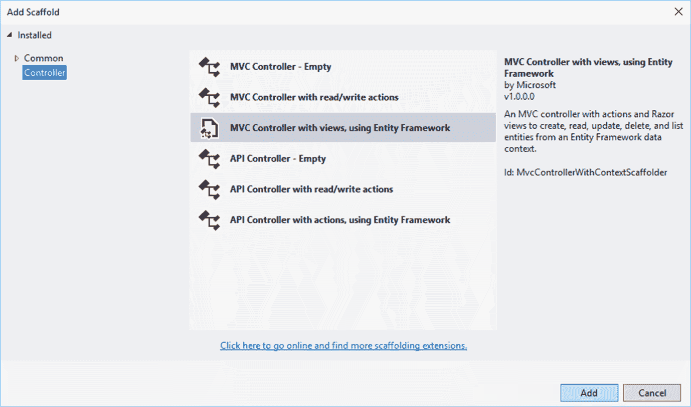

1.  在下一个屏幕上，选择我们的 Research 模型作为`Model`类，ResearchContext 作为`Data`上下文类。你可以将其余部分保持不变，除非你想要更改控制器名称：


简要查看创建的控制器，我们现在已经有了基本的**创建、读取、更新和删除**（**CRUD**）任务。现在，是主要事件的时候了。

# 运行应用程序

在我们开始运行应用程序之前，让我们确保我们的新页面很容易访问。最简单的方法就是将它设置为默认主页：

1.  看一下`Startup.cs`中的`Configure`方法。你会注意到默认路由被指定为`Home`控制器。

1.  简单地将控制器更改为你的`Research`控制器如下：

```cs
app.UseMvc(routes => 
{ 
    routes.MapRoute( 
        name: "default", 
        template: "{controller=Researches}/{action=Index}/{id?}"); 
});
```

1.  最后，确保你的`Main`方法如下所示：

```cs
public static void Main(string[] args)
{
  var host = BuildWebHost(args);
  using (var scope = host.Services.CreateScope())
  {
    var services = scope.ServiceProvider;
    try
    {
      var context = services.GetRequiredService<ResearchContext>();
      DbInitializer.Initialize(context);
    }
    catch (Exception ex)
    {
      var logger = services.GetRequiredService<ILogger<Program>>
       ();logger.LogError(ex, "An error occurred while seeding the 
        database.");
    }
  }host.Run();
}
```

1.  现在，按下*Ctrl* + *F5*来运行应用程序，看看你的劳动成果：


1.  如你所见，我们的测试条目可以供我们使用。让我们快速看一下可用的功能：

+   点击“创建新”以查看我们链接的条目表单：


1.  输入一些有趣的数据，然后点击“创建”按钮。你将被重定向回列表视图，并看到我们的新条目被添加到列表底部：

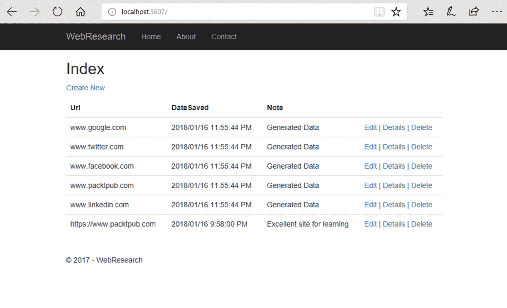

在每个项目旁边，你可以选择编辑、详情或删除。随便玩玩这些功能。有很多可以做来改善用户体验，比如自动填写日期字段。我将把改善用户体验的创意留给你自己来完成。

# 部署应用程序

一旦你的应用程序准备部署，你可以使用一些可用的选项：

1.  Microsoft Azure 应用服务

1.  自定义目标（IIS、FTP）

1.  文件系统

1.  导入配置文件

在 Visual Studio 的“构建”菜单项下，点击“发布 WebResearch”（或者你决定给你的项目起的名字）：

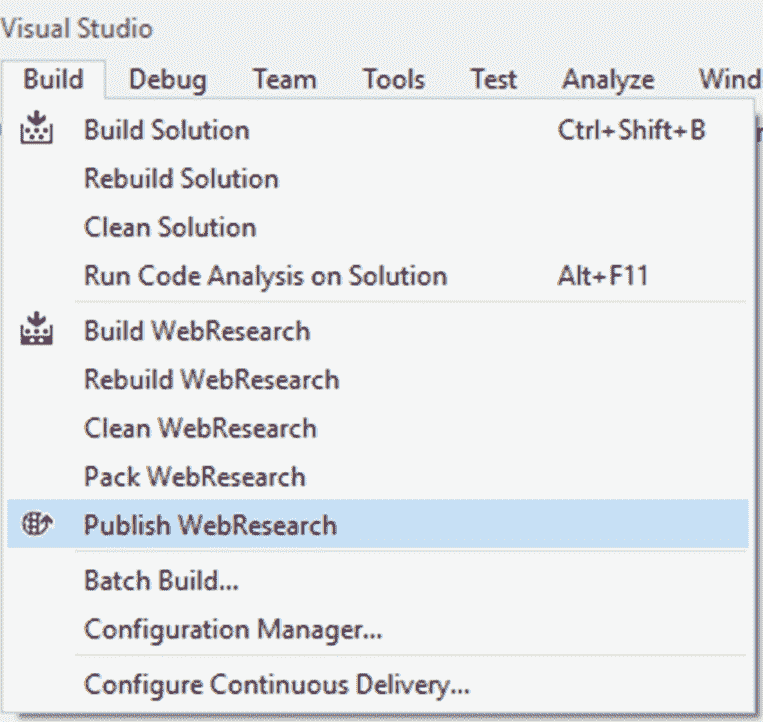

你将看到一个屏幕显示可用的发布选项。让我们仔细看一下。

# Microsoft Azure 应用服务

Microsoft Azure 负责创建和维护 Web 应用程序所需的所有基础设施。这意味着我们开发人员不需要担心诸如服务器管理、负载平衡或安全性等问题。随着平台几乎每天都在改进和扩展，我们也可以相当有信心地认为我们将拥有最新和最好的功能。

我们不会详细介绍 Azure 应用服务，因为它本身可以成为一本书，但我们当然可以看一下将我们的 Web 应用程序发布到这个云平台所需的步骤：

1.  选择 Microsoft Azure 应用服务作为你的发布目标。如果你有一个现有的站点需要发布，你可以选择“选择现有”。现在，我假设你需要“创建新”：

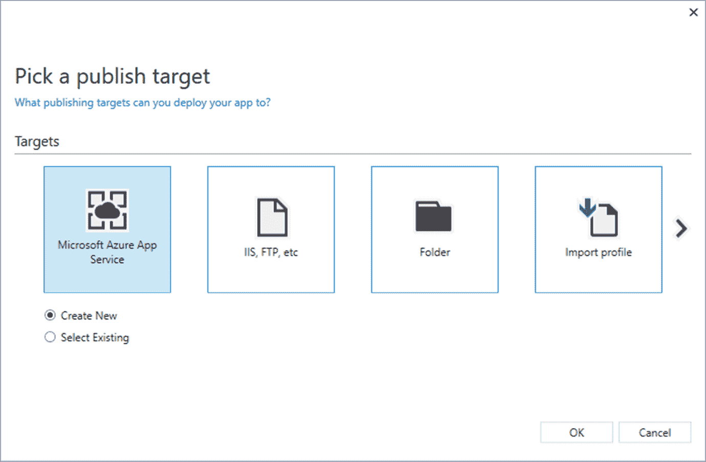

1.  点击“确定”按钮后，Visual Studio 将使用你登录的 Microsoft 账户联系 Azure，然后 Azure 将检查你是否有 Azure 账户，并返回可用的服务详情。

我为这个蓝图创建了一个试用账户，没有事先设置具体细节，正如你从下面的截图中看到的，Azure 会为你推荐一个可用的应用名称和应用服务计划。

1.  资源组是可选的，如果你没有指定任何内容，它将获得一个唯一的组名：


1.  你可以在“更改类型”选项下更改要发布的应用程序类型。在我们的情况下，我们显然会选择 Web 应用程序：


1.  点击左侧的“服务”以查看将与你的发布一起设置的服务。

第一个框显示了您的应用程序可能受益的任何推荐资源类型。在我们的情况下，推荐了一个 SQL 数据库，我们确实需要它，因此我们将通过单击添加（+）按钮来简单地添加它：


Azure 将负责 SQL 安装，但我们需要提供所需的信息，例如如果您已经在您的配置文件中有一个服务器，则使用哪个服务器，或者如果您还没有，则创建一个新的服务器。

1.  在这种情况下，我们将配置一个新的 SQL 服务器。单击 SQL 服务器下拉菜单旁边的新按钮以打开配置 SQL 服务器表单。Azure 将为服务器提供一个推荐的名称。虽然您可以提供自己的名称，但服务器名称很可能不可用，因此我建议您只使用他们推荐的名称。

1.  为服务器提供管理员用户名和管理员密码，然后点击确定：


1.  这样做将带您回到配置 SQL 数据库表单，在那里您需要指定数据库名称以及连接字符串名称：


1.  再次查看创建应用服务表单。您会注意到 SQL 数据库已添加到您选择和配置的资源部分：


1.  现在我们可以返回到托管选项卡，它将向您显示单击创建按钮时会发生什么的概述。

1.  如下图所示，将创建以下三个 Azure 资源：

1.  应用服务

1.  应用服务计划

1.  SQL 服务器


1.  创建后，我们可以通过单击发布按钮将其发布到我们的新 Azure 配置文件。

1.  您将在输出窗口中看到一些构建消息，并最终会得到以下结果：

```cs
   Publish Succeeded.
   Web App was published successfully 
   http://webresearch20180215095720.azurewebsites.net/
   ========== Build: 1 succeeded, 0 failed, 0 up-to-date, 0 skipped 
   ==========
   ========== Publish: 1 succeeded, 0 failed, 0 skipped ==========

```

1.  您可以查看 Azure 门户上的仪表板（[portal.azure.com](http://portal.azure.com)），该仪表板将显示由于我们的服务创建而启用在您的帐户上的资源：


1.  发布的应用程序将在浏览器中打开，您很可能会看到错误消息。默认情况下，您不会看到有关错误的详细信息，但至少 Azure 会通过将您的`ASPNETCORE_ENVIRONMENT`环境变量设置为`Development`并重新启动应用程序来提供一些指针以获取错误详细信息：


1.  当您登录到 Azure 门户时，可以导航到您的应用服务，然后在应用程序设置中，添加值为`Development`的 ASPNETCORE_ENVIRONMENT 设置，并重新启动您的应用：


1.  现在，我们可以刷新网站，我们应该看到关于底层错误的更多细节：

>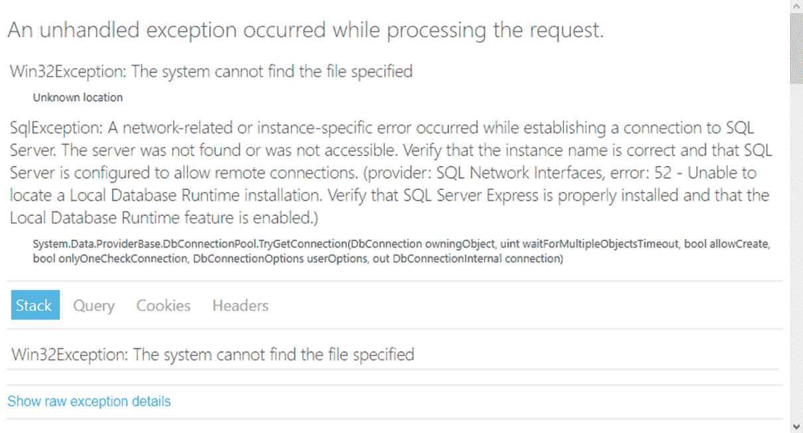

1.  啊，是的！我们仍然指向我们的本地数据库，并且我们无法从发布环境访问它。让我们更新我们的`appsettings.json`指向我们的 Azure 数据库。

1.  导航到 Azure 仪表板上的 SQL 服务器，然后到属性。在右侧窗格上，您应该会看到一个显示数据库连接字符串的选项：


1.  复制 ADO.NET 连接字符串，返回到您的代码，并在`appsettings.json`文件中更新 CONNECTION STRINGS 条目。

1.  重新发布应用程序，然后您应该可以开始了。

# 自定义目标

下一个发布选项通常称为自定义目标。

此选项基本上包括任何不是 Azure 或本地文件系统的内容。单击确定按钮后，您可以选择发布方法：

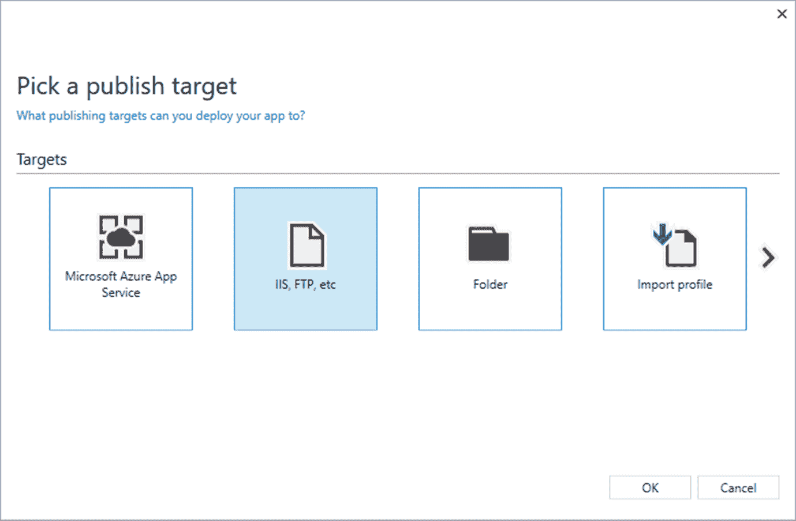

有四种发布方法或自定义目标，每种方法都有自己的要求：

1.  FTP

1.  Web 部署

1.  Web 部署包

1.  文件系统

我们还有一个设置选项卡，适用于所有四种方法。让我们快速看看那里的选项：


配置选项可以设置为 Debug 或 Release。

使用 Debug，您生成的文件是可调试的，这意味着可以命中指定的断点。但这也意味着性能会下降。

使用 Release，您将无法实时调试，但由于应用程序已完全优化，性能将有所提高。

在我们的情况下，唯一可用的目标框架是**netcoreapp2.0**，但在标准.NET 应用程序中，这是您可以将目标设置为.NET 3.5 或.NET 4.5，或者其他可用的地方。

然后，您还可以指定**目标运行时**，选择让 Visual Studio 清理目标文件夹，并为运行时指定连接字符串。

如前所述，这些设置适用于所有四种发布方法，我们现在将看一下。

# FTP

FTP 发布方法使您能够发布到托管的 FTP 位置。对于此选项，您需要提供以下内容：

+   服务器 URL

+   站点路径

+   用户名

+   密码

+   目标 URL

它还允许您验证从输入的详细信息的连接：

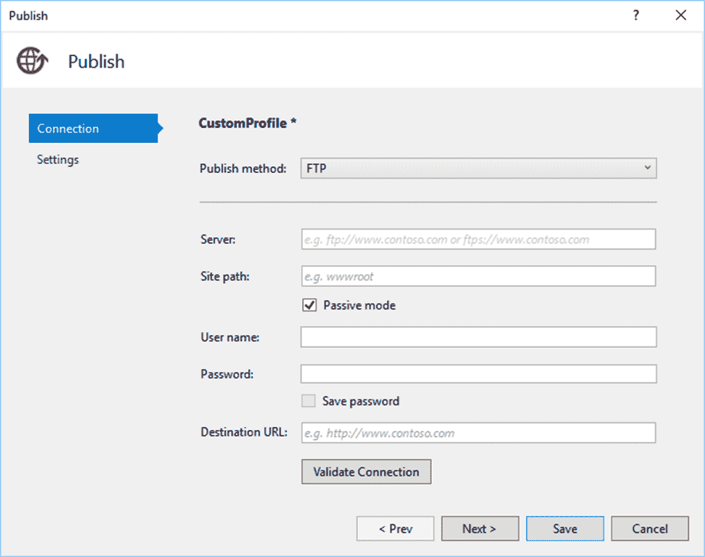

# Web Deploy

看看 Web Deploy 和 FTP 的形式，您可能会原谅自己认为它们是同一回事。嗯，两者都基本上会导致同样的结果，即直接发布到托管站点，但是使用 Web Deploy，您将获得一些额外的好处，包括以下内容：

+   Web Deploy 会将源与目标进行比较，并仅同步所需的更改，从而大大减少了与 FTP 相比的发布时间

+   即使 FTP 也有其安全的表亲 SFTP 和 FTPS，Web Deploy 始终支持安全传输

+   适当的数据库支持，使您能够在同步过程中应用 SQL 脚本

发布屏幕如下所示：


# Web Deploy Package

Web Deploy Package 选项用于创建部署包，您可以在之后选择的任何位置安装您的应用程序。请参考以下屏幕截图：

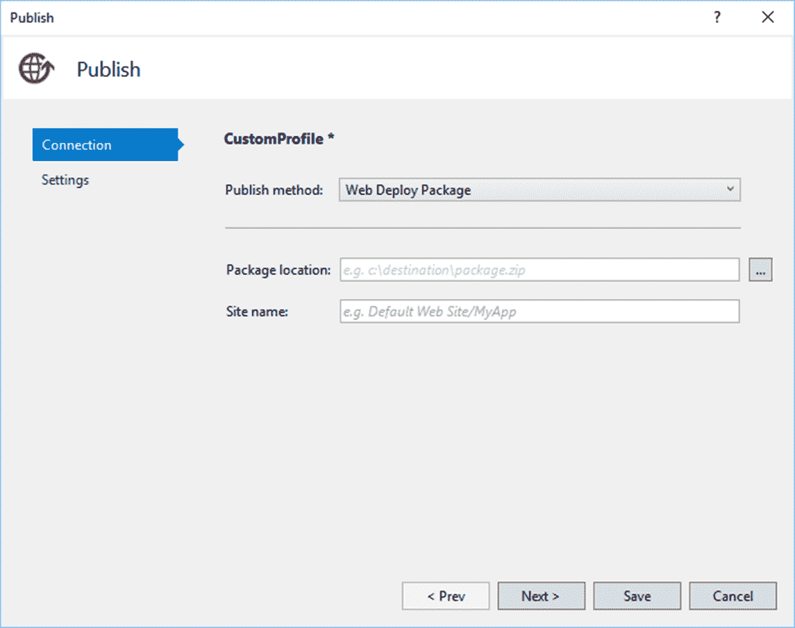

# 文件系统

被全球老派开发人员使用，主要是因为我们仍然不太信任一些可用工具，此选项允许您发布到您选择的文件夹位置，然后手动将其复制到发布环境：


# 文件夹

只是为了向您展示开发人员仍然控制发布代码的流行程度，我们有两条路径最终都会发布到文件夹位置。

再次，只需指定文件夹位置，然后点击“确定”：


# 导入配置文件

导入配置文件方法不是实际的发布方法，而是一个简单的选项，用于导入先前保存的配置文件，可以是从备份中导入，也可以用于在开发团队之间共享发布配置文件：

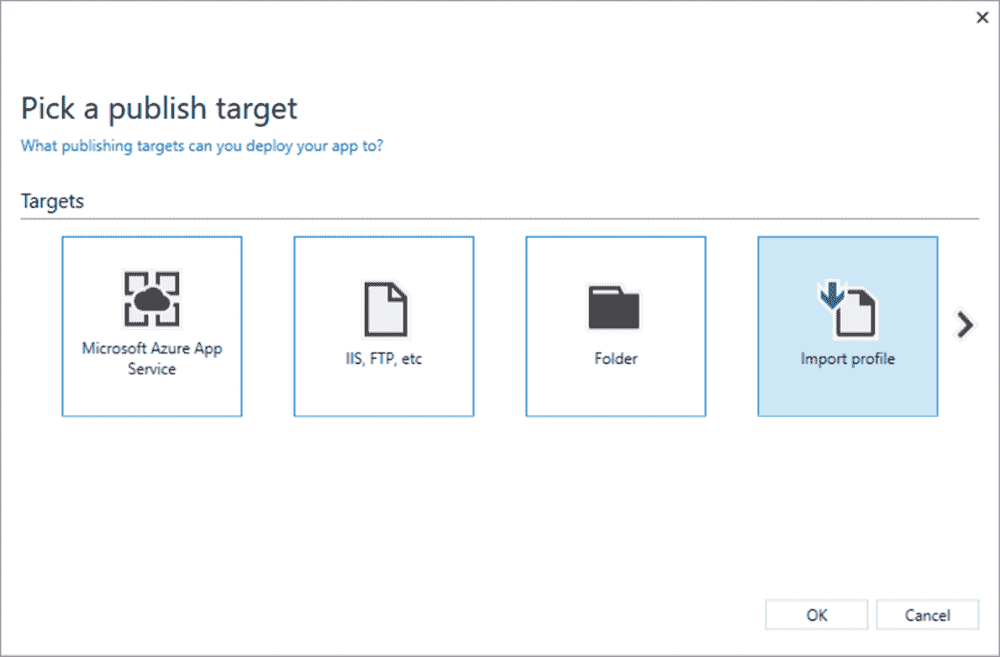

# 总结

在本章中，我们在 Entity Framework Core 领域进行了一次引导式的导览。我们从博物馆开始，了解了 Entity Framework 的历史，然后访问学区，讨论了 Code-First、Model-First 和 Database-First 实现方法之间的一些区别。甚至还有 TechNet 的快速访问，提供了一些关于设计数据库的想法。

之后，我们花了一些时间构建自己的 EF Core 解决方案，并研究了部署应用程序的各种方式。我们还研究了如何用一些测试数据填充我们的新建筑，以查看一旦向公众开放，它将如何保持稳定。

导览结束时，我们参观了分发区，以了解可用的部署选项。

这次访问时间太短，无法涵盖 Entity Framework Core 世界中所有可用和可能的内容，因为它是一个拥有庞大社区不断努力改进和扩展其功能的框架。

了解开发社区不满足于任何平庸，不断努力改进和扩展功能，比如 Entity Framework，尽管它似乎已经非常成熟和广泛。
