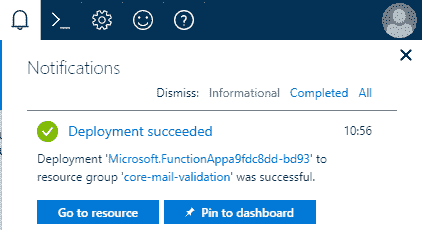
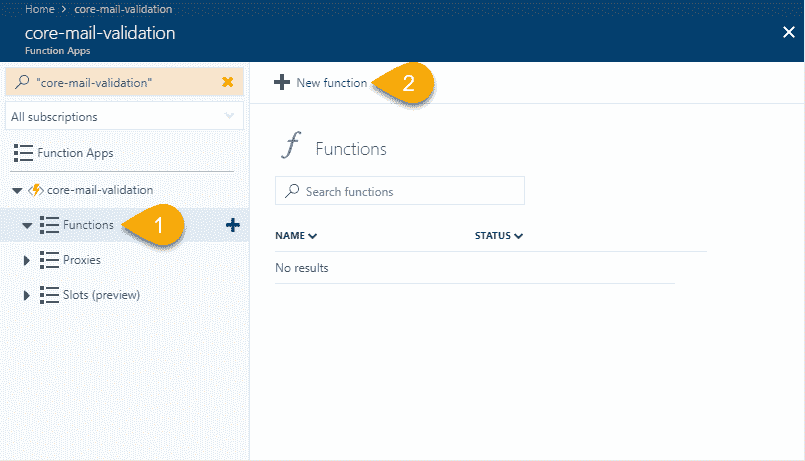
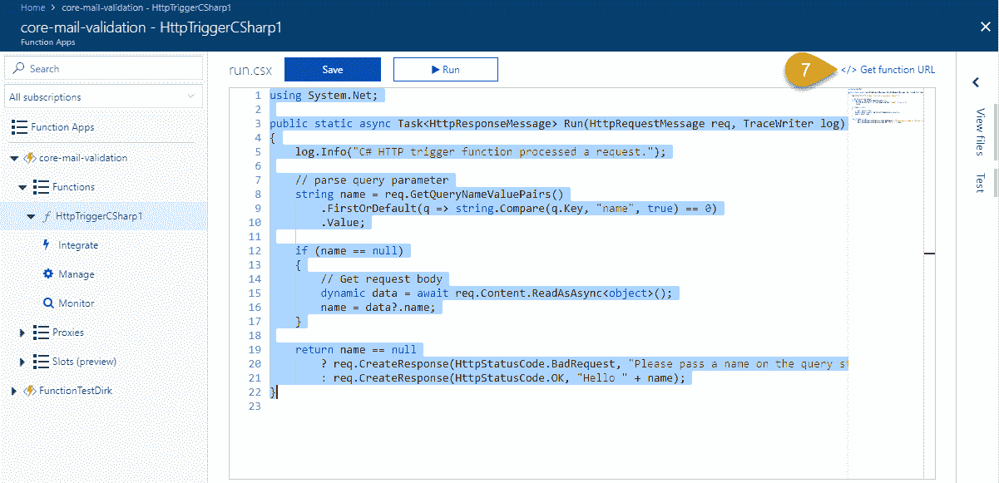
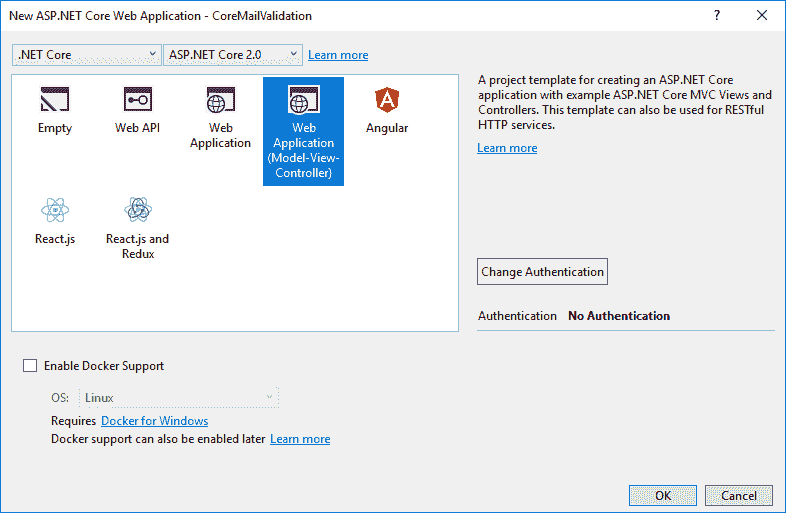
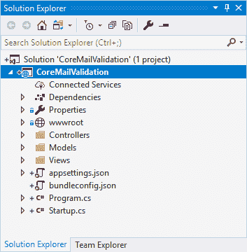
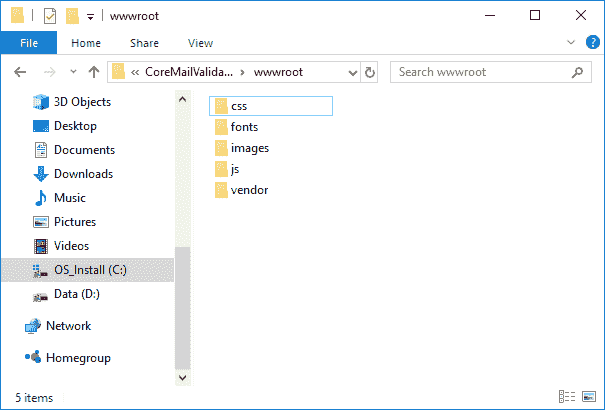
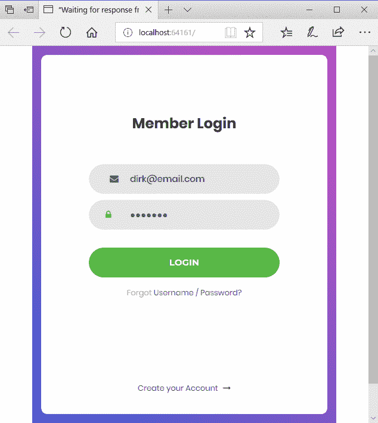
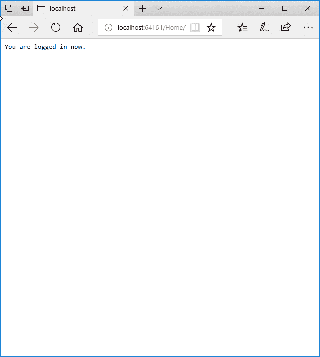

# 第七章：一个无服务器的电子邮件验证 Azure 函数

本章将带我们进入无服务器计算的领域。我听到你问无服务器计算到底是什么？事实上，一旦你理解了“无服务器计算”这个术语与缺乏服务器无关的概念，答案就非常简单了。事实上恰恰相反。

在本章中，我们将看一下：

+   创建 Azure 函数

+   在浏览器中测试您的 Azure 函数

+   从 ASP.NET Core MVC 应用程序调用 Azure 函数

我们将创建一个简单的 Azure 函数，使用正则表达式来验证电子邮件地址。您需要记住 Azure 函数是云中的小代码片段。不要把它们看作复杂代码的大部分。越小越好。

# 从无服务器计算开始

传统上，公司花费时间和金钱来管理服务器的计算资源。这些代表了公司的固定和重复成本。无论服务器是空闲还是正在执行某种计算任务，都会产生费用。底线是，它只是因为存在而花费了金钱。

使用无服务器计算，计算资源是可扩展的云服务。这意味着它是一个事件驱动的应用程序设计。基本上，使用无服务器计算，您只支付您使用的部分。这对 Azure 函数也是如此。

**Azure 函数**是驻留在云中的小代码片段。您的应用程序可以根据需要简单地使用这些函数，您只需支付所使用的计算能力。无论是一个人还是一百万人访问您的应用程序都无所谓。Azure 函数将自动扩展以处理额外的负载。当您的应用程序的使用量下降时，Azure 函数会自动缩小规模。

# 无服务器计算的重要性

想象一下，您的应用程序使用频繁（但不是持续）出现峰值。因为处理来自您的应用程序的请求的服务器不是无服务器的，它需要升级（作为您或您的公司的成本）以处理额外的负载。在低使用率时，服务器并没有更少的资源。您升级它以处理特定的用户负载。它将始终以这个性能水平运行，正如您所知，性能是有代价的。

使用无服务器计算，资源会随着需求的增加和减少而自动扩展和缩小。这是一种更有效的使用服务器的方式，因为您不必为未充分利用的计算能力付费。

# Azure 函数的特性

Azure 函数为开发人员提供了丰富的功能。请参考微软文档，了解更多关于 Azure 函数的信息-[`docs.microsoft.com/en-us/azure/azure-functions/`](https://docs.microsoft.com/en-us/azure/azure-functions/)。现在，我们将看一下其中的一些功能。

# 语言选择

Azure 函数的好处是您可以使用自己选择的语言创建它们。有关支持的语言列表，请浏览以下网址：

[`docs.microsoft.com/en-us/azure/azure-functions/supported-languages`](https://docs.microsoft.com/en-us/azure/azure-functions/supported-languages)。

在本章中，我们将使用 C#编写 Azure 函数。

# 按使用付费

如前所述，您只需支付 Azure 函数运行的实际时间。按秒计费的消耗计划。微软在以下网址上有一份关于 Azure 函数定价的文档：

[`azure.microsoft.com/en-us/pricing/details/functions/`](https://azure.microsoft.com/en-us/pricing/details/functions/)。

# 灵活的开发

您可以直接在 Azure 门户中创建 Azure 函数。您还可以使用 Visual Studio Team Services 和 GitHub 设置持续集成。

# 我可以创建什么类型的 Azure 函数？

您可以使用 Azure 函数作为集成解决方案，处理数据，与物联网，API 和微服务一起工作。Azure 函数还可以很好地触发，因此您甚至可以安排任务。这些是提供给您的一些 Azure 函数模板：

+   `HTTPTrigger`

+   `TimerTrigger`

+   `GitHub webhook`

+   `Generic webhook`

+   `BlobTrigger`

+   `CosmosDBTrigger`

+   `QueueTrigger`

+   `EventHubTrigger`

+   `ServiceBusQueueTrigger`

+   `ServiceBusTopicTrigger`

要了解有关这些模板和 Azure 函数的更多信息，请阅读微软文档*Azure 函数简介*，网址如下：

[`docs.microsoft.com/en-us/azure/azure-functions/functions-overview`](https://docs.microsoft.com/en-us/azure/azure-functions/functions-overview)。

# 创建 Azure 函数

让我们毫不拖延地创建我们自己的 Azure 函数。我们要创建的函数将使用正则表达式验证电子邮件地址。这是一个非常标准的开发任务。它也是一个将在许多应用程序中广泛使用的功能：

您需要拥有 Azure 帐户。如果没有，您可以在[`azure.microsoft.com/en-us/free/`](https://azure.microsoft.com/en-us/free/)上设置免费试用帐户。

1.  将浏览器指向[`portal.azure.com`](https://portal.azure.com)并登录到您的 Azure 门户。

1.  登录后，寻找“创建资源”链接。单击该链接，然后在 Azure Marketplace 部分下查找“计算”链接。请参考以下屏幕截图：


1.  在“特色”部分下方，您将看到“函数应用”作为一个选项。单击该链接：


1.  现在，您将看到“函数应用设置”屏幕。需要输入以下选项：

+   应用名称：这是您的 Azure 函数的全局唯一名称。

+   订阅：这是您的函数将在其中创建的订阅。

+   资源组：为您的函数创建一个新的资源组。

+   操作系统：您可以选择 Windows 或 Linux。我选择了 Windows。

+   托管计划：这将定义资源如何分配给您的函数。

+   位置：最好选择地理位置最接近您的位置。

+   存储：保持默认设置。

1.  您还可以选择将应用程序洞察切换到打开或关闭状态。您还可以选择“固定到仪表板”选项。

我们称之为 Azure 函数核心邮件验证。

1.  添加所有必需的设置后，单击“创建”按钮。


1.  单击“创建”按钮后，您将看到一个“正在验证...”的消息。这可能需要几秒钟时间！[](img/1fd053a8-3d11-4da8-91d9-322c9c6f613e.png)

1.  请注意 Azure 门户右上角的通知部分（小铃铛图标）。新通知将显示在那里，并以数字表示未读通知的数量！[](img/7e1a442c-69fc-47d7-a800-af7f81c07dfd.png)

1.  如果单击通知，您将看到 Azure 正在部署您创建的 Azure 函数的进度！[](img/5e90e6a5-74d6-4f1c-9b4e-586758a3c53a.png)

1.  当部署您的 Azure 函数时，您将在“通知”部分看到“部署成功”消息。从那里，您可以单击“固定到仪表板”或“转到资源”按钮。

将您的函数固定到仪表板只是为了以后更容易访问它。将经常使用的服务固定到仪表板是一个好主意。

1.  要访问您的 Azure 函数，请单击“转到资源”按钮：



1.  然后，您将进入 Azure 门户的“函数应用”部分。您将在“函数应用”部分下看到“核心邮件验证”函数：


1.  在“core-email-validation”下，单击“函数”选项。然后，在右侧面板中单击“新建函数”选项。



1.  现在，您将看到一系列可以帮助您入门的模板。向下滚动以查看所有可用的模板（不仅仅是以下截图中显示的四个）：


1.  我们不会浏览所有可用的模板。我们将保持简单，只选择“转到快速入门”选项，如下截图所示：


1.  对于我们的目的，我们将简单地选择“Webhook + API”，并选择“C#”作为我们的语言。还有其他可供选择的语言，因此请选择您最熟悉的语言。

1.  要创建该函数，请单击“创建此函数”按钮：


1.  已创建 Azure 函数，并为您自动添加了一些样板代码，以便您了解函数内部代码的外观。所有这些代码所做的就是在查询字符串中查找名为`name`的变量，并在找到时在浏览器中显示它：

```cs
      using System.Net; 
      public static async Task<HttpResponseMessage> 
       Run(HttpRequestMessage req, TraceWriter log) 
      { 
        log.Info("C# HTTP trigger function processed a request."); 

        // parse query parameter 
        string name = req.GetQueryNameValuePairs() 
        .FirstOrDefault(q => string.Compare(q.Key, "name", true) == 0) 
        .Value; 

        if (name == null) 
        { 
          // Get request body 
          dynamic data = await req.Content.ReadAsAsync<object>(); 
          name = data?.name; 
        } 

        return name == null 
        ? req.CreateResponse(HttpStatusCode.BadRequest,
        "Please pass a name on the query string or in the request body") 
          : req.CreateResponse(HttpStatusCode.OK, "Hello " + name); 
      }  
```

1.  查看屏幕右上角。您将看到一个“</>获取函数 URL”链接。单击以下链接：



1.  这将显示一个弹出屏幕，其中包含访问您刚创建的 Azure 函数的 URL。单击“复制”按钮将 URL 复制到剪贴板：


1.  您复制的 URL 将如下所示：

```cs
https://core-mail-validation.azurewebsites.net/api/HttpTriggerCSharp1?code=/IS4OJ3T46quiRzUJTxaGFenTeIVXyyOdtBFGasW9dUZ0snmoQfWoQ== 
```

1.  要运行我们的函数，我们需要在 URL 的查询字符串中添加一个`name`参数。继续在 URL 中添加`&name==[YOUR_NAME]`，其中`[YOUR_NAME]`是您自己的名字。在我的情况下，我在 URL 的末尾添加了`&name=Dirk`：

```cs
https://core-mail-validation.azurewebsites.net/api/HttpTriggerCSharp1?code=/IS4OJ3T46quiRzUJTxaGFenTeIVXyyOdtBFGasW9dUZ0snmoQfWoQ==&name=Dirk
```

1.  将此 URL 粘贴到浏览器地址栏中，然后点击返回按钮。浏览器中将显示一条消息（在我的情况下）“Hello Dirk”：


请注意，在 Chrome 和 Firefox 中，您可能会看到消息“此 XML 文件似乎没有与其关联的任何样式信息”。要查看输出，请使用 Microsoft Edge。

1.  回到 Azure 门户，在 Azure 函数屏幕的底部，您将看到“日志”窗口。如果没有显示，请单击“Λ”箭头展开面板。在这里，您将看到 Azure 触发器已成功运行：


恭喜，您刚刚运行了新的 Azure 函数。

# 修改 Azure 函数代码

虽然这一切都很令人兴奋（应该是的，这真是很酷的技术），但我们需要对 Azure 函数进行一些更改以满足我们的要求：

1.  在 Azure 函数中找到`return`语句。它将如下所示：

```cs
      return name == null 
        ? req.CreateResponse(HttpStatusCode.BadRequest,
         "Please pass a name on the query string or in the request 
          body") 
        : req.CreateResponse(HttpStatusCode.OK, "Hello " + name); 
```

让我们简化一下代码，如果电子邮件地址不为空，只需返回`true`。将`return`语句替换为以下代码：

```cs
      if (email == null) 
      { 
        return req.CreateResponse(HttpStatusCode.BadRequest,
         "Please pass an email address on the query string or
          in the request body"); 
      } 
      else 
      { 
        bool blnValidEmail = false; 
        if (email.Length > 0) 
        { 
            blnValidEmail = true; 
        } 

        return req.CreateResponse(HttpStatusCode.OK,
         "Email status: " + blnValidEmail); 
      } 
```

1.  您的 Azure 函数中的代码现在应该如下所示：

```cs
      using System.Net; 

      public static async Task<HttpResponseMessage>
       Run(HttpRequestMessage req, TraceWriter log) 
      { 
        log.Info("C# HTTP trigger function processed a new email 
         validation request."); 

        // parse query parameter 
        string email = req.GetQueryNameValuePairs() 
          .FirstOrDefault(q => string.Compare(q.Key, "email", true) == 
          0) 
          .Value; 

        if (email == null) 
        { 
          // Get request body 
          dynamic data = await req.Content.ReadAsAsync<object>(); 
          email = data?.email; 
        } 

        if (email == null) 
        { 
          return req.CreateResponse(HttpStatusCode.BadRequest,
           "Please pass an email address on the query string or
            in the request body"); 
        } 
        else 
        { 
          bool blnValidEmail = false; 
          if (email.Length > 0) 
          { 
            blnValidEmail = true; 
          } 

          return req.CreateResponse(HttpStatusCode.OK,
           "Email status: " + blnValidEmail); 
        }    

      }
```

1.  确保单击“保存”按钮以保存对 Azure 函数的更改。然后，您将看到函数已编译，并在“日志”窗口中显示“编译成功”消息：


1.  与以前一样，通过单击</>获取函数 URL 链接来复制 URL：

```cs
https://core-mail-validation.azurewebsites.net/api/HttpTriggerCSharp1?code=/IS4OJ3T46quiRzUJTxaGFenTeIVXyyOdtBFGasW9dUZ0snmoQfWoQ==
```

不过，这次我们要将其作为电子邮件地址传递。您可以看到参数名称已更改为`email`，并且值可以是您选择输入的任何电子邮件地址。因此，我在 URL 的末尾添加了`&email=dirk@email.com`：

```cs
https://core-mail-validation.azurewebsites.net/api/HttpTriggerCSharp1?code=/IS4OJ3T46quiRzUJTxaGFenTeIVXyyOdtBFGasW9dUZ0snmoQfWoQ==&email=dirk@email.com
```

1.  将 URL 粘贴到浏览器中，然后点击返回按钮，以在浏览器中查看结果显示：


1.  我们现在有信心 Azure Function 正在对我们的电子邮件地址进行基本验证（即使只是检查它是否存在）。然而，我们需要函数做更多的事情。为了验证电子邮件地址，我们将使用正则表达式。为此，将以下命名空间添加到 Azure Function 中：

```cs
      using System.Text.RegularExpressions; 
```

在进行验证的代码部分，输入代码来匹配电子邮件与正则表达式模式。

互联网上有成千上万种不同的正则表达式模式。正则表达式是一个完全不同的话题，超出了本书的范围。如果您的应用程序需要匹配文本模式，可以搜索一下，看看是否有可用的正则表达式模式。如果你真的很勇敢，你可以自己写。

1.  正则表达式已经内置到.NET Framework 中，代码非常简单：

```cs
blnValidEmail = Regex.IsMatch(email, 
                @"^(?("")("".+?(?<!\)""@)|((0-9a-z)|[-!#$%&'*+/=?^`{}|~w])*)(?<=[0-9a-z])@))" + 
                @"(?([)([(d{1,3}.){3}d{1,3}])|(([0-9a-z][-0-9a-z]*[0-9a-z]*.)+[a-z0-9][-a-z0-9]{0,22}[a-z0-9]))$", 
                RegexOptions.IgnoreCase, TimeSpan.FromMilliseconds(250)); 
```

1.  在添加了所有代码之后，您的 Azure Function 将如下所示：

```cs
      using System.Net; 
      using System.Text.RegularExpressions; 

      public static async Task<HttpResponseMessage>
       Run(HttpRequestMessage req, TraceWriter log) 
      { 
        log.Info("C# HTTP trigger function processed a new email 
         validation request."); 

        // parse query parameter 
        string email = req.GetQueryNameValuePairs() 
          .FirstOrDefault(q => string.Compare(q.Key, "email", true) == 
           0) 
          .Value; 

        if (email == null) 
        { 
          // Get request body 
          dynamic data = await req.Content.ReadAsAsync<object>(); 
          email = data?.email; 
        } 

        if (email == null) 
        { 
          return req.CreateResponse(HttpStatusCode.BadRequest,
          "Please pass an email address on the query string or in
           the request body"); 
        } 
        else 
        { 
          bool blnValidEmail = false; 

          blnValidEmail = Regex.IsMatch(email, 
                @"^(?("")("".+?(?<!\)""@)|((0-9a-z)|
                [-!#$%&'*+/=?^`{}|~w])*)(?<=[0-9a-z])@))" + 
                @"(?([)([(d{1,3}.){3}d{1,3}])|(([0-9a-z][-0-9a-z]*
                [0-9a-z]*.)+[a-z0-9][-a-z0-9]{0,22}[a-z0-9]))$", 
                RegexOptions.IgnoreCase, 
                TimeSpan.FromMilliseconds(250)); 

          return req.CreateResponse(HttpStatusCode.OK,
          "Email status: " + blnValidEmail); 
        }    

      } 
```

1.  使用之前复制的相同 URL 粘贴到浏览器窗口中，然后点击*返回*或*输入*键：

```cs
https://core-mail-validation.azurewebsites.net/api/HttpTriggerCSharp1?code=/IS4OJ3T46quiRzUJTxaGFenTeIVXyyOdtBFGasW9dUZ0snmoQfWoQ==&email=dirk@email.com
```

1.  电子邮件地址`dirk@email.com`已经验证，并且在浏览器中显示了消息“电子邮件状态：True”。这里发生的是电子邮件地址被传递给 Azure Function。然后函数从查询字符串中读取`email`参数的值，并将其传递给正则表达式。

电子邮件地址与正则表达式模式匹配，如果找到匹配，则认为电子邮件地址是有效的：


1.  让我们将相同的 URL 输入到浏览器中，只是这次输入一个你知道将是无效的电子邮件地址。例如，电子邮件地址只能包含一个`@`符号。然后我添加到 URL 的参数如下：

```cs
https://core-mail-validation.azurewebsites.net/api/HttpTriggerCSharp1?code=/IS4OJ3T46quiRzUJTxaGFenTeIVXyyOdtBFGasW9dUZ0snmoQfWoQ==&email=dirk@@email.com
```

然后您可以看到，当我们点击*返回*或*输入*键时，无效的电子邮件地址`dirk@@email.com`被验证，并且不匹配正则表达式。因此在浏览器中显示文本“电子邮件状态：False”：


太棒了！我们已经看到我们创建的 Azure Function 使用了我们添加的正则表达式来验证它接收到的电子邮件地址。根据正则表达式验证的结果，函数返回 true 或 false。

最后，在继续之前，我们希望 Azure Function 返回一个单一的`True`或`False`值给调用应用程序。修改函数的`return`语句来实现这一点：

```cs
  return req.CreateResponse(HttpStatusCode.OK, blnValidEmail); 
```

我们已经看到了这个函数是如何工作的，通过逐步修改代码并直接从浏览器窗口运行。然而，除非我们可以从应用程序调用这个 Azure Function，否则这对我们没有任何好处。

让我们看看如何创建一个 ASP.NET Core MVC 应用程序，调用我们的 Azure Function 来验证在登录屏幕上输入的电子邮件地址。

# 从 ASP.NET Core MVC 应用程序调用 Azure Function

在上一节中，我们看了一下我们的 Azure Function 是如何工作的。现在，我们想创建一个 ASP.NET Core MVC 应用程序，将调用我们的 Azure Function 来验证应用程序登录屏幕中输入的电子邮件地址：

这个应用程序根本不进行任何身份验证。它所做的只是验证输入的电子邮件地址。ASP.NET Core MVC 身份验证是一个完全不同的话题，不是本章的重点。

1.  在 Visual Studio 2017 中，创建一个新项目，并从项目模板中选择 ASP.NET Core Web 应用程序。单击“确定”按钮创建项目。如下截图所示：


1.  在下一个屏幕上，确保从表单的下拉选项中选择.NET Core 和 ASP.NET Core 2.0。选择 Web 应用程序（模型-视图-控制器）作为要创建的应用程序类型。

不要费心进行任何身份验证或启用 Docker 支持。只需单击“确定”按钮创建项目：



1.  创建项目后，您将在 Visual Studio 的解决方案资源管理器中看到熟悉的项目结构：



# 创建登录表单

在接下来的部分中，我们可以创建一个简单的普通登录表单。为了有点乐趣，让我们稍微调整一下。在互联网上寻找一些免费的登录表单模板：

1.  我决定使用一个名为**colorlib**的网站，该网站在最近的博客文章中提供了 50 个免费的 HTML5 和 CSS3 登录表单。文章的网址是：[`colorlib.com/wp/html5-and-css3-login-forms/`](https://colorlib.com/wp/html5-and-css3-login-forms/)。

1.  我决定使用**Colorlib**网站上的**Login Form 1**。将模板下载到您的计算机并解压缩 ZIP 文件。在解压缩的 ZIP 文件中，您将看到我们有几个文件夹。将此解压缩的 ZIP 文件中的所有文件夹复制（保留`index.html`文件，因为我们将在一分钟内使用它）：


1.  接下来，转到 Visual Studio 应用程序的解决方案。在`wwwroot`文件夹中，移动或删除内容，并将从解压缩的 ZIP 文件中的文件夹粘贴到 ASP.NET Core MVC 应用程序的`wwwroot`文件夹中。您的`wwwroot`文件夹现在应如下所示：



1.  回到 Visual Studio，展开 CoreMailValidation 项目中的 wwwroot 节点时，您将看到文件夹。

1.  我还想让您注意`Index.cshtml`和`_Layout.cshtml`文件。我们将修改这些文件：


1.  打开`Index.cshtml`文件，并从该文件中删除所有标记（大括号中的部分除外）。将之前从 ZIP 文件中提取的`index.html`文件中的 HTML 标记粘贴到该文件中。

不要复制`index.html`文件中的所有标记。只复制`<body></body>`标记内的标记。

1.  您的`Index.cshtml`文件现在应如下所示：

```cs
@{ 
    ViewData["Title"] = "Login Page";     
} 

<div class="limiter"> 
    <div class="container-login100"> 
        <div class="wrap-login100"> 
            <div class="login100-pic js-tilt" data-tilt> 
                 
            </div> 

            <form class="login100-form validate-form"> 
                <span class="login100-form-title"> 
                    Member Login 
                </span> 

                <div class="wrap-input100 validate-input" 
                 data-validate="Valid email is required: 
                  ex@abc.xyz"> 
                    <input class="input100" type="text" 
                     name="email" placeholder="Email"> 
                    <span class="focus-input100"></span> 
                    <span class="symbol-input100"> 
                        <i class="fa fa-envelope"
                         aria-hidden="true"></i> 
                    </span> 
                </div> 

                <div class="wrap-input100 validate-input" 
                 data-validate="Password is required"> 
                    <input class="input100" type="password" 
                     name="pass" 
                     placeholder="Password"> 
                    <span class="focus-input100"></span> 
                    <span class="symbol-input100"> 
                        <i class="fa fa-lock"
                         aria-hidden="true"></i> 
                    </span> 
                </div> 

                <div class="container-login100-form-btn"> 
                    <button class="login100-form-btn"> 
                        Login 
                    </button> 
                </div> 

                <div class="text-center p-t-12"> 
                    <span class="txt1"> 
                        Forgot 
                    </span> 
                    <a class="txt2" href="#"> 
                        Username / Password? 
                    </a> 
                </div> 

                <div class="text-center p-t-136"> 
                    <a class="txt2" href="#"> 
                        Create your Account 
                        <i class="fa fa-long-arrow-right m-l-5" 
                         aria-hidden="true"></i> 
                    </a> 
                </div> 
            </form> 
        </div> 
    </div> 
</div> 
```

本章的代码可在 GitHub 上的以下链接找到：

[`github.com/PacktPublishing/CSharp7-and-.NET-Core-2.0-Blueprints/tree/master/Serverless`](https://github.com/PacktPublishing/CSharp7-and-.NET-Core-2.0-Blueprints/tree/master/Serverless)。

1.  接下来，打开`Layout.cshtml`文件，并将我们之前复制到`wwwroot`文件夹中的所有链接添加到文件中。使用`index.html`文件作为参考。您将注意到`_Layout.cshtml`文件包含以下代码片段—`@RenderBody()`。这是一个占位符，指定了`Index.cshtml`文件内容应该注入的位置。如果您来自 ASP.NET Web Forms，请将`_Layout.cshtml`页面视为主页面。您的`Layout.cshtml`标记应如下所示：

```cs
<!DOCTYPE html>
<html>

<head>
    <meta charset="utf-8" />
    <meta name="viewport" content="width=device-width, initial-scale=1.0" />
    <title>@ViewData["Title"] - CoreMailValidation</title>
    <link rel="icon" type="image/png" href="~/images/icons/favicon.ico" />
    <link rel="stylesheet" type="text/css" href="~/vendor/bootstrap/css/bootstrap.min.css">
    <link rel="stylesheet" type="text/css" href="~/fonts/font-awesome-4.7.0/css/font-awesome.min.css">
    <link rel="stylesheet" type="text/css" href="~/vendor/animate/animate.css">
    <link rel="stylesheet" type="text/css" href="~/vendor/css-hamburgers/hamburgers.min.css">
    <link rel="stylesheet" type="text/css" href="~/vendor/select2/select2.min.css">
    <link rel="stylesheet" type="text/css" href="~/css/util.css">
    <link rel="stylesheet" type="text/css" href="~/css/main.css">
</head>

<body>
    <div class="container body-content">
        @RenderBody()
        <hr />
        <footer>
            <p>&copy; 2018 - CoreMailValidation</p>
        </footer>
    </div>
    <script src="img/jquery-3.2.1.min.js"></script>
    <script src="img/popper.js"></script>
    <script src="img/bootstrap.min.js"></script>
    <script src="img/select2.min.js"></script>
    <script src="img/tilt.jquery.min.js"></script>
    <script>
        $('.js-tilt').tilt({
            scale: 1.1
        })
    </script>
    <script src="img/main.js"></script>
    @RenderSection("Scripts", required: false)
</body>

</html>
```

1.  如果一切顺利，当您运行 ASP.NET Core MVC 应用程序时，您将看到以下页面。登录表单显然是完全无效的：


但是，登录表单是完全响应的。如果您需要缩小浏览器窗口的大小，您会看到表单随着浏览器大小的减小而缩放。这就是您想要的。如果您想探索 Bootstrap 提供的响应式设计，请访问[`getbootstrap.com/`](https://getbootstrap.com/)并查看文档中的示例：


我们接下来要做的事情是将此登录表单连接到我们的控制器，并调用我们创建的 Azure 函数来验证我们输入的电子邮件地址。

让我们来看看下一步该怎么做。

# 连接所有内容

为了简化事情，我们将创建一个模型传递给我们的控制器：

1.  在应用程序的`Models`文件夹中创建一个名为`LoginModel`的新类，并单击“添加”按钮：


1.  您的项目现在应该如下所示。您将看到`model`添加到`Models`文件夹中：


1.  接下来，我们要做的是在我们的`model`中添加一些代码，以表示登录表单上的字段。添加两个名为`Email`和`Password`的属性：

```cs
      namespace CoreMailValidation.Models 
      { 
        public class LoginModel 
        { 
          public string Email { get; set; } 
          public string Password { get; set; } 
        } 
      }
```

1.  回到`Index.cshtml`视图，在页面顶部添加`model`声明。这使得`model`可以在我们的视图中使用。请务必指定`model`存在的正确命名空间：

```cs
      @model CoreMailValidation.Models.LoginModel 
      @{ 
        ViewData["Title"] = "Login Page"; 
      } 
```

1.  接下来的代码部分需要在`HomeController.cs`文件中编写。目前，它应该只有一个名为`Index()`的操作：

```cs
      public IActionResult Index() 
      { 
        return View(); 
      } 
```

1.  添加一个名为`ValidateEmail`的新的`async`函数，它将使用我们之前复制的 Azure Function URL 的基本 URL 和参数字符串，并使用 HTTP 请求调用它。我不会在这里详细介绍，因为我认为代码非常简单。我们所做的就是使用我们之前复制的 URL 调用 Azure Function 并读取返回的数据：

```cs
      private async Task<string> ValidateEmail(string emailToValidate) 
      { 
        string azureBaseUrl = "https://core-mail-
         validation.azurewebsites.net/api/HttpTriggerCSharp1"; 
        string urlQueryStringParams = $"?
         code=/IS4OJ3T46quiRzUJTxaGFenTeIVXyyOdtBFGasW9dUZ0snmoQfWoQ
          ==&email={emailToValidate}"; 

        using (HttpClient client = new HttpClient()) 
        { 
          using (HttpResponseMessage res = await client.GetAsync(
           $"{azureBaseUrl}{urlQueryStringParams}")) 
          { 
            using (HttpContent content = res.Content) 
            { 
              string data = await content.ReadAsStringAsync(); 
              if (data != null) 
              { 
                return data; 
              } 
              else 
                return ""; 
            } 
          } 
        } 
      }  
```

1.  创建另一个名为`ValidateLogin`的`public async`操作。在操作内部，继续之前检查`ModelState`是否有效。

有关`ModelState`的详细解释，请参阅以下文章-[`www.exceptionnotfound.net/asp-net-mvc-demystified-modelstate/`](https://www.exceptionnotfound.net/asp-net-mvc-demystified-modelstate/)。

1.  然后，我们在`ValidateEmail`函数上进行`await`，如果返回的数据包含单词`false`，则我们知道电子邮件验证失败。然后将失败消息传递给控制器上的`TempData`属性。

`TempData`属性是一个存储数据的地方，直到它被读取。它由 ASP.NET Core MVC 在控制器上公开。`TempData`属性默认使用基于 cookie 的提供程序在 ASP.NET Core 2.0 中存储数据。要在不删除的情况下检查`TempData`属性中的数据，可以使用`Keep`和`Peek`方法。要了解有关`TempData`的更多信息，请参阅 Microsoft 文档：[`docs.microsoft.com/en-us/aspnet/core/fundamentals/app-state?tabs=aspnetcore2x`](https://docs.microsoft.com/en-us/aspnet/core/fundamentals/app-state?tabs=aspnetcore2x)。

如果电子邮件验证通过，那么我们知道电子邮件地址是有效的，我们可以做其他事情。在这里，我们只是说用户已登录。实际上，我们将执行某种身份验证，然后路由到正确的控制器。

另一个有趣的事情是在控制器上的`ValidateLogin`操作上包含`ValidateAntiForgeryToken`属性。这确保了表单是从我们的站点提交的，并防止我们的站点受到跨站请求伪造攻击的欺骗。

如果我们必须检查应用程序运行时页面的呈现标记，我们将看到 ASP.NET Core 已自动生成了防伪标记。

通过浏览器的开发者工具检查标记。在 Chrome 中，按*Ctrl* + *Shift* + *I*或者如果您使用 Edge，则按*F12*。

1.  您将看到 __RequestVerificationToken 和生成的值如下所示：


1.  `HomeController`上的完整`ValidateLogin`操作应如下所示：

```cs
      [HttpPost, ValidateAntiForgeryToken] 
      public async Task<IActionResult> ValidateLogin(LoginModel model) 
      { 
        if (ModelState.IsValid) 
        { 
          var email = model.Email; 
          string azFuncReturn = await ValidateEmail(model.Email); 

          if (azFuncReturn.Contains("false")) 
          { 
            TempData["message"] = "The email address entered is 
             incorrect. Please enter again."; 
            return RedirectToAction("Index", "Home"); 
          } 
          else 
          { 
            return Content("You are logged in now."); 
          }                 
        } 
        else 
        { 
          return View(); 
        } 

      } 
```

回到我们的`Index.cshtml`视图，仔细查看`form`标记。我们已经明确定义了使用`asp-action`（指定要调用的操作）和`asp-controller`（指定要去哪个控制器查找指定操作）来调用哪个控制器和操作：

```cs
<form class="login100-form validate-form" asp-action="ValidateLogin" asp-controller="Home"> 
```

这将`ValidateLogin`操作映射到`HomeController`类上，`Index.cshtml`表单将提交到该操作：


1.  然后，稍微往下，确保您的按钮的`type`指定为`submit`：

```cs
      <div class="container-login100-form-btn"> 
        <button class="login100-form-btn" type="submit"> 
          Login 
        </button> 
      </div> 
```

我们的`Index.cshtml`视图几乎完成了。当输入的电子邮件无效时，我们希望得到某种通知。这就是 Bootstrap 派上用场的地方。添加以下标记以显示`modal`对话框，通知用户输入的电子邮件地址无效。

您将注意到页面末尾包含`@section Scripts`块。我们基本上是在说，如果`TempData`属性不为空，那么我们希望通过 jQuery 脚本显示模态对话框：

```cs
<div id="myModal" class="modal" role="dialog"> 
    <div class="modal-dialog"> 

        <!-- Modal content--> 
        <div class="modal-content"> 
            <div class="modal-header alert alert-danger"> 
                <button type="button" class="close"
                 data-dismiss="modal">&times;</button> 
                <h4 class="modal-title">Invalid Email</h4> 
            </div> 
            <div class="modal-body"> 
                <p>@TempData["message"].</p> 
            </div> 
            <div class="modal-footer"> 
                <button type="button" class="btn btn-default"
                 data-dismiss="modal">Close</button> 
            </div> 
        </div> 

    </div> 
</div> 

@section Scripts 
    { 
    @if (TempData["message"] != null) 
    { 
        <script> 
            $('#myModal').modal(); 
        </script> 
    } 
} 
```

运行您的应用程序，并在登录页面上输入一个无效的电子邮件地址。在我的示例中，我只是添加了一个包含两个`@`符号的电子邮件地址：


当按下登录按钮时，表单将回传到控制器，然后调用 Azure 函数，对输入的电子邮件地址进行验证。

结果是一个相当单调的模态对话框通知弹出，通知用户电子邮件地址不正确：


输入有效的电子邮件地址并单击登录按钮将导致对输入的电子邮件进行成功验证：



如前所述，电子邮件验证与身份验证不同。如果电子邮件经过验证，那么可以进行身份验证过程。如果此身份验证过程成功验证登录的用户，那么他们才会被重定向到已登录页面：



# 摘要

在本章中，我们看到了如何在 Azure 门户上创建 Azure 函数。我们了解到 Azure 函数是云中使用的应用程序的小代码片段。由于它们是按使用量付费的模式定价，因此您只需支付实际使用的计算能力。当您的 Web 应用程序的用户负载很高时，该函数会根据需要自动扩展以满足访问它的应用程序的需求。

我们通过手动将 URL 发布到浏览器来了解了在 Azure 函数中了解代码的过程。然后，我们创建了一个由单个登录页面组成的 ASP.NET Core MVC 应用程序。然后，我们看了如何使用 Azure 函数来验证登录屏幕上输入的电子邮件地址。 Azure 函数是一种令人兴奋的技术。还有很多东西要学习，这一章剩下的内容不足以讨论这种无服务器技术。如果您对此技术感兴趣，请探索其他可用的 Azure 服务模板。

在下一章中，我们将学习如何使用 ASP.NET Core MVC 应用程序和名为`Tweetinvi`的 C#库创建 Twitter 克隆。请继续关注，还有很多令人兴奋的内容等着您。
