# 第八章：使用 OAuth 创建 Twitter 克隆

在本章中，我们将看看使用 ASP.NET Core MVC 创建一个基本的 Twitter 克隆是多么容易。我们将执行以下任务：

+   在 Twitter 上使用 Twitter 的应用程序管理创建你的应用

+   创建一个 ASP.NET Core MVC 应用程序

+   阅读你的主页时间线

+   发布一条推文

你可以想象，Twitter 功能在.NET（更不用说.NET Core）中并不是标准配置。

请注意，你需要创建一个 Twitter 账户才能在本章中执行任务。你可以通过访问[`twitter.com/`](https://twitter.com/)进行注册。

幸运的是，有很多专注和热情的开发者愿意免费分享他们的代码。你通常会在 GitHub 上找到他们的代码，而这正是我们将要寻找一些代码集成到我们的 ASP.NET Core MVC 应用程序中，以赋予它 Twitter 的功能。这一章并不是对我们将要使用的特定 Twitter 库的认可。然而，这个库是我用过的最好的之一。而且（在撰写本文时）它还在不断更新。

让我们来看看 Tweetinvi。

# 使用 Tweetinvi

将你的浏览器指向[`github.com/linvi/tweetinvi`](https://github.com/linvi/tweetinvi)。这个库的描述已经说明了一切：

Tweetinvi，最好的 Twitter C#库，适用于 REST 和 Stream API。它支持.NET、.NETCore、UAP 和便携式类库（Xamarin）...

换句话说，这个库正是我们创建 Twitter 克隆应用所需要的。Tweetinvi 文档非常完善，并且有一个支持它的活跃社区。

# ASP.NET Core MVC Twitter 克隆应用程序

创建一个完整的 Twitter 克隆应用是一项艰巨的工作——比这一章节允许的工作还要多，恐怕我只能说明如何读取你主要的推文流（你在 Twitter 上关注的人的推文）。我还会向你展示如何从应用程序发布一条推文。

在这个应用程序中，我将放弃所有花哨的 UI 元素，而是给你一个绝佳的基础，让你继续开发一个完整的 Twitter 克隆。你可以考虑添加以下功能：

+   删除推文

+   转推

+   关注某人

+   取消关注某人

+   发送私信

+   搜索

+   查看个人资料

你可以添加很多额外的功能；随意添加你想要看到的任何缺失功能。我个人希望有更好的方式来整理和保存我发现有趣的推文。

我知道你们中的一些人可能会想知道为什么点赞一条推文不够，这就是我的原因。点赞推文最近已经成为了一种简便的方式，让别人知道他们已经看到了这条推文。当你在一条推文中被提到时，这一点尤其正确。在不回复的情况下（尤其是对于反问），Twitter 用户只是简单地点赞推文。

点赞一条推文也不是一个整理工具。你点赞的一切都可以在你的点赞下找到。没有办法区分。啊哈！我听到你们中的一些人说，“那时时刻呢？”再次强调，时刻存在于 Twitter 上。

想象一下时刻，但是那些时刻是来到你身边的。无论如何，我们可以对这样一个自定义的 Twitter 克隆应用进行很多改进，真正让它成为你自己的。现在，让我们从基础开始。

# 在 Twitter 上创建你的应用程序

在我们开始创建 Twitter 克隆之前，我们需要在 Twitter 应用管理控制台上注册它。

要访问应用程序管理控制台，请将你的浏览器指向[`apps.twitter.com`](https://apps.twitter.com)：

1.  点击登录链接，如下截图所示：


1.  在登录界面上使用你的 Twitter 凭据登录：

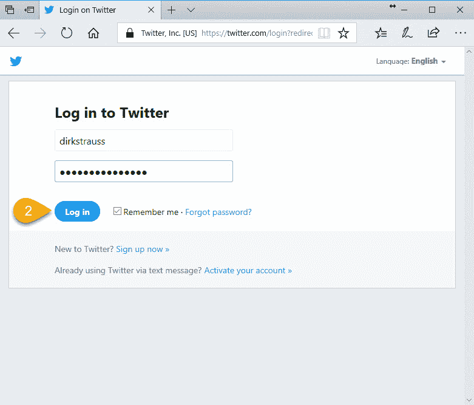

1.  如果您以前创建过任何应用程序，您将看到它们列在下面。您创建的所有应用程序都列在 Twitter 应用程序部分下。点击“创建新应用”按钮：


1.  现在您将看到创建应用程序表单。为您的应用程序提供一个合适的名称和描述。为您的应用程序提供一个网站，并最后提供一个回调 URL 值。我只是使用了`http://localhost:50000/`，稍后将向您展示如何在应用程序中配置此项。如下截图所示：


如果在回调期间 localhost 出现问题，请尝试改用`127.0.0.1`。

1.  勾选您理解的 Twitter 开发者协议选项，然后点击创建 Twitter 应用程序：


1.  接下来，您将看到刚刚创建的应用程序设置的摘要。在屏幕顶部，点击“密钥和访问令牌”选项卡：

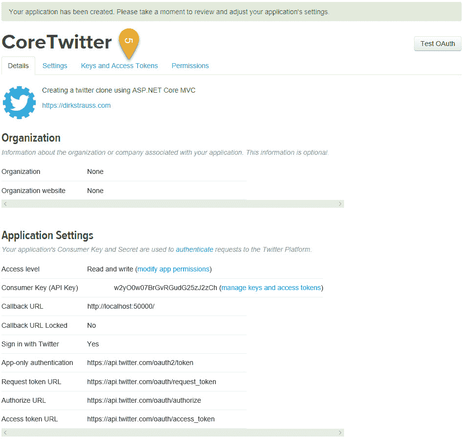

1.  这将带您到您的应用程序设置，其中提供了消费者密钥和消费者密钥。一定要记下这些密钥：


1.  在页面底部，您将看到一个名为“创建我的访问令牌”的按钮。点击此按钮。这将创建一个令牌，使您能够进行 API 调用：


1.  生成令牌后，将显示访问令牌和访问令牌密钥。也要记下这些：


这就是在 Twitter 的应用程序管理控制台上注册您的应用程序所需的全部内容。接下来我们需要做的是创建我们的 ASP.NET Core MVC 应用程序。

# 创建 ASP.NET Core MVC 应用程序并添加 NuGet 包

现在让我们开始创建 ASP.NET Core MVC 应用程序并向其添加 Twitter 功能：

1.  在 Visual Studio 2017 中，创建一个新的 ASP.NET Core Web 应用程序。我只是在 Twitter 上注册时将我的应用程序命名为相同的名称。点击“确定”按钮：


1.  在下一个屏幕上，确保您选择了 Web 应用程序（模型-视图-控制器）模板，并且您已从下拉菜单中选择了 ASP.NET Core 2.0。我特别提到这一点，因为我收到读者的反馈，他们从来没有选择过 ASP.NET Core 2.0。点击“确定”按钮：


创建项目后，它将如下所示：


1.  现在我们要去获取 Tweetinvi NuGet 包，因此请右键单击项目，然后从上下文菜单中选择“管理 NuGet 包”，如下所示：


1.  在“浏览”选项卡中，搜索`tweetinvi`，并选择开发人员 Linvi 的项目。点击“安装”按钮将其添加到您的应用程序：


1.  不久后，进度将在 Visual Studio 的输出窗口中显示为已完成：

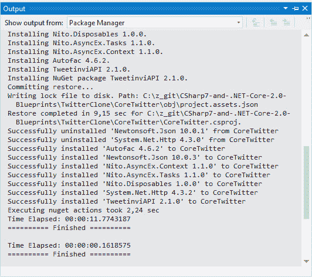

1.  接下来要做的是将我们的 URL 设置为之前在 Twitter 应用程序管理控制台中设置的回调 URL。为此，请右键单击项目，然后从上下文菜单中单击“属性”：

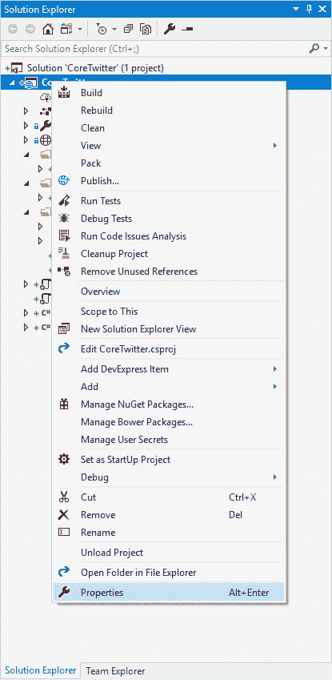

1.  选择“调试”选项卡，然后在“应用程序 URL”字段中输入回调 URL：


如果您在应用程序管理控制台中将回调 URL 的`localhost`部分设置为`127.0.0.1`，则在此处也需要将其设置为`127.0.0.1`。

1.  保存您的设置并返回到代码窗口。

从设置的角度来看，这应该是您开始编写代码并连接一切所需的全部内容。让我们开始下一步。

# 让我们开始编码

此项目的所有代码都可以在 GitHub 上找到。将浏览器指向[`github.com/PacktPublishing/CSharp7-and-.NET-Core-2.0-Blueprints`](https://github.com/PacktPublishing/CSharp7-and-.NET-Core-2.0-Blueprints)，并在阅读本章的其余部分时，获取代码并进行操作。

# 设置类和设置

我想要做的第一件事是创建一个将存储我的设置的类。为此，请执行以下步骤：

1.  创建一个名为`Classes`的文件夹，在该文件夹中创建一个名为`CoreTwitterSettings`的类。然后，在`Classes`文件夹中添加一个名为`TweetItem`的第二个类（我们稍后将使用此类）。在此过程中，创建另一个名为`css`的文件夹，我们稍后将使用它。

1.  完成后，您的项目将如下所示：

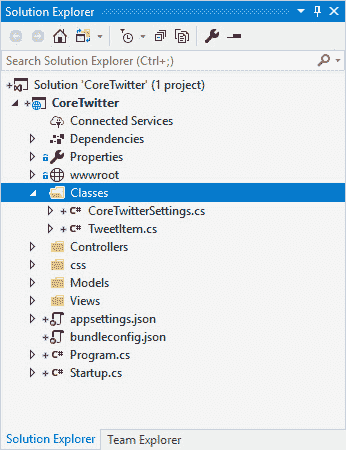

1.  打开`CoreTwitterSettings`类，并向其中添加以下代码：

```cs
public class CoreTwitterConfiguration 
{ 
    public string ApplicationName { get; set; } 
    public int TweetFeedLimit { get; set; } = 1; 

    public TwitterSettings TwitterConfiguration { get; set; } = new 
    TwitterSettings(); 
} 

public class TwitterSettings 
{ 
    public string Consumer_Key { get; set; } 
    public string Consumer_Secret { get; set; } 
    public string Access_Token { get; set; } 
    public string Access_Secret { get; set; } 
} 
```

1.  我们要做的下一件事是找到我们的`appsettings.json`文件。该文件将位于您的项目根目录中，如下截图所示：

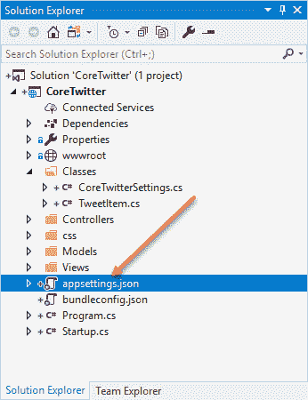

1.  双击`appsettings.json`文件以打开进行编辑。文件的默认内容应如下所示：

```cs
{ 
  "Logging": { 
    "IncludeScopes": false, 
    "LogLevel": { 
      "Default": "Warning" 
    } 
  } 
} 
```

1.  修改文件以包含您想要存储的设置。`appsettings.json`文件的目的是存储您应用程序的所有设置。

1.  将您的 Consumer Key 和 Consumer Secret 密钥添加到文件中。还要注意，我已经使用了一个基本 URL 的设置，这是之前设置的回调 URL。这在设置中有时很方便。我还创建了一个名为`TweetFeedLimit`的设置，以限制返回到主页时间线的推文。

您的 Consumer Key 和 Consumer Secret 肯定与我的示例中的值不同。因此，请确保相应地更改这些值。

1.  修改您的`appsettings.json`文件后，它将如下所示：

```cs
{ 
  "Logging": { 
    "IncludeScopes": false, 
    "LogLevel": { 
      "Default": "Warning" 
    } 
  }, 

  "CoreTwitter": { 
    "ApplicationName": "Twitter Core Clone (local)", 
    "TweetFeedLimit": 10, 
    "BaseUrl": "http://localhost:50000/", 
    "TwitterConfiguration": { 
      "Consumer_Key": "[YOUR_CONSSUMER_KEY]", 
      "Consumer_Secret": "[YOUR_CONSUMER_SECRET]", 
      "Access_Token": "", 
      "Access_Secret": "" 
    } 
  } 
} 
```

1.  如果您查看`CoreTwitterSettings`类，您会发现它与`appsettings.json`文件中的 JSON 略有相似。

1.  在您的 Visual Studio 解决方案中，找到`Startup.cs`文件并打开进行编辑。您会看到 Visual Studio 2017 已经为您的这个类添加了很多样板代码。特别注意`ConfigureServices`方法。它应该看起来像这样：

```cs
public void ConfigureServices(IServiceCollection services) 
{ 
    services.AddMvc(); 
} 
```

1.  自 ASP.NET Core 1.1 以来，我们已经能够使用`Get<T>`，它可以与整个部分一起使用。要使设置在我们的 ASP.NET Core MVC 应用程序中可用，请将此方法中的代码更改如下：

```cs
public void ConfigureServices(IServiceCollection services) 
{ 
    services.AddMvc(); 

    var section = Configuration.GetSection("CoreTwitter"); 
    services.Configure<CoreTwitterConfiguration>(section);             
} 
```

您会注意到我们正在获取`appsettings.json`文件中定义的`CoreTwitter`部分。

# 创建`TweetItem`类

`TweetItem`类只是简单地包含特定推文的 URL。它并不是一个非常复杂的类，但它的用处将在本章后面变得清晰。现在，只需向其中添加以下代码：

```cs
public class TweetItem 
{ 
    public string Url { get; set; } 
} 
```

它将存储的 URL 将是特定推文的 URL。

# 设置 CSS

为了在推文中使用`<blockquote>` HTML 标签，您将希望向您的`CSS`文件夹中添加一个 CSS 文件。在我们的示例中，我们将不使用它，但随着您进一步构建应用程序，您将希望使用此 CSS 来为您的`<blockquote>`推文设置样式。

如果您现在只是玩玩，完成本章后不打算进一步构建此应用程序，可以跳过添加 CSS 文件的部分。如果您想进一步使用此应用程序，请继续阅读：

1.  右键单击解决方案中的`css`文件夹，并向其中添加一个新项。将文件命名为`site.css`，然后单击“添加”按钮，如下截图所示：

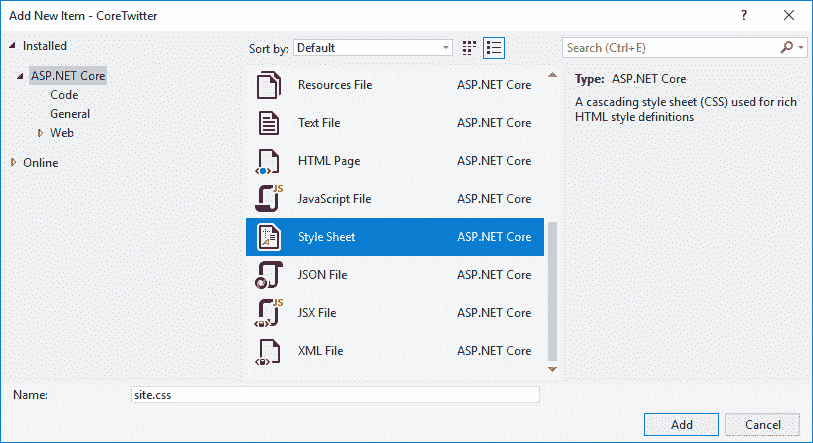

1.  删除`site.css`文件的内容，并向其中添加以下`css`：

```cs
blockquote.twitter-tweet { 
    display: inline-block; 
    font-family: "Helvetica Neue", Roboto, "Segoe UI", Calibri,   
    sans-serif; 
    font-size: 12px; 
    font-weight: bold; 
    line-height: 16px; 
    border-color: #eee #ddd #bbb; 
    border-radius: 5px; 
    border-style: solid; 
    border-width: 1px; 
    box-shadow: 0 1px 3px rgba(0, 0, 0, 0.15); 
    margin: 10px 5px; 
    padding: 0 16px 16px 16px; 
    max-width: 468px; 
} 

blockquote.twitter-tweet p { 
    font-size: 16px; 
    font-weight: normal; 
    line-height: 20px; 
} 

blockquote.twitter-tweet a { 
    color: inherit; 
    font-weight: normal; 
    text-decoration: none; 
    outline: 0 none; 
} 

blockquote.twitter-tweet a:hover, 
blockquote.twitter-tweet a:focus { 
    text-decoration: underline; 
} 
```

为了补充这一部分，你可以阅读 Twitter 开发者文档[`dev.twitter.com/web/overview/css`](https://dev.twitter.com/web/overview/css)，并查看 CSS 概述。

# 添加控制器

现在我们需要开始添加我们的控制器。控制器负责响应应用程序发出的请求：

1.  在`Controllers`文件夹中，添加另一个名为`TwitterController`的控制器。这个控制器将负责撰写新推文和发布新推文。稍后我们会回到这个控制器。现在，只需创建这个类。添加完后，你的解决方案应该如下所示：


1.  默认情况下，当你创建 ASP.NET Core MVC 应用程序时，Visual Studio 会为你添加`HomeController`。打开`HomeController`并查看类的内容。确保在`HomeController`类中添加以下`using`语句：

```cs
using Tweetinvi; 
using Tweetinvi.Models; 
```

1.  我想要做的第一件事是让我的应用程序设置存储在`appsettings.json`文件中在我的类中可用。你会记得我们修改了`Startup.cs`文件，在启动时注入了这些设置。

1.  在`HomeController`类的顶部，添加以下代码行：

```cs
CoreTwitterConfiguration config;
```

1.  在那行的下面，添加一个构造函数，将`CoreTwitterConfiguration`类引入我们控制器的范围内：

```cs
public HomeController(IOptions<CoreTwitterConfiguration> options) 
{ 
    config = options.Value; 
} 
```

1.  现在我们将修改`HomeController`类的`Index`动作，检查我们是否有访问令牌或访问密钥。你会记得我们之前在`appsettings.json`文件中将它们留空。如果它们为空，那么用户就没有被认证，然后我们将重定向用户到`HomeController`的`AuthenticateTwitter`动作：

```cs
public IActionResult Index() 
{ 
    try 
    { 
        if (String.IsNullOrWhiteSpace(config.TwitterConfiguration.Access_Token)) throw new Tweetinvi.Exceptions.TwitterNullCredentialsException(); 
        if (String.IsNullOrWhiteSpace(config.TwitterConfiguration.Access_Secret)) throw new Tweetinvi.Exceptions.TwitterNullCredentialsException();                                 
    } 
    catch (Tweetinvi.Exceptions.TwitterNullCredentialsException ex) 
    { 
        return RedirectToAction("AuthenticateTwitter"); 
    } 
    catch (Exception ex) 
    { 
        // Redirect to your error page here 
    } 
    return View(); 
} 
```

1.  现在让我们去创建`AuthenticateTwitter`动作。为此，我们需要消费者凭证，这些凭证我们之前从 Twitter 应用管理控制台复制并添加到我们的`appsettings.json`文件中。然后我们使这些设置在整个应用程序中可用；现在我们可以看到将设置存储在`appsettings.json`文件中的好处。

1.  在`AuthenticateTwitter`动作中，我们只需将`ConsumerCredentials`对象传递给消费者密钥和消费者密钥。当我们验证通过时，我们将路由到`ValidateOAuth`动作，接下来我们将创建这个动作：

```cs
public IActionResult AuthenticateTwitter() 
{ 
    var coreTwitterCredentials = new ConsumerCredentials( 
        config.TwitterConfiguration.Consumer_Key 
        , config.TwitterConfiguration.Consumer_Secret); 
         var callbackURL = "http://" + Request.Host.Value + 
         "/Home/ValidateOAuth"; 
    var authenticationContext = 
    AuthFlow.InitAuthentication(coreTwitterCredentials,  
    callbackURL); 

    return new 
    RedirectResult(authenticationContext.AuthorizationURL); 
} 
```

1.  在这一点上，我们已经被重定向到 Twitter 进行 OAuth 用户认证，并通过回调 URL 被重定向回我们的 ASP.NET Core 应用程序。代码非常简单。需要注意的一点是`userCredentials.AccessToken`和`userCredentials.AccessTokenSecret`是从`userCredentials`对象返回的。我只是把它们添加到了应用程序的配置设置中，但实际上，你可能希望将它们存储在其他地方（比如加密在数据库中）。这样就可以让你在不需要每次都进行身份验证的情况下使用应用程序：

```cs
public ActionResult ValidateOAuth() 
{ 
    if (Request.Query.ContainsKey("oauth_verifier") &&  
    Request.Query.ContainsKey("authorization_id")) 
    { 
        var oauthVerifier = Request.Query["oauth_verifier"]; 
        var authId = Request.Query["authorization_id"]; 

        var userCredentials =  
        AuthFlow.CreateCredentialsFromVerifierCode(oauthVerifier, 
        authId); 
        var twitterUser = 
        Tweetinvi.User.GetAuthenticatedUser(userCredentials); 

        config.TwitterConfiguration.Access_Token = 
        userCredentials.AccessToken; 
        config.TwitterConfiguration.Access_Secret = 
        userCredentials.AccessTokenSecret; 

        ViewBag.User = twitterUser; 
    } 

    return View(); 
} 
```

由于这个控制器动作被称为`ValidateOAuth`，让我们去创建一个同名的视图，这样我们就可以路由到一个页面，通知用户他们已经成功认证。

# 创建视图

视图和传统的 HTML 页面并不是同一回事。ASP.NET Core MVC 应用程序的页面由视图表示。正如我之前指出的，控制器接收请求并处理该请求。控制器可以将你重定向到另一个控制器动作，但也可以返回一个视图：

1.  现在我们将继续创建应用程序的视图。展开`Home`文件夹，并在`Home`文件夹中添加一个名为`ValidateOAuth`的新视图。只需创建这些视图而不需要模型：

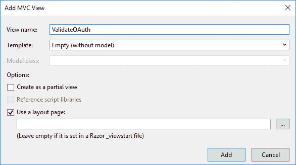

1.  在`Views`文件夹中添加一个名为`Twitter`的文件夹，并在该文件夹中添加两个视图，分别为`ComposeTweet`和`HomeTimeline`。完成后，你的应用程序将如下所示：


1.  打开`ValidateOAuth`视图，并向其添加以下标记：

```cs
@if (@ViewBag.User != null) 
{ 
    <h2>OAuth Authentication Succeeded!</h2> 
    <p>Welcome to the CoreTwitter Demo Application <b>@ViewBag.User.Name</b>. You have been successfully authenticated via Twitter.</p> 

    <div class="row"> 
        <div class="col-md-4"> 
            <h2>Go to your home feed</h2> 
            <p> 
                See what's new on your home feed. 
            </p> 
            <p> 
                <a class="btn btn-default" 
                 href="/Home/GetHomeTimeline">Home &raquo;</a> 
            </p> 
        </div> 
    </div> 
} 
else 
{ 
    <h2>OAuth Authentication failed!</h2> 
    <p>An error occurred during authentication. Try <a  
     href="/Home/TwitterAuth">authenticating</a> again.</p> 
} 
```

看一下标记，你会注意到它只是通知用户认证状态。如果经过认证，用户可以查看他们的主页动态，这是他们在 Twitter 上关注的人的所有推文。

我想在这里提醒你一下，我是如何在`Home`控制器上调用`GetHomeTimeline`动作的。你会在按钮链接中看到以下`href`存在：

```cs
href="/Home/GetHomeTimeline" 
```

这是将用户路由到控制器上的一个方法。稍后，我会向你展示另一种更好的方法来做到这一点。

因此，我们允许成功认证的用户通过点击`Home`链接查看他们关注的人的推文。这调用了一个名为`GetHomeTimeline`的动作。让我们去修改`HomeController`以添加这个动作。

# 修改 HomeController

回到`HomeController`，并添加另一个名为`GetHomeTimeline`的动作。然后，使用用户凭据查找经过认证用户的主页时间线推文。用户凭据包括以下内容：

+   消费者密钥

+   消费者密钥

+   访问令牌

+   访问密钥

你会注意到这些都来自`CoreTwitterConfiguration`对象。推特动态只包括在设置中设置的限制。我将我的设置为`10`，所以这应该只包含 10 条推文。对于动态中的每条推文，我提取推文的 URL 并将其添加到`TweetItem`类型的列表中（我们之前创建的类）。如果一切顺利，我就路由到`HomeTimeline`视图。

将以下代码添加到你的`GetHomeTimeline`动作中。

你应该在引用名为`homeView`的`TwitterViewModel`实例的代码上得到一个错误。我们接下来将纠正这个错误。

你的动作应该如下所示：

```cs
public IActionResult GetHomeTimeline() 
{ 
    TwitterViewModel homeView = new TwitterViewModel(); 

    try 
    { 
        if (config.TwitterConfiguration.Access_Token == null) throw new 
        Tweetinvi.Exceptions.TwitterNullCredentialsException(); 
        if (config.TwitterConfiguration.Access_Secret == null) throw 
        new Tweetinvi.Exceptions.TwitterNullCredentialsException(); 

        var userCredentials = Auth.CreateCredentials( 
            config.TwitterConfiguration.Consumer_Key 
            , config.TwitterConfiguration.Consumer_Secret 
            , config.TwitterConfiguration.Access_Token 
            , config.TwitterConfiguration.Access_Secret); 

        var authenticatedUser =  
        Tweetinvi.User.GetAuthenticatedUser(userCredentials); 

        IEnumerable<ITweet> twitterFeed = 
        authenticatedUser.GetHomeTimeline(config.TweetFeedLimit); 

        List<TweetItem> tweets = new List<TweetItem>(); 
        foreach(ITweet tweet in twitterFeed) 
        { 
            TweetItem tweetItem = new TweetItem();                     

            tweetItem.Url = tweet.Url; 
            tweets.Add(tweetItem); 
        } 

        homeView.HomeTimelineTweets = tweets;                 
    } 
    catch (Tweetinvi.Exceptions.TwitterNullCredentialsException ex) 
    { 
        return RedirectToAction("AuthenticateTwitter"); 
    } 
    catch (Exception ex) 
    { 

    } 

    return View("Views/Twitter/HomeTimeline.cshtml", homeView); 
} 
```

如前所述，你会看到一些错误。这是因为我们还没有一个名为`TwitterViewModel`的模型。让我们接下来创建它。

# 创建 TwitterViewModel 类

`TwitterViewModel`类只是一个非常简单的类，它将`TweetItem`的集合作为名为`HomeTimelineTweets`的属性。

让我们首先向我们的项目添加一个模型：

1.  右键单击`Models`文件夹，然后在文件夹中添加一个名为`TwitterViewModel`的类。然后，将以下代码添加到该类中：

```cs
public class TwitterViewModel 
{ 
    public List<TweetItem> HomeTimelineTweets { get; set; } 
}
```

1.  还要向类添加`using`语句`using CoreTwitter.Classes;`。

这就是所需要的一切。当你稍后扩展`TweetItem`类（如果你决定为这个应用添加功能），这个模型将负责将这些信息传递给我们的视图，以便在 Razor 中使用。

# 创建 HomeTimeline 视图

回想一下我们之前创建的`HomeController`动作`GetHomeTimeline`，你会记得我们路由到一个名为`HomeTimeline`的视图。我们已经创建了这个视图，但现在我们需要向它添加一些逻辑来呈现我们主页时间线中的推文。

因此，我们需要为我们的主页时间线添加一个视图，接下来我们将添加：

1.  打开`HomeTimeline.cshtml`文件，并向视图添加以下标记：

```cs
@model TwitterViewModel 
@{ 
    ViewBag.Title = "What's happening?"; 
} 

<h2>Home - Timeline</h2> 

<div class="row"> 
    <div class="col-md-8"> 

        @foreach (var tweet in Model.HomeTimelineTweets) 
        { 
            <blockquote class="twitter-tweet"> 
                <p lang="en" dir="ltr"> 
                    <a href="@Html.DisplayFor(m => tweet.Url)"></a> 
            </blockquote> 
            <script async 
             src="img/widgets.js" 
             charset="utf-8"></script> 
        } 
    </div> 

    <div class="col-md-4"> 
        <h2>Tweet</h2> 
        <p>What's happening?</p> 
        <a class="btn btn-default" asp-controller="Twitter" asp-
         action="ComposeTweet">Tweet &raquo;</a>   
    </div> 

</div> 
```

你需要注意的第一件事是文件顶部的`@model TwitterViewModel`语句。这允许我们在视图中使用模型中存储的值。我们的视图循环遍历模型的`HomeTimelineTweets`属性中包含的推文集合，并构建一个要在页面上显示的推文列表。

我想要引起你的注意的另一件事是 Tweet 链接上的标签助手`asp-controller`和`asp-action`。这是一种更干净的方式，可以路由到特定控制器上的特定动作（而不是像我们之前在`ValidateOAuth`视图中看到的那样在`href`中进行路由）。

最后，你可能想知道`widgets.js`引用是做什么的。好吧，我不想自己设计我的推文样式，所以我决定让 Twitter 为我做。

1.  要获取标记，请转到[`publish.twitter.com/#`](https://publish.twitter.com/#)：

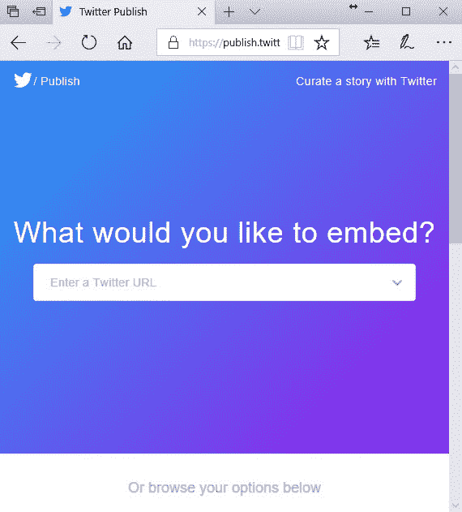

1.  从下拉菜单中，选择“A Tweet”作为您要嵌入的内容的选项，如下所示：


1.  然后您将获得一些示例代码供使用。 您只需单击复制代码按钮。 这只是我做的方式，但欢迎您在不经过此步骤的情况下自行前进：


1.  您复制的代码可能看起来像以下内容：

```cs
<blockquote class="twitter-tweet"> 
        <p lang="en" dir="ltr">Sunsets don't get much better than 
         this one over <a href="https://twitter.com/GrandTetonNPS?
         ref_src=twsrc%5Etfw">@GrandTetonNPS</a>. 
        <a href="https://twitter.com/hashtag/nature?
         src=hash&amp;ref_src=twsrc%5Etfw">#nature</a> 
        <a href="https://twitter.com/hashtag/sunset?
         src=hash&amp;ref_src=twsrc%5Etfw">#sunset</a> 
    <a href="http://t.co/YuKy2rcjyU">pic.twitter.com/YuKy2rcjyU</a> 
            </p>&mdash; US Department of the Interior (@Interior) 
    <a href="https://twitter.com/Interior/status/463440424141459456?
     ref_src=twsrc%5Etfw">May 5, 2014</a> 
    </blockquote> 
    <script async src="img/widgets.js" 
     charset="utf-8"></script> 
```

1.  将其修改为根据您的页面进行样式设置。 在循环中执行此操作，以便您可以单独输出所有推文。 您最终应该得到的代码只是：

```cs
<blockquote class="twitter-tweet"> 
    <p lang="en" dir="ltr"> 
        <a href="@Html.DisplayFor(m => tweet.Url)"></a> 
</blockquote> 
<script async src="img/widgets.js" charset="utf-8"></script> 
```

它只包含指向 Twitter URL 的链接。

# 修改 TwitterController 类

现在我们来到了允许用户发送推文的部分。

打开`TwitterController`类并添加名为`ComposeTweet`和`PublishTweet`的两个操作。 `TwitterController`类非常简单。 它只包含以下代码：

```cs
public class TwitterController : Controller 
{         
    public IActionResult ComposeTweet() 
    {             
        return View(); 
    } 

    public IActionResult PublishTweet(string tweetText) 
    { 
        var firstTweet = Tweet.PublishTweet(tweetText); 

        return RedirectToAction("GetHomeTimeline", "Home");  
    } 
} 
```

`ComposeTweet`操作只是简单地将用户返回到一个视图，他们可以在其中撰写推文。 您会记得我们之前创建了`ComposeTweet`视图。 `PublishTweet`操作同样简单。 它获取我要发推文的文本，并将其传递给`Tweetinvi.Tweet`类的`PublishTweet`方法。 之后，将重定向回主页时间线，我们期望在那里看到我们刚刚创建的推文。

我们需要完成的最后一个任务是修改`ComposeTweet`视图。 让我们接下来做这件事。

# 完成-ComposeTweet 视图

最后，我们使用`ComposeTweet`视图。

打开`ComposeTweet`视图并向视图添加以下标记：

```cs
@{ 
    ViewData["Title"] = "Tweet"; 
} 

<h2>Tweet</h2> 

<form method="post" asp-controller="Twitter" asp-action="PublishTweet"> 

    <div class="form-group"> 
        <label for="tweet">Tweet : </label> 
        <input type="text" class="form-control" name="tweetText" 
         id="tweetText" value="What's happening?" /> 
    </div> 

    <div class="form-group"> 
        <input type="submit" class="btn btn-success" /> 
    </div> 
</form> 
```

您会注意到，我再次使用标签助手来定义要调用的控制器和操作。 只是这一次，我是在`<form>`标签上这样做的。 在这一点上，您已经准备好首次运行应用程序了。 让我们看看它的表现如何。

# 运行 CoreTwitter 应用程序

对项目进行构建，以确保一切构建正确。 然后，开始调试您的应用程序。 因为您尚未经过身份验证，所以将被重定向到 Twitter 进行身份验证。

这是一个您肯定习惯看到的页面：

1.  许多网络应用程序使用 OAuth 进行身份验证。 要继续，请点击授权应用程序按钮，如下所示：

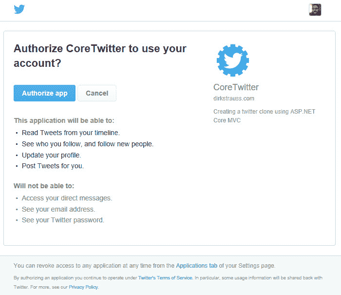

1.  然后您将看到一个重定向通知。 这可能需要一些时间来重定向您。 这完全取决于您的互联网连接速度：

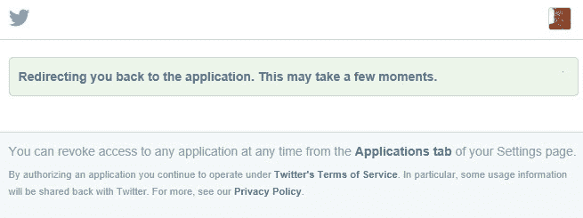

1.  一旦您被重定向到您的 CoreTwitter 应用程序，您将看到 OAuth 身份验证成功的消息。 之后，点击主页按钮转到“主页时间线”：


1.  `HomeController`开始执行，因为调用`GetHomeTimeline`操作并将您重定向到`HomeTimeline`视图。 您将在页面中看到加载的推文：


1.  当您滚动浏览推文时（记住，我只返回了 10 条），您将看到包含视频的推文，当您单击播放按钮时将播放：

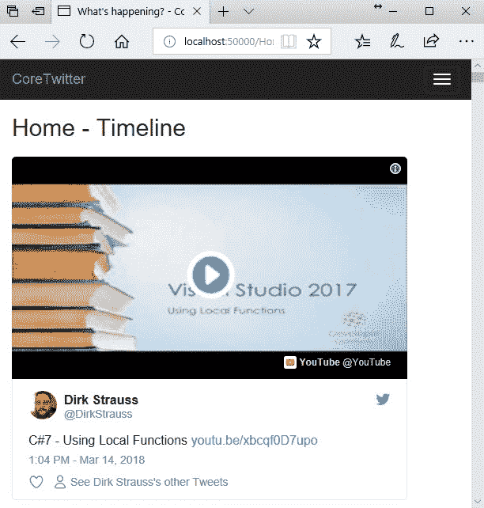

1.  富媒体推文还会为您提供文章预览，并且您还将在时间轴中看到普通的文本推文。 所有链接都是完全活动的，您可以单击它们以查看文章：

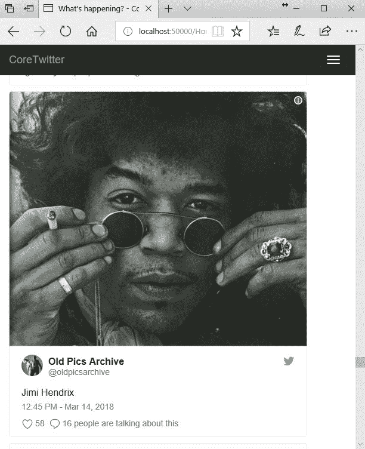

1.  如果您向右滚动到时间轴的底部（这应该在顶部，但我告诉过您我不打算在 UI 周围做太多事情），您将看到“推文”按钮。 单击它以撰写新推文：


1.  在`ComposeTweet`视图上，您可以在推文字段中输入任何内容，然后单击“提交查询”按钮：

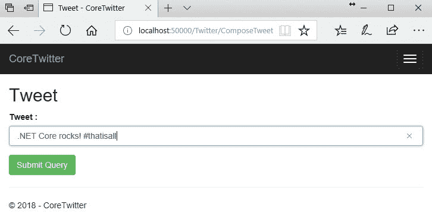

1.  你的推文随后会发布在 Twitter 上，然后你会被重定向到主页时间轴，你会在那里看到你新发布的推文：


而且，仅仅为了这个缘故，你可以通过访问以下 URL 来查看特定的推文：[`twitter.com/DirkStrauss/status/973002561979547650`](https://twitter.com/DirkStrauss/status/973002561979547650)。

是的，现在真的是凌晨 3:07。`#就是这样`。

# 总结

回顾这一章，我们确实做了很多。我鼓励你去 GitHub 上查看代码，以及在[`github.com/linvi/tweetinvi`](https://github.com/linvi/tweetinvi)上可用的 Tweetinvi 文档。在这一章中，我们看到了如何在 Twitter 的应用程序管理控制台上注册我们的应用程序。我们看到我们可以通过使用一个叫做 Tweetinvi 的 NuGet 包，轻松地为我们的 ASP.NET Core MVC 应用程序添加 Twitter 功能。我们看了一下路由，以及控制器、模型、视图，以及将设置存储在`appsetting.json`文件中。

我们能够通过 OAuth 进行身份验证，并从我们的主页时间轴中读取最后 10 条推文。最后，我们能够发布一条推文，并在我们的主页时间轴中查看它。

在我们的 Twitter 克隆应用程序中仍然有很多工作可以做。我希望你觉得这是一个有趣的章节，并希望你继续努力改进它，以适应你特定的工作流程，并使其成为你自己的。

在下一章中，我们将看一下 Docker 以及作为软件开发人员对你意味着什么。我们还将看到如何在 Docker 容器中运行我们的 ASP.NET Core MVC 应用程序。
