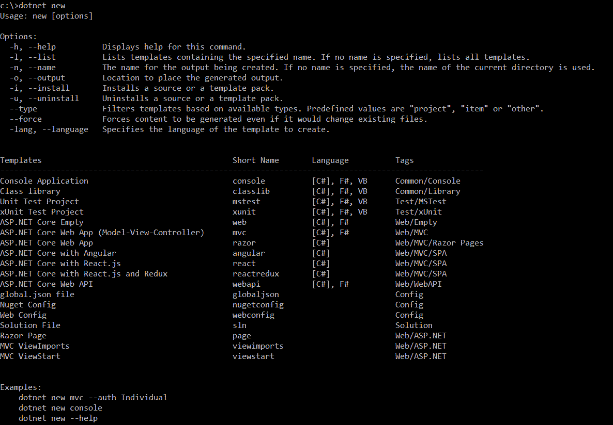
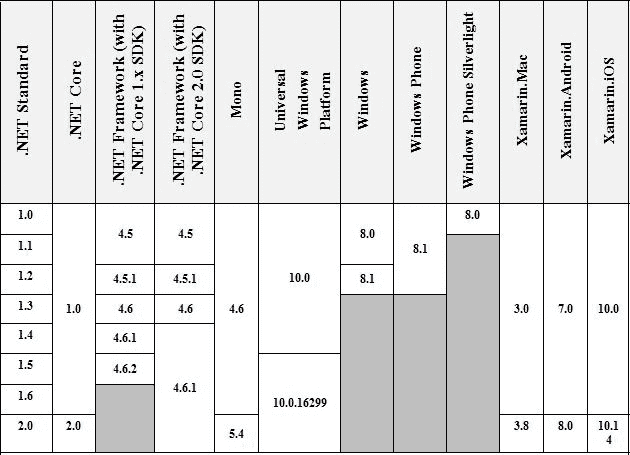
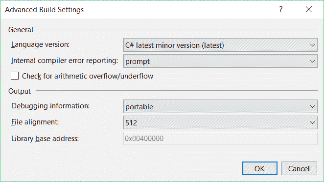
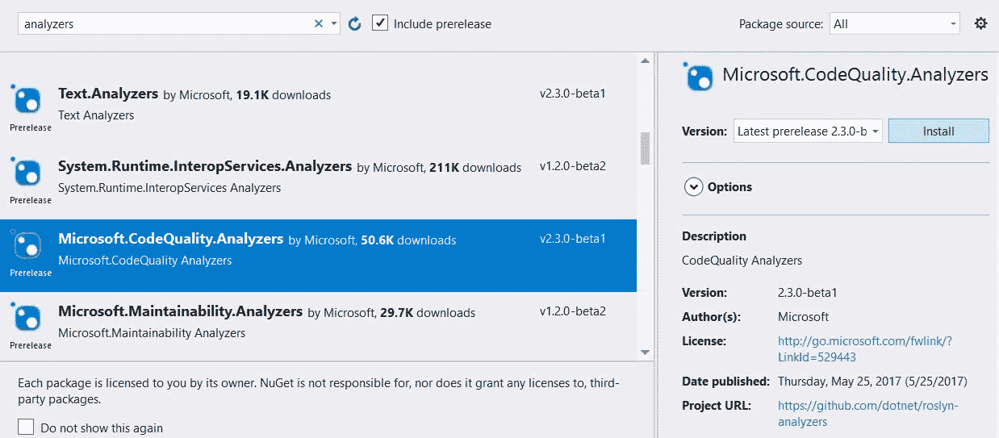
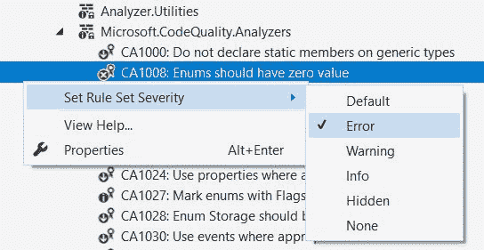

# 第一章：.NET Core 2 和 C# 7 中的新功能是什么？

.NET Core 是微软的一个跨平台开发平台，由微软和 GitHub 社区维护。由于其性能和平台可移植性，它是开发社区中最新兴和最受欢迎的框架。它面向每个开发人员，可以为包括 Web、云、移动、嵌入式和物联网在内的任何平台开发任何应用程序。

使用.NET Core，我们可以使用 C#、F#，现在也可以使用 VB.NET。然而，C#是开发人员中最广泛使用的语言。

在本章中，您将学习以下主题：

+   .NET Core 2.0 中的性能改进

+   从.NET Core 1.x 升级到 2.0 的路径

+   .NET 标准 2.0

+   ASP.NET Core 2.0 带来了什么

+   C# 7.0 中的新功能

# .NET 的演变

在 2002 年初，当微软首次推出.NET Framework 时，它面向的是那些在经典 ASP 或 VB 6 平台上工作的开发人员，因为他们没有任何引人注目的框架来开发企业级应用程序。随着.NET Framework 的发布，开发人员有了一个可以选择 VB.NET、C#和 F#中的任何一种语言来开发应用程序的平台。无论选择哪种语言，代码都是可互操作的，开发人员可以创建一个 VB.NET 项目并在其 C#或 F#项目中引用它，反之亦然。

.NET Framework 的核心组件包括**公共语言运行时**（**CLR**）、**框架类库**（**FCL**）、**基类库**（**BCL**）和一组应用程序模型。随着新版本的.NET Framework 的推出，新功能和补丁也随之引入，这些新功能和补丁通常随着 Windows 的新版本一起发布，开发人员必须等待一年左右才能获得这些改进。微软的每个团队都在不同的应用程序模型上工作，每个团队都必须等待新框架发布的日期来移植他们的修复和改进。当时主要使用的应用程序模型是 Windows Forms 和 Web Forms。

当 Web Forms 首次推出时，它是一个突破，吸引了既在经典 ASP 上工作的 Web 开发人员，又在 Visual Basic 6.0 上工作的桌面应用程序开发人员。开发人员体验非常吸引人，并提供了一套不错的控件，可以轻松地拖放到屏幕上，然后跟随它们的事件和属性，这些属性可以通过视图文件（`.aspx`）或代码后台文件进行设置。后来，微软推出了**模型视图控制器**（**MVC**）应用程序模型，实现了关注点分离设计原则，因此视图、模型和控制器是独立的实体。视图是呈现模型的用户界面，模型代表业务实体并保存数据，控制器处理请求并更新模型，并将其注入视图。MVC 是一个突破，让开发人员编写更干净的代码，并使用模型绑定将其模型与 HTML 控件绑定。随着时间的推移，添加了更多功能，核心.NET web 程序集`System.Web`变得非常庞大，包含了许多包和 API，这些 API 并不总是在每种类型的应用程序中都有用。然而，随着.NET 的推出，引入了一些重大变化，`System.Web`被拆分为 NuGet 包，可以根据需求引用和单独添加。

.NET Core（代号.NET vNext）首次在 2014 年推出，以下是使用.NET Core 的核心优势：

| **好处** | **描述** |
| --- | --- |
| **跨平台** | .NET Core 可以在 Windows、Linux 和 macOS 上运行 |
| **主机无关** | .NET Core 在服务器端不依赖于 IIS，并且可以作为控制台应用程序进行自托管，并且可以通过反向代理选项与成熟的服务器（如 IIS、Apache 等）结合使用，还有两个轻量级服务器*Kestrel*和*WebListener* |
| **模块化** | 以 NuGet 包的形式发布 |
| **开源** | 整个源代码通过.NET 基金会作为开源发布 |
| **CLI 工具** | 用于从命令行创建、构建和运行项目的命令行工具 |

.NET Core 是一个跨平台的开源框架，实现了.NET 标准。它提供了一个称为.NET Core CLR 的运行时，框架类库，即称为*CoreFX*的基本库，以及类似于.NET Framework 的 API，但依赖较少（对其他程序集的依赖较少）：


.NET Core 提供了以下灵活的部署选项：

+   **基于框架的部署（FDD）**：需要在机器上安装.NET Core SDK

+   **自包含部署（SCD）**：在机器上不需要安装.NET Core SDK，.NET Core CLR 和框架类库是应用程序包的一部分

要安装.NET Core 2.0，您可以转到以下链接[`www.microsoft.com/net/core`](https://www.microsoft.com/net/core)并查看在 Windows、Linux、MAC 和 Docker 上安装的选项。

# .NET Core 2.0 的新改进

最新版本的.NET Core，2.0，带来了许多改进。.NET Core 2.0 是有史以来最快的版本，可以在包括各种 Linux 发行版、macOS（操作系统）和 Windows 在内的多个平台上运行。

Distros 代表 Linux 发行版（通常缩写为 distro），它是基于 Linux 内核和通常是一个软件集合的操作系统。

# 性能改进

.NET Core 更加健壮和高性能，并且由于其开源，微软团队与其他社区成员正在带来更多的改进。

以下是.NET Core 2.0 的改进部分。

# .NET Core 中的 RyuJIT 编译器

RyuJIT 是一种全新的 JIT 编译器，是对**即时**（**JIT**）编译器的完全重写，并生成更高效的本机机器代码。它比之前的 64 位编译器快两倍，并提供 30%更快的编译速度。最初，它只在 X64 架构上运行，但现在也支持 X86，开发人员可以同时为 X64 和 X86 使用 RyuJIT 编译器。.NET Core 2.0 在 X86 和 X64 平台上都使用 RyuJIT。

# 基于配置文件的优化

**基于配置文件的优化**（**PGO**）是 C++编译器使用的一种编译技术，用于生成优化的代码。它适用于运行时和 JIT 的内部本机编译组件。它分两步进行编译，如下所示：

1.  它记录了有关代码执行的信息。

1.  根据这些信息，它生成了更好的代码。

以下图表描述了代码的编译生命周期：


在.NET Core 1.1 中，微软已经为 Windows X64 架构发布了 PGO，但在.NET Core 2.0 中，这已经添加到了 Windows X64 和 X86 架构。此外，根据观察结果，实际的启动时间主要由 Windows 的`coreclr.dll`和`clrjit.dll`占用。而在 Linux 上，分别是`libcoreclr.so`和`libclrjit.so`。

将 RyuJIT 与旧的 JIT 编译器 JIT32 进行比较，RyuJIT 在代码生成方面更加高效。JIT32 的启动时间比 RyuJIT 快，但代码效率不高。为了克服 RyuJIT 编译器的初始启动时间，微软使用了 PGO，这使得性能接近 JIT32 的性能，并在启动时实现了高效的代码和性能。

对于 Linux，每个发行版的编译器工具链都不同，微软正在开发一个单独的 Linux 版本的.NET，该版本使用适用于所有发行版的 PGO 优化。

# 简化的打包

使用.NET Core，我们可以从 NuGet 向我们的项目添加库。所有框架和第三方库都可以作为 NuGet 包添加。对于引用了许多库的大型应用程序，逐个添加每个库是一个繁琐的过程。.NET Core 2.0 简化了打包机制，并引入了可以作为一个单一包添加的元包，其中包含了所有与之链接的程序集。

例如，如果你想在.NET Core 2.0 中使用 ASP.NET Core，你只需要添加一个单一的包`Microsoft.AspNetCore.All`，使用 NuGet。

以下是将此包安装到你的项目中的命令：

```cs
Install-Package Microsoft.AspNetCore.All -Version 2.0.0
```

# 从.NET Core 1.x 升级到 2.0 的路径

.NET Core 2.0 带来了许多改进，这是人们想要将他们现有的.NET Core 应用程序从 1.x 迁移到 2.0 的主要原因。然而，在这个主题中，我们将通过一个清单来确保平稳迁移。

# 1\. 安装.NET Core 2.0

首先，在你的机器上安装.NET Core 2.0 SDK。它将在你的机器上安装最新的程序集，这将帮助你执行后续步骤。

# 2\. 升级 TargetFramework

这是最重要的一步，也是需要在.NET Core 项目文件中升级不同版本的地方。由于我们知道，对于`.csproj`类型，我们没有`project.json`，要修改框架和其他依赖项，我们可以使用任何 Visual Studio 编辑器编辑现有项目并修改 XML。

需要更改的 XML 节点是`TargetFramework`。对于.NET Core 2.0，我们需要将`TargetFramework`修改为`netcoreapp2.0`，如下所示：

```cs
<TargetFramework>netcoreapp2.0</TargetFramework>
```

接下来，你可以开始构建项目，这将升级.NET Core 依赖项到 2.0。然而，仍然有一些可能仍然引用旧版本的依赖项，需要使用 NuGet 包管理器显式地进行升级。

# 3\. 更新.NET Core SDK 版本

如果你的项目中已经添加了`global.json`，你需要将 SDK 版本更新为`2.0.0`，如下所示：

```cs
{ 
  "sdk": { 
    "version": "2.0.0" 
  } 
} 
```

# 4\. 更新.NET Core CLI

.NET Core CLI 也是你的.NET Core 项目文件中的一个重要部分。在迁移时，你需要将`DotNetCliToolReference`的版本升级到`2.0.0`，如下所示：

```cs
<ItemGroup> 
  <DotNetCliToolReference Include=
  "Microsoft.VisualStudio.Web.CodeGeneration.Tools" Version="2.0.0" /> 
</ItemGroup> 
```

根据你是否使用 Entity Framework Core、User Secrets 等，可能会添加更多的工具。你需要更新它们的版本。

# ASP.NET Core Identity 的更改

ASP.NET Core Identity 模型已经进行了一些改进和更改。一些类已经更名，你可以在以下链接找到它们：[`docs.microsoft.com/en-us/aspnet/core/migration`](http://docs.microsoft.com/en-us/aspnet/core/migration)。

# 探索.NET Core CLI 和新项目模板

**命令行界面**（**CLI**）是一个非常流行的工具，几乎在所有流行的框架中都有，比如 Yeoman Generator，Angular 等。它使开发人员能够执行命令来创建、构建和运行项目，恢复包等。

.NET CLI 提供了一组命令，可以从命令行界面执行，用于创建.NET Core 项目，恢复依赖项，构建和运行项目。在幕后，Visual Studio 2015/2017 和 Visual Studio Code 甚至使用这个工具来执行开发人员从他们的 IDE 中采取的不同选项；例如，要使用.NET CLI 创建一个新项目，我们可以运行以下命令：

```cs
dotnet new 
```

它将列出可用的模板和在创建项目时可以使用的简称。

以下是包含可以使用.NET Core CLI 创建/脚手架项目的项目模板列表的屏幕截图：



通过运行以下命令，将创建一个新的 ASP.NET Core MVC 应用程序：

```cs
dotnet new mvc 
```

以下屏幕截图显示了在运行上述命令后新的 MVC 项目的配置。它在运行命令的同一目录中创建项目并恢复所有依赖项：


要安装 .NET Core CLI 工具集，有一些适用于 Windows、Linux 和 macOS 的本机安装程序可用。这些安装程序可以在您的计算机上安装和设置 .NET CLI 工具，并且开发人员可以从 CLI 运行命令。

以下是提供在 .NET Core CLI 中的命令及其描述的列表：

| **命令** | **描述** | **示例** |
| --- | --- | --- |
| `new` | 根据所选模板创建新项目 | `dotnet new razor` |
| `restore` | 恢复项目中定义的所有依赖项 | `dotnet restore` |
| `build` | 构建项目 | `dotnet build` |
| `run` | 在不进行任何额外编译的情况下运行源代码 | `dotnet run` |
| `publish` | 将应用程序文件打包到一个文件夹中以进行部署 | `dotnet publish` |
| `test` | 用于执行单元测试 | `dotnet test` |
| `vstest` | 执行指定文件中的单元测试 | `dotnet vstest [<TEST_FILE_NAMES>]` |
| `pack` | 将代码打包成 NuGet 包 | `dotnet pack` |
| `migrate` | 将 .NET Core 预览 2 迁移到 .NET Core 1.0 | `dotnet migrate` |
| `clean` | 清理项目的输出 | `dotnet clean` |
| `sln` | 修改 .NET Core 解决方案 | `dotnet sln` |
| `help` | 显示可通过 .NET CLI 执行的命令列表 | `dotnet help` |
| `store` | 将指定的程序集存储在运行时包存储中 | `dotnet store` |

以下是一些项目级别的命令，可用于添加新的 NuGet 包、删除现有的 NuGet 包、列出引用等： 

| **命令** | **描述** | **示例** |
| --- | --- | --- |
| `add package` | 向项目添加包引用 | `dotnet add package Newtonsoft.Json` |
| `remove package` | 从项目中删除包引用 | `dotnet remove package Newtonsoft.Json` |
| `add reference` | 向项目添加项目引用 | `dotnet add reference chapter1/proj1.csproj` |
| `remove reference` | 从项目中删除项目引用 | `dotnet remove reference chapter1/proj1.csproj` |
| `list reference` | 列出项目中的所有项目引用 | `dotnet list reference` |

以下是一些常见的 Entity Framework Core 命令，可用于添加迁移、删除迁移、更新数据库等。

| **命令** | **描述** | **示例** |
| --- | --- | --- |
| `dotnet ef migrations add` | 添加新的迁移 | `dotnet ef migrations add Initial`- `Initial` 是迁移的名称 |
| `dotnet ef migrations list` | 列出可用的迁移 | `dotnet ef migrations list` |
| `dotnet ef migrations remove` | 删除特定的迁移 | `dotnet ef migrations remove Initial`- `Initial` 是迁移的名称 |
| `dotnet ef database update` | 将数据库更新到指定的迁移 | `dotnet ef database update Initial`- `Initial` 是迁移的名称 |
| `dotnet ef database drop` | 删除数据库 | `dotnet ef database drop` |

以下是一些服务器级别的命令，可用于从机器中删除 NuGet 包的实际源存储库，将 NuGet 包添加到机器上的实际源存储库等：

| **命令** | **描述** | **示例** |
| --- | --- | --- |
| `nuget delete` | 从服务器中删除包 | `dotnet nuget delete Microsoft.AspNetCore.App 2.0` |
| `nuget push` | 将包推送到服务器并发布 | `dotnet nuget push foo.nupkg` |
| `nuget locals` | 列出本地 NuGet 资源 | `dotnet nuget locals -l all` |
| `msbuild` | 构建项目及其所有依赖项 | `dotnet msbuild` |
| `dotnet install script` | 用于安装 .NET CLI 工具和共享运行时的脚本 | `./dotnet-install.ps1 -Channel LTS` |

要运行上述命令，我们可以使用命令行中的名为 dotnet 的工具，并指定实际命令，然后跟随其后。当安装了.NET Core CLI 时，它会设置到 Windows OS 的 PATH 变量中，并且可以从任何文件夹访问。因此，例如，如果您在项目根文件夹中并且想要恢复依赖关系，您只需调用以下命令，它将恢复在项目文件中定义的所有依赖项：

```cs
dotnet restore 
```

上述命令将开始恢复项目文件中定义的依赖项或特定于项目的工具。工具和依赖项的恢复是并行进行的：


我们还可以使用`--packages`参数设置包的恢复路径。但是，如果未指定此参数，则使用系统用户文件夹下的`.nuget/packages`文件夹。例如，Windows OS 的默认 NuGet 文件夹是`{systemdrive}:\Users\{user}\.nuget\packages`，Linux OS 分别是`/home/{user}`。

# 理解.NET 标准

在.NET 生态系统中，有许多运行时。我们有.NET Framework，这是安装在 Windows 操作系统上的全面机器范围框架，并为**Windows Presentation Foundation**（**WPF**）、Windows Forms 和 ASP.NET 提供应用程序模型。然后，我们有.NET Core，它针对跨平台操作系统和设备，并提供 ASP.NET Core、**Universal Windows Platform**（**UWP**）和针对 Xamarin 应用程序的 Mono 运行时，开发人员可以使用 Mono 运行时在 Xamarin 上开发应用程序，并在 iOS、Android 和 Windows OS 上运行。

以下图表描述了.NET 标准库如何提供.NET Framework、.NET Core 和 Xamarin 的公共构建块的抽象：


所有这些运行时都实现了一个名为.NET 标准的接口，其中.NET 标准是每个运行时的.NET API 规范的实现。这使得您的代码可以在不同的平台上移植。这意味着为一个运行时创建的代码也可以由另一个运行时执行。.NET 标准是我们之前使用的**可移植类库**（**PCL**）的下一代。简而言之，PCL 是一个针对.NET 的一个或多个框架的类库。创建 PCL 时，我们可以选择需要使用该库的目标框架，并最小化程序集并仅使用所有框架通用的程序集。

.NET 标准不是可以下载或安装的 API 或可执行文件。它是一个规范，定义了每个平台实现的 API。每个运行时版本实现特定的.NET 标准版本。以下表格显示了每个平台实现的.NET 标准版本：



我们可以看到.NET Core 2.0 实现了.NET 标准 2.0，而.NET Framework 4.5 实现了.NET 标准 1.1。因此，例如，如果我们有一个在.NET Framework 4.5 上开发的类库，这可以很容易地添加到.NET Core 项目中，因为它实现了一个更高版本的.NET 标准。另一方面，如果我们想要将.NET Core 程序集引用到.NET Framework 4.5 中，我们可以通过将.NET 标准版本更改为 1.1 来实现，而无需重新编译和构建我们的项目。

正如我们所了解的，.NET 标准的基本理念是在不同的运行时之间共享代码，但它与 PCL 的不同之处如下所示：

| **可移植类库（PCL）** | **.NET 标准** |
| --- | --- |
| 代表着微软平台并针对一组有限的平台 | 不受平台限制 |
| API 由您所针对的平台定义 | 精选的 API 集 |
| 它们不是线性版本 | 线性版本 |

.NET 标准也映射到 PCL，因此如果您有一个现有的 PCL 库，希望将其转换为.NET 标准，可以参考以下表格：

| **PCL 配置文件** | **.NET 标准** | **PCL 平台** |
| --- | --- | --- |
| 7 | 1.1 | .NET Framework 4.5, Windows 8 |
| 31 | 1.0 | Windows 8.1, Windows Phone Silverlight 8.1 |
| 32 | 1.2 | Windows 8.1, Windows Phone 8.1 |
| 44 | 1.2 | .NET Framework 4.5.1, Windows 8.1 |
| 49 | 1.0 | .NET Framework 4.5, Windows Phone Silverlight 8 |
| 78 | 1.0 | .NET Framework 4.5, Windows 8, Windows Phone Silverlight 8 |
| 84 | 1.0 | Windows Phone 8.1, Windows Phone Silverlight 8.1 |
| 111 | 1.1 | .NET Framework 4.5, Windows 8, Windows Phone 8.1 |
| 151 | 1.2 | .NET Framework 4.5.1, Windows 8.1, Windows Phone 8.1 |
| 157 | 1.0 | Windows 8.1, Windows Phone 8.1, Windows Phone Silverlight 8.1 |
| 259 | 1.0 | .NET Framework 4.5, Windows 8, Windows Phone 8.1, Windows Phone Silverlight 8 |

考虑到前面的表格，如果我们有一个 PCL，它的目标是.NET Framework 4.5.1、Windows 8.1 和 Windows Phone 8.1，PCL 配置文件设置为 151，它可以转换为版本 1.2 的.NET 标准库。

# .NET 标准的版本控制

与 PCL 不同，每个.NET 标准版本都是线性版本化的，并包含了以前版本的 API 等。一旦版本发布，它就被冻结，不能更改，并且应用程序可以轻松地针对该版本。

以下图表是.NET 标准版本化的表示。版本越高，可用的 API 就越多，而版本越低，可用的平台就越多：


# .NET 标准 2.0 的新改进

.NET Core 2.0 针对.NET 标准 2.0，并提供了两个主要好处。这包括从上一个版本提供的 API 数量的增加以及其兼容模式，我们将在本章进一步讨论。

# .NET 标准 2.0 中的更多 API

.NET 标准 2.0 中添加了更多的 API，数量几乎是上一个.NET 标准 1.0 的两倍。此外，像 DataSet、集合、二进制序列化、XML 模式等 API 现在都是.NET 标准 2.0 规范的一部分。这增加了从.NET Framework 到.NET Core 的代码可移植性。

以下图表描述了每个领域中添加的 API 的分类视图：


# 兼容模式

尽管已经将超过 33K 个 API 添加到.NET 标准 2.0 中，但许多 NuGet 包仍然针对.NET Framework，并且将它们移动到.NET 标准是不可能的，因为它们的依赖项仍然没有针对.NET 标准。但是，使用.NET 标准 2.0，我们仍然可以添加显示警告但不会阻止将这些包添加到我们的.NET 标准库中的包。

在底层，.NET 标准 2.0 使用兼容性 shim，解决了第三方库的兼容性问题，并且在引用这些库时变得更加容易。在 CLR 世界中，程序集的标识是类型标识的一部分。这意味着当我们在.NET Framework 中说`System.Object`时，我们引用的是`[mscorlib]System.Object`，而在.NET 标准中，我们引用的是`[netstandard]System.Object`，因此，如果我们引用任何.NET Framework 的程序集，它不能轻松地在.NET 标准上运行，因此会出现兼容性问题。为了解决这个问题，他们使用了类型转发，提供了一个虚假的`mscorlib`程序集，该程序集将所有类型转发到.NET 标准实现。

以下是.NET Framework 库如何在任何.NET 标准实现中使用类型转发方法运行的表示：


另一方面，如果我们有一个.NET Framework 库，并且想要引用一个.NET 标准库，它将添加`netstandard`虚假程序集，并通过使用.NET Framework 实现对所有类型进行类型转发：


为了抑制警告，我们可以为特定的 NuGet 包添加 NU1701，这些包的依赖项没有针对.NET 标准。

# 创建.NET 标准库

要创建.NET Standard 库，可以使用 Visual Studio 或.NET Core CLI 工具集。从 Visual Studio，我们只需点击如下屏幕截图中显示的.NET Standard 选项，然后选择 Class Library (.NET Standard)。

创建.NET Standard 库后，我们可以将其引用到任何项目，并根据需要更改版本，具体取决于我们要引用的平台。版本可以从属性面板更改，如下面的屏幕截图所示：


# ASP.NET Core 2.0 的新功能

ASP.NET Core 是开发云就绪和企业 Web 应用程序的最强大平台之一，可跨平台运行。Microsoft 在 ASP.NET Core 2.0 中添加了许多功能，包括新的项目模板、Razor 页面、简化的 Application Insights 配置、连接池等。

以下是 ASP.NET Core 2.0 的一些新改进。

# ASP.NET Core Razor 页面

ASP.NET Core 中引入了基于 Razor 语法的页面。现在，开发人员可以在 HTML 上开发应用程序并写语法，而无需放置控制器。相反，有一个代码后台文件，可以在其中处理其他事件和逻辑。后端页面类继承自`PageModel`类，可以使用 Razor 语法中的`Model`对象访问其成员变量和方法。以下是一个简单的示例，其中包含在`code-behind`类中定义的`GetTitle`方法，并在视图页面中使用：

```cs
public class IndexModel : PageModel 
{ 
  public string GetTitle() => "Home Page"; 
}
```

这是`Index.cshtml`文件，通过调用`GetCurrentDate`方法显示日期：

```cs
@page 
@model IndexModel 
@{ 
  ViewData["Title"] = Model.GetTitle(); 
} 
```

# 发布时自动页面和视图编译

在发布 ASP.NET Core Razor 页面项目时，所有视图都会编译成一个单一的程序集，发布文件夹的大小相对较小。如果我们希望在发布过程中生成视图和所有`.cshtml`文件，我们必须添加一个条目，如下所示：


# Razor 对 C# 7.1 的支持

现在，我们可以使用 C# 7.1 功能，如推断的元组名称、泛型模式匹配和表达式。为了添加此支持，我们必须在项目文件中添加一个 XML 标记，如下所示：

```cs
<LangVersion>latest</LangVersion>
```

# Application Insights 的简化配置

使用 ASP.NET Core 2.0，您可以通过单击一次启用 Application Insights。用户只需右键单击项目，然后单击添加 | Application Insights Telemetry，然后通过简单的向导即可启用 Application Insights。这允许您监视应用程序，并提供来自 Azure Application Insights 的完整诊断信息。

我们还可以从 Visual Studio 2017 IDE 的 Application Insights 搜索窗口查看完整的遥测，并从 Application Insights 趋势监视趋势。这两个窗口都可以从 View | Other Windows 菜单中打开。

# 在 Entity Framework Core 2.0 中池化连接

最近发布的 Entity Framework Core 2.0 中，我们可以使用`Startup`类中的`AddDbContextPool`方法来池化连接。正如我们已经知道的，在 ASP.NET Core 中，我们必须使用**依赖注入**（**DI**）在`Startup`类的`ConfigureServices`方法中添加`DbContext`对象，并在控制器中使用时，会注入`DbContext`对象的新实例。为了优化性能，Microsoft 提供了这个`AddDbContextPool`方法，它首先检查可用的数据库上下文实例，并在需要时注入它。另一方面，如果数据库上下文实例不可用，则会创建并注入一个新实例。

以下代码显示了如何在`Startup`类的`ConfigureServices`方法中添加`AddDbContext`：

```cs
services.AddDbContextPool<SampleDbContext>( 
  options => options.UseSqlServer(connectionString)); 
```

Owned Types、表拆分、数据库标量函数映射和字符串插值等功能已添加了一些新特性，您可以从以下链接中查看：[`docs.microsoft.com/en-us/ef/core/what-is-new/`](https://docs.microsoft.com/en-us/ef/core/what-is-new/)。

# C# 7.0 中的新功能

C#是.NET 生态系统中最流行的语言，最早是在 2002 年与.NET Framework 一起推出的。C#的当前稳定版本是 7。以下图表显示了 C# 7.0 的进展情况以及不同年份引入的版本：


以下是 C# 7.0 引入的一些新功能：

+   元组

+   模式匹配

+   引用返回

+   异常作为表达式

+   本地函数

+   输出变量文字

+   异步主函数

# 元组

元组解决了从方法返回多个值的问题。传统上，我们可以使用引用变量的输出变量，如果它们从调用方法中修改，则值会更改。但是，没有参数，存在一些限制，例如不能与`async`方法一起使用，不建议与外部服务一起使用。

元组具有以下特点：

+   它们是值类型。

+   它们可以转换为其他元组。

+   元组元素是公共且可变的。

元组表示为`System.Tuple<T>`，其中`T`可以是任何类型。以下示例显示了如何使用元组与方法以及如何调用值：

```cs
static void Main(string[] args) 
{ 
  var person = GetPerson(); 
  Console.WriteLine($"ID : {person.Item1}, 
  Name : {person.Item2}, DOB : {person.Item3}");       
} 
static (int, string, DateTime) GetPerson() 
{ 
  return (1, "Mark Thompson", new DateTime(1970, 8, 11)); 
}
```

正如你可能已经注意到的，项目是动态命名的，第一个项目被命名为`Item1`，第二个为`Item2`，依此类推。另一方面，我们也可以为项目命名，以便调用方了解值，这可以通过为元组中的每个参数添加参数名来实现，如下所示：

```cs
static void Main(string[] args) 
{ 
  var person = GetPerson(); 
  Console.WriteLine($"ID : {person.id}, Name : {person.name}, 
  DOB : {person.dob}");  
} 
static (int id, string name, DateTime dob) GetPerson() 
{ 
  return (1, "Mark Thompson", new DateTime(1970, 8, 11)); 
} 
```

要了解更多关于元组的信息，请查看以下链接：

[`docs.microsoft.com/en-us/dotnet/csharp/tuples`](https://docs.microsoft.com/en-us/dotnet/csharp/tuples)。

# 模式

模式匹配是执行语法测试的过程，以验证值是否与某个模型匹配。有三种类型的模式：

+   常量模式。

+   类型模式。

+   Var 模式。

# 常量模式

常量模式是检查常量值的简单模式。考虑以下示例：如果`Person`对象为空，则返回并退出`body`方法。

`Person`类如下：

```cs
class Person 
{ 
  public int ID { set; get; } 
  public string Name { get; set; } 

  public DateTime DOB { get; set; } 
} 
Person class that contains three properties, namely ID, Name, and DOB (Date of Birth).
```

以下语句检查`person`对象是否具有空常量值，并在对象为空时返回它：

```cs
if (person is null) return; 
```

# 类型模式

类型模式可用于对象，以验证它是否与类型匹配或是否满足基于指定条件的表达式。假设我们需要检查`PersonID`是否为`int`；将该`ID`分配给另一个变量`i`，并在程序中使用它，否则`return`：

```cs
if (!(person.ID is int i)) return; 

Console.WriteLine($"Person ID is {i}"); 
```

我们还可以使用多个逻辑运算符来评估更多条件，如下所示：

```cs
if (!(person.ID is int i) && !(person.DOB>DateTime.Now.AddYears(-20))) return;   
```

前面的语句检查`Person.ID`是否为空，以及人是否年龄大于 20。

# Var 模式

var 模式检查`var`是否等于某种类型。以下示例显示了如何使用`var`模式来检查类型并打印`Type`名称：

```cs
if (person is var Person) Console.WriteLine($"It is a person object and type is {person.GetType()}"); 
```

要了解更多关于模式的信息，可以参考以下链接：[`docs.microsoft.com/en-us/dotnet/csharp/whats-new/csharp-7#pattern-matching`](https://docs.microsoft.com/en-us/dotnet/csharp/whats-new/csharp-7#pattern-matching)。

# 引用返回

引用返回允许方法返回一个对象的引用，而不是它的值。我们可以通过在方法签名中的类型前添加`ref`关键字来定义引用返回值，并在方法本身返回对象时返回它。

以下是允许引用返回的方法的签名：

```cs
public ref Person GetPersonInformation(int ID); 

Following is the implementation of the GetPersonInformation method that uses the ref keyword while returning the person's object.  

Person _person; 
public ref Person GetPersonInformation(int ID) 
{ 
  _person = CallPersonHttpService(); 
  return ref _person; 
} 
```

# 表达式体成员扩展

表达式体成员是在 C# 6.0 中引入的，其中方法的语法表达可以以更简单的方式编写。在 C# 7.0 中，我们可以在构造函数、析构函数、异常等中使用此功能。

以下示例显示了如何使用表达式体成员简化构造函数和析构函数的语法表达：

```cs
public class PersonManager 
{ 
  //Member Variable 
  Person _person; 

  //Constructor 
  PersonManager(Person person) => _person = person; 

  //Destructor 
  ~PersonManager() => _person = null; 
} 
```

有了属性，我们还可以简化语法表达，以下是如何编写的基本示例：

```cs
private String _name; 
public String Name 
{ 
  get => _name; 
  set => _name = value; 
} 
```

我们还可以使用表达式体语法表达异常并简化表达式，如下所示：

```cs
private String _name; 
public String Name 
{ 
  get => _name; 
  set => _name = value ?? throw new ArgumentNullException(); 
} 
```

在前面的例子中，如果值为 null，将抛出一个新的`ArgumentNullException`。

# 创建局部函数

在函数内部创建的函数称为局部函数。这些主要用于定义必须在函数本身范围内的辅助函数。以下示例显示了如何通过编写局部函数并递归调用它来获得数字的阶乘：

```cs
static void Main(string[] args) 
{ 
  Console.WriteLine(ExecuteFactorial(4));          
} 

static long ExecuteFactorial(int n) 
{ 
  if (n < 0) throw new ArgumentException("Must be non negative", 
  nameof(n)); 

  else return CheckFactorial(n); 

  long CheckFactorial(int x) 
  { 
    if (x == 0) return 1; 
    return x * CheckFactorial(x - 1); 
  } 
}
```

# 输出变量

在 C# 7.0 中，当使用`out`变量时，我们可以编写更清晰的代码。正如我们所知，要使用`out`变量，我们必须首先声明它们。通过新的语言增强，我们现在可以只需将`out`作为前缀写入，并指定我们需要将该值分配给的变量的名称。

为了澄清这个概念，我们首先看一下传统的方法，如下所示：

```cs
public void GetPerson() 
{ 
  int year; 
  int month; 
  int day; 
  GetPersonDOB(out year, out month, out day); 
} 

public void GetPersonDOB(out int year, out int month, out int day ) 
{ 
  year = 1980; 
  month = 11; 
  day = 3; 
} 
```

在 C# 7.0 中，我们可以简化前面的`GetPerson`方法，如下所示：

```cs
public void GetPerson() 
{ 
  GetPersonDOB(out int year, out int month, out int day); 
} 
```

# Async Main

正如我们已经知道的，在.NET Framework 中，`Main`方法是应用程序/程序由操作系统执行的主要入口点。例如，在 ASP.NET Core 中，`Program.cs`是定义`Main`方法的主要类，它创建一个`WebHost`对象，运行 Kestrel 服务器，并根据`Startup`类中配置的方式加载 HTTP 管道。

在以前的 C#版本中，`Main`方法具有以下签名：

```cs
public static void Main();
public static void Main(string[] args);
public static int Main();
public static int Main(string[] args);
```

在 C# 7.0 中，我们可以使用 Async Main 执行异步操作。Async/Await 功能最初是在.NET Framework 4.5 中发布的，以便异步执行方法。如今，许多 API 提供了 Async/Await 方法来执行异步操作。

以下是使用 C# 7.1 添加的`Main`方法的一些附加签名：

```cs
public static Task Main();
public static Task Main(string[] args);
public static Task<int> Main();
public static Task<int> Main(string[] args);
```

由于前面的异步签名，现在我们可以从`Main`入口点本身调用`async`方法，并使用 await 执行异步操作。以下是调用`RunAsync`方法而不是`Run`的 ASP.NET Core 的简单示例：

```cs
public class Program
{
  public static async Task Main(string[] args)
  {
    await BuildWebHost(args).RunAsync();
  }
  public static IWebHost BuildWebHost(string[] args) =>
    WebHost.CreateDefaultBuilder(args)
    .UseStartup<Startup>()
    .Build();
}
```

Async Main 是 C# 7.1 的一个特性，要在 Visual Studio 2017 中启用此功能，可以转到项目属性，单击 Advance 按钮，并将语言版本设置为 C#最新的次要版本（latest），如下所示：



# 编写优质代码

对于每个性能高效的应用程序，代码质量都起着重要作用。正如我们已经知道的，Visual Studio 是开发.NET 应用程序最流行的**集成开发环境**（**IDE**），由于 Roslyn（.NET 编译器 SDK）公开了编译器平台作为 API，许多功能已经被引入，不仅扩展了 Visual Studio 的功能，而且增强了开发体验。

实时静态代码分析是 Visual Studio 中可以用于开发.NET 应用程序的核心功能之一，它在编写代码时提供代码分析。由于此功能使用 Roslyn API，许多其他第三方公司也引入了一套可以使用的分析器。我们还可以为特定需求开发自己的分析器，这并不是一个非常复杂的过程。让我们快速介绍一下如何在我们的.NET Core 项目中使用实时静态代码分析以及它如何通过分析代码并提供警告、错误和潜在修复来增强开发体验。

我们可以将分析器作为 NuGet 包添加。在 NuGet.org 上有许多可用的分析器，一旦我们将任何分析器添加到我们的项目中，它就会在项目的*Dependencies*部分添加一个新的*Analyzer*节点。然后我们可以自定义规则，抑制警告或错误等。

让我们在我们的.NET Core 项目中从 Visual Studio 添加一个新的分析器。如果你不知道要添加哪个分析器，你可以在 NuGet 包管理器窗口中只需输入*analyzers*，它就会为你列出所有的分析器。我们将只添加`Microsoft.CodeQuality.Analyzers`分析器，其中包含一些不错的规则：



一旦选择的分析器被添加，一个新的`Analyzers`节点将被添加到我们的项目中：


在上图中，我们可以看到`Analyzers`节点已经添加了三个节点，要查看/管理规则，我们可以展开子节点`Microsoft.CodeQuality.Analyzers`和`Microsoft.CodeQuality.CSharp.Analyzers`，如下所示：


此外，我们还可以通过右键单击规则并选择严重性来更改规则的严重性，如下所示：



在上图中，规则 CA1008 指出枚举应该有一个值为零。让我们测试一下，看看它是如何工作的。

创建一个简单的`Enum`并指定值，如下所示：

```cs
public enum Status 
{ 
  Create =1, 
  Update =2, 
  Delete =3, 
} 
```

当你编写这段代码时，你会立刻看到以下错误，并提供潜在的修复方法：


最后，这是我们可以应用的修复方法，错误将消失：


你还可以使用一个名为 Roslynator 的流行的 Visual Studio 扩展程序，可以从以下链接下载。它包含了超过 190 个适用于基于 C#的项目的分析器和重构工具：[`marketplace.visualstudio.com/items?itemName=josefpihrt.Roslynator`](https://marketplace.visualstudio.com/items?itemName=josefpihrt.Roslynator)。

实时静态代码分析是一个很棒的功能，它帮助开发人员编写符合最佳准则和实践的高质量代码。

# 总结

在本章中，我们了解了.NET Core 框架以及.NET Core 2.0 引入的一些新改进。我们还研究了 C# 7 的新功能，以及如何编写更干净的代码和简化语法表达。最后，我们讨论了编写高质量代码的主题，以及如何利用 Visual Studio 2017 提供的代码分析功能来添加满足我们需求的分析器到我们的项目中。下一章将是一个关于.NET Core 的深入章节，将涵盖.NET Core 内部和性能改进的主题。
