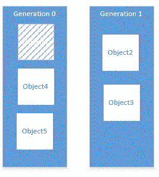

# 第二章：理解.NET Core 内部和性能测量

在开发应用程序架构时，了解.NET 框架的内部工作原理对确保应用程序性能的质量起着至关重要的作用。在本章中，我们将重点关注.NET Core 的内部机制，这可以帮助我们为任何应用程序编写高质量的代码和架构。本章将涵盖.NET Core 内部的一些核心概念，包括编译过程、垃圾回收和 Framework Class Library（FCL）。我们将通过使用 BenchmarkDotNet 工具来完成本章，该工具主要用于测量代码性能，并且强烈推荐用于在应用程序中对代码片段进行基准测试。

在本章中，您将学习以下主题：

+   .NET Core 内部

+   利用 CPU 的多个核心实现高性能

+   发布构建如何提高性能

+   对.NET Core 2.0 应用程序进行基准测试

# .NET Core 内部

.NET Core 包含两个核心组件——运行时 CoreCLR 和基类库 CoreFX。在本节中，我们将涵盖以下主题：

+   CoreFX

+   CoreCLR

+   理解 MSIL、CLI、CTS 和 CLS

+   CLR 的工作原理

+   从编译到执行——在幕后

+   垃圾回收

+   .NET 本机和 JIT 编译

# CoreFX

CoreFX 是.NET Core 一组库的代号。它包含所有以 Microsoft.*或 System.*开头的库，并包含集合、I/O、字符串操作、反射、安全性等许多功能。

CoreFX 是与运行时无关的，可以在任何平台上运行，而不管它支持哪些 API。

要了解每个程序集的更多信息，您可以参考.NET Core 源浏览器[`source.dot.net`](https://source.dot.net)。

# CoreCLR

CoreCLR 为.NET Core 应用程序提供了公共语言运行时环境，并管理完整应用程序生命周期的执行。在程序运行时，它执行各种操作。CoreCLR 的操作包括内存分配、垃圾回收、异常处理、类型安全、线程管理和安全性。

.NET Core 的运行时提供与.NET Framework 相同的垃圾回收（GC）和一个新的更优化的即时编译器（JIT），代号为 RyuJIT。当.NET Core 首次发布时，它仅支持 64 位平台，但随着.NET Core 2.0 的发布，现在也可用于 32 位平台。但是，32 位版本仅受 Windows 操作系统支持。

# 理解 MSIL、CLI、CTS 和 CLS

当我们构建项目时，代码被编译为中间语言（IL），也称为 Microsoft 中间语言（MSIL）。MSIL 符合公共语言基础设施（CLI），其中 CLI 是提供公共类型系统和语言规范的标准，分别称为公共类型系统（CTS）和公共语言规范（CLS）。

CTS 提供了一个公共类型系统，并将语言特定类型编译为符合规范的数据类型。它将所有.NET 语言的数据类型标准化为语言互操作的公共数据类型。例如，如果代码是用 C#编写的，它将被转换为特定的 CTS。

假设我们有两个变量，在以下使用 C#定义的代码片段中：

```cs
class Program 
{ 
  static void Main(string[] args) 
  { 
    int minNo = 1; 
    long maxThroughput = 99999; 
  } 
} 
```

在编译时，编译器将 MSIL 生成为一个程序集，通过 CoreCLR 可执行 JIT 并将其转换为本机机器代码。请注意，`int`和`long`类型分别转换为`int32`和`int64`：


并不是每种语言都必须完全符合 CTS，并且它也可以支持 CTS 的较小印记。例如，当 VB.NET 首次发布在.NET Framework 中时，它只支持有符号整数数据类型，并且没有使用无符号整数的规定。通过.NET Framework 的后续版本，现在通过.NET Core 2.0，我们可以使用所有托管语言，如 C#、F#和 VB.NET，来开发应用程序，并轻松引用任何项目的程序集。

# CLR 的工作原理

CLR 实现为一组在进程中加载的内部库，并在应用程序进程的上下文中运行。在下图中，我们有两个运行的.NET Core 应用程序，名为 App1.exe 和 App2.exe*.*每个黑色方框代表应用程序进程地址空间，其中应用程序 App1.exe 和 App2.exe 并行运行其自己的 CLR 版本：


在打包.NET Core 应用程序时，我们可以将其发布为**依赖框架部署**（**FDDs**）或**自包含部署**（**SCDs**）。在 FDDs 中，发布的包不包含.NET Core 运行时，并期望目标/托管系统上存在.NET Core。对于 SCDs，所有组件，如.NET Core 运行时和.NET Core 库，都包含在发布的包中，并且目标系统上不需要.NET Core 安装。

要了解有关 FDDs 或 SCDs 的更多信息，请参阅[`docs.microsoft.com/en-us/dotnet/core/deploying/`](https://docs.microsoft.com/en-us/dotnet/core/deploying/)。

# 从编译到执行-底层

.NET Core 编译过程类似于.NET Framework 使用的过程。项目构建时，MSBuild 系统调用内部.NET CLI 命令，构建项目并生成程序集（`.dll`）或可执行文件（`.exe`）。该程序集包含包含程序集元数据的清单，包括版本号、文化、类型引用信息、有关引用程序集的信息以及程序集中其他文件及其关联的列表。该程序集清单存储在 MSIL 代码中或独立的**可移植可执行文件**（**PE**）中：


现在，当可执行文件运行时，会启动一个新进程并引导.NET Core 运行时，然后初始化执行环境，设置堆和线程池，并将程序集加载到进程地址空间中。根据程序，然后执行主入口方法（`Main`）并进行 JIT 编译。从这里开始，代码开始执行，对象开始在堆上分配内存，原始类型存储在堆栈上。对于每个方法，都会进行 JIT 编译，并生成本机机器代码。

当 JIT 编译完成，并在生成本机机器代码之前，它还执行一些验证。这些验证包括以下内容：

+   验证，在构建过程中生成了 MSIL

+   验证，在 JIT 编译过程中是否修改了任何代码或添加了新类型

+   验证，已生成了针对目标机器的优化代码

# 垃圾收集

CLR 最重要的功能之一是垃圾收集器。由于.NET Core 应用程序是托管应用程序，大部分垃圾收集都是由 CLR 自动完成的。CLR 有效地在内存中分配对象。CLR 不仅会定期调整虚拟内存资源，还会减少底层虚拟内存的碎片，使其在空间方面更加高效。

当程序运行时，对象开始在堆上分配内存，并且每个对象的地址都存储在堆栈上。这个过程会一直持续，直到内存达到最大限制。然后 GC 开始起作用，通过移除未使用的托管对象并分配新对象来回收内存。这一切都是由 GC 自动完成的，但也可以通过调用`GC.Collect`方法来调用 GC 执行垃圾收集。

让我们举一个例子，我们在`Main`方法中有一个名为`c`的`Car`对象。当函数被执行时，CLR 将`Car`对象分配到堆内存中，并且将指向堆上`Car`对象的引用存储在堆栈地址中。当垃圾收集器运行时，它会从堆中回收内存，并从堆栈中移除引用：


需要注意的一些重要点是，垃圾收集是由 GC 自动处理托管对象的，如果有任何非托管对象，比如数据库连接、I/O 操作等，它们需要显式地进行垃圾收集。否则，GC 会高效地处理托管对象，并确保应用程序在进行 GC 时不会出现性能下降。

# GC 中的世代

垃圾收集中有三种世代，分别为第零代、第一代和第二代。在本节中，我们将看一下世代的概念以及它对垃圾收集器性能的影响。

假设我们运行一个创建了三个名为 Object1、Object2 和 Object3 的对象的应用程序。这些对象将在第零代中分配内存：


现在，当垃圾收集器运行时（这是一个自动过程，除非你从代码中显式调用垃圾收集器），它会检查应用程序不需要的对象，并且在程序中没有引用。它将简单地移除这些对象。例如，如果 Object1 的范围在任何地方都没有被引用，那么这个对象的内存将被回收。然而，另外两个对象 Object1 和 Object2 仍然在程序中被引用，并且将被移动到第一代。

现在，假设我们创建了两个名为 Object4 和 Object5 的对象。我们将它们存储在第零代槽中，如下图所示：



当垃圾收集再次运行时，它将在第零代找到两个名为 Object4 和 Object5 的对象，并且在第一代找到两个名为 Object2 和 Object3 的对象。垃圾收集器将首先检查第零代中这些对象的引用，如果它们没有被应用程序使用，它们将被移除。对于第一代的对象也是一样。例如，如果 Object3 仍然被引用，它将被移动到第二代，而 Object2 将从第一代中被移除，如下图所示：


这种世代的概念实际上优化了 GC 的性能，存储在第二代的对象更有可能被存储更长时间。GC 执行更少的访问，而不是一遍又一遍地检查每个对象。第一代也是如此，它也不太可能回收空间，而不像第零代。

# .NET 本机和 JIT 编译

JIT 编译主要在运行时进行，它将 MSIL 代码转换为本机机器代码。这是代码第一次运行时进行的，比其后的运行需要更多的时间。如今，在.NET Core 中，我们正在为 CPU 资源和内存有限的移动设备和手持设备开发应用程序。目前，**Universal Windows Platform**（**UWP**）和 Xamarin 平台运行在.NET Core 上。使用这些平台，.NET Core 会在编译时或生成特定平台包时自动生成本机程序集。虽然这不需要在运行时进行 JIT 编译过程，但最终会增加应用程序的启动时间。这种本机编译是通过一个名为.NET Native 的组件完成的。

.NET Native 在语言特定编译器完成编译过程后开始编译过程。.NET Native 工具链读取语言编译器生成的 MSIL，并执行以下操作：

+   它从 MSIL 中消除了元数据。

+   在比较字段值时，它用静态本机代码替换依赖反射和元数据的代码。

+   它检查应用程序调用的代码，并只在最终程序集中包含那些代码。

+   它用不带 JIT 编译器的重构运行时替换了完整的 CLR。重构后的运行时与应用程序一起，并包含在名为`mrt100_app.dll`的程序集中。

# 利用 CPU 的多个核心实现高性能

如今，应用程序的性质更加注重连接性，有时它们的操作需要更长的执行时间。我们也知道，现在所有的计算机都配备了多核处理器，有效地利用这些核心可以提高应用程序的性能。诸如网络/IO 之类的操作存在延迟问题，应用程序的同步执行往往会导致长时间的等待。如果长时间运行的任务在单独的线程中或以异步方式执行，结果操作将花费更少的时间并提高响应性。另一个好处是性能，它实际上利用了处理器的多个核心并同时执行任务。在.NET 世界中，我们可以通过将任务分割成多个线程并使用经典的多线程编程 API，或者更简化和先进的模型，即**任务编程库**（**TPL**）来实现响应性和性能。TPL 现在在.NET Core 2.0 中得到支持，我们很快将探讨如何使用它在多个核心上执行任务。

TPL 编程模型是基于任务的。任务是工作单元，是正在进行的操作的对象表示。

可以通过编写以下代码来创建一个简单的任务：

```cs
static void Main(string[] args) 
{ 
  Task t = new Task(execute); 
  t.Start(); 
  t.Wait(); 
} 

private static void Execute() { 
  for (int i = 0; i < 100; i++) 
  { 
    Console.WriteLine(i); 
  } 
}
```

在上述代码中，任务可以使用`Task`对象进行初始化，其中`Execute`是在调用`Start`方法时执行的计算方法。`Start`方法告诉.NET Core 任务可以开始并立即返回。它将程序执行分成两个同时运行的线程。第一个线程是实际的应用程序线程，第二个线程是执行`execute`方法的线程。我们使用了`t.Wait`方法来等待工作任务在控制台上显示结果。否则，一旦程序退出`Main`方法下的代码块，应用程序就会结束。

并行编程的目标是有效地利用多个核心。例如，我们在单核处理器上运行上述代码。这两个线程将运行并共享同一个处理器。然而，如果相同的程序可以在多核处理器上运行，它可以通过分别利用每个核心在多个核心上运行，从而提高性能并实现真正的并行性：


与 TPL 不同，经典的`Thread`对象不能保证您的线程将在 CPU 的不同核心上运行。然而，使用 TPL，它保证每个线程将在不同的线程上运行，除非它达到了与 CPU 一样多的任务数量并共享核心。

要了解 TPL 提供的更多信息，请参阅

[`docs.microsoft.com/en-us/dotnet/standard/parallel-programming/task-parallel-library-tpl`](https://docs.microsoft.com/en-us/dotnet/standard/parallel-programming/task-parallel-library-tpl)。

# 发布构建如何提高性能

.NET 应用程序提供了发布和调试两种构建模式。调试模式在编写代码或解决错误时通常使用，而发布构建模式通常在打包应用程序以部署到生产服务器时使用。在开发部署包时，开发人员经常忘记将构建模式更新为发布构建，然后在部署应用程序时遇到性能问题：


以下表格显示了调试模式和发布模式之间的一些区别：

| 调试 | 发布 |
| --- | --- |
| 编译器不对代码进行优化 | 使用发布模式构建时，代码会被优化和缩小 |
| 在异常发生时捕获并抛出堆栈跟踪 | 不捕获堆栈跟踪 |
| 调试符号被存储 | 所有在#debug 指令下的代码和调试符号都被移除 |
| 源代码在运行时使用更多内存 | 源代码在运行时使用更少内存 |

# 对.NET Core 2.0 应用程序进行基准测试

基准测试应用程序是评估和比较与约定标准的工件的过程。要对.NET Core 2.0 应用程序代码进行基准测试，我们可以使用`BenchmarkDotNet`工具，该工具提供了一个非常简单的 API 来评估应用程序中代码的性能。通常，在微观级别进行基准测试，例如使用类和方法，不是一件容易的事，需要相当大的努力来衡量性能，而`BenchmarkDotNet`则完成了所有与基准测试解决方案相关的低级管道和复杂工作。

# 探索`BenchmarkDotNet`

在本节中，我们将探索`BenchmarkDotNet`并学习如何有效地使用它来衡量应用程序性能。

可以简单地通过 NuGet 包管理器控制台窗口或通过项目引用部分来安装`BenchmarkDotNet`。要安装`BenchmarkDotNet`，执行以下命令：

```cs
Install-Package BenchmarkDotNet 
```

上述命令从`NuGet.org`添加了一个`BenchmarkDotNet`包。

为了测试`BenchmarkDotNet`工具，我们将创建一个简单的类，其中包含两种方法来生成一个包含`10`个数字的斐波那契数列。斐波那契数列可以用多种方式实现，这就是为什么我们使用它来衡量哪个代码片段更快，更高效。

这是第一个以迭代方式生成斐波那契数列的方法：

```cs
public class TestBenchmark 
{ 
  int len= 10; 
  [Benchmark] 
  public  void Fibonacci() 
  { 
    int a = 0, b = 1, c = 0; 
    Console.Write("{0} {1}", a, b); 

    for (int i = 2; i < len; i++) 
    { 
      c = a + b; 
      Console.Write(" {0}", c); 
      a = b; 
      b = c; 
    } 
  } 
} 
```

这是另一种使用递归方法生成斐波那契数列的方法：

```cs

[Benchmark] 
public  void FibonacciRecursive() 
{ 
  int len= 10; 
  Fibonacci_Recursive(0, 1, 1, len); 
} 

private void Fibonacci_Recursive(int a, int b, int counter, int len) 
{ 
  if (counter <= len) 
  { 
    Console.Write("{0} ", a); 
    Fibonacci_Recursive(b, a + b, counter + 1, len); 
  } 
}  
```

请注意，斐波那契数列的两个主要方法都包含`Benchmark`属性。这实际上告诉`BenchmarkRunner`要测量包含此属性的方法。最后，我们可以从应用程序的主入口点调用`BenchmarkRunner`，该入口点测量性能并生成报告，如下面的代码所示：

```cs
static void Main(string[] args)
{
  BenchmarkRunner.Run<TestBenchmark>();
  Console.Read();
}
```

一旦运行基准测试，我们将得到以下报告：


此外，它还在运行`BenchmarkRunner`的应用程序的根文件夹中生成文件。这是包含有关`BenchmarkDotNet`版本和操作系统、处理器、频率、分辨率和计时器详细信息、.NET 版本（在我们的情况下是.NET Core SDK 2.0.0）、主机等信息的.html 文件：


表格包含四列。但是，我们可以添加更多列，默认情况下是可选的。我们也可以添加自定义列。Method 是包含基准属性的方法的名称，Mean 是所有测量所需的平均时间（us 为微秒），Error 是处理错误所需的时间，StdDev 是测量的标准偏差。

比较两种方法后，`FibonacciRecursive`方法更有效，因为平均值、错误和 StdDev 值都小于`Fibonacci`方法。

除了 HTML 之外，还创建了两个文件，一个**逗号分隔值**（CSV）文件和一个**Markdown 文档**（MD）文件，其中包含相同的信息。

# 它是如何工作的

基准为每个基准方法在运行时生成一个项目，并以发布模式构建它。它尝试多种组合来测量方法的性能，通过多次启动该方法。运行多个周期后，将生成报告，其中包含有关基准的文件和信息。

# 设置参数

在上一个示例中，我们只测试了一个值的方法。实际上，在测试企业应用程序时，我们希望使用不同的值来估计方法的性能。

```cs
TestBenchmark class:
```

```cs
public class TestBenchmark 
{ 

  [Params(10,20,30)] 
  public int Len { get; set; } 

  [Benchmark] 
  public  void Fibonacci() 
  { 
    int a = 0, b = 1, c = 0; 
    Console.Write("{0} {1}", a, b); 

    for (int i = 2; i < Len; i++) 
    { 
      c = a + b; 
      Console.Write(" {0}", c); 
      a = b; 
      b = c; 
    } 
  } 

  [Benchmark] 
  public  void FibonacciRecursive() 
  { 
    Fibonacci_Recursive(0, 1, 1, Len); 
  } 

  private void Fibonacci_Recursive(int a, int b, int counter, int len) 
  { 
    if (counter <= len) 
    { 
      Console.Write("{0} ", a); 
      Fibonacci_Recursive(b, a + b, counter + 1, len); 
    } 
  } 
}
```

运行 Benchmark 后，将生成以下报告：


# 使用 BenchmarkDotnet 进行内存诊断

使用`BenchmarkDotnet`，我们还可以诊断内存问题，并测量分配的字节数和垃圾回收。

可以使用`MemoryDiagnoser`属性在类级别实现。首先，让我们在上一个示例中创建的`TestBenchmark`类中添加`MemoryDiagnoser`属性：

```cs
[MemoryDiagnoser] 
public class TestBenchmark {} 
```

重新运行应用程序。现在它将收集其他内存分配和垃圾回收信息，并相应地生成日志：


在上表中，Gen 0 和 Gen 1 列分别包含每 1,000 次操作的特定代数的数量。如果值为 1，则表示在 1,000 次操作后进行了垃圾回收。但是，请注意，在第一行中，值为*0.1984*，这意味着在*198.4*秒后进行了垃圾回收，而该行的 Gen 1 中没有进行垃圾回收。Allocated 表示在调用该方法时分配的内存大小。它不包括 Stackalloc/堆本机分配。

# 添加配置

可以通过创建自定义类并从`ManualConfig`类继承来定义基准配置。以下是我们之前创建的`TestBenchmark`类的示例，其中包含一些基准方法：

```cs
[Config(typeof(Config))] 
public class TestBenchmark 
{ 
  private class Config : ManualConfig 
  { 
    // We will benchmark ONLY method with names with names (which 
    // contains "A" OR "1") AND (have length < 3) 
    public Config() 
    { 
      Add(new DisjunctionFilter( 
        new NameFilter(name => name.Contains("Recursive")) 
      ));  

    } 
  } 

  [Params(10,20,30)] 
  public int Len { get; set; } 

  [Benchmark] 
  public  void Fibonacci() 
  { 
    int a = 0, b = 1, c = 0; 
    Console.Write("{0} {1}", a, b); 

    for (int i = 2; i < Len; i++) 
    { 
      c = a + b; 
      Console.Write(" {0}", c); 
      a = b; 
      b = c; 
    } 
  } 

  [Benchmark] 
  public  void FibonacciRecursive() 
  { 
    Fibonacci_Recursive(0, 1, 1, Len); 
  } 

  private void Fibonacci_Recursive(int a, int b, int counter, int len) 
  { 
    if (counter <= len) 
    { 
      Console.Write("{0} ", a); 
      Fibonacci_Recursive(b, a + b, counter + 1, len); 
    } 
  } 
} 
```

在上述代码中，我们定义了`Config`类，该类继承了基准框架中提供的`ManualConfig`类。规则可以在`Config`构造函数内定义。在上面的示例中，有一个规则规定只有包含`Recursive`的基准方法才会被执行。在我们的情况下，只有一个方法`FibonacciRecursive`会被执行，并且我们将测量其性能。

另一种方法是通过流畅的 API，我们可以跳过创建`Config`类，并实现以下内容：

```cs
static void Main(string[] args) 
{ 
  var config = ManualConfig.Create(DefaultConfig.Instance); 
  config.Add(new DisjunctionFilter(new NameFilter(
    name => name.Contains("Recursive")))); 
  BenchmarkRunner.Run<TestBenchmark>(config); 
}
```

要了解有关`BenchmarkDotNet`的更多信息，请参阅[`benchmarkdotnet.org/Configs.htm`](http://benchmarkdotnet.org/Configs.htm)。

# 摘要

在本章中，我们已经了解了.NET Core 的核心概念，包括编译过程、垃圾回收、如何利用 CPU 的多个核心开发高性能的.NET Core 应用程序，以及使用发布构建发布应用程序。我们还探讨了用于代码优化的基准工具，并提供了特定于类对象的结果。

在下一章中，我们将学习.NET Core 中的多线程和并发编程。
