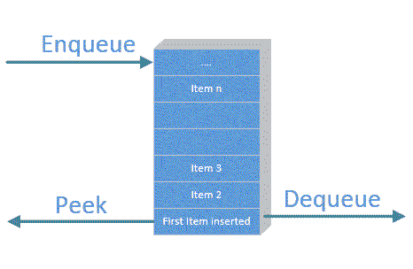
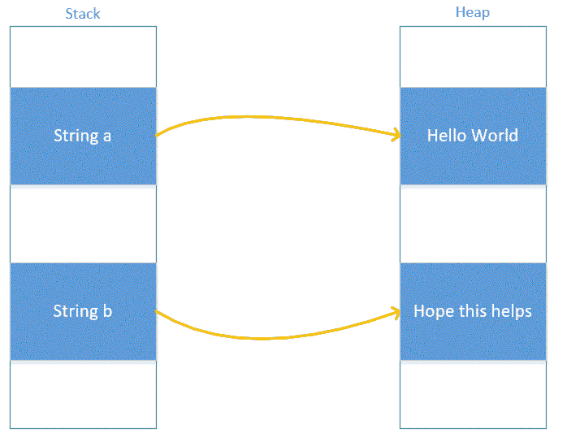

# 第四章：数据结构和在 C#中编写优化代码

数据结构是软件工程中存储数据的一种特定方式。它们在计算机中存储数据方面发挥着重要作用，以便可以有效地访问和修改数据，并为存储不同类型的数据提供不同的存储机制。有许多类型的数据结构，每种都设计用于存储一定类型的数据。在本章中，我们将详细介绍数据结构，并了解应该在特定场景中使用哪些数据结构以改善系统在数据存储和检索方面的性能。我们还将了解如何在 C#中编写优化代码以及什么主要因素可能影响性能，这有时在编写程序时被开发人员忽视。我们将学习一些可以用于优化性能有效的最佳实践。

在本章中，我们将涵盖以下主题：

+   数据结构是什么以及它们的特点

+   选择正确的数据结构进行性能优化

+   了解使用大 O 符号来衡量程序的性能和复杂性

+   在.NET Core 中编写代码时的最佳实践

# 什么是数据结构？

数据结构是一种以有效的方式存储和统一数据的方式。数据可以以多种方式存储。例如，我们可以有一个包含一些属性的`Person`对象，例如`PersonID`和`PersonName`，其中`PersonID`是整数类型，`PersonName`是*字符串*类型。这个`Person`对象将数据存储在内存中，并可以进一步用于将该记录保存在数据库中。另一个例子是名为`Countries`的*字符串*类型的*数组*，其中包含国家列表。我们可以使用`Countries`数组来检索国家名称并在程序中使用它。因此，存储数据的任何类型的对象都称为数据结构。所有原始类型，例如整数、字符串、字符和布尔值，都是不同类型的数据结构，而其他集合类型，例如`LinkedList`、`ArrayList`、`SortedList`等，也是可以以独特方式存储信息的数据结构类型。

以下图表说明了数据结构的类型及其相互关系：


数据结构有两种类型：*原始*和*非原始*类型。原始类型是包括*有符号整数*、*无符号整数*、*Unicode 字符*、*IEEE 浮点*、*高精度小数*、*布尔*、*枚举*、*结构*和*可空*值类型的值类型。

以下是 C#中可用的原始数据类型列表：

| **原始类型** |
| --- |
| 有符号整数 | `sbyte`, `short`, `int`, `long` |
| 无符号整数 | `byte`, `ushort`, `uint`, `ulong` |
| Unicode 字符 | `Char` |
| IEEE 浮点 | `float`, `double` |
| 高精度小数 | `Decimal` |
| 布尔 | `Bool` |
| 字符串 | `String` |
| 对象 | `System.Object` |

非原始类型是用户定义的类型，并进一步分类为线性或非线性类型。在线性数据结构中，元素按顺序组织，例如*数组*、*链表*和其他相关类型，而在非线性数据结构中，元素存储在没有任何顺序的情况下，例如*树*和*图*。

以下表格显示了.NET Core 中可用的线性和非线性类的类型：

| **非原始类型 - 线性数据结构** |
| --- |
| 数组 | `ArrayList`, `String[]`, `原始类型数组`, `List`, `Dictionary`, `Hashtable`, `BitArray` |
| 栈 | `Stack<T>`, `SortedSet<T>`, `SynchronizedCollection<T>` |
| 队列 | `Queue<T>` |
| 链表 | `LinkedList<T>` |

.NET Core 不提供任何非原始、非线性类型来表示树形或图形格式的数据。但是，我们可以开发自定义类来支持这些类型。

例如，以下是编写存储数据的自定义树的代码格式：

```cs
class TreeNode 
{ 
  public TreeNode(string text, object tag) 
  { 
    this.NodeText = text; 
    this.Tag = tag; 
    Nodes = new List<TreeNode>(); 
  } 
  public string NodeText { get; set; } 
  public Object Tag { get; set; } 
  public List<TreeNode> Nodes { get; set; } 
} 
```

最后，我们可以编写一个程序，在控制台窗口上填充树视图如下：

```cs
static void Main(string[] args) 
{ 
  TreeNode node = new TreeNode("Root", null); 
  node.Nodes.Add(new TreeNode("Child 1", null)); 
  node.Nodes[0].Nodes.Add(new TreeNode("Grand Child 1", null)); 
  node.Nodes.Add(new TreeNode("Child 1 (Sibling)", null)); 
  PopulateTreeView(node, ""); 
  Console.Read(); 
} 

//Populates a Tree View on Console 
static void PopulateTreeView(TreeNode node, string space) 
{ 
  Console.WriteLine(space + node.NodeText); 
  space = space + " "; 
  foreach(var treenode in node.Nodes) 
  { 
    //Recurive call 
    PopulateTreeView(treenode, space); 
  } 
}
```

当您运行上述程序时，它会生成以下输出：


# 理解使用大 O 符号来衡量算法的性能和复杂性

大 O 符号用于定义算法的复杂性和性能，以及在执行期间所消耗的时间或空间。这是一种表达算法性能并确定程序最坏情况复杂性的重要技术。

为了详细了解它，让我们通过一些代码示例并使用大 O 符号来计算它们的性能。

如果我们计算以下程序的复杂度，大 O 符号将等于*O(1)*：

```cs
static int SumNumbers(int a, int b) 
{ 
  return a + b; 
} 
```

这是因为无论参数如何指定，它只是添加并返回它。

让我们考虑另一个循环遍历列表的程序。大 O 符号将被确定为*O(N)*：

```cs
static bool FindItem(List<string> items, string value) 
{ 
  foreach(var item in items) 
  { 
    if (item == value) 
    { 
      return true; 
    } 
  } 
  return false; 
} 
```

在上面的示例中，程序正在循环遍历项目列表，并将传递的值与列表中的每个项目进行比较。如果找到项目，则程序返回`true`。

复杂度被确定为*O(N)*，因为最坏情况可能是一个循环向*N*个项目，其中*N*可以是第一个索引或任何索引，直到达到最后一个索引，即*N*。

现在，让我们看一个*选择排序*的例子，它被定义为*O(N2)*：

```cs
static void SelectionSort(int[] nums) 
{ 
  int i, j, min; 

  // One by one move boundary of unsorted subarray 
  for (i = 0; i <nums.Length-1; i++) 
  { 
    min = i; 
    for (j = i + 1; j < nums.Length; j++) 
    if (nums[j] < nums[min]) 
    min = j; 

    // Swap the found minimum element with the first element 
    int temp = nums[min]; 
    nums[min] = nums[i]; 
    nums[i] = temp; 
  } 
} 
```

在上面的示例中，我们有两个嵌套的循环。第一个循环从`0`遍历到最后一个索引，而第二个循环从下一个项目遍历到倒数第二个项目，并交换值以按升序排序数组。嵌套循环的数量与*N*的幂成正比，因此大 O 符号被定义为*O(N2)*。

接下来，让我们考虑一个递归函数，其中大 O 符号被定义为*O(2N)*，其中*2N*确定所需的时间，随着输入数据集中每个额外元素的加入而加倍。以下是一个递归调用方法的示例，该方法递归调用方法，直到计数器变为最大数字为止：

```cs
static void Main(string[] args){ 
  Fibonacci_Recursive(0, 1, 1, 10); 
} 

static void Fibonacci_Recursive(int a, int b, int counter, int maxNo) 
{ 
  if (counter <= maxNo) 
  { 
    Console.Write("{0} ", a); 
    Fibonacci_Recursive(b, a + b, counter + 1, len); 
  } 
} 
```

# 对数

对数运算是指数运算的完全相反。对数是表示必须将基数提高到产生给定数字的幂的数量。

例如，*2x = 32*，其中*x=5*，可以表示为*log2 32 =5*。

在这种情况下，上述表达式的对数是 5，表示固定数字 2 的幂，它被提高以产生给定数字 32。

考虑一个二分搜索算法，通过将项目列表分成两个数据集并根据数字使用特定数据集来更有效地工作。例如，假设我有一个按升序排列的不同数字列表：

*{1, 5, 6, 10, 15, 17, 20, 42, 55, 60, 67, 80, 100}*

假设我们要找到数字*55*。这样做的一种方法是循环遍历每个索引并逐个检查每个项目。更有效的方法是将列表分成两组，并检查我要查找的数字是否大于第一个数据集的最后一个项目，或者使用第二个数据集。

以下是一个二分搜索的示例，其大 O 符号将被确定为*O(LogN)*：

```cs
static int binarySearch(int[] nums, int startingIndex, int length, int itemToSearch) 
{ 
  if (length >= startingIndex) 
  { 
    int mid = startingIndex + (length - startingIndex) / 2; 

    // If the element found at the middle itself 
    if (nums[mid] == itemToSearch) 
    return mid; 

    // If the element is smaller than mid then it is 
    // present in left set of array 
    if (nums[mid] > itemToSearch) 
    return binarySearch(nums, startingIndex, mid - 1, itemToSearch); 

    // Else the element is present in right set of array 
    return binarySearch(nums, mid + 1, length, itemToSearch); 
  } 

  // If item not found return 1 
  return -1; 
} 
```

# 选择正确的数据结构进行性能优化

数据结构是计算机程序中组织数据的一种精确方式。如果数据没有有效地存储在正确的数据结构中，可能会导致一些影响应用程序整体体验的性能问题。

在本节中，我们将学习.NET Core 中可用的不同集合类型的优缺点，以及哪些类型适用于特定场景：

+   数组和列表

+   栈和队列

+   链表（单链表，双链表和循环链表）

+   字典，哈希表和哈希集

+   通用列表

# 数组

数组是保存相似类型元素的集合。可以创建值类型和引用类型的数组。

以下是数组有用的一些情况：

+   如果数据是固定的，长度固定，使用数组比其他集合更快，例如`arraylists`和通用列表

+   数组很适合以多维方式表示数据

+   它们占用的内存比其他集合少

+   使用数组，我们可以顺序遍历元素

以下表格显示了可以在数组中执行的每个操作的大 O 符号：

| **操作** | **大 O 符号** |
| --- | --- |
| 按索引访问 | *O(1)* |
| 搜索 | *O(n)* |
| 在末尾插入 | *O(n)* |
| 在末尾删除 | *O(n)* |
| 在最后一个元素之前的位置插入 | *O(n)* |
| 删除索引处的元素 | *O(1)* |

如前表所示，在特定位置搜索和插入项目会降低性能，而访问索引中的任何项目或从任何位置删除它对性能的影响较小。

# 列表

.NET 开发人员广泛使用列表。虽然在许多情况下最好使用它，但也存在一些性能限制。

当您想使用索引访问项目时，大多数情况下建议使用列表。与链表不同，链表需要使用枚举器迭代每个节点来搜索项目，而使用列表，我们可以轻松使用索引访问它。

以下是列表有用的一些建议：

+   建议在集合大小未知时使用列表。调整数组大小是一项昂贵的操作，而使用列表，我们可以根据需要轻松增加集合的大小。

+   与数组不同，列表在创建时不会为项目数量保留总内存地址空间。这是因为使用列表时不需要指定集合的大小。另一方面，数组依赖于初始化时的类型和大小，并在初始化期间保留地址空间。

+   使用列表，我们可以使用 lambda 表达式来过滤记录，按降序对项目进行排序，并执行其他操作。数组不提供排序、过滤或其他此类操作。

+   列表表示单维集合。

以下表格显示了可以在列表上执行的每个操作的大 O 符号：

| **操作** | **大 O 符号** |
| --- | --- |
| 按索引访问 | *O(1)* |
| 搜索 | *O(n)* |
| 在末尾插入 | *O(1)* |
| 从末尾删除 | *O(1)* |
| 在最后一个元素之前的位置插入 | *O(n)* |
| 删除索引处的元素 | *O(n)* |

# 堆栈

堆栈以**后进先出**（**LIFO**）顺序维护项目的集合。最后插入的项目首先被检索。堆栈只允许两种操作，即`push`和`pop`。堆栈的真正应用是`undo`操作，它将更改插入堆栈中，并在撤消时删除执行的最后一个操作：


上图说明了如何将项目添加到堆栈中。最后插入的项目首先弹出，要访问首先插入的项目，我们必须弹出每个元素，直到达到第一个元素。

以下是一些堆栈有用的情况：

+   当访问其值时应删除项目的情况

+   需要在程序中实现`undo`操作

+   在 Web 应用程序上维护导航历史记录

+   递归操作

以下表格显示了可以在堆栈上执行的每个操作的大 O 符号：

| **操作** | **大 O 符号** |
| --- | --- |
| 访问第一个对象 | *O(1)* |
| 搜索 | *O(n)* |
| 推送项目 | *O(1)* |
| 弹出项目 | *O(1)* |

# 队列

队列以**先进先出**（**FIFO**）顺序维护项目的集合。首先插入队列的项目首先从队列中检索。队列中只允许三种操作，即`Enqueue`，`Dequeue`和`Peek`。

`Enqueue`将元素添加到队列的末尾，而`Dequeue`从队列的开头移除元素。`Peek`返回队列中最旧的元素，但不会将它们移除：



上图说明了如何将项目添加到队列。首先插入的项目将首先从队列中移除，并且指针移动到队列中的下一个项目。`Peek`始终返回第一个插入的项目或指针所指向的项目，取决于是否移除了第一个项目。

以下是队列有用的一些情况：

+   按顺序处理项目

+   按先来先服务的顺序提供服务

以下表格显示了可以在队列上执行的每个操作的大 O 表示法：

| **操作** | **大 O 表示法** |
| --- | --- |
| 访问第一个插入的对象 | *O(1)* |
| 搜索 | *O(n)* |
| 队列项目 | *O(1)* |
| 入队项目 | *O(1)* |
| Peek 项目 | *O(1)* |

# 链表

链表是一种线性数据结构，其中列表中的每个节点都包含对下一个节点的引用指针，最后一个节点引用为 null。第一个节点称为头节点。有三种类型的链表，称为*单向*，*双向*和*循环*链表。

# 单链表

单链表只包含对下一个节点的引用。以下图表示单链表：


# 双向链表

在双向链表中，节点包含对下一个节点和上一个节点的引用。用户可以使用引用指针向前和向后迭代。以下图像是双向链表的表示：


# 循环链表

在循环链表中，最后一个节点指向第一个节点。以下是循环链表的表示：


以下是链表有用的一些情况：

+   以顺序方式提供对项目的访问

+   在列表的任何位置插入项目

+   在任何位置或节点删除任何项目

+   当需要消耗更少的内存时，因为链表中没有数组复制

以下表格显示了可以在链表上执行的每个操作的大 O 表示法值：

| **操作** | **大 O 表示法** |
| --- | --- |
| 访问项目 | *O(1)* |
| 搜索项目 | *O(n)* |
| 插入项目 | *O(1)* |
| 删除项目 | *O(1)* |

# 字典，哈希表和哈希集

字典，哈希表和哈希集对象以键-值格式存储项目。但是，哈希集和字典适用于性能至关重要的场景。以下是这些类型有用的一些情况：

+   以键-值格式存储可以根据特定键检索的项目

+   存储唯一值

以下表格显示了可以在这些对象上执行的每个操作的大 O 表示法值：

| **操作** | **大 O 表示法** |
| --- | --- |
| 访问 | *O(n)* |
| 如果不知道键，则搜索值 | *O(n)* |
| 插入项目 | *O(n)* |
| 删除项目 | *O(n)* |

# 通用列表

通用列表是一种强类型的元素列表，可以使用索引访问。与数组不同，通用列表是可扩展的，列表可以动态增长；因此，它们被称为动态数组或向量。与数组不同，通用列表是一维的，是操作内存中元素集合的最佳选择之一。

我们可以定义一个通用列表，如下面的代码示例所示。代码短语`lstNumbers`只允许存储整数值，短语`lstNames`存储`only`字符串，`personLst`存储`Person`对象，等等：

```cs
List<int> lstNumbers = new List<int>();     
List<string> lstNames = new List<string>();     
List<Person> personLst = new List<Person>();              
HashSet<int> hashInt = new HashSet<int>();
```

以下表格显示了可以在这些对象上执行的每个操作的大 O 符号值：

| **操作** | **大 O 符号** |
| --- | --- |
| 通过索引访问 | *O(1)* |
| 搜索 | *O(n)* |
| 在末尾插入 | *O(1)* |
| 从末尾删除 | *O(1)* |
| 在最后一个元素之前的位置插入 | *O(n)* |
| 删除索引处的元素 | *O(n)* |

# 在 C#中编写优化代码的最佳实践

有许多因素会对.NET Core 应用程序的性能产生负面影响。有时这些是在编写代码时未考虑的小事情，并且不符合已接受的最佳实践。因此，为了解决这些问题，程序员经常求助于临时解决方案。然而，当不良实践结合在一起时，它们会产生性能问题。了解有助于开发人员编写更清洁的代码并使应用程序性能良好的最佳实践总是更好的。

在本节中，我们将学习以下主题：

+   装箱和拆箱开销

+   字符串连接

+   异常处理

+   `for`与`foreach`

+   委托

# 装箱和拆箱开销

装箱和拆箱方法并不总是好用的，它们会对关键任务应用程序的性能产生负面影响。装箱是将值类型转换为对象类型的方法，它是隐式完成的，而拆箱是将对象类型转换回值类型的方法，需要显式转换。

让我们通过一个例子来看，我们有两种方法执行 1000 万条记录的循环，每次迭代时都会将计数器加 1。`AvoidBoxingUnboxing`方法使用原始整数来初始化并在每次迭代时递增，而`BoxingUnboxing`方法是通过首先将数值赋给对象类型进行装箱，然后在每次迭代时进行拆箱以将其转换回整数类型，如下所示：

```cs
private static void AvoidBoxingUnboxing() 
{ 

  Stopwatch watch = new Stopwatch(); 
  watch.Start(); 
  //Boxing  
  int counter = 0; 
  for (int i = 0; i < 1000000; i++) 
  { 
    //Unboxing 
    counter = i + 1; 
  } 
  watch.Stop(); 
  Console.WriteLine($"Time taken {watch.ElapsedMilliseconds}"); 
} 

private static void BoxingUnboxing() 
{ 

  Stopwatch watch = new Stopwatch(); 
  watch.Start(); 
  //Boxing  
  object counter = 0; 
  for (int i = 0; i < 1000000; i++) 
  { 
    //Unboxing 
    counter = (int)i + 1; 
  } 
  watch.Stop(); 
  Console.WriteLine($"Time taken {watch.ElapsedMilliseconds}"); 
}
```

当我们运行这两种方法时，我们将清楚地看到性能上的差异。如下截图所示，`BoxingUnboxing`方法的执行速度比`AvoidBoxingUnboxing`方法慢了七倍：


对于关键任务应用程序，最好避免装箱和拆箱。然而，在.NET Core 中，我们有许多其他类型，内部使用对象并执行装箱和拆箱。`System.Collections`和`System.Collections.Specialized`下的大多数类型在内部存储时使用对象和对象数组，当我们在这些集合中存储原始类型时，它们执行装箱并将每个原始值转换为对象类型，增加额外开销并对应用程序的性能产生负面影响。`System.Data`的其他类型，即`DateSet`，`DataTable`和`DataRow`，也在内部使用对象数组。

在性能是主要关注点时，`System.Collections.Generic`命名空间下的类型或类型化数组是最佳的方法。例如，`HashSet<T>`，`LinkedList<T>`和`List<T>`都是通用集合类型。

例如，这是一个将整数值存储在`ArrayList`中的程序：

```cs
private static void AddValuesInArrayList() 
{ 

  Stopwatch watch = new Stopwatch(); 
  watch.Start(); 
  ArrayList arr = new ArrayList(); 
  for (int i = 0; i < 1000000; i++) 
  { 
    arr.Add(i); 
  } 
  watch.Stop(); 
  Console.WriteLine($"Total time taken is 
  {watch.ElapsedMilliseconds}"); 
}
```

让我们编写另一个使用整数类型的通用列表的程序：

```cs
private static void AddValuesInGenericList() 
{ 

  Stopwatch watch = new Stopwatch(); 
  watch.Start(); 
  List<int> lst = new List<int>(); 
  for (int i = 0; i < 1000000; i++) 
  { 
    lst.Add(i); 
  } 
  watch.Stop(); 
  Console.WriteLine($"Total time taken is 
  {watch.ElapsedMilliseconds}"); 
} 
```

运行这两个程序时，差异是非常明显的。使用通用列表`List<int>`的代码比使用`ArrayList`的代码快了 10 倍以上。结果如下：


# 字符串连接

在.NET 中，字符串是不可变对象。直到字符串值改变之前，两个字符串引用堆上的相同内存。如果任何一个字符串被改变，将在堆上创建一个新的字符串，并分配一个新的内存空间。不可变对象通常是线程安全的，并消除了多个线程之间的竞争条件。字符串值的任何更改都会在内存中创建并分配一个新对象，并避免与多个线程产生冲突的情况。

例如，让我们初始化字符串并将`Hello World`的值分配给`a`字符串变量：

```cs
String a = "Hello World"; 
```

现在，让我们将`a`字符串变量分配给另一个变量`b`：

```cs
String b = a;
```

`a`和`b`都指向堆上的相同值，如下图所示：


现在，假设我们将`b`的值更改为`Hope this helps`：

```cs
b= "Hope this helps"; 
```

这将在堆上创建另一个对象，其中`a`指向相同的对象，而`b`指向包含新文本的新内存空间：



随着字符串的每次更改，对象都会分配一个新的内存空间。在某些情况下，这可能是一个过度的情况，其中字符串修改的频率较高，并且每次修改都会分配一个单独的内存空间，这会导致垃圾收集器在收集未使用的对象并释放空间时产生额外的工作。在这种情况下，强烈建议您使用`StringBuilder`类。

# 异常处理

不正确处理异常也会降低应用程序的性能。以下列表包含了在.NET Core 中处理异常的一些最佳实践：

+   始终使用特定的异常类型或可以捕获方法中的异常的类型。对所有情况使用`Exception`类型不是一个好的做法。

+   在可能引发异常的代码中，始终使用`try`、`catch`和`finally`块。通常使用最终块来清理资源，并返回调用代码期望的适当响应。

+   在嵌套深的代码中，不要使用`try catch`块，而是将其处理给调用方法或主方法。在多个堆栈上捕获异常会减慢性能，不建议这样做。

+   始终使用异常处理程序来处理终止程序的致命条件。

+   不建议对非关键条件使用异常，例如将值转换为整数或从空数组中读取值，并且应通过自定义逻辑进行处理。例如，将字符串值转换为整数类型可以使用`Int32.Parse`方法，而不是使用`Convert.ToInt32`方法，然后在字符串表示为数字时失败。

+   在抛出异常时，添加一个有意义的消息，以便用户知道异常实际发生的位置，而不是查看堆栈跟踪。例如，以下代码显示了抛出异常并根据所调用的方法和类添加自定义消息的方法：

```cs
static string GetCountryDetails(Dictionary<string, string> countryDictionary, string key)
{
  try
  {
    return countryDictionary[key];
  }
  catch (KeyNotFoundException ex)
  {
    KeyNotFoundException argEx = new KeyNotFoundException("
    Error occured while executing GetCountryDetails method. 
    Cause: Key not found", ex);
    throw argEx;
  }
}
```

+   抛出异常而不是返回自定义消息或错误代码，并在主调用方法中处理它。

+   在记录异常时，始终检查内部异常并阅读异常消息或堆栈跟踪。这是有帮助的，并且可以给出代码中实际引发错误的位置。

# `for`和`foreach`

`for`和`foreach`是在列表中进行迭代的两种替代方式。它们每个都以不同的方式运行。for 循环实际上首先将列表的所有项加载到内存中，然后使用索引器迭代每个元素，而 foreach 使用枚举器并迭代直到达到列表的末尾。

以下表格显示了适合在`for`和`foreach`中使用的集合类型：

| **类型** | **For/Foreach** |
| --- | --- |
| 类型化数组 | 适合使用 for 和 foreach |
| 数组列表 | 更适合使用 for |
| 通用集合 | 更适合使用 for |

# 委托

委托是.NET 中保存方法引用的一种类型。该类型相当于 C 或 C++中的函数指针。在定义委托时，我们可以指定方法可以接受的参数和返回类型。这样，引用方法将具有相同的签名。

这是一个简单的委托，它接受一个字符串并返回一个整数：

```cs
delegate int Log(string n);
```

现在，假设我们有一个`LogToConsole`方法，它具有与以下代码中所示的相同签名。该方法接受字符串并将其写入控制台窗口：

```cs
static int LogToConsole(string a) { Console.WriteLine(a); 
  return 1; 
}   
```

我们可以像这样初始化和使用这个委托：

```cs
Log logDelegate = LogToConsole; 
logDelegate ("This is a simple delegate call"); 
```

假设我们有另一个名为`LogToDatabase`的方法，它将信息写入数据库：

```cs
static int LogToDatabase(string a) 
{ 
  Console.WriteLine(a); 
  //Log to database 
  return 1; 
} 
```

这是新的`logDelegate`实例的初始化，它引用了`LogToDatabase`方法：

```cs
Log logDelegateDatabase = LogToDatabase; 
logDelegateDatabase ("This is a simple delegate call"); 
```

前面的委托是单播委托的表示，因为每个实例都引用一个方法。另一方面，我们也可以通过将`LogToDatabase`分配给相同的`LogDelegate`实例来创建多播委托，如下所示：

```cs
Log logDelegate = LogToConsole; 
logDelegate += LogToDatabase; 
logDelegate("This is a simple delegate call");     
```

前面的代码看起来非常直接和优化，但在底层，它有巨大的性能开销。在.NET 中，委托是由一个`MutlicastDelegate`类实现的，它经过优化以运行单播委托。它将方法的引用存储到目标属性，并直接调用该方法。对于多播委托，它使用调用列表，这是一个通用列表，并保存添加的每个方法的引用。对于多播委托，每个目标属性都保存对包含方法的通用列表的引用，并按顺序执行。然而，这会为多播委托增加开销，并且需要更多时间来执行。

# 总结

在这一章中，我们学习了关于数据结构的核心概念，数据结构的类型，以及它们的优缺点，接着是它们可以使用的最佳场景。我们还学习了大 O 符号，这是编写代码时需要考虑的核心主题之一，它帮助开发人员识别代码性能。最后，我们研究了一些最佳实践，并涵盖了诸如装箱和拆箱、字符串连接、异常处理、`for`和`foreach`循环以及委托等主题。

在下一章中，我们将学习一些在设计.NET Core 应用程序时可能有帮助的准则和最佳实践。
