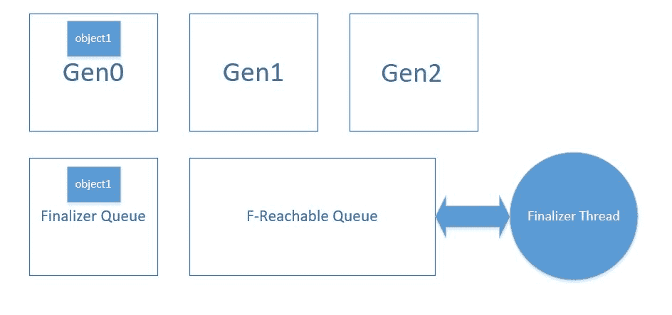
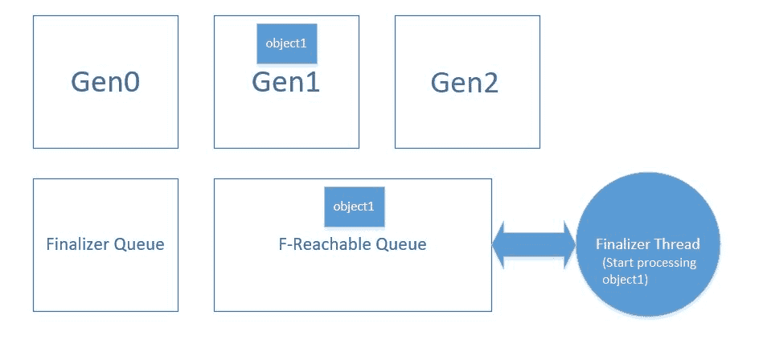

# 第六章：.NET Core 中的内存管理技术

内存管理显著影响任何应用程序的性能。当应用程序运行时，.NET CLR（公共语言运行时）在内存中分配许多对象，并且它们会一直保留在那里，直到它们不再需要，直到创建新对象并分配空间，或者直到 GC 运行（偶尔会运行）以释放未使用的对象，并为其他对象提供更多空间。大部分工作由 GC 自己完成，它会智能地运行并通过删除不需要的对象来释放空间。然而，有一些实践可以帮助任何应用程序避免性能问题并平稳运行。

在第二章，*了解.NET Core 内部和性能测量*中，我们已经了解了垃圾回收的工作原理以及在.NET 中如何维护代。在本章中，我们将专注于一些推荐的最佳实践和模式，以避免内存泄漏并使应用程序性能良好。

我们将学习以下主题：

+   内存分配过程概述

+   通过 SOS 调试分析内存

+   内存碎片化

+   避免终结器

+   在.NET Core 中最佳的对象处理实践

# 内存分配过程概述

内存分配是应用程序运行时在内存中分配对象的过程。这是由**公共语言运行时**（**CLR**）完成的。当对象被初始化（使用`new`关键字）时，GC 会检查代是否达到阈值并执行垃圾回收。这意味着当系统内存达到其限制时，将调用 GC。当应用程序运行时，GC 寄存器本身会接收有关系统内存的事件通知，当系统达到特定限制时，它会调用垃圾回收。

另一方面，我们也可以使用`GC.Collect`方法以编程方式调用 GC。然而，由于 GC 是一个高度调优的算法，并且根据内存分配模式自动行为，显式调用可能会影响性能，因此强烈建议在生产中不要使用它。

# 通过.NET Core 中的 SOS 调试器分析 CLR 内部

SOS 是一个随 Windows 一起提供并且也适用于 Linux 的调试扩展。它通过提供有关 CLR 内部的信息，特别是内存分配、创建的对象数量以及有关 CLR 的其他详细信息，来帮助调试.NET Core 应用程序。我们可以在.NET Core 中使用 SOS 扩展来调试特定于每个平台的本机机器代码。

要在 Windows 上安装 SOS 扩展，需要从[`developer.microsoft.com/en-us/windows/hardware/download-kits-windows-hardware-development`](https://developer.microsoft.com/en-us/windows/hardware/download-kits-windows-hardware-development)安装**Windows Driver Kit**（**WDK**）。

安装了 Windows Driver Kit 后，我们可以使用各种命令来分析应用程序的 CLR 内部，并确定在堆中占用最多内存的对象，并相应地对其进行优化。

我们知道，在.NET Core 中，不会生成可执行文件，我们可以使用*dotnet cli*命令来执行.NET Core 应用程序。运行.NET Core 应用程序的命令如下：

+   `dotnet run`

+   `dotnet applicationpath/applicationname.dll`

我们可以运行上述任一命令来运行.NET Core 应用程序。对于 ASP.NET Core 应用程序，我们可以转到应用程序文件夹的根目录，其中包括`Views`、`wwwroot`、`Models`、`Controllers`和其他文件，并运行以下命令：


另一方面，调试工具通常需要`.exe`文件或进程 ID 来转储与 CLR 内部相关的信息。要运行 SOS 调试器，我们可以转到 Windows Driver Kit 安装的路径（目录路径将是`{driveletter}:Program Files (x86)Windows Kits10Debuggersx64`），并运行以下命令：

```cs
windbg dotnet {application path}
```

以下是一个截图，显示了如何使用`windbg`命令运行 ASP.NET Core 应用程序：


一旦你运行了上述命令，它会打开 Windbg 窗口和调试器，如下所示：


你可以通过点击 Debug | Break 来停止调试器，并运行`SOS`命令来加载.NET Core CLR 的信息。

从 Windbg 窗口执行以下命令，然后按*Enter*：

```cs
.loadby sos coreclr
```

以下截图是一个界面，你可以在其中输入并运行上述命令：


最后，我们可以运行`!DumpHeap`命令来查看对象堆的完整统计细节：


在上述截图中，如下截图所示的前三列，代表每个方法的`地址`、`方法`表和`大小`：


利用上述信息，它提供了按类型对堆上存储的对象进行分类的统计信息。`MT`是该类型的方法表，`Count`是该类型实例的总数，`TotalSize`是所有该类型实例占用的总内存大小，`Classname`代表在堆上占用该空间的实际类型。

还有一些其他命令，我们可以使用来获取特定的细节，列举如下：

| **开关** | **命令** | **描述** |
| --- | --- | --- |
| **统计信息** | `!DumpHeap -stat` | 仅显示统计细节 |
| **类型** | `!DumpHeap -type TypeName` | 显示堆上存储的特定类型的统计信息 |
| **Finalization queue** | `!FinalizationQueue` | 显示有关终结器的详细信息 |

这个工具帮助开发人员调查对象在堆上的分配情况。在实际场景中，我们可以在后台运行这个工具，运行我们的应用程序在测试或暂存服务器上，并检查关于堆上存储的对象的详细统计信息。

# 内存碎片化

内存碎片化是.NET 应用程序性能问题的主要原因之一。当对象被实例化时，它占用内存空间，当它不再需要时，它被垃圾回收，分配的内存块变得可用。当对象被分配了一个相对于该内存段/块中可用大小更大的空间，并等待空间变得可用时，就会发生这种情况。内存碎片化是一个问题，当大部分内存分配在较多的非连续块中时发生。当较大大小的对象存储或占用较大的内存块，而内存只包含较小的可用空闲块时，这会导致碎片化，系统无法在内存中分配该对象。

.NET 维护两种堆，即**小对象堆**（SOH）和**大对象堆**（LOH）。大于 85,000 字节的对象存储在 LOH 中。SOH 和 LOH 之间的关键区别在于 LOH 中没有 GC 进行的压缩。压缩是在垃圾回收时进行的过程，其中存储在 SOH 中的对象被移动以消除可用的较小空间块，并增加总可用空间，作为其他对象可以使用的一种大内存块的形式，从而减少碎片化。然而，在 LOH 中，GC 没有隐式地进行压缩。大小较大的对象存储在 LOH 中并创建碎片化问题。此外，如果我们将 LOH 与 SOH 进行比较，LOH 的压缩成本适度高，并涉及显着的开销，GC 需要两倍的内存空间来移动对象进行碎片整理。这也是为什么 LOH 不会被 GC 隐式地进行碎片整理的另一个原因。

以下是内存碎片的表示，其中白色块代表未分配的内存空间，后面跟着一个已分配的块：


假设一个大小为 1.5 MB 的对象想要分配一些内存。即使总可用内存量为 1.8 MB，它也找不到任何可用的空间。这是由于内存碎片：


另一方面，如果内存被碎片化，对象可以轻松使用可用的空间并被分配：


在.NET Core 中，我们可以使用`GCSettings`显式地在 LOH 中执行压缩，如下所示：

```cs
GCSettings.LargeObjectHeapCompactionMode = GCLargeObjectHeapCompactionMode.CompactOnce; 
GC.Collect(); 
```

# 避免使用终结器

在.NET Core 应用程序中使用终结器不是一个好的实践。使用终结器的对象会在内存中停留更长时间，最终影响应用程序的性能。

在特定时间点，应用程序不需要的对象会留在内存中，以便调用它们的`Finalizer`方法。例如，如果 GC 认为对象在第 0 代中已经死亡，它将始终存活在第 1 代中。

在.NET Core 中，CLR 维护一个单独的线程来运行`Finalizer`方法。包含`Finalizer`方法的所有对象都被放置到终结队列中。应用程序不再需要的任何对象都被放置在 F-Reachable 队列中，然后由专用的终结线程执行。

以下图表显示了一个包含`Finalizer`方法的`object1`对象。`Finalizer`方法被放置在终结队列中，对象占据了 Gen0（第 0 代）堆中的内存空间：



当对象不再需要时，它将从 Gen0（第 0 代）移动到 Gen1（第 1 代），并从终结队列移动到 F-Reachable 队列*：*



一旦终结线程在 F-Reachable 队列中运行方法，它将被 GC 从内存中移除。

在.NET Core 中，终结器可以定义如下：

```cs
public class FileLogger 
{ 
  //Finalizer implementation 
   ~FileLogger() 
  { 
    //dispose objects 
  } 
} 
```

通常，此方法用于处理非托管对象并包含一些代码。然而，代码可能包含影响性能的错误。例如，我们有三个对象排队在终结队列中，然后等待第一个对象被终结线程释放，以便它们可以被处理。现在，假设第一个`Finalizer`方法中存在问题并延迟了终结线程的返回和处理其余的方法。过一段时间，更多的对象将进入终结队列并等待终结线程处理，影响应用程序的性能。

处理对象的最佳实践是使用`IDisposable`接口而不是实现`Finalizer`方法。如果出于某种原因使用`Finalizer`方法，最好也实现`IDisposable`接口，并通过调用`GC.SuppressFinalize`方法来抑制终结。

# .NET Core 中释放对象的最佳实践

我们已经在前一节中学习了在.NET Core 中对象的处理是由 GC 自动完成的。然而，在您的代码中处理对象始终是一个良好的实践，并且在处理非托管对象时强烈推荐。在本节中，我们将探讨一些在.NET Core 中编写代码时可以用来释放对象的最佳实践。

# IDisposable 接口简介

`IDisposable`是一个简单的接口，包含一个`Dispose`方法，不带参数，并返回`void`：

```cs
public interface IDisposable 
{ 
  void Dispose(); 
} 
```

它用于释放非托管资源。因此，如果任何类实现了`IDisposable`接口，这意味着该类包含非托管资源，这些资源必须通过调用类的`Dispose`方法来释放。

# 什么是非托管资源？

任何超出应用程序边界的资源都被视为非托管资源。它可能是数据库、文件系统、Web 服务或类似的资源。为了访问数据库，我们使用托管的.NET API 来打开或关闭连接并执行各种命令。但是，实际的数据库连接是不受管理的。文件系统和 Web 服务也是如此，我们使用托管的.NET API 与它们交互，但它们在后台使用非托管资源。`IDisposable`接口是所有这些情况的最佳选择。

# 使用 IDisposable

这里有一个简单的`DataManager`类，它使用`System.Data.SQL` API 在 SQL 服务器数据库上执行数据库操作：

```cs
public class DataManager : IDisposable 
{ 
  private SqlConnection _connection; 

  //Returns the list of users from database 
  public DataTable GetUsers() 
  { 
    //Invoke OpenConnection to instantiate the _connection object 

    OpenConnection(); 

    //Executing command in a using block to dispose command object 
    using(var command =new SqlCommand()) 
    { 
      command.Connection = _connection; 
      command.CommandText = "Select * from Users"; 

      //Executing reader in a using block to dispose reader object 
      using (var reader = command.ExecuteReader()) 
      { 
        var dt = new DataTable(); 
        dt.Load(reader); 
        return dt; 
      } 

    } 
  } 
  private void OpenConnection() 
  { 
    if (_connection == null) 
    { 
      _connection = new SqlConnection(@"Integrated Security=SSPI;
      Persist Security Info=False;Initial Catalog=SampleDB;
      Data Source=.sqlexpress"); 
      _connection.Open(); 
    } 
  } 

  //Disposing _connection object 
  public void Dispose() { 
    Console.WriteLine("Disposing object"); 
    _connection.Close(); 
    _connection.Dispose(); 
  } 
} 
```

在前面的代码中，我们已经实现了`IDisposable`接口，该接口又实现了`Dispose`方法来清理 SQL 连接对象。我们还调用了连接的`Dispose`方法，这将在管道中链接该过程并关闭底层对象。

从调用程序中，我们可以使用`using`块来实例化`DatabaseManager`对象，该对象在调用`GetUsers`方法后调用`Dispose`方法：

```cs
static void Main(string[] args) 
{ 
  using(DataManager manager=new DataManager()) 
  { 
    manager.GetUsers(); 
  } 
} 
```

`using`块是 C#的一个构造，由编译器渲染为`try finally`块，并在`finally`块中调用`Dispose`方法。这意味着当您使用`using`块时，我们不必显式调用`Dispose`方法。另外，前面的代码也可以以以下方式编写，这种特定的代码格式由`using`块在内部管理：

```cs
static void Main(string[] args) 
{ 
  DataManager _manager; 
  try 
  { 
    _manager = new DataManager(); 
  } 
  finally 
  { 
    _manager.Dispose(); 
  } 
} 
```

# 何时实现 IDisposable 接口

我们已经知道，每当需要释放非托管资源时，应该使用`IDisposable`接口。但是，在处理对象的释放时，有一个标准规则应该被考虑。规则规定，如果类中的实例实现了`IDisposable`接口，我们也应该在使用该类时实现`IDisposable`。例如，前面的`DatabaseManager`类使用了`SqlConnection`，其中`SqlConnection`在内部实现了`IDisposable`接口。为了遵守这个规则，我们将实现`IDisposable`接口并调用实例的`Dispose`方法。

这里有一个更好的例子，它从`DatabaseManager Dispose`方法中调用`protected Dispose`方法，并传递一个表示对象正在被处理的`Boolean`值。最终，我们将调用`GC.SuppressFinalize`方法，告诉 GC 对象已经被清理，防止调用冗余的垃圾回收：

```cs
public void Dispose() { 
  Console.WriteLine("Disposing object"); 
  Dispose(true); 
  GC.SuppressFinalize(this); 
} 
protected virtual void Dispose(Boolean disposing) 
{ 
  if (disposing) 
  { 
    if (_connection != null) 
    { 
      _connection.Close(); 
      _connection.Dispose(); 
      //set _connection to null, so next time it won't hit this block 
      _connection = null; 
    } 
  } 
} 
}
```

我们将参数化的`Dispose`方法保持为`protected`和`virtual`，这样，如果从`DatabaseManager`类派生的子类可以重写`Dispose`方法并清理自己的资源。这确保了对象树中的每个类都将清理其资源。子类处理其资源并调用基类上的`Dispose`，依此类推。

# Finalizer 和 Dispose

`Finalizer`方法由 GC 调用，而`Dispose`方法必须由开发人员在程序中显式调用。GC 不知道类是否包含`Dispose`方法，并且需要在对象处置时调用以清理非托管资源。在这种情况下，我们需要严格清理资源而不是依赖调用者调用对象的`Dispose`方法时，应该实现`Finalizer`方法。

以下是实现`Finalizer`方法的`DatabaseManager`类的修改示例：

```cs
public class DataManager : IDisposable 
{ 
  private SqlConnection _connection; 
  //Returns the list of users from database 
  public DataTable GetUsers() 
  { 
    //Invoke OpenConnection to instantiate the _connection object 

    OpenConnection(); 

    //Executing command in a using block to dispose command object 
    using(var command =new SqlCommand()) 
    { 
      command.Connection = _connection; 
      command.CommandText = "Select * from Users"; 

      //Executing reader in a using block to dispose reader object 
      using (var reader = command.ExecuteReader()) 
      { 
        var dt = new DataTable(); 
        dt.Load(reader); 
        return dt; 
      } 
    } 
  } 
  private void OpenConnection() 
  { 
    if (_conn == null) 
    { 
      _connection = new SqlConnection(@"Integrated Security=SSPI;
      Persist Security Info=False;Initial Catalog=SampleDB;
      Data Source=.sqlexpress"); 
      _connection.Open(); 
    } 
  } 

  //Disposing _connection object 
  public void Dispose() { 
    Console.WriteLine("Disposing object"); 
    Dispose(true); 
    GC.SuppressFinalize(this); 
  } 

  private void Dispose(Boolean disposing) 
  { 
    if(disposing) { 
      //clean up any managed resources, if called from the 
      //finalizer, all the managed resources will already 
      //be collected by the GC 
    } 
    if (_connection != null) 
    { 
      _connection.Close(); 
      _connection.Dispose(); 
      //set _connection to null, so next time it won't hit this block 
      _connection = null; 
    } 

  } 

  //Implementing Finalizer 
  ~DataManager(){ 
    Dispose(false); 
  } 
}
Dispose method and added the finalizer using a destructor syntax, ~DataManager. When the GC runs, the finalizer is invoked and calls the Dispose method by passing a false flag as a Boolean parameter. In the Dispose method, we will clean up the connection object. During the finalization stage, the managed resources will already be cleaned up by the GC, so the Dispose method will now only clean up the unmanaged resources from the finalizer. However, a developer can explicitly dispose of objects by calling the Dispose method and passing a true flag as a Boolean parameter to clean up managed resources.
```

# 总结

本章重点是内存管理。我们学习了一些最佳实践，以及.NET 中内存管理的实际底层过程。我们探索了调试工具，开发人员可以使用它来调查堆上对象的内存分配。我们还学习了内存碎片化、终结器，以及如何通过实现`IDisposable`接口来实现清理资源的处理模式。

在下一章中，我们将创建一个遵循微服务架构的应用程序。微服务架构是一种高性能和可扩展的架构，可以帮助应用程序轻松扩展。接下来的章节将为您提供一个完整的理解，说明如何遵循最佳实践和原则开发应用程序。
