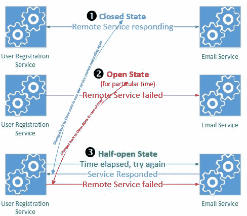
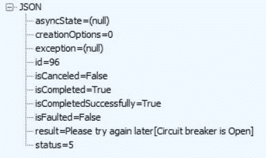
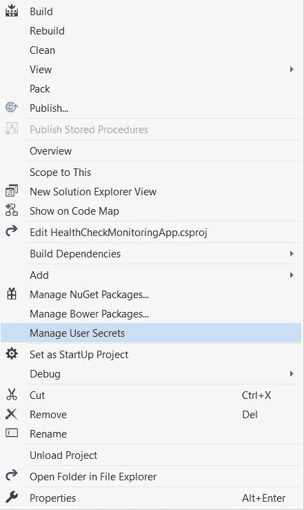
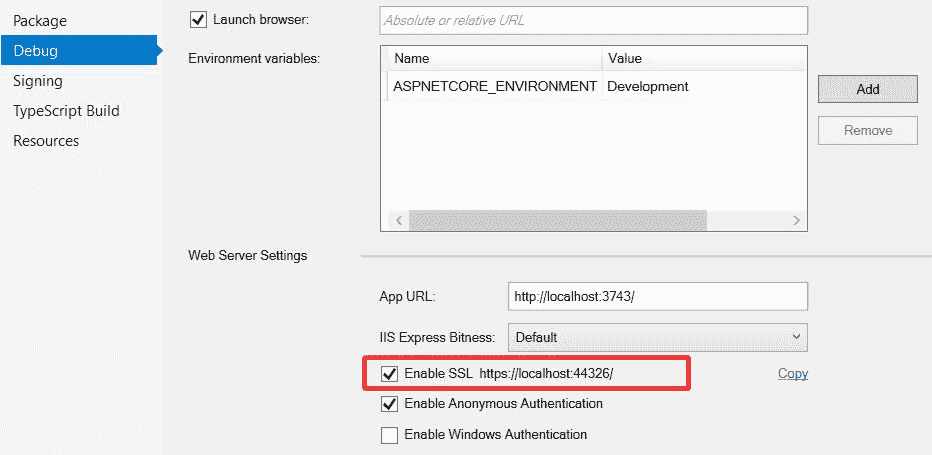
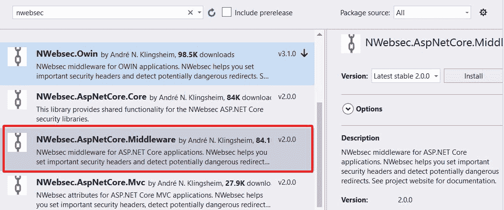
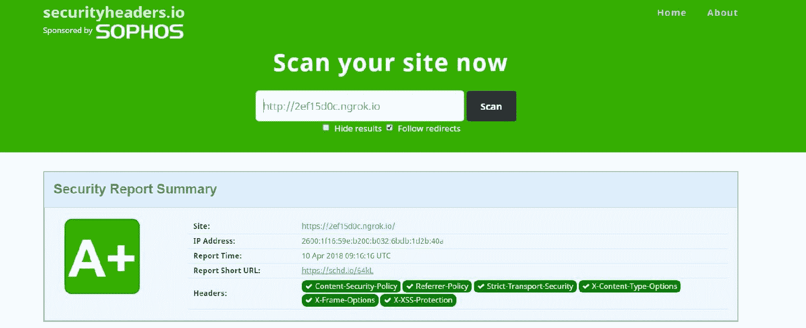

# 第七章：在.NET Core 应用程序中保护和实施弹性

安全性和弹性是开发任何规模应用程序时应考虑的两个重要方面。安全性保护应用程序的机密信息，执行身份验证，并提供对安全内容的授权访问，而弹性在应用程序失败时保护应用程序，使其能够优雅地降级。弹性使应用程序高度可用，并允许应用程序在发生错误或处于故障状态时正常运行。它在微服务架构中被广泛使用，其中应用程序被分解为多个服务，并且每个服务与其他服务通信以执行操作。

在.NET Core 中有各种技术和库可用于实现安全性和弹性。在 ASP.NET Core 应用程序中，我们可以使用 Identity 来实现用户身份验证/授权，使用流行的 Polly 框架来实现诸如断路器、重试模式等模式。

在本章中，我们将讨论以下主题：

+   弹性应用程序简介

+   实施健康检查以监视应用程序性能

+   在 ASP.NET Core 应用程序中实施重试模式以重试瞬时故障上的操作

+   实施断路器模式以防止可能失败的调用

+   保护 ASP.NET Core 应用程序并使用 Identity 框架启用身份验证和授权

+   使用安全存储来存储应用程序机密

# 弹性应用程序简介

开发具有弹性作为重要因素的应用程序总是会让您的客户感到满意。今天，应用程序本质上是分布式的，并涉及大量的通信。当服务因网络故障而宕机或未能及时响应时，问题就会出现，这最终会导致客户操作终止之前的延迟。弹性的目的是使您的应用程序从故障中恢复，并使其再次响应。

当您调用一个服务，该服务调用另一个服务，依此类推时，复杂性会增加。在一长串操作中，考虑弹性是很重要的。这就是为什么它是微服务架构中最广泛采用的原则之一。

# 弹性政策

弹性政策分为两类：

+   反应性政策

+   积极的政策

在本章中，我们将使用 Polly 框架实施反应性和积极性政策，该框架可用于.NET Core 应用程序。

# 反应性政策

根据反应性政策，如果服务请求在第一次尝试时失败，我们应立即重试服务请求。要实施反应性政策，我们可以使用以下模式：

+   **重试**：在请求失败时立即重试

+   **断路器**：在故障状态下停止对服务的所有请求

+   **回退**：如果服务处于故障状态，则返回默认响应

# 实施重试模式

重试模式用于重试故障服务多次以获得响应。它在涉及服务之间的相互通信的场景中被广泛使用，其中一个服务依赖于另一个服务执行特定操作。当服务分别托管并通过网络进行通信时，最有可能是通过 HTTP 协议时，会发生瞬时故障。

以下图表示两个服务：一个用户注册服务，用于在数据库中注册和保存用户记录，以及一个电子邮件服务，用于向用户发送确认电子邮件，以便他们激活他们的帐户。假设电子邮件服务没有响应。这将返回某种错误，如果实施了重试模式，它将重试请求已实施的次数，并在失败时调用电子邮件服务：


**用户注册服务**和**电子邮件服务**是 ASP.NET Core Web API 项目，其中用户注册实现了重试模式。我们将通过将其添加为 NuGet 包在用户注册服务中使用 Polly 框架。要添加 Polly，我们可以在 Visual Studio 的 NuGet 包管理器控制台窗口中执行以下命令：

```cs
Install-Package Polly
```

Polly 框架基于策略。您可以定义包含与您正在实现的模式相关的特定配置的策略，然后通过调用其`ExecuteAsync`方法来调用该策略。

这是包含实现重试模式以调用电子邮件服务的 POST 方法的`UserController`。

```cs
[Route("api/[controller]")] 
public class UserController : Controller 
{ 

  HttpClient _client; 
  public UserController(HttpClient client) 
  { 
    _client = client; 
  } 

  // POST api/values 
  [HttpPost] 
  public void Post([FromBody]User user) 
  { 

    //Email service URL 
    string emailService = "http://localhost:80/api/Email"; 

    //Serialize user object into JSON string 
    HttpContent content = new StringContent(JsonConvert.SerializeObject(user)); 

    //Setting Content-Type to application/json 
    _client.DefaultRequestHeaders 
    .Accept 
    .Add(new MediaTypeWithQualityHeaderValue("application/json")); 

    int maxRetries = 3; 

    //Define Retry policy and set max retries limit and duration between each retry to 3 seconds 
    var retryPolicy = Policy.Handle<HttpRequestException>().WaitAndRetryAsync(
    maxRetries, sleepDuration=> TimeSpan.FromSeconds(3)); 

    //Call service and wrap HttpClient PostAsync into retry policy 
    retryPolicy.ExecuteAsync(async () => { 
      var response =  _client.PostAsync(emailService, content).Result; 
      response.EnsureSuccessStatusCode(); 
    }); 

  }    
}
```

在前面的代码中，我们使用`HttpClient`类向电子邮件服务 API 发出 RESTful 请求。`HTTP POST`方法接收一个包含以下五个属性的用户对象：

```cs
public class User 
{ 
  public string FirstName { get; set; } 
  public string LastName { get; set; } 
  public string EmailAddress { get; set; }  
  public string UserName { get; set; } 
  public string Password { get; set; } 
}  
```

由于请求将以 JSON 格式发送，我们必须将`Content-Type`标头值设置为`application/json`。然后，我们必须定义重试策略以等待并重试每三秒一次的操作，最大重试次数为三次。最后，我们调用`ExecuteAsync`方法来调用`client.PostAsync`方法，以便调用电子邮件服务。

在运行上述示例后，如果电子邮件服务宕机或抛出异常，将重试三次以尝试获取所需的响应。

# 实施断路器

在调用通过网络通信的服务时，实现重试模式是一个很好的实践。然而，调用机制本身需要资源和带宽来执行操作并延迟响应。如果服务已经处于故障状态，不总是一个好的实践为每个请求重试多次。这就是断路器发挥作用的地方。

断路器有三种状态，如下图所示：



最初，断路器处于**关闭状态**，这意味着服务之间的通信正常工作，目标远程服务正在响应。如果目标远程服务失败，断路器将变为**打开状态**。当状态变为打开时，随后的所有请求都无法在特定的指定时间内调用目标远程服务，并直接将响应返回给调用者。一旦时间过去，断路器转为**半开状态**并尝试调用目标远程服务以获取响应。如果成功接收到响应，断路器将变回**关闭状态**，或者如果失败，状态将变回关闭并保持关闭，直到配置中指定的时间。

实现断路器模式，我们将使用相同的 Polly 框架，您可以从 NuGet 包中添加。我们可以按照以下方式添加断路器策略：

```cs
var circuitBreakerPolicy = Policy.HandleResult<HttpResponseMessage>(result => !result.IsSuccessStatusCode) 
  .CircuitBreakerAsync(3, TimeSpan.FromSeconds(10), OnBreak, OnReset, OnHalfOpen); 
```

在`Startup`类的`ConfigureServices`方法中添加上述断路器策略。将其定义在`Startup`类中的原因是通过**依赖注入**（**DI**）将断路器对象注入为单例对象。因此，所有请求将共享相同的实例，并且状态将得到适当维护。

在定义断路器策略时，我们将允许断开电路之前的事件数设置为三次，这将检查请求失败的次数，并在达到三次的阈值时断开电路。它将保持断路器在*打开*状态下 10 秒钟，然后在时间过去后的第一个请求到来时将状态更改为*半开*。

最后，如果远程服务仍然失败，断路器状态再次变为*Open*状态；否则，它将被设置为*Close*。我们还定义了`OnBreak`、`OnReset`和`OnHalfOpen`委托，当断路器状态改变时会被调用。如果需要，我们可以在数据库或文件系统中记录这些信息。在`Startup`类中添加这些委托方法：

```cs
private void OnBreak(DelegateResult<HttpResponseMessage> responseMessage, TimeSpan timeSpan) 
{ 
  //Log to file system 
} 
private void OnReset() 
{ 
  //log to file system 
} 
private void OnHalfOpen() 
{ 
  // log to file system 
}
```

现在，我们将在`Startup`类的`ConfigureServices`方法中使用 DI 添加`circuitBreakerPolicy`和`HttpClient`对象：

```cs
services.AddSingleton<HttpClient>(); 
  services.AddSingleton<CircuitBreakerPolicy<HttpResponseMessage>>(circuitBreakerPolgicy);
```

这是我们的`UserController`，它在参数化构造函数中接受`HttpClient`和`CircuitBreakerPolicy`对象：

```cs
public class UserController : Controller 
{ 
  HttpClient _client; 
  CircuitBreakerPolicy<HttpResponseMessage> _circuitBreakerPolicy; 
  public UserController(HttpClient client, 
  CircuitBreakerPolicy<HttpResponseMessage> circuitBreakerPolicy) 
  { 
    _client = client; 
    _circuitBreakerPolicy = circuitBreakerPolicy; 
  } 
} 
```

这是使用断路器策略并调用电子邮件服务的`HTTP POST`方法：

```cs
// POST api/values 
[HttpPost] 
public async Task<IActionResult> Post([FromBody]User user) 
{ 

  //Email service URL 
  string emailService = "http://localhost:80/api/Email"; 

  //Serialize user object into JSON string 
  HttpContent content = new StringContent(JsonConvert.SerializeObject(user)); 

  //Setting Content-Type to application/json 
  _client.DefaultRequestHeaders 
  .Accept 
  .Add(new MediaTypeWithQualityHeaderValue("application/json")); 

  //Execute operation using circuit breaker 
  HttpResponseMessage response = await _circuitBreakerPolicy.ExecuteAsync(() => 
  _client.PostAsync(emailService, content)); 

  //Check if response status code is success 
  if (response.IsSuccessStatusCode) 
  { 
    var result = response.Content.ReadAsStringAsync(); 
    return Ok(result); 
  } 

  //If the response status is not success, it returns the actual state 
  //followed with the response content 
  return StatusCode((int)response.StatusCode, response.Content.ReadAsStringAsync()); 
} 
```

这是经典的断路器示例。Polly 还提供了高级断路器，它在特定时间内基于失败请求的百分比来断开电路，这在需要在一定时间内处理大量事务的大型应用程序或涉及大量事务的应用程序中更有用。在一分钟内，有 2%到 5%的事务由于其他非瞬态故障问题而失败的可能性，因此我们不希望断路器中断。在这种情况下，我们可以实现高级断路器模式，并在我们的`ConfigureServices`方法中定义策略，如下所示：

```cs
public void ConfigureServices(IServiceCollection services) 
{ 

  var circuitBreakerPolicy = Policy.HandleResult<HttpResponseMessage>(
  result => !result.IsSuccessStatusCode) 
  .AdvancedCircuitBreaker(0.1, TimeSpan.FromSeconds(60),5, TimeSpan.FromSeconds(10), 
  OnBreak, OnReset, OnHalfOpen); 
  services.AddSingleton<HttpClient>(); 
  services.AddSingleton<CircuitBreakerPolicy<HttpResponseMessage>>(circuitBreakerPolicy); 
}
```

`AdvancedCircuitBreakerAsync`方法中的第一个参数包含了 0.1 的值，这是在指定的时间段内（60 秒）失败的请求的百分比，如第二个参数所指定的。第三个参数定义了值为 5，是在特定时间内（第二个参数为 60 秒）正在服务的请求的最小吞吐量。最后一个参数定义了如果任何请求失败并尝试再次服务请求的时间量，断路器保持打开状态的时间。其他参数只是在每个状态改变时调用的委托方法，与之前的经典断路器示例中的情况相同。

# 将断路器与重试包装起来

到目前为止，我们已经学习了如何使用 Polly 框架来使用和实现断路器和重试模式。重试模式用于在指定的时间内重试请求，如果请求失败，而断路器保持电路的状态，并根据失败请求的阈值打开电路，并停止调用远程服务一段时间，如配置中所指定的，以节省网络带宽。

使用 Polly 框架，我们可以将重试和断路器模式结合起来，并将断路器与重试模式包装在一起，以便在重试模式达到失败请求阈值限制的计数时打开断路器。

在本节中，我们将开发一个自定义的`HttpClient`类，该类提供`GET`、`POST`、`PUT`和`DELETE`等方法，并使用重试和断路器策略使其具有弹性。

创建一个新的`IResilientHttpClient`接口，并添加四个 HTTP `GET`、`POST`、`PUT`和`DELETE`方法：

```cs
public interface IResilientHttpClient 
{ 
  HttpResponseMessage Get(string uri); 

  HttpResponseMessage Post<T>(string uri, T item); 

  HttpResponseMessage Delete(string uri); 

  HttpResponseMessage Put<T>(string uri, T item); 
} 
```

现在，创建一个名为`ResilientHttpClient`的新类，该类实现了`IResilientHttpClient`接口。我们将添加一个参数化构造函数，以注入断路器策略和`HttpClient`对象，该对象将用于进行 HTTP `GET`、`POST`、`PUT`和`DELETE`请求。以下是`ResilientHttpClient`类的构造函数实现：

```cs
public class ResilientHttpClient : IResilientHttpClient 
{ 

  static CircuitBreakerPolicy<HttpResponseMessage> _circuitBreakerPolicy; 
  static Policy<HttpResponseMessage> _retryPolicy; 
  HttpClient _client; 

  public ResilientHttpClient(HttpClient client, 
  CircuitBreakerPolicy<HttpResponseMessage> circuitBreakerPolicy) 
  { 
    _client = client; 
    _client.DefaultRequestHeaders.Accept.Clear(); 
    _client.DefaultRequestHeaders.Accept.Add(
    new MediaTypeWithQualityHeaderValue("application/json")); 

    //circuit breaker policy injected as defined in the Startup class 
    _circuitBreakerPolicy = circuitBreakerPolicy; 

    //Defining retry policy 
    _retryPolicy = Policy.HandleResult<HttpResponseMessage>(x => 
    { 
      var result = !x.IsSuccessStatusCode; 
      return result; 
    })
    //Retry 3 times and for each retry wait for 3 seconds 
    .WaitAndRetry(3, sleepDuration => TimeSpan.FromSeconds(3)); 

  } 
} 
```

在前面的代码中，我们已经定义了`CircuitBreakerPolicy<HttpResponseMessage>`和`HttpClient`对象，它们是通过 DI 注入的。我们定义了重试策略，并将重试阈值设置为三次，每次重试都会在调用服务之前等待三秒钟。

```cs
ExecuteWithRetryandCircuitBreaker method:
```

```cs
//Wrap function body in Retry and Circuit breaker policies 
public HttpResponseMessage ExecuteWithRetryandCircuitBreaker(string uri, Func<HttpResponseMessage> func) 
{ 

  var res = _retryPolicy.Wrap(_circuitBreakerPolicy).Execute(() => func()); 
  return res; 
} 
```

我们将从我们的 GET、POST、PUT 和 DELETE 实现中调用此方法，并定义将在重试和断路器策略中执行的代码。

以下分别是 GET、POST、PUT 和 DELETE 方法的实现：

```cs
public HttpResponseMessage Get(string uri) 
{ 
  //Invoke ExecuteWithRetryandCircuitBreaker method that wraps the code 
  //with retry and circuit breaker policies 
  return ExecuteWithRetryandCircuitBreaker(uri, () => 
  { 
    try 
    { 
      var requestMessage = new HttpRequestMessage(HttpMethod.Get, uri); 
      var response = _client.SendAsync(requestMessage).Result; 
      return response; 
    }
    catch(Exception ex) 
    { 
      //Handle exception and return InternalServerError as response code 
      HttpResponseMessage res = new HttpResponseMessage(); 
      res.StatusCode = HttpStatusCode.InternalServerError;   
      return res; 
    } 
  }); 
} 

//To do HTTP POST request 
public HttpResponseMessage Post<T>(string uri, T item) 
{ 
  //Invoke ExecuteWithRetryandCircuitBreaker method that wraps the code 
  //with retry and circuit breaker policies 
  return ExecuteWithRetryandCircuitBreaker(uri, () => 
  { 
    try 
    { 
      var requestMessage = new HttpRequestMessage(HttpMethod.Post, uri); 

      requestMessage.Content = new StringContent(JsonConvert.SerializeObject(item), 
      System.Text.Encoding.UTF8, "application/json"); 

      var response = _client.SendAsync(requestMessage).Result; 

      return response; 

    }catch (Exception ex) 
    { 
      //Handle exception and return InternalServerError as response code 
      HttpResponseMessage res = new HttpResponseMessage(); 
      res.StatusCode = HttpStatusCode.InternalServerError; 
      return res; 
    } 
  }); 
} 

//To do HTTP PUT request 
public HttpResponseMessage Put<T>(string uri, T item) 
{ 
  //Invoke ExecuteWithRetryandCircuitBreaker method that wraps 
  //the code with retry and circuit breaker policies 
  return ExecuteWithRetryandCircuitBreaker(uri, () => 
  { 
    try 
    { 
      var requestMessage = new HttpRequestMessage(HttpMethod.Put, uri); 

      requestMessage.Content = new StringContent(JsonConvert.SerializeObject(item), 
      System.Text.Encoding.UTF8, "application/json"); 

      var response = _client.SendAsync(requestMessage).Result; 

      return response; 
    } 
    catch (Exception ex) 
    { 
    //Handle exception and return InternalServerError as response code 
    HttpResponseMessage res = new HttpResponseMessage(); 
    res.StatusCode = HttpStatusCode.InternalServerError; 
    return res; 
    } 

  }); 
} 

//To do HTTP DELETE request 
public HttpResponseMessage Delete(string uri) 
{ 
  //Invoke ExecuteWithRetryandCircuitBreaker method that wraps the code 
  //with retry and circuit breaker policies 
  return ExecuteWithRetryandCircuitBreaker(uri, () => 
  { 
    try 
    { 
      var requestMessage = new HttpRequestMessage(HttpMethod.Delete, uri); 

      var response = _client.SendAsync(requestMessage).Result; 

      return response; 

    } 
    catch (Exception ex) 
    { 
      //Handle exception and return InternalServerError as response code 
      HttpResponseMessage res = new HttpResponseMessage(); 
      res.StatusCode = HttpStatusCode.InternalServerError; 
      return res; 
    } 
  }); 

} 
```

最后，在我们的启动类中，我们将添加以下依赖项：

```cs
public void ConfigureServices(IServiceCollection services) 
{ 

  var circuitBreakerPolicy = Policy.HandleResult<HttpResponseMessage>(x=> { 
    var result = !x.IsSuccessStatusCode; 
    return result; 
  }) 
  .CircuitBreaker(3, TimeSpan.FromSeconds(60), OnBreak, OnReset, OnHalfOpen); 

   services.AddSingleton<HttpClient>(); 
   services.AddSingleton<CircuitBreakerPolicy<HttpResponseMessage>>(circuitBreakerPolicy); 

   services.AddSingleton<IResilientHttpClient, ResilientHttpClient>(); 
   services.AddMvc(); 
   services.AddSwaggerGen(c => 
   { 
     c.SwaggerDoc("v1", new Info { Title = "User Service", Version = "v1" }); 
   }); 
 } 
```

在我们的`UserController`类中，我们可以通过 DI 注入我们的自定义`ResilientHttpClient`对象，并修改 POST 方法，如下所示：

```cs
[Route("api/[controller]")] 
public class UserController : Controller 
{ 

  IResilientHttpClient _resilientClient; 

  HttpClient _client; 
  CircuitBreakerPolicy<HttpResponseMessage> _circuitBreakerPolicy; 
  public UserController(HttpClient client, IResilientHttpClient resilientClient) 
  { 
    _client = client; 
    _resilientClient = resilientClient; 

  } 

  // POST api/values 
  [HttpPost] 
  public async Task<IActionResult> Post([FromBody]User user) 
  { 

    //Email service URL 
    string emailService = "http://localhost:80/api/Email"; 

    var response = _resilientClient.Post(emailService, user); 
    if (response.IsSuccessStatusCode) 
    { 
      var result = response.Content.ReadAsStringAsync(); 
      return Ok(result); 
    } 

    return StatusCode((int)response.StatusCode, response.Content.ReadAsStringAsync()); 

  } 
} 
```

通过这种实现，当应用程序启动时，电路将最初关闭。当对`EmailService`进行请求时，如果服务没有响应，它将尝试三次调用服务，每个请求等待三秒。如果服务没有响应，电路将变为打开状态，并且对于所有后续请求，将停止调用电子邮件服务，并在 60 秒内将异常返回给用户，如断路器策略中指定的。60 秒后，下一个请求将发送到`EmailService`，并且断路器状态将变为半开放状态。如果它有响应，电路状态将再次变为关闭；否则，它将在接下来的 60 秒内保持打开状态。

# 带有断路器和重试的回退策略

Polly 还提供了一个回退策略，如果服务失败，它将返回一些默认响应。它可以与重试和断路器策略一起使用。回退的基本思想是向消费者发送默认响应，而不是在响应中返回实际错误。响应应该向用户提供一些与应用程序性质相关的有意义的信息。当您的服务被应用程序的外部消费者使用时，这是非常有益的。

我们可以修改上面的示例，并为重试和断路器异常添加回退策略。在`ResilientHttpClient`类中，我们将添加这两个变量：

```cs
static FallbackPolicy<HttpResponseMessage> _fallbackPolicy; 
static FallbackPolicy<HttpResponseMessage> _fallbackCircuitBreakerPolicy; 
```

接下来，我们将添加断路器策略来处理断路器异常，并返回带有我们自定义内容消息的`HttpResponseMessage`。在`ResilientHttpClient`类的参数化构造函数中添加以下代码：

```cs
_fallbackCircuitBreakerPolicy = Policy<HttpResponseMessage> 
.Handle<BrokenCircuitException>() 
.Fallback(new HttpResponseMessage(HttpStatusCode.OK) 
  { 
    Content = new StringContent("Please try again later[Circuit breaker is Open]") 
  } 
);
```

然后，我们将添加另一个回退策略，它将包装断路器以处理任何不是断路器异常的其他异常：

```cs
_fallbackPolicy = Policy.HandleResult<HttpResponseMessage>(r => r.StatusCode == HttpStatusCode.InternalServerError) 
.Fallback(new HttpResponseMessage(HttpStatusCode.OK) { 
  Content = new StringContent("Some error occured") 
}); 

```

最后，我们将修改`ExecuteWithRetryandCircuitBreaker`方法，并将重试和断路器策略包装在回退策略中，该策略将以 200 状态代码向用户返回通用消息：

```cs
public HttpResponseMessage ExecuteWithRetryandCircuitBreaker(string uri, Func<HttpResponseMessage> func) 
{ 

  PolicyWrap<HttpResponseMessage> resiliencePolicyWrap = 
  Policy.Wrap(_retryPolicy, _circuitBreakerPolicy); 

  PolicyWrap<HttpResponseMessage> fallbackPolicyWrap = 
  _fallbackPolicy.Wrap(_fallbackCircuitBreakerPolicy.Wrap(resiliencePolicyWrap)); 

  var res = fallbackPolicyWrap.Execute(() => func()); 
  return res; 
}
```

通过这种实现，用户将不会收到任何响应中的错误。内容包含实际错误，如下面从 Fiddler 中获取的快照所示：



# 主动策略

根据主动策略，如果请求导致失败，我们应该主动响应。我们可以使用超时、缓存和健康检查等技术来主动监控应用程序的性能，并在发生故障时主动响应。

+   **超时**：如果请求花费的时间超过通常时间，它会结束请求

+   **缓存**：缓存先前的响应并在将来的请求中使用它们

+   **健康检查**：监控应用程序的性能，并在发生故障时调用警报

# 实施超时

超时是一种主动策略，在目标服务需要很长时间来响应的情况下适用，而不是让客户端等待响应，我们返回一个通用消息或响应。我们可以使用相同的 Polly 框架来定义超时策略，并且它也可以与我们之前学习的重试和断路器模式结合使用：


在上图中，用户注册服务正在调用电子邮件服务发送电子邮件。现在，如果电子邮件服务在特定时间内没有响应，如超时策略中指定的，将引发超时异常。

要添加超时策略，请在`ResilientHttpClient`类中声明一个`_timeoutPolicy`变量：

```cs
static TimeoutPolicy<HttpResponseMessage> _timeoutPolicy; 
```

然后，添加以下代码来初始化超时策略：

```cs
_timeoutPolicy = Policy.Timeout<HttpResponseMessage>(1); 
```

最后，我们将包装超时策略并将其添加到`resiliencyPolicyWrap`中。以下是`ExecuteWithRetryandCircuitBreaker`方法的修改代码：

```cs
public HttpResponseMessage ExecuteWithRetryandCircuitBreaker(string uri, Func<HttpResponseMessage> func) 
{ 

  PolicyWrap<HttpResponseMessage> resiliencePolicyWrap = 
  Policy.Wrap(_timeoutPolicy, _retryPolicy, _circuitBreakerPolicy); 

  PolicyWrap<HttpResponseMessage> fallbackPolicyWrap = 
  _fallbackPolicy.Wrap(_fallbackCircuitBreakerPolicy.Wrap(resiliencePolicyWrap)); 

  var res = fallbackPolicyWrap.Execute(() => func()); 
  return res; 
} 
```

# 实施缓存

在进行网络请求或调用远程服务时，Polly 可用于缓存来自远程服务的响应，并提高应用程序响应时间的性能。Polly 缓存分为两种，即内存缓存和分布式缓存。我们将在本节中配置内存缓存。

首先，我们需要从 NuGet 添加另一个`Polly.Caching.MemoryCache`包。添加完成后，我们将修改我们的`Startup`类，并将`IPolicyRegistry`添加为成员变量：

```cs
private IPolicyRegistry<string> _registry; 
```

在`ConfigurationServices`方法中，我们将初始化注册表并通过 DI 将其添加为单例对象：

```cs
_registry = new PolicyRegistry();
services.AddSingleton(_registry);
```

在配置方法中，我们将定义缓存策略，该策略需要缓存提供程序和缓存响应的时间。由于我们使用的是内存缓存，我们将初始化内存缓存提供程序，并在策略中指定如下：

```cs
Polly.Caching.MemoryCache.MemoryCacheProvider memoryCacheProvider = new MemoryCacheProvider(memoryCache); 

CachePolicy<HttpResponseMessage> cachePolicy = Policy.Cache<HttpResponseMessage>(memoryCacheProvider, TimeSpan.FromMinutes(10)); 
```

最后，我们将在`ConfigurationServices`方法中初始化`cachepolicy`并将其添加到我们的注册表中。我们将我们的注册表命名为`cache`。

```cs
_registry.Add("cache", cachePolicy); 
```

修改我们的`UserController`类，并声明通用的`CachePolicy`如下：

```cs
CachePolicy<HttpResponseMessage> _cachePolicy;
```

现在，我们将修改我们的`UserController`构造函数，并添加通过 DI 注入的注册表。此注册表对象用于获取在`Configure`方法中定义的缓存。

以下是`UserController`类的修改后构造函数：

```cs
public UserController(HttpClient client, IResilientHttpClient resilientClient, IPolicyRegistry<string> registry) 
{ 
  _client = client; 
  // _circuitBreakerPolicy = circuitBreakerPolicy; 
  _resilientClient = resilientClient; 

  _cachePolicy = registry.Get<CachePolicy<HttpResponseMessage>>("cache"); 
} 
```

最后，我们将定义一个`GET`方法，调用另一个服务以获取用户列表并将其缓存在内存中。为了缓存响应，我们将使用缓存策略的`Execute`方法包装我们的自定义弹性客户端 GET 方法，如下所示：

```cs
[HttpGet] 
public async Task<IActionResult> Get() 
{ 
  //Specify the name of the Response. If the method is taking    
  //parameter, we can append the actual parameter to cache unique 
  //responses separately 
  Context policyExecutionContext = new Context($"GetUsers"); 

  var response = _cachePolicy.Execute(()=>   
  _resilientClient.Get("http://localhost:7637/api/users"), policyExecutionContext); 
  if (response.IsSuccessStatusCode) 
  { 
    var result = response.Content.ReadAsStringAsync(); 
    return Ok(result); 
  } 

  return StatusCode((int)response.StatusCode, response.Content.ReadAsStringAsync()); 
}
```

当请求返回时，它将检查缓存上下文是否为空或已过期，并且请求将被缓存 10 分钟。在此期间的所有后续请求将从内存缓存存储中读取响应。一旦缓存过期，根据设置的时间限制，它将再次调用远程服务并缓存响应。

# 实施健康检查

健康检查是积极策略的一部分，可以及时监控服务的健康状况。它们还允许您在任何服务未响应或处于故障状态时采取积极的行动。

在 ASP.NET Core 中，我们可以通过使用`HealthChecks`库轻松实现健康检查，该库可作为 NuGet 包使用。要使用`HealthChecks`，我们只需将以下 NuGet 包添加到我们的 ASP.NET Core MVC 或 Web API 项目中：

```cs
Microsoft.AspNetCore.HealthChecks
```

我们必须将此包添加到监视服务和需要监视健康状况的服务的应用程序中。

在用于检查服务健康状况的应用程序的`Startup`类的`ConfigureServices`方法中添加以下代码：

```cs
services.AddHealthChecks(checks => 
{ 
  checks.AddUrlCheck(Configuration["UserServiceURL"]); 
  checks.AddUrlCheck(Configuration["EmailServiceURL"]); 
}); 
```

在上述代码中，我们已添加了两个服务端点来检查健康状态。这些端点在`appsettings.json`文件中定义。

健康检查库通过`AddUrlCheck`方法检查指定服务的健康状况。但是，需要通过`Startup`类对需要由外部应用程序或服务监视健康状况的服务进行一些修改。我们必须将以下代码片段添加到所有服务中，以返回其健康状态：

```cs
services.AddHealthChecks(checks => 
{ 
  checks.AddValueTaskCheck("HTTP Endpoint", () => new 
  ValueTask<IHealthCheckResult>(HealthCheckResult.Healthy("Ok"))); 
});
```

如果它们的健康状况良好且服务正在响应，它将返回`Ok`。

最后，我们可以在监视应用程序中添加 URI，这将触发健康检查中间件来检查服务的健康状况并显示健康状态。我们必须添加`UseHealthChecks`并指定用于触发服务健康状态的端点：

```cs
public static IWebHost BuildWebHost(string[] args) => 
WebHost.CreateDefaultBuilder(args) 
.UseHealthChecks("/hc") 
.UseStartup<Startup>() 
.Build(); 
```

当我们运行我们的监视应用程序并访问 URI 时，例如`http://{base_address}/hc`以获取健康状态，如果所有服务都正常工作，我们应该看到以下响应：


# 使用应用程序机密存储敏感信息

每个应用程序都有一些包含敏感信息的配置，例如数据库连接字符串、一些第三方提供商的密钥以及其他敏感信息，通常存储在配置文件或数据库中。将所有敏感信息进行安全保护，以保护这些资源免受入侵者的侵害，这总是一个更好的选择。Web 应用程序通常托管在服务器上，这些信息可以通过导航到服务器路径并访问文件来读取，尽管服务器始终具有受保护的访问权限，只有授权用户有资格访问数据。然而，将信息以明文形式存储并不是一个好的做法。

在.NET Core 中，我们可以使用 Secret Manager 工具来保护应用程序的敏感信息。Secret Manager 工具允许您将信息存储在`secrets.json`文件中，该文件不存储在应用程序文件夹本身中。相反，该文件保存在不同平台的以下路径：

```cs
Windows: %APPDATA%microsoftUserSecrets{userSecretsId}secrets.json
Linux: ~/.microsoft/usersecrets/{userSecretsId}/secrets.json
Mac: ~/.microsoft/usersecrets/{userSecretsId}/secrets.json
```

`{userSecretId}`是与您的应用程序关联的唯一 ID（GUID）。由于这保存在单独的路径中，每个开发人员都必须在自己的目录下的`UserSecrets`目录下定义或创建此文件。这限制了开发人员检入相同的文件到源代码控制中，并将信息保持分离到每个用户。有些情况下，开发人员使用自己的帐户凭据进行数据库认证，因此这有助于将某些信息与其他信息隔离开来。

从 Visual Studio 中，我们可以通过右键单击项目并选择管理用户机密选项来简单地添加`secrets.json`文件，如下所示：



当您选择管理用户机密时，Visual Studio 会创建一个`secrets.json`文件并在 Visual Studio 中打开它，以 JSON 格式添加配置设置。如果您打开项目文件，您会看到`UserSecretsId`存储在项目文件中的条目：


因此，如果您意外关闭了`secrets.json`文件，您可以从`UserSecretsId`是用户机密路径内的子文件夹中打开它，如上图所示。

以下是`secrets.json`文件的示例内容，其中包含日志信息、远程服务 URL 和连接字符串：

```cs
{ 
  "Logging": { 
    "IncludeScopes": false, 
    "Debug": { 
      "LogLevel": { 
        "Default": "Warning" 
      } 
    }, 
    "Console": { 
      "LogLevel": { 
        "Default": "Warning" 
      } 
    } 
  }, 
  "EmailServiceURL": "http://localhost:6670/api/values", 
  "UserServiceURL": "http://localhost:6546/api/user", 
  "ConnectionString": "Server=OVAISPC\sqlexpress;Database=FraymsVendorDB;
  User Id=sa;Password=P@ssw0rd;" 
} 

```

要在 ASP.NET Core 应用程序中访问此内容，我们可以在我们的`Startup`类中添加以下命名空间：

```cs
using Microsoft.Extensions.Configuration;
```

然后，注入`IConfiguration`对象并将其分配给`Configuration`属性：

```cs
public Startup(IConfiguration configuration) 
{ 
  Configuration = configuration; 
} 
public IConfiguration Configuration { get; } 
```

最后，我们可以使用`Configuration`对象访问变量，如下所示：

```cs
var UserServicesURL = Configuration["UserServiceURL"] 
services.AddEntityFrameworkSqlServer() 
.AddDbContext<VendorDBContext>(options => 
{ 
  options.UseSqlServer(Configuration["ConnectionString"], 
  sqlServerOptionsAction: sqlOptions => 
  { 
    sqlOptions.MigrationsAssembly(typeof(Startup)
    .GetTypeInfo().Assembly.GetName().Name); 
    sqlOptions.EnableRetryOnFailure(maxRetryCount: 10, 
    maxRetryDelay: TimeSpan.FromSeconds(30), errorNumbersToAdd: null); 
  }); 
}, ServiceLifetime.Scoped 
); 
} 
```

# 保护 ASP.NET Core API

保护 Web 应用程序是任何企业级应用程序的重要里程碑，不仅可以保护数据，还可以保护免受恶意网站的不同攻击。

在任何 Web 应用程序中，安全性都是一个重要因素的各种场景：

+   通过网络发送的信息包含敏感信息。

+   API 是公开暴露的，并且被用户用于执行批量操作。

+   API 托管在服务器上，用户可以使用一些工具进行数据包嗅探并读取敏感数据。

为了解决上述挑战并保护我们的应用程序，我们应该考虑以下选项：

# SSL（安全套接字层）

在传输或网络层添加安全性，当数据从客户端发送到服务器时，应该加密。**SSL**（安全套接字层）是在网络上传输信息的推荐方式。在 Web 应用程序中使用 SSL 加密从客户端浏览器发送到服务器的所有数据，在服务器级别解密。显然，这似乎会增加性能开销，但由于我们在今天的世界中拥有的服务器资源的规格，这似乎是相当可忽略的。

# 在 ASP.NET Core 应用程序中启用 SSL

在我们的 ASP.NET Core 项目中启用 SSL，我们可以在`Startup`类的`ConfigureServices`方法中定义的`AddMvc`方法中添加过滤器。过滤器用于过滤 HTTP 调用并采取某些操作：

```cs
services.AddMvc(options => 
{ 
  options.Filters.Add(new RequireHttpsAttribute()) 
}); 
launchSettings.json file to use the HTTPS port and enable SSL for our project. One way to do this is to enable SSL from the Debug tab in the Visual Studio project properties window, which is shown as follows:
```



这还修改了`launchSettings.json`文件并添加了 SSL。另一种方法是直接从`launchSetttings.json`文件本身修改端口号。以下是使用端口`44326`进行 SSL 的`launchsettings.json`文件，已添加到`iisSettings`下：

```cs
{ 
  "iisSettings": { 
    "windowsAuthentication": false, 
    "anonymousAuthentication": true, 
    "iisExpress": { 
      "applicationUrl": "http://localhost:3743/", 
      "sslPort": 44326 
    } 
  }, 
```

在上述代码中显示的默认 HTTP 端口设置为`*3743*`。由于在`AddMvc`中间件中，我们已经指定了一个过滤器来对所有传入请求使用 SSL。它将自动重定向到 HTTPS 并使用端口`44326`。

要在 IIS 上托管 ASP.NET Core，请参阅以下链接。网站运行后，可以通过 IIS 中的站点绑定选项添加 HTTPS 绑定：[`docs.microsoft.com/en-us/aspnet/core/host-and-deploy/iis/index?tabs=aspnetcore2x`](https://docs.microsoft.com/en-us/aspnet/core/host-and-deploy/iis/index?tabs=aspnetcore2x)

# 防止 CSRF（跨站点请求伪造）攻击

CSRF 是一种代表经过身份验证的用户执行未经请求的操作的攻击。由于攻击者无法伪造请求的响应，因此它主要涉及`HTTP POST`，`PUT`和`DELETE`方法，这些方法用于修改服务器上的数据。

ASP.NET Core 提供了内置令牌以防止 CSRF 攻击，您可以在向`Startup`类的`ConfigureServices`方法中添加 MVC 时自行添加`ValidateAntiForgeryTokenAttribute`过滤器。以下是向 ASP.NET Core 应用程序全局添加防伪标记的代码：

```cs
public void ConfigureServices(IServiceCollection services)
{
services.AddMvc(options => { options.Filters.Add(new ValidateAntiForgeryTokenAttribute()); });
 }
```

或者，我们还可以在特定的控制器操作方法上添加`ValidateAntyForgeryToken`。在这种情况下，我们不必在`Startup`类的`ConfigureServices`方法中添加`ValidateAntiForgeryTokenAttribute`过滤器。以下是保护`HTTP POST`操作方法免受 CSRF 攻击的代码：

```cs
[HttpPost]

[ValidateAntiForgeryToken]
public async Task<IActionResult> Submit()
{
  return View();
}
CORS (Cross Origin Security)
```

第二个选项是为经过身份验证的来源、标头和方法启用`CORS（跨源安全）`。设置 CORS 允许您的 API 仅从配置的来源访问。在 ASP.NET Core 中，可以通过添加中间件并定义其策略来轻松设置 CORS。

`ValidateAntiForgery`属性告诉 ASP.NET Core 将令牌放在表单中，当提交时，它会验证并确保令牌是有效的。这通过验证每个`HTTP POST`，`PUT`和其他 HTTP 请求的令牌来防止您的应用程序受到 CSRF 攻击，并保护表单免受恶意发布。

# 加强安全标头

许多现代浏览器提供了额外的安全功能。如果响应包含这些标头，浏览器运行您的站点时将自动启用这些安全功能。在本节中，我们将讨论如何在我们的 ASP.NET Core 应用程序中添加这些标头，并在浏览器中启用额外的安全性。

要调查我们的应用程序中缺少哪些标头，我们可以使用[www.SecurityHeaders.io](http://www.SecurityHeaders.io)网站。但是，要使用此功能，我们需要使我们的站点在互联网上公开访问。

或者，我们可以使用`ngrok`将 HTTP 隧道到我们的本地应用程序，从而使我们的站点可以从互联网访问。可以从以下链接下载`ngrok`工具：[`ngrok.com/download`](https://ngrok.com/download)。

您可以选择您拥有的操作系统版本并相应地下载特定的安装程序。

安装`ngrok`后，您可以打开它并运行以下命令。请注意，在执行以下命令之前，您的站点应在本地运行：

```cs
ngrok http -host-header localhost 7204
```

您可以将`localhost`替换为您的服务器 IP，将`7204`替换为应用程序侦听的端口。

运行上述命令将生成公共网址，如`Forwarding`属性中所指定的那样：


我们现在可以在[www.securityheaders.io](http://www.securityheaders.io)中使用这个公共网址，扫描我们的网站并得到结果。它对网站进行分类，并提供从 A 到 F 的字母表，其中 A 是一个优秀的分数，表示网站包含所有安全标头，而 F 表示网站不安全且不包含安全标头。从默认模板生成的默认 ASP.NET Core 网站扫描得到 F 的分数，如下所示。它还显示了缺失的标头，用红色框起来：


首先，我们应该在我们的网站上启用 HTTPS。要启用 HTTPS，请参阅与 SSL 相关的部分。接下来，我们将从 NuGet 添加`NWebsec.AspNetCore.Middleware`包，如下所示：



NWebsec 提供了各种中间件，可以从`Startup`类的`Configure`方法中添加到我们的应用程序中。

# 添加 HTTP 严格传输安全标头

严格传输安全标头是一个出色的功能，通过获取用户代理并强制其使用 HTTPS 来加强**TLS**（传输层安全）的实现。我们可以通过在`Startup`类的`Configure`方法中添加以下中间件来添加严格传输安全标头：

```cs
app.UseHsts(options => options.MaxAge(days:365).IncludeSubdomains());
```

此中间件强制执行您的网站，以便在一年内只能通过 HTTPS 访问。这也适用于子域。

# 添加 X-Content-Type-Options 标头

此标头阻止浏览器尝试`MIME-sniff`内容类型，并强制其遵循声明的内容类型。我们可以在`Startup`类的`Configure`方法中添加此中间件，如下所示：

```cs
app.UseXContentTypeOptions();
```

# 添加 X-Frame-Options 标头

此标头允许浏览器保护您的网站免受在框架内呈现的攻击。通过使用以下中间件，我们可以防止我们的网站被框架化，从而可以防御不同的攻击，其中最著名的是点击劫持：

```cs
app.UseXfo(options => options.SameOrigin());
```

# 添加 X-Xss-Protection 标头

此标头允许浏览器在检测到跨站脚本攻击时停止页面加载。我们可以在`Startup`类的`Configure`方法中添加此中间件，如下所示：

```cs
app.UseXXssProtection(options => options.EnabledWithBlockMode());
```

# 添加内容安全策略标头

*内容安全策略*标头通过列入批准内容的来源并阻止浏览器加载恶意资源来保护您的应用程序。这可以通过从 NuGet 添加`NWebsec.Owin`包并在`Startup`类的`Configure`方法中定义来实现，如下所示：

```cs
app.UseCsp(options => options
.DefaultSources(s => s.Self())
.ScriptSources(s => s.Self()));
```

在上述代码中，我们已经提到了`DefaultSources`和`ScriptSources`，以从同一来源加载所有资源。如果有任何需要从外部来源加载的脚本或图像，我们可以定义自定义来源，如下所示：

```cs
app.UseCsp(options => options
  .DefaultSources(s => s.Self()).ScriptSources(s => s.Self().CustomSources("https://ajax.googleapis.com")));
```

有关此主题的完整文档，请参阅以下网址：[`docs.nwebsec.com/en/4.1/nwebsec/Configuring-csp.html`](https://docs.nwebsec.com/en/4.1/nwebsec/Configuring-csp.html)。

# 添加引荐策略标头

当用户浏览网站并点击链接到其他网站时，目标网站通常会收到有关用户来源网站的信息。引荐标头让您控制标头中应该存在的信息，目标网站可以读取该信息。我们可以在`Startup`类的`Configure`方法中添加引荐策略中间件，如下所示：

```cs
app.UseReferrerPolicy(opts => opts.NoReferrer());
```

`NoReferrer`选项意味着不会向目标网站发送引荐信息。

在我们的 ASP.NET Core 应用程序中启用所有前面的中间件后，当我们通过[securityheaders.io](http://securityheaders.io)网站进行扫描时，我们将看到我们有一个安全报告摘要，得到 A+的分数，这意味着网站完全安全：



# 在 ASP.NET Core 应用程序中启用 CORS

CORS 代表跨域资源共享，它受到浏览器的限制，以防止跨域 API 请求。例如，我们在浏览器上运行一个 SPA（单页应用程序），使用类似 Angular 或 React 的客户端框架调用托管在另一个域上的 Web API，比如我的 SPA 站点具有一个域（[*mychapter8webapp.com*](http://mychapter8webapp.com)）并访问另一个域（[appservices.com](http://appservices.com)）的 API，这是受限制的。浏览器限制了对托管在其他服务器和域上的服务的调用，用户将无法调用这些 API。在服务器端启用 CORS 可以解决这个问题。

要在 ASP.NET Core 项目中启用 CORS，我们可以在`ConfigureServices`方法中添加 CORS 支持：

```cs
services.AddCors(); 
```

在`Configure`方法中，我们可以通过调用`UseCors`方法并定义策略来使用 CORS 以允许跨域请求。以下代码允许从任何标头、来源或方法发出请求，并且还允许我们在请求标头中传递凭据：

```cs
app.UseCors(config => { 
  config.AllowAnyHeader(); 
  config.AllowAnyMethod(); 
  config.AllowAnyOrigin(); 
  config.AllowCredentials(); 
});
```

上述代码将允许应用程序全局使用 CORS。或者，我们也可以根据不同的情况定义 CORS 策略，并在特定控制器上启用它们。

以下表格定义了定义 CORS 时使用的基本术语：

| **术语** | **描述** | **示例** |
| --- | --- | --- |
| 标头 | 允许在请求中传递的请求标头 | 内容类型、接受等 |
| 方法 | 请求的 HTTP 动词 | GET、POST、DELETE、PUT 等 |
| 来源 | 域或请求 URL | [`techframeworx.com`](http://techframeworx.com) |

要定义策略，我们可以在`ConfigureServices`方法中添加 CORS 支持时添加一个策略。以下代码显示了在添加 CORS 支持时定义的两个策略：

```cs
services.AddCors(config => 
{ 
  //Allow only HTTP GET Requests 
  config.AddPolicy("AllowOnlyGet", builder => 
  { 
    builder.AllowAnyHeader(); 
    builder.WithMethods("GET"); 
    builder.AllowAnyOrigin(); 
  }); 

  //Allow only those requests coming from techframeworx.com 
  config.AddPolicy("Techframeworx", builder => { 
    builder.AllowAnyHeader(); 
    builder.AllowAnyMethod(); 
    builder.WithOrigins("http://techframeworx.com"); 
  }); 
});
```

`AllowOnlyGet`策略将只允许进行`GET`请求的请求；`Techframeworx`策略将只允许来自[techframeworx.com](http://www.techframeworx.com/)的请求。

我们可以通过使用`EnableCors`属性并指定属性的名称在控制器和操作上使用这些策略：

```cs
[EnableCors("AllowOnlyGet")] 
public class SampleController : Controller 
{ 

 } 
```

# 身份验证和授权

安全的 API 只允许经过身份验证的用户访问。在 ASP.NET Core 中，我们可以使用 ASP.NET Core Identity 框架对用户进行身份验证，并为受保护的资源提供授权访问。

# 使用 ASP.NET Core Identity 进行身份验证和授权

一般来说，安全性分为两种机制，如下：

+   身份验证

+   授权

# 身份验证

身份验证是通过获取用户的用户名、密码或身份验证令牌进行用户访问的认证过程，然后从后端数据库或服务进行验证。一旦用户通过了身份验证，将进行一些操作，其中包括在浏览器中设置一个 cookie 或向用户返回一个令牌，以便在请求消息中传递以访问受保护的资源。

# 授权

授权是用户认证后进行的过程。授权用于了解访问资源的用户的权限。即使用户已经通过了身份验证，也并不意味着所有受保护或安全的资源都是可访问的。这就是授权发挥作用的地方，它只允许用户访问他们被允许访问的资源。

# 使用 ASP.NET Core Identity 框架实现身份验证和授权

ASP.NET Core Identity 是由 Microsoft 开发的安全框架，现在由开源社区贡献。这允许开发人员在 ASP.NET Core 应用程序中启用用户身份验证和授权。它提供了在数据库中存储用户身份、角色和声明的完整系统。它包含用于用户身份、角色等的某些类，可以根据要求进一步扩展以支持更多属性。它使用 Entity Framework Core 代码为第一个模型创建后端数据库，并可以轻松集成到现有数据模型或应用程序的特定表中。

在本节中，我们将创建一个简单的应用程序，从头开始添加 ASP.NET Core Identity，并修改`IdentityUser`类以定义附加属性，并使用基于 cookie 的身份验证来验证请求并保护 ASP.NET MVC 控制器。

在创建 ASP.NET Core 项目时，我们可以将身份验证选项更改为个人用户帐户身份验证，该选项为您的应用程序生成所有与安全相关的类并配置安全性：


这将创建一个`AccountController`和`PageModels`来注册、登录、忘记密码和其他与用户管理相关的页面。

`Startup`类还包含一些与安全相关的条目。这是`ConfigureServices`方法，其中添加了一些特定于安全性的代码。

```cs
public void ConfigureServices(IServiceCollection services) 
{ 
  services.AddDbContext<ApplicationDbContext>(options => 
  options.UseSqlServer(Configuration.GetConnectionString("DefaultConnection"))); 

  services.AddIdentity<ApplicationUser, IdentityRole>() 
  .AddEntityFrameworkStores<ApplicationDbContext>() 
  .AddDefaultTokenProviders(); 

  services.AddMvc() 
  .AddRazorPagesOptions(options => 
  { 
    options.Conventions.AuthorizeFolder("/Account/Manage"); 
    options.Conventions.AuthorizePage("/Account/Logout"); 
  }); 

  services.AddSingleton<IEmailSender, EmailSender>(); 
} 
```

`AddDbContext`使用 SQL 服务器在数据库中创建 Identity 表，如下所示：`DefaultConnection`键。

+   `services.AddIdentity`用于在我们的应用程序中启用 Identity。它接受`ApplicationUser`和`IdentityRole`，并定义`ApplicationDbContext`用作 Entity Framework，用于存储创建的实体。

+   `AddDefaultTokenProviders` 被定义为生成重置密码、更改电子邮件、更改电话号码和双因素身份验证的令牌。

在`Configure`方法中，它添加了`UseAuthentication`中间件，该中间件启用了身份验证并保护了已配置为授权请求的页面或控制器。这是在管道中启用身份验证的`Configure`方法。定义的中间件按顺序执行。因此，`UseAuthentication`中间件在`UseMvc`中间件之前定义，以便所有调用控制器的请求首先经过身份验证：

```cs
public void Configure(IApplicationBuilder app, IHostingEnvironment env) 
{ 
  if (env.IsDevelopment()) 
  { 
    app.UseBrowserLink(); 
    app.UseDeveloperExceptionPage(); 
    app.UseDatabaseErrorPage(); 
  } 
  else 
  { 
    app.UseExceptionHandler("/Error"); 
  } 

  app.UseStaticFiles(); 

  app.UseAuthentication(); 

  app.UseMvc(); 
} 
```

# 在用户表中添加更多属性

`IdentityUser`是基类，包含与用户相关的属性，如电子邮件、密码和电话号码。当我们创建 ASP.NET Core 应用程序时，它会创建一个空的`ApplicationUser`类，该类继承自`IdentityUser`类。在`ApplicationUser`类中，我们可以添加更多属性，这些属性将在运行实体框架迁移时创建。我们将在我们的`ApplicationUser`类中添加`FirstName`、`LastName`和`MobileNumber`属性，这些属性在创建表时将被考虑：

```cs
public class ApplicationUser : IdentityUser 
{ 
  public string FirstName { get; set; } 
  public string LastName { get; set; } 
  public string MobileNumber { get; set; } 
} 
```

在运行迁移之前，请确保`Startup`类的`ConfigureServices`方法中指定的`DefaultConnection`字符串是有效的。

我们可以从 Visual Studio 的包管理器控制台或通过*dotnet CLI*工具集运行迁移。从 Visual Studio 中，选择特定项目并运行`Add-Migration`命令，指定迁移名称，在我们的情况下是 Initial：


上述命令创建了`{timestamp}_Initial`类文件，其中包含`Up`和`Down`方法。`Up`方法用于发布后端数据库中的更改，而`Down`方法用于撤消数据库中的更改。要将更改应用于后端数据库，我们将运行`Update-Database`命令，该命令将创建一个包含`AspNet`相关表的数据库，这些表是身份框架的一部分。如果您以设计模式打开`AspNetUsers`表，您将看到自定义列`FirstName`、`LastName`和`MobileNumber`：


我们可以运行应用程序并使用注册选项创建用户。为了保护我们的 API，我们必须在`Controller`或`Action`级别添加`Authorize`属性。当请求到来并且用户经过身份验证时，方法将被执行；否则，它将重定向请求到登录页面。

# 摘要

在本章中，我们学习了弹性，这是在.NET Core 中开发高性能应用程序时非常重要的因素。我们了解了不同的策略，并使用 Polly 框架在.NET Core 中使用这些策略。我们还学习了安全存储机制以及如何在开发环境中使用它们，以便将敏感信息与项目存储库分开。在本章的结尾，我们学习了一些核心基础知识，包括 SSL、CSRF、CORS、启用安全标头以及 ASP.NET Core 身份框架，以保护 ASP.NET Core 应用程序。

在下一章中，我们将学习一些关键的指标和必要的工具，以监控.NET Core 应用程序的性能。
