# 第八章：微服务架构

微服务应用程序开发在软件行业以快速的速度增长。它被广泛用于开发具有弹性、可扩展、分布式和云就绪的高性能应用程序。许多组织和软件公司正在将他们的应用程序转变为微服务架构风格。亚马逊、eBay 和 Uber 是将他们的应用程序转变为微服务的好例子。

微服务将应用程序水平和垂直地分解成较小的组件，其中这些组件彼此独立，并通过端点进行通信。随着容器行业的最新发展，我们可以使用容器来部署/运行可以独立扩展的微服务，而不依赖于应用程序的其他组件，并且可以利用按需付费模式。

今天，我们可以使用 Azure 容器服务（ACS）或 Service Fabric 在云中部署.NET Core 应用程序，并提供一个与 Docker、Kubernetes 和其他第三方组件联合使用的容器化模型。

在本章中，我们将学习微服务架构的基础知识和挑战，并根据微服务的原则和实践创建一个基本的应用程序。

以下是本章我们将学习的主题：

+   微服务架构

+   好处和标准实践

+   无状态与有状态的微服务

+   分解数据库及其挑战

+   在.NET Core 中开发微服务

+   在 Docker 上运行.NET Core 微服务

# 微服务架构

微服务架构是一种架构风格，其中应用程序松散耦合；它根据业务能力或领域划分为组件，并且可以独立扩展而不影响应用程序的其他服务或组件。这与单体架构相反，单体架构将整个应用程序部署在服务器或虚拟机上，并且扩展不是一种经济有效或简单的解决方案。对于每个扩展操作，都必须克隆一个新的虚拟机实例，并且必须部署应用程序。

以下图表显示了单体应用程序的架构，其中大部分功能被隔离在单个进程中，并且在多个服务器上进行扩展需要在其他服务器上部署整个应用程序：

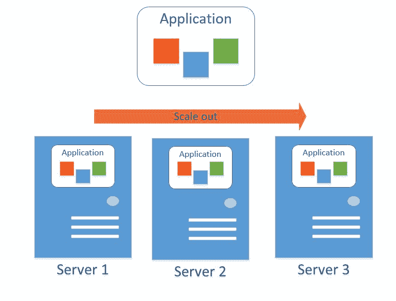

以下是微服务架构的表示，它将应用程序分成较小的服务，并根据工作负载独立扩展：

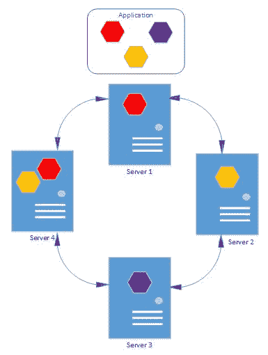

在微服务架构中，应用程序被划分为松散耦合的服务，每个服务都公开一个端点，并部署在单独的服务器上，或者更可能是容器上。每个服务通过某些端点与其他服务通信。

# 微服务架构的好处

微服务架构有各种好处，如下所示：

+   微服务是自治的，并且通过与其他服务松散耦合的依赖关系公开了一个独立的功能单元

+   它通过明确定义的 API 合同向调用者公开功能

+   如果任何服务失败，它会优雅地降级

+   它可以独立扩展。

+   与 VM 相比，它最适合容器化部署，这是一种经济有效的解决方案

+   每个组件可以通过端点重用，并且修改任何服务不会影响其他服务

+   与单体架构相比，开发速度更快

+   由于每个微服务提供特定的业务能力，因此它很容易被重用和组合

+   由于每个服务都是独立的，因此使用旧的架构或技术并不是一个问题。

+   它是弹性的，消除了单体故障转移场景

# 开发微服务的标准实践

作为标准做法，微服务是根据业务能力或业务领域设计和分解的。业务领域分解遵循**领域驱动设计**（**DDD**）模式，其中每个服务都被开发为提供业务领域的特定功能。这与分层架构方法相反，分层架构方法将应用程序分成多个层，其中每个层依赖于另一层，并且对其有严格的依赖性，移除任何一层都会破坏整个应用程序。

以下图表说明了分层架构和微服务架构之间的区别：

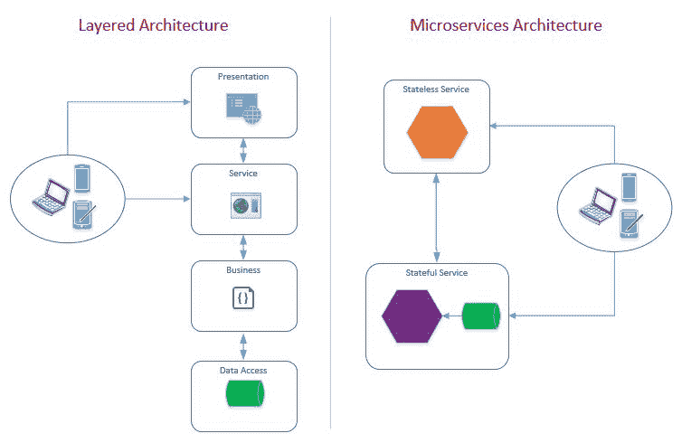

# 微服务的类型

微服务分为两类，如下所示：

+   无状态微服务

+   有状态的微服务

# 无状态微服务

无状态服务要么没有状态，要么可以从外部数据存储中检索状态。由于状态是单独存储的，多个实例可以同时运行。

# 有状态的微服务

有状态服务在其自己的上下文中维护状态。一次只有一个实例是活动的。但是，状态也会复制到其他非活动实例中。

# DDD

DDD 是一种强调应用程序业务域的模式。在按照 DDD 模式构建应用程序时，我们根据业务域划分应用程序，每个域都有一个或多个有界上下文，有界上下文代表业务需求。在技术术语中，每个有界上下文都有自己的代码和持久性机制，并且独立于其他上下文。考虑一个供应商管理系统，供应商在网站上注册，登录网站，更新其个人资料并附加报价。每种操作都被称为有界上下文，并且独立于其他操作。一组供应商操作可以称为供应商领域。

DDD 将需求分解为特定领域的块，称为有界上下文，每个有界上下文都有自己的模型，逻辑和数据。有可能一个单一服务被许多服务使用，因为它提供了核心功能。例如，供应商注册服务使用身份验证服务来创建新用户，同样的身份验证服务可能被其他服务用来登录系统。

# 使用微服务进行数据操作

作为一般做法，每个服务为用户提供特定的业务功能，并涉及**创建**，**读取**，**更新**和**删除**（**CRUD**）操作。在企业应用程序中，我们有一个或多个具有许多表的数据库。遵循 DDD 模式，我们可以设计每个专注于特定领域的服务。但是，有时我们需要从一些其他超出服务领域范围的数据库或表中提取数据。然而，有两种方法可以解决这个挑战：

+   将微服务包装在 API 网关后面

+   将数据分解为扁平模式以供读取/查询目的

# 将微服务包装在 API 网关后面

基于微服务架构的企业应用程序包含许多服务。**企业资源规划**（**ERP**）系统包含许多模块，如**人力资源**（**HR**），财务，采购申请等。每个模块可能有许多提供特定业务功能的服务。例如，HR 模块可能包含以下三个服务：

+   个人记录管理

+   评估管理

+   招聘管理

个人记录管理服务公开了一些方法，用于创建、更新或删除员工的基本信息。绩效管理服务公开了一些方法，用于为员工创建绩效评估请求，招聘管理服务执行新的招聘决策。假设我们需要开发一个包含基本员工信息和过去五年内完成的评估总数的网页。在这种情况下，我们将调用两个服务，即个人记录管理和绩效管理，调用者将对这些服务进行两次单独的调用。或者，我们可以将这两个调用封装成一个单一的调用，使用 API 网关。解决这种情况的技术称为**API 组合**，在本章后面的*什么是 API 组合？*部分中进行了讨论。

# 将数据非规范化为扁平模式以供读取/查询

这是另一种技术，我们希望消费一个服务来从异构源读取数据。它可以来自多个表或数据库。为了将多个服务调用转换为单个调用，我们可以设计每个服务，并使用发布者/订阅者或中介等模式，监听要在任何服务上执行的任何 CRUD 操作，将数据保存到扁平模式中，并开发一个仅从该表中读取数据的服务。解决这种情况的技术称为**命令查询责任分离**（**CQRS**），在本章后面的 CQRS 部分中进行了讨论。

# 业务场景的一致性

由于我们了解到每个服务都设计为提供特定的业务功能，让我们以订单管理系统为例，客户访问网站并下订单。下订单后，库存会反映出来。在这种情况下，我们可以有两个微服务：一个用于下订单并在订单数据库中创建数据库记录，另一个是执行库存相关表上的 CRUD 的库存服务：


在实施端到端业务场景并在多个微服务之间保持一致性时，要遵循的重要实践是保持数据和模型特定于其领域。考虑前面的例子，订单放置服务不应访问或执行订单表以外的 CRUD 操作，如果需要访问任何超出该服务领域的数据，应直接调用该服务。

**原子性、一致性、完整性和持久性**（**ACID**）事务是另一个挑战。我们可能有多个服务为一个完整的事务提供服务，其中每个事务都在一个单独的服务后面运行。为了适应微服务架构风格的 ACID 事务，我们可以实现**异步事件驱动通信**，这将在本章后面进行讨论。

# 与微服务通信

在微服务架构中，每个微服务都托管在某个服务器上，很可能是一个容器，并公开一个端点。这些端点可以用于与该服务进行通信。有许多协议可以使用，但由于在许多平台上具有可访问性支持，基于 REST 的 HTTP 端点是最广泛使用的。在 ASP.NET Core 中，我们可以使用 ASP.NET Core MVC 框架创建微服务，并通过 RESTful 端点使用它们。还有一些微服务也使用其他微服务来完成特定操作，这可以很容易地通过.NET Core 中的`HttpClient`类来实现。然而，我们应该设计成这样，使我们的服务具有弹性，并处理瞬态故障。

# 微服务架构中的数据库架构

使用微服务架构，每个服务提供特定功能，并且对其他服务的依赖性很小。然而，将关系数据库转换为较小的集合是一个挑战，其中每个集合代表一个特定领域，并包含与该领域相关的表。根据领域对表进行分离并使它们成为独立的数据库需要适当的考虑。

让我们考虑提供**企业对消费者**（B2C）和**企业对企业**（B2B）流程的供应商管理系统，并涉及以下操作：

+   供应商在网站上注册

+   供应商添加其他供应商或客户可以购买的产品。

+   供应商下订单购买产品

为了实现上述场景，我们可以根据以下两种模式对数据库进行分解：

+   每个服务的表

+   每个服务的数据库

# 每个服务的表

采用这种设计，每个服务都设计为使用数据库中的特定表。在这种情况下，数据库是集中的，托管在一个地方。其他微服务也连接到同一个数据库，但处理自己的领域特定表：

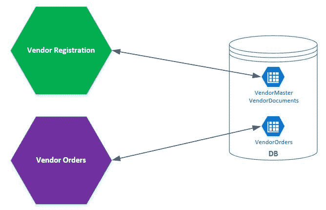

这有助于我们使用中央数据库，但模式的任何修改可能会破坏或需要更新一个或多个微服务。

# 每个服务的数据库

采用这种设计，每个服务都有自己的数据库，应用程序松散耦合。对数据库的修改不会损害或破坏任何其他服务，并提供完全隔离。这种设计对部署场景很有好处，因为每个服务都包含自己的数据库，部署在自己的容器中：

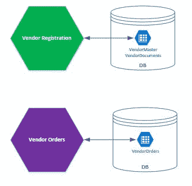

# 按服务分离表或数据库的挑战

根据业务能力或业务领域对表或数据库进行分离，建议限制依赖关系并使其与领域模型保持完整。但这也带来了一些挑战。例如，我们有两个服务：供应商服务和订单服务。供应商服务用于在自己的供应商数据库中创建供应商记录，订单服务用于为特定供应商下订单。当我们需要将供应商及其订单的聚合记录返回给用户时，就会面临挑战。为了解决这个问题，我们可以使用以下两种方法之一：

+   API 组合

+   CQRS

# 什么是 API 组合？

API 组合是一种技术，其中多个微服务被组合以向用户公开一个端点，并提供聚合视图。在单个数据库中，通过进行 SQL 查询连接并从不同表中获取数据，这是很容易实现的。

让我们考虑供应商管理系统，我们有两个服务。一个用于注册新供应商，并有相应的数据库来保存供应商的人口统计学、地址和其他信息。另一个服务是订单服务，用于存储供应商的交易数据，并包含订单信息，如订单号、数量等。假设我们有一个要求显示已完成订单的供应商列表。在这种情况下，我们可以在供应商注册服务中提供一个方法，首先从自己的数据存储中加载供应商详细信息，然后通过调用订单服务加载他们的订单，最后返回聚合数据。

# CQRS

CQRS 是一个原则，其中应用程序命令（如创建，更新和删除）被读操作分隔。它基于事件模型工作，当 API 上采取任何创建，更新或删除操作时，事件处理程序被调用并将该信息存储到其相应的数据存储中。我们可以在先前的供应商注册示例中实现 CQRS，这将方便从单个服务查询供应商及其订单。当在供应商或订单服务上执行任何命令（创建，更新，删除）操作时，它将调用处理程序来调用查询服务，将更新的数据保存到其存储中。

我们可以将数据保留在扁平模式中，或者使用 NoSQL 数据库来保存有关供应商及其订单的所有信息，并在需要时读取它们：

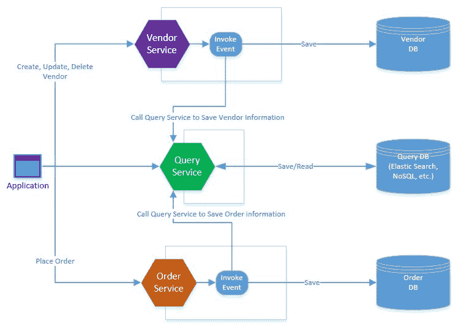

上述图表代表了三个服务：供应商服务，订单服务和查询服务。当在供应商服务上执行任何创建，更新或删除操作时，事件被触发，并调用相应的处理程序，使 HTTP POST，PUT 或 DELETE 请求在查询服务上保存或更新其数据存储。订单服务也是如此，它调用查询服务并存储与订单相关的信息。最后，查询服务用于在单个调用中读取独立服务的累积数据。

这种方法的好处如下：

+   我们可以通过定义集群和非集群索引来优化查询数据库

+   我们可以使用其他数据库模型，如 NoSQL，MongoDB 或 Elasticsearch，为用户提供更快的检索和搜索体验

+   每个服务都有自己的数据存储，但是通过这种方法，我们可以将数据聚合在一个地方

+   我们可以使用查询数据进行报告

CQRS 可以使用中介者模式来实现，我们将在本章后面讨论。

# 使用.NET Core 开发微服务架构

到目前为止，我们已经学习了微服务的基础知识和 DDD 的重要性。在本节中，我们将为一个包含以下功能的示例应用程序开发微服务架构：

+   身份服务

+   供应商服务

# 使用微服务架构在.NET Core 中创建一个示例应用程序

在本节中，我们将在.NET Core 中创建一个示例应用程序，并定义包括授权服务器、供应商服务和订单服务在内的服务。首先，我们可以使用 Visual Studio 2017 或 Visual Studio Code，并使用 dotnet **命令行界面**（**CLI**）工具创建项目。选择 Visual Studio 2017 的优势在于，在创建项目时提供了一个选项，可以启用 Docker 支持，添加与 Docker 相关的文件，并将 Docker 设置为启动项目：

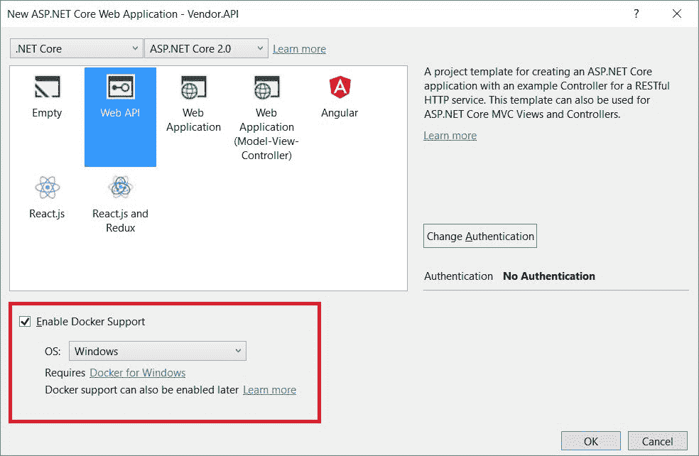

# 解决方案结构

解决方案的结构将如下所示：

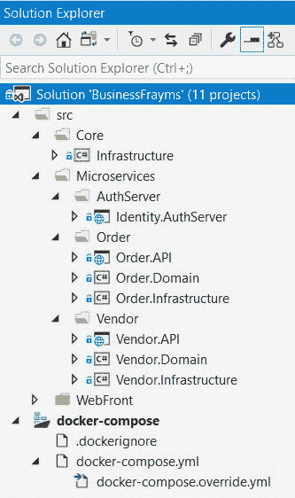

在上述结构中，我们有根文件夹，即`核心`，`微服务`和`WebFront`。共同和核心组件驻留在`核心`中，所有微服务驻留在`微服务`文件夹中，`WebFront`包含前端项目，很可能是 ASP.NET MVC Core 项目，移动应用程序等。

在指定文件夹内创建项目可以为解决方案赋予适当的含义，并且使得理解解决方案的整体图像变得容易。

以下表格显示了每个文件夹中创建的项目：

| **文件夹** | **项目名称** | **项目类型** | **描述** |
| --- | --- | --- | --- |
| `核心` | `基础设施` | .NET 标准 2.0 | 包含存储库类，`UnitOfWork`和`BaseEntity` |
| `核心` | `API 组件` | .NET 标准 2.0 | 包含`BaseController`，`LoggingActionFilter`和`ResilientHttpClient` |
| `微服务 > 认证服务器` | `Identity.AuthServer` | ASP.NET Core 2.0 web API | 使用 OpenIddict 和 ASP.NET Core Identity 的授权服务器 |
| `微服务 >``供应商` | `供应商.API` | ASP.NET Core 2.0 web API | 包含供应商 API 控制器 |
| `微服务 >``供应商` | `供应商.Domain` | .NET Standard 2.0 | 包含特定于供应商领域的领域模型 |
| `微服务 >``供应商` | `供应商.Infrastructure` | .NET Standard 2.0 | 包含特定于供应商的存储库和数据库上下文 |
| `WebFront` | `FraymsWebApp` | ASP.NET Core 2.0 web app | 包含前端视图、页面和客户端框架 |

# 逻辑架构

示例应用的逻辑架构代表了两个微服务，即身份服务和供应商服务。身份服务用于执行用户身份验证和授权，而供应商服务用于执行供应商注册：

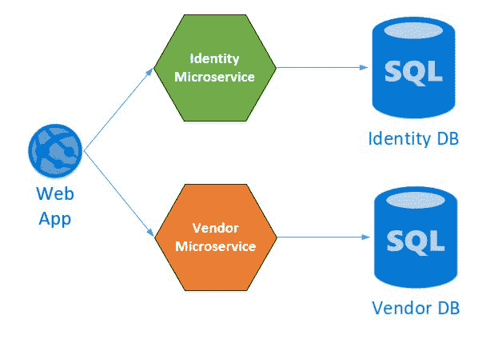

我们将使用 DDD 方法来表达数据模型，其中每个服务将有其自己对应的表。

供应商服务基于业务领域，分为三层，即暴露 HTTP 端点并由客户端使用的 API 层，包含领域实体、聚合和 DDD 模式的领域层，以及包含所有通用类的基础设施层，包括存储库、**Entity Framework** (**EF**)、Core 上下文和其他辅助类。

领域层是实际定义业务逻辑和实体的层，通常是特定业务场景的**Plain Old CLR Object** (**POCO**)。它不应直接依赖于任何数据库框架或**对象关系映射** (**ORM**)，如 EF、Hibernate 等。然而，使用 EF Core，我们可以将实体与其他程序集分开，并将它们定义为 POCO 实体，从而消除对 EF Core 库的依赖。

当 API 收到请求时，它使用领域层执行特定的业务场景并传递接收到的数据。领域层执行业务逻辑并使用基础设施层对数据库执行 CRUD 操作。最后，API 将响应发送回调用者：

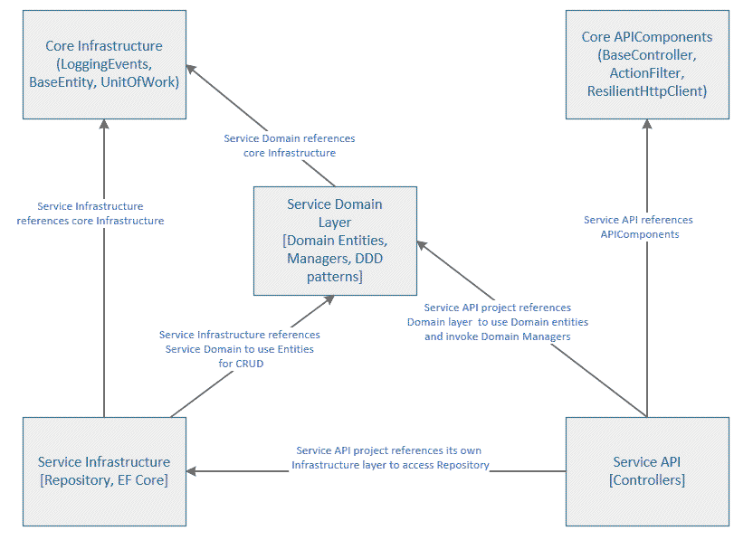

# 开发核心基础设施项目

该项目包含应用程序使用的核心类和组件。它将包含一些通用或基础类、门面和其他在整个应用程序中通用的辅助类。

我们将创建以下类，并讨论它们对于特定于微服务的其他项目的用处。

# 创建 BaseEntity 类

```cs
BaseEntity class:
```

```cs
public abstract class BaseEntity 
{ 

  public BaseEntity() 
  { 
    this.CreatedOn = DateTime.Now; 
    this.UpdatedOn = DateTime.Now; 
    this.State = (int)EntityState.New; 

  } 
  public string CreatedBy { get; set; } 
  public DateTime CreatedOn { get; set; } 
  public string UpdatedBy { get; set; } 
  public DateTime UpdatedOn { get; set; } 

} 

```

使用`NotMapped`属性注释的任何属性都不会在后端数据库中创建相应的字段。

# UnitOfWork 模式

我们将实现`UnitOfWork`模式，以便在单个调用中保存上下文更改到后端数据库。在每个对象状态更改时更新数据库不是一个好的做法，会降低应用程序性能。考虑一个包含可编辑表格的表单的例子。在每次行更新时提交更改到数据库会降低应用程序性能。更好的方法是将每行状态保存在内存中，并在提交表单后一次性更新数据库。使用 Unit of Work 模式，我们可以定义一个包含以下四个方法的接口：

```cs
public interface IUnitOfWork: IDisposable 
{ 
  void BeginTransaction(); 

  void RollbackTransaction(); 

  void CommitTransaction(); 

  Task<bool> SaveChangesAsync(); 

} 
```

接口包含与事务相关的方法，即`BeginTransaction`、`RollbackTransaction`和`CommitTransaction`，其中`SaveChangesAsync`用于保存对数据库的更改。每个服务都有自己的数据库上下文实现，并实现了`IUnitOfWork`接口，以提供事务处理并将更改保存到后端数据库。

# 创建存储库接口

我们将创建一个通用的存储库接口，每个服务的存储库类都将实现该接口，因为每个服务都将遵循 DDD 方法，并且都有自己的存储库，以便根据业务域向开发人员提供有意义的信息。在这个接口中，我们可以保留通用方法，如`All`和`Contains`，以及返回`UnitOfWork`的属性：

```cs
public interface IRepository<T> where T : BaseEntity 
{ 
  IUnitOfWork UnitOfWork { get; } 

  IQueryable<T> All<T>() where T : BaseEntity; 
  T Find<T>(Expression<Func<T, bool>> predicate) where T : BaseEntity; 

  bool Contains<T>(Expression<Func<T, bool>> predicate) where T : BaseEntity; 
} 
```

# 日志记录

日志记录是任何企业应用程序的重要部分。通过日志记录，我们可以在应用程序运行时跟踪或排除实际错误。在任何优秀的产品中，我们通常看到每个错误都有一个错误代码。定义错误代码，然后在记录异常时使用它们直观地告诉开发人员或支持团队进行故障排除，并达到实际错误发生的地点并提供解决方案。对于所有应用程序级错误，我们可以创建一个`LoggingEvents`类，并指定在开发过程中可以进一步使用的常量值。这是包含一些`GET`、`CREATE`、`UPDATE`和其他事件代码的`LoggingEvents`类。我们可以在`Infrastructure`项目的`Façade`文件夹下创建这个类：

```cs
public static class LoggingEvents 
{ 
  public const int GET_ITEM = 1001; 
  public const int GET_ITEMS = 1002; 
  public const int CREATE_ITEM = 1003; 
  public const int UPDATE_ITEM = 1004; 
  public const int DELETE_ITEM = 1005; 
  public const int DATABASE_ERROR = 2000; 
  public const int SERVICE_ERROR = 2001; 
  public const int ERROR = 2002; 
  public const int ACCESS_METHOD = 3000; 
} 
LoggerHelper class:
```

```cs
public static string GetExceptionDetails(Exception ex) 
{ 

  StringBuilder errorString = new StringBuilder(); 
  errorString.AppendLine("An error occured. "); 
  Exception inner = ex; 
  while (inner != null) 
  { 
    errorString.Append("Error Message:"); 
    errorString.AppendLine(ex.Message); 
    errorString.Append("Stack Trace:"); 
    errorString.AppendLine(ex.StackTrace); 
    inner = inner.InnerException; 
  } 
  return errorString.ToString(); 
} 
```

# 创建 APIComponents 基础设施项目

```cs
BaseController class:
```

```cs
public class BaseController : Controller 
{ 
  private ILogger _logger; 
  public BaseController(ILogger logger) 
  { 
    _logger = logger; 
  } 

  public ILogger Logger { get { return _logger; } } 
  public HttpResponseMessage LogException(Exception ex) 
  { 
    HttpResponseMessage message = new HttpResponseMessage(); 
    message.Content = new StringContent(ex.Message); 
    message.StatusCode = System.Net.HttpStatusCode.ExpectationFailed; 
    return message; 
  } 
} 
```

`BaseController`在参数化构造函数中使用`ILogger`，它将通过 ASP.NET Core 的内置**依赖注入**（**DI**）组件进行注入。

`LogException`方法用于记录异常并返回`HttpResponseMessage`，在发生任何错误时，派生控制器将返回给用户。

```cs
LoggingActionFilter class:
```

```cs
public class LoggingActionFilter: ActionFilterAttribute 
{ 
  public override void OnActionExecuting(ActionExecutingContext context) 
  { 

    Log("OnActionExecuting", context.RouteData, context.Controller); 

  } 

  public override void OnActionExecuted(ActionExecutedContext context) 
  { 
    Log("OnActionExecuted", context.RouteData, context.Controller); 

  } 

  public override void OnResultExecuted(ResultExecutedContext context) 
  { 
    Log("OnResultExecuted", context.RouteData, context.Controller); 
  } 

  public override void OnResultExecuting(ResultExecutingContext context) 
  { 
    Log("OnResultExecuting", context.RouteData, context.Controller); 
  } 

  private void Log(string methodName, RouteData routeData, Object controller) 
  { 
    var controllerName = routeData.Values["controller"]; 
    var actionName = routeData.Values["action"]; 
    var message = String.Format("{0} controller:{1} action:{2}", 
    methodName, controllerName, actionName); 
    BaseController baseController = ((BaseController)controller); 
    baseController.Logger.LogInformation(LoggingEvents.ACCESS_METHOD, message); 
  } 
} 
```

在这个项目中，我们还有`ResilientHttpClient`，我们在第七章中学习了*在.NET Core 应用程序中实现弹性和安全*。

# 为用户授权开发身份服务

在 ASP.NET Core 中，我们可以选择从各种身份验证提供程序对应用程序进行身份验证。在微服务架构中，服务是分别部署和托管在不同的容器中的。我们可以使用 ASP.NET Core Identity 并将其添加为服务本身的中间件，或者我们可以使用 IdentityServer 并开发一个中央身份验证服务器来执行身份验证和授权中心化，访问所有注册到**中央身份验证服务器**（**CAS**）的服务，并通过传递令牌访问受保护的资源。

身份服务基本上充当注册企业中所有服务的 CAS。当请求到达服务时，它会请求可以从授权服务器获取的令牌。一旦获得令牌，就可以用它来访问资源服务。

有各种库来构建身份验证服务器，如下所示：

+   IdentityServer4：IdentityServer4 是 ASP.NET Core 的 OpenID Connect 和 OAuth 2.0 框架

+   **OpenIddict**：在 ASP.NET Core 项目中实现 OpenID Connect 服务器的易于插入的解决方案

+   **ASOS (AspNet.Security.OpenIdConnect.Server)**：ASOS 是一个高级的 OpenID Connect 服务器，旨在提供低级协议优先的方法

我们将在我们的身份服务中使用 OpenIddict。

# OpenIddict 连接流

OpenIddict 提供各种类型的流，包括授权代码流、密码流、客户端凭据流等。然而，在本章中，我们使用了隐式流。

在隐式流中，令牌是通过授权端点通过传递用户名和密码来检索的。所有通信都在单次往返中与授权服务器完成。认证完成后，令牌被添加到重定向 URI 中，并且可以在后续请求中通过传递请求标头来使用。以下图表描述了隐式流的工作原理：

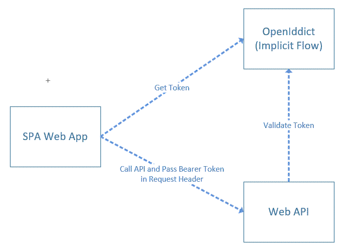

隐式流广泛用于**单页应用程序**（**SPAs**）。该过程始于单页应用程序 Web 应用程序希望访问受保护的资源服务器上的受保护的 Web API。由于 Web API 受保护，它需要一个令牌来验证请求并验证调用者。为了获取令牌（通常称为持有者令牌），单页应用程序首先前往授权服务器并输入用户名和密码。成功验证后，授权服务器返回令牌并将其附加到重定向 URI 本身。Web 应用程序解析**统一资源定位符**（**URL**）并检索令牌，进一步用于访问受保护的资源。

# 创建身份服务项目

身份服务是一个 ASP.NET Core Web API 项目。要使用 OpenIddict 库，我们必须在 Visual Studio 的包源对话框中添加一个`aspnet-contrib`引用。要从 Visual Studio 中添加此源，请右键单击项目，然后点击设置按钮，如下截图所示：


然后添加`aspnet-contrib`的条目，源为[`www.myget.org/F/aspnet-contrib/api/v3/index.json`](https://www.myget.org/F/aspnet-contrib/api/v3/index.json)：

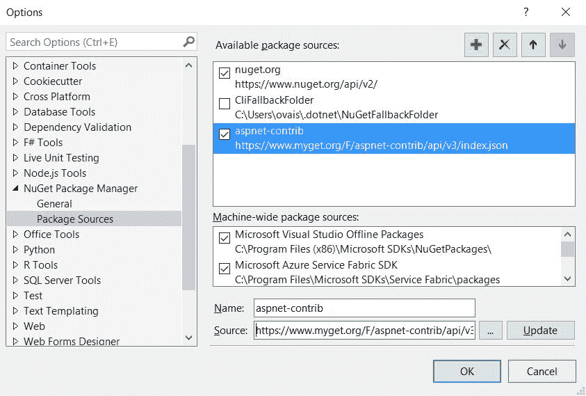

添加了这些后，我们现在可以在 NuGet 包管理器窗口中轻松添加 OpenIddict 包。

请记住检查是否选中了包括预发布复选框。

以下是我们可以直接添加到项目文件或从 Visual Studio 的 NuGet 包管理器窗口中添加的包：

```cs
<PackageReference Include="AspNet.Security.OAuth.Validation" Version="2.0.0-rc1-final" /> 
<PackageReference Include="AspNet.Security.OpenIdConnect.Server" Version="2.0.0-rc1-final" /> 
<PackageReference Include="Microsoft.AspNetCore.Identity" Version="2.0.1" /> 
<PackageReference Include="Microsoft.AspNetCore.Identity.EntityFrameworkCore" Version="2.0.1" /> 
<PackageReference Include="Microsoft.VisualStudio.Web.CodeGeneration.Design" Version="2.0.2" /> 
<PackageReference Include="OpenIddict" Version="2.0.0-rc2-0797" /> 
<PackageReference Include="OpenIddict.Core" Version="2.0.0-rc2-0797" /> 
<PackageReference Include="OpenIddict.EntityFrameworkCore" Version="2.0.0-rc2-0797" /> 
<PackageReference Include="OpenIddict.Models" Version="2.0.0-rc2-0797" /> 
<PackageReference Include="OpenIddict.Mvc" Version="2.0.0-rc2-0797" /> 
```

**添加自定义 UserEntity 和 UserRole 类**

ASP.NET Core Identity 包含`IdentityUser`和`IdentityRole`类，并使用 EF Core 来创建后端数据库。但是，如果我们想要自定义默认表，可以通过继承这些基类来实现。

我们将创建一个`Models`文件夹，并通过创建自定义的`UserEntity`类来自定义`IdentityUser`，并添加以下四个字段：

```cs
public class UserEntity : IdentityUser<Guid> 
{ 

  public int VendorId { get; set; } 

  public string FirstName { get; set; } 
  public string LastName { get; set; } 

  public DateTimeOffset CreatedAt { get; set; } 

} 
```

我们添加了这些字段，所以当供应商注册时，我们将在这个表中保留他们的名字、姓氏和 ID。接下来，我们添加另一个类`UserRole`，它派生自`IdentityRole`，并添加以下参数化构造函数：

```cs
public class UserRoleEntity : IdentityRole<Guid> 
{ 
  public UserRoleEntity() : base() { } 

  public UserRoleEntity(string roleName) : base(roleName) { } 
} 
```

我们将添加一个自定义数据库上下文类，它派生自`IdentityDbContext`，并指定`UserEntity`和`UserRoleEntity`类型如下：

```cs
public class BFIdentityContext : IdentityDbContext<UserEntity, UserRoleEntity, Guid> 
{ 
  public BFIdentityContext(Microsoft.EntityFrameworkCore.DbContextOptions options) : 
  base(options) { } 
} 
```

我们可以运行 EF Core 迁移来创建 ASP.NET Identity 表，也可以使用 EF CLI 工具运行迁移。在运行迁移之前，我们在`Startup`类的`ConfigureServices`方法中添加以下条目：

```cs
public void ConfigureServices(IServiceCollection services) 
{ 
  var connection= Configuration["ConnectionString"]; 

  services.AddDbContext<BFIdentityContext>(options => 
  { 
    // Configure the context to use Microsoft SQL Server. 
    options.UseSqlServer(connection); 
  }); 

  services.AddIdentity<UserEntity, UserRole>().AddEntityFrameworkStores<BFIdentityContext>(); 

  services.AddMvc(); 
}   
```

您可以从 Visual Studio 的包管理器控制台窗口运行 EF 迁移。要添加迁移，首先运行以下命令：

```cs
Add-Migration Initial
```

`Add-Migration`是 EF CLI 工具集的命令，其中`Initial`是迁移的名称。一旦我们运行这个命令，它将在我们的项目中添加`Migrations`文件夹和包含`Up`和`Down`方法的`Initial`类，以应用或移除对数据库的更改。接下来，我们可以运行`Update-Database`命令，加载`Initial`类并将更改应用到后端数据库。

现在我们在`Startup`类中添加与 OpenIddict 隐式流相关的配置。以下是修改后的`ConfigureServices`方法，添加了 OpenIddict 隐式流：

```cs
public void ConfigureServices(IServiceCollection services) 
{ 

  var connection = @"Server=.sqlexpress;Database=FraymsIdentityDB;
  User Id=sa;Password=P@ssw0rd;"; 

  services.AddDbContext<BFIdentityContext>(options => 
  { 
    // Configure the context to use Microsoft SQL Server. 
    options.UseSqlServer(connection); 

    // Register the entity sets needed by OpenIddict. 
    // Note: use the generic overload if you need 
    // to replace the default OpenIddict entities. 
    options.UseOpenIddict(); 
  }); 

  services.AddIdentity<UserEntity, UserRoleEntity>() 
  .AddEntityFrameworkStores<BFIdentityContext>(); 

  // Configure Identity to use the same JWT claims as OpenIddict instead 
  // of the legacy WS-Federation claims it uses by default (ClaimTypes), 
  // which saves you from doing the mapping in your authorization controller. 
  services.Configure<IdentityOptions>(options => 
  { 
    options.ClaimsIdentity.UserNameClaimType = OpenIdConnectConstants.Claims.Name; 
    options.ClaimsIdentity.UserIdClaimType = OpenIdConnectConstants.Claims.Subject; 
    options.ClaimsIdentity.RoleClaimType = OpenIdConnectConstants.Claims.Role; 
  }); 

  // Register the OpenIddict services. 
  services.AddOpenIddict(options => 
  { 
    // Register the Entity Framework stores. 
    options.AddEntityFrameworkCoreStores<BFIdentityContext>(); 

    // Register the ASP.NET Core MVC binder used by OpenIddict. 
    // Note: if you don't call this method, you won't be able to 
    // bind OpenIdConnectRequest or OpenIdConnectResponse parameters. 
    options.AddMvcBinders(); 

    // Enable the authorization, logout, userinfo, and introspection endpoints. 
    options.EnableAuthorizationEndpoint("/connect/authorize") 
    .EnableLogoutEndpoint("/connect/logout") 
    .EnableIntrospectionEndpoint("/connect/introspect") 
    .EnableUserinfoEndpoint("/api/userinfo"); 

    // Note: the sample only uses the implicit code flow but you can enable 
    // the other flows if you need to support implicit, password or client credentials. 
    options.AllowImplicitFlow(); 

    // During development, you can disable the HTTPS requirement. 
    options.DisableHttpsRequirement(); 

    // Register a new ephemeral key, that is discarded when the application 
    // shuts down. Tokens signed using this key are automatically invalidated. 
    // This method should only be used during development. 
    options.AddEphemeralSigningKey(); 

    options.UseJsonWebTokens(); 
  }); 

  services.AddAuthentication() 
  .AddOAuthValidation(); 

  services.AddCors(); 
  services.AddMvc(); 
}  
```

在前面的方法中，我们首先在`AddDbContext`选项中添加`UseOpenIddict`方法，它将在数据库中创建与 OpenIddict 相关的表。然后，我们通过设置`IdentityOptions`来配置 Identity，以使用与 OpenIddict 相同的**JSON Web Tokens (JWT)**声明，如下所示：

```cs
services.Configure<IdentityOptions>(options => 
{ 
  options.ClaimsIdentity.UserNameClaimType = OpenIdConnectConstants.Claims.Name; 
  options.ClaimsIdentity.UserIdClaimType = OpenIdConnectConstants.Claims.Subject; 
  options.ClaimsIdentity.RoleClaimType = OpenIdConnectConstants.Claims.Role; 
}); 
```

最后，我们通过调用`services.AddOpenIddict`方法注册 OpenIddict 功能并指定值。

以下是`Configure`方法，首先启用**跨源资源共享**（**CORS**），允许来自任何标头、来源和方法的请求。然后，添加身份验证并调用`InitializeAsync`方法，以填充 OpenIddict 表中的应用程序和资源（服务）信息：

```cs
public void Configure(IApplicationBuilder app) 
{ 
  app.UseCors(builder => 
  { 
    builder.AllowAnyOrigin(); 
    builder.AllowAnyHeader(); 
    builder.AllowAnyMethod(); 
  }); 

  app.UseAuthentication(); 

  app.UseMvcWithDefaultRoute(); 

  // Seed the database with the sample applications. 
  // Note: in a real world application, this step should be part of a setup script. 
  InitializeAsync(app.ApplicationServices, CancellationToken.None).GetAwaiter().GetResult(); 
} 
```

以下是所示的`InitializeAsync`方法：

```cs
private async Task InitializeAsync(IServiceProvider services, CancellationToken cancellationToken) 
{ 
  // Create a new service scope to ensure the database context 
  // is correctly disposed when this methods returns. 
  using (var scope = services.GetRequiredService<IServiceScopeFactory>().CreateScope()) 
  { 
    var context = scope.ServiceProvider.GetRequiredService<BFIdentityContext>(); 
    await context.Database.EnsureCreatedAsync(); 

    var manager = scope.ServiceProvider.GetRequiredService
    <OpenIddictApplicationManager<OpenIddictApplication>>(); 

    if (await manager.FindByClientIdAsync("bfrwebapp", cancellationToken) == null) 
    { 
      var descriptor = new OpenIddictApplicationDescriptor 
      { 
        ClientId = "bfrwebapp", 
        DisplayName = "Business Frayms web application", 
        PostLogoutRedirectUris = { new Uri("http://localhost:8080/signout-oidc") }, 
        RedirectUris = { new Uri("http://localhost:8080/signin-oidc") } 
      }; 

      await manager.CreateAsync(descriptor, cancellationToken); 
    } 

    if (await manager.FindByClientIdAsync("vendor-api", cancellationToken) == null) 
    { 
      var descriptor = new OpenIddictApplicationDescriptor 
      { 
        ClientId = "vendor-api", 
        ClientSecret = "846B62D0-DEF9-4215-A99D-86E6B8DAB342", 
        //RedirectUris = { new Uri("http://localhost:12345/api") } 
      }; 

      await manager.CreateAsync(descriptor, cancellationToken); 
    } 

  } 
} 
```

在上述方法中，我们添加了以下三个应用程序：

+   `bfrwebapp`：一个 ASP.NET Core Web 应用程序。当用户访问 Web 应用程序时，它会检查用户是否经过身份验证，根据是否提供了令牌。如果用户未经身份验证，它将重定向到授权服务器。用户输入凭据，并在成功验证后，将重定向回`bfrwebapp`。在此范围内指定的重定向 URI 是`bfrwebapp`的 URI。

+   `vendor-api`：具有唯一客户端密钥的供应商微服务。

前面的配置是服务器端配置，我们将看到客户端需要添加哪些配置。

```cs
AuthorizationController:
```

```cs
public class AuthorizationController : Controller 
{ 
  private readonly IOptions<IdentityOptions> _identityOptions; 
  private readonly SignInManager<UserEntity> _signInManager; 
  private readonly UserManager<UserEntity> _userManager; 

  public AuthorizationController( 
    IOptions<IdentityOptions> identityOptions, 
    SignInManager<UserEntity> signInManager, 
    UserManager<UserEntity> userManager) 
  { 
    _identityOptions = identityOptions; 
    _signInManager = signInManager; 
    _userManager = userManager; 
  } 

  [HttpGet("~/connect/authorize")] 
  public async Task<IActionResult> Authorize(OpenIdConnectRequest request) 
  { 
    Debug.Assert(request.IsAuthorizationRequest(), 
    "The OpenIddict binder for ASP.NET Core MVC is not registered. " + 
    "Make sure services.AddOpenIddict().AddMvcBinders() is correctly called."); 

    if (!User.Identity.IsAuthenticated) 
    { 
      // If the client application request promptless authentication, 
      // return an error indicating that the user is not logged in. 
      if (request.HasPrompt(OpenIdConnectConstants.Prompts.None)) 
      { 
        var properties = new AuthenticationProperties(new Dictionary<string, string> 
        { 
          [OpenIdConnectConstants.Properties.Error] = 
          OpenIdConnectConstants.Errors.LoginRequired, 
          [OpenIdConnectConstants.Properties.ErrorDescription] = 
          "The user is not logged in." 
        }); 

        // Ask OpenIddict to return a login_required error to the client application. 
        return Forbid(properties, OpenIdConnectServerDefaults.AuthenticationScheme); 
      } 

      return Challenge(); 
    } 

    // Retrieve the profile of the logged in user. 
    var user = await _userManager.GetUserAsync(User); 
    if (user == null) 
    { 
      return BadRequest(new OpenIdConnectResponse 
      { 
        Error = OpenIdConnectConstants.Errors.InvalidGrant, 
        ErrorDescription = "The username/password couple is invalid." 
      }); 
    } 

    // Create a new authentication ticket. 
    var ticket = await CreateTicketAsync(request, user); 

    // Returning a SignInResult will ask OpenIddict to issue 
    the appropriate access/identity tokens. 
    return SignIn(ticket.Principal, ticket.Properties, ticket.AuthenticationScheme); 
  } 

  [HttpGet("~/connect/logout")] 
  public async Task<IActionResult> Logout() 
  { 
    // Ask ASP.NET Core Identity to delete the local and external cookies created 
    // when the user agent is redirected from the external identity provider 
    // after a successful authentication flow (e.g Google or Facebook). 
    await _signInManager.SignOutAsync(); 

    // Returning a SignOutResult will ask OpenIddict to redirect the user agent 
    // to the post_logout_redirect_uri specified by the client application. 
    return SignOut(OpenIdConnectServerDefaults.AuthenticationScheme); 
  } 

  private async Task<AuthenticationTicket> CreateTicketAsync(
  OpenIdConnectRequest request, UserEntity user) 
  { 
    // Create a new ClaimsPrincipal containing the claims that 
    // will be used to create an id_token, a token or a code. 
    var principal = await _signInManager.CreateUserPrincipalAsync(user); 

    // Create a new authentication ticket holding the user identity. 
    var ticket = new AuthenticationTicket(principal, 
    new AuthenticationProperties(), 
    OpenIdConnectServerDefaults.AuthenticationScheme); 

    // Set the list of scopes granted to the client application. 
    ticket.SetScopes(new[] 
    { 
      OpenIdConnectConstants.Scopes.OpenId, 
      OpenIdConnectConstants.Scopes.Email, 
      OpenIdConnectConstants.Scopes.Profile, 
      OpenIddictConstants.Scopes.Roles 
    }.Intersect(request.GetScopes())); 

    ticket.SetResources("vendor-api"); 

    // Note: by default, claims are NOT automatically included in 
    // the access and identity tokens. 
    // To allow OpenIddict to serialize them, you must attach them a destination, that specifies 
    // whether they should be included in access tokens, in identity tokens or in both. 

    foreach (var claim in ticket.Principal.Claims) 
    { 
      // Never include the security stamp in the access and 
      // identity tokens, as it's a secret value. 
      if (claim.Type == _identityOptions.Value.ClaimsIdentity.SecurityStampClaimType) 
      { 
        continue; 
      } 

      var destinations = new List<string> 
      { 
        OpenIdConnectConstants.Destinations.AccessToken 
      }; 

      // Only add the iterated claim to the id_token if 
      // the corresponding scope was granted to the client application. 
      // The other claims will only be added to the access_token, 
      // which is encrypted when using the default format. 
      if ((claim.Type == OpenIdConnectConstants.Claims.Name && 
      ticket.HasScope(OpenIdConnectConstants.Scopes.Profile)) || 
      (claim.Type == OpenIdConnectConstants.Claims.Email && 
      ticket.HasScope(OpenIdConnectConstants.Scopes.Email)) || 
      (claim.Type == OpenIdConnectConstants.Claims.Role && 
      ticket.HasScope(OpenIddictConstants.Claims.Roles))) 
      { 
        destinations.Add(OpenIdConnectConstants.Destinations.IdentityToken); 
      } 

      claim.SetDestinations(destinations); 
    } 

    return ticket; 
  } 
} 
```

`AuthorizationController`公开两种方法，即`authorize`和`logout`。`authorize`方法检查用户是否经过身份验证，并返回一个挑战，显示登录页面，用户可以输入其用户名和密码。一旦输入了正确的凭据并且用户从身份表中验证通过，授权服务器将创建一个新的身份验证令牌，并根据为`bfrwebapp`指定的重定向 URI 将其返回给客户端应用程序。要查看工作示例，请参考代码存储库。

# 实现供应商服务

供应商服务是一个 Web API，公开了一个执行供应商注册的方法。该服务实现了供应商系统的实际业务领域，供应商可以注册。正如我们在前一节中所学到的，我们可以根据业务能力或业务领域来分解应用程序。该服务实现了 DDD 原则，并根据业务领域进行了分解。它包含以下三个项目：

+   `Vendor.API`：一个 ASP.NET Core Web API 项目，公开注册供应商的方法

+   `Vendor.Domain`：.NET Standard 2.0 类库，包含诸如`VendorMaster`和`VendorDocument`之类的 POCO 模型，以及一个`IVendorRepository`接口，用于定义供应商领域的基本方法。

+   `Vendor.Infrastructure`：.NET Standard 2.0 类库，包含实现`IVendorRepository`接口的`VendorRepository`和执行数据库操作的`VendorDBContext`。

# 创建供应商领域

创建一个新的.NET Standard 库项目，并将其命名为`Vendor.Domain`。我们将引用先前创建的`Infrastructure`项目，以从`BaseEntity`类派生我们的 POCO 实体。

```cs
VendorMaster class:
```

```cs
public class VendorMaster : BaseEntity 
{ 
  [Key] 
  public int ID { get; set; } 
  public string VendorName { get; set; } 
  public string ContractNumber { get; set; } 
  public string Email { get; set; } 
  public string Title { get; set; } 
  public string PrimaryContactPersonName{ get; set; } 
  public string PrimaryContactEmail { get; set; } 
  public string PrimaryContactNumber { get; set; } 
  public string SecondaryContactPersonName { get; set; } 
  public string SecondaryContactEmail { get; set; } 
  public string SecondaryContactNumber { get; set; } 
  public string Website { get; set; } 
  public string FaxNumber { get; set; } 
  public string AddressLine1 { get; set; } 
  public string AddressLine2 { get; set; } 
  public string City { get; set; } 
  public string State { get; set; } 
  public string Country { get; set; } 

  public List<VendorDocument> VendorDocuments { get; set; } 

} 
VendorDocument class:
```

```cs
public class VendorDocument : BaseEntity 
{ 

  [Key] 
  public int ID { get; set; } 
  public string DocumentName { get; set; } 
  public string DocumentType { get; set; } 
  public Byte[] DocumentContent { get; set; } 
  public DateTime DocumentExpiry { get; set; } 

  public int VendorMasterID { get; set; } 

  [ForeignKey("VendorMasterID")] 
  public VendorMaster VendorMaster { get; set; } 

} 
IVendorRepository interface:
```

```cs
public interface IVendorRepository : IRepository<VendorMaster> 
{ 
  VendorMaster Add(VendorMaster vendorMaster); 

  void Update(VendorMaster vendorMaster); 

  Task<VendorMaster> GetAsync(int vendorID); 

  void Add(VendorDocument vendorDocument); 

  void Delete(int vendorDocumentID); 
} 
```

# 创建供应商基础设施

该项目是一个.NET Standard 2.0 类库项目，引用了核心`Infrastructure`和`Vendor.Domain`项目。其中包含了`VendorRepository`的实际实现以及与后端 SQL Server 数据库连接的数据库上下文。

这是`VendorDBContext`类，它从 EF Core 的`DbContext`类派生，并为`VendorMaster`和`VendorDocument`实体定义了`DbSet`：

```cs
public class VendorDBContext : DbContext, IUnitOfWork 
{ 

  public VendorDBContext(DbContextOptions options) : base(options) 
  { 

  } 

  protected override void OnConfiguring(DbContextOptionsBuilder optionsBuilder) 
  { 
    base.OnConfiguring(optionsBuilder); 
    //  optionsBuilder.UseSqlServer(@"Data Source=.sqlexpress;
    Initial Catalog=FraymsVendorDB;Integrated Security=False; User Id=sa; 
    Password=P@ssw0rd; Timeout=500000;"); 
  } 

  protected override void OnModelCreating(ModelBuilder builder) 
  { 
    base.OnModelCreating(builder); 
  } 

  public void BeginTransaction() 
  { 
    this.Database.BeginTransaction(); 
  } 
  public void RollbackTransaction() 
  { 
    this.Database.RollbackTransaction(); 
  } 
  public void CommitTransaction() 
  { 
    this.Database.CommitTransaction(); 
  } 
  public Task<bool> SaveChangesAsync() 
  { 
    return this.SaveChangesAsync(); 
  } 

  public DbSet<VendorMaster> VendorMaster { get; set; } 
  public DbSet<VendorDocument> VendorDocuments { get; protected set; } 
```

我们还将实现`IUnitOfWork`接口，因此当`VendorRepository`被注入到控制器中时，我们可以执行事务处理并在单个调用中保存与关联数据库的更改。

以下是实现`IVendorRepository`接口的`VendorRepository`：

```cs
public class VendorRepository : IVendorRepository 
{ 

  VendorDBContext _dbContext; 

  public VendorRepository(VendorDBContext dbContext) 
  { 
    this._dbContext = dbContext; 
  } 

  public IUnitOfWork UnitOfWork 
  { 
    get 
    { 
      return _dbContext; 
    } 
  } 

  public VendorMaster Add(VendorMaster vendorMaster) 
  { 
    var res= _dbContext.Add(vendorMaster); 
    return res.Entity; 
  } 

  public void AddDocument(VendorDocument vendorDocument) 
  { 
    var res = _dbContext.Add(vendorDocument); 
  } 

  public void Update(VendorMaster vendorMaster) 
  { 
    _dbContext.Entry(vendorMaster).State = Microsoft.EntityFrameworkCore.EntityState.Modified; 
  } 

  public async Task<VendorMaster> GetAsync(int vendorID) 
  { 
    var vendorMaster = await _dbContext.VendorMaster.FindAsync(vendorID); 
    if (vendorMaster != null) 
    { 
      await _dbContext.Entry(vendorMaster) 
      .Collection(i => i.VendorDocuments).LoadAsync(); 
    } 
    return vendorMaster; 
  } 

  public IQueryable<T> All<T>() where T : BaseEntity 
  { 
    return _dbContext.Set<T>().AsQueryable(); 
  } 

  public bool Contains<T>(Expression<Func<T, bool>> predicate) where T : BaseEntity 
  { 
    return _dbContext.Set<T>().Count<T>(predicate) > 0; 
  } 

  public T Find<T>(Expression<Func<T, bool>> predicate) where T : BaseEntity 
  { 
    return _dbContext.Set<T>().FirstOrDefault<T>(predicate); 
  }       
}
```

# 创建供应商服务

我们现在将创建一个供应商服务项目，该项目将公开供客户端应用程序使用的方法来注册供应商。首先，让我们创建一个新的 ASP.NET Core Web API 项目，并将其命名为`Vendor.API`。

# 在供应商服务中实现中介者模式

在微服务架构中，一个应用被分割成多个服务，每个服务通过端点连接到其他服务。当事件被调用时，有可能一个服务会调用或与多个服务交互。隔离服务之间的交互始终是一种推荐的方法，并解决了对其他服务的紧密依赖。例如，一个应用程序调用此服务来注册供应商，然后调用身份服务来创建其用户帐户，并通过调用消息服务发送电子邮件。我们可以实现中介者模式来解决这种情况。

中介者模式基于事件驱动的拓扑结构，作为发布者/订阅者模型。当任何事件被调用时，注册的处理程序被调用并执行底层逻辑。这封装了服务之间如何相互交互的逻辑，使得每个交互的实际逻辑保持分离。此外，代码清晰且易于更改。

在`Vendor.API`中，我们将使用.NET 的`MediatR`库实现中介者模式。`MediatR`是中介者模式的实现，支持命令处理和领域事件发布。在接下来的部分中，我们将在用户注册时实现中介者，并调用身份服务来创建新用户并发送电子邮件。

要使用`MediatR`，我们必须添加以下两个包：

+   `MediatR`

+   `MediatR.Extensions.Microsoft.DependencyInjection`

添加这些包后，我们可以在`ConfigureServices`方法中调用`services.AddMediatR`方法添加它。`MediatR`提供以下两种类型的消息：

+   **请求/响应**：请求是可能返回值的命令

+   **通知**：通知是可能不返回值的事件

在我们的示例中，我们将实现请求/响应来将供应商记录保存到数据库中，并且一旦返回布尔值 true 作为响应，我们将调用通知事件来创建供应商用户并发送电子邮件。

要实现请求/响应，我们应该定义一个实现`IRequestHandler`或`IRequestHandlet<TRequest, TResponse>`接口的类，其中`TRequest`是请求对象类型，`TResponse`是响应对象类型。

```cs
CreateVendorCommand:
```

```cs
public class CreateVendorCommand : IRequest<bool> 
{ 

  [DataMember] 
  public VendorViewModel VendorViewModel { get; set; } 

  public CreateVendorCommand(VendorViewModel vendorViewModel) 
  { 
    VendorViewModel = vendorViewModel; 
  } 

} 
```

它实现了返回布尔值作为响应的`IRequest`类。我们还指定了我们的`VendorViewModel`，在调用`VendorController`类中的`send`方法时，将由`MediatR`库注入。

```cs
CreateVendorCommandHandler:
```

```cs
public class CreateVendorCommandHandler : IRequestHandler<CreateVendorCommand, bool> 
{ 
  private readonly IVendorRepository _vendorRepository; 

  public CreateVendorCommandHandler(IVendorRepository vendorRepository) 
  { 
    _vendorRepository = vendorRepository; 
  } 

  public async Task<bool> Handle(CreateVendorCommand command, 
  CancellationToken cancellationToken) 
  { 

    _vendorRepository.UnitOfWork.BeginTransaction(); 
    try 
    { 
      _vendorRepository.Add(command.VendorMaster); 
      _vendorRepository.UnitOfWork.CommitTransaction(); 
    }catch(Exception ex) 
    { 
      _vendorRepository.UnitOfWork.RollbackTransaction(); 
    } 
    return await _vendorRepository.UnitOfWork.SaveChangesAsync();            } 
} 
```

当调用此处理程序时，它将调用`Handle`方法并传递命令和取消令牌。从命令对象中，我们可以获取在调用`VendorController`类中的`IMediator`对象的`Send`方法时传递的对象。该方法调用`VendorRepository`的`Add`方法并将信息保存到数据库中。使用请求/响应方法，即使为命令定义了多个处理程序，也只执行一个命令处理程序。要调用所有处理程序，我们可以使用通知。我们将扩展上述示例，并添加通知事件和相应的处理程序，一旦成功执行命令，将调用这些处理程序。

```cs
CreateVendorNotification event that will be used by the notification handlers:
```

```cs
public class CreateVendorNotification : INotification 
{  
  public VendorMaster _vendorVM; 
  public CreateVendorNotification(VendorMaster vendorVM) 
  { 
    _vendorVM = vendorVM; 
  }  
} 
CreateUserHandler:
```

```cs
public class CreateUserHandler : INotificationHandler<CreateVendorNotification> 
{ 
  IResilientHttpClient _client;  
  public CreateUserHandler(IResilientHttpClient client) 
  { 
    _client = client; 
  } 
  public Task Handle(CreateVendorNotification notification, CancellationToken cancellationToken) 
  { 
    string uri = "http://businessfrayms.com/api/Identity"; 
    string token = "";//read token from user session 
    var response = _client.Post<VendorMaster>(uri, notification._vendorVM,""); 
    return Task.FromResult(0);  
  } 
} 
SendEmailHandler:
```

```cs
public class SendEmailHandler : INotificationHandler<CreateVendorNotification> 
{ 

  MessagingService _service; 

  public SendEmailHandler(MessagingService service) : base() 
  { 
    _service = service; 
  } 

  public Task Handle(CreateVendorNotification notification, CancellationToken cancellationToken) 
  { 
    _service.SendEmail(notification._vendorVM.Email, "Registration", 
    "Thankyou for registration"); 
    return Task.FromResult(0); 
  } 
} 
```

根据要求，我们可以添加更多的通知处理程序。例如，如果我们想要在将供应商记录保存到数据库后启动工作流通知，我们可以创建供应商工作流通知处理程序，依此类推。

```cs
VendorController:
```

```cs
[Produces("application/json")] 
[Route("api/Vendor")] 
public class VendorController : BaseController 
{ 
  private readonly IMediator _mediator; 
  private ILogger _logger; 

  public VendorController(IMediator mediator, ILogger logger) : base(logger) 
  { 
    _mediator = mediator; 
    _logger = logger; 
  } 

  [Authorize(AuthenticationSchemes = OAuthIntrospectionDefaults.AuthenticationScheme)] 
  // POST: api/VendorMaster 
  [HttpPost] 
  public void Post([FromBody]VendorMaster value) 
  { 
    try 
    { 

      bool result = _mediator.Send(new CreateVendorCommand(value)).Result; 
      if (result) 
      { 
        //Record saved succesfully, publishing event now 
        _mediator.Publish(new CreateVendorNotification(value)); 
      } 
    } 
    catch (Exception ex) 
    { 
      _logger.LogError(ex.Message); 
    } 
  } 

}
```

在上述代码中，我们有一个`Post`方法，客户端应用程序将调用该方法来创建一个新的供应商。它首先调用`Send`方法，该方法调用`CreateVendorCommandHandler`并将记录保存在数据库中，一旦记录创建并且响应为 true，它将调用`SendEmailHandler`发送电子邮件。

您可以从提供的 GitHub 链接中访问完整的示例应用程序。

# 在 Docker 容器上部署微服务

微服务最适合容器化部署。容器是一个进程，为应用程序提供了一个隔离和受控的环境，使其能够在不影响系统或反之的情况下运行。我们大多数人都有在 VM 中托管应用程序的经验，VM 提供了一个隔离的空间来安装、配置和运行应用程序，并使用专用资源而不影响底层系统或应用程序。与 VM 相比，容器提供了相同级别的隔离，但在启动时间和开销方面更轻量。与 VM 不同，容器不会预分配内存、磁盘和 CPU 使用率等资源。我们可以在同一台机器上运行多个容器，其中容器彼此隔离，但共享内存、磁盘和 CPU 使用率。这使得在容器中运行的任何应用程序能够利用最大的可用资源，而不需要任何预分配或分配。

以下图表显示了虚拟机在主机操作系统上的运行方式：

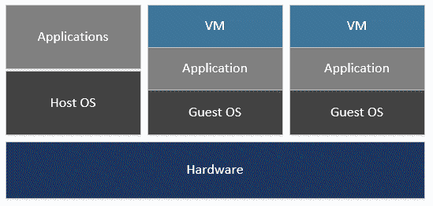

我们在主机操作系统上运行应用程序，而在客用操作系统上运行虚拟机。虚拟化是在硬件级别进行的，其中虚拟机可以使用主机操作系统提供的 hypervisor 虚拟化系统中的驱动程序与主机硬件进行通信。

以下是容器在主机操作系统上的运行方式：


使用容器时，内核在多个容器之间共享。内核是操作系统的核心组件，负责与不同的进程和硬件进行交互，并管理 CPU 周期和虚拟管理等资源。内核是在不同容器之间创建隔离的组件。

# Docker 是什么？

Docker 是一家提供容器的软件公司。Docker 容器在软件行业中非常流行，用于运行微服务。它们最适合于微服务应用程序开发，并提供一组命令行工具，提供了一种统一的方式来构建和维护不同的容器映像。我们可以创建自定义映像，或者使用来自 Docker Hub（[`hub.docker.com`](http://hub.docker.com)）等注册表中的现有映像。

以下是 Docker 的一些好处：

| **好处** | **描述** |
| --- | --- |
| 简单性 | 为应用程序创建和编排提供了强大的工具 |
| 开放性 | 使用开源技术构建，并易于集成到现有环境中 |
| 独立性 | 在应用程序和基础设施之间创建关注点分离 |

# 使用 Docker 与.NET Core

.NET Core 是模块化的，与.NET 框架相比更快，并有助于并行运行应用程序，其中每个应用程序都在运行其自己的 CLR 库和运行时。这使其非常适合在 Docker 容器上运行。与安装.NET 框架的映像相比，.NET Core 的映像要小得多。.NET Core 使用 Windows Nano 服务器或 Linux 映像，比 Windows 服务核心映像要小得多。由于.NET Core 是跨平台运行的，我们还可以创建其他平台的 Docker 映像，并在其上运行应用程序。

使用 Visual Studio 2017，我们可以在创建.NET Core 或 ASP.NET Core 项目时选择 Docker，并自动创建 Docker 文件并设置基本配置以在 Docker 上运行应用程序。以下截图显示了 Visual Studio 2017 中可用的 Docker 选项，用于配置 Docker 容器：


或者，如果项目已经创建，我们可以通过右键单击.NET Core 项目并单击“添加| Docker 支持”选项来添加 Docker 支持。

一旦我们在应用程序中创建或启用 Docker 支持，它会在我们的项目中创建 Docker 文件，并添加另一个名为`docker-compose`的项目，如下所示：


`docker-compose` 项目包含一组 YAML（`.yml`）文件，其中包含与容器中托管的应用程序相关的配置，以及在添加 Docker 支持时为项目创建的 Dockerfile 的路径引用。以下是包含两个服务详细信息的示例 `docker-compose.yml` 文件，例如镜像名称、`dockerfile` 路径等。此文件来自我们之前讨论的示例应用程序。

```cs
version: '1' 

services: 
  vendor.api: 
    image: vendor.api 
    build: 
      context: . 
      dockerfile: srcmicroservicesVendorVendor.APIDockerfile 

  identity.api: 
    image: identity.api 
    build: 
      context: . 
      dockerfile: srcmicroservicesAuthServerIdentity.AuthServerDockerfile 
```

以下是我们在上面示例应用程序中创建的 `Vendor.API` 项目内的 `Dockerfile` 的内容：

```cs
FROM microsoft/aspnetcore:2.0-nanoserver-1709 AS base 
WORKDIR /app 
EXPOSE 80 

FROM microsoft/aspnetcore-build:2.0-nanoserver-1709 AS build 
WORKDIR /src    
COPY *.sln ./ 
COPY src/microservices/Vendor/Vendor.API/Vendor.API.csproj src/microservices/Vendor/Vendor.API/ 
RUN dotnet restore 
COPY . . 
WORKDIR /src/src/microservices/Vendor/Vendor.API 
RUN dotnet build -c Release -o /app 

FROM build AS publish 
RUN dotnet publish -c Release -o /app 

FROM base AS final 
WORKDIR /app 
COPY --from=publish /app . 
ENTRYPOINT ["dotnet", "Vendor.API.dll"] 

```

前面的 `Dockerfile` 开始引用一个基础镜像 `microsoft/aspnetcore:2.0-nanoserver-1709`，该镜像将用于创建一个 Docker 容器。`COPY` 命令是项目文件所在的实际路径。然后将使用 dotnet CLI 命令，如 `dotnet restore` 在容器内还原所有 NuGet 包，`dotnet build` 构建应用程序，以及 `dotnet publish` 构建和发布编译输出到容器内的发布文件夹。

# 运行 Docker 镜像

我们可以从命令行或直接从 Visual Studio 运行 Docker 镜像。正如我们在前一节中看到的，添加 Docker 支持到我们的项目后会创建一个新的 `docker-compose` 项目。运行 `docker-compose` 项目会读取 `docker-compose` YAML 文件，并为定义的服务连接容器。Docker 在 Visual Studio 中是一等公民。它不仅支持运行 Docker 容器，还提供了完整的调试功能。

或者，从命令行，我们可以通过转到 `docker-compose.yml` 文件所在的根路径并运行以下命令来运行 Docker 容器：

```cs
docker-compose up 
```

一旦容器启动，每个应用程序在运行时都有自己的 IP 地址。要检查运行在单独容器上的每个服务的实际 IP，我们可以运行 `docker inspect` 命令来检索它。但是，`docker inspect` 命令需要容器 ID 作为参数。要获取正在运行的容器列表，我们可以首先调用 `docker ps` 命令如下：

```cs
docker ps 
```

前面的命令显示了容器列表，如下截图所示：


最后，我们可以使用容器 ID 并执行 `docker inspect` 命令来获取其 IP 地址，如下所示：

```cs
docker inspect -f "{{range .NetworkSettings.Networks}}{{.IPAddress}}{{end}}" containerid  
```

前面的命令显示 IP 地址如下：


# 摘要

在本章中，我们学习了用于基于微服务开发高性能和可扩展云应用程序的微服务架构。我们学习了一些微服务的基础知识、它们的优势，以及在设计架构时使用的模式和实践。我们讨论了将企业应用程序分解为微服务架构风格的某些挑战，并学习了诸如 API 组合和 CQRS 等模式来解决这些挑战。在本章后期，我们在 .NET Core 中开发了一个基本应用程序，并讨论了微服务的解决方案结构和组件，并开发了身份和供应商服务。

在下一章中，我们将讨论在 .NET Core 应用程序中实现安全性和弹性。
