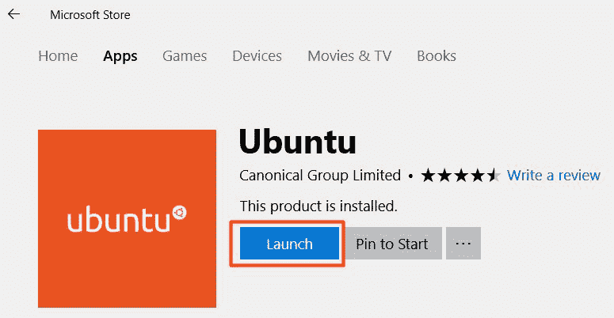
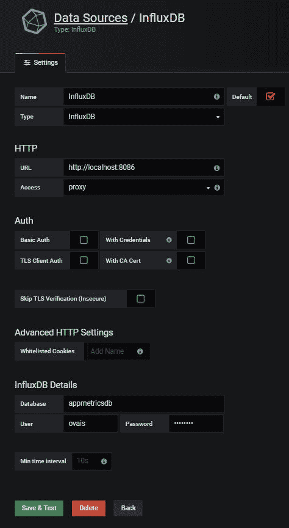

# 第九章：使用工具监控应用程序性能

监控应用程序性能是大型组织中的一般流程，以持续监控和改进其客户的应用程序体验。这是一个围绕不同工具和技术来测量应用程序性能并快速做出决策的重要因素。

在本章中，我们将学习一些建议用于监控.NET Core 应用程序的关键指标，以及探索 App Metrics 以获取有关关键指标的实时分析和遥测信息。

在本章中，我们将研究以下主题：

+   监控应用程序性能的关键指标

+   用于测量应用程序性能的工具和技术，其中包括：

+   +   探索 App Metrics

+   +   设置用于 ASP.NET Core 应用程序的 App Metrics

+   +   设置 Grafana 并使用 App Metrics 仪表板

+   +   设置 InfluxDB 数据库并将其与 ASP.NET Core 应用程序集成

+   +   通过 Grafana 网站监控性能

要了解有关 App Metrics 的更多信息或为开源项目做出贡献，您可以从以下链接访问 GitHub 存储库，并查看完整的文档和一些示例：[`github.com/AppMetrics/AppMetrics`](https://github.com/AppMetrics/AppMetrics)。

# 应用程序性能关键指标

以下是一些用于考虑基于 Web 的应用程序的关键指标。

# 平均响应时间

在每个 Web 应用程序中，响应时间是在监控应用程序性能时要考虑的关键指标。响应时间是服务器处理请求所需的总时间。这是一个在服务器接收请求时计算的时间，服务器在处理请求并返回响应时所花费的时间。它可能受到网络延迟、活跃用户、活跃请求的数量以及服务器上的 CPU 和内存使用率的影响。平均响应时间是服务器在特定时间内处理的所有请求的总平均时间。

# Apdex 分数

Apdex 是一个可以根据应用程序的性能进行分类的用户满意度分数。Apdex 分数可以被分类为令人满意的、可容忍的或令人沮丧的。

# 错误百分比

这是在特定时间内报告的错误总百分比。用户可以概览用户遇到的错误总百分比，并立即纠正它们。

# 请求速率

请求速率是用于扩展应用程序的有价值的指标。如果请求速率很高，而应用程序的性能不佳，则可以扩展应用程序以支持该数量的请求。另一方面，如果请求速率非常低，这意味着存在问题，或者活跃用户的数量正在减少，他们不再使用该应用程序。在这两种情况下，可以迅速做出决定，以提供一致的用户体验。

# 吞吐量/端点

吞吐量是应用程序在一定时间内可以处理的请求数。通常，在商业应用程序中，请求的数量非常高，吞吐量允许您基准应用程序可以处理的响应数量，而不会影响性能。

# CPU 和内存使用率

CPU 和内存使用率是另一个重要的指标，用于分析 CPU 或内存使用率高的高峰时段，以便您可以调查根本原因。

# 测量性能的工具和技术

市场上有各种工具可用于测量和监视应用程序性能。在本节中，我们将专注于 App Metrics 并分析 HTTP 流量、错误和网络性能。

# 介绍 App Metrics

App Metrics 是一个开源工具，可以与 ASP.NET Core 应用程序插件。它提供有关应用程序性能的实时见解，并提供应用程序健康状态的完整概述。它以 JSON 格式提供指标，并与 Grafana 仪表板集成以进行可视化报告。App Metrics 基于.NET Standard 并可跨平台运行。它提供各种扩展和报告仪表板，可在 Windows 和 Linux 操作系统上运行。

# 使用 ASP.NET Core 设置应用程序指标

我们可以通过以下三个简单步骤在 ASP.NET Core 应用程序中设置 App Metrics，具体如下：

1.  安装 App Metrics。

App Metrics 可以作为 NuGet 包安装。以下是可以通过 NuGet 添加到.NET Core 项目中的两个包：

```cs
 Install-Package App.Metrics 
      Install-Pacakge App.Metrics.AspnetCore.Mvc 
```

1.  在`Program.cs`中添加 App Metrics。

在`BuildWebHost`方法中的`Program.cs`中添加`UseMetrics`，如下所示：

```cs
      public static IWebHost BuildWebHost(string[] args) => 
        WebHost.CreateDefaultBuilder(args) 
          .UseMetrics() 
          .UseStartup<Startup>() 
          .Build(); 
```

1.  在`Startup.cs`中添加 App Metrics。

最后，在`Startup`类的`ConfigureServices`方法中添加一个指标资源过滤器，如下所示：

```cs
      public void ConfigureServices(IServiceCollection services) 
      { 
        services.AddMvc(options => options.AddMetricsResourceFilter()); 
      } 
```

1.  运行您的应用程序。

构建并运行应用程序。我们可以通过使用以下表中显示的 URL 来测试 App Metrics 是否正常运行。只需将 URL 附加到应用程序的根 URL：

| **URL** | **描述** |
| --- | --- |
| `/metrics` | 使用配置的指标格式显示指标 |
| `/metrics-text` | 使用配置的文本格式显示指标 |
| `/env` | 显示环境信息，包括操作系统、计算机名称、程序集名称和版本 |

将`/metrics`或`/metrics-text`附加到应用程序的根 URL，可以提供有关应用程序指标的完整信息。`/metrics`返回可以解析并在视图中表示的 JSON 响应，需要进行一些自定义解析。

# 跟踪中间件

使用 App Metrics，我们可以手动定义记录遥测信息所必需的典型 Web 指标。但是，对于 ASP.NET Core，有一个跟踪中间件可以在项目中使用和配置，其中包含一些特定于 Web 应用程序的内置关键指标。

跟踪中间件记录的指标如下：

+   **Apdex：**这用于根据应用程序的整体性能监控用户的满意度。Apdex 是一种开放的行业标准，根据应用程序的响应时间来衡量用户的满意度。

我们可以为每个请求周期设置时间阈值*T*，并根据以下条件计算指标：

| 用户满意度 | 描述 |
| --- | --- |
| 令人满意 | 如果响应时间小于或等于阈值时间(*T*) |
| 容忍 | 如果响应时间在阈值时间(*T*)和阈值时间(*T*)的*4*倍之间 |
| 令人沮丧 | 如果响应时间大于阈值时间(*T*)的*4*倍 |

+   **响应时间：**这提供了应用程序处理的请求的总体吞吐量以及应用程序内每个路由所需的持续时间。

+   **活动请求：**这提供了在特定时间内在服务器上收到的活动请求列表。

+   **错误：**这提供了错误的聚合结果百分比，包括总体错误请求率、每种未捕获异常类型的总体计数、每个 HTTP 状态代码的错误请求总数等。

+   **POST 和 PUT 大小：**这提供了 HTTP POST 和 PUT 请求的请求大小。

# 添加跟踪中间件

我们可以按照以下方式将跟踪中间件作为 NuGet 包添加：

```cs
Install-Package App.Metrics.AspNetCore.Tracking
```

跟踪中间件提供了一组中间件，用于记录特定指标的遥测。我们可以在`Configure`方法中添加以下中间件来测量性能指标：

```cs
app.UseMetricsApdexTrackingMiddleware(); 
app.UseMetricsRequestTrackingMiddleware(); 
app.UseMetricsErrorTrackingMiddleware(); 
app.UseMetricsActiveRequestMiddleware(); 
app.UseMetricsPostAndPutSizeTrackingMiddleware(); 
app.UseMetricsOAuth2TrackingMiddleware();
```

或者，我们也可以使用元包中间件，它会添加所有可用的跟踪中间件，以便我们可以获取有关前面代码中所有不同指标的信息：

```cs
app.UseMetricsAllMiddleware(); 
```

接下来，我们将在我们的`ConfigureServices`方法中添加跟踪中间件如下：

```cs
services.AddMetricsTrackingMiddleware(); 
```

在主`Program.cs`类中，我们将修改`BuildWebHost`方法并添加`UseMetricsWebTracking`方法如下：

```cs
public static IWebHost BuildWebHost(string[] args) => 
  WebHost.CreateDefaultBuilder(args) 
    .UseMetrics() 
    .UseMetricsWebTracking() 
    .UseStartup<Startup>() 
    .Build();
```

# 设置配置

一旦中间件添加完成，我们需要设置默认阈值和其他配置值，以便相应地生成报告。Web 跟踪属性可以在`appsettings.json`文件中进行配置。以下是包含`MetricWebTrackingOptions` JSON 键的`appsettings.json`文件的内容：

```cs
"MetricsWebTrackingOptions": { 
  "ApdexTrackingEnabled": true, 
  "ApdexTSeconds": 0.1, 
  "IgnoredHttpStatusCodes": [ 404 ], 
  "IgnoredRoutesRegexPatterns": [], 
  "OAuth2TrackingEnabled": true 
    }, 
```

`ApdexTrackingEnabled`设置为 true，以便生成客户满意度报告，`ApdexTSeconds`是决定请求响应时间是否令人满意、容忍或令人沮丧的阈值。`IgnoredHttpStatusCodes`包含了如果响应返回`404`状态则将被忽略的状态码列表。`IgnoredRoutesRegexPatterns`用于忽略与正则表达式匹配的特定 URI，`OAuth2TrackingEnabled`可以设置为监视和记录每个客户端的指标，并提供特定于请求速率、错误率以及每个客户端的 POST 和 PUT 大小的信息。

运行应用程序并进行一些导航。在应用程序 URL 中添加`/metrics-text`将以文本格式显示完整报告。以下是文本指标的示例快照：


# 添加可视化报告

有各种扩展和报告插件可用，提供可视化报告仪表板。其中一些是*GrafanaCloud Hosted Metrics*、*InfluxDB*、*Prometheus*、*ElasticSearch*、*Graphite*、*HTTP*、*Console*和*Text File*。在本章中，我们将配置*InfluxDB*扩展，并看看如何实现可视化报告。

# 设置 InfluxDB

InfluxDB 是由 Influx Data 开发的开源时序数据库。它是用*Go*语言编写的，被广泛用于存储实时分析的时间序列数据。Grafana 是提供报告仪表板的服务器，可以通过浏览器查看。InfluxDB 可以轻松地作为 Grafana 中的扩展导入，以从 InfluxDB 数据库显示可视化报告。

# 设置 Windows 子系统以运行 Linux

在本节中，我们将在 Linux 操作系统的 Windows 子系统上设置 InfluxDB。

1.  首先，我们需要通过在 PowerShell 中以管理员身份执行以下命令来启用 Linux 的 Windows 子系统：

```cs
 Enable-WindowsOptionalFeature -Online -FeatureName 
      Microsoft-Windows-Subsystem-Linux
```

在运行上述命令之后，重新启动您的计算机。

1.  接下来，我们将从 Microsoft 商店安装 Linux 发行版。在我们的情况下，我们将从 Microsoft 商店安装 Ubuntu。前往 Microsoft 商店，搜索 Ubuntu，并安装它。

1.  安装完成后，点击启动：



1.  这将打开控制台窗口，要求您为 Linux 操作系统（操作系统）创建用户帐户。

1.  指定将要使用的用户名和密码。

1.  运行以下命令以从 bash shell 更新 Ubuntu 到最新的稳定版本。要运行 bash，打开命令提示符，输入`bash`，然后按*Enter*：


1.  最后，它将要求您创建一个 Ubuntu 用户名和密码。指定用户名和密码，然后按 Enter。

# 安装 InfluxDB

在这里，我们将通过一些步骤在 Ubuntu 中安装 InfluxDB 数据库：

1.  要设置 InfluxDB，请以管理员模式打开命令提示符并运行 bash shell。

1.  在本地 PC 上执行以下命令以设置 InfluxDB 数据存储：

```cs
 $ curl -sL https://repos.influxdata.com/influxdb.key | sudo apt-key add - 
      $ source /etc/lsb-release 
      $ echo "deb https://repos.influxdata.com/${DISTRIB_ID,,} 
      $ {DISTRIB_CODENAME} stable" | sudo tee /etc/apt/sources.list.d/influxdb.list 
```

1.  通过执行以下命令来安装 InfluxDB：

```cs
 $ sudo apt-get update && sudo apt-get install influxdb 
```

1.  执行以下命令来运行 InfluxDB：

```cs
 $ sudo influxd
```

1.  通过运行以下命令启动 InfluxDB shell：

```cs
 $ sudo influx 
```

它将打开一个可以执行特定于数据库的命令的 shell。

1.  通过执行以下命令创建数据库。为数据库指定一个有意义的名称。在我们的情况下，它是`appmetricsdb`：

```cs
      > create database appmetricsdb  
```

# 安装 Grafana

Grafana 是一个用于在 Web 界面中显示仪表板的开源工具。可以从 Grafana 网站导入各种可用的仪表板，以显示实时分析。Grafana 可以从[`docs.grafana.org/installation/windows/`](http://docs.grafana.org/installation/windows/)下载为 zip 文件。下载后，我们可以通过单击`bin`目录中的`grafana-server.exe`可执行文件来启动 Grafana 服务器。

Grafana 提供了一个网站，监听端口为*3000*。如果 Grafana 服务器正在运行，我们可以通过导航到`http://localhost:3000`来访问该网站。

# 添加 InfluxDB 仪表板

Grafana 提供了一个现成的 InfluxDB 仪表板，可以从以下链接导入：[`grafana.com/dashboards/2125`](https://grafana.com/dashboards/2125)。

复制仪表板 ID 并使用它将其导入 Grafana 网站。

我们可以通过转到 Grafana 网站上的管理选项来导入 InfluxDB 仪表板，如下所示：


从管理选项中，单击*+ 仪表板*按钮，然后单击*新仪表板*选项。单击导入仪表板将导致 Grafana 要求您输入仪表板 ID：


将之前复制的仪表板 ID（例如`2125`）粘贴到框中，然后按*Tab*。系统将显示仪表板的详细信息，单击导入按钮将其导入系统：


# 配置 InfluxDB

我们现在将配置 InfluxDB 仪表板，并添加一个连接到我们刚刚创建的数据库的数据源。

为了继续，我们将转到 Grafana 网站上的数据源部分，并单击*添加新数据源*选项。以下是为 InfluxDB 数据库添加数据源的配置：



# 修改 Startup 中的 Configure 和 ConfigureServices 方法

到目前为止，我们已经在我们的机器上设置了 Ubuntu 和 InfluxDB 数据库。我们还设置了 InfluxDB 数据源，并通过 Grafana 网站添加了一个仪表板。接下来，我们将配置我们的 ASP.NET Core Web 应用程序，以将实时信息推送到 InfluxDB 数据库。

这是修改后的`ConfigureServices`方法，它初始化`MetricsBuilder`以定义与应用程序名称、环境和连接详细信息相关的属性：

```cs
public void ConfigureServices(IServiceCollection services)
{
  var metrics = new MetricsBuilder()
  .Configuration.Configure(
  options =>
  {
    options.WithGlobalTags((globalTags, info) =>
    {
      globalTags.Add("app", info.EntryAssemblyName);
      globalTags.Add("env", "stage");
    });
  })
  .Report.ToInfluxDb(
  options =>
  {
    options.InfluxDb.BaseUri = new Uri("http://127.0.0.1:8086");
    options.InfluxDb.Database = "appmetricsdb";
    options.HttpPolicy.Timeout = TimeSpan.FromSeconds(10);
  })
  .Build();
  services.AddMetrics(metrics);
  services.AddMetricsReportScheduler();
  services.AddMetricsTrackingMiddleware();         
  services.AddMvc(options => options.AddMetricsResourceFilter());
}
```

在上述代码中，我们将应用程序名称`app`设置为程序集名称，将环境`env`设置为`stage`。`http://127.0.0.1:8086`是 InfluxDB 服务器的 URL，用于监听应用程序推送的遥测。`appmetricsdb`是我们在前一节中创建的数据库。然后，我们添加了`AddMetrics`中间件，并指定了包含配置的指标。`AddMetricsTrackingMiddleware`用于跟踪显示在仪表板上的 Web 遥测信息，`AddMetricsReportScheduled`用于将遥测信息推送到数据库。

这是包含`UseMetricsAllMiddleware`以使用 App Metrics 的`Configure`方法。`UseMetricsAllMiddleware`添加了 App Metrics 中可用的所有中间件：

```cs
public void Configure(IApplicationBuilder app, IHostingEnvironment env)
{
  if (env.IsDevelopment())
  {
    app.UseBrowserLink();
    app.UseDeveloperExceptionPage();
  }
  else
  {
    app.UseExceptionHandler("/Error");
  }
  app.UseStaticFiles();
  app.UseMetricsAllMiddleware();
  app.UseMvc();
}
```

我们可以根据需求显式地添加单个中间件，而不是调用`UseAllMetricsMiddleware`。以下是可以添加的中间件列表：

```cs
app.UseMetricsApdexTrackingMiddleware();
app.UseMetricsRequestTrackingMiddleware();
app.UseMetricsErrorTrackingMiddleware();
app.UseMetricsActiveRequestMiddleware();
app.UseMetricsPostAndPutSizeTrackingMiddleware();
app.UseMetricsOAuth2TrackingMiddleware();
```

# 测试 ASP.NET Core 应用程序并在 Grafana 仪表板上报告

为了测试 ASP.NET Core 应用程序并在 Grafana 仪表板上看到可视化报告，我们将按照以下步骤进行：

1.  通过转到`{installation_directory}\bin\grafana-server.exe`来启动 Grafana 服务器。

1.  从命令提示符启动 bash 并运行`sudo influx`命令。

1.  从命令提示符启动另一个 bash 并运行`sudo influx`命令。

1.  运行 ASP.NET Core 应用程序。

1.  访问`http://localhost:3000`并单击 App Metrics 仪表板。

1.  这将开始收集遥测信息，并显示性能指标，如下面的屏幕截图所示：

以下图表显示了**每分钟请求**（**RPM**）的总吞吐量，错误百分比和活动请求：


这里是 Apdex 分数，将用户满意度分为三种不同的颜色，红色代表令人沮丧，橙色代表容忍，绿色代表满意。以下图表显示蓝线绘制在绿色条上，这意味着应用程序性能是令人满意的：


以下快照显示了所有请求的吞吐量图，每个请求都用不同的颜色标记：红色，橙色和绿色。在这种情况下，有两个 HTTP GET 请求，分别是关于和联系我们页面：


这是响应时间图，显示了两个请求的响应时间：


# 总结

在本章中，我们学习了一些对于监控应用程序性能至关重要的关键指标。我们探索并设置了 App Metrics，这是一个免费的跨平台工具，提供了许多可以添加以实现更多报告的扩展。我们逐步介绍了如何配置和设置 App Metrics 以及相关组件，如 InfluxDb 和 Grafana，以存储和查看 Grafana Web 工具中的遥测，并将其与 ASP.NET Core 应用程序集成。
