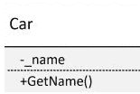

# 第一章：.NET Core 和 C#中 OOP 的概述

20 多年来，最流行的编程语言都是基于面向对象编程（OOP）原则的。OOP 语言的流行主要是因为能够将复杂逻辑抽象成一个称为对象的结构，这样更容易解释，更重要的是在应用程序中更容易重用。实质上，OOP 是一种软件设计方法，即使用包含数据和功能的对象概念来开发软件的模式。随着软件行业的成熟，OOP 中出现了用于常见问题的模式，因为它们在解决相同问题时在不同的上下文和行业中都是有效的。随着软件从大型机移动到客户服务器，然后再到云端，出现了额外的模式，以帮助降低开发成本和提高可靠性。本书将探讨设计模式，从 OOP 的基础到面向云端软件的架构设计模式。

OOP 基于对象的概念。这个对象通常包含数据，称为属性和字段，以及代码或行为，称为方法。

设计模式是软件程序员在开发过程中面临的一般问题的解决方案，是根据经验构建的，这些解决方案经过多位开发人员在各种情况下的试验和测试。使用基于以前活动的模式的好处确保不会一遍又一遍地重复相同的努力。此外，使用模式会增加一种可靠性感，即问题将在不引入缺陷或问题的情况下得到解决。

本章将回顾 OOP 以及它如何应用于 C#。请注意，这只是一个简要介绍，不是 OOP 或 C#的完整入门；相反，本章将详细介绍这两个方面，以便向您介绍后续章节中将涵盖的设计模式。本章将涵盖以下主题：

+   OOP 的讨论以及类和对象的工作原理

+   继承

+   封装

+   多态性

# 技术要求

本章包含各种代码示例来解释这些概念。代码保持简单，仅用于演示目的。大多数示例涉及使用 C#编写的.NET Core 控制台应用程序。

要运行和执行代码，您需要以下内容：

+   Visual Studio 2019（您也可以使用 Visual Studio 2017 版本 3 或更高版本运行应用程序）

+   .NET Core

+   SQL Server（本章中使用 Express Edition）

# 安装 Visual Studio

为了运行这些代码示例，您需要安装 Visual Studio 或更高版本（也可以使用您喜欢的 IDE）。要做到这一点，请按照以下说明进行操作：

1.  从以下链接下载 Visual Studio：[`docs.microsoft.com/en-us/visualstudio/install/install-visual-studio`](https://docs.microsoft.com/en-us/visualstudio/install/install-visual-studio)。

1.  按照链接中包含的安装说明进行操作。有多个版本的 Visual Studio 可用；在本章中，我们使用的是 Windows 版的 Visual Studio。

# 设置.NET Core

如果您没有安装.NET Core，您需要按照以下说明进行操作：

1.  从以下链接下载.NET Core：[`www.microsoft.com/net/download/windows`](https://www.microsoft.com/net/download/windows)。

1.  按照相关库中的安装说明进行操作：[`dotnet.microsoft.com/download/dotnet-core/2.2`](https://dotnet.microsoft.com/download/dotnet-core/2.2)。

完整的源代码可以在 GitHub 上找到。本章中显示的源代码可能不完整，因此建议您检索源代码以运行示例（[`github.com/PacktPublishing/Hands-On-Design-Patterns-with-C-and-.NET-Core/tree/master/Chapter1`](https://github.com/PacktPublishing/Hands-On-Design-Patterns-with-C-and-.NET-Core/tree/master/Chapter1)）。

# 本书中使用的模型

作为学习辅助，本书将包含许多 C#代码示例，以及图表和图像，以帮助尽可能清楚地描述特定概念。本书不是**统一建模语言**（**UML**）书；然而，对于了解 UML 的人来说，许多图表应该看起来很熟悉。本节提供了本书中将使用的类图的描述。

在这里，一个类将被定义为包括由虚线分隔的字段和方法。如果讨论重要，可通过`-`表示私有，`+`表示公共，`#`表示受保护，`~`表示内部来指示可访问性。以下截图通过显示一个带有私有`_name`变量和公共`GetName()`方法的`Car`类来说明这一点：



当展示对象之间的关系时，用实线表示关联，用开放的菱形表示聚合，用填充的菱形表示组合。如果讨论重要，多重性将显示在相关类旁边。以下图表说明了`Car`类有一个**Owner**和最多三个**Passengers**；它由四个**Wheels**组成：


**继承**使用实线在基类上显示一个开放的三角形。以下图表显示了`Account`基类与`CheckingAccount`和`SavingsAccount`子类之间的关系：


**接口**的显示方式与继承类似，但它们使用虚线以及额外的`<<interface>>`标签，如下图所示：


本节概述了本书中使用的模型。选择这种风格/方法是因为希望大多数读者都能熟悉。

# 面向对象编程和类与对象的工作原理

面向对象编程是指使用类定义的对象的软件编程方法。这些定义包括字段，有时称为属性，用于存储数据和方法以提供功能。第一种面向对象编程语言是称为 Simula 的真实系统模拟语言（[`en.wikipedia.org/wiki/Simula`](https://en.wikipedia.org/wiki/Simula)），于 1960 年在挪威计算中心开发。第一种纯面向对象编程语言诞生于 1970 年，名为 Smalltalk（[`en.wikipedia.org/wiki/Smalltalk`](https://en.wikipedia.org/wiki/Smalltalk)）。这种语言旨在为 Alan Kay 创建的个人计算机 Dynabook（[`history-computer.com/ModernComputer/Personal/Dynabook.html`](http://history-computer.com/ModernComputer/Personal/Dynabook.html)）编程。从那时起，有几种面向对象编程语言发展而来，最流行的是 Java、C++、Python 和 C#。

面向对象编程是基于包含数据的对象。面向对象编程范式允许开发人员将代码组织成一个称为对象的抽象或逻辑结构。对象可以包含数据和行为。

通过使用面向对象的方法，我们正在做以下事情：

+   模块化：在这里，一个应用程序被分解成不同的模块。

+   **重用软件**：在这里，我们重新构建或组合一个应用程序，使用不同的（即现有的或新的）模块。

在接下来的章节中，我们将更详细地讨论和理解面向对象编程的概念。

# 解释面向对象编程

早期的编程方法有局限性，通常变得难以维护。面向对象编程提供了一种新的软件开发范式，优于其他方法。将代码组织成对象的概念并不难解释，这对于采用新模式是一个巨大的优势。可以从现实世界中找到许多例子来解释这个概念。复杂的系统也可以用更小的构建块（即*对象*）来描述。这使开发人员能够单独查看解决方案的各个部分，同时了解它们如何适应整个解决方案。

考虑到这一点，让我们定义一个程序如下：

程序是一系列指令的列表，指示语言编译器该做什么。

正如你所看到的，对象是以一种逻辑方式组织指令的一种方式。回到房子的例子，建筑师的指令帮助我们建造房子，但它们不是房子本身。相反，建筑师的指令是房子的抽象表示。类似的，类定义了对象的特征。然后从类的定义中创建对象。这通常被称为*实例化对象*。

为了更近距离地了解面向对象编程，我们应该提到另外两种重要的编程方法：

+   **结构化编程**：这是由 Edsger W. Dijkstra 在 1966 年创造的一个术语。结构化编程是一种解决问题的编程范式，将 1000 行代码分成小部分。这些小部分通常被称为**子程序**、**块结构**、**for**和**while**循环等。使用结构化编程技术的语言包括 ALGOL、Pascal、PL/I 等。

+   **过程式编程**：这是从结构化编程派生出来的一种范式，简单地基于我们如何进行调用（也称为**过程调用**）。使用过程式编程技术的语言包括 COBOL、Pascal 和 C。一个最近的例子是 2009 年发布的 Go 编程语言。

过程调用

程序调用是指一组语句，称为*过程*，被激活。有时这被称为*调用*的过程。

这两种方法的主要问题是，一旦程序变得更加复杂和庞大，就不容易管理。更复杂和更大的代码库会使这两种方法变得紧张，导致难以理解和难以维护的应用程序。为了克服这些问题，面向对象编程提供了以下功能：

+   继承

+   封装

+   多态

在接下来的几节中，我们将更详细地讨论这些功能。

继承、封装和多态有时被称为面向对象编程的三大支柱。

在开始之前，让我们讨论一些在面向对象编程中发现的结构。

# 一个类

**类**是描述对象的方法和变量的组或模板定义。换句话说，类是一个蓝图，包含了对所有类实例（称为对象）通用的变量和方法的定义。

让我们看一下以下代码示例：

```cs
public class PetAnimal
{
    private readonly string PetName;
    private readonly PetColor PetColor;

    public PetAnimal(string petName, PetColor petColor)
    {
        PetName = petName;
        PetColor = petColor;
    }

    public string MyPet() => $"My pet is {PetName} and its color is {PetColor}.";
}
```

在前面的代码中，我们有一个名为`PetAnimal`的类，其中有两个名为`PetName`和`PetColor`的私有字段，以及一个名为`MyPet()`的方法。

# 一个对象

在现实世界中，对象共享两个特征，即状态和行为。换句话说，我们可以说每个对象都有一个名字，颜色，等等；这些特征只是对象的状态。让我们以任何类型的宠物为例：狗和猫都有一个名字，它们被称为。所以，以这种方式，我的狗叫 Ace，我的猫叫 Clementine。同样，狗和猫有特定的行为，例如，狗会叫，猫会喵喵叫。

在*解释面向对象编程*部分，我们讨论了面向对象编程是一种旨在将状态或结构（数据）与行为（方法）结合起来以提供软件功能的编程模型。在之前的例子中，宠物的不同状态构成了实际数据，而宠物的行为则是方法。

对象通过属性存储信息（即数据），并通过方法展示其行为。

在面向对象的语言（如 C#）中，对象是类的一个实例。在我们之前的例子中，现实世界中的对象`Dog`将是`PetAnimal`类的一个对象。

对象可以是具体的（即现实世界中的对象，如狗或猫，或任何类型的文件，如物理文件或计算机文件），也可以是概念性的，如数据库模式或代码蓝图。

以下代码片段显示了一个对象包含数据和方法，以及如何使用它：

```cs
namespace OOPExample
{
    class Program
    {
        static void Main(string[] args)
        {
            Console.WriteLine("OOP example");
            PetAnimal dog = new PetAnimal("Ace", PetColor.Black);
            Console.WriteLine(dog.MyPet());
            Console.ReadLine();
            PetAnimal cat = new PetAnimal("Clementine", PetColor.Brown);
            Console.WriteLine(cat.MyPet());
            Console.ReadLine();
        }
    }
}
```

在上面的代码片段中，我们创建了两个对象：`dog`和`cat`。这些对象是`PetAnimal`类的两个不同实例。可以看到，包含有关于动物的数据的字段或属性是通过构造方法赋值的。构造方法是用于创建类的实例的特殊方法。

让我们在下图中将这个例子可视化：


上图是我们之前代码示例的图示表示，我们创建了两个不同的`Dog`和`Cat`对象，它们属于`PetAnimal`类。图示相对容易理解；它告诉我们`Dog`类的对象是`PetAnimal`类的一个实例，`Cat`对象也是如此。

# 关联

对象关联是面向对象编程的一个重要特性。现实世界中对象之间存在关系，在面向对象编程中，关联允许我们定义*拥有*关系；例如，自行车*拥有*骑手或猫*拥有*鼻子。

*拥有*关系的类型如下：

+   **关联**：关联用于描述对象之间的关系，不涉及所有权的描述，例如汽车和人之间的关系。汽车和人之间有一个关系，比如司机。一个人可以驾驶多辆汽车，一辆汽车也可以被多个人驾驶。

+   **聚合**：聚合是关联的一种特殊形式。与关联类似，对象在聚合中有自己的生命周期，但它涉及所有权。这意味着子对象不能属于另一个父对象。聚合是一种单向关系，对象的生命周期彼此独立。例如，子对象和父对象的关系是一种聚合，因为每个子对象都有一个父对象，但并不是每个父对象都有一个子对象。

+   **组合**：组合指的是一种依赖关系；它代表了两个对象之间的关系，其中一个对象（子对象）依赖于另一个对象（父对象）。如果父对象被删除，所有子对象将自动被删除。让我们以房子和房间为例。一个房子有多个房间，但一个房间不能属于多个房子。如果我们拆除了房子，房间将自动被删除。

让我们通过扩展之前的宠物示例并引入`PetOwner`类来在 C#中说明这些概念。`PetOwner`类可以与一个或多个`PetAnimal`实例相关联。由于`PetAnimal`类可以存在有或没有主人，所以这种关系是一种聚合。`PetAnimal`与`PetColor`相关联，在这个系统中，只有当`PetColor`与`PetAnimal`相关联时，`PetColor`才存在，使得关联成为一种组合。

以下图示说明了聚合和组合：


上述模型是基于 UML 的，可能对你来说不太熟悉；所以，让我们指出一些关于图表的重要事项。类由一个包含类名以及其属性和方法（用虚线分隔）的方框表示。现在先忽略名称前面的符号，例如`+`或`-`，因为我们将在后面讨论封装时涵盖访问修饰符。关联关系用连接类的线表示。在组合的情况下，父类的一侧使用实心菱形，而聚合的情况下，父类的一侧使用空心菱形。此外，注意图表支持表示可能的子类数量的多重性值。在图表中，`PetOwner`类可以有`0`个或更多个`PetAnimal`类（注意*****表示关联数量没有限制）。

UML

UML 是一种专门为软件工程开发的建模语言。它已经发展了 20 多年，由**对象管理组**（**OMG**）管理。你可以参考[`www.uml.org/`](http://www.uml.org/)了解更多细节。

# 接口

在 C#中，**接口**定义了一个对象包含的内容，或者说它的契约；特别是对象的方法、属性、事件或索引。然而，接口不提供实现。接口不能包含属性。这与基类形成对比，基类既提供了契约又提供了实现。实现接口的类必须实现接口中指定的所有内容。

抽象类

抽象类是接口和基类之间的混合体，因为它既提供实现和属性，也提供必须在子类中定义的方法。

签名

术语*签名*也可以用来描述对象的契约。

# 继承

面向对象编程中最重要的概念之一是继承。类之间的继承允许我们定义一个*是一种*关系；例如，汽车*是一种*车辆。这个概念的重要性在于它允许相同类型的对象共享相似的特征。假设我们有一个在线书店管理不同产品的系统。我们可能有一个类用于存储关于实体书的信息，另一个类用于存储关于数字或在线书的信息。两者之间相似的特征，比如名称、出版商和作者，可以存储在另一个类中。然后实体书和数字书类可以继承自另一个类。

在继承中有不同的术语来描述类：*子类*或*派生类*继承自另一个类，而被继承的类可以被称为*父类*或*基类*。

在接下来的部分，我们将更详细地讨论继承。

# 继承的类型

继承帮助我们定义一个子类。这个子类继承了父类或基类的行为。

在 C#中，继承是用冒号(`:`)来表示的。

让我们来看看不同类型的继承：

+   **单继承**：作为最常见的继承类型，单继承描述了一个类从另一个类派生出来的情况。

让我们重新审视之前提到的`PetAnimal`类，并且使用继承来定义我们的`Dog`和`Cat`类。通过继承，我们可以定义一些两者共有的属性。例如，宠物的名字和颜色是共有的，所以它们会位于一个基类中。猫或狗的具体信息会在特定的类中定义；例如，猫和狗发出的声音。下图展示了一个`PetAnimal`基类和两个子类：


C#只支持单继承。

+   **多重继承**：多重继承发生在派生类继承多个基类的情况下。诸如 C++的语言支持多重继承。C#不支持多重继承，但我们可以通过接口实现类似多重继承的行为。

您可以参考以下帖子了解有关 C#和多重继承的更多信息：

[`blogs.msdn.microsoft.com/csharpfaq/2004/03/07/why-doesnt-c-supportmultiple-inheritance/`](https://blogs.msdn.microsoft.com/csharpfaq/2004/03/07/why-doesnt-c-supportmultiple-inheritance/)。

+   **分层继承**：当多个类从另一个类继承时发生分层继承。

+   **多级继承**：当一个类从已经是派生类的类中派生时，称为多级继承。

+   **混合继承**：混合继承是多种继承的组合。

C#不支持混合继承。

+   **隐式继承**：.NET Core 中的所有类型都隐式继承自`System.Object`类及其派生类。

# 封装

封装是面向对象编程中的另一个基本概念，其中类的细节，即属性和方法，可以在对象外部可见或不可见。通过封装，开发人员提供了关于如何使用类以及如何防止类被错误处理的指导。例如，假设我们只允许使用`AddPet（PetAnimal）`方法添加`PetAnimal`对象。我们可以通过将`PetOwner`类的`AddPet（PetAnimal）`方法设置为可用，同时将`Pets`属性限制为`PetAnimal`类之外的任何内容来实现这一点。在 C#中，通过将`Pets`属性设置为私有，这是可能的。这样做的一个原因是，如果需要在添加`PetAnimal`类时需要额外的逻辑，例如记录或验证`PetOwner`类是否可以拥有宠物。

C#支持可以在项上设置的不同访问级别。项可以是类、类的属性或方法，或枚举：

+   **Public**：表示该项可以在外部访问。

+   **Private**：表示只有对象可以访问该项。

+   **Protected**：表示只有对象（以及扩展了该类的类的对象）可以访问属性或方法。

+   **Internal**：表示只有同一程序集中的对象可以访问该项。

+   **Protected Internal**：表示只有对象（以及扩展了该类的类的对象）可以在同一程序集中访问属性或方法。

在下图中，访问修饰符已应用于`PetAnimal`：


例如，宠物的名称和颜色被设置为私有，以防止外部访问`PetAnimal`类。在这个例子中，我们限制了`PetName`和`PetColor`属性，所以只有`PetAnimal`类才能访问它们，以确保只有基类`PetAnimal`可以更改它们的值。`PetAnimal`的构造函数被保护，以确保只有子类可以访问它。在这个应用程序中，只有与`Dog`类相同的库中的类才能访问`RegisterInObedienceSchool（）`方法。

# 多态性

使用相同接口处理不同对象的能力称为多态性。这为开发人员提供了通过编写单个功能来构建灵活性的能力，只要它们共享一个公共接口，就可以应用于不同的形式。在面向对象编程中有不同的多态性定义，我们将区分两种主要类型：

+   **静态或早期绑定**：当应用程序编译时发生这种形式的多态性。

+   **动态或晚期绑定**：当应用程序正在运行时发生这种形式的多态性。

# 静态多态性

静态或早期绑定多态发生在编译时，主要由方法重载组成，其中一个类具有多个具有相同名称但具有不同参数的方法。这通常有助于传达方法背后的含义或简化代码。例如，在计算器中，为不同类型的数字添加多个方法比为每种情况使用不同的方法名更可读；让我们比较以下代码：

```cs
int Add(int a, int b) => a + b;
float Add(float a, float b) => a + b;
decimal Add(decimal a, decimal b) => a + b;
```

在下面的代码中，展示了相同功能的代码，但没有重载`Add()`方法：

```cs
int AddTwoIntegers(int a, int b) => a + b;
float AddTwoFloats(float a, float b) => a + b;
decimal AddTwoDecimals(decimal a, decimal b) => a + b;
```

在宠物的例子中，主人会使用不同的食物来喂养`cat`和`dog`类的对象。我们可以定义`PetOwner`类，其中有两个`Feed()`方法，如下所示：

```cs
public void Feed(PetDog dog)
{
    PetFeeder.FeedPet(dog, new Kibble());
}

public void Feed(PetCat cat)
{
    PetFeeder.FeedPet(cat, new Fish());
}
```

两种方法都使用`PetFeeder`类来喂养宠物，而`dog`类被给予`Kibble`，`cat`实例被给予`Fish`。`PetFeeder`类在*泛型*部分中描述。

# 动态多态

动态或后期绑定多态发生在应用程序运行时。有多种情况会发生这种情况，我们将涵盖 C#中的三种常见形式：接口、继承和泛型。

# 接口多态

接口定义了类必须实现的签名。在`PetAnimal`的例子中，假设我们将宠物食物定义为提供一定数量的能量，如下所示：

```cs
public interface IPetFood
{
    int Energy { get; }
}
```

接口本身不能被实例化，但描述了`IPetFood`的实例必须实现的内容。例如，`Kibble`和`Fish`可能提供不同级别的能量，如下面的代码所示：

```cs
public class Kibble : IPetFood
{
    public int Energy => 7;
}

public class Fish : IPetFood
{
    int IPetFood.Energy => 8;
}
```

在上面的代码片段中，`Kibble`提供的能量比`Fish`少。

# 继承多态

继承多态允许在运行时确定功能，类似于接口，但适用于类继承。在我们的例子中，宠物可以被喂食，所以我们可以定义一个新的`Feed(IPetFood)`方法，它使用之前定义的接口：

```cs
public virtual void Feed(IPetFood food)
{
    Eat(food);
}

protected void Eat(IPetFood food)
{
    _hunger -= food.Energy;
}
```

上面的代码表明，`PetAnimal`的所有实现都将有一个`Feed(IPetFood)`方法，子类可以提供不同的实现。`Eat(IPetFood food)`没有标记为虚拟，因为预期所有`PetAnimal`对象都将使用该方法，而无需覆盖其行为。它还被标记为受保护，以防止从对象外部访问它。

虚方法不必在子类中定义；这与接口不同，接口中的所有方法都必须被实现。

`PetDog`不会覆盖基类的行为，因为狗既吃`Kibble`又吃`Fish`。而猫更挑剔，如下面的代码所示：

```cs
public override void Feed(IPetFood food)
{
    if (food is Fish)
    {
        Eat(food);
    }
    else
    {
        Meow();
    }
}
```

使用 override 关键字，`PetCat`将改变基类的行为，导致猫只吃鱼。

# 泛型

泛型定义了可以应用于类的行为。这种常用形式在集合中使用，无论对象的类型如何，都可以使用相同的处理对象的方法。例如，可以使用相同的逻辑处理字符串列表或整数列表，而无需区分特定类型。

回到宠物，我们可以为喂养宠物定义一个通用类。这个类简单地给宠物和食物喂食，如下面的代码所示：

```cs
public static class PetFeeder
{
    public static void FeedPet<TP, TF>(TP pet, TF food) where TP : PetAnimal
                                                    where TF : IPetFood 
    {
        pet.Feed(food); 
    }
}
```

这里有几件有趣的事情要指出。首先，由于类和方法都被标记为静态，所以类不必被实例化。使用方法签名`FeedPet<TP, TF>`描述了通用方法。`where`关键字用于指示对`TP`和`TF`的额外要求。在这个例子中，`where`关键字将`TP`定义为必须是`PetAnimal`类型，而`TF`必须实现`IPetFood`接口。

# 摘要

在本章中，我们讨论了面向对象编程及其三个主要特征：继承、封装和多态性。使用这些特性，应用程序中的类可以被抽象化，以提供易于理解且受到保护的定义，以防止其被用于与其目的不一致的方式。这是面向对象编程与一些早期类型的软件开发语言（如结构化和过程化编程）之间的重要区别。通过抽象功能，增加了代码重用和维护的能力。

在下一章中，我们将讨论企业软件开发中使用的各种模式。我们将涵盖编程模式以及软件开发原则和在**软件开发生命周期**（**SDLC**）中使用的模式。

# 问题

以下问题将帮助您巩固本章中包含的信息：

1.  术语“晚绑定”和“早绑定”是指什么？

1.  C#支持多重继承吗？

1.  在 C#中，可以使用什么级别的封装来防止外部库访问类？

1.  聚合和组合之间有什么区别？

1.  接口可以包含属性吗？（这有点像是一个陷阱问题。）

1.  狗会吃鱼吗？
