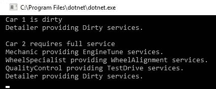
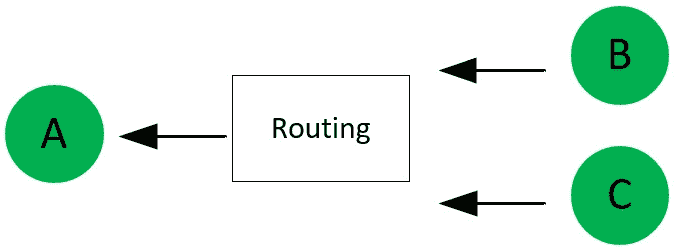
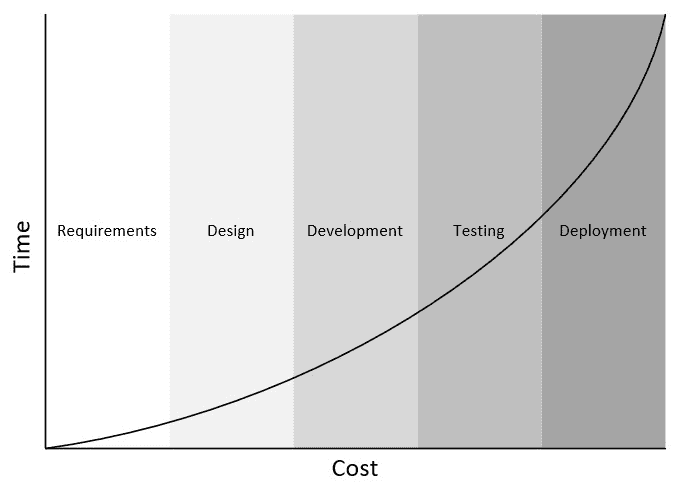

# 第二章：现代软件设计模式和原则

在上一章中，讨论了**面向对象编程**（**OOP**），为了探索不同的模式做了准备。由于许多模式依赖于 OOP 中的概念，因此介绍和/或重新访问这些概念非常重要。类之间的继承允许我们定义*是一种类型的关系*。这提供了更高程度的抽象。例如，通过继承，可以进行比较，比如*猫*是一种*动物*，*狗*是一种*动物*。封装提供了一种控制类的细节的可见性和访问性的方法。多态性提供了使用相同接口处理不同对象的能力。通过 OOP，可以实现更高级别的抽象，提供了一种更易于管理和理解的方式来处理大型解决方案。

本章目录和介绍了现代软件开发中使用的不同模式。本书对模式的定义非常宽泛。在软件开发中，模式是软件程序员在开发过程中面临的一般问题的任何解决方案。它们建立在经验之上，是对什么有效和什么无效的总结。此外，这些解决方案经过了许多开发人员在各种情况下的试验和测试。使用模式的好处基于过去的活动，既在不重复努力方面，也在保证问题将被解决而不会引入缺陷或问题方面。

特别是在考虑到技术特定模式时，有太多内容无法在一本书中涵盖，因此本章将重点介绍特定模式，以说明不同类型的模式。我们试图根据我们的经验挑选出最常见和最有影响力的模式。在随后的章节中，将更详细地探讨特定模式。

本章将涵盖以下主题：

+   包括 SOLID 在内的设计原则

+   模式目录，包括**四人帮**（**GoF**）模式和**企业集成模式**（**EIP**）

+   软件开发生命周期模式

+   解决方案开发、云开发和服务开发的模式和实践

# 技术要求

本章包含各种代码示例来解释这些概念。代码保持简单，仅用于演示目的。大多数示例涉及使用 C#编写的.NET Core 控制台应用程序。

要运行和执行代码，您需要以下内容：

+   Visual Studio 2019（您也可以使用 Visual Studio 2017 版本 3 或更高版本运行应用程序）

+   .NET Core

+   SQL Server（本章中使用 Express Edition）

# 安装 Visual Studio

要运行这些代码示例，您需要安装 Visual Studio，或者您可以使用您喜欢的 IDE。要做到这一点，请按照以下说明进行操作：

1.  从以下链接下载 Visual Studio：[`docs.microsoft.com/en-us/visualstudio/install/install-visual-studio`](https://docs.microsoft.com/en-us/visualstudio/install/install-visual-studio)。

1.  按照包含的安装说明进行安装。Visual Studio 有多个版本可供安装。在本章中，我们使用的是 Windows 版的 Visual Studio。

# 设置.NET Core

如果您尚未安装.NET Core，您需要按照以下说明进行操作：

1.  从以下链接下载.NET Core：[`www.microsoft.com/net/download/windows`](https://www.microsoft.com/net/download/windows)。

1.  遵循安装说明和相关库：[`dotnet.microsoft.com/download/dotnet-core/2.2`](https://dotnet.microsoft.com/download/dotnet-core/2.2)。

完整的源代码可在 GitHub 上找到。本章中显示的源代码可能不完整，因此建议检索源代码以运行示例：[`github.com/PacktPublishing/Hands-On-Design-Patterns-with-C-and-.NET-Core/tree/master/Chapter2`](https://github.com/PacktPublishing/Hands-On-Design-Patterns-with-C-and-.NET-Core/tree/master/Chapter2)。

# 设计原则

可以说，良好软件开发最重要的方面是软件设计。开发既功能准确又易于维护的软件解决方案具有挑战性，并且在很大程度上依赖于使用良好的开发原则。随着时间的推移，项目初期做出的一些决定可能导致解决方案变得过于昂贵，无法维护和扩展，迫使系统进行重写，而具有良好设计的其他解决方案可以根据业务需求和技术变化进行扩展和调整。有许多软件开发设计原则，本节将重点介绍一些您需要熟悉的流行和重要原则。

# DRY – 不要重复自己

**不要重复自己**（**DRY**）原则的指导思想是重复是时间和精力的浪费。重复可以采取过程和代码的形式。多次处理相同的需求是一种精力浪费，并在解决方案中造成混乱。首次查看此原则时，可能不清楚系统如何最终会重复处理过程或代码。例如，一旦有人确定了如何满足某个需求，为什么其他人还要努力复制相同的功能？在软件开发中存在许多这种情况，了解为什么会发生这种情况是理解这一原则的价值的关键。

以下是代码重复的一些常见原因：

+   **理解不足**：在大型解决方案中，开发人员可能不完全了解现有解决方案和/或不知道如何应用抽象来解决现有功能的问题。

+   **复制粘贴**：简而言之，代码在多个类中重复，而不是重构解决方案以允许多个类访问共享功能。

# KISS – 保持简单愚蠢

与 DRY 类似，**保持简单愚蠢**（**KISS**）多年来一直是软件开发中的重要原则。KISS 强调简单应该是目标，复杂应该被避免。关键在于避免不必要的复杂性，从而减少出错的可能性。

# YAGNI – 你不会需要它

**你不会需要它**（**YAGNI**）简单地表明功能只有在需要时才应该添加。有时在软件开发中，存在一种倾向，即为设计未来可能发生变化的情况而进行*未雨绸缪*。这可能会产生实际上当前或未来实际上不需要的需求：

“只有在实际需要时才实现事物，而不是在你预见到需要它时实现。”

*- Ron Jeffries*

# MVP – 最小可行产品

通过采用**最小可行产品**（**MVP**）方法，一项工作的范围被限制在最小的需求集上，以便产生一个可用的交付成果。MVP 经常与敏捷软件开发结合使用（请参见本章后面的*软件开发生命周期模式*部分），通过将需求限制在可管理的数量，可以进行设计、开发、测试和交付。这种方法非常适合较小的网站或应用程序开发，其中功能集可以在单个开发周期中进展到生产阶段。

在第三章中，*实现设计模式 - 基础部分 1*，MVP 将在一个虚构的场景中进行说明，该技术将被用于限制变更范围，并在设计和需求收集阶段帮助团队集中精力。

# SOLID

SOLID 是最有影响力的设计原则之一，我们将在第三章中更详细地介绍它，*实现设计模式-基础部分 1*。实际上，SOLID 由五个设计原则组成，其目的是鼓励更易于维护和理解的设计。这些原则鼓励更易于修改的代码库，并减少引入问题的风险。

在第三章中，*实现设计模式-基础部分 1*，将更详细地介绍 SOLID 在 C#应用中的应用。

# 单一责任原则

一个类应该只有一个责任。这一原则的目标是简化我们的类并在逻辑上对其进行结构化。具有多个责任的类更难理解和修改，因为它们更复杂。在这种情况下，责任简单地是变化的原因。另一种看待责任的方式是将其定义为功能的单一部分：

“一个类应该有一个，且仅有一个，改变的理由。”

*- Robert C. Martin*

# 开闭原则

开闭原则最好用面向对象编程来描述。一个类应该设计为具有继承作为扩展功能的手段。换句话说，在设计类时应该考虑到变化。通过定义并使用类实现的接口，应用了开闭原则。类是*开放*进行修改，而其描述，即接口，是*关闭*进行修改。

# 里氏替换原则

能够在运行时替换对象是里氏替换原则的基础。在面向对象编程中，如果一个类继承自基类或实现了一个接口，那么它可以被引用为基类或接口的对象。这可以用一个简单的例子来描述。

我们将为动物定义一个接口，并实现两种动物，`Cat`和`Dog`，如下所示：

```cs
interface IAnimal
{
     string MakeNoise();
}
class Dog : IAnimal
{
   public string MakeNoise()
     {
        return "Woof";
     }
}
class Cat : IAnimal
{
    public string MakeNoise()
    {
        return "Meouw";
    }
}
```

然后我们可以将`Cat`和`Dog`称为动物，如下所示：

```cs
var animals = new List<IAnimal> { new Cat(), new Dog() };

foreach(var animal in animals)
{
    Console.Write(animal.MakeNoise());
}
```

# 接口隔离原则

与单一责任原则类似，接口隔离原则规定接口应该仅包含与单一责任相关的方法。通过减少接口的复杂性，代码变得更容易重构和理解。遵循这一原则在系统中的一个重要好处是通过减少依赖关系来帮助解耦系统。

# 依赖反转原则

**依赖反转原则**（DIP），也称为依赖注入原则，规定模块不应该依赖于细节，而应该依赖于抽象。这一原则鼓励编写松散耦合的代码，以增强可读性和维护性，特别是在大型复杂的代码库中。

# 软件模式

多年来，许多模式已被编制成目录。本节将以两个目录作为示例。第一个目录是**GoF**的一组与面向对象编程相关的模式。第二个与系统集成相关，保持技术中立。在本章末尾，还有一些额外目录和资源的参考资料。

# GoF 模式

可能最有影响力和知名度的面向对象编程模式集合来自*GoF*的*可重用面向对象软件元素的设计模式*一书。该书中的模式的目标是在较低级别上，即对象创建和交互，而不是更大的软件架构问题。该集合包括可以应用于特定场景的模板，旨在产生坚实的构建模块，同时避免面向对象开发中的常见陷阱。

*Erich Gamma, John Vlissides, Richard Helm*和*Ralph Johnson*因在 1990 年代的广泛有影响的出版物而被称为 GoF。书籍*设计模式：可重用面向对象软件的元素*已被翻译成多种语言，并包含 C++和 Smalltalk 的示例。

该收藏分为三类：创建模式、结构模式和行为模式，将在以下部分进行解释。

# 创建模式

以下五种模式涉及对象的实例化：

+   **抽象工厂**：一种用于创建属于一组类的对象的模式。具体对象在运行时确定。

+   **生成器**：用于更复杂对象的有用模式，其中对象的构建由构建类外部控制。

+   **工厂方法**：一种用于在运行时确定特定类的对象的模式。

+   **原型**：用于复制或克隆对象的模式。

+   **单例**：用于强制类的仅一个实例的模式。

在第三章中，*实现设计模式 - 基础部分 1*，将更详细地探讨抽象工厂模式。在第四章中，*实现设计模式 - 基础部分 2*，将详细探讨单例和工厂方法模式，包括使用.NET Core 框架对这些模式的支持。

# 结构模式

以下模式涉及定义类和对象之间的关系：

+   **适配器**：用于提供两个不同类之间的匹配的模式

+   **桥接**：一种允许替换类的实现细节而无需修改类的模式

+   **组合**：用于创建树结构中类的层次结构

+   **装饰器**：一种用于在运行时替换类功能的模式

+   **外观**：用于简化复杂系统的模式

+   **享元**：用于减少复杂模型的资源使用的模式

+   **代理**：用于表示另一个对象，允许在调用和被调用对象之间增加额外的控制级别

# 装饰器模式

为了说明结构模式，让我们通过一个示例来更详细地了解装饰器模式。这个示例将在控制台应用程序上打印消息。首先，定义一个基本消息，并附带一个相应的接口：

```cs
interface IMessage
{
    void PrintMessage();
}

abstract class Message : IMessage
{
    protected string _text;
    public Message(string text)
    {
        _text = text;
    }
    abstract public void PrintMessage();
}
```

基类允许存储文本字符串，并要求子类实现`PrintMessage()`方法。然后将扩展为两个新类。

第一个类是`SimpleMessage`，它将给定文本写入控制台：

```cs
class SimpleMessage : Message
{
    public SimpleMessage(string text) : base(text) { }

    public override void PrintMessage()
    {
        Console.WriteLine(_text);
    }
}
```

第二个类是`AlertMessage`，它还将给定文本写入控制台，但也执行蜂鸣：

```cs
class AlertMessage : Message
{
    public AlertMessage(string text) : base(text) { }
    public override void PrintMessage()
    {
        Console.Beep();
        Console.WriteLine(_text);
    }
}
```

两者之间的区别在于`AlertMessage`类将发出蜂鸣声，而不仅仅像`SimpleMessage`类一样将文本打印到屏幕上。

接下来，定义一个基本装饰器类，该类将包含对`Message`对象的引用，如下所示：

```cs
abstract class MessageDecorator : IMessage
{
    protected Message _message;
    public MessageDecorator(Message message)
    {
        _message = message;
    }

    public abstract void PrintMessage();
}
```

以下两个类通过为现有的`Message`实现提供附加功能来说明装饰器模式。

第一个是`NormalDecorator`，它打印前景为绿色的消息：

```cs
class NormalDecorator : MessageDecorator
{
    public NormalDecorator(Message message) : base(message) { }

    public override void PrintMessage()
    {
        Console.ForegroundColor = ConsoleColor.Green;
        _message.PrintMessage();
        Console.ForegroundColor = ConsoleColor.White;
    }
}
```

`ErrorDecorator`使用红色前景色，使消息在打印到控制台时更加显著：

```cs

class ErrorDecorator : MessageDecorator
{
    public ErrorDecorator(Message message) : base(message) { }

    public override void PrintMessage()
    {
        Console.ForegroundColor = ConsoleColor.Red;
        _message.PrintMessage();
        Console.ForegroundColor = ConsoleColor.White;
    }
}
```

`NormalDecorator`将以绿色打印文本，而`ErrorDecorator`将以红色打印文本。这个示例的重要之处在于装饰器扩展了引用`Message`对象的行为。

为了完成示例，以下显示了如何使用新消息：

```cs
static void Main(string[] args)
{
    var messages = new List<IMessage>
    {
        new NormalDecorator(new SimpleMessage("First Message!")),
        new NormalDecorator(new AlertMessage("Second Message with a beep!")),
        new ErrorDecorator(new AlertMessage("Third Message with a beep and in red!")),
        new SimpleMessage("Not Decorated...")
    };
    foreach (var message in messages)
    {
        message.PrintMessage();
    }
    Console.Read();
}
```

运行示例将说明如何使用不同的装饰器模式来更改引用功能，如下所示：


这是一个简化的例子，但想象一种情景，项目中添加了一个新的要求。系统不再使用蜂鸣声，而是应该播放感叹号的系统声音。

```cs
class AlertMessage : Message
{
    public AlertMessage(string text) : base(text) { }
    public override void PrintMessage()
    {
        System.Media.SystemSounds.Exclamation.Play();
        Console.WriteLine(_text);
    }
}
```

由于我们已经有了处理这个的结构，所以修正是一个一行的更改，如前面的代码块所示。

# 行为模式

以下行为模式可用于定义类和对象之间的通信：

+   **责任链**：处理一组对象之间请求的模式

+   **命令**：用于表示请求的模式

+   **解释器**：一种用于定义程序中指令的语法或语言的模式

+   **迭代器**：一种在不详细了解集合中元素的情况下遍历集合的模式

+   **中介者**：简化类之间通信的模式

+   **备忘录**：用于捕获和存储对象状态的模式

+   **观察者**：一种允许对象被通知另一个对象状态变化的模式

+   **状态**：一种在对象状态改变时改变对象行为的模式

+   **策略**：一种在运行时应用特定算法的模式

+   **模板方法**：一种定义算法步骤的模式，同时将实现细节留在子类中

+   **访问者**：一种促进数据和功能之间松散耦合的模式，允许添加额外操作而无需更改数据类

# 责任链

您需要熟悉的一个有用模式是责任链模式，因此我们将以此为例使用它。使用此模式，我们将设置一个处理请求的集合或链。理念是请求将通过每个类，直到被处理。这个例子使用了一个汽车服务中心，每辆汽车将通过中心的不同部分，直到服务完成。

让我们首先定义一组标志，用于指示所需的服务：

```cs
[Flags]
enum ServiceRequirements
{
    None = 0,
    WheelAlignment = 1,
    Dirty = 2,
    EngineTune = 4,
    TestDrive = 8
}
```

在 C#中，`FlagsAttribute`是使用位字段来保存一组标志的好方法。单个字段将用于指示通过位操作*打开*的枚举值。

`Car`将包含一个字段来捕获所需的维护以及一个在服务完成时返回 true 的字段：

```cs
class Car
{
    public ServiceRequirements Requirements { get; set; }

    public bool IsServiceComplete
    {
        get
        {
            return Requirements == ServiceRequirements.None;
        }
    }
}
```

指出的一件事是，一辆“汽车”被认为在所有要求都完成后其服务已完成，这由`IsServiceComplete`属性表示。

将使用抽象基类来表示我们的每个服务技术人员，如下所示：

```cs
abstract class ServiceHandler
{
    protected ServiceHandler _nextServiceHandler;
    protected ServiceRequirements _servicesProvided;

    public ServiceHandler(ServiceRequirements servicesProvided)
    {
        _servicesProvided = servicesProvided;
    }
}
```

请注意，由扩展`ServiceHandler`类的类提供的服务，换句话说，技术人员，需要被传递进来。

然后将使用按位`NOT`操作（`~`）执行服务，*关闭*给定`Car`上的位，指示`Service`方法中需要服务：

```cs
public void Service(Car car)
{
    if (_servicesProvided == (car.Requirements & _servicesProvided))
    {
        Console.WriteLine($"{this.GetType().Name} providing {this._servicesProvided} services.");
        car.Requirements &= ~_servicesProvided;
    }

    if (car.IsServiceComplete || _nextServiceHandler == null)
        return;
    else
        _nextServiceHandler.Service(car);
}
```

如果汽车的所有服务都已完成和/或没有更多服务，则停止链条。如果有另一个服务并且汽车还没有准备好，那么将调用下一个服务处理程序。

这种方法需要设置链条，并且前面的例子显示了使用`SetNextServiceHandler()`方法来设置要执行的下一个服务：

```cs
public void SetNextServiceHandler(ServiceHandler handler)
{
    _nextServiceHandler = handler;
}
```

服务专家包括`Detailer`，`Mechanic`，`WheelSpecialist`和`QualityControl`工程师。代表`Detailer`的`ServiceHandler`在以下代码中显示：

```cs
class Detailer : ServiceHandler
{
    public Detailer() : base(ServiceRequirements.Dirty) { }
}
```

专门调校发动机的机械师在以下代码中显示：

```cs
class Mechanic : ServiceHandler
{
    public Mechanic() : base(ServiceRequirements.EngineTune) { }
}
```

以下代码显示了轮胎专家：

```cs
class WheelSpecialist : ServiceHandler
{
    public WheelSpecialist() : base(ServiceRequirements.WheelAlignment) { }
}
```

最后是质量控制，谁将驾驶汽车进行测试：

```cs
class QualityControl : ServiceHandler
{
    public QualityControl() : base(ServiceRequirements.TestDrive) { }
}
```

服务中心的技术人员已经定义好了，下一步是为一些汽车提供服务。这将在`Main`代码块中进行说明，首先是构造所需的对象：

```cs
static void Main(string[] args)
{ 
    var mechanic = new Mechanic();
    var detailer = new Detailer();
    var wheels = new WheelSpecialist();
    var qa = new QualityControl();
```

下一步将是为不同的服务设置处理顺序：

```cs
    qa.SetNextServiceHandler(detailer);
    wheels.SetNextServiceHandler(qa);
    mechanic.SetNextServiceHandler(wheels);
```

然后将会有两次调用技师，这是责任链的开始：

```cs
    Console.WriteLine("Car 1 is dirty");
    mechanic.Service(new Car { Requirements = ServiceRequirements.Dirty });

    Console.WriteLine();

    Console.WriteLine("Car 2 requires full service");
    mechanic.Service(new Car { Requirements = ServiceRequirements.Dirty | 
                                                ServiceRequirements.EngineTune | 
                                                ServiceRequirements.TestDrive | 
                                                ServiceRequirements.WheelAlignment });

    Console.Read();
}
```

一个重要的事情要注意的是链的设置顺序。对于这个服务中心，技师首先进行调整，然后进行车轮定位。然后进行一次试车，之后对车进行详细的工作。最初，试车是作为最后一步进行的，但服务中心确定，在下雨天，这需要重复进行车辆细节。这是一个有点愚蠢的例子，但它说明了以灵活的方式定义责任链的好处。



上述截图显示了我们的两辆车在接受服务后的显示。

# 观察者模式

一个值得更详细探讨的有趣模式是**观察者模式**。这种模式允许实例在另一个实例中发生特定事件时被通知。这样，就有许多观察者和一个单一的主题。以下图表说明了这种模式：


让我们通过创建一个简单的 C#控制台应用程序来提供一个例子，该应用程序将创建一个`Subject`类的单个实例和多个`Observer`实例。当`Subject`类中的数量值发生变化时，我们希望每个`Observer`实例都能收到通知。

`Subject`类包含一个私有的数量字段，由公共的`UpdateQuantity`方法更新：

```cs
class Subject
{
    private int _quantity = 0;

    public void UpdateQuantity(int value)
    {
        _quantity += value;

        // alert any observers
    }
}
```

为了通知任何观察者，我们使用 C#关键字`delegate`和`event`。`delegate`关键字定义了将被调用的格式或处理程序。当数量更新时要使用的委托如下代码所示：

```cs
public delegate void QuantityUpdated(int quantity);
```

委托将`QuantityUpdated`定义为一个接收整数并且不返回任何值的方法。然后，事件被添加到`Subject`类中，如下所示：

```cs
public event QuantityUpdated OnQuantityUpdated;
```

在`UpdateQuantity`方法中，它被调用如下：

```cs
public void UpdateQuantity(int value)
{
    _quantity += value;

    // alert any observers
    OnQuantityUpdated?.Invoke(_quantity);
}
```

在这个例子中，我们将在`Observer`类中定义一个具有与`QuantityUpdated`委托相同签名的方法：

```cs
class Observer
{
    ConsoleColor _color;
    public Observer(ConsoleColor color)
    {
        _color = color;
    }

    internal void ObserverQuantity(int quantity)
    {
        Console.ForegroundColor = _color;
        Console.WriteLine($"I observer the new quantity value of {quantity}.");
        Console.ForegroundColor = ConsoleColor.White;
    }
}
```

这个实现将在`Subject`实例的数量发生变化时得到通知，并以特定颜色在控制台上打印一条消息。

让我们将这些放在一个简单的应用程序中。在应用程序开始时，将创建一个`Subject`和三个`Observer`对象：

```cs
var subject = new Subject();
var greenObserver = new Observer(ConsoleColor.Green);
var redObserver = new Observer(ConsoleColor.Red);
var yellowObserver = new Observer(ConsoleColor.Yellow);
```

接下来，每个`Observer`实例将注册以在`Subject`的数量发生变化时得到通知：

```cs
subject.OnQuantityUpdated += greenObserver.ObserverQuantity;
subject.OnQuantityUpdated += redObserver.ObserverQuantity;
subject.OnQuantityUpdated += yellowObserver.ObserverQuantity;
```

然后，我们将更新数量两次，如下所示：

```cs
subject.UpdateQuantity(12);
subject.UpdateQuantity(5); 
```

当应用程序运行时，我们会得到三条不同颜色的消息打印出每个更新语句，如下截图所示：


这是一个使用 C# `event`关键字的简单示例，但希望它说明了这种模式如何被使用。这里的优势是它将主题与观察者松散地耦合在一起。主题不必知道不同观察者的情况，甚至不必知道是否存在观察者。

# 企业集成模式

**集成**是软件开发的一个学科，它极大地受益于利用他人的知识和经验。考虑到这一点，存在许多 EIP 目录，其中一些是技术无关的，而另一些则专门针对特定的技术堆栈。本节将重点介绍一些流行的集成模式。

*企业集成模式*，由*Gregor Hohpe*和*Bobby Woolf*提供了许多技术上的集成模式的可靠资源。在讨论 EIP 时，经常引用这本书。该书可在[`www.enterpriseintegrationpatterns.com/`](https://www.enterpriseintegrationpatterns.com/)上获得。

# 拓扑

企业集成的一个重要考虑因素是被连接系统的拓扑。一般来说，有两种不同的拓扑结构：中心枢纽和企业服务总线。

**中心枢纽**（中心枢纽）拓扑描述了一种集成模式，其中一个单一组件，中心枢纽，是集中的，并且它与每个应用程序进行显式通信。这种集中的通信使得中心枢纽只需要了解其他应用程序，如下图所示：


图表显示了蓝色的中心枢纽具有如何与不同应用程序通信的明确知识。这意味着，当消息从 A 发送到 B 时，它是从 A 发送到中心枢纽，然后转发到 B。对于企业来说，这种方法的优势在于，与 B 的连接只需要在一个地方，即中心枢纽中定义和维护。这里的重要性在于安全性在一个中心位置得到控制和维护。

**企业服务总线**（**ESB**）依赖于由发布者和订阅者（Pub-Sub）组成的消息模型。发布者向总线提交消息，订阅者注册以接收已发布的消息。以下图表说明了这种拓扑：


在上图中，如果要将消息从**A**路由到**B**，**B**订阅 ESB 以接收从**A**发布的消息。当**A**发布新消息时，消息将发送到**B**。在实践中，订阅可能会更加复杂。例如，在订购系统中，可能会有两个订阅者，分别用于优先订单和普通订单。在这种情况下，优先订单可能会与普通订单有所不同。

# 模式

如果我们将两个系统之间的集成定义为具有不同步骤，那么我们可以在每个步骤中定义模式。让我们看一下以下图表，讨论一下集成管道：


这个管道是简化的，因为根据使用的技术，管道中可能会有更多或更少的步骤。图表的目的是在我们查看一些常见的集成模式时提供一些背景。这些可以分为以下几类：

+   **消息传递**：与消息处理相关的模式

+   **转换**：与改变消息内容相关的模式

+   **路由**：与消息交换相关的模式

# 消息传递

与消息相关的模式可以采用消息构造和通道的形式。在这种情况下，通道是端点和/或消息进入和离开集成管道的方式。一些与构造相关的模式的例子如下：

+   **消息序列**：消息包含一个序列，表示特定的处理顺序。

+   **相关标识符**：消息包含一个标识相关消息的媒介。

+   **返回地址**：消息标识有关返回响应消息的信息。

+   **过期**：消息具有被视为有效的有限时间。

在*拓扑*部分，我们涵盖了一些与通道相关的模式，但以下是您在集成中应考虑的其他模式：

+   **竞争消费者**：多个进程可以处理相同的消息。

+   **选择性消费者**：消费者使用标准来确定要处理的消息。

+   **死信通道**：处理未成功处理的消息。

+   **可靠传递**：确保消息的可靠处理，不会丢失任何消息。

+   **事件驱动消费者：**消息处理基于已发布的事件。

+   **轮询消费者：**处理从源系统检索的消息。

# 转换

在集成复杂的企业系统时，转换模式允许以系统中处理消息的方式灵活处理。通过转换，可以改变和/或增强两个应用程序之间的消息。以下是一些与转换相关的模式：

+   **内容丰富器：**通过添加信息来*丰富*消息。

+   **规范数据模型：**将消息转换为应用程序中立的消息格式。

+   **消息转换器：**用于将一条消息转换为另一条消息的模式。

**规范数据模型**（**CDM**）是一个很好的模式来强调。通过这种模式，可以在多个应用程序之间交换消息，而无需为每种特定消息类型执行翻译。这最好通过多个系统交换消息的示例来说明，如下图所示：


在图中，应用程序**A**和**C**希望以它们的格式将它们的消息发送到应用程序**B**和**D**。如果我们使用消息转换器模式，只有处理转换的过程需要知道如何从**A**转换到**B**，从**A**转换到**D**，以及**C**转换到**B**和**C**转换到**D**。随着应用程序数量的增加以及发布者可能不了解其消费者的细节，这变得越来越困难。通过 CDM，**A**和**B**的源应用程序消息被转换为中性模式 X。

规范模式

规范模式有时被称为中性模式，意味着它不直接与源系统或目标系统对齐。然后将模式视为中立的。

然后将中性模式格式的消息转换为**B**和**D**的消息格式，如下图所示：


在企业中，如果没有一些标准，这将变得难以管理，幸运的是，许多组织已经创建并管理了许多行业的标准，包括以下示例（但还有许多其他！）：

+   **面向行政、商业和运输的电子数据交换**（**EDIFACT**）：贸易的国际标准

+   **IMS 问题和测试互操作规范**（**QTI**）：由**信息管理系统**（**IMS**）**全球学习联盟**（**GLC**）制定的评估内容和结果的表示标准

+   **酒店业技术整合标准（HITIS）：**由美国酒店和汽车旅馆协会维护的物业管理系统标准

+   X12 EDI（X12）：由 X12 认可标准委员会维护的医疗保健、保险、政府、金融、交通运输和其他行业的模式集合

+   **业务流程框架**（**eTOM**）：由 TM 论坛维护的电信运营模型

# 路由

路由模式提供了处理消息的不同方法。以下是一些属于这一类别的模式示例：

+   **基于内容的路由：**路由或目标应用程序由消息中的内容确定。

+   **消息过滤器：**只有感兴趣的消息才会转发到目标应用程序。

+   **分裂器：**从单个消息生成多个消息。

+   **聚合器：**从多个消息生成单个消息。

+   **分散-聚合：**用于处理多条消息的广播并将响应聚合成单条消息的模式。

分散-聚合模式是一个非常有用的模式，因为它结合了分裂器和聚合器模式，是一个很好的探索示例。通过这种模式，可以建模更复杂的业务流程。

在我们的场景中，我们将考虑一个小部件订购系统的实现。好消息是，有几家供应商出售小部件，但小部件的价格经常波动。那么，哪家供应商的价格变化最好？使用散点-聚合模式，订购系统可以查询多个供应商，选择最佳价格，然后将结果返回给调用系统。

分流器模式将用于生成多个消息给供应商，如下图所示：


路由然后等待供应商的回应。一旦收到回应，聚合器模式用于将结果编译成单个消息返回给调用应用程序：



值得注意的是，这种模式有许多变体和情况。散点-聚合模式可能要求所有供应商做出回应，也可能只需要其中一些供应商做出回应。另一种情况可能要求该过程等待供应商回应的时间限制。有些消息可能需要毫秒级的回应，而其他情况可能需要几天才能得到回应。

集成引擎是支持许多集成模式的软件。集成引擎可以是本地安装的服务，也可以是基于云的解决方案。一些更受欢迎的引擎包括微软 BizTalk、戴尔 Boomi、MuleSoft Anypoint Platform、IBM WebSphere 和 SAS Business Intelligence。

# 软件开发生命周期模式

管理软件开发有许多方法，最常见的两种软件开发生命周期（SDLC）模式是“瀑布”和“敏捷”。这两种 SDLC 方法有许多变体，通常组织会根据项目、团队以及公司文化来调整方法论。

瀑布和敏捷 SDLC 模式只是两个例子，还有其他几种软件开发模式，可能比其他模式更适合公司的文化、软件成熟度和行业。 

# 瀑布 SDLC

瀑布方法包括项目或工作逐个经历的明确定义的阶段。从概念上讲，它很容易理解，并且遵循其他行业使用的模式。以下是不同阶段的示例：

+   **需求阶段**：收集和记录要实施的所有需求。

+   **设计阶段**：使用上一步产生的文档，完成要实施的设计。

+   **开发阶段**：使用上一步的设计，实施更改。

+   **测试阶段**：对上一步实施的更改进行与指定要求的验证。

+   **部署阶段**：测试完成后，项目所做的更改被部署。

瀑布模型有许多优点。该模型易于理解和管理，因为每个阶段都清楚定义了每个阶段必须完成和交付的内容。通过具有一系列阶段，可以定义里程碑，从而更容易地报告进展情况。此外，有了明确定义的阶段，可以更容易地规划所需资源的角色和责任。

但是，如果出现了意外情况或事情发生了变化怎么办？瀑布式 SDLC 确实有一些缺点，其中许多缺点源于其对变更的灵活性不足，或者在发现事情时需要输入之前步骤的情况。在瀑布式中，如果出现需要来自前一阶段信息的情况，前一阶段将被重复。这带来了几个问题。由于阶段可能被报告，因此报告变得困难，因为项目（已通过阶段或里程碑的项目）现在正在重复该阶段。这可能会促进一种“寻找替罪羊”的公司文化，其中努力转向寻找责任，而不是采取措施防止问题再次发生。此外，资源可能不再可用，因为它们已被移至其他项目和/或已离开公司。

以下图表说明了成本和时间随着问题在各个阶段被发现的时间越晚而增加的情况：



由于变更所带来的成本，瀑布式 SDLC 倾向于适用于风险较低的较小项目。较大和更复杂的项目增加了变更的可能性，因为在项目进行过程中需求可能会被改变或业务驱动因素发生变化。

# 敏捷 SDLC

敏捷 SDLC 方法试图接纳变化和不确定性。这是通过使用允许在项目或产品开发过程中发现问题的模式来实现的。关键概念是将项目分解为较小的开发迭代，通常称为开发周期。在每个周期中，基本的瀑布式阶段都会重复，因此每个周期都有需求、设计、开发、测试和部署阶段。

这只是一个简化，但将项目分解为周期的策略比瀑布式具有几个优点：

+   随着范围变小，业务需求变化的影响减小。

+   利益相关者比瀑布式更早地获得可见的工作系统。虽然不完整，但这提供了价值，因为它允许更早地将反馈纳入产品中。

+   资源配置可能会受益，因为资源类型的波动较少。


上图提供了两种方法的总结。

# 总结

在本章中，我们讨论了现代软件开发中使用的主要设计模式，这些模式是在上一章中介绍的。我们从讨论各种软件开发原则开始，如 DRY、KISS、YAGNI、MVP 和 SOLID 编程原则。然后，我们涵盖了软件开发模式，包括 GoF 和 EIPs。我们还涵盖了 SDLC 的方法，包括瀑布和敏捷。本章的目的是说明模式如何在软件开发的各个层次上使用。

随着软件行业的成熟，随着经验的积累、技术的进步，模式开始出现。一些模式已经被开发出来，以帮助 SDLC 的不同阶段。例如，在第三章中，将探讨**测试驱动开发**（TDD），其中测试的定义用于在开发阶段提供可衡量的进展和清晰的需求。随着章节的进展，我们将讨论软件开发中更高层次的抽象，包括 Web 开发的模式以及面向本地和基于云的解决方案的现代架构模式。

在下一章中，我们将从在.NET Core 中构建一个虚构的应用程序开始。此外，我们将解释本章讨论的各种模式，包括 SOLID 等编程原则，并说明几种 GoF 模式。

# 问题

以下问题将帮助您巩固本章中包含的信息：

1.  在 SOLID 中，S 代表什么？责任是什么意思？

1.  哪种 SDLC 方法是围绕循环构建的：瀑布还是敏捷？

1.  装饰者模式是创建型模式还是结构型模式？

1.  Pub-Sub 集成代表什么？
