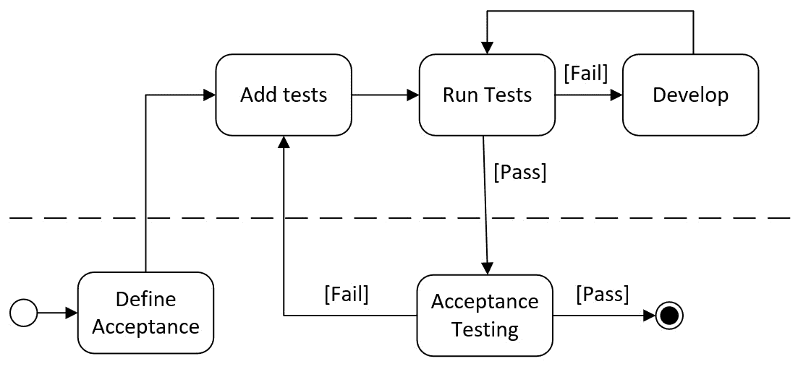
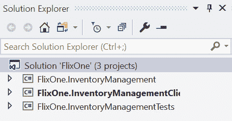

# 第三章：实施设计模式 - 基础部分 1

在前两章中，我们介绍并定义了与软件开发生命周期（SDLC）相关的现代模式和实践的广泛范围，从较低级别的开发模式到高级解决方案架构模式。本章将在一个示例场景中应用其中一些模式，以便提供上下文和进一步理解这些定义。该场景是创建一个解决方案来管理电子商务书商的库存。

选择了这个场景，因为它提供了足够的复杂性来说明这些模式，同时概念相对简单。公司需要一种管理他们的库存的方式，包括允许用户订购他们的产品。组织需要尽快建立一个应用程序，以便他们能够跟踪他们的库存，但还有许多其他功能，包括允许客户订购产品并提供评论。随着场景的发展，所请求的功能数量增长到开发团队不知道从何处开始的地步。幸运的是，通过应用一些良好的实践来帮助管理期望和需求，开发团队能够简化他们的初始交付并重新回到正轨。此外，通过使用模式，他们能够建立一个坚实的基础，以帮助解决方案的扩展，随着新功能的添加。

本章将涵盖一个新项目的启动和应用程序的第一个发布。本章中将演示以下模式：

+   最小可行产品（MVP）

+   测试驱动开发（TDD）

+   抽象工厂模式（四人帮）

+   SOLID 原则

# 技术要求

本章包含各种代码示例来解释概念。代码保持简单，仅用于演示目的。大多数示例涉及使用 C#编写的.NET Core 控制台应用程序。

要运行和执行代码，您需要以下内容：

+   Visual Studio 2019（您也可以使用 Visual Studio 2017 版本 3 或更高版本来运行应用程序）

+   .NET Core

+   SQL Server（本章中使用 Express Edition）

# 安装 Visual Studio

要运行这些代码示例，您需要安装 Visual Studio 或者您可以使用您喜欢的集成开发环境。要做到这一点，请按照以下说明操作：

1.  从以下链接下载 Visual Studio：[`docs.microsoft.com/en-us/visualstudio/install/install-visual-studio`](https://docs.microsoft.com/en-us/visualstudio/install/install-visual-studio)。

1.  按照包含的安装说明操作。Visual Studio 有多个版本可供安装。在本章中，我们使用的是 Windows 版的 Visual Studio。

# 设置.NET Core

如果您尚未安装.NET Core，则需要按照以下说明操作：

1.  从以下链接下载.NET Core：[`www.microsoft.com/net/download/windows`](https://www.microsoft.com/net/download/windows)。

1.  按照安装说明和相关库：[`dotnet.microsoft.com/download/dotnet-core/2.2`](https://dotnet.microsoft.com/download/dotnet-core/2.2)。

完整的源代码可在 GitHub 上找到。本章中显示的源代码可能不完整，因此建议检索源代码以运行示例：[`github.com/PacktPublishing/Hands-On-Design-Patterns-with-C-and-.NET-Core/tree/master/Chapter3`](https://github.com/PacktPublishing/Hands-On-Design-Patterns-with-C-and-.NET-Core/tree/master/Chapter3)。

# 最小可行产品

本节涵盖了启动新项目以构建软件应用程序的初始阶段。这有时被称为项目启动或项目启动，其中收集应用程序的初始特性和功能（换句话说，需求收集）。

有许多方法可以视为模式，用于确定软件应用程序的功能。关于如何有效地建模、进行面试和研讨会、头脑风暴和其他技术的最佳实践超出了本书的范围。相反，本书描述了一种方法，即最小可行产品，以提供这些模式可能包含的示例。

该项目是针对一个假设情况，一个名为 FlixOne 的公司希望使用库存管理应用程序来管理其不断增长的图书收藏。这个新应用程序将被员工用于管理库存，也将被客户用于浏览和创建新订单。该应用程序需要具有可扩展性，并且作为业务的重要系统，计划在可预见的未来使用。

公司主要分为*业务用户*和*开发团队*，业务用户主要关注系统的功能，开发团队关注满足需求，以及保持系统的可维护性。这是一个简化；然而，组织并不一定如此整洁地组织，个人可能无法正确地归入一个分类或另一个分类。例如，**业务分析师**（**BA**）或**主题专家**（**SME**）经常代表业务用户和开发团队的成员。

由于这是一本技术书籍，我们将主要从开发团队的角度来看待这个情景，并讨论用于实现库存管理应用程序的模式和实践。

# 需求

在几次会议中，业务和开发团队讨论了新库存管理系统的需求。定义一组清晰的需求的进展缓慢，最终产品的愿景也不清晰。开发团队决定将庞大的需求列表削减到足够的功能，以便一个关键人物可以开始记录一些库存信息。这将允许简单的库存管理，并为业务提供一个可以扩展的基础。然后，每组新的需求都可以添加到初始发布中。

最小可行产品（MVP）

最小可行产品是应用程序的最小功能集，仍然可以发布并为用户群体提供足够的价值。

MVP 方法的优势在于它通过缩小应用程序的范围，为业务和开发团队提供了一个简化的交付需求的愿景。通过减少要交付的功能，确定需要做什么的工作变得更加集中。在 FlixOne 的情况下，会议的价值经常会降低到讨论一个功能的细节，尽管这个功能对产品的最终版本很重要，但需要在发布几个功能之前。例如，围绕面向客户的网站的设计让团队分散注意力，无法专注于存储在库存管理系统中的数据。

MVP 在需求复杂性不完全理解和/或最终愿景不明确的情况下非常有用。然而，仍然很重要要保持产品愿景，以避免开发可能在应用程序的最终版本中不需要的功能。

业务和开发团队能够为初始库存管理应用程序定义以下功能需求：

+   该应用程序应该是一个控制台应用程序：

+   它应该打印包含程序集版本的欢迎消息。

+   它应该循环直到给出退出命令。

+   如果给定的命令不成功或不被理解，那么它应该打印一个有用的消息。

+   应用程序应该对简单的不区分大小写的文本命令做出响应。

+   每个命令都应该有一个短形式，一个字符，和一个长形式。

+   如果命令有额外的参数：

+   每个都应按顺序输入，并使用回车键提交。

+   每个都应该有一个提示`输入{参数}：`，其中`{参数}`是参数的名称。

+   应该有一个帮助命令（`?`）：

+   打印可用命令的摘要。

+   打印每个命令的示例用法。

+   应该有一个退出命令（`q`，`quit`）：

+   打印一条告别消息

+   结束应用程序

+   应该有一个添加库存命令（`"a"`，`"addinventory"`）：

+   类型为字符串的`name`参数。

+   它应该向数据库中添加一个具有给定名称和 0 数量的条目。

+   应该有一个更新数量命令（`"u"`，`"updatequantity"`）：

+   类型为字符串的`name`参数。

+   `quantity`参数为正整数或负整数。

+   它应该通过添加给定数量来更新具有给定名称的书的数量值。

+   应该有一个获取库存命令（`"g"`，`"getinventory"`）：

+   返回数据库中所有书籍及其数量。

并且定义了以下非功能性要求：

+   除了操作系统提供的安全性外，不需要其他安全性。

+   命令的短格式是为了可用性，而命令的长格式是为了可读性。

FlixOne 示例是如何使用 MVP 来帮助聚焦和简化 SDLC 的示例。值得强调的是**概念验证**（PoC）和 MVP 之间的区别在每个组织中都会有所不同。在本书中，PoC 与 MVP 的不同之处在于所得到的应用程序不被视为一次性或不完整的。对于商业产品，这意味着最终产品可以出售，对于内部企业解决方案，该应用程序可以为组织增加价值。

# MVP 如何与未来的开发相适应？

使用 MVP 聚焦和包含需求的另一个好处是它与敏捷软件开发的协同作用。将开发周期分解为较小的开发周期是一种在传统瀑布式开发中获得流行的软件开发技术。驱动概念是需求和解决方案在应用程序的生命周期中演变，并涉及开发团队和最终用户之间的协作。通常，敏捷软件开发框架具有较短的发布周期，其中设计、开发、测试和发布新功能。然后重复发布周期，以包含额外的功能。当工作范围适合发布周期时，MVP 在敏捷开发中表现良好。

Scrum 和 Kanban 是基于敏捷软件开发的流行软件开发框架。

初始 MVP 要求的范围被保持在可以在敏捷周期内设计、开发、测试和发布的范围内。在下一个周期中，将向应用程序添加其他要求。挑战在于限制新功能的范围，使其能够在一个周期内完成。每个新功能的发布都限于基本要求或其 MVP。这里的原则是，通过使用迭代方法进行软件开发，应用程序的最终版本将对最终用户产生比使用需要提前定义所有要求的单个发布更大的好处。

以下图表总结了敏捷和瀑布式软件开发方法之间的区别：


# 测试驱动开发

存在不同的**测试驱动开发**（**TDD**）方法，*测试*可以是在开发过程中按需运行的单元测试，也可以是在项目构建期间运行的单元测试，还可以是作为**用户验收测试**（**UAT**）一部分运行的测试脚本。同样，*测试*可以是代码，也可以是描述用户执行步骤以验证需求的文档。这是因为对于 TDD 试图实现的目标有不同的看法。对于一些团队来说，TDD 是一种在编写代码之前完善需求的技术，而对于其他人来说，TDD 是一种衡量或验证交付的代码的方式。

UAT

UAT 是在 SDLC 期间用于验证产品或项目是否满足指定要求的活动的术语。这通常由业务成员或一些客户执行。根据情况，这个阶段可以进一步分为 alpha 和 beta 阶段，其中 alpha 测试由开发团队执行，beta 测试由最终用户执行。

# 团队为什么选择 TDD？

开发团队决定使用 TDD 有几个原因。首先，团队希望在开发过程中清晰地衡量进展。其次，他们希望能够在后续的开发周期中重复使用测试，以便在添加新功能的同时继续验证现有功能。出于这些原因，团队将使用单元测试来验证编写的功能是否满足团队给定的要求。

以下图表说明了 TDD 的基础知识：


测试被添加并且代码库被更新，直到所有定义的测试都通过为止。重要的是要注意这是重复的。在每次迭代中，都会添加新的测试，并且在所有测试，新的和现有的，都通过之前，测试都不被认为是通过的。

FlixOne 开发团队决定将单元测试和 UAT 结合到一个敏捷周期中。在每个周期开始时，将确定新的验收标准。这将包括要交付的功能，以及在开发周期结束时如何验证或接受。这些验收标准将用于向项目添加测试。然后，开发团队将构建解决方案，直到新的和现有的测试都通过，然后准备一个用于验收测试的构建。然后，将运行验收测试，如果检测到任何问题，开发团队将根据失败定义新的测试或修改现有测试。应用程序将再次开发，直到所有测试都通过并准备一个新的构建。这将重复直到验收测试通过。然后，应用程序将部署，并开始一个新的开发周期。

以下图表说明了这种方法：



团队现在有了一个计划，让我们开始编码吧！

# 设置项目

在这种情况下，我们将使用**Microsoft Unit Test**（**MSTest**）框架。本节提供了一些使用.NET Core **命令行界面**（**CLI**）工具创建初始项目的说明。这些步骤也可以使用集成开发环境（IDE）如 Visual Studio 或 Visual Studio Code 完成。这里提供这些说明是为了说明 CLI 如何用于补充 IDE。

CLI

.NET Core CLI 工具是用于开发.NET 应用程序的跨平台实用程序，并且是更复杂工具的基础，例如 IDE。请参阅文档以获取更多信息：[`docs.microsoft.com/en-us/dotnet/core/tools`](https://docs.microsoft.com/en-us/dotnet/core/tools)。

本章的解决方案将包括三个项目：控制台应用程序、类库和测试项目。让我们创建解决方案目录 FlixOne，以包含解决方案和三个项目的子目录。在创建的目录中，以下命令将创建一个新的解决方案文件：

```cs
dotnet new sln
```

以下截图说明了创建目录和解决方案（注意：目前只创建了一个空解决方案文件）：


类库`FlixOne.InventoryManagement`将包含我们的业务实体和逻辑。在后面的章节中，我们将把它们拆分成单独的库，但是由于我们的应用程序还很小，它们包含在一个单独的程序集中。创建项目的`dotnet`核心 CLI 命令如下所示：

```cs
dotnet new classlib --name FlixOne.InventoryManagement
```

请注意，在以下截图中，创建了一个包含新类库项目文件的新目录：


应该从解决方案到新类库进行引用，使用以下命令：

```cs
dotnet sln add .\FlixOne.InventoryManagement\FlixOne.InventoryManagement.csproj
```

要创建一个新的控制台应用程序项目，应使用以下命令：

```cs
dotnet new console --name FlixOne.InventoryManagementClient
```

以下截图显示了`console`模板的恢复：


控制台应用程序需要引用类库（注意：该命令需要在将引用添加到其中的项目文件所在的目录中运行）：

```cs
dotnet add reference ..\FlixOne.InventoryManagement\FlixOne.InventoryManagement.csproj
```

将使用以下命令创建一个新的`MSTest`项目：

```cs
dotnet new mstest --name FlixOne.InventoryManagementTests
```

以下截图显示了创建 MSTest 项目，并应在与解决方案相同的文件夹中运行，FlixOne（注意包含所需 MSTest NuGet 包的命令中恢复的包）：


测试项目还需要引用类库（注意：此命令需要在与 MSTest 项目文件相同的文件夹中运行）：

```cs
dotnet add reference ..\FlixOne.InventoryManagement\FlixOne.InventoryManagement.csproj
```

最后，通过在与解决方案文件相同的目录中运行以下命令，将控制台应用程序和 MSTest 项目添加到解决方案中：

```cs
dotnet sln add .\FlixOne.InventoryManagementClient\FlixOne.InventoryManagementClient.csproj
dotnet sln add .\FlixOne.InventoryManagementTests\FlixOne.InventoryManagementTests.csproj
```

从视觉上看，解决方案如下所示：



现在我们的解决方案的初始结构已经准备好了，让我们首先开始添加到我们的单元测试定义。

# 初始单元测试定义

开发团队首先将需求转录成一些基本的单元测试。由于还没有设计或编写任何内容，因此这些测试大多以记录应该验证的功能为形式。随着设计和开发的进展，这些测试也将朝着完成的方向发展；例如，需要添加库存：

添加库存命令（“a”，“addinventory”）可用：

+   `name`参数为字符串类型。

+   使用给定的名称和`0`数量向数据库添加条目。

为了满足这个需求，开发团队创建了以下单元测试作为占位符：

```cs
[TestMethod]
private void AddInventoryCommand_Successful()
{
  // create an instance of the command
  // add a new book with parameter "name"
  // verify the book was added with the given name with 0 quantity

  Assert.Inconclusive("AddInventoryCommand_Successful has not been implemented.");
}
```

随着应用程序设计的逐渐明确和开发的开始，现有的测试将扩展，新的测试将被创建，如下所示：


不确定测试的重要性在于它们向团队传达了需要完成的任务，并且在开发进行时提供了一种衡量。随着开发的进行，不确定和失败的测试将表明需要进行的工作，而成功的测试将表明朝着完成当前一组任务的进展。

# 抽象工厂设计模式

为了说明我们的第一个模式，让我们通过开发帮助命令和初始控制台应用程序来走一遍。初始版本的控制台应用程序如下所示：

```cs
private static void Main(string[] args)
{
    Greeting();

    // note: inline out variable introduced as part of C# 7.0
    GetCommand("?").RunCommand(out bool shouldQuit); 

    while (!shouldQuit)
    { 
        // handle the commands
        ...
    }

    Console.WriteLine("CatalogService has completed."); 
}
```

应用程序启动时，会显示问候语和帮助命令的结果。然后，应用程序将处理输入的命令，直到输入退出命令为止。

以下显示了处理命令的详细信息：

```cs
    while (!shouldQuit)
    { 
        Console.WriteLine(" > ");
        var input = Console.ReadLine();
        var command = GetCommand(input);

        var wasSuccessful = command.RunCommand(out shouldQuit);

        if (!wasSuccessful)
        {
            Console.WriteLine("Enter ? to view options.");
        }
    }
```

直到应用程序解决方案退出，应用程序将继续提示用户输入命令，如果命令没有成功处理，那么将显示帮助文本。

RunCommand(out bool shouldQuit)

C# 7.0 引入了一种更流畅的语法，用于创建`out`参数。这将在命令块的范围内声明变量。下面的示例说明了这一点，其中`shouldQuit`布尔值不是提前声明的。

# InventoryCommand 抽象类

关于初始控制台应用程序的第一件事是，团队正在使用**面向对象编程**（**OOP**）来创建处理命令的标准方式。团队从这个初始设计中学到的是，所有命令都将包含一个`RunCommand()`方法，该方法将返回两个布尔值，指示命令是否成功以及程序是否应该终止。例如，`HelpCommand()`将简单地在控制台上显示帮助消息，并且不应该导致程序结束。然后两个返回的布尔值将是*true*，表示命令成功运行，*false*，表示应用程序不应该终止。以下显示了初始版本：

这个...表示额外的声明，在这个特定的例子中，额外的`Console.WriteLine()`声明。

```cs
public class HelpCommand
{
    public bool RunCommand(out bool shouldQuit)
    {
        Console.WriteLine("USAGE:");
        Console.WriteLine("\taddinventory (a)");
        ...
        Console.WriteLine("Examples:");
        ...

        shouldQuit = false;
        return true;
    }
}
```

`QuitCommand`将显示一条消息，然后导致程序结束。最初的`QuitCommand`如下：

```cs
public class QuitCommand
{
    public bool RunCommand(out bool shouldQuit)
    {
        Console.WriteLine("Thank you for using FlixOne Inventory Management System");

        shouldQuit = true;
        return true;
    }
}
```

团队决定要么创建一个接口，两个类都实现，要么创建一个抽象类，两个类都继承。两者都可以实现所需的动态多态性，但团队选择使用抽象类，因为所有命令都将具有共享功能。

在 OOP 中，特别是在 C#中，多态性以三种主要方式得到支持：函数重载、泛型和子类型或动态多态性。

使用抽象工厂设计模式，团队创建了一个抽象类，命令将从中继承，`InventoryCommand`。`InventoryCommand`类有一个单一的方法，`RunCommand`，将执行命令并返回命令是否成功执行以及应用程序是否应该退出。该类是抽象的，意味着类包含一个或多个抽象方法。在这种情况下，`InternalCommand()`方法是抽象的，意图是从`InventoryCommand`类派生的类将使用特定命令功能实现`InternalCommand`方法。例如，`QuitCommand`将扩展`InventoryCommand`并为`InternalCommand()`方法提供具体实现。以下片段显示了带有抽象`InternalCommand()`方法的`InventoryCommand`抽象类：

```cs
public abstract class InventoryCommand
{
    private readonly bool _isTerminatingCommand;
    internal InventoryCommand(bool commandIsTerminating)
    {
        _isTerminatingCommand = commandIsTerminating; 
    }
    public bool RunCommand(out bool shouldQuit)
    {
        shouldQuit = _isTerminatingCommand;
        return InternalCommand();
    }

    internal abstract bool InternalCommand();
}
```

然后抽象方法将在每个派生类中实现，就像`HelpCommand`所示。`HelpCommand`简单地向控制台打印一些信息，然后返回`true`，表示命令成功执行：

```cs
public class HelpCommand : InventoryCommand
{
    public HelpCommand() : base(false) { }

    internal override bool InternalCommand()
    { 
        Console.WriteLine("USAGE:");
        Console.WriteLine("\taddinventory (a)");
        ...
        Console.WriteLine("Examples:");
        ... 
        return true;
    }
}
```

开发团队随后决定对`InventoryCommand`进行两个额外的更改。他们不喜欢的第一件事是`shouldQuit`布尔值作为*out*变量返回。因此，他们决定使用 C# 7 的新元组功能，而不是返回一个单一的`Tuple<bool,bool>`对象，如下所示：

```cs
public (bool wasSuccessful, bool shouldQuit) RunCommand()
{
    /* additional code hidden */

    return (InternalCommand(), _isTerminatingCommand);
}
```

元组

元组是 C#类型，提供了一种轻量级的语法，可以将多个值打包成一个单一对象。与定义类的缺点是你失去了继承和其他面向对象的功能。更多信息，请参见[`docs.microsoft.com/en-us/dotnet/csharp/tuples`](https://docs.microsoft.com/en-us/dotnet/csharp/tuples)。

另一个变化是引入另一个抽象类，指示命令是否是一个非终止命令；换句话说，不会导致解决方案退出或结束的命令。

如下代码所示，这个命令仍然是抽象的，因为它没有实现`InventoryCommand`的`InternalCommand`方法，但它向基类传递了一个 false 值：

```cs
internal abstract class NonTerminatingCommand : InventoryCommand
{
    protected NonTerminatingCommand() : base(commandIsTerminating: false)
    {
    }
}
```

这里的优势是现在不会导致应用程序终止的命令 - 换句话说，非终止命令 - 现在有了更简单的定义：

```cs
internal class HelpCommand : NonTerminatingCommand
{
    internal override bool InternalCommand()
    {
        Interface.WriteMessage("USAGE:");
        /* additional code hidden */

        return true;
    }
}
```

以下类图显示了`InventoryCommand`抽象类的继承：


只有一个终止命令，`QuitCommand`，而其他命令扩展了`NonTerminatingCommand`抽象类。还值得注意的是，`AddInventoryCommand`和`UpdateQuantityCommand`需要参数，并且`IParameterisedCommand`的使用将在*Liskov 替换原则*部分中解释。图表中的另一个微妙之处是除了基本的`InventoryCommand`之外，所有类型都不是公共的（对外部程序集可见）。这将在本章后面的*访问修饰符*部分变得相关。

# SOLID 原则

随着团队使用模式简化代码，他们还使用 SOLID 原则来帮助识别问题。通过简化代码，团队的目标是使代码更易于维护，并且更容易让新团队成员理解。通过使用一套原则审查代码的方法，在编写只做必要的事情并提供一层抽象的类时非常有用，这有助于编写更容易修改和理解的代码。

# 单一职责原则（SRP）

团队应用的第一个原则是**单一职责原则**（**SRP**）。团队发现写入控制台的实际机制不是`InventoryCommand`类的责任。因此，引入了一个负责与用户交互的`ConsoleUserInterface`类。SRP 将有助于保持`InventoryCommand`类更小，并避免重复相同的代码的情况。例如，应用程序应该有一种统一的方式提示用户输入信息和显示消息和警告。这种逻辑不是在`InventoryCommand`类中重复，而是封装在`ConsoleUserInterface`类中。

`ConsoleUserInteraface`将包括三种方法，如下所示：

```cs
public class ConsoleUserInterface
{
    // read value from console

    // message to the console

    // writer warning message to the console
}
```

第一种方法将用于从控制台读取输入：

```cs
public string ReadValue(string message)
{
    Console.ForegroundColor = ConsoleColor.Green;
    Console.Write(message);
    return Console.ReadLine();
}
```

第二种方法将使用绿色在控制台上打印一条消息：

```cs
public void WriteMessage(string message)
{
    Console.ForegroundColor = ConsoleColor.Green;
    Console.WriteLine(message);
}
```

最终的方法将使用深黄色在控制台上打印一条警告消息：

```cs
public void WriteWarning(string message)
{
    Console.ForegroundColor = ConsoleColor.DarkYellow;
    Console.WriteLine(message);
}
```

通过`ConsoleUserInterface`类，我们可以减少与用户交互方式的变化对我们的影响。随着解决方案的发展，我们可能会发现界面从控制台变为 Web 应用程序。理论上，我们将用`WebUserInterface`替换`ConsoleUserInterface`。如果我们没有将用户界面简化为单个类，这种变化的影响很可能会更加破坏性。

# 开闭原则（OCP）

开闭原则，SOLID 中的 O，由不同的`InventoryCommand`类表示。团队可以定义一个包含多个`if`语句的单个类，而不是为每个命令定义一个`InventoryCommand`类的实现。每个`if`语句将确定要执行的功能。例如，以下说明了团队如何打破这个原则：

```cs
internal bool InternalCommand(string command)
{
    switch (command)
    {
        case "?":
        case "help":
            return RunHelpCommand(); 
        case "a":
        case "addinventory":
            return RunAddInventoryCommand(); 
        case "q":
        case "quit":
            return RunQuitCommand();
        case "u":
        case "updatequantity":
            return RunUpdateInventoryCommand();
        case "g":
        case "getinventory":
            return RunGetInventoryCommand();
    }
    return false;
}
```

上述方法违反了这一原则，因为添加新命令会改变代码的行为。该原则的理念是它对于会*改变*其行为的修改是**封闭**的，而是**开放**的，以扩展类以支持附加行为。通过具有抽象的`InventoryCommand`和派生类（例如`QuitCommand`、`HelpCommand`和`AddInventoryCommand`）来实现这一点。尤其是与其他原则结合使用时，这是一个令人信服的理由，因为它导致简洁的代码，更易于维护和理解。

# 里氏替换原则（LSP）

退出、帮助和获取库存的命令不需要参数，而`AddInventory`和`UpdateQuantityCommand`需要。有几种处理方式，团队决定引入一个接口来标识这些命令，如下所示：

```cs
public interface IParameterisedCommand
{
    bool GetParameters();
}
```

通过应用**里氏替换原则**（**LSP**），只有需要参数的命令应该实现`GetParameters()`方法。例如，在`AddInventory`命令上，使用在基类`InventoryCommand`上定义的方法来实现`IParameterisedCommand`：

```cs
public class AddInventoryCommand : InventoryCommand, IParameterisedCommand
{
    public string InventoryName { get; private set; }

    /// <summary>
    /// AddInventoryCommand requires name
    /// </summary>
    /// <returns></returns>
    public bool GetParameters()
    {
        if (string.IsNullOrWhiteSpace(InventoryName))
            InventoryName = GetParameter("name");

        return !string.IsNullOrWhiteSpace(InventoryName);
    }    
}
```

`InventoryCommand`类上的`GetParameter`方法简单地使用`ConsoleUserInterface`从控制台读取值。该方法将在本章后面显示。在 C#中，有一个方便的语法，可以很好地显示 LSP 如何用于仅将功能应用于特定接口的对象。在`RunCommand`方法的第一行，使用`is`关键字来测试当前对象是否实现了`IParameterisedCommand`接口，并将对象强制转换为新对象：`parameterisedCommand`。以下代码片段中的粗体显示了这一点：

```cs
public (bool wasSuccessful, bool shouldQuit) RunCommand()
{
    if (this is IParameterisedCommand parameterisedCommand)
    {
        var allParametersCompleted = false;

        while (allParametersCompleted == false)
        {
            allParametersCompleted = parameterisedCommand.GetParameters();
        }
    }

    return (InternalCommand(), _isTerminatingCommand);
}
```

# 接口隔离原则（ISP）

处理带参数和不带参数的命令的一种方法是在`InventoryCommand`抽象类上定义另一个方法`GetParameters`，对于不需要参数的命令，只需返回 true 以指示已接收到所有（在本例中为零）参数。例如，`QuitCommand`、`**HelpCommand**`和`GetInventoryCommand`都将有类似以下实现：

```cs
internal override bool GetParameters()
{
    return true;
}
```

这将起作用，但它违反了**接口隔离原则**（**ISP**），该原则规定接口应仅包含所需的方法和属性。与 SRP 类似，适用于类的 ISP 适用于接口，并且在保持接口小型和专注方面非常有效。在我们的示例中，只有`AddInventoryCommand`和`UpdateQuantityCommand`类将实现`InventoryCommand`接口。

# 依赖反转原则

**依赖反转原则**（**DIP**），也称为**依赖注入原则**（**DIP**），模块不应依赖于细节，而应依赖于抽象。该原则鼓励编写松散耦合的代码，以增强可读性和维护性，特别是在大型复杂的代码库中。

如果我们重新访问之前介绍的`ConsoleUserInterface`类（在*单一职责原则*部分），我们可以在没有`QuitCommand`的情况下使用该类如下：

```cs
internal class QuitCommand : InventoryCommand
{
    internal override bool InternalCommand()
    {
        var console = new ConsoleUserInterface();
        console.WriteMessage("Thank you for using FlixOne Inventory Management System");

        return true;
    }
}
```

这违反了几个 SOLID 原则，但就 DIP 而言，它在`QuitCommand`和`ConsoleUserInterface`之间形成了紧密耦合。想象一下，如果控制台不再是向用户显示信息的手段，或者如果`ConsoleUserInterface`的构造函数需要额外的参数会怎么样？

通过应用 DIP 原则，进行了以下重构。首先引入了一个新的接口`IUserInterface`，其中包含了`ConsoleUserInterface`中实现的方法的定义。接下来，在`InventoryCommand`类中使用接口而不是具体类。最后，在`InventoryCommand`类的构造函数中传递了一个实现`IUserInterface`的对象的引用。这种方法保护了`InventoryCommand`类免受对`IUserInterface`类实现细节的更改，并为更轻松地替换`IUserInterface`的不同实现提供了一种机制，使代码库得以发展。

DIP 如下图所示，`QuitCommand`是本章的最终版本：

```cs
internal class QuitCommand : InventoryCommand
{
    public QuitCommand(IUserInterface userInterface) : 
           base(commandIsTerminating: true, userInteface: userInterface)
    {
    }

    internal override bool InternalCommand()
    {
        Interface.WriteMessage("Thank you for using FlixOne Inventory Management System");

        return true;
    }
}
```

请注意，该类扩展了`InventoryCommand`抽象类，提供了处理命令的通用方式，同时提供了共享功能。构造函数要求在实例化对象时注入`IUserInterface`依赖项。还要注意，`QuitCommand`实现了一个方法`InternalCommand()`，使`QuitCommand`简洁易读易懂。

为了完成整个图片，让我们来看最终的`InventoryCommand`基类。以下显示了构造函数和属性：

```cs
public abstract class InventoryCommand
{
    private readonly bool _isTerminatingCommand;
    protected IUserInterface Interface { get; }

    internal InventoryCommand(bool commandIsTerminating, IUserInterface userInteface)
    {
        _isTerminatingCommand = commandIsTerminating;
        Interface = userInteface;
    }
    ...
}
```

请注意，`IUserInterface`被传递到构造函数中，以及一个布尔值，指示命令是否终止。然后，`IUserInterface`对于所有`InventoryCommand`的实现都可用作`Interface`属性。

`RunCommand`是该类上唯一的公共方法：

```cs
public (bool wasSuccessful, bool shouldQuit) RunCommand()
{
    if (this is IParameterisedCommand parameterisedCommand)
    {
        var allParametersCompleted = false;

        while (allParametersCompleted == false)
        {
            allParametersCompleted = parameterisedCommand.GetParameters();
        }
    }

    return (InternalCommand(), _isTerminatingCommand);
}

internal abstract bool InternalCommand();
```

此外，`GetParameter`方法是所有`InventoryCommand`实现的公共方法，因此它被设置为内部方法：

```cs
internal string GetParameter(string parameterName)
{
    return Interface.ReadValue($"Enter {parameterName}:"); 
}
```

DIP 和 IoC

DIP 和**控制反转**（IoC）密切相关，都以稍微不同的方式解决相同的问题。IoC 及其专门形式的**服务定位器模式**（SLP）使用机制按需提供抽象的实现。因此，IoC 充当代理以提供所需的细节，而不是注入实现。在下一章中，将探讨.NET Core 对这些模式的支持。

# InventoryCommand 单元测试

随着`InventoryCommand`类的形成，让我们重新审视单元测试，以便开始验证到目前为止编写的内容，并确定任何缺失的要求。在这里，SOLID 原则将显示其价值。因为我们保持了类（SRP）和接口（ISP）的小型化，并且专注于所需的最小功能量（LSP），我们的测试也应该更容易编写和验证。例如，关于其中一个命令的测试将不需要验证控制台上消息的显示（例如颜色或文本大小），因为这不是`InventoryCommand`类的责任，而是`IUserInterface`的实现的责任。此外，通过依赖注入，我们将能够将测试隔离到仅涉及库存命令。以下图表说明了这一点，因为单元测试将仅验证绿色框中包含的内容：


通过保持单元测试的范围有限，将更容易处理应用程序的变化。在某些情况下，由于类之间的相互依赖关系（换句话说，当未遵循 SOLID 原则时），更难以分离功能，测试可能会跨应用程序的较大部分，包括存储库。这些测试通常被称为集成测试，而不是单元测试。

# 访问修饰符

访问修饰符是处理类型和类型成员可见性的重要方式，通过封装代码来实现。通过使用清晰的访问策略，可以传达和强制执行程序集及其类型应该如何使用的意图。例如，在 FlixOne 应用程序中，只有应该由控制台直接访问的类型被标记为公共。这意味着控制台应用程序应该能够看到有限数量的类型和方法。这些类型和方法已标记为公共，而控制台不应该访问的类型和方法已标记为内部、私有或受保护。

请参阅 Microsoft 文档编程指南，了解有关访问修饰符的更多信息：

[`docs.microsoft.com/en-us/dotnet/csharp/programming-guide/classes-and-structs/access-modifiers`](https://docs.microsoft.com/en-us/dotnet/csharp/programming-guide/classes-and-structs/access-modifiers)

`InventoryCommand`抽象类被公开，因为控制台应用程序将使用`RunCommand`方法来处理命令。

在下面的片段中，请注意构造函数和接口被标记为受保护，以便给予子类访问权限：

```cs
public abstract class InventoryCommand
{
    private readonly bool _isTerminatingCommand;
    protected IUserInterface Interface { get; }

    protected InventoryCommand(bool commandIsTerminating, IUserInterface userInteface)
    {
        _isTerminatingCommand = commandIsTerminating;
        Interface = userInteface;
    }
    ...
}
```

在下面的片段中，请注意`RunCommand`方法被标记为公共，而`InternalCommand`被标记为内部：

```cs
public (bool wasSuccessful, bool shouldQuit) RunCommand()
{
    if (this is IParameterisedCommand parameterisedCommand)
    {
        var allParametersCompleted = false;

        while (allParametersCompleted == false)
        {
            allParametersCompleted = parameterisedCommand.GetParameters();
        }
    }

    return (InternalCommand(), _isTerminatingCommand);
}

internal abstract bool InternalCommand();
```

同样，`InventoryCommand`的实现被标记为内部，以防止它们被直接引用到程序集外部。这在`QuitCommand`中有所体现：

```cs
internal class QuitCommand : InventoryCommand
{
    internal QuitCommand(IUserInterface userInterface) : base(true, userInterface) { }

    protected override bool InternalCommand()
    {
        Interface.WriteMessage("Thank you for using FlixOne Inventory Management System");

        return true;
    }
}
```

因为不同实现的访问对于单元测试项目来说不会直接可见，所以需要额外的步骤来使内部类型可见。`assembly`指令可以放置在任何已编译的文件中，对于 FlixOne 应用程序，添加了一个包含程序集属性的`assembly.cs`文件：

```cs
using System.Runtime.CompilerServices;
[assembly: InternalsVisibleTo("FlixOne.InventoryManagementTests")]
```

在程序集已签名的情况下，`InternalsVisibleTo()`需要一个公钥。请参阅 Microsoft Docs C#指南，了解更多信息：[`docs.microsoft.com/en-us/dotnet/csharp/programming-guide/concepts/assemblies-gac/how-to-create-signed-friend-assemblies`](https://docs.microsoft.com/en-us/dotnet/csharp/programming-guide/concepts/assemblies-gac/how-to-create-signed-friend-assemblies)。

# Helper TestUserInterface

作为对`InventoryCommand`实现之一的单元测试的一部分，我们不希望测试引用的依赖关系。幸运的是，由于命令遵循 DIP，我们可以创建一个`helper`类来验证实现与依赖关系的交互。其中一个依赖是`IUserInterface`，它在构造函数中传递给实现。以下是接口的方法的提醒：

```cs
public interface IUserInterface : IReadUserInterface, IWriteUserInterface { }

public interface IReadUserInterface
{
    string ReadValue(string message);
}

public interface IWriteUserInterface
{
    void WriteMessage(string message);
    void WriteWarning(string message);
}
```

通过实现一个`helper`类，我们可以提供`ReadValue`方法所需的信息，并验证`WriteMessage`和`WriteWarning`方法中是否收到了适当的消息。在测试项目中，创建了一个名为`TestUserInterface`的新类，该类实现了`IUserInterface`接口。该类包含三个列表，包含预期的`WriteMessage`、`WriteWarning`和`ReadValue`调用，并跟踪调用次数。

例如，`WriteWarning`方法显示如下：

```cs
public void WriteWarning(string message)
{
    Assert.IsTrue(_expectedWriteWarningRequestsIndex < _expectedWriteWarningRequests.Count,
                  "Received too many command write warning requests.");

    Assert.AreEqual(_expectedWriteWarningRequests[_expectedWriteWarningRequestsIndex++], message,                             "Received unexpected command write warning message");
}
```

`WriteWarning`方法执行两个断言。第一个断言验证方法调用的次数不超过预期，第二个断言验证接收到的消息是否与预期消息匹配。

`ReadValue`方法类似，但它还将一个值返回给调用的`InventoryCommand`实现。这将模拟用户在控制台输入信息：

```cs
public string ReadValue(string message)
{
    Assert.IsTrue(_expectedReadRequestsIndex < _expectedReadRequests.Count,
                  "Received too many command read requests.");

    Assert.AreEqual(_expectedReadRequests[_expectedReadRequestsIndex].Item1, message, 
                    "Received unexpected command read message");

    return _expectedReadRequests[_expectedReadRequestsIndex++].Item2;
}
```

作为额外的验证步骤，在测试方法结束时，调用`TestUserInterface`来验证是否收到了预期数量的`ReadValue`、`WriteMessage`和`WriteWarning`请求：

```cs
public void Validate()
{
    Assert.IsTrue(_expectedReadRequestsIndex == _expectedReadRequests.Count, 
                  "Not all read requests were performed.");
    Assert.IsTrue(_expectedWriteMessageRequestsIndex == _expectedWriteMessageRequests.Count, 
                  "Not all write requests were performed.");
    Assert.IsTrue(_expectedWriteWarningRequestsIndex == _expectedWriteWarningRequests.Count, 
                  "Not all warning requests were performed.");
}
```

`TestUserInterface`类说明了如何模拟依赖项以提供存根功能，并提供断言来帮助验证预期的行为。在后面的章节中，我们将使用第三方包提供更复杂的模拟依赖项的框架。

# 单元测试示例 - QuitCommand

从`QuitCommand`开始，要求非常明确：命令应打印告别消息，然后导致应用程序结束。我们已经设计了`InventoryCommand`来返回两个布尔值，以指示应用程序是否应该退出以及命令是否成功结束：

```cs
[TestMethod]
public void QuitCommand_Successful()
{
    var expectedInterface = new Helpers.TestUserInterface(
        new List<Tuple<string, string>>(), // ReadValue()
        new List<string> // WriteMessage()
        {
            "Thank you for using FlixOne Inventory Management System"
        },
        new List<string>() // WriteWarning()
    );

    // create an instance of the command
    var command = new QuitCommand(expectedInterface);

    var result = command.RunCommand();

    expectedInterface.Validate();

    Assert.IsTrue(result.shouldQuit, "Quit is a terminating command.");
    Assert.IsTrue(result.wasSuccessful, "Quit did not complete Successfully.");
}
```

测试使用`TestUserInterface`来验证文本`"感谢您使用 FlixOne 库存管理系统"`是否发送到`WriteMessage`方法，并且没有接收到`ReadValue`或`WriteWarning`请求。这两个标准通过`expectedInterface.Validate()`调用进行验证。通过检查`shouldQuit`和`wasSuccessful`布尔值为 true 来验证`QuitCommand`的结果。

在 FlixOne 场景中，为了简化，要显示的文本在解决方案中是*硬编码*的。更好的方法是使用资源文件。资源文件提供了一种将文本与功能分开维护的方式，同时支持为不同文化本地化数据。

# 总结

本章介绍了在线书商 FlixOne 想要构建一个管理其库存的应用程序的情景。本章涵盖了开发团队在开发应用程序时可以使用的一系列模式和实践。团队使用 MVP 来帮助将初始交付的范围保持在可管理的水平，并帮助业务集中确定对组织最有益的需求。团队决定使用 TDD 来验证交付是否符合要求，并帮助团队衡量进展。基本项目以及单元测试框架 MSTest 已创建。团队还使用了 SOLID 原则来帮助以一种既有利于可读性又有利于代码库的维护的方式构建代码，随着对应用程序的新增增强。第一个四人帮模式，抽象工厂设计模式，用于为所有库存命令提供基础。

在下一章中，团队将继续构建初始库存管理项目，以满足 MVP 中定义的要求。团队将使用四人帮的 Singleton 模式和 Factory Method 模式。这些将在.NET Core 中支持这些功能的机制的情况下展示。

# 问题

以下问题将帮助您巩固本章中包含的信息：

1.  在为组织开发软件时，为什么有时很难确定需求？

1.  瀑布软件开发与敏捷软件开发的两个优点和缺点是什么？

1.  编写单元测试时，依赖注入如何帮助？

1.  为什么以下陈述是错误的？使用 TDD，您不再需要人们测试新软件部署。
