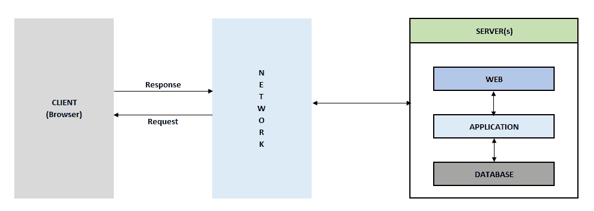
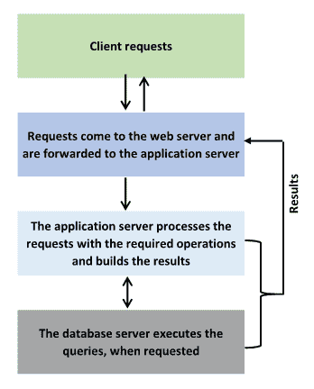
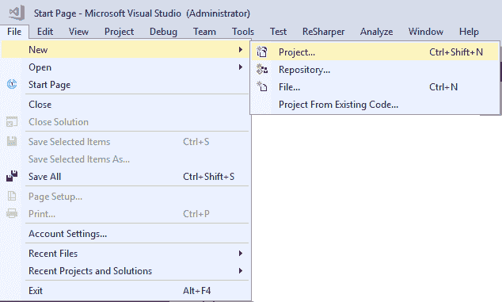
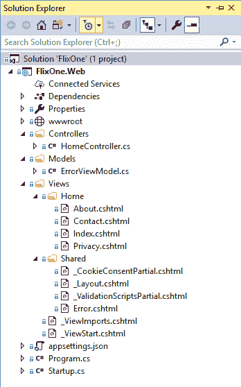
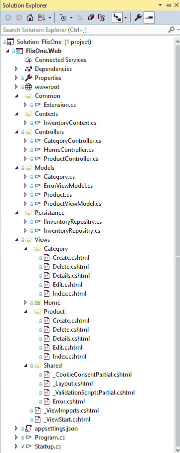
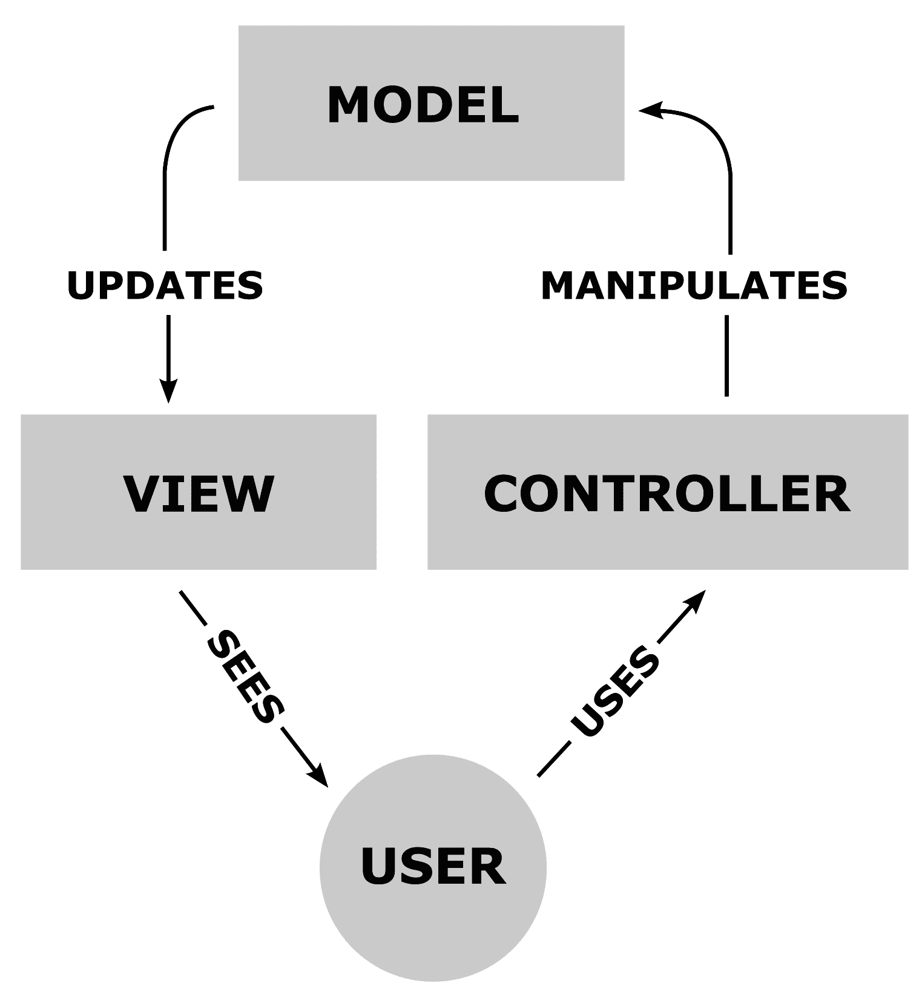
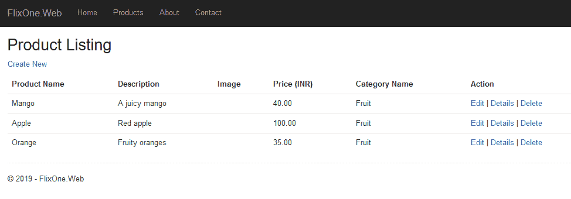

# 第六章：为网络应用程序实施设计模式-第一部分

在本章中，我们将继续构建**FlixOne**库存管理应用程序（参见第三章，*实施设计模式基础-第一部分*），并讨论将控制台应用程序转换为网络应用程序。网络应用程序应该更吸引用户，而不是控制台应用程序；在这里，我们还将讨论为什么要进行这种改变。

本章将涵盖以下主题：

+   创建一个.NET Core 网络应用程序

+   制作一个网络应用程序

+   实施 CRUD 页面

如果您尚未查看早期章节，请注意**FlixOne Inventory Management**网络应用程序是一个虚构的产品。我们创建这个应用程序来讨论网络项目中所需的各种设计模式。

# 技术要求

本章包含各种代码示例来解释概念。代码保持简单，仅用于演示目的。大多数示例涉及使用 C#编写的**.NET Core**控制台应用程序。

要运行和执行代码，您需要以下内容：

+   Visual Studio 2019（您也可以使用 Visual Studio 2017 更新 3 或更高版本来运行应用程序）

+   .NET Core 的环境设置

+   SQL Server（本章使用 Express 版本）

# 安装 Visual Studio

要运行这些代码示例，您需要安装 Visual Studio（2017）或更新版本，如 2019（或您可以使用您喜欢的 IDE）。要做到这一点，请按照以下步骤操作：

1.  从以下网址下载 Visual Studio：[`docs.microsoft.com/en-us/visualstudio/install/install-visual-studio`](https://docs.microsoft.com/en-us/visualstudio/install/install-visual-studio)。

1.  按照包含的安装说明进行操作。Visual Studio 有多个版本可供安装。在本章中，我们使用的是 Windows 版的 Visual Studio。

# 设置.NET Core

如果您尚未安装.NET Core，则需要按照以下步骤操作：

1.  从以下网址下载.NET Core：[`www.microsoft.com/net/download/windows`](https://www.microsoft.com/net/download/windows)。

1.  按照安装说明并关注相关库：[`dotnet.microsoft.com/download/dotnet-core/2.2`](https://dotnet.microsoft.com/download/dotnet-core/2.2)。

# 安装 SQL Server

如果您尚未安装 SQL Server，则需要按照以下说明操作：

1.  从以下网址下载 SQL Server：[`www.microsoft.com/en-in/download/details.aspx?id=1695`](https://www.microsoft.com/en-in/download/details.aspx?id=1695)。

1.  您可以在以下网址找到安装说明：[`docs.microsoft.com/en-us/sql/ssms/download-sql-server-management-studio-ssms?view=sql-server-2017`](https://docs.microsoft.com/en-us/sql/ssms/download-sql-server-management-studio-ssms?view=sql-server-2017)。

有关故障排除和更多信息，请参阅：[`www.blackbaud.com/files/support/infinityinstaller/content/installermaster/tkinstallsqlserver2008r2.htm`](https://www.blackbaud.com/files/support/infinityinstaller/content/installermaster/tkinstallsqlserver2008r2.htm)。

本节旨在提供开始使用网络应用程序的先决条件信息。我们将在后续章节中详细了解更多细节。在本章中，我们将使用代码示例来详细解释各种术语和部分。

完整的源代码可在以下网址找到：[`github.com/PacktPublishing/Hands-On-Design-Patterns-with-C-and-.NET-Core/tree/master/Chapter6`](https://github.com/PacktPublishing/Hands-On-Design-Patterns-with-C-and-.NET-Core/tree/master/Chapter6)。

# 创建一个.Net Core 网络应用程序

在本章的开头，我们讨论了我们基于 FlixOne 控制台的应用程序，并且业务团队确定了采用 Web 应用程序的各种原因。现在是时候对应用程序进行更改了。在本节中，我们将开始创建一个新的 UI，给我们现有的 FlixOne 应用程序一个新的外观和感觉。我们还将讨论所有的需求和初始化。

# 启动项目

在我们现有的 FlixOne 控制台应用程序的基础上，管理层决定对我们的 FlixOne 库存控制台应用程序进行大幅改进，增加了许多功能。管理层得出结论，我们必须将现有的控制台应用程序转换为基于 Web 的解决方案。

技术团队和业务团队一起坐下来，确定了废弃当前控制台应用程序的各种原因：

+   界面不具有交互性。

+   该应用程序并非随处可用。

+   维护复杂。

+   不断增长的业务需要一个可扩展的系统，具有更高的性能和适应性。

# 开发需求

以下的需求清单是讨论的结果。确定的高级需求如下：

+   产品分类

+   产品添加

+   产品更新

+   产品删除

业务要求实际上落在开发人员身上。这些技术需求包括以下内容：

+   **一个登陆或主页**：这应该是一个包含各种小部件的仪表板，并且应该显示商店的摘要。

+   **产品页面**：这应该具有添加、更新和删除产品和类别的功能。

# 打造 Web 应用程序

根据刚刚讨论的需求，我们的主要目标是将现有的控制台应用程序转换为 Web 应用程序。在这个转换过程中，我们将讨论 Web 应用程序的各种设计模式，以及这些设计模式在 Web 应用程序的背景下的重要性。

# 网络应用程序及其工作原理

Web 应用程序是客户端-服务器架构的最佳实现之一。Web 应用程序可以是一小段代码、一个程序，或者是一个解决问题或业务场景的完整解决方案，用户可以通过浏览器相互交互或与服务器交互。Web 应用程序主要通过浏览器提供请求和响应，主要通过**超文本传输协议**（**HTTP**）。

每当客户端和服务器之间发生通信时，都会发生两件事：客户端发起请求，服务器生成响应。这种通信由 HTTP 请求和 HTTP 响应组成。有关更多信息，请参阅文档：[`www.w3schools.com/whatis/whatis_http.asp`](https://www.w3schools.com/whatis/whatis_http.asp)。

在下图中，你可以看到 Web 应用程序的概述和工作原理：



从这个图表中，你可以很容易地看到，通过使用浏览器（作为客户端），你为数百万用户打开了可以从世界各地访问网站并与你作为用户交互的大门。通过 Web 应用程序，你和你的客户可以轻松地进行沟通。通常，只有在你捕获并存储了业务和用户所需的所有必要信息的数据时，才能实现有效的参与。然后这些信息被处理，结果呈现给你的用户。

一般来说，Web 应用程序使用服务器端代码来处理信息的存储和检索，以及客户端脚本来向用户呈现信息。

Web 应用程序需要 Web 服务器（如**IIS**或**Apache**）来管理来自客户端的请求（从浏览器中可以看到）。还需要应用程序服务器（如 IIS 或 Apache Tomcat）来执行请求的任务。有时还需要数据库来存储信息。

简而言之，Web 服务器和应用程序服务器都旨在提供 HTTP 内容，但具有一定的差异。Web 服务器提供静态 HTTP 内容，如 HTML 页面。应用程序服务器除了提供静态 HTTP 内容外，还可以使用不同的编程语言提供动态内容。有关更多信息，请参阅[`stackoverflow.com/questions/936197/what-is-the-difference-between-application-server-and-web-server`](https://stackoverflow.com/questions/936197/what-is-the-difference-between-application-server-and-web-server)。

我们可以详细说明 Web 应用程序的工作流程如下。这些被称为 Web 应用程序的五个工作过程：

1.  客户端（浏览器）通过互联网使用 HTTP（在大多数情况下）触发请求到 Web 服务器。这通常通过 Web 浏览器或应用程序的用户界面完成。

1.  请求在 Web 服务器处发出，Web 服务器将请求转发给应用程序服务器（对于不同的请求，将有不同的应用程序服务器）。

1.  在应用程序服务器中，完成了请求的任务。这可能涉及查询数据库服务器，从数据库中检索信息，处理信息和构建结果。

1.  生成的结果（请求的信息或处理的数据）被发送到 Web 服务器。

1.  最后，响应将从 Web 服务器发送回请求者（客户端），并显示在用户的显示器上。

以下图表显示了这五个步骤的图解概述：



在接下来的几节中，我将描述使用**模型-视图-控制器**（**MVC**）模式的 Web 应用程序的工作过程。

# 编写 Web 应用程序

到目前为止，我们已经了解了要求并查看了我们的目标，即将控制台应用程序转换为基于 Web 的平台或应用程序。在本节中，我们将使用 Visual Studio 开发实际的 Web 应用程序。

执行以下步骤，使用 Visual Studio 创建 Web 应用程序：

1.  打开 Visual Studio 实例。

1.  单击文件|新建|项目或按*Ctrl + Shift + N*，如下截图所示：



1.  从“新建项目”窗口中，选择 Web|.NET Core|ASP.NET Core Web 应用程序。

1.  命名它（例如`FlixOne.Web`），选择位置，然后您可以更新解决方案名称。默认情况下，解决方案名称将与项目名称相同。选中“为解决方案创建目录”复选框。您还可以选择选中“创建新的 Git 存储库”复选框（如果要为此创建新存储库，您需要有效的 Git 帐户）。

以下截图显示了创建新项目的过程：


1.  下一步是为您的 Web 应用程序选择适当的模板和.NET Core 版本。我们不打算为此项目启用 Docker 支持，因为我们不打算使用 Docker 作为容器部署我们的应用程序。我们将仅使用 HTTP 协议，而不是 HTTPS。因此，应保持未选中“启用 Docker 支持”和“配置 HTTPs”复选框，如下截图所示：


现在，我们拥有一个完整的项目，其中包含我们的模板和示例代码，使用 MVC 框架。以下截图显示了我们目前的解决方案：



架构模式是在用户界面和应用程序设计中实施最佳实践的一种方式。它们为我们提供了常见问题的可重用解决方案。这些模式还允许我们轻松实现关注点的分离。

最流行的架构模式如下：

+   **模型-视图-控制器**（**MVC**）

+   **模型-视图-展示者**（**MVP**）

+   **模型-视图-视图模型**（**MVVM**）

您可以尝试通过按下*F5*来运行应用程序。以下屏幕截图显示了 Web 应用程序的默认主页：


在接下来的章节中，我将讨论 MVC 模式，并创建**CRUD**（**创建**，**更新**和**删除**）页面与用户交互。

# 实现 CRUD 页面

在本节中，我们将开始创建功能页面来创建、更新和删除产品。要开始，请打开您的`FlixOne`解决方案，并将以下类添加到指定的文件夹中：

**`Models`**：在解决方案的`Models`文件夹中添加以下文件：

+   `Product.cs`：`Product`类的代码片段如下：

```cs
public class Product
{
   public Guid Id { get; set; }
   public string Name { get; set; }
   public string Description { get; set; }
   public string Image { get; set; }
   public decimal Price { get; set; }
   public Guid CategoryId { get; set; }
   public virtual Category Category { get; set; }
}
```

`Product`类几乎代表了产品的所有元素。它有一个`Name`，一个完整的`Description`，一个`Image`，一个`Price`，以及一个唯一的`ID`，以便我们的系统识别它。`Product`类还有一个`Category ID`，表示该产品所属的类别。它还包括对`Category`的完整定义。

**为什么我们应该定义一个`virtual`属性？**

在我们的`Product`类中，我们定义了一个`virtual`属性。这是因为在**Entity Framework**（**EF**）中，此属性有助于为虚拟属性创建代理。这样，属性可以支持延迟加载和更高效的更改跟踪。这意味着数据是按需可用的。当您请求使用`Category`属性时，EF 会加载数据。

+   `Category.cs`：`Category`类的代码片段如下：

```cs
public class Category
{
    public Category()
    {
        Products = new List<Product>();
    }

    public Guid Id { get; set; }
    public string Name { get; set; }
    public string Description { get; set; }
    public virtual IEnumerable<Product> Products { get; set; }
}
```

我们的`Category`类代表产品的实际类别。类别具有唯一的`ID`，一个`Name`，一个完整的`Description`，以及属于该类别的`Products`集合。每当我们初始化我们的`Category`类时，它也会初始化我们的`Product`类。

+   `ProductViewModel.cs`：`ProductViewModel`类的代码片段如下：

```cs
public class ProductViewModel
{
    public Guid ProductId { get; set; }
    public string ProductName { get; set; }
    public string ProductDescription { get; set; }
    public string ProductImage { get; set; }
    public decimal ProductPrice { get; set; }
    public Guid CategoryId { get; set; }
    public string CategoryName { get; set; }
    public string CategoryDescription { get; set; }
}
```

我们的`ProductViewModel`类代表了一个完整的`Product`，具有唯一的`ProductId`，一个`ProductName`，一个完整的`ProductDescription`，一个`ProductImage`，一个`ProductPrice`，一个唯一的`CategoryId`，一个`CategoryName`，以及一个完整的`CategoryDescription`。

`Controllers`：在解决方案的`Controllers`文件夹中添加以下文件：

+   `ProductController`负责与产品相关的所有操作。让我们看看在此控制器中我们试图实现的代码和操作：

```cs
public class ProductController : Controller
{
    private readonly IInventoryRepositry _repositry;
    public ProductController(IInventoryRepositry inventoryRepositry) => _repositry = inventoryRepositry;

...
}
```

在这里，我们定义了继承自`Controller`类的`ProductController`。我们使用了内置于 ASP.NET Core MVC 框架的**依赖注入**。

我们在第五章中详细讨论了控制反转；`Controller`是 MVC 控制器的基类。有关更多信息，请参阅：[`docs.microsoft.com/en-us/dotnet/api/microsoft.aspnetcore.mvc.controller`](https://docs.microsoft.com/en-us/dotnet/api/microsoft.aspnetcore.mvc.controller)。

我们已经创建了我们的主控制器`ProductController`。现在让我们开始为我们的 CRUD 操作添加功能。

以下代码只是一个`Read`或`Get`操作，请求存储库（`_``inventoryRepository`）列出所有可用产品，然后将此产品列表转换为`ProductViewModel`类型并返回`Index`视图：

```cs
   public IActionResult Index() => View(_repositry.GetProducts().ToProductvm());
   public IActionResult Details(Guid id) => View(_repositry.GetProduct(id).ToProductvm());
```

在上面的代码片段中，`Details`方法根据其唯一的`Id`返回特定`Product`的详细信息。这也是一个类似于我们的`Index`方法的`Get`操作，但它提供单个对象而不是列表。

**MVC 控制器**的方法也称为**操作方法**，并且具有`ActionResult`的返回类型。在这种情况下，我们使用`IActionResult`。一般来说，可以说`IActionResult`是`ActionResult`类的一个接口。它还为我们提供了返回许多东西的方法，包括以下内容：

+   `EmptyResult`

+   `FileResult`

+   `HttpStatusCodeResult`

+   `ContentResult`

+   `JsonResult`

+   `RedirectToRouteResult`

+   `RedirectResult`

我们不打算详细讨论所有这些，因为这超出了本书的范围。要了解有关返回类型的更多信息，请参阅：[`docs.microsoft.com/en-us/aspnet/core/web-api/action-return-types`](https://docs.microsoft.com/en-us/aspnet/core/web-api/action-return-types)。

在下面的代码中，我们正在创建一个新产品。下面的代码片段有两个操作方法。一个有`[HttpPost]`属性，另一个没有属性：

```cs
public IActionResult Create() => View();
[HttpPost]
[ValidateAntiForgeryToken]
public IActionResult Create([FromBody] Product product)
{
    try
    {
        _repositry.AddProduct(product);
        return RedirectToAction(nameof(Index));
    }
    catch
    {
        return View();
    }
}
```

第一个方法只是返回一个`View`。这将返回一个`Create.cshtml`页面。

如果**MVC 框架**中的任何操作方法没有任何属性，它将默认使用`[HttpGet]`属性。在其他视图中，默认情况下，操作方法是`Get`请求。每当用户查看页面时，我们使用`[HttpGet]`，或者`Get`请求。每当用户提交表单或执行操作时，我们使用`[HttpPost]`，或者`Post`请求。

如果我们在操作方法中没有明确提到视图名称，那么 MVC 框架会以这种格式查找视图名称：`actionmethodname.cshtml`或`actionmethodname.vbhtml`。在我们的情况下，视图名称是`Create.cshtml`，因为我们使用的是 C#语言。如果我们使用 Visual Basic，它将是`vbhtml`。它首先在与控制器文件夹名称相似的文件夹中查找文件。如果在这个文件夹中找不到文件，它会在`shared`文件夹中查找。

上面代码片段中的第二个操作方法使用了`[HttpPost]`属性，这意味着它处理`Post`请求。这个操作方法只是通过调用`_repository`的`AddProduct`方法来添加产品。在这个操作方法中，我们使用了`[ValidateAntiForgeryToken]`属性和`[FromBody]`，这是一个模型绑定器。

MVC 框架通过提供`[ValidateAntiForgeryToken]`属性为我们的应用程序提供了很多安全性，以保护我们免受**跨站脚本**/**跨站请求伪造**（**XSS/CSRF**）攻击。这种类型的攻击通常包括一些危险的客户端脚本代码。

MVC 中的模型绑定将数据从`HTTP`请求映射到操作方法参数。与操作方法一起经常使用的模型绑定属性如下：

+   `[FromHeader]`

+   ``[FromQuery]``

+   `[FromRoute]`

+   `[FromForm]`

我们不打算详细讨论这些，因为这超出了本书的范围。但是，您可以在官方文档中找到完整的详细信息：[`docs.microsoft.com/en-us/aspnet/core/mvc/models/model-binding`](https://docs.microsoft.com/en-us/aspnet/core/mvc/models/model-binding)。

在上面的代码片段中，我们讨论了`Create`和`Read`操作。现在是时候为`Update`操作编写代码了。在下面的代码中，我们有两个操作方法：一个是`Get`，另一个是`Post`请求：

```cs
public IActionResult Edit(Guid id) => View(_repositry.GetProduct(id));

[HttpPost]
[ValidateAntiForgeryToken]
public IActionResult Edit(Guid id, [FromBody] Product product)
{
    try
    {
        _repositry.UpdateProduct(product);
        return RedirectToAction(nameof(Index));
    }
    catch
    {
        return View();
    }
}
```

上面代码的第一个操作方法根据`ID`获取`Product`并返回一个`View`。第二个操作方法从视图中获取数据并根据其 ID 更新请求的`Product`：

```cs
public IActionResult Delete(Guid id) => View(_repositry.GetProduct(id));

[HttpPost]
[ValidateAntiForgeryToken]
public IActionResult Delete(Guid id, [FromBody] Product product)
{
    try
    {
        _repositry.RemoveProduct(product);
        return RedirectToAction(nameof(Index));
    }
    catch
    {
        return View();
    }
}
```

最后，上面的代码表示了我们的`CRUD`操作中的`Delete`操作。它还有两个操作方法；一个从存储库中检索数据并将其提供给视图，另一个获取数据请求并根据其 ID 删除特定的`Product`。

`CategoryController`负责`Product`类别的所有操作。将以下代码添加到控制器中，它表示`CategoryController`，我们在其中使用依赖注入来初始化我们的`IInventoryRepository`：

```cs
public class CategoryController: Controller
{
  private readonly IInventoryRepositry _inventoryRepositry;
  public CategoryController(IInventoryRepositry inventoryRepositry) => _inventoryRepositry = inventoryRepositry;
 //code omitted
}
```

以下代码包含两个操作方法。第一个获取类别列表，第二个是根据其唯一 ID 获取特定类别：

```cs
public IActionResult Index() => View(_inventoryRepositry.GetCategories());
public IActionResult Details(Guid id) => View(_inventoryRepositry.GetCategory(id));
```

以下代码是用于在系统中创建新类别的`Get`和`Post`请求：

```cs
public IActionResult Create() => View();
    [HttpPost]
    [ValidateAntiForgeryToken]
    public IActionResult Create([FromBody] Category category)
    {
        try
        {
            _inventoryRepositry.AddCategory(category);

            return RedirectToAction(nameof(Index));
        }
        catch
        {
            return View();
        }
    }
```

在以下代码中，我们正在更新我们现有的类别。代码包含了带有`Get`和`Post`请求的`Edit`操作方法：

```cs
public IActionResult Edit(Guid id) => View(_inventoryRepositry.GetCategory(id));
    [HttpPost]
    [ValidateAntiForgeryToken]
    public IActionResult Edit(Guid id, [FromBody]Category category)
    {
        try
        {
            _inventoryRepositry.UpdateCategory(category);

            return RedirectToAction(nameof(Index));
        }
        catch
        {
            return View();
        }
    }
```

最后，我们有一个`Delete`操作方法。这是我们`Category`删除的`CRUD`页面的最终操作，如下所示：

```cs
public IActionResult Delete(Guid id) => View(_inventoryRepositry.GetCategory(id));

    [HttpPost]
    [ValidateAntiForgeryToken]
    public IActionResult Delete(Guid id, [FromBody] Category category)
    {
        try
        {
            _inventoryRepositry.RemoveCategory(category);

            return RedirectToAction(nameof(Index));
        }
        catch
        {
            return View();
        }
    }
```

`Views`：将以下视图添加到各自的文件夹中：

+   `Index.cshtml`

+   `Create.cshtml`

+   `Edit.cshtml`

+   `Delete.cshtml`

+   `Details.cshtml`

`Contexts`：将`InventoryContext.cs`文件添加到`Contexts`文件夹，并使用以下代码：

```cs
public class InventoryContext : DbContext
{
    public InventoryContext(DbContextOptions<InventoryContext> options)
        : base(options)
    {
    }

    public InventoryContext()
    {
    }

    public DbSet<Product> Products { get; set; }
    public DbSet<Category> Categories { get; set; }
}
```

上述代码提供了使用 EF 与数据库交互所需的各种方法。在运行代码时，您可能会遇到以下异常：


要解决此异常，您应该在`Startup.cs`文件中映射到`IInventoryRepository`，如下截图所示：


我们现在已经为我们的 Web 应用程序添加了各种功能，我们的解决方案现在如下截图所示：



有关本章的 GitHub 存储库，请参阅[`github.com/PacktPublishing/Hands-On-Design-Patterns-with-C-and-.NET-Core/tree/master/Chapter6`](https://github.com/PacktPublishing/Hands-On-Design-Patterns-with-C-and-.NET-Core/tree/master/Chapter6)。

如果我们要可视化 MVC 模型，那么它将按照以下图表所示的方式工作：



上述图像改编自[`commons.wikimedia.org/wiki/File:MVC-Process.svg`](https://commons.wikimedia.org/wiki/File:MVC-Process.svg)

如前图所示，每当用户发出请求时，它都会传递到控制器并触发操作方法进行进一步操作或更新，如果需要的话，传递到模型，然后向用户提供视图。

在我们的情况下，每当用户请求`/Product`时，请求会传递到`ProductController`的`Index`操作方法，并在获取产品列表后提供`Index.cshtml`视图。您将会得到如下截图所示的产品列表：



上述截图是一个简单的产品列表，它代表了`CRUD`操作的`Read`部分。在此屏幕上，应用程序显示了总共可用的产品及其类别。

以下图表描述了我们的应用程序如何交互：


它显示了我们应用程序流程的图形概述。`InventoryRepository`依赖于`InventoryContext`进行数据库操作，并与我们的模型类`Category`和`Product`进行交互。我们的`Product`和`Category`控制器使用`IInventoryRepository`接口与存储库进行 CRUD 操作的交互。

# 总结

本章的主要目标是启动一个基本的 Web 应用程序。

我们通过讨论业务需求开始了本章，解释了为什么需要 Web 应用程序以及为什么要升级我们的控制台应用程序。然后，我们使用 Visual Studio 在 MVC 模式中逐步创建了 Web 应用程序。我们还讨论了 Web 应用程序如何作为客户端-服务器模型工作，并且研究了用户界面模式。我们还开始构建 CRUD 页面。

在下一章中，我们将继续讨论 Web 应用程序，并讨论更多 Web 应用程序的设计模式。

# 问题

以下问题将帮助您巩固本章中包含的信息：

1.  什么是 Web 应用程序？

1.  精心打造一个您选择的 Web 应用程序，并描述其工作原理。

1.  控制反转是什么？

1.  在本章中我们涵盖了哪些架构模式？您喜欢哪一种，为什么？

# 进一步阅读

恭喜！您已完成本章内容。我们涵盖了与身份验证、授权和测试项目相关的许多内容。这并不是您学习的终点；这只是一个开始，还有更多书籍可以供您参考，以增进您的理解。以下书籍深入探讨了 RESTful Web 服务和测试驱动开发：

+   *使用.NET Core 构建 RESTful Web 服务*，作者为*Gaurav Aroraa*，*Tadit Dash*，出版社为*Packt Publishing*，网址：[`www.packtpub.com/application-development/building-restful-web-services-net-core`](https://www.packtpub.com/application-development/building-restful-web-services-net-core)

+   *C#和.NET Core 测试驱动开发*，作者为*Ayobami Adewole*，出版社为*Packt Publishing*，网址：[`www.packtpub.com/application-development/c-and-net-core-test-driven-development`](https://www.packtpub.com/application-development/c-and-net-core-test-driven-development)
