# 第七章：实施 Web 应用程序的设计模式-第二部分

在上一章中，我们将我们的 FlixOne 库存管理控制台应用程序扩展为 Web 应用程序，同时说明了不同的模式。我们还涵盖了**用户界面**（**UI**）架构模式，如**模型-视图-控制器**（**MVC**）、**模型视图呈现器**（**MVP**）等。上一章旨在讨论 MVC 等模式。现在我们需要扩展我们现有的应用程序，以纳入更多模式。

在本章中，我们将继续使用我们现有的 FlixOne Web 应用程序，并通过编写代码来扩展应用程序，以查看认证和授权的实现。除此之外，我们还将讨论**测试驱动开发**（**TDD**）。

在本章中，我们将涵盖以下主题：

+   认证和授权

+   创建一个.NET Core Web 测试项目

# 技术要求

本章包含各种代码示例，以解释概念。代码保持简单，仅用于演示目的。大多数示例涉及使用 C#编写的.NET Core 控制台应用程序。

要运行和执行代码，Visual Studio 2019 是必需的（您也可以使用 Visual Studio 2017 来运行应用程序）。

# 安装 Visual Studio

要运行这些代码示例，您需要安装 Visual Studio（首选**集成开发环境**（**IDE**））。要做到这一点，请按照以下说明进行操作：

1.  从以下下载链接下载 Visual Studio，其中包含安装说明：[`docs.microsoft.com/en-us/visualstudio/install/install-visual-studio`](https://docs.microsoft.com/en-us/visualstudio/install/install-visual-studio)。

1.  按照您在那里找到的安装说明进行操作。Visual Studio 有多个版本可供安装。在这里，我们使用的是 Windows 版的 Visual Studio。

# 设置.NET Core

如果您没有安装.NET Core，则需要按照以下说明进行操作：

1.  使用[`www.microsoft.com/net/download/windows`](https://www.microsoft.com/net/download/windows)下载 Windows 版.NET Core。

1.  有关多个版本和相关库，请访问[`dotnet.microsoft.com/download/dotnet-core/2.2`](https://dotnet.microsoft.com/download/dotnet-core/2.2)。

# 安装 SQL Server

如果您没有安装 SQL Server，则需要按照以下说明进行操作：

1.  从以下链接下载 SQL Server：[`www.microsoft.com/en-in/download/details.aspx?id=1695`](https://www.microsoft.com/en-in/download/details.aspx?id=1695)。

1.  您可以在这里找到安装说明：[`docs.microsoft.com/en-us/sql/ssms/download-sql-server-management-studio-ssms?view=sql-server-2017`](https://docs.microsoft.com/en-us/sql/ssms/download-sql-server-management-studio-ssms?view=sql-server-2017)。

有关故障排除和更多信息，请参考以下链接：[`www.blackbaud.com/files/support/infinityinstaller/content/installermaster/tkinstallsqlserver2008r2.htm`](https://www.blackbaud.com/files/support/infinityinstaller/content/installermaster/tkinstallsqlserver2008r2.htm)。

完整的源代码可以从以下链接获得：[`github.com/PacktPublishing/Hands-On-Design-Patterns-with-C-and-.NET-Core/tree/master/Chapter7`](https://github.com/PacktPublishing/Hands-On-Design-Patterns-with-C-and-.NET-Core/tree/master/Chapter7)。

# 扩展.NET Core Web 应用程序

在本章中，我们将继续使用我们的 FlixOne 库存应用程序。在本章中，我们将讨论 Web 应用程序模式，并扩展我们在上一章中开发的 Web 应用程序。

本章将继续上一章开发的 Web 应用程序。如果您跳过了上一章，请返回查看，以与当前章节同步。

在本节中，我们将介绍需求收集的过程，然后讨论我们之前开发的 Web 应用程序所面临的各种挑战。

# 项目启动

在第六章中，*为 Web 应用程序实现设计模式-第一部分*，我们扩展了我们的 FlixOne 库存控制台应用程序并开发了一个 Web 应用程序。在考虑了以下几点后，我们扩展了该应用程序：

+   我们的业务需要一个丰富的用户界面。

+   新的机会需要一个响应式的 Web 应用程序。

# 需求

经过几次会议和与管理层、业务分析师（BAs）和售前人员的讨论后，管理层决定着手处理以下高级需求：**业务需求**和**技术需求**。

# 业务需求

业务团队最终提出了以下业务需求：

+   **产品分类**：有多种产品，但如果用户想要搜索特定产品，他们可以通过按类别筛选所有产品来实现。例如，像芒果、香蕉等产品应该属于名为“水果”的类别。

+   **产品添加**：应该有一个界面，提供给我们添加新产品的功能。这个功能只能提供给具有“添加产品”权限的用户。

+   **产品更新**：应该有一个新的界面，可以进行产品更新。

+   **产品删除**：管理员需要删除产品。

# 技术要求

满足业务需求的实际需求现在已经准备好进行开发。经过与业务人员的多次讨论，我们得出以下需求：

+   **应该有一个着陆页或主页**：

+   应该有一个包含各种小部件的仪表板

+   应该显示商店的一览图片

+   **应该有一个产品页面**：

+   应该具备添加、更新和删除产品的能力

+   应该具备添加、更新和删除产品类别的能力

FlixOne 库存管理 Web 应用程序是一个虚构的产品。我们正在创建此应用程序来讨论 Web 项目中所需/使用的各种设计模式。

# 挑战

尽管我们已将现有的控制台应用程序扩展为新的 Web 应用程序，但对开发人员和企业来说都存在各种挑战。在本节中，我们将讨论这些挑战，然后找出克服这些挑战的解决方案。

# 开发人员面临的挑战

由于应用程序发生了重大变化而出现的挑战。这也是将控制台应用程序升级为 Web 应用程序的主要扩展的结果：

+   **不支持 TDD**：目前解决方案中没有包含测试项目。因此，开发人员无法遵循 TDD 方法，这可能会导致应用程序中出现更多的错误。

+   **安全性**：在当前应用程序中，没有机制来限制或允许用户访问特定屏幕或模块。也没有与身份验证和授权相关的内容。

+   **UI 和用户体验（UX）**：我们的应用程序是从基于控制台的应用程序推广而来，因此 UI 并不是非常丰富。

# 企业面临的挑战

实现最终输出需要时间，这延迟了产品，导致业务损失。在我们采用新技术栈并对代码进行大量更改时，出现了以下挑战：

+   **客户流失**：在这里，我们仍处于开发阶段，但对我们业务的需求非常高；然而，开发团队花费的时间比预期的要长，以交付产品。

+   **生产更新需要更多时间**：目前开发工作非常耗时，这延迟了后续活动，并导致生产延迟。

# 找到解决问题/挑战的解决方案

经过数次会议和头脑风暴后，开发团队得出结论，我们必须稳定我们的基于 Web 的解决方案。为了克服这些挑战并提供解决方案，技术团队和业务团队联合起来确定了各种解决方案和要点。

解决方案支持以下要点：

+   实施身份验证和授权

+   遵循 TDD

+   重新设计 UI 以满足 UX

# 身份验证和授权

在上一章中，我们开始将控制台应用程序升级为 Web 应用程序，我们添加了**创建、读取、更新和删除**（CRUD）操作，这些操作对任何能够执行它们的用户都是公开可用的。没有编写任何代码来限制特定用户执行这些操作的权限。这样做的风险是，不应执行这些操作的用户可以轻易执行。其后果如下：

+   无人值守访问

+   黑客/攻击者的开放大门

+   数据泄漏问题

现在，如果我们渴望保护我们的应用程序并将操作限制为允许的用户，那么我们必须实施一个设计，只允许这些用户执行操作。可能有一些情况下，我们可以允许一些操作的开放访问。在我们的情况下，大多数操作仅限于受限访问。简而言之，我们可以尝试一些方法，告诉我们的应用程序，传入的用户是属于我们的应用程序并且可以执行指定的任务。

**身份验证**只是一个系统通过凭据（通常是用户 ID 和密码）验证或识别传入请求的过程。如果系统发现提供的凭据错误，那么它会通知用户（通常通过 GUI 屏幕上的消息）并终止授权过程。

**授权**始终在身份验证之后。这是一个过程，允许经过验证的用户在验证其对特定资源或数据的访问权限后访问资源或数据。

在前面的段落中，我们已经讨论了一些机制，阻止了对我们应用程序操作的无人值守访问。让我们参考下图并讨论它显示了什么：

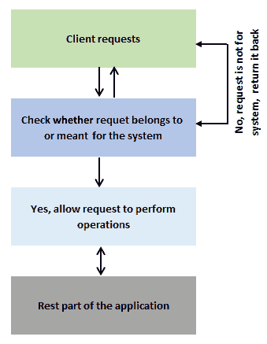

上图描述了一个场景，即系统不允许无人值守访问。这简单地定义为：接收到一个请求，内部系统（身份验证机制）检查请求是否经过身份验证。如果请求经过身份验证，那么用户被允许执行他们被授权的操作。这不仅是单一的检查，但对于典型的系统来说，授权在身份验证之后生效。我们将在接下来的章节中讨论这一点。

为了更好地理解这一点，让我们编写一个简单的登录应用程序。让我们按照这里给出的步骤进行：

1.  打开 Visual Studio 2018。

1.  打开文件 | 新建 | 新项目。

1.  从项目窗口，为您的项目命名。

1.  选择 ASP.NET Core 2.2 的 Web 应用程序（模型-视图-控制器）模板：

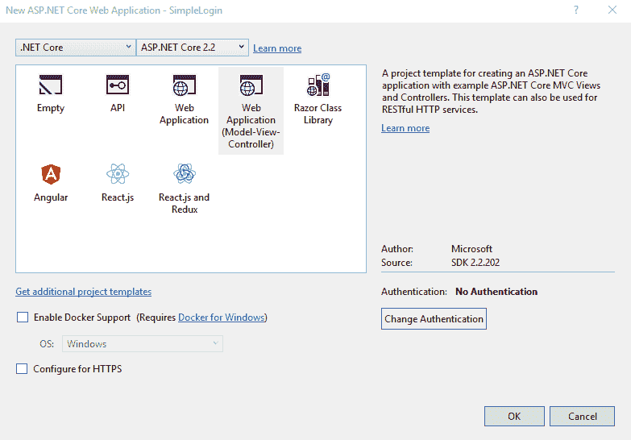

1.  您可以选择所选模板的各种身份验证。

1.  默认情况下，模板提供了一个名为无身份验证的选项，如下所示：

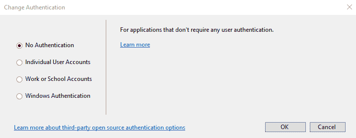

1.  按下*F5*并运行应用程序。从这里，您将看到默认的主页：


现在你会注意到你可以在没有任何限制的情况下浏览每个页面。这是显而易见的，并且有道理，因为这些页面是作为开放访问的。主页和隐私页面是开放访问的，不需要任何身份验证，这意味着任何人都可以访问/查看这些页面。另一方面，我们可能有一些页面是为无人值守访问而设计的，比如用户资料和管理员页面。

请参阅 GitHub 存储库，了解该章节的应用程序，网址为[`github.com/PacktPublishing/Hands-On-Design-Patterns-with-C-and-.NET-Core/tree/master/Chapter6`](https://github.com/PacktPublishing/Hands-On-Design-Patterns-with-C-and-.NET-Core/tree/master/Chapter6)，并浏览我们使用 ASP.NET Core MVC 构建的整个应用程序。

继续使用我们的 SimpleLogin 应用程序，让我们添加一个专门用于受限访问的屏幕：Products 屏幕。在本章中，我们不会讨论如何向现有项目添加新的控制器或视图。如果您想知道如何将这些添加到我们的项目中，请重新访问第六章，*实现 Web 应用程序的设计模式-第一部分*。

我们已经为我们的项目添加了新功能，以展示具有 CRUD 操作的产品。现在，按下*F5*并检查输出：

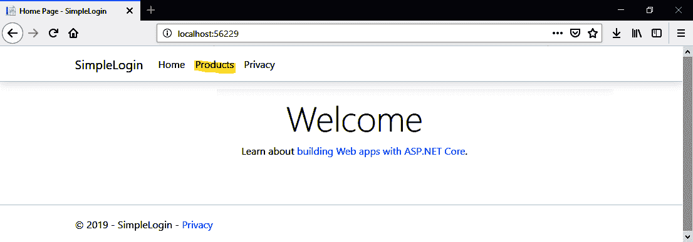

您将得到前面截图中显示的输出。您可能会注意到我们现在有一个名为 Products 的新菜单。

让我们浏览一下新的菜单选项。点击 Products 菜单：

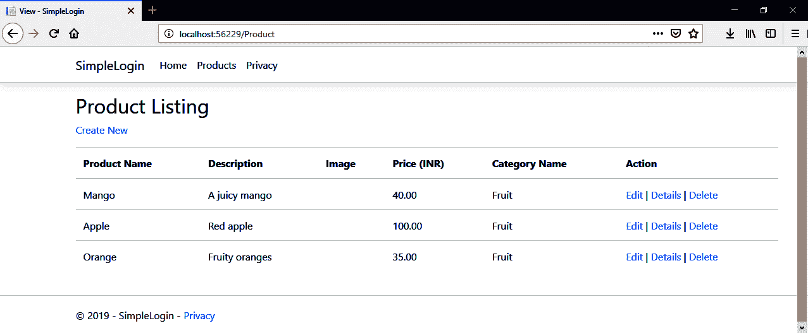

前面的截图显示了我们的产品页面。这个页面对所有人都是可用的，任何人都可以在没有任何限制的情况下查看它。您可以看一看并观察到这个页面具有创建新产品、编辑和删除现有产品的功能。现在，想象一个情景，一个未知的用户来了并删除了一个非常重要并吸引高销量的特定产品。您可以想象这种情景以及这对业务造成了多大的影响。甚至可能会有顾客流失。

在我们的情景中，我们可以通过两种方式保护我们的产品页面：

+   **先前认证**：在这个页面上，产品的链接对所有人都不可用；它只对经过身份验证的请求/用户可用。

+   **后续认证**：在这个页面上，产品的链接对所有人都是可用的。但是，一旦有人请求访问页面，系统就会进行身份验证检查。

# 身份验证进行中。

在这一部分，我们将看到如何实现身份验证，并使我们的网页对未经身份验证的请求受限。

为了实现身份验证，我们应该采用某种机制，为我们提供一种验证用户的方式。一般情况下，如果用户已登录，那就意味着他们已经经过身份验证。

在我们的 Web 应用程序中，我们也会遵循相同的方法，并确保用户在访问受限页面、视图和操作之前已登录：

```cs
public class User
{
    public Guid Id { get; set; }
    public string UserName { get; set; }
    public string EmailId { get; set; }
    public string FirstName { get; set; }
    public string LastName { get; set; }
    public byte[] PasswordHash { get; set; }
    public byte[] PasswordSalt { get; set; }
    public string SecretKey { get; set; }
    public string Mobile { get; set; }
    public string EmailToken { get; set; }
    public DateTime EmailTokenDateTime { get; set; }
    public string OTP { get; set; }
    public DateTime OtpDateTime { get; set; }
    public bool IsMobileVerified { get; set; }
    public bool IsEmailVerified { get; set; }
    public bool IsActive { get; set; }
    public string Image { get; set; }
}
```

前面的类是一个典型的`User`模型/实体，代表我们的数据库`User`表。这个表将保存关于`User`的所有信息。每个字段的样子如下：

+   `Id` 是一个**全局唯一标识符**（**GUID**）和表中的主键。

+   `UserName` 通常在登录和其他相关操作中使用。它是一个程序生成的字段。

+   `FirstName` 和 `LastName` 组合了用户的全名。

+   `Emailid` 是用户的有效电子邮件地址。它应该是一个有效的电子邮件，因为我们将在注册过程中/之后验证它。

+   `PasswordHash` 和 `PasswordSalt` 是基于**哈希消息认证码，安全哈希算法**（**HMAC****SHA**）512 的字节数组。`PasswordHash`属性的值为 64 字节，`PasswordSalt`为 128 字节。

+   `SecretKey` 是一个 Base64 编码的字符串。

+   `Mobilie` 是一个有效的手机号码，取决于系统的有效性检查。

+   `EmailToken` 和 `OTP` 是随机生成的**一次性密码**（**OTPs**），用于验证`emailId`和`Mobile number`。

+   `EmailTokenDateTime` 和 `OtpDateTime` 是`datetime`数据类型的属性；它们表示为用户发出`EmailToken`和`OTP`的日期和时间。

+   `IsMobileVerified`和`IsEmailverified`是布尔值（`true`/`false`），告诉系统手机号和/或电子邮件 ID 是否已验证。

+   `IsActive`是布尔值（`true`/`false`），告诉系统`User`模型是否处于活动状态。

+   `Image`是图像的 Base64 编码字符串。它代表用户的个人资料图片。

我们需要将我们的新类/实体添加到我们的`Context`类中。让我们添加我们在下面截图中看到的内容：

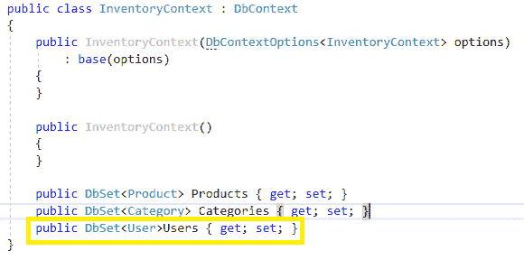

通过在我们的`Context`类中添加上一行，我们可以直接使用**Entity Framework**（**EF**）功能访问我们的`User`表：

```cs
public class LoginViewModel
{
    [Required]
    public string Username { get; set; }
    [Required]
    [DataType(DataType.Password)]
    public string Password { get; set; }
    [Display(Name = "Remember Me")]
    public bool RememberMe { get; set; }
    public string ReturnUrl { get; set; }
}
```

`LoginViewModel`用于验证用户。这个`viewmodel`的值来自登录页面（我们将在接下来的部分讨论和创建此页面）。它包含以下内容：

+   `UserName`：这是用于识别用户的唯一名称。这是一个易于识别的人类可读值。它不像 GUID 值。

+   `Password`：这是任何用户的秘密和敏感值。

+   `RememberMe`：这告诉我们用户是否希望允许当前系统持久化存储在客户端浏览器的 cookie 中的值。

执行 CRUD 操作，让我们将以下代码添加到`UserManager`类中：

```cs
public class UserManager : IUserManager
{
    private readonly InventoryContext _context;

    public UserManager(InventoryContext context) => _context = context;

    public bool Add(User user, string userPassword)
    {
        var newUser = CreateUser(user, userPassword);
        _context.Users.Add(newUser);
        return _context.SaveChanges() > 0;
    }

    public bool Login(LoginViewModel authRequest) => FindBy(authRequest) != null;

    public User GetBy(string userId) => _context.Users.Find(userId);
```

以下是`UserManager`类其余方法的代码片段：

```cs
   public User FindBy(LoginViewModel authRequest)
    {
        var user = Get(authRequest.Username).FirstOrDefault();
        if (user == null) throw new ArgumentException("You are not registered with us.");
        if (VerifyPasswordHash(authRequest.Password, user.PasswordHash, user.PasswordSalt)) return user;
        throw new ArgumentException("Incorrect username or password.");
    }
    public IEnumerable<User> Get(string searchTerm, bool isActive = true)
    {
        return _context.Users.Where(x =>
            x.UserName == searchTerm.ToLower() || x.Mobile == searchTerm ||
            x.EmailId == searchTerm.ToLower() && x.IsActive == isActive);
    }

    ...
}
```

上述代码是`UserManager`类，它使我们能够使用 EF 与我们的`User`表进行交互：

以下代码显示了登录屏幕的视图：

```cs
<form asp-action="Login" asp-route-returnurl="@Model.ReturnUrl">
    <div asp-validation-summary="ModelOnly" class="text-danger"></div>

    <div class="form-group">
        <label asp-for="Username" class="control-label"></label>
        <input asp-for="Username" class="form-control" />
        <span asp-validation-for="Username" class="text-danger"></span>
    </div>

    <div class="form-group">
        <label asp-for="Password" class="control-label"></label>
        <input asp-for="Password" class="form-control"/>
        <span asp-validation-for="Password" class="text-danger"></span>
    </div>

    <div class="form-group">
        <label asp-for="RememberMe" ></label>
        <input asp-for="RememberMe" />
        <span asp-validation-for="RememberMe"></span>
    </div>
    <div class="form-group">
        <input type="submit" value="Login" class="btn btn-primary" />
    </div>
</form>
```

上述代码片段来自我们的`Login.cshtml`页面/视图。该页面提供了一个表单来输入`Login`详细信息。这些详细信息传递到我们的`Account`控制器，然后进行验证以认证用户：

以下是`Login`操作方法：

```cs
[HttpGet]
public IActionResult Login(string returnUrl = "")
{
    var model = new LoginViewModel { ReturnUrl = returnUrl };
    return View(model);
}
```

上述代码片段是一个`Get /Account/Login`请求，显示空的登录页面，如下截图所示：

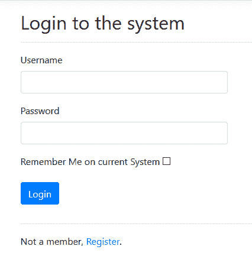

用户点击登录菜单选项后立即出现上一个截图。这是一个用于输入登录详细信息的简单表单。

以下代码显示了处理应用程序`Login`功能的`Login`操作方法：

```cs
[HttpPost]
public IActionResult Login(LoginViewModel model)
{
    if (ModelState.IsValid)
    {
        var result = _authManager.Login(model);

        if (result)
        {
           return !string.IsNullOrEmpty(model.ReturnUrl) && Url.IsLocalUrl(model.ReturnUrl)
                ? (IActionResult)Redirect(model.ReturnUrl)
                : RedirectToAction("Index", "Home");
        }
    }
    ModelState.AddModelError("", "Invalid login attempt");
    return View(model);
}
```

上述代码片段是从登录页面发出的`Post /Account/Login`请求，发布整个`LoginViewModel`类：

以下是我们登录视图的截图：

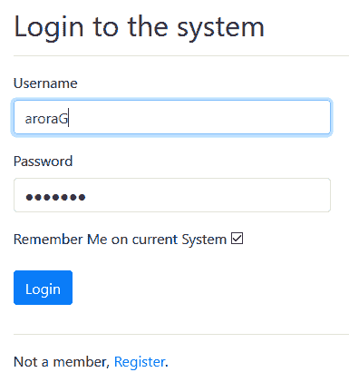

在上一个截图中，我们尝试使用默认用户凭据（用户名：`aroraG`和密码：`test123`）登录。与此登录相关的信息将被持久化在 cookie 中，但仅当用户勾选了“记住我”复选框时。系统会在当前计算机上记住用户登录会话，直到用户点击“注销”按钮。

用户一点击登录按钮，系统就会验证他们的登录详细信息，并将他们重定向到主页，如下截图所示：

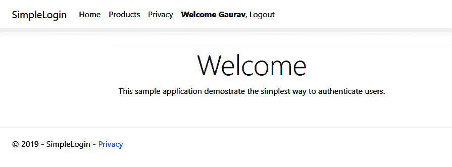

您可能会在菜单中看到文本，例如`欢迎 Gaurav`。这个欢迎文本不是自动显示的，而是我们通过添加几行代码来指示系统显示这个文本，如下面的代码所示：

```cs
<li class="nav-item">
    @{
        if (AuthManager.IsAuthenticated)
        {
            <a class="nav-link text-dark" asp-area="" asp-controller="Account" asp-action="Logout"><strong>Welcome @AuthManager.Name</strong>, Logout</a>

        }
        else
        {
            <a class="nav-link text-dark" asp-area="" asp-controller="Account" asp-action="Login">Login</a>
        }
    }
</li>
```

上一个代码片段来自`_Layout.cshtml`视图/页面。在上一个代码片段中，我们正在检查`IsAuthenticated`是否返回 true。如果是，那么欢迎消息将被显示。这个欢迎消息伴随着“注销”选项，但当`IsAuthenticated`返回`false`值时，它显示`Login`菜单：

```cs
public bool IsAuthenticated
{
    get { return User.Identities.Any(u => u.IsAuthenticated); }
}
```

`IsAuthenticated`是`AuthManager`类的`ReadOnly`属性，用于检查请求是否已经认证。在我们继续之前，让我们重新审视一下我们的`Login`方法：

```cs
public IActionResult Login(LoginViewModel model)
{
    if (ModelState.IsValid)
    {
        var result = _authManager.Login(model);

        if (result)
        {
           return !string.IsNullOrEmpty(model.ReturnUrl) && Url.IsLocalUrl(model.ReturnUrl)
                ? (IActionResult)Redirect(model.ReturnUrl)
                : RedirectToAction("Index", "Home");
        }
    }
    ModelState.AddModelError("", "Invalid login attempt");
    return View(model);
}
```

前面的`Login`方法只是简单地验证用户。看看这个声明——`var result = _authManager.Login(model);`。这调用了`AuthManager`中的`Login`方法：

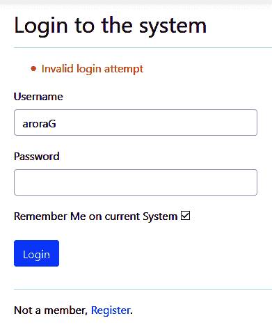

如果`Login`方法返回`true`，那么它将当前的登录页面重定向到主页。否则，它将保持在相同的登录页面上，抱怨登录尝试无效。以下是`Login`方法的代码：

```cs
public bool Login(LoginViewModel model)
{
    var user = _userManager.FindBy(model);
    if (user == null) return false;
    SignInCookie(model, user);
    return true;
}
```

`Login`方法是`AuthManager`类的典型方法，它调用`UserManager`的`FindBy(model)`方法并检查是否存在。如果存在，那么它进一步调用`AuthManager`类的`SignInCookie(model,user)`方法，否则，它简单地返回`false`，意味着登录不成功：

```cs
private void SignInCookie(LoginViewModel model, User user)
{
    var claims = new List<Claim>
    {
        new Claim(ClaimTypes.Name, user.FirstName),
        new Claim(ClaimTypes.Email, user.EmailId),
        new Claim(ClaimTypes.NameIdentifier, user.Id.ToString())
    };

    var identity = new ClaimsIdentity(claims, CookieAuthenticationDefaults.AuthenticationScheme);
    var principal = new ClaimsPrincipal(identity);
    var props = new AuthenticationProperties { IsPersistent = model.RememberMe };
    _httpContext.SignInAsync(CookieAuthenticationDefaults.AuthenticationScheme, principal, props).Wait();
}
```

以下代码片段确保如果用户经过身份验证，那么他们的详细信息应该被持久化在`HttpContext`中，这样系统就可以对来自用户的每个传入请求进行身份验证。你可能会注意到`_httpContext.SignInAsync(CookieAuthenticationDefaults.AuthenticationScheme, principal, props).Wait();`语句实际上签署并启用了 cookie 身份验证：

```cs
//Cookie authentication
services.AddAuthentication(CookieAuthenticationDefaults.AuthenticationScheme).AddCookie();
//For claims
services.AddSingleton<IHttpContextAccessor, HttpContextAccessor>();
services.AddTransient<IAuthManager, AuthManager>();
```

前面的声明帮助我们为我们的应用程序启用 cookie 身份验证和声明的传入请求。最后，`app.UseAuthentication();`语句将身份验证机制能力添加到我们的应用程序中。这些语句应该添加到`Startup.cs`类中。

# 这有什么区别吗？

我们已经在我们的 Web 应用程序中添加了大量代码，但这真的有助于我们限制我们的页面/视图免受未经许可的请求吗？**产品**页面/视图仍然是开放的；因此，我可以从产品页面/视图执行任何可用的操作：


作为用户，我无论是否登录都可以看到产品选项：


前面的截图显示了登录后与登录前相同的产品菜单选项。

我们可以像这样限制对产品页面的访问：

```cs
<li class="nav-item">
    @{
        if (AuthManager.IsAuthenticated)
        {
            <a class="nav-link text-dark" asp-area="" asp-controller="Product" asp-action="Index">Products</a>
        }
    }
</li>
```

以下是应用程序的主屏幕：

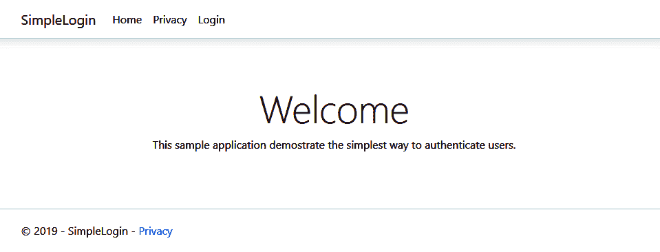

前面的代码帮助系统只在用户登录/经过身份验证后显示产品菜单选项。产品菜单选项将不会显示在屏幕上。像这样，我们可以限制未经许可的访问。然而，这种方法也有其缺点。最大的缺点是，如果有人知道产品页面的 URL——它将引导您到`/Product/Index`——那么他们可以执行受限制的操作。这些操作是受限制的，因为它们不是供未登录用户使用的。

# 授权的实际应用

在前一节中，我们讨论了如何避免对特定或受限制的屏幕/页面的未经许可访问。我们已经看到登录实际上对用户进行身份验证，并允许他们向系统发出请求。另一方面，身份验证并不意味着如果用户经过身份验证，那么他们就被授权访问特定的部分、页面或屏幕。

以下描述了典型的授权和身份验证过程：


在这个过程中，第一个请求/用户得到了身份验证（通常是登录表单），然后授权请求执行特定/请求的操作。可能有许多情况，其中请求经过身份验证，但未经授权访问特定资源或执行特定操作。

在我们的应用程序（在上一节中创建）中，我们有一个带有 CRUD 操作的`Products`页面。`Products`页面不是公共页面，这意味着这个页面不是所有人都可以访问的；它是受限访问的。

我们回到了前一节中留下的主要问题：“如果用户经过身份验证，但未被授权访问特定页面/资源怎么办？无论我们是否将页面从未经授权的用户隐藏起来，因为他们可以通过输入其 URL 轻松访问或查看它。”为了克服这一挑战/问题，我们可以实施以下步骤：

1.  检查对受限资源的每次访问的授权，这意味着每当用户尝试访问资源（通过在浏览器中输入直接 URL），系统都会检查授权，以便授权来访的请求。如果用户的来访请求未经授权，则他们将无法执行指定的操作。

1.  在受限资源的每次操作上检查授权意味着如果用户经过身份验证，他们将能够访问受限页面/视图，但只有在用户经过授权时才能访问此页面/视图的操作。

`Microsoft.AspNetCore.Authorization`命名空间提供了授权特定资源的内置功能。

为了限制访问并避免对特定资源的未经监控的访问，我们可以使用`Authorize`属性：


前面的截图显示我们将`Authorize`属性放入了我们的`ProductController`中。现在，按下*F5*并运行应用程序。

如果用户未登录到系统，则他们将无法看到产品页面，因为我们已经添加了条件。如果用户经过验证，则在菜单栏中显示产品。

不要登录到系统并直接在浏览器中输入产品 URL，`http://localhost:56229/Product`。这将重定向用户到登录屏幕。请查看以下截图并检查 URL；您可能会注意到 URL 包含一个`ReturnUrl`部分，该部分将指示系统在成功登录尝试后重定向到何处。

请参阅以下截图；请注意 URL 包含`ReturnUrl`部分。一旦用户登录，系统将重定向应用程序到此 URL：

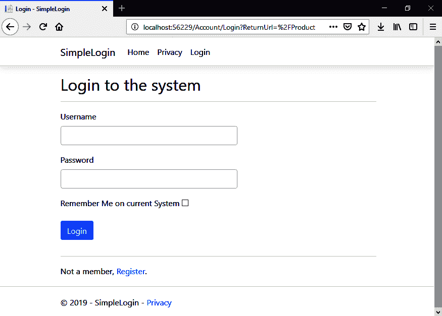

以下截图显示了产品列表：


我们的产品列表屏幕提供了诸如创建新产品、编辑、删除和详细信息等操作。当前应用程序允许用户执行这些操作。因此，是否有意义让任何访问和经过身份验证的用户都可以创建、更新和删除产品？如果我们允许每个用户这样做，后果可能如下：

+   我们可以有许多已经添加到系统中的产品。

+   产品的不可避免的移除/删除。

+   产品的不可避免的更新。

我们是否可以有一些用户类型，可以将`Admin`类型的所有用户与普通用户区分开来，只允许具有管理员权限的用户而不是普通用户执行这些操作？更好的想法是为用户添加角色；因此，我们需要使特定类型的用户成为用户。

让我们在项目中添加一个新的实体并命名为`Role`：

```cs
public class Role
{
    public Guid Id { get; set; }
    public string Name { get; set; }
    public string ShortName { get; set; }
}
```

定义用户的`Role`类的前面的代码片段具有以下列表中解释的属性：

+   `Id`：这使用`GUID`作为主键。

+   `Name`：`string`类型的`Role`名称。

+   `ShortName`：`string`类型的角色的简短或缩写名称。

我们需要将我们的新类/实体添加到我们的`Context`类中。让我们按照以下方式添加：

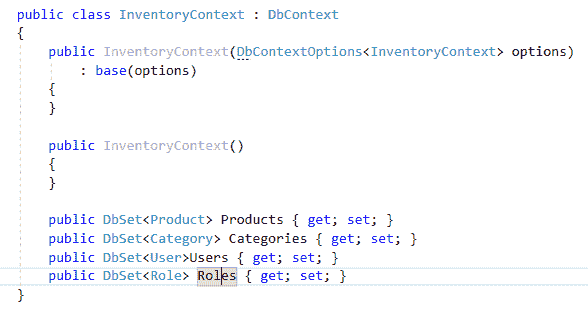

前面的代码提供了使用 EF 进行各种 DB 操作的能力：

```cs
public IEnumerable<Role> GetRoles() => _context.Roles.ToList();

public IEnumerable<Role> GetRolesBy(string userId) => _context.Roles.Where(x => x.UserId.ToString().Equals(userId));

public string RoleNamesBy(string userId)
{
    var listofRoleNames = GetRolesBy(userId).Select(x=>x.ShortName).ToList();
    return string.Join(",", listofRoleNames);
}
```

在前面的代码片段中出现的`UserManager`类的三种方法为我们提供了从数据库中获取`Roles`的能力：

```cs
private void SignInCookie(LoginViewModel model, User user)
{
    var claims = new List<Claim>
    {
        new Claim(ClaimTypes.Name, user.FirstName),
        new Claim(ClaimTypes.Email, user.EmailId),
        new Claim(ClaimTypes.NameIdentifier, user.Id.ToString())
    };

    if (user.Roles != null)
    {
        string[] roles = user.Roles.Split(",");

        claims.AddRange(roles.Select(role => new Claim(ClaimTypes.Role, role)));
    }

    var identity = new ClaimsIdentity(claims, CookieAuthenticationDefaults.AuthenticationScheme);

    var principal = new ClaimsPrincipal(identity);
    var props = new AuthenticationProperties { IsPersistent = model.RememberMe };
    _httpContext.SignInAsync(CookieAuthenticationDefaults.AuthenticationScheme, principal, props).Wait();
}
```

我们通过修改`AuthManager`类的`SigningCookie`方法，将`Roles`添加到我们的`Claims`中：

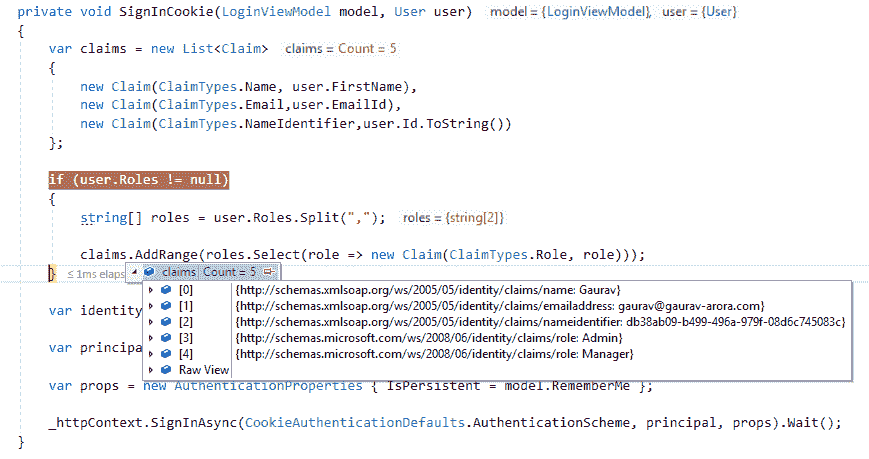

上一张截图显示了一个名为`Gaurav`的用户有两个角色：`Admin`和`Manager`：


我们限制`ProductController`仅供具有`Admin`和`Manager`角色的用户使用。现在，尝试使用用户`aroraG`登录，您将看到`Product Listing`，如下截图所示：

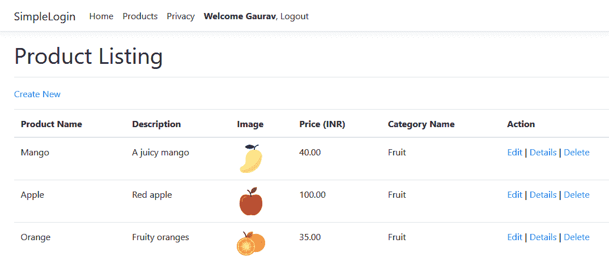

现在，让我们尝试用第二个用户`aroraG1`登录，该用户具有`Editor`角色。这将引发`AccessDenied`错误。请参见以下截图：

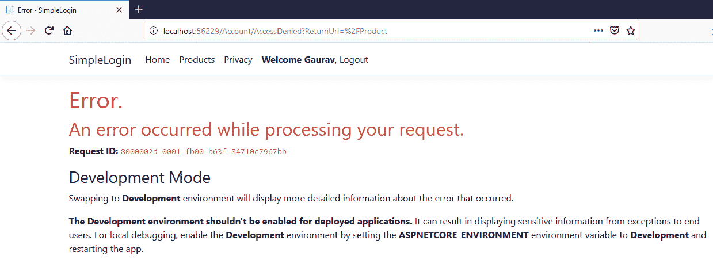

通过这种方式，我们可以保护我们的受限资源。有很多方法可以实现这一点。.NET Core MVC 提供了内置功能来实现这一点，您也可以以可定制的方式实现。如果您不想使用这些可用的内置功能，您可以通过添加到现有代码中来轻松起草所需功能的自己的功能。如果您想这样做，您需要从头开始。此外，如果某样东西已经存在，那么再次创建类似的东西就没有意义。如果您找不到可用组件的功能，那么您应该定制现有的功能/特性，而不是从头开始编写整个代码。

**开发人员应该实现一个不可篡改的身份验证机制。**在本节中，我们已经讨论了很多关于身份验证和授权，以及编写代码和创建我们的 Web 应用程序。关于身份验证，我们应该使用一个良好的身份验证机制，这样就不会有人篡改或绕过它。您可以从以下两种设计开始：

+   身份验证过滤器

+   验证个别请求/端点

在实施了前面的步骤之后，每个通过任何模式发出的请求在系统响应给用户或发出调用的客户端之前都应经过身份验证和授权。这个过程主要包括以下内容：

+   **保密性**：安全系统确保任何敏感数据不会暴露给未经身份验证和未经授权的访问请求。

+   **可用性**：系统中的安全措施确保系统对通过系统的身份验证和授权机制确认为真实用户的用户可用。

+   **完整性**：在一个安全的系统中，数据篡改是不可能的，因此数据是安全的。

# 创建一个 Web 测试项目

单元测试是检查代码健康的一种方法。这意味着如果代码有错误（不健康），那么这将成为应用程序中许多未知和不需要的问题的基础。为了克服这种方法，我们可以遵循 TDD 方法。

您可以通过 Katas 练习 TDD。您可以参考[`www.codeproject.com/Articles/886492/Learning-Test-Driven-Development-with-TDD-Katas`](https://www.codeproject.com/Articles/886492/Learning-Test-Driven-Development-with-TDD-Katas)了解更多关于 TDD katas 的信息。如果您想要练习这种方法，请使用这个存储库：[`github.com/garora/TDD-Katas`](https://github.com/garora/TDD-Katas)。

我们已经在前几章讨论了很多关于 TDD，所以我们不打算在这里详细讨论。相反，让我们按照以下步骤创建一个测试项目：

1.  打开我们的 Web 应用程序。

1.  在 Visual Studio 的解决方案资源管理器中，右键单击解决方案，然后单击添加 | 新建项目...，如下截图所示：

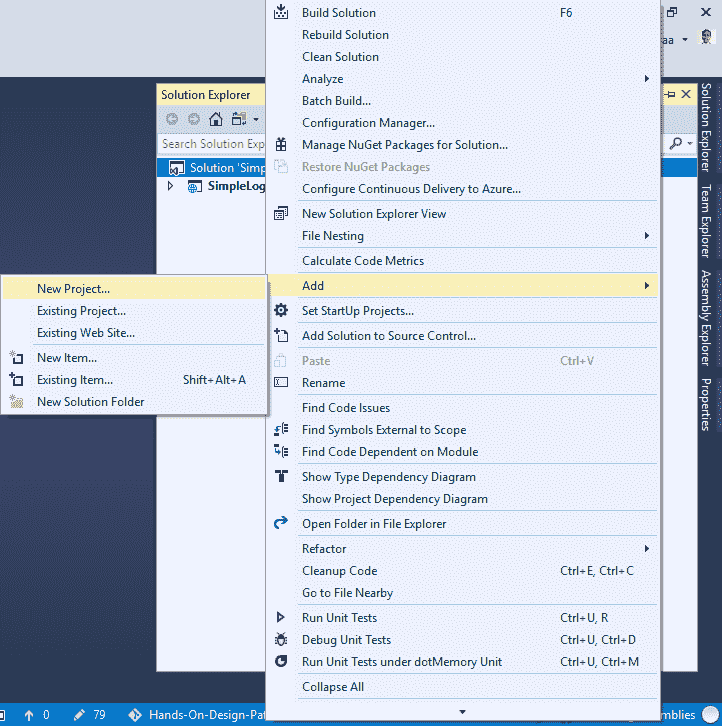

1.  从添加新项目模板中，选择.NET Core 和 xUnit 测试项目（.NET Core），并提供一个有意义的名称：

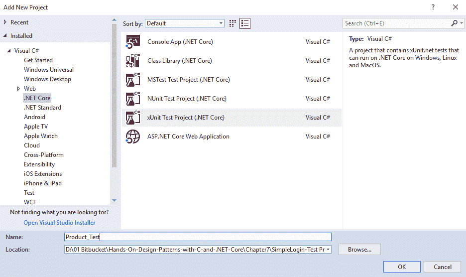

您将得到一个默认的单元`test`类，其中包含空的测试代码，如下代码片段所示：

```cs
namespace Product_Test
{
    public class UnitTest1
    {
        [Fact]
        public void Test1()
        {
        }
    }
}
```

您可以更改此类的名称，或者如果您想编写自己的`test`类，可以放弃此类：

```cs
public class ProductData
{
    public IEnumerable<ProductViewModel> GetProducts()
    {
        var productVm = new List<ProductViewModel>
        {
            new ProductViewModel
            {
                CategoryId = Guid.NewGuid(),
                CategoryDescription = "Category Description",
                CategoryName = "Category Name",
                ProductDescription = "Product Description",
                ProductId = Guid.NewGuid(),
                ProductImage = "Image full path",
                ProductName = "Product Name",
                ProductPrice = 112M
            },
           ... 
        };

        return productVm;
    }
```

1.  先前的代码来自我们新添加的`ProductDate`类。请将其添加到名为`Fake`的新文件夹中。这个类只是创建虚拟数据，以便我们可以测试产品的 Web 应用程序：

```cs
public class ProductTests
{
    [Fact]
    public void Get_Returns_ActionResults()
    {
        // Arrange
        var mockRepo = new Mock<IProductRepository>();
        mockRepo.Setup(repo => repo.GetAll()).Returns(new ProductData().GetProductList());
        var controller = new ProductController(mockRepo.Object);

        // Act
        var result = controller.GetList();

        // Assert
        var viewResult = Assert.IsType<OkObjectResult>(result);
        var model = Assert.IsAssignableFrom<IEnumerable<ProductViewModel>>(viewResult.Value);
        Assert.NotNull(model);
        Assert.Equal(2, model.Count());
    }
}
```

1.  在`Services`文件夹中添加一个名为`ProductTests`的新文件。请注意，我们在这段代码中使用了`Stubs`和`Mocks`。

我们的先前代码将通过红色波浪线抱怨错误，如下截图所示：

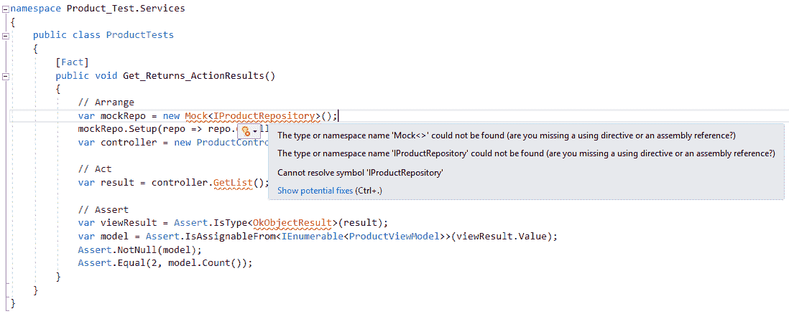

1.  先前的代码存在错误，因为我们没有添加一些必需的包来执行测试。为了克服这些错误，我们应该在我们的`test`项目中安装`moq`支持。在您的包管理器控制台中输入以下命令：

```cs
install-package moq 
```

1.  上述命令将在测试项目中安装`moq`框架。请注意，在执行上述命令时，您应该选择我们创建的测试项目：


一旦安装了`moq`，您就可以开始测试了。

在使用`xUnit`测试项目时需要注意的重要点如下：

+   **Fact**是一个属性，用于没有参数的普通测试方法。

+   **Theory**是一个属性，用于带参数的测试方法。

1.  一切准备就绪。现在，点击“测试资源管理器”并运行您的测试：


最后，我们的测试通过了！这意味着我们的控制器方法很好，我们的代码中没有任何问题或错误，可以破坏应用程序/系统的功能。

# 总结

本章的主要目标是使我们的 Web 应用程序能够防范未经授权的请求。本章介绍了使用 Visual Studio 逐步创建 Web 应用程序，并讨论了身份验证和授权。我们还讨论了 TDD，并创建了一个新的 xUnit Web 测试项目，其中我们使用了`Stubs`和`Mocks`。

在下一章中，我们将讨论在.NET Core 中使用并发编程时的最佳实践和模式。

# 问题

以下问题将帮助您巩固本章中包含的信息：

1.  什么是身份验证和授权？

1.  在第一级请求中使用身份验证然后允许受限区域的传入请求是否安全？

1.  您如何证明授权始终在身份验证之后进行？

1.  什么是 TDD，为什么开发人员关心它？

1.  定义 TDD katas。它们如何帮助我们改进 TDD 方法？

# 进一步阅读

恭喜，您已经完成了本章！要了解本章涵盖的主题，请参考以下书籍：

+   *使用.NET Core 构建 RESTful Web 服务*，作者*Gaurav Aroraa, Tadit Dash*，由*Packt Publishing*出版：[`www.packtpub.com/application-development/building-restful-web-services-net-core`](https://www.packtpub.com/application-development/building-restful-web-services-net-core)

+   *C#和.NET Core 测试驱动开发*，作者*Ayobami Adewole*，由*Packt Publishing*出版：[`www.packtpub.com/in/application-development/c-and-net-core-test-driven-development`](https://www.packtpub.com/in/application-development/c-and-net-core-test-driven-development)
