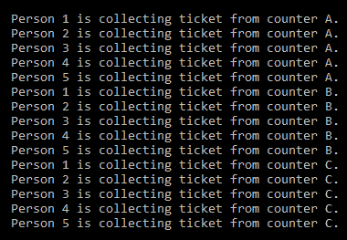
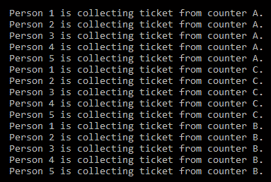

# 第八章：.NET Core 中的并发编程

在上一章（第七章，*为 Web 应用程序实现设计模式 - 第二部分*）中，我们使用各种模式创建了一个示例 Web 应用程序。我们调整了授权和认证机制以保护 Web 应用程序，并讨论了**测试驱动开发**（**TDD**）以确保我们的代码已经经过测试并且可以正常工作。

本章将讨论在.NET Core 中执行并发编程时采用的最佳实践。在本章的后续部分中，我们将学习与 C#和.NET Core 应用程序中良好组织的并发相关的设计模式。

本章将涵盖以下主题：

+   Async/Await - 为什么阻塞是不好的？

+   多线程和异步编程

+   并发集合

+   模式和实践 - TDD 和并行 LINQ

# 技术要求

本章包含各种代码示例来解释概念。代码保持简单，仅用于演示目的。大多数示例涉及使用 C#编写的.NET Core 控制台应用程序。

完整的源代码可在以下链接找到：[`github.com/PacktPublishing/Hands-On-Design-Patterns-with-C-and-.NET-Core/tree/master/Chapter8`](https://github.com/PacktPublishing/Hands-On-Design-Patterns-with-C-and-.NET-Core/tree/master/Chapter8)。

要运行和执行代码，您需要以下内容：

+   Visual Studio 2019（您也可以使用 Visual Studio 2017）

+   .NET Core 的设置

+   SQL Server（本章中使用 Express Edition）

# 安装 Visual Studio

要运行代码示例，您需要安装 Visual Studio（首选 IDE）。要做到这一点，您可以按照以下说明进行操作：

1.  从安装说明中提到的下载链接下载 Visual Studio：[`docs.microsoft.com/en-us/visualstudio/install/install-visual-studio`](https://docs.microsoft.com/en-us/visualstudio/install/install-visual-studio)。

1.  按照提到的安装说明进行操作。

1.  Visual Studio 安装有多个选项可供选择。在这里，我们使用 Windows 的 Visual Studio。

# 设置.NET Core

如果您没有安装.NET Core，您需要按照以下说明进行操作：

1.  在[`www.microsoft.com/net/download/windows`](https://www.microsoft.com/net/download/windows)下载 Windows 的.NET Core。

1.  有关多个版本和相关库，请访问[`dotnet.microsoft.com/download/dotnet-core/2.2`](https://dotnet.microsoft.com/download/dotnet-core/2.2)。

# 安装 SQL Server

如果您没有安装 SQL Server，可以按照以下说明进行操作：

1.  从以下链接下载 SQL Server：[`www.microsoft.com/en-in/download/details.aspx?id=1695`](https://www.microsoft.com/en-in/download/details.aspx?id=1695)。

1.  您可以在这里找到安装说明：[`docs.microsoft.com/en-us/sql/ssms/download-sql-server-management-studio-ssms?view=sql-server-2017`](https://docs.microsoft.com/en-us/sql/ssms/download-sql-server-management-studio-ssms?view=sql-server-2017)。

有关故障排除和更多信息，请参考以下链接：[`www.blackbaud.com/files/support/infinityinstaller/content/installermaster/tkinstallsqlserver2008r2.htm`](https://www.blackbaud.com/files/support/infinityinstaller/content/installermaster/tkinstallsqlserver2008r2.htm)。

# 现实世界中的并发

**并发**是我们生活的一部分：它存在于现实世界中。当我们讨论并发时，我们指的是多任务处理。

在现实世界中，我们经常进行多任务处理。例如，我们可以在使用手机通话时编写程序，我们可以在吃饭时看电影，我们可以在阅读乐谱时唱歌。有很多例子说明我们作为人类可以进行多任务处理。不用深入科学细节，我们可以看到我们的大脑试图掌握新事物的同时，也指挥身体的其他器官工作，比如心脏或我们的嗅觉，这是一种多任务处理。

同样的方法也适用于我们的系统（计算机）。如果我们考虑今天的计算机，每台可用的计算机都有多核 CPU（多个核心）。这是为了允许同时执行多个指令，让我们能够同时执行多个任务。

在单个 CPU 机器上真正的并行是不可能的，因为任务是不可切换的，因为 CPU 只有一个核心。这只有在具有多个 CPU（多个核心）的机器上才可能。简而言之，并发编程涉及两件事：

+   **任务管理**：将工作单元分配给可用线程。

+   **通信**：设置任务的初始参数并获取结果。

每当有多个事情/任务同时发生时，我们称之为*并发*。在我们的编程语言中，每当程序的任何部分同时运行时，这被称为并发编程。您也可以将**并行编程**用作并发编程的同义词。

举个例子，想象一下一个需要门票才能进入特定会议厅的大型会议。在会议厅的门口，您必须购买门票，用现金或信用卡付款。当您付款时，柜台助理可能会将您的详细信息输入系统，打印发票，并为您提供门票。现在假设还有更多人想要购买门票。每个人都必须执行必要的活动才能从售票处领取门票。在这种情况下，每次只能有一个人从一个柜台接受服务，其他人则等待他们的轮到。假设一个人从柜台领取门票需要两分钟；因此，下一个人需要等待两分钟才能轮到他们。如果排队的人数是 50 人，那么最后一个人的等待时间可以改变。如果有两个以上的售票柜台，每个柜台都在两分钟内执行任务，这意味着每两分钟，三个人将能够领取三张门票——或者三个柜台每两分钟卖出两张门票。换句话说，每个售票柜台都在同一时间执行相同的任务（即售票）。这意味着所有柜台都是并行服务的；因此，它们是并发的。这在下图中有所体现：


在上图中，清楚地显示了排队的每个人都处于等待位置或者在柜台上活动，而且有三个队列，任务是按顺序进行的。所有三个柜台（`CounterA`、`CounterB`和`CounterC`）在同一时间执行任务——它们在并行进行活动。

**并发**是指两个或更多任务在重叠的时间段内开始、运行和完成。

**并行性**是指两个或更多任务同时运行。

这些是并发活动，但想象一下一个巨大的人群在排队（例如，10,000 人）；在这里进行并行处理是没有用的，因为这不会解决这个操作中可能出现的瓶颈问题。另一方面，您可以将柜台数量增加到 50 个。它们会解决这个问题吗？在我们使用任何软件时，这种问题会发生。这是一个与阻塞相关的问题。在接下来的章节中，我们将更详细地讨论并发编程。

# 多线程和异步编程

简而言之，我们可以说多线程意味着程序在多个线程上并行运行。在异步编程中，一个工作单元与主应用程序线程分开运行，并告诉调用线程任务已完成、失败或正在进行中。在异步编程周围需要考虑的有趣问题是何时使用它以及它的好处是什么。

更多线程访问相同的共享数据并以不可预测的结果更新它的潜力可以称为**竞争条件**。我们已经在第四章中讨论了竞争条件，*实现设计模式 - 基础部分 2*。

考虑我们在上一节讨论的场景，即排队的人们正在领取他们的票。让我们尝试在一个多线程程序中捕捉这种情况：

```cs
internal class TicketCounter
{
    public static void CounterA() => Console.WriteLine("Person A is collecting ticket from Counter A");
    public static void CounterB() => Console.WriteLine("Person B is collecting ticket from Counter B");
    public static void CounterC() => Console.WriteLine("Person C is collecting ticket from Counter C");
}
```

在这里，我们有一个代表我们整个领取柜台设置的`TicketCounter`类（我们在上一节中讨论过这些）。三个方法：`CounterA()`，`CounterB()`和`CounterC()`代表一个单独的领取柜台。这些方法只是向控制台输出一条消息，如下面的代码所示：

```cs
internal class Program
{
    private static void Main(string[] args)
    {
        var counterA = new Thread(TicketCounter.CounterA);
        var counterB = new Thread(TicketCounter.CounterB);
        var counterC = new Thread(TicketCounter.CounterC);
        Console.WriteLine("3-counters are serving...");
        counterA.Start();
        counterB.Start();
        counterC.Start();
        Console.WriteLine("Next person from row");
        Console.ReadLine();
    }
}
```

上面的代码是我们的`Program`类，它从`Main`方法中启动活动。在这里，我们为所有柜台声明并启动了三个线程。请注意，我们按顺序启动了这些线程。由于我们期望这些线程将按照相同的顺序执行，让我们运行程序并查看输出，如下面的屏幕截图所示：


根据代码，上面的程序没有按照给定的顺序执行。根据我们的代码，执行顺序应该如下：

```cs
3-counters are serving...
Next person from row
Person A is collecting ticket from Counter A
Person B is collecting ticket from Counter B
Person C is collecting ticket from Counter C
```

这是由于线程，这些线程在没有保证按照它们被声明/启动的顺序/序列执行的情况下同时工作。

再次运行程序，看看我们是否得到相同的输出：


上面的快照显示了与先前结果不同的输出，所以现在我们按顺序得到了输出：

```cs
3-counters are serving...
Person A is collecting ticket from Counter A
Person B is collecting ticket from Counter B
Next person from row
Person C is collecting ticket from Counter C
```

因此，线程正在工作，但不是按照我们定义的顺序。

您可以像这样设置线程的优先级：`counterC.Priority = ThreadPriority.Highest;`，`counterB.Priority = ThreadPriority.Normal;`，和`counterA.Priority = ThreadPriority.Lowest;`。

为了以同步的方式运行线程，让我们修改我们的代码如下：

```cs
internal class SynchronizedTicketCounter
{
    public void ShowMessage()
    {
        int personsInQueue = 5; //assume maximum persons in queue
 lock (this)
        {
            Thread thread = Thread.CurrentThread;
            for (int personCount = 0; personCount < personsInQueue; personCount++)
            {
                Console.WriteLine($"\tPerson {personCount + 1} is collecting ticket from counter {thread.Name}.");
            }
        }
    }
}
```

我们创建了一个新的`SynchronizedTicketCounter`类，其中包含`ShowMessage()`方法；请注意前面代码中的`lock(this){...}`。运行程序并检查输出：



我们得到了我们期望的输出，现在我们的柜台按照正确的顺序服务。

# 异步/等待 - 为什么阻塞是不好的？

异步编程在我们期望在同一时间点进行各种活动的情况下非常有帮助。通过`async`关键字，我们将方法/操作定义为异步的。考虑以下代码片段：

```cs
internal class AsyncAwait
{
    public async Task ShowMessage()
    {
        Console.WriteLine("\tServing messages!");
        await Task.Delay(1000);
    }
}
```

在这里，我们有一个带有`async`方法`ShowMessage()`的`AsyncAwait`类。这个方法只是打印一个消息，会显示在控制台窗口中。现在，每当我们在另一个代码中调用/使用这个方法时，该部分代码可能会等待/阻塞操作，直到`ShowMessage()`方法执行并完成其任务。参考以下快照：


我们之前的屏幕截图显示，我们为我们的`ShowMessage()`方法设置了 1,000 毫秒的延迟。在这里，我们指示程序在 1,000 毫秒后完成。如果我们尝试从先前的代码中删除`await`，Visual Studio 将立即发出警告，要求将`await`放回去；参考以下快照：


通过`await`运算符的帮助，我们正在使用非阻塞 API 调用。运行程序并查看以下输出：


我们将得到如前面快照中所示的输出。

# 并发集合

.NET Core 框架提供了各种集合，我们可以使用 LINQ 查询。作为开发人员，在寻找线程安全集合时，选择余地要少得多。没有线程安全的集合，开发人员在执行多个操作时可能会变得困难。在这种情况下，我们将遇到我们已经在第四章中讨论过的竞争条件。为了克服这种情况，我们需要使用`lock`语句，就像我们在前一节中使用的那样。例如，我们可以编写一个简化的`lock`语句的实现代码-参考以下代码片段，我们在其中使用了`lock`语句和集合类`Dictionary`：

```cs
public bool UpdateQuantity(string name, int quantity)
{
    lock (_lock)
    {
        _books[name].Quantity += quantity;
    }

    return true;
}
```

前面的代码来自`InventoryContext`；在这段代码中，我们正在阻止其他线程锁定我们正在尝试更新数量的操作。

`Dictionary`集合类的主要缺点是它不是线程安全的。当我们在多个线程中使用`Dictionary`时，我们必须在`lock`语句中使用它。为了使我们的代码线程安全，我们可以使用`ConcurrentDictionary`集合类。

`ConcurrentDictionary`是一个线程安全的集合类，它存储键值对。这个类有`lock`语句的实现，并提供了一个线程安全的类。考虑以下代码：

```cs
private readonly IDictionary<string, Book> _books;
protected InventoryContext()
{
    _books = new ConcurrentDictionary<string, Book>();
}
```

前面的代码片段来自我们的 FlixOne 控制台应用程序的`InventoryContext`类。在这段代码中，我们有`_books`字段，并且它被初始化为`ConcurrentDictionary`集合类。

由于我们在多线程中使用`InventoryContext`类的`UpdateQuantity()`方法，有一种可能性是一个线程增加数量，而另一个线程将数量重置为其初始水平。这是因为我们的对象来自单个集合，对集合的任何更改在一个线程中对其他线程不可见。所有线程都引用原始未修改的集合，简单来说，我们的方法不是线程安全的，除非我们使用`lock`语句或`ConcurretDictionary`集合类。

# 模式和实践- TDD 和并行 LINQ

当我们使用多线程时，我们应该遵循最佳实践来编写**流畅的代码**。流畅的代码是指开发人员不会面临死锁的代码。换句话说，在编写过程中，多线程需要非常小心。

当多个线程在一个类/程序中运行时，当每个线程接近在`lock`语句下编写的对象或资源时，死锁就会发生。实际的死锁发生在每个线程都试图锁定另一个线程已经锁定的对象/资源时。

一个小错误可能导致开发人员不得不处理由于被阻塞的线程而发生的未知错误。除此之外，代码中几个字的错误实现可能会影响 100 行代码。

让我们回到本章开头讨论的会议门票的例子。如果售票处无法履行其职责并分发门票会发生什么？在这种情况下，每个人都会尝试到达售票处并获取门票，这可能会导致售票处被堵塞。这可能会导致售票处被阻塞。相同的逻辑适用于我们的程序。我们将遇到多个线程尝试锁定我们的对象/资源的死锁情况。避免这种情况的最佳做法是使用一种同步访问对象/资源的机制。.NET Core 框架提供了`Monitor`类来实现这一点。我已经重新编写了我们的旧代码以避免死锁情况-请参阅以下代码：

```cs
private static void ProcessTickets()
{
    var ticketCounter = new TicketCounter();
    var counterA = new Thread(ticketCounter.ShowMessage);
    var counterB = new Thread(ticketCounter.ShowMessage);
    var counterC = new Thread(ticketCounter.ShowMessage);
    counterA.Name = "A";
    counterB.Name = "B";
    counterC.Name = "C";
    counterA.Start();
    counterB.Start();
    counterC.Start();
}
```

在这里，我们有`ProcessTicket`方法；它启动了三个线程（每个线程代表一个售票处）。每个线程都会到达`TicketCounter`类的`ShowMessage`。如果我们的`ShowMessage`方法没有很好地编写来处理这种情况，就会出现死锁问题。所有三个线程都将尝试为与`ShowMessage`方法相关的各自对象/资源获取锁。

以下代码是`ShowMessage`方法的实现，我编写了这段代码来处理死锁情况：

```cs
private static readonly object Object = new object();
public void ShowMessage()
{
    const int personsInQueue = 5;
    if (Monitor.TryEnter(Object, 300))
    {
        try
        {
            var thread = Thread.CurrentThread;
            for (var personCount = 0; personCount < personsInQueue; personCount++)
                Console.WriteLine(
                    $"\tPerson {personCount + 1} is collecting ticket from counter {thread.Name}.");
        }
        finally
        {
            Monitor.Exit(Object);
        }
    }
}
```

上述是我们`TicketCounter`类的`ShowMessage()`方法。在这个方法中，每当一个线程尝试锁定`Object`时，如果`Object`已经被锁定，它会尝试 300 毫秒。`Monitor`类会自动处理这种情况。使用`Monitor`类时，开发人员不需要担心多个线程正在运行的情况，每个线程都在尝试获取锁。运行程序以查看以下输出：



在上面的快照中，您会注意到在`counterA`之后，`counterC`正在服务，然后是`counter B`。这意味着在`thread A`之后，`thread C`被启动，然后是`thread B`。换句话说，`thread A`首先获取锁，然后在 300 毫秒后，`thread C`尝试获取锁，然后`thread B`尝试锁定对象。如果要设置线程的顺序或优先级，可以添加以下代码行：

```cs
counterC.Priority = ThreadPriority.Highest
counterB.Priority = ThreadPriority.Normal;
counterA.Priority = ThreadPriority.Lowest;
```

当您将上述行添加到`ProcessTickets`方法时，所有线程将按顺序工作：首先是`Thread C`，然后是`Thread B`，最后是`Thread A`。

线程优先级是一个枚举，告诉我们如何调度线程和`System.Threading.ThreadPriority`具有以下值：

+   **Lowest**：这是最低的优先级，意味着具有`Lowest`优先级的线程可以在任何其他优先级的线程之后进行调度。

+   **BelowNormal**：具有`BelowNormal`优先级的线程可以在具有`Normal`优先级的线程之后，但在具有`Lowest`优先级的线程之前进行调度。

+   **Normal**：所有线程都具有默认优先级`Normal`。具有`Normal`优先级的线程可以在具有`AboveNormal`优先级的线程之后，但在具有`BelowNormal`优先级的线程之前进行调度。

+   **AboveNormal**：具有`AboveNormal`优先级的线程可以在具有`Normal`优先级的线程之前，但在具有`Highest`优先级的线程之后进行调度。

+   **Highest**：这是线程的最高优先级级别。具有`Highest`优先级的线程可以在具有任何其他优先级的线程之前进行调度。

在为线程设置优先级级别后，执行程序并查看以下输出：


根据上面的快照，在设置了优先级后，计数器按顺序为`C`，`B`和`A`提供服务。通过小心和简单的实现，我们可以处理死锁情况，并安排我们的线程按特定顺序/优先级提供服务。

.NET Core 框架还提供了**任务并行库**（**TPL**），它是属于`System.Threading`和`System.Threading.Tasks`命名空间的一组公共 API。借助 TPL，开发人员可以通过简化实现使应用程序并发运行。

考虑以下代码，我们可以看到 TPL 的最简单实现：

```cs
public void PallelVersion()
{
    var books = GetBooks();
    Parallel.ForEach(books, Process);
}
```

上面是一个简单的使用`Parallel`关键字的`ForEach`循环。在上面的代码中，我们只是遍历了一个`books`集合，并使用`Process`方法进行处理：

```cs
private void Process(Book book)
{
    Console.WriteLine($"\t{book.Id}\t{book.Name}\t{book.Quantity}");
}
```

前面的代码是我们的`Process`方法（再次强调，这是最简单的方法），它打印了`books`的细节。根据他们的要求，用户可以执行尽可能多的操作：

```cs
private static void ParallelismExample()
{
    var parallelism = new Parallelism();
    parallelism.GenerateBooks(19);
    Console.WriteLine("\n\tId\tName\tQty\n");
    parallelism.PallelVersion();
    Console.WriteLine($"\n\tTotal Processes Running on the machine:{Environment.ProcessorCount}\n");
    Console.WriteLine("\tProcessing complete. Press any key to exit.");
    Console.ReadKey();
}
```

如您所见，我们有`ParallelismExample`方法，它生成书籍列表并通过执行`PallelVersion`方法处理书籍。

在执行程序以查看以下输出之前，首先考虑顺序实现的以下代码片段：

```cs
public void Sequential()
{
    var books = GetBooks();
    foreach (var book in books) { Process(book); }
}
```

上面的代码是一个`Sequential`方法；它使用简单的`foreach`循环来处理书籍集合。执行程序并查看以下输出：


注意上面的快照。首先，在我运行此演示的系统上有四个进程正在运行。第二个迭代的集合是按顺序从 1 到 19。程序不会将任务分成在机器上运行的不同进程。按任意键退出当前进程，执行`ParallelismVersion`方法的程序，并查看以下输出：


上面的截图是并行代码的输出；您可能会注意到代码没有按顺序处理，ID 也没有按顺序出现，我们可以看到`Id` `13`在`9`之后但在`10`之前。如果这些是按顺序运行的，那么`Id`的顺序将是`9`，`10`，然后是`13`。

在.NET Core 诞生之前，LINQ 就已经存在于.NET 世界中。`LINQ-to-Objects`允许我们使用任意对象序列执行内存中的查询操作。`LINQ-to-Objects`是建立在`IEnumerable<T>`之上的一组扩展方法。

**延迟执行**意味着数据枚举后才执行。

PLINQ 可以作为 TPL 的替代方案。它是 LINQ 的并行实现。PLINQ 查询操作在内存中的`IEnumerable`或`IEnumerable<T>`数据源上执行。此外，它具有延迟执行。LINQ 查询按顺序执行操作，而 PLINQ 并行执行操作，并充分利用机器上的所有处理器。考虑以下代码以查看 PLINQ 的实现：

```cs
public void Process()
{
    var bookCount = 50000;
    _parallelism.GenerateBooks(bookCount);
    var books = _parallelism.GetBooks();
    var query = from book in books.AsParallel()
        where book.Quantity > 12250
        select book;
    Console.WriteLine($"\n\t{query.Count()} books out of {bookCount} total books," +
                      "having Qty in stock more than 12250.");
    Console.ReadKey();
}
```

上面的代码是我们的 PLINQ 类的处理方法。在这里，我们使用 PLINQ 查询库存中数量超过`12250`的任何书籍。执行代码以查看此输出：


PLINQ 使用机器的所有处理器，但我们可以通过使用`WithDegreeOfParallelism()`方法来限制 PLINQ 中的处理器。我们可以在`Linq`类的`Process()`方法中使用以下代码：

```cs
var query = from book in books.AsParallel().WithDegreeOfParallelism(3)
    where book.Quantity > 12250
    select book;
return query;
```

上面的代码将只使用机器的三个处理器。执行它们，您会发现您得到与前面代码相同的输出。

# 总结

在本章中，我们讨论了并发编程和现实世界中的并发性。我们看了看如何处理与我们日常生活中的并发相关的各种情景。我们看了看如何从服务柜台收集会议门票，并了解了并行编程和并发编程是什么。我们还涵盖了多线程、`Async`/`Await`、`Concurrent`集合和 PLINQ。

在接下来的章节中，我们将尝试使用 C#语言进行函数式编程。我们将深入探讨这些概念，以展示如何在.NET Core 中使用 C#进行函数式编程。

# 问题

以下问题将帮助您巩固本章中包含的信息：

1.  什么是并发编程？

1.  真正的并行性是如何发生的？

1.  什么是竞争条件？

1.  为什么我们应该使用并发字典？

# 进一步阅读

以下书籍将帮助您更多地了解本章涉及的主题：

+   *Concurrent Patterns and Best Practices*，作者*Atul S Khot*，由*Packt Publishing*出版：[`www.packtpub.com/in/application-development/concurrent-patterns-and-best-practices`](https://www.packtpub.com/in/application-development/concurrent-patterns-and-best-practices)
