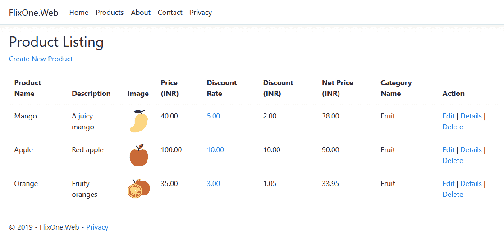
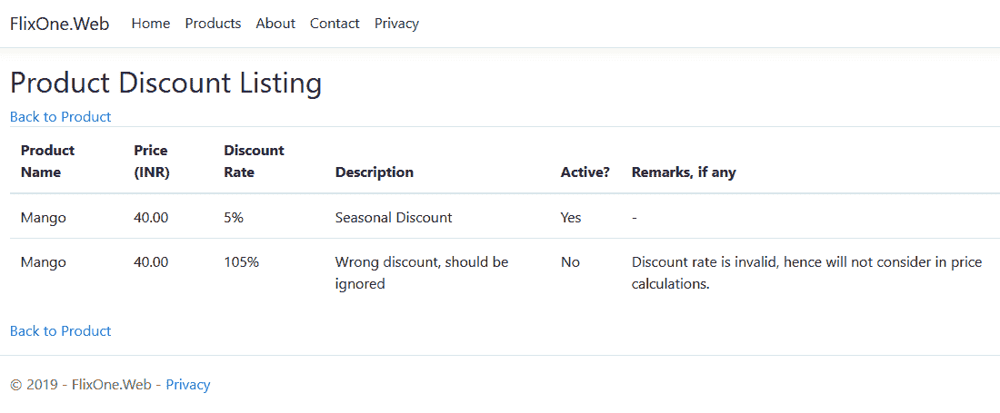
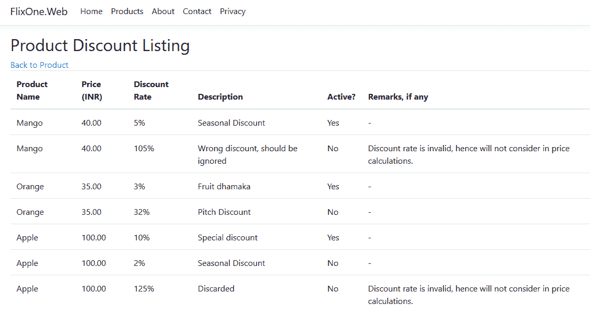

# 第九章：函数式编程实践

上一章（第八章，* .NET Core 中的并发编程*）介绍了.NET Core 中的并发编程，本章的目的是利用`async`/`await`和并行性，使我们的程序更加高效。

在本章中，我们将品尝使用 C#语言的函数式编程。我们还将深入探讨这些概念，向您展示如何利用.NET Core 中的 C#来执行函数式编程。本章的目的是帮助您了解函数式编程是什么，以及我们如何使用 C#语言来实现它。

函数式编程受数学启发，以函数式方式解决问题。在数学中，我们有公式，在函数式编程中，我们使用各种函数的数学形式。函数式编程的最大优点是它有助于无缝实现并发。

本章将涵盖以下主题：

+   理解函数式编程

+   库存应用程序

+   策略模式和函数式编程

# 技术要求

本章包含各种代码示例，以解释函数式编程的概念。代码保持简单，仅用于演示目的。大多数示例涉及使用 C#编写的.NET Core 控制台应用程序。

完整的源代码可在以下链接找到：[`github.com/PacktPublishing/Hands-On-Design-Patterns-with-C-and-.NET-Core/tree/master/Chapter9`](https://github.com/PacktPublishing/Hands-On-Design-Patterns-with-C-and-.NET-Core/tree/master/Chapter9)。

要运行和执行代码，先决条件如下：

+   Visual Studio 2019（也可以使用 Visual Studio 2017 更新 3 或更高版本来运行应用程序）。

+   设置.NET Core

+   SQL Server（本章中使用 Express Edition）

# 安装 Visual Studio

要运行这些代码示例，您需要安装 Visual Studio 2017（或更新版本，如 2019）。要执行此操作，请按照以下说明操作：

1.  从以下下载链接下载 Visual Studio，其中包括安装说明：[`docs.microsoft.com/en-us/visualstudio/install/install-visual-studio`](https://docs.microsoft.com/en-us/visualstudio/install/install-visual-studio)。

1.  按照安装说明操作。

1.  Visual Studio 安装有多个版本可供选择。在这里，我们使用 Windows 的 Visual Studio。

# 设置.NET Core

如果您尚未安装.NET Core，需要按照以下说明操作：

1.  在[`www.microsoft.com/net/download/windows`](https://www.microsoft.com/net/download/windows)下载 Windows 的.NET Core。

1.  访问[`dotnet.microsoft.com/download/dotnet-core/2.2`](https://dotnet.microsoft.com/download/dotnet-core/2.2)获取多个版本和相关库。

# 安装 SQL Server

如果您尚未安装 SQL Server，需要按照以下说明操作：

1.  从以下链接下载 SQL Server：[`www.microsoft.com/en-in/download/details.aspx?id=1695`](https://www.microsoft.com/en-in/download/details.aspx?id=1695)。

1.  在此处找到安装说明：[`docs.microsoft.com/en-us/sql/ssms/download-sql-server-management-studio-ssms?view=sql-server-2017`](https://docs.microsoft.com/en-us/sql/ssms/download-sql-server-management-studio-ssms?view=sql-server-2017)。

有关故障排除和更多信息，请参阅以下链接：[`www.blackbaud.com/files/support/infinityinstaller/content/installermaster/tkinstallsqlserver2008r2.htm`](https://www.blackbaud.com/files/support/infinityinstaller/content/installermaster/tkinstallsqlserver2008r2.htm)。

# 理解函数式编程

简而言之，**函数式编程**是一种符号计算的方法，它与解决数学问题的方式相同。任何函数式编程都是基于数学函数及其编码风格的。任何支持函数式编程的语言都可以解决以下两个问题：

+   它需要解决什么问题？

+   它是如何解决的？

函数式编程并不是一个新的发明。这种语言在行业中已经存在很长时间了。以下是一些支持函数式编程的知名编程语言：

+   Haskell

+   Scala

+   Erlang

+   Clojure

+   Lisp

+   OCaml

2005 年，微软发布了 F#的第一个版本（发音为*EffSharp—*[`fsharp.org/`](https://fsharp.org/)）。这是一种具有许多良好特性的函数式编程语言。在本章中，我们不会讨论太多关于 F#，但我们将讨论函数式编程及其在 C#语言中的实现。

纯函数是通过说它们是纯的来加强函数式编程的函数。这些函数在两个层面上工作：

+   最终结果/输出对于提供的参数始终保持不变。

+   它们不会影响程序的行为或应用程序的执行路径，即使它们被调用了一百次。

考虑一下我们 FlixOne 库存应用程序中的例子：

```cs
public static class PriceCalc
{
    public static decimal Discount(this decimal price, decimal discount) => 
        price * discount / 100;

    public static decimal PriceAfterDiscount(this decimal price, decimal discount) =>
        decimal.Round(price - Discount(price, discount));
}
```

正如你所看到的，我们有一个`PriceCalc`类，其中有两个扩展方法：`Discount`和`PriceAfterDiscount`。这些函数可以被称为纯函数；`PriceCalc`函数和`PriceAfterDiscount`函数都符合`纯`函数的标准；`Discount`方法将根据当前价格和折扣计算折扣。在这种情况下，该方法的输出对于提供的参数值永远不会改变。这样，价格为`190.00`且折扣为`10.00`的产品将以这种方式计算：`190.00 * 10.00 /100`，并返回`19.00`。我们的下一个方法—`PriceAfterDiscount`—使用相同的参数值将计算`190.00 - 19.00`并返回`171.00`的值。

函数式编程中另一个重要的点是函数是纯的，并传达完整的信息（也称为**函数诚实**）。考虑前面代码中的`Discount`方法；这是一个纯函数，也是诚实的。那么，如果有人意外地提供了负折扣或超过实际价格的折扣（超过 100%），这个函数还会保持纯和诚实吗？为了处理这种情况，我们的数学函数应该这样编写，如果有人输入`discount <= 0 or discount > 100`，那么系统将不予考虑。考虑以下代码以此方法编写：

```cs
public static decimal Discount(this decimal price, ValidDiscount validDiscount)
{
    return price * validDiscount.Discount / 100;
}
```

正如你所看到的，我们的`Discount`函数有一个名为`ValidDiscount`的参数类型，用于验证我们讨论的输入。这样，我们的函数现在是一个诚实的函数。

这些函数就像函数式编程一样简单，但是要想使用函数式编程仍然需要大量的实践。在接下来的章节中，我们将讨论函数式编程的高级概念，包括函数式编程原则。

考虑以下代码，我们正在检查折扣值是否有效：

```cs
private readonly Func<decimal, bool> _vallidDiscount = d => d > 0 || d % 100 <= 1;
```

在上面的代码片段中，我们有一个名为`_validDiscount`的字段。让我们看看它的作用：`Func`接受`decimal`作为输入，并返回`bool`作为输出。从它的名称可以看出，`field`只存储有效的折扣。

`Func`是一种委托类型，指向一个或多个参数的方法，并返回一个值。`Func`的一般声明是`Func<TParameter, TOutput>`，其中`TParameter`是任何有效数据类型的输入参数，`TOutput`是任何有效数据类型的返回值。

考虑以下代码片段，我们在一个方法中使用了`_validDiscount`字段：

```cs
public IEnumerable<DiscountViewModel> FilterOutInvalidDiscountRates(
    IEnumerable<DiscountViewModel> discountViewModels)
{
    var viewModels = discountViewModels.ToList();
    var res = viewModels.Select(x => x.Discount).Where(_vallidDiscount);
    return viewModels.Where(x => res.Contains(x.Discount));
}
```

在上述代码中，我们有`FilterOutInvalidDiscountRates`方法。这个方法不言自明，表明我们正在过滤掉无效的折扣率。现在让我们分析一下代码。

`FilterOutInvalidDiscountRates`方法返回一个具有有效折扣的产品的`DiscountViewModel`类的集合。以下代码是我们的`DiscountViewModel`类的代码：

```cs
public class DiscountViewModel
{
    public Guid ProductId { get; set; }
    public string ProductName { get; set; }
    public decimal Price { get; set; }
    public decimal Discount { get; set; }
    public decimal Amount { get; set; }
}
```

我们的`DiscountViewModel`类包含以下内容：

+   `ProductId`：这代表一个产品的 ID。

+   `ProductName`：这代表一个产品的名称。

+   `Price`：这包含产品的实际价格。实际价格是在任何折扣、税收等之前。

+   `Discount`：这包含折扣的百分比，如 10 或 3。有效的折扣率不应为负数，等于零或超过 100%（换句话说，不应超过产品的实际成本）。

+   `Amount`：这包含任何折扣、税收等之后的产品价值。

现在，让我们回到我们的`FilterOutInavlidDiscountRates`方法，看一下`viewModels.Select(x => x.Discount).Where(_vallidDiscount)`。在这里，您可能会注意到我们正在从我们的`viewModels`列表中选择折扣率。这个列表包含根据`_validDiscount`字段有效的折扣率。在下一行，我们的方法返回具有有效折扣率的记录。

在函数式编程中，这些函数也被称为**一等函数**。这些函数的值可以作为任何其他函数的输入或输出使用。它们也可以被分配给变量或存储在集合中。

转到 Visual Studio 并打开`FlixOne`库存应用程序。从这里运行应用程序，您将看到以下屏幕截图：



上一张屏幕截图是产品列表页面，显示了所有可用的产品。这是一个简单的页面；您也可以称之为产品列表仪表板，在这里您将找到所有产品。从创建新产品，您可以添加一个新产品，编辑将为您提供更新现有产品的功能。此外，详细页面将显示特定产品的完整详细信息。通过单击删除，您可以从列表中删除现有产品。

请参考我们的`DiscountViewModel`类。我们有多个产品的折扣率选项，业务规则规定一次只能激活一个折扣率。要查看产品的所有折扣率，请从前一屏幕（产品列表）中单击折扣率。这将显示以下屏幕：



上述屏幕是产品折扣列表，显示了产品名称 Mango 的折扣列表。这有两个折扣率，但只有季节性折扣率是活动的。您可能已经注意到备注栏；这被标记为无效的折扣率，因为根据前一节讨论的`_validDiscount`，这个折扣率不符合有效折扣率的标准。

`Predicate`也是一种委托类型，类似于`Func`委托。这代表一个验证一组标准的方法。换句话说，`Predicate`返回`Predicate <T>`类型，其中`T`是有效的数据类型。如果标准匹配并返回`T`类型的值，则它起作用。

考虑以下代码，我们在其中验证产品名称是否有效为句子大小写：

```cs
private static readonly TextInfo TextInfo = new CultureInfo("en-US", false).TextInfo;
private readonly Predicate<string> _isProductNameTitleCase = s => s.Equals(TextInfo.ToTitleCase(s));
```

在上述代码中，我们使用了`Predicate`关键字，这分析了使用`TitleCase`关键字验证`ProductName`的条件。如果标准匹配，结果将是`true`。如果不匹配，结果将是`false`。考虑以下代码片段，我们在其中使用了`_isProductNameTitleCase`：

```cs
public IEnumerable<ProductViewModel> FilterOutInvalidProductNames(
    IEnumerable<ProductViewModel> productViewModels) => productViewModels.ToList()
    .Where(p => _isProductNameTitleCase(p.ProductName));
```

在前面的代码中，我们有`FilterOutInvalidProductNames`方法。该方法的目的是选择具有有效产品名称（仅`TitleCase`产品名称）的产品。

# 增强我们的库存应用程序

该项目是针对一个假设情况，即一家名为 FlixOne 的公司希望增强一个库存管理应用程序，以管理其不断增长的产品收藏。这不是一个新的应用程序，因为我们已经开始开发这个应用程序，并在第三章中讨论了初始阶段，即*实施设计模式 - 基础部分 1*，在那里我们已经开始开发基于控制台的库存系统。利益相关者将不时审查应用程序，并尝试满足最终用户的需求。增强非常重要，因为这个应用程序将被员工（用于管理库存）和客户（用于浏览和创建新订单）使用。该应用程序需要具有可扩展性，并且是业务的重要系统。

由于这是一本技术书，我们将主要从开发团队的角度讨论各种技术观察，并讨论用于实现库存管理应用的模式和实践。

# 要求

有必要增强应用程序，这不可能在一天内完成。这将需要大量的会议和讨论。在几次会议的过程中，业务和开发团队讨论了对库存管理系统的新增强的要求。定义一组清晰的要求的进展缓慢，最终产品的愿景也不清晰。开发团队决定将庞大的需求列表精简到足够的功能，以便一个关键人物可以开始记录一些库存信息。这将允许简单的库存管理，并为业务提供一个可以扩展的基础。我们将按照需求进行工作，并采取**最小可行产品**（**MVP**）的方法。

MVP 是一个应用程序的最小功能集，仍然可以发布并为用户群体提供足够的价值。

在管理层和业务分析师之间进行了几次会议和讨论后，产生了一系列要求的清单，以增强我们的`FlixOne` web 应用程序。高级要求如下：

+   **分页实现**：目前，所有页面列表都没有分页。通过向下滚动或向上滚动屏幕来查看具有大页数的项目是非常具有挑战性的。

+   **折扣率**：目前，没有提供添加或查看产品的各种折扣率。折扣率的业务规则如下：

+   一个产品可以有多个折扣率。

+   一个产品只能有一个活动的折扣率。

+   有效的折扣率不应为负值，也不应超过 100%。

# 回到 FlixOne

在前一节中，我们讨论了增强应用程序所需的内容。在本节中，我们将实现这些要求。让我们首先重新审视一下我们项目的文件结构。看一下下面的快照：


之前的快照描述了我们的 FlixOne web 应用程序，其文件夹结构如下：

+   **wwwroot**：这是一个带有静态内容的文件夹，例如 CSS 和 jQuery 文件，这些文件是 UI 项目所需的。该文件夹带有 Visual Studio 提供的默认模板。

+   **公共**：这包含所有与业务规则和更多相关的公共文件和操作。

+   **上下文**：这包含`InventoryContext`，这是一个提供`Entity Framework Core`功能的`DBContext`类。

+   **控制器**：这包含我们`FlixOne`应用程序的所有控制器类。

+   **迁移**：这包含了`InventoryModel`的快照和最初创建的实体。

+   **模型**：这包含了我们应用程序所需的数据模型、`ViewModels`。

+   **持久性**：这包含了`InventoryRepository`及其操作。

+   **视图**：这包含了应用程序的所有视图/屏幕。

考虑以下代码：

```cs
public interface IHelper
{
    IEnumerable<DiscountViewModel> FilterOutInvalidDiscountRates(
        IEnumerable<DiscountViewModel> discountViewModels);

    IEnumerable<ProductViewModel> FilterOutInvalidProductNames(
        IEnumerable<ProductViewModel> productViewModels);
}
```

上面的代码包含一个`IHelper`接口，其中包含两个方法。我们将在下面的代码片段中实现这个接口：

```cs
public class Helper : IHelper
{
    private static readonly TextInfo TextInfo = new CultureInfo("en-US", false).TextInfo;
    private readonly Predicate<string> _isProductNameTitleCase = s => s.Equals(TextInfo.ToTitleCase(s));
    private readonly Func<decimal, bool> _vallidDiscount = d => d == 0 || d - 100 <= 1;

    public IEnumerable<DiscountViewModel> FilterOutInvalidDiscountRates(
        IEnumerable<DiscountViewModel> discountViewModels)
    {
        var viewModels = discountViewModels.ToList();
        var res = viewModels.Select(x => x.ProductDiscountRate).Where(_vallidDiscount);
        return viewModels.Where(x => res.Contains(x.ProductDiscountRate));
    }

    public IEnumerable<ProductViewModel> FilterOutInvalidProductNames(
        IEnumerable<ProductViewModel> productViewModels) => productViewModels.ToList()
        .Where(p => _isProductNameTitleCase(p.ProductName));
}
```

`Helper`类实现了`IHelper`接口。在这个类中，我们有两个主要且重要的方法：一个是检查有效折扣，另一个是检查有效的`ProductName`属性。

在我们的应用程序中使用这个功能之前，我们应该将它添加到我们的`Startup.cs`文件中，如下面的代码所示：

```cs
public void ConfigureServices(IServiceCollection services)
{
    services.AddTransient<IInventoryRepositry, InventoryRepositry>();
    services.AddTransient<IHelper, Helper>();
    services.AddDbContext<InventoryContext>(o => o.UseSqlServer(Configuration.GetConnectionString("FlixOneDbConnection")));
    services.Configure<CookiePolicyOptions>(options =>
    {
        // This lambda determines whether user consent for non-essential cookies is needed for a given request.
        options.CheckConsentNeeded = context => true;
        options.MinimumSameSitePolicy = SameSiteMode.None;
    });
}
```

在上面的代码片段中，我们有一个写入语句，`services.AddTransient<IHelper, Helper>();`。通过这样做，我们向我们的应用程序添加了一个瞬态服务。我们已经在第五章中讨论了*控制反转*部分，*实现设计模式-.Net Core*。

考虑以下代码，我们在这里使用`IHelper`类，利用了控制反转：

```cs
public class InventoryRepositry : IInventoryRepositry
{
    private readonly IHelper _helper;
    private readonly InventoryContext _inventoryContext;

    public InventoryRepositry(InventoryContext inventoryContext, IHelper helper)
    {
        _inventoryContext = inventoryContext;
        _helper = helper;
    }

... 
}
```

上面的代码包含了`InventoryRepository`类，我们可以看到适当使用了**依赖注入**（**DI**）：

```cs
    public IEnumerable<Discount> GetDiscountBy(Guid productId, bool activeOnly = false)
        {
            var discounts = activeOnly
                ? GetDiscounts().Where(d => d.ProductId == productId && d.Active)
                : GetDiscounts().Where(d => d.ProductId == productId);
            var product = _inventoryContext.Products.FirstOrDefault(p => p.Id == productId);
            var listDis = new List<Discount>();
            foreach (var discount in discounts)
            {
                if (product != null)
                {
                    discount.ProductName = product.Name;
                    discount.ProductPrice = product.Price;
                }

                listDis.Add(discount);
            }

            return listDis;
        }
```

上面的代码是`InventoryRepository`类的`GetDiscountBy`方法，它返回了`active`或`de-active`记录的折扣模型集合。考虑以下用于`DiscountViewModel`集合的代码片段：

```cs
    public IEnumerable<DiscountViewModel> GetValidDiscoutedProducts(
        IEnumerable<DiscountViewModel> discountViewModels)
    {
        return _helper.FilterOutInvalidDiscountRates(discountViewModels);
    }
}
```

上面的代码使用了一个`DiscountViewModel`集合，过滤掉了根据我们之前讨论的业务规则没有有效折扣的产品。`GetValidDiscountProducts`方法返回`DiscountViewModel`的集合。

如果我们忘记在项目的`startup.cs`文件中定义`IHelper`，我们将会遇到一个异常，如下面的截图所示：


上面的截图清楚地表明`IHelper`服务没有被解析。在我们的情况下，我们不会遇到这个异常，因为我们已经将`IHelper`添加到了`Startup`类中。

到目前为止，我们已经添加了辅助方法来满足我们对折扣率的新要求，并对其进行验证。现在，让我们添加一个控制器和随后的操作方法。为此，从解决方案资源管理器中添加一个新的`DiscountController`控制器。之后，我们的`FlixOne` web 解决方案将看起来类似于以下快照：


在上面的快照中，我们可以看到我们的`Controller`文件夹现在有一个额外的控制器，即`DiscountController`。以下代码来自`DiscountController`：

```cs
public class DiscountController : Controller
{
    private readonly IInventoryRepositry _repositry;

    public DiscountController(IInventoryRepositry inventoryRepositry)
    {
        _repositry = inventoryRepositry;
    }

    public IActionResult Index()
    {
        return View(_repositry.GetDiscounts().ToDiscountViewModel());
    }

    public IActionResult Details(Guid id)
    {
        return View("Index", _repositry.GetDiscountBy(id).ToDiscountViewModel());
    }
}
```

执行应用程序，并从主屏幕上点击产品，然后点击产品折扣清单。从这里，你将得到以下屏幕：



上面的快照描述了所有可用产品的产品折扣清单。产品折扣清单有很多记录，因此需要向上或向下滚动以查看屏幕上的项目。为了处理这种困难的情况，我们应该实现分页。

# 策略模式和函数式编程

在本书的前四章中，我们讨论了很多模式和实践。策略模式是**四人帮**模式中的重要模式之一。这属于行为模式类别，也被称为策略模式。这通常是使用类来实现的模式。这也是一个更容易使用函数式编程实现的模式。

回到本章的*理解函数式编程*部分，重新考虑函数式编程的范式。高阶函数是函数式编程的重要范式之一；使用它，我们可以轻松地以函数式的方式实现策略模式。

**高阶函数**（**HOFs**）是接受函数作为参数的函数。它们也可以返回函数。

考虑以下代码，展示了函数式编程中 HOFs 的实现：

```cs
public static IEnumerable<T> Where<T>
    (this IEnumerable<T> source, Func<T, bool> criteria)
{
    foreach (var item in source)
        if (criteria(item))
            yield return item;
}
```

上述代码是`Where`子句的简单实现，我们在其中使用了`LINQ 查询`。在这里，我们正在迭代一个集合，并在满足条件时返回一个项。上述代码可以进一步简化。考虑以下更简化版本的代码：

```cs
public static IEnumerable<T> SimplifiedWhere<T>
    (this IEnumerable<T> source, Func<T, bool> criteria) => 
    Enumerable.Where(source, criteria);
```

正如你所看到的，`SimplifiedWhere`方法产生了与之前讨论的`Where`方法相同的结果。这个方法是基于条件的，并且有一个返回结果的策略，这个条件在运行时执行。我们可以轻松地在后续方法中调用上述函数，以利用函数式编程。考虑以下代码：

```cs
public IEnumerable<ProductViewModel>
    GetProductsAbovePrice(IEnumerable<ProductViewModel> productViewModels, decimal price) =>
    productViewModels.SimplifiedWhere(p => p.ProductPrice > price);
```

我们有一个名为`GetProductsAbovePrice`的方法。在这个方法中，我们提供了价格。这个方法很容易理解，它在一个`ProductViewModel`的集合上工作，并根据条件列出产品价格高于参数价格的产品。在我们的`FlixOne`库存应用中，你可以找到更多实现函数式编程的范围。

# 总结

函数式编程关注的是函数，主要是数学函数。任何支持函数式编程的语言都会通过两个主要问题来解决问题：需要解决什么，以及如何解决？我们看到了函数式编程及其在 C#编程语言中的简单实现。

我们还学习了`Func`、`Predicate`、LINQ、`Lambda`、匿名函数、闭包、表达式树、柯里化、闭包和递归。最后，我们研究了使用函数式编程实现策略模式。

在下一章（第十章，*响应式编程模式和技术*）中，我们将讨论响应式编程以及其模型和原则。我们还将讨论**响应式扩展**。

# 问题

以下问题将帮助你巩固本章中包含的信息：

1.  什么是函数式编程？

1.  函数式编程中的引用透明是什么？

1.  什么是纯函数？
