# 第十章：响应式编程模式和技术

在上一章（第九章，*函数式编程实践*）中，我们深入研究了函数式编程，并了解了**Func**，**Predicate**，**LINQ**，**Lambda**，**匿名函数**，**表达式树**和**递归**。我们还看了使用函数式编程实现策略模式。

本章将探讨响应式编程的使用，并提供使用 C#语言进行响应式编程的实际演示。我们将深入探讨响应式编程的原理和模型，并讨论`IObservable`和`IObserver`提供程序。

库存应用程序将通过对变化的反应和讨论**Model-View-ViewModel**（**MVVM**）模式来进行扩展。

本章将涵盖以下主题：

+   响应式编程的原则

+   响应式和 IObservable

+   响应式扩展 - .NET Rx 扩展

+   库存应用程序用例 - 使用过滤器、分页和排序获取库存

+   模式和实践 - MVVM

# 技术要求

本章包含各种代码示例，以解释响应式编程的概念。代码保持简单，仅用于演示目的。大多数示例涉及使用 C#编写的.NET Core 控制台应用程序。

完整的源代码可在以下链接找到：[`github.com/PacktPublishing/Hands-On-Design-Patterns-with-C-and-.NET-Core/tree/master/Chapter10`](https://github.com/PacktPublishing/Hands-On-Design-Patterns-with-C-and-.NET-Core/tree/master/Chapter10)。

运行和执行代码将需要以下内容：

+   Visual Studio 2019（也可以使用 Visual Studio 2017）

+   设置.NET Core

+   SQL Server（本章中使用 Express Edition）

# 安装 Visual Studio

要运行代码示例，您需要安装 Visual Studio（首选 IDE）。要做到这一点，您可以按照以下说明进行操作：

1.  从安装说明中提到的下载链接下载 Visual Studio 2017 或更高版本（2019）：[`docs.microsoft.com/en-us/visualstudio/install/install-visual-studio`](https://docs.microsoft.com/en-us/visualstudio/install/install-visual-studio)。

1.  按照安装说明进行操作。

1.  Visual Studio 安装有多个选项可用。在这里，我们使用 Windows 的 Visual Studio。

# 设置.NET Core

如果您尚未安装.NET Core，则需要按照以下步骤进行操作：

1.  下载 Windows 的.NET Core：[`www.microsoft.com/net/download/windows`](https://www.microsoft.com/net/download/windows)。

1.  对于多个版本和相关库，请访问[`dotnet.microsoft.com/download/dotnet-core/2.2`](https://dotnet.microsoft.com/download/dotnet-core/2.2)。

# 安装 SQL Server

如果您尚未安装 SQL Server，则可以按照以下说明进行操作：

1.  从以下链接下载 SQL Server：[`www.microsoft.com/en-in/download/details.aspx?id=1695`](https://www.microsoft.com/en-in/download/details.aspx?id=1695)。

1.  您可以在此处找到安装说明：[`docs.microsoft.com/en-us/sql/ssms/download-sql-server-management-studio-ssms?view=sql-server-2017`](https://docs.microsoft.com/en-us/sql/ssms/download-sql-server-management-studio-ssms?view=sql-server-2017)。

有关故障排除和更多信息，请参考以下链接：[`www.blackbaud.com/files/support/infinityinstaller/content/installermaster/tkinstallsqlserver2008r2.htm`](https://www.blackbaud.com/files/support/infinityinstaller/content/installermaster/tkinstallsqlserver2008r2.htm)。

# 响应式编程的原则

如今，每个人都在谈论**异步编程**。各种应用程序都建立在使用异步编程的 RESTful 服务之上。术语*异步*与响应式编程相关。响应式编程关乎数据流，而响应式编程是围绕异步数据流构建的模型结构。响应式编程也被称为*变化传播的艺术*。让我们回到第八章中的例子，*在.NET Core 中进行并发编程*，我们当时正在讨论大型会议上的取票柜台。

除了三个取票柜台，我们还有一个名为计算柜台的柜台。这第四个柜台专注于计算收集，它计算从三个柜台中分发了多少张票。考虑以下图表：

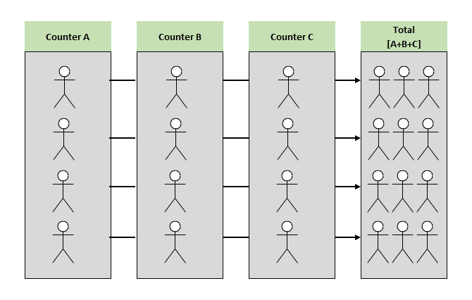

在上图中，A+B+C 的总和是剩下三列的总和；即 1+1+1=3。**总计**列总是显示剩下三列的总和，它永远不会显示实际站在队列中等待领取票的人。**总计**列的值取决于剩下的列的数量。如果**A 柜台**中有两个人在队列中，那么**总计**列将是 2+1+1=4。你也可以把**总计**列称为计算列。这一列在其他行/列移动其计数（排队等候的人）时计算总和。如果我们要用 C#编写**总计**列，我们会选择计算属性，代码如下：`public int TotalColumn { get { return ColumnA + ColumnB + ColumnC; } }`。

在上图中，数据从一列流向另一列。你可以把这看作是一个数据流。你可以为任何事物创建一个流，比如点击事件和悬停事件。任何东西都可以是一个流变量：用户输入、属性、缓存、数据结构等等。在流世界中，你可以监听流并做出相应的反应。

一系列事件被称为**流**。流可以发出三种东西：一个值，一个错误和一个完成的信号。

你可以轻松地使用流进行工作：

+   一个流可以作为另一个流的输入。

+   多个流可以作为另一个流的输入。

+   流可以合并。

+   数据值可以从一个流映射到另一个流。

+   流可以用你需要的数据/事件进行过滤。

要更近距离地了解流，看看下面代表流（事件序列）的图表：


上图是一个流（事件序列）的表示，其中我们有一到四个事件。任何这些事件都可以被触发，或者有人可以点击它们中的任何一个。这些事件可以用值来表示，这些值可以是字符串。X 符号表示在合并流或映射它们的数据过程中发生了错误。最后，|符号表示一个流（或一个操作）已经完成。

# 用响应式编程来实现响应式

显然，我们在前一节中讨论的计算属性不能是响应式的，也不能代表响应式编程。响应式编程具有特定的设计和技术。要体验响应式编程或成为响应式，你可以从[`reactivex.io/`](http://reactivex.io/)上获取文档，并通过阅读响应式宣言([`www.reactivemanifesto.org/`](https://www.reactivemanifesto.org/))来体验它[.](https://www.reactivemanifesto.org/)

简单来说，响应式属性是绑定属性，当事件触发时会做出反应。

如今，当我们处理各种大型系统/应用程序时，我们发现它们太大，无法一次处理。这些大型系统被分割或组成较小的系统。这些较小的单元/系统依赖于反应性属性。为了遵循反应式编程，反应式系统应用设计原则，使这些属性可以应用于所有方法。借助这种设计/方法，我们可以构建一个可组合的系统。

根据宣言，反应式编程和反应式系统是**不同**的。

根据反应式宣言，我们可以得出反应式系统如下：

+   **响应式**：反应式系统是基于事件的设计系统；这些系统能够在短时间内快速响应任何请求。

+   **可扩展**：反应式系统天生具有反应性。这些系统可以通过扩展或减少分配的资源来对可扩展性变化做出反应。

+   **弹性**：弹性系统是指即使出现故障/异常也不会停止的系统。反应式系统设计成这样，以便在任何异常或故障中，系统都不会崩溃；它会继续工作。

+   **基于消息的**：任何数据项都代表可以发送到特定目的地的消息。当消息或数据项到达给定状态时，事件会发出信号通知订阅者消息已到达。反应式系统依赖于这种消息传递。

下图显示了反应式系统的图形视图：

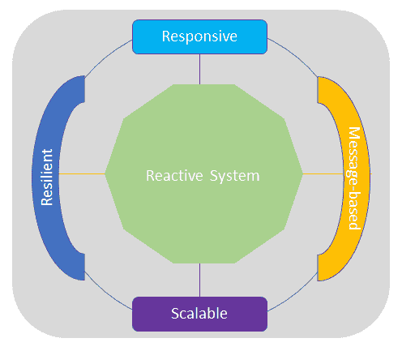

在这个图表中，反应式系统由具有弹性、可扩展、响应式和基于消息的小系统组成。

# 反应式流的操作

到目前为止，我们已经讨论了反应式编程是数据流的事实。在前面的部分中，我们还讨论了流的工作方式以及这些流如何及时传输。我们已经看到了事件的一个例子，并讨论了反应式程序中的数据流。现在，让我们继续使用相同的示例，看看两个流如何与各种操作一起工作。

在下一个示例中，我们有两个整数数据类型集合的可观察流。请注意，我们在本节中使用伪代码来解释这些数据流的行为和工作方式。

下图表示了两个可观察流。第一个流`Observer1`包含数字 1、2 和 4，而第二个流`Observer2`包含数字 3 和 5：


合并两个流涉及将它们的序列元素合并成一个新流。下图显示了当`Observer1`和`Observer2`合并时产生的新流：


前面的图表只是流的表示，不是流中元素顺序的实际表示。在这个图表中，我们看到元素（数字）的顺序是 1、2、3、4、5，但在实际例子中并非如此。顺序可能会变化；它可以是 1、2、4、3、5，或者任何其他顺序。

过滤流就像跳过元素/记录一样。你可以想象 LINQ 中的`Where`子句，看起来像这样：`myCollection.Where(num => num <= 3);`。

下图说明了标准的图形视图，我们试图仅选择符合特定标准的元素：


我们正在过滤我们的流，并只选择那些*<=3*的元素。这意味着我们跳过元素 4 和 5。在这种情况下，我们可以说过滤器是用来跳过元素或符合标准的。

要理解映射流，您可以想象任何数学运算，例如通过添加一些常数值来计数序列或递增数字。例如，如果我们有一个整数值为*3*，而我们的映射流是*+3*，那意味着我们正在计算一个序列，如*3 + 3 = 6*。您还可以将其与 LINQ 和选择以及像这样投影输出进行关联：`return myCollection.Select(num => num+3);`。

以下图表表示了流的映射：


在应用条件为*<= 3*的过滤器后，我们的流具有元素**1**、**2**和**3**。此外，我们对过滤后的流应用了`Map (+3)`，其中包含元素**1**、**2**和**3**，最后，我们的流具有元素**4**、**5**、**6**（1+3, 2+3, 3+3）。

在现实世界中，这些操作将按顺序或按需发生。我们已经按顺序执行了这些序列操作，以便我们可以按顺序应用合并、过滤和映射操作。以下图表表示我们想象中例子的流程：

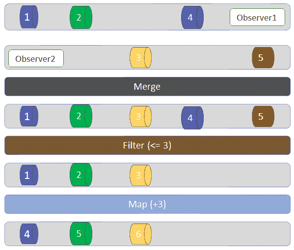

因此，我们尝试通过图表来表示我们的例子，并且我们已经经历了各种操作，其中两个流相互交谈，我们得到了一个新的流，然后我们过滤和映射了这个流。

要更好地理解这一点，请参考[`rxmarbles.com/`](https://rxmarbles.com/)。

现在让我们创建一个简单的代码来完成这个真实世界的例子。首先，我们将学习实现示例的代码，然后我们将讨论流的输出。

考虑以下代码片段作为`IObservable`接口的示例：

`public static IObservable<T> From<T>(this T[] source) => source.ToObservable();`

这段代码表示了`T`类型数组的扩展方法。我们创建了一个通用方法，并命名为`From`。这个方法返回一个`Observable`序列。

您可以访问官方文档了解更多关于扩展方法的信息：[`docs.microsoft.com/en-us/dotnet/csharp/programming-guide/classes-and-structs/extension-methods`](https://docs.microsoft.com/en-us/dotnet/csharp/programming-guide/classes-and-structs/extension-methods)。

在我们的代码中，我们有`TicketCounter`类。这个类有两个观察者，实际上是整数数据类型的数组。以下代码显示了两个可观察对象：

```cs
public IObservable<int> Observable1 => Counter1.From();
public IObservable<int> Observable2 => Counter2.From();
```

在这段代码中，我们将`From()`扩展方法应用于`Counter1`和`Counter2`。这些计数器实际上代表我们的售票处，并回顾了我们在第八章中的例子，*在.NET Core 中进行并发编程*。

以下代码片段表示`Counter1`和`Counter2`：

```cs
internal class TicketCounter
{
    private IObservable<int> _observable;
    public int[] Counter1;
    public int[] Counter2;
    public TicketCounter(int[] counter1, int[] counter2)
    {
        Counter1 = counter1;
        Counter2 = counter2;
    }
...
}
```

在这段代码中，我们有两个字段，`Counter1`和`Counter2`，它们是从构造函数中初始化的。当初始化`TicketCounter`类时，这些字段从类的构造函数中获取值，如下面的代码所定义的：

```cs
TicketCounter ticketCounter = new TicketCounter(new int[]{1,3,4}, new int[]{2,5});
```

要理解完整的代码，请转到 Visual Studio 并按下*F5*执行代码。从这里，您将看到以下屏幕：


这是控制台输出，在这个控制台窗口中，用户被要求输入一个从`0`到`9`的逗号分隔数字。继续并在这里输入一个逗号分隔的数字。请注意，这里，我们试图创建一个代码，描述我们之前在本节中讨论的数据流表示的图表。


根据前面的图表，我们输入了两个不同的逗号分隔数字。第一个是`1,2,4`，第二个是`3,5`。现在考虑我们的`Merge`方法：

```cs
public IObservable<int> Merge() => _observable = Observable1.Merge(Observable2);
```

`Merge`方法将数据流的两个序列合并为`_observable`。`Merge`操作是通过以下代码启动的：

```cs
Console.Write("\n\tEnter comma separated number (0-9): ");
var num1 = Console.ReadLine();
Console.Write("\tEnter comma separated number (0-9): ");
var num2 = Console.ReadLine();
var counter1 = num1.ToInts(',');
var counter2 = num2.ToInts(',');
TicketCounter ticketCounter = new TicketCounter(counter1, counter2);
```

在这段代码中，用户被提示输入逗号分隔的数字，然后程序通过`ToInts`方法将这些数字存储到`counter1`和`counter2`中。以下是我们`ToInts`方法的代码：

```cs
public static int[] ToInts(this string commaseparatedStringofInt, char separator) =>
    Array.ConvertAll(commaseparatedStringofInt.Split(separator), int.Parse);
```

这段代码是`string`的扩展方法。目标变量是一个包含由`separator`分隔的整数的`string`类型。在这个方法中，我们使用了.NET Core 提供的内置`ConvertAll`方法。它首先分割字符串，并检查分割值是否为`integer`类型。然后返回整数的`Array`。这个方法产生的输出如下截图所示：


以下是我们`merge`操作的输出：


上述输出显示，我们现在有了一个最终合并的观察者流，其中包含了按顺序排列的元素。让我们对这个流应用一个筛选器。以下是我们的`Filter`方法的代码：

```cs
public IObservable<int> Filter() => _observable = from num in _observable
    where num <= 3
    select num;
```

我们有数字`<= 3`的筛选条件，这意味着我们只会选择值小于或等于`3`的元素。这个方法将以以下代码开始：

```cs
ticketCounter.Print(ticketCounter.Filter());
```

当执行上述代码时，会产生以下输出：


最后，我们得到了一个按顺序排列的筛选流，其中包含了元素 1,3,2。现在我们需要在这个流上进行映射。我们需要一个通过`num + 3`得到的映射元素，这意味着我们需要通过给这个数字加上`3`来输出一个整数。以下是我们的`Map`方法：

```cs
public IObservable<int> Map() => _observable = from num in _observable
    select num + 3;
```

上述方法将以以下代码初始化：

```cs
Console.Write("\n\tMap (+ 3):");
ticketCounter.Print(ticketCounter.Map());
```

执行上述方法后，我们将看到以下输出：


应用`Map`方法后，我们得到了一个按顺序排列的元素流 4,6,5。我们已经讨论了响应式如何与一个虚构的例子一起工作。我们创建了一个小的.NET Core 控制台应用程序，以查看`Merge`，`Filter`和`Map`操作对可观察对象的影响。以下是我们控制台应用程序的输出：

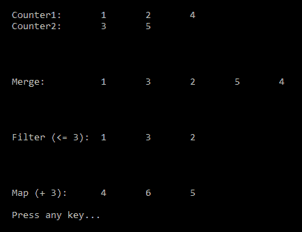

前面的快照讲述了我们示例应用程序的执行过程；`Counter1`和`Counter2`是包含数据序列 1,2,4 和 3,5 的数据流。我们有了`Merge`的输出结果是`1,3,2,5,4 Filter (<=3)`，结果是 1,3,2 和`Map (+3)`的数据是 4,6,5。

# 响应式和 IObservable

在前面的部分，我们讨论了响应式编程并了解了它的模型。在这一部分，我们将讨论微软对响应式编程的实现。针对.NET Core 中的响应式编程，我们有各种接口，提供了在我们的应用程序中实现响应式编程的方法。

`IObservable<T>`是一个泛型接口，定义在`System`命名空间中，声明为`public interface IObservable<out T>`。在这里，`T`代表提供通知信息的泛型参数类型。简单来说，这个接口帮助我们定义了一个通知的提供者，这些通知可以被推送出去。在你的应用程序中实现`IObservable<T>`接口时，可以使用观察者模式。

# 观察者模式 - 使用 IObservable<T>进行实现

简单来说，订阅者注册到提供者，以便订阅者可以得到与消息信息相关的通知。这些通知通知提供者消息已经被传递给订阅者。这些信息也可能与操作的变化或方法或对象本身的任何其他变化相关。这也被称为**状态变化**。

观察者模式指定了两个术语：观察者和可观察对象。可观察对象也称为提供者或主题。观察者注册在`Observable`/`Subject`/`Provider`类型上，并且当由于预定义的标准/条件、更改或事件等发生任何变化时，提供者会自动通知观察者。

下面的图表是观察者模式的简单表示，其中主题通知了两个不同的观察者：


从第九章的`FlixOne`库存 Web 应用程序返回，*功能编程实践*，启动你的 Visual Studio，并打开`FlixOne.sln`解决方案。

打开解决方案资源管理器。从这里，你会看到我们的项目看起来类似于以下快照：


在解决方案资源管理器下展开`Common`文件夹，并添加两个文件：`ProductRecorder.cs`和`ProductReporter.cs`。这些文件是`IObservable<T>`和`IObserver<T>`接口的实现。我们还需要添加一个新的 ViewModel，以便向用户报告实际的消息。为此，展开`Models`文件夹并添加`MessageViewModel.cs`文件。

以下代码展示了我们的`MessageViewModel`类：

```cs
public class MessageViewModel
{
    public string MsgId { get; set; }
    public bool IsSuccess { get; set; }
    public string Message { get; set; }

    public override string ToString() => $"Id:{MsgId}, Success:{IsSuccess}, Message:{Message}";
}
```

`MessageViewModel`包含以下内容：

+   `MsgId`：唯一标识符

+   `IsSuccess`：显示操作是失败还是成功。

+   `Message`：根据`IsSuccess`的值而定的成功消息或错误消息

+   `ToString()`：一个重写方法，在连接所有信息后返回一个字符串

现在让我们讨论我们的两个类；以下代码来自`ProductRecorder`类：

```cs
public class ProductRecorder : IObservable<Product>
{
    private readonly List<IObserver<Product>> _observers;

    public ProductRecorder() => _observers = new List<IObserver<Product>>();

    public IDisposable Subscribe(IObserver<Product> observer)
    {
        if (!_observers.Contains(observer))
            _observers.Add(observer);
        return new Unsubscriber(_observers, observer);
    }
...
}
```

我们的`ProductRecorder`类实现了`IObservable<Product>`接口。如果你回忆一下我们关于观察者模式的讨论，你会知道这个类实际上是一个提供者、主题或可观察对象。`IObservable<T>`接口有一个`Subscribe`方法，我们需要用它来订阅我们的订阅者或观察者（我们将在本节后面讨论观察者）。

应该有一个标准或条件，以便订阅者可以收到通知。在我们的情况下，我们有一个`Record`方法来实现这个目的。考虑以下代码：

```cs
public void Record(Product product)
{
    var discountRate = product.Discount.FirstOrDefault(x => x.ProductId == product.Id)?.DiscountRate;
    foreach (var observer in _observers)
    {
        if (discountRate == 0 || discountRate - 100 <= 1)
            observer.OnError(
                new Exception($"Product:{product.Name} has invalid discount rate {discountRate}"));
        else
            observer.OnNext(product);
    }
}
```

前面是一个`Record`方法。我们创建这个方法来展示模式的强大之处。这个方法只是检查有效的折扣率。如果根据标准/条件，`折扣率`无效，这个方法将引发异常并与无效的`折扣率`一起分享产品名称。

前面的方法根据标准验证折扣率，并在标准失败时向订阅者发送关于引发异常的通知。看一下迭代块（`foreach`循环）并想象一种情况，我们没有任何东西可以迭代，所有订阅者都已经收到通知。我们能想象在这种情况下会发生什么吗？同样的情况可能会发生在无限循环中。为了阻止这种情况，我们需要一些终止循环的东西。为此，我们有以下的`EndRecording`方法：

```cs
public void EndRecording()
{
    foreach (var observer in _observers.ToArray())
        if (_observers.Contains(observer))
            observer.OnCompleted();
    _observers.Clear();
}
```

我们的`EndRecoding`方法正在循环遍历`_observers`集合，并显式触发`OnCompleted()`方法。最后，它清除了`_observers`集合。

现在，让我们讨论`ProductReporter`类。这个类是`IObserver<T>`接口实现的一个例子。考虑以下代码：

```cs
public void OnCompleted()
{
    PrepReportData(true, $"Report has completed: {Name}");
    Unsubscribe();
}

public void OnError(Exception error) => PrepReportData(false, $"Error ocurred with instance: {Name}");

public void OnNext(Product value)
{
    var msg =
        $"Reporter:{Name}. Product - Name: {value.Name}, Price:{value.Price},Desc: {value.Description}";
    PrepReportData(true, msg);
}
```

`IObserver<T>`接口有`OnComplete`、`OnError`和`OnNext`方法，我们需要在`ProductReporter`类中实现这些方法。`OnComplete`方法的目的是通知订阅者工作已经完成，然后清除代码。此外，`OnError`在执行过程中发生错误时被调用，而`OnNext`提供了流序列中下一个元素的信息。

在以下代码中，`PrepReportData`是一个增值，它为用户提供了有关过程的所有操作的格式化报告：

```cs
private void PrepReportData(bool isSuccess, string message)
{
    var model = new MessageViewModel
    {
        MsgId = Guid.NewGuid().ToString(),
        IsSuccess = isSuccess,
        Message = message
    };

    Reporter.Add(model);
}
```

上述方法只是向我们的`Reporter`集合添加了一些内容，这是`MessageViewModel`类的集合。请注意，出于简单起见，您还可以使用我们在`MessageViewModel`类中实现的`ToString()`方法。

以下代码片段显示了`Subcribe`和`Unsubscribe`方法：

```cs
public virtual void Subscribe(IObservable<Product> provider)
{
    if (provider != null)
        _unsubscriber = provider.Subscribe(this);
}

private void Unsubscribe() => _unsubscriber.Dispose();
```

前两种方法告诉系统有一个提供者。订阅者可以订阅该提供者，或在操作完成后取消订阅/处理它。

现在是展示我们的实现并看到一些好结果的时候了。为此，我们需要对现有的`Product Listing`页面进行一些更改，并向项目添加一个新的 View 页面。

在我们的`Index.cshtml`页面中添加以下链接，以便我们可以看到查看审计报告的新链接：

```cs
<a asp-action="Report">Audit Report</a>
```

在上述代码片段中，我们添加了一个新链接，以显示基于我们在`ProductConstroller`类中定义的`Report Action`方法的审计报告。

添加此代码后，我们的产品列表页面将如下所示：


首先，让我们讨论`Report action`方法。为此，请考虑以下代码：

```cs
var mango = _repositry.GetProduct(new Guid("09C2599E-652A-4807-A0F8-390A146F459B"));
var apple = _repositry.GetProduct(new Guid("7AF8C5C2-FA98-42A0-B4E0-6D6A22FC3D52"));
var orange = _repositry.GetProduct(new Guid("E2A8D6B3-A1F9-46DD-90BD-7F797E5C3986"));
var model = new List<MessageViewModel>();
//provider
ProductRecorder productProvider = new ProductRecorder();
//observer1
ProductReporter productObserver1 = new ProductReporter(nameof(mango));
//observer2
ProductReporter productObserver2 = new ProductReporter(nameof(apple));
//observer3
ProductReporter productObserver3 = new ProductReporter(nameof(orange));
```

在上述代码中，我们只取前三个产品进行演示。请注意，您可以根据自己的实现修改代码。在代码中，我们创建了一个`productProvider`类和三个观察者来订阅我们的`productProvider`类。

以下图表是我们讨论过的`IObservable<T>`和`IObserver<T>`接口的所有活动的图形视图：

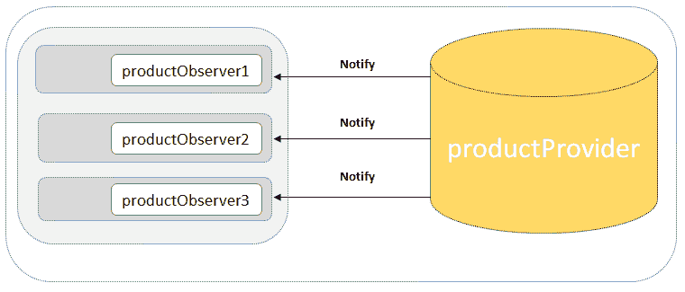

以下代码用于订阅`productrovider`：

```cs
//subscribe
productObserver1.Subscribe(productProvider);
productObserver2.Subscribe(productProvider);
productObserver3.Subscribe(productProvider);
```

最后，我们需要记录报告，然后取消订阅：

```cs
//Report and Unsubscribe
productProvider.Record(mango);
model.AddRange(productObserver1.Reporter);
productObserver1.Unsubscribe();
productProvider.Record(apple);
model.AddRange(productObserver2.Reporter);
productObserver2.Unsubscribe();
productProvider.Record(orange);
model.AddRange(productObserver3.Reporter);
productObserver3.Unsubscribe();
```

让我们回到我们的屏幕，并将`Report.cshtml`文件添加到 Views | Product。以下代码是我们报告页面的一部分。您可以在`Product`文件夹中找到完整的代码：

```cs
@model IEnumerable<MessageViewModel>

    <thead>
    <tr>
        <th>
            @Html.DisplayNameFor(model => model.IsSuccess)
        </th>
        <th>
            @Html.DisplayNameFor(model => model.Message)
        </th>
    </tr>
    </thead>
```

此代码将为表格的列创建标题，显示审计报告。

以下代码将完成表格并向`IsSuccess`和`Message`列添加值：

```cs
    <tbody>
    @foreach (var item in Model)
    {
        <tr>
            <td>
                @Html.HiddenFor(modelItem => item.MsgId)
                @Html.DisplayFor(modelItem => item.IsSuccess)
            </td>
            <td>
                @Html.DisplayFor(modelItem => item.Message)
            </td>

        </tr>
    }
    </tbody>
</table>
```

在这一点上，我们已经使用`IObservable<T>`和`IObserver<T>`接口实现了观察者模式。在 Visual Studio 中按下*F5*运行项目，在主页上点击 Product，然后点击审计报告链接。从这里，您将看到我们选择的产品的审计报告，如下图所示：


上述屏幕截图显示了一个简单的列表页面，显示了来自`MessageViewModel`类的数据。您可以根据需要进行更改和修改。一般来说，审计报告来自我们在上述屏幕中看到的许多操作活动。您还可以将审计数据保存在数据库中，然后根据需要为不同目的提供这些数据，例如向管理员报告等。

# 响应式扩展 - .NET Rx 扩展

上一节讨论的是响应式编程以及使用`IObservable<T>`和`IObserver<T>`接口作为观察者模式实现响应式编程。在本节中，我们将借助**Rx 扩展**扩展我们的学习。如果您想了解有关 Rx 扩展开发的更多信息，可以关注官方存储库[`github.com/dotnet/reactive`](https://github.com/dotnet/reactive)。

请注意，Rx 扩展现在已与`System`命名空间合并，您可以在`System.Reactive`命名空间中找到所有内容。如果您有 Rx 扩展的经验，您应该知道这些扩展的命名空间已更改，如下所示：

+   `Rx.Main`已更改为`System.Reactive`。

+   `Rx.Core`已更改为`System.Reactive.Core`。

+   `Rx.Interfaces`已更改为`System.Reactive.Interfaces`。

+   `Rx.Linq`已更改为`System.Reactive.Linq`。

+   `Rx.PlatformServices`已更改为`System.Reactive.PlatformServices`。

+   `Rx.Testing`已更改为`Microsoft.Reactive.Testing`。

要启动 Visual Studio，请打开在上一节中讨论的`SimplyReactive`项目，并打开 NuGet 包管理器。点击浏览，输入搜索词`System.Reactive`。从这里，您将看到以下结果：

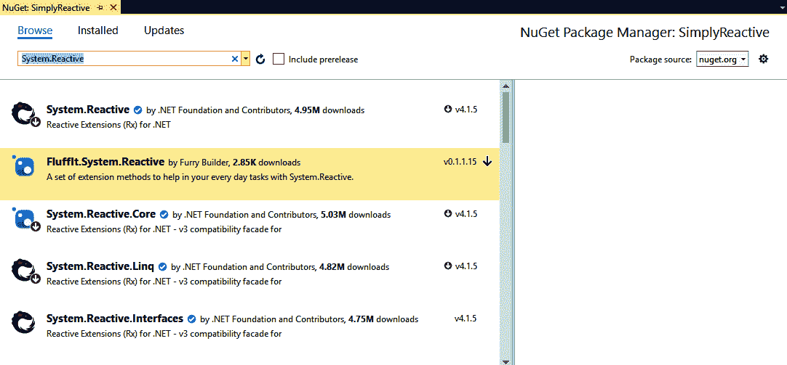

本节的目的是让您了解响应式扩展，而不深入其内部开发。这些扩展受 Apache2.0 许可证管辖，并由.NET 基金会维护。我们已经在我们的`SimplyReactive`应用程序中实现了响应式扩展。

# 库存应用用例

在本节中，我们将继续讨论我们的 FlixOne 库存应用程序。在本节中，我们将讨论 Web 应用程序模式，并扩展我们在第四章中开发的 Web 应用程序，*实现设计模式-基础知识第二部分*。

本章继续讨论了上一章中讨论的 Web 应用程序。如果您跳过了上一章（第九章，*函数式编程实践*），请重新阅读以便跟上当前章节。

在本节中，我们将介绍需求收集的过程，然后讨论我们之前开发的 Web 应用程序的开发和业务的各种挑战。

# 启动项目

在第七章，*为 Web 应用程序实现设计模式-第二部分*中，我们为 FlixOne 库存 Web 应用程序添加了功能。在考虑以下几点后，我们扩展了应用程序：

+   业务需要一个丰富的用户界面。

+   新的机会需要一个响应式 Web 应用程序。

# 需求

经过几次会议和与管理层、**业务分析师**（**BA**）和售前人员的讨论后，组织的管理层决定处理以下高层需求。

# 业务需求

我们的业务团队列出了以下要求：

+   **项目过滤**：目前，用户无法按类别筛选项目。为了扩展列表视图功能，用户应该能够根据其各自的类别筛选产品项目。

+   **项目排序**：目前，项目按照它们添加到数据库的顺序显示。没有机制可以让用户根据项目的名称、价格等对项目进行排序。

FlixOne 库存管理 Web 应用程序是一个虚构的产品。我们正在创建此应用程序来讨论 Web 项目中所需/使用的各种设计模式。

# 使用过滤器、分页和排序获取库存

根据我们的业务需求，我们需要对我们的 FlixOne 库存应用程序应用过滤、分页和排序。首先，让我们开始实现排序。为此，我创建了一个项目并将该项目放在`FlixOneWebExtended`文件夹中。启动 Visual Studio 并打开 FlixOne 解决方案。我们将对我们的产品清单表应用排序，包括这些列：`类别`、`产品名称`、`描述`和`价格`。请注意，我们不会使用任何外部组件进行排序，而是将创建我们自己的登录。

打开“解决方案资源管理器”，并打开`ProductController`，该文件位于`Controllers`文件夹中。向`Index`方法添加`[FromQuery]Sort sort`参数。请注意，`[FromQuery]`属性表示此参数是一个查询参数。我们将使用此参数来维护我们的排序顺序。

以下代码显示了`Sort`类：

```cs
public class Sort
{
    public SortOrder Order { get; set; } = SortOrder.A;
    public string ColName { get; set; }
    public ColumnType ColType { get; set; } = ColumnType.Text;
}
```

`Sort`类包含以下三个公共属性：

+   `Order`：表示排序顺序。`SortOrder`是一个枚举，定义为`public enum SortOrder { D, A, N }`。

+   `ColName`：表示列名。

+   `ColType`：表示列的类型；`ColumnType`是一个枚举，定义为`public enum ColumnType { Text, Date, Number }`。

打开`IInventoryRepositry`接口，并添加`IEnumerable<Product> GetProducts(Sort sort)`方法。此方法负责对结果进行排序。请注意，我们将使用 LINQ 查询来应用排序。实现这个`InventoryRepository`类的方法，并添加以下代码：

```cs
public IEnumerable<Product> GetProducts(Sort sort)
{
    if(sort.ColName == null)
        sort.ColName = "";
    switch (sort.ColName.ToLower())
    {
        case "categoryname":
        {
            var products = sort.Order == SortOrder.A
                ? ListProducts().OrderBy(x => x.Category.Name)
                : ListProducts().OrderByDescending(x => x.Category.Name);
            return PDiscounts(products);

        }
```

以下代码处理了`sort.ColName`为`productname`的情况：

```cs

       case "productname":
        {
            var products = sort.Order == SortOrder.A
                ? ListProducts().OrderBy(x => x.Name)
                : ListProducts().OrderByDescending(x => x.Name);
            return PDiscounts(products);
        }
```

以下代码处理了`sort.ColName`为`productprice`的情况：

```cs

        case "productprice":
        {
            var products = sort.Order == SortOrder.A
                ? ListProducts().OrderBy(x => x.Price)
                : ListProducts().OrderByDescending(x => x.Price);
            return PDiscounts(products);
        }
        default:
            return PDiscounts(ListProducts().OrderBy(x => x.Name));
    }
}
```

在上面的代码中，如果`sort`参数包含空值，则将其值设置为空，并使用`switch..case`在`sort.ColName.ToLower()`中进行处理。

以下是我们的`ListProducts()`方法，它给我们`IIncludeIQuerable<Product,Category>`类型的结果：

```cs
private IIncludableQueryable<Product, Category> ListProducts() =>
    _inventoryContext.Products.Include(c => c.Category);
```

上面的代码简单地通过包含每个产品的`Categories`来给我们`Products`。排序顺序将来自我们的用户，因此我们需要修改我们的`Index.cshtml`页面。我们还需要在表的标题列中添加一个锚标记。为此，请考虑以下代码：

```cs
 <thead>
        <tr>
            <th>
                @Html.ActionLink(Html.DisplayNameFor(model => model.CategoryName), "Index", new Sort { ColName = "CategoryName", ColType = ColumnType.Text, Order = SortOrder.A })
            </th>
            <th>
                @Html.ActionLink(Html.DisplayNameFor(model => model.ProductName), "Index", new Sort { ColName = "ProductName", ColType = ColumnType.Text, Order = SortOrder.A })

            </th>
            <th>
                @Html.ActionLink(Html.DisplayNameFor(model => model.ProductDescription), "Index", new Sort { ColName = "ProductDescription", ColType = ColumnType.Text, Order = SortOrder.A })
            </th>
        </tr>
    </thead>
```

上面的代码显示了表的标题列；`new Sort { ColName = "ProductName", ColType = ColumnType.Text, Order = SortOrder.A }` 是我们实现`SorOrder`的主要方式。

运行应用程序，您将看到产品列表页面的以下快照，其中包含排序功能：


现在，打开`Index.cshtml`页面，并将以下代码添加到页面中：

```cs
@using (Html.BeginForm())
{
    <p>
        Search by: @Html.TextBox("searchTerm")
        <input type="submit" value="Search" class="btn-sm btn-success" />
    </p>
}
```

在上面的代码中，我们在`Form`下添加了一个文本框。在这里，用户输入数据/值，并且当用户点击提交按钮时，这些数据会立即提交到服务器。在服务器端，过滤后的数据将返回并显示产品列表。在实现上述代码之后，我们的产品列表页面将如下所示：


转到`ProductController`中的`Index`方法并更改参数。现在`Index`方法看起来像这样：

```cs
public IActionResult Index([FromQuery]Sort sort, string searchTerm)
{
    var products = _repositry.GetProducts(sort, searchTerm);
    return View(products.ToProductvm());
}
```

同样，我们需要更新`InventoryRepository`和`InventoryRepository`中`GetProducts()`方法的参数。以下是`InventoryRepository`类的代码：

```cs
private IEnumerable<Product> ListProducts(string searchTerm = "")
{
    var includableQueryable = _inventoryContext.Products.Include(c => c.Category).ToList();
    if (!string.IsNullOrEmpty(searchTerm))
    {
        includableQueryable = includableQueryable.Where(x =>
            x.Name.Contains(searchTerm) || x.Description.Contains(searchTerm) ||
            x.Category.Name.Contains(searchTerm)).ToList();
    }

    return includableQueryable;
}
```

现在通过从 Visual Studio 按下*F5*并导航到产品列表中的过滤/搜索选项来运行项目。为此，请参阅此快照：

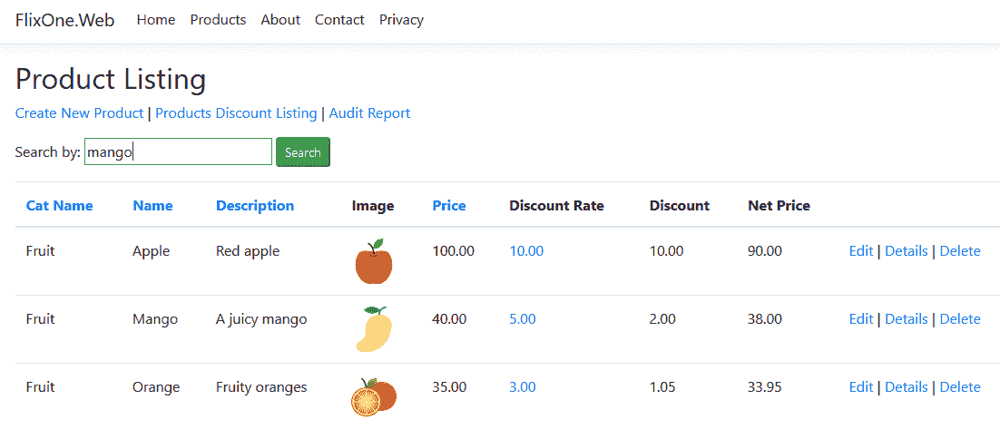

输入搜索词后，单击搜索按钮，这将给您结果，如下快照所示：


在上述产品列表截图中，我们正在使用`searchTerm` `mango`过滤我们的产品记录，并且它产生了单个结果，如前面的快照所示。在搜索数据的这种方法中存在一个问题：将`fruit`作为搜索词添加，然后看看会发生什么。它将产生零结果。这在以下快照中得到了证明：


我们没有得到任何结果，这意味着当我们将`searchTerm`转换为小写时，我们的搜索不起作用。这意味着我们的搜索是区分大小写的。我们需要更改我们的代码以使其起作用。

这是我们修改后的代码：

```cs
var includableQueryable = _inventoryContext.Products.Include(c => c.Category).ToList();
if (!string.IsNullOrEmpty(searchTerm))
{
    includableQueryable = includableQueryable.Where(x =>
        x.Name.Contains(searchTerm, StringComparison.InvariantCultureIgnoreCase) ||
        x.Description.Contains(searchTerm, StringComparison.InvariantCultureIgnoreCase) ||
        x.Category.Name.Contains(searchTerm, StringComparison.InvariantCultureIgnoreCase)).ToList();
}
```

我们忽略大小写以使我们的搜索不区分大小写。我们使用了`StringComparison.InvariantCultureIgnoreCase`并忽略了大小写。现在我们的搜索将使用大写或小写字母。以下是使用小写`fruit`产生结果的快照：

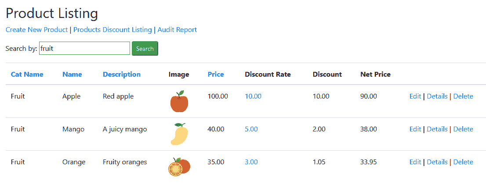

在之前的 FlixOne 应用程序扩展讨论中，我们应用了`Sort`和`Filter`；现在我们需要添加`paging`。为此，我们添加了一个名为`PagedList`的新类，如下所示：

```cs
public class PagedList<T> : List<T>
{
    public PagedList(List<T> list, int totalRecords, int currentPage, int recordPerPage)
    {
        CurrentPage = currentPage;
        TotalPages = (int) Math.Ceiling(totalRecords / (double) recordPerPage);

        AddRange(list);
    }
}
```

现在，将`ProductController`的`Index`方法的参数更改如下：

```cs
public IActionResult Index([FromQuery] Sort sort, string searchTerm, 
    string currentSearchTerm,
    int? pagenumber,
    int? pagesize)
```

将以下代码添加到`Index.cshtml`页面：

```cs
@{
    var prevDisabled = !Model.HasPreviousPage ? "disabled" : "";
    var nextDisabled = !Model.HasNextPage ? "disabled" : "";
}

<a asp-action="Index"
   asp-route-sortOrder="@ViewData["CurrentSort"]"
   asp-route-pageNumber="@(Model.CurrentPage - 1)"
   asp-route-currentFilter="@ViewData["currentSearchTerm"]"
   class="btn btn-sm btn-success @prevDisabled">
    Previous
</a>
<a asp-action="Index"
   asp-route-sortOrder="@ViewData["CurrentSort"]"
   asp-route-pageNumber="@(Model.CurrentPage + 1)"
   asp-route-currentFilter="@ViewData["currentSearchTerm"]"
   class="btn btn-sm btn-success @nextDisabled">
    Next
</a>
```

前面的代码使我们能够将屏幕移动到下一页或上一页。我们的最终屏幕将如下所示：

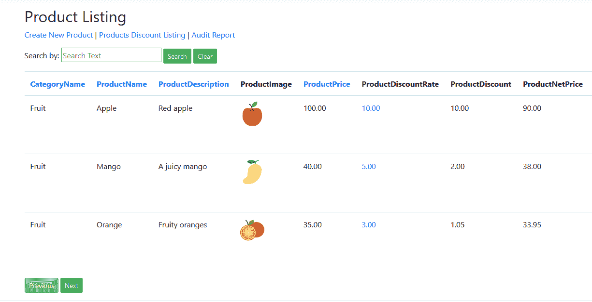

在本节中，我们讨论并扩展了我们的 FlixOne 应用程序的功能，通过实现`Sorting`，`Paging`和`Filter`。本节的目的是让您亲身体验一个工作中的应用程序。我们已经编写了我们的应用程序，以便它可以直接满足实际应用程序的需求。通过前面的增强，我们的应用程序现在能够提供可以排序、分页和过滤的产品列表。

# 模式和实践-MVVM

在第六章中，*为 Web 应用程序实现设计模式-第一部分*，我们讨论了 MVC 模式，并创建了一个基于此模式的应用程序。

肯·库珀（Ken Cooper）和泰德·彼得斯（Ted Peters）是 MVVM 模式背后的名字。在这一发明时，肯和泰德都是微软公司的架构师。他们制定了这一模式，以简化基于事件驱动的编程的用户界面。后来，它被实现在 Windows Presentation Foundation（WPF）和 Silverlight 中。

MVVM 模式是由 John Gossman 于 2005 年宣布的。John 在博客中讨论了这一模式，与构建 WPF 应用程序有关。链接在这里：[`blogs.msdn.microsoft.com/johngossman/2005/10/08/introduction-to-modelviewviewmodel-pattern-for-building-wpf-apps/`](https://blogs.msdn.microsoft.com/johngossman/2005/10/08/introduction-to-modelviewviewmodel-pattern-for-building-wpf-apps/)。

MVVM 被认为是 MVC 的变体之一，以满足现代用户界面（UI）开发方法，其中 UI 开发是设计师/UI 开发人员的核心责任，而不是应用程序开发人员。在这种开发方法中，一个专注于使 UI 更具吸引力的图形爱好者的设计师可能会或可能不会关心应用程序的开发部分。通常，设计师（UI 人员）使用各种工具来使 UI 更具吸引力。UI 可以使用简单的 HTML、CSS 等，使用 WPF 或 Silverlight 的丰富控件来制作。

Microsoft Silverlight 是一个帮助开发具有丰富用户界面的应用程序的框架。许多开发人员将其称为 Adobe Flash 的替代品。2015 年 7 月，微软宣布不再支持 Silverlight。微软宣布在其构建期间支持.NET Core 3.0 中的 WPF（[`developer.microsoft.com/en-us/events/build`](https://developer.microsoft.com/en-us/events/build)）。这里还有一个关于支持 WPF 计划更多见解的博客：[`devblogs.microsoft.com/dotnet/net-core-3-and-support-for-windows-desktop-applications/`](https://devblogs.microsoft.com/dotnet/net-core-3-and-support-for-windows-desktop-applications/)。

MVVM 模式可以通过其各个组件进行详细说明，如下所示：

+   **Model**：保存数据，不关心应用程序中的任何业务逻辑。我更喜欢将其称为领域对象，因为它保存了我们正在处理的应用程序的实际数据。换句话说，我们可以说模型不负责使数据变得美观。例如，在我们的 FlixOne 应用程序的产品模型中，产品模型保存各种属性的值，并通过名称、描述、类别名称、价格等描述产品。这些属性包含产品的实际数据，但模型不负责对任何数据进行行为更改。例如，产品模型不负责将产品描述格式化为在 UI 上看起来完美。另一方面，我们的许多模型包含验证和其他计算属性。主要挑战是保持纯净的模型，这意味着模型应该类似于真实世界的模型。在我们的情况下，我们的`product`模型被称为**clean model**。干净的模型是类似于真实产品属性的模型。例如，如果`Product`模型存储水果的数据，那么它应该显示水果的颜色等属性。以下代码来自我们虚构应用程序的一个模型：

```cs
export class Product {
  name: string;
  cat: string; 
  desc: string;
}
```

请注意，上述代码是用 Angular 编写的。我们将在接下来的*实现 MVVM*部分详细讨论 Angular 代码。

+   **View**：这是最终用户通过 UI 访问的数据表示。它只是显示数据的值，这个值可能已经格式化，也可能没有。例如，我们可以在 UI 上显示折扣率为 18%，而在模型中它可能存储为 18.00。视图还可以负责行为变化。视图接受用户输入；例如，可能会有一个提供添加新产品的表单/屏幕的视图。此外，视图可以管理用户输入，比如按键、检测关键字等。它也可以是主动视图或被动视图。接受用户输入并根据用户输入操纵数据模型（属性）的视图是主动视图。被动视图是什么都不做的视图。换句话说，与模型无关的视图是被动视图，这种视图由控制器操纵。

+   **ViewModel**：它在 View 和 Model 之间充当中间人。它的责任是使呈现更好。在我们之前的例子中，View 显示折扣率为 18%，但 Model 的折扣率为 18.00，这是 ViewModel 的责任，将 18.00 格式化为 18%，以便 View 可以显示格式化的折扣率。

如果我们结合讨论的所有要点，我们可以将整个 MVVM 模式可视化，看起来像下面的图表：


上述图表是 MVVM 的图形视图，它向我们展示了**View Model**如何将**View**和**Model**分开。**ViewModel**还维护`state`和`perform`操作。这有助于**View**向最终用户呈现最终输出。视图是 UI，它获取数据并将其呈现给最终用户。在下一节中，我们将使用 Angular 实现 MVVM 模式。

# MVVM 的实现

在上一节中，我们了解了 MVVM 模式是什么以及它是如何工作的。在本节中，我们将使用我们的 FlixOne 应用程序并使用 Angular 构建一个应用程序。为了演示 MVVM 模式，我们将使用基于 ASP.NET Core 2.2 构建的 API。

启动 Visual Studio 并打开`FlixOneMVVM`文件夹中的 FlixOne Solution。运行`FlixOne.API`项目，您将看到以下 Swagger 文档页面：

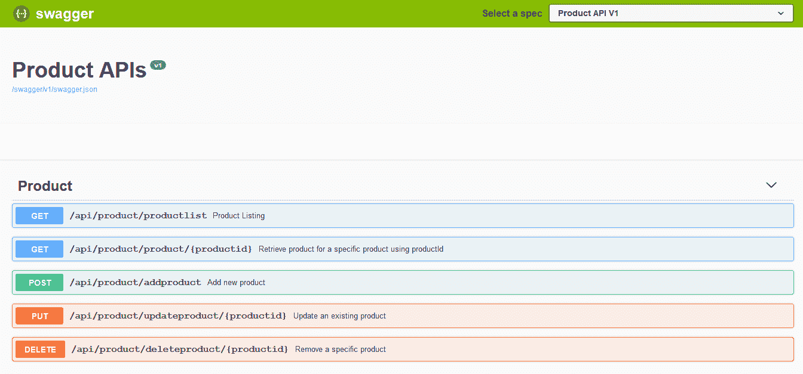

上述截图是我们的产品 API 文档的快照，我们已经整合了 Swagger 来进行 API 文档编制。如果您愿意，您可以从此屏幕测试 API。如果 API 返回结果，则您的项目已成功设置。如果没有，请检查此项目的先决条件，并检查本章的 Git 存储库中的`README.md`文件。我们拥有构建新 UI 所需的一切；正如之前讨论的，我们将创建一个 Angular 应用程序，该应用程序将使用我们的产品 API。要开始，请按照以下步骤进行：

1.  打开解决方案资源管理器。

1.  右键单击 FlixOne Solution。

1.  点击添加新项目。

1.  从`添加新项目`窗口中，选择 ASP.NET Core Web 应用程序。将其命名为 FlixOne.Web，然后单击确定。这样做后，请参考此截图：

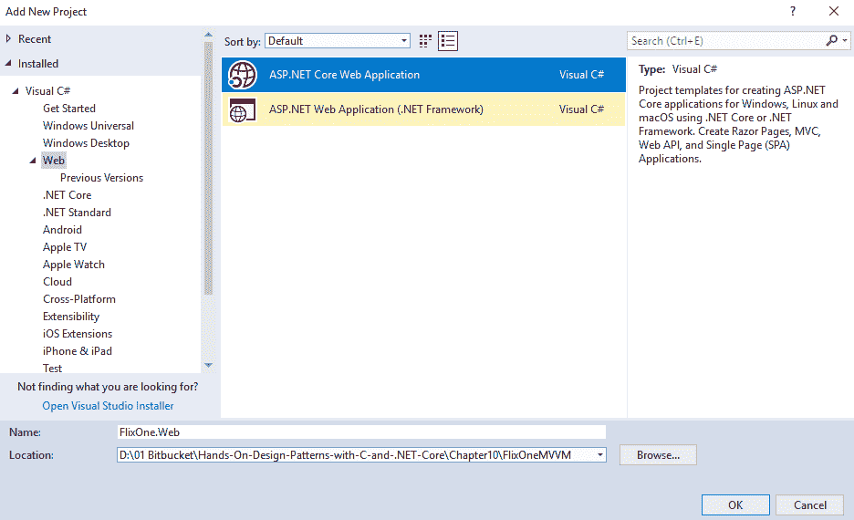

1.  从下一个窗口中，选择 Angular，确保您已选择了 ASP.NET Core 2.2，然后单击确定，并参考此截图：

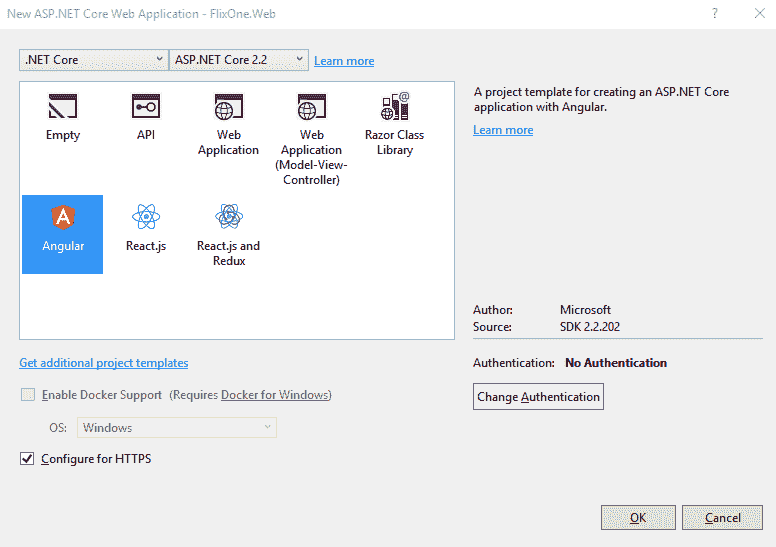

1.  打开解决方案资源管理器，您将找到新的`FlixOne.Web`项目和文件夹层次结构，看起来像这样：

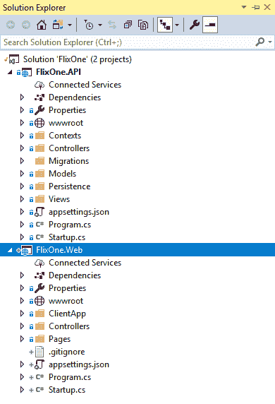

1.  从解决方案资源管理器中，右键单击`FlixOne.Web`项目，然后单击`设置为启动项目`，然后参考以下截图：


1.  运行`FlixOne.Web`项目并查看输出，将看起来像以下截图：


我们已成功设置了我们的 Angular 应用程序。返回到您的 Visual Studio 并打开`输出`窗口。请参考以下截图：


您将在输出窗口中找到`ng serve "--port" "60672"`；这是一个命令，告诉 Angular 应用程序监听和提供服务。从`解决方案资源管理器`中打开`package.json`文件；这个文件属于`ClientApp`文件夹。您会注意到`"@angular/core": "6.1.10"`，这意味着我们的应用是基于`angular6`构建的。

以下是我们的`product.component.html`的代码（这是一个视图）：

```cs
<table class='table table-striped' *ngIf="forecasts">
  <thead>
    <tr>
      <th>Name</th>
      <th>Cat. Name (C)</th>
      <th>Price(F)</th>
      <th>Desc</th>
    </tr>
  </thead>
  <tbody>
    <tr *ngFor="let forecast of forecasts">
      <td>{{ forecast.productName }}</td>
      <td>{{ forecast.categoryName }}</td>
      <td>{{ forecast.productPrice }}</td>
      <td>{{ forecast.productDescription }}</td>
    </tr>
  </tbody>
</table>
```

从 Visual Studio 运行应用程序，并单击产品，您将获得一个类似于此的产品列表屏幕：


在本节中，我们在 Angular 中创建了一个小型演示应用程序。

# 总结

本章的目的是通过讨论其原则和反应式编程模型来使您了解反应式编程。反应式是关于数据流的，我们通过示例进行了讨论。我们从第八章扩展了我们的示例，*在.NET Core 中进行并发编程*，在那里我们讨论了会议上的票务收集柜台的用例。

在我们讨论反应式宣言时，我们探讨了反应式系统。我们通过展示`merge`、`filter`和`map`操作以及流如何通过示例工作来讨论了反应式系统。此外，我们使用示例讨论了`IObservable`接口和 Rx 扩展。

我们继续进行了`FlixOne`库存应用程序，并讨论了实现产品库存数据的分页和排序的用例。最后，我们讨论了 MVVM 模式，并在 MVVM 架构上创建了一个小应用程序。

在下一章（第十一章，*高级数据库设计和应用技术*）中，将探讨高级数据库和应用技术，包括应用**命令查询职责分离**（**CQRS**）和分类账式数据库。

# 问题

以下问题将帮助您巩固本章中包含的信息：

1.  什么是流？

1.  什么是反应式属性？

1.  什么是反应式系统？

1.  什么是合并两个反应式流？

1.  什么是 MVVM 模式？

# 进一步阅读

要了解本章涵盖的主题，请参考以下书籍。本书将为您提供各种深入和实践性的响应式编程练习：

+   《.NET 开发人员的响应式编程》，Antonio Esposito 和 Michael Ciceri，Packt Publishing：[`www.packtpub.com/web-development/reactive-programming-net-developers`](https://www.packtpub.com/web-development/reactive-programming-net-developers)
