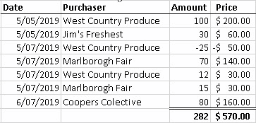
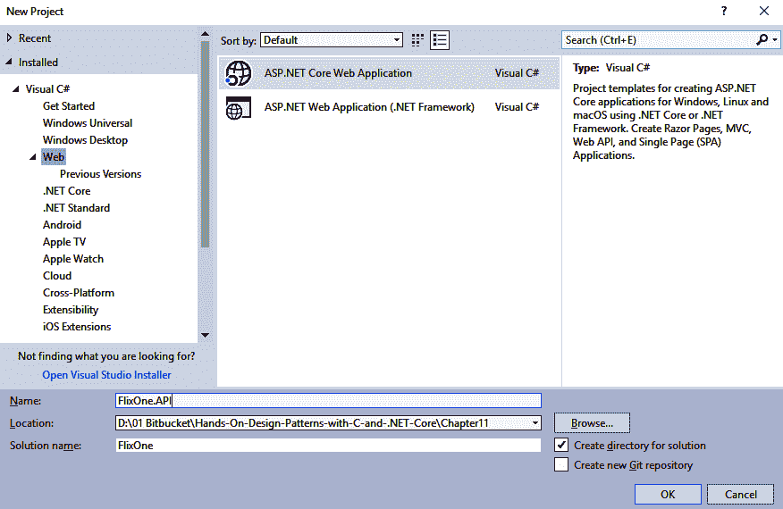
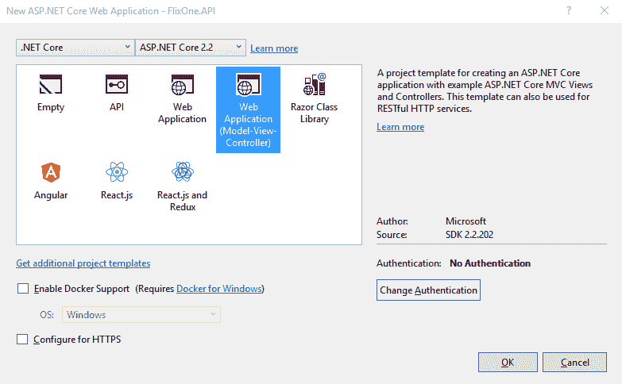
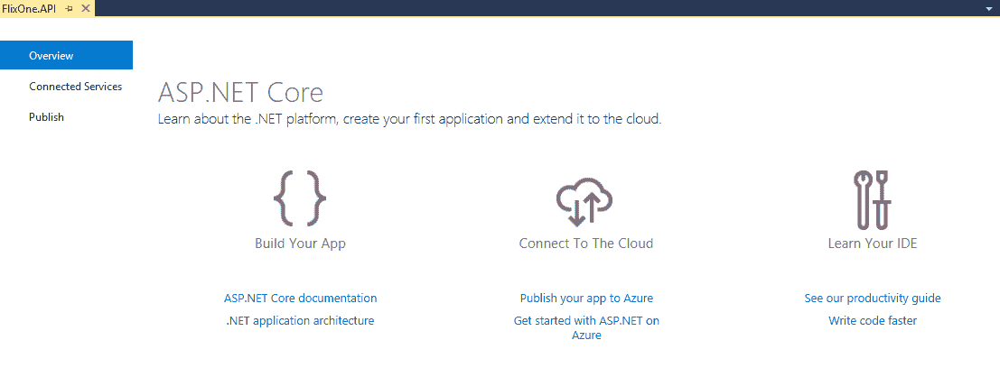
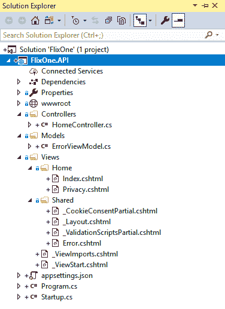
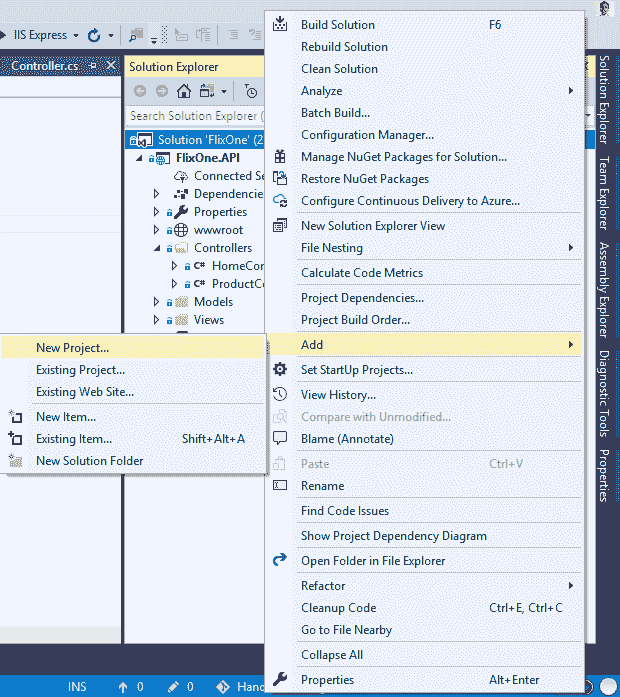
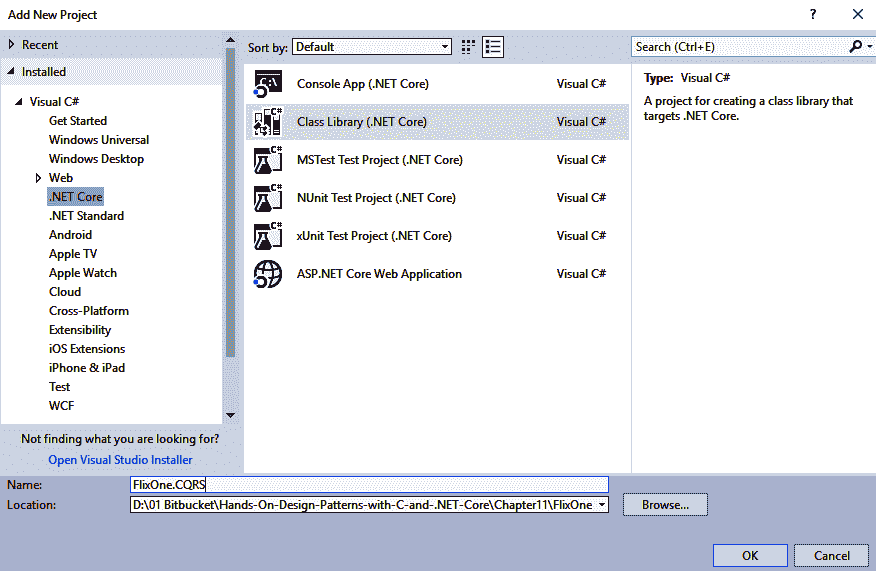
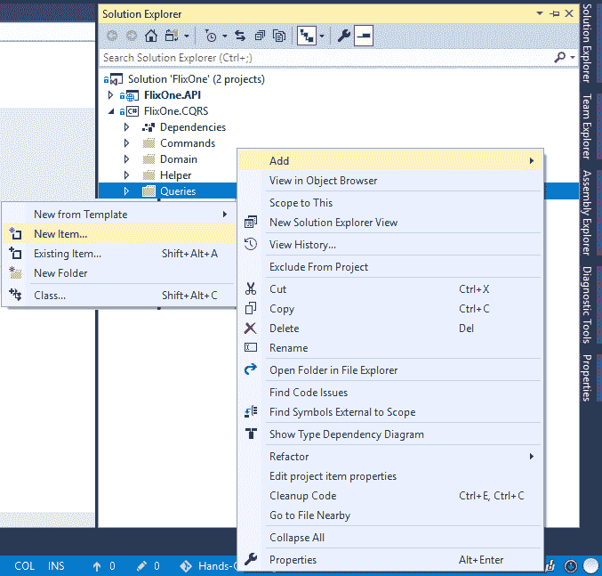
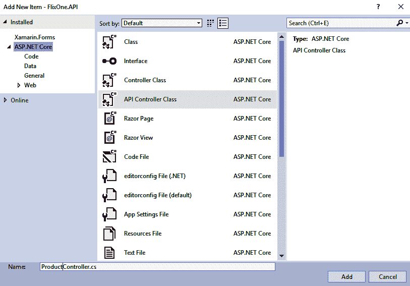
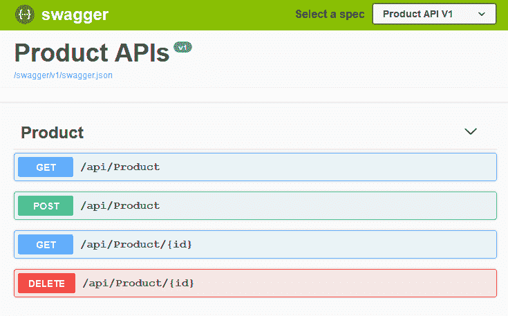

# 第十一章：高级数据库设计和应用技术

在上一章中，我们通过讨论其原则和模型来了解了响应式编程。我们还讨论并查看了响应式编程如何处理数据流的示例。

数据库设计是一项复杂的任务，需要很多耐心。在本章中，我们将讨论高级数据库和应用技术，包括应用 CQRS 和分类账式数据库。

与以前的章节类似，将进行需求收集会话，以确定最小可行产品（MVP）。在本章中，将使用几个因素来引导设计到 CQRS。我们将使用分类账式方法，其中包括增加对库存水平变化的跟踪，以及希望提供用于检索库存水平的公共 API。本章将介绍开发人员为什么使用分类账式数据库以及为什么我们应该专注于 CQRS 实现。在本章中，我们将看到为什么我们要采用 CQRS 模式。

本章将涵盖以下主题：

+   用例讨论

+   数据库讨论

+   库存的分类账式数据库

+   实施 CQRS 模式

# 技术要求

本章包含各种代码示例，以解释概念。代码保持简单，仅用于演示目的。大多数示例涉及使用 C#编写的.NET Core 控制台应用程序。

要运行和执行代码，Visual Studio 2019 是必需的（您也可以使用 Visual Studio 2017 来运行应用程序）。

# 安装 Visual Studio

要运行这些代码示例，您需要安装 Visual Studio（首选 IDE）。要做到这一点，请按照以下说明进行操作：

1.  从以下下载链接下载 Visual Studio 2017（或 2019 版本）：[`docs.microsoft.com/en-us/visualstudio/install/install-visual-studio`](https://docs.microsoft.com/en-us/visualstudio/install/install-visual-studio)。

1.  按照上述链接可访问的安装说明。可用多种选项进行 Visual Studio 安装。在这里，我们使用 Visual Studio for Windows。

# 设置.NET Core

如果您尚未安装.NET Core，则需要按照以下说明进行操作：

1.  下载.NET Core for Windows：[`www.microsoft.com/net/download/windows`](https://www.microsoft.com/net/download/windows)。

1.  对于多个版本和相关库，请访问[`dotnet.microsoft.com/download/dotnet-core/2.2`](https://dotnet.microsoft.com/download/dotnet-core/2.2)。

# 安装 SQL Server

如果您尚未安装 SQL Server，则需要按照以下说明进行操作：

1.  从以下链接下载 SQL Server：[`www.microsoft.com/en-in/download/details.aspx?id=1695`](https://www.microsoft.com/en-in/download/details.aspx?id=1695)。

1.  您可以在[`docs.microsoft.com/en-us/sql/ssms/download-sql-server-management-studio-ssms?view=sql-server-2017`](https://docs.microsoft.com/en-us/sql/ssms/download-sql-server-management-studio-ssms?view=sql-server-2017)找到安装说明。

有关故障排除和更多信息，请参阅以下链接：[`www.blackbaud.com/files/support/infinityinstaller/content/installermaster/tkinstallsqlserver2008r2.htm`](https://www.blackbaud.com/files/support/infinityinstaller/content/installermaster/tkinstallsqlserver2008r2.htm)。

# 用例讨论

在本章中，我们将继续使用我们的 FlixOne 库存应用程序。在本章中，我们将讨论 CQRS 模式，并扩展我们在以前章节中开发的 Web 应用程序。

本章将继续讨论上一章中开发的 Web 应用程序。如果您跳过了上一章，请重新阅读以帮助您理解当前章节。

在本节中，我们将通过需求收集过程，然后讨论我们的 Web 应用程序的各种挑战。

# 项目启动

在第七章中，*为 Web 应用程序实现设计模式-第二部分*，我们扩展了 FlixOne 库存，并为 Web 应用程序添加了身份验证和授权。我们在考虑以下几点后扩展了应用程序：

+   当前应用程序对所有用户开放；因此，任何用户都可以访问任何页面，甚至是受限制的页面。

+   用户不应该访问需要访问或特殊访问权限的页面；这些页面也被称为受限制的页面或有限访问权限的页面。

+   用户应能够根据其角色访问页面/资源。

在第十章中，*响应式编程模式和技术*，我们进一步扩展了我们的 FlixOne 库存应用程序，并为显示列表的所有页面添加了分页、过滤和排序。在扩展应用程序时考虑了以下几点：

+   **项目过滤**：目前，用户无法按照它们的类别对项目进行过滤。为了扩展此功能，用户应能够根据类别对产品项目进行过滤。

+   **项目排序**：目前，项目按照它们被添加到数据库的顺序出现。没有任何机制可以使用户根据类别（如项目名称或价格）对项目进行排序。

# 需求

经过多次会议和与管理层、**业务分析师**（**BA**）和售前人员的讨论后，管理层决定着手处理以下高层要求：业务需求和技术需求。

# 业务需求

根据与利益相关者和最终用户的讨论，以及市场调查的结果，我们的业务团队列出了以下要求：

+   **产品扩展**：产品正在接触到不同的用户。现在是扩展应用程序的好时机。扩展后的应用程序将更加强大。

+   **产品模型**：作为库存管理应用程序，用户应该感到自由（这意味着在模型级别没有限制，没有复杂的验证），并且在用户与应用程序交互时不应有任何限制。每个屏幕和页面都应该是自解释的。

+   **数据库设计**：应用程序的数据库应设计成扩展不需要花费太多时间的方式。

# 技术要求

满足业务需求的实际要求现已准备好进行开发。经过与业务人员的多次讨论后，我们得出以下要求：

+   以下是**首页**或**主页**的要求：

+   应该有包含各种小部件的仪表板

+   应该显示商店的一览图片

+   以下是**产品页面**的要求：

+   应具有添加、更新和删除产品的功能

+   应具有添加、更新和删除产品类别的功能

FlixOne 库存管理 Web 应用程序是一个虚构的产品。我们正在创建此应用程序来讨论 Web 项目中所需/使用的各种设计模式。

# 挑战

尽管我们扩展了现有的 Web 应用程序，但对开发者和企业都存在各种挑战。在本节中，我们将讨论这些挑战，然后找出克服这些挑战的解决方案。

# 开发者面临的挑战

以下是由应用程序的重大变化引起的挑战。这也是将控制台应用程序升级为 Web 应用程序的主要扩展的结果：

+   **不支持 RESTful 服务**：目前，没有支持 RESTful 服务，因为没有开发 API。

+   **有限的安全性**：在当前应用程序中，只有一种机制可以限制/允许用户访问特定屏幕或应用程序模块：即登录。

# 企业面临的挑战

在我们采用新技术栈时，会出现以下挑战，并且代码会发生许多变化。因此，要实现最终输出需要时间，这延迟了产品，导致业务损失：

+   客户流失：在这里，我们仍处于开发阶段，但对我们业务的需求非常高。然而，开发团队花费的时间比预期的要长，以交付产品。

+   发布生产更新需要更多时间：目前开发工作非常耗时，这延迟了后续活动，导致生产延迟。

# 提供解决问题/挑战的解决方案

经过几次会议和头脑风暴，开发团队得出结论，我们必须稳定我们的基于 Web 的解决方案。为了克服这些挑战并提供解决方案，技术团队和业务团队汇聚在一起，确定了各种解决方案和要点。

以下是解决方案支持的要点：

+   发展 RESTful web 服务——应该有一个 API 仪表板

+   严格遵循测试驱动开发（TDD）

+   重新设计用户界面（UI）以满足用户体验期望

# 数据库讨论

在开始数据库讨论之前，我们必须考虑以下几点——FlixOne 网站应用程序的整体情况：

+   我们应用程序的一部分是库存管理，但另一部分是电子商务网站应用程序。

+   具有挑战性的部分是我们的应用程序还将作为销售点（POS）提供服务。在这个部分/模块中，用户可以支付他们从离线柜台/门店购买的物品。

+   对于库存部分，我们需要解决我们将采取哪种方法来计算和维护账户和交易，并确定出售任何物品的成本。

+   为了维护库存，有各种选项可用，其中最常用的两个选项是先进先出（FIFO）和后进先出（LIFO）。

+   大部分交易涉及财务数据，因此这些交易需要历史数据。每条记录应包含以下信息：当前值，当前更改之前的值，以及所做的更改。

+   在维护库存的同时，我们还需要维护购买的物品。

在为任何电子商务网站应用程序设计数据库时，还有更多重要的要点。我们将限制我们的范围，以展示 FlixOne 应用程序的库存和库存管理。

# 数据库处理

与本书中涵盖的其他主题类似，有许多数据库，涵盖了从数据库模式的基本模式到管理数据库系统如何组合的模式。本节将涵盖两种系统模式，即在线事务处理（OLTP）和在线分析处理（OLAP）。为了进一步了解数据库设计模式，我们将更详细地探讨一种特定模式，即分类账式数据库。

数据库模式是数据库中表、视图、存储过程和其他组件的集合的另一个词。可以将其视为数据库的蓝图。

# OLTP

已设计 OLTP 数据库以处理导致数据库更改的大量语句。基本上，INSERT、UPDATE 和 DELETE 语句都会导致更改，并且与 SELECT 语句的行为非常不同。OLTP 数据库已经考虑到了这一点。因为这些数据库记录更改，它们通常是主数据库或主数据库，这意味着它们是保存当前数据的存储库。

`MERGE`语句也被视为引起变化的语句。这是因为它提供了一个方便的语法，用于在行不存在时插入记录，并在行存在时插入更新。当行存在时，它将进行更新。`MERGE`语句并非所有数据库提供程序或版本都支持。

OLTP 数据库通常被设计为快速处理变更语句。这通常是通过精心规划表结构来实现的。一个简单的观点是考虑数据库表。这个表可以有用于存储数据的字段，用于高效查找数据的键，指向其他表的索引，用于响应特定情况的触发器，以及其他表结构。每一个这些结构都有性能惩罚。因此，OLTP 数据库的设计是在表上使用最少数量的结构与所需行为之间的平衡。

让我们考虑一张记录库存系统中书籍的表。每本书可能记录名称、数量、出版日期，并引用作者信息、出版商和其他相关表。我们可以在所有列上放置索引，甚至为相关表中的数据添加索引。这种方法的问题在于，每个索引都必须为引起变化的每个语句存储和维护。因此，数据库设计人员必须仔细规划和分析数据库，以确定向表中添加和不添加索引和其他结构的最佳组合。

表索引可以被视为一种虚拟查找表，它为关系数据库提供了一种更快的查找数据的方式。

# OLAP

使用 OLAP 模式设计的数据库预计会有比引起变化的语句更多的`SELECT`语句。这些数据库通常具有一个或多个数据库的数据的综合视图。因此，这些数据库通常不是主数据库，而是用于提供与主数据库分开的报告和分析的数据库。在某些情况下，这是在与其他数据库隔离的基础设施上提供的，以便不影响运营数据库的性能。这种部署方式通常被称为**数据仓库**。

数据仓库可以用来提供企业系统或系统集合的综合视图。传统上，数据通常通过较慢的周期性作业进行输入，以从其他系统刷新数据，但是使用现代数据库系统，这种趋势正在向近实时的整合发展。

OLTP 和 OLAP 之间的主要区别在于数据的存储和组织方式。在许多情况下，这将需要在支持特定报告场景的 OLAP 数据库中创建表或持久视图（取决于所使用的技术），并复制数据。在 OLTP 数据库中，数据的复制是不希望的，因为这样会引入需要为单个引起变化的语句维护的多个表。

# 分类账式数据库

会强调分类账式数据库设计，因为这是几十年来许多金融数据库中使用的模式，而且可能并不为一些开发人员所知。分类账式数据库源自会计分类账，交易被添加到文档中，并且数量和/或金额被合计以得出最终数量或金额。下表显示了苹果销售的分类账：



关于这个例子有几点需要指出。购买者信息是分别写在不同的行上，而不是擦除他们的金额并输入新的金额。以 West Country Produce 的两次购买和一次信用为例。这通常与许多数据库不同，许多数据库中单个行包含购买者信息，并有用于金额和价格的单独字段。

类似账簿的数据库通过每个交易都有单独的一行来实现这一概念，因此删除`UPDATE`和`DELETE`语句，只依赖`INSERT`语句。这有几个好处。与账簿类似，一旦每笔交易被写入，就不能被移除或更改。如果出现错误或更改，比如对 West Country Produce 的信用，需要写入新的交易以达到期望的状态。这样做的一个有趣好处是源表现在立即提供了详细的活动日志。如果我们添加一个*modified by*列，我们就可以有一个全面的日志，记录是谁或什么做出了更改以及更改是什么。

这个例子是针对单条目账簿的，但在现实世界中，会使用双重账簿。不同之处在于，在双重账簿中，每笔交易都记录为一张表中的信用和另一张表中的借记。

下一个挑战是捕获表的最终或汇总版本。在这个例子中，这是已购买的苹果数量和价格。第一种方法可以使用一个`SELECT`语句，只需对购买者执行`GROUP BY`，如下所示：

```cs
SELECT Purchaser, SUM(Amount), SUM(Price)
FROM Apples
GROUP BY Purchaser
```

虽然这对于较小的数据大小来说是可以的，但问题在于随着行数的增加，查询的性能会随着时间的推移而下降。另一种选择是将数据聚合成另一种形式。有两种主要的方法可以实现这一点。第一种方法是在将账簿表中的信息写入另一张表（或者如果支持的话，持久视图）时同时执行这个活动，这张表以聚合形式保存数据。

**持久**或**物化视图**类似于数据库视图，但视图的结果被缓存。这使我们不需要在每个请求上重新计算视图的好处，它要么定期刷新，要么在基础数据更改时刷新。

第二种方法依赖于与`INSERT`语句分开的另一个机制，在需要时检索聚合视图。在一些系统中，向表中写入更改并检索结果的主要场景发生得不太频繁。在这种情况下，优化数据库使得写入速度比读取速度更快，从而限制插入新记录时所需的处理量会更有意义。

下一节将讨论一个有趣的模式 CQRS，可以应用在数据库层面。这可以用在类似账簿的数据库设计中。

# 实施 CQRS 模式

CQRS 简单地在查询（读取）和命令（修改）之间进行分离。**命令-查询分离**（**CQS**）是一种**面向对象设计**（**OOD**）的方法。

CQRS 是由 Bertrand Meyer 首次提出的（[`en.wikipedia.org/wiki/Bertrand_Meyer`](https://en.wikipedia.org/wiki/Bertrand_Meyer)）。他在 20 世纪 80 年代晚期的著作《面向对象的软件构造》中首次提到了这个术语：[`www.amazon.in/Object-Oriented-Software-Construction-Prentice-hall-International/dp/0136291554`](https://www.amazon.in/Object-Oriented-Software-Construction-Prentice-hall-International/dp/0136291554)。

CQRS 在某些场景下非常适用，并具有一些有用的因素：

+   **模型分离**：在建模方面，我们能够为我们的数据模型有多个表示。清晰的分离允许选择不同的框架或技术，而不是更适合查询或命令的其他框架。可以说，这可以通过**创建、读取、更新和删除**（**CRUD**）风格的实体来实现，尽管单一的数据层组件经常会出现。

+   **协作**：在一些企业中，查询和命令之间的分离将有利于参与构建复杂系统的团队，特别是当一些团队更适合处理实体的不同方面时。例如，一个更关注展示的团队可以专注于查询模型，而另一个更专注于数据完整性的团队可以维护命令模型。

+   **独立可伸缩性**：许多解决方案往往要求根据业务需求对模型进行更多读取或写入。

对于 CQRS，请记住命令更新数据，查询读取数据。

在使用 CQRS 时需要注意的一些重要事项如下：

+   命令应该以异步方式放置，而不是同步操作。

+   数据库不应该通过查询进行修改。

CQRS 通过使用单独的命令和查询简化了设计。此外，我们可以在物理上将读取数据与写入数据操作分开。在这种安排中，读取数据库可以使用单独的数据库架构，或者换句话说，我们可以说它可以使用一个专门用于查询的只读数据库。

由于数据库采用了物理分离的方法，我们可以将应用程序的 CQRS 流程可视化，如下图所示：


上述图表描述了 CQRS 应用程序的想象工作流程，其中应用程序具有用于写操作和读操作的物理分离数据库。这个想象中的应用程序是基于 RESTful Web 服务（.NET Core API）的。没有 API 直接暴露给使用这些 API 的客户端/最终用户。有一个 API 网关暴露给用户，任何应用程序的请求都将通过 API 网关进行。

API 网关为具有类似类型服务的组提供了一个入口点。你也可以使用外观模式来模拟它，这是分布式系统的一部分。

在上一个图表中，我们有以下内容：

+   **用户界面**：这可以是任何客户端（使用 API 的人），Web 应用程序，桌面应用程序，移动应用程序，或者任何其他应用程序。

+   **API 网关**：来自用户界面的任何请求和向用户界面的任何响应都是通过 API 网关传递的。这是 CQRS 的主要部分，因为业务逻辑可以通过使用命令和持久层来合并。

+   **数据库**：图表显示了两个物理分离的数据库。在实际应用中，这取决于产品的需求，你可以使用数据库进行写入和读取操作。

+   查询是通过`Read`操作生成的，这些操作是**数据传输对象**（**DTOs**）。

现在你可以回到*用例*部分，在那里我们讨论了我们的 FlixOne 库存应用程序的新功能/扩展。在这一部分，我们将使用 CQRS 模式创建一个新的 FlixOne 应用程序，其中包括之前讨论的功能。请注意，我们将首先开发 API。如果你没有安装先决条件，我建议重新访问*技术要求*部分，收集所有所需的软件，并将它们安装到你的机器上。如果你已经完成了先决条件，那么让我们开始按照以下步骤进行：

1.  打开 Visual Studio。

1.  单击文件|新建项目来创建一个新项目。

1.  在新项目窗口中，选择 Web，然后选择 ASP.NET Core Web 应用程序。

1.  给你的项目取一个名字。我已经为我们的项目命名为`FlixOne.API`，并确保解决方案名称为`FlixOne`。

1.  选择你的`解决方案`文件夹的位置，然后点击*确定*按钮，如下图所示：



1.  现在你应该在新的 ASP.NET Web Core 应用程序 - FlixOne.API 屏幕上。确保在此屏幕上，选择 ASP.NET Core 2.2。从可用模板中选择 Web 应用程序（模型-视图-控制器），并取消选择 HTTPS 复选框，如下图所示：



1.  您将看到一个默认页面出现，如下截图所示：



1.  展开“解决方案资源管理器”，单击“显示所有文件”。您将看到 Visual Studio 创建的默认文件夹/文件。参考以下截图：



我们选择了 ASP.NET Core Web（Model-View-Controller）模板。因此，我们有默认的文件夹 Controllers，Models 和 Views。这是 Visual Studio 提供的默认模板。要检查此默认模板，请按*F5*并运行项目。然后，您将看到以下默认页面：


上一个截图是我们的 Web 应用程序的默认主屏幕。您可能会想*这是一个网站吗？*并期望在这里看到 API 文档页面而不是网页。这是因为当我们选择模板时，Visual Studio 默认添加 MVC Controller 而不是 API Controller。请注意，在 ASP.NET Core 中，MVC Controller 和 API Controller 都使用相同的 Controller Pipeline（参见 Controller 类：[`docs.microsoft.com/en-us/dotnet/api/microsoft.aspnetcore.mvc.controller?view=aspnetcore-2.2`](https://docs.microsoft.com/en-us/dotnet/api/microsoft.aspnetcore.mvc.controller?view=aspnetcore-2.2)）。

在详细讨论 API 项目之前，让我们首先向我们的 FlixOne 解决方案添加一个新项目。要这样做，请展开“解决方案资源管理器”，右键单击解决方案名称，然后单击“添加新项目”。参考以下截图：



在“新建项目”窗口中，添加新的`FlixOne.CQRS`项目，然后单击`OK`按钮。参考以下截图：



上一个截图是“添加新项目”窗口。在其中，选择.NET Core，然后选择 Class Library(.NET Core)项目。输入名称`FlixOne.CQRS`，然后单击“OK”按钮。已将新项目添加到解决方案中。然后，您可以添加文件夹到新解决方案，如下截图所示：


上一个截图显示我已添加了四个新文件夹：`Commands`，`Queries`，`Domain`和`Helper`。在`Commands`文件夹中，我有`Command`和`Handler`子文件夹。同样，对于`Queries`文件夹，我添加了名为`Handler`和`Query`的子文件夹。

要开始项目，让我们首先在项目中添加两个领域实体。以下是所需的代码：

```cs
public class Product
{
    public Guid Id { get; set; }
    public string Name { get; set; }
    public string Description { get; set; }
    public string Image { get; set; }
    public decimal Price { get; set; }
}
```

上述代码是一个`Product`领域实体，具有以下属性：

+   `Id`：一个唯一标识符

+   `Name`：产品名称

+   `Description`：产品描述

+   `Image`：产品的图像

+   `Price`：产品的价格

我们还需要添加`CommandResponse`数据库。在与数据库/存储库交互时，这在确保系统获得响应方面起着重要作用。以下是`CommandResponse`实体模型的代码片段：

```cs
public class CommandResponse
{
    public Guid Id { get; set; }
    public bool Success { get; set; }
    public string Message { get; set; }

}
```

上述`CommandResponse`类包含以下属性：

+   `Id`：唯一标识符。

+   `Success`：具有`True`或`False`的值，告诉我们操作是否成功。

+   `Message`：作为操作响应的消息。如果`Success`为 false，则此消息包含`Error`。

现在是时候为查询添加接口了。要添加接口，请按照以下步骤进行：

1.  从“解决方案资源管理器”中，右键单击`Queries`文件夹，单击“添加”，然后单击“新建项”，如下截图所示：



1.  从“添加新项”窗口中，选择接口，命名为`IQuery`，然后单击“添加”按钮：


1.  按照上述步骤，还要添加`IQueryHandler`接口。以下是`IQuery`接口的代码：

```cs
public interface IQuery<out TResponse>
{
}
```

1.  上一个接口作为查询任何类型操作的骨架。这是使用`TResponse`类型的`out`参数的通用接口。

以下是我们的`ProductQuery`类的代码：

```cs
public class ProductQuery : IQuery<IEnumerable<Product>>
{
}

public class SingleProductQuery : IQuery<Product>
{
    public SingleProductQuery(Guid id)
    {
        Id = id;
    }

    public Guid Id { get; }

}
```

以下是我们的`ProductQueryHandler`类的代码：

```cs
public class ProductQueryHandler : IQueryHandler<ProductQuery, IEnumerable<Product>>
{
    public IEnumerable<Product> Get()
    {
        //call repository
        throw new NotImplementedException();
    }
}
public class SingleProductQueryHandler : IQueryHandler<SingleProductQuery, Product>
{
    private SingleProductQuery _productQuery;
    public SingleProductQueryHandler(SingleProductQuery productQuery)
    {
        _productQuery = productQuery;
    }

    public Product Get()
    {
        //call repository
        throw new NotImplementedException();
    }
}
```

以下是我们的`ProductQueryHandlerFactory`类的代码：

```cs
public static class ProductQueryHandlerFactory
{
    public static IQueryHandler<ProductQuery, IEnumerable<Product>> Build(ProductQuery productQuery)
    {
        return new ProductQueryHandler();
    }

    public static IQueryHandler<SingleProductQuery, Product> Build(SingleProductQuery singleProductQuery)
    {
        return  new SingleProductQueryHandler(singleProductQuery);
    }
}
```

类似于`Query`接口和`Query`类，我们需要为命令及其类添加接口。

在我们为产品领域实体创建了 CQRS 的时候，您可以按照这个工作流程添加更多的实体。现在，让我们继续进行`FlixOne.API`项目，并按照以下步骤添加一个新的 API 控制器：

1.  从解决方案资源管理器中，右键单击`Controllers`文件夹。

1.  选择添加|新项目。

1.  选择 API 控制器类，并将其命名为`ProductController`；参考以下截图：



1.  在 API 控制器中添加以下代码：

```cs
[Route("api/[controller]")]
public class ProductController : Controller
{
    // GET: api/<controller>
    [HttpGet]
    public IEnumerable<Product> Get()
    {
        var query = new ProductQuery();
        var handler = ProductQueryHandlerFactory.Build(query);
        return handler.Get();
    }

    // GET api/<controller>/5
    [HttpGet("{id}")]
    public Product Get(string id)
    {
        var query = new SingleProductQuery(id.ToValidGuid());
        var handler = ProductQueryHandlerFactory.Build(query);
        return handler.Get();
    }
```

以下代码是用于保存产品的：

```cs

    // POST api/<controller>
    [HttpPost]
    public IActionResult Post([FromBody] Product product)
    {
        var command = new SaveProductCommand(product);
        var handler = ProductCommandHandlerFactory.Build(command);
        var response = handler.Execute();
        if (!response.Success) return StatusCode(500, response);
        product.Id = response.Id;
        return Ok(product);

    }
```

以下代码是用于删除产品的：

```cs

    // DELETE api/<controller>/5
    [HttpDelete("{id}")]
    public IActionResult Delete(string id)
    {
        var command = new DeleteProductCommand(id.ToValidGuid());
        var handler = ProductCommandHandlerFactory.Build(command);
        var response = handler.Execute();
        if (!response.Success) return StatusCode(500, response);
        return Ok(response);
    }

```

我们已经创建了产品 API，并且在本节中不会创建 UI。为了查看我们所做的工作，我们将为我们的 API 项目添加**Swagger**支持。

Swagger 是一个用于文档目的的工具，并在一个屏幕上提供有关 API 端点的所有信息，您可以可视化 API 并通过设置参数进行测试。

要开始在我们的 API 项目中实现 Swagger，按照以下步骤进行：

1.  打开 Nuget 包管理器。

1.  转到 Nuget 包管理器|浏览并搜索`Swashbuckle.ASPNETCore`；参考以下截图：


1.  打开`Startup.cs`文件，并将以下代码添加到`ConfigureService`方法中：

```cs
//Register Swagger
            services.AddSwaggerGen(swagger =>
            {
                swagger.SwaggerDoc("v1", new Info { Title = "Product APIs", Version = "v1" });
            });
```

1.  现在，将以下代码添加到`Configure`方法中：

```cs
// Enable middleware to serve generated Swagger as a JSON endpoint.
app.UseSwagger();

// Enable middleware to serve swagger-ui (HTML, JS, CSS, etc.), specifying the Swagger JSON endpoint.
app.UseSwaggerUI(c =>
{
    c.SwaggerEndpoint("/swagger/v1/swagger.json", "Product API V1");
});
```

我们现在已经完成了展示应用程序中 CQRS 的强大功能的所有更改。在 Visual Studio 中按下*F5*，并通过访问以下 URL 打开 Swagger 文档页面：[`localhost:52932/swagger/`](http://localhost:52932/swagger/)（请注意，端口号`52932`可能会根据项目设置而有所不同）。您将看到以下 Swagger 文档页面：



在这里，您可以测试产品 API。

# 摘要

本章介绍了 CQRS 模式，然后我们将其实现到我们的应用程序中。本章的目的是通过数据库技术，并查看分类账式数据库如何用于库存系统。为了展示 CQRS 的强大功能，我们创建了产品 API，并添加了对 Swagger 文档的支持。

在下一章中，我们将讨论云服务，并详细了解微服务和无服务器技术。

# 问题

以下问题将帮助您巩固本章中包含的信息：

1.  什么是分类账式数据库？

1.  什么是 CQRS？

1.  我们何时应该使用 CQRS？
