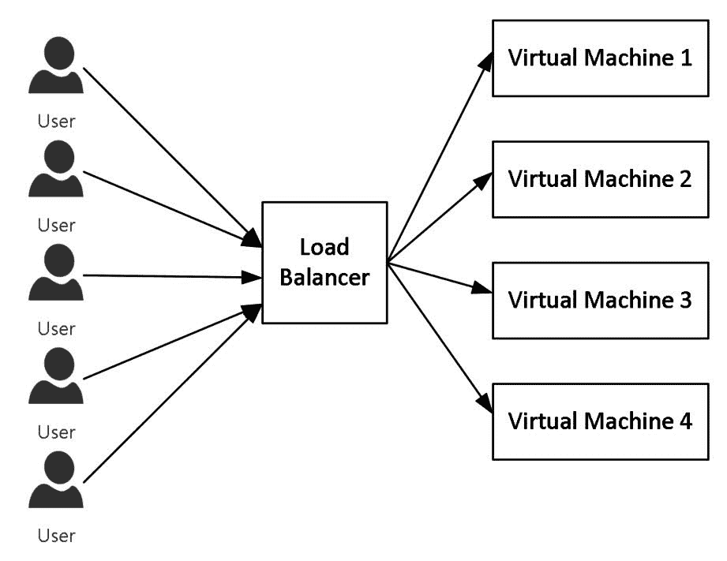
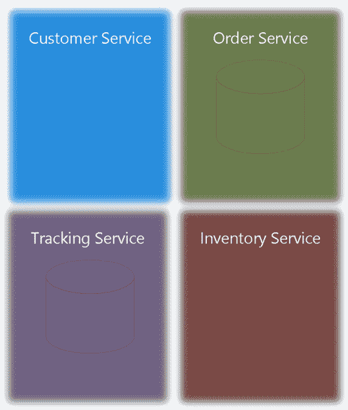
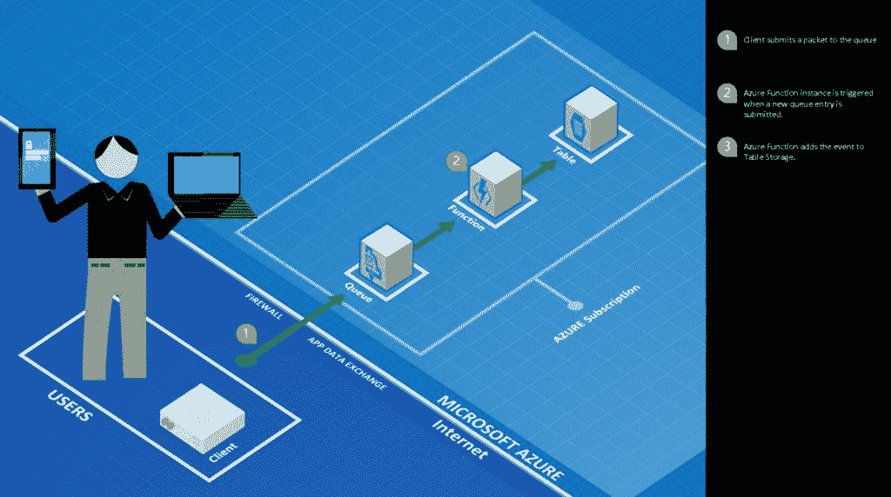
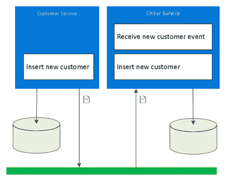
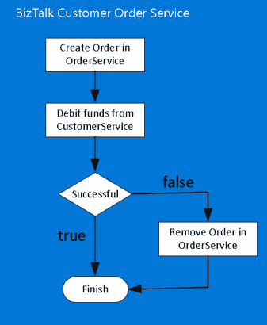
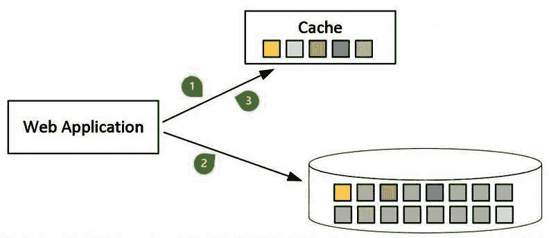
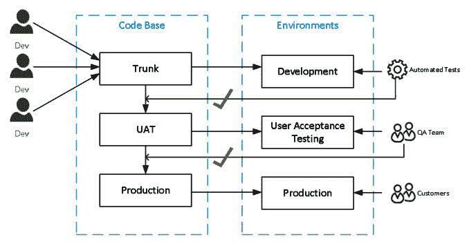

# 第十二章：为云端编码

之前的章节探讨了模式，从较低级别的概念，如单例和工厂模式，到特定技术的模式，如数据库和 Web 应用程序的模式。这些模式对于确保解决方案的良好设计以确保可维护性和高效实施至关重要。这些模式提供了一个坚实的基础，使应用程序能够在需求变化和添加新功能时得到增强和修改。

本章从更高层次的视角来看待解决方案，以解决设计实施可靠、可扩展和安全的问题。本章中的模式通常涉及包含多个应用程序、存储库和各种可能的基础设施配置的环境。

软件行业不断发展，随之而来的是新的机遇和新的挑战。在本章中，我们将探讨云端的不同软件模式。这些模式中许多并非新鲜事物，在本地环境中已经存在。随着云优先解决方案变得普遍，这些模式由于实施不依赖本地基础设施的便利性而变得更加普遍。

云优先或云原生解决方案旨在针对云计算资源，而混合解决方案则旨在同时使用云计算资源和私人数据中心的资源。

本章定义了在构建云端解决方案时的五个关键考虑因素：

+   可扩展性

+   可用性

+   安全性

+   应用设计

+   DevOps

我们将讨论这些关键考虑因素以及它们对构建云解决方案的重要性。随着讨论这些问题，将描述不同的模式，以应对这些问题。

# 技术要求

本章不需要任何特殊的技术要求或源代码，因为它主要是理论性的。

# 在构建云端解决方案时的关键考虑因素

决定转移到云端会带来一系列问题和挑战。在本节中，我们将涵盖构建基于云的解决方案的五个关键考虑领域。虽然这些问题并非云端独有，但在转向云端时需要特别关注，因为有各种技术和解决方案可供选择。

五个主要考虑因素如下：

+   **可扩展性**：这允许适应不断增长的业务的负载或流量。

+   **弹性/可用性**：这确保系统在发生故障时能够优雅地处理，对用户的影响尽可能小。

+   **安全性**：这确保私人和专有数据保持原样，并且免受黑客和攻击的威胁。

+   **应用设计**：这指的是专门考虑云端解决方案的应用设计。

+   **DevOps**：这是一套支持云端解决方案开发和运行的工具和实践集合。

根据您的业务需求，您可能需要寻找一些或所有这些考虑因素的解决方案。对于您的业务来说，采用能够解决您未预料到但会成为良好备用计划的问题的解决方案提供商也是最为有利的。

在接下来的章节中，我们将详细讨论这些考虑因素以及针对它们的可用解决方案模式。

这些模式涵盖了从技术类型到架构和业务流程的各种问题，一个单一模式可能涉及多个问题。

# 可扩展性

可扩展性指的是为了应用程序在给定的工作负载下保持可接受的质量水平而分配和管理资源的能力。大多数云服务提供机制来增加应用程序使用的资源的质量和数量。例如，Azure 应用服务允许扩展应用服务的大小和应用服务的实例数量。

可扩展性可以被视为对有限资源的需求。资源可以是磁盘空间、RAM、带宽或软件的另一个可以量化的方面。需求可以涵盖用户数量、并发连接数量或会对资源产生约束的其他需求。随着需求的增加，应用程序需要提供资源。当需求影响应用程序的性能时，这被称为资源瓶颈。

例如，一个度量标准可能是在应用程序性能开始恶化之前可以访问应用程序的用户数量。性能可以设置为请求的平均延迟小于 2 秒。随着用户数量的增加，可以查看系统的负载，并识别影响性能的特定资源瓶颈。

# 工作负载

为了确定如何有效地解决扩展性问题，了解系统将承受的工作负载是很重要的。有四种主要类型的工作负载：静态、周期性、一次性和不可预测的。

静态工作负载表示系统上的持续活动水平。由于工作负载不波动，这种类型的系统不需要非常弹性的基础设施。

具有可预测工作负载变化的系统具有周期性工作负载。例如，系统在周末或应交所得税的月份周围经历活动激增。这些系统可以进行扩展以在负载增加时保持所需的质量水平，并在负载减少时进行缩减以节省成本。

一次性工作负载表示围绕特定事件设计的系统。这些系统被配置为处理事件周围的工作负载，并在不再需要时取消配置。

不可预测的工作负载通常受益于前面提到的自动扩展功能。这些系统的活动波动很大，要么业务尚未理解，要么受其他因素影响。

理解和设计基于云的应用程序以适应其工作负载类型对于保持高性能水平和降低成本都至关重要。

# 解决方案模式

我们有三种设计模式和一种架构模式可供选择，以使我们的系统具有可扩展性：

+   垂直扩展

+   水平扩展

+   自动扩展

+   微服务

让我们更详细地审查每一种。

# 垂直扩展

虽然可以向本地服务器添加物理 RAM 或额外的磁盘驱动器，但大多数云提供商支持轻松增加或减少系统的计算能力。这通常是在系统扩展时几乎没有或没有停机时间。这种类型的扩展称为垂直扩展，指的是改变资源，如 CPU 类型、RAM 的大小和质量，或磁盘的大小和质量。

垂直扩展通常被称为“扩展”，而水平扩展通常被称为“扩展”。在这种情况下，“扩展”指的是资源的大小，“扩展”指的是实例的数量。

# 水平扩展

水平扩展与垂直扩展不同，因为水平扩展改变的是系统的数量，而不是系统的大小。例如，Web 应用程序可能在一台具有 4GB RAM 和 2 个 CPU 的单个服务器上运行。如果将服务器的大小增加到 8GB RAM 和 4 个 CPU，那么这将是垂直扩展。但是，如果增加了两台具有相同配置的 4GB RAM 和 2 个 CPU 的服务器，那么这将是水平扩展。

水平扩展可以通过使用某种形式的负载平衡来实现，该负载平衡将请求重定向到一组系统，如下图所示：



水平扩展通常比垂直扩展更受云解决方案的青睐。这是因为一般来说，使用多个较小的虚拟机来提供相同性能的服务比使用单个大型服务器更具成本效益。

要使水平扩展最有效，确实需要支持这种类型扩展的系统设计。例如，设计时没有粘性会话和/或状态存储在服务器上的 Web 应用程序更适合水平扩展。这是因为粘性会话会导致用户的请求被路由到同一台虚拟机进行处理，随着时间的推移，虚拟机之间的路由平衡可能变得不均匀，因此效率可能不尽如人意。

有状态应用程序

*有状态*应用程序在服务器或存储库上维护有关活动会话的信息。

无状态应用程序

*无状态*应用程序设计为不需要在服务器或存储库上存储有关活动会话的信息。这允许将单个会话中的后续请求发送到任何服务器进行处理，而不仅仅是发送到整个会话的同一服务器。

有状态的 Web 应用程序需要在共享存储库中维护会话或信息。无状态的 Web 应用程序支持更具弹性的模式，因为 Web garden 或 Web farm 中的任何服务器都可以失败而不会丢失会话信息。

Web *garden*是一种模式，其中同一 Web 应用程序的多个副本托管在同一台服务器上，而 Web *farm*是一种模式，其中同一 Web 应用程序的多个副本托管在不同的服务器上。在这两种模式中，路由用于将多个副本公开为单个应用程序。

# 自动扩展

使用云提供商而不是本地解决方案的优势是内置的自动扩展支持。作为水平扩展的附加好处，自动扩展应用程序的能力通常是云服务的可配置功能。例如，Azure 应用服务提供了设置自动扩展配置文件的功能，允许应用程序对条件做出反应。例如，以下屏幕截图显示了一个自动扩展配置文件：


为工作日设计的配置文件将根据服务器负载增加或减少应用服务实例的数量。负载以 CPU 百分比来衡量。如果 CPU 百分比平均超过 60％，则实例数量增加到最多 10 个。同样，如果 CPU 百分比低于 30％，实例数量将减少到最少 2 个。

弹性基础设施允许资源在不需要重新部署或停机的情况下进行垂直或水平扩展。该术语实际上更多地是弹性程度，而不是指系统是否具有*弹性*或*非弹性*。例如，弹性服务可以允许在不需要重新启动服务实例的情况下进行垂直和水平扩展。较不具弹性的服务可以允许在不重新启动的情况下进行水平扩展，但在更改服务器大小时需要重新启动服务。

# 微服务

对于微服务的含义以及它与面向服务的架构（SOA）的关系有不同的解释。在本节中，我们将微服务视为 SOA 的一种完善，而不是一种新的架构模式。微服务架构通过添加一些额外的关键原则来扩展 SOA，要求服务必须：

+   规模小 - 因此称为*微*

+   围绕业务能力构建

+   与其他服务松散耦合

+   可以独立维护

+   具有隔离状态

# 规模小

微服务将 SOA 中的服务缩小到最小可能的规模。这与我们之前看到的一些其他模式非常契合，比如《保持简单愚蠢》（KISS）和《你不会需要它》（YAGNI）来自[第二章]，*现代软件设计模式和原则*。微服务应该只满足其要求，而不多做其他事情。

# 业务能力

通过围绕业务能力构建服务，我们以一种使得当业务需求发生变化时，我们的服务也会以类似的方式进行变更的方式来实现我们的实现。因此，较少可能会导致业务的一个领域的变化影响其他领域。

# 松散耦合

微服务应该使用技术无关的协议（如 HTTP）跨服务边界与其他服务进行交互。这使得微服务更容易集成，更重要的是，当另一个服务发生变化时，不需要重建微服务。这确实需要存在一个已知的*服务合同*。

服务合同

*服务合同*是分发给其他开发团队的服务定义。Web 服务描述语言（WSDL）是一种广为人知的基于 XML 的描述服务的语言，但其他语言，如 Swagger，也非常流行。

在实施微服务时，重要的是要有一个管理变更的策略。通过具有版本化的服务合同，可以清晰地向服务的客户传达变更。

例如，用于存储图书库存的微服务的策略可能如下：

+   每个服务将被版本化并包括 Swagger 定义。

+   每个服务将从版本 1 开始。

+   当进行需要更改服务合同的更改时，版本将增加 1。

+   服务将维护最多三个版本。

+   对服务的更改必须确保所有当前版本的行为都合适。

前面的基本策略确实有一些有趣的含义。首先，维护服务的团队必须确保更改不会破坏现有服务。这确保了新部署不会破坏其他服务，同时允许部署新功能。合同允许最多同时有三个服务处于活动状态，因此可以独立更新可靠的服务。

# 可以独立维护

这是微服务最显著的特点之一。使得一个微服务能够独立于其他微服务进行维护，使得企业能够在不影响其他服务的情况下管理该服务。通过管理服务，我们既包括服务的开发，也包括服务的部署。根据这一原则，微服务可以更新和部署，减少对其他服务的影响，并且以不同的变化速率进行部署。

# 隔离状态

隔离状态包括数据和其他可能共享的资源，包括数据库和文件。这也是微服务架构的一个显著特点。通过拥有独立的状态，我们减少了支持一个服务的数据模型的变化会影响其他服务的机会。

下图展示了更传统的 SOA 方法，多个服务使用单个数据库：


通过要求微服务具有隔离状态，我们将要求每个服务都有一个数据库，如下图所示：



这样做的好处在于每个服务可以选择最适合服务要求的技术。

# 优势

微服务架构确实代表了传统服务设计的转变，并且它在基于云的解决方案中表现良好。微服务的优势以及它们为什么越来越受欢迎可能并不立即明显。我们已经提到了微服务设计如何提供处理变化的优势。从技术角度来看，微服务可以在服务级别和数据库级别独立扩展。

也许不清楚的是微服务架构对业务的好处。通过拥有小型独立服务，业务可以以不同的方式来维护和开发微服务。业务现在可以选择以不同的方式托管服务，包括不同的云提供商，以最适合独立服务的方式。同样，服务的隔离性允许在开发服务时具有更大的灵活性。随着变化的发生，资源（即开发团队成员）可以根据需要分配到不同的服务，由于服务范围较小，所需的业务知识量也减少了。

# 弹性/可用性

弹性是应用程序处理失败的能力，而可用性是应用程序工作的时间的度量。如果一个应用程序拥有一组资源，并且即使其中一个资源变得无法操作或不可用，它仍然保持可用。

如果一个应用程序被设计成可以处理一个或多个资源失败而不会导致整个系统无法操作，这被称为**优雅降级**。

模式既适用于隔离应用程序的元素，也适用于处理元素之间的交互，以便在发生故障时限制影响。许多与弹性相关的模式侧重于应用程序内部或与其他应用程序之间的消息传递。例如，Bulkhead 模式将流量隔离成池，以便当一个池被压倒或失败时，其他池不会受到不利影响。其他模式应用特定技术来处理消息传递，如重试策略或补偿事务。

可用性对许多基于云的应用程序来说是一个重要因素，通常可用性是根据**服务级别协议**（**SLA**）来衡量的。在大多数情况下，SLA 规定了应用程序必须保持可操作的时间百分比。模式既涉及允许组件冗余，又使用技术来限制活动增加的影响。例如，基于队列的负载平衡模式使用队列来限制活动增加可能对应用程序的影响，充当调用者或客户端与应用程序或服务之间的缓冲。

弹性和可用性被确定为相关的云解决方案因素，因为通常一个具有弹性的应用程序可以实现严格的可用性 SLA。

# 解决方案模式

为了确保我们拥有一个具有弹性和可用性的系统，我们最好寻找一个具有特定架构的提供商。进入**事件驱动架构**（**EDA**）。

EDA 是一种使用*事件*来驱动系统行为和活动的架构模式。它下面提供的解决方案模式将帮助我们实现预期的解决方案。

# EDA

EDA 推广了松散连接的生产者和消费者的概念，其中生产者不直接了解消费者。在这种情况下，事件是指任何变化，从用户登录系统，到下订单，到进程无法成功完成。EDA 非常适合分布式系统，并允许高度可扩展的解决方案。

与 EDA 相关的模式和方法有很多，本节介绍的以下模式与 EDA 直接相关：

+   基于队列的负载平衡

+   发布者-订阅者

+   优先队列

+   补偿事务

# 基于队列的负载平衡

基于队列的负载平衡是一种有效的方式，可以最小化高需求对可用性的影响。通过在客户端和服务之间引入队列，我们能够限制或限制服务一次处理的请求数量。这可以实现更流畅的用户体验。以以下图表为例：



上图显示了客户端向队列提交请求进行处理，并将结果保存到表中。队列可以防止函数被突然的活动激增所压倒。

# 发布者-订阅者

发布者-订阅者模式指出有事件发布者和事件消费者。基本上，这是 EDA 的核心，因为发布者与消费者解耦，不关心将事件传递给消费者，只关心发布事件。事件将包含信息，用于将事件路由到感兴趣的消费者。然后消费者将注册或订阅对特定事件感兴趣：



上图显示了一个客户服务和一个订单服务。客户服务充当发布者，并在添加客户时提交事件。订单服务已订阅了新客户事件。当接收到新客户事件时，订单服务将客户信息插入其本地存储。

通过将发布者-订阅者模式引入架构中，订单服务与客户服务解耦。这样做的一个优点是它为变更提供了更灵活的架构。例如，可以引入一个新服务来向不需要添加到客户服务使用的相同存储库的解决方案添加新客户。此外，可以有多个服务订阅新客户事件。添加欢迎电子邮件可以更容易地作为新的订阅者添加，而不必将此功能构建到单个的单片解决方案中。

# 优先队列

另一个相关的模式是优先队列，它提供了一种处理类似事件的不同机制。使用上一节中的新客户示例，可能会有两个订阅者对新客户事件感兴趣。一个订阅者可能对大多数新客户感兴趣，而另一个订阅者可能会识别应该以不同方式处理的客户子集。例如，来自农村地区的新订阅者可能会收到一封电子邮件，其中包含有关专门的运输提供商的额外信息。

# 补偿事务

在分布式系统中，将命令作为事务发出并不总是切实可行或可取的。在这种情况下，事务是指管理一个或多个命令的较低级别的编程构造，将它们作为单个操作来处理，要么全部成功，要么全部失败。在某些情况下，不支持分布式事务，或者使用分布式事务的开销超过了好处。补偿事务模式是为处理这种情况而开发的。让我们以 BizTalk 协调为例：



该图显示了一个过程中的两个步骤：在订单服务中创建订单和从客户服务中扣款。该图显示了首先创建订单，然后扣除资金。如果资金扣除不成功，则订单将从订单服务中移除。

# 安全

安全确保应用程序不会错误地披露信息或提供超出预期使用范围的功能。安全包括恶意和意外行为。随着云应用程序的增加以及广泛使用各种身份提供者，通常很难将访问权限限制为仅批准的用户。

最终用户身份验证和授权需要设计和规划，因为较少的应用程序是独立运行的，通常会使用多个身份提供者，如 Facebook、Google 和 Microsoft。在某些情况下，模式用于直接为改进性能和可伸缩性而提供对资源的访问。此外，其他模式涉及在客户端和应用程序之间创建虚拟墙壁。

# 解决方案模式

随着行业的日益互联，使用外部方来对用户进行身份验证的模式变得更加普遍。联合安全模式被选择用于讨论，因为它是确保系统安全的最佳方式之一，大多数**软件即服务（SaaS）**平台都提供此功能。

# 联合安全

联合安全将用户或服务（消费者）的身份验证委托给称为**身份提供者**（**IdP**）的外部方。使用联合安全的应用程序将信任 IdP 正确地对消费者进行身份验证并准确提供有关消费者或声明的详细信息。有关消费者的这些信息被呈现为令牌。这种情况的常见场景是使用 Google、Facebook 或 Microsoft 等社交 IdP 的 Web 应用程序。

联合安全可以处理各种场景，从交互式会话到身份验证后端服务或非交互式会话。另一个常见的场景是能够在一套分别托管的应用程序中提供单一的身份验证体验或**单点登录**（**SSO**）。这种情况允许从**安全令牌服务**（**STS**）获取单个令牌，并且在不需要重复登录过程的情况下将相同的令牌用于多个应用程序：


联合安全有两个主要目的。首先，通过拥有单一身份存储库，简化身份管理。这允许以集中和统一的方式管理身份，使得执行管理任务（如提供登录体验、忘记密码管理以及一致地撤销密码）更容易。其次，通过为用户提供类似的体验跨多个应用程序，以及只需要记住单个密码而不是多个密码，提供更好的用户体验。

有几种联合安全标准，其中两种广泛使用的是**安全断言标记语言**（**SAML**）和**OpenId Connect**（**OIDC**）。SAML 比 OIDC 更早，允许使用 XML SAML 格式交换消息。OIDC 建立在 OAuth 2.0 之上，通常使用**JSON Web Token**（**JWT**）来描述安全令牌。这两种格式都支持联合安全、单点登录（SSO），许多公共 IdP（如 Facebook、Google 和 Microsoft）都支持这两种标准。

# 应用程序设计

应用程序的设计可以有很大的变化，并受到许多因素的影响。这些因素不仅仅是技术上的，而且受到参与构建、管理和维护应用程序的团队的影响。例如，一些模式最适合小型专门团队，而不适合较大数量的地理分散的团队。其他与设计相关的模式更好地处理不同类型的工作负载，并在特定场景中使用。其他模式是围绕变更的频率设计的，以及如何限制应用程序发布后的变更中断。

# 解决方案模式

几乎所有的本地模式都适用于基于云的解决方案，可以涵盖的模式范围令人震惊。缓存和 CQRS 模式之所以被选择，是因为前者是大多数 Web 应用程序采用的非常常见的模式，而后者改变了设计者构建解决方案的方式，并且非常适合其他架构模式，如 SOA 和微服务。

# 缓存

将从较慢的存储中检索的信息存储到更快的存储中，或者进行缓存，是几十年来编程中使用的一种技术，可以在浏览器缓存等软件和 RAM 等硬件中看到。在本章中，我们将看到三个例子：缓存旁路、写入穿透缓存和静态内容托管。

# 缓存旁路

缓存旁路模式可以通过在本地或更快的存储中加载频繁引用的数据来提高性能。使用此模式，应用程序负责维护缓存的状态。如下图所示：



首先，应用程序从缓存中请求信息。如果信息丢失，则从数据存储中请求。然后，应用程序使用信息更新缓存。一旦信息存储，它将从缓存中检索并在不引用较慢的数据存储的情况下使用。使用此模式，应用程序负责维护缓存，无论是在缓存未命中时，还是在数据更新时。

术语*缓存未命中*指的是在缓存中找不到数据。换句话说，它在缓存中丢失了。

# 写入穿透缓存

写入穿透缓存模式也可以像缓存旁路模式一样用于提高性能。其方法不同之处在于将缓存内容的管理从应用程序移动到缓存本身，如下图所示：


在缓存中请求一条信息。如果数据尚未加载，则从数据存储中检索信息，将其放入缓存，然后返回。如果数据已经存在，则立即返回。这种模式支持通过缓存服务传递信息的写入来更新缓存。然后，缓存服务更新保存的信息，无论是在缓存中还是在数据存储中。

# 静态内容托管

静态内容托管模式将媒体图像、电影和其他非动态文件等静态内容移动到专门用于快速检索的系统中。这样的专门服务称为**内容传递网络**（**CDN**），它可以管理跨多个数据中心的内容分发，并将请求定向到最接近调用者的数据中心，如下图所示：


静态内容托管是 Web 应用程序的常见模式，其中从 Web 应用程序请求动态页面，页面包含静态内容的集合，例如 JavaScript 和图像，然后浏览器直接从 CDN 中检索。这是减少 Web 应用程序流量的有效方法。

# 命令和查询责任分离

**命令和查询职责分离**（CQRS）是一个很好的软件模式，我们将在更多细节上讨论它，因为它在概念上很简单，相对容易实现，但对应用程序和涉及的开发人员有着巨大的影响。该模式清晰地将影响应用程序状态的命令与仅检索数据的查询分开。简而言之，更新、添加和删除等命令在不同的服务中提供，而不会改变任何数据的查询则在不同的服务中提供。

你可能会说*又是 CQRS*！我们意识到我们在面向对象编程和数据库设计中使用了 CQRS 的示例。同样的原则也适用于软件开发的许多领域。我们在本节中提出 CQRS 作为服务设计的一种模式，因为它带来了一些有趣的好处，并且与微服务和反应式应用程序设计等现代模式非常契合。

CQRS 基于贝尔特兰·梅耶（Bertrand Meyer）在上世纪 80 年代末出版的《面向对象的软件构造》一书中提出的面向对象设计：[`se.ethz.ch/~meyer/publications/`](http://se.ethz.ch/~meyer/publications/)。

如果我们重新访问第五章：*实现设计模式-.NET Core*，我们通过将库存上下文拆分为两个接口：`IInventoryReadContext`和`IInventoryWriteContext`来说明这种模式。作为提醒，这些是接口：

```cs
public interface IInventoryContext : IInventoryReadContext, IInventoryWriteContext { }

public interface IInventoryReadContext
{
    Book[] GetBooks();
}

public interface IInventoryWriteContext
{
    bool AddBook(string name);
    bool UpdateQuantity(string name, int quantity);
}
```

正如我们所看到的，`GetBooks`方法与修改库存状态的`AddBook`和`UpdateQuantity`方法分开。这在代码解决方案中展示了 CQRS。

相同的方法也可以应用在服务层。举例来说，如果我们使用一个用于维护库存的服务，我们会将服务分为一个用于更新库存的服务和另一个用于检索库存的服务。下图展示了这一点：


让我们首先通过探讨 CQRS 来看看在基于云的解决方案中应用时所面临的挑战。

# CQRS 的挑战

使用 CQRS 模式的挑战很大：

+   一致性

+   采用

陈旧性是数据反映已提交数据版本的程度。在大多数情况下，数据可能会发生变化，因此，一旦读取了一部分数据，就有可能更新数据，使读取的数据与源数据不一致。这是所有分布式系统都面临的挑战，因为不可能保证向用户显示的值反映源值。当数据直接反映存储的内容时，我们可以称数据是一致的；当数据不是这样时，就被视为不一致。

在分布式系统中常用的一个术语是*最终一致性*。最终一致性用于表示系统最终会变得一致。换句话说，它最终会变得一致。

另一个更微妙的挑战是采用。将 CQRS 引入已建立的开发团队可能会遇到抵制，无论是来自不熟悉该模式的开发人员和设计师，还是来自业务方面对偏离当前设计模式的支持不足。

那么有什么好处呢？

# 为什么选择 CQRS？

以下是使用 CQRS 的三个引人注目的因素：

+   **协作**

+   **模型分离**

+   **独立扩展性**

通过分开的服务，我们可以独立地维护、部署和扩展这些服务。这增加了开发团队之间可以实现的协作水平。

通过拥有独立的服务，我们可以使用最适合我们服务的模型。命令服务可能直接使用简单的 SQL 语句针对数据库，因为这是负责团队最熟悉的技术，而构建查询服务的团队可能会使用一个处理复杂语句针对数据库的框架。

大多数解决方案往往具有更高的读取量而不是写入量（或反之），因此根据这一标准将服务进行拆分在许多情况下是有意义的。

# DevOps

通过基于云的解决方案，数据中心是远程托管的，通常您无法完全控制或访问应用程序的所有方面。在某些情况下，例如无服务器服务，基础架构被抽象化了。应用程序仍然必须公开有关运行应用程序的信息，以便用于管理和监视应用程序。用于管理和监视的模式对于应用程序的成功至关重要，因为它们既能够保持应用程序的健康运行，又能够为业务提供战略信息。

# 解决方案模式

随着与监控和管理解决方案相关的商业软件包的可用性，许多企业已经更好地控制和了解了他们的分布式系统。遥测和持续交付/持续集成已被选择进行更详细的覆盖，因为它们在基于云的解决方案中具有特殊价值。

# 遥测

随着软件行业的发展和分布式系统涉及更多的服务和应用程序，能够对系统进行集体和一致的视图已经成为一项巨大的资产。由 New Relic 和 Microsoft Application Insights 等服务推广，应用程序性能管理（APM）系统使用记录的有关应用程序和基础设施的信息，即遥测，来监视、管理性能和查看系统的可用性。在基于云的解决方案中，通常无法或不实际直接访问系统的基础设施，APM 允许将遥测发送到中央服务，然后呈现给运营和业务，如下图所示：


上图摘自 Microsoft Application Insights，提供了一个正在运行的 Web 应用程序的高层快照。一眼就可以看出，运营人员可以识别系统行为的变化并做出相应反应。

# 持续集成/持续部署

持续集成/持续部署（CI/CD）是一种现代开发流程，旨在通过频繁合并更改并经常部署这些更改来简化软件交付产品生命周期。CI 解决了企业软件开发中出现的问题，即多个程序员正在同一代码库上工作，或者单个产品由多个代码分支管理。

看一下下面的图表：



在上面的示例中，有三个目标环境：开发、用户验收测试（UAT）和生产。开发环境是最初的环境，所有对应用程序的更改都在此进行测试。UAT 环境由质量保证（QA）团队用于在将更改移至面向客户的环境之前验证系统是否按预期工作，如图中所示的生产环境。代码库已分为三个匹配的分支：主干，开发团队将所有更改合并到其中，UAT 用于部署到 UAT 环境，生产代码库用于部署到生产环境。

CI 模式是通过在代码库更改时创建新构建来应用的。成功构建后，会对构建运行一系列单元测试，以确保现有功能未被破坏。如果构建不成功，开发团队会进行调查，然后修复代码库或单元测试，使构建通过。

成功的构建然后被推送到目标环境。主干可能被设置为每天自动将新构建推送到集成环境，而 QA 团队要求环境中的干扰更少，因此新构建仅在办公时间结束后每周推送一次。生产可能需要手动触发以协调新版本的发布，以宣布新功能和错误修复的正式发布。

关于“持续部署”和“持续交付”这两个术语存在混淆。许多来源区分这两个术语，即部署过程是自动化的还是手动的。换句话说，持续部署需要自动化的持续交付。

导致环境之间合并的触发器，从而推送到环境中进行构建，或者发布，可能会有所不同。在我们对开发环境的示例中，有一组自动化测试会自动运行对新构建进行测试。如果测试成功，那么就会自动从主干合并到 UAT 代码库。只有在 QA 团队在 UAT 环境中签署或接受更改后，才会在 UAT 和生产代码库之间执行合并。

每个企业都会根据其特定的 SDLC 和业务需求来定制 CI/CD 流程。例如，一个面向公众的网站可能需要快速的 SDLC 以保持市场竞争力，而内部应用可能需要更保守的方法，以限制由于功能变更而导致的员工培训。

尽管如此，已经开发了一套工具套件来管理组织内的 CI/CD 流程。例如，Azure DevOps 可以通过允许构建管道来处理构建何时创建以及何时发布到环境中，包括手动和自动触发器。

# 总结

云开发需要仔细的规划、维护和监控，模式可以帮助实现高度可扩展、可靠和安全的解决方案。本章讨论的许多模式适用于本地应用程序，并且在云解决方案中至关重要。云优先应用程序的设计应考虑许多因素，包括可扩展性、可用性、维护、监控和安全性。

可扩展的应用程序允许在系统负载波动时保持可接受的性能水平。负载可以通过用户数量、并发进程、数据量和软件中的其他因素来衡量。横向扩展解决方案的能力需要特定类型的应用程序开发，并且是云计算中特别重要的范例。诸如基于队列的负载平衡之类的模式是确保解决方案在负载增加时保持响应的重要技术。

本章涵盖的许多模式是互补的。例如，遵循命令和查询责任分离的应用程序可能利用联合安全来提供单一登录体验，并使用事件驱动架构来处理应用程序不同组件之间的一致性。

在基于云的解决方案中，有一个几乎无穷无尽的适用模式集合，用于解决分布式系统中的不同挑战。本章介绍的模式代表了因其广度以及它们如何相互补充而被选择的一部分。请参阅参考资料，以探索适用于基于云的解决方案的其他模式。

多么不容易啊！我们已经涵盖了从面向对象编程中使用的软件设计模式到基于云的解决方案中使用的架构模式，再到用于构建成功应用程序的更高效团队和模式。尽管我们尽力涵盖了各种模式，但肯定还有一些模式可能本该被添加进来。

谢谢，Gaurav 和 Jeffrey，希望您喜欢并从阅读*使用 C#和.NET Core 进行设计模式实践*中获得了一些收获。请告诉我们您的想法，并与我们分享您最喜欢的模式。

# 问题

以下问题将让您巩固本章中包含的信息：

1.  大多数模式是最近开发的，只适用于基于云的应用程序。真还是假？

1.  ESB 代表什么，并且可以在哪种类型的架构中使用：EDA、SOA 还是单片？

1.  队列负载平衡主要用于 DevOps、可伸缩性还是可用性？

1.  CI/CD 的好处是什么？在全球分散的大量团队还是一个小型的本地开发团队中，它会更有益？

1.  在遵循静态内容托管的网站中，浏览器是直接通过 CDN 检索图像和静态内容，还是 Web 应用程序代表浏览器检索信息？

# 进一步阅读

要了解本章涵盖的主题，请参考以下书籍。这些书籍将为您提供有关本章涵盖的各种主题的深入和实践性练习：

+   *Azure 无服务器计算食谱*，作者*Praveen Kumar Sreeram*，由*Packt Publishing*出版：[`www.packtpub.com/in/virtualization-and-cloud/azure-serverless-computing-cookbook`](https://www.packtpub.com/in/virtualization-and-cloud/azure-serverless-computing-cookbook)

+   *使用 Azure 的微服务*，作者*Namit Tanasseri*和*Rahul Rai*，由*Packt Publishing*出版：[`www.packtpub.com/in/virtualization-and-cloud/microservices-azure`](https://www.packtpub.com/in/virtualization-and-cloud/microservices-azure)

+   *面向开发人员的 Azure 实践*，作者*Kamil Mrzygłód*，由*Packt Publishing*出版：[`www.packtpub.com/virtualization-and-cloud/hands-azure-developers`](https://www.packtpub.com/virtualization-and-cloud/hands-azure-developers)

+   *使用.NET Core 2.0 构建微服务-第二版*，作者*Gaurav Aroraa*，由*Packt Publishing*出版：[`www.packtpub.com/application-development/building-microservices-net-core-20-second-edition`](https://www.packtpub.com/application-development/building-microservices-net-core-20-second-edition)。
