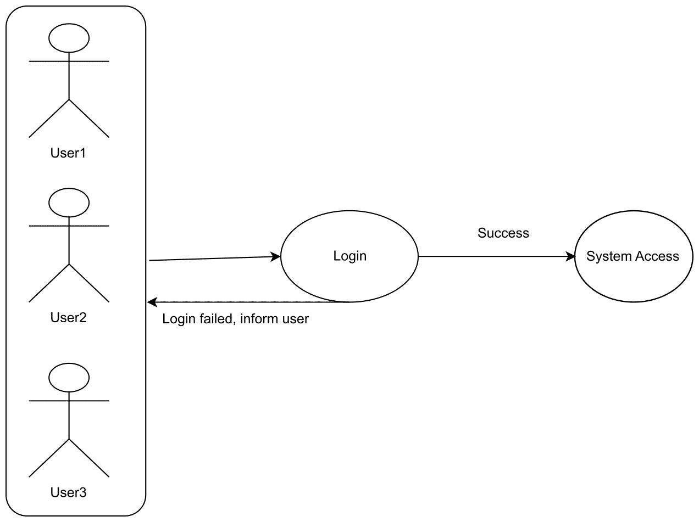

# 第十三章：其他最佳实践

到目前为止，我们已经讨论了各种模式、风格和代码。在这些讨论中，我们的目标是理解编写整洁、清晰和健壮代码的模式和实践。本附录主要将专注于实践。实践对于遵守任何规则或任何编码风格都非常重要。作为开发人员，您应该每天练习编码。根据古老的谚语，*熟能生巧*。

这表明技能，比如玩游戏、开车、阅读或写作，并不是一下子就能掌握的。相反，我们应该随着时间和实践不断完善这些技能。例如，当你开始学开车时，你会慢慢来。你需要记住何时踩离合器，何时踩刹车，转动方向盘需要多远，等等。然而，一旦司机熟悉了开车，就不需要记住这些步骤了；它们会自然而然地出现。这是因为实践。

在本附录中，我们将涵盖以下主题：

+   用例讨论

+   最佳实践

+   其他设计模式

# 技术要求

本附录包含各种代码示例，以解释所涵盖的概念。代码保持简单，仅用于演示目的。本章中的大多数示例涉及使用 C#编写的.NET Core 控制台应用程序。

要运行和执行代码，需要满足以下先决条件：

+   Visual Studio 2019（但是，您也可以使用 Visual Studio 2017 运行应用程序）

# 安装 Visual Studio

要运行本章中包含的代码示例，您需要安装 Visual Studio 或更高版本。请按照以下说明操作：

1.  从以下下载链接下载 Visual Studio：[`docs.microsoft.com/en-us/visualstudio/install/install-visual-studio`](https://docs.microsoft.com/en-us/visualstudio/install/install-visual-studio)。

1.  按照安装说明操作。

1.  Visual Studio 有多个版本可供选择。我们正在使用 Windows 版的 Visual Studio。

本章的示例代码文件可在以下链接找到：[`github.com/PacktPublishing/Hands-On-Design-Patterns-with-C-and-.NET-Core/tree/master/Appendix`](https://github.com/PacktPublishing/Hands-On-Design-Patterns-with-C-and-.NET-Core/tree/master/Appendix)。

# 用例讨论

简而言之，用例是业务场景的预创建或符号表示。例如，我们可以用图示/符号表示来表示我们的登录页面用例。在我们的例子中，用户正在尝试登录系统。如果登录成功，他们可以进入系统。如果失败，系统会通知用户登录尝试失败。参考以下**登录**用例的图表：



在上图中，用户称为**User1**、**User2**和**User3**正在尝试使用应用程序的登录功能进入系统。如果登录尝试成功，用户可以访问系统。如果不成功，应用程序会通知用户登录失败，用户无法访问系统。上图比我们实际的冗长描述要清晰得多，我们在描述这个图表。图表也是不言自明的。

# UML 图

在前一节中，我们用符号表示来讨论了登录功能。您可能已经注意到了图表中使用的符号。在前一个图表中使用的符号或符号是统一建模语言的一部分。这是一种可视化我们的程序、软件甚至类的方式。

UML 中使用的符号或符号已经从 Grady Booch、James Rumbaugh、Ivar Jacobson 和 Rational Software Corporation 的工作中发展而来。

# UML 图的类型

这些图表分为两个主要组：

+   **结构化 UML 图**：这些强调了系统建模中必须存在的事物。该组进一步分为以下不同类型的图表：

+   类图

+   包图

+   对象图

+   组件图

+   组合结构图

+   部署图

+   **行为 UML 图**：用于显示系统功能，包括用例、序列、协作、状态机和活动图。该组进一步分为以下不同类型的图表：

+   活动图

+   序列图

+   用例图

+   状态图

+   通信图

+   交互概述图

+   时序图

# 最佳实践

正如我们所建立的，实践是我们日常活动中发生的习惯。在软件工程中——在这里软件是被设计而不是制造的——我们必须练习以编写高质量的代码。在软件工程中可能有更多解释最佳实践的要点。让我们讨论一下：

+   **简短但简化的代码**：这是一个非常基本的事情，需要练习。开发人员应该每天使用简短但简化的代码来编写简洁的代码，并在日常生活中坚持这种实践。代码应该清晰，不重复。清晰的代码和代码简化在前几章已经涵盖过；如果您错过了这个主题，请重新查看第二章，*现代软件设计模式和原则*。看一下以下简洁代码的示例：

```cs
public class Math
{
    public int Add(int a, int b) => a + b;
    public float Add(float a, float b) => a + b;
    public decimal Add(decimal a, decimal b) => a + b;
}
```

前面的代码片段包含一个`Math`类，其中有三个`Add`方法。这些方法被编写来计算两个整数的和以及两个浮点数和十进制数的和。`Add(float a, float b)`和`Add(decimal a, decimal b)`方法是`Add(int a, int b)`的重载方法。前面的代码示例代表了一个场景，其中要求是制作一个具有 int、float 或 decimal 数据类型输出的单个方法。

+   **单元测试**：这是开发的一个组成部分，当我们想要通过编写代码来测试我们的代码时。**测试驱动开发**（**TDD**）是一个应该遵循的最佳实践。我们已经在第七章中讨论了 TDD，*为 Web 应用程序实现设计模式-第二部分*。

+   **代码一致性**：如今，开发人员很少有机会独自工作。开发人员大多在团队中工作，这意味着团队中的代码一致性非常重要。代码一致性可以指代码风格。在编写程序时，开发人员应该经常使用一些推荐的实践和编码转换。

声明变量的方法有很多种。以下是变量声明的最佳示例之一：

```cs
namespace Implement
{
    public class Consume
    {
        BestPractices.Math math = new BestPractices.Math();
    }
}
```

在前面的代码中，我们声明了一个`math`变量，类型为`BestPractices.Math`。这里，`BestPractices`是我们的命名空间，`Math`是类。如果在代码中没有使用`using`指令，那么完全命名空间限定的变量是一个很好的实践。

C#语言的官方文档非常详细地描述了这些约定。您可以在这里参考：[`docs.microsoft.com/en-us/dotnet/csharp/programming-guide/inside-a-program/coding-conventions`](https://docs.microsoft.com/en-us/dotnet/csharp/programming-guide/inside-a-program/coding-conventions)。

+   **代码审查**：犯错误是人的天性，这也会发生在开发中。代码审查是练习编写无错代码和发现代码中不可预测错误的第一步。

# 其他设计模式

到目前为止，我们已经涵盖了各种设计模式和原则，包括编写代码的最佳实践。本节将总结以下模式，并指导您编写高质量和健壮的代码。这些模式的详细信息和实现超出了本书的范围。

我们已经涵盖了以下模式：

+   GoF 模式

+   设计原则

+   软件开发生命周期模式

+   测试驱动开发

在本书中，我们涵盖了许多主题，并开发了一个示例应用程序（控制台和 Web）。这不是世界的尽头，世界上还有更多的东西可以学习。

我们可以列出更多的模式：

+   **基于空间的架构模式**：**基于空间的模式**（**SBP**）是通过最小化限制应用程序扩展的因素来帮助应用程序可扩展性的模式。这些模式也被称为**云架构模式**。我们在第十二章中已经涵盖了其中的许多内容，*云编程*。

+   **消息模式**：这些模式用于基于消息的连接两个应用程序（以数据包的形式发送）。这些数据包或消息使用逻辑路径进行传输，各种应用程序连接在这些逻辑路径上（这些逻辑路径称为通道）。可能存在一种情况，其中一个应用程序有多个消息；在这种情况下，不是所有消息都可以一次发送。在存在多个消息的情况下，一个通道可以被称为队列，并且可以在通道中排队多个消息，并且可以在同一时间点从各种应用程序中访问。

+   **领域驱动设计的其他模式-分层架构**：这描述了关注点的分离，分层架构的概念就是从这里来的。在幕后，开发应用程序的基本思想是应该将其结构化为概念层。一般来说，应用程序有四个概念层：

+   **用户界面**：这一层包含了用户最终交互的所有内容，这一层接受命令，然后相应地提供信息。

+   **应用层**：这一层更多地涉及事务管理、数据转换等。

+   **领域层**：这一层专注于领域的行为和状态。

+   **基础设施层**：与存储库、适配器和框架相关的所有内容都在这里发生。

+   **容器化应用模式**：在我们深入研究之前，我们应该知道容器是什么。容器是轻量级、便携的软件；它定义了软件可以运行的环境。通常，运行在容器内的软件被设计为单一用途的应用程序。对于容器化应用程序，最重要的模式如下：

+   **Docker 镜像构建模式**：这种模式基于 GoF 设计模式中的生成器模式，我们在第三章中讨论过，*实现设计模式-基础部分 1*。它只描述了设置，以便用于构建容器。除此之外，还有一种多阶段镜像构建模式，可以从单个 Dockerfile 构建多个镜像。

# 总结

本附录的目的是强调实践的重要性。在本章中，我们讨论了如何通过实践提高我们的技能。一旦我们掌握了这些技能，就不需要记住实现特定任务的步骤。我们涵盖并讨论了一些来自现实世界的用例，讨论了我们日常代码的最佳实践，以及可以在我们日常实践中使用的其他设计模式，以提高我们的技能。最后，我们结束了本书的最后一章，并了解到通过实践和采用各种模式，开发人员可以提高其代码质量。

# 问题

以下问题将帮助您巩固本附录中包含的信息：

1.  什么是实践？从我们的日常生活和例行公事中举几个例子。

1.  我们可以通过实践获得特定的编码技能。解释一下。

1.  什么是测试驱动开发，它如何帮助开发人员进行实践？

# 进一步阅读

我们几乎已经到达了本书的结尾！在这个附录中，我们涵盖了许多与实践相关的内容。这并不是学习的终点，而只是一个开始，您还可以参考更多的书籍来进行学习和知识积累：

+   《.NET Core 领域驱动设计实战》由 Alexey Zimarev 撰写，由 Packt Publishing 出版：[`www.packtpub.com/in/application-development/hands-domain-driven-design-net-core`](https://www.packtpub.com/in/application-development/hands-domain-driven-design-net-core)。

+   《C#和.NET Core 测试驱动开发》，由 Ayobami Adewole 撰写，由 Packt Publishing 出版：[`www.packtpub.com/in/application-development/c-and-net-core-test-driven-development`](https://www.packtpub.com/in/application-development/c-and-net-core-test-driven-development)。

+   《架构模式》，由 Pethuru Raj, Harihara Subramanian 等人撰写，由 Packt Publishing 出版：[`www.packtpub.com/in/application-development/architectural-patterns`](https://www.packtpub.com/in/application-development/architectural-patterns)。

+   《并发模式和最佳实践》，由 Atul S. Khot 撰写，由 Packt Publishing 出版：[`www.packtpub.com/in/application-development/concurrent-patterns-and-best-practices`](https://www.packtpub.com/in/application-development/concurrent-patterns-and-best-practices)。
